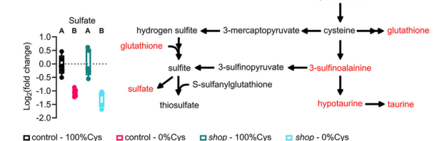

## Question

# Gene Research for Functional Annotation

## ⚠️ CRITICAL: Gene/Protein Identification Context

**BEFORE YOU BEGIN RESEARCH:** You MUST verify you are researching the CORRECT gene/protein. Gene symbols can be ambiguous, especially for less well-characterized genes from non-model organisms.

### Target Gene/Protein Identity (from UniProt):
- **UniProt Accession:** Q9VZF6
- **Protein Description:** RecName: Full=Sulfide:quinone oxidoreductase, mitochondrial {ECO:0000256|ARBA:ARBA00070160}; EC=1.8.5.8 {ECO:0000256|ARBA:ARBA00066447}; AltName: Full=Sulfide quinone oxidoreductase {ECO:0000256|ARBA:ARBA00082958};
- **Gene Information:** Name=Sqor {ECO:0000313|EMBL:AAF47867.1, ECO:0000313|FlyBase:FBgn0035515}; Synonyms=BcDNA:GH04863 {ECO:0000313|EMBL:AAF47867.1}, Dmel\CG14997 {ECO:0000313|EMBL:AAF47867.1}; ORFNames=CG14997 {ECO:0000313|EMBL:AAF47867.1, ECO:0000313|FlyBase:FBgn0035515}, Dmel_CG14997 {ECO:0000313|EMBL:AAF47867.1};
- **Organism (full):** Drosophila melanogaster (Fruit fly).
- **Protein Family:** Belongs to the SQRD family.
- **Key Domains:** FAD/NAD-bd_sf. (IPR036188); FAD/NAD-binding_dom. (IPR023753); Sulphide_quinone_reductase. (IPR015904); Pyr_redox_2 (PF07992)

### MANDATORY VERIFICATION STEPS:

1. **Check if the gene symbol "Sqor" matches the protein description above**
2. **Verify the organism is correct:** Drosophila melanogaster (Fruit fly).
3. **Check if protein family/domains align with what you find in literature**
4. **If you find literature for a DIFFERENT gene with the same or similar symbol, STOP**

### If Gene Symbol is Ambiguous or You Cannot Find Relevant Literature:

**DO NOT PROCEED WITH RESEARCH ON A DIFFERENT GENE.** Instead:
- State clearly: "The gene symbol 'Sqor' is ambiguous or literature is limited for this specific protein"
- Explain what you found (e.g., "Found extensive literature on a different gene with the same symbol in a different organism")
- Describe the protein based ONLY on the UniProt information provided above
- Suggest that the protein function can be inferred from domain/family information

### Research Target:

Please provide a comprehensive research report on the gene **Sqor** (gene ID: Sqor, UniProt: Q9VZF6) in DROME.

The research report should be a detailed narrative explaining the function, biological processes, and localization of the gene product. Citations should be given for all claims.

You should prioritize authoritative reviews and primary scientific literature when conducting research. You can supplement
this with annotations you find in gene/protein databases, but these can be outdated or inaccurate.

We are specifically interested in the primary function of the gene - for enzymes, what reaction is catalyzed, and what is the substrate specificity? For transporters, what is the substrate? For structural proteins or adapters, what is the broader structural role? For signaling molecules, what is the role in the pathway.

We are interested in where in or outside the cell the gene product carries out its function.

We are also interested in the signaling or biochemical pathways in which the gene functions. We are less interested in broad pleiotropic effects, except where these elucidate the precise role.

Include evidence where possible. We are interested in both experimental evidence as well as inference from structure, evolution, or bioinformatic analysis. Precise studies should be prioritized over high-throughput, where available.

## Output

Question: You are an expert researcher providing comprehensive, well-cited information.

Provide detailed information focusing on:
1. Key concepts and definitions with current understanding
2. Recent developments and latest research (prioritize 2023-2024 sources)
3. Current applications and real-world implementations
4. Expert opinions and analysis from authoritative sources
5. Relevant statistics and data from recent studies

Format as a comprehensive research report with proper citations. Include URLs and publication dates where available.
Always prioritize recent, authoritative sources and provide specific citations for all major claims.

# Gene Research for Functional Annotation

## ⚠️ CRITICAL: Gene/Protein Identification Context

**BEFORE YOU BEGIN RESEARCH:** You MUST verify you are researching the CORRECT gene/protein. Gene symbols can be ambiguous, especially for less well-characterized genes from non-model organisms.

### Target Gene/Protein Identity (from UniProt):
- **UniProt Accession:** Q9VZF6
- **Protein Description:** RecName: Full=Sulfide:quinone oxidoreductase, mitochondrial {ECO:0000256|ARBA:ARBA00070160}; EC=1.8.5.8 {ECO:0000256|ARBA:ARBA00066447}; AltName: Full=Sulfide quinone oxidoreductase {ECO:0000256|ARBA:ARBA00082958};
- **Gene Information:** Name=Sqor {ECO:0000313|EMBL:AAF47867.1, ECO:0000313|FlyBase:FBgn0035515}; Synonyms=BcDNA:GH04863 {ECO:0000313|EMBL:AAF47867.1}, Dmel\CG14997 {ECO:0000313|EMBL:AAF47867.1}; ORFNames=CG14997 {ECO:0000313|EMBL:AAF47867.1, ECO:0000313|FlyBase:FBgn0035515}, Dmel_CG14997 {ECO:0000313|EMBL:AAF47867.1};
- **Organism (full):** Drosophila melanogaster (Fruit fly).
- **Protein Family:** Belongs to the SQRD family.
- **Key Domains:** FAD/NAD-bd_sf. (IPR036188); FAD/NAD-binding_dom. (IPR023753); Sulphide_quinone_reductase. (IPR015904); Pyr_redox_2 (PF07992)

### MANDATORY VERIFICATION STEPS:

1. **Check if the gene symbol "Sqor" matches the protein description above**
2. **Verify the organism is correct:** Drosophila melanogaster (Fruit fly).
3. **Check if protein family/domains align with what you find in literature**
4. **If you find literature for a DIFFERENT gene with the same or similar symbol, STOP**

### If Gene Symbol is Ambiguous or You Cannot Find Relevant Literature:

**DO NOT PROCEED WITH RESEARCH ON A DIFFERENT GENE.** Instead:
- State clearly: "The gene symbol 'Sqor' is ambiguous or literature is limited for this specific protein"
- Explain what you found (e.g., "Found extensive literature on a different gene with the same symbol in a different organism")
- Describe the protein based ONLY on the UniProt information provided above
- Suggest that the protein function can be inferred from domain/family information

### Research Target:

Please provide a comprehensive research report on the gene **Sqor** (gene ID: Sqor, UniProt: Q9VZF6) in DROME.

The research report should be a detailed narrative explaining the function, biological processes, and localization of the gene product. Citations should be given for all claims.

You should prioritize authoritative reviews and primary scientific literature when conducting research. You can supplement
this with annotations you find in gene/protein databases, but these can be outdated or inaccurate.

We are specifically interested in the primary function of the gene - for enzymes, what reaction is catalyzed, and what is the substrate specificity? For transporters, what is the substrate? For structural proteins or adapters, what is the broader structural role? For signaling molecules, what is the role in the pathway.

We are interested in where in or outside the cell the gene product carries out its function.

We are also interested in the signaling or biochemical pathways in which the gene functions. We are less interested in broad pleiotropic effects, except where these elucidate the precise role.

Include evidence where possible. We are interested in both experimental evidence as well as inference from structure, evolution, or bioinformatic analysis. Precise studies should be prioritized over high-throughput, where available.

# Functional annotation report: *Drosophila melanogaster Sqor* (Q9VZF6)

## Identity and strength of evidence

The gene symbol **Sqor** is used here exclusively for the *D. melanogaster* gene **CG14997** (FlyBase **FBgn0035515**) and its UniProt protein **Q9VZF6**—not for human *SQOR*, nematode *sqrd-1*, or the fly sulfite-oxidase gene *shop*. The accession-to-locus assignment, mitochondrial description, EC **1.8.5.8**, SQRD-family membership, and FAD-binding and sulfide:quinone-oxidoreductase domains are supplied in the question’s UniProt annotation; I did not independently confirm that database record. The assigned protein family is consistent with the FAD-dependent SQOR enzyme family described in the biochemical literature. **Literature on this specific fly protein is limited:** the strongest located fly-specific observation is a change in *Sqor* transcript abundance under altered sulfur metabolism, rather than a direct assay of its protein or reaction. Accordingly, the catalytic and subcellular assignments below are **ortholog- and domain-based functional inferences**, not experimentally established properties of Q9VZF6. [UniProt record](https://www.uniprot.org/uniprotkb/Q9VZF6/entry); [FlyBase locus](https://flybase.org/reports/FBgn0035515.html). (landry2021hydrogensulfideoxidation pages 5-7, martelli2024identifyingpotentialdietary pages 6-8)

## Predicted primary reaction and substrate specificity

The best-supported functional annotation is **mitochondrial sulfide oxidation linked to the ubiquinone pool**. For experimentally characterized human SQOR, sulfide (H₂S/HS⁻) supplies electrons to enzyme-bound **FAD**, which reduces ubiquinone (**CoQ**) to ubiquinol. A separate acceptor receives the oxidized sulfane sulfur. With reduced glutathione (**GSH**) as that acceptor, the proposed net reaction is **H₂S + GSH + CoQ → glutathione persulfide (GSSH) + CoQH₂**; sulfite can instead accept the sulfur to form **thiosulfate**. CoQ is therefore the **electron acceptor**, whereas GSH or sulfite is a **sulfur acceptor**. This distinction matters: the enzyme is not a sulfite oxidase, and neither cysteine catabolism nor glutathione reduction should be assigned as its primary reaction. The corresponding reaction has **not** been measured with purified fly CG14997. [Landry, Ballou and Banerjee, *ChemBioChem*, 2021](https://doi.org/10.1002/cbic.202000661). (landry2021hydrogensulfideoxidation pages 9-11, landry2021hydrogensulfideoxidation pages 5-7, landry2021hydrogensulfideoxidation pages 7-9)

Human SQOR illustrates why sulfur-acceptor specificity must be stated cautiously. Its reported catalytic efficiency is approximately **2 × 10⁶ M⁻¹ s⁻¹ for sulfite**, versus **1.1 × 10⁴ M⁻¹ s⁻¹ for GSH** *in vitro*. Nevertheless, cellular GSH is reported at approximately **1–10 mM**, while sulfite is generally scarce relative to the enzyme’s reported sulfite **Kₘ of 260 ± 30 μM**; concentration-aware kinetic modeling therefore predicts **GSH as the predominant physiological acceptor**. The revised human GSH **Kₘ is 8 ± 1 mM**. These are **human-enzyme values and model-based physiological conclusions**, not measured fly constants or proof that GSH predominates in every fly tissue. Alternative nucleophiles can also interact with human SQOR, sometimes forming unproductive complexes; this does not establish their use as normal substrates by fly Sqor. [Landry and colleagues, 2021](https://doi.org/10.1002/cbic.202000661). (landry2021hydrogensulfideoxidation pages 9-11)

## Localization and biochemical pathway

**Mitochondrial localization is the supplied annotation for Q9VZF6; its precise topology remains unverified in flies.** Characterized human SQOR is associated with the **inner mitochondrial membrane**, using C-terminal amphipathic helices for anchoring, while its sulfide-accessible catalytic cavity faces the **mitochondrial matrix**. A corresponding inner-membrane, matrix-facing position is a plausible—but currently unconfirmed—working model for the fly protein. The FAD/NAD-binding domain annotation supports a flavoprotein fold; it does **not**, by itself, establish that NADH or NADPH is the enzyme’s physiological electron donor. [Landry and colleagues, 2021](https://doi.org/10.1002/cbic.202000661). (landry2021hydrogensulfideoxidation pages 5-7, landry2021hydrogensulfideoxidation pages 7-9)

In the characterized mammalian pathway, SQOR catalyzes the **first committed step of sulfide oxidation**. Its CoQH₂ product supplies electrons to respiratory **complex III**, linking sulfide disposal to mitochondrial electron transport. SQOR-produced GSSH can be oxidized by the persulfide dioxygenase **ETHE1** to sulfite while regenerating GSH; **TST/rhodanese** can instead transfer sulfur from GSSH to sulfite to make thiosulfate. **Sulfite oxidase (SUOX)** converts sulfite to sulfate and, in the described mammalian system, resides in the mitochondrial intermembrane space. This is a mechanistic map for interpreting fly Sqor, **not evidence that every downstream reaction or physical coupling has been demonstrated for CG14997**. By clearing excess sulfide, the pathway is expected to protect cytochrome-*c* oxidase from sulfide inhibition; its persulfide products may also participate in sulfur-based signaling, but a specific signaling target of fly Sqor has not been established. [Landry and colleagues, 2021](https://doi.org/10.1002/cbic.202000661). (landry2021hydrogensulfideoxidation pages 1-5, landry2021hydrogensulfideoxidation pages 5-7)

## Direct fly evidence and recent developments

A **2024 *Cell Reports* primary study** provides a relevant, carefully bounded fly observation. In larvae mutant for ***shop***—the **different gene** encoding sulfite oxidase—*Sqor* was among sulfur-pathway transcripts dysregulated on a cysteine-containing diet; its expression was **largely normalized by a cysteine-free diet**. The study also found that cysteine restriction reduced abnormal sulfur metabolites, including thiosulfate and S-sulfocysteine, and restored survival and aspects of larval physiology in the *shop* model. Its Figure 3 documents metabolite changes under the dietary intervention. **Neither the transcript result nor the figure measures Sqor enzyme activity or establishes that Sqor caused the rescue.** The work demonstrates a real application of *Drosophila* sulfur-metabolism genetics to diet–disease research, but it is **not a Sqor loss-of-function study or a validated Sqor-targeted treatment**. [Martelli *et al*., *Cell Reports*, February 2024](https://doi.org/10.1016/j.celrep.2024.113861). (martelli2024identifyingpotentialdietary pages 5-6, martelli2024identifyingpotentialdietary pages 6-8, martelli2024identifyingpotentialdietary media aa0e621c)

A separate **2024 research development in other species** expands the potential substrate repertoire: human SQOR expression and mammalian knockout experiments implicate SQOR in transferring electrons from **hydrogen selenide** to ubiquinone, increasing ubiquinol and limiting lipid peroxidation/ferroptosis in the tested systems. This makes selenide use an experimentally motivated hypothesis for comparative work, **not an established function or real-world application of fly Q9VZF6**. [Lee *et al*., *Nature Metabolism* **6**, 343–358, 2024; available study version](https://doi.org/10.1101/2023.04.13.535674). (lee2024seleniumreductionof pages 3-5)

## Assessment

**Most defensible annotation:** *D. melanogaster* Sqor/CG14997 encodes a **putative mitochondrial, FAD-dependent sulfide:quinone oxidoreductase** expected to initiate sulfide oxidation and transfer electrons into the CoQ-linked respiratory pathway. The fly-specific evidence currently located supports an association of its **transcription** with sulfur-metabolic state; the precise **fly reaction rate, physiological sulfur acceptor, membrane topology, tissue-specific flux, and consequences of Sqor loss** remain unresolved. Human kinetics, mouse phenotypes, and the *shop* mutant’s dietary rescue must not be reported as measurements or phenotypes of Q9VZF6. (landry2021hydrogensulfideoxidation pages 9-11, landry2021hydrogensulfideoxidation pages 7-9, martelli2024identifyingpotentialdietary pages 6-8)

The evidence distinctions are summarized below.

| Proposed annotation | Strongest evidence and species | Confidence and limitations |
|---|---|---|
| **Identity:** *Drosophila melanogaster Sqor* = CG14997 = FBgn0035515; UniProt Q9VZF6; SQRD-family FAD-dependent sulfide:quinone oxidoreductase | Identity, aliases, organism, EC 1.8.5.8, family and domains come from the user-supplied UniProt record. Eukaryotic SQORs are type II, FAD-containing flavin-disulfide reductases (landry2021hydrogensulfideoxidation pages 7-9). | **High confidence in record matching**, but the accession-to-gene mapping was not independently verified against a database record during this search. Family membership supports, but does not experimentally establish, the fly protein’s function. |
| **Primary reaction:** sulfide or H₂S oxidation coupled to ubiquinone reduction | Human SQOR oxidizes H₂S and transfers electrons through FAD to CoQ. Reduced CoQ then enters the respiratory chain at complex III. DOI: [10.1002/cbic.202000661](https://doi.org/10.1002/cbic.202000661) (landry2021hydrogensulfideoxidation pages 7-9). | **Strong ortholog-based inference, unvalidated in flies.** No purified-CG14997 assay, fly loss-of-function flux measurement or catalytic-rescue experiment was found. |
| **Sulfur acceptor:** probably GSH physiologically; sulfite is more efficient *in vitro* | For human SQOR, sulfite yields thiosulfate and GSH yields GSSH. Reported catalytic efficiencies are approximately **2 × 10⁶ M⁻¹s⁻¹** for sulfite and **1.1 × 10⁴ M⁻¹s⁻¹** for GSH. Cellular GSH is approximately **1–10 mM**, whereas sulfite is usually far below its reported **Kₘ of 260 ± 30 μM**; concentration-aware modeling therefore favors GSH. The revised human **Kₘ for GSH is 8 ± 1 mM** (landry2021hydrogensulfideoxidation pages 9-11). | **Mechanistically strong for human SQOR, uncertain for Q9VZF6.** Neither the physiological sulfur acceptor nor kinetic constants have been measured for fly Sqor. |
| **Localization:** mitochondrial inner membrane with the catalytic face toward the matrix | Human SQOR is anchored to the inner mitochondrial membrane by C-terminal amphipathic helices. Its substrate-access cavity and exposed catalytic cysteine face the matrix (landry2021hydrogensulfideoxidation pages 7-9). | **Plausible ortholog- and domain-based inference only.** No CG14997 microscopy, mitochondrial fractionation, topology mapping or protease-protection assay was found. |
| **Pathway role:** first committed step of mitochondrial sulfide oxidation, linked to CoQ and oxidative phosphorylation | In the canonical mammalian pathway, SQOR-generated GSSH is processed by ETHE1 to sulfite or by TST or rhodanese with sulfite to thiosulfate. Sulfite can subsequently be oxidized by SUOX. SQOR-derived electrons enter the respiratory chain through CoQ and complex III (landry2021hydrogensulfideoxidation pages 9-11, landry2021hydrogensulfideoxidation pages 7-9). | **Likely conserved biochemical context**, but the complete pathway and physical coupling have not been directly reconstructed for *D. melanogaster* Sqor. |
| **Direct fly observation:** Sqor expression responds to disrupted sulfur metabolism | In *D. melanogaster shop* sulfite-oxidase-deficient larvae, *Sqor* transcript abundance was dysregulated on a complete-cysteine diet and largely normalized by a cysteine-free diet. DOI: [10.1016/j.celrep.2024.113861](https://doi.org/10.1016/j.celrep.2024.113861) (martelli2024identifyingpotentialdietary pages 6-8). | **Direct but associative fly evidence.** This is a transcript-level response in a different sulfur-pathway mutant, not a *Sqor* mutant, localization experiment or demonstration of CG14997 enzyme activity. |
| **Possible alternative function:** hydrogen selenide oxidation and ferroptosis suppression | Human SQOR expression and mammalian SQOR-knockout experiments support hydrogen-selenide-dependent ubiquinone reduction. SQOR loss abolished selenium-induced mitochondrial ubiquinol production in cells and mouse liver, whereas human SQOR expression conferred activity in bacteria (lee2024seleniumreductionof pages 3-5). | **Recent human and mouse evidence, speculative for flies.** No evidence shows that Q9VZF6 accepts hydrogen selenide or regulates ferroptosis in *Drosophila*. |
| **Overall evidence status for Q9VZF6** | The supplied annotation, conserved SQRD and FAD-binding architecture, human SQOR enzymology and one 2024 fly transcript observation converge on a mitochondrial sulfide-oxidation assignment (landry2021hydrogensulfideoxidation pages 9-11, landry2021hydrogensulfideoxidation pages 7-9, martelli2024identifyingpotentialdietary pages 6-8). | **Functionally credible but predominantly inferred.** No fly-specific direct assays were found for catalytic activity, substrate or acceptor specificity, kinetics, sub-mitochondrial topology or phenotypes caused by *Sqor* disruption. |

*Table: Evidence supporting functional annotation of Drosophila Sqor Q9VZF6, explicitly separating direct fly observations from human and mammalian ortholog-based inference.*

References

1. (landry2021hydrogensulfideoxidation pages 5-7): Aaron P. Landry, David P. Ballou, and Ruma Banerjee. Hydrogen sulfide oxidation by sulfide quinone oxidoreductase. ChemBioChem, 22:949-960, Nov 2021. URL: https://doi.org/10.1002/cbic.202000661, doi:10.1002/cbic.202000661. This article has 155 citations and is from a peer-reviewed journal.

2. (martelli2024identifyingpotentialdietary pages 6-8): Felipe Martelli, Jiayi Lin, Sarah Mele, Wendy Imlach, O. Kanca, Christopher K. Barlow, Jefferson Paril, Ralf B. Schittenhelm, John Christodoulou, Hugo J. Bellen, Matthew D. W. Piper, and Travis K. Johnson. Identifying potential dietary treatments for inherited metabolic disorders using drosophila nutrigenomics. Cell reports, 43:113861-113861, Feb 2024. URL: https://doi.org/10.1016/j.celrep.2024.113861, doi:10.1016/j.celrep.2024.113861. This article has 10 citations and is from a highest quality peer-reviewed journal.

3. (landry2021hydrogensulfideoxidation pages 9-11): Aaron P. Landry, David P. Ballou, and Ruma Banerjee. Hydrogen sulfide oxidation by sulfide quinone oxidoreductase. ChemBioChem, 22:949-960, Nov 2021. URL: https://doi.org/10.1002/cbic.202000661, doi:10.1002/cbic.202000661. This article has 155 citations and is from a peer-reviewed journal.

4. (landry2021hydrogensulfideoxidation pages 7-9): Aaron P. Landry, David P. Ballou, and Ruma Banerjee. Hydrogen sulfide oxidation by sulfide quinone oxidoreductase. ChemBioChem, 22:949-960, Nov 2021. URL: https://doi.org/10.1002/cbic.202000661, doi:10.1002/cbic.202000661. This article has 155 citations and is from a peer-reviewed journal.

5. (landry2021hydrogensulfideoxidation pages 1-5): Aaron P. Landry, David P. Ballou, and Ruma Banerjee. Hydrogen sulfide oxidation by sulfide quinone oxidoreductase. ChemBioChem, 22:949-960, Nov 2021. URL: https://doi.org/10.1002/cbic.202000661, doi:10.1002/cbic.202000661. This article has 155 citations and is from a peer-reviewed journal.

6. (martelli2024identifyingpotentialdietary pages 5-6): Felipe Martelli, Jiayi Lin, Sarah Mele, Wendy Imlach, O. Kanca, Christopher K. Barlow, Jefferson Paril, Ralf B. Schittenhelm, John Christodoulou, Hugo J. Bellen, Matthew D. W. Piper, and Travis K. Johnson. Identifying potential dietary treatments for inherited metabolic disorders using drosophila nutrigenomics. Cell reports, 43:113861-113861, Feb 2024. URL: https://doi.org/10.1016/j.celrep.2024.113861, doi:10.1016/j.celrep.2024.113861. This article has 10 citations and is from a highest quality peer-reviewed journal.

7. (martelli2024identifyingpotentialdietary media aa0e621c): Felipe Martelli, Jiayi Lin, Sarah Mele, Wendy Imlach, O. Kanca, Christopher K. Barlow, Jefferson Paril, Ralf B. Schittenhelm, John Christodoulou, Hugo J. Bellen, Matthew D. W. Piper, and Travis K. Johnson. Identifying potential dietary treatments for inherited metabolic disorders using drosophila nutrigenomics. Cell reports, 43:113861-113861, Feb 2024. URL: https://doi.org/10.1016/j.celrep.2024.113861, doi:10.1016/j.celrep.2024.113861. This article has 10 citations and is from a highest quality peer-reviewed journal.

8. (lee2024seleniumreductionof pages 3-5): Namgyu Lee, Sung Jin Park, Mike Lange, Tenzin Tseyang, Mihir B. Doshi, Tae Yong Kim, Yoseb Song, Dong In Kim, Paul L. Greer, James A. Olzmann, Jessica B. Spinelli, and Dohoon Kim. Selenium reduction of ubiquinone via sqor suppresses ferroptosis. Nature Metabolism, 6:343-358, Apr 2024. URL: https://doi.org/10.1101/2023.04.13.535674, doi:10.1101/2023.04.13.535674. This article has 84 citations and is from a domain leading peer-reviewed journal.

## Artifacts

- [Edison artifact artifact-00](Sqor-deep-research-falcon_artifacts/artifact-00.md)

## Citations

1. landry2021hydrogensulfideoxidation pages 9-11
2. lee2024seleniumreductionof pages 3-5
3. landry2021hydrogensulfideoxidation pages 7-9
4. martelli2024identifyingpotentialdietary pages 6-8
5. landry2021hydrogensulfideoxidation pages 5-7
6. landry2021hydrogensulfideoxidation pages 1-5
7. martelli2024identifyingpotentialdietary pages 5-6
8. UniProt record
9. FlyBase locus
10. Landry, Ballou and Banerjee, *ChemBioChem*, 2021
11. Landry and colleagues, 2021
12. Martelli *et al*., *Cell Reports*, February 2024
13. Lee *et al*., *Nature Metabolism* **6**, 343–358, 2024; available study version
14. 10.1002/cbic.202000661
15. 10.1016/j.celrep.2024.113861
16. https://www.uniprot.org/uniprotkb/Q9VZF6/entry
17. https://flybase.org/reports/FBgn0035515.html
18. https://doi.org/10.1002/cbic.202000661
19. https://doi.org/10.1016/j.celrep.2024.113861
20. https://doi.org/10.1101/2023.04.13.535674
21. https://doi.org/10.1002/cbic.202000661,
22. https://doi.org/10.1016/j.celrep.2024.113861,
23. https://doi.org/10.1101/2023.04.13.535674,