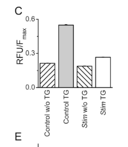

## Question

# Gene Research for Functional Annotation

## ⚠️ CRITICAL: Gene/Protein Identification Context

**BEFORE YOU BEGIN RESEARCH:** You MUST verify you are researching the CORRECT gene/protein. Gene symbols can be ambiguous, especially for less well-characterized genes from non-model organisms.

### Target Gene/Protein Identity (from UniProt):
- **UniProt Accession:** P83094
- **Protein Description:** RecName: Full=Stromal interaction molecule homolog; Flags: Precursor;
- **Gene Information:** Name=Stim; ORFNames=CG9126;
- **Organism (full):** Drosophila melanogaster (Fruit fly).
- **Protein Family:** Not specified in UniProt
- **Key Domains:** EF-hand_STIM1/2. (IPR057835); SAM. (IPR001660); SAM/pointed_sf. (IPR013761); SOAR_STIM1/2. (IPR032393); STIM1/2. (IPR037608)

### MANDATORY VERIFICATION STEPS:

1. **Check if the gene symbol "Stim" matches the protein description above**
2. **Verify the organism is correct:** Drosophila melanogaster (Fruit fly).
3. **Check if protein family/domains align with what you find in literature**
4. **If you find literature for a DIFFERENT gene with the same or similar symbol, STOP**

### If Gene Symbol is Ambiguous or You Cannot Find Relevant Literature:

**DO NOT PROCEED WITH RESEARCH ON A DIFFERENT GENE.** Instead:
- State clearly: "The gene symbol 'Stim' is ambiguous or literature is limited for this specific protein"
- Explain what you found (e.g., "Found extensive literature on a different gene with the same symbol in a different organism")
- Describe the protein based ONLY on the UniProt information provided above
- Suggest that the protein function can be inferred from domain/family information

### Research Target:

Please provide a comprehensive research report on the gene **Stim** (gene ID: Stim, UniProt: P83094) in DROME.

The research report should be a detailed narrative explaining the function, biological processes, and localization of the gene product. Citations should be given for all claims.

You should prioritize authoritative reviews and primary scientific literature when conducting research. You can supplement
this with annotations you find in gene/protein databases, but these can be outdated or inaccurate.

We are specifically interested in the primary function of the gene - for enzymes, what reaction is catalyzed, and what is the substrate specificity? For transporters, what is the substrate? For structural proteins or adapters, what is the broader structural role? For signaling molecules, what is the role in the pathway.

We are interested in where in or outside the cell the gene product carries out its function.

We are also interested in the signaling or biochemical pathways in which the gene functions. We are less interested in broad pleiotropic effects, except where these elucidate the precise role.

Include evidence where possible. We are interested in both experimental evidence as well as inference from structure, evolution, or bioinformatic analysis. Precise studies should be prioritized over high-throughput, where available.

## Output

Question: You are an expert researcher providing comprehensive, well-cited information.

Provide detailed information focusing on:
1. Key concepts and definitions with current understanding
2. Recent developments and latest research (prioritize 2023-2024 sources)
3. Current applications and real-world implementations
4. Expert opinions and analysis from authoritative sources
5. Relevant statistics and data from recent studies

Format as a comprehensive research report with proper citations. Include URLs and publication dates where available.
Always prioritize recent, authoritative sources and provide specific citations for all major claims.

# Gene Research for Functional Annotation

## ⚠️ CRITICAL: Gene/Protein Identification Context

**BEFORE YOU BEGIN RESEARCH:** You MUST verify you are researching the CORRECT gene/protein. Gene symbols can be ambiguous, especially for less well-characterized genes from non-model organisms.

### Target Gene/Protein Identity (from UniProt):
- **UniProt Accession:** P83094
- **Protein Description:** RecName: Full=Stromal interaction molecule homolog; Flags: Precursor;
- **Gene Information:** Name=Stim; ORFNames=CG9126;
- **Organism (full):** Drosophila melanogaster (Fruit fly).
- **Protein Family:** Not specified in UniProt
- **Key Domains:** EF-hand_STIM1/2. (IPR057835); SAM. (IPR001660); SAM/pointed_sf. (IPR013761); SOAR_STIM1/2. (IPR032393); STIM1/2. (IPR037608)

### MANDATORY VERIFICATION STEPS:

1. **Check if the gene symbol "Stim" matches the protein description above**
2. **Verify the organism is correct:** Drosophila melanogaster (Fruit fly).
3. **Check if protein family/domains align with what you find in literature**
4. **If you find literature for a DIFFERENT gene with the same or similar symbol, STOP**

### If Gene Symbol is Ambiguous or You Cannot Find Relevant Literature:

**DO NOT PROCEED WITH RESEARCH ON A DIFFERENT GENE.** Instead:
- State clearly: "The gene symbol 'Stim' is ambiguous or literature is limited for this specific protein"
- Explain what you found (e.g., "Found extensive literature on a different gene with the same symbol in a different organism")
- Describe the protein based ONLY on the UniProt information provided above
- Suggest that the protein function can be inferred from domain/family information

### Research Target:

Please provide a comprehensive research report on the gene **Stim** (gene ID: Stim, UniProt: P83094) in DROME.

The research report should be a detailed narrative explaining the function, biological processes, and localization of the gene product. Citations should be given for all claims.

You should prioritize authoritative reviews and primary scientific literature when conducting research. You can supplement
this with annotations you find in gene/protein databases, but these can be outdated or inaccurate.

We are specifically interested in the primary function of the gene - for enzymes, what reaction is catalyzed, and what is the substrate specificity? For transporters, what is the substrate? For structural proteins or adapters, what is the broader structural role? For signaling molecules, what is the role in the pathway.

We are interested in where in or outside the cell the gene product carries out its function.

We are also interested in the signaling or biochemical pathways in which the gene functions. We are less interested in broad pleiotropic effects, except where these elucidate the precise role.

Include evidence where possible. We are interested in both experimental evidence as well as inference from structure, evolution, or bioinformatic analysis. Precise studies should be prioritized over high-throughput, where available.

# Functional annotation report: *Stim* (CG9126), *Drosophila melanogaster*

## Identity and principal function

The specified UniProt accession, **P83094**, is provided for the fruit-fly stromal interaction molecule homolog, *Stim*. Its gene identity is independently corroborated by primary studies explicitly naming **Drosophila CG9126 as *Stim* or dSTIM**. Flies have one *Stim* gene, whereas mammals have *STIM1* and *STIM2*; findings about either mammalian protein must therefore not be mistaken for fly-specific measurements. The retrieved papers establish the CG9126 identity but do not independently print the P83094 accession. [UniProt record](https://www.uniprot.org/uniprotkb/P83094/entry); [Roos et al., 2 May 2005](https://doi.org/10.1083/jcb.200502019); [Pathak et al., 2017](https://doi.org/10.1534/g3.116.038539). (roos2005stim1anessential pages 2-3, pathak2017crisprcasinducedmutantsidentify pages 1-7)

**Primary annotation:** dSTIM is an **endoplasmic-reticulum (ER) Ca²⁺-store sensor and activator of store-operated calcium entry (SOCE)**. It is not an enzyme that catalyzes a reaction, nor is it the Ca²⁺-conducting pore. Rather, it couples falling Ca²⁺ concentration inside the ER to opening of **Orai**, the Ca²⁺-selective channel in the plasma membrane. The resulting substrate of *Orai-mediated transport* is extracellular **Ca²⁺**, which enters the cytosol; SERCA can subsequently pump cytosolic Ca²⁺ back into the ER. Direct experiments in fly cells and neurons support this division of labor. [Roos et al., 2005](https://doi.org/10.1083/jcb.200502019); [Venkiteswaran and Hasan, 2009](https://doi.org/10.1073/pnas.0902982106); [Prakriya and Lewis, 2015](https://doi.org/10.1152/physrev.00020.2014). (roos2005stim1anessential pages 2-3, venkiteswaran2009intracellularca2+signaling pages 1-2, prakriya2015storeoperatedcalciumchannels. pages 4-6)

## Molecular mechanism and site of action

The dominant functional location is the **ER membrane**, particularly ER regions adjoining the plasma membrane during store depletion—not the extracellular space or the Orai channel pore itself. The supplied UniProt domain annotations, **EF-hand, SAM and SOAR**, fit the conserved STIM architecture: an amino-terminal signal sequence and **ER-luminal EF-hand/SAM sensor region**, one membrane-spanning segment, and a **cytosolic Orai-activating region, CAD/SOAR**. In the accepted model, loss of Ca²⁺ from the ER luminal EF-hand favors STIM conformational rearrangement and clustering at ER–plasma-membrane junctions; its cytosolic region engages Orai to permit Ca²⁺ influx. Detailed domain-to-domain and structural mechanisms are characterized principally in mammalian STIM proteins and are **homology-supported interpretations for fly dSTIM**, rather than a complete experimental domain map of P83094. [Cahalan, June 2009](https://doi.org/10.1038/ncb0609-669); [Prakriya and Lewis, October 2015](https://doi.org/10.1152/physrev.00020.2014); [Kodakandla et al., December 2023](https://doi.org/10.3389/fphys.2023.1330259). (cahalan2009stimulatingstoreoperatedca2+ pages 1-2, prakriya2015storeoperatedcalciumchannels. pages 4-6, pathak2017crisprcasinducedmutantsidentify pages 1-7)

A physiological route into this pathway is **receptor stimulation → phosphoinositide-dependent IP₃ production → Ca²⁺ release through ER IP₃ receptors → ER-store depletion → dSTIM/Orai-dependent SOCE → cytosolic Ca²⁺ signaling and ER refilling**. Thapsigargin instead depletes stores experimentally by inhibiting SERCA. Thus the molecular role of dSTIM is to *detect store depletion and relay that information across the ER–plasma-membrane junction*, rather than to bind extracellular ligand or transport Ca²⁺ through its own membrane span. [Pathak et al., 2017](https://doi.org/10.1534/g3.116.038539); [Mitra et al., version of record 30 January 2024](https://doi.org/10.7554/eLife.88808). (pathak2017crisprcasinducedmutantsidentify pages 1-7, mitra2024oraimediatedcalciumentry pages 1-2)

Fly immunostaining detects dSTIM in embryonic cells and developing wing epithelia, including staining associated with cell membranes; the wing-disc staining occurs at both apical and basal surfaces. **These tissue-scale images do not alone establish plasma-membrane residency or membrane topology**: the ER-membrane assignment follows the STIM mechanistic literature, whereas the staining establishes expression and distribution at lower spatial resolution. [Eid et al., October 2008](https://doi.org/10.1186/1471-213x-8-104). (eid2008thedrosophilastim1 pages 2-4)

## Direct experimental evidence

The foundational fly experiment screened candidate genes in S2 cells and identified **CG9126/Stim**. *Stim* double-stranded RNA decreased **thapsigargin-dependent Ca²⁺ influx by approximately 90%**, versus only approximately 10% for the thapsigargin-independent signal; patch-clamp recordings found **nearly complete suppression of CRAC current**. The investigators also used a second *Stim*-targeting RNA and checked that the first did not appreciably alter cell growth or dye loading. This is particularly strong evidence for an essential, relatively specific SOCE role rather than an annotation inferred solely from sequence. The ~90% result is also visible in the study’s Figure 1C. [Roos et al., 2 May 2005](https://doi.org/10.1083/jcb.200502019). (roos2005stim1anessential pages 2-3, roos2005stim1anessential media 59e721ac)

In cultured larval neurons, dSTIM RNAi lowered measured **SOCE, ER-store Ca²⁺ and resting cytosolic Ca²⁺**; neuronal depletion also disrupted rhythmic flight-associated firing and flight. A subsequent CRISPR deletion caused mainly late-second/early-third-instar lethality, while ubiquitous re-expression restored **more than 80%** of knockout animals to adulthood. Cell-restricted CRISPR targeting in a TH-driver population caused **98% lethality**, compared with about **40–45%** using the two pan-neuronal drivers tested. The TH driver marks dopaminergic as well as hypodermal cells, and its partial rescue means this finding should not be overstated as proof that only dopaminergic neurons need dSTIM. [Venkiteswaran and Hasan, June 2009](https://doi.org/10.1073/pnas.0902982106); [Pathak et al., March 2017](https://doi.org/10.1534/g3.116.038539). (venkiteswaran2009intracellularca2+signaling pages 1-2, pathak2017crisprcasinducedmutantsidentify pages 14-20, pathak2017crisprcasinducedmutantsidentify pages 31-36)

These studies provide a useful quantitative and experimental cross-section:

| Study/year | Direct *Stim*/*CG9126* perturbation | Salient quantitative result | Interpretation and caveat |
|---|---|---|---|
| Roos et al., 2005 | dsRNA knockdown of *Stim*/*CG9126* in *Drosophila* S2 cells | Thapsigargin-dependent Ca²⁺ influx fell by ~90% (*P* < 10⁻⁵), whereas the thapsigargin-independent signal fell by only ~10%; *Stim* mRNA decreased ~50%. Patch clamp showed nearly complete CRAC-current suppression. (roos2005stim1anessential pages 2-3, roos2005stim1anessential media 59e721ac) | Direct foundational evidence that dSTIM is specifically required for store-operated/CRAC Ca²⁺ entry. It identifies STIM as the ER-store sensor/pathway regulator, not the plasma-membrane pore. |
| Venkiteswaran & Hasan, 2009 | Neuron-specific dSTIM RNAi | dSTIM depletion significantly reduced SOCE, ER-store Ca²⁺, and resting cytosolic Ca²⁺ in cultured larval neurons (approximately 150 cells analyzed). Pan-neuronal depletion caused flight defects and abnormal motor firing; flight assays used 100 flies. (venkiteswaran2009intracellularca2+signaling pages 1-2) | Establishes a neuronal requirement for dSTIM-dependent Ca²⁺ homeostasis and rhythmic flight. Exact effect sizes are not reported in the retrieved excerpt, so sample sizes should not be mistaken for biological effect sizes. |
| Pathak et al., 2017 | Whole-animal CRISPR deletion and cell-type-specific CRISPR targeting of dSTIM | Null animals were developmentally delayed and chiefly died in late second/early third instar; ubiquitous dSTIM restored >80% to adulthood. TH-GAL4-directed targeting caused 98% lethality, versus ~40–45% with two pan-neuronal drivers; TH-driven rescue was only ~30%. (pathak2017crisprcasinducedmutantsidentify pages 14-20, pathak2017crisprcasinducedmutantsidentify pages 31-36) | Strong on-target genetic evidence that dSTIM is essential, with a particularly important requirement in TH-positive dopaminergic/hypodermal cells. Partial cell-specific rescue indicates additional required tissues or incomplete targeting/rescue. |
| Weiss et al., 2022 | Conditional pan-glial or perineurial-glial dStim RNAi | Adult-induced pan-glial knockdown produced seizures in ~60% of flies; two perineurial-glial drivers reproduced the phenotype, with ~85% of PG>dStim-RNAi flies displaying seizures. Larvae also lost normal rhythmic firing at 38°C. (weiss2022glialerand pages 8-10, weiss2022glialerand pages 10-11) | Supports an adult, perineurial-glial role in maintaining neuronal excitability rather than a gross blood–brain-barrier defect. Orai knockdown was more severe, possibly because of stronger suppression or STIM-independent Orai activity. |
| George et al., 2023 | Wing-specific dStim RNAi with GCaMP imaging and Dpp–GFP secretion assays | Pupal Ca²⁺-event frequency fell from 2.64 ± 0.14 to 0.71 ± 1.13 events/5 min; amplitude fell from 16.41 ± 0.86 to 8.75 ± 1.13 AU (*P* < 0.0001). Dpp–GFP release events fell from 6.0 ± 0.89 to 2.5 ± 0.34 (*n* = 6, *P* = 0.0044); peak amplitude was 12.94 ± 1.01 versus 8.01 ± 0.83 AU. (george2023endoplasmicreticulumcalcium pages 10-12, george2023endoplasmicreticulumcalcium pages 5-6) | Directly links dSTIM to developmental Ca²⁺ transients, pulsatile BMP/Dpp secretion, and wing patterning. The raw Dpp–GFP amplitudes imply an approximately 38% reduction, not the paper text’s stated 65%; altered pMad despite reduced secretion also indicates unresolved feedback or cell-context effects. |
| Mitra et al., 2024 | Predominantly dominant-negative Orai manipulation; excess STIM used only as a rescue intervention | Orai/SOCE loss downregulated 822 genes and upregulated 137 in flight-promoting dopaminergic neurons; excess STIM partially rescued flight after Trl depletion. (mitra2024oraimediatedcalciumentry pages 4-5, mitra2024oraimediatedcalciumentry pages 21-22) | Defines an Orai/SOCE→Trl→Set2/H3K36me3 transcriptional program controlling neuronal maturation. It is not a direct dSTIM-loss study: STIM participation upstream is mechanistically plausible and rescue-supported, but the central causal perturbation was Orai, and Orai-to-Trl biochemical coupling remains unresolved. |

*Table: Direct genetic, cellular, physiological, and developmental evidence for fly Stim/CG9126, emphasizing quantitative findings and study-specific limitations. The table distinguishes direct Stim perturbations from Orai-centered pathway evidence.*

## Biological pathways and cell-specific outputs

**Neuronal and neuroendocrine signaling.** dSTIM-dependent store refilling supports normal neuronal Ca²⁺ homeostasis and flight-circuit activity. In flies with impaired IP₃-receptor signaling, expressing dSTIM in insulin-producing **DILP2 neurons** or aminergic neurons rescued aspects of flight behavior and firing; dSTIM plus Orai in DILP2 neurons suppressed the tested flight phenotypes more comprehensively than Orai alone. These are functional rescue results, not evidence that dSTIM synthesizes insulin or dopamine. [Agrawal et al., January 2010](https://doi.org/10.1523/JNEUROSCI.3668-09.2010). (agrawal2010inositol145trisphosphatereceptor pages 3-4, agrawal2010inositol145trisphosphatereceptor pages 10-11, agrawal2010inositol145trisphosphatereceptor pages 4-5)

In secretory dorso-lateral peptidergic neurons, reducing dSTIM led to intracellular accumulation of **corazonin and short neuropeptide F**, diminished systemic corazonin signaling, and impaired development under nutrient restriction. Comparisons and rescue experiments favor **defective neuropeptide release** as the main downstream problem, with possible additional effects on peptide synthesis during sustained stimulation. This places ER-localized dSTIM upstream of Ca²⁺-dependent secretion, not in the released peptide or extracellular signaling complex. [Megha et al., 11 July 2019](https://doi.org/10.1371/journal.pone.0219719). (megha2019erca2+sensorstim pages 1-2, megha2019erca2+sensorstim pages 4-5, megha2019erca2+sensorstim pages 13-15)

**Glial excitability control.** dStim knockdown in *perineurial glia* reproduced a heat-induced seizure-like phenotype; conditional adult glial knockdown caused seizures in approximately **60%** of flies, and perineurial-glial knockdown yielded a phenotype in approximately **85%** under the study’s conditions. Larval glial knockdown disrupted normal rhythmic motor output. The authors found no gross failure of a fluorescent-dextran blood–brain-barrier assay, arguing against a simple barrier-leak explanation. Notably, perineurial-glial **IP₃-receptor** knockdown did not reproduce the conspicuous behavioral phenotype, so the upstream Ca²⁺-release trigger should not automatically be assumed identical in every dSTIM-dependent tissue. [Weiss et al., published online September 2021; *Glia* 2022](https://doi.org/10.1002/glia.24092). (weiss2022glialerand pages 8-10, weiss2022glialerand pages 10-11)

**Developing wing and BMP/Dpp signaling—2023 advance.** Wing-targeted *Stim* RNAi reduced pupal GCaMP Ca²⁺-event frequency from approximately **2.64 to 0.71 events per five minutes**, event amplitude from **16.41 to 8.75 arbitrary fluorescence units**, and Dpp–GFP release-event counts from **6.0 to 2.5** in the assayed fields (*n* = 6 discs for the secretion comparison; *P* = 0.0044). The perturbation also yielded smaller wings with thickened veins and altered phosphorylated Mad, a BMP-pathway readout. These findings implicate dSTIM-dependent Ca²⁺ dynamics in **regulated Dpp presentation and tissue patterning**; they do not show dSTIM physically binding Dpp or directly catalyzing its release. A decrease in measured Dpp–GFP events coinciding with increased pMad in some wing regions is an unresolved context-dependent observation, not a simple monotonic “less Dpp means less signaling” mechanism. The reported Dpp–GFP amplitudes, **12.94 versus 8.01 units**, imply an approximately **38%** decrease when calculated from those means; the paper’s prose calls it 65%, so the measured values are preferable to that inconsistent percentage. [George et al., December 2023](https://doi.org/10.1089/bioe.2022.0036). (george2023endoplasmicreticulumcalcium pages 5-6, george2023endoplasmicreticulumcalcium pages 10-12, george2023endoplasmicreticulumcalcium pages 9-10)

**Flight-neuron transcription—2024 advance and attribution limit.** In flight-promoting dopaminergic neurons, a 2024 study found that suppressing **Orai-mediated SOCE** reorganized developmental gene expression: **822 genes decreased and 137 increased** under its analysis criteria. The proposed downstream program involves the transcription factor **Trl**, **Set2-dependent H3K36 trimethylation**, and expression of Ca²⁺-signaling and excitability genes. Excess STIM partially rescued flight deficits after Trl depletion, supporting participation of the STIM–Orai pathway. Nevertheless, the central loss-of-function manipulation was **Orai**, not *Stim*; assigning every transcriptomic change specifically to loss of P83094 would overstate the evidence. The authors also identify the biochemical connection between Orai-derived Ca²⁺ and Trl activation as unresolved. [Mitra et al., version of record 30 January 2024](https://doi.org/10.7554/eLife.88808). (mitra2024oraimediatedcalciumentry pages 4-5, mitra2024oraimediatedcalciumentry pages 21-22)

## Functional-annotation conclusion

**High-confidence molecular role:** dSTIM/CG9126 is the fly ER-store Ca²⁺ sensor that enables **Orai-dependent, store-operated influx of extracellular Ca²⁺** at ER–plasma-membrane contact regions. **High-confidence location:** primarily the ER membrane, with activation at ER–plasma-membrane junctions; Orai, rather than dSTIM, occupies the Ca²⁺-conducting plasma-membrane pore. **Supported biological processes:** cellular Ca²⁺ homeostasis and ER refilling, neuronal and glial signaling, Ca²⁺-dependent neuropeptide release, and developmental Ca²⁺ signaling in the wing. The precise fly-specific atomic domain interactions, tissue-specific upstream store-depletion signals, and several downstream links between Ca²⁺ dynamics and developmental gene regulation remain less directly established than the core SOCE function. [Roos et al., 2005](https://doi.org/10.1083/jcb.200502019); [Venkiteswaran and Hasan, 2009](https://doi.org/10.1073/pnas.0902982106); [George et al., 2023](https://doi.org/10.1089/bioe.2022.0036); [Mitra et al., 2024](https://doi.org/10.7554/eLife.88808). (roos2005stim1anessential pages 2-3, venkiteswaran2009intracellularca2+signaling pages 1-2, george2023endoplasmicreticulumcalcium pages 10-12, mitra2024oraimediatedcalciumentry pages 21-22)

References

1. (roos2005stim1anessential pages 2-3): Jack Roos, Paul J. DiGregorio, Andriy V. Yeromin, Kari Ohlsen, Maria Lioudyno, Shenyuan Zhang, Olga Safrina, J. Ashot Kozak, Steven L. Wagner, Michael D. Cahalan, Gönül Veliçelebi, and Kenneth A. Stauderman. Stim1, an essential and conserved component of store-operated ca2+ channel function. The Journal of Cell Biology, 169:435-445, May 2005. URL: https://doi.org/10.1083/jcb.200502019, doi:10.1083/jcb.200502019. This article has 2420 citations.

2. (pathak2017crisprcasinducedmutantsidentify pages 1-7): Trayambak Pathak, Deepti Trivedi, and Gaiti Hasan. Crispr-cas-induced mutants identify a requirement for dstim in larval dopaminergic cells of <i>drosophila melanogaster</i>. G3 Genes|Genomes|Genetics, 7:923-933, Mar 2017. URL: https://doi.org/10.1534/g3.116.038539, doi:10.1534/g3.116.038539. This article has 16 citations.

3. (venkiteswaran2009intracellularca2+signaling pages 1-2): Gayatri Venkiteswaran and Gaiti Hasan. Intracellular ca2+ signaling and store-operated ca2+ entry are required in drosophila neurons for flight. Proceedings of the National Academy of Sciences, 106:10326-10331, Jun 2009. URL: https://doi.org/10.1073/pnas.0902982106, doi:10.1073/pnas.0902982106. This article has 143 citations and is from a highest quality peer-reviewed journal.

4. (prakriya2015storeoperatedcalciumchannels. pages 4-6): Murali Prakriya and Richard S. Lewis. Store-operated calcium channels. Physiological reviews, 95 4:1383-436, Oct 2015. URL: https://doi.org/10.1152/physrev.00020.2014, doi:10.1152/physrev.00020.2014. This article has 1577 citations and is from a highest quality peer-reviewed journal.

5. (cahalan2009stimulatingstoreoperatedca2+ pages 1-2): Michael D. Cahalan. Stimulating store-operated ca2+ entry. Nature Cell Biology, 11:669-677, Jun 2009. URL: https://doi.org/10.1038/ncb0609-669, doi:10.1038/ncb0609-669. This article has 620 citations and is from a highest quality peer-reviewed journal.

6. (mitra2024oraimediatedcalciumentry pages 1-2): Rishav Mitra, Shlesha Richhariya, and Gaiti Hasan. Orai-mediated calcium entry determines activity of central dopaminergic neurons by regulation of gene expression. eLife, Jan 2024. URL: https://doi.org/10.7554/elife.88808, doi:10.7554/elife.88808. This article has 7 citations and is from a domain leading peer-reviewed journal.

7. (eid2008thedrosophilastim1 pages 2-4): Jean-Pierre Eid, Alfonso Martinez Arias, Hannah Robertson, Gary R Hime, and Marie Dziadek. The drosophila stim1 orthologue, dstim, has roles in cell fate specification and tissue patterning. BMC Developmental Biology, 8:104-104, Oct 2008. URL: https://doi.org/10.1186/1471-213x-8-104, doi:10.1186/1471-213x-8-104. This article has 35 citations and is from a peer-reviewed journal.

8. (roos2005stim1anessential media 59e721ac): Jack Roos, Paul J. DiGregorio, Andriy V. Yeromin, Kari Ohlsen, Maria Lioudyno, Shenyuan Zhang, Olga Safrina, J. Ashot Kozak, Steven L. Wagner, Michael D. Cahalan, Gönül Veliçelebi, and Kenneth A. Stauderman. Stim1, an essential and conserved component of store-operated ca2+ channel function. The Journal of Cell Biology, 169:435-445, May 2005. URL: https://doi.org/10.1083/jcb.200502019, doi:10.1083/jcb.200502019. This article has 2420 citations.

9. (pathak2017crisprcasinducedmutantsidentify pages 14-20): Trayambak Pathak, Deepti Trivedi, and Gaiti Hasan. Crispr-cas-induced mutants identify a requirement for dstim in larval dopaminergic cells of <i>drosophila melanogaster</i>. G3 Genes|Genomes|Genetics, 7:923-933, Mar 2017. URL: https://doi.org/10.1534/g3.116.038539, doi:10.1534/g3.116.038539. This article has 16 citations.

10. (pathak2017crisprcasinducedmutantsidentify pages 31-36): Trayambak Pathak, Deepti Trivedi, and Gaiti Hasan. Crispr-cas-induced mutants identify a requirement for dstim in larval dopaminergic cells of <i>drosophila melanogaster</i>. G3 Genes|Genomes|Genetics, 7:923-933, Mar 2017. URL: https://doi.org/10.1534/g3.116.038539, doi:10.1534/g3.116.038539. This article has 16 citations.

11. (weiss2022glialerand pages 8-10): Shirley Weiss, Lauren C. Clamon, Julia E. Manoim, Kiel G. Ormerod, Moshe Parnas, and J. Troy Littleton. Glial er and gap junction mediated ca2+ waves are crucial to maintain normal brain excitability. Glia, 70:123-144, Sep 2022. URL: https://doi.org/10.1002/glia.24092, doi:10.1002/glia.24092. This article has 35 citations and is from a domain leading peer-reviewed journal.

12. (weiss2022glialerand pages 10-11): Shirley Weiss, Lauren C. Clamon, Julia E. Manoim, Kiel G. Ormerod, Moshe Parnas, and J. Troy Littleton. Glial er and gap junction mediated ca2+ waves are crucial to maintain normal brain excitability. Glia, 70:123-144, Sep 2022. URL: https://doi.org/10.1002/glia.24092, doi:10.1002/glia.24092. This article has 35 citations and is from a domain leading peer-reviewed journal.

13. (george2023endoplasmicreticulumcalcium pages 10-12): Laura Faith George, Mikaela Lynn Follmer, Emily Fontenoy, Hannah Rose Moran, Jeremy Ryan Brown, Yunus H. Ozekin, and Emily Anne Bates. Endoplasmic reticulum calcium mediates<i>drosophila</i>wing development. Bioelectricity, 5:290-306, Dec 2023. URL: https://doi.org/10.1089/bioe.2022.0036, doi:10.1089/bioe.2022.0036. This article has 9 citations and is from a peer-reviewed journal.

14. (george2023endoplasmicreticulumcalcium pages 5-6): Laura Faith George, Mikaela Lynn Follmer, Emily Fontenoy, Hannah Rose Moran, Jeremy Ryan Brown, Yunus H. Ozekin, and Emily Anne Bates. Endoplasmic reticulum calcium mediates<i>drosophila</i>wing development. Bioelectricity, 5:290-306, Dec 2023. URL: https://doi.org/10.1089/bioe.2022.0036, doi:10.1089/bioe.2022.0036. This article has 9 citations and is from a peer-reviewed journal.

15. (mitra2024oraimediatedcalciumentry pages 4-5): Rishav Mitra, Shlesha Richhariya, and Gaiti Hasan. Orai-mediated calcium entry determines activity of central dopaminergic neurons by regulation of gene expression. eLife, Jan 2024. URL: https://doi.org/10.7554/elife.88808, doi:10.7554/elife.88808. This article has 7 citations and is from a domain leading peer-reviewed journal.

16. (mitra2024oraimediatedcalciumentry pages 21-22): Rishav Mitra, Shlesha Richhariya, and Gaiti Hasan. Orai-mediated calcium entry determines activity of central dopaminergic neurons by regulation of gene expression. eLife, Jan 2024. URL: https://doi.org/10.7554/elife.88808, doi:10.7554/elife.88808. This article has 7 citations and is from a domain leading peer-reviewed journal.

17. (agrawal2010inositol145trisphosphatereceptor pages 3-4): Neha Agrawal, Gayatri Venkiteswaran, Sufia Sadaf, Nisha T. Padmanabhan, Santanu Banerjee, and Gaiti Hasan. Inositol 1,4,5-trisphosphate receptor and dstim function in drosophila insulin-producing neurons regulates systemic intracellular calcium homeostasis and flight. The Journal of Neuroscience, 30:1301-1313, Jan 2010. URL: https://doi.org/10.1523/jneurosci.3668-09.2010, doi:10.1523/jneurosci.3668-09.2010. This article has 71 citations.

18. (agrawal2010inositol145trisphosphatereceptor pages 10-11): Neha Agrawal, Gayatri Venkiteswaran, Sufia Sadaf, Nisha T. Padmanabhan, Santanu Banerjee, and Gaiti Hasan. Inositol 1,4,5-trisphosphate receptor and dstim function in drosophila insulin-producing neurons regulates systemic intracellular calcium homeostasis and flight. The Journal of Neuroscience, 30:1301-1313, Jan 2010. URL: https://doi.org/10.1523/jneurosci.3668-09.2010, doi:10.1523/jneurosci.3668-09.2010. This article has 71 citations.

19. (agrawal2010inositol145trisphosphatereceptor pages 4-5): Neha Agrawal, Gayatri Venkiteswaran, Sufia Sadaf, Nisha T. Padmanabhan, Santanu Banerjee, and Gaiti Hasan. Inositol 1,4,5-trisphosphate receptor and dstim function in drosophila insulin-producing neurons regulates systemic intracellular calcium homeostasis and flight. The Journal of Neuroscience, 30:1301-1313, Jan 2010. URL: https://doi.org/10.1523/jneurosci.3668-09.2010, doi:10.1523/jneurosci.3668-09.2010. This article has 71 citations.

20. (megha2019erca2+sensorstim pages 1-2): Megha, Christian Wegener, and Gaiti Hasan. Er-ca2+ sensor stim regulates neuropeptides required for development under nutrient restriction in drosophila. PLoS ONE, 14:e0219719, Jul 2019. URL: https://doi.org/10.1371/journal.pone.0219719, doi:10.1371/journal.pone.0219719. This article has 13 citations and is from a peer-reviewed journal.

21. (megha2019erca2+sensorstim pages 4-5): Megha, Christian Wegener, and Gaiti Hasan. Er-ca2+ sensor stim regulates neuropeptides required for development under nutrient restriction in drosophila. PLoS ONE, 14:e0219719, Jul 2019. URL: https://doi.org/10.1371/journal.pone.0219719, doi:10.1371/journal.pone.0219719. This article has 13 citations and is from a peer-reviewed journal.

22. (megha2019erca2+sensorstim pages 13-15): Megha, Christian Wegener, and Gaiti Hasan. Er-ca2+ sensor stim regulates neuropeptides required for development under nutrient restriction in drosophila. PLoS ONE, 14:e0219719, Jul 2019. URL: https://doi.org/10.1371/journal.pone.0219719, doi:10.1371/journal.pone.0219719. This article has 13 citations and is from a peer-reviewed journal.

23. (george2023endoplasmicreticulumcalcium pages 9-10): Laura Faith George, Mikaela Lynn Follmer, Emily Fontenoy, Hannah Rose Moran, Jeremy Ryan Brown, Yunus H. Ozekin, and Emily Anne Bates. Endoplasmic reticulum calcium mediates<i>drosophila</i>wing development. Bioelectricity, 5:290-306, Dec 2023. URL: https://doi.org/10.1089/bioe.2022.0036, doi:10.1089/bioe.2022.0036. This article has 9 citations and is from a peer-reviewed journal.

## Artifacts

- [Edison artifact artifact-00](Stim-deep-research-falcon_artifacts/artifact-00.md)

## Citations

1. pathak2017crisprcasinducedmutantsidentify pages 1-7
2. mitra2024oraimediatedcalciumentry pages 1-2
3. pathak2017crisprcasinducedmutantsidentify pages 14-20
4. pathak2017crisprcasinducedmutantsidentify pages 31-36
5. weiss2022glialerand pages 8-10
6. weiss2022glialerand pages 10-11
7. george2023endoplasmicreticulumcalcium pages 10-12
8. george2023endoplasmicreticulumcalcium pages 5-6
9. mitra2024oraimediatedcalciumentry pages 4-5
10. mitra2024oraimediatedcalciumentry pages 21-22
11. george2023endoplasmicreticulumcalcium pages 9-10
12. UniProt record
13. Roos et al., 2 May 2005
14. Pathak et al., 2017
15. Roos et al., 2005
16. Venkiteswaran and Hasan, 2009
17. Prakriya and Lewis, 2015
18. Cahalan, June 2009
19. Prakriya and Lewis, October 2015
20. Kodakandla et al., December 2023
21. Mitra et al., version of record 30 January 2024
22. Eid et al., October 2008
23. Venkiteswaran and Hasan, June 2009
24. Pathak et al., March 2017
25. Agrawal et al., January 2010
26. Megha et al., 11 July 2019
27. Weiss et al., published online September 2021; *Glia* 2022
28. George et al., December 2023
29. George et al., 2023
30. Mitra et al., 2024
31. https://www.uniprot.org/uniprotkb/P83094/entry
32. https://doi.org/10.1083/jcb.200502019
33. https://doi.org/10.1534/g3.116.038539
34. https://doi.org/10.1073/pnas.0902982106
35. https://doi.org/10.1152/physrev.00020.2014
36. https://doi.org/10.1038/ncb0609-669
37. https://doi.org/10.3389/fphys.2023.1330259
38. https://doi.org/10.7554/eLife.88808
39. https://doi.org/10.1186/1471-213x-8-104
40. https://doi.org/10.1523/JNEUROSCI.3668-09.2010
41. https://doi.org/10.1371/journal.pone.0219719
42. https://doi.org/10.1002/glia.24092
43. https://doi.org/10.1089/bioe.2022.0036
44. https://doi.org/10.1083/jcb.200502019,
45. https://doi.org/10.1534/g3.116.038539,
46. https://doi.org/10.1073/pnas.0902982106,
47. https://doi.org/10.1152/physrev.00020.2014,
48. https://doi.org/10.1038/ncb0609-669,
49. https://doi.org/10.7554/elife.88808,
50. https://doi.org/10.1186/1471-213x-8-104,
51. https://doi.org/10.1002/glia.24092,
52. https://doi.org/10.1089/bioe.2022.0036,
53. https://doi.org/10.1523/jneurosci.3668-09.2010,
54. https://doi.org/10.1371/journal.pone.0219719,