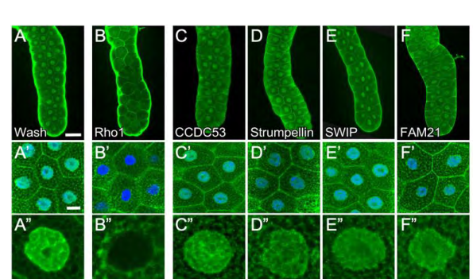
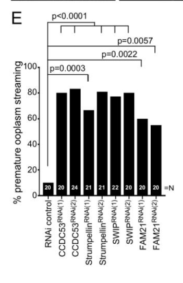

## Question

# Gene Research for Functional Annotation

## ⚠️ CRITICAL: Gene/Protein Identification Context

**BEFORE YOU BEGIN RESEARCH:** You MUST verify you are researching the CORRECT gene/protein. Gene symbols can be ambiguous, especially for less well-characterized genes from non-model organisms.

### Target Gene/Protein Identity (from UniProt):
- **UniProt Accession:** Q9VUY8
- **Protein Description:** RecName: Full=WASH complex subunit homolog 5 {ECO:0000250|UniProtKB:Q12768}; AltName: Full=WASH complex subunit strumpellin homolog {ECO:0000305};
- **Gene Information:** Name=Strump {ECO:0000312|FlyBase:FBgn0036571}; ORFNames=CG12272 {ECO:0000312|FlyBase:FBgn0036571};
- **Organism (full):** Drosophila melanogaster (Fruit fly).
- **Protein Family:** Belongs to the strumpellin family. .
- **Key Domains:** WASH_strumpellin. (IPR019393); Strumpellin (PF10266)

### MANDATORY VERIFICATION STEPS:

1. **Check if the gene symbol "Strump" matches the protein description above**
2. **Verify the organism is correct:** Drosophila melanogaster (Fruit fly).
3. **Check if protein family/domains align with what you find in literature**
4. **If you find literature for a DIFFERENT gene with the same or similar symbol, STOP**

### If Gene Symbol is Ambiguous or You Cannot Find Relevant Literature:

**DO NOT PROCEED WITH RESEARCH ON A DIFFERENT GENE.** Instead:
- State clearly: "The gene symbol 'Strump' is ambiguous or literature is limited for this specific protein"
- Explain what you found (e.g., "Found extensive literature on a different gene with the same symbol in a different organism")
- Describe the protein based ONLY on the UniProt information provided above
- Suggest that the protein function can be inferred from domain/family information

### Research Target:

Please provide a comprehensive research report on the gene **Strump** (gene ID: Strump, UniProt: Q9VUY8) in DROME.

The research report should be a detailed narrative explaining the function, biological processes, and localization of the gene product. Citations should be given for all claims.

You should prioritize authoritative reviews and primary scientific literature when conducting research. You can supplement
this with annotations you find in gene/protein databases, but these can be outdated or inaccurate.

We are specifically interested in the primary function of the gene - for enzymes, what reaction is catalyzed, and what is the substrate specificity? For transporters, what is the substrate? For structural proteins or adapters, what is the broader structural role? For signaling molecules, what is the role in the pathway.

We are interested in where in or outside the cell the gene product carries out its function.

We are also interested in the signaling or biochemical pathways in which the gene functions. We are less interested in broad pleiotropic effects, except where these elucidate the precise role.

Include evidence where possible. We are interested in both experimental evidence as well as inference from structure, evolution, or bioinformatic analysis. Precise studies should be prioritized over high-throughput, where available.

## Output

Question: You are an expert researcher providing comprehensive, well-cited information.

Provide detailed information focusing on:
1. Key concepts and definitions with current understanding
2. Recent developments and latest research (prioritize 2023-2024 sources)
3. Current applications and real-world implementations
4. Expert opinions and analysis from authoritative sources
5. Relevant statistics and data from recent studies

Format as a comprehensive research report with proper citations. Include URLs and publication dates where available.
Always prioritize recent, authoritative sources and provide specific citations for all major claims.

# Gene Research for Functional Annotation

## ⚠️ CRITICAL: Gene/Protein Identification Context

**BEFORE YOU BEGIN RESEARCH:** You MUST verify you are researching the CORRECT gene/protein. Gene symbols can be ambiguous, especially for less well-characterized genes from non-model organisms.

### Target Gene/Protein Identity (from UniProt):
- **UniProt Accession:** Q9VUY8
- **Protein Description:** RecName: Full=WASH complex subunit homolog 5 {ECO:0000250|UniProtKB:Q12768}; AltName: Full=WASH complex subunit strumpellin homolog {ECO:0000305};
- **Gene Information:** Name=Strump {ECO:0000312|FlyBase:FBgn0036571}; ORFNames=CG12272 {ECO:0000312|FlyBase:FBgn0036571};
- **Organism (full):** Drosophila melanogaster (Fruit fly).
- **Protein Family:** Belongs to the strumpellin family. .
- **Key Domains:** WASH_strumpellin. (IPR019393); Strumpellin (PF10266)

### MANDATORY VERIFICATION STEPS:

1. **Check if the gene symbol "Strump" matches the protein description above**
2. **Verify the organism is correct:** Drosophila melanogaster (Fruit fly).
3. **Check if protein family/domains align with what you find in literature**
4. **If you find literature for a DIFFERENT gene with the same or similar symbol, STOP**

### If Gene Symbol is Ambiguous or You Cannot Find Relevant Literature:

**DO NOT PROCEED WITH RESEARCH ON A DIFFERENT GENE.** Instead:
- State clearly: "The gene symbol 'Strump' is ambiguous or literature is limited for this specific protein"
- Explain what you found (e.g., "Found extensive literature on a different gene with the same symbol in a different organism")
- Describe the protein based ONLY on the UniProt information provided above
- Suggest that the protein function can be inferred from domain/family information

### Research Target:

Please provide a comprehensive research report on the gene **Strump** (gene ID: Strump, UniProt: Q9VUY8) in DROME.

The research report should be a detailed narrative explaining the function, biological processes, and localization of the gene product. Citations should be given for all claims.

You should prioritize authoritative reviews and primary scientific literature when conducting research. You can supplement
this with annotations you find in gene/protein databases, but these can be outdated or inaccurate.

We are specifically interested in the primary function of the gene - for enzymes, what reaction is catalyzed, and what is the substrate specificity? For transporters, what is the substrate? For structural proteins or adapters, what is the broader structural role? For signaling molecules, what is the role in the pathway.

We are interested in where in or outside the cell the gene product carries out its function.

We are also interested in the signaling or biochemical pathways in which the gene functions. We are less interested in broad pleiotropic effects, except where these elucidate the precise role.

Include evidence where possible. We are interested in both experimental evidence as well as inference from structure, evolution, or bioinformatic analysis. Precise studies should be prioritized over high-throughput, where available.

# Functional annotation of *Drosophila melanogaster* Strump

## Identity and principal function

**Identity verified.** The supplied UniProt record **Q9VUY8** identifies *Strump* (CG12272; FlyBase FBgn0036571) as the fruit-fly strumpellin-family protein with a WASH_strumpellin domain (InterPro IPR019393; Pfam PF10266). A *Drosophila* primary study explicitly names **Strumpellin/CG12272** as a WASH regulatory-complex component. Strump is **not** the distinct actin-regulatory protein Wash, nor should results for human strumpellin/WASHC5 be presented as experiments on the fly protein. (verboon2015washfunctionsdownstream pages 4-5, romano‐moreno2024retromer‐mediatedrecruitmentof pages 1-2)

**Best-supported annotation:** Strump is a **structural and regulatory subunit** of the five-protein WASH complex, also termed the Wash regulatory complex or SHRC. The complex comprises Strumpellin, Wash, FAM21, SWIP and CCDC53. Its functions couple spatially restricted actin organization to particular membrane-trafficking and nuclear-envelope-budding processes. Strump is **not known to catalyze a reaction or transport a substrate**: Wash is the complex’s Arp2/3-activating nucleation-promoting factor, whereas Strump helps sustain the functional multiprotein assembly. In fly ovaries, Strump depletion reduces detectable Wash and other SHRC proteins, consistent with their interdependence for complex stability; this also means a Strump-knockdown phenotype need not reflect an activity unique to Strump alone. The strumpellin-family domain supports this assignment but does not, by itself, establish a catalytic site or cargo specificity. (verboon2018washexhibitscontextdependent pages 9-12, romano‐moreno2024retromer‐mediatedrecruitmentof pages 1-2, freeman2013thehereditaryspastic pages 2-3)

## Where Strump acts: direct fly observations

**Oocyte cortex.** Antibody staining detects endogenous Strumpellin in the germline, enriched at the cortex of stage-7–9 oocytes. Germline knockdown using independent RNAi reagents causes premature ooplasmic streaming, disorganized cortical F-actin, and abnormal actin arrays around ring canals. This places a demonstrated Strump-dependent function at the **intracellular oocyte cortex and germline actin structures**; it does not establish that Strump itself polymerizes actin. The study documents genetic-background-dependent compensation in *Wash* mutants, so Wash-mutant severity should not be automatically attributed to Strump. Verboon *et al.*, **April 2018**, *Journal of Cell Science*, https://doi.org/10.1242/jcs.211573. (verboon2018washexhibitscontextdependent pages 9-12, verboon2018washexhibitscontextdependent pages 3-5, verboon2018washexhibitscontextdependent pages 31-35, verboon2018washexhibitscontextdependent media 317f9c36)

**Nucleus and nuclear envelope.** In larval salivary glands, Strumpellin and other SHRC components are strongly detected in nuclei. Nuclear-lysate fractionation and co-immunoprecipitation place Strumpellin in a Wash-containing complex of approximately **900 kDa**. Two independent salivary-gland Strump RNAi reagents substantially reduce dFz2C-marked nuclear-envelope foci/buds: across the tested SHRC knockdown lines the study reports **0.1–1.1 ± 0.1 buds per nucleus**, compared with **6.6 ± 0.3** in controls (*n* > 100 per line; *P* < 0.0001). The cited range is for the **SHRC knockdown lines collectively**, not a separately stated value for each Strump reagent. Individual SHRC proteins CCDC53 and SWIP were observed enriched at buds; nuclear detection, complex association and loss-of-function establish Strump’s involvement, but do **not** independently demonstrate Strump enrichment at the bud neck. Verboon *et al.*, **July 2020**, *Journal of Cell Science*, https://doi.org/10.1242/jcs.243576. (verboon2020drosophilawashand pages 6-8, verboon2020drosophilawashand pages 8-9, verboon2020drosophilawashand media af2d07ea, verboon2020drosophilawashand media 6fa9ad01)

This nuclear role is mechanistically distinguishable from another Wash function. Strump-knockdown nuclei retain approximately normal Lamin B/Lamin C organization, whereas Wash disruption separates those lamin networks. Biochemistry likewise distinguishes the Strump-containing Wash–SHRC assembly from a Wash–Lamin B-associated assembly. Wash mutants that selectively disrupt SHRC binding or Arp2/3 binding have strongly reduced budding, supporting an **SHRC–Wash–Arp2/3 pathway** in bud formation rather than a direct Strump–lamin interaction. Verboon *et al.*, **2020**, https://doi.org/10.1242/jcs.243576. (verboon2020drosophilawashand pages 8-9, verboon2020drosophilawashand pages 11-14)

The following evidence table separates fly experiments from ortholog-based interpretation and includes the major quantitative and negative results.

| Evidence class / setting | Localization or phenotype | Source / date / DOI URL |
|---|---|---|
| **Direct fly evidence — oogenesis** | Endogenous Strumpellin immunostaining is enriched at the cortex of stage-7 oocytes. Germline **Strump RNAi** causes premature ooplasmic streaming and disorganization of cortical and ring-canal F-actin. Because Strump depletion also lowers other WASH regulatory-complex proteins, these data support a complex-level structural/regulatory role rather than an autonomous enzymatic activity. (verboon2018washexhibitscontextdependent pages 9-12, verboon2018washexhibitscontextdependent pages 31-35, verboon2018washexhibitscontextdependent media 317f9c36) | Verboon *et al.*, **April 2018**, *Journal of Cell Science*. [https://doi.org/10.1242/jcs.211573](https://doi.org/10.1242/jcs.211573) |
| **Direct fly evidence — salivary-gland nuclei** | Strumpellin and the other SHRC proteins are strongly nuclear. Two independent Strump RNAi lines contributed to the SHRC-knockdown range of **0.1–1.1 ± 0.1 dFz2C foci/NE buds per nucleus**, versus **6.6 ± 0.3** in controls (*n*>100 per line; *P*<0.0001). Strump knockdown did not disrupt Lamin B/Lamin C organization, distinguishing the SHRC-dependent budding role from Wash’s separate lamin-associated role. (verboon2020drosophilawashand pages 6-8, verboon2020drosophilawashand pages 8-9, verboon2020drosophilawashand media af2d07ea) | Verboon *et al.*, **July 2020**, *Journal of Cell Science*. [https://doi.org/10.1242/jcs.243576](https://doi.org/10.1242/jcs.243576) |
| **Direct fly evidence — adult indirect flight muscle** | At age 21 days, two Strump RNAi lines showed **3.6-fold and 3.5-fold lower ATP-synthase-α fluorescence signal** than wild type (*n*=50 each; *P*<0.0001), accompanied by increased polyubiquitin aggregates. The fluorescence is an activity-associated mitochondrial-integrity **proxy**, not a direct measurement of ATP synthesis. (verboon2020drosophilawashand pages 6-8) | Verboon *et al.*, **July 2020**, *Journal of Cell Science*. [https://doi.org/10.1242/jcs.243576](https://doi.org/10.1242/jcs.243576) |
| **Direct fly negative/context-specific evidence — embryonic hemocytes** | Strumpellin is explicitly identified as **CG12272**. Strump RNAi did not significantly impair anterior migration of tail hemocytes: **22.0 ± 2.2** cells versus **20.8 ± 3.1** in controls (*n*=5 each). Protrusion area was modestly reduced to **162.1 ± 15.2 μm²** from **219.8 ± 14.2 μm²** (*n*=27 and 22; *P*=0.0090), far less than the severe Wash-RNAi defect. Thus, this migration is principally Rho1–Wash–Arp2/3 dependent and SHRC/Strump independent. (verboon2015washfunctionsdownstream pages 5-6, verboon2015washfunctionsdownstream pages 4-5) | Verboon *et al.*, **May 2015**, *Molecular Biology of the Cell*. [https://doi.org/10.1091/mbc.e14-08-1266](https://doi.org/10.1091/mbc.e14-08-1266) |
| **Direct mammalian ortholog evidence — neurons and cultured cells** | Tagged mammalian strumpellin colocalized with EEA1-positive endosomes in primary cortical neurons. Strumpellin depletion did **not** measurably alter transferrin uptake or recycling, but enlarged/perinuclearly clustered SNX27-positive structures and redistributed β2-adrenergic receptor into retromer-positive compartments, demonstrating cargo-selective rather than universal recycling requirements. This does **not** directly establish fly Strump endosomal localization or cargo specificity. (freeman2013thehereditaryspastic pages 9-10, freeman2013thehereditaryspastic pages 4-9) | Freeman *et al.*, **January 2013**, *BBA—Molecular Basis of Disease*. [https://doi.org/10.1016/j.bbadis.2012.10.011](https://doi.org/10.1016/j.bbadis.2012.10.011) |
| **Mechanistic ortholog inference — retromer recruitment** | Mammalian biochemical and crystallographic work shows that the FAM21 tail contacts VPS35 at two sites and VPS29 at a third, recruiting the pentameric WASH complex to endosomal sorting domains. This supports a conserved complex-level model for Strump but does not demonstrate that fly Strump binds retromer directly, specifies cargo, or localizes to endosomes. (romano‐moreno2024retromer‐mediatedrecruitmentof pages 8-10, romano‐moreno2024retromer‐mediatedrecruitmentof pages 1-2) | Romano-Moreno *et al.*, **April 2024**, *Protein Science*. [https://doi.org/10.1002/pro.4980](https://doi.org/10.1002/pro.4980) |
| **Functional-annotation boundary** | The evidence supports Strump as a **non-catalytic structural/regulatory WASH-complex subunit** required for complex stability and context-specific actin-dependent processes. No study above shows intrinsic Strump ATPase activity, direct actin nucleation, a small-molecule substrate, or direct visualization of Drosophila Strump on endosomes; Arp2/3 activation is executed by the Wash subunit within the complex. (verboon2018washexhibitscontextdependent pages 9-12, romano‐moreno2024retromer‐mediatedrecruitmentof pages 1-2, freeman2013thehereditaryspastic pages 2-3) | Evidence synthesis from the cited fly and comparative studies. |

*Table: Direct Drosophila findings are separated from mammalian ortholog evidence and mechanistic inference. The table also marks negative results and key limits on assigning enzymatic activity, cargo specificity, or endosomal localization to fly Strump.*

## Pathways and biological interpretation

**Actin-dependent nuclear export and oogenesis — demonstrated in flies.** The strongest direct functional evidence connects Strump to the Wash-regulated organization of cortical and ring-canal actin during egg development, and to nuclear-envelope budding, a route for exporting large nuclear ribonucleoprotein assemblies without passage through nuclear pores. In the latter setting, SHRC-associated Wash operates upstream of Arp2/3 and actin assembly. These are **context-specific intracellular roles**, rather than evidence that Strump is secreted or functions outside the cell. (verboon2018washexhibitscontextdependent pages 9-12, verboon2020drosophilawashand pages 6-8, verboon2020drosophilawashand pages 11-14)

**Endosomal sorting and retromer — well-supported complex-level model, less directly established for fly Strump.** In the conserved WASH pathway, retromer recruits the complex to endosomal sorting domains; Wash then promotes Arp2/3-dependent branched actin, helping organize retrieval of selected membrane proteins. A **2024 biochemical and crystallographic study** resolved a more precise recruitment mechanism: distinct segments of the FAM21 tail contact VPS35 and VPS29, including a FAM21 peptide bound in a VPS29 hydrophobic pocket. These are contacts made by **FAM21**, not demonstrations that fly Strump directly binds retromer or a receptor. Romano-Moreno *et al.*, **April 2024**, *Protein Science*, https://doi.org/10.1002/pro.4980; see also the 2024 expert review by Rowlands and Moore, **February 2024**, *Philosophical Transactions B*, https://doi.org/10.1098/rstb.2022.0384. (romano‐moreno2024retromer‐mediatedrecruitmentof pages 8-10, rowlands2024vps35andretromer pages 3-4, romano‐moreno2024retromer‐mediatedrecruitmentof pages 1-2)

**Endosomal location and cargo specificity require an organism qualifier.** Tagged **mammalian** strumpellin colocalizes with EEA1-positive endosomes in primary cortical neurons, providing evidence that the ortholog operates at endosomes. In mammalian cells, strumpellin depletion leaves measured transferrin uptake and recycling largely unchanged but redistributes SNX27 and the β₂-adrenergic receptor into enlarged, perinuclear endosomal structures. Thus, even in a system with direct strumpellin experiments, the requirement is **cargo-selective, not universal**. These observations support an inferred endosomal role for fly Strump; the fly studies discussed here do not directly visualize Strump on endosomes or identify a receptor whose sorting specifically depends on it. Freeman *et al.*, **January 2013**, *Biochimica et Biophysica Acta—Molecular Basis of Disease*, https://doi.org/10.1016/j.bbadis.2012.10.011. (freeman2013thehereditaryspastic pages 9-10, freeman2013thehereditaryspastic pages 4-9)

**Physiological consequence, not a defined biochemical reaction.** In 21-day-old fly indirect flight muscle, two Strump RNAi lines reduced an ATP-synthase-α **mitochondrial-activity-associated fluorescence readout** by **3.6-fold and 3.5-fold** relative to controls (*n* = 50 per line; *P* < 0.0001), alongside increased polyubiquitin aggregates. The result connects Strump loss to muscle cellular integrity in a setting associated with impaired nuclear budding. It does **not** show that Strump catalyzes ATP synthesis, directly maintains mitochondria, or establishes nuclear-budding failure as the exclusive cause of the muscle phenotype. Verboon *et al.*, **2020**, https://doi.org/10.1242/jcs.243576. (verboon2020drosophilawashand pages 6-8)

## Important boundaries and recent evidence

Strump is **not required for every Wash-dependent process**. During the studied embryonic hemocyte migration, Strumpellin/CG12272 knockdown yielded **22.0 ± 2.2** anteriorly migrating tail hemocytes versus **20.8 ± 3.1** in controls (*n* = 5 embryos per group), without a significant migration defect. Protrusion area was modestly smaller (**162.1 ± 15.2 versus 219.8 ± 14.2 μm²**), whereas Wash depletion produced a much more severe protrusion defect. The authors conclude that this migration predominantly uses a **Rho1–Wash–Arp2/3 route independent of SHRC**. Verboon *et al.*, **May 2015**, *Molecular Biology of the Cell*, https://doi.org/10.1091/mbc.e14-08-1266. (verboon2015washfunctionsdownstream pages 5-6, verboon2015washfunctionsdownstream pages 4-5)

Two additional fly studies caution against transferring another protein’s phenotype to Strump. In a **2022** enterocyte RNAi screen, Strump was tested among WASH/retromer-related genes, but its depletion was **not among the perturbations that reproduced both** the Rab21-associated proliferation and inflammatory phenotypes. Nassari *et al.*, **April 2022**, *Molecular Biology of the Cell*, https://doi.org/10.1091/mbc.e21-03-0139. A **preprint posted July 6, 2024** reports that intestinal-stem-cell knockdown of *Strump*, *Wash* or *FAM21* did **not** increase enteroendocrine-cell numbers under its tested conditions; this preliminary negative result neither rules out other intestinal functions nor establishes that Strump is an autophagy enzyme. Lacarrière-Keïta *et al.*, bioRxiv, https://doi.org/10.1101/2024.07.05.602279. (nassari2022rab21inenterocytes pages 8-10, lacarrierekeita2025autophagyinhibitionin pages 9-12)

**Overall assessment.** For **Q9VUY8**, annotate Strump confidently as the intracellular fly strumpellin-family **WASH regulatory-complex subunit** involved in complex stability, oocyte actin organization and nuclear-envelope budding. Conserved participation in endosomal actin-dependent sorting is a strong **complex/ortholog-based functional inference**, informed by 2024 retromer–FAM21 biochemistry, but no particular fly endosomal cargo, direct Strump–retromer binding interface, enzymatic reaction or Strump-specific transport substrate is established by the cited direct fly experiments. (verboon2018washexhibitscontextdependent pages 9-12, verboon2020drosophilawashand pages 6-8, romano‐moreno2024retromer‐mediatedrecruitmentof pages 1-2, freeman2013thehereditaryspastic pages 9-10)

References

1. (verboon2015washfunctionsdownstream pages 4-5): Jeffrey M. Verboon, Travis K. Rahe, Evelyn Rodriguez-Mesa, and Susan M. Parkhurst. Wash functions downstream of rho1 gtpase in a subset of drosophila immune cell developmental migrations. Molecular Biology of the Cell, 26:1665-1674, May 2015. URL: https://doi.org/10.1091/mbc.e14-08-1266, doi:10.1091/mbc.e14-08-1266. This article has 25 citations and is from a domain leading peer-reviewed journal.

2. (romano‐moreno2024retromer‐mediatedrecruitmentof pages 1-2): Miguel Romano‐Moreno, Elsa N. Astorga‐Simón, Adriana L. Rojas, and Aitor Hierro. Retromer‐mediated recruitment of the <scp>wash</scp> complex involves discrete interactions between <scp>vps35</scp>, <scp>vps29,</scp> and <scp>fam21</scp>. Protein Science, Apr 2024. URL: https://doi.org/10.1002/pro.4980, doi:10.1002/pro.4980. This article has 15 citations and is from a peer-reviewed journal.

3. (verboon2018washexhibitscontextdependent pages 9-12): Jeffrey M. Verboon, Jacob R. Decker, Mitsutoshi Nakamura, and Susan M. Parkhurst. Wash exhibits context-dependent phenotypes and, along with the wash regulatory complex, regulates drosophila oogenesis. Journal of Cell Science, Apr 2018. URL: https://doi.org/10.1242/jcs.211573, doi:10.1242/jcs.211573. This article has 17 citations and is from a domain leading peer-reviewed journal.

4. (freeman2013thehereditaryspastic pages 2-3): Caroline L Freeman, Matthew N. J. Seaman, and E. Reid. The hereditary spastic paraplegia protein strumpellin: characterisation in neurons and of the effect of disease mutations on wash complex assembly and function. Biochimica et Biophysica Acta (BBA) - Molecular Basis of Disease, 1832:160-173, Jan 2013. URL: https://doi.org/10.1016/j.bbadis.2012.10.011, doi:10.1016/j.bbadis.2012.10.011. This article has 63 citations and is from a peer-reviewed journal.

5. (verboon2018washexhibitscontextdependent pages 3-5): Jeffrey M. Verboon, Jacob R. Decker, Mitsutoshi Nakamura, and Susan M. Parkhurst. Wash exhibits context-dependent phenotypes and, along with the wash regulatory complex, regulates drosophila oogenesis. Journal of Cell Science, Apr 2018. URL: https://doi.org/10.1242/jcs.211573, doi:10.1242/jcs.211573. This article has 17 citations and is from a domain leading peer-reviewed journal.

6. (verboon2018washexhibitscontextdependent pages 31-35): Jeffrey M. Verboon, Jacob R. Decker, Mitsutoshi Nakamura, and Susan M. Parkhurst. Wash exhibits context-dependent phenotypes and, along with the wash regulatory complex, regulates drosophila oogenesis. Journal of Cell Science, Apr 2018. URL: https://doi.org/10.1242/jcs.211573, doi:10.1242/jcs.211573. This article has 17 citations and is from a domain leading peer-reviewed journal.

7. (verboon2018washexhibitscontextdependent media 317f9c36): Jeffrey M. Verboon, Jacob R. Decker, Mitsutoshi Nakamura, and Susan M. Parkhurst. Wash exhibits context-dependent phenotypes and, along with the wash regulatory complex, regulates drosophila oogenesis. Journal of Cell Science, Apr 2018. URL: https://doi.org/10.1242/jcs.211573, doi:10.1242/jcs.211573. This article has 17 citations and is from a domain leading peer-reviewed journal.

8. (verboon2020drosophilawashand pages 6-8): Jeffrey M. Verboon, Mitsutoshi Nakamura, Kerri A. Davidson, Jacob R. Decker, Vivek Nandakumar, and Susan M. Parkhurst. <i>drosophila</i> wash and the wash regulatory complex function in nuclear envelope budding. Journal of Cell Science, Jul 2020. URL: https://doi.org/10.1242/jcs.243576, doi:10.1242/jcs.243576. This article has 16 citations and is from a domain leading peer-reviewed journal.

9. (verboon2020drosophilawashand pages 8-9): Jeffrey M. Verboon, Mitsutoshi Nakamura, Kerri A. Davidson, Jacob R. Decker, Vivek Nandakumar, and Susan M. Parkhurst. <i>drosophila</i> wash and the wash regulatory complex function in nuclear envelope budding. Journal of Cell Science, Jul 2020. URL: https://doi.org/10.1242/jcs.243576, doi:10.1242/jcs.243576. This article has 16 citations and is from a domain leading peer-reviewed journal.

10. (verboon2020drosophilawashand media af2d07ea): Jeffrey M. Verboon, Mitsutoshi Nakamura, Kerri A. Davidson, Jacob R. Decker, Vivek Nandakumar, and Susan M. Parkhurst. <i>drosophila</i> wash and the wash regulatory complex function in nuclear envelope budding. Journal of Cell Science, Jul 2020. URL: https://doi.org/10.1242/jcs.243576, doi:10.1242/jcs.243576. This article has 16 citations and is from a domain leading peer-reviewed journal.

11. (verboon2020drosophilawashand media 6fa9ad01): Jeffrey M. Verboon, Mitsutoshi Nakamura, Kerri A. Davidson, Jacob R. Decker, Vivek Nandakumar, and Susan M. Parkhurst. <i>drosophila</i> wash and the wash regulatory complex function in nuclear envelope budding. Journal of Cell Science, Jul 2020. URL: https://doi.org/10.1242/jcs.243576, doi:10.1242/jcs.243576. This article has 16 citations and is from a domain leading peer-reviewed journal.

12. (verboon2020drosophilawashand pages 11-14): Jeffrey M. Verboon, Mitsutoshi Nakamura, Kerri A. Davidson, Jacob R. Decker, Vivek Nandakumar, and Susan M. Parkhurst. <i>drosophila</i> wash and the wash regulatory complex function in nuclear envelope budding. Journal of Cell Science, Jul 2020. URL: https://doi.org/10.1242/jcs.243576, doi:10.1242/jcs.243576. This article has 16 citations and is from a domain leading peer-reviewed journal.

13. (verboon2015washfunctionsdownstream pages 5-6): Jeffrey M. Verboon, Travis K. Rahe, Evelyn Rodriguez-Mesa, and Susan M. Parkhurst. Wash functions downstream of rho1 gtpase in a subset of drosophila immune cell developmental migrations. Molecular Biology of the Cell, 26:1665-1674, May 2015. URL: https://doi.org/10.1091/mbc.e14-08-1266, doi:10.1091/mbc.e14-08-1266. This article has 25 citations and is from a domain leading peer-reviewed journal.

14. (freeman2013thehereditaryspastic pages 9-10): Caroline L Freeman, Matthew N. J. Seaman, and E. Reid. The hereditary spastic paraplegia protein strumpellin: characterisation in neurons and of the effect of disease mutations on wash complex assembly and function. Biochimica et Biophysica Acta (BBA) - Molecular Basis of Disease, 1832:160-173, Jan 2013. URL: https://doi.org/10.1016/j.bbadis.2012.10.011, doi:10.1016/j.bbadis.2012.10.011. This article has 63 citations and is from a peer-reviewed journal.

15. (freeman2013thehereditaryspastic pages 4-9): Caroline L Freeman, Matthew N. J. Seaman, and E. Reid. The hereditary spastic paraplegia protein strumpellin: characterisation in neurons and of the effect of disease mutations on wash complex assembly and function. Biochimica et Biophysica Acta (BBA) - Molecular Basis of Disease, 1832:160-173, Jan 2013. URL: https://doi.org/10.1016/j.bbadis.2012.10.011, doi:10.1016/j.bbadis.2012.10.011. This article has 63 citations and is from a peer-reviewed journal.

16. (romano‐moreno2024retromer‐mediatedrecruitmentof pages 8-10): Miguel Romano‐Moreno, Elsa N. Astorga‐Simón, Adriana L. Rojas, and Aitor Hierro. Retromer‐mediated recruitment of the <scp>wash</scp> complex involves discrete interactions between <scp>vps35</scp>, <scp>vps29,</scp> and <scp>fam21</scp>. Protein Science, Apr 2024. URL: https://doi.org/10.1002/pro.4980, doi:10.1002/pro.4980. This article has 15 citations and is from a peer-reviewed journal.

17. (rowlands2024vps35andretromer pages 3-4): Jordan Rowlands and Darren J. Moore. Vps35 and retromer dysfunction in parkinson's disease. Philosophical Transactions of the Royal Society B: Biological Sciences, Feb 2024. URL: https://doi.org/10.1098/rstb.2022.0384, doi:10.1098/rstb.2022.0384. This article has 32 citations and is from a domain leading peer-reviewed journal.

18. (nassari2022rab21inenterocytes pages 8-10): Sonya Nassari, Camille Lacarrière-Keïta, Dominique Lévesque, François-Michel Boisvert, and Steve Jean. Rab21 in enterocytes participates in intestinal epithelium maintenance. Molecular Biology of the Cell, Apr 2022. URL: https://doi.org/10.1091/mbc.e21-03-0139, doi:10.1091/mbc.e21-03-0139. This article has 15 citations and is from a domain leading peer-reviewed journal.

19. (lacarrierekeita2025autophagyinhibitionin pages 9-12): Camille Lacarrière-Keïta, Sonya Nassari, and Steve Jean. Autophagy inhibition in intestinal stem cells favors enteroendocrine cell differentiation through stat92e activity. BioRxiv, Jul 2025. URL: https://doi.org/10.1101/2024.07.05.602279, doi:10.1101/2024.07.05.602279. This article has 3 citations.

## Artifacts

- [Edison artifact artifact-00](Strump-deep-research-falcon_artifacts/artifact-00.md)

## Citations

1. verboon2020drosophilawashand pages 6-8
2. verboon2015washfunctionsdownstream pages 4-5
3. verboon2018washexhibitscontextdependent pages 9-12
4. freeman2013thehereditaryspastic pages 2-3
5. verboon2018washexhibitscontextdependent pages 3-5
6. verboon2018washexhibitscontextdependent pages 31-35
7. verboon2020drosophilawashand pages 8-9
8. verboon2020drosophilawashand pages 11-14
9. verboon2015washfunctionsdownstream pages 5-6
10. freeman2013thehereditaryspastic pages 9-10
11. freeman2013thehereditaryspastic pages 4-9
12. lacarrierekeita2025autophagyinhibitionin pages 9-12
13. https://doi.org/10.1242/jcs.211573
14. https://doi.org/10.1242/jcs.243576
15. https://doi.org/10.1091/mbc.e14-08-1266
16. https://doi.org/10.1016/j.bbadis.2012.10.011
17. https://doi.org/10.1002/pro.4980
18. https://doi.org/10.1242/jcs.211573.
19. https://doi.org/10.1242/jcs.243576.
20. https://doi.org/10.1242/jcs.211573](https://doi.org/10.1242/jcs.211573
21. https://doi.org/10.1242/jcs.243576](https://doi.org/10.1242/jcs.243576
22. https://doi.org/10.1091/mbc.e14-08-1266](https://doi.org/10.1091/mbc.e14-08-1266
23. https://doi.org/10.1016/j.bbadis.2012.10.011](https://doi.org/10.1016/j.bbadis.2012.10.011
24. https://doi.org/10.1002/pro.4980](https://doi.org/10.1002/pro.4980
25. https://doi.org/10.1002/pro.4980;
26. https://doi.org/10.1098/rstb.2022.0384.
27. https://doi.org/10.1016/j.bbadis.2012.10.011.
28. https://doi.org/10.1091/mbc.e14-08-1266.
29. https://doi.org/10.1091/mbc.e21-03-0139.
30. https://doi.org/10.1101/2024.07.05.602279.
31. https://doi.org/10.1091/mbc.e14-08-1266,
32. https://doi.org/10.1002/pro.4980,
33. https://doi.org/10.1242/jcs.211573,
34. https://doi.org/10.1016/j.bbadis.2012.10.011,
35. https://doi.org/10.1242/jcs.243576,
36. https://doi.org/10.1098/rstb.2022.0384,
37. https://doi.org/10.1091/mbc.e21-03-0139,
38. https://doi.org/10.1101/2024.07.05.602279,