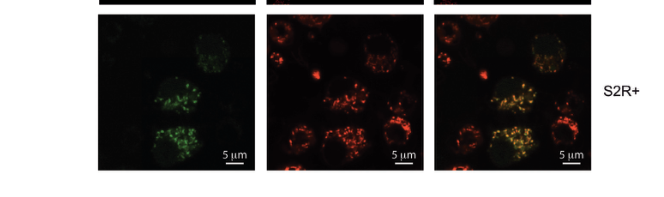

## Question

# Gene Research for Functional Annotation

## ⚠️ CRITICAL: Gene/Protein Identification Context

**BEFORE YOU BEGIN RESEARCH:** You MUST verify you are researching the CORRECT gene/protein. Gene symbols can be ambiguous, especially for less well-characterized genes from non-model organisms.

### Target Gene/Protein Identity (from UniProt):
- **UniProt Accession:** Q9VN03
- **Protein Description:** RecName: Full=ATP-dependent RNA helicase SUV3 homolog, mitochondrial {ECO:0000303|PubMed:26152302}; EC=3.6.4.13 {ECO:0000250|UniProtKB:Q8IYB8}; Flags: Precursor;
- **Gene Information:** Name=Suv3 {ECO:0000312|FlyBase:FBgn0037232}; ORFNames=CG9791 {ECO:0000312|FlyBase:FBgn0037232};
- **Organism (full):** Drosophila melanogaster (Fruit fly).
- **Protein Family:** Belongs to the helicase family. .
- **Key Domains:** DEXQc_SUV3. (IPR055206); Helicase_C-like. (IPR001650); P-loop_NTPase. (IPR027417); SUPV3-like. (IPR050699); SUV3_C. (IPR022192)

### MANDATORY VERIFICATION STEPS:

1. **Check if the gene symbol "Suv3" matches the protein description above**
2. **Verify the organism is correct:** Drosophila melanogaster (Fruit fly).
3. **Check if protein family/domains align with what you find in literature**
4. **If you find literature for a DIFFERENT gene with the same or similar symbol, STOP**

### If Gene Symbol is Ambiguous or You Cannot Find Relevant Literature:

**DO NOT PROCEED WITH RESEARCH ON A DIFFERENT GENE.** Instead:
- State clearly: "The gene symbol 'Suv3' is ambiguous or literature is limited for this specific protein"
- Explain what you found (e.g., "Found extensive literature on a different gene with the same symbol in a different organism")
- Describe the protein based ONLY on the UniProt information provided above
- Suggest that the protein function can be inferred from domain/family information

### Research Target:

Please provide a comprehensive research report on the gene **Suv3** (gene ID: Suv3, UniProt: Q9VN03) in DROME.

The research report should be a detailed narrative explaining the function, biological processes, and localization of the gene product. Citations should be given for all claims.

You should prioritize authoritative reviews and primary scientific literature when conducting research. You can supplement
this with annotations you find in gene/protein databases, but these can be outdated or inaccurate.

We are specifically interested in the primary function of the gene - for enzymes, what reaction is catalyzed, and what is the substrate specificity? For transporters, what is the substrate? For structural proteins or adapters, what is the broader structural role? For signaling molecules, what is the role in the pathway.

We are interested in where in or outside the cell the gene product carries out its function.

We are also interested in the signaling or biochemical pathways in which the gene functions. We are less interested in broad pleiotropic effects, except where these elucidate the precise role.

Include evidence where possible. We are interested in both experimental evidence as well as inference from structure, evolution, or bioinformatic analysis. Precise studies should be prioritized over high-throughput, where available.

## Output

Question: You are an expert researcher providing comprehensive, well-cited information.

Provide detailed information focusing on:
1. Key concepts and definitions with current understanding
2. Recent developments and latest research (prioritize 2023-2024 sources)
3. Current applications and real-world implementations
4. Expert opinions and analysis from authoritative sources
5. Relevant statistics and data from recent studies

Format as a comprehensive research report with proper citations. Include URLs and publication dates where available.
Always prioritize recent, authoritative sources and provide specific citations for all major claims.

# Gene Research for Functional Annotation

## ⚠️ CRITICAL: Gene/Protein Identification Context

**BEFORE YOU BEGIN RESEARCH:** You MUST verify you are researching the CORRECT gene/protein. Gene symbols can be ambiguous, especially for less well-characterized genes from non-model organisms.

### Target Gene/Protein Identity (from UniProt):
- **UniProt Accession:** Q9VN03
- **Protein Description:** RecName: Full=ATP-dependent RNA helicase SUV3 homolog, mitochondrial {ECO:0000303|PubMed:26152302}; EC=3.6.4.13 {ECO:0000250|UniProtKB:Q8IYB8}; Flags: Precursor;
- **Gene Information:** Name=Suv3 {ECO:0000312|FlyBase:FBgn0037232}; ORFNames=CG9791 {ECO:0000312|FlyBase:FBgn0037232};
- **Organism (full):** Drosophila melanogaster (Fruit fly).
- **Protein Family:** Belongs to the helicase family. .
- **Key Domains:** DEXQc_SUV3. (IPR055206); Helicase_C-like. (IPR001650); P-loop_NTPase. (IPR027417); SUPV3-like. (IPR050699); SUV3_C. (IPR022192)

### MANDATORY VERIFICATION STEPS:

1. **Check if the gene symbol "Suv3" matches the protein description above**
2. **Verify the organism is correct:** Drosophila melanogaster (Fruit fly).
3. **Check if protein family/domains align with what you find in literature**
4. **If you find literature for a DIFFERENT gene with the same or similar symbol, STOP**

### If Gene Symbol is Ambiguous or You Cannot Find Relevant Literature:

**DO NOT PROCEED WITH RESEARCH ON A DIFFERENT GENE.** Instead:
- State clearly: "The gene symbol 'Suv3' is ambiguous or literature is limited for this specific protein"
- Explain what you found (e.g., "Found extensive literature on a different gene with the same symbol in a different organism")
- Describe the protein based ONLY on the UniProt information provided above
- Suggest that the protein function can be inferred from domain/family information

### Research Target:

Please provide a comprehensive research report on the gene **Suv3** (gene ID: Suv3, UniProt: Q9VN03) in DROME.

The research report should be a detailed narrative explaining the function, biological processes, and localization of the gene product. Citations should be given for all claims.

You should prioritize authoritative reviews and primary scientific literature when conducting research. You can supplement
this with annotations you find in gene/protein databases, but these can be outdated or inaccurate.

We are specifically interested in the primary function of the gene - for enzymes, what reaction is catalyzed, and what is the substrate specificity? For transporters, what is the substrate? For structural proteins or adapters, what is the broader structural role? For signaling molecules, what is the role in the pathway.

We are interested in where in or outside the cell the gene product carries out its function.

We are also interested in the signaling or biochemical pathways in which the gene functions. We are less interested in broad pleiotropic effects, except where these elucidate the precise role.

Include evidence where possible. We are interested in both experimental evidence as well as inference from structure, evolution, or bioinformatic analysis. Precise studies should be prioritized over high-throughput, where available.

# Functional annotation of *Drosophila melanogaster* Suv3

## Identity and evidence standard

The target is the fruit-fly gene **Suv3/CG9791**, identified in the question by UniProt **Q9VN03**, not the human ortholog **SUPV3L1**. An experimental study independently identified CG9791 as the single fly candidate homolog of human SUPV3L1, reporting **55% protein-sequence identity**. Its assignment as a mitochondrial Suv3-family helicase is consistent with the supplied DEXQc_SUV3, Helicase_C-like, P-loop-NTPase, SUPV3-like and SUV3_C domain annotations; the accession and individual InterPro identifiers are supplied annotations, rather than identifiers independently validated by those experiments. (clemente2015suv3helicaseis pages 3-4, clemente2015suv3helicaseis pages 1-2)

**Functional conclusion.** DmSUV3 is a mitochondrial, ATP-dependent nucleic-acid helicase-family protein required for two closely connected aspects of mitochondrial gene expression: **efficient maturation of polycistronic transcripts, particularly tRNA-containing precursors**, and **surveillance/turnover of mitochondrial mRNAs and antisense RNAs in functional cooperation with PNPase**. It is a helicase, **not the ribonuclease that chemically cleaves tRNA ends or degrades RNA**. The relative importance of its maturation and decay functions depends on the question being tested: the 2015 fly study emphasized the striking tRNA-processing phenotype, whereas subsequent genetic experiments established a substantial role in RNA turnover. (clemente2015suv3helicaseis pages 1-2, pajak2019defectsofmitochondrial pages 3-5, vuckovic2024themolecularmachinery pages 3-4, pajak2019defectsofmitochondrial pages 14-15)

The following evidence map distinguishes measured fly phenotypes from mechanistic inference.

| Molecular question | Direct fly experimental result and statistics | Interpretation and uncertainty | Supporting citations |
|---|---|---|---|
| Identity and localization | A single *D. melanogaster* candidate, **CG9791/DmSuv3**, was identified with **55% protein-sequence identity** to human SUPV3L1. DmSUV3–GFP colocalized with mitochondrial markers in HeLa and fly Schneider 2R+ cells, with no nuclear signal detected. | Strong evidence that CG9791 encodes the fly mitochondrial Suv3 homolog. The experiments establish mitochondrial localization, but not specifically matrix residence or mitochondrial-RNA-granule localization. **Q9VN03 is the user-supplied UniProt identifier.** | (clemente2015suv3helicaseis pages 3-4, clemente2015suv3helicaseis media f52db782, clemente2015suv3helicaseis pages 11-13) |
| Primary molecular activity | The fly protein is assigned to the conserved Ski2-family DExH-box ATP-dependent RNA/DNA helicases, consistent with the supplied DEXQc_SUV3, Helicase_C-like, P-loop-NTPase and SUV3_C annotations. No purified-DmSUV3 ATPase or duplex-unwinding assay was reported in the fly studies examined. | Best annotation: ATP-coupled nucleic-acid helicase/remodeler, not a nuclease. ATP hydrolysis, 3′→5′ translocation and exact RNA-versus-DNA substrate preferences are conserved-family inferences rather than direct DmSUV3 biochemical measurements; human dimerization and 3′-overhang preferences must not be assigned to the fly protein without testing. | (clemente2015suv3helicaseis pages 1-2, chen2023suv3helicaseand pages 2-5, jain2022dimericassemblyof pages 12-13) |
| Mitochondrial tRNA maturation | In DmSuv3-RNAi larvae, **9 of 10 tested mitochondrial tRNAs** were significantly depleted. Northern blotting and junction-spanning qRT-PCR detected precursors retaining 5′ and/or 3′ flanks, including significant accumulation at tRNA^Trp, tRNA^Cys, tRNA^Tyr and tRNA^Gln junctions and longer polycistronic intermediates. | Strong evidence that DmSUV3 is required for efficient maturation of mitochondrial polycistronic RNA. It does **not** establish direct tRNA cleavage by SUV3: canonical 5′ and 3′ cuts are attributed to RNase P and RNase Z/ELAC2, while how SUV3 assists processing remains unresolved—likely RNA remodeling or surveillance. | (clemente2015suv3helicaseis pages 8-11, clemente2015suv3helicaseis pages 4-8, vuckovic2024themolecularmachinery pages 3-4, clemente2015suv3helicaseis pages 11-13) |
| mRNA turnover and cooperation with PNPase | DmSuv3 depletion increased mitochondrial mRNA abundance without broadly increasing transcription or 12S/16S rRNA. Combined DmSuv3/DmPNPase depletion synergistically raised **mt-nd2 up to approximately 30-fold**; simultaneous overexpression strongly depleted mitochondrial transcripts and caused second-instar lethality, whereas either protein alone had little or mild effect. | Strong in-vivo genetic evidence that SUV3 and PNPase form a functional mitochondrial RNA-surveillance unit, with transcript-selective effects. The data demonstrate functional cooperation but not necessarily a permanently assembled complex or direct physical binding in flies. | (clemente2015suv3helicaseis pages 4-8, pajak2019defectsofmitochondrial pages 5-7, pajak2019defectsofmitochondrial pages 3-5, pajak2019defectsofmitochondrial pages 12-14) |
| Polyadenylation, antisense RNA and dsRNA | DmSuv3 loss shortened multiple RNA poly(A) tails; control means were **34–60 A residues**, versus **11–35** after knockdown. Stabilized COX1 antisense RNA in DmPNPase-deficient larvae carried a mean tail of only **5 A residues**. DmSuv3 depletion accumulated antisense RNA and RNase-T1-resistant/RNase-III-sensitive dsRNA; J2 staining and cytosolic-fraction qRT-PCR detected mitochondrial-derived dsRNA outside mitochondria. | Supports coupling of SUV3-dependent surveillance to MTPAP/LRPPRC-regulated RNA maturation and removal of poorly protected antisense RNA. Cytosolic dsRNA and altered antiviral-factor expression are downstream consequences; release mechanism and causality for immune changes remain unresolved. | (clemente2015suv3helicaseis pages 8-11, pajak2019defectsofmitochondrial pages 7-9, pajak2019defectsofmitochondrial pages 9-12, pajak2019defectsofmitochondrial pages 14-15) |
| Translation, respiration and organismal requirement | DmSuv3 knockdown broadly reduced mitochondrial translation and lowered respiratory-chain complexes I, I+III, II+III and IV to approximately **20–30% of control**; nuclear-encoded complex II retained approximately **80%**. RNAi left about **30%** transcript and caused pupal lethality; homozygous P-element animals retained about **10%**, dying as larvae by four days after egg laying. | Establishes that DmSUV3-dependent RNA processing and surveillance are essential for mitochondrial gene expression, OXPHOS and development. These are downstream physiological effects rather than evidence of an additional direct respiratory-chain role. | (clemente2015suv3helicaseis pages 4-8, clemente2015suv3helicaseis pages 3-4, clemente2015suv3helicaseis pages 11-13) |

*Table: Evidence grading for *Drosophila melanogaster* Suv3/CG9791, separating direct fly experiments from conserved-family inference. It highlights established mitochondrial RNA functions while flagging unresolved catalytic and localization details.*

## Molecular activity and substrate specificity

The most defensible reaction-level annotation is **ATP-coupled unwinding or remodeling of structured nucleic acids**, allowing mitochondrial RNA precursors to be processed and unwanted transcripts to be removed. The ATPase/helicase interpretation follows Suv3 family conservation and the supplied P-loop and helicase-domain annotations; the fly genetic studies did **not** purify DmSUV3 to establish an ATP-hydrolysis rate, a catalytic residue, or a kinetic preference among RNA–RNA, RNA–DNA and DNA–DNA substrates. Nor did they show that DmSUV3 directly hydrolyzes an RNA phosphodiester bond. The canonical tRNA-end-cleaving activities belong to mitochondrial RNase P at the 5′ end and RNase Z at the 3′ end; the 2024 processing review explicitly says **how Suv3 assists processing remains unclear**. (clemente2015suv3helicaseis pages 1-2, vuckovic2024themolecularmachinery pages 3-4, clemente2015suv3helicaseis pages 11-13)

A **3′-to-5′ helicase direction** is described for the Suv3 family, and the proposed SUV3–PNPase RNA-removal machinery acts on RNA in the 3′-to-5′ direction. As an informative **human-ortholog comparison only**, purified dimeric human Suv3 favors duplex substrates with a **3′ overhang of at least 10 nucleotides**, including RNA–RNA, RNA–DNA and DNA–DNA duplexes; removing its C-terminal tail impairs unwinding by roughly **six- to sevenfold**. Those precise substrate and dimerization properties have **not** been established for Q9VN03 and should not be entered as fly-specific biochemical facts. PNPase supplies the 3′-to-5′ phosphorolytic exoribonuclease activity associated with the proposed fly degradation pathway. (clemente2015suv3helicaseis pages 1-2, pajak2019defectsofmitochondrial pages 2-3, pajak2019defectsofmitochondrial pages 12-14, jain2022dimericassemblyof pages 12-13)

## Site of action: mitochondria, with finer localization unresolved

DmSUV3–GFP overlapped a mitochondrial dye in both *Drosophila* Schneider 2R+ cells and transfected human HeLa cells. No nuclear signal was detected under those experimental conditions. The fly-cell colocalization is visible in the cropped **Figure 1A** evidence; the tested fusion protein therefore has direct evidence for **mitochondrial**, rather than extracellular or principally nuclear, action. Its precursor annotation and predicted mitochondrial-targeting sequence are compatible with import, but these imaging experiments alone do **not** resolve its position within mitochondrial subcompartments or demonstrate specific occupancy of mitochondrial RNA granules. Matrix localization is supported by conserved Suv3 biology and by the intramitochondrial RNA substrates; it should be labeled an inference for the fly protein rather than a demonstrated submitochondrial fractionation result. (clemente2015suv3helicaseis pages 3-4, clemente2015suv3helicaseis media f52db782, clemente2015suv3helicaseis pages 11-13, chen2023suv3helicaseand pages 2-5)

## Direct fly evidence: transcript maturation

Mitochondrial transcription produces long RNA precursors that must yield usable mRNAs, rRNAs and tRNAs. When DmSuv3 was knocked down, **9 of 10 tested mitochondrial tRNAs declined significantly**, while high-resolution Northern blots and junction-spanning assays detected precursor RNAs retaining 5′ and/or 3′ neighboring sequences. Affected junctions included those involving tRNA^Trp, tRNA^Cys, tRNA^Tyr and tRNA^Gln; some longer precursors also retained adjacent mRNA and antisense-tRNA regions. Effects differed by junction, rather than uniformly affecting every tRNA. This combination—loss of mature tRNAs together with retained precursor junctions—is substantially more informative about Suv3’s immediate function than the downstream respiratory phenotype alone. (clemente2015suv3helicaseis pages 8-11, clemente2015suv3helicaseis pages 4-8, clemente2015suv3helicaseis pages 11-13)

Depleting DmPNPase also raised mRNA abundance but, in the 2015 comparison, **did not reproduce the marked tRNA depletion and precursor-processing phenotype**. This is why those authors proposed a PNPase-independent contribution of DmSUV3 to precursor maturation. One mechanistic hypothesis is that the helicase resolves RNA structures that otherwise impede access or correct presentation to RNase P and RNase Z; **this remains a hypothesis, not a demonstration of direct physical interaction or direct tRNA cleavage in flies**. The 2024 authoritative review likewise describes Suv3-associated processing defects across organisms but identifies the mechanism as unresolved; a reported Suv3 association with processing nucleases comes from **yeast**, not an established Drosophila complex. (clemente2015suv3helicaseis pages 11-13, vuckovic2024themolecularmachinery pages 3-4)

## Direct fly evidence: RNA surveillance, polyadenylation and pathway partners

DmSuv3 loss increased steady-state mitochondrial **mRNAs**, without a commensurate broad increase in newly transcribed RNA or in 12S/16S **rRNAs**. This supports altered post-transcriptional RNA metabolism, although increased steady-state abundance alone cannot identify a direct helicase substrate. The subsequent study tested partner function genetically: simultaneous DmSuv3/DmPNPase depletion produced up to an approximately **30-fold elevation of mt-nd2 RNA**, exceeding effects on that transcript from individual perturbations. Conversely, simultaneous overexpression caused marked mitochondrial transcript depletion and **second-instar larval lethality**, while either protein alone had little or mild effects. These results strongly support a **functional SUV3–PNPase surveillance unit in flies**; by themselves they do not establish that every active molecule resides in a stable, physically isolated complex. (clemente2015suv3helicaseis pages 3-4, pajak2019defectsofmitochondrial pages 3-5, pajak2019defectsofmitochondrial pages 5-7)

The pathway also involves **MTPAP**, which adds 3′ adenosines, and **LRPPRC**, which stabilizes sense mRNAs and supports full polyadenylation. DmSuv3 knockdown shortened poly(A) tails on examined mitochondrial transcripts: reported mean control lengths ranged from **34–60 adenosines**, compared with **11–35** in knockdown samples. PNPase loss instead lengthened examined tails. Depleting either SUV3 or PNPase partly stabilized transcripts in an LRPPRC-depleted background, consistent with LRPPRC protecting coding RNA from surveillance. Importantly, PNPase overexpression still reduced mRNA abundance without MTPAP, so a poly(A) tail is **not obligatory** for the observed RNA loss under that experimental condition. These experiments implicate SUV3 in an interconnected **RNA maturation–stabilization–decay pathway**, not as the polymerase that adds adenosines. (clemente2015suv3helicaseis pages 8-11, pajak2019defectsofmitochondrial pages 5-7, pajak2019defectsofmitochondrial pages 7-9)

Antisense mitochondrial RNAs are an especially informative surveillance substrate. They accumulated after Suv3 or PNPase disruption; in PNPase-deficient flies, the tested COX1-antisense species carried only approximately **five 3′ adenosines on average**, consistent with limited tailing rather than mature sense-mRNA-like polyadenylation. Loss of Suv3, PNPase or MTPAP allowed sense and antisense RNAs to form **double-stranded RNA (dsRNA)**: the accumulated material resisted a single-strand-preferring RNase but was removed by RNase III. Larval-brain staining and assays of cytosolic fractions further supported accumulation of mitochondrial-derived dsRNA outside mitochondria after Suv3 depletion. How this RNA exits mitochondria remains unknown, and these observations do not mean Suv3 itself functions in the cytosol. (pajak2019defectsofmitochondrial pages 7-9, pajak2019defectsofmitochondrial pages 9-12, pajak2019defectsofmitochondrial pages 14-15)

Cytosolic dsRNA was associated with changes in fly antiviral-response transcripts, including **Dicer2, Ago2 and R2D2**, with a milder response in the Suv3-knockdown animals than in some other models. This is a **downstream consequence of disturbed mitochondrial RNA surveillance**, not evidence that Suv3 is an antiviral receptor or a direct member of a signaling cascade. The mammalian **MDA5–MAVS–interferon** pathway discussed in comparative literature is **not conserved as such in flies**, and a change in antiviral transcript levels is not proof of increased viral susceptibility without an infection experiment. (pajak2019defectsofmitochondrial pages 9-12, pajak2019defectsofmitochondrial pages 14-15)

## Physiological importance and interpretation of recent research

The processing/surveillance defect reduced synthesis of mitochondrially encoded proteins and respiratory-chain activity. In Suv3-RNAi larvae, activities involving complexes **I, I+III, II+III and IV were approximately 20–30% of controls**, while entirely nuclear-encoded complex II retained approximately **80%**. Ubiquitous RNAi left roughly **30%** of control Suv3 transcript and caused **pupal lethality**; a homozygous CG9791 P-element insertion left roughly **10%** and caused **larval death by four days after egg laying**. These are powerful validations of biological necessity, but respiratory failure and developmental lethality are **consequences**, not separate catalytic annotations for the protein. (clemente2015suv3helicaseis pages 4-8, clemente2015suv3helicaseis pages 3-4)

Recent syntheses clarify rather than replace the fly experiments. **Vučković and colleagues (2024)** emphasize that Suv3-associated defects in precursor maturation span species but that the precise contribution to cleavage remains unresolved. **Chen (2023)** describes conserved mitochondrial RNA-surveillance machinery in which SUV3 unwinds structured RNA to facilitate other enzymes; species differences in nuclease partners require caution. More recent human-cell imaging has associated SUV3 with mitochondrial RNA-granule/dsRNA foci, but it does not establish that Q9VN03 occupies equivalent fly structures. The most informative direct mechanistic fly studies located for this report remain the **2015 and 2019 primary experiments**; available 2023–2024 work does not justify replacing them with a human-specific mechanistic annotation. (vuckovic2024themolecularmachinery pages 3-4, chen2023suv3helicaseand pages 2-5, xavier2024mitochondrialdoublestrandedrna pages 4-6, clemente2015suv3helicaseis pages 3-4, pajak2019defectsofmitochondrial pages 14-15)

**Research use and limits.** CG9791 depletion and combined perturbation with DmPNPase, MTPAP or LRPPRC are implemented as *in vivo* fly-genetics tools for separating mitochondrial precursor maturation from transcript turnover and examining how disturbed RNA quality control generates cytosolic dsRNA. These findings support **functional annotation and model-organism research**, not a demonstrated clinical application or a fly-specific drug target. The most consequential missing experiments are purified-fly-protein ATPase/unwinding and substrate comparisons, submitochondrial mapping, and tests of direct physical contacts with PNPase or tRNA-processing enzymes. (clemente2015suv3helicaseis pages 3-4, pajak2019defectsofmitochondrial pages 5-7, vuckovic2024themolecularmachinery pages 3-4, pajak2019defectsofmitochondrial pages 9-12)

### Principal sources and dates

- Clemente P *et al.* **“SUV3 helicase is required for correct processing of mitochondrial transcripts.”** *Nucleic Acids Research* **43**, 7398–7413; published online **7 July 2015**. https://doi.org/10.1093/nar/gkv692. Direct fly identity, localization, precursor-processing and loss-of-function experiments. (clemente2015suv3helicaseis pages 1-2, clemente2015suv3helicaseis pages 3-4)
- Pajak A *et al.* **“Defects of mitochondrial RNA turnover lead to the accumulation of double-stranded RNA in vivo.”** *PLOS Genetics* **15**, e1008240; **31 July 2019**. https://doi.org/10.1371/journal.pgen.1008240. Direct fly PNPase/Suv3 genetic interaction, RNA-tail, antisense-RNA and dsRNA experiments. (pajak2019defectsofmitochondrial pages 5-7, pajak2019defectsofmitochondrial pages 9-12)
- Chen P-L. **“SUV3 Helicase and Mitochondrial Homeostasis.”** *International Journal of Molecular Sciences* **24**, 9233; **May 2023**. https://doi.org/10.3390/ijms24119233. Comparative review; not primary evidence for fly-specific kinetics or localization. (chen2023suv3helicaseand pages 2-5)
- Vučković A *et al.* **“The molecular machinery for maturation of primary mtDNA transcripts.”** *Human Molecular Genetics* **33**, R19–R25; **May 2024**. https://doi.org/10.1093/hmg/ddae023. Recent assessment of processing mechanisms and the unresolved Suv3 contribution. (vuckovic2024themolecularmachinery pages 3-4)
- Jain M *et al.* **“Dimeric assembly of human Suv3 helicase promotes its RNA unwinding function in mitochondrial RNA degradosome for RNA decay.”** *Protein Science* **31**, e4312; **2022**. https://doi.org/10.1002/pro.4312. Human-ortholog biochemical comparison **only**. (jain2022dimericassemblyof pages 12-13)

References

1. (clemente2015suv3helicaseis pages 3-4): Paula Clemente, Aleksandra Pajak, Isabelle Laine, Rolf Wibom, Anna Wedell, Christoph Freyer, and Anna Wredenberg. Suv3 helicase is required for correct processing of mitochondrial transcripts. Nucleic Acids Research, 43:7398-7413, Jul 2015. URL: https://doi.org/10.1093/nar/gkv692, doi:10.1093/nar/gkv692. This article has 36 citations and is from a highest quality peer-reviewed journal.

2. (clemente2015suv3helicaseis pages 1-2): Paula Clemente, Aleksandra Pajak, Isabelle Laine, Rolf Wibom, Anna Wedell, Christoph Freyer, and Anna Wredenberg. Suv3 helicase is required for correct processing of mitochondrial transcripts. Nucleic Acids Research, 43:7398-7413, Jul 2015. URL: https://doi.org/10.1093/nar/gkv692, doi:10.1093/nar/gkv692. This article has 36 citations and is from a highest quality peer-reviewed journal.

3. (pajak2019defectsofmitochondrial pages 3-5): Aleksandra Pajak, Isabelle Laine, Paula Clemente, Najla El-Fissi, Florian A. Schober, Camilla Maffezzini, Javier Calvo-Garrido, Rolf Wibom, Roberta Filograna, Ashish Dhir, Anna Wedell, Christoph Freyer, and Anna Wredenberg. Defects of mitochondrial rna turnover lead to the accumulation of double-stranded rna in vivo. PLOS Genetics, 15:e1008240, Jul 2019. URL: https://doi.org/10.1371/journal.pgen.1008240, doi:10.1371/journal.pgen.1008240. This article has 74 citations and is from a domain leading peer-reviewed journal.

4. (vuckovic2024themolecularmachinery pages 3-4): Ana Vučković, Christoph Freyer, Anna Wredenberg, and Hauke S Hillen. The molecular machinery for maturation of primary mtdna transcripts. Human Molecular Genetics, 33:R19-R25, May 2024. URL: https://doi.org/10.1093/hmg/ddae023, doi:10.1093/hmg/ddae023. This article has 18 citations and is from a domain leading peer-reviewed journal.

5. (pajak2019defectsofmitochondrial pages 14-15): Aleksandra Pajak, Isabelle Laine, Paula Clemente, Najla El-Fissi, Florian A. Schober, Camilla Maffezzini, Javier Calvo-Garrido, Rolf Wibom, Roberta Filograna, Ashish Dhir, Anna Wedell, Christoph Freyer, and Anna Wredenberg. Defects of mitochondrial rna turnover lead to the accumulation of double-stranded rna in vivo. PLOS Genetics, 15:e1008240, Jul 2019. URL: https://doi.org/10.1371/journal.pgen.1008240, doi:10.1371/journal.pgen.1008240. This article has 74 citations and is from a domain leading peer-reviewed journal.

6. (clemente2015suv3helicaseis media f52db782): Paula Clemente, Aleksandra Pajak, Isabelle Laine, Rolf Wibom, Anna Wedell, Christoph Freyer, and Anna Wredenberg. Suv3 helicase is required for correct processing of mitochondrial transcripts. Nucleic Acids Research, 43:7398-7413, Jul 2015. URL: https://doi.org/10.1093/nar/gkv692, doi:10.1093/nar/gkv692. This article has 36 citations and is from a highest quality peer-reviewed journal.

7. (clemente2015suv3helicaseis pages 11-13): Paula Clemente, Aleksandra Pajak, Isabelle Laine, Rolf Wibom, Anna Wedell, Christoph Freyer, and Anna Wredenberg. Suv3 helicase is required for correct processing of mitochondrial transcripts. Nucleic Acids Research, 43:7398-7413, Jul 2015. URL: https://doi.org/10.1093/nar/gkv692, doi:10.1093/nar/gkv692. This article has 36 citations and is from a highest quality peer-reviewed journal.

8. (chen2023suv3helicaseand pages 2-5): Phang-Lang Chen. Suv3 helicase and mitochondrial homeostasis. International Journal of Molecular Sciences, 24:9233, May 2023. URL: https://doi.org/10.3390/ijms24119233, doi:10.3390/ijms24119233. This article has 7 citations.

9. (jain2022dimericassemblyof pages 12-13): Monika Jain, Bagher Golzarroshan, Chia‐Liang Lin, Sashank Agrawal, Wei‐Hsuan Tang, Chiu‐Ju Wu, and Hanna S. Yuan. Dimeric assembly of human suv3 helicase promotes its rna unwinding function in mitochondrial rna degradosome for rna decay. Protein Science : A Publication of the Protein Society, Apr 2022. URL: https://doi.org/10.1002/pro.4312, doi:10.1002/pro.4312. This article has 18 citations.

10. (clemente2015suv3helicaseis pages 8-11): Paula Clemente, Aleksandra Pajak, Isabelle Laine, Rolf Wibom, Anna Wedell, Christoph Freyer, and Anna Wredenberg. Suv3 helicase is required for correct processing of mitochondrial transcripts. Nucleic Acids Research, 43:7398-7413, Jul 2015. URL: https://doi.org/10.1093/nar/gkv692, doi:10.1093/nar/gkv692. This article has 36 citations and is from a highest quality peer-reviewed journal.

11. (clemente2015suv3helicaseis pages 4-8): Paula Clemente, Aleksandra Pajak, Isabelle Laine, Rolf Wibom, Anna Wedell, Christoph Freyer, and Anna Wredenberg. Suv3 helicase is required for correct processing of mitochondrial transcripts. Nucleic Acids Research, 43:7398-7413, Jul 2015. URL: https://doi.org/10.1093/nar/gkv692, doi:10.1093/nar/gkv692. This article has 36 citations and is from a highest quality peer-reviewed journal.

12. (pajak2019defectsofmitochondrial pages 5-7): Aleksandra Pajak, Isabelle Laine, Paula Clemente, Najla El-Fissi, Florian A. Schober, Camilla Maffezzini, Javier Calvo-Garrido, Rolf Wibom, Roberta Filograna, Ashish Dhir, Anna Wedell, Christoph Freyer, and Anna Wredenberg. Defects of mitochondrial rna turnover lead to the accumulation of double-stranded rna in vivo. PLOS Genetics, 15:e1008240, Jul 2019. URL: https://doi.org/10.1371/journal.pgen.1008240, doi:10.1371/journal.pgen.1008240. This article has 74 citations and is from a domain leading peer-reviewed journal.

13. (pajak2019defectsofmitochondrial pages 12-14): Aleksandra Pajak, Isabelle Laine, Paula Clemente, Najla El-Fissi, Florian A. Schober, Camilla Maffezzini, Javier Calvo-Garrido, Rolf Wibom, Roberta Filograna, Ashish Dhir, Anna Wedell, Christoph Freyer, and Anna Wredenberg. Defects of mitochondrial rna turnover lead to the accumulation of double-stranded rna in vivo. PLOS Genetics, 15:e1008240, Jul 2019. URL: https://doi.org/10.1371/journal.pgen.1008240, doi:10.1371/journal.pgen.1008240. This article has 74 citations and is from a domain leading peer-reviewed journal.

14. (pajak2019defectsofmitochondrial pages 7-9): Aleksandra Pajak, Isabelle Laine, Paula Clemente, Najla El-Fissi, Florian A. Schober, Camilla Maffezzini, Javier Calvo-Garrido, Rolf Wibom, Roberta Filograna, Ashish Dhir, Anna Wedell, Christoph Freyer, and Anna Wredenberg. Defects of mitochondrial rna turnover lead to the accumulation of double-stranded rna in vivo. PLOS Genetics, 15:e1008240, Jul 2019. URL: https://doi.org/10.1371/journal.pgen.1008240, doi:10.1371/journal.pgen.1008240. This article has 74 citations and is from a domain leading peer-reviewed journal.

15. (pajak2019defectsofmitochondrial pages 9-12): Aleksandra Pajak, Isabelle Laine, Paula Clemente, Najla El-Fissi, Florian A. Schober, Camilla Maffezzini, Javier Calvo-Garrido, Rolf Wibom, Roberta Filograna, Ashish Dhir, Anna Wedell, Christoph Freyer, and Anna Wredenberg. Defects of mitochondrial rna turnover lead to the accumulation of double-stranded rna in vivo. PLOS Genetics, 15:e1008240, Jul 2019. URL: https://doi.org/10.1371/journal.pgen.1008240, doi:10.1371/journal.pgen.1008240. This article has 74 citations and is from a domain leading peer-reviewed journal.

16. (pajak2019defectsofmitochondrial pages 2-3): Aleksandra Pajak, Isabelle Laine, Paula Clemente, Najla El-Fissi, Florian A. Schober, Camilla Maffezzini, Javier Calvo-Garrido, Rolf Wibom, Roberta Filograna, Ashish Dhir, Anna Wedell, Christoph Freyer, and Anna Wredenberg. Defects of mitochondrial rna turnover lead to the accumulation of double-stranded rna in vivo. PLOS Genetics, 15:e1008240, Jul 2019. URL: https://doi.org/10.1371/journal.pgen.1008240, doi:10.1371/journal.pgen.1008240. This article has 74 citations and is from a domain leading peer-reviewed journal.

17. (xavier2024mitochondrialdoublestrandedrna pages 4-6): Vanessa Xavier, Silvia Martinelli, Ryan Corbyn, Rachel Pennie, Kai Rakovic, Ian R Powley, Leah Officer-Jones, Vincenzo Ruscica, Alison Galloway, Leo M Carlin, Victoria H Cowling, John Le Quesne, Jean-Claude Martinou, and Thomas MacVicar. Mitochondrial double-stranded rna homeostasis depends on cell-cycle progression. Life Science Alliance, 7:e202402764, Aug 2024. URL: https://doi.org/10.26508/lsa.202402764, doi:10.26508/lsa.202402764. This article has 13 citations and is from a peer-reviewed journal.

## Artifacts

- [Edison artifact artifact-00](Suv3-deep-research-falcon_artifacts/artifact-00.md)

## Citations

1. vuckovic2024themolecularmachinery pages 3-4
2. jain2022dimericassemblyof pages 12-13
3. pajak2019defectsofmitochondrial pages 3-5
4. pajak2019defectsofmitochondrial pages 14-15
5. pajak2019defectsofmitochondrial pages 5-7
6. pajak2019defectsofmitochondrial pages 12-14
7. pajak2019defectsofmitochondrial pages 7-9
8. pajak2019defectsofmitochondrial pages 9-12
9. pajak2019defectsofmitochondrial pages 2-3
10. xavier2024mitochondrialdoublestrandedrna pages 4-6
11. https://doi.org/10.1093/nar/gkv692.
12. https://doi.org/10.1371/journal.pgen.1008240.
13. https://doi.org/10.3390/ijms24119233.
14. https://doi.org/10.1093/hmg/ddae023.
15. https://doi.org/10.1002/pro.4312.
16. https://doi.org/10.1093/nar/gkv692,
17. https://doi.org/10.1371/journal.pgen.1008240,
18. https://doi.org/10.1093/hmg/ddae023,
19. https://doi.org/10.3390/ijms24119233,
20. https://doi.org/10.1002/pro.4312,
21. https://doi.org/10.26508/lsa.202402764,