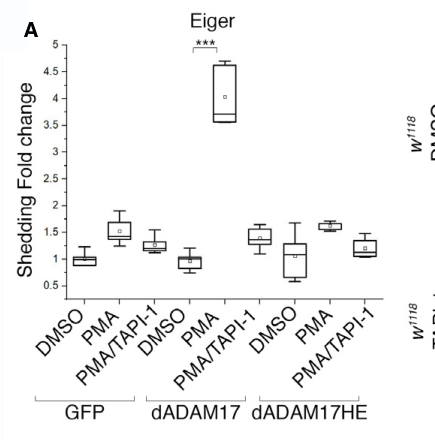

## Question

# Gene Research for Functional Annotation

## ⚠️ CRITICAL: Gene/Protein Identification Context

**BEFORE YOU BEGIN RESEARCH:** You MUST verify you are researching the CORRECT gene/protein. Gene symbols can be ambiguous, especially for less well-characterized genes from non-model organisms.

### Target Gene/Protein Identity (from UniProt):
- **UniProt Accession:** Q9VAC5
- **Protein Description:** RecName: Full=ADAM 17-like protease; EC=3.4.24.-; Flags: Precursor;
- **Gene Information:** Name=Tace; ORFNames=CG7908;
- **Organism (full):** Drosophila melanogaster (Fruit fly).
- **Protein Family:** Not specified in UniProt
- **Key Domains:** ADAM10_ADAM17. (IPR034025); ADAM17_MPD. (IPR032029); ADAM_Metalloproteinase. (IPR051489); Disintegrin_dom. (IPR001762); Disintegrin_dom_sf. (IPR036436)

### MANDATORY VERIFICATION STEPS:

1. **Check if the gene symbol "Tace" matches the protein description above**
2. **Verify the organism is correct:** Drosophila melanogaster (Fruit fly).
3. **Check if protein family/domains align with what you find in literature**
4. **If you find literature for a DIFFERENT gene with the same or similar symbol, STOP**

### If Gene Symbol is Ambiguous or You Cannot Find Relevant Literature:

**DO NOT PROCEED WITH RESEARCH ON A DIFFERENT GENE.** Instead:
- State clearly: "The gene symbol 'Tace' is ambiguous or literature is limited for this specific protein"
- Explain what you found (e.g., "Found extensive literature on a different gene with the same symbol in a different organism")
- Describe the protein based ONLY on the UniProt information provided above
- Suggest that the protein function can be inferred from domain/family information

### Research Target:

Please provide a comprehensive research report on the gene **Tace** (gene ID: Tace, UniProt: Q9VAC5) in DROME.

The research report should be a detailed narrative explaining the function, biological processes, and localization of the gene product. Citations should be given for all claims.

You should prioritize authoritative reviews and primary scientific literature when conducting research. You can supplement
this with annotations you find in gene/protein databases, but these can be outdated or inaccurate.

We are specifically interested in the primary function of the gene - for enzymes, what reaction is catalyzed, and what is the substrate specificity? For transporters, what is the substrate? For structural proteins or adapters, what is the broader structural role? For signaling molecules, what is the role in the pathway.

We are interested in where in or outside the cell the gene product carries out its function.

We are also interested in the signaling or biochemical pathways in which the gene functions. We are less interested in broad pleiotropic effects, except where these elucidate the precise role.

Include evidence where possible. We are interested in both experimental evidence as well as inference from structure, evolution, or bioinformatic analysis. Precise studies should be prioritized over high-throughput, where available.

## Output

Question: You are an expert researcher providing comprehensive, well-cited information.

Provide detailed information focusing on:
1. Key concepts and definitions with current understanding
2. Recent developments and latest research (prioritize 2023-2024 sources)
3. Current applications and real-world implementations
4. Expert opinions and analysis from authoritative sources
5. Relevant statistics and data from recent studies

Format as a comprehensive research report with proper citations. Include URLs and publication dates where available.
Always prioritize recent, authoritative sources and provide specific citations for all major claims.

# Gene Research for Functional Annotation

## ⚠️ CRITICAL: Gene/Protein Identification Context

**BEFORE YOU BEGIN RESEARCH:** You MUST verify you are researching the CORRECT gene/protein. Gene symbols can be ambiguous, especially for less well-characterized genes from non-model organisms.

### Target Gene/Protein Identity (from UniProt):
- **UniProt Accession:** Q9VAC5
- **Protein Description:** RecName: Full=ADAM 17-like protease; EC=3.4.24.-; Flags: Precursor;
- **Gene Information:** Name=Tace; ORFNames=CG7908;
- **Organism (full):** Drosophila melanogaster (Fruit fly).
- **Protein Family:** Not specified in UniProt
- **Key Domains:** ADAM10_ADAM17. (IPR034025); ADAM17_MPD. (IPR032029); ADAM_Metalloproteinase. (IPR051489); Disintegrin_dom. (IPR001762); Disintegrin_dom_sf. (IPR036436)

### MANDATORY VERIFICATION STEPS:

1. **Check if the gene symbol "Tace" matches the protein description above**
2. **Verify the organism is correct:** Drosophila melanogaster (Fruit fly).
3. **Check if protein family/domains align with what you find in literature**
4. **If you find literature for a DIFFERENT gene with the same or similar symbol, STOP**

### If Gene Symbol is Ambiguous or You Cannot Find Relevant Literature:

**DO NOT PROCEED WITH RESEARCH ON A DIFFERENT GENE.** Instead:
- State clearly: "The gene symbol 'Tace' is ambiguous or literature is limited for this specific protein"
- Explain what you found (e.g., "Found extensive literature on a different gene with the same symbol in a different organism")
- Describe the protein based ONLY on the UniProt information provided above
- Suggest that the protein function can be inferred from domain/family information

### Research Target:

Please provide a comprehensive research report on the gene **Tace** (gene ID: Tace, UniProt: Q9VAC5) in DROME.

The research report should be a detailed narrative explaining the function, biological processes, and localization of the gene product. Citations should be given for all claims.

You should prioritize authoritative reviews and primary scientific literature when conducting research. You can supplement
this with annotations you find in gene/protein databases, but these can be outdated or inaccurate.

We are specifically interested in the primary function of the gene - for enzymes, what reaction is catalyzed, and what is the substrate specificity? For transporters, what is the substrate? For structural proteins or adapters, what is the broader structural role? For signaling molecules, what is the role in the pathway.

We are interested in where in or outside the cell the gene product carries out its function.

We are also interested in the signaling or biochemical pathways in which the gene functions. We are less interested in broad pleiotropic effects, except where these elucidate the precise role.

Include evidence where possible. We are interested in both experimental evidence as well as inference from structure, evolution, or bioinformatic analysis. Precise studies should be prioritized over high-throughput, where available.

# Functional annotation of *Drosophila melanogaster* Tace (CG7908; UniProt Q9VAC5)

## Identity and principal function

The requested protein is the fruit-fly **Tace/ADAM17-like protease encoded by CG7908**, not mammalian ADAM17 and not the distinct fly ADAM10 ortholog Kuzbanian. Primary research explicitly identifies CG7908 as the fly’s Tace-encoding gene; a separate study distinguishes ADAM17 mutant phenotypes from those of *kuzbanian* mutants. The ADAM metalloproteinase and disintegrin domains specified for Q9VAC5 are consistent with this identification. (agrawal2016thedrosophilatnf pages 4-5, muliyil2020adam17‐triggeredtnfsignalling pages 2-4)

**The best-established molecular function is ectodomain shedding of Eiger, the fly TNF-family ligand.** Tace cleaves membrane-associated Eiger to enable release of its extracellular signaling portion. In cultured fly S2R+ cells, expressed wild-type fly ADAM17 released an alkaline-phosphatase-tagged Eiger reporter after PMA stimulation; a catalytic-site mutant failed to do so, and the ADAM-protease inhibitor TAPI-1 blocked release. This directly establishes catalytic dependence in a cell-based assay, although it does not map the precise Eiger cleavage bond or quantify cleavage kinetics with purified enzyme. (muliyil2020adam17‐triggeredtnfsignalling pages 7-9, muliyil2020adam17‐triggeredtnfsignalling media e7b29083)

Tace is therefore best annotated as a **membrane-associated, zinc-dependent ADAM-type protein-shedding protease** whose experimentally demonstrated fly-ligand substrate is Eiger. The UniProt-provided precursor annotation and ADAM/metalloproteinase–disintegrin domains support a secretory-pathway protein with an extracellular-facing catalytic region; shedding places its demonstrated action at the interface between a cell membrane and the extracellular space. The cited fly experiments establish this functional topology more securely than they establish an exact steady-state subcellular distribution. Fly ADAM17 also cleaved a *mammalian* IL-1RII reporter in an experimental assay, demonstrating broader catalytic competence **without** establishing IL-1RII as a physiological fly substrate. Mammalian ADAM17 substrate lists, including EGFR ligands, should not be assigned wholesale to CG7908. (muliyil2020adam17‐triggeredtnfsignalling pages 7-9, muliyil2020adam17‐triggeredtnfsignalling pages 18-19)

The following evidence map distinguishes biochemical demonstration from genetic pathway inference:

| Context | Molecular observation | Evidence tier and limits | Paper DOI / publication date |
|---|---|---|---|
| **Eiger shedding in S2R+ cells** | Wild-type fly Tace/ADAM17 shed alkaline-phosphatase-tagged Eiger after PMA stimulation; a catalytic-site mutant did not, and TAPI-1 inhibited shedding. | **Direct biochemical evidence; strongest endogenous-fly substrate assignment.** The assay used tagged Eiger in cultured cells rather than endogenous protein in intact flies. (muliyil2020adam17‐triggeredtnfsignalling pages 7-9, muliyil2020adam17‐triggeredtnfsignalling media e7b29083) | [10.15252/embj.2020104415](https://doi.org/10.15252/embj.2020104415) — July 2020 |
| **Adipose Eiger release during amino-acid restriction** | Low-protein diet increased **CG7908/Tace** transcription in larval fat body. Fat-body Tace knockdown strongly reduced short, circulating Eiger in hemolymph; soluble Eiger subsequently acted through Grindelwald/JNK in brain insulin-producing cells. | **Strong in-vivo genetic and protein-form evidence.** Supports Tace-dependent release from fat cells, but the study did not directly assay purified-enzyme cleavage or map the Eiger scissile bond. (agrawal2016thedrosophilatnf pages 4-5, agrawal2016thedrosophilatnf pages 5-6) | [10.1016/j.cmet.2016.03.003](https://doi.org/10.1016/j.cmet.2016.03.003) — April 12, 2016 |
| **Pigmented retinal glia** | ADAM17 protein was enriched in pigmented glial cells surrounding photoreceptors. Glial—but not neuronal—knockdown caused lipid-droplet accumulation and progressive degeneration; glial re-expression rescued the mutant phenotype. Eiger and Grindelwald loss partly phenocopied Tace loss. | **Strong cell-specific genetic and localization evidence.** Establishes the functional cellular compartment and supports an ADAM17–Eiger–Grindelwald pathway, but delayed Eiger/Grindelwald phenotypes indicate that additional substrates or mechanisms remain possible. (muliyil2020adam17‐triggeredtnfsignalling pages 2-4, muliyil2020adam17‐triggeredtnfsignalling pages 9-10, muliyil2020adam17‐triggeredtnfsignalling pages 15-17) | [10.15252/embj.2020104415](https://doi.org/10.15252/embj.2020104415) — July 2020 |
| **RasV12 eye-disc tumor clones** | Tace RNAi in RasV12 cells abolished extracellular Eiger accumulation around clones; Tace depletion also suppressed Eiger-dependent phenotypes, while Tace/Eiger co-expression enhanced non-autonomous signaling. | **Genetic and imaging evidence.** Shows that Tace is required for Eiger release/signaling in this model, but does not biochemically distinguish ectodomain shedding from Sec15-dependent vesicular export or identify the exact site of proteolysis. (chabu2014oncogenicrasstimulates pages 4-5, chabu2014oncogenicrasstimulates pages 3-4) | [10.1242/dev.108092](https://doi.org/10.1242/dev.108092) — December 2014 |
| **Glia-to-neuron Eiger signaling during neurite pruning** | Glial Eiger and neuronal Wengen/Grindelwald–JNK signaling promoted pruning of class-IV dendritic-arborization neurons. The authors proposed Tace-mediated release but did **not** test Tace genetically or biochemically. | **Pathway evidence only; no Tace-specific evidence.** This study cannot be used to annotate neurite pruning as an experimentally established Tace function. (zheng2025glialderivedtnfeigersignaling pages 10-12) | [10.1007/s00018-024-05560-1](https://doi.org/10.1007/s00018-024-05560-1) — January 2025 |
| **Mammalian IL-1RII reporter substrate** | Fly ADAM17 cleaved alkaline-phosphatase-tagged mammalian IL-1RII in a heterologous cell assay. | **Direct catalytic-competence evidence, not an endogenous fly substrate.** Demonstrates overlapping proteolytic capability with mammalian ADAM17 but does not establish physiological IL-1RII processing in *Drosophila*. (muliyil2020adam17‐triggeredtnfsignalling pages 7-9, muliyil2020adam17‐triggeredtnfsignalling pages 18-19) | [10.15252/embj.2020104415](https://doi.org/10.15252/embj.2020104415) — July 2020 |

*Table: Evidence-tier summary for confirmed Drosophila melanogaster Tace/CG7908 (Q9VAC5), distinguishing direct Eiger shedding from genetic pathway evidence and untested hypotheses. It also separates the heterologous mammalian IL-1RII result from physiological fly-substrate evidence.*

## Where Tace functions and what its cleavage accomplishes

**Larval fat body: endocrine nutrient signaling.** Under low-protein or amino-acid-restricted conditions, Tace transcript abundance increases in the fat body; prolonged protein removal for 18 hours induced expression whereas a 4-hour starvation period did not. Genetic inhibition of fat-body TORC1, including reduced RAPTOR or amino-acid-transporter Slimfast activity, likewise increased Tace transcription. Fat-body Tace knockdown markedly reduced the short Eiger protein detected in larval hemolymph. Thus, the supported pathway is **amino-acid limitation → reduced fat-body TORC1 signaling → increased Tace expression → Eiger release into hemolymph**. Eiger then acts on Grindelwald in brain insulin-producing cells, where JNK signaling limits *dilp2* and *dilp5* transcription and growth under protein limitation. The Eiger measurements are in vivo genetic/protein-form evidence for Tace-dependent release; direct catalytic cleavage was demonstrated separately in the 2020 cell assay. (agrawal2016thedrosophilatnf pages 4-5, agrawal2016thedrosophilatnf pages 5-6)

**Adult retinal pigmented glia: local cytoprotection.** ADAM17-specific immunostaining was enriched in the pigmented glial cells surrounding photoreceptors. Glial Tace knockdown caused retinal lipid-droplet accumulation and progressive glial and neuronal degeneration, whereas neuronal knockdown did not; restoring ADAM17 in glia rescued mutant phenotypes. Loss of Eiger or its receptor Grindelwald also caused lipid accumulation and degeneration, while loss of the alternative Eiger receptor Wengen did not reproduce this retinal phenotype. This supports a locally acting **glial Tace–Eiger–Grindelwald protective pathway**, rather than a requirement for Tace within photoreceptors. It does not prove that every consequence of Tace deletion results exclusively from Eiger cleavage: Eiger/Grindelwald phenotypes developed more slowly than the Tace phenotype. (muliyil2020adam17‐triggeredtnfsignalling pages 2-4, muliyil2020adam17‐triggeredtnfsignalling pages 7-9, muliyil2020adam17‐triggeredtnfsignalling pages 9-10)

The retinal mechanism is more specific than a generic association with degeneration. Tace-null flies accumulated abnormal glial lipid droplets early, followed by age-dependent retinal damage. Loss of Tace increased mitochondrial oxidative stress and lipid peroxidation; reducing photoreceptor activity by rearing flies in darkness prevented degeneration, and lowering the genetic dose of *basket*/*JNK* suppressed lipid-droplet and degeneration phenotypes. These experiments support a model in which Tace-dependent TNF signaling limits oxidative-stress-associated glial lipid pathology, thereby protecting the neighboring retina. The authors also found analogous lipid-droplet and oxidative phenotypes after ADAM17 inhibition in human iPSC-derived microglia-like cells, a cross-species experimental comparison rather than proof that all fly molecular substrates are conserved. (muliyil2020adam17‐triggeredtnfsignalling pages 9-10, muliyil2020adam17‐triggeredtnfsignalling pages 12-14, muliyil2020adam17‐triggeredtnfsignalling pages 15-17)

**Developing imaginal discs: Eiger-dependent Ras-tumor signaling.** In activated-Ras (*RasV12*) eye-disc clones, Tace RNAi abolished Eiger accumulation around clones, and Tace manipulations changed Eiger-dependent eye phenotypes. The same study implicated Sec15-dependent vesicular export of Eiger and signaling to neighboring cells. These results establish a role for Tace in Eiger availability or signaling in this experimental tumor model, but the Tace RNAi experiments alone do not resolve the precise cleavage compartment or separate ectodomain shedding from the vesicular export process. This is a research use of fly Tace genetics, **not** an established clinical application. (chabu2014oncogenicrasstimulates pages 4-5, chabu2014oncogenicrasstimulates pages 3-4)

## Recent research and boundaries of annotation

For this specific fly protein, the most decisive accessible direct cleavage experiment remains the **2020** Eiger-shedding study; the **2016** fat-body study supplies strong physiological support. A later study published in **January 2025** demonstrated glia-derived Eiger signaling through neuronal Wengen/Grindelwald and JNK during sensory-neuron dendrite pruning. Crucially, its authors explicitly characterized glial Tace-mediated Eiger release in that setting as a **hypothesis still requiring a Tace perturbation experiment**. Neurite pruning should therefore not be recorded as an experimentally established Tace function on the strength of that study. No retrieved 2023–2024 primary result provided a comparably verified additional physiological substrate or precise cellular location for CG7908. (muliyil2020adam17‐triggeredtnfsignalling pages 7-9, agrawal2016thedrosophilatnf pages 5-6, zheng2025glialderivedtnfeigersignaling pages 10-12)

**Interpretive conclusion.** The high-confidence annotation is **Eiger ectodomain shedding that enables context-dependent TNF-receptor signaling**: endocrine fat-body-to-brain signaling under nutrient limitation and local protective signaling in retinal glia. The catalytic-domain architecture makes processing of additional membrane proteins plausible, but their fly-specific identities, scissile bonds, relative substrate preferences, and the precise membrane compartment of endogenous cleavage remain insufficiently established by the cited experiments. The phenotypic diversity reflects where Eiger is released and which cells receive it; it is not evidence that Tace itself is a TNF receptor, an insulin transporter, or a lipid-synthesis enzyme. (muliyil2020adam17‐triggeredtnfsignalling pages 7-9, agrawal2016thedrosophilatnf pages 5-6, muliyil2020adam17‐triggeredtnfsignalling pages 15-17)

## Principal sources

- Agrawal N, *et al.* “The Drosophila TNF Eiger Is an Adipokine that Acts on Insulin-Producing Cells to Mediate Nutrient Response.” *Cell Metabolism*, **12 April 2016**. https://doi.org/10.1016/j.cmet.2016.03.003 (agrawal2016thedrosophilatnf pages 4-5, agrawal2016thedrosophilatnf pages 5-6)
- Muliyil S, *et al.* “ADAM17-triggered TNF signalling protects the ageing Drosophila retina from lipid droplet-mediated degeneration.” *The EMBO Journal*, **July 2020**. https://doi.org/10.15252/embj.2020104415 (muliyil2020adam17‐triggeredtnfsignalling pages 7-9, muliyil2020adam17‐triggeredtnfsignalling pages 2-4, muliyil2020adam17‐triggeredtnfsignalling pages 12-14)
- Chabu C, Xu T. “Oncogenic Ras stimulates Eiger/TNF exocytosis to promote growth.” *Development*, **December 2014**. https://doi.org/10.1242/dev.108092 (chabu2014oncogenicrasstimulates pages 4-5)
- Zheng T, *et al.* “Glial-derived TNF/Eiger signaling promotes somatosensory neurite sculpting.” *Cellular and Molecular Life Sciences*, **January 2025**. https://doi.org/10.1007/s00018-024-05560-1 (zheng2025glialderivedtnfeigersignaling pages 10-12)

References

1. (agrawal2016thedrosophilatnf pages 4-5): Neha Agrawal, Renald Delanoue, Alessandra Mauri, Davide Basco, Matthieu Pasco, Bernard Thorens, and Pierre Léopold. The drosophila tnf eiger is an adipokine that acts on insulin-producing cells to mediate nutrient response. Cell metabolism, 23 4:675-84, Apr 2016. URL: https://doi.org/10.1016/j.cmet.2016.03.003, doi:10.1016/j.cmet.2016.03.003. This article has 228 citations and is from a highest quality peer-reviewed journal.

2. (muliyil2020adam17‐triggeredtnfsignalling pages 2-4): Sonia Muliyil, Clémence Levet, Stefan Düsterhöft, Iqbal Dulloo, Sally A Cowley, and Matthew Freeman. Adam17‐triggered tnf signalling protects the ageing drosophila retina from lipid droplet‐mediated degeneration. The EMBO Journal, Jul 2020. URL: https://doi.org/10.15252/embj.2020104415, doi:10.15252/embj.2020104415. This article has 41 citations.

3. (muliyil2020adam17‐triggeredtnfsignalling pages 7-9): Sonia Muliyil, Clémence Levet, Stefan Düsterhöft, Iqbal Dulloo, Sally A Cowley, and Matthew Freeman. Adam17‐triggered tnf signalling protects the ageing drosophila retina from lipid droplet‐mediated degeneration. The EMBO Journal, Jul 2020. URL: https://doi.org/10.15252/embj.2020104415, doi:10.15252/embj.2020104415. This article has 41 citations.

4. (muliyil2020adam17‐triggeredtnfsignalling media e7b29083): Sonia Muliyil, Clémence Levet, Stefan Düsterhöft, Iqbal Dulloo, Sally A Cowley, and Matthew Freeman. Adam17‐triggered tnf signalling protects the ageing drosophila retina from lipid droplet‐mediated degeneration. The EMBO Journal, Jul 2020. URL: https://doi.org/10.15252/embj.2020104415, doi:10.15252/embj.2020104415. This article has 41 citations.

5. (muliyil2020adam17‐triggeredtnfsignalling pages 18-19): Sonia Muliyil, Clémence Levet, Stefan Düsterhöft, Iqbal Dulloo, Sally A Cowley, and Matthew Freeman. Adam17‐triggered tnf signalling protects the ageing drosophila retina from lipid droplet‐mediated degeneration. The EMBO Journal, Jul 2020. URL: https://doi.org/10.15252/embj.2020104415, doi:10.15252/embj.2020104415. This article has 41 citations.

6. (agrawal2016thedrosophilatnf pages 5-6): Neha Agrawal, Renald Delanoue, Alessandra Mauri, Davide Basco, Matthieu Pasco, Bernard Thorens, and Pierre Léopold. The drosophila tnf eiger is an adipokine that acts on insulin-producing cells to mediate nutrient response. Cell metabolism, 23 4:675-84, Apr 2016. URL: https://doi.org/10.1016/j.cmet.2016.03.003, doi:10.1016/j.cmet.2016.03.003. This article has 228 citations and is from a highest quality peer-reviewed journal.

7. (muliyil2020adam17‐triggeredtnfsignalling pages 9-10): Sonia Muliyil, Clémence Levet, Stefan Düsterhöft, Iqbal Dulloo, Sally A Cowley, and Matthew Freeman. Adam17‐triggered tnf signalling protects the ageing drosophila retina from lipid droplet‐mediated degeneration. The EMBO Journal, Jul 2020. URL: https://doi.org/10.15252/embj.2020104415, doi:10.15252/embj.2020104415. This article has 41 citations.

8. (muliyil2020adam17‐triggeredtnfsignalling pages 15-17): Sonia Muliyil, Clémence Levet, Stefan Düsterhöft, Iqbal Dulloo, Sally A Cowley, and Matthew Freeman. Adam17‐triggered tnf signalling protects the ageing drosophila retina from lipid droplet‐mediated degeneration. The EMBO Journal, Jul 2020. URL: https://doi.org/10.15252/embj.2020104415, doi:10.15252/embj.2020104415. This article has 41 citations.

9. (chabu2014oncogenicrasstimulates pages 4-5): Chiswili Chabu and Tian Xu. Oncogenic ras stimulates eiger/tnf exocytosis to promote growth. Development, 141:4729-4739, Dec 2014. URL: https://doi.org/10.1242/dev.108092, doi:10.1242/dev.108092. This article has 28 citations and is from a domain leading peer-reviewed journal.

10. (chabu2014oncogenicrasstimulates pages 3-4): Chiswili Chabu and Tian Xu. Oncogenic ras stimulates eiger/tnf exocytosis to promote growth. Development, 141:4729-4739, Dec 2014. URL: https://doi.org/10.1242/dev.108092, doi:10.1242/dev.108092. This article has 28 citations and is from a domain leading peer-reviewed journal.

11. (zheng2025glialderivedtnfeigersignaling pages 10-12): Ting Zheng, Keyao Long, Su Wang, and Menglong Rui. Glial-derived tnf/eiger signaling promotes somatosensory neurite sculpting. Cellular and Molecular Life Sciences: CMLS, Jan 2025. URL: https://doi.org/10.1007/s00018-024-05560-1, doi:10.1007/s00018-024-05560-1. This article has 6 citations.

12. (muliyil2020adam17‐triggeredtnfsignalling pages 12-14): Sonia Muliyil, Clémence Levet, Stefan Düsterhöft, Iqbal Dulloo, Sally A Cowley, and Matthew Freeman. Adam17‐triggered tnf signalling protects the ageing drosophila retina from lipid droplet‐mediated degeneration. The EMBO Journal, Jul 2020. URL: https://doi.org/10.15252/embj.2020104415, doi:10.15252/embj.2020104415. This article has 41 citations.

## Artifacts

- [Edison artifact artifact-00](Tace-deep-research-falcon_artifacts/artifact-00.md)

## Citations

1. zheng2025glialderivedtnfeigersignaling pages 10-12
2. chabu2014oncogenicrasstimulates pages 4-5
3. agrawal2016thedrosophilatnf pages 4-5
4. agrawal2016thedrosophilatnf pages 5-6
5. chabu2014oncogenicrasstimulates pages 3-4
6. 10.15252/embj.2020104415
7. 10.1016/j.cmet.2016.03.003
8. 10.1242/dev.108092
9. 10.1007/s00018-024-05560-1
10. https://doi.org/10.15252/embj.2020104415
11. https://doi.org/10.1016/j.cmet.2016.03.003
12. https://doi.org/10.1242/dev.108092
13. https://doi.org/10.1007/s00018-024-05560-1
14. https://doi.org/10.1016/j.cmet.2016.03.003,
15. https://doi.org/10.15252/embj.2020104415,
16. https://doi.org/10.1242/dev.108092,
17. https://doi.org/10.1007/s00018-024-05560-1,