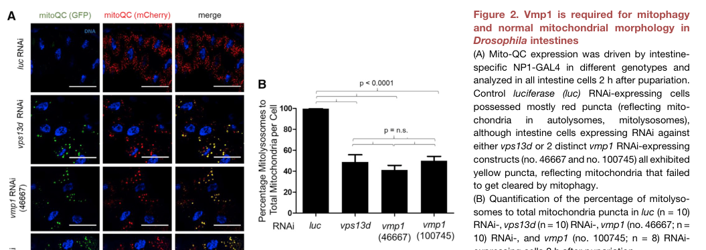

## Question

# Gene Research for Functional Annotation

## ⚠️ CRITICAL: Gene/Protein Identification Context

**BEFORE YOU BEGIN RESEARCH:** You MUST verify you are researching the CORRECT gene/protein. Gene symbols can be ambiguous, especially for less well-characterized genes from non-model organisms.

### Target Gene/Protein Identity (from UniProt):
- **UniProt Accession:** Q7KVQ7
- **Protein Description:** RecName: Full=Vacuole membrane protein 1 {ECO:0000256|ARBA:ARBA00041013};
- **Gene Information:** Name=Tango5 {ECO:0000313|EMBL:AAF46619.2, ECO:0000313|FlyBase:FBgn0052675}; Synonyms=CG1534 {ECO:0000313|EMBL:AAF46619.2}, Dmel\CG32675 {ECO:0000313|EMBL:AAF46619.2}, TANGO5 {ECO:0000313|EMBL:AAF46619.2}, vmp1 {ECO:0000313|EMBL:AAF46619.2}; ORFNames=CG32675 {ECO:0000313|EMBL:AAF46619.2, ECO:0000313|FlyBase:FBgn0052675}, Dmel_CG32675 {ECO:0000313|EMBL:AAF46619.2};
- **Organism (full):** Drosophila melanogaster (Fruit fly).
- **Protein Family:** Belongs to the VMP1 family.
- **Key Domains:** KMS1_N. (IPR063065); VMP1_C. (IPR059828); KMS1_N (PF28607); VMP1_C (PF27639)

### MANDATORY VERIFICATION STEPS:

1. **Check if the gene symbol "Tango5" matches the protein description above**
2. **Verify the organism is correct:** Drosophila melanogaster (Fruit fly).
3. **Check if protein family/domains align with what you find in literature**
4. **If you find literature for a DIFFERENT gene with the same or similar symbol, STOP**

### If Gene Symbol is Ambiguous or You Cannot Find Relevant Literature:

**DO NOT PROCEED WITH RESEARCH ON A DIFFERENT GENE.** Instead:
- State clearly: "The gene symbol 'Tango5' is ambiguous or literature is limited for this specific protein"
- Explain what you found (e.g., "Found extensive literature on a different gene with the same symbol in a different organism")
- Describe the protein based ONLY on the UniProt information provided above
- Suggest that the protein function can be inferred from domain/family information

### Research Target:

Please provide a comprehensive research report on the gene **Tango5** (gene ID: Tango5, UniProt: Q7KVQ7) in DROME.

The research report should be a detailed narrative explaining the function, biological processes, and localization of the gene product. Citations should be given for all claims.

You should prioritize authoritative reviews and primary scientific literature when conducting research. You can supplement
this with annotations you find in gene/protein databases, but these can be outdated or inaccurate.

We are specifically interested in the primary function of the gene - for enzymes, what reaction is catalyzed, and what is the substrate specificity? For transporters, what is the substrate? For structural proteins or adapters, what is the broader structural role? For signaling molecules, what is the role in the pathway.

We are interested in where in or outside the cell the gene product carries out its function.

We are also interested in the signaling or biochemical pathways in which the gene functions. We are less interested in broad pleiotropic effects, except where these elucidate the precise role.

Include evidence where possible. We are interested in both experimental evidence as well as inference from structure, evolution, or bioinformatic analysis. Precise studies should be prioritized over high-throughput, where available.

## Output

Question: You are an expert researcher providing comprehensive, well-cited information.

Provide detailed information focusing on:
1. Key concepts and definitions with current understanding
2. Recent developments and latest research (prioritize 2023-2024 sources)
3. Current applications and real-world implementations
4. Expert opinions and analysis from authoritative sources
5. Relevant statistics and data from recent studies

Format as a comprehensive research report with proper citations. Include URLs and publication dates where available.
Always prioritize recent, authoritative sources and provide specific citations for all major claims.

# Gene Research for Functional Annotation

## ⚠️ CRITICAL: Gene/Protein Identification Context

**BEFORE YOU BEGIN RESEARCH:** You MUST verify you are researching the CORRECT gene/protein. Gene symbols can be ambiguous, especially for less well-characterized genes from non-model organisms.

### Target Gene/Protein Identity (from UniProt):
- **UniProt Accession:** Q7KVQ7
- **Protein Description:** RecName: Full=Vacuole membrane protein 1 {ECO:0000256|ARBA:ARBA00041013};
- **Gene Information:** Name=Tango5 {ECO:0000313|EMBL:AAF46619.2, ECO:0000313|FlyBase:FBgn0052675}; Synonyms=CG1534 {ECO:0000313|EMBL:AAF46619.2}, Dmel\CG32675 {ECO:0000313|EMBL:AAF46619.2}, TANGO5 {ECO:0000313|EMBL:AAF46619.2}, vmp1 {ECO:0000313|EMBL:AAF46619.2}; ORFNames=CG32675 {ECO:0000313|EMBL:AAF46619.2, ECO:0000313|FlyBase:FBgn0052675}, Dmel_CG32675 {ECO:0000313|EMBL:AAF46619.2};
- **Organism (full):** Drosophila melanogaster (Fruit fly).
- **Protein Family:** Belongs to the VMP1 family.
- **Key Domains:** KMS1_N. (IPR063065); VMP1_C. (IPR059828); KMS1_N (PF28607); VMP1_C (PF27639)

### MANDATORY VERIFICATION STEPS:

1. **Check if the gene symbol "Tango5" matches the protein description above**
2. **Verify the organism is correct:** Drosophila melanogaster (Fruit fly).
3. **Check if protein family/domains align with what you find in literature**
4. **If you find literature for a DIFFERENT gene with the same or similar symbol, STOP**

### If Gene Symbol is Ambiguous or You Cannot Find Relevant Literature:

**DO NOT PROCEED WITH RESEARCH ON A DIFFERENT GENE.** Instead:
- State clearly: "The gene symbol 'Tango5' is ambiguous or literature is limited for this specific protein"
- Explain what you found (e.g., "Found extensive literature on a different gene with the same symbol in a different organism")
- Describe the protein based ONLY on the UniProt information provided above
- Suggest that the protein function can be inferred from domain/family information

### Research Target:

Please provide a comprehensive research report on the gene **Tango5** (gene ID: Tango5, UniProt: Q7KVQ7) in DROME.

The research report should be a detailed narrative explaining the function, biological processes, and localization of the gene product. Citations should be given for all claims.

You should prioritize authoritative reviews and primary scientific literature when conducting research. You can supplement
this with annotations you find in gene/protein databases, but these can be outdated or inaccurate.

We are specifically interested in the primary function of the gene - for enzymes, what reaction is catalyzed, and what is the substrate specificity? For transporters, what is the substrate? For structural proteins or adapters, what is the broader structural role? For signaling molecules, what is the role in the pathway.

We are interested in where in or outside the cell the gene product carries out its function.

We are also interested in the signaling or biochemical pathways in which the gene functions. We are less interested in broad pleiotropic effects, except where these elucidate the precise role.

Include evidence where possible. We are interested in both experimental evidence as well as inference from structure, evolution, or bioinformatic analysis. Precise studies should be prioritized over high-throughput, where available.

# Functional Annotation Report: *Drosophila melanogaster* Tango5/Vmp1 (UniProt Q7KVQ7)

## Executive conclusion

The identity is verified: the requested protein is *Drosophila melanogaster* **Tango5**, also named **Vmp1**, not an unrelated TANGO-family protein. Direct fly experiments establish that it is an essential, ER-localized multipass membrane protein required for autophagy, developmental mitochondrial clearance/mitophagy, normal mitochondrial morphology, and control of mitochondria–ER contacts. The strongest current assignment of its **primary molecular function** is a broad, passive ER phospholipid scramblase; however, that biochemical activity has been demonstrated for non-fly VMP1 proteins and has **not yet been directly measured with purified Q7KVQ7**. It should therefore be annotated as a strongly supported orthology-based molecular function rather than a fly-specific biochemical fact. (shen2021vmp1vps13dand pages 3-4, shen2021vmp1vps13dand pages 5-6, hama2022regulationofer‐derived pages 3-5, reinisch2021“vtt”domainproteinsvmp1 pages 1-2)

| Annotation question | Best-supported conclusion | Evidence type/system | Confidence | Key limitation |
|---|---|---|---|---|
| Identity and aliases | The target is *Drosophila melanogaster* **Vmp1**, also called **Tango5**; this matches VMP1-family protein Q7KVQ7 rather than an unrelated similarly named gene. (shen2021vmp1vps13dand pages 3-4) | Direct nomenclature in a peer-reviewed fly study, aligned with the supplied UniProt record | High | The Tango nomenclature can be confusing; accession, organism, and aliases should accompany the symbol. |
| Cellular localization | Endogenously CRISPR-tagged GFP–Vmp1 colocalizes with the ER markers Sec61β and SERCA in fly intestinal cells, establishing Vmp1 as an ER-associated membrane protein. (shen2021vmp1vps13dand pages 5-6) | Direct endogenous-tag localization in *Drosophila* intestine | High | Localization has been examined principally in intestinal cells; enrichment at specific ER subdomains remains uncertain. |
| Primary biochemical function | The best-supported predicted activity is **passive phospholipid scrambling across the ER bilayer**, supporting membrane-leaflet equilibration and remodeling. VMP1 has been biochemically reconstituted as a scramblase, but Q7KVQ7/Tango5 has not been assayed directly. (hama2022regulationofer‐derived pages 3-5, reinisch2021“vtt”domainproteinsvmp1 pages 1-2) | Direct biochemical evidence for non-fly VMP1; orthology-based inference for Tango5 | Moderate–high for the family; moderate for Q7KVQ7 | No purified *Drosophila* Tango5 transport assay or catalytic-site experiment has established that scramblase activity is required in vivo. |
| Substrate and energetics | Reconstituted VMP1 scrambles phosphatidylcholine, phosphatidylserine, and phosphatidylethanolamine bidirectionally without ATP or Ca²⁺. It is therefore considered a broad passive phospholipid scramblase rather than an ATP-driven pump. (hama2022regulationofer‐derived pages 3-5, reinisch2021“vtt”domainproteinsvmp1 pages 1-2) | Proteoliposome and cellular assays of non-fly VMP1-family proteins | Moderate for Tango5 inference | Exact lipid preferences, rates, ion effects, oligomeric state, and physiological substrates of fly Tango5 remain unknown. |
| Family and domain alignment | VMP1 belongs to the conserved DedA/VTT-type membrane-protein superfamily, whose predicted architecture includes paired re-entrant loops compatible with lipid translocation. This broadly aligns with the supplied KMS1_N and VMP1_C annotations. (hama2022regulationofer‐derived pages 3-5, holthuis2022analliancebetween pages 1-3) | Comparative sequence and structural prediction with family-level biochemical interpretation | Moderate | No experimentally determined Tango5 structure maps the newer KMS1_N and VMP1_C database boundaries onto DedA/VTT terminology. |
| Autophagy | Loss of fly vmp1 prevents normal accumulation of mCherry–Atg8a autophagic puncta and causes Ref(2)P/p62 accumulation, demonstrating defective autophagic processing. Family-level models place ER VMP1 alongside ATG2, TMEM41B, and ATG9 during phagophore expansion. (shen2021vmp1vps13dand pages 3-4, ghanbarpour2021amodelfor pages 2-2) | Direct fly loss-of-function phenotypes plus a non-fly biochemical model | High for requirement; moderate for mechanism | Fly experiments establish necessity but do not directly connect Tango5 lipid scrambling to ATG2-mediated phospholipid transfer. |
| Mitophagy and mitochondrial clearance | During developmental intestinal remodeling, control cells clear most mitochondria by 2 hours after pupariation, whereas vmp1-deficient cells retain mitochondria and accumulate GFP-positive and mCherry-positive mito-QC structures instead of acidic mCherry-only mitolysosomes. (shen2021vmp1vps13dand pages 3-4, shen2021vmp1vps13dand pages 4-5, shen2021vmp1vps13dand media 3d156d99) | Direct RNAi, mutant, reporter, and imaging experiments in fly intestine | High | The affected step—cargo recognition, contact disengagement, phagophore growth, or lysosomal delivery—has not been isolated biochemically. |
| ER–mitochondria contacts | Vmp1 depletion produces enlarged mitochondria and increases the fraction of mitochondrial perimeter contacting rough ER, indicating that Vmp1 normally limits or helps resolve excessive ER–mitochondria contacts. (shen2021vmp1vps13dand pages 3-4, shen2021vmp1vps13dand media 3d156d99) | Direct transmission electron microscopy in fly intestine | High | Static microscopy cannot distinguish increased contact formation from defective contact disassembly. |
| Vmp1→Vps13D→Marf pathway | Genetic and localization evidence supports the order **Vmp1 → Vps13D → Marf/MFN2**: Vmp1 loss reduces Vps13D puncta, Vps13D loss does not alter GFP–Vmp1, and marf RNAi suppresses mitochondrial enlargement, mitophagy-marker accumulation, and excess ER contacts caused by vmp1 or vps13d loss. (shen2021vmp1vps13dand pages 7-9, shen2021vmp1vps13dand pages 5-6) | Direct fly epistasis, endogenous tagging, RNAi, and mutant analysis; conservation tested in human fibroblasts | High for genetic order; moderate for molecular mechanism | A stable direct Tango5–Vps13D complex and coupling of scramblase activity to lipid transfer have not been demonstrated in flies. |
| Secretion and Golgi organization | Fly evidence summarized by an authoritative review associates VMP1/Tango5 with soluble-protein secretion and Golgi organization; non-fly VMP1 has particularly strong links to lipoprotein biogenesis and secretion. (hama2022regulationofer‐derived pages 5-6, ghanbarpour2021amodelfor pages 2-2) | Fly secretion-screen evidence summarized in a review plus non-fly physiological studies | Moderate | Detailed gene-specific primary fly data were not recovered, and cargo dependence means mammalian findings should not be generalized to all secretion. |
| Organismal phenotype | Homozygous vmp1 mutants are developmentally lethal, with few animals reaching third-instar larvae; an X-chromosome duplication containing vmp1 rescues lethality, as does viable GFP–Vmp1. (shen2021vmp1vps13dand pages 3-4, shen2021vmp1vps13dand pages 4-5) | Direct fly genetics and transgenic rescue | High | Lethality is pleiotropic and does not identify the indispensable molecular activity or tissue. |
| Applications and translational relevance | Tango5 provides a genetically tractable fly model for studying ER lipid scrambling, autophagy and mitophagy, and mitochondria–ER contact dysregulation relevant to VPS13D- and MFN2-associated disease biology. It is a research model, not a validated therapeutic target or clinical biomarker. (shen2021vmp1vps13dand pages 10-12, shen2021vmp1vps13dand pages 7-9) | Fly pathway genetics with cross-species validation in patient-derived VPS13D fibroblasts | Moderate | No Tango5-specific clinical studies, approved interventions, or evidence that modulating fly Vmp1 predicts therapeutic efficacy in humans are available. |

*Table: Evidence grading for the identity, localization, molecular activity, pathways, phenotypes, and research utility of Drosophila Tango5/Q7KVQ7. Direct fly findings are separated from VMP1-family or mammalian mechanistic inference.*

## 1. Identity verification

### Correct target

- **Organism:** *Drosophila melanogaster*.
- **UniProt accession:** Q7KVQ7.
- **Gene/protein names:** Tango5, Vmp1/vmp1; supplied aliases include CG1534, CG32675, Dmel\CG32675 and TANGO5.
- **Protein class:** VMP1-family integral membrane protein.

The principal fly study explicitly states that *Drosophila* Vmp1 is “also known as Tango5,” independently confirming the requested symbol-to-protein mapping. No results concerning unrelated proteins with similar “TANGO” nomenclature were used. (shen2021vmp1vps13dand pages 3-4)

The supplied InterPro/Pfam annotations—KMS1_N and VMP1_C—are compatible with a conserved VMP1-family membrane protein. In the mechanistic literature, VMP1 and TMEM41B are usually described as DedA/VTT-domain proteins with two predicted re-entrant loops and approximate internal structural symmetry. The exact correspondence between KMS1_N/VMP1_C database boundaries and the DedA/VTT terminology has not been experimentally mapped for Q7KVQ7, so these labels should not be treated as independently demonstrated catalytic domains. (hama2022regulationofer‐derived pages 3-5, holthuis2022analliancebetween pages 1-3)

## 2. Primary molecular function

### Best-supported assignment: ER phospholipid scramblase

A scramblase catalyzes rapid, bidirectional equilibration of lipids between the two leaflets of a membrane. Unlike ATP-dependent flippases, it does not impose a directional lipid gradient. Reconstituted VMP1 scrambles phosphatidylcholine, phosphatidylserine and phosphatidylethanolamine without ATP or Ca²⁺. Activity increases with protein concentration, does not cause nonspecific leakage of soluble lumenal contents, and alters phosphatidylserine and cholesterol distributions in cells. These observations support direct lipid scrambling rather than pore-mediated membrane damage or an ATP-driven transport cycle. (hama2022regulationofer‐derived pages 3-5, reinisch2021“vtt”domainproteinsvmp1 pages 1-2)

Accordingly, Tango5 is unlikely to be an enzyme with a conventional small-molecule catalytic reaction or a substrate-selective transporter. Its inferred substrates are **membrane glycerophospholipids**, and its reaction can be represented as:

**phospholipid in ER cytosolic leaflet ⇌ the same phospholipid in ER lumenal leaflet**.

No narrow substrate specificity is established. PC, PS and PE are supported at family level, but the rates, lipid preferences, oligomeric state and residue requirements of fly Tango5 remain unknown. Direct biochemical reconstitution of Q7KVQ7, followed by mutational rescue in flies, is required for definitive assignment.

### Structural interpretation

The paired re-entrant-loop architecture predicted for DedA/VTT proteins is consistent with formation of a membrane-spanning hydrophilic pathway that lowers the energetic barrier to movement of a polar phospholipid headgroup through the bilayer. This is a family-level structural model, not an experimentally solved Tango5 structure. (hama2022regulationofer‐derived pages 3-5, holthuis2022analliancebetween pages 1-3)

## 3. Cellular localization

Endogenous Vmp1 was N-terminally tagged with GFP by CRISPR. GFP–Vmp1 colocalized with the ER markers Sec61β and SERCA in fly intestinal cells, directly establishing the **endoplasmic reticulum membrane** as its principal demonstrated site of action. The tagged allele was viable and fertile and rescued vmp1 lethality, supporting functionality of the reporter. RNAi nearly eliminated its fluorescence, further validating signal specificity. (shen2021vmp1vps13dand pages 5-6, shen2021vmp1vps13dand pages 4-5)

Thus, “vacuole membrane protein” is a historical family name and should not be interpreted as evidence that fly Tango5 primarily resides on lysosomes or vacuoles. The strongest direct fly localization is ER membrane.

## 4. Biological processes and pathway position

### 4.1 Autophagy and autophagosome biogenesis

Fly vmp1 loss prevents normal accumulation of mCherry–Atg8a autophagic puncta and causes accumulation of Ref(2)P, the fly p62-like autophagy cargo receptor. These are direct indications of defective autophagic processing. (shen2021vmp1vps13dand pages 3-4, shen2021vmp1vps13dand pages 1-3)

The current mechanistic model, derived mainly from mammalian reconstitution, couples three activities:

1. **ATG2** transfers bulk phospholipid from the ER to a growing phagophore.
2. **VMP1/TMEM41B** scramble phospholipids between ER leaflets, preventing donor-leaflet depletion.
3. **ATG9** scrambles newly delivered lipid between the two phagophore leaflets, permitting balanced membrane expansion.

ATG2A binds VMP1- or TMEM41B-containing liposomes, supporting physical coupling of lipid transfer and scrambling. Loss of VMP1/TMEM41B permits small LC3-positive structures but blocks their maturation into normal autophagosomes. The model is authoritative and mechanistically coherent, but its individual biochemical steps have not been tested directly with fly Tango5. (hama2022regulationofer‐derived pages 3-5, ghanbarpour2021amodelfor pages 2-2, holthuis2022analliancebetween pages 1-3)

### 4.2 Mitophagy during intestinal development

During developmental intestine remodeling, control cells clear most mitochondria by two hours after pupariation. vmp1 RNAi or mutation causes mitochondrial retention and accumulation of tandem GFP–mCherry mito-QC structures that remain yellow, indicating failure to reach or mature within acidic mitolysosomes. The proportion of mitolysosomes falls from nearly 100% in controls to approximately 40–50% after either of two vmp1 RNAi constructs; the comparison was highly significant (*p* < 0.0001), with groups of 8–10 intestines. (shen2021vmp1vps13dand pages 3-4, shen2021vmp1vps13dand pages 4-5, shen2021vmp1vps13dand media 3d156d99)

These data establish a requirement for Vmp1 in developmental mitochondrial clearance. They do not prove that Tango5 recognizes mitochondria as cargo; the defect could instead arise from impaired phagophore expansion or failure to resolve ER–mitochondria contacts.

### 4.3 Mitochondria–ER contact regulation

Transmission electron microscopy showed enlarged mitochondria and markedly increased mitochondria–rough-ER contact after vmp1 depletion. The fraction of mitochondrial perimeter contacting ER increased from approximately 6% in controls to about 22% after vmp1 RNAi (*p* < 0.0001; 100 control and 78 RNAi mitochondria/cells quantified in the displayed analysis). Contacts were operationally defined by ≤0.03 μm membrane separation and ≥0.02 μm contact length. (shen2021vmp1vps13dand pages 3-4, shen2021vmp1vps13dand media 13241a02)

The safest interpretation is that Vmp1 normally restrains or helps disassemble excessive contacts. Static microscopy cannot determine whether depletion increases contact formation or prevents contact resolution.

### 4.4 Genetic pathway: Vmp1 → Vps13D → Marf/MFN2

Several epistasis and localization findings support a pathway order:

- Vmp1 loss reduces Vps13D puncta.
- Vps13D loss does not alter GFP–Vmp1 puncta.
- Combined vmp1 and vps13d reduction does not substantially enhance mitochondrial-clearance or contact-site phenotypes.
- marf RNAi suppresses mitochondrial enlargement, mitophagy-marker accumulation and excess ER contacts caused by either vmp1 or vps13d loss.
- Marf overexpression inhibits mitochondrial clearance.

Together these results support **Vmp1 upstream of Vps13D, with Vps13D acting upstream of or through Marf/MFN2** to regulate mitochondrial dynamics, ER contacts and mitophagy. The same broad relationship was supported in VPS13D patient fibroblasts, where MFN2—but not MFN1—depletion suppressed contact and morphology abnormalities. (shen2021vmp1vps13dand pages 7-9, shen2021vmp1vps13dand pages 5-6, shen2021vmp1vps13dand pages 4-5)

This is a genetic pathway, not proof of a stable Tango5–Vps13D biochemical complex. One plausible model is that ER lipid scrambling by Vmp1 organizes a membrane environment that recruits or stabilizes the bridge-like lipid-transfer protein Vps13D, thereby influencing Marf-dependent contacts. That coupling remains to be demonstrated directly in flies.

## 5. Secretion, Golgi organization and lipid homeostasis

An authoritative VMP1 review summarizes earlier *Drosophila* evidence that VMP1/Tango5 supports soluble-protein secretion and Golgi organization. This potentially explains the historical “TANGO” designation. Detailed gene-specific primary fly evidence was not recovered here, so secretion should be considered a secondary, moderately supported fly annotation rather than the best-established primary function. (hama2022regulationofer‐derived pages 5-6)

Non-fly studies connect VMP1 scrambling to lipid-droplet maturation, phosphatidylserine/cholesterol distribution and lipoprotein production. VMP1/TMEM41B may equilibrate ER leaflets as neutral-lipid-rich particles or droplets bud toward the lumen or cytosol. VMP1 depletion disrupts lipoprotein production and secretion, whereas effects on ordinary soluble secretion appear more cargo- and species-dependent. These findings broaden the family-level role to ER-derived membrane remodeling but cannot be assumed to occur identically in fly tissues. (ghanbarpour2021amodelfor pages 2-2, reinisch2021“vtt”domainproteinsvmp1 pages 4-5, hama2022regulationofer‐derived pages 5-6)

## 6. Organismal phenotype

Homozygous vmp1 mutants are developmentally lethal, with only a small number surviving to third-instar larvae. A duplication containing vmp1 rescues lethality, and functional GFP–Vmp1 also rescues the mutant phenotype. This provides strong genetic evidence that the gene is essential. (shen2021vmp1vps13dand pages 3-4, shen2021vmp1vps13dand pages 4-5)

Lethality is nevertheless pleiotropic and does not by itself identify which molecular activity or tissue is indispensable.

## 7. Recent research context, 2023–2024

Recent authoritative reviews retain ER phospholipid scrambling as the leading VMP1 mechanism and place VMP1/TMEM41B with ATG2 and ATG9 in models of autophagosome membrane growth. Work in 2023 emphasized non-vesicular phospholipid delivery and leaflet equilibration during phagophore expansion; 2024 reviews extended the framework to lipid flux, VLDL biogenesis and disease-associated autophagy. The retrieved recent literature did not report a new Tango5-specific biochemical assay or structure. Consequently, recent work strengthens the **conserved mechanistic interpretation**, but the most informative direct fly study remains Shen et al. (2021). (hama2022regulationofer‐derived pages 3-5, ghanbarpour2021amodelfor pages 2-2, holthuis2022analliancebetween pages 1-3)

Relevant recent publications include:

- Yamamoto, Zhang & Mizushima, “Autophagy genes in biology and disease,” *Nature Reviews Genetics*, published January 2023. https://doi.org/10.1038/s41576-022-00562-w
- Melia, “Growing thin—How bulk lipid transport drives expansion of the autophagosome membrane but not of its lumen,” *Current Opinion in Cell Biology*, August 2023. https://doi.org/10.1016/j.ceb.2023.102190
- Banerjee & Prinz, “Early steps in the birth of four membrane-bound organelles,” *Current Opinion in Cell Biology*, October 2023. https://doi.org/10.1016/j.ceb.2023.102210
- Mathiowetz & Olzmann, “Lipid droplets and cellular lipid flux,” *Nature Cell Biology*, March 2024. https://doi.org/10.1038/s41556-024-01364-4

These are contextual family/pathway sources rather than direct studies of Q7KVQ7.

## 8. Applications and real-world implementation

Tango5 currently has **research-model applications**, not a validated clinical use. The fly system enables:

- tissue-specific genetic dissection of autophagy and mitophagy;
- live mito-QC measurement during programmed tissue remodeling;
- ultrastructural analysis of ER–mitochondria contacts;
- epistasis studies connecting ER membrane remodeling to Vps13D and Marf/MFN2;
- testing candidate scramblase-defective alleles in vivo.

This is relevant to human VPS13D- and MFN2-associated mitochondrial/contact-site disorders because pathway conservation has been tested in patient-derived cells. Nevertheless, Tango5 is not an approved therapeutic target, biomarker or intervention, and no Tango5-specific clinical trials or population statistics were identified. (shen2021vmp1vps13dand pages 10-12, shen2021vmp1vps13dand pages 7-9)

## 9. Recommended annotation and evidence grade

**Recommended concise annotation:**

> Tango5/Vmp1 is an essential *Drosophila* ER multipass membrane protein of the VMP1 family. It is required for autophagy, developmental mitophagy, normal mitochondrial morphology, and limitation/resolution of mitochondria–ER contacts, acting genetically upstream of Vps13D and Marf/MFN2. By conserved-family biochemical evidence, it is most likely a passive, broad-specificity ER phospholipid scramblase that supports ER membrane-leaflet equilibration and lipid delivery during membrane biogenesis.

**Evidence grading:**

- **High confidence, direct fly evidence:** identity, ER localization, essentiality, autophagy/mitophagy requirement, mitochondrial phenotype, contact-site regulation and pathway order.
- **Moderate-to-high confidence, orthology-based:** passive PC/PS/PE scrambling and cooperation with ATG2/TMEM41B/ATG9.
- **Moderate confidence:** generalized secretion/Golgi and lipid-homeostasis roles in flies.
- **Unresolved:** Tango5-specific substrate kinetics, structure, catalytic residues, oligomeric state, direct binding to Vps13D, and whether scramblase activity itself rescues each fly phenotype.

## Principal sources

1. Shen JL et al. “Vmp1, Vps13D, and Marf/Mfn2 function in a conserved pathway to regulate mitochondria and ER contact in development and disease.” *Current Biology* 31, 3028–3039.e7. Published July 2021. https://doi.org/10.1016/j.cub.2021.04.062 (shen2021vmp1vps13dand pages 3-4, shen2021vmp1vps13dand pages 7-9, shen2021vmp1vps13dand pages 5-6)
2. Ghanbarpour A et al. “A model for a partnership of lipid transfer proteins and scramblases in membrane expansion and organelle biogenesis.” *PNAS* 118. Published April 2021. https://doi.org/10.1073/pnas.2101562118 (ghanbarpour2021amodelfor pages 2-2)
3. Reinisch KM, Chen X-W & Melia TJ. “‘VTT’-Domain Proteins VMP1 and TMEM41B Function in Lipid Homeostasis Globally and Locally as ER Scramblases.” *Contact* 4. Published January 2021. https://doi.org/10.1177/25152564211024494 (reinisch2021“vtt”domainproteinsvmp1 pages 4-5, reinisch2021“vtt”domainproteinsvmp1 pages 1-2)
4. Hama Y, Morishita H & Mizushima N. “Regulation of ER-derived membrane dynamics by the DedA domain-containing proteins VMP1 and TMEM41B.” *EMBO Reports* 23. Published January 2022. https://doi.org/10.15252/embr.202153894 (hama2022regulationofer‐derived pages 3-5, hama2022regulationofer‐derived pages 5-6)

References

1. (shen2021vmp1vps13dand pages 3-4): James L. Shen, Tina M. Fortier, Yan G. Zhao, Ruoxi Wang, Margit Burmeister, and Eric H. Baehrecke. Vmp1, vps13d, and marf/mfn2 function in a conserved pathway to regulate mitochondria and er contact in development and disease. Jul 2021. URL: https://doi.org/10.1016/j.cub.2021.04.062, doi:10.1016/j.cub.2021.04.062. This article has 40 citations and is from a highest quality peer-reviewed journal.

2. (shen2021vmp1vps13dand pages 5-6): James L. Shen, Tina M. Fortier, Yan G. Zhao, Ruoxi Wang, Margit Burmeister, and Eric H. Baehrecke. Vmp1, vps13d, and marf/mfn2 function in a conserved pathway to regulate mitochondria and er contact in development and disease. Jul 2021. URL: https://doi.org/10.1016/j.cub.2021.04.062, doi:10.1016/j.cub.2021.04.062. This article has 40 citations and is from a highest quality peer-reviewed journal.

3. (hama2022regulationofer‐derived pages 3-5): Yutaro Hama, Hideaki Morishita, and Noboru Mizushima. Regulation of er‐derived membrane dynamics by the deda domain‐containing proteins vmp1 and tmem41b. EMBO reports, Jan 2022. URL: https://doi.org/10.15252/embr.202153894, doi:10.15252/embr.202153894. This article has 50 citations and is from a highest quality peer-reviewed journal.

4. (reinisch2021“vtt”domainproteinsvmp1 pages 1-2): Karin M. Reinisch, Xiao-Wei Chen, and Thomas J. Melia. “vtt”-domain proteins vmp1 and tmem41b function in lipid homeostasis globally and locally as er scramblases. Contact, Jan 2021. URL: https://doi.org/10.1177/25152564211024494, doi:10.1177/25152564211024494. This article has 28 citations.

5. (holthuis2022analliancebetween pages 1-3): Joost C M Holthuis, Helene Jahn, Anant K Menon, and Noboru Mizushima. An alliance between lipid transfer proteins and scramblases for membrane expansion. Faculty reviews, 11:22, Aug 2022. URL: https://doi.org/10.12703/r-01-0000015, doi:10.12703/r-01-0000015. This article has 4 citations.

6. (ghanbarpour2021amodelfor pages 2-2): Alireza Ghanbarpour, Diana P. Valverde, Thomas J. Melia, and Karin M. Reinisch. A model for a partnership of lipid transfer proteins and scramblases in membrane expansion and organelle biogenesis. Proceedings of the National Academy of Sciences of the United States of America, Apr 2021. URL: https://doi.org/10.1073/pnas.2101562118, doi:10.1073/pnas.2101562118. This article has 287 citations and is from a highest quality peer-reviewed journal.

7. (shen2021vmp1vps13dand pages 4-5): James L. Shen, Tina M. Fortier, Yan G. Zhao, Ruoxi Wang, Margit Burmeister, and Eric H. Baehrecke. Vmp1, vps13d, and marf/mfn2 function in a conserved pathway to regulate mitochondria and er contact in development and disease. Jul 2021. URL: https://doi.org/10.1016/j.cub.2021.04.062, doi:10.1016/j.cub.2021.04.062. This article has 40 citations and is from a highest quality peer-reviewed journal.

8. (shen2021vmp1vps13dand media 3d156d99): James L. Shen, Tina M. Fortier, Yan G. Zhao, Ruoxi Wang, Margit Burmeister, and Eric H. Baehrecke. Vmp1, vps13d, and marf/mfn2 function in a conserved pathway to regulate mitochondria and er contact in development and disease. Jul 2021. URL: https://doi.org/10.1016/j.cub.2021.04.062, doi:10.1016/j.cub.2021.04.062. This article has 40 citations and is from a highest quality peer-reviewed journal.

9. (shen2021vmp1vps13dand pages 7-9): James L. Shen, Tina M. Fortier, Yan G. Zhao, Ruoxi Wang, Margit Burmeister, and Eric H. Baehrecke. Vmp1, vps13d, and marf/mfn2 function in a conserved pathway to regulate mitochondria and er contact in development and disease. Jul 2021. URL: https://doi.org/10.1016/j.cub.2021.04.062, doi:10.1016/j.cub.2021.04.062. This article has 40 citations and is from a highest quality peer-reviewed journal.

10. (hama2022regulationofer‐derived pages 5-6): Yutaro Hama, Hideaki Morishita, and Noboru Mizushima. Regulation of er‐derived membrane dynamics by the deda domain‐containing proteins vmp1 and tmem41b. EMBO reports, Jan 2022. URL: https://doi.org/10.15252/embr.202153894, doi:10.15252/embr.202153894. This article has 50 citations and is from a highest quality peer-reviewed journal.

11. (shen2021vmp1vps13dand pages 10-12): James L. Shen, Tina M. Fortier, Yan G. Zhao, Ruoxi Wang, Margit Burmeister, and Eric H. Baehrecke. Vmp1, vps13d, and marf/mfn2 function in a conserved pathway to regulate mitochondria and er contact in development and disease. Jul 2021. URL: https://doi.org/10.1016/j.cub.2021.04.062, doi:10.1016/j.cub.2021.04.062. This article has 40 citations and is from a highest quality peer-reviewed journal.

12. (shen2021vmp1vps13dand pages 1-3): James L. Shen, Tina M. Fortier, Yan G. Zhao, Ruoxi Wang, Margit Burmeister, and Eric H. Baehrecke. Vmp1, vps13d, and marf/mfn2 function in a conserved pathway to regulate mitochondria and er contact in development and disease. Jul 2021. URL: https://doi.org/10.1016/j.cub.2021.04.062, doi:10.1016/j.cub.2021.04.062. This article has 40 citations and is from a highest quality peer-reviewed journal.

13. (shen2021vmp1vps13dand media 13241a02): James L. Shen, Tina M. Fortier, Yan G. Zhao, Ruoxi Wang, Margit Burmeister, and Eric H. Baehrecke. Vmp1, vps13d, and marf/mfn2 function in a conserved pathway to regulate mitochondria and er contact in development and disease. Jul 2021. URL: https://doi.org/10.1016/j.cub.2021.04.062, doi:10.1016/j.cub.2021.04.062. This article has 40 citations and is from a highest quality peer-reviewed journal.

14. (reinisch2021“vtt”domainproteinsvmp1 pages 4-5): Karin M. Reinisch, Xiao-Wei Chen, and Thomas J. Melia. “vtt”-domain proteins vmp1 and tmem41b function in lipid homeostasis globally and locally as er scramblases. Contact, Jan 2021. URL: https://doi.org/10.1177/25152564211024494, doi:10.1177/25152564211024494. This article has 28 citations.

## Artifacts

- [Edison artifact artifact-00](Tango5-deep-research-falcon_artifacts/artifact-00.md)

## Citations

1. ghanbarpour2021amodelfor pages 2-2
2. holthuis2022analliancebetween pages 1-3
3. https://doi.org/10.1038/s41576-022-00562-w
4. https://doi.org/10.1016/j.ceb.2023.102190
5. https://doi.org/10.1016/j.ceb.2023.102210
6. https://doi.org/10.1038/s41556-024-01364-4
7. https://doi.org/10.1016/j.cub.2021.04.062
8. https://doi.org/10.1073/pnas.2101562118
9. https://doi.org/10.1177/25152564211024494
10. https://doi.org/10.15252/embr.202153894
11. https://doi.org/10.1016/j.cub.2021.04.062,
12. https://doi.org/10.15252/embr.202153894,
13. https://doi.org/10.1177/25152564211024494,
14. https://doi.org/10.12703/r-01-0000015,
15. https://doi.org/10.1073/pnas.2101562118,