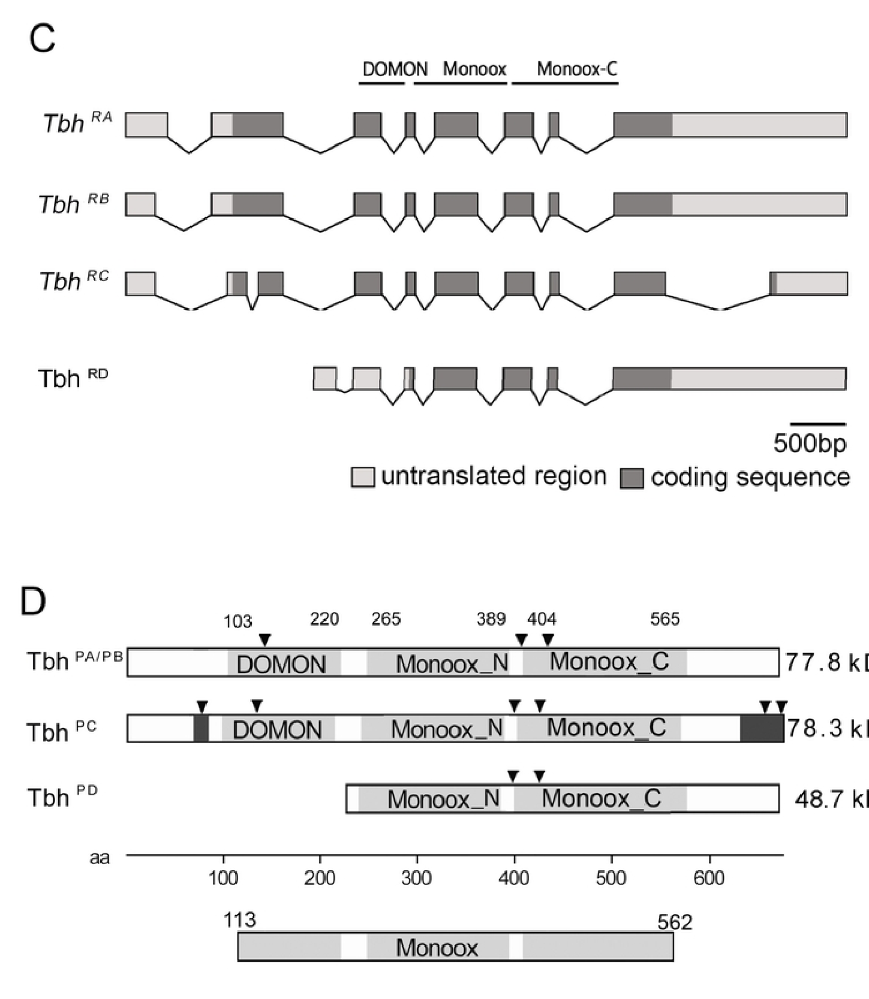

## Question

# Gene Research for Functional Annotation

## ⚠️ CRITICAL: Gene/Protein Identification Context

**BEFORE YOU BEGIN RESEARCH:** You MUST verify you are researching the CORRECT gene/protein. Gene symbols can be ambiguous, especially for less well-characterized genes from non-model organisms.

### Target Gene/Protein Identity (from UniProt):
- **UniProt Accession:** Q86B61
- **Protein Description:** RecName: Full=Tyramine beta-hydroxylase {ECO:0000303|PubMed:8656284}; EC=1.14.17.- {ECO:0000269|PubMed:16376104}; AltName: Full=Tyramine beta-monooxygenase {ECO:0000303|PubMed:16376104}; Short=TbetaM {ECO:0000303|PubMed:16376104};
- **Gene Information:** Name=Tbh; ORFNames=CG1543;
- **Organism (full):** Drosophila melanogaster (Fruit fly).
- **Protein Family:** Belongs to the copper type II ascorbate-dependent
- **Key Domains:** Cu2_ascorb_mOase-like_C. (IPR014784); Cu2_ascorb_mOase_CS-1. (IPR020611); Cu2_ascorb_mOase_N. (IPR000323); Cu2_ascorb_mOase_N_sf. (IPR036939); Cu2_monoox_C. (IPR024548)

### MANDATORY VERIFICATION STEPS:

1. **Check if the gene symbol "Tbh" matches the protein description above**
2. **Verify the organism is correct:** Drosophila melanogaster (Fruit fly).
3. **Check if protein family/domains align with what you find in literature**
4. **If you find literature for a DIFFERENT gene with the same or similar symbol, STOP**

### If Gene Symbol is Ambiguous or You Cannot Find Relevant Literature:

**DO NOT PROCEED WITH RESEARCH ON A DIFFERENT GENE.** Instead:
- State clearly: "The gene symbol 'Tbh' is ambiguous or literature is limited for this specific protein"
- Explain what you found (e.g., "Found extensive literature on a different gene with the same symbol in a different organism")
- Describe the protein based ONLY on the UniProt information provided above
- Suggest that the protein function can be inferred from domain/family information

### Research Target:

Please provide a comprehensive research report on the gene **Tbh** (gene ID: Tbh, UniProt: Q86B61) in DROME.

The research report should be a detailed narrative explaining the function, biological processes, and localization of the gene product. Citations should be given for all claims.

You should prioritize authoritative reviews and primary scientific literature when conducting research. You can supplement
this with annotations you find in gene/protein databases, but these can be outdated or inaccurate.

We are specifically interested in the primary function of the gene - for enzymes, what reaction is catalyzed, and what is the substrate specificity? For transporters, what is the substrate? For structural proteins or adapters, what is the broader structural role? For signaling molecules, what is the role in the pathway.

We are interested in where in or outside the cell the gene product carries out its function.

We are also interested in the signaling or biochemical pathways in which the gene functions. We are less interested in broad pleiotropic effects, except where these elucidate the precise role.

Include evidence where possible. We are interested in both experimental evidence as well as inference from structure, evolution, or bioinformatic analysis. Precise studies should be prioritized over high-throughput, where available.

## Output

Question: You are an expert researcher providing comprehensive, well-cited information.

Provide detailed information focusing on:
1. Key concepts and definitions with current understanding
2. Recent developments and latest research (prioritize 2023-2024 sources)
3. Current applications and real-world implementations
4. Expert opinions and analysis from authoritative sources
5. Relevant statistics and data from recent studies

Format as a comprehensive research report with proper citations. Include URLs and publication dates where available.
Always prioritize recent, authoritative sources and provide specific citations for all major claims.

# Gene Research for Functional Annotation

## ⚠️ CRITICAL: Gene/Protein Identification Context

**BEFORE YOU BEGIN RESEARCH:** You MUST verify you are researching the CORRECT gene/protein. Gene symbols can be ambiguous, especially for less well-characterized genes from non-model organisms.

### Target Gene/Protein Identity (from UniProt):
- **UniProt Accession:** Q86B61
- **Protein Description:** RecName: Full=Tyramine beta-hydroxylase {ECO:0000303|PubMed:8656284}; EC=1.14.17.- {ECO:0000269|PubMed:16376104}; AltName: Full=Tyramine beta-monooxygenase {ECO:0000303|PubMed:16376104}; Short=TbetaM {ECO:0000303|PubMed:16376104};
- **Gene Information:** Name=Tbh; ORFNames=CG1543;
- **Organism (full):** Drosophila melanogaster (Fruit fly).
- **Protein Family:** Belongs to the copper type II ascorbate-dependent
- **Key Domains:** Cu2_ascorb_mOase-like_C. (IPR014784); Cu2_ascorb_mOase_CS-1. (IPR020611); Cu2_ascorb_mOase_N. (IPR000323); Cu2_ascorb_mOase_N_sf. (IPR036939); Cu2_monoox_C. (IPR024548)

### MANDATORY VERIFICATION STEPS:

1. **Check if the gene symbol "Tbh" matches the protein description above**
2. **Verify the organism is correct:** Drosophila melanogaster (Fruit fly).
3. **Check if protein family/domains align with what you find in literature**
4. **If you find literature for a DIFFERENT gene with the same or similar symbol, STOP**

### If Gene Symbol is Ambiguous or You Cannot Find Relevant Literature:

**DO NOT PROCEED WITH RESEARCH ON A DIFFERENT GENE.** Instead:
- State clearly: "The gene symbol 'Tbh' is ambiguous or literature is limited for this specific protein"
- Explain what you found (e.g., "Found extensive literature on a different gene with the same symbol in a different organism")
- Describe the protein based ONLY on the UniProt information provided above
- Suggest that the protein function can be inferred from domain/family information

### Research Target:

Please provide a comprehensive research report on the gene **Tbh** (gene ID: Tbh, UniProt: Q86B61) in DROME.

The research report should be a detailed narrative explaining the function, biological processes, and localization of the gene product. Citations should be given for all claims.

You should prioritize authoritative reviews and primary scientific literature when conducting research. You can supplement
this with annotations you find in gene/protein databases, but these can be outdated or inaccurate.

We are specifically interested in the primary function of the gene - for enzymes, what reaction is catalyzed, and what is the substrate specificity? For transporters, what is the substrate? For structural proteins or adapters, what is the broader structural role? For signaling molecules, what is the role in the pathway.

We are interested in where in or outside the cell the gene product carries out its function.

We are also interested in the signaling or biochemical pathways in which the gene functions. We are less interested in broad pleiotropic effects, except where these elucidate the precise role.

Include evidence where possible. We are interested in both experimental evidence as well as inference from structure, evolution, or bioinformatic analysis. Precise studies should be prioritized over high-throughput, where available.

# Functional annotation report: *Drosophila melanogaster* Tbh (Q86B61)

## Identity and principal conclusion

**Identity verified.** The research target is the fruit-fly gene **Tbh/CG1543**, encoding tyramine β-hydroxylase, also called tyramine β-monooxygenase—not the similarly named *Caenorhabditis elegans* gene *tbh-1*. An analysis of cloned *D. melanogaster* enzyme explicitly identifies its sequence as UniProt **Q86B61**; a 2024 fly study independently identifies Tbh/CG1543 and its copper-dependent monooxygenase architecture. These identifiers and properties match the supplied UniProt description. (ruppert2024thedrosophilatyraminebetahydroxylase pages 1-6, ruppert2024thedrosophilatyraminebetahydroxylase pages 6-10, モハメト2016comprehensiveinsilicoin pages 19-25)

**Primary function:** Tbh catalyzes the β-hydroxylation of **tyramine to octopamine**, the second biosynthetic step in the fly’s tyramine–octopamine signaling pathway. Octopamine is the product that acts as a neurotransmitter, neuromodulator or neurohormonal signal; Tbh is the *biosynthetic enzyme*, not an octopamine receptor or transporter. Fly genetics strongly establishes this physiological reaction, although the retrieved material does not permit a quantitative ranking of every possible substrate for purified Q86B61. (ruppert2024thedrosophilatyraminebetahydroxylase pages 1-6, rosikon2023regulationandmodulation pages 12-13)

The evidence grades and key measurements are summarized here before the detailed interpretation. (ruppert2024thedrosophilatyraminebetahydroxylase pages 6-10, ruppert2024thedrosophilatyraminebetahydroxylase pages 19-23, ruppert2024thedrosophilatyraminebetahydroxylase pages 14-19)

| Annotation | Observation | Evidence strength / limits |
|---|---|---|
| Identity | *Drosophila melanogaster* **Tbh/CG1543**, UniProt **Q86B61**, encodes tyramine β-hydroxylase (tyramine β-monooxygenase); the analyzed canonical sequence is 670 aa. (モハメト2016comprehensiveinsilicoin pages 19-25, モハメト2016comprehensiveinsilicoin pages 25-28) | **Strong identity match.** Species, gene, accession, sequence, and enzyme designation agree. This is distinct from *C. elegans* **tbh-1** and unrelated similarly named genes. |
| Primary reaction | **Tyramine + O₂ + reduced ascorbate → octopamine + H₂O + dehydroascorbate.** The classic **Tbhⁿᴹ¹⁸** mutant has no detectable octopamine and approximately **10-fold elevated tyramine**, strongly supporting this in-vivo precursor–product relationship. (ruppert2024thedrosophilatyraminebetahydroxylase pages 1-6) | **Established.** Genetic-metabolite evidence is compelling, although the older allele retains residual transcripts and is not a transcriptional null. |
| Enzyme family and cofactors | Major Tbh isoforms contain DOMON and N- and C-terminal copper type-II ascorbate-dependent monooxygenase regions. Copper, ascorbate, and molecular-oxygen requirements are supported by enzyme-family homology and prior TβH/DBH biochemistry. (ruppert2013dissectingtbhand pages 13-17, ruppert2024thedrosophilatyraminebetahydroxylase pages 6-10, モハメト2016comprehensiveinsilicoin pages 19-25) | **Strong family-based inference; incomplete direct quantitation.** Retrieved sources did not provide modern purified-enzyme stoichiometry or kinetic constants for Q86B61. |
| Transcript and protein diversity | A June 2024 preprint reported four transcripts, **TbhRA–TbhRD**, encoding at least three proteins: PA/PB (~77.7 kDa), PC (~78.3 kDa), and PD/RD (~48.7 kDa). PC has additional predicted PKC sites; PD/RD has a truncated N-terminal DOMON region. (ruppert2024thedrosophilatyraminebetahydroxylase pages 6-10, ruppert2024thedrosophilatyraminebetahydroxylase media e2590836) | **Moderate–strong preprint evidence.** Transcript structures were supported by RT-PCR and sequencing, but predicted phosphorylation and isoform-specific regulation require biochemical validation. |
| Cellular distribution | Adult-brain immunoreactivity occurred in about **75 cells across 17 clusters**. In larvae, labeling appeared in somata and punctate structures; one antibody recognized ~48 cells, including ~19 overlapping dTdc2-positive octopaminergic neurons. (ruppert2024thedrosophilatyraminebetahydroxylase pages 14-19) | **Moderate.** Antibody and endogenous-GFP evidence support neuronal expression, but differential antibody recognition and incomplete overlap caution against treating one reporter as a complete Tbh atlas. |
| Proposed alternative substrate | A 2024 preprint found one antibody-defined isoform in Hugin-positive neurons that also labeled for tyrosine hydroxylase and noradrenaline; this motivated a proposed **dopamine → noradrenaline** role. (ruppert2024thedrosophilatyraminebetahydroxylase pages 19-23, ruppert2024thedrosophilatyraminebetahydroxylase media 2c25108d) | **Hypothesis, not established catalysis.** Colocalization and mass-spectrometric detection of noradrenaline do not demonstrate that Drosophila Tbh hydroxylates dopamine; no direct substrate-specificity assay was reported. |
| Vesicular pathway and site of action | After synthesis, octopamine is packaged by VMAT into synaptic vesicles and released by exocytosis to activate octopamine GPCRs. (rosikon2023regulationandmodulation pages 3-5, rosikon2023regulationandmodulation pages 12-13) | **Established downstream pathway; Tbh localization unresolved.** VMAT-dependent octopamine storage does not itself prove that Tbh protein or catalysis resides inside synaptic vesicles; observed puncta are insufficient for organelle assignment. |
| Functional genetics | The newer **TbhDel3** allele deletes 9.2 kb, reduces downstream transcript by ~83%, and causes approximately **64% lower ethanol tolerance** without changing initial ethanol sensitivity. Adult hs-Tbh or 4.6-Tbh-Gal4-driven expression rescued tolerance, whereas overexpression also impaired it. (ruppert2024thedrosophilatyraminebetahydroxylase pages 6-10, ruppert2024thedrosophilatyraminebetahydroxylase pages 14-19, ruppert2024thedrosophilatyraminebetahydroxylase pages 10-14) | **Strong causal genetic evidence from a preprint.** Rescue supports an adult neuronal requirement and dosage sensitivity, but ethanol tolerance is a downstream systems phenotype rather than a direct enzyme assay. |

*Table: Evidence-graded summary of the verified molecular function, pathway position, localization, isoforms, and functional genetics of Drosophila Tbh/Q86B61. Established annotations are separated from family-based inference and the unproven dopamine-to-noradrenaline hypothesis.*

## Reaction, specificity and biochemical mechanism

The pathway begins when **Tdc2 tyrosine decarboxylase converts tyrosine to tyramine**. Tbh then hydroxylates tyramine’s side-chain β-carbon to produce octopamine. As a copper-type-II, ascorbate-dependent monooxygenase, the reaction is conventionally represented as **tyramine + O₂ + reduced ascorbate → octopamine + H₂O + oxidized ascorbate**. Copper, oxygen and ascorbate dependence are supported by the enzyme-family assignment and earlier TβH/related-enzyme biochemistry; they should not be mistaken for a newly measured cofactor stoichiometry for every fly isoform. The supplied InterPro copper-monooxygenase domain assignments align with the DOMON and N-/C-terminal monooxygenase regions reported for fly Tbh proteins. (ruppert2013dissectingtbhand pages 13-17, ruppert2024thedrosophilatyraminebetahydroxylase pages 6-10, モハメト2016comprehensiveinsilicoin pages 19-25, rosikon2023regulationandmodulation pages 11-12)

The decisive *in-vivo* substrate–product evidence is that the classical **Tbhⁿᴹ¹⁸** mutant has **no detectable octopamine** and approximately **tenfold more tyramine** than controls. This accumulation is expected when tyramine can be made but cannot efficiently proceed to octopamine. Supplying octopamine reverses at least one downstream phenotype, loss of ethanol preference. A crucial qualification from the 2024 molecular analysis is that Tbhⁿᴹ¹⁸ retains some Tbh transcripts: it is **not a transcriptional null**, notwithstanding its profound octopamine deficit. (ruppert2024thedrosophilatyraminebetahydroxylase pages 6-10, ruppert2024thedrosophilatyraminebetahydroxylase pages 1-6, ruppert2024thedrosophilatyraminebetahydroxylase pages 19-23)

**Substrate specificity must be stated conservatively.** Tyramine is the established physiological substrate. The related mammalian enzyme dopamine β-hydroxylase converts *dopamine* to noradrenaline, and the originally described fly Tbh protein shares approximately **39% amino-acid identity** with it. A 2024 study proposed that a fly Tbh isoform might likewise use dopamine, but did **not** establish dopamine-to-noradrenaline conversion by an isolated fly isoform or provide comparative tyramine/dopamine kinetic constants. Homology and co-expression are therefore insufficient grounds to annotate dopamine as a confirmed second Tbh substrate. (ruppert2024thedrosophilatyraminebetahydroxylase pages 1-6, ruppert2024thedrosophilatyraminebetahydroxylase pages 19-23)

## Where Tbh functions

**At the cellular level, Tbh is a neuronal biosynthetic protein.** Antibody staining in the 2024 study identified Tbh-positive cell bodies in approximately **75 cells across 17 clusters** of the adult brain, including pars-intercerebralis, protocerebral and esophageal-associated populations. In larval CNS, one antibody detected approximately **48 cells**, around **19** overlapping the dTdc2-Gal4-marked population; staining also occurred in cell bodies, projections and punctate structures. Reporter, endogenous Tbh::GFP and antibody patterns differed, so no single reagent should be treated as a complete map of all Tbh isoforms. The study’s relevant transcript and neuronal maps are illustrated in its cropped Figure 1 and Figure 8 panels. (ruppert2024thedrosophilatyraminebetahydroxylase pages 14-19, ruppert2024thedrosophilatyraminebetahydroxylase media e2590836, ruppert2024thedrosophilatyraminebetahydroxylase media 2c25108d)

**At the subcellular level, distinguish synthesis from release.** The 2023 aminergic-neurotransmission review describes octopamine packaging by vesicular monoamine transporter (**VMAT**) into synaptic vesicles, followed by exocytosis and activation of receptors on target cells. That establishes a route for the *product* to act outside the synthesizing cell. The retrieved fly-specific localization experiments establish Tbh in neuronal somata and puncta, but do **not** resolve its catalytic face or prove that Q86B61 itself is inside a particular synaptic or dense-core vesicle. Thus, “intracellular, in octopamine-producing neurons, with downstream extracellular octopamine signaling” is better supported than an unqualified assignment to the synaptic-vesicle lumen or extracellular space. Nor is Tbh itself established as a secreted signaling molecule. (ruppert2024thedrosophilatyraminebetahydroxylase pages 14-19, rosikon2023regulationandmodulation pages 3-5, rosikon2023regulationandmodulation pages 12-13)

Expression of **Tdc2 alone does not establish octopamine synthesis**: tyramine is itself a transmitter, whereas adding Tbh supplies the canonical conversion step. A cell-type-resolved fly study visualized Tdc2-positive/**Tbh-negative** PFG neurons and interpreted their transmitter identity as tyraminergic rather than octopaminergic. This supports using both biosynthetic markers when annotating an aminergic neuron. (wolff2025celltypespecificdriver pages 10-13, rosikon2023regulationandmodulation pages 11-12)

## Signaling pathway and biological significance

Tbh occupies the branch point between two biologically active amines: it **consumes tyramine and supplies octopamine**. After VMAT-dependent storage and release, octopamine acts through fly octopamine-responsive G-protein-coupled receptors, including **OAMB/Octα1R** and Octβ-family receptors. Tyramine has its own receptor classes; receptor preferences are not perfectly exclusive. Consequently, a Tbh mutation changes the **balance of both transmitters**, so a behavioral effect cannot automatically be assigned solely to missing octopamine without appropriate metabolite, receptor or rescue controls. The 2023 review emphasizes that tyramine and octopamine can even exert opposing effects on larval locomotion. (rosikon2023regulationandmodulation pages 12-13, rosikon2023regulationandmodulation pages 11-12)

An experimental illustration is the response to sugar deficit: a fly study published **15 January 2018** found that starved Tbh mutants had reduced sugar responsiveness, higher hemolymph sugar and longer starvation survival. Its temporal/spatial rescue and octopamine- versus tyramine-receptor comparisons implicated both signaling systems and suggested actions beyond a purely neuronal site. These are useful pathway-level tests, **not** evidence that Tbh itself catalyzes a reaction in hemolymph or a specified peripheral organelle. (damrau2018octopamineandtyramine pages 1-2)

## Developments prioritized from 2023–2024

The most consequential recent gene-specific analysis is **Ruppert and colleagues’ June 2024 bioRxiv preprint**. Sequencing and RT-PCR identified **four transcripts, TbhRA–TbhRD, encoding at least three proteins**: PA/PB, approximately **77.7 kDa**; PC, approximately **78.3 kDa**; and a shorter PD product, approximately **48.7 kDa**. RA and RB have different 5′ untranslated regions but encode the same protein. PC has additional *predicted* protein-kinase-C sites, whereas PD has a truncated N-terminal region affecting DOMON. These observations make isoform-dependent regulation plausible, but predicted phosphorylation and distinct catalytic specificities remain unverified. The source is a **preprint**, and its protein diagram and transcript diagram should be read alongside, rather than substituted for, isoform-specific biochemical assays. (ruppert2024thedrosophilatyraminebetahydroxylase pages 6-10, ruppert2024thedrosophilatyraminebetahydroxylase media e2590836)

The investigators also constructed **TbhDel3**, a **9.2-kb deletion** encompassing the first two exons; their downstream Tbh transcript assay fell by approximately **83%**, rather than disappearing completely. In a repeated-ethanol-exposure assay, this allele had about **64% reduced tolerance** while initial ethanol sensitivity was unchanged. Restoring Tbh in adults, or with a newly developed 4.6-Tbh-Gal4 driver, rescued tolerance; overexpressing Tbh using that driver also reduced tolerance. Together these experiments support an **adult, neuronal and dosage-sensitive contribution** to this phenotype, not a second molecular reaction for the enzyme. (ruppert2024thedrosophilatyraminebetahydroxylase pages 6-10, ruppert2024thedrosophilatyraminebetahydroxylase pages 14-19, ruppert2024thedrosophilatyraminebetahydroxylase pages 10-14)

A particularly important **2024, but preliminary,** observation is that an antibody-defined Tbh population overlaps **Hugin-positive neurons** that stain for tyrosine hydroxylase and noradrenaline, while the antibody does not label the canonical dTdc2-positive population in that experiment. Figure 8 documents the co-labeling. The authors hypothesize a dopamine-to-noradrenaline role, also noting independent mass-spectrometric detection of noradrenaline. Yet these observations do not show that Tbh produced that molecule, distinguish all alternative biosynthetic sources or demonstrate a receptor-mediated physiological role for Tbh-derived noradrenaline. The most defensible annotation remains **tyramine β-hydroxylase**, with an **unresolved possible isoform-specific alternative function**. (ruppert2024thedrosophilatyraminebetahydroxylase pages 19-23, ruppert2024thedrosophilatyraminebetahydroxylase pages 14-19, ruppert2024thedrosophilatyraminebetahydroxylase media 2c25108d)

For broader context, the **February 2023 review** by Rosikon, Bone and Lawal synthesizes the fly tyramine/octopamine biosynthesis, VMAT packaging and receptor literature. A **May 2024** single-cell atlas of the larval ventral nerve cord is a useful resource for locating aminergic cell populations, but transcript detection alone is weaker evidence for catalysis or subcellular protein localization than the targeted genetics and staining above. (rosikon2023regulationandmodulation pages 3-5, nguyen2024scrnaseqdatafrom pages 3-5, rosikon2023regulationandmodulation pages 12-13)

## Research use and limitations

**Current implementation is primarily experimental:** Tbh alleles, inducible rescue, neuronal drivers, immunostaining and metabolite phenotyping let researchers manipulate or identify the octopamine-producing branch of fly aminergic signaling. Cloned fly Tbh has also been used in **in-vitro inhibitor screening and computational docking** as exploratory insect-target research; modeled ligand binding is **not** evidence of a deployed pesticide, clinical application or a validated in-vivo target mechanism. The evidence retrieved does not establish such real-world deployment. (ruppert2024thedrosophilatyraminebetahydroxylase pages 14-19, モハメト2016comprehensiveinsilicoin pages 34-41, モハメト2016comprehensiveinsilicoin pages 55-59)

**Annotation recommendation:** assign Q86B61 the experimentally supported molecular function **tyramine β-hydroxylation to octopamine**, biological process **octopamine biosynthesis/aminergic signaling**, and a supported cellular description of **Tbh-positive neuronal somata and projections, including CNS octopaminergic populations**. Label copper/ascorbate-dependent monooxygenase chemistry as family- and biochemical-context-supported; leave the **precise catalytic organelle, isoform-specific substrate constants and proposed dopamine-to-noradrenaline activity unresolved**. Distinguish a Tbh mutant’s simultaneous octopamine depletion and tyramine accumulation when interpreting physiology. (ruppert2024thedrosophilatyraminebetahydroxylase pages 1-6, ruppert2024thedrosophilatyraminebetahydroxylase pages 6-10, ruppert2024thedrosophilatyraminebetahydroxylase pages 19-23, ruppert2024thedrosophilatyraminebetahydroxylase pages 14-19, rosikon2023regulationandmodulation pages 12-13)

### Selected sources and publication dates

- **Ruppert M, et al.** “The Drosophila tyramine-beta-hydroxylase gene encodes multiple isoforms with different functions.” **June 2024, bioRxiv preprint.** https://doi.org/10.1101/2024.06.10.598396. Primary source for isoforms, new alleles, rescue and immunolocalization. (ruppert2024thedrosophilatyraminebetahydroxylase pages 6-10, ruppert2024thedrosophilatyraminebetahydroxylase pages 19-23, ruppert2024thedrosophilatyraminebetahydroxylase pages 14-19)
- **Rosikon KD, Bone MC, Lawal HO.** “Regulation and modulation of biogenic amine neurotransmission in *Drosophila* and *Caenorhabditis elegans*.” **February 2023, *Frontiers in Physiology*.** https://doi.org/10.3389/fphys.2023.970405. Review of pathways, vesicular handling and receptors; the worm gene discussed therein is **not** this fly target. (rosikon2023regulationandmodulation pages 3-5, rosikon2023regulationandmodulation pages 12-13, rosikon2023regulationandmodulation pages 11-12)
- **Nguyen TH, et al.** “scRNA-seq data from the larval *Drosophila* ventral cord provides a resource for studying motor systems function and development.” **May 2024, *Developmental Cell*.** https://doi.org/10.1016/j.devcel.2024.03.016. Cellular-atlas context, not a direct enzyme assay. (nguyen2024scrnaseqdatafrom pages 3-5)
- **Damrau C, et al.** “Octopamine and Tyramine Contribute Separately to the Counter-Regulatory Response to Sugar Deficit in *Drosophila*.” **15 January 2018, *Frontiers in Systems Neuroscience*.** https://doi.org/10.3389/fnsys.2017.00100. Primary evidence for pathway-level interpretation of Tbh mutations. (damrau2018octopamineandtyramine pages 1-2)
- **Monastirioti M, Linn CE Jr, White K.** “Characterization of *Drosophila* tyramine β-hydroxylase gene and isolation of mutant flies lacking octopamine.” **June 1996, *Journal of Neuroscience*.** https://doi.org/10.1523/JNEUROSCI.16-12-03900.1996. Foundational mutant/metabolite findings are reported here through the accessible 2024 primary study; the original full text was not available for independent extraction in this search. (ruppert2024thedrosophilatyraminebetahydroxylase pages 1-6)

References

1. (ruppert2024thedrosophilatyraminebetahydroxylase pages 1-6): Manuela Ruppert, Stefanie Hampel, Nagraj Sambrani, Osman Cibik, Gerbera Classen, Andrea Duenisch, Claire Fuchs, Thomas Kell, Sravya Paluri, and Henrike Scholz. The drosophila tyramine-beta-hydroxylase gene encodes multiple isoforms with different functions. bioRxiv, Jun 2024. URL: https://doi.org/10.1101/2024.06.10.598396, doi:10.1101/2024.06.10.598396. This article has 3 citations.

2. (ruppert2024thedrosophilatyraminebetahydroxylase pages 6-10): Manuela Ruppert, Stefanie Hampel, Nagraj Sambrani, Osman Cibik, Gerbera Classen, Andrea Duenisch, Claire Fuchs, Thomas Kell, Sravya Paluri, and Henrike Scholz. The drosophila tyramine-beta-hydroxylase gene encodes multiple isoforms with different functions. bioRxiv, Jun 2024. URL: https://doi.org/10.1101/2024.06.10.598396, doi:10.1101/2024.06.10.598396. This article has 3 citations.

3. (モハメト2016comprehensiveinsilicoin pages 19-25): モハメド and ナズムルハサン. Comprehensive in silico/in vitro studies of cloned drosophila melanogaster tyramine-β-hydroxylase and its potential inhibitors. Unknown journal, 2016.

4. (rosikon2023regulationandmodulation pages 12-13): Katarzyna D. Rosikon, Megan C. Bone, and Hakeem O. Lawal. Regulation and modulation of biogenic amine neurotransmission in drosophila and caenorhabditis elegans. Frontiers in Physiology, Feb 2023. URL: https://doi.org/10.3389/fphys.2023.970405, doi:10.3389/fphys.2023.970405. This article has 56 citations.

5. (ruppert2024thedrosophilatyraminebetahydroxylase pages 19-23): Manuela Ruppert, Stefanie Hampel, Nagraj Sambrani, Osman Cibik, Gerbera Classen, Andrea Duenisch, Claire Fuchs, Thomas Kell, Sravya Paluri, and Henrike Scholz. The drosophila tyramine-beta-hydroxylase gene encodes multiple isoforms with different functions. bioRxiv, Jun 2024. URL: https://doi.org/10.1101/2024.06.10.598396, doi:10.1101/2024.06.10.598396. This article has 3 citations.

6. (ruppert2024thedrosophilatyraminebetahydroxylase pages 14-19): Manuela Ruppert, Stefanie Hampel, Nagraj Sambrani, Osman Cibik, Gerbera Classen, Andrea Duenisch, Claire Fuchs, Thomas Kell, Sravya Paluri, and Henrike Scholz. The drosophila tyramine-beta-hydroxylase gene encodes multiple isoforms with different functions. bioRxiv, Jun 2024. URL: https://doi.org/10.1101/2024.06.10.598396, doi:10.1101/2024.06.10.598396. This article has 3 citations.

7. (モハメト2016comprehensiveinsilicoin pages 25-28): モハメド and ナズムルハサン. Comprehensive in silico/in vitro studies of cloned drosophila melanogaster tyramine-β-hydroxylase and its potential inhibitors. Unknown journal, 2016.

8. (ruppert2013dissectingtbhand pages 13-17): MB Ruppert. Dissecting tbh and hangover function in ethanol tolerance in drosophila melanogaster. Unknown journal, 2013.

9. (ruppert2024thedrosophilatyraminebetahydroxylase media e2590836): Manuela Ruppert, Stefanie Hampel, Nagraj Sambrani, Osman Cibik, Gerbera Classen, Andrea Duenisch, Claire Fuchs, Thomas Kell, Sravya Paluri, and Henrike Scholz. The drosophila tyramine-beta-hydroxylase gene encodes multiple isoforms with different functions. bioRxiv, Jun 2024. URL: https://doi.org/10.1101/2024.06.10.598396, doi:10.1101/2024.06.10.598396. This article has 3 citations.

10. (ruppert2024thedrosophilatyraminebetahydroxylase media 2c25108d): Manuela Ruppert, Stefanie Hampel, Nagraj Sambrani, Osman Cibik, Gerbera Classen, Andrea Duenisch, Claire Fuchs, Thomas Kell, Sravya Paluri, and Henrike Scholz. The drosophila tyramine-beta-hydroxylase gene encodes multiple isoforms with different functions. bioRxiv, Jun 2024. URL: https://doi.org/10.1101/2024.06.10.598396, doi:10.1101/2024.06.10.598396. This article has 3 citations.

11. (rosikon2023regulationandmodulation pages 3-5): Katarzyna D. Rosikon, Megan C. Bone, and Hakeem O. Lawal. Regulation and modulation of biogenic amine neurotransmission in drosophila and caenorhabditis elegans. Frontiers in Physiology, Feb 2023. URL: https://doi.org/10.3389/fphys.2023.970405, doi:10.3389/fphys.2023.970405. This article has 56 citations.

12. (ruppert2024thedrosophilatyraminebetahydroxylase pages 10-14): Manuela Ruppert, Stefanie Hampel, Nagraj Sambrani, Osman Cibik, Gerbera Classen, Andrea Duenisch, Claire Fuchs, Thomas Kell, Sravya Paluri, and Henrike Scholz. The drosophila tyramine-beta-hydroxylase gene encodes multiple isoforms with different functions. bioRxiv, Jun 2024. URL: https://doi.org/10.1101/2024.06.10.598396, doi:10.1101/2024.06.10.598396. This article has 3 citations.

13. (rosikon2023regulationandmodulation pages 11-12): Katarzyna D. Rosikon, Megan C. Bone, and Hakeem O. Lawal. Regulation and modulation of biogenic amine neurotransmission in drosophila and caenorhabditis elegans. Frontiers in Physiology, Feb 2023. URL: https://doi.org/10.3389/fphys.2023.970405, doi:10.3389/fphys.2023.970405. This article has 56 citations.

14. (wolff2025celltypespecificdriver pages 10-13): Tanya Wolff, Mark Eddison, Nan Chen, Aljoscha Nern, Preeti Sundaramurthi, Divya Sitaraman, and Gerald M Rubin. Cell type-specific driver lines targeting the drosophila central complex and their use to investigate neuropeptide expression and sleep regulation. eLife, Apr 2025. URL: https://doi.org/10.7554/elife.104764, doi:10.7554/elife.104764. This article has 41 citations and is from a domain leading peer-reviewed journal.

15. (damrau2018octopamineandtyramine pages 1-2): Christine Damrau, Naoko Toshima, Teiichi Tanimura, Björn Brembs, and Julien Colomb. Octopamine and tyramine contribute separately to the counter-regulatory response to sugar deficit in drosophila. Frontiers in Systems Neuroscience, Jan 2018. URL: https://doi.org/10.3389/fnsys.2017.00100, doi:10.3389/fnsys.2017.00100. This article has 38 citations and is from a peer-reviewed journal.

16. (nguyen2024scrnaseqdatafrom pages 3-5): Tho Huu Nguyen, Rosario Vicidomini, Saumitra Dey Choudhury, Tae Hee Han, Dragan Maric, Thomas Brody, and Mihaela Serpe. Scrna-seq data from the larval drosophila ventral cord provides a resource for studying motor systems function and development. Developmental Cell, 59:1210-1230.e9, May 2024. URL: https://doi.org/10.1016/j.devcel.2024.03.016, doi:10.1016/j.devcel.2024.03.016. This article has 26 citations and is from a highest quality peer-reviewed journal.

17. (モハメト2016comprehensiveinsilicoin pages 34-41): モハメド and ナズムルハサン. Comprehensive in silico/in vitro studies of cloned drosophila melanogaster tyramine-β-hydroxylase and its potential inhibitors. Unknown journal, 2016.

18. (モハメト2016comprehensiveinsilicoin pages 55-59): モハメド and ナズムルハサン. Comprehensive in silico/in vitro studies of cloned drosophila melanogaster tyramine-β-hydroxylase and its potential inhibitors. Unknown journal, 2016.

## Artifacts

- [Edison artifact artifact-00](Tbh-deep-research-falcon_artifacts/artifact-00.md)

## Citations

1. ruppert2024thedrosophilatyraminebetahydroxylase pages 1-6
2. ruppert2024thedrosophilatyraminebetahydroxylase pages 14-19
3. damrau2018octopamineandtyramine pages 1-2
4. nguyen2024scrnaseqdatafrom pages 3-5
5. ruppert2024thedrosophilatyraminebetahydroxylase pages 6-10
6. rosikon2023regulationandmodulation pages 12-13
7. ruppert2024thedrosophilatyraminebetahydroxylase pages 19-23
8. ruppert2013dissectingtbhand pages 13-17
9. rosikon2023regulationandmodulation pages 3-5
10. ruppert2024thedrosophilatyraminebetahydroxylase pages 10-14
11. rosikon2023regulationandmodulation pages 11-12
12. wolff2025celltypespecificdriver pages 10-13
13. https://doi.org/10.1101/2024.06.10.598396.
14. https://doi.org/10.3389/fphys.2023.970405.
15. https://doi.org/10.1016/j.devcel.2024.03.016.
16. https://doi.org/10.3389/fnsys.2017.00100.
17. https://doi.org/10.1523/JNEUROSCI.16-12-03900.1996.
18. https://doi.org/10.1101/2024.06.10.598396,
19. https://doi.org/10.3389/fphys.2023.970405,
20. https://doi.org/10.7554/elife.104764,
21. https://doi.org/10.3389/fnsys.2017.00100,
22. https://doi.org/10.1016/j.devcel.2024.03.016,