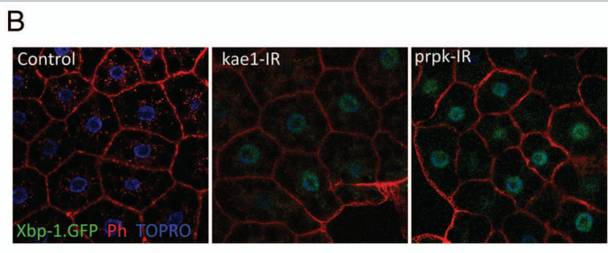

## Question

# Gene Research for Functional Annotation

## ⚠️ CRITICAL: Gene/Protein Identification Context

**BEFORE YOU BEGIN RESEARCH:** You MUST verify you are researching the CORRECT gene/protein. Gene symbols can be ambiguous, especially for less well-characterized genes from non-model organisms.

### Target Gene/Protein Identity (from UniProt):
- **UniProt Accession:** Q9VRJ6
- **Protein Description:** RecName: Full=non-specific serine/threonine protein kinase {ECO:0000256|ARBA:ARBA00012513}; EC=2.7.11.1 {ECO:0000256|ARBA:ARBA00012513};
- **Gene Information:** Name=Tcs5 {ECO:0000313|EMBL:AAF50799.1, ECO:0000313|FlyBase:FBgn0035590}; Synonyms=Dm bud32 {ECO:0000313|EMBL:AAF50799.1}, Dmel\CG10673 {ECO:0000313|EMBL:AAF50799.1}, dPrpk {ECO:0000313|EMBL:AAF50799.1}, Prpk {ECO:0000313|EMBL:AAF50799.1}, tcs5 {ECO:0000313|EMBL:AAF50799.1}; ORFNames=CG10673 {ECO:0000313|EMBL:AAF50799.1, ECO:0000313|FlyBase:FBgn0035590}, Dmel_CG10673 {ECO:0000313|EMBL:AAF50799.1};
- **Organism (full):** Drosophila melanogaster (Fruit fly).
- **Protein Family:** Belongs to the protein kinase superfamily. Tyr protein
- **Key Domains:** Bud32. (IPR022495); Kinase-like_dom_sf. (IPR011009); Prot_kinase_dom. (IPR000719); Tyr_kinase_AS. (IPR008266); Pkinase (PF00069)

### MANDATORY VERIFICATION STEPS:

1. **Check if the gene symbol "Tcs5" matches the protein description above**
2. **Verify the organism is correct:** Drosophila melanogaster (Fruit fly).
3. **Check if protein family/domains align with what you find in literature**
4. **If you find literature for a DIFFERENT gene with the same or similar symbol, STOP**

### If Gene Symbol is Ambiguous or You Cannot Find Relevant Literature:

**DO NOT PROCEED WITH RESEARCH ON A DIFFERENT GENE.** Instead:
- State clearly: "The gene symbol 'Tcs5' is ambiguous or literature is limited for this specific protein"
- Explain what you found (e.g., "Found extensive literature on a different gene with the same symbol in a different organism")
- Describe the protein based ONLY on the UniProt information provided above
- Suggest that the protein function can be inferred from domain/family information

### Research Target:

Please provide a comprehensive research report on the gene **Tcs5** (gene ID: Tcs5, UniProt: Q9VRJ6) in DROME.

The research report should be a detailed narrative explaining the function, biological processes, and localization of the gene product. Citations should be given for all claims.

You should prioritize authoritative reviews and primary scientific literature when conducting research. You can supplement
this with annotations you find in gene/protein databases, but these can be outdated or inaccurate.

We are specifically interested in the primary function of the gene - for enzymes, what reaction is catalyzed, and what is the substrate specificity? For transporters, what is the substrate? For structural proteins or adapters, what is the broader structural role? For signaling molecules, what is the role in the pathway.

We are interested in where in or outside the cell the gene product carries out its function.

We are also interested in the signaling or biochemical pathways in which the gene functions. We are less interested in broad pleiotropic effects, except where these elucidate the precise role.

Include evidence where possible. We are interested in both experimental evidence as well as inference from structure, evolution, or bioinformatic analysis. Precise studies should be prioritized over high-throughput, where available.

## Output

Question: You are an expert researcher providing comprehensive, well-cited information.

Provide detailed information focusing on:
1. Key concepts and definitions with current understanding
2. Recent developments and latest research (prioritize 2023-2024 sources)
3. Current applications and real-world implementations
4. Expert opinions and analysis from authoritative sources
5. Relevant statistics and data from recent studies

Format as a comprehensive research report with proper citations. Include URLs and publication dates where available.
Always prioritize recent, authoritative sources and provide specific citations for all major claims.

# Gene Research for Functional Annotation

## ⚠️ CRITICAL: Gene/Protein Identification Context

**BEFORE YOU BEGIN RESEARCH:** You MUST verify you are researching the CORRECT gene/protein. Gene symbols can be ambiguous, especially for less well-characterized genes from non-model organisms.

### Target Gene/Protein Identity (from UniProt):
- **UniProt Accession:** Q9VRJ6
- **Protein Description:** RecName: Full=non-specific serine/threonine protein kinase {ECO:0000256|ARBA:ARBA00012513}; EC=2.7.11.1 {ECO:0000256|ARBA:ARBA00012513};
- **Gene Information:** Name=Tcs5 {ECO:0000313|EMBL:AAF50799.1, ECO:0000313|FlyBase:FBgn0035590}; Synonyms=Dm bud32 {ECO:0000313|EMBL:AAF50799.1}, Dmel\CG10673 {ECO:0000313|EMBL:AAF50799.1}, dPrpk {ECO:0000313|EMBL:AAF50799.1}, Prpk {ECO:0000313|EMBL:AAF50799.1}, tcs5 {ECO:0000313|EMBL:AAF50799.1}; ORFNames=CG10673 {ECO:0000313|EMBL:AAF50799.1, ECO:0000313|FlyBase:FBgn0035590}, Dmel_CG10673 {ECO:0000313|EMBL:AAF50799.1};
- **Organism (full):** Drosophila melanogaster (Fruit fly).
- **Protein Family:** Belongs to the protein kinase superfamily. Tyr protein
- **Key Domains:** Bud32. (IPR022495); Kinase-like_dom_sf. (IPR011009); Prot_kinase_dom. (IPR000719); Tyr_kinase_AS. (IPR008266); Pkinase (PF00069)

### MANDATORY VERIFICATION STEPS:

1. **Check if the gene symbol "Tcs5" matches the protein description above**
2. **Verify the organism is correct:** Drosophila melanogaster (Fruit fly).
3. **Check if protein family/domains align with what you find in literature**
4. **If you find literature for a DIFFERENT gene with the same or similar symbol, STOP**

### If Gene Symbol is Ambiguous or You Cannot Find Relevant Literature:

**DO NOT PROCEED WITH RESEARCH ON A DIFFERENT GENE.** Instead:
- State clearly: "The gene symbol 'Tcs5' is ambiguous or literature is limited for this specific protein"
- Explain what you found (e.g., "Found extensive literature on a different gene with the same symbol in a different organism")
- Describe the protein based ONLY on the UniProt information provided above
- Suggest that the protein function can be inferred from domain/family information

### Research Target:

Please provide a comprehensive research report on the gene **Tcs5** (gene ID: Tcs5, UniProt: Q9VRJ6) in DROME.

The research report should be a detailed narrative explaining the function, biological processes, and localization of the gene product. Citations should be given for all claims.

You should prioritize authoritative reviews and primary scientific literature when conducting research. You can supplement
this with annotations you find in gene/protein databases, but these can be outdated or inaccurate.

We are specifically interested in the primary function of the gene - for enzymes, what reaction is catalyzed, and what is the substrate specificity? For transporters, what is the substrate? For structural proteins or adapters, what is the broader structural role? For signaling molecules, what is the role in the pathway.

We are interested in where in or outside the cell the gene product carries out its function.

We are also interested in the signaling or biochemical pathways in which the gene functions. We are less interested in broad pleiotropic effects, except where these elucidate the precise role.

Include evidence where possible. We are interested in both experimental evidence as well as inference from structure, evolution, or bioinformatic analysis. Precise studies should be prioritized over high-throughput, where available.

# Functional annotation of *Drosophila melanogaster* Tcs5 (Prpk; CG10673)

## Identity and principal function

**The target is the fly Bud32-family protein, not an unrelated gene called Tcs5.** Published nomenclature assigns *D. melanogaster* **CG10673** to **Tcs5/Bud32**; fly studies call the same locus **Prpk** or **dPrpk**. The designation UniProt **Q9VRJ6** is supplied in the question; the papers examined independently establish the organism, locus and aliases, but do not themselves print that accession. The Bud32 relationship is consistent with the supplied protein-kinase domain annotations. (rojasbenitez2013thedrosophilaekckeopscomplex pages 2-3, thiaville2014diversityofthe pages 7-9)

**Best-supported molecular annotation:** Tcs5/Prpk is the atypical kinase/ATPase-like **regulatory subunit of the KEOPS (also called EKC or TCTC) tRNA-modification machinery**. The complex installs N⁶-threonylcarbamoyladenosine (**t⁶A**) at adenosine 37 of tRNAs that decode codons beginning with A, including initiator tRNAᵢᴹᵉᵗ. Crucially, the threonylcarbamoyl group is transferred to tRNA by the **Kae1/Tcs3 subunit**, *not* by Tcs5. Thus, annotating Tcs5 itself as the tRNA threonylcarbamoyltransferase would misidentify the catalytic subunit. (thiaville2014diversityofthe pages 7-9, zheng2024molecularbasisof pages 1-2, rojasbenitez2015thelevelsof pages 1-2)

The pathway has two chemical stages. Sua5/YRDC uses **L-threonine, bicarbonate/CO₂ and ATP** to generate threonylcarbamoyladenylate; KEOPS-associated Kae1 then transfers its threonylcarbamoyl group to the **N⁶ position of tRNA A37**. For Bud32-family proteins, the best-established relevant biochemical reaction is **ATP → ADP**, coupled to productive KEOPS function. Neither a physiological *Drosophila* Tcs5 protein-phosphorylation substrate nor a fly-specific tRNA-binding or ATP-hydrolysis rate was established in the sources examined. Consequently, the supplied broad EC 2.7.11.1 kinase label should not be taken as evidence that phosphorylation of a particular protein is Tcs5’s primary physiological task. (zheng2024molecularbasisof pages 1-2, zheng2024molecularbasisof pages 12-13, zheng2024molecularbasisof pages 14-15)

The following evidence hierarchy separates results obtained with fly Prpk from experiments on its partners or homologs. (rojasbenitez2013thedrosophilaekckeopscomplex pages 2-3, rojasbenitez2015thelevelsof pages 1-2, zheng2024molecularbasisof pages 14-15)

| Claim | System / evidence | Interpretation | Evidence boundary |
|---|---|---|---|
| **Identity:** Tcs5 = Prpk/dPrpk = CG10673 in *Drosophila melanogaster*; Q9VRJ6 is the user-supplied UniProt accession. | A fly KEOPS review identifies the Bud32p ortholog as Prpk/CG10673; standardized t⁶A nomenclature independently lists fly CG10673 as Tcs5/Bud32. (rojasbenitez2013thedrosophilaekckeopscomplex pages 2-3, thiaville2014diversityofthe pages 7-9) | Strong literature support that the requested locus is the fly Bud32-family, kinase-like KEOPS component. | The cited papers do not themselves map CG10673 to UniProt Q9VRJ6; that accession mapping comes from the supplied target record. |
| **Fly phenotype and pathway:** Prpk depletion impairs growth, lowers TOR outputs, and induces proteostasis stress. | Fly Prpk RNAi reduced phosphorylation of the TOR targets S6K and 4EBP. Prpk depletion also activated an *xbp1*::GFP UPR reporter in larval fat body. (rojasbenitez2013thedrosophilaekckeopscomplex pages 2-3, rojasbenitez2013thedrosophilaekckeopscomplex media 4e1592f8) | Direct fly evidence places Prpk upstream of, or permissive for, normal TOR-dependent translation and growth and links its depletion to unfolded-protein stress. | These results do not establish direct phosphorylation of TOR, S6K, or 4EBP by Prpk. A kinase-dead transgene result alone is insufficient to prove that Prpk catalysis is universally dispensable. |
| **Fly t⁶A-pathway evidence:** Tcs3/Kae1 is directly required for tRNA t⁶A and growth. | Fly *tcs3* mutants showed reduced t⁶A-modified initiator tRNA by PHAt⁶A hybridization, reduced TORC1/2 readouts and polysomes, and growth defects; changing Tcs3 levels altered t⁶A, S6K phosphorylation, and growth. (rojasbenitez2015thelevelsof pages 5-6) | Demonstrates in flies that KEOPS-associated t⁶A availability controls translation and TOR-linked growth, supporting the pathway context assigned to Tcs5. | This is direct evidence for Tcs3/Kae1, not direct biochemical proof that fly Tcs5 catalyzes t⁶A formation or binds tRNA. |
| **Current Bud32 mechanism:** tRNA stimulates KEOPS-associated Bud32 ATPase activity. | Reconstituted *Arabidopsis thaliana* KEOPS bound tRNA-Arg-CCU with an approximate Kd of 18 µM; tRNA increased Bud32-associated ATPase kcat from 0.019 to 0.053 s⁻¹. Bud32 mutations separated tRNA binding from productive t⁶A catalysis. (zheng2024molecularbasisof pages 14-14, zheng2024molecularbasisof pages 14-15) | Supports the modern model that Bud32 is an ATP-dependent regulatory or turnover subunit that contacts tRNA and enables Kae1-catalyzed t⁶A formation, rather than being the TC-transferase itself. | These quantitative measurements are from plant KEOPS, not fly Tcs5; conservation is mechanistically persuasive but remains an inference for Q9VRJ6. |
| **Subcellular localization:** no specific intracellular location is established for fly Tcs5/Prpk. | The available fly image localizes *xbp1*::GFP UPR-reporter signal, not Prpk protein, to cytoplasm and nuclei after Prpk RNAi. (rojasbenitez2013thedrosophilaekckeopscomplex media 4e1592f8) | Tcs5 most plausibly functions with cytosolic KEOPS on cytoplasmic tRNAs, but this is pathway-based inference. | Do not treat reporter distribution as Prpk localization; direct endogenous tagging, fractionation, or validated immunolocalization remains lacking. |

*Table: Evidence hierarchy for the identity, function, pathway, biochemical mechanism, and localization of Drosophila Tcs5/Prpk. It distinguishes direct fly findings from mechanistic inference based on other KEOPS systems.*

## Direct evidence in the fly: growth, TOR signalling and translation

Fly **Prpk depletion** produces growth defects and decreases phosphorylation of **S6K and 4EBP**, readouts of TOR-dependent growth signalling. The original primary report is Ibar *et al.*, *Development* **140**, 1282–1291 (2013), [doi:10.1242/dev.086918](https://doi.org/10.1242/dev.086918). Its experimental conclusions are described in a 2013 article by the investigators; the original article’s full experimental text was not available for independent examination here. These results establish that Prpk is **required for normal TOR output**, not that Prpk directly phosphorylates TOR, S6K or 4EBP. (rojasbenitez2013thedrosophilaekckeopscomplex pages 1-2, rojasbenitez2013thedrosophilaekckeopscomplex pages 2-3)

An additional fly experiment depleted **Prpk or Kae1 in larval fat body** and detected induction of an **Ire1-dependent *xbp1*::GFP unfolded-protein-response reporter**. The cropped experimental panel, Figure 1B of the 2013 article, shows reporter induction after either knockdown; its companion Figure 1C is the authors’ **proposed** model linking KEOPS, tRNA modification, TOR activity and growth, rather than a demonstration of every molecular connection. Reporter fluorescence in nuclei and cytoplasm is **not** evidence that Prpk itself localizes to both compartments. Rojas-Benítez, Ibar and Glavic, *Fly* **7**, 168–172 (July 2013), [doi:10.4161/fly.25227](https://doi.org/10.4161/fly.25227). (rojasbenitez2013thedrosophilaekckeopscomplex pages 2-3, rojasbenitez2013thedrosophilaekckeopscomplex media 4e1592f8, rojasbenitez2013thedrosophilaekckeopscomplex media 77e3e12f)

The investigators reported that fly catalytic-mutant analyses pointed away from a substantial requirement for Prpk’s conventional kinase activity in the tested growth function. This observation should not be generalized into proof that **all** Bud32 nucleotide hydrolysis is dispensable: the original fly mutant experiments could not be assessed in full here, and subsequent biochemical work finds an ATPase-dependent contribution to KEOPS catalysis in another species. In 2013, physical interactions among the proposed fly KEOPS components had **not** been demonstrated; the fly complex was assigned by orthology and functional evidence. Notably, fly gene inventories lack the otherwise common **Cgi121/Tcs7** subunit, so mechanisms measured in four- or five-component complexes cannot be transferred to flies without qualification. (rojasbenitez2013thedrosophilaekckeopscomplex pages 1-2, rojasbenitez2013thedrosophilaekckeopscomplex pages 2-3, su2022conservationanddiversification pages 9-11, zheng2024molecularbasisof pages 14-15)

Stronger **fly-specific evidence for the pathway**, though not for direct Tcs5 catalysis, comes from manipulating its partner **Tcs3/Kae1 (CG4933)**. Tcs3-mutant fly tRNA showed reduced t⁶A-associated signal on initiator tRNA in a modification-sensitive hybridization assay; mutant animals had reduced growth, polysome abundance and TOR-associated S6K phosphorylation. Expressing an initiator-tRNA **A37G** variant designed to preclude t⁶A reduced wing growth, whereas Tcs3 overexpression increased modified initiator tRNA and growth. Rheb expression restored a TORC1 phosphorylation readout in *tcs3* mutants **without rescuing animal growth**, arguing against the simple proposition that reduced TORC1 activity alone explains the tRNA-modification phenotype. These are experiments on **Tcs3 or tRNA**, not a direct measurement of fly Tcs5-mediated t⁶A synthesis. Rojas-Benitez *et al.*, *Journal of Biological Chemistry* **290**, 18699–18707 (24 July 2015), [doi:10.1074/jbc.M115.665406](https://doi.org/10.1074/jbc.M115.665406). (rojasbenitez2015thelevelsof pages 3-5, rojasbenitez2015thelevelsof pages 5-6, rojasbenitez2015thelevelsof pages 6-8)

## What recent mechanistic studies add—and their species boundary

A **2024 reconstitution and structural study in *Arabidopsis thaliana*** provides substantially more precise information about a Bud32 homolog. Plant KEOPS bound in-vitro-transcribed tRNAᴬʳᵍ(C​CU) with a reported dissociation constant of approximately **18 µM**. tRNA increased KEOPS-associated Bud32 ATPase turnover from **0.019 to 0.053 s⁻¹** under the reported assay conditions. A BUD32 **K55E** variant weakened tRNA interaction; mutations of ATPase-associated residues **D137/D156** impaired ATP hydrolysis and t⁶A production. Mutation or truncation of the C-terminal region also disrupted productive t⁶A synthesis, separating functions in **tRNA engagement, ATPase-driven regulation and Kae1-mediated transfer**. These are **plant-complex measurements**, not numerical properties determined for Q9VRJ6. Zheng *et al.*, *Nucleic Acids Research* **52**, 4523–4540 (March 2024), [doi:10.1093/nar/gkae179](https://doi.org/10.1093/nar/gkae179). (zheng2024molecularbasisof pages 12-13, zheng2024molecularbasisof pages 14-15, zheng2024molecularbasisof pages 14-14)

The 2024 study also highlights an important structural limitation: its purified plant KEOPS cryo-EM structure did **not** retain bound tRNA; the plant KEOPS–tRNA placement was modeled and tested by binding and mutagenesis, rather than directly visualized in that structure. Its substrate tests implicate tRNA identity and the anticodon-loop **36-UAA-38** motif in productive modification; these tests concern **KEOPS substrate specificity**, not a demonstrated, independently catalytic substrate specificity of fly Prpk. A separate 2024 cryo-EM study reported structures of KEOPS with and without tRNA and described Bud32 contacts associated with tRNA conformational change, reinforcing a mechanistic role for the family without establishing those contacts in *Drosophila*. Chuquimarca *et al.*, *Nature Communications* **15** (December 2024), [doi:10.1038/s41467-024-54787-w](https://doi.org/10.1038/s41467-024-54787-w). (zheng2024molecularbasisof pages 14-15, zheng2024molecularbasisof pages 14-14)

## Cellular site, interpretation and limits

The **most plausible site of Tcs5’s principal function is intracellular KEOPS acting on the cytoplasmic tRNA pool**: the KEOPS/Kae1 pathway supplies t⁶A-modified tRNAs for translation, whereas a distinct Qri7/OSGEPL1-family system serves mitochondria in characterized eukaryotes. **A specific subcellular localization of endogenous fly Tcs5/Prpk—cytosolic, nuclear or otherwise—was not demonstrated in the examined fly studies.** The fat-body *xbp1*::GFP image localizes a **stress reporter**, not the target protein. Nuclear or telomere-related reports from other organisms likewise should not be transferred uncritically to fly Tcs5, especially because fly telomeres have a different maintenance mechanism. (thiaville2014diversityofthe pages 7-9, rojasbenitez2013thedrosophilaekckeopscomplex pages 2-3, rojasbenitez2013thedrosophilaekckeopscomplex media 4e1592f8)

**Functional-annotation conclusion:** assign Q9VRJ6/CG10673 with high confidence as *D. melanogaster* **Tcs5/Prpk, a Bud32-family KEOPS-associated kinase-like regulatory subunit**. Assign participation in **tRNA A37 t⁶A biosynthesis and translation homeostasis** as a strongly supported **conserved mechanistic inference**; assign normal **TOR-dependent growth output and resistance to proteostasis stress** as observed fly phenotypes. Record **fly-specific ATPase kinetics, direct tRNA or protein substrates, precise KEOPS physical composition and endogenous subcellular localization as unresolved**, rather than substituting measurements from plant, yeast or human proteins. The main research use of this annotation is to distinguish the molecular tRNA-modification pathway from downstream growth phenotypes; the sources examined do not establish a specific clinical or industrial implementation of the fly gene. (rojasbenitez2013thedrosophilaekckeopscomplex pages 2-3, rojasbenitez2015thelevelsof pages 1-2, su2022conservationanddiversification pages 9-11, zheng2024molecularbasisof pages 14-15)

References

1. (rojasbenitez2013thedrosophilaekckeopscomplex pages 2-3): Diego Rojas-Benítez, Consuelo Ibar, and Álvaro Glavic. The<i>drosophila</i>ekc/keops complex. Fly, 7:168-172, Jul 2013. URL: https://doi.org/10.4161/fly.25227, doi:10.4161/fly.25227. This article has 23 citations and is from a peer-reviewed journal.

2. (thiaville2014diversityofthe pages 7-9): Patrick C Thiaville, Dirk Iwata-Reuyl, and Valérie de Crécy-Lagard. Diversity of the biosynthesis pathway for threonylcarbamoyladenosine (t6a), a universal modification of trna. RNA Biology, 11:1529-1539, Dec 2014. URL: https://doi.org/10.4161/15476286.2014.992277, doi:10.4161/15476286.2014.992277. This article has 121 citations and is from a peer-reviewed journal.

3. (zheng2024molecularbasisof pages 1-2): Xinxing Zheng, Chenchen Su, Lei Duan, Mengqi Jin, Yongtao Sun, Li Zhu, and Wenhua Zhang. Molecular basis of a. thaliana keops complex in biosynthesizing trna t6a. Nucleic Acids Research, 52:4523-4540, Mar 2024. URL: https://doi.org/10.1093/nar/gkae179, doi:10.1093/nar/gkae179. This article has 10 citations and is from a highest quality peer-reviewed journal.

4. (rojasbenitez2015thelevelsof pages 1-2): Diego Rojas-Benitez, Patrick C. Thiaville, Valérie de Crécy-Lagard, and Alvaro Glavic. The levels of a universally conserved trna modification regulate cell growth. Journal of Biological Chemistry, 290:18699-18707, Jul 2015. URL: https://doi.org/10.1074/jbc.m115.665406, doi:10.1074/jbc.m115.665406. This article has 51 citations and is from a domain leading peer-reviewed journal.

5. (zheng2024molecularbasisof pages 12-13): Xinxing Zheng, Chenchen Su, Lei Duan, Mengqi Jin, Yongtao Sun, Li Zhu, and Wenhua Zhang. Molecular basis of a. thaliana keops complex in biosynthesizing trna t6a. Nucleic Acids Research, 52:4523-4540, Mar 2024. URL: https://doi.org/10.1093/nar/gkae179, doi:10.1093/nar/gkae179. This article has 10 citations and is from a highest quality peer-reviewed journal.

6. (zheng2024molecularbasisof pages 14-15): Xinxing Zheng, Chenchen Su, Lei Duan, Mengqi Jin, Yongtao Sun, Li Zhu, and Wenhua Zhang. Molecular basis of a. thaliana keops complex in biosynthesizing trna t6a. Nucleic Acids Research, 52:4523-4540, Mar 2024. URL: https://doi.org/10.1093/nar/gkae179, doi:10.1093/nar/gkae179. This article has 10 citations and is from a highest quality peer-reviewed journal.

7. (rojasbenitez2013thedrosophilaekckeopscomplex media 4e1592f8): Diego Rojas-Benítez, Consuelo Ibar, and Álvaro Glavic. The<i>drosophila</i>ekc/keops complex. Fly, 7:168-172, Jul 2013. URL: https://doi.org/10.4161/fly.25227, doi:10.4161/fly.25227. This article has 23 citations and is from a peer-reviewed journal.

8. (rojasbenitez2015thelevelsof pages 5-6): Diego Rojas-Benitez, Patrick C. Thiaville, Valérie de Crécy-Lagard, and Alvaro Glavic. The levels of a universally conserved trna modification regulate cell growth. Journal of Biological Chemistry, 290:18699-18707, Jul 2015. URL: https://doi.org/10.1074/jbc.m115.665406, doi:10.1074/jbc.m115.665406. This article has 51 citations and is from a domain leading peer-reviewed journal.

9. (zheng2024molecularbasisof pages 14-14): Xinxing Zheng, Chenchen Su, Lei Duan, Mengqi Jin, Yongtao Sun, Li Zhu, and Wenhua Zhang. Molecular basis of a. thaliana keops complex in biosynthesizing trna t6a. Nucleic Acids Research, 52:4523-4540, Mar 2024. URL: https://doi.org/10.1093/nar/gkae179, doi:10.1093/nar/gkae179. This article has 10 citations and is from a highest quality peer-reviewed journal.

10. (rojasbenitez2013thedrosophilaekckeopscomplex pages 1-2): Diego Rojas-Benítez, Consuelo Ibar, and Álvaro Glavic. The<i>drosophila</i>ekc/keops complex. Fly, 7:168-172, Jul 2013. URL: https://doi.org/10.4161/fly.25227, doi:10.4161/fly.25227. This article has 23 citations and is from a peer-reviewed journal.

11. (rojasbenitez2013thedrosophilaekckeopscomplex media 77e3e12f): Diego Rojas-Benítez, Consuelo Ibar, and Álvaro Glavic. The<i>drosophila</i>ekc/keops complex. Fly, 7:168-172, Jul 2013. URL: https://doi.org/10.4161/fly.25227, doi:10.4161/fly.25227. This article has 23 citations and is from a peer-reviewed journal.

12. (su2022conservationanddiversification pages 9-11): Chen-Hsien Su, Mengqi Jin, and Wenhua Zhang. Conservation and diversification of trna t6a-modifying enzymes across the three domains of life. International Journal of Molecular Sciences, 23:13600, Nov 2022. URL: https://doi.org/10.3390/ijms232113600, doi:10.3390/ijms232113600. This article has 47 citations.

13. (rojasbenitez2015thelevelsof pages 3-5): Diego Rojas-Benitez, Patrick C. Thiaville, Valérie de Crécy-Lagard, and Alvaro Glavic. The levels of a universally conserved trna modification regulate cell growth. Journal of Biological Chemistry, 290:18699-18707, Jul 2015. URL: https://doi.org/10.1074/jbc.m115.665406, doi:10.1074/jbc.m115.665406. This article has 51 citations and is from a domain leading peer-reviewed journal.

14. (rojasbenitez2015thelevelsof pages 6-8): Diego Rojas-Benitez, Patrick C. Thiaville, Valérie de Crécy-Lagard, and Alvaro Glavic. The levels of a universally conserved trna modification regulate cell growth. Journal of Biological Chemistry, 290:18699-18707, Jul 2015. URL: https://doi.org/10.1074/jbc.m115.665406, doi:10.1074/jbc.m115.665406. This article has 51 citations and is from a domain leading peer-reviewed journal.

## Artifacts

- [Edison artifact artifact-00](Tcs5-deep-research-falcon_artifacts/artifact-00.md)

## Citations

1. rojasbenitez2015thelevelsof pages 5-6
2. rojasbenitez2013thedrosophilaekckeopscomplex pages 2-3
3. thiaville2014diversityofthe pages 7-9
4. zheng2024molecularbasisof pages 1-2
5. rojasbenitez2015thelevelsof pages 1-2
6. zheng2024molecularbasisof pages 12-13
7. zheng2024molecularbasisof pages 14-15
8. zheng2024molecularbasisof pages 14-14
9. rojasbenitez2013thedrosophilaekckeopscomplex pages 1-2
10. su2022conservationanddiversification pages 9-11
11. rojasbenitez2015thelevelsof pages 3-5
12. rojasbenitez2015thelevelsof pages 6-8
13. doi:10.1242/dev.086918
14. doi:10.4161/fly.25227
15. doi:10.1074/jbc.M115.665406
16. doi:10.1093/nar/gkae179
17. doi:10.1038/s41467-024-54787-w
18. https://doi.org/10.1242/dev.086918
19. https://doi.org/10.4161/fly.25227
20. https://doi.org/10.1074/jbc.M115.665406
21. https://doi.org/10.1093/nar/gkae179
22. https://doi.org/10.1038/s41467-024-54787-w
23. https://doi.org/10.4161/fly.25227,
24. https://doi.org/10.4161/15476286.2014.992277,
25. https://doi.org/10.1093/nar/gkae179,
26. https://doi.org/10.1074/jbc.m115.665406,
27. https://doi.org/10.3390/ijms232113600,