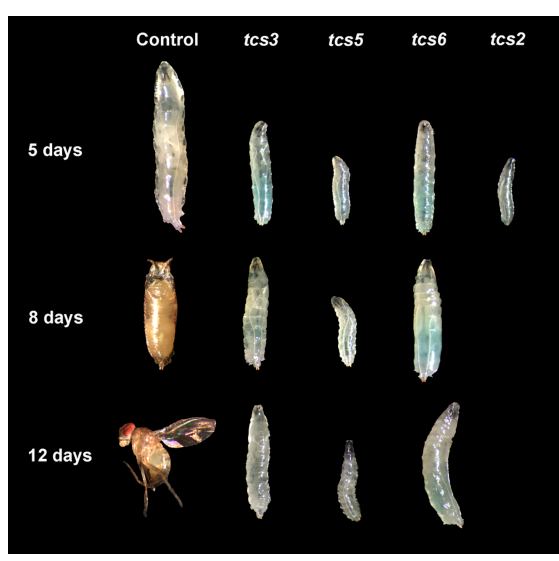

## Question

# Gene Research for Functional Annotation

## ⚠️ CRITICAL: Gene/Protein Identification Context

**BEFORE YOU BEGIN RESEARCH:** You MUST verify you are researching the CORRECT gene/protein. Gene symbols can be ambiguous, especially for less well-characterized genes from non-model organisms.

### Target Gene/Protein Identity (from UniProt):
- **UniProt Accession:** E1JIY8
- **Protein Description:** RecName: Full=L antigen family member 3 {ECO:0000256|ARBA:ARBA00076355};
- **Gene Information:** Name=Tcs6 {ECO:0000313|EMBL:ACZ95037.1, ECO:0000313|FlyBase:FBgn0260224}; Synonyms=Dm pcc1 {ECO:0000313|EMBL:ACZ95037.1}, Dmel\CG42498 {ECO:0000313|EMBL:ACZ95037.1}, tcs6 {ECO:0000313|EMBL:ACZ95037.1}; ORFNames=CG42498 {ECO:0000313|EMBL:ACZ95037.1, ECO:0000313|FlyBase:FBgn0260224}, Dmel_CG42498 {ECO:0000313|EMBL:ACZ95037.1};
- **Organism (full):** Drosophila melanogaster (Fruit fly).
- **Protein Family:** Belongs to the CTAG/PCC1 family.
- **Key Domains:** CTAG/Pcc1. (IPR015419); Pcc1 (PF09341)

### MANDATORY VERIFICATION STEPS:

1. **Check if the gene symbol "Tcs6" matches the protein description above**
2. **Verify the organism is correct:** Drosophila melanogaster (Fruit fly).
3. **Check if protein family/domains align with what you find in literature**
4. **If you find literature for a DIFFERENT gene with the same or similar symbol, STOP**

### If Gene Symbol is Ambiguous or You Cannot Find Relevant Literature:

**DO NOT PROCEED WITH RESEARCH ON A DIFFERENT GENE.** Instead:
- State clearly: "The gene symbol 'Tcs6' is ambiguous or literature is limited for this specific protein"
- Explain what you found (e.g., "Found extensive literature on a different gene with the same symbol in a different organism")
- Describe the protein based ONLY on the UniProt information provided above
- Suggest that the protein function can be inferred from domain/family information

### Research Target:

Please provide a comprehensive research report on the gene **Tcs6** (gene ID: Tcs6, UniProt: E1JIY8) in DROME.

The research report should be a detailed narrative explaining the function, biological processes, and localization of the gene product. Citations should be given for all claims.

You should prioritize authoritative reviews and primary scientific literature when conducting research. You can supplement
this with annotations you find in gene/protein databases, but these can be outdated or inaccurate.

We are specifically interested in the primary function of the gene - for enzymes, what reaction is catalyzed, and what is the substrate specificity? For transporters, what is the substrate? For structural proteins or adapters, what is the broader structural role? For signaling molecules, what is the role in the pathway.

We are interested in where in or outside the cell the gene product carries out its function.

We are also interested in the signaling or biochemical pathways in which the gene functions. We are less interested in broad pleiotropic effects, except where these elucidate the precise role.

Include evidence where possible. We are interested in both experimental evidence as well as inference from structure, evolution, or bioinformatic analysis. Precise studies should be prioritized over high-throughput, where available.

## Output

Question: You are an expert researcher providing comprehensive, well-cited information.

Provide detailed information focusing on:
1. Key concepts and definitions with current understanding
2. Recent developments and latest research (prioritize 2023-2024 sources)
3. Current applications and real-world implementations
4. Expert opinions and analysis from authoritative sources
5. Relevant statistics and data from recent studies

Format as a comprehensive research report with proper citations. Include URLs and publication dates where available.
Always prioritize recent, authoritative sources and provide specific citations for all major claims.

# Gene Research for Functional Annotation

## ⚠️ CRITICAL: Gene/Protein Identification Context

**BEFORE YOU BEGIN RESEARCH:** You MUST verify you are researching the CORRECT gene/protein. Gene symbols can be ambiguous, especially for less well-characterized genes from non-model organisms.

### Target Gene/Protein Identity (from UniProt):
- **UniProt Accession:** E1JIY8
- **Protein Description:** RecName: Full=L antigen family member 3 {ECO:0000256|ARBA:ARBA00076355};
- **Gene Information:** Name=Tcs6 {ECO:0000313|EMBL:ACZ95037.1, ECO:0000313|FlyBase:FBgn0260224}; Synonyms=Dm pcc1 {ECO:0000313|EMBL:ACZ95037.1}, Dmel\CG42498 {ECO:0000313|EMBL:ACZ95037.1}, tcs6 {ECO:0000313|EMBL:ACZ95037.1}; ORFNames=CG42498 {ECO:0000313|EMBL:ACZ95037.1, ECO:0000313|FlyBase:FBgn0260224}, Dmel_CG42498 {ECO:0000313|EMBL:ACZ95037.1};
- **Organism (full):** Drosophila melanogaster (Fruit fly).
- **Protein Family:** Belongs to the CTAG/PCC1 family.
- **Key Domains:** CTAG/Pcc1. (IPR015419); Pcc1 (PF09341)

### MANDATORY VERIFICATION STEPS:

1. **Check if the gene symbol "Tcs6" matches the protein description above**
2. **Verify the organism is correct:** Drosophila melanogaster (Fruit fly).
3. **Check if protein family/domains align with what you find in literature**
4. **If you find literature for a DIFFERENT gene with the same or similar symbol, STOP**

### If Gene Symbol is Ambiguous or You Cannot Find Relevant Literature:

**DO NOT PROCEED WITH RESEARCH ON A DIFFERENT GENE.** Instead:
- State clearly: "The gene symbol 'Tcs6' is ambiguous or literature is limited for this specific protein"
- Explain what you found (e.g., "Found extensive literature on a different gene with the same symbol in a different organism")
- Describe the protein based ONLY on the UniProt information provided above
- Suggest that the protein function can be inferred from domain/family information

### Research Target:

Please provide a comprehensive research report on the gene **Tcs6** (gene ID: Tcs6, UniProt: E1JIY8) in DROME.

The research report should be a detailed narrative explaining the function, biological processes, and localization of the gene product. Citations should be given for all claims.

You should prioritize authoritative reviews and primary scientific literature when conducting research. You can supplement
this with annotations you find in gene/protein databases, but these can be outdated or inaccurate.

We are specifically interested in the primary function of the gene - for enzymes, what reaction is catalyzed, and what is the substrate specificity? For transporters, what is the substrate? For structural proteins or adapters, what is the broader structural role? For signaling molecules, what is the role in the pathway.

We are interested in where in or outside the cell the gene product carries out its function.

We are also interested in the signaling or biochemical pathways in which the gene functions. We are less interested in broad pleiotropic effects, except where these elucidate the precise role.

Include evidence where possible. We are interested in both experimental evidence as well as inference from structure, evolution, or bioinformatic analysis. Precise studies should be prioritized over high-throughput, where available.

# Functional annotation report: *Drosophila melanogaster* Tcs6

**Identity verified.** The target is fruit-fly **Tcs6/CG42498**, FlyBase **FBgn0260224**, UniProt **[E1JIY8](https://www.uniprot.org/uniprotkb/E1JIY8/entry)**—the CTAG/PCC1-family protein annotated in the supplied UniProt record as “L antigen family member 3.” A fly-specific review independently identifies **CG42498 as the ortholog of yeast Pcc1**, a KEOPS-complex subunit. The alternative name *Dm pcc1* is therefore more informative for interpreting its function than the protein-description label. Studies of another organism’s “Tcs6,” or of fly **Tcs3/Kae1**, must not be mistaken for experiments on this protein. (rojasbenitez2013thedrosophilaekckeopscomplex pages 2-3, rojasbenitez2017modulationofthe pages 1-3)

## Primary function and biochemical pathway

**Best-supported annotation: an auxiliary, probably structural subunit of the tRNA-modifying KEOPS complex**, also called EKC or the threonylcarbamoyl transferase complex (TCTC). Tcs6/Pcc1 is **not** the enzyme that transfers a chemical group onto tRNA. In the first pathway step, Sua5/YrdC-family protein uses **L-threonine, bicarbonate/CO₂ and ATP** to make threonylcarbamoyladenylate (TC-AMP). In the second, **Kae1/Tcs3**, supported by KEOPS partners including **Pcc1/Tcs6** and **Bud32/Prpk/Tcs5**, transfers the threonylcarbamoyl group from TC-AMP to **N⁶ of adenosine 37** in susceptible tRNAs. The product, **N⁶-threonylcarbamoyladenosine (t⁶A)**, is found predominantly in tRNAs decoding **A-starting (ANN) codons**, including initiator tRNA^Met. Thus the relevant substrate for the *complex* is a tRNA bearing a suitable A37, rather than a demonstrated substrate of isolated Tcs6. (rojasbenitez2017modulationofthe pages 1-3, zheng2024molecularbasisof pages 1-2, wang2022commonalityanddiversity pages 1-2)

Pcc1-family proteins contact Kae1 near its catalytic region and help form a functionally important KEOPS–tRNA interface. Structural models place Pcc1 beside the tRNA anticodon loop, positioning A37 toward **Kae1’s** active site; Pcc1 can also influence KEOPS oligomerization. These are strong **family-level** mechanistic interpretations, not direct structural measurements of E1JIY8. The precise contribution of Pcc1 to catalysis remains unresolved even in better-characterized systems. The fly architecture should not simply be copied from human or yeast KEOPS: **no Cgi121 ortholog has been identified in *Drosophila***, and a fly-specific complex structure or Tcs6–Kae1 binding measurement was not established by the examined studies. (beenstock2021thestructuraland pages 9-11, beenstock2021thestructuraland pages 11-12, beenstock2021thestructuraland pages 12-13, zheng2024molecularbasisof pages 1-1)

The modification helps stabilize anticodon-loop geometry and cognate codon recognition. Accordingly, the most direct pathway-level consequence of impairing Tcs6 is expected to be **less efficient or less faithful translation**, with growth and proteostasis effects downstream. Whether Tcs6 itself has an independent signaling, chromatin, or telomere-maintenance activity in flies has **not** been demonstrated; an older fly KEOPS analysis explicitly cautioned against treating the complex’s numerous proposed functions in other organisms as established fly mechanisms. (beenstock2021thestructuraland pages 3-4, rojasbenitez2013thedrosophilaekckeopscomplex pages 1-2, rojasbenitez2013thedrosophilaekckeopscomplex pages 2-3)

## Evidence specifically involving fly Tcs6

The strongest *in vivo* gene-specific study is **Rojas-Benítez, Eggers and Glavic, published 6 March 2017**, [*Biomolecules* 7:25](https://doi.org/10.3390/biom7010025). It identifies the **UAS-Tcs6-IR RNAi reagent as VDRC line 4371**. Ubiquitous depletion of Tcs6, among other t⁶A-pathway components, produced **small larvae and delayed development**: controls had pupated by approximately **day 8 after egg laying** and adults were present by **day 12**, whereas pathway-depleted animals remained larval. These are representative developmental time points, **not** a measured percentage reduction in Tcs6-dependent growth. The study also reported induction of the **Atf4-5′UTR::dsRed stress-response reporter** after fat-body depletion of t⁶A-pathway components, including the Tcs6-targeted condition. Reporter activation supports disturbed protein-synthesis homeostasis, but does not itself quantify misfolded proteins or prove that Tcs6 is located in the endoplasmic reticulum. (rojasbenitez2017modulationofthe pages 1-3, rojasbenitez2017modulationofthe pages 3-6, rojasbenitez2017modulationofthe pages 8-10, rojasbenitez2017modulationofthe media 3eb41e9a)

**Lin and colleagues, published October 2015**, [*RNA* 21:2103–2118](https://doi.org/10.1261/rna.053934.115), provided complementary **heterologous** evidence. Expressing fly **Pcc1 together with fly Kae1** in *yeast kae1* mutants improved growth and recovery of t⁶A-modified tRNAs compared with fly Kae1 alone; the **Kae1 + Bud32** pairing gave stronger rescue. Fly Pcc1 with Bud32 did **not** improve rescue of *yeast bud32* mutants over Bud32 alone, consistent with the model in which each contacts Kae1 rather than the two contacting each other. This supports a conserved **auxiliary KEOPS role**, but is not a purified-fly-protein assay or a direct measurement of t⁶A after fly *tcs6* loss. (lin2015anextensiveallelic pages 5-7, lin2015anextensiveallelic pages 7-8)

The distinction matters quantitatively: the approximately **10%** reduction in total t⁶A in a weak allele and **40%** reductions in strong/null alleles reported by Lin and colleagues were measured in **fly *kae1* mutants**, **not Tcs6 mutants**. Likewise, the wing-cell apoptosis and rescue experiments in the 2017 study primarily targeted **Tcs3/Kae1**, not Tcs6; they illuminate the pathway but cannot be assigned as Tcs6-specific phenotypes. A Tcs6 knockdown effect size for t⁶A abundance, a Tcs6 catalytic rate, and a validated fly Tcs6-null/rescue phenotype were not found in these studies. (lin2015anextensiveallelic pages 5-7, rojasbenitez2017modulationofthe pages 3-6)

The evidence levels and their limits are summarized below.

| Evidence level | Finding for *D. melanogaster* Tcs6/CG42498 (Pcc1) | Limitation and source |
|---|---|---|
| **Direct fly perturbation** | Ubiquitous RNAi against **tcs6** using **UAS-Tcs6 IR (VDRC 4371)** caused markedly reduced larval growth and developmental delay relative to controls. (rojasbenitez2017modulationofthe pages 8-10, rojasbenitez2017modulationofthe pages 1-3, rojasbenitez2017modulationofthe media 3eb41e9a) | RNAi phenotype; no rescue experiment or direct t6A quantification was reported specifically for Tcs6 depletion. Rojas-Benítez *et al.* (2017), [https://doi.org/10.3390/biom7010025](https://doi.org/10.3390/biom7010025). |
| **Direct fly perturbation with pathway reporter** | Fat-body knockdown of TCTC components, including Tcs6, activated the **Atf4-5′UTR::dsRed** reporter, supporting PERK/ATF4 stress-pathway activation when Tcs6-dependent t6A machinery is impaired. (rojasbenitez2017modulationofthe pages 3-6, rojasbenitez2017modulationofthe pages 8-10, rojasbenitez2017modulationofthe pages 6-8) | Reporter activation is an indirect readout of proteostasis stress, not a direct measurement of misfolded proteins, t6A abundance, or Tcs6 catalytic activity. Rojas-Benítez *et al.* (2017), [https://doi.org/10.3390/biom7010025](https://doi.org/10.3390/biom7010025). |
| **Heterologous functional evidence** | Coexpression of fly **Pcc1/Tcs6 with Kae1** improved growth and restoration of t6A-modified tRNA in a yeast **kae1**-null background, supporting an auxiliary role for fly Pcc1 in KEOPS-dependent t6A biogenesis. Rescue was weaker than with **fly Kae1 + Bud32**. (lin2015anextensiveallelic pages 5-7, lin2015anextensiveallelic pages 7-8) | Cross-species complementation is not direct demonstration of complex assembly or catalysis in fly cells. The approximately 40% t6A decrease reported in the same study occurred in **fly kae1 mutants**, not Tcs6 mutants, and therefore cannot be assigned to Tcs6. Lin *et al.* (2015), [https://doi.org/10.1261/rna.053934.115](https://doi.org/10.1261/rna.053934.115). |
| **Comparative structural–biochemical evidence** | In *Arabidopsis thaliana*, PCC1 dimerization generated a KEOPS dimer required for an active KEOPS–tRNA assembly; this supports a conserved scaffolding/oligomerization model for CTAG/PCC1-family proteins. (zheng2024molecularbasisof pages 1-1, zheng2024molecularbasisof pages 2-3, zheng2024molecularbasisof pages 6-7) | Different species: the result must not be treated as direct evidence that fly Tcs6 dimerizes or that fly KEOPS has the same stoichiometry. Zheng *et al.* (2024), [https://doi.org/10.1093/nar/gkae179](https://doi.org/10.1093/nar/gkae179). |
| **Family-level mechanistic inference** | PCC1 binds Kae1 near its active-site region and contributes to the extended KEOPS tRNA-contact surface; Pcc1 is auxiliary rather than the TC-transfer catalytic subunit, which is Kae1. (beenstock2021thestructuraland pages 9-11, beenstock2021thestructuraland pages 11-12, beenstock2021thestructuraland pages 12-13) | Derived from structures and experiments in non-fly orthologs; direct Tcs6–Kae1 binding has not been experimentally demonstrated in *Drosophila*. Beenstock & Sicheri (2021), [https://doi.org/10.1093/nar/gkab865](https://doi.org/10.1093/nar/gkab865). |
| **Localization inference only** | Tcs6 is most plausibly a component of the **cytoplasmic** KEOPS/TCTC pathway that modifies cytoplasmic ANN-decoding tRNAs. (su2022conservationanddiversification pages 9-11, beenstock2021thestructuraland pages 5-7) | No verified Tcs6-specific imaging or biochemical fractionation in fly cells was found; cytoplasmic localization is therefore a pathway-based inference, not a directly observed localization for E1JIY8. |

*Table: Evidence supporting functional annotation of the exact fruit-fly Tcs6/CG42498 protein, separated into direct fly results and ortholog-based inference. The limitations prevent Kae1-specific t6A measurements or non-fly structural findings from being misattributed to Tcs6.*

## Cellular location and signaling context

**Most plausible site of action: the intracellular cytoplasmic tRNA-maturation pathway.** KEOPS modifies the pool of cytoplasmic ANN-decoding tRNAs, whereas mitochondrial t⁶A biogenesis uses a distinct Kae1-related factor. This supports cytoplasmic action for Tcs6 as a **pathway-based inference**, but the examined fly studies did **not** directly establish E1JIY8 localization by tagged-protein imaging or subcellular fractionation. The fat body is a tissue in which *tcs6* knockdown was tested, not evidence of a fat-body-exclusive expression pattern; stress-reporter fluorescence is not a Tcs6 localization measurement. An extracellular role is not supported by the functional evidence. (wang2022commonalityanddiversity pages 1-2, su2022conservationanddiversification pages 9-11, rojasbenitez2017modulationofthe pages 8-10)

Fly studies connect loss of the **t⁶A pathway** to the unfolded-protein response and to changes in **TOR-dependent growth signaling**. The particularly detailed TOR and initiator-tRNA experiments manipulated **Tcs3/Kae1 or tRNA**, while fly **Prpk/Bud32** was separately implicated in TOR activity. The defensible conclusion for **Tcs6** is that it supports the KEOPS-dependent tRNA-modification pathway on which translation and normal growth depend; **Tcs6 has not been established as a direct TOR kinase regulator or as an ER-resident signaling protein**. (rojasbenitez2015thelevelsof pages 1-2, rojasbenitez2013thedrosophilaekckeopscomplex pages 1-2, rojasbenitez2017modulationofthe pages 6-8)

## Developments in 2023–2024 and present uncertainty

Recent work strengthens the **mechanistic inference**, rather than adding an independently verified fly Tcs6 structure. **Zheng and colleagues, published 13 March 2024**, [*Nucleic Acids Research* 52:4523–4540](https://doi.org/10.1093/nar/gkae179), reconstituted *Arabidopsis* KEOPS and found that **PCC1-mediated dimerization** produced an active KEOPS–tRNA assembly. They observed t⁶A synthesis with purified pathway components and loss of activity in a reduced KAE1–PCC1 subcomplex lacking the other required partner(s). These findings reinforce an assembly/scaffold interpretation for Pcc1, **but do not establish that fly Tcs6 dimerizes**: species differ in their accessory subunits and substrate-recognition mechanisms. A **2023** archaeal study, [Daugeron *et al.*, *Nature Communications* 14](https://doi.org/10.1038/s41467-023-36210-y), further showed that a Pcc1-related partner can regulate KEOPS oligomeric state; this is evolutionary context, not an experiment on fly Tcs6. (zheng2024molecularbasisof pages 1-1, zheng2024molecularbasisof pages 6-7, zheng2024molecularbasisof pages 2-3)

A **December 2024** study, [Chuquimarca *et al.*, *Nature Communications* 15](https://doi.org/10.1038/s41467-024-54787-w), reported tRNA-bound KEOPS structures and described contacts involving **Pcc1, Kae1 and Bud32**. Its experimentally studied complex was **archaeal**; its relevance here is to the conserved rationale for positioning tRNA for Kae1-mediated modification, not to a measured fly Tcs6–tRNA interaction. Comparative human work, [Wang *et al.*, published 1 February 2022](https://doi.org/10.1093/nar/gkac056), similarly underscores that the t⁶A pathway can influence aminoacylation and reading-frame fidelity, while substrate-recognition details vary across organisms. (wang2022commonalityanddiversity pages 1-2, zheng2024molecularbasisof pages 1-1)

**Conclusion.** Tcs6/E1JIY8 is best annotated as the fruit-fly **Pcc1-family auxiliary KEOPS subunit required for normal t⁶A-pathway function and growth**, probably by organizing the Kae1-containing tRNA-modification machinery. Its individual molecular contacts, oligomeric state and subcellular distribution in flies—and the magnitude of t⁶A loss after **Tcs6-specific** perturbation—remain important **unmeasured or unverified** aspects of the annotation. (rojasbenitez2013thedrosophilaekckeopscomplex pages 2-3, rojasbenitez2017modulationofthe pages 3-6, lin2015anextensiveallelic pages 7-8, zheng2024molecularbasisof pages 1-1)

References

1. (rojasbenitez2013thedrosophilaekckeopscomplex pages 2-3): Diego Rojas-Benítez, Consuelo Ibar, and Álvaro Glavic. The<i>drosophila</i>ekc/keops complex. Fly, 7:168-172, Jul 2013. URL: https://doi.org/10.4161/fly.25227, doi:10.4161/fly.25227. This article has 23 citations and is from a peer-reviewed journal.

2. (rojasbenitez2017modulationofthe pages 1-3): Diego Rojas-Benítez, Cristián Eggers, and Álvaro Glavic. Modulation of the proteostasis machinery to overcome stress caused by diminished levels of t6a‐modified trnas in drosophila. Biomolecules, 7:25, Mar 2017. URL: https://doi.org/10.3390/biom7010025, doi:10.3390/biom7010025. This article has 34 citations.

3. (zheng2024molecularbasisof pages 1-2): Xinxing Zheng, Chenchen Su, Lei Duan, Mengqi Jin, Yongtao Sun, Li Zhu, and Wenhua Zhang. Molecular basis of a. thaliana keops complex in biosynthesizing trna t6a. Nucleic Acids Research, 52:4523-4540, Mar 2024. URL: https://doi.org/10.1093/nar/gkae179, doi:10.1093/nar/gkae179. This article has 10 citations and is from a highest quality peer-reviewed journal.

4. (wang2022commonalityanddiversity pages 1-2): Jin-Tao Wang, Jing-Bo Zhou, Xue-Ling Mao, Li Zhou, Meirong Chen, Wenhua Zhang, En-Duo Wang, and Xiao-Long Zhou. Commonality and diversity in trna substrate recognition in t6a biogenesis by eukaryotic keopss. Nucleic Acids Research, 50:2223-2239, Feb 2022. URL: https://doi.org/10.1093/nar/gkac056, doi:10.1093/nar/gkac056. This article has 41 citations and is from a highest quality peer-reviewed journal.

5. (beenstock2021thestructuraland pages 9-11): Jonah Beenstock and Frank Sicheri. The structural and functional workings of keops. Nucleic Acids Research, 49:10818-10834, Oct 2021. URL: https://doi.org/10.1093/nar/gkab865, doi:10.1093/nar/gkab865. This article has 55 citations and is from a highest quality peer-reviewed journal.

6. (beenstock2021thestructuraland pages 11-12): Jonah Beenstock and Frank Sicheri. The structural and functional workings of keops. Nucleic Acids Research, 49:10818-10834, Oct 2021. URL: https://doi.org/10.1093/nar/gkab865, doi:10.1093/nar/gkab865. This article has 55 citations and is from a highest quality peer-reviewed journal.

7. (beenstock2021thestructuraland pages 12-13): Jonah Beenstock and Frank Sicheri. The structural and functional workings of keops. Nucleic Acids Research, 49:10818-10834, Oct 2021. URL: https://doi.org/10.1093/nar/gkab865, doi:10.1093/nar/gkab865. This article has 55 citations and is from a highest quality peer-reviewed journal.

8. (zheng2024molecularbasisof pages 1-1): Xinxing Zheng, Chenchen Su, Lei Duan, Mengqi Jin, Yongtao Sun, Li Zhu, and Wenhua Zhang. Molecular basis of a. thaliana keops complex in biosynthesizing trna t6a. Nucleic Acids Research, 52:4523-4540, Mar 2024. URL: https://doi.org/10.1093/nar/gkae179, doi:10.1093/nar/gkae179. This article has 10 citations and is from a highest quality peer-reviewed journal.

9. (beenstock2021thestructuraland pages 3-4): Jonah Beenstock and Frank Sicheri. The structural and functional workings of keops. Nucleic Acids Research, 49:10818-10834, Oct 2021. URL: https://doi.org/10.1093/nar/gkab865, doi:10.1093/nar/gkab865. This article has 55 citations and is from a highest quality peer-reviewed journal.

10. (rojasbenitez2013thedrosophilaekckeopscomplex pages 1-2): Diego Rojas-Benítez, Consuelo Ibar, and Álvaro Glavic. The<i>drosophila</i>ekc/keops complex. Fly, 7:168-172, Jul 2013. URL: https://doi.org/10.4161/fly.25227, doi:10.4161/fly.25227. This article has 23 citations and is from a peer-reviewed journal.

11. (rojasbenitez2017modulationofthe pages 3-6): Diego Rojas-Benítez, Cristián Eggers, and Álvaro Glavic. Modulation of the proteostasis machinery to overcome stress caused by diminished levels of t6a‐modified trnas in drosophila. Biomolecules, 7:25, Mar 2017. URL: https://doi.org/10.3390/biom7010025, doi:10.3390/biom7010025. This article has 34 citations.

12. (rojasbenitez2017modulationofthe pages 8-10): Diego Rojas-Benítez, Cristián Eggers, and Álvaro Glavic. Modulation of the proteostasis machinery to overcome stress caused by diminished levels of t6a‐modified trnas in drosophila. Biomolecules, 7:25, Mar 2017. URL: https://doi.org/10.3390/biom7010025, doi:10.3390/biom7010025. This article has 34 citations.

13. (rojasbenitez2017modulationofthe media 3eb41e9a): Diego Rojas-Benítez, Cristián Eggers, and Álvaro Glavic. Modulation of the proteostasis machinery to overcome stress caused by diminished levels of t6a‐modified trnas in drosophila. Biomolecules, 7:25, Mar 2017. URL: https://doi.org/10.3390/biom7010025, doi:10.3390/biom7010025. This article has 34 citations.

14. (lin2015anextensiveallelic pages 5-7): Ching-Jung Lin, Peter Smibert, Xiaoyu Zhao, Jennifer F. Hu, Johnny Ramroop, Stefanie M. Kellner, Matthew A. Benton, Shubha Govind, Peter C. Dedon, Rolf Sternglanz, and Eric C. Lai. An extensive allelic series of drosophila kae1 mutants reveals diverse and tissue-specific requirements for t6a biogenesis. RNA, 21:2103-2118, Oct 2015. URL: https://doi.org/10.1261/rna.053934.115, doi:10.1261/rna.053934.115. This article has 31 citations and is from a domain leading peer-reviewed journal.

15. (lin2015anextensiveallelic pages 7-8): Ching-Jung Lin, Peter Smibert, Xiaoyu Zhao, Jennifer F. Hu, Johnny Ramroop, Stefanie M. Kellner, Matthew A. Benton, Shubha Govind, Peter C. Dedon, Rolf Sternglanz, and Eric C. Lai. An extensive allelic series of drosophila kae1 mutants reveals diverse and tissue-specific requirements for t6a biogenesis. RNA, 21:2103-2118, Oct 2015. URL: https://doi.org/10.1261/rna.053934.115, doi:10.1261/rna.053934.115. This article has 31 citations and is from a domain leading peer-reviewed journal.

16. (rojasbenitez2017modulationofthe pages 6-8): Diego Rojas-Benítez, Cristián Eggers, and Álvaro Glavic. Modulation of the proteostasis machinery to overcome stress caused by diminished levels of t6a‐modified trnas in drosophila. Biomolecules, 7:25, Mar 2017. URL: https://doi.org/10.3390/biom7010025, doi:10.3390/biom7010025. This article has 34 citations.

17. (zheng2024molecularbasisof pages 2-3): Xinxing Zheng, Chenchen Su, Lei Duan, Mengqi Jin, Yongtao Sun, Li Zhu, and Wenhua Zhang. Molecular basis of a. thaliana keops complex in biosynthesizing trna t6a. Nucleic Acids Research, 52:4523-4540, Mar 2024. URL: https://doi.org/10.1093/nar/gkae179, doi:10.1093/nar/gkae179. This article has 10 citations and is from a highest quality peer-reviewed journal.

18. (zheng2024molecularbasisof pages 6-7): Xinxing Zheng, Chenchen Su, Lei Duan, Mengqi Jin, Yongtao Sun, Li Zhu, and Wenhua Zhang. Molecular basis of a. thaliana keops complex in biosynthesizing trna t6a. Nucleic Acids Research, 52:4523-4540, Mar 2024. URL: https://doi.org/10.1093/nar/gkae179, doi:10.1093/nar/gkae179. This article has 10 citations and is from a highest quality peer-reviewed journal.

19. (su2022conservationanddiversification pages 9-11): Chen-Hsien Su, Mengqi Jin, and Wenhua Zhang. Conservation and diversification of trna t6a-modifying enzymes across the three domains of life. International Journal of Molecular Sciences, 23:13600, Nov 2022. URL: https://doi.org/10.3390/ijms232113600, doi:10.3390/ijms232113600. This article has 47 citations.

20. (beenstock2021thestructuraland pages 5-7): Jonah Beenstock and Frank Sicheri. The structural and functional workings of keops. Nucleic Acids Research, 49:10818-10834, Oct 2021. URL: https://doi.org/10.1093/nar/gkab865, doi:10.1093/nar/gkab865. This article has 55 citations and is from a highest quality peer-reviewed journal.

21. (rojasbenitez2015thelevelsof pages 1-2): Diego Rojas-Benitez, Patrick C. Thiaville, Valérie de Crécy-Lagard, and Alvaro Glavic. The levels of a universally conserved trna modification regulate cell growth. Journal of Biological Chemistry, 290:18699-18707, Jul 2015. URL: https://doi.org/10.1074/jbc.m115.665406, doi:10.1074/jbc.m115.665406. This article has 51 citations and is from a domain leading peer-reviewed journal.

## Artifacts

- [Edison artifact artifact-00](Tcs6-deep-research-falcon_artifacts/artifact-00.md)

## Citations

1. rojasbenitez2013thedrosophilaekckeopscomplex pages 2-3
2. rojasbenitez2017modulationofthe pages 1-3
3. zheng2024molecularbasisof pages 1-2
4. wang2022commonalityanddiversity pages 1-2
5. beenstock2021thestructuraland pages 9-11
6. beenstock2021thestructuraland pages 11-12
7. beenstock2021thestructuraland pages 12-13
8. zheng2024molecularbasisof pages 1-1
9. beenstock2021thestructuraland pages 3-4
10. rojasbenitez2013thedrosophilaekckeopscomplex pages 1-2
11. rojasbenitez2017modulationofthe pages 3-6
12. rojasbenitez2017modulationofthe pages 8-10
13. lin2015anextensiveallelic pages 5-7
14. lin2015anextensiveallelic pages 7-8
15. rojasbenitez2017modulationofthe pages 6-8
16. zheng2024molecularbasisof pages 2-3
17. zheng2024molecularbasisof pages 6-7
18. su2022conservationanddiversification pages 9-11
19. beenstock2021thestructuraland pages 5-7
20. rojasbenitez2015thelevelsof pages 1-2
21. E1JIY8
22. *Biomolecules* 7:25
23. *RNA* 21:2103–2118
24. https://doi.org/10.3390/biom7010025
25. https://doi.org/10.1261/rna.053934.115
26. https://doi.org/10.1093/nar/gkae179
27. https://doi.org/10.1093/nar/gkab865
28. *Nucleic Acids Research* 52:4523–4540
29. Daugeron *et al.*, *Nature Communications* 14
30. Chuquimarca *et al.*, *Nature Communications* 15
31. Wang *et al.*, published 1 February 2022
32. https://www.uniprot.org/uniprotkb/E1JIY8/entry
33. https://doi.org/10.3390/biom7010025](https://doi.org/10.3390/biom7010025
34. https://doi.org/10.1261/rna.053934.115](https://doi.org/10.1261/rna.053934.115
35. https://doi.org/10.1093/nar/gkae179](https://doi.org/10.1093/nar/gkae179
36. https://doi.org/10.1093/nar/gkab865](https://doi.org/10.1093/nar/gkab865
37. https://doi.org/10.1038/s41467-023-36210-y
38. https://doi.org/10.1038/s41467-024-54787-w
39. https://doi.org/10.1093/nar/gkac056
40. https://doi.org/10.4161/fly.25227,
41. https://doi.org/10.3390/biom7010025,
42. https://doi.org/10.1093/nar/gkae179,
43. https://doi.org/10.1093/nar/gkac056,
44. https://doi.org/10.1093/nar/gkab865,
45. https://doi.org/10.1261/rna.053934.115,
46. https://doi.org/10.3390/ijms232113600,
47. https://doi.org/10.1074/jbc.m115.665406,