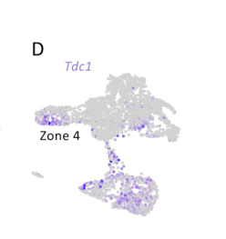

## Question

# Gene Research for Functional Annotation

## ⚠️ CRITICAL: Gene/Protein Identification Context

**BEFORE YOU BEGIN RESEARCH:** You MUST verify you are researching the CORRECT gene/protein. Gene symbols can be ambiguous, especially for less well-characterized genes from non-model organisms.

### Target Gene/Protein Identity (from UniProt):
- **UniProt Accession:** A1Z6N2
- **Protein Description:** SubName: Full=Tyrosine decarboxylase 1 {ECO:0000313|EMBL:AAM70810.2}; EC=4.1.-.- {ECO:0000313|EMBL:AAM70810.2}; EC=4.1.1.- {ECO:0000313|EMBL:AAM70810.2}; EC=4.1.1.25 {ECO:0000313|EMBL:AAM70810.2};
- **Gene Information:** Name=Tdc1 {ECO:0000313|EMBL:AAM70810.2, ECO:0000313|FlyBase:FBgn0259977}; Synonyms=CG3686 {ECO:0000313|EMBL:AAM70810.2}, Dmel\CG30445 {ECO:0000313|EMBL:AAM70810.2}, dTdc1 {ECO:0000313|EMBL:AAM70810.2}, TDC {ECO:0000313|EMBL:AAM70810.2}, Tdc {ECO:0000313|EMBL:AAM70810.2}, tdc {ECO:0000313|EMBL:AAM70810.2}, tdc1 {ECO:0000313|EMBL:AAM70810.2}; ORFNames=CG30445 {ECO:0000313|EMBL:AAM70810.2, ECO:0000313|FlyBase:FBgn0259977}, Dmel_CG30445 {ECO:0000313|EMBL:AAM70810.2};
- **Organism (full):** Drosophila melanogaster (Fruit fly).
- **Protein Family:** Belongs to the group II decarboxylase family.
- **Key Domains:** Aromatic_deC. (IPR010977); PyrdxlP-dep_de-COase. (IPR002129); PyrdxlP-dep_Trfase. (IPR015424); PyrdxlP-dep_Trfase_major. (IPR015421); PyrdxlP-dep_Trfase_small. (IPR015422)

### MANDATORY VERIFICATION STEPS:

1. **Check if the gene symbol "Tdc1" matches the protein description above**
2. **Verify the organism is correct:** Drosophila melanogaster (Fruit fly).
3. **Check if protein family/domains align with what you find in literature**
4. **If you find literature for a DIFFERENT gene with the same or similar symbol, STOP**

### If Gene Symbol is Ambiguous or You Cannot Find Relevant Literature:

**DO NOT PROCEED WITH RESEARCH ON A DIFFERENT GENE.** Instead:
- State clearly: "The gene symbol 'Tdc1' is ambiguous or literature is limited for this specific protein"
- Explain what you found (e.g., "Found extensive literature on a different gene with the same symbol in a different organism")
- Describe the protein based ONLY on the UniProt information provided above
- Suggest that the protein function can be inferred from domain/family information

### Research Target:

Please provide a comprehensive research report on the gene **Tdc1** (gene ID: Tdc1, UniProt: A1Z6N2) in DROME.

The research report should be a detailed narrative explaining the function, biological processes, and localization of the gene product. Citations should be given for all claims.

You should prioritize authoritative reviews and primary scientific literature when conducting research. You can supplement
this with annotations you find in gene/protein databases, but these can be outdated or inaccurate.

We are specifically interested in the primary function of the gene - for enzymes, what reaction is catalyzed, and what is the substrate specificity? For transporters, what is the substrate? For structural proteins or adapters, what is the broader structural role? For signaling molecules, what is the role in the pathway.

We are interested in where in or outside the cell the gene product carries out its function.

We are also interested in the signaling or biochemical pathways in which the gene functions. We are less interested in broad pleiotropic effects, except where these elucidate the precise role.

Include evidence where possible. We are interested in both experimental evidence as well as inference from structure, evolution, or bioinformatic analysis. Precise studies should be prioritized over high-throughput, where available.

## Output

Question: You are an expert researcher providing comprehensive, well-cited information.

Provide detailed information focusing on:
1. Key concepts and definitions with current understanding
2. Recent developments and latest research (prioritize 2023-2024 sources)
3. Current applications and real-world implementations
4. Expert opinions and analysis from authoritative sources
5. Relevant statistics and data from recent studies

Format as a comprehensive research report with proper citations. Include URLs and publication dates where available.
Always prioritize recent, authoritative sources and provide specific citations for all major claims.

# Gene Research for Functional Annotation

## ⚠️ CRITICAL: Gene/Protein Identification Context

**BEFORE YOU BEGIN RESEARCH:** You MUST verify you are researching the CORRECT gene/protein. Gene symbols can be ambiguous, especially for less well-characterized genes from non-model organisms.

### Target Gene/Protein Identity (from UniProt):
- **UniProt Accession:** A1Z6N2
- **Protein Description:** SubName: Full=Tyrosine decarboxylase 1 {ECO:0000313|EMBL:AAM70810.2}; EC=4.1.-.- {ECO:0000313|EMBL:AAM70810.2}; EC=4.1.1.- {ECO:0000313|EMBL:AAM70810.2}; EC=4.1.1.25 {ECO:0000313|EMBL:AAM70810.2};
- **Gene Information:** Name=Tdc1 {ECO:0000313|EMBL:AAM70810.2, ECO:0000313|FlyBase:FBgn0259977}; Synonyms=CG3686 {ECO:0000313|EMBL:AAM70810.2}, Dmel\CG30445 {ECO:0000313|EMBL:AAM70810.2}, dTdc1 {ECO:0000313|EMBL:AAM70810.2}, TDC {ECO:0000313|EMBL:AAM70810.2}, Tdc {ECO:0000313|EMBL:AAM70810.2}, tdc {ECO:0000313|EMBL:AAM70810.2}, tdc1 {ECO:0000313|EMBL:AAM70810.2}; ORFNames=CG30445 {ECO:0000313|EMBL:AAM70810.2, ECO:0000313|FlyBase:FBgn0259977}, Dmel_CG30445 {ECO:0000313|EMBL:AAM70810.2};
- **Organism (full):** Drosophila melanogaster (Fruit fly).
- **Protein Family:** Belongs to the group II decarboxylase family.
- **Key Domains:** Aromatic_deC. (IPR010977); PyrdxlP-dep_de-COase. (IPR002129); PyrdxlP-dep_Trfase. (IPR015424); PyrdxlP-dep_Trfase_major. (IPR015421); PyrdxlP-dep_Trfase_small. (IPR015422)

### MANDATORY VERIFICATION STEPS:

1. **Check if the gene symbol "Tdc1" matches the protein description above**
2. **Verify the organism is correct:** Drosophila melanogaster (Fruit fly).
3. **Check if protein family/domains align with what you find in literature**
4. **If you find literature for a DIFFERENT gene with the same or similar symbol, STOP**

### If Gene Symbol is Ambiguous or You Cannot Find Relevant Literature:

**DO NOT PROCEED WITH RESEARCH ON A DIFFERENT GENE.** Instead:
- State clearly: "The gene symbol 'Tdc1' is ambiguous or literature is limited for this specific protein"
- Explain what you found (e.g., "Found extensive literature on a different gene with the same symbol in a different organism")
- Describe the protein based ONLY on the UniProt information provided above
- Suggest that the protein function can be inferred from domain/family information

### Research Target:

Please provide a comprehensive research report on the gene **Tdc1** (gene ID: Tdc1, UniProt: A1Z6N2) in DROME.

The research report should be a detailed narrative explaining the function, biological processes, and localization of the gene product. Citations should be given for all claims.

You should prioritize authoritative reviews and primary scientific literature when conducting research. You can supplement
this with annotations you find in gene/protein databases, but these can be outdated or inaccurate.

We are specifically interested in the primary function of the gene - for enzymes, what reaction is catalyzed, and what is the substrate specificity? For transporters, what is the substrate? For structural proteins or adapters, what is the broader structural role? For signaling molecules, what is the role in the pathway.

We are interested in where in or outside the cell the gene product carries out its function.

We are also interested in the signaling or biochemical pathways in which the gene functions. We are less interested in broad pleiotropic effects, except where these elucidate the precise role.

Include evidence where possible. We are interested in both experimental evidence as well as inference from structure, evolution, or bioinformatic analysis. Precise studies should be prioritized over high-throughput, where available.

# Functional annotation of *Drosophila melanogaster* Tdc1

## Identity and conclusion

**Tdc1 is the fly’s predominantly non-neuronal tyrosine decarboxylase, not its neuronal paralogue Tdc2.** The research target specified here is *D. melanogaster* Tdc1/CG30445, UniProt **A1Z6N2** ([UniProt entry](https://www.uniprot.org/uniprotkb/A1Z6N2/entry); accession and synonym mapping supplied in the question). Fly studies independently identify Tdc1 as a tyrosine-decarboxylase gene expressed outside the nervous system, while Tdc2 principally supplies neuronal tyramine. This distinction is essential: *Caenorhabditis elegans* **tdc-1**, bacterial **Tdc**, and fly **Tdc2** are different research targets. The supplied group-II aromatic-amino-acid-decarboxylase and pyridoxal-phosphate-dependent domain annotations are consistent with the enzyme assignment, but the retrieved papers did not independently establish those domains for the A1Z6N2 sequence. (hardie2007traceaminesdifferentially pages 1-2, hoyer2008octopamineinmale pages 4-6, zhang2017identificationofmultiple pages 1-2)

**Best-supported primary function:** TDC1 contributes to the reaction **L-tyrosine → tyramine + CO₂**, furnishing a locally produced signaling amine. Tyramine can signal in its own right or serve as the substrate for tyramine β-hydroxylase (Tbh) in the subsequent **tyramine → octopamine** step. These are distinct reactions: TDC1 is not itself the β-hydroxylase. The 2023 review by Rosikon, Bone and Lawal describes this pathway, although its shorthand “Tdc” does not resolve the two fly paralogues; cell-specific primary studies are more informative for annotating Tdc1. ([Rosikon et al., February 2023](https://doi.org/10.3389/fphys.2023.970405)). (ohhara2015autocrineregulationof pages 3-4, rosikon2023regulationandmodulation pages 9-11)

## Enzymatic evidence and substrate specificity

The functional assignment rests on complementary pathway and genetic evidence rather than a retrieved purified-A1Z6N2 kinetic study. Tdc1 expression in Tdc2-positive neurons of **Tdc2-mutant flies** restored aspects of locomotor and cocaine responses; a separate study found partial rescue of male aggression and female fecundity. These experiments show that TDC1 can provide biologically effective tyramine-pathway output when placed in cells normally dependent on TDC2, but they do not measure its native catalytic rate. ([Hardie et al., September 2007](https://doi.org/10.1002/dneu.20459); [Hoyer et al., February 2008](https://doi.org/10.1016/j.cub.2007.12.052)). (hardie2007traceaminesdifferentially pages 1-2, hoyer2008octopamineinmale pages 4-6)

**Tyrosine is the established physiological substrate.** The supplied PLP-dependent decarboxylase domains support pyridoxal 5′-phosphate as the expected cofactor; direct PLP-binding measurements, purified TDC1 enzyme kinetics, or a comparison of its activity on tyrosine versus other aromatic amino acids were not found in the accessible primary evidence. Accordingly, neither exclusive tyrosine specificity nor a TDC1-specific *K*ₘ, *k*cat, or PLP affinity can be claimed. Domain homology supports the enzyme class, not unmeasured substrate preferences. (zhang2017identificationofmultiple pages 1-2, hardie2007traceaminesdifferentially pages 1-2)

## Where TDC1 acts and how its product signals

The clearest tissue-level assignment is the **Malpighian tubule**, the fly’s renal secretory epithelium. Tdc1 is assigned to **principal cells**; neighboring **stellate cells** carry the functionally demonstrated tyramine receptors TAR2 and TAR3. This establishes a plausible local, principal-cell-to-stellate-cell **paracrine** route, rather than making TDC1 itself a receptor or assigning the enzyme to stellate cells. TDC1’s precise intracellular compartment and the route by which principal-cell tyramine is released were not established by the retrieved experiments. ([Zhang and Blumenthal, March 2017](https://doi.org/10.1038/s41598-017-00120-z)). (zhang2017identificationofmultiple pages 6-7, zhang2017identificationofmultiple pages 1-2)

In the recipient stellate cell, tyramine raises intracellular Ca²⁺ through a pathway involving phospholipase C and the IP₃ receptor; increased epithelial chloride-shunt conductance promotes fluid secretion. TAR2 supplies most of the measured tyramine responsiveness, TAR3 contributes a residual response, and combined receptor loss eliminates it. An experimentally determined **stellate-cell Ca²⁺-response EC₅₀ of 1.77 × 10⁻⁸ M** closely matched the **chloride-conductance-response EC₅₀ of 1.6 × 10⁻⁸ M** (*p* = 0.83 for their difference). **These numbers describe downstream tissue responses, not TDC1 substrate affinity.** Exogenous-tyramine and receptor experiments establish the signaling mechanism more directly than they establish what fraction of endogenous signaling derives specifically from TDC1. ([Cabrero et al., April 2013](https://doi.org/10.1098/rspb.2012.2943); [Zhang and Blumenthal, March 2017](https://doi.org/10.1038/s41598-017-00120-z)). (cabrero2013abiogenicamine pages 1-2, cabrero2013abiogenicamine pages 3-4, zhang2017identificationofmultiple pages 6-7)

Tdc1 transcript was also detected in the **larval prothoracic gland**, an endocrine tissue. This does **not** make TDC1 its major tyramine source: gland-specific **Tdc1 RNAi** caused only a subtle larval-to-prepupal delay and no detectable change in tyramine or octopamine staining. In contrast, **Tdc2 RNAi** diminished both amine signals, reduced ecdysone and produced severe delay or larval arrest. The proposed local amine–Octβ3R–ecdysone pathway therefore principally implicates **Tdc2** under the tested conditions; a smaller Tdc1 contribution is not excluded. ([Ohhara et al., February 3, 2015](https://doi.org/10.1073/pnas.1414966112)). (ohhara2015autocrineregulationof pages 3-4)

## Recent evidence and applications: what is—and is not—about Tdc1

A **March 2024 preprint** analyzing single-cell RNA sequencing of the larval trachea reported **Tdc1 transcript in a subset of cluster 7**, assigned to **zone-4 spiracular-branch tracheoblasts**. Its Figure 4D shows the expression pattern. This extends the candidate **expression** map beyond the established renal setting but does not demonstrate protein localization, tyrosine decarboxylation, tyramine release or a physiological function in tracheal progenitors. ([Roeder et al., March 2024 preprint](https://doi.org/10.21203/rs.3.rs-3978430/v1)). (roeder2024thesecretoryinka pages 8-10, roeder2024thesecretoryinka media 90900022)

Two other 2024 developments show why enzyme identity matters in applications. A fly metabolic study associated diet-related intestinal tyramine with **Tdc-expressing gut bacteria** and studied bacterial tyramine production and enterocyte signaling; it does **not** establish host *Drosophila* Tdc1 as the source. A pest-control study built a conditional-rescue gene-drive approach around **Tdc2** in *D. suzukii*, with related tests in *D. melanogaster*; it did not target this report’s *D. melanogaster* Tdc1 product. Thus, tyramine-pathway experiments and prospective applications cannot automatically be attributed to A1Z6N2. ([Ma et al., *EMBO Journal*, July 2024](https://doi.org/10.1038/s44318-024-00162-w); [Ma et al., *PLOS Genetics*, April 5, 2024](https://doi.org/10.1371/journal.pgen.1011226)). (ma2024gutmicrobiotametabolite pages 13-15, ma2024asmallmoleculeapproach pages 1-2)

The evidence below separates direct Tdc1 observations from downstream tyramine physiology and studies of different enzymes.

| Evidence/study | What was actually observed | Interpretation for fly Tdc1 and limitation |
|---|---|---|
| Hardie et al. (2007), [DOI](https://doi.org/10.1002/dneu.20459); Hoyer et al. (2008), [DOI](https://doi.org/10.1016/j.cub.2007.12.052) | Expressing non-neuronal **Tdc1** in Tdc2-positive neurons partly rescued phenotypes caused by loss of neural Tdc2, including locomotor/cocaine-related responses and male aggression. In the aggression assay, rescued mutants lunged at about 3% of heterozygous-control frequency; Tdc2 mutants were about 5% of control (hardie2007traceaminesdifferentially pages 1-2, hoyer2008octopamineinmale pages 4-6). | Demonstrates that TDC1 can produce biologically effective tyramine-pathway output when ectopically expressed in neurons. It is not a purified-enzyme assay, does not establish native Tdc1 localization, and does not define kinetic constants or substrate breadth. |
| Cabrero et al. (2013), [DOI](https://doi.org/10.1098/rspb.2012.2943); Zhang & Blumenthal (2017), [DOI](https://doi.org/10.1038/s41598-017-00120-z) | Tdc1 was assigned to Malpighian-tubule principal cells, whereas tyramine-responsive TAR2/TAR3 receptors function in neighboring stellate cells. Tyramine raised stellate-cell Ca²⁺ through PLC/IP₃ signaling and activated chloride shunt conductance and fluid secretion. The Ca²⁺-response EC₅₀ was **1.77 × 10⁻⁸ M**, closely matching the chloride-conductance EC₅₀ of **1.6 × 10⁻⁸ M**; combined TAR2/TAR3 loss eliminated the response (zhang2017identificationofmultiple pages 6-7, zhang2017identificationofmultiple pages 1-2, cabrero2013abiogenicamine pages 3-4). | Supports local, non-neuronal tyramine synthesis and paracrine principal-cell-to-stellate-cell signaling. These EC₅₀ values characterize the downstream receptor/tissue response—not TDC1 catalytic affinity or enzyme Kₘ—and endogenous tyramine was not directly traced molecule-by-molecule from TDC1 to receptors. |
| Ohhara et al. (2015), [DOI](https://doi.org/10.1073/pnas.1414966112) | Tdc1, Tdc2 and Tbh transcripts were detected in the larval prothoracic gland. Gland-specific Tdc1 RNAi caused only a subtle developmental delay and no detectable change in tyramine or octopamine staining, whereas Tdc2 RNAi impaired both amines, reduced ecdysone and caused severe delay or larval arrest (ohhara2015autocrineregulationof pages 3-4). | Tdc1 is expressed in the prothoracic gland but is not the predominant tyrosine decarboxylase there under the tested conditions; Tdc2 dominates local amine production. RNAi efficiency and compensatory activity limit conclusions about whether TDC1 makes a small contribution. |
| Roeder et al. (2024 preprint), [DOI](https://doi.org/10.21203/rs.3.rs-3978430/v1) | Larval-trachea single-cell RNA-seq placed **Tdc1 transcript** in a subset of cluster 7, assigned to undifferentiated zone-4 spiracular-branch tracheoblasts; Figure 4D shows the corresponding UMAP expression pattern (roeder2024thesecretoryinka pages 8-10, roeder2024thesecretoryinka media 90900022). | Extends the candidate expression map to a tracheal progenitor population. Evidence is transcriptomic and preprint-level; it does not demonstrate TDC1 protein, enzymatic activity, tyramine production or a tracheal physiological function. |
| Ma et al. (2024), *EMBO Journal*, [DOI](https://doi.org/10.1038/s44318-024-00162-w); Ma et al. (2024), *PLOS Genetics*, [DOI](https://doi.org/10.1371/journal.pgen.1011226) | The metabolic study attributed high-fat-diet-associated tyramine to **Tdc-expressing gut bacteria**, testing bacterial Tdc and bacterial-culture tyramine rather than host fly Tdc1. The pest-control study targeted **Tdc2** in *Drosophila suzukii* and tested related systems in *D. melanogaster*; octopamine feeding rescued female egg-laying defects (ma2024gutmicrobiotametabolite pages 13-15, ma2024asmallmoleculeapproach pages 1-2). | These are important 2024 tyramine-pathway developments but do **not** provide direct functional evidence for *D. melanogaster* Tdc1. The first concerns microbial enzymes; the second concerns another paralogue and initially another species. |

*Table: This table separates direct and indirect evidence for Drosophila melanogaster Tdc1 from findings about Tdc2, microbial tyrosine decarboxylases and homologues in other species. It also distinguishes downstream tyramine-response EC₅₀ values from TDC1 enzyme kinetics.*

## Annotation assessment

The defensible annotation is **a presumptive PLP-dependent, tyrosine-to-tyramine decarboxylase functioning principally in non-neuronal cells**, with its best-characterized proposed local role supplying tyramine for **Malpighian-tubule principal-cell-to-stellate-cell signaling**. Tdc1 can substitute for neuronal Tdc2 when experimentally expressed there; this does not imply that native Tdc1 is predominantly neuronal. Its prothoracic-gland expression has a comparatively minor demonstrated phenotype, and its recently reported tracheal expression remains transcript-level evidence. The accessible studies do not resolve alternative-substrate kinetics, exact subcellular localization, physiological tyramine-release mechanism, or the fraction of renal tyramine directly attributable to TDC1. Two especially relevant earlier papers—Cole and colleagues’ original fly decarboxylase study and Blumenthal’s 2009 tubule isoform study—were identifiable through later literature but their full texts were not retrievable here, limiting further assessment of those questions. (zhang2017identificationofmultiple pages 8-8, ohhara2015autocrineregulationof pages 3-4, hardie2007traceaminesdifferentially pages 1-2, zhang2017identificationofmultiple pages 6-7, roeder2024thesecretoryinka pages 8-10)

References

1. (hardie2007traceaminesdifferentially pages 1-2): Shannon L. Hardie, Jing X. Zhang, and Jay Hirsh. Trace amines differentially regulate adult locomotor activity, cocaine sensitivity, and female fertility in drosophila melanogaster. Developmental Neurobiology, 67:1396-1405, Sep 2007. URL: https://doi.org/10.1002/dneu.20459, doi:10.1002/dneu.20459. This article has 96 citations and is from a peer-reviewed journal.

2. (hoyer2008octopamineinmale pages 4-6): Susanne C. Hoyer, Andreas Eckart, Anthony Herrel, Troy Zars, Susanne A. Fischer, Shannon L. Hardie, and Martin Heisenberg. Octopamine in male aggression of drosophila. Current Biology, 18:159-167, Feb 2008. URL: https://doi.org/10.1016/j.cub.2007.12.052, doi:10.1016/j.cub.2007.12.052. This article has 370 citations and is from a highest quality peer-reviewed journal.

3. (zhang2017identificationofmultiple pages 1-2): Haiying Zhang and Edward M. Blumenthal. Identification of multiple functional receptors for tyramine on an insect secretory epithelium. Scientific Reports, Mar 2017. URL: https://doi.org/10.1038/s41598-017-00120-z, doi:10.1038/s41598-017-00120-z. This article has 24 citations and is from a peer-reviewed journal.

4. (ohhara2015autocrineregulationof pages 3-4): Yuya Ohhara, Yuko Shimada-Niwa, Ryusuke Niwa, Yasunari Kayashima, Yoshiki Hayashi, Kazutaka Akagi, Hitoshi Ueda, Kimiko Yamakawa-Kobayashi, and Satoru Kobayashi. Autocrine regulation of ecdysone synthesis by β3-octopamine receptor in the prothoracic gland is essential for drosophila metamorphosis. Proceedings of the National Academy of Sciences, 112:1452-1457, Jan 2015. URL: https://doi.org/10.1073/pnas.1414966112, doi:10.1073/pnas.1414966112. This article has 75 citations and is from a highest quality peer-reviewed journal.

5. (rosikon2023regulationandmodulation pages 9-11): Katarzyna D. Rosikon, Megan C. Bone, and Hakeem O. Lawal. Regulation and modulation of biogenic amine neurotransmission in drosophila and caenorhabditis elegans. Frontiers in Physiology, Feb 2023. URL: https://doi.org/10.3389/fphys.2023.970405, doi:10.3389/fphys.2023.970405. This article has 56 citations.

6. (zhang2017identificationofmultiple pages 6-7): Haiying Zhang and Edward M. Blumenthal. Identification of multiple functional receptors for tyramine on an insect secretory epithelium. Scientific Reports, Mar 2017. URL: https://doi.org/10.1038/s41598-017-00120-z, doi:10.1038/s41598-017-00120-z. This article has 24 citations and is from a peer-reviewed journal.

7. (cabrero2013abiogenicamine pages 1-2): Pablo Cabrero, Laura Richmond, Michael Nitabach, Shireen A. Davies, and Julian A. T. Dow. A biogenic amine and a neuropeptide act identically: tyramine signals through calcium in drosophila tubule stellate cells. Proceedings of the Royal Society B: Biological Sciences, 280:20122943, Apr 2013. URL: https://doi.org/10.1098/rspb.2012.2943, doi:10.1098/rspb.2012.2943. This article has 45 citations.

8. (cabrero2013abiogenicamine pages 3-4): Pablo Cabrero, Laura Richmond, Michael Nitabach, Shireen A. Davies, and Julian A. T. Dow. A biogenic amine and a neuropeptide act identically: tyramine signals through calcium in drosophila tubule stellate cells. Proceedings of the Royal Society B: Biological Sciences, 280:20122943, Apr 2013. URL: https://doi.org/10.1098/rspb.2012.2943, doi:10.1098/rspb.2012.2943. This article has 45 citations.

9. (roeder2024thesecretoryinka pages 8-10): Thomas Roeder, Judith Bossen, Xiao Niu, Xin-Yu She, Mirjam Knop, Benedikt Hofbauer, Lasse Tiedemann, Sören Franzenburg, Iris Bruchhaus, Susanne Kraus-Etchmann, and Christian Wegener. The secretory inka cell of the drosophila larval trachea has a molecular profile similar to that of neurons. Mar 2024. URL: https://doi.org/10.21203/rs.3.rs-3978430/v1, doi:10.21203/rs.3.rs-3978430/v1.

10. (roeder2024thesecretoryinka media 90900022): Thomas Roeder, Judith Bossen, Xiao Niu, Xin-Yu She, Mirjam Knop, Benedikt Hofbauer, Lasse Tiedemann, Sören Franzenburg, Iris Bruchhaus, Susanne Kraus-Etchmann, and Christian Wegener. The secretory inka cell of the drosophila larval trachea has a molecular profile similar to that of neurons. Mar 2024. URL: https://doi.org/10.21203/rs.3.rs-3978430/v1, doi:10.21203/rs.3.rs-3978430/v1.

11. (ma2024gutmicrobiotametabolite pages 13-15): Peng Ma, Yao Zhang, Youjie Yin, Saifei Wang, Shuxin Chen, Xueping Liang, Zhifang Li, and Hansong Deng. Gut microbiota metabolite tyramine ameliorates high-fat diet-induced insulin resistance via increased ca2+ signaling. The EMBO Journal, 43:3466-3493, Jul 2024. URL: https://doi.org/10.1038/s44318-024-00162-w, doi:10.1038/s44318-024-00162-w. This article has 30 citations.

12. (ma2024asmallmoleculeapproach pages 1-2): Suhan Ma, Xuyang Ni, Shimin Chen, Xiaomu Qiao, Xuejiao Xu, Weizhe Chen, Jackson Champer, and Jia Huang. A small-molecule approach to restore female sterility phenotype targeted by a homing suppression gene drive in the fruit pest drosophila suzukii. PLOS Genetics, 20:e1011226, Apr 2024. URL: https://doi.org/10.1371/journal.pgen.1011226, doi:10.1371/journal.pgen.1011226. This article has 10 citations and is from a domain leading peer-reviewed journal.

13. (zhang2017identificationofmultiple pages 8-8): Haiying Zhang and Edward M. Blumenthal. Identification of multiple functional receptors for tyramine on an insect secretory epithelium. Scientific Reports, Mar 2017. URL: https://doi.org/10.1038/s41598-017-00120-z, doi:10.1038/s41598-017-00120-z. This article has 24 citations and is from a peer-reviewed journal.

## Artifacts

- [Edison artifact artifact-00](Tdc1-deep-research-falcon_artifacts/artifact-00.md)

## Citations

1. ohhara2015autocrineregulationof pages 3-4
2. hardie2007traceaminesdifferentially pages 1-2
3. hoyer2008octopamineinmale pages 4-6
4. zhang2017identificationofmultiple pages 1-2
5. rosikon2023regulationandmodulation pages 9-11
6. zhang2017identificationofmultiple pages 6-7
7. cabrero2013abiogenicamine pages 1-2
8. cabrero2013abiogenicamine pages 3-4
9. roeder2024thesecretoryinka pages 8-10
10. ma2024gutmicrobiotametabolite pages 13-15
11. ma2024asmallmoleculeapproach pages 1-2
12. zhang2017identificationofmultiple pages 8-8
13. UniProt entry
14. Rosikon et al., February 2023
15. Hardie et al., September 2007
16. Hoyer et al., February 2008
17. Zhang and Blumenthal, March 2017
18. Cabrero et al., April 2013
19. Ohhara et al., February 3, 2015
20. Roeder et al., March 2024 preprint
21. Ma et al., *EMBO Journal*, July 2024
22. Ma et al., *PLOS Genetics*, April 5, 2024
23. DOI
24. https://www.uniprot.org/uniprotkb/A1Z6N2/entry
25. https://doi.org/10.3389/fphys.2023.970405
26. https://doi.org/10.1002/dneu.20459
27. https://doi.org/10.1016/j.cub.2007.12.052
28. https://doi.org/10.1038/s41598-017-00120-z
29. https://doi.org/10.1098/rspb.2012.2943
30. https://doi.org/10.1073/pnas.1414966112
31. https://doi.org/10.21203/rs.3.rs-3978430/v1
32. https://doi.org/10.1038/s44318-024-00162-w
33. https://doi.org/10.1371/journal.pgen.1011226
34. https://doi.org/10.1002/dneu.20459,
35. https://doi.org/10.1016/j.cub.2007.12.052,
36. https://doi.org/10.1038/s41598-017-00120-z,
37. https://doi.org/10.1073/pnas.1414966112,
38. https://doi.org/10.3389/fphys.2023.970405,
39. https://doi.org/10.1098/rspb.2012.2943,
40. https://doi.org/10.21203/rs.3.rs-3978430/v1,
41. https://doi.org/10.1038/s44318-024-00162-w,
42. https://doi.org/10.1371/journal.pgen.1011226,