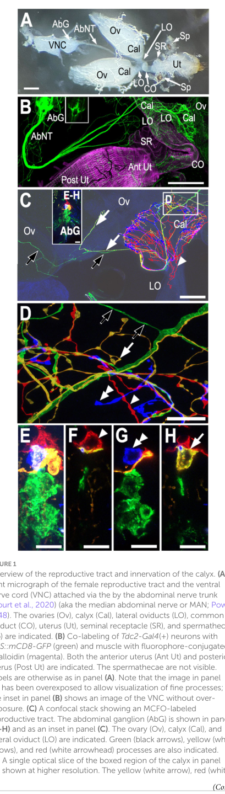

## Question

# Gene Research for Functional Annotation

## ⚠️ CRITICAL: Gene/Protein Identification Context

**BEFORE YOU BEGIN RESEARCH:** You MUST verify you are researching the CORRECT gene/protein. Gene symbols can be ambiguous, especially for less well-characterized genes from non-model organisms.

### Target Gene/Protein Identity (from UniProt):
- **UniProt Accession:** A1Z6N4
- **Protein Description:** SubName: Full=Tyrosine decarboxylase 2 {ECO:0000313|EMBL:AAM70812.1}; EC=4.1.-.- {ECO:0000313|EMBL:AAM70812.1}; EC=4.1.1.- {ECO:0000313|EMBL:AAM70812.1}; EC=4.1.1.25 {ECO:0000313|EMBL:AAM70812.1};
- **Gene Information:** Name=Tdc2 {ECO:0000313|EMBL:AAM70812.1, ECO:0000313|FlyBase:FBgn0050446}; Synonyms=CG3686 {ECO:0000313|EMBL:AAM70812.1}, Dmel\CG30446 {ECO:0000313|EMBL:AAM70812.1}, dTdc2 {ECO:0000313|EMBL:AAM70812.1}, TDC {ECO:0000313|EMBL:AAM70812.1}, Tdc {ECO:0000313|EMBL:AAM70812.1}, tdc {ECO:0000313|EMBL:AAM70812.1}, TDC2 {ECO:0000313|EMBL:AAM70812.1}, TdC2 {ECO:0000313|EMBL:AAM70812.1}, tdc2 {ECO:0000313|EMBL:AAM70812.1}; ORFNames=CG30446 {ECO:0000313|EMBL:AAM70812.1, ECO:0000313|FlyBase:FBgn0050446}, Dmel_CG30446 {ECO:0000313|EMBL:AAM70812.1};
- **Organism (full):** Drosophila melanogaster (Fruit fly).
- **Protein Family:** Belongs to the group II decarboxylase family.
- **Key Domains:** Aromatic_deC. (IPR010977); PyrdxlP-dep_de-COase. (IPR002129); PyrdxlP-dep_Trfase. (IPR015424); PyrdxlP-dep_Trfase_major. (IPR015421); PyrdxlP-dep_Trfase_small. (IPR015422)

### MANDATORY VERIFICATION STEPS:

1. **Check if the gene symbol "Tdc2" matches the protein description above**
2. **Verify the organism is correct:** Drosophila melanogaster (Fruit fly).
3. **Check if protein family/domains align with what you find in literature**
4. **If you find literature for a DIFFERENT gene with the same or similar symbol, STOP**

### If Gene Symbol is Ambiguous or You Cannot Find Relevant Literature:

**DO NOT PROCEED WITH RESEARCH ON A DIFFERENT GENE.** Instead:
- State clearly: "The gene symbol 'Tdc2' is ambiguous or literature is limited for this specific protein"
- Explain what you found (e.g., "Found extensive literature on a different gene with the same symbol in a different organism")
- Describe the protein based ONLY on the UniProt information provided above
- Suggest that the protein function can be inferred from domain/family information

### Research Target:

Please provide a comprehensive research report on the gene **Tdc2** (gene ID: Tdc2, UniProt: A1Z6N4) in DROME.

The research report should be a detailed narrative explaining the function, biological processes, and localization of the gene product. Citations should be given for all claims.

You should prioritize authoritative reviews and primary scientific literature when conducting research. You can supplement
this with annotations you find in gene/protein databases, but these can be outdated or inaccurate.

We are specifically interested in the primary function of the gene - for enzymes, what reaction is catalyzed, and what is the substrate specificity? For transporters, what is the substrate? For structural proteins or adapters, what is the broader structural role? For signaling molecules, what is the role in the pathway.

We are interested in where in or outside the cell the gene product carries out its function.

We are also interested in the signaling or biochemical pathways in which the gene functions. We are less interested in broad pleiotropic effects, except where these elucidate the precise role.

Include evidence where possible. We are interested in both experimental evidence as well as inference from structure, evolution, or bioinformatic analysis. Precise studies should be prioritized over high-throughput, where available.

## Output

Question: You are an expert researcher providing comprehensive, well-cited information.

Provide detailed information focusing on:
1. Key concepts and definitions with current understanding
2. Recent developments and latest research (prioritize 2023-2024 sources)
3. Current applications and real-world implementations
4. Expert opinions and analysis from authoritative sources
5. Relevant statistics and data from recent studies

Format as a comprehensive research report with proper citations. Include URLs and publication dates where available.
Always prioritize recent, authoritative sources and provide specific citations for all major claims.

# Gene Research for Functional Annotation

## ⚠️ CRITICAL: Gene/Protein Identification Context

**BEFORE YOU BEGIN RESEARCH:** You MUST verify you are researching the CORRECT gene/protein. Gene symbols can be ambiguous, especially for less well-characterized genes from non-model organisms.

### Target Gene/Protein Identity (from UniProt):
- **UniProt Accession:** A1Z6N4
- **Protein Description:** SubName: Full=Tyrosine decarboxylase 2 {ECO:0000313|EMBL:AAM70812.1}; EC=4.1.-.- {ECO:0000313|EMBL:AAM70812.1}; EC=4.1.1.- {ECO:0000313|EMBL:AAM70812.1}; EC=4.1.1.25 {ECO:0000313|EMBL:AAM70812.1};
- **Gene Information:** Name=Tdc2 {ECO:0000313|EMBL:AAM70812.1, ECO:0000313|FlyBase:FBgn0050446}; Synonyms=CG3686 {ECO:0000313|EMBL:AAM70812.1}, Dmel\CG30446 {ECO:0000313|EMBL:AAM70812.1}, dTdc2 {ECO:0000313|EMBL:AAM70812.1}, TDC {ECO:0000313|EMBL:AAM70812.1}, Tdc {ECO:0000313|EMBL:AAM70812.1}, tdc {ECO:0000313|EMBL:AAM70812.1}, TDC2 {ECO:0000313|EMBL:AAM70812.1}, TdC2 {ECO:0000313|EMBL:AAM70812.1}, tdc2 {ECO:0000313|EMBL:AAM70812.1}; ORFNames=CG30446 {ECO:0000313|EMBL:AAM70812.1, ECO:0000313|FlyBase:FBgn0050446}, Dmel_CG30446 {ECO:0000313|EMBL:AAM70812.1};
- **Organism (full):** Drosophila melanogaster (Fruit fly).
- **Protein Family:** Belongs to the group II decarboxylase family.
- **Key Domains:** Aromatic_deC. (IPR010977); PyrdxlP-dep_de-COase. (IPR002129); PyrdxlP-dep_Trfase. (IPR015424); PyrdxlP-dep_Trfase_major. (IPR015421); PyrdxlP-dep_Trfase_small. (IPR015422)

### MANDATORY VERIFICATION STEPS:

1. **Check if the gene symbol "Tdc2" matches the protein description above**
2. **Verify the organism is correct:** Drosophila melanogaster (Fruit fly).
3. **Check if protein family/domains align with what you find in literature**
4. **If you find literature for a DIFFERENT gene with the same or similar symbol, STOP**

### If Gene Symbol is Ambiguous or You Cannot Find Relevant Literature:

**DO NOT PROCEED WITH RESEARCH ON A DIFFERENT GENE.** Instead:
- State clearly: "The gene symbol 'Tdc2' is ambiguous or literature is limited for this specific protein"
- Explain what you found (e.g., "Found extensive literature on a different gene with the same symbol in a different organism")
- Describe the protein based ONLY on the UniProt information provided above
- Suggest that the protein function can be inferred from domain/family information

### Research Target:

Please provide a comprehensive research report on the gene **Tdc2** (gene ID: Tdc2, UniProt: A1Z6N4) in DROME.

The research report should be a detailed narrative explaining the function, biological processes, and localization of the gene product. Citations should be given for all claims.

You should prioritize authoritative reviews and primary scientific literature when conducting research. You can supplement
this with annotations you find in gene/protein databases, but these can be outdated or inaccurate.

We are specifically interested in the primary function of the gene - for enzymes, what reaction is catalyzed, and what is the substrate specificity? For transporters, what is the substrate? For structural proteins or adapters, what is the broader structural role? For signaling molecules, what is the role in the pathway.

We are interested in where in or outside the cell the gene product carries out its function.

We are also interested in the signaling or biochemical pathways in which the gene functions. We are less interested in broad pleiotropic effects, except where these elucidate the precise role.

Include evidence where possible. We are interested in both experimental evidence as well as inference from structure, evolution, or bioinformatic analysis. Precise studies should be prioritized over high-throughput, where available.

# Functional annotation report: *Drosophila melanogaster* Tdc2

## Identity and principal function

**Identity check.** The supplied UniProt record identifies **A1Z6N4** as *Drosophila melanogaster* tyrosine decarboxylase 2, **Tdc2/CG30446**. Independent fly studies distinguish this gene from **Tdc1**: Tdc2 is predominantly associated with neural tyramine synthesis, whereas Tdc1 is predominantly expressed in peripheral or non-neural tissues. A comparative study also identifies CG30446 as an insect tyrosine-decarboxylase homolog. The exact A1Z6N4-to-CG30446 accession mapping comes from the record supplied in the question; the cited experiments establish the fly gene’s identity and function rather than independently documenting that accession. This report does **not** concern the similarly named *C. elegans* **tdc-1**. (hardie2007traceaminesdifferentially pages 1-2, alkema2005tyraminefunctionsindependently pages 3-4)

**Primary biochemical annotation:** Tdc2 catalyzes the decarboxylation **L-tyrosine → tyramine + CO₂**. Tyramine is both a signaling amine and the precursor for octopamine; the *next* reaction, **tyramine → octopamine**, is catalyzed by **tyramine β-hydroxylase (TβH/Tbh)**, not by Tdc2. The supplied group-II decarboxylase and pyridoxal-phosphate-dependent domain annotations, together with conserved decarboxylase-family evidence, support pyridoxal 5′-phosphate as Tdc2’s cofactor. Direct cofactor-binding measurements or purified-enzyme kinetic constants for accession A1Z6N4 were not established from the available studies. (hardie2007traceaminesdifferentially pages 1-2, rosikon2023regulationandmodulation pages 11-12, alkema2005tyraminefunctionsindependently pages 3-4)

**Substrate specificity should be stated narrowly.** L-tyrosine is the experimentally supported *physiological* substrate. The retrieved work did not establish Tdc2-specific comparative turnover or affinity for L-DOPA, tryptophan, or other aromatic amino acids; consequently, it does not justify a claim of absolute exclusivity or numerical substrate-preference ratios. The tyrosine-to-dopamine route is distinct: tyrosine hydroxylase produces L-DOPA, which is converted to dopamine by Dopa decarboxylase. (hardie2007traceaminesdifferentially pages 1-2, parkhitko2020downregulationofthe pages 8-10, alkema2005tyraminefunctionsindependently pages 3-4)

## Evidence for pathway position

The most discriminating fly experiment compares biosynthetic mutants. **Tdc2RO54** animals have *no detectable neural tyramine or octopamine*, whereas **TbHnM18** animals have *no measurable neural octopamine but excess neural tyramine*. Expressing **Tdc1 in Tdc2-targeted cells** rescues Tdc2-mutant locomotor and cocaine-response defects, supporting overlapping in-vivo tyrosine-decarboxylase capacity despite the genes’ different usual expression patterns. Silencing Tdc2-targeted cells also reproduces those behavioral defects. These genetic results strongly establish Tdc2’s position *upstream of both amines*, though loss of both products in a Tdc2 mutant cannot, on its own, identify which amine mediates any particular phenotype. (hardie2007traceaminesdifferentially pages 1-2)

The mutant comparison illustrates why tyramine should not be treated only as an inert intermediate. Tdc2 mutants show markedly reduced basal locomotion and hypersensitivity to an initial cocaine exposure, while octopamine-deficient, tyramine-elevated **TbH** mutants retain normal responses in those assays. Both genotypes affect female fertility, but their reproductive abnormalities differ: reported Tdc2-mutant females retain eggs, whereas TbH-mutant females fail to ovulate. These are pathway-dissection results, **not** evidence that the enzyme directly regulates cocaine responses or contracts muscle. (hardie2007traceaminesdifferentially pages 1-2)

A 2023 review places this reaction within the established insect tyramine–octopamine pathway and summarizes downstream tyramine receptors, including TAR-family receptors that can alter cAMP or intracellular calcium. Octopamine acts through its own receptor families. Thus Tdc2 controls *availability of a receptor-active amine and its precursor*, rather than acting as a receptor or a secreted signaling protein itself. (rosikon2023regulationandmodulation pages 11-12, mckinney2020characterizationofdrosophila pages 1-3)

## Where Tdc2 acts

**Cellular and tissue distribution.** Tdc2 is prominent in fly aminergic neurons of the central nervous system; some of these project to peripheral effectors. Larval ventral-ganglion mapping identifies Tdc2-driver-labeled efferent neurons projecting toward body-wall muscles, alongside putative interneurons. In the neurons mapped in that study, TβH immunoreactivity supported the capacity to synthesize octopamine from Tdc2-derived tyramine. This is evidence about the **cells expressing the enzyme**, not a demonstration that the enzyme itself is secreted into muscle. (vomel2008neuroarchitectureofaminergic pages 8-11, vomel2008neuroarchitectureofaminergic pages 13-14)

Tdc2 is **not exclusively neuronal**. Immunostaining and cell-targeted perturbations identify an adult astrocyte-associated component, particularly in the antennal lobes, central complex, and subesophageal zone. Approximately **5–15% of Tdc2 immunosignal in those selected regions** colocalized with labeled astrocytes; this percentage describes image signal, **not** the fraction of all astrocytes expressing Tdc2. Astrocyte-targeted Tdc2 knockdown shortened the time for half of the flies to become ethanol-sedated (**ST50**); adult glial knockdown and overexpression changed ST50 in opposite directions. Manipulating Tbh did not produce a discernible sedation effect in that study, supporting an astrocytic **tyramine**, rather than necessarily octopamine, mechanism in this context. (lee2021tyraminesynthesisvesicular pages 6-8, lee2021tyraminesynthesisvesicular pages 1-3, lee2021tyraminesynthesisvesicular pages 8-9)

**Intracellular versus extracellular location.** Tdc2’s role is **intracellular amine biosynthesis**. Downstream, the vesicular monoamine transporter (**VMAT**) packages amines, and SNARE-dependent secretion can deliver the product outside the cell to receptors. In astrocytes, VMAT knockdown and SNARE disruption phenocopied aspects of Tdc2 knockdown and suppressed consequences of Tdc2 overexpression, supporting a model of vesicle-mediated tyramine release. These experiments do **not** resolve the exact intracellular compartment occupied by endogenous Tdc2; describing it as a cytosolic biosynthetic enzyme is a plausible family/pathway inference, not a directly demonstrated A1Z6N4 localization result. (lee2021tyraminesynthesisvesicular pages 9-11, lee2021tyraminesynthesisvesicular pages 1-3, lee2021tyraminesynthesisvesicular pages 6-8)

## Recent research and research applications

The most directly relevant **2024 primary study** resolved heterogeneity *within* a small Tdc2-marked projection system. Rohrbach and colleagues examined approximately **10** tyraminergic/octopaminergic neurons near the posterior abdominal ganglion that innervate the female reproductive tract. Single-cell labeling showed that different neurons target different tract regions; optogenetic activation of one subset induced lateral-oviduct contractions, and recordings found different excitability in two neighboring cells. **Figure 1** visualizes the ganglion-to-tract connection and individual labeled projections. These findings refine the location and circuit context in which Tdc2-derived amines can act, but the stimulation experiment does not itself identify which released amine caused the contraction. Published **2 August 2024**: https://doi.org/10.3389/fnmol.2024.1374896. (rohrbach2024heterogeneityinthe pages 1-2, rohrbach2024heterogeneityinthe pages 3-4, rohrbach2024heterogeneityinthe media 448267b2)

**Tdc2-GAL4 and Tdc2-LexA are experimental targeting tools, not the enzyme’s biochemical reaction.** Researchers use them for cell tracing, optogenetics, neuronal silencing, and intersectional mapping. An engineered Tdc2-LexA reporter was checked against endogenous Tdc2 immunostaining; receptor mapping found heterogeneous overlap between Tdc2 neurons and all five studied octopamine-receptor expression patterns. Importantly, **Tdc2-driver positivity alone does not prove octopamine release from every marked cell**: a cell may use tyramine, convert it onward depending on TβH, or express other transmitters. Conversely, the Tbh-GAL4 driver tested in the 2024 reproductive-tract study failed to label its relevant abdominal cluster, illustrating that absence of driver labeling is not definitive absence of the biological population. https://doi.org/10.1002/cne.24883; https://doi.org/10.3389/fnmol.2024.1374896. (mckinney2020characterizationofdrosophila pages 8-10, mckinney2020characterizationofdrosophila pages 1-3, rohrbach2024heterogeneityinthe pages 3-4)

The following table separates firm functional assignments from inference and unresolved details.

| Question | Supported conclusion | Strongest experiment or source | Caveat |
|---|---|---|---|
| Correct identity | The target is *Drosophila melanogaster* **Tdc2/CG30446**, corresponding to UniProt **A1Z6N4** in the supplied record. Literature distinguishes Tdc2 from the largely peripheral **Tdc1**. | Hardie, Zhang & Hirsh (2007), *Developmental Neurobiology*. [DOI 10.1002/dneu.20459](https://doi.org/10.1002/dneu.20459) (hardie2007traceaminesdifferentially pages 1-2) | The accession mapping comes from the supplied UniProt record; the paper establishes the species-specific Tdc1/Tdc2 distinction but does not explicitly cite A1Z6N4. |
| Primary reaction and cofactor | Tdc2 catalyzes **L-tyrosine → tyramine + CO₂**. Dependence on pyridoxal 5′-phosphate is strongly predicted from its group-II PLP-dependent aromatic-amino-acid decarboxylase family and conserved architecture. | The reaction is supported by Drosophila pathway genetics; conserved PLP-dependent decarboxylase regions provide family-level support (alkema2005tyraminefunctionsindependently pages 3-4, rosikon2023regulationandmodulation pages 11-12, hardie2007traceaminesdifferentially pages 1-2) | No recovered study reported purified A1Z6N4 kinetics or direct PLP-binding measurements; PLP dependence is a high-confidence family inference rather than an A1Z6N4-specific biochemical demonstration. |
| Tdc2 versus Tdc1 | **Tdc2 is predominantly neural**, whereas **Tdc1 is predominantly peripheral or non-neural**. Expressing Tdc1 in Tdc2 cells rescues Tdc2-mutant locomotor and cocaine-response defects, demonstrating overlapping in-vivo catalytic capacity despite different native expression. | Genetic rescue and expression comparison: Hardie et al. (2007), [DOI 10.1002/dneu.20459](https://doi.org/10.1002/dneu.20459) (hardie2007traceaminesdifferentially pages 1-2) | “Predominantly” is preferable to “exclusively,” because later work also detects Tdc2 in astrocytes. |
| Consequence of Tdc2 loss | **Tdc2RO54** mutants have no detectable neural tyramine or octopamine, consistent with tyramine being both a signaling amine and the obligatory precursor of neural octopamine. Mutants show markedly reduced basal locomotion, initial cocaine hypersensitivity, and female sterility associated with egg retention. | Mutant neurochemistry, behavior, neuronal silencing, and Tdc1 rescue: Hardie et al. (2007), [DOI 10.1002/dneu.20459](https://doi.org/10.1002/dneu.20459) (hardie2007traceaminesdifferentially pages 1-2) | Simultaneous loss of both amines means that a Tdc2-null phenotype alone cannot assign an effect specifically to tyramine or octopamine. |
| Downstream octopamine step | **Tyramine β-hydroxylase, TβH/Tbh—not Tdc2—converts tyramine to octopamine.** Tbh-null flies lack measurable neural octopamine but accumulate tyramine, providing the principal genetic comparison for separating the amines’ functions. | Tdc2-versus-Tbh mutant comparison: Hardie et al. (2007), [DOI 10.1002/dneu.20459](https://doi.org/10.1002/dneu.20459); Rosikon et al. (2023), [DOI 10.3389/fphys.2023.970405](https://doi.org/10.3389/fphys.2023.970405) (hardie2007traceaminesdifferentially pages 1-2, rosikon2023regulationandmodulation pages 11-12) | Excess tyramine in Tbh-null animals can compensate for some functions, so their phenotypes are not a simple readout of octopamine loss alone. |
| Neuronal distribution | Tdc2 marks tyraminergic and octopaminergic neurons in the brain and ventral nerve cord. Larval mapping identifies ventral-unpaired-median and other efferent neurons projecting through peripheral nerves to muscles, plus probable interneurons; mapped Tdc2 neurons showed TβH immunoreactivity. | Tdc2-GAL4 anatomy and TβH immunostaining: Vömel & Wegener (2008), [DOI 10.1371/journal.pone.0001848](https://doi.org/10.1371/journal.pone.0001848) (vomel2008neuroarchitectureofaminergic pages 13-14, vomel2008neuroarchitectureofaminergic pages 8-11) | Tdc2-driver expression indicates biosynthetic identity but does not prove that every labeled cell releases octopamine; driver patterns should be validated against endogenous expression. |
| Astrocyte localization and release pathway | Endogenous Tdc2 is also detected in adult astrocytes. In the antennal lobes, central complex, and subesophageal zone, approximately **5–15% of Tdc2 immunosignal** colocalized with astrocyte GFP. Tdc2, VMAT, and SNARE perturbations support astrocytic tyramine synthesis, vesicular packaging, and exocytotic release in alcohol-sedation control. | Immunostaining, cell-specific RNAi and overexpression, VMAT epistasis, and tetanus-toxin experiments: Lee et al. (2021), *Addiction Biology*. [DOI 10.1111/adb.13019](https://doi.org/10.1111/adb.13019) (lee2021tyraminesynthesisvesicular pages 6-8, lee2021tyraminesynthesisvesicular pages 9-11, lee2021tyraminesynthesisvesicular pages 1-3) | Colocalized signal is not a count of Tdc2-positive astrocytes. The experiments support a vesicular-release model but do not resolve Tdc2’s precise intracellular compartment. |
| Recent reproductive-tract anatomy | A posterior cluster of approximately **10 Tdc2-positive tyraminergic or octopaminergic neurons** innervates the female reproductive tract. Single-cell labeling revealed distinct target territories, and optogenetic activation of one subset elicited lateral-oviduct contractions. | MCFO tracing, optogenetics, and whole-cell recordings: Rohrbach et al., published 2 August 2024. [DOI 10.3389/fnmol.2024.1374896](https://doi.org/10.3389/fnmol.2024.1374896) (rohrbach2024heterogeneityinthe pages 1-2, rohrbach2024heterogeneityinthe pages 3-4, rohrbach2024heterogeneityinthe media 448267b2) | The tested Tbh-GAL4 line failed to label this cluster, and Tdc2 positivity alone does not establish how much tyramine versus octopamine each cell releases. |
| Subcellular localization | The most defensible model is that Tdc2 acts as a soluble intracellular biosynthetic enzyme before VMAT-dependent loading of tyramine into secretory vesicles. Available studies localize it to cells and brain regions rather than definitively to cytosol or a specific organelle. | Cellular immunostaining and downstream VMAT/SNARE genetics (lee2021tyraminesynthesisvesicular pages 6-8, lee2021tyraminesynthesisvesicular pages 9-11) | **Exact cytosolic localization remains experimentally unresolved** in the recovered A1Z6N4-specific literature. |
| Substrate specificity | L-tyrosine is the firmly supported physiological substrate. Genetic evidence is consistent with pathway selectivity because Tdc2 loss removes tyramine and octopamine, whereas dopamine and serotonin synthesis uses other decarboxylase pathways. | Drosophila mutant/rescue evidence and conserved-decarboxylase comparison (hardie2007traceaminesdifferentially pages 1-2, alkema2005tyraminefunctionsindependently pages 3-4) | **Purified-enzyme Km, kcat, and comparative activity toward DOPA or other aromatic amino acids were not recovered**; narrow kinetic specificity should not be asserted without direct assays. |

*Table: Concise evidence-strength assessment for *Drosophila melanogaster* Tdc2/A1Z6N4, separating experimentally demonstrated biochemical and cellular functions from family-based inference and unresolved questions.*

## Assessment and source details

**Best-supported functional annotation:** *D. melanogaster* Tdc2 is the predominantly neural, but also astrocyte-detected, **tyrosine decarboxylase that supplies tyramine for tyraminergic signaling and for TβH-dependent octopamine biosynthesis**. Its experimentally established functional location is within amine-producing cells, including neurons whose processes reach peripheral targets; its exact subcellular compartment and quantitative substrate selectivity require more direct measurements. The foundational 2005 characterization was identified bibliographically, but its full experimental text was not available in this search; specific claims above therefore rely chiefly on accessible later primary studies rather than unverified details of that paper. (hardie2007traceaminesdifferentially pages 1-2, lee2021tyraminesynthesisvesicular pages 6-8, hardie2007traceaminesdifferentially pages 8-9)

**Principal sources, with publication dates and URLs:** Cole and colleagues, *Journal of Biological Chemistry* **2005**, foundational Tdc1/Tdc2 study, https://doi.org/10.1074/jbc.M414197200 (bibliographic identification only); Hardie, Zhang and Hirsh, *Developmental Neurobiology* **2007**, mutant and rescue evidence, https://doi.org/10.1002/dneu.20459; Vömel and Wegener, *PLOS ONE* **March 2008**, larval neuronal anatomy, https://doi.org/10.1371/journal.pone.0001848; McKinney and colleagues, *Journal of Comparative Neurology* **2020**, endogenous-expression-validated neuronal tools, https://doi.org/10.1002/cne.24883; Lee and colleagues, *Addiction Biology* **2021**, astrocyte and vesicular-pathway experiments, https://doi.org/10.1111/adb.13019; Rosikon, Bone and Lawal, *Frontiers in Physiology* **February 2023**, authoritative pathway review, https://doi.org/10.3389/fphys.2023.970405; and Rohrbach and colleagues, *Frontiers in Molecular Neuroscience* **2 August 2024**, single-neuron reproductive-tract analysis, https://doi.org/10.3389/fnmol.2024.1374896. (grossjohann2026octopaminereceptorsin pages 21-21, hardie2007traceaminesdifferentially pages 1-2, vomel2008neuroarchitectureofaminergic pages 13-14, mckinney2020characterizationofdrosophila pages 1-3, lee2021tyraminesynthesisvesicular pages 1-3, rosikon2023regulationandmodulation pages 11-12, rohrbach2024heterogeneityinthe pages 1-2)

References

1. (hardie2007traceaminesdifferentially pages 1-2): Shannon L. Hardie, Jing X. Zhang, and Jay Hirsh. Trace amines differentially regulate adult locomotor activity, cocaine sensitivity, and female fertility in drosophila melanogaster. Developmental Neurobiology, 67:1396-1405, Sep 2007. URL: https://doi.org/10.1002/dneu.20459, doi:10.1002/dneu.20459. This article has 96 citations and is from a peer-reviewed journal.

2. (alkema2005tyraminefunctionsindependently pages 3-4): Mark J. Alkema, Melissa Hunter-Ensor, Niels Ringstad, and H. Robert Horvitz. Tyramine functions independently of octopamine in the caenorhabditis elegans nervous system. Neuron, 46:247-260, Apr 2005. URL: https://doi.org/10.1016/j.neuron.2005.02.024, doi:10.1016/j.neuron.2005.02.024. This article has 526 citations and is from a highest quality peer-reviewed journal.

3. (rosikon2023regulationandmodulation pages 11-12): Katarzyna D. Rosikon, Megan C. Bone, and Hakeem O. Lawal. Regulation and modulation of biogenic amine neurotransmission in drosophila and caenorhabditis elegans. Frontiers in Physiology, Feb 2023. URL: https://doi.org/10.3389/fphys.2023.970405, doi:10.3389/fphys.2023.970405. This article has 56 citations.

4. (parkhitko2020downregulationofthe pages 8-10): Andrey A Parkhitko, Divya Ramesh, Lin Wang, Dmitry Leshchiner, Elizabeth Filine, Richard Binari, Abby L Olsen, John M Asara, Valentin Cracan, Joshua D Rabinowitz, Axel Brockmann, and Norbert Perrimon. Downregulation of the tyrosine degradation pathway extends drosophila lifespan. eLife, Dec 2020. URL: https://doi.org/10.7554/elife.58053, doi:10.7554/elife.58053. This article has 61 citations and is from a domain leading peer-reviewed journal.

5. (mckinney2020characterizationofdrosophila pages 1-3): Hannah M. McKinney, Lewis M. Sherer, Jessica L. Williams, Sarah J. Certel, and R. Steven Stowers. Characterization of drosophila octopamine receptor neuronal expression using mimic‐converted gal4 lines. Journal of Comparative Neurology, 528:2174-2194, Feb 2020. URL: https://doi.org/10.1002/cne.24883, doi:10.1002/cne.24883. This article has 24 citations and is from a peer-reviewed journal.

6. (vomel2008neuroarchitectureofaminergic pages 8-11): Matthias Vömel and Christian Wegener. Neuroarchitecture of aminergic systems in the larval ventral ganglion of drosophila melanogaster. PLoS ONE, 3:e1848, Mar 2008. URL: https://doi.org/10.1371/journal.pone.0001848, doi:10.1371/journal.pone.0001848. This article has 63 citations and is from a peer-reviewed journal.

7. (vomel2008neuroarchitectureofaminergic pages 13-14): Matthias Vömel and Christian Wegener. Neuroarchitecture of aminergic systems in the larval ventral ganglion of drosophila melanogaster. PLoS ONE, 3:e1848, Mar 2008. URL: https://doi.org/10.1371/journal.pone.0001848, doi:10.1371/journal.pone.0001848. This article has 63 citations and is from a peer-reviewed journal.

8. (lee2021tyraminesynthesisvesicular pages 6-8): Kristen M. Lee, Ananya Talikoti, Keith Shelton, and Mike Grotewiel. Tyramine synthesis, vesicular packaging, and the snare complex function coordinately in astrocytes to regulate drosophila alcohol sedation. Addiction Biology, Feb 2021. URL: https://doi.org/10.1111/adb.13019, doi:10.1111/adb.13019. This article has 5 citations and is from a domain leading peer-reviewed journal.

9. (lee2021tyraminesynthesisvesicular pages 1-3): Kristen M. Lee, Ananya Talikoti, Keith Shelton, and Mike Grotewiel. Tyramine synthesis, vesicular packaging, and the snare complex function coordinately in astrocytes to regulate drosophila alcohol sedation. Addiction Biology, Feb 2021. URL: https://doi.org/10.1111/adb.13019, doi:10.1111/adb.13019. This article has 5 citations and is from a domain leading peer-reviewed journal.

10. (lee2021tyraminesynthesisvesicular pages 8-9): Kristen M. Lee, Ananya Talikoti, Keith Shelton, and Mike Grotewiel. Tyramine synthesis, vesicular packaging, and the snare complex function coordinately in astrocytes to regulate drosophila alcohol sedation. Addiction Biology, Feb 2021. URL: https://doi.org/10.1111/adb.13019, doi:10.1111/adb.13019. This article has 5 citations and is from a domain leading peer-reviewed journal.

11. (lee2021tyraminesynthesisvesicular pages 9-11): Kristen M. Lee, Ananya Talikoti, Keith Shelton, and Mike Grotewiel. Tyramine synthesis, vesicular packaging, and the snare complex function coordinately in astrocytes to regulate drosophila alcohol sedation. Addiction Biology, Feb 2021. URL: https://doi.org/10.1111/adb.13019, doi:10.1111/adb.13019. This article has 5 citations and is from a domain leading peer-reviewed journal.

12. (rohrbach2024heterogeneityinthe pages 1-2): Ethan W. Rohrbach, James D. Asuncion, Pratap Meera, Mason J Kralovec, Sonali A. Deshpande, Felix E. Schweizer, and David E Krantz. Heterogeneity in the projections and excitability of tyraminergic/octopaminergic neurons that innervate the drosophila reproductive tract. Frontiers in Molecular Neuroscience, Aug 2024. URL: https://doi.org/10.3389/fnmol.2024.1374896, doi:10.3389/fnmol.2024.1374896. This article has 4 citations.

13. (rohrbach2024heterogeneityinthe pages 3-4): Ethan W. Rohrbach, James D. Asuncion, Pratap Meera, Mason J Kralovec, Sonali A. Deshpande, Felix E. Schweizer, and David E Krantz. Heterogeneity in the projections and excitability of tyraminergic/octopaminergic neurons that innervate the drosophila reproductive tract. Frontiers in Molecular Neuroscience, Aug 2024. URL: https://doi.org/10.3389/fnmol.2024.1374896, doi:10.3389/fnmol.2024.1374896. This article has 4 citations.

14. (rohrbach2024heterogeneityinthe media 448267b2): Ethan W. Rohrbach, James D. Asuncion, Pratap Meera, Mason J Kralovec, Sonali A. Deshpande, Felix E. Schweizer, and David E Krantz. Heterogeneity in the projections and excitability of tyraminergic/octopaminergic neurons that innervate the drosophila reproductive tract. Frontiers in Molecular Neuroscience, Aug 2024. URL: https://doi.org/10.3389/fnmol.2024.1374896, doi:10.3389/fnmol.2024.1374896. This article has 4 citations.

15. (mckinney2020characterizationofdrosophila pages 8-10): Hannah M. McKinney, Lewis M. Sherer, Jessica L. Williams, Sarah J. Certel, and R. Steven Stowers. Characterization of drosophila octopamine receptor neuronal expression using mimic‐converted gal4 lines. Journal of Comparative Neurology, 528:2174-2194, Feb 2020. URL: https://doi.org/10.1002/cne.24883, doi:10.1002/cne.24883. This article has 24 citations and is from a peer-reviewed journal.

16. (hardie2007traceaminesdifferentially pages 8-9): Shannon L. Hardie, Jing X. Zhang, and Jay Hirsh. Trace amines differentially regulate adult locomotor activity, cocaine sensitivity, and female fertility in drosophila melanogaster. Developmental Neurobiology, 67:1396-1405, Sep 2007. URL: https://doi.org/10.1002/dneu.20459, doi:10.1002/dneu.20459. This article has 96 citations and is from a peer-reviewed journal.

17. (grossjohann2026octopaminereceptorsin pages 21-21): Alexandra Großjohann, Vincent Richter, Franziska Reinhardt, Marvin Hahmann, Ronja Badelt, Juliane Kinnigkeit, Jana Breitfeld, Peter Kovacs, Peter F. Stadler, Irene Coin, and Andreas S. Thum. Octopamine receptors in drosophila larvae: expression, development, and behavior. Frontiers in Molecular Neuroscience, Sep 2026. URL: https://doi.org/10.3389/fnmol.2026.1876842, doi:10.3389/fnmol.2026.1876842. This article has 0 citations.

## Artifacts

- [Edison artifact artifact-00](Tdc2-deep-research-falcon_artifacts/artifact-00.md)

## Citations

1. hardie2007traceaminesdifferentially pages 1-2
2. alkema2005tyraminefunctionsindependently pages 3-4
3. rosikon2023regulationandmodulation pages 11-12
4. parkhitko2020downregulationofthe pages 8-10
5. mckinney2020characterizationofdrosophila pages 1-3
6. vomel2008neuroarchitectureofaminergic pages 8-11
7. vomel2008neuroarchitectureofaminergic pages 13-14
8. lee2021tyraminesynthesisvesicular pages 6-8
9. lee2021tyraminesynthesisvesicular pages 1-3
10. lee2021tyraminesynthesisvesicular pages 8-9
11. lee2021tyraminesynthesisvesicular pages 9-11
12. rohrbach2024heterogeneityinthe pages 1-2
13. rohrbach2024heterogeneityinthe pages 3-4
14. mckinney2020characterizationofdrosophila pages 8-10
15. hardie2007traceaminesdifferentially pages 8-9
16. grossjohann2026octopaminereceptorsin pages 21-21
17. DOI 10.1002/dneu.20459
18. DOI 10.3389/fphys.2023.970405
19. DOI 10.1371/journal.pone.0001848
20. DOI 10.1111/adb.13019
21. DOI 10.3389/fnmol.2024.1374896
22. https://doi.org/10.3389/fnmol.2024.1374896.
23. https://doi.org/10.1002/cne.24883;
24. https://doi.org/10.1002/dneu.20459
25. https://doi.org/10.3389/fphys.2023.970405
26. https://doi.org/10.1371/journal.pone.0001848
27. https://doi.org/10.1111/adb.13019
28. https://doi.org/10.3389/fnmol.2024.1374896
29. https://doi.org/10.1074/jbc.M414197200
30. https://doi.org/10.1002/dneu.20459;
31. https://doi.org/10.1371/journal.pone.0001848;
32. https://doi.org/10.1111/adb.13019;
33. https://doi.org/10.3389/fphys.2023.970405;
34. https://doi.org/10.1002/dneu.20459,
35. https://doi.org/10.1016/j.neuron.2005.02.024,
36. https://doi.org/10.3389/fphys.2023.970405,
37. https://doi.org/10.7554/elife.58053,
38. https://doi.org/10.1002/cne.24883,
39. https://doi.org/10.1371/journal.pone.0001848,
40. https://doi.org/10.1111/adb.13019,
41. https://doi.org/10.3389/fnmol.2024.1374896,
42. https://doi.org/10.3389/fnmol.2026.1876842,