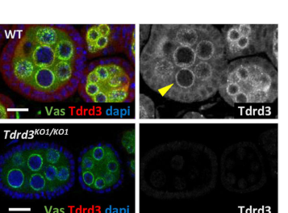

## Question

# Gene Research for Functional Annotation

## ⚠️ CRITICAL: Gene/Protein Identification Context

**BEFORE YOU BEGIN RESEARCH:** You MUST verify you are researching the CORRECT gene/protein. Gene symbols can be ambiguous, especially for less well-characterized genes from non-model organisms.

### Target Gene/Protein Identity (from UniProt):
- **UniProt Accession:** Q9VUH8
- **Protein Description:** RecName: Full=Survival of motor neuron-related-splicing factor 30 {ECO:0000256|ARBA:ARBA00041083}; AltName: Full=Survival motor neuron domain-containing protein 1 {ECO:0000256|ARBA:ARBA00042567}; AltName: Full=Tudor domain-containing protein 3 {ECO:0000256|ARBA:ARBA00013421};
- **Gene Information:** Name=Tdrd3 {ECO:0000313|EMBL:AAF49703.1, ECO:0000313|FlyBase:FBgn0036450}; Synonyms=Dmel\CG13472 {ECO:0000313|EMBL:AAF49703.1}, dTDRD3 {ECO:0000313|EMBL:AAF49703.1}, TDRD {ECO:0000313|EMBL:AAF49703.1}, Tdrd {ECO:0000313|EMBL:AAF49703.1}, TDRD3 {ECO:0000313|EMBL:AAF49703.1}; ORFNames=CG13472 {ECO:0000313|EMBL:AAF49703.1, ECO:0000313|FlyBase:FBgn0036450}, Dmel_CG13472 {ECO:0000313|EMBL:AAF49703.1};
- **Organism (full):** Drosophila melanogaster (Fruit fly).
- **Protein Family:** Belongs to the SMN family. .
- **Key Domains:** RMI1_N_C_sf. (IPR042470); RMI1_OB. (IPR013894); SMN_Tudor. (IPR010304); Tudor. (IPR002999); Tudor_TDRD3. (IPR047379)

### MANDATORY VERIFICATION STEPS:

1. **Check if the gene symbol "Tdrd3" matches the protein description above**
2. **Verify the organism is correct:** Drosophila melanogaster (Fruit fly).
3. **Check if protein family/domains align with what you find in literature**
4. **If you find literature for a DIFFERENT gene with the same or similar symbol, STOP**

### If Gene Symbol is Ambiguous or You Cannot Find Relevant Literature:

**DO NOT PROCEED WITH RESEARCH ON A DIFFERENT GENE.** Instead:
- State clearly: "The gene symbol 'Tdrd3' is ambiguous or literature is limited for this specific protein"
- Explain what you found (e.g., "Found extensive literature on a different gene with the same symbol in a different organism")
- Describe the protein based ONLY on the UniProt information provided above
- Suggest that the protein function can be inferred from domain/family information

### Research Target:

Please provide a comprehensive research report on the gene **Tdrd3** (gene ID: Tdrd3, UniProt: Q9VUH8) in DROME.

The research report should be a detailed narrative explaining the function, biological processes, and localization of the gene product. Citations should be given for all claims.

You should prioritize authoritative reviews and primary scientific literature when conducting research. You can supplement
this with annotations you find in gene/protein databases, but these can be outdated or inaccurate.

We are specifically interested in the primary function of the gene - for enzymes, what reaction is catalyzed, and what is the substrate specificity? For transporters, what is the substrate? For structural proteins or adapters, what is the broader structural role? For signaling molecules, what is the role in the pathway.

We are interested in where in or outside the cell the gene product carries out its function.

We are also interested in the signaling or biochemical pathways in which the gene functions. We are less interested in broad pleiotropic effects, except where these elucidate the precise role.

Include evidence where possible. We are interested in both experimental evidence as well as inference from structure, evolution, or bioinformatic analysis. Precise studies should be prioritized over high-throughput, where available.

## Output

Question: You are an expert researcher providing comprehensive, well-cited information.

Provide detailed information focusing on:
1. Key concepts and definitions with current understanding
2. Recent developments and latest research (prioritize 2023-2024 sources)
3. Current applications and real-world implementations
4. Expert opinions and analysis from authoritative sources
5. Relevant statistics and data from recent studies

Format as a comprehensive research report with proper citations. Include URLs and publication dates where available.
Always prioritize recent, authoritative sources and provide specific citations for all major claims.

# Gene Research for Functional Annotation

## ⚠️ CRITICAL: Gene/Protein Identification Context

**BEFORE YOU BEGIN RESEARCH:** You MUST verify you are researching the CORRECT gene/protein. Gene symbols can be ambiguous, especially for less well-characterized genes from non-model organisms.

### Target Gene/Protein Identity (from UniProt):
- **UniProt Accession:** Q9VUH8
- **Protein Description:** RecName: Full=Survival of motor neuron-related-splicing factor 30 {ECO:0000256|ARBA:ARBA00041083}; AltName: Full=Survival motor neuron domain-containing protein 1 {ECO:0000256|ARBA:ARBA00042567}; AltName: Full=Tudor domain-containing protein 3 {ECO:0000256|ARBA:ARBA00013421};
- **Gene Information:** Name=Tdrd3 {ECO:0000313|EMBL:AAF49703.1, ECO:0000313|FlyBase:FBgn0036450}; Synonyms=Dmel\CG13472 {ECO:0000313|EMBL:AAF49703.1}, dTDRD3 {ECO:0000313|EMBL:AAF49703.1}, TDRD {ECO:0000313|EMBL:AAF49703.1}, Tdrd {ECO:0000313|EMBL:AAF49703.1}, TDRD3 {ECO:0000313|EMBL:AAF49703.1}; ORFNames=CG13472 {ECO:0000313|EMBL:AAF49703.1, ECO:0000313|FlyBase:FBgn0036450}, Dmel_CG13472 {ECO:0000313|EMBL:AAF49703.1};
- **Organism (full):** Drosophila melanogaster (Fruit fly).
- **Protein Family:** Belongs to the SMN family. .
- **Key Domains:** RMI1_N_C_sf. (IPR042470); RMI1_OB. (IPR013894); SMN_Tudor. (IPR010304); Tudor. (IPR002999); Tudor_TDRD3. (IPR047379)

### MANDATORY VERIFICATION STEPS:

1. **Check if the gene symbol "Tdrd3" matches the protein description above**
2. **Verify the organism is correct:** Drosophila melanogaster (Fruit fly).
3. **Check if protein family/domains align with what you find in literature**
4. **If you find literature for a DIFFERENT gene with the same or similar symbol, STOP**

### If Gene Symbol is Ambiguous or You Cannot Find Relevant Literature:

**DO NOT PROCEED WITH RESEARCH ON A DIFFERENT GENE.** Instead:
- State clearly: "The gene symbol 'Tdrd3' is ambiguous or literature is limited for this specific protein"
- Explain what you found (e.g., "Found extensive literature on a different gene with the same symbol in a different organism")
- Describe the protein based ONLY on the UniProt information provided above
- Suggest that the protein function can be inferred from domain/family information

### Research Target:

Please provide a comprehensive research report on the gene **Tdrd3** (gene ID: Tdrd3, UniProt: Q9VUH8) in DROME.

The research report should be a detailed narrative explaining the function, biological processes, and localization of the gene product. Citations should be given for all claims.

You should prioritize authoritative reviews and primary scientific literature when conducting research. You can supplement
this with annotations you find in gene/protein databases, but these can be outdated or inaccurate.

We are specifically interested in the primary function of the gene - for enzymes, what reaction is catalyzed, and what is the substrate specificity? For transporters, what is the substrate? For structural proteins or adapters, what is the broader structural role? For signaling molecules, what is the role in the pathway.

We are interested in where in or outside the cell the gene product carries out its function.

We are also interested in the signaling or biochemical pathways in which the gene functions. We are less interested in broad pleiotropic effects, except where these elucidate the precise role.

Include evidence where possible. We are interested in both experimental evidence as well as inference from structure, evolution, or bioinformatic analysis. Precise studies should be prioritized over high-throughput, where available.

# Functional annotation report: *Drosophila melanogaster* Tdrd3 (Q9VUH8)

## Identity and principal function

**The target is fly Tdrd3, also called CG13472 or dTDRD3—not mammalian TDRD3.** The supplied UniProt accession [Q9VUH8](https://www.uniprot.org/uniprotkb/Q9VUH8/entry) identifies the *Drosophila melanogaster* protein, and a primary fly study explicitly identifies **CG13472 as dTDRD3**. Its annotated Tudor and RMI1-like OB-fold domains agree with published descriptions of fly TDRD3 as a multidomain protein. Despite the UniProt description “survival of motor neuron-related-splicing factor 30,” similarity to SMN-family Tudor domains does **not** establish that this protein is a spliceosomal factor. (xu2013top3βisan pages 10-13, handler2011asystematicanalysis pages 3-4, handler2011asystematicanalysis pages 1-2)

**Best-supported annotation:** fly TDRD3 is a **nonenzymatic nucleic-acid-binding cofactor and molecular scaffold for Topoisomerase 3β (Top3β)**. It associates with Top3β and RNA-binding or RNA-silencing factors, promotes Top3β activity on experimental DNA and RNA substrates, and enables its association with polyribosomes. Its demonstrated sites of action include the cytoplasm of cultured fly cells and, in ovarian germ cells, the cytoplasm and perinuclear **nuage**. TDRD3 has no demonstrated intrinsic topoisomerase reaction: **Top3β, not TDRD3, catalyzes nucleic-acid strand passage**. (lee2018topoisomerase3βinteracts pages 4-5, ahmad2016rnatopoisomeraseis pages 10-11, lee2025topoisomerase3bfacilitates pages 3-5, siaw2016dnaandrna pages 4-5, siaw2016dnaandrna pages 7-7)

The following table separates observations made on **Q9VUH8 or fly Tdrd3** from conclusions that remain inferential.

| Aspect | Direct fly evidence, date, and source | Inference / limitation |
|---|---|---|
| Identity | *Drosophila melanogaster* **CG13472** is explicitly identified as **dTDRD3**; the studied allele was *dTDRD3*P15978. **Xu et al., 2013-08**, [DOI](https://doi.org/10.1038/nn.3479). (xu2013top3βisan pages 10-13, xu2013top3βisan pages 6-10) | Confirms that literature using CG13472/dTDRD3 concerns the Q9VUH8 target, rather than mammalian TDRD3 or another Tudor protein. |
| Biochemical partner activity | Purified fly TDRD3 preferentially bound single-stranded nucleic acids: half-maximal binding was approximately **190 nM** for generic ssRNA and **90 nM** for (rU)₇₃, with very little dsRNA binding. It enhanced fly Top3β relaxation of hypernegatively supercoiled DNA and Top3β-dependent annealing of complementary circular RNAs; stimulation plateaued near a **2:1 TDRD3:Top3β ratio**. **Siaw et al., 2016-08-31**, [DOI](https://doi.org/10.1073/pnas.1605517113). (siaw2016dnaandrna pages 4-5, siaw2016dnaandrna pages 7-7) | TDRD3 is a nucleic-acid-binding **cofactor**, not the topoisomerase: catalysis requires Top3β and its Tyr332 active site. No intrinsic enzymatic reaction has been demonstrated for TDRD3. |
| Molecular scaffold | In S2 cells, dTDRD3 associated with Top3β, dFMR1/FMRP, AGO2 and p68-containing RISC. The OB-fold insertion loop was required for Top3β association; Tudor-region mutations reduced FMRP association, and TDRD3 depletion weakened assembly of the complex. **Lee et al., 2018-11**, [DOI](https://doi.org/10.1038/s41467-018-07101-4). (lee2018topoisomerase3βinteracts pages 4-5, lee2018topoisomerase3βinteracts pages 2-4, lee2018topoisomerase3βinteracts pages 5-6) | Co-immunoprecipitation establishes cellular complex association, not necessarily direct binding between every pair. Fly FMRP binding differs from the human mechanism because the fly C-terminal domain is dispensable. |
| Polyribosome recruitment | Fly Top3β, TDRD3 and FMRP co-sedimented with S2-cell polyribosomes; EDTA disrupted this pattern. CRISPR loss of TDRD3 strongly reduced **Top3β**, but not FMRP, in polyribosome fractions. **Ahmad et al., 2016-06**, [DOI](https://doi.org/10.1093/nar/gkw508). (ahmad2016rnatopoisomeraseis pages 10-11) | Supports a role for TDRD3 in recruiting or retaining Top3β on translating mRNPs. Co-sedimentation is not proof that TDRD3 contacts ribosomes directly. |
| Cellular localization | In ovaries, TDRD3 fluorescence was **3.4-fold higher in germ-cell cytoplasm than nucleus** and was enriched in perinuclear **nuage**. Aub knockdown abolished nuage enrichment, whereas Aub localization was unchanged in *Tdrd3*-KO; Top3β itself was not detectably enriched in nuage. **Lee et al., 2025-04-22**, [DOI](https://doi.org/10.1016/j.celrep.2025.115495). (lee2025topoisomerase3bfacilitates pages 3-5, lee2025topoisomerase3bfacilitates media 4cffe2ba, lee2025topoisomerase3bfacilitates media f9b03d21) | Establishes cytoplasmic/nuage localization and Aub-dependent recruitment of fly TDRD3. It does **not** prove direct recognition of methylated Aub. Fly stress-granule or chromatin localization has not been comparably demonstrated. |
| piRNA context and oogenesis | *Tdrd3*-KO flies showed reduced fertility and larval hatching at **1 of 12** time points, versus **7 of 12** and **10 of 12**, respectively, for *Top3b*-KO; both mutants exhibited oogenesis arrest and germ-cell degeneration. TDRD3 also co-associated with Aub/Piwi-containing machinery. **Lee et al., 2025-04-22**, [DOI](https://doi.org/10.1016/j.celrep.2025.115495). (lee2025topoisomerase3bfacilitates pages 12-13, lee2025topoisomerase3bfacilitates pages 3-5) | Direct TDRD3 evidence supports localization, association and comparatively mild reproductive phenotypes. The study’s quantitative piRNA, transposon-silencing and reporter results were primarily obtained from *Top3b* mutants; the authors explicitly noted that TDRD3’s piRNA role was not extensively characterized. (lee2025topoisomerase3bfacilitates pages 13-15, lee2025topoisomerase3bfacilitates pages 12-13) |
| Splicing and stress granules | No direct fly experiment located demonstrates a spliceosomal function or stress-granule localization for CG13472/Q9VUH8. Earlier surveys classified it by predicted Tudor/OB-domain architecture. **Handler et al., 2011-10**, [DOI](https://doi.org/10.1038/emboj.2011.308). (handler2011asystematicanalysis pages 2-3, handler2011asystematicanalysis pages 3-4, handler2011asystematicanalysis pages 1-2) | “SMN-related splicing factor” is a family/domain-based annotation, not proof that fly Tdrd3 performs pre-mRNA splicing. Stress-granule and methyl-arginine-reader data largely derive from human TDRD3 and must not be transferred uncritically to Q9VUH8. |

*Table: Direct evidence for Drosophila CG13472/Q9VUH8 is separated from homolog-based interpretation. The table highlights the strongest biochemical, cellular, and organismal findings while flagging unsupported splicing, stress-granule, and Tdrd3-specific piRNA claims.*

## Molecular mechanism and substrate recognition

In fly S2 cells, immunoprecipitation recovers TDRD3 with Top3β, dFMR1/FMRP and components of the RNA-induced silencing complex (RISC), including AGO2 and the p68 helicase. Perturbing TDRD3 weakens recovery of Top3β with these partners. Domain-mapping experiments implicate an **insertion loop in TDRD3’s OB fold** in Top3β association and the **Tudor region** in FMRP association. These cellular assays establish complex assembly; they do not establish that every co-immunoprecipitating pair binds directly. Notably, fly FMRP association does not require TDRD3’s C-terminal domain in the same way reported for human TDRD3. [Lee et al., November 2018](https://doi.org/10.1038/s41467-018-07101-4). (lee2018topoisomerase3βinteracts pages 4-5, lee2018topoisomerase3βinteracts pages 2-4, lee2018topoisomerase3βinteracts pages 5-6)

There is also **direct biochemical evidence using fly proteins**. Purified *Drosophila* TDRD3 binds single-stranded DNA and RNA more readily than duplex substrates, without a general preference for RNA over DNA. In the reported assay, half-maximal binding occurred at approximately **90 nM TDRD3 for a 73-nucleotide poly(U) RNA** and **190 nM for a mixed-sequence single-stranded RNA**; duplex RNA bound very weakly. Adding TDRD3 enhanced fly Top3β-mediated relaxation of hypernegatively supercoiled DNA and conversion of complementary single-stranded RNA circles into linked double-stranded circles. The **Top3β-Y332F catalytic mutant** did not produce the RNA-circle product. These are mechanistic *in-vitro* substrates, **not identified physiological RNAs specifically targeted by TDRD3**. [Siaw et al., published online August 31, 2016](https://doi.org/10.1073/pnas.1605517113). (siaw2016dnaandrna pages 4-5, siaw2016dnaandrna pages 7-7)

Structural studies of **human** TOP3B–TDRD3 independently resolve an interface between the TOP3B catalytic-domain surface and TDRD3’s OB-fold core and insertion loop. Human TDRD3 Tudor domains preferentially recognize **asymmetrically dimethylated arginine** in one peptide-binding study, supporting a possible methyl-mark-reader mechanism. These findings strengthen the structural interpretation of the fly complex but **do not measure fly TDRD3’s methyl-mark specificity or prove direct recognition of methylated Aubergine (Aub)**. [Liu et al., February 17, 2012](https://doi.org/10.1371/journal.pone.0030375); [Goto-Ito et al., February 2017](https://doi.org/10.1038/srep42123). (gotoito2017structuralbasisof pages 1-2, gotoito2017structuralbasisof pages 2-3, liu2012crystalstructureof pages 1-2)

## Cellular location and biological pathways

**Translating mRNPs.** In *Drosophila* S2-cell cytoplasmic extracts, Top3β, TDRD3 and FMRP co-sediment with polyribosomes; EDTA disruption diminishes that association. CRISPR inactivation of **Tdrd3** strongly reduces **Top3β**, but leaves **FMRP** largely unchanged, in polyribosome fractions. This supports a specific role for fly TDRD3 in targeting or retaining Top3β within translation-associated messenger ribonucleoprotein assemblies. Co-sedimentation alone does not establish direct binding to ribosomes or a defined fly mRNA substrate. [Ahmad et al., June 2016](https://doi.org/10.1093/nar/gkw508). (ahmad2016rnatopoisomeraseis pages 10-11)

**Ovarian germ-cell cytoplasm and nuage.** Direct immunofluorescence in fly ovaries shows TDRD3 signal **3.4-fold higher in germ-cell cytoplasm than nucleus**, with particular enrichment in perinuclear nuage, a site of germline piRNA production. **Aub knockdown eliminates TDRD3 nuage enrichment**, whereas Tdrd3 loss does not detectably alter Aub localization. Crucially, Top3β itself was **not** detectably enriched in nuage relative to surrounding cytoplasm; therefore, not every nuage-localized TDRD3 molecule can be assumed to contain Top3β. Ovarian co-immunoprecipitation connects the complex with Aub and Piwi; reciprocal experiments in ovarian somatic cells associate it with primary-piRNA-processing proteins. [Lee et al., April 22, 2025, Figure 1](https://doi.org/10.1016/j.celrep.2025.115495). (lee2025topoisomerase3bfacilitates pages 3-5, lee2025topoisomerase3bfacilitates pages 5-7, lee2025topoisomerase3bfacilitates media 4cffe2ba)

**piRNA-associated transposon control: distinguish partner from target.** The 2025 study found that *Top3b* loss or catalytic inactivation de-repressed a germline **burdock–lacZ** reporter; mature reporter RNA rose approximately **2.5–3-fold** without a significant rise in nascent RNA, consistent with impaired **post-transcriptional silencing**. *Top3b* mutants also reduced a piRNA ping-pong signature: the reported score fell from **45 in controls to 33** in the single mutant. These numbers describe **Top3b perturbations, not Tdrd3 perturbations**. They make the complex a compelling candidate in piRNA-mediated RNA metabolism, but the authors explicitly state that **TDRD3’s individual role in piRNA biogenesis and transposon silencing was not extensively characterized**; direct Tdrd3-specific piRNA measurements and causal rescue cannot be inferred from the Top3b data. [Lee et al., April 22, 2025](https://doi.org/10.1016/j.celrep.2025.115495). (lee2025topoisomerase3bfacilitates pages 8-10, lee2025topoisomerase3bfacilitates pages 5-7, lee2025topoisomerase3bfacilitates pages 13-15)

**Somatic RISC and heterochromatin.** Fly TDRD3 provides biochemical scaffolding between Top3β and RISC components. Top3β-deficient flies show impaired reporter silencing at heterochromatin and defects involving heterochromatin-associated HP1, supporting a pathway-level connection. Those **Top3β mutant outcomes should not be reported as direct Tdrd3-knockout heterochromatin phenotypes** without a separate Tdrd3-specific assay. [Lee et al., November 2018](https://doi.org/10.1038/s41467-018-07101-4). (lee2018topoisomerase3βinteracts pages 4-5, lee2018topoisomerase3βinteracts pages 1-2)

## Organismal evidence and recent developments

A fly *Tdrd3* reduction-of-function allele lowered Tdrd3 transcript by approximately **70%** and **suppressed** the rough-eye phenotype produced by ectopic dFMR1; a *Top3b* null allele **enhanced** that phenotype. The opposite genetic effects caution against treating TDRD3 and Top3β as interchangeable in every developmental setting. These experiments demonstrate a genetic interaction, not a measured Tdrd3-specific defect in neuromuscular-junction synapse number. [Xu et al., August 2013](https://doi.org/10.1038/nn.3479). (xu2013top3βisan pages 10-13)

The strongest newer **fly-specific loss-of-function** results come from 2025. In a **12-time-point** reproductive study, *Tdrd3*-knockout females showed significantly reduced fertility at **1** time point and reduced larval hatching at **1**, compared with **7** and **10** time points, respectively, for *Top3b*-knockout females. Both mutants showed ovarian developmental arrest and germ-cell degeneration. Thus TDRD3 contributes to normal oogenesis, but these assays indicate a **substantially weaker or less consistently detected reproductive phenotype** than Top3β loss; they do not establish a one-to-one causal link between Tdrd3 loss and defective piRNA production. [Lee et al., April 22, 2025](https://doi.org/10.1016/j.celrep.2025.115495). (lee2025topoisomerase3bfacilitates pages 12-13)

Among **2023–2024 developments**, the most pertinent direct Tdrd3 experiment located was in **mice**, not flies: *Tdrd3*-null mice exhibited post-transcriptional and synaptic-plasticity abnormalities overlapping with, but not identical to, *Top3b*-null mice. Separately, human-cell knockout studies found partially shared TOP3B–TDRD3 effects on mRNA turnover and translation. These findings support a conserved cofactor concept, **not automatic assignment of mouse behavioral, human stress-granule or human transcriptional phenotypes to fly Q9VUH8**. [Zhu et al., February 2024](https://doi.org/10.1016/j.pneurobio.2024.102568); [Su et al., June 2022](https://doi.org/10.1093/nar/gkac538). (zhu2024tdrd3nullmiceshow pages 17-20, su2022adualactivitytopoisomerasea pages 1-1, su2022adualactivitytopoisomerasea pages 1-2)

## Interpretation and annotation boundaries

For practical functional annotation, describe Q9VUH8 as a **cytoplasmic, nuage-enriched Tudor/OB-fold adaptor and DNA/RNA-binding regulatory cofactor of Top3β**, involved demonstrably in Top3β-containing RNP assembly, polyribosome association and normal ovarian development. Its participation in piRNA machinery is supported by localization and complex-association experiments; a **specific requirement of fly Tdrd3 for piRNA biogenesis or transposon repression remains to be established independently of Top3b**. The available fly evidence does **not** demonstrate an intrinsic TDRD3-catalyzed reaction, pre-mRNA splicing activity, direct methylated-Aub recognition, or fly stress-granule localization. Earlier Tudor-family surveys provide domain-based context, whereas stress-granule observations concern **human** TDRD3. [Handler et al., October 2011](https://doi.org/10.1038/emboj.2011.308); [Goulet et al., July 2008](https://doi.org/10.1093/hmg/ddn203). (lee2025topoisomerase3bfacilitates pages 13-15, handler2011asystematicanalysis pages 2-3, goulet2008tdrd3anovel pages 10-11, goulet2008tdrd3anovel pages 1-2)

References

1. (xu2013top3βisan pages 10-13): Dongyi Xu, Weiping Shen, Rong Guo, Yutong Xue, Wei Peng, Jian Sima, Jay Yang, Alexei Sharov, Subramanya Srikantan, Jiandong Yang, David Fox, Yong Qian, Jennifer L Martindale, Yulan Piao, James Machamer, Samit R Joshi, Subhasis Mohanty, Albert C Shaw, Thomas E Lloyd, Grant W Brown, Minoru S H Ko, Myriam Gorospe, Sige Zou, and Weidong Wang. Top3β is an rna topoisomerase that works with fragile x syndrome protein to promote synapse formation. Nature neuroscience, 16:1238-1247, Aug 2013. URL: https://doi.org/10.1038/nn.3479, doi:10.1038/nn.3479. This article has 195 citations and is from a highest quality peer-reviewed journal.

2. (handler2011asystematicanalysis pages 3-4): Dominik Handler, Daniel Olivieri, Maria Novatchkova, Franz Sebastian Gruber, Katharina Meixner, Karl Mechtler, Alexander Stark, Ravi Sachidanandam, and Julius Brennecke. A systematic analysis of drosophila tudor domain‐containing proteins identifies vreteno and the tdrd12 family as essential primary pirna pathway factors. The EMBO Journal, 30:3977-3993, Oct 2011. URL: https://doi.org/10.1038/emboj.2011.308, doi:10.1038/emboj.2011.308. This article has 249 citations.

3. (handler2011asystematicanalysis pages 1-2): Dominik Handler, Daniel Olivieri, Maria Novatchkova, Franz Sebastian Gruber, Katharina Meixner, Karl Mechtler, Alexander Stark, Ravi Sachidanandam, and Julius Brennecke. A systematic analysis of drosophila tudor domain‐containing proteins identifies vreteno and the tdrd12 family as essential primary pirna pathway factors. The EMBO Journal, 30:3977-3993, Oct 2011. URL: https://doi.org/10.1038/emboj.2011.308, doi:10.1038/emboj.2011.308. This article has 249 citations.

4. (lee2018topoisomerase3βinteracts pages 4-5): Seung Kyu Lee, Yutong Xue, Weiping Shen, Yongqing Zhang, Yuyoung Joo, Muzammil Ahmad, Madoka Chinen, Yi Ding, Wai Lim Ku, Supriyo De, Elin Lehrmann, Kevin G. Becker, Elissa P. Lei, Keji Zhao, Sige Zou, Alexei Sharov, and Weidong Wang. Topoisomerase 3β interacts with rnai machinery to promote heterochromatin formation and transcriptional silencing in drosophila. Nature Communications, Nov 2018. URL: https://doi.org/10.1038/s41467-018-07101-4, doi:10.1038/s41467-018-07101-4. This article has 53 citations and is from a highest quality peer-reviewed journal.

5. (ahmad2016rnatopoisomeraseis pages 10-11): Muzammil Ahmad, Yutong Xue, Seung Kyu Lee, Jennifer L. Martindale, Weiping Shen, Wen Li, Sige Zou, Maria Ciaramella, Hélène Debat, Marc Nadal, Fenfei Leng, Hongliang Zhang, Quan Wang, Grace Ee-Lu Siaw, Hengyao Niu, Yves Pommier, Myriam Gorospe, Tao-Shih Hsieh, Yuk-Ching Tse-Dinh, Dongyi Xu, and Weidong Wang. Rna topoisomerase is prevalent in all domains of life and associates with polyribosomes in animals. Nucleic Acids Research, 44:6335-6349, Jun 2016. URL: https://doi.org/10.1093/nar/gkw508, doi:10.1093/nar/gkw508. This article has 90 citations and is from a highest quality peer-reviewed journal.

6. (lee2025topoisomerase3bfacilitates pages 3-5): Seung Kyu Lee, Weiping Shen, William Wen, Yuyoung Joo, Yutong Xue, Aaron Park, Amy Qiang, Shuaikun Su, Tianyi Zhang, Megan Zhang, Jinshui Fan, Yongqing Zhang, Supriyo De, Ildar Gainetdinov, Alexei Sharov, Manolis Maragkakis, and Weidong Wang. Topoisomerase 3b facilitates pirna biogenesis to promote transposon silencing and germ cell development. Cell reports, 44:115495-115495, Apr 2025. URL: https://doi.org/10.1016/j.celrep.2025.115495, doi:10.1016/j.celrep.2025.115495. This article has 6 citations and is from a highest quality peer-reviewed journal.

7. (siaw2016dnaandrna pages 4-5): Grace Ee-Lu Siaw, I-Fen Liu, Po-Yen Lin, Michael D. Been, and Tao-shih Hsieh. Dna and rna topoisomerase activities of top3β are promoted by mediator protein tudor domain-containing protein 3. Proceedings of the National Academy of Sciences, 113:E5544-E5551, Aug 2016. URL: https://doi.org/10.1073/pnas.1605517113, doi:10.1073/pnas.1605517113. This article has 58 citations and is from a highest quality peer-reviewed journal.

8. (siaw2016dnaandrna pages 7-7): Grace Ee-Lu Siaw, I-Fen Liu, Po-Yen Lin, Michael D. Been, and Tao-shih Hsieh. Dna and rna topoisomerase activities of top3β are promoted by mediator protein tudor domain-containing protein 3. Proceedings of the National Academy of Sciences, 113:E5544-E5551, Aug 2016. URL: https://doi.org/10.1073/pnas.1605517113, doi:10.1073/pnas.1605517113. This article has 58 citations and is from a highest quality peer-reviewed journal.

9. (xu2013top3βisan pages 6-10): Dongyi Xu, Weiping Shen, Rong Guo, Yutong Xue, Wei Peng, Jian Sima, Jay Yang, Alexei Sharov, Subramanya Srikantan, Jiandong Yang, David Fox, Yong Qian, Jennifer L Martindale, Yulan Piao, James Machamer, Samit R Joshi, Subhasis Mohanty, Albert C Shaw, Thomas E Lloyd, Grant W Brown, Minoru S H Ko, Myriam Gorospe, Sige Zou, and Weidong Wang. Top3β is an rna topoisomerase that works with fragile x syndrome protein to promote synapse formation. Nature neuroscience, 16:1238-1247, Aug 2013. URL: https://doi.org/10.1038/nn.3479, doi:10.1038/nn.3479. This article has 195 citations and is from a highest quality peer-reviewed journal.

10. (lee2018topoisomerase3βinteracts pages 2-4): Seung Kyu Lee, Yutong Xue, Weiping Shen, Yongqing Zhang, Yuyoung Joo, Muzammil Ahmad, Madoka Chinen, Yi Ding, Wai Lim Ku, Supriyo De, Elin Lehrmann, Kevin G. Becker, Elissa P. Lei, Keji Zhao, Sige Zou, Alexei Sharov, and Weidong Wang. Topoisomerase 3β interacts with rnai machinery to promote heterochromatin formation and transcriptional silencing in drosophila. Nature Communications, Nov 2018. URL: https://doi.org/10.1038/s41467-018-07101-4, doi:10.1038/s41467-018-07101-4. This article has 53 citations and is from a highest quality peer-reviewed journal.

11. (lee2018topoisomerase3βinteracts pages 5-6): Seung Kyu Lee, Yutong Xue, Weiping Shen, Yongqing Zhang, Yuyoung Joo, Muzammil Ahmad, Madoka Chinen, Yi Ding, Wai Lim Ku, Supriyo De, Elin Lehrmann, Kevin G. Becker, Elissa P. Lei, Keji Zhao, Sige Zou, Alexei Sharov, and Weidong Wang. Topoisomerase 3β interacts with rnai machinery to promote heterochromatin formation and transcriptional silencing in drosophila. Nature Communications, Nov 2018. URL: https://doi.org/10.1038/s41467-018-07101-4, doi:10.1038/s41467-018-07101-4. This article has 53 citations and is from a highest quality peer-reviewed journal.

12. (lee2025topoisomerase3bfacilitates media 4cffe2ba): Seung Kyu Lee, Weiping Shen, William Wen, Yuyoung Joo, Yutong Xue, Aaron Park, Amy Qiang, Shuaikun Su, Tianyi Zhang, Megan Zhang, Jinshui Fan, Yongqing Zhang, Supriyo De, Ildar Gainetdinov, Alexei Sharov, Manolis Maragkakis, and Weidong Wang. Topoisomerase 3b facilitates pirna biogenesis to promote transposon silencing and germ cell development. Cell reports, 44:115495-115495, Apr 2025. URL: https://doi.org/10.1016/j.celrep.2025.115495, doi:10.1016/j.celrep.2025.115495. This article has 6 citations and is from a highest quality peer-reviewed journal.

13. (lee2025topoisomerase3bfacilitates media f9b03d21): Seung Kyu Lee, Weiping Shen, William Wen, Yuyoung Joo, Yutong Xue, Aaron Park, Amy Qiang, Shuaikun Su, Tianyi Zhang, Megan Zhang, Jinshui Fan, Yongqing Zhang, Supriyo De, Ildar Gainetdinov, Alexei Sharov, Manolis Maragkakis, and Weidong Wang. Topoisomerase 3b facilitates pirna biogenesis to promote transposon silencing and germ cell development. Cell reports, 44:115495-115495, Apr 2025. URL: https://doi.org/10.1016/j.celrep.2025.115495, doi:10.1016/j.celrep.2025.115495. This article has 6 citations and is from a highest quality peer-reviewed journal.

14. (lee2025topoisomerase3bfacilitates pages 12-13): Seung Kyu Lee, Weiping Shen, William Wen, Yuyoung Joo, Yutong Xue, Aaron Park, Amy Qiang, Shuaikun Su, Tianyi Zhang, Megan Zhang, Jinshui Fan, Yongqing Zhang, Supriyo De, Ildar Gainetdinov, Alexei Sharov, Manolis Maragkakis, and Weidong Wang. Topoisomerase 3b facilitates pirna biogenesis to promote transposon silencing and germ cell development. Cell reports, 44:115495-115495, Apr 2025. URL: https://doi.org/10.1016/j.celrep.2025.115495, doi:10.1016/j.celrep.2025.115495. This article has 6 citations and is from a highest quality peer-reviewed journal.

15. (lee2025topoisomerase3bfacilitates pages 13-15): Seung Kyu Lee, Weiping Shen, William Wen, Yuyoung Joo, Yutong Xue, Aaron Park, Amy Qiang, Shuaikun Su, Tianyi Zhang, Megan Zhang, Jinshui Fan, Yongqing Zhang, Supriyo De, Ildar Gainetdinov, Alexei Sharov, Manolis Maragkakis, and Weidong Wang. Topoisomerase 3b facilitates pirna biogenesis to promote transposon silencing and germ cell development. Cell reports, 44:115495-115495, Apr 2025. URL: https://doi.org/10.1016/j.celrep.2025.115495, doi:10.1016/j.celrep.2025.115495. This article has 6 citations and is from a highest quality peer-reviewed journal.

16. (handler2011asystematicanalysis pages 2-3): Dominik Handler, Daniel Olivieri, Maria Novatchkova, Franz Sebastian Gruber, Katharina Meixner, Karl Mechtler, Alexander Stark, Ravi Sachidanandam, and Julius Brennecke. A systematic analysis of drosophila tudor domain‐containing proteins identifies vreteno and the tdrd12 family as essential primary pirna pathway factors. The EMBO Journal, 30:3977-3993, Oct 2011. URL: https://doi.org/10.1038/emboj.2011.308, doi:10.1038/emboj.2011.308. This article has 249 citations.

17. (gotoito2017structuralbasisof pages 1-2): Sakurako Goto-Ito, Atsushi Yamagata, Tomio S. Takahashi, Yusuke Sato, and Shuya Fukai. Structural basis of the interaction between topoisomerase iiiβ and the tdrd3 auxiliary factor. Scientific Reports, Feb 2017. URL: https://doi.org/10.1038/srep42123, doi:10.1038/srep42123. This article has 45 citations and is from a peer-reviewed journal.

18. (gotoito2017structuralbasisof pages 2-3): Sakurako Goto-Ito, Atsushi Yamagata, Tomio S. Takahashi, Yusuke Sato, and Shuya Fukai. Structural basis of the interaction between topoisomerase iiiβ and the tdrd3 auxiliary factor. Scientific Reports, Feb 2017. URL: https://doi.org/10.1038/srep42123, doi:10.1038/srep42123. This article has 45 citations and is from a peer-reviewed journal.

19. (liu2012crystalstructureof pages 1-2): Ke Liu, Yahong Guo, Haiping Liu, Chuanbing Bian, Robert Lam, Yongsong Liu, Farrell Mackenzie, Luis Alejandro Rojas, Danny Reinberg, Mark T. Bedford, Rui-Ming Xu, and Jinrong Min. Crystal structure of tdrd3 and methyl-arginine binding characterization of tdrd3, smn and spf30. PLoS ONE, 7:e30375, Feb 2012. URL: https://doi.org/10.1371/journal.pone.0030375, doi:10.1371/journal.pone.0030375. This article has 118 citations and is from a peer-reviewed journal.

20. (lee2025topoisomerase3bfacilitates pages 5-7): Seung Kyu Lee, Weiping Shen, William Wen, Yuyoung Joo, Yutong Xue, Aaron Park, Amy Qiang, Shuaikun Su, Tianyi Zhang, Megan Zhang, Jinshui Fan, Yongqing Zhang, Supriyo De, Ildar Gainetdinov, Alexei Sharov, Manolis Maragkakis, and Weidong Wang. Topoisomerase 3b facilitates pirna biogenesis to promote transposon silencing and germ cell development. Cell reports, 44:115495-115495, Apr 2025. URL: https://doi.org/10.1016/j.celrep.2025.115495, doi:10.1016/j.celrep.2025.115495. This article has 6 citations and is from a highest quality peer-reviewed journal.

21. (lee2025topoisomerase3bfacilitates pages 8-10): Seung Kyu Lee, Weiping Shen, William Wen, Yuyoung Joo, Yutong Xue, Aaron Park, Amy Qiang, Shuaikun Su, Tianyi Zhang, Megan Zhang, Jinshui Fan, Yongqing Zhang, Supriyo De, Ildar Gainetdinov, Alexei Sharov, Manolis Maragkakis, and Weidong Wang. Topoisomerase 3b facilitates pirna biogenesis to promote transposon silencing and germ cell development. Cell reports, 44:115495-115495, Apr 2025. URL: https://doi.org/10.1016/j.celrep.2025.115495, doi:10.1016/j.celrep.2025.115495. This article has 6 citations and is from a highest quality peer-reviewed journal.

22. (lee2018topoisomerase3βinteracts pages 1-2): Seung Kyu Lee, Yutong Xue, Weiping Shen, Yongqing Zhang, Yuyoung Joo, Muzammil Ahmad, Madoka Chinen, Yi Ding, Wai Lim Ku, Supriyo De, Elin Lehrmann, Kevin G. Becker, Elissa P. Lei, Keji Zhao, Sige Zou, Alexei Sharov, and Weidong Wang. Topoisomerase 3β interacts with rnai machinery to promote heterochromatin formation and transcriptional silencing in drosophila. Nature Communications, Nov 2018. URL: https://doi.org/10.1038/s41467-018-07101-4, doi:10.1038/s41467-018-07101-4. This article has 53 citations and is from a highest quality peer-reviewed journal.

23. (zhu2024tdrd3nullmiceshow pages 17-20): Xingliang Zhu, Yuyoung Joo, Simone Bossi, Ross A. McDevitt, Aoji Xie, Yue Wang, Yutong Xue, Shuaikun Su, Seung Kyu Lee, Nirnath Sah, Shiliang Zhang, Rong Ye, Alejandro Pinto, Yongqing Zhang, Kimi Araki, Masatake Araki, Marisela Morales, Mark P. Mattson, Henriette van Praag, and Weidong Wang. Tdrd3-null mice show post-transcriptional and behavioral impairments associated with neurogenesis and synaptic plasticity. Progress in Neurobiology, 233:102568, Feb 2024. URL: https://doi.org/10.1016/j.pneurobio.2024.102568, doi:10.1016/j.pneurobio.2024.102568. This article has 23 citations and is from a domain leading peer-reviewed journal.

24. (su2022adualactivitytopoisomerasea pages 1-1): Shuaikun Su, Yutong Xue, Alexei Sharov, Yongqing Zhang, Seung Kyu Lee, Jennifer L Martindale, Wen Li, Wai Lim Ku, Keji Zhao, Supriyo De, Weiping Shen, Payel Sen, Myriam Gorospe, Dongyi Xu, and Weidong Wang. A dual-activity topoisomerase complex regulates mrna translation and turnover. Nucleic acids research, 50:7013-7033, Jun 2022. URL: https://doi.org/10.1093/nar/gkac538, doi:10.1093/nar/gkac538. This article has 32 citations and is from a highest quality peer-reviewed journal.

25. (su2022adualactivitytopoisomerasea pages 1-2): Shuaikun Su, Yutong Xue, Alexei Sharov, Yongqing Zhang, Seung Kyu Lee, Jennifer L Martindale, Wen Li, Wai Lim Ku, Keji Zhao, Supriyo De, Weiping Shen, Payel Sen, Myriam Gorospe, Dongyi Xu, and Weidong Wang. A dual-activity topoisomerase complex regulates mrna translation and turnover. Nucleic acids research, 50:7013-7033, Jun 2022. URL: https://doi.org/10.1093/nar/gkac538, doi:10.1093/nar/gkac538. This article has 32 citations and is from a highest quality peer-reviewed journal.

26. (goulet2008tdrd3anovel pages 10-11): I. Goulet, Sophie Boisvenue, Sophie Mokas, R. Mazroui, and J. Côté. Tdrd3, a novel tudor domain-containing protein, localizes to cytoplasmic stress granules. Human Molecular Genetics, 17:3055-3074, Jul 2008. URL: https://doi.org/10.1093/hmg/ddn203, doi:10.1093/hmg/ddn203. This article has 162 citations and is from a domain leading peer-reviewed journal.

27. (goulet2008tdrd3anovel pages 1-2): I. Goulet, Sophie Boisvenue, Sophie Mokas, R. Mazroui, and J. Côté. Tdrd3, a novel tudor domain-containing protein, localizes to cytoplasmic stress granules. Human Molecular Genetics, 17:3055-3074, Jul 2008. URL: https://doi.org/10.1093/hmg/ddn203, doi:10.1093/hmg/ddn203. This article has 162 citations and is from a domain leading peer-reviewed journal.

## Artifacts

- [Edison artifact artifact-00](Tdrd3-deep-research-falcon_artifacts/artifact-00.md)

## Citations

1. ahmad2016rnatopoisomeraseis pages 10-11
2. handler2011asystematicanalysis pages 3-4
3. handler2011asystematicanalysis pages 1-2
4. siaw2016dnaandrna pages 4-5
5. siaw2016dnaandrna pages 7-7
6. handler2011asystematicanalysis pages 2-3
7. gotoito2017structuralbasisof pages 1-2
8. gotoito2017structuralbasisof pages 2-3
9. liu2012crystalstructureof pages 1-2
10. su2022adualactivitytopoisomerasea pages 1-1
11. su2022adualactivitytopoisomerasea pages 1-2
12. Q9VUH8
13. DOI
14. Lee et al., November 2018
15. Siaw et al., published online August 31, 2016
16. Liu et al., February 17, 2012
17. Goto-Ito et al., February 2017
18. Ahmad et al., June 2016
19. Lee et al., April 22, 2025, Figure 1
20. Lee et al., April 22, 2025
21. Xu et al., August 2013
22. Zhu et al., February 2024
23. Su et al., June 2022
24. Handler et al., October 2011
25. Goulet et al., July 2008
26. https://www.uniprot.org/uniprotkb/Q9VUH8/entry
27. https://doi.org/10.1038/nn.3479
28. https://doi.org/10.1073/pnas.1605517113
29. https://doi.org/10.1038/s41467-018-07101-4
30. https://doi.org/10.1093/nar/gkw508
31. https://doi.org/10.1016/j.celrep.2025.115495
32. https://doi.org/10.1038/emboj.2011.308
33. https://doi.org/10.1371/journal.pone.0030375
34. https://doi.org/10.1038/srep42123
35. https://doi.org/10.1016/j.pneurobio.2024.102568
36. https://doi.org/10.1093/nar/gkac538
37. https://doi.org/10.1093/hmg/ddn203
38. https://doi.org/10.1038/nn.3479,
39. https://doi.org/10.1038/emboj.2011.308,
40. https://doi.org/10.1038/s41467-018-07101-4,
41. https://doi.org/10.1093/nar/gkw508,
42. https://doi.org/10.1016/j.celrep.2025.115495,
43. https://doi.org/10.1073/pnas.1605517113,
44. https://doi.org/10.1038/srep42123,
45. https://doi.org/10.1371/journal.pone.0030375,
46. https://doi.org/10.1016/j.pneurobio.2024.102568,
47. https://doi.org/10.1093/nar/gkac538,
48. https://doi.org/10.1093/hmg/ddn203,