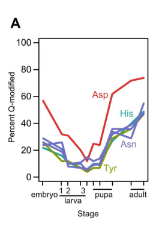

## Question

# Gene Research for Functional Annotation

## ⚠️ CRITICAL: Gene/Protein Identification Context

**BEFORE YOU BEGIN RESEARCH:** You MUST verify you are researching the CORRECT gene/protein. Gene symbols can be ambiguous, especially for less well-characterized genes from non-model organisms.

### Target Gene/Protein Identity (from UniProt):
- **UniProt Accession:** Q9VPY8
- **Protein Description:** RecName: Full=Queuine tRNA-ribosyltransferase catalytic subunit {ECO:0000255|HAMAP-Rule:MF_03218}; EC=2.4.2.64 {ECO:0000255|HAMAP-Rule:MF_03218}; AltName: Full=Guanine insertion enzyme {ECO:0000255|HAMAP-Rule:MF_03218}; AltName: Full=tRNA-guanine transglycosylase {ECO:0000255|HAMAP-Rule:MF_03218};
- **Gene Information:** Name=Tgt; ORFNames=CG4947;
- **Organism (full):** Drosophila melanogaster (Fruit fly).
- **Protein Family:** Belongs to the queuine tRNA-ribosyltransferase family.
- **Key Domains:** TGT. (IPR004803); TGT-like_sf. (IPR036511); tRNA_ribo_trans-like. (IPR002616); TGT (PF01702)

### MANDATORY VERIFICATION STEPS:

1. **Check if the gene symbol "Tgt" matches the protein description above**
2. **Verify the organism is correct:** Drosophila melanogaster (Fruit fly).
3. **Check if protein family/domains align with what you find in literature**
4. **If you find literature for a DIFFERENT gene with the same or similar symbol, STOP**

### If Gene Symbol is Ambiguous or You Cannot Find Relevant Literature:

**DO NOT PROCEED WITH RESEARCH ON A DIFFERENT GENE.** Instead:
- State clearly: "The gene symbol 'Tgt' is ambiguous or literature is limited for this specific protein"
- Explain what you found (e.g., "Found extensive literature on a different gene with the same symbol in a different organism")
- Describe the protein based ONLY on the UniProt information provided above
- Suggest that the protein function can be inferred from domain/family information

### Research Target:

Please provide a comprehensive research report on the gene **Tgt** (gene ID: Tgt, UniProt: Q9VPY8) in DROME.

The research report should be a detailed narrative explaining the function, biological processes, and localization of the gene product. Citations should be given for all claims.

You should prioritize authoritative reviews and primary scientific literature when conducting research. You can supplement
this with annotations you find in gene/protein databases, but these can be outdated or inaccurate.

We are specifically interested in the primary function of the gene - for enzymes, what reaction is catalyzed, and what is the substrate specificity? For transporters, what is the substrate? For structural proteins or adapters, what is the broader structural role? For signaling molecules, what is the role in the pathway.

We are interested in where in or outside the cell the gene product carries out its function.

We are also interested in the signaling or biochemical pathways in which the gene functions. We are less interested in broad pleiotropic effects, except where these elucidate the precise role.

Include evidence where possible. We are interested in both experimental evidence as well as inference from structure, evolution, or bioinformatic analysis. Precise studies should be prioritized over high-throughput, where available.

## Output

Question: You are an expert researcher providing comprehensive, well-cited information.

Provide detailed information focusing on:
1. Key concepts and definitions with current understanding
2. Recent developments and latest research (prioritize 2023-2024 sources)
3. Current applications and real-world implementations
4. Expert opinions and analysis from authoritative sources
5. Relevant statistics and data from recent studies

Format as a comprehensive research report with proper citations. Include URLs and publication dates where available.
Always prioritize recent, authoritative sources and provide specific citations for all major claims.

# Gene Research for Functional Annotation

## ⚠️ CRITICAL: Gene/Protein Identification Context

**BEFORE YOU BEGIN RESEARCH:** You MUST verify you are researching the CORRECT gene/protein. Gene symbols can be ambiguous, especially for less well-characterized genes from non-model organisms.

### Target Gene/Protein Identity (from UniProt):
- **UniProt Accession:** Q9VPY8
- **Protein Description:** RecName: Full=Queuine tRNA-ribosyltransferase catalytic subunit {ECO:0000255|HAMAP-Rule:MF_03218}; EC=2.4.2.64 {ECO:0000255|HAMAP-Rule:MF_03218}; AltName: Full=Guanine insertion enzyme {ECO:0000255|HAMAP-Rule:MF_03218}; AltName: Full=tRNA-guanine transglycosylase {ECO:0000255|HAMAP-Rule:MF_03218};
- **Gene Information:** Name=Tgt; ORFNames=CG4947;
- **Organism (full):** Drosophila melanogaster (Fruit fly).
- **Protein Family:** Belongs to the queuine tRNA-ribosyltransferase family.
- **Key Domains:** TGT. (IPR004803); TGT-like_sf. (IPR036511); tRNA_ribo_trans-like. (IPR002616); TGT (PF01702)

### MANDATORY VERIFICATION STEPS:

1. **Check if the gene symbol "Tgt" matches the protein description above**
2. **Verify the organism is correct:** Drosophila melanogaster (Fruit fly).
3. **Check if protein family/domains align with what you find in literature**
4. **If you find literature for a DIFFERENT gene with the same or similar symbol, STOP**

### If Gene Symbol is Ambiguous or You Cannot Find Relevant Literature:

**DO NOT PROCEED WITH RESEARCH ON A DIFFERENT GENE.** Instead:
- State clearly: "The gene symbol 'Tgt' is ambiguous or literature is limited for this specific protein"
- Explain what you found (e.g., "Found extensive literature on a different gene with the same symbol in a different organism")
- Describe the protein based ONLY on the UniProt information provided above
- Suggest that the protein function can be inferred from domain/family information

### Research Target:

Please provide a comprehensive research report on the gene **Tgt** (gene ID: Tgt, UniProt: Q9VPY8) in DROME.

The research report should be a detailed narrative explaining the function, biological processes, and localization of the gene product. Citations should be given for all claims.

You should prioritize authoritative reviews and primary scientific literature when conducting research. You can supplement
this with annotations you find in gene/protein databases, but these can be outdated or inaccurate.

We are specifically interested in the primary function of the gene - for enzymes, what reaction is catalyzed, and what is the substrate specificity? For transporters, what is the substrate? For structural proteins or adapters, what is the broader structural role? For signaling molecules, what is the role in the pathway.

We are interested in where in or outside the cell the gene product carries out its function.

We are also interested in the signaling or biochemical pathways in which the gene functions. We are less interested in broad pleiotropic effects, except where these elucidate the precise role.

Include evidence where possible. We are interested in both experimental evidence as well as inference from structure, evolution, or bioinformatic analysis. Precise studies should be prioritized over high-throughput, where available.

# Functional annotation report: *Drosophila melanogaster* Tgt (CG4947; UniProt Q9VPY8)

## Identity and confidence

**The gene symbol “Tgt” is ambiguous across organisms, and direct literature on this specific fly protein is limited.** The supplied UniProt record identifies **Q9VPY8** as *D. melanogaster* **Tgt/CG4947**, annotated as the catalytic queuine tRNA-ribosyltransferase subunit (**EC 2.4.2.64**) with TGT-family domains. This identity is consistent with the eukaryotic enzyme family described in biochemical studies, but the papers examined do **not** independently identify Q9VPY8 by accession or directly assay purified fly CG4947. Consequently, the catalytic assignment below is a **strong family-based inference**, not a claim of gene-specific experimental validation. The supplied record is available at https://www.uniprot.org/uniprotkb/Q9VPY8/entry. (sievers2021structuralandfunctional pages 1-3, sebastiani2022structuralandbiochemical pages 1-6, guo2025queuosineisincorporated pages 6-7)

The evidence hierarchy is important: fly studies establish that the **queuosine-modification pathway operates in *Drosophila***; human and mouse studies establish the detailed chemistry of the corresponding catalytic enzyme; neither alone demonstrates every proposed property of CG4947. (guo2025queuosineisincorporated pages 6-7, zaborske2014anutrientdriventrna pages 3-5, sebastiani2022structuralandbiochemical pages 1-6)

| Annotation or finding | Organism / system | Evidence | Confidence for Q9VPY8 annotation | Reference |
|---|---|---|---|---|
| **Catalytic identity:** Tgt/CG4947 (Q9VPY8) is annotated as the catalytic queuine tRNA-ribosyltransferase subunit (EC 2.4.2.64), with TGT-family domains. | *Drosophila melanogaster* | User-supplied UniProt/HAMAP computational annotation; exact-locus biochemical validation was not found. | **Moderate** — strong family-based inference, but not direct assay of Q9VPY8. | UniProt Q9VPY8: https://www.uniprot.org/uniprotkb/Q9VPY8/entry |
| **Fly Q-tRNAs and development:** Q was detected in tRNA\(^His\), tRNA\(^Asn\), and tRNA\(^Tyr\); modification was low in third-instar larvae and rose to roughly half of these tRNAs in adults. Developmental Q levels correlated with C-ending-versus-U-ending codon-selection scores (Spearman *r*=0.61, *p*<0.02; family-centered *r*=0.63, *p*<0.01). TGT expression itself predicted Q levels poorly. | *D. melanogaster* and comparative drosophilids | Direct APB-gel/Northern measurements plus correlational evolutionary analysis; no CG4947 mutation or enzyme assay. | **High** for the presence and developmental regulation of fly Q-tRNA; **low–moderate** for causal assignment specifically to Q9VPY8. | Zaborske et al., 2014, PLOS Biology, https://doi.org/10.1371/journal.pbio.1002015 (zaborske2014anutrientdriventrna pages 3-5, zaborske2014anutrientdriventrna pages 5-7, zaborske2014anutrientdriventrna pages 7-8) |
| **Pre-splicing substrate:** Five fly pre-tRNA\(^Tyr\) isodecoders (1-2, 1-4, 1-6, 1-7, and 1-8) carried Q in S2 cells; abundant pre-tRNA\(^Tyr\) 1-4 was also confirmed as modified in adult flies. | *D. melanogaster* S2 cells and adults | Direct APB Northern detection; no CG4947 perturbation or localization assay. | **High** that intron-containing fly pre-tRNA\(^Tyr\) is a physiological Q-modification substrate; **moderate** for attribution to Q9VPY8 by orthology. | Guo et al., published 24 July 2025, Nature Communications, https://doi.org/10.1038/s41467-025-62220-z (guo2025queuosineisincorporated pages 1-2, guo2025queuosineisincorporated pages 6-7) |
| **Reaction and heterodimer model:** catalytic QTRT1 replaces guanine-34 with queuine through a covalent Asp–ribose intermediate; noncatalytic QTRT2 contributes tRNA binding/orientation. Canonical substrates are tRNA\(^Asp\), tRNA\(^Asn\), tRNA\(^His\), and tRNA\(^Tyr\). | Human and mouse recombinant proteins/structures | Direct structural and biochemical evidence in mammals, not flies. | **High** for conserved eukaryotic TGT chemistry; **moderate–high** when transferred to fly Q9VPY8, contingent on the supplied orthology/domain annotation. | Sievers et al., 2021, RNA Biology, https://doi.org/10.1080/15476286.2021.1950980; Sebastiani et al., 2022, ACS Chemical Biology, https://doi.org/10.1021/acschembio.2c00368 (sievers2021structuralandfunctional pages 1-3, sebastiani2022structuralandbiochemical pages 1-6, sebastiani2022structuralandbiochemical pages 31-34, sievers2021structuralandfunctional pages 3-4) |
| **Cellular localization:** no direct localization experiment for fly CG4947/Q9VPY8 was found. Reports placing human QTRT1/2 on the mitochondrial surface do **not** validate the same location in flies; detecting Q on fly pre-tRNA\(^Tyr\) also does not establish whether modification occurs in the nucleus, cytosol, or at mitochondria. | Human observations versus *D. melanogaster* evidence gap | Species-specific localization evidence is absent for the target protein. | **Unknown** for Q9VPY8; any compartment assignment should remain provisional. | Guo et al., 2025, https://doi.org/10.1038/s41467-025-62220-z (guo2025queuosineisincorporated pages 2-3, guo2025queuosineisincorporated pages 7-8, guo2025queuosineisincorporated pages 5-6) |
| **Recent knockout evidence is not fly evidence:** loss of Qtrt1 in mice eliminated Q-tRNA, slowed translation at Q-decoded codons, altered elongation balance, and caused sex-dependent learning and memory phenotypes. These results support the conserved biological importance of catalytic QTRT1 but cannot be assigned directly to CG4947. | *Mus musculus* hippocampus and knockout animals | Direct mammalian genetics, ribosome profiling, proteomics, and phenotyping; no *Drosophila* manipulation. | **High** for mouse Qtrt1; **low** for specific fly phenotypes and only **supportive by orthology** for Q9VPY8 function. | Cirzi et al., published 10 August 2023, EMBO Journal, https://doi.org/10.15252/embj.2022112507 (cirzi2023queuosine‐trnapromotessex‐dependent pages 12-13, cirzi2023queuosine‐trnapromotessex‐dependent pages 1-2, cirzi2023queuosine‐trnapromotessex‐dependent pages 7-8, cirzi2023queuosine‐trnapromotessex‐dependent pages 6-7) |

*Table: Evidence is separated by organism and by whether it directly tests fly Q-tRNA biology, mammalian ortholog mechanisms, or the Q9VPY8 locus itself. This prevents mammalian QTRT1 phenotypes and localization claims from being misassigned to Drosophila CG4947.*

## Primary molecular function and substrate specificity

The best-supported annotation is that Tgt catalyzes **base exchange at position 34 of specific tRNAs**: a genetically encoded guanine in the wobble position is removed and replaced with the **free base queuine**, producing the modified nucleoside **queuosine (Q) within tRNA**. In shorthand, the reaction is **G₃₄–tRNA + queuine → Q₃₄–tRNA + guanine**. Queuine is the incoming *base*, not a queuosine nucleoside added intact to RNA. Unlike bacterial TGT, whose normal incoming substrate is the precursor preQ₁, eukaryotic TGT uses salvaged queuine; this distinction matters when interpreting work on bacterial genes also called *tgt*. (sievers2021structuralandfunctional pages 1-3, sebastiani2022structuralandbiochemical pages 1-6)

The established eukaryotic substrate classes are tRNA^Asp, tRNA^Asn, tRNA^His and tRNA^Tyr bearing **GUN anticodons** before modification. Their Q-containing anticodons participate in decoding the corresponding C- and U-ending synonymous codons. In flies, Q modification has been measured directly on tRNA^His, tRNA^Asn and tRNA^Tyr; failure to resolve fly Q- and G-tRNA^Asp bands in that experiment was a **measurement limitation**, not evidence that tRNA^Asp is excluded. The four-class substrate assignment for **fly CG4947 specifically** remains inferred from conserved eukaryotic TGT function. (sievers2021structuralandfunctional pages 1-3, zaborske2014anutrientdriventrna pages 3-5, sebastiani2022structuralandbiochemical pages 1-6)

Human and mouse structural/biochemical work identifies **QTRT1 as the catalytic subunit** and **QTRT2 as a homologous, noncatalytic partner** that helps bind and orient substrate RNA. An RNA-bound human structure captured a covalent intermediate linking catalytic **Asp279** to tRNA ribose 34, supporting a two-step base-exchange mechanism; Asp279 is a **human-protein residue number**, not an experimentally mapped residue in Q9VPY8. The human study also identified an RNA-binding contribution from QTRT2. These results explain the TGT-domain-based assignment of fly Tgt but do not establish that a particular fly accessory partner has been experimentally verified in the studies reviewed. (sievers2021structuralandfunctional pages 1-3, sebastiani2022structuralandbiochemical pages 31-34, sievers2021structuralandfunctional pages 3-4, sebastiani2022structuralandbiochemical pages 1-6)

## Pathway, biological role and fly-specific evidence

Tgt belongs in the **queuine salvage → tRNA queuosinylation → codon decoding** pathway. Animals rely on queuine obtained from nutritional and/or bacterial sources rather than synthesizing the complete queuosine base de novo. Once incorporated into the anticodon, Q can alter the kinetics and fidelity of translation at the relevant codons. This is a tRNA-maturation and translation-regulatory function—not evidence that Tgt is itself an extracellular signaling protein or a transcription factor. (sievers2021structuralandfunctional pages 1-3, rashad2025queuosinetrnamodification pages 3-4, zaborske2014anutrientdriventrna pages 1-2, sebastiani2022structuralandbiochemical pages 1-6)

**Direct fly evidence, 2014.** Zaborske and colleagues used boronate-gel separation and Northern blotting to quantify Q-modified tRNA in drosophilids. In *D. melanogaster*, Q on the measurable tRNA^His, tRNA^Asn and tRNA^Tyr species was low in third-instar larvae and rose until **roughly half** of those tRNAs were modified in adults. Their cross-species and developmental analyses associated higher Q levels with stronger selection for **C-ending (NAC)** rather than U-ending (NAU) synonymous codons at conserved amino-acid sites. Across fly developmental categories, Q levels and the relevant codon-selection scores correlated at **Spearman r = 0.61, p < 0.02**; after centering by synonymous-codon family, **r = 0.63, p < 0.01**. These are associations supported by a kinetic model, **not** measurements of CG4947 catalytic activity or proof that changing CG4947 expression causes genome-wide codon preference. Indeed, the authors reported that TGT-gene expression was a poor proxy for measured Q levels. Zaborske et al., *PLOS Biology*, **December 2014**: https://doi.org/10.1371/journal.pbio.1002015. (zaborske2014anutrientdriventrna pages 3-5, zaborske2014anutrientdriventrna pages 5-7, zaborske2014anutrientdriventrna media 6e09a596)

**Direct fly evidence, 2025.** Guo and colleagues detected Q on **five intron-containing pre-tRNA^Tyr isodecoders**—1-2, 1-4, 1-6, 1-7 and 1-8—in *Drosophila* S2 cells, and confirmed modification of pre-tRNA^Tyr 1-4 in adult flies. Their S2-cell experiments included medium supplemented with or without queuine. Thus, an **unspliced precursor** can already carry Q: Q installation need not wait until tRNA^Tyr splicing is complete. The study’s recombinant-enzyme and structural evidence that pre-tRNA^Tyr is a substrate concerns mammalian QTRT1/QTRT2; the fly experiments detect the modified RNA but do not specifically knock out or purify CG4947. No fly-specific percentage of modified precursor should be inferred from the paper’s mouse measurements. Guo et al., *Nature Communications*, **July 2025**: https://doi.org/10.1038/s41467-025-62220-z. (guo2025queuosineisincorporated pages 1-2, guo2025queuosineisincorporated pages 6-7, guo2025queuosineisincorporated pages 2-3, guo2025queuosineisincorporated pages 5-6)

**Recent mechanistic context, not a fly phenotype.** In a **mouse Qtrt1-knockout** study, hippocampal ribosome profiling found slower elongation or pausing at Q-decoded codons and broader changes in codon-dependent elongation, alongside learning-and-memory phenotypes. This provides genetic support for the translational importance of the catalytic subunit in mammals. It is **not** a CG4947 knockout, and its behavioral, sex-dependent or neuronal findings must not be reported as established effects of fly Tgt. Cirzi et al., *The EMBO Journal*, **August 2023**: https://doi.org/10.15252/embj.2022112507. (cirzi2023queuosine‐trnapromotessex‐dependent pages 1-2, cirzi2023queuosine‐trnapromotessex‐dependent pages 7-8)

## Where the protein acts

**A cellular compartment has not been established for Q9VPY8 by the evidence reviewed.** Its immediate molecular substrate is intracellular tRNA, so the proposed function is an **intracellular RNA-modification reaction**, but fly precursor-tRNA^Tyr modification alone cannot discriminate whether catalysis occurs in the nucleus, cytosol, or near an organelle. Guo and colleagues discuss human QTRT1/QTRT2 at the mitochondrial surface; that observation **cannot be transferred as a verified localization of fly CG4947**. Nor should the presence of Q on a mitochondrial tRNA, where reported in other systems, be equated with localization of the modifying enzyme inside mitochondria. Guo et al., **2025**: https://doi.org/10.1038/s41467-025-62220-z. (guo2025queuosineisincorporated pages 2-3, guo2025queuosineisincorporated pages 7-8, guo2025queuosineisincorporated pages 5-6)

## Assessment and use of the annotation

For functional-annotation purposes, **“catalytic subunit of the eukaryotic tRNA-guanine transglycosylase that exchanges G₃₄ for queuine in Q-target tRNAs”** is the most defensible primary function for *D. melanogaster* Tgt/CG4947. Direct fly observations strongly support the **existence, developmental variation, and precursor-tRNA substrate scope of the pathway**; conserved family domains and mammalian structures support assignment of its **reaction chemistry** to Q9VPY8. The principal unresolved points are **direct biochemical validation of purified fly Tgt, identification of its functional fly partner, and its subcellular localization**. These limits should accompany any use of the annotation in fly gene-function or pathway analyses. (guo2025queuosineisincorporated pages 6-7, zaborske2014anutrientdriventrna pages 3-5, sievers2021structuralandfunctional pages 3-4, sebastiani2022structuralandbiochemical pages 1-6)

References

1. (sievers2021structuralandfunctional pages 1-3): Katharina Sievers, Luisa Welp, Henning Urlaub, and Ralf Ficner. Structural and functional insights into human trna guanine transglycosylase. RNA Biology, 18:382-396, Jul 2021. URL: https://doi.org/10.1080/15476286.2021.1950980, doi:10.1080/15476286.2021.1950980. This article has 30 citations and is from a peer-reviewed journal.

2. (sebastiani2022structuralandbiochemical pages 1-6): Maurice Sebastiani, Christina Behrens, Stefanie Dörr, Hans-Dieter Gerber, Rania Benazza, Oscar Hernandez-Alba, Sarah Cianférani, Gerhard Klebe, Andreas Heine, and Klaus Reuter. Structural and biochemical investigation of the heterodimeric murine trna-guanine transglycosylase. ACS chemical biology, 17:2229-2247, Jul 2022. URL: https://doi.org/10.1021/acschembio.2c00368, doi:10.1021/acschembio.2c00368. This article has 17 citations and is from a domain leading peer-reviewed journal.

3. (guo2025queuosineisincorporated pages 6-7): Wei Guo, Igor Kaczmarczyk, Kevin Kopietz, Florian Flegler, Stefano Russo, Ege Cigirgan, Andrzej Chramiec-Głąbik, Łukasz Koziej, Cansu Cirzi, Jirka Peschek, Klaus Reuter, Mark Helm, Sebastian Glatt, and Francesca Tuorto. Queuosine is incorporated into precursor trna before splicing. Nature Communications, Jul 2025. URL: https://doi.org/10.1038/s41467-025-62220-z, doi:10.1038/s41467-025-62220-z. This article has 6 citations and is from a highest quality peer-reviewed journal.

4. (zaborske2014anutrientdriventrna pages 3-5): John M. Zaborske, Vanessa L. Bauer DuMont, Edward W. J. Wallace, Tao Pan, Charles F. Aquadro, and D. Allan Drummond. A nutrient-driven trna modification alters translational fidelity and genome-wide protein coding across an animal genus. PLoS Biology, 12:e1002015, Dec 2014. URL: https://doi.org/10.1371/journal.pbio.1002015, doi:10.1371/journal.pbio.1002015. This article has 151 citations and is from a highest quality peer-reviewed journal.

5. (zaborske2014anutrientdriventrna pages 5-7): John M. Zaborske, Vanessa L. Bauer DuMont, Edward W. J. Wallace, Tao Pan, Charles F. Aquadro, and D. Allan Drummond. A nutrient-driven trna modification alters translational fidelity and genome-wide protein coding across an animal genus. PLoS Biology, 12:e1002015, Dec 2014. URL: https://doi.org/10.1371/journal.pbio.1002015, doi:10.1371/journal.pbio.1002015. This article has 151 citations and is from a highest quality peer-reviewed journal.

6. (zaborske2014anutrientdriventrna pages 7-8): John M. Zaborske, Vanessa L. Bauer DuMont, Edward W. J. Wallace, Tao Pan, Charles F. Aquadro, and D. Allan Drummond. A nutrient-driven trna modification alters translational fidelity and genome-wide protein coding across an animal genus. PLoS Biology, 12:e1002015, Dec 2014. URL: https://doi.org/10.1371/journal.pbio.1002015, doi:10.1371/journal.pbio.1002015. This article has 151 citations and is from a highest quality peer-reviewed journal.

7. (guo2025queuosineisincorporated pages 1-2): Wei Guo, Igor Kaczmarczyk, Kevin Kopietz, Florian Flegler, Stefano Russo, Ege Cigirgan, Andrzej Chramiec-Głąbik, Łukasz Koziej, Cansu Cirzi, Jirka Peschek, Klaus Reuter, Mark Helm, Sebastian Glatt, and Francesca Tuorto. Queuosine is incorporated into precursor trna before splicing. Nature Communications, Jul 2025. URL: https://doi.org/10.1038/s41467-025-62220-z, doi:10.1038/s41467-025-62220-z. This article has 6 citations and is from a highest quality peer-reviewed journal.

8. (sebastiani2022structuralandbiochemical pages 31-34): Maurice Sebastiani, Christina Behrens, Stefanie Dörr, Hans-Dieter Gerber, Rania Benazza, Oscar Hernandez-Alba, Sarah Cianférani, Gerhard Klebe, Andreas Heine, and Klaus Reuter. Structural and biochemical investigation of the heterodimeric murine trna-guanine transglycosylase. ACS chemical biology, 17:2229-2247, Jul 2022. URL: https://doi.org/10.1021/acschembio.2c00368, doi:10.1021/acschembio.2c00368. This article has 17 citations and is from a domain leading peer-reviewed journal.

9. (sievers2021structuralandfunctional pages 3-4): Katharina Sievers, Luisa Welp, Henning Urlaub, and Ralf Ficner. Structural and functional insights into human trna guanine transglycosylase. RNA Biology, 18:382-396, Jul 2021. URL: https://doi.org/10.1080/15476286.2021.1950980, doi:10.1080/15476286.2021.1950980. This article has 30 citations and is from a peer-reviewed journal.

10. (guo2025queuosineisincorporated pages 2-3): Wei Guo, Igor Kaczmarczyk, Kevin Kopietz, Florian Flegler, Stefano Russo, Ege Cigirgan, Andrzej Chramiec-Głąbik, Łukasz Koziej, Cansu Cirzi, Jirka Peschek, Klaus Reuter, Mark Helm, Sebastian Glatt, and Francesca Tuorto. Queuosine is incorporated into precursor trna before splicing. Nature Communications, Jul 2025. URL: https://doi.org/10.1038/s41467-025-62220-z, doi:10.1038/s41467-025-62220-z. This article has 6 citations and is from a highest quality peer-reviewed journal.

11. (guo2025queuosineisincorporated pages 7-8): Wei Guo, Igor Kaczmarczyk, Kevin Kopietz, Florian Flegler, Stefano Russo, Ege Cigirgan, Andrzej Chramiec-Głąbik, Łukasz Koziej, Cansu Cirzi, Jirka Peschek, Klaus Reuter, Mark Helm, Sebastian Glatt, and Francesca Tuorto. Queuosine is incorporated into precursor trna before splicing. Nature Communications, Jul 2025. URL: https://doi.org/10.1038/s41467-025-62220-z, doi:10.1038/s41467-025-62220-z. This article has 6 citations and is from a highest quality peer-reviewed journal.

12. (guo2025queuosineisincorporated pages 5-6): Wei Guo, Igor Kaczmarczyk, Kevin Kopietz, Florian Flegler, Stefano Russo, Ege Cigirgan, Andrzej Chramiec-Głąbik, Łukasz Koziej, Cansu Cirzi, Jirka Peschek, Klaus Reuter, Mark Helm, Sebastian Glatt, and Francesca Tuorto. Queuosine is incorporated into precursor trna before splicing. Nature Communications, Jul 2025. URL: https://doi.org/10.1038/s41467-025-62220-z, doi:10.1038/s41467-025-62220-z. This article has 6 citations and is from a highest quality peer-reviewed journal.

13. (cirzi2023queuosine‐trnapromotessex‐dependent pages 12-13): Cansu Cirzi, Julia Dyckow, Carine Legrand, Johanna Schott, Wei Guo, Daniel Perez Hernandez, Miharu Hisaoka, Rosanna Parlato, Claudia Pitzer, Franciscus van der Hoeven, Gunnar Dittmar, Mark Helm, Georg Stoecklin, Lucas Schirmer, Frank Lyko, and Francesca Tuorto. Queuosine‐trna promotes sex‐dependent learning and memory formation by maintaining codon‐biased translation elongation speed. The EMBO Journal, Aug 2023. URL: https://doi.org/10.15252/embj.2022112507, doi:10.15252/embj.2022112507. This article has 53 citations.

14. (cirzi2023queuosine‐trnapromotessex‐dependent pages 1-2): Cansu Cirzi, Julia Dyckow, Carine Legrand, Johanna Schott, Wei Guo, Daniel Perez Hernandez, Miharu Hisaoka, Rosanna Parlato, Claudia Pitzer, Franciscus van der Hoeven, Gunnar Dittmar, Mark Helm, Georg Stoecklin, Lucas Schirmer, Frank Lyko, and Francesca Tuorto. Queuosine‐trna promotes sex‐dependent learning and memory formation by maintaining codon‐biased translation elongation speed. The EMBO Journal, Aug 2023. URL: https://doi.org/10.15252/embj.2022112507, doi:10.15252/embj.2022112507. This article has 53 citations.

15. (cirzi2023queuosine‐trnapromotessex‐dependent pages 7-8): Cansu Cirzi, Julia Dyckow, Carine Legrand, Johanna Schott, Wei Guo, Daniel Perez Hernandez, Miharu Hisaoka, Rosanna Parlato, Claudia Pitzer, Franciscus van der Hoeven, Gunnar Dittmar, Mark Helm, Georg Stoecklin, Lucas Schirmer, Frank Lyko, and Francesca Tuorto. Queuosine‐trna promotes sex‐dependent learning and memory formation by maintaining codon‐biased translation elongation speed. The EMBO Journal, Aug 2023. URL: https://doi.org/10.15252/embj.2022112507, doi:10.15252/embj.2022112507. This article has 53 citations.

16. (cirzi2023queuosine‐trnapromotessex‐dependent pages 6-7): Cansu Cirzi, Julia Dyckow, Carine Legrand, Johanna Schott, Wei Guo, Daniel Perez Hernandez, Miharu Hisaoka, Rosanna Parlato, Claudia Pitzer, Franciscus van der Hoeven, Gunnar Dittmar, Mark Helm, Georg Stoecklin, Lucas Schirmer, Frank Lyko, and Francesca Tuorto. Queuosine‐trna promotes sex‐dependent learning and memory formation by maintaining codon‐biased translation elongation speed. The EMBO Journal, Aug 2023. URL: https://doi.org/10.15252/embj.2022112507, doi:10.15252/embj.2022112507. This article has 53 citations.

17. (rashad2025queuosinetrnamodification pages 3-4): Sherif Rashad. Queuosine trna modification: connecting the microbiome to the translatome. Bioessays, Nov 2025. URL: https://doi.org/10.1002/bies.202400213, doi:10.1002/bies.202400213. This article has 18 citations and is from a peer-reviewed journal.

18. (zaborske2014anutrientdriventrna pages 1-2): John M. Zaborske, Vanessa L. Bauer DuMont, Edward W. J. Wallace, Tao Pan, Charles F. Aquadro, and D. Allan Drummond. A nutrient-driven trna modification alters translational fidelity and genome-wide protein coding across an animal genus. PLoS Biology, 12:e1002015, Dec 2014. URL: https://doi.org/10.1371/journal.pbio.1002015, doi:10.1371/journal.pbio.1002015. This article has 151 citations and is from a highest quality peer-reviewed journal.

19. (zaborske2014anutrientdriventrna media 6e09a596): John M. Zaborske, Vanessa L. Bauer DuMont, Edward W. J. Wallace, Tao Pan, Charles F. Aquadro, and D. Allan Drummond. A nutrient-driven trna modification alters translational fidelity and genome-wide protein coding across an animal genus. PLoS Biology, 12:e1002015, Dec 2014. URL: https://doi.org/10.1371/journal.pbio.1002015, doi:10.1371/journal.pbio.1002015. This article has 151 citations and is from a highest quality peer-reviewed journal.

## Artifacts

- [Edison artifact artifact-00](Tgt-deep-research-falcon_artifacts/artifact-00.md)

## Citations

1. sievers2021structuralandfunctional pages 1-3
2. sebastiani2022structuralandbiochemical pages 1-6
3. guo2025queuosineisincorporated pages 6-7
4. zaborske2014anutrientdriventrna pages 3-5
5. zaborske2014anutrientdriventrna pages 5-7
6. zaborske2014anutrientdriventrna pages 7-8
7. guo2025queuosineisincorporated pages 1-2
8. sebastiani2022structuralandbiochemical pages 31-34
9. sievers2021structuralandfunctional pages 3-4
10. guo2025queuosineisincorporated pages 2-3
11. guo2025queuosineisincorporated pages 7-8
12. guo2025queuosineisincorporated pages 5-6
13. rashad2025queuosinetrnamodification pages 3-4
14. zaborske2014anutrientdriventrna pages 1-2
15. https://www.uniprot.org/uniprotkb/Q9VPY8/entry.
16. https://www.uniprot.org/uniprotkb/Q9VPY8/entry
17. https://doi.org/10.1371/journal.pbio.1002015
18. https://doi.org/10.1038/s41467-025-62220-z
19. https://doi.org/10.1080/15476286.2021.1950980;
20. https://doi.org/10.1021/acschembio.2c00368
21. https://doi.org/10.15252/embj.2022112507
22. https://doi.org/10.1371/journal.pbio.1002015.
23. https://doi.org/10.1038/s41467-025-62220-z.
24. https://doi.org/10.15252/embj.2022112507.
25. https://doi.org/10.1080/15476286.2021.1950980,
26. https://doi.org/10.1021/acschembio.2c00368,
27. https://doi.org/10.1038/s41467-025-62220-z,
28. https://doi.org/10.1371/journal.pbio.1002015,
29. https://doi.org/10.15252/embj.2022112507,
30. https://doi.org/10.1002/bies.202400213,