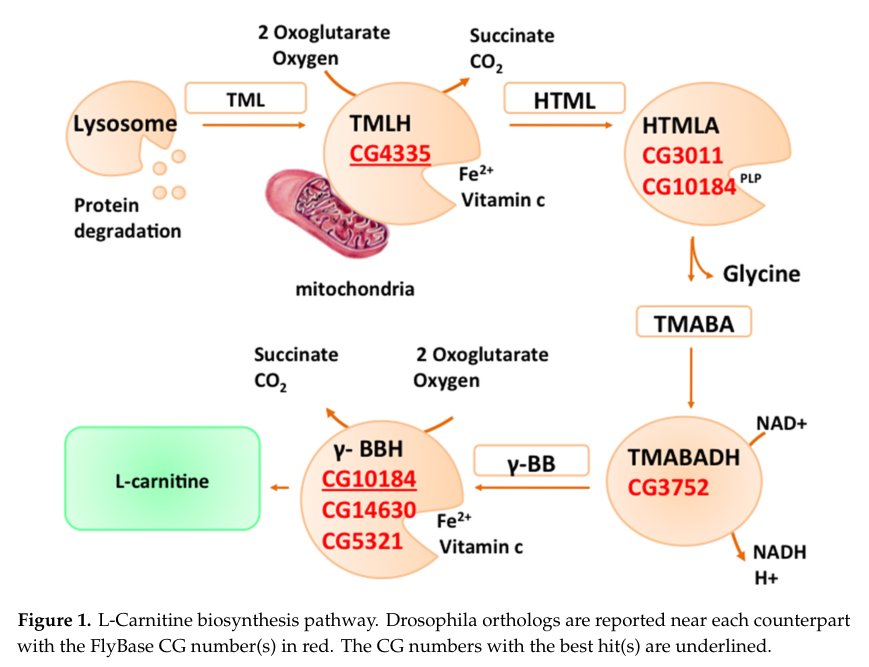

## Question

# Gene Research for Functional Annotation

## ⚠️ CRITICAL: Gene/Protein Identification Context

**BEFORE YOU BEGIN RESEARCH:** You MUST verify you are researching the CORRECT gene/protein. Gene symbols can be ambiguous, especially for less well-characterized genes from non-model organisms.

### Target Gene/Protein Identity (from UniProt):
- **UniProt Accession:** Q9VDM7
- **Protein Description:** RecName: Full=Trimethyllysine dioxygenase, mitochondrial {ECO:0000256|ARBA:ARBA00016835}; EC=1.14.11.8 {ECO:0000256|ARBA:ARBA00012267}; AltName: Full=Epsilon-trimethyllysine 2-oxoglutarate dioxygenase {ECO:0000256|ARBA:ARBA00031778}; AltName: Full=TML hydroxylase {ECO:0000256|ARBA:ARBA00030363}; AltName: Full=TML-alpha-ketoglutarate dioxygenase {ECO:0000256|ARBA:ARBA00032283};
- **Gene Information:** Name=Tmlh {ECO:0000313|EMBL:AAF55763.1, ECO:0000313|FlyBase:FBgn0038795}; Synonyms=Dmel\CG4335 {ECO:0000313|EMBL:AAF55763.1}, TMLH {ECO:0000313|EMBL:AAF55763.1}, TMLHE {ECO:0000313|EMBL:AAF55763.1}; ORFNames=CG4335 {ECO:0000313|EMBL:AAF55763.1, ECO:0000313|FlyBase:FBgn0038795}, Dmel_CG4335 {ECO:0000313|EMBL:AAF55763.1};
- **Organism (full):** Drosophila melanogaster (Fruit fly).
- **Protein Family:** Belongs to the gamma-BBH/TMLD family.
- **Key Domains:** AlphaKG_dependent_hydroxylases. (IPR050411); GBBH-like_N. (IPR010376); GBBH-like_N_sf. (IPR038492); GlaH-like_sf. (IPR042098); TauD/TfdA-like. (IPR003819)

### MANDATORY VERIFICATION STEPS:

1. **Check if the gene symbol "Tmlh" matches the protein description above**
2. **Verify the organism is correct:** Drosophila melanogaster (Fruit fly).
3. **Check if protein family/domains align with what you find in literature**
4. **If you find literature for a DIFFERENT gene with the same or similar symbol, STOP**

### If Gene Symbol is Ambiguous or You Cannot Find Relevant Literature:

**DO NOT PROCEED WITH RESEARCH ON A DIFFERENT GENE.** Instead:
- State clearly: "The gene symbol 'Tmlh' is ambiguous or literature is limited for this specific protein"
- Explain what you found (e.g., "Found extensive literature on a different gene with the same symbol in a different organism")
- Describe the protein based ONLY on the UniProt information provided above
- Suggest that the protein function can be inferred from domain/family information

### Research Target:

Please provide a comprehensive research report on the gene **Tmlh** (gene ID: Tmlh, UniProt: Q9VDM7) in DROME.

The research report should be a detailed narrative explaining the function, biological processes, and localization of the gene product. Citations should be given for all claims.

You should prioritize authoritative reviews and primary scientific literature when conducting research. You can supplement
this with annotations you find in gene/protein databases, but these can be outdated or inaccurate.

We are specifically interested in the primary function of the gene - for enzymes, what reaction is catalyzed, and what is the substrate specificity? For transporters, what is the substrate? For structural proteins or adapters, what is the broader structural role? For signaling molecules, what is the role in the pathway.

We are interested in where in or outside the cell the gene product carries out its function.

We are also interested in the signaling or biochemical pathways in which the gene functions. We are less interested in broad pleiotropic effects, except where these elucidate the precise role.

Include evidence where possible. We are interested in both experimental evidence as well as inference from structure, evolution, or bioinformatic analysis. Precise studies should be prioritized over high-throughput, where available.

## Output

Question: You are an expert researcher providing comprehensive, well-cited information.

Provide detailed information focusing on:
1. Key concepts and definitions with current understanding
2. Recent developments and latest research (prioritize 2023-2024 sources)
3. Current applications and real-world implementations
4. Expert opinions and analysis from authoritative sources
5. Relevant statistics and data from recent studies

Format as a comprehensive research report with proper citations. Include URLs and publication dates where available.
Always prioritize recent, authoritative sources and provide specific citations for all major claims.

# Gene Research for Functional Annotation

## ⚠️ CRITICAL: Gene/Protein Identification Context

**BEFORE YOU BEGIN RESEARCH:** You MUST verify you are researching the CORRECT gene/protein. Gene symbols can be ambiguous, especially for less well-characterized genes from non-model organisms.

### Target Gene/Protein Identity (from UniProt):
- **UniProt Accession:** Q9VDM7
- **Protein Description:** RecName: Full=Trimethyllysine dioxygenase, mitochondrial {ECO:0000256|ARBA:ARBA00016835}; EC=1.14.11.8 {ECO:0000256|ARBA:ARBA00012267}; AltName: Full=Epsilon-trimethyllysine 2-oxoglutarate dioxygenase {ECO:0000256|ARBA:ARBA00031778}; AltName: Full=TML hydroxylase {ECO:0000256|ARBA:ARBA00030363}; AltName: Full=TML-alpha-ketoglutarate dioxygenase {ECO:0000256|ARBA:ARBA00032283};
- **Gene Information:** Name=Tmlh {ECO:0000313|EMBL:AAF55763.1, ECO:0000313|FlyBase:FBgn0038795}; Synonyms=Dmel\CG4335 {ECO:0000313|EMBL:AAF55763.1}, TMLH {ECO:0000313|EMBL:AAF55763.1}, TMLHE {ECO:0000313|EMBL:AAF55763.1}; ORFNames=CG4335 {ECO:0000313|EMBL:AAF55763.1, ECO:0000313|FlyBase:FBgn0038795}, Dmel_CG4335 {ECO:0000313|EMBL:AAF55763.1};
- **Organism (full):** Drosophila melanogaster (Fruit fly).
- **Protein Family:** Belongs to the gamma-BBH/TMLD family.
- **Key Domains:** AlphaKG_dependent_hydroxylases. (IPR050411); GBBH-like_N. (IPR010376); GBBH-like_N_sf. (IPR038492); GlaH-like_sf. (IPR042098); TauD/TfdA-like. (IPR003819)

### MANDATORY VERIFICATION STEPS:

1. **Check if the gene symbol "Tmlh" matches the protein description above**
2. **Verify the organism is correct:** Drosophila melanogaster (Fruit fly).
3. **Check if protein family/domains align with what you find in literature**
4. **If you find literature for a DIFFERENT gene with the same or similar symbol, STOP**

### If Gene Symbol is Ambiguous or You Cannot Find Relevant Literature:

**DO NOT PROCEED WITH RESEARCH ON A DIFFERENT GENE.** Instead:
- State clearly: "The gene symbol 'Tmlh' is ambiguous or literature is limited for this specific protein"
- Explain what you found (e.g., "Found extensive literature on a different gene with the same symbol in a different organism")
- Describe the protein based ONLY on the UniProt information provided above
- Suggest that the protein function can be inferred from domain/family information

### Research Target:

Please provide a comprehensive research report on the gene **Tmlh** (gene ID: Tmlh, UniProt: Q9VDM7) in DROME.

The research report should be a detailed narrative explaining the function, biological processes, and localization of the gene product. Citations should be given for all claims.

You should prioritize authoritative reviews and primary scientific literature when conducting research. You can supplement
this with annotations you find in gene/protein databases, but these can be outdated or inaccurate.

We are specifically interested in the primary function of the gene - for enzymes, what reaction is catalyzed, and what is the substrate specificity? For transporters, what is the substrate? For structural proteins or adapters, what is the broader structural role? For signaling molecules, what is the role in the pathway.

We are interested in where in or outside the cell the gene product carries out its function.

We are also interested in the signaling or biochemical pathways in which the gene functions. We are less interested in broad pleiotropic effects, except where these elucidate the precise role.

Include evidence where possible. We are interested in both experimental evidence as well as inference from structure, evolution, or bioinformatic analysis. Precise studies should be prioritized over high-throughput, where available.

# Functional annotation report: *Drosophila melanogaster* Tmlh (CG4335; Q9VDM7)

## Identity and strength of evidence

**This report concerns the fruit-fly protein Q9VDM7, not human TMLHE.** The supplied UniProt record identifies its gene as **Tmlh**, with the synonym **CG4335**. Independently, a fly-focused review identifies CG4335 as the putative *D. melanogaster* ortholog of human trimethyllysine hydroxylase, and a fly expression study identifies it as **FBgn0038795** and annotates it as a trimethyllysine dioxygenase. The reported **55% protein-sequence similarity** to the human enzyme supports that assignment, but the review explicitly calls fly CG4335 *uncharacterized*. The supplied gamma-BBH/TMLD-family and α-ketoglutarate-dependent-hydroxylase domain annotations are consistent with a dioxygenase; they do not, by themselves, establish its reaction or substrate specificity experimentally. (carillo2020lcarnitineindrosophila pages 3-5, e2020nucleartranslocationability pages 51-53)

**Principal conclusion:** Tmlh is the best-supported *candidate* for the first enzymatic step of de novo L-carnitine biosynthesis in flies. Its precise catalytic activity, intracellular location and contribution to fly carnitine production remain **predictions**, rather than demonstrated properties of isolated fly Q9VDM7. The 2020 expert review explicitly stated that a functional carnitine-biosynthesis pathway had not been described in *D. melanogaster*; the sources retrieved for this report did not establish subsequent fly-specific biochemical validation. (carillo2020lcarnitineindrosophila pages 3-5)

## Predicted molecular function and substrate specificity

The proposed reaction is the **C3 (β-carbon) hydroxylation of free N⁶-trimethyl-L-lysine**, also called ε-N-trimethyl-L-lysine or TML, to **3-hydroxy-N⁶-trimethyl-L-lysine** (HTML):

**TML + 2-oxoglutarate + O₂ → HTML + succinate + CO₂.**

This is the reaction expected of a Fe(II)- and 2-oxoglutarate-dependent trimethyllysine dioxygenase, **EC 1.14.11.8**, as annotated for Q9VDM7 in the supplied UniProt identity. Its assignment to fly Tmlh rests on orthology and enzyme-family inference. In contrast, Hulse and colleagues directly demonstrated hydroxylation of ε-N-trimethyl-L-lysine in **rat liver mitochondria**: the system required α-ketoglutarate, Fe²⁺ and ascorbate, did not require NADH or NADPH, and converted approximately **40%** of supplied TML to hydroxylated product under their reported conditions. Those are *rat experimental results*, not measured activity or kinetic parameters for the fly protein. (carillo2020lcarnitineindrosophila pages 3-5, hulse1978carnitinebiosynthesis.betahydroxylation pages 1-2, hulse1978carnitinebiosynthesis.betahydroxylation pages 2-3)

The physiologically proposed substrate is **free TML**, generated following degradation of proteins containing trimethylated lysine—not a trimethyllysine residue still embedded in a protein. Accordingly, Tmlh is most appropriately interpreted as a candidate **small-molecule biosynthetic enzyme**, not an experimentally established histone demethylase. There is no retrieved fly-Q9VDM7 substrate panel demonstrating selectivity over unmodified lysine, other methyllysines or alternative compounds; those specificity boundaries remain open. (carillo2020lcarnitineindrosophila pages 3-5, hulse1978carnitinebiosynthesis.betahydroxylation pages 1-2)

## Pathway and biological process

The proposed pathway is **protein-derived TML → HTML → γ-trimethylaminobutyraldehyde plus glycine → γ-butyrobetaine → L-carnitine**. Tmlh/CG4335 is placed at the **first hydroxylation**, not at the final γ-butyrobetaine-hydroxylation reaction. The fly-review pathway diagram labels CG4335 at this first step, while explicitly treating the fly gene assignments as putative. Carnitine subsequently supports movement of long-chain fatty-acid acyl groups into mitochondria for β-oxidation; an effect of Tmlh on that process would therefore be **downstream and conditional on its proposed biosynthetic role**, not a demonstrated direct action of the fly protein. (carillo2020lcarnitineindrosophila pages 3-5, e2020nucleartranslocationability pages 21-23, carillo2020lcarnitineindrosophila media 66345ae9)

**Recent pathway clarification, without fly-gene validation:** A peer-reviewed **April 2024** study experimentally found that purified **human SHMT1 and SHMT2**, as well as **mouse Tha1**, catalyze the *next* reaction, cleavage of HTML to trimethylaminobutyraldehyde and glycine. Reported catalytic efficiencies for human SHMT1 and SHMT2 were **32.17 ± 5.34** and **6.23 ± 1.26 s⁻¹ M⁻¹**, respectively; mouse Tha1 had greater HTML-cleavage activity than either human enzyme. These findings improve the comparative understanding of carnitine biosynthesis but **neither assay fly Tmlh nor identify the fly enzyme for that subsequent step**. They illustrate why assigning an entire fly pathway solely from mammalian orthology would be premature. (malatesta2024onesubstratemany pages 5-8, malatesta2024onesubstratemany pages 8-10)

## Cellular localization and fly observations

**Mitochondrial localization is predicted, not directly shown for Q9VDM7.** The CG4335 sequence was reported to contain a consensus mitochondrial-localization sequence. The analogous hydroxylating activity was experimentally associated with rat mitochondria rather than rat liver soluble or microsomal fractions. Neither observation establishes the fly protein’s exact mitochondrial subcompartment or excludes alternative localization in particular fly tissues. (carillo2020lcarnitineindrosophila pages 3-5, hulse1978carnitinebiosynthesis.betahydroxylation pages 1-2)

The clearest retrieved **fly-specific experimental observation** is transcriptional. In Hood and colleagues’ **2020** Lipin nuclear-localization mutant study, CG4335 transcript abundance in **fed LipinΔNLS males** was **1.8-fold lower** than in the comparison group, whereas the corresponding female entry was **“not changed.”** The authors’ table associates the gene with the **fat body** and reports a **blunted male starvation-response comparison of −2.2 versus −1.5**. Fat-body association in that table is *tissue-level annotation*, not evidence that Tmlh protein is located there by imaging. These expression results do not demonstrate direct regulation by Lipin, altered Tmlh enzyme activity, reduced carnitine synthesis or a phenotype caused specifically by a Tmlh lesion. (e2020nucleartranslocationability pages 21-23, e2020nucleartranslocationability pages 51-53, e2020nucleartranslocationability pages 48-51)

The following summary separates the principal types of support rather than treating analogous mammalian experiments as direct evidence for Q9VDM7. (carillo2020lcarnitineindrosophila pages 3-5, hulse1978carnitinebiosynthesis.betahydroxylation pages 1-2, malatesta2024onesubstratemany pages 5-8)

| Claim about *D. melanogaster* Tmlh/CG4335 (Q9VDM7) | Evidence and species | Grade | Interpretation |
|---|---|---|---|
| Identity: Tmlh = CG4335 = FBgn0038795; putative TMLHE ortholog | Fly-focused review identifies CG4335 as the uncharacterized *Drosophila* ortholog candidate, with 55% similarity to human TMLHE; fly RNA-seq independently identifies FBgn0038795/CG4335 as trimethyllysine dioxygenase (carillo2020lcarnitineindrosophila pages 3-5, e2020nucleartranslocationability pages 51-53) | **Moderate–strong** for orthology; **not biochemical validation** | The supplied Q9VDM7 identity is internally consistent with the fly literature; it must not be confused with human TMLHE. |
| Primary reaction: free N6-trimethyl-L-lysine + 2-oxoglutarate + O₂ → 3-hydroxy-N6-trimethyl-L-lysine + succinate + CO₂ | Inferred for the fly protein from orthology and its Fe(II)/2OG oxygenase-family annotation. Rat-liver mitochondria directly hydroxylated free ε-N-trimethyl-L-lysine; activity required Fe²⁺, α-ketoglutarate and ascorbate, and approximately 40% substrate conversion was achieved (hulse1978carnitinebiosynthesis.betahydroxylation pages 1-2, hulse1978carnitinebiosynthesis.betahydroxylation pages 2-3) | **Strong in rat; low–moderate for fly** | This is the best-supported predicted function of Q9VDM7, but no purified-fly-enzyme assay or fly substrate-specificity panel was located. O₂ is part of the dioxygenase reaction; ascorbate commonly maintains catalytic iron in the reduced state. |
| Substrate specificity: free trimethyllysine rather than a protein-bound methyllysine residue | Established for the mammalian mitochondrial enzyme using ε-N-trimethyl-L-lysine; transferred to fly Q9VDM7 by orthology (hulse1978carnitinebiosynthesis.betahydroxylation pages 1-2) | **Strong in rat; inferred in fly** | Q9VDM7 should be annotated as a small-molecule metabolic hydroxylase, not as a demonstrated protein/histone demethylase. Alternative fly substrates have not been experimentally excluded. |
| Mitochondrial localization | CG4335 contains a consensus mitochondrial-targeting sequence; the corresponding biochemical activity was mitochondrial in rat liver and absent from microsomal/soluble fractions (carillo2020lcarnitineindrosophila pages 3-5, hulse1978carnitinebiosynthesis.betahydroxylation pages 1-2) | **Moderate prediction for fly; strong comparative support** | “Mitochondrial” is plausible, but direct Q9VDM7 imaging, fractionation or import experiments were not located; matrix versus membrane subcompartment remains unverified in flies. |
| Pathway role: first committed transformation in de novo carnitine biosynthesis | Fly review places CG4335 at TML → hydroxy-TML but explicitly states that a functional carnitine-biosynthesis pathway had not been demonstrated in *D. melanogaster* (carillo2020lcarnitineindrosophila pages 3-5, carillo2020lcarnitineindrosophila media 66345ae9) | **Moderate pathway inference; low direct fly validation** | The predicted sequence is TML → hydroxy-TML → TMABA + glycine → γ-butyrobetaine → L-carnitine. Consequently, effects on carnitine-dependent fatty-acid oxidation are plausible downstream consequences, not established CG4335 phenotypes. |
| Nutrient/metabolic regulation in flies | Whole-animal RNA-seq found CG4335 transcript **−1.8-fold in fed LipinΔNLS males** and **not changed in females**; it was assigned primarily to fat body. Its male starvation response was blunted (reported comparison −2.2 versus −1.5) (e2020nucleartranslocationability pages 51-53, e2020nucleartranslocationability pages 48-51) | **Strong expression association; no causal evidence** | This supports sex- and nutrient-state-dependent transcriptional association with lipid metabolism. It does not show direct Lipin binding or that CG4335 causes the LipinΔNLS metabolic phenotype. |
| 2024 clarification of the next pathway step (HTMLA) | Purified **human SHMT1/SHMT2** and **mouse Tha1**, not fly Q9VDM7, cleaved hydroxy-TML to TMABA and glycine. Human SHMT1 and SHMT2 showed catalytic efficiencies of 32.17 ± 5.34 and 6.23 ± 1.26 s⁻¹ M⁻¹, respectively; mouse Tha1 was more active (malatesta2024onesubstratemany pages 5-8, malatesta2024onesubstratemany pages 8-10) | **Strong for mammals; indirect for fly pathway** | This recent work updates comparative pathway annotation downstream of Tmlh but neither tests CG4335 nor identifies the fly HTMLA conclusively. It reinforces the need to validate each fly pathway step experimentally. |

*Table: Evidence levels for the proposed identity, reaction, localization, pathway role and regulation of fly Tmlh/CG4335. The table explicitly separates fly RNA-seq and sequence inference from rat enzyme biochemistry and 2024 mammalian pathway validation.*

## Research status and practical interpretation

**No established Tmlh-directed clinical application or validated fly-specific intervention emerged from the retrieved literature.** Its current research use is chiefly as a **candidate metabolic gene** in fly carnitine-pathway models and as an annotated transcript in nutrient-response studies; findings concerning human TMLHE or other pathway enzymes cannot be assigned automatically to fly Q9VDM7. The decisive tests would be recombinant-fly-protein conversion of isotopically labeled *free* TML to HTML with appropriate cofactor and alternative-substrate controls, followed by fly Tmlh perturbation/rescue, metabolite tracing and direct subcellular localization. Those are proposed validation experiments, **not completed studies reported here**. (carillo2020lcarnitineindrosophila pages 3-5, e2020nucleartranslocationability pages 21-23, malatesta2024onesubstratemany pages 5-8)

### Principal sources and publication dates

- Carillo *et al.* **December 2020**, “L-Carnitine in Drosophila: A Review,” *Antioxidants* **9**, 1310. [https://doi.org/10.3390/antiox9121310](https://doi.org/10.3390/antiox9121310). Fly CG4335 identification, localization prediction and explicit pathway-validation caveat. (carillo2020lcarnitineindrosophila pages 3-5)
- Hood *et al.* **September 2020**, “Nuclear translocation ability of Lipin differentially affects gene expression and survival in fed and fasting Drosophila,” *Journal of Lipid Research* **61**, 1720–1732. [https://doi.org/10.1194/jlr.ra120001051](https://doi.org/10.1194/jlr.ra120001051). Primary fly CG4335 expression data. (e2020nucleartranslocationability pages 51-53, e2020nucleartranslocationability pages 48-51)
- Malatesta *et al.* **April 2024**, “One substrate–many enzymes virtual screening uncovers missing genes of carnitine biosynthesis in human and mouse,” *Nature Communications* **15**. [https://doi.org/10.1038/s41467-024-47466-3](https://doi.org/10.1038/s41467-024-47466-3). Experimental assignment of the **downstream HTML-cleavage step in mammals**. (malatesta2024onesubstratemany pages 5-8)
- Hulse, Ellis and Henderson. **March 1978**, “Carnitine biosynthesis: β-hydroxylation of trimethyllysine by an α-ketoglutarate-dependent mitochondrial dioxygenase,” *Journal of Biological Chemistry* **253**, 1654–1659. [https://doi.org/10.1016/S0021-9258(17)34915-3](https://doi.org/10.1016/S0021-9258(17)34915-3). Primary **rat**, not fly, biochemical evidence for the proposed Tmlh reaction. (hulse1978carnitinebiosynthesis.betahydroxylation pages 1-2)

References

1. (carillo2020lcarnitineindrosophila pages 3-5): Maria Rosaria Carillo, Carla Bertapelle, Filippo Scialò, Mario Siervo, Gianrico Spagnuolo, Michele Simeone, Gianfranco Peluso, and Filomena Anna Digilio. L-carnitine in drosophila: a review. Antioxidants, 9:1310, Dec 2020. URL: https://doi.org/10.3390/antiox9121310, doi:10.3390/antiox9121310. This article has 42 citations.

2. (e2020nucleartranslocationability pages 51-53): Stephanie E Hood, Xeniya V Kofler, Quiyu Chen, Judah Scott, Jason Ortega, and Michael Lehmann. Nuclear translocation ability of lipin differentially affects gene expression and survival in fed and fasting drosophila. Journal of Lipid Research, 61:1720-1732, Sep 2020. URL: https://doi.org/10.1194/jlr.ra120001051, doi:10.1194/jlr.ra120001051. This article has 23 citations and is from a peer-reviewed journal.

3. (hulse1978carnitinebiosynthesis.betahydroxylation pages 1-2): J.D. Hulse, S.R. Ellis, and L.M. Henderson. Carnitine biosynthesis. beta-hydroxylation of trimethyllysine by an alpha-ketoglutarate-dependent mitochondrial dioxygenase. Journal of Biological Chemistry, 253:1654-1659, Mar 1978. URL: https://doi.org/10.1016/s0021-9258(17)34915-3, doi:10.1016/s0021-9258(17)34915-3. This article has 265 citations and is from a domain leading peer-reviewed journal.

4. (hulse1978carnitinebiosynthesis.betahydroxylation pages 2-3): J.D. Hulse, S.R. Ellis, and L.M. Henderson. Carnitine biosynthesis. beta-hydroxylation of trimethyllysine by an alpha-ketoglutarate-dependent mitochondrial dioxygenase. Journal of Biological Chemistry, 253:1654-1659, Mar 1978. URL: https://doi.org/10.1016/s0021-9258(17)34915-3, doi:10.1016/s0021-9258(17)34915-3. This article has 265 citations and is from a domain leading peer-reviewed journal.

5. (e2020nucleartranslocationability pages 21-23): Stephanie E Hood, Xeniya V Kofler, Quiyu Chen, Judah Scott, Jason Ortega, and Michael Lehmann. Nuclear translocation ability of lipin differentially affects gene expression and survival in fed and fasting drosophila. Journal of Lipid Research, 61:1720-1732, Sep 2020. URL: https://doi.org/10.1194/jlr.ra120001051, doi:10.1194/jlr.ra120001051. This article has 23 citations and is from a peer-reviewed journal.

6. (carillo2020lcarnitineindrosophila media 66345ae9): Maria Rosaria Carillo, Carla Bertapelle, Filippo Scialò, Mario Siervo, Gianrico Spagnuolo, Michele Simeone, Gianfranco Peluso, and Filomena Anna Digilio. L-carnitine in drosophila: a review. Antioxidants, 9:1310, Dec 2020. URL: https://doi.org/10.3390/antiox9121310, doi:10.3390/antiox9121310. This article has 42 citations.

7. (malatesta2024onesubstratemany pages 5-8): Marco Malatesta, Emanuele Fornasier, M. D. di Salvo, A. Tramonti, Erika Zangelmi, A. Peracchi, Andrea Secchi, Eugenia Polverini, Gabriele Giachin, Roberto Battistutta, R. Contestabile, and Riccardo Percudani. One substrate many enzymes virtual screening uncovers missing genes of carnitine biosynthesis in human and mouse. Nature Communications, Apr 2024. URL: https://doi.org/10.1038/s41467-024-47466-3, doi:10.1038/s41467-024-47466-3. This article has 15 citations and is from a highest quality peer-reviewed journal.

8. (malatesta2024onesubstratemany pages 8-10): Marco Malatesta, Emanuele Fornasier, M. D. di Salvo, A. Tramonti, Erika Zangelmi, A. Peracchi, Andrea Secchi, Eugenia Polverini, Gabriele Giachin, Roberto Battistutta, R. Contestabile, and Riccardo Percudani. One substrate many enzymes virtual screening uncovers missing genes of carnitine biosynthesis in human and mouse. Nature Communications, Apr 2024. URL: https://doi.org/10.1038/s41467-024-47466-3, doi:10.1038/s41467-024-47466-3. This article has 15 citations and is from a highest quality peer-reviewed journal.

9. (e2020nucleartranslocationability pages 48-51): Stephanie E Hood, Xeniya V Kofler, Quiyu Chen, Judah Scott, Jason Ortega, and Michael Lehmann. Nuclear translocation ability of lipin differentially affects gene expression and survival in fed and fasting drosophila. Journal of Lipid Research, 61:1720-1732, Sep 2020. URL: https://doi.org/10.1194/jlr.ra120001051, doi:10.1194/jlr.ra120001051. This article has 23 citations and is from a peer-reviewed journal.

## Artifacts

- [Edison artifact artifact-00](Tmlh-deep-research-falcon_artifacts/artifact-00.md)

## Citations

1. carillo2020lcarnitineindrosophila pages 3-5
2. malatesta2024onesubstratemany pages 5-8
3. e2020nucleartranslocationability pages 51-53
4. e2020nucleartranslocationability pages 21-23
5. malatesta2024onesubstratemany pages 8-10
6. e2020nucleartranslocationability pages 48-51
7. https://doi.org/10.3390/antiox9121310
8. https://doi.org/10.1194/jlr.ra120001051
9. https://doi.org/10.1038/s41467-024-47466-3
10. https://doi.org/10.1016/S0021-9258(17)34915-3
11. https://doi.org/10.3390/antiox9121310](https://doi.org/10.3390/antiox9121310
12. https://doi.org/10.1194/jlr.ra120001051](https://doi.org/10.1194/jlr.ra120001051
13. https://doi.org/10.1038/s41467-024-47466-3](https://doi.org/10.1038/s41467-024-47466-3
14. https://doi.org/10.1016/S0021-9258(17
15. https://doi.org/10.3390/antiox9121310,
16. https://doi.org/10.1194/jlr.ra120001051,
17. https://doi.org/10.1016/s0021-9258(17
18. https://doi.org/10.1038/s41467-024-47466-3,