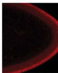

## Question

# Gene Research for Functional Annotation

## ⚠️ CRITICAL: Gene/Protein Identification Context

**BEFORE YOU BEGIN RESEARCH:** You MUST verify you are researching the CORRECT gene/protein. Gene symbols can be ambiguous, especially for less well-characterized genes from non-model organisms.

### Target Gene/Protein Identity (from UniProt):
- **UniProt Accession:** O96651
- **Protein Description:** RecName: Full=DNA topoisomerase 3-beta; EC=5.6.2.1 {ECO:0000255|PROSITE-ProRule:PRU10131}; AltName: Full=DNA topoisomerase III beta;
- **Gene Information:** Name=Top3beta; Synonyms=TOP3; ORFNames=CG3458;
- **Organism (full):** Drosophila melanogaster (Fruit fly).
- **Protein Family:** Belongs to the type IA topoisomerase family.
- **Key Domains:** Topo_IA. (IPR000380); Topo_IA_2. (IPR003601); Topo_IA_AS. (IPR023406); Topo_IA_cen. (IPR013497); Topo_IA_cen_sub1. (IPR013824)

### MANDATORY VERIFICATION STEPS:

1. **Check if the gene symbol "Top3beta" matches the protein description above**
2. **Verify the organism is correct:** Drosophila melanogaster (Fruit fly).
3. **Check if protein family/domains align with what you find in literature**
4. **If you find literature for a DIFFERENT gene with the same or similar symbol, STOP**

### If Gene Symbol is Ambiguous or You Cannot Find Relevant Literature:

**DO NOT PROCEED WITH RESEARCH ON A DIFFERENT GENE.** Instead:
- State clearly: "The gene symbol 'Top3beta' is ambiguous or literature is limited for this specific protein"
- Explain what you found (e.g., "Found extensive literature on a different gene with the same symbol in a different organism")
- Describe the protein based ONLY on the UniProt information provided above
- Suggest that the protein function can be inferred from domain/family information

### Research Target:

Please provide a comprehensive research report on the gene **Top3beta** (gene ID: Top3beta, UniProt: O96651) in DROME.

The research report should be a detailed narrative explaining the function, biological processes, and localization of the gene product. Citations should be given for all claims.

You should prioritize authoritative reviews and primary scientific literature when conducting research. You can supplement
this with annotations you find in gene/protein databases, but these can be outdated or inaccurate.

We are specifically interested in the primary function of the gene - for enzymes, what reaction is catalyzed, and what is the substrate specificity? For transporters, what is the substrate? For structural proteins or adapters, what is the broader structural role? For signaling molecules, what is the role in the pathway.

We are interested in where in or outside the cell the gene product carries out its function.

We are also interested in the signaling or biochemical pathways in which the gene functions. We are less interested in broad pleiotropic effects, except where these elucidate the precise role.

Include evidence where possible. We are interested in both experimental evidence as well as inference from structure, evolution, or bioinformatic analysis. Precise studies should be prioritized over high-throughput, where available.

## Output

Question: You are an expert researcher providing comprehensive, well-cited information.

Provide detailed information focusing on:
1. Key concepts and definitions with current understanding
2. Recent developments and latest research (prioritize 2023-2024 sources)
3. Current applications and real-world implementations
4. Expert opinions and analysis from authoritative sources
5. Relevant statistics and data from recent studies

Format as a comprehensive research report with proper citations. Include URLs and publication dates where available.
Always prioritize recent, authoritative sources and provide specific citations for all major claims.

# Gene Research for Functional Annotation

## ⚠️ CRITICAL: Gene/Protein Identification Context

**BEFORE YOU BEGIN RESEARCH:** You MUST verify you are researching the CORRECT gene/protein. Gene symbols can be ambiguous, especially for less well-characterized genes from non-model organisms.

### Target Gene/Protein Identity (from UniProt):
- **UniProt Accession:** O96651
- **Protein Description:** RecName: Full=DNA topoisomerase 3-beta; EC=5.6.2.1 {ECO:0000255|PROSITE-ProRule:PRU10131}; AltName: Full=DNA topoisomerase III beta;
- **Gene Information:** Name=Top3beta; Synonyms=TOP3; ORFNames=CG3458;
- **Organism (full):** Drosophila melanogaster (Fruit fly).
- **Protein Family:** Belongs to the type IA topoisomerase family.
- **Key Domains:** Topo_IA. (IPR000380); Topo_IA_2. (IPR003601); Topo_IA_AS. (IPR023406); Topo_IA_cen. (IPR013497); Topo_IA_cen_sub1. (IPR013824)

### MANDATORY VERIFICATION STEPS:

1. **Check if the gene symbol "Top3beta" matches the protein description above**
2. **Verify the organism is correct:** Drosophila melanogaster (Fruit fly).
3. **Check if protein family/domains align with what you find in literature**
4. **If you find literature for a DIFFERENT gene with the same or similar symbol, STOP**

### If Gene Symbol is Ambiguous or You Cannot Find Relevant Literature:

**DO NOT PROCEED WITH RESEARCH ON A DIFFERENT GENE.** Instead:
- State clearly: "The gene symbol 'Top3beta' is ambiguous or literature is limited for this specific protein"
- Explain what you found (e.g., "Found extensive literature on a different gene with the same symbol in a different organism")
- Describe the protein based ONLY on the UniProt information provided above
- Suggest that the protein function can be inferred from domain/family information

### Research Target:

Please provide a comprehensive research report on the gene **Top3beta** (gene ID: Top3beta, UniProt: O96651) in DROME.

The research report should be a detailed narrative explaining the function, biological processes, and localization of the gene product. Citations should be given for all claims.

You should prioritize authoritative reviews and primary scientific literature when conducting research. You can supplement
this with annotations you find in gene/protein databases, but these can be outdated or inaccurate.

We are specifically interested in the primary function of the gene - for enzymes, what reaction is catalyzed, and what is the substrate specificity? For transporters, what is the substrate? For structural proteins or adapters, what is the broader structural role? For signaling molecules, what is the role in the pathway.

We are interested in where in or outside the cell the gene product carries out its function.

We are also interested in the signaling or biochemical pathways in which the gene functions. We are less interested in broad pleiotropic effects, except where these elucidate the precise role.

Include evidence where possible. We are interested in both experimental evidence as well as inference from structure, evolution, or bioinformatic analysis. Precise studies should be prioritized over high-throughput, where available.

# Functional annotation of *Drosophila melanogaster* Top3beta

## Identity and conclusion

**Identity check.** This report concerns the fruit-fly gene **Top3beta** (also written Top3β or Top3b), specified in the question as **CG3458; UniProt O96651**. A fly-specific study identifies the gene as **FlyBase FBgn0026015**. Its experimentally characterized protein has the catalytic tyrosine **Y332** and an RNA-associated **RGG region**, consistent with the supplied type-IA topoisomerase domain annotation. It is **not Top3α**: the fly study distinguishes that DNA-topoisomerase paralogue from RGG-containing Top3β. The CG3458–O96651 mapping is taken from the supplied UniProt identity; the papers examined did not independently print both identifiers. (teimuri2025drosophilatopoisomerase3β pages 1-2, siaw2016dnaandrna pages 1-2)

**Primary function.** Fly Top3β is a **dual DNA/RNA type-IA topoisomerase**. Its demonstrated biochemical role is to change nucleic-acid topology by transiently cleaving one DNA or RNA strand at a catalytic tyrosine, allowing strand passage, and rejoining the strand. It relaxes highly negatively supercoiled DNA and catalyzes strand passage between RNA circles *in vitro*. Its best-supported cellular roles are regulation of selected long mRNAs and participation in RNA-guided transposon silencing; which individual physiological phenotypes arise from catalysis on DNA rather than RNA is not always resolved. (siaw2016dnaandrna pages 1-2, siaw2016dnaandrna pages 4-5, teimuri2025drosophilatopoisomerase3β pages 7-8, tan2024variationofstructure pages 12-14)

## Reaction, substrates and specificity

Type-IA catalysis forms a transient **5′-phosphotyrosyl enzyme–nucleic-acid intermediate**. Passage of another nucleic-acid segment through the break changes linking or entanglement; religation restores strand continuity. Unlike a nuclease, a topoisomerase is not defined by permanent cutting of its substrate. The fly **Y332F** substitution removes the tyrosine hydroxyl required for covalent attachment and abolishes the assayed RNA strand-passage reaction. The conserved type-IA core, together with an RGG-containing region that contributes to RNA/protein interactions, explains why the supplied Topo_IA-family annotation fits this protein. (teimuri2025drosophilatopoisomerase3β pages 5-7, siaw2016dnaandrna pages 4-5, teimuri2025drosophilatopoisomerase3β pages 1-2, tan2024variationofstructure pages 9-11)

Purified *Drosophila* Top3β relaxes **hypernegatively supercoiled plasmid DNA**, a substrate containing underwound, locally single-stranded regions. Its binding partner **TDRD3** stimulates relaxation and changes the reaction from predominantly distributive to more processive. On RNA, Top3β converts two complementary **single-stranded circular RNAs** into an interlinked, double-stranded circular product; TDRD3 enhances this reaction, whereas Top3β-Y332F does not produce the product. These experiments directly establish activity on **both DNA and RNA**, but the circular RNAs were engineered assay substrates, not proof that a particular circular RNA is its natural target. TDRD3 preferentially binds single-stranded over duplex DNA and RNA, offering a plausible means of directing Top3β to accessible substrate regions rather than establishing an RNA-sequence motif. (siaw2016dnaandrna pages 2-3, siaw2016dnaandrna pages 4-5, siaw2016dnaandrna pages 3-4)

The strongest recent evidence for endogenous RNA engagement comes from **0–2-hour fly embryos**. Teimuri and Suter compared immunopurified wild-type Top3β–GFP with Y332F–GFP under conditions intended to retain covalent RNA intermediates while removing noncovalently associated RNA. They reported **46 candidate embryonic RNA targets** meeting their enrichment criteria; longer, complex transcripts, particularly those with long untranslated regions, were favored. This is evidence for Y332-dependent target engagement, **not direct observation of a completed strand-passage reaction on each mRNA**. No exclusive natural RNA sequence or definitive ranking of DNA versus RNA as the enzyme’s primary *in vivo* substrate has been established for the fly. (teimuri2025drosophilatopoisomerase3β pages 5-7, teimuri2025drosophilatopoisomerase3β pages 7-8, tan2024variationofstructure pages 12-14)

The evidence by role and compartment is summarized below. (siaw2016dnaandrna pages 4-5, teimuri2025drosophilatopoisomerase3β pages 8-10, lee2025topoisomerase3bfacilitates pages 5-7)

| Molecular role/site | Strong direct fly evidence | Limitations |
|---|---|---|
| **DNA topology — nucleus** | Purified *Drosophila* Top3β relaxed hypernegatively supercoiled plasmid DNA *in vitro*. TDRD3 stimulated relaxation and changed the reaction from distributive to processive. Top3β was also detected in embryonic nuclei. [Siaw et al., 2016](https://doi.org/10.1073/pnas.1605517113); [Teimuri & Suter, 2025](https://doi.org/10.1371/journal.pone.0318142) (siaw2016dnaandrna pages 2-3, teimuri2025drosophilatopoisomerase3β pages 8-10) | The plasmid assay establishes DNA-topoisomerase capability, but nuclear chromatin phenotypes have not been assigned definitively to catalysis on DNA rather than RNA or R-loops. |
| **RNA catalysis — principally cytoplasmic contexts** | Fly Top3β catalyzed Y332-dependent intermolecular strand passage between complementary single-stranded circular RNAs, producing double-stranded circular RNA; Y332F was inactive and TDRD3 enhanced the reaction. [Siaw et al., 2016](https://doi.org/10.1073/pnas.1605517113) (siaw2016dnaandrna pages 4-5) | The substrate was engineered circular RNA, not a natural fly transcript. The assay proves RNA-topoisomerase activity but not the topology or identity of physiological RNA substrates. |
| **mRNA regulation — embryo cytoplasm and cortex** | Detergent-resistant Top3β–GFP RNA-IP versus Y332F identified **46 candidate embryonic RNAs**, enriched for long, complex transcripts. Top3β loss or Y332F altered *shot* RNA and Shot, Dhc64C and Kst protein localization. Of **677** isoforms altered in the null, **453 (67%)** were reduced; **211/289 (73%)** altered in Y332F were reduced. [Teimuri & Suter, 2025](https://doi.org/10.1371/journal.pone.0318142) (teimuri2025drosophilatopoisomerase3β pages 7-8, teimuri2025drosophilatopoisomerase3β pages 5-7, teimuri2025drosophilatopoisomerase3β pages 3-5, teimuri2025drosophilatopoisomerase3β pages 8-10) | Covalent-capture enrichment makes these stronger candidates than ordinary RIP targets, but it does not prove complete strand passage on each RNA. Transcriptome changes can be indirect or reflect effects during oogenesis, processing, localization, translation, or decay. |
| **siRNA/RISC–heterochromatin — nucleus** | Top3β–TDRD3 associated with AGO2-, p68-, and FMRP-containing machinery. Top3β mutants suppressed position-effect variegation, reduced locus-specific HP1 recruitment, and derepressed heterochromatic genes and transposable elements. Wild-type—but not catalytic Y332F or RNA-binding-defective C660R/RGG-mutant Top3β—rescued HP1 recruitment and repression of *Doc* and *gypsy1*. [Lee et al., 2018](https://doi.org/10.1038/s41467-018-07101-4) (lee2018topoisomerase3βinteracts pages 2-4, lee2018topoisomerase3βinteracts pages 5-6, lee2018topoisomerase3βinteracts pages 8-9, lee2018topoisomerase3βinteracts pages 12-14, lee2018topoisomerase3βinteracts pages 11-12) | These data establish catalytic and RNA-binding requirements but do not identify the cleaved nucleic acid or prove that RNA cleavage is the sole cause. PEV effects are locus dependent, and AGO2’s requirement in fly heterochromatin remains debated. |
| **piRNA biogenesis and TE silencing — germ-cell cytoplasm** | Top3β–TDRD3 associated with Aub and other piRNA factors. Top3β loss or Y332F left nascent *burdock–lacZ* RNA unchanged but increased mature RNA **2.5–3-fold**, supporting defective post-transcriptional silencing. Mutants reduced germline piRNA abundance and ping-pong signatures and showed stronger phenotypes with piRNA-factor mutations. [Lee et al., 2025](https://doi.org/10.1016/j.celrep.2025.115495) (lee2025topoisomerase3bfacilitates pages 3-5, lee2025topoisomerase3bfacilitates pages 5-7, lee2025topoisomerase3bfacilitates pages 10-12, lee2025topoisomerase3bfacilitates pages 8-10) | Top3β was predominantly cytoplasmic but, unlike TDRD3, was **not enriched in the nuage**. Effects were modest relative to core piRNA mutants and strongest for selected long, highly expressed transposable elements; direct topological remodeling of natural transposable-element RNA remains inferred. |
| **Neuronal mRNA translation and maintenance — polyribosomes/NMJ** | Top3β physically associates with TDRD3 and FMR1/FMRP; TDRD3 is required for fly Top3β association with polyribosomes. Top3β-null flies have abnormal neuromuscular junctions, and aging null or Y332F flies show progressive denervation and locomotor decline beginning around week 6. [Xu et al., 2013](https://doi.org/10.1038/nn.3479); [Ahmad et al., 2016](https://doi.org/10.1093/nar/gkw508); [Teimuri & Suter, 2025](https://doi.org/10.1371/journal.pone.0318142) (xu2013top3βisan pages 10-13, ahmad2016rnatopoisomeraseis pages 10-11, teimuri2025drosophilatopoisomerase3β pages 10-13, teimuri2025drosophilatopoisomerase3β pages 13-14) | The associations and phenotypes support neuronal relevance, but no single neuronal RNA-topology reaction has been shown to cause the NMJ or aging defects. DNA activity and noncatalytic scaffolding may also contribute. |

*Table: Evidence hierarchy for Drosophila melanogaster Top3β (UniProt O96651), separating direct fly findings from mechanistic limitations. The table covers catalytic substrates, cellular sites, RNA-silencing pathways, mRNA regulation, and neuronal phenotypes.*

## Cellular location and pathways

**Cytoplasm and translating ribonucleoprotein complexes.** Fly Top3β associates with **polyribosome fractions** in S2 cells; disrupting ribosomes with EDTA weakens that association, and loss of **TDRD3** strongly reduces Top3β—but not FMRP—in those fractions. Thus, TDRD3-dependent access to translating mRNPs is experimentally supported, although polysome association alone does not establish the reaction occurring there. In embryos, Top3β is present in the cytoplasm and enriched toward the **apical cortex**, where some affected RNAs or encoded proteins accumulate. Its interaction with the RNA-granule protein **Me31B** depends on the RGG region. (ahmad2016rnatopoisomeraseis pages 10-11, teimuri2025drosophilatopoisomerase3β pages 18-19, teimuri2025drosophilatopoisomerase3β pages 8-10)

**Nucleus and chromatin.** Embryonic Top3β is also detected in nuclei. In the published embryonic localization experiment, wild-type and Y332F proteins occur in both nucleus and cytoplasm, whereas the ΔRGG protein is detected above background principally in cytoplasm; this implicates the RGG region in nuclear localization in that setting. The relevant cropped **Figure 3** panels independently support this compartment assignment. No evidence identified here establishes Top3β as an extracellular protein or assigns it a mitochondrial function; mitochondrial roles attributed to Top3α should not be transferred to Top3β. (teimuri2025drosophilatopoisomerase3β pages 8-10, teimuri2025drosophilatopoisomerase3β media 38527397, teimuri2025drosophilatopoisomerase3β pages 1-2, tan2024variationofstructure pages 12-14)

**mRNA expression and localization.** In the 2025 embryo study, **677 transcript isoforms** differed between Top3β-null and wild-type embryos at the authors’ thresholds; **453/677 (67%)** were reduced. Of **289** changed isoforms in the catalytic Y332F mutant, **211 (73%)** were reduced. The preferential involvement of long transcripts and catalytic-mutant effects support a role in maintaining expression of particular mRNAs. More targeted experiments found reduced or misplaced **shot** RNA and Shot protein and disturbed localization or accumulation of **Dhc64C** and **Kst** protein in null or Y332F embryos. Because these are largely maternally supplied RNAs, the expression results may incorporate effects during oogenesis, RNA processing and decay as well as embryo-localized activity; they do not establish direct catalysis for all 677 isoforms. Altered isoform patterns suggest possible nuclear RNA-processing contributions but are not, by themselves, proof of direct splicing catalysis. (teimuri2025drosophilatopoisomerase3β pages 3-5, teimuri2025drosophilatopoisomerase3β pages 8-10, teimuri2025drosophilatopoisomerase3β pages 5-7)

**Heterochromatin and siRNA-associated silencing.** In fly cells, Top3β–TDRD3 associates biochemically with components of **AGO2-containing RISC**, including the RNA helicase p68, and with FMRP-associated proteins. In flies, Top3β mutations alter **position-effect variegation**, reduce recruitment of heterochromatin protein **HP1** at affected regions, and derepress particular heterochromatic genes and transposable elements. Wild-type Top3β rescues tested HP1 and transposon-silencing defects more effectively than catalytic **Y332F** or RNA-binding-defective variants. In a genome-wide comparison, altered HP1 islands comprised **23.6%** of those assessed in Top3β mutants versus **43.3%** in AGO2 mutants. These results support participation in RNA-guided chromatin silencing, **not a demonstrated requirement to cleave a specific siRNA**; the relation between AGO2 and fly heterochromatin is also reported as context-dependent or contested. (lee2018topoisomerase3βinteracts pages 2-4, lee2018topoisomerase3βinteracts pages 5-6, lee2018topoisomerase3βinteracts pages 8-9, lee2018topoisomerase3βinteracts pages 12-14, lee2025topoisomerase3bfacilitates pages 1-3)

**Germline piRNA pathway—new fly evidence.** A 2025 *Cell Reports* study found Top3β–TDRD3 mainly in the **ovarian cytoplasm**, with Top3β signal approximately **1.8-fold higher in cytoplasm than nucleus** in the quantified cells. TDRD3, **not Top3β itself**, was enriched in the perinuclear **nuage**. The complex associated with piRNA-pathway factors including **Aub** and **Piwi**. Top3β bound a *burdock* transposon reporter transcript; Top3β loss or Y332F increased its **mature RNA approximately 2.5–3-fold without a comparable increase in nascent RNA**, identifying a post-transcriptional silencing defect in this assay. Germline piRNA levels and ping-pong signatures were impaired, particularly in combinations with piRNA-factor mutations; effects favored **long, highly expressed transposable elements** and included reduced sense piRNAs. Top3β promotes this pathway but is not interchangeable with core piRNA biogenesis factors. The proposal that it resolves entangled transposon RNA during processing remains a mechanistic inference. (lee2025topoisomerase3bfacilitates pages 3-5, lee2025topoisomerase3bfacilitates pages 1-3, lee2025topoisomerase3bfacilitates pages 5-7, lee2025topoisomerase3bfacilitates pages 7-8, lee2025topoisomerase3bfacilitates pages 10-12, lee2025topoisomerase3bfacilitates pages 8-10)

**Neuronal relevance.** Earlier fly experiments identified biochemical and genetic connections among Top3β, **TDRD3 and FMR1/FMRP** and associated Top3β loss with abnormal neuromuscular-junction development; the 2025 study additionally found progressive adult junction deterioration and reduced climbing performance in null and Y332F flies, apparent from about **week 6**. These phenotypes make neuronal mRNA regulation a relevant application of the fly model, but do not identify one necessary RNA substrate or exclude contributions from DNA catalysis and noncatalytic protein-complex functions. (xu2013top3βisan pages 10-13, teimuri2025drosophilatopoisomerase3β pages 10-13, teimuri2025drosophilatopoisomerase3β pages 13-14, warrick2025unravelingtherole pages 10-12)

## Assessment and source chronology

The **2024 type-IA topoisomerase review** supports the dual-substrate framework while emphasizing that protein partners and RNA structure may govern cellular substrate choice and that physiological RNA-topology mechanisms remain incompletely resolved. The fly mRNA study circulated as a **2023/2024 bioRxiv preprint**, but its **peer-reviewed version was published 11 February 2025**; conclusions and numerical results above are attributed to that final version. The germline piRNA findings appeared **22 April 2025**. These later fly-specific experiments provide more precise functional annotation than assigning all phenotypes to DNA supercoil relaxation simply because the UniProt description says “DNA topoisomerase.” Neither study constitutes a clinical deployment: their real-world implementation is as **genetic and biochemical fly models** for RNA regulation, germ-cell transposon control and neuronal phenotypes. (tan2024variationofstructure pages 12-14, tan2024variationofstructure pages 14-15, teimuri2025drosophilatopoisomerase3β pages 1-2, lee2025topoisomerase3bfacilitates pages 1-3)

**Principal sources, with publication dates and URLs:** Tan and Tse-Dinh, *Cells*, March 2024, https://doi.org/10.3390/cells13060553; Teimuri and Suter, *PLOS ONE*, **11 February 2025**, https://doi.org/10.1371/journal.pone.0318142 (earlier preprint: https://doi.org/10.1101/2023.05.25.542246); Lee and colleagues, *Cell Reports*, **22 April 2025**, https://doi.org/10.1016/j.celrep.2025.115495; Lee and colleagues, *Nature Communications*, November 2018, https://doi.org/10.1038/s41467-018-07101-4; Siaw and colleagues, *PNAS*, published online **31 August 2016**, https://doi.org/10.1073/pnas.1605517113; Ahmad and colleagues, *Nucleic Acids Research*, June 2016, https://doi.org/10.1093/nar/gkw508; Xu and colleagues, *Nature Neuroscience*, August 2013, https://doi.org/10.1038/nn.3479. (tan2024variationofstructure pages 12-14, teimuri2025drosophilatopoisomerase3β pages 1-2, lee2025topoisomerase3bfacilitates pages 1-3, lee2018topoisomerase3βinteracts pages 2-4, siaw2016dnaandrna pages 1-2, ahmad2016rnatopoisomeraseis pages 10-11, xu2013top3βisan pages 10-13)

References

1. (teimuri2025drosophilatopoisomerase3β pages 1-2): Shohreh Teimuri and Beat Suter. Drosophila topoisomerase 3β binds to mrnas in vivo, contributes to their localization and stability, and counteracts premature aging. PLOS One, 20:e0318142, Feb 2025. URL: https://doi.org/10.1371/journal.pone.0318142, doi:10.1371/journal.pone.0318142. This article has 4 citations and is from a peer-reviewed journal.

2. (siaw2016dnaandrna pages 1-2): Grace Ee-Lu Siaw, I-Fen Liu, Po-Yen Lin, Michael D. Been, and Tao-shih Hsieh. Dna and rna topoisomerase activities of top3β are promoted by mediator protein tudor domain-containing protein 3. Proceedings of the National Academy of Sciences, 113:E5544-E5551, Aug 2016. URL: https://doi.org/10.1073/pnas.1605517113, doi:10.1073/pnas.1605517113. This article has 58 citations and is from a highest quality peer-reviewed journal.

3. (siaw2016dnaandrna pages 4-5): Grace Ee-Lu Siaw, I-Fen Liu, Po-Yen Lin, Michael D. Been, and Tao-shih Hsieh. Dna and rna topoisomerase activities of top3β are promoted by mediator protein tudor domain-containing protein 3. Proceedings of the National Academy of Sciences, 113:E5544-E5551, Aug 2016. URL: https://doi.org/10.1073/pnas.1605517113, doi:10.1073/pnas.1605517113. This article has 58 citations and is from a highest quality peer-reviewed journal.

4. (teimuri2025drosophilatopoisomerase3β pages 7-8): Shohreh Teimuri and Beat Suter. Drosophila topoisomerase 3β binds to mrnas in vivo, contributes to their localization and stability, and counteracts premature aging. PLOS One, 20:e0318142, Feb 2025. URL: https://doi.org/10.1371/journal.pone.0318142, doi:10.1371/journal.pone.0318142. This article has 4 citations and is from a peer-reviewed journal.

5. (tan2024variationofstructure pages 12-14): Kemin Tan and Yuk-Ching Tse-Dinh. Variation of structure and cellular functions of type ia topoisomerases across the tree of life. Cells, 13:553, Mar 2024. URL: https://doi.org/10.3390/cells13060553, doi:10.3390/cells13060553. This article has 14 citations.

6. (teimuri2025drosophilatopoisomerase3β pages 5-7): Shohreh Teimuri and Beat Suter. Drosophila topoisomerase 3β binds to mrnas in vivo, contributes to their localization and stability, and counteracts premature aging. PLOS One, 20:e0318142, Feb 2025. URL: https://doi.org/10.1371/journal.pone.0318142, doi:10.1371/journal.pone.0318142. This article has 4 citations and is from a peer-reviewed journal.

7. (tan2024variationofstructure pages 9-11): Kemin Tan and Yuk-Ching Tse-Dinh. Variation of structure and cellular functions of type ia topoisomerases across the tree of life. Cells, 13:553, Mar 2024. URL: https://doi.org/10.3390/cells13060553, doi:10.3390/cells13060553. This article has 14 citations.

8. (siaw2016dnaandrna pages 2-3): Grace Ee-Lu Siaw, I-Fen Liu, Po-Yen Lin, Michael D. Been, and Tao-shih Hsieh. Dna and rna topoisomerase activities of top3β are promoted by mediator protein tudor domain-containing protein 3. Proceedings of the National Academy of Sciences, 113:E5544-E5551, Aug 2016. URL: https://doi.org/10.1073/pnas.1605517113, doi:10.1073/pnas.1605517113. This article has 58 citations and is from a highest quality peer-reviewed journal.

9. (siaw2016dnaandrna pages 3-4): Grace Ee-Lu Siaw, I-Fen Liu, Po-Yen Lin, Michael D. Been, and Tao-shih Hsieh. Dna and rna topoisomerase activities of top3β are promoted by mediator protein tudor domain-containing protein 3. Proceedings of the National Academy of Sciences, 113:E5544-E5551, Aug 2016. URL: https://doi.org/10.1073/pnas.1605517113, doi:10.1073/pnas.1605517113. This article has 58 citations and is from a highest quality peer-reviewed journal.

10. (teimuri2025drosophilatopoisomerase3β pages 8-10): Shohreh Teimuri and Beat Suter. Drosophila topoisomerase 3β binds to mrnas in vivo, contributes to their localization and stability, and counteracts premature aging. PLOS One, 20:e0318142, Feb 2025. URL: https://doi.org/10.1371/journal.pone.0318142, doi:10.1371/journal.pone.0318142. This article has 4 citations and is from a peer-reviewed journal.

11. (lee2025topoisomerase3bfacilitates pages 5-7): Seung Kyu Lee, Weiping Shen, William Wen, Yuyoung Joo, Yutong Xue, Aaron Park, Amy Qiang, Shuaikun Su, Tianyi Zhang, Megan Zhang, Jinshui Fan, Yongqing Zhang, Supriyo De, Ildar Gainetdinov, Alexei Sharov, Manolis Maragkakis, and Weidong Wang. Topoisomerase 3b facilitates pirna biogenesis to promote transposon silencing and germ cell development. Cell reports, 44:115495-115495, Apr 2025. URL: https://doi.org/10.1016/j.celrep.2025.115495, doi:10.1016/j.celrep.2025.115495. This article has 6 citations and is from a highest quality peer-reviewed journal.

12. (teimuri2025drosophilatopoisomerase3β pages 3-5): Shohreh Teimuri and Beat Suter. Drosophila topoisomerase 3β binds to mrnas in vivo, contributes to their localization and stability, and counteracts premature aging. PLOS One, 20:e0318142, Feb 2025. URL: https://doi.org/10.1371/journal.pone.0318142, doi:10.1371/journal.pone.0318142. This article has 4 citations and is from a peer-reviewed journal.

13. (lee2018topoisomerase3βinteracts pages 2-4): Seung Kyu Lee, Yutong Xue, Weiping Shen, Yongqing Zhang, Yuyoung Joo, Muzammil Ahmad, Madoka Chinen, Yi Ding, Wai Lim Ku, Supriyo De, Elin Lehrmann, Kevin G. Becker, Elissa P. Lei, Keji Zhao, Sige Zou, Alexei Sharov, and Weidong Wang. Topoisomerase 3β interacts with rnai machinery to promote heterochromatin formation and transcriptional silencing in drosophila. Nature Communications, Nov 2018. URL: https://doi.org/10.1038/s41467-018-07101-4, doi:10.1038/s41467-018-07101-4. This article has 53 citations and is from a highest quality peer-reviewed journal.

14. (lee2018topoisomerase3βinteracts pages 5-6): Seung Kyu Lee, Yutong Xue, Weiping Shen, Yongqing Zhang, Yuyoung Joo, Muzammil Ahmad, Madoka Chinen, Yi Ding, Wai Lim Ku, Supriyo De, Elin Lehrmann, Kevin G. Becker, Elissa P. Lei, Keji Zhao, Sige Zou, Alexei Sharov, and Weidong Wang. Topoisomerase 3β interacts with rnai machinery to promote heterochromatin formation and transcriptional silencing in drosophila. Nature Communications, Nov 2018. URL: https://doi.org/10.1038/s41467-018-07101-4, doi:10.1038/s41467-018-07101-4. This article has 53 citations and is from a highest quality peer-reviewed journal.

15. (lee2018topoisomerase3βinteracts pages 8-9): Seung Kyu Lee, Yutong Xue, Weiping Shen, Yongqing Zhang, Yuyoung Joo, Muzammil Ahmad, Madoka Chinen, Yi Ding, Wai Lim Ku, Supriyo De, Elin Lehrmann, Kevin G. Becker, Elissa P. Lei, Keji Zhao, Sige Zou, Alexei Sharov, and Weidong Wang. Topoisomerase 3β interacts with rnai machinery to promote heterochromatin formation and transcriptional silencing in drosophila. Nature Communications, Nov 2018. URL: https://doi.org/10.1038/s41467-018-07101-4, doi:10.1038/s41467-018-07101-4. This article has 53 citations and is from a highest quality peer-reviewed journal.

16. (lee2018topoisomerase3βinteracts pages 12-14): Seung Kyu Lee, Yutong Xue, Weiping Shen, Yongqing Zhang, Yuyoung Joo, Muzammil Ahmad, Madoka Chinen, Yi Ding, Wai Lim Ku, Supriyo De, Elin Lehrmann, Kevin G. Becker, Elissa P. Lei, Keji Zhao, Sige Zou, Alexei Sharov, and Weidong Wang. Topoisomerase 3β interacts with rnai machinery to promote heterochromatin formation and transcriptional silencing in drosophila. Nature Communications, Nov 2018. URL: https://doi.org/10.1038/s41467-018-07101-4, doi:10.1038/s41467-018-07101-4. This article has 53 citations and is from a highest quality peer-reviewed journal.

17. (lee2018topoisomerase3βinteracts pages 11-12): Seung Kyu Lee, Yutong Xue, Weiping Shen, Yongqing Zhang, Yuyoung Joo, Muzammil Ahmad, Madoka Chinen, Yi Ding, Wai Lim Ku, Supriyo De, Elin Lehrmann, Kevin G. Becker, Elissa P. Lei, Keji Zhao, Sige Zou, Alexei Sharov, and Weidong Wang. Topoisomerase 3β interacts with rnai machinery to promote heterochromatin formation and transcriptional silencing in drosophila. Nature Communications, Nov 2018. URL: https://doi.org/10.1038/s41467-018-07101-4, doi:10.1038/s41467-018-07101-4. This article has 53 citations and is from a highest quality peer-reviewed journal.

18. (lee2025topoisomerase3bfacilitates pages 3-5): Seung Kyu Lee, Weiping Shen, William Wen, Yuyoung Joo, Yutong Xue, Aaron Park, Amy Qiang, Shuaikun Su, Tianyi Zhang, Megan Zhang, Jinshui Fan, Yongqing Zhang, Supriyo De, Ildar Gainetdinov, Alexei Sharov, Manolis Maragkakis, and Weidong Wang. Topoisomerase 3b facilitates pirna biogenesis to promote transposon silencing and germ cell development. Cell reports, 44:115495-115495, Apr 2025. URL: https://doi.org/10.1016/j.celrep.2025.115495, doi:10.1016/j.celrep.2025.115495. This article has 6 citations and is from a highest quality peer-reviewed journal.

19. (lee2025topoisomerase3bfacilitates pages 10-12): Seung Kyu Lee, Weiping Shen, William Wen, Yuyoung Joo, Yutong Xue, Aaron Park, Amy Qiang, Shuaikun Su, Tianyi Zhang, Megan Zhang, Jinshui Fan, Yongqing Zhang, Supriyo De, Ildar Gainetdinov, Alexei Sharov, Manolis Maragkakis, and Weidong Wang. Topoisomerase 3b facilitates pirna biogenesis to promote transposon silencing and germ cell development. Cell reports, 44:115495-115495, Apr 2025. URL: https://doi.org/10.1016/j.celrep.2025.115495, doi:10.1016/j.celrep.2025.115495. This article has 6 citations and is from a highest quality peer-reviewed journal.

20. (lee2025topoisomerase3bfacilitates pages 8-10): Seung Kyu Lee, Weiping Shen, William Wen, Yuyoung Joo, Yutong Xue, Aaron Park, Amy Qiang, Shuaikun Su, Tianyi Zhang, Megan Zhang, Jinshui Fan, Yongqing Zhang, Supriyo De, Ildar Gainetdinov, Alexei Sharov, Manolis Maragkakis, and Weidong Wang. Topoisomerase 3b facilitates pirna biogenesis to promote transposon silencing and germ cell development. Cell reports, 44:115495-115495, Apr 2025. URL: https://doi.org/10.1016/j.celrep.2025.115495, doi:10.1016/j.celrep.2025.115495. This article has 6 citations and is from a highest quality peer-reviewed journal.

21. (xu2013top3βisan pages 10-13): Dongyi Xu, Weiping Shen, Rong Guo, Yutong Xue, Wei Peng, Jian Sima, Jay Yang, Alexei Sharov, Subramanya Srikantan, Jiandong Yang, David Fox, Yong Qian, Jennifer L Martindale, Yulan Piao, James Machamer, Samit R Joshi, Subhasis Mohanty, Albert C Shaw, Thomas E Lloyd, Grant W Brown, Minoru S H Ko, Myriam Gorospe, Sige Zou, and Weidong Wang. Top3β is an rna topoisomerase that works with fragile x syndrome protein to promote synapse formation. Nature neuroscience, 16:1238-1247, Aug 2013. URL: https://doi.org/10.1038/nn.3479, doi:10.1038/nn.3479. This article has 195 citations and is from a highest quality peer-reviewed journal.

22. (ahmad2016rnatopoisomeraseis pages 10-11): Muzammil Ahmad, Yutong Xue, Seung Kyu Lee, Jennifer L. Martindale, Weiping Shen, Wen Li, Sige Zou, Maria Ciaramella, Hélène Debat, Marc Nadal, Fenfei Leng, Hongliang Zhang, Quan Wang, Grace Ee-Lu Siaw, Hengyao Niu, Yves Pommier, Myriam Gorospe, Tao-Shih Hsieh, Yuk-Ching Tse-Dinh, Dongyi Xu, and Weidong Wang. Rna topoisomerase is prevalent in all domains of life and associates with polyribosomes in animals. Nucleic Acids Research, 44:6335-6349, Jun 2016. URL: https://doi.org/10.1093/nar/gkw508, doi:10.1093/nar/gkw508. This article has 90 citations and is from a highest quality peer-reviewed journal.

23. (teimuri2025drosophilatopoisomerase3β pages 10-13): Shohreh Teimuri and Beat Suter. Drosophila topoisomerase 3β binds to mrnas in vivo, contributes to their localization and stability, and counteracts premature aging. PLOS One, 20:e0318142, Feb 2025. URL: https://doi.org/10.1371/journal.pone.0318142, doi:10.1371/journal.pone.0318142. This article has 4 citations and is from a peer-reviewed journal.

24. (teimuri2025drosophilatopoisomerase3β pages 13-14): Shohreh Teimuri and Beat Suter. Drosophila topoisomerase 3β binds to mrnas in vivo, contributes to their localization and stability, and counteracts premature aging. PLOS One, 20:e0318142, Feb 2025. URL: https://doi.org/10.1371/journal.pone.0318142, doi:10.1371/journal.pone.0318142. This article has 4 citations and is from a peer-reviewed journal.

25. (teimuri2025drosophilatopoisomerase3β pages 18-19): Shohreh Teimuri and Beat Suter. Drosophila topoisomerase 3β binds to mrnas in vivo, contributes to their localization and stability, and counteracts premature aging. PLOS One, 20:e0318142, Feb 2025. URL: https://doi.org/10.1371/journal.pone.0318142, doi:10.1371/journal.pone.0318142. This article has 4 citations and is from a peer-reviewed journal.

26. (teimuri2025drosophilatopoisomerase3β media 38527397): Shohreh Teimuri and Beat Suter. Drosophila topoisomerase 3β binds to mrnas in vivo, contributes to their localization and stability, and counteracts premature aging. PLOS One, 20:e0318142, Feb 2025. URL: https://doi.org/10.1371/journal.pone.0318142, doi:10.1371/journal.pone.0318142. This article has 4 citations and is from a peer-reviewed journal.

27. (lee2025topoisomerase3bfacilitates pages 1-3): Seung Kyu Lee, Weiping Shen, William Wen, Yuyoung Joo, Yutong Xue, Aaron Park, Amy Qiang, Shuaikun Su, Tianyi Zhang, Megan Zhang, Jinshui Fan, Yongqing Zhang, Supriyo De, Ildar Gainetdinov, Alexei Sharov, Manolis Maragkakis, and Weidong Wang. Topoisomerase 3b facilitates pirna biogenesis to promote transposon silencing and germ cell development. Cell reports, 44:115495-115495, Apr 2025. URL: https://doi.org/10.1016/j.celrep.2025.115495, doi:10.1016/j.celrep.2025.115495. This article has 6 citations and is from a highest quality peer-reviewed journal.

28. (lee2025topoisomerase3bfacilitates pages 7-8): Seung Kyu Lee, Weiping Shen, William Wen, Yuyoung Joo, Yutong Xue, Aaron Park, Amy Qiang, Shuaikun Su, Tianyi Zhang, Megan Zhang, Jinshui Fan, Yongqing Zhang, Supriyo De, Ildar Gainetdinov, Alexei Sharov, Manolis Maragkakis, and Weidong Wang. Topoisomerase 3b facilitates pirna biogenesis to promote transposon silencing and germ cell development. Cell reports, 44:115495-115495, Apr 2025. URL: https://doi.org/10.1016/j.celrep.2025.115495, doi:10.1016/j.celrep.2025.115495. This article has 6 citations and is from a highest quality peer-reviewed journal.

29. (warrick2025unravelingtherole pages 10-12): Julia E. Warrick and Michael G. Kearse. Unraveling the role of topoisomerase 3β (top3b) in mrna translation and human disease. Wiley Interdisciplinary Reviews. RNA, Jul 2025. URL: https://doi.org/10.1002/wrna.70020, doi:10.1002/wrna.70020. This article has 1 citations and is from a peer-reviewed journal.

30. (tan2024variationofstructure pages 14-15): Kemin Tan and Yuk-Ching Tse-Dinh. Variation of structure and cellular functions of type ia topoisomerases across the tree of life. Cells, 13:553, Mar 2024. URL: https://doi.org/10.3390/cells13060553, doi:10.3390/cells13060553. This article has 14 citations.

## Artifacts

- [Edison artifact artifact-00](Top3beta-deep-research-falcon_artifacts/artifact-00.md)

## Citations

1. siaw2016dnaandrna pages 4-5
2. siaw2016dnaandrna pages 1-2
3. tan2024variationofstructure pages 12-14
4. tan2024variationofstructure pages 9-11
5. siaw2016dnaandrna pages 2-3
6. siaw2016dnaandrna pages 3-4
7. ahmad2016rnatopoisomeraseis pages 10-11
8. warrick2025unravelingtherole pages 10-12
9. tan2024variationofstructure pages 14-15
10. Siaw et al., 2016
11. Teimuri & Suter, 2025
12. Lee et al., 2018
13. Lee et al., 2025
14. Xu et al., 2013
15. Ahmad et al., 2016
16. https://doi.org/10.1073/pnas.1605517113
17. https://doi.org/10.1371/journal.pone.0318142
18. https://doi.org/10.1038/s41467-018-07101-4
19. https://doi.org/10.1016/j.celrep.2025.115495
20. https://doi.org/10.1038/nn.3479
21. https://doi.org/10.1093/nar/gkw508
22. https://doi.org/10.3390/cells13060553;
23. https://doi.org/10.1101/2023.05.25.542246
24. https://doi.org/10.1016/j.celrep.2025.115495;
25. https://doi.org/10.1038/s41467-018-07101-4;
26. https://doi.org/10.1073/pnas.1605517113;
27. https://doi.org/10.1093/nar/gkw508;
28. https://doi.org/10.1038/nn.3479.
29. https://doi.org/10.1371/journal.pone.0318142,
30. https://doi.org/10.1073/pnas.1605517113,
31. https://doi.org/10.3390/cells13060553,
32. https://doi.org/10.1016/j.celrep.2025.115495,
33. https://doi.org/10.1038/s41467-018-07101-4,
34. https://doi.org/10.1038/nn.3479,
35. https://doi.org/10.1093/nar/gkw508,
36. https://doi.org/10.1002/wrna.70020,