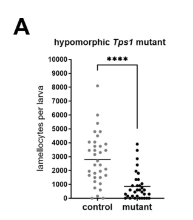

## Question

# Gene Research for Functional Annotation

## ⚠️ CRITICAL: Gene/Protein Identification Context

**BEFORE YOU BEGIN RESEARCH:** You MUST verify you are researching the CORRECT gene/protein. Gene symbols can be ambiguous, especially for less well-characterized genes from non-model organisms.

### Target Gene/Protein Identity (from UniProt):
- **UniProt Accession:** Q9Y119
- **Protein Description:** SubName: Full=Trehalose-6-phosphate synthase 1 {ECO:0000313|EMBL:AAF51020.1}; EC=2.4.1.15 {ECO:0000313|EMBL:AAF51020.1}; EC=3.1.3.12 {ECO:0000313|EMBL:AAF51020.1};
- **Gene Information:** Name=Tps1 {ECO:0000313|EMBL:AAF51020.1, ECO:0000313|FlyBase:FBgn0027560}; Synonyms=19920676 {ECO:0000313|EMBL:AAF51020.1}, BcDNA:GH08860 {ECO:0000313|EMBL:AAF51020.1}, CG4104 PA {ECO:0000313|EMBL:AAF51020.1}, Dmel\CG4104 {ECO:0000313|EMBL:AAF51020.1}, DmTPS1 {ECO:0000313|EMBL:AAF51020.1}, dTps1 {ECO:0000313|EMBL:AAF51020.1}, dtps1 {ECO:0000313|EMBL:AAF51020.1}, jf5 {ECO:0000313|EMBL:AAF51020.1}, l(2)24Ea {ECO:0000313|EMBL:AAF51020.1}, l(2)jf4 {ECO:0000313|EMBL:AAF51020.1}, l(2)jf5 {ECO:0000313|EMBL:AAF51020.1}, l(2)k08903 {ECO:0000313|EMBL:AAF51020.1}, TPS {ECO:0000313|EMBL:AAF51020.1}, tps {ECO:0000313|EMBL:AAF51020.1}, tps1 {ECO:0000313|EMBL:AAF51020.1}, TreS {ECO:0000313|EMBL:AAF51020.1}; ORFNames=CG4104 {ECO:0000313|EMBL:AAF51020.1, ECO:0000313|FlyBase:FBgn0027560}, Dmel_CG4104 {ECO:0000313|EMBL:AAF51020.1};
- **Organism (full):** Drosophila melanogaster (Fruit fly).
- **Protein Family:** In the N-terminal section; belongs to the
- **Key Domains:** Glyco_trans_20. (IPR001830); HAD-like_sf. (IPR036412); HAD-SF_hydro_IIB. (IPR006379); HAD_sf. (IPR023214); Trehalose_PPase. (IPR003337)

### MANDATORY VERIFICATION STEPS:

1. **Check if the gene symbol "Tps1" matches the protein description above**
2. **Verify the organism is correct:** Drosophila melanogaster (Fruit fly).
3. **Check if protein family/domains align with what you find in literature**
4. **If you find literature for a DIFFERENT gene with the same or similar symbol, STOP**

### If Gene Symbol is Ambiguous or You Cannot Find Relevant Literature:

**DO NOT PROCEED WITH RESEARCH ON A DIFFERENT GENE.** Instead:
- State clearly: "The gene symbol 'Tps1' is ambiguous or literature is limited for this specific protein"
- Explain what you found (e.g., "Found extensive literature on a different gene with the same symbol in a different organism")
- Describe the protein based ONLY on the UniProt information provided above
- Suggest that the protein function can be inferred from domain/family information

### Research Target:

Please provide a comprehensive research report on the gene **Tps1** (gene ID: Tps1, UniProt: Q9Y119) in DROME.

The research report should be a detailed narrative explaining the function, biological processes, and localization of the gene product. Citations should be given for all claims.

You should prioritize authoritative reviews and primary scientific literature when conducting research. You can supplement
this with annotations you find in gene/protein databases, but these can be outdated or inaccurate.

We are specifically interested in the primary function of the gene - for enzymes, what reaction is catalyzed, and what is the substrate specificity? For transporters, what is the substrate? For structural proteins or adapters, what is the broader structural role? For signaling molecules, what is the role in the pathway.

We are interested in where in or outside the cell the gene product carries out its function.

We are also interested in the signaling or biochemical pathways in which the gene functions. We are less interested in broad pleiotropic effects, except where these elucidate the precise role.

Include evidence where possible. We are interested in both experimental evidence as well as inference from structure, evolution, or bioinformatic analysis. Precise studies should be prioritized over high-throughput, where available.

## Output

Question: You are an expert researcher providing comprehensive, well-cited information.

Provide detailed information focusing on:
1. Key concepts and definitions with current understanding
2. Recent developments and latest research (prioritize 2023-2024 sources)
3. Current applications and real-world implementations
4. Expert opinions and analysis from authoritative sources
5. Relevant statistics and data from recent studies

Format as a comprehensive research report with proper citations. Include URLs and publication dates where available.
Always prioritize recent, authoritative sources and provide specific citations for all major claims.

# Gene Research for Functional Annotation

## ⚠️ CRITICAL: Gene/Protein Identification Context

**BEFORE YOU BEGIN RESEARCH:** You MUST verify you are researching the CORRECT gene/protein. Gene symbols can be ambiguous, especially for less well-characterized genes from non-model organisms.

### Target Gene/Protein Identity (from UniProt):
- **UniProt Accession:** Q9Y119
- **Protein Description:** SubName: Full=Trehalose-6-phosphate synthase 1 {ECO:0000313|EMBL:AAF51020.1}; EC=2.4.1.15 {ECO:0000313|EMBL:AAF51020.1}; EC=3.1.3.12 {ECO:0000313|EMBL:AAF51020.1};
- **Gene Information:** Name=Tps1 {ECO:0000313|EMBL:AAF51020.1, ECO:0000313|FlyBase:FBgn0027560}; Synonyms=19920676 {ECO:0000313|EMBL:AAF51020.1}, BcDNA:GH08860 {ECO:0000313|EMBL:AAF51020.1}, CG4104 PA {ECO:0000313|EMBL:AAF51020.1}, Dmel\CG4104 {ECO:0000313|EMBL:AAF51020.1}, DmTPS1 {ECO:0000313|EMBL:AAF51020.1}, dTps1 {ECO:0000313|EMBL:AAF51020.1}, dtps1 {ECO:0000313|EMBL:AAF51020.1}, jf5 {ECO:0000313|EMBL:AAF51020.1}, l(2)24Ea {ECO:0000313|EMBL:AAF51020.1}, l(2)jf4 {ECO:0000313|EMBL:AAF51020.1}, l(2)jf5 {ECO:0000313|EMBL:AAF51020.1}, l(2)k08903 {ECO:0000313|EMBL:AAF51020.1}, TPS {ECO:0000313|EMBL:AAF51020.1}, tps {ECO:0000313|EMBL:AAF51020.1}, tps1 {ECO:0000313|EMBL:AAF51020.1}, TreS {ECO:0000313|EMBL:AAF51020.1}; ORFNames=CG4104 {ECO:0000313|EMBL:AAF51020.1, ECO:0000313|FlyBase:FBgn0027560}, Dmel_CG4104 {ECO:0000313|EMBL:AAF51020.1};
- **Organism (full):** Drosophila melanogaster (Fruit fly).
- **Protein Family:** In the N-terminal section; belongs to the
- **Key Domains:** Glyco_trans_20. (IPR001830); HAD-like_sf. (IPR036412); HAD-SF_hydro_IIB. (IPR006379); HAD_sf. (IPR023214); Trehalose_PPase. (IPR003337)

### MANDATORY VERIFICATION STEPS:

1. **Check if the gene symbol "Tps1" matches the protein description above**
2. **Verify the organism is correct:** Drosophila melanogaster (Fruit fly).
3. **Check if protein family/domains align with what you find in literature**
4. **If you find literature for a DIFFERENT gene with the same or similar symbol, STOP**

### If Gene Symbol is Ambiguous or You Cannot Find Relevant Literature:

**DO NOT PROCEED WITH RESEARCH ON A DIFFERENT GENE.** Instead:
- State clearly: "The gene symbol 'Tps1' is ambiguous or literature is limited for this specific protein"
- Explain what you found (e.g., "Found extensive literature on a different gene with the same symbol in a different organism")
- Describe the protein based ONLY on the UniProt information provided above
- Suggest that the protein function can be inferred from domain/family information

### Research Target:

Please provide a comprehensive research report on the gene **Tps1** (gene ID: Tps1, UniProt: Q9Y119) in DROME.

The research report should be a detailed narrative explaining the function, biological processes, and localization of the gene product. Citations should be given for all claims.

You should prioritize authoritative reviews and primary scientific literature when conducting research. You can supplement
this with annotations you find in gene/protein databases, but these can be outdated or inaccurate.

We are specifically interested in the primary function of the gene - for enzymes, what reaction is catalyzed, and what is the substrate specificity? For transporters, what is the substrate? For structural proteins or adapters, what is the broader structural role? For signaling molecules, what is the role in the pathway.

We are interested in where in or outside the cell the gene product carries out its function.

We are also interested in the signaling or biochemical pathways in which the gene functions. We are less interested in broad pleiotropic effects, except where these elucidate the precise role.

Include evidence where possible. We are interested in both experimental evidence as well as inference from structure, evolution, or bioinformatic analysis. Precise studies should be prioritized over high-throughput, where available.

# Functional annotation report: *Drosophila melanogaster* Tps1 (Q9Y119)

## Identity and principal function

**The target is the fruit-fly gene Tps1/CG4104 (FlyBase FBgn0027560), not a same-named fungal or plant gene.** The supplied UniProt accession is Q9Y119. Fly-specific cloning identified an 809-amino-acid protein containing domains corresponding to trehalose-6-phosphate synthase (TPS) and trehalose-6-phosphate phosphatase (TPP); subsequent fly genetics and biochemistry establish it as the principal enzyme for **de novo trehalose production**. The N-terminal glycosyltransferase domain and C-terminal HAD-family phosphatase domain agree with the supplied Glyco_trans_20 and Trehalose_PPase/HAD annotations. Tps1 is **not** the trehalose-degrading enzyme Treh. (chen2002roleoftrehalose pages 1-2, chen2002roleoftrehalose pages 4-5, yoshida2016molecularcharacterizationof pages 2-3, yoshida2016molecularcharacterizationof pages 1-2)

The two reactions attributed to fly Tps1 are:

1. **TPS, EC 2.4.1.15:** UDP-glucose + D-glucose-6-phosphate → trehalose-6-phosphate (T6P) + UDP.
2. **TPP, EC 3.1.3.12:** T6P + H₂O → trehalose + inorganic phosphate.

Thus, the identified sugar donor is **UDP-glucose**, the glucosyl acceptor is **glucose-6-phosphate**, and the phosphatase substrate is **T6P**. Purified recombinant fly Tps1 TPP domain dephosphorylated T6P in vitro, although less strongly under the reported conditions than the separate fly phosphatase CG5171 or bacterial OtsB. Full-length Tps1 rescued mutant lethality and sugar defects, whereas constructs retaining only one catalytic domain did not. These observations support both activities being required *in vivo*; they do **not** amount to a comprehensive kinetic comparison of alternative sugar donors or a substrate panel for purified full-length Q9Y119. (yoshida2016molecularcharacterizationof pages 2-3)

## Where the reaction occurs

**Tissue-level localization is strong; subcellular localization is less certain.** Larval tissue qRT-PCR places Tps1 expression predominantly in the **fat body**, and fat-body-specific RNAi lowers trehalose and reproduces the late-pupal failure to eclose. Comparable knockdown using the tested muscle, glial, neuronal, and midgut drivers did not reproduce that phenotype. Near-absence of trehalose in Tps1-null larval bodies and haemolymph identifies the fat body as the principal source of circulating trehalose. The *protein* has not been shown by the cited experiments to occupy a particular subcellular compartment: an intracellular, probably cytosolic site is consistent with its soluble sugar-phosphate reactions, but should be recorded as **inference**, not demonstrated microscopy. Trehalose subsequently circulates in haemolymph; this does not imply that Tps1 itself is secreted or acts in haemolymph. (matsuda2015flieswithouttrehalose pages 5-6, matsuda2015flieswithouttrehalose pages 4-5, yoshida2016molecularcharacterizationof pages 1-2)

## Pathway and biological significance

Tps1 connects glucose-6-phosphate and UDP-glucose metabolism to the insect's major circulating disaccharide. Trehalose can be transported to other tissues and cleaved by **Treh** to provide glucose. Mutating either synthesis (*Tps1*) or hydrolysis (*Treh*) perturbs circulating glucose, consistent with continual trehalose turnover contributing to glycaemic control. The proposed role of T6P as a fly signaling metabolite remains substantially less established than its demonstrated role as the biosynthetic intermediate; plant SnRK1 and yeast glucose-repression mechanisms should **not** be assigned to Drosophila Tps1 without fly-specific tests. (yoshida2016molecularcharacterizationof pages 1-2, yoshida2016molecularcharacterizationof pages 6-8, yasugi2017adaptationtodietary pages 6-7)

Genetic evidence makes the physiological interpretation unusually specific. On normal food, Tps1-deficient larvae can grow and pupariate despite almost undetectable trehalose, but typically die as late pupae or pharate adults. Reported mutant larvae were **9–12% lighter**, pupae **5–8% smaller**, and pupariation **10–12 hours later** than controls. During water-only starvation, nearly all mutant larvae died within **one day**, versus control survival for at least **three days**; sucrose suppressed this acute lethality. These results indicate a context-dependent requirement for trehalose-derived carbohydrate availability, rather than an absolute requirement for larval growth under adequate feeding. Importantly, later genetic analysis found that the early-larval lethality of an original insertion stock reflected additional background mutation(s), not the clean Tps1-null phenotype. (matsuda2015flieswithouttrehalose pages 5-6, matsuda2015flieswithouttrehalose pages 7-8, matsuda2015flieswithouttrehalose pages 6-7, matsuda2015flieswithouttrehalose pages 1-1)

Tps1-dependent trehalose production also contributes to **glucose buffering and body-water balance**. In a hypomorphic genetic background with approximately **20% of normal Tps1 transcript and trehalose**, investigators observed elevated haemolymph glucose after feeding but low glucose during fasting, alongside greater between-fly variation and left–right asymmetry of wing size. Separately, Tps1 loss reduced haemolymph water volume without a detected decrease in haemolymph osmotic pressure and increased desiccation sensitivity. The observation that *Treh*-deficient animals also have desiccation problems despite accumulating trehalose cautions against attributing protection simply to a high concentration of trehalose. These are downstream consequences of a metabolic enzyme, **not** evidence that Tps1 is itself a wing structural protein or water transporter. (matsushita2020trehalosemetabolismconfers pages 1-2, matsushita2020trehalosemetabolismconfers pages 2-3, yoshida2016molecularcharacterizationof pages 6-8, yoshida2016molecularcharacterizationof pages 1-2)

## Recent research and use as an experimental tool

A **7 May 2024** *PLOS Biology* study provides particularly relevant recent fly-specific evidence. In parasitoid-infected larvae, the hypomorphic genotype `Tps1[MI03087]/Tps1[d2]`, reported to retain **20% of control trehalose**, generated significantly fewer lamellocytes at 22 hours post-infection than heterozygous controls (**P < 0.0001**, Figure 5A). Its isotope-tracing experiments also found that, after six hours of labeled-glucose feeding, **21%** of circulating glucose and **16%** of circulating trehalose were labeled, consistent with conversion of dietary glucose into circulating trehalose. Infection-activated haemocytes drew on carbohydrate and increased cyclic pentose-phosphate-pathway metabolism. Here Tps1 supplies **systemic trehalose upstream**; the cytoplasmic trehalase that cleaves it inside differentiated lamellocytes is a **different protein**. This distinction prevents misannotation of haemocyte trehalase or pentose-phosphate enzymatic activity to Tps1. The cropped primary-paper Figure 5A directly supports the mutant lamellocyte comparison. (kazek2024glucoseandtrehalose pages 11-13, kazek2024glucoseandtrehalose media 97024e0e, kazek2024glucoseandtrehalose pages 5-7, kazek2024glucoseandtrehalose pages 7-10)

As a metabolic-dependency experiment, an **October 2024 Research Square preprint** reported that fat-body FASN1 knockdown removed at least **85%** of larval triglyceride, increased fat-body glycogen **more than 20-fold**, and elevated circulating trehalose. Fat-body Tps1 knockdown alone did not prevent development in that experimental setting, but combined FASN1 and Tps1 knockdown caused developmental arrest. This supports a conditional reliance on trehalose biosynthesis when lipid storage is compromised, while the preprint status warrants more caution than for the peer-reviewed 2024 infection study. A **2025** peer-reviewed fly cachexia study also tested fat-body Tps1 depletion, but the available figure-caption evidence does not establish the direction or magnitude of its cachexia outcome, so no therapeutic conclusion is drawn from it here. (henne2024metabolicrewiringin pages 9-12, henne2024metabolicrewiringin pages 5-7, liu2025hepaticgluconeogenesisand pages 9-9)

The table below separates direct observations from their interpretations and highlights experimental applications of Tps1 mutant and RNAi flies. (yoshida2016molecularcharacterizationof pages 2-3, matsuda2015flieswithouttrehalose pages 5-6, kazek2024glucoseandtrehalose pages 11-13)

| Molecular or physiological question | Direct experimental observation | Interpretation and limitations | Primary source |
|---|---|---|---|
| Are both catalytic domains functional and required? | Tps1 contains an N-terminal TPS domain and a C-terminal TPP domain. Purified Tps1-TPP dephosphorylated trehalose-6-phosphate (T6P), although less strongly than CG5171 or *E. coli* OtsB; CG5177 was inactive under the assay conditions. Full-length genomic Tps1 rescued mutant lethality and sugar defects, whereas constructs retaining only one domain did not. (yoshida2016molecularcharacterizationof pages 2-3) | Strong biochemical and genetic evidence that Tps1 is a bifunctional TPS/TPP enzyme: TPS converts UDP-glucose plus glucose-6-phosphate to T6P, and TPP hydrolyzes T6P to trehalose. A complete substrate-specificity and kinetic profile for full-length Q9Y119 was not reported. Tps1 is not trehalase. | Yoshida *et al.* (2016), *Scientific Reports*, July 28, 2016. [doi:10.1038/srep30582](https://doi.org/10.1038/srep30582) |
| In which tissue is Tps1 principally expressed and required? | qRT-PCR detected larval Tps1 expression specifically in the fat body. Fat-body RNAi significantly reduced Tps1 transcript and trehalose, permitted pupariation, but caused late-pupal failure to eclose. Muscle-, glial-, neuronal-, and midgut-directed knockdown produced viable adults. Null larvae had nearly undetectable whole-body and haemolymph trehalose. (matsuda2015flieswithouttrehalose pages 5-6, matsuda2015flieswithouttrehalose pages 4-5) | Direct tissue-specific genetic evidence identifies the larval fat body as the principal site of Tps1-dependent trehalose synthesis. This establishes tissue-level expression and function, not microscopic subcellular localization of Q9Y119. | Matsuda *et al.* (2015), *Journal of Biological Chemistry*, January 9, 2015. [doi:10.1074/jbc.M114.619411](https://doi.org/10.1074/jbc.M114.619411) |
| How does Tps1 loss affect baseline development and starvation adaptation? | On normal food, mutants were 9–12% lighter as larvae, formed pupae 5–8% smaller, and pupariated 10–12 hours later. During water-only starvation, nearly all mutant larvae died within one day, whereas controls survived at least three days; sucrose supplementation completely suppressed the acute lethality. (matsuda2015flieswithouttrehalose pages 7-8, matsuda2015flieswithouttrehalose pages 6-7) | Direct mutant and dietary-rescue evidence shows that Tps1-dependent trehalose metabolism buffers sugar availability during nutrient stress. CNS glycogen depletion, reduced mitoses, and apoptosis suggest, but do not prove, a local neural energy deficit. | Matsuda *et al.* (2015), *Journal of Biological Chemistry*, January 9, 2015. [doi:10.1074/jbc.M114.619411](https://doi.org/10.1074/jbc.M114.619411) |
| Does Tps1 contribute to body-water homeostasis and desiccation tolerance? | Four hours of desiccation reduced whole-larva water content by approximately 35% but dry weight by only 7%. More than 80% of wild-type larvae recovered after 3 hours of desiccation; recovery declined to approximately 40% after 5 hours and 15% after 7 hours. Tps1 mutants showed greater lethality and reduced haemolymph water volume without a detectable fall in haemolymph osmotic pressure. (yoshida2016molecularcharacterizationof pages 6-8) | Direct genetic and physiological evidence links Tps1-dependent trehalose metabolism to haemolymph volume and dehydration survival. Because Treh mutants were also desiccation-sensitive despite trehalose accumulation, protection cannot be attributed simply to high trehalose concentration. | Yoshida *et al.* (2016), *Scientific Reports*, July 28, 2016. [doi:10.1038/srep30582](https://doi.org/10.1038/srep30582) |
| Does Tps1 buffer circulating glucose and developmental variation? | A hypomorphic allele reduced Tps1 mRNA and trehalose to approximately 20% of control. Mutants developed feeding-associated hyperglycaemia and fasting hypoglycaemia and showed increased inter-individual wing-size variation and fluctuating wing asymmetry. Low dietary glucose aggravated asymmetry, whereas high glucose attenuated it. (matsushita2020trehalosemetabolismconfers pages 1-2, matsushita2020trehalosemetabolismconfers pages 2-3) | Direct genetic and dietary evidence supports trehalose synthesis as a reversible circulating glucose sink that promotes developmental robustness and bilateral stability. Wing effects are downstream physiological consequences, not evidence for a structural role of Tps1 in wings. | Matsushita and Nishimura (2020), *Communications Biology*, April 3, 2020. [doi:10.1038/s42003-020-0889-1](https://doi.org/10.1038/s42003-020-0889-1) |
| Is Tps1-dependent systemic trehalose metabolism required for immune-cell differentiation? | The hypomorphic genotype `Tps1[MI03087]/Tps1[d2]` retained approximately 20% of control trehalose. After parasitoid infection, mutants produced significantly fewer lamellocytes at 22 hours post-infection than heterozygous controls (`P < 0.0001`, Figure 5A). Infection-activated haemocytes contained fivefold more labelled and unlabelled glucose than controls, while isotope tracing showed trehalose-derived carbon entering glucose-6-phosphate and cyclic pentose-phosphate metabolism. (kazek2024glucoseandtrehalose pages 5-7, kazek2024glucoseandtrehalose pages 11-13, kazek2024glucoseandtrehalose media 97024e0e) | Direct mutant evidence connects systemic Tps1 activity with efficient lamellocyte differentiation; isotope tracing defines the downstream metabolic route. Tps1 acts upstream in the fat body, whereas intracellular trehalose cleavage in mature lamellocytes is performed by cytoplasmic trehalase, not Tps1. | Kazek *et al.* (2024), *PLOS Biology*, May 7, 2024. [doi:10.1371/journal.pbio.3002299](https://doi.org/10.1371/journal.pbio.3002299) |
| Does trehalose become essential when fat-body triglyceride synthesis is impaired? | **Preprint:** fat-body FASN1 RNAi removed at least 85% of larval triglyceride and increased fat-body glycogen more than 20-fold. Circulating trehalose increased; Tps1 RNAi alone did not impair development under these conditions, but combined fat-body depletion of Tps1 and FASN1 caused significant developmental arrest. (henne2024metabolicrewiringin pages 9-12, henne2024metabolicrewiringin pages 5-7) | The genetic interaction suggests that Tps1-derived trehalose becomes conditionally essential when lipid storage is unavailable and carbohydrate metabolism is compensatorily elevated. This is a non-peer-reviewed 2024 preprint, so the magnitude and mechanism of the dual-RNAi arrest require independent confirmation. | Henne *et al.* (2024), *Research Square* preprint, October 2024. [doi:10.21203/rs.3.rs-4505077/v1](https://doi.org/10.21203/rs.3.rs-4505077/v1) |

*Table: A compact hierarchy of biochemical, genetic, tissue-specific, and physiological evidence for Drosophila melanogaster Tps1/CG4104/Q9Y119. It distinguishes direct findings from interpretation and flags the 2024 FASN1 interaction study as a preprint.*

## Assessment and sources

**Recommended annotation:** bifunctional, fat-body-enriched **trehalose-6-phosphate synthase/trehalose-6-phosphate phosphatase**; required for the two-step conversion of UDP-glucose and glucose-6-phosphate into trehalose, which is then available as a circulating carbohydrate. Confidence is **high** for gene identity, fat-body function, T6P phosphatase activity, and requirement for trehalose synthesis; **lower** for precise full-length-enzyme substrate specificity, protein-level subcellular localization, and any direct fly T6P signaling pathway. The current real-world implementation evidenced here is primarily **research use in genetically manipulated flies**, including diet, dehydration, immune-infection, and metabolic-stress models; insect TPS inhibition has been proposed as a pest-control strategy, not established here as an application of Q9Y119 itself. (yoshida2016molecularcharacterizationof pages 2-3, matsuda2015flieswithouttrehalose pages 4-5, kazek2024glucoseandtrehalose pages 11-13, tang2018invertebratetrehalose6phosphatesynthase pages 3-5)

**Selected primary sources, with publication dates and URLs:** Chen *et al.*, *Journal of Biological Chemistry*, **1 February 2002**, https://doi.org/10.1074/jbc.M109479200; Matsuda *et al.*, *Journal of Biological Chemistry*, **9 January 2015**, https://doi.org/10.1074/jbc.M114.619411; Yoshida *et al.*, *Scientific Reports*, **July 2016**, https://doi.org/10.1038/srep30582; Matsushita and Nishimura, *Communications Biology*, **April 2020**, https://doi.org/10.1038/s42003-020-0889-1; Kazek *et al.*, *PLOS Biology*, **7 May 2024**, https://doi.org/10.1371/journal.pbio.3002299; Henne *et al.*, **October 2024 preprint**, https://doi.org/10.21203/rs.3.rs-4505077/v1. Identity cross-references supplied for this report: https://www.uniprot.org/uniprotkb/Q9Y119/entry and https://flybase.org/reports/FBgn0027560.html. (chen2002roleoftrehalose pages 1-2, matsuda2015flieswithouttrehalose pages 4-5, yoshida2016molecularcharacterizationof pages 2-3, matsushita2020trehalosemetabolismconfers pages 1-2, kazek2024glucoseandtrehalose pages 1-2, henne2024metabolicrewiringin pages 9-12)

References

1. (chen2002roleoftrehalose pages 1-2): Qiaofang Chen, Enbo Ma, Kevin L. Behar, Tian Xu, and Gabriel G. Haddad. Role of trehalose phosphate synthase in anoxia tolerance and development in drosophila melanogaster *. The Journal of Biological Chemistry, 277:3274-3279, Feb 2002. URL: https://doi.org/10.1074/jbc.m109479200, doi:10.1074/jbc.m109479200. This article has 216 citations.

2. (chen2002roleoftrehalose pages 4-5): Qiaofang Chen, Enbo Ma, Kevin L. Behar, Tian Xu, and Gabriel G. Haddad. Role of trehalose phosphate synthase in anoxia tolerance and development in drosophila melanogaster *. The Journal of Biological Chemistry, 277:3274-3279, Feb 2002. URL: https://doi.org/10.1074/jbc.m109479200, doi:10.1074/jbc.m109479200. This article has 216 citations.

3. (yoshida2016molecularcharacterizationof pages 2-3): Miki Yoshida, Hiroko Matsuda, Hitomi Kubo, and Takashi Nishimura. Molecular characterization of tps1 and treh genes in drosophila and their role in body water homeostasis. Scientific Reports, Jul 2016. URL: https://doi.org/10.1038/srep30582, doi:10.1038/srep30582. This article has 77 citations and is from a peer-reviewed journal.

4. (yoshida2016molecularcharacterizationof pages 1-2): Miki Yoshida, Hiroko Matsuda, Hitomi Kubo, and Takashi Nishimura. Molecular characterization of tps1 and treh genes in drosophila and their role in body water homeostasis. Scientific Reports, Jul 2016. URL: https://doi.org/10.1038/srep30582, doi:10.1038/srep30582. This article has 77 citations and is from a peer-reviewed journal.

5. (matsuda2015flieswithouttrehalose pages 5-6): Hiroko Matsuda, Takayuki Yamada, Miki Yoshida, and Takashi Nishimura. Flies without trehalose. Journal of Biological Chemistry, 290:1244-1255, Jan 2015. URL: https://doi.org/10.1074/jbc.m114.619411, doi:10.1074/jbc.m114.619411. This article has 180 citations and is from a domain leading peer-reviewed journal.

6. (matsuda2015flieswithouttrehalose pages 4-5): Hiroko Matsuda, Takayuki Yamada, Miki Yoshida, and Takashi Nishimura. Flies without trehalose. Journal of Biological Chemistry, 290:1244-1255, Jan 2015. URL: https://doi.org/10.1074/jbc.m114.619411, doi:10.1074/jbc.m114.619411. This article has 180 citations and is from a domain leading peer-reviewed journal.

7. (yoshida2016molecularcharacterizationof pages 6-8): Miki Yoshida, Hiroko Matsuda, Hitomi Kubo, and Takashi Nishimura. Molecular characterization of tps1 and treh genes in drosophila and their role in body water homeostasis. Scientific Reports, Jul 2016. URL: https://doi.org/10.1038/srep30582, doi:10.1038/srep30582. This article has 77 citations and is from a peer-reviewed journal.

8. (yasugi2017adaptationtodietary pages 6-7): Tetsuo Yasugi, Takayuki Yamada, and Takashi Nishimura. Adaptation to dietary conditions by trehalose metabolism in drosophila. Scientific Reports, May 2017. URL: https://doi.org/10.1038/s41598-017-01754-9, doi:10.1038/s41598-017-01754-9. This article has 80 citations and is from a peer-reviewed journal.

9. (matsuda2015flieswithouttrehalose pages 7-8): Hiroko Matsuda, Takayuki Yamada, Miki Yoshida, and Takashi Nishimura. Flies without trehalose. Journal of Biological Chemistry, 290:1244-1255, Jan 2015. URL: https://doi.org/10.1074/jbc.m114.619411, doi:10.1074/jbc.m114.619411. This article has 180 citations and is from a domain leading peer-reviewed journal.

10. (matsuda2015flieswithouttrehalose pages 6-7): Hiroko Matsuda, Takayuki Yamada, Miki Yoshida, and Takashi Nishimura. Flies without trehalose. Journal of Biological Chemistry, 290:1244-1255, Jan 2015. URL: https://doi.org/10.1074/jbc.m114.619411, doi:10.1074/jbc.m114.619411. This article has 180 citations and is from a domain leading peer-reviewed journal.

11. (matsuda2015flieswithouttrehalose pages 1-1): Hiroko Matsuda, Takayuki Yamada, Miki Yoshida, and Takashi Nishimura. Flies without trehalose. Journal of Biological Chemistry, 290:1244-1255, Jan 2015. URL: https://doi.org/10.1074/jbc.m114.619411, doi:10.1074/jbc.m114.619411. This article has 180 citations and is from a domain leading peer-reviewed journal.

12. (matsushita2020trehalosemetabolismconfers pages 1-2): Ryota Matsushita and Takashi Nishimura. Trehalose metabolism confers developmental robustness and stability in drosophila by regulating glucose homeostasis. Communications Biology, Apr 2020. URL: https://doi.org/10.1038/s42003-020-0889-1, doi:10.1038/s42003-020-0889-1. This article has 68 citations and is from a peer-reviewed journal.

13. (matsushita2020trehalosemetabolismconfers pages 2-3): Ryota Matsushita and Takashi Nishimura. Trehalose metabolism confers developmental robustness and stability in drosophila by regulating glucose homeostasis. Communications Biology, Apr 2020. URL: https://doi.org/10.1038/s42003-020-0889-1, doi:10.1038/s42003-020-0889-1. This article has 68 citations and is from a peer-reviewed journal.

14. (kazek2024glucoseandtrehalose pages 11-13): Michalina Kazek, Lenka Chodáková, Katharina Lehr, Lukáš Strych, Pavla Nedbalová, Ellen McMullen, Adam Bajgar, Stanislav Opekar, Petr Šimek, Martin Moos, and Tomáš Doležal. Glucose and trehalose metabolism through the cyclic pentose phosphate pathway shapes pathogen resistance and host protection in drosophila. PLOS Biology, 22:e3002299, May 2024. URL: https://doi.org/10.1371/journal.pbio.3002299, doi:10.1371/journal.pbio.3002299. This article has 29 citations and is from a highest quality peer-reviewed journal.

15. (kazek2024glucoseandtrehalose media 97024e0e): Michalina Kazek, Lenka Chodáková, Katharina Lehr, Lukáš Strych, Pavla Nedbalová, Ellen McMullen, Adam Bajgar, Stanislav Opekar, Petr Šimek, Martin Moos, and Tomáš Doležal. Glucose and trehalose metabolism through the cyclic pentose phosphate pathway shapes pathogen resistance and host protection in drosophila. PLOS Biology, 22:e3002299, May 2024. URL: https://doi.org/10.1371/journal.pbio.3002299, doi:10.1371/journal.pbio.3002299. This article has 29 citations and is from a highest quality peer-reviewed journal.

16. (kazek2024glucoseandtrehalose pages 5-7): Michalina Kazek, Lenka Chodáková, Katharina Lehr, Lukáš Strych, Pavla Nedbalová, Ellen McMullen, Adam Bajgar, Stanislav Opekar, Petr Šimek, Martin Moos, and Tomáš Doležal. Glucose and trehalose metabolism through the cyclic pentose phosphate pathway shapes pathogen resistance and host protection in drosophila. PLOS Biology, 22:e3002299, May 2024. URL: https://doi.org/10.1371/journal.pbio.3002299, doi:10.1371/journal.pbio.3002299. This article has 29 citations and is from a highest quality peer-reviewed journal.

17. (kazek2024glucoseandtrehalose pages 7-10): Michalina Kazek, Lenka Chodáková, Katharina Lehr, Lukáš Strych, Pavla Nedbalová, Ellen McMullen, Adam Bajgar, Stanislav Opekar, Petr Šimek, Martin Moos, and Tomáš Doležal. Glucose and trehalose metabolism through the cyclic pentose phosphate pathway shapes pathogen resistance and host protection in drosophila. PLOS Biology, 22:e3002299, May 2024. URL: https://doi.org/10.1371/journal.pbio.3002299, doi:10.1371/journal.pbio.3002299. This article has 29 citations and is from a highest quality peer-reviewed journal.

18. (henne2024metabolicrewiringin pages 9-12): W. Mike Henne, Rupali Ugrankar-Banerjee, Son Tran, Jade Bowerman, Blessy Paul, Lauren Zacharias, Thomas Mathews, and Ralph DeBerardinis. Metabolic rewiring in fat-depleted drosophila reveals triglyceride:glycogen crosstalk and identifies cdip as a new regulator of energy metabolism. Research Square, Oct 2024. URL: https://doi.org/10.21203/rs.3.rs-4505077/v1, doi:10.21203/rs.3.rs-4505077/v1. This article has 0 citations.

19. (henne2024metabolicrewiringin pages 5-7): W. Mike Henne, Rupali Ugrankar-Banerjee, Son Tran, Jade Bowerman, Blessy Paul, Lauren Zacharias, Thomas Mathews, and Ralph DeBerardinis. Metabolic rewiring in fat-depleted drosophila reveals triglyceride:glycogen crosstalk and identifies cdip as a new regulator of energy metabolism. Research Square, Oct 2024. URL: https://doi.org/10.21203/rs.3.rs-4505077/v1, doi:10.21203/rs.3.rs-4505077/v1. This article has 0 citations.

20. (liu2025hepaticgluconeogenesisand pages 9-9): Ying Liu, Ezequiel Dantas, Miriam Ferrer, Ting Miao, Mujeeb Qadiri, Yifang Liu, Aram Comjean, Emma E. Davidson, Tiffany Perrier, Tanvir Ahmed, Yanhui Hu, Marcus D. Goncalves, Tobias Janowitz, and Norbert Perrimon. Hepatic gluconeogenesis and pdk3 upregulation drive cancer cachexia in flies and mice. Nature Metabolism, 7:823-841, Apr 2025. URL: https://doi.org/10.1038/s42255-025-01265-2, doi:10.1038/s42255-025-01265-2. This article has 41 citations and is from a domain leading peer-reviewed journal.

21. (tang2018invertebratetrehalose6phosphatesynthase pages 3-5): B. Tang, Suei-Rong Wang, Shi-Gui Wang, Hui-Juan Wang, Jiayong Zhang, and Shuai-Ying Cui. Invertebrate trehalose-6-phosphate synthase gene: genetic architecture, biochemistry, physiological function, and potential applications. Frontiers in Physiology, Jan 2018. URL: https://doi.org/10.3389/fphys.2018.00030, doi:10.3389/fphys.2018.00030. This article has 148 citations.

22. (kazek2024glucoseandtrehalose pages 1-2): Michalina Kazek, Lenka Chodáková, Katharina Lehr, Lukáš Strych, Pavla Nedbalová, Ellen McMullen, Adam Bajgar, Stanislav Opekar, Petr Šimek, Martin Moos, and Tomáš Doležal. Glucose and trehalose metabolism through the cyclic pentose phosphate pathway shapes pathogen resistance and host protection in drosophila. PLOS Biology, 22:e3002299, May 2024. URL: https://doi.org/10.1371/journal.pbio.3002299, doi:10.1371/journal.pbio.3002299. This article has 29 citations and is from a highest quality peer-reviewed journal.

## Artifacts

- [Edison artifact artifact-00](Tps1-deep-research-falcon_artifacts/artifact-00.md)

## Citations

1. yoshida2016molecularcharacterizationof pages 2-3
2. yoshida2016molecularcharacterizationof pages 6-8
3. chen2002roleoftrehalose pages 1-2
4. chen2002roleoftrehalose pages 4-5
5. yoshida2016molecularcharacterizationof pages 1-2
6. matsuda2015flieswithouttrehalose pages 5-6
7. matsuda2015flieswithouttrehalose pages 4-5
8. yasugi2017adaptationtodietary pages 6-7
9. matsuda2015flieswithouttrehalose pages 7-8
10. matsuda2015flieswithouttrehalose pages 6-7
11. matsuda2015flieswithouttrehalose pages 1-1
12. matsushita2020trehalosemetabolismconfers pages 1-2
13. matsushita2020trehalosemetabolismconfers pages 2-3
14. kazek2024glucoseandtrehalose pages 11-13
15. kazek2024glucoseandtrehalose pages 5-7
16. kazek2024glucoseandtrehalose pages 7-10
17. henne2024metabolicrewiringin pages 9-12
18. henne2024metabolicrewiringin pages 5-7
19. liu2025hepaticgluconeogenesisand pages 9-9
20. kazek2024glucoseandtrehalose pages 1-2
21. MI03087
22. d2
23. doi:10.1038/srep30582
24. doi:10.1074/jbc.M114.619411
25. doi:10.1038/s42003-020-0889-1
26. doi:10.1371/journal.pbio.3002299
27. doi:10.21203/rs.3.rs-4505077/v1
28. https://doi.org/10.1038/srep30582
29. https://doi.org/10.1074/jbc.M114.619411
30. https://doi.org/10.1038/s42003-020-0889-1
31. https://doi.org/10.1371/journal.pbio.3002299
32. https://doi.org/10.21203/rs.3.rs-4505077/v1
33. https://doi.org/10.1074/jbc.M109479200;
34. https://doi.org/10.1074/jbc.M114.619411;
35. https://doi.org/10.1038/srep30582;
36. https://doi.org/10.1038/s42003-020-0889-1;
37. https://doi.org/10.1371/journal.pbio.3002299;
38. https://doi.org/10.21203/rs.3.rs-4505077/v1.
39. https://www.uniprot.org/uniprotkb/Q9Y119/entry
40. https://flybase.org/reports/FBgn0027560.html.
41. https://doi.org/10.1074/jbc.m109479200,
42. https://doi.org/10.1038/srep30582,
43. https://doi.org/10.1074/jbc.m114.619411,
44. https://doi.org/10.1038/s41598-017-01754-9,
45. https://doi.org/10.1038/s42003-020-0889-1,
46. https://doi.org/10.1371/journal.pbio.3002299,
47. https://doi.org/10.21203/rs.3.rs-4505077/v1,
48. https://doi.org/10.1038/s42255-025-01265-2,
49. https://doi.org/10.3389/fphys.2018.00030,