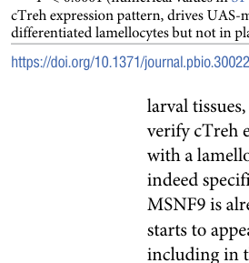

## Question

# Gene Research for Functional Annotation

## ⚠️ CRITICAL: Gene/Protein Identification Context

**BEFORE YOU BEGIN RESEARCH:** You MUST verify you are researching the CORRECT gene/protein. Gene symbols can be ambiguous, especially for less well-characterized genes from non-model organisms.

### Target Gene/Protein Identity (from UniProt):
- **UniProt Accession:** Q9W2M2
- **Protein Description:** RecName: Full=Trehalase {ECO:0000312|FlyBase:FBgn0003748}; EC=3.2.1.28 {ECO:0000250|UniProtKB:O43280}; AltName: Full=Alpha,alpha-trehalase; AltName: Full=Alpha,alpha-trehalose glucohydrolase; Flags: Precursor;
- **Gene Information:** Name=Treh {ECO:0000312|FlyBase:FBgn0003748}; ORFNames=CG9364 {ECO:0000312|FlyBase:FBgn0003748};
- **Organism (full):** Drosophila melanogaster (Fruit fly).
- **Protein Family:** Belongs to the glycosyl hydrolase 37 family. .
- **Key Domains:** 6-hairpin_glycosidase_sf. (IPR008928); 6hp_glycosidase-like_sf. (IPR012341); Glyco_hydro_37. (IPR001661); Glyco_hydro_37_CS. (IPR018232); Trehalase (PF01204)

### MANDATORY VERIFICATION STEPS:

1. **Check if the gene symbol "Treh" matches the protein description above**
2. **Verify the organism is correct:** Drosophila melanogaster (Fruit fly).
3. **Check if protein family/domains align with what you find in literature**
4. **If you find literature for a DIFFERENT gene with the same or similar symbol, STOP**

### If Gene Symbol is Ambiguous or You Cannot Find Relevant Literature:

**DO NOT PROCEED WITH RESEARCH ON A DIFFERENT GENE.** Instead:
- State clearly: "The gene symbol 'Treh' is ambiguous or literature is limited for this specific protein"
- Explain what you found (e.g., "Found extensive literature on a different gene with the same symbol in a different organism")
- Describe the protein based ONLY on the UniProt information provided above
- Suggest that the protein function can be inferred from domain/family information

### Research Target:

Please provide a comprehensive research report on the gene **Treh** (gene ID: Treh, UniProt: Q9W2M2) in DROME.

The research report should be a detailed narrative explaining the function, biological processes, and localization of the gene product. Citations should be given for all claims.

You should prioritize authoritative reviews and primary scientific literature when conducting research. You can supplement
this with annotations you find in gene/protein databases, but these can be outdated or inaccurate.

We are specifically interested in the primary function of the gene - for enzymes, what reaction is catalyzed, and what is the substrate specificity? For transporters, what is the substrate? For structural proteins or adapters, what is the broader structural role? For signaling molecules, what is the role in the pathway.

We are interested in where in or outside the cell the gene product carries out its function.

We are also interested in the signaling or biochemical pathways in which the gene functions. We are less interested in broad pleiotropic effects, except where these elucidate the precise role.

Include evidence where possible. We are interested in both experimental evidence as well as inference from structure, evolution, or bioinformatic analysis. Precise studies should be prioritized over high-throughput, where available.

## Output

Question: You are an expert researcher providing comprehensive, well-cited information.

Provide detailed information focusing on:
1. Key concepts and definitions with current understanding
2. Recent developments and latest research (prioritize 2023-2024 sources)
3. Current applications and real-world implementations
4. Expert opinions and analysis from authoritative sources
5. Relevant statistics and data from recent studies

Format as a comprehensive research report with proper citations. Include URLs and publication dates where available.
Always prioritize recent, authoritative sources and provide specific citations for all major claims.

# Gene Research for Functional Annotation

## ⚠️ CRITICAL: Gene/Protein Identification Context

**BEFORE YOU BEGIN RESEARCH:** You MUST verify you are researching the CORRECT gene/protein. Gene symbols can be ambiguous, especially for less well-characterized genes from non-model organisms.

### Target Gene/Protein Identity (from UniProt):
- **UniProt Accession:** Q9W2M2
- **Protein Description:** RecName: Full=Trehalase {ECO:0000312|FlyBase:FBgn0003748}; EC=3.2.1.28 {ECO:0000250|UniProtKB:O43280}; AltName: Full=Alpha,alpha-trehalase; AltName: Full=Alpha,alpha-trehalose glucohydrolase; Flags: Precursor;
- **Gene Information:** Name=Treh {ECO:0000312|FlyBase:FBgn0003748}; ORFNames=CG9364 {ECO:0000312|FlyBase:FBgn0003748};
- **Organism (full):** Drosophila melanogaster (Fruit fly).
- **Protein Family:** Belongs to the glycosyl hydrolase 37 family. .
- **Key Domains:** 6-hairpin_glycosidase_sf. (IPR008928); 6hp_glycosidase-like_sf. (IPR012341); Glyco_hydro_37. (IPR001661); Glyco_hydro_37_CS. (IPR018232); Trehalase (PF01204)

### MANDATORY VERIFICATION STEPS:

1. **Check if the gene symbol "Treh" matches the protein description above**
2. **Verify the organism is correct:** Drosophila melanogaster (Fruit fly).
3. **Check if protein family/domains align with what you find in literature**
4. **If you find literature for a DIFFERENT gene with the same or similar symbol, STOP**

### If Gene Symbol is Ambiguous or You Cannot Find Relevant Literature:

**DO NOT PROCEED WITH RESEARCH ON A DIFFERENT GENE.** Instead:
- State clearly: "The gene symbol 'Treh' is ambiguous or literature is limited for this specific protein"
- Explain what you found (e.g., "Found extensive literature on a different gene with the same symbol in a different organism")
- Describe the protein based ONLY on the UniProt information provided above
- Suggest that the protein function can be inferred from domain/family information

### Research Target:

Please provide a comprehensive research report on the gene **Treh** (gene ID: Treh, UniProt: Q9W2M2) in DROME.

The research report should be a detailed narrative explaining the function, biological processes, and localization of the gene product. Citations should be given for all claims.

You should prioritize authoritative reviews and primary scientific literature when conducting research. You can supplement
this with annotations you find in gene/protein databases, but these can be outdated or inaccurate.

We are specifically interested in the primary function of the gene - for enzymes, what reaction is catalyzed, and what is the substrate specificity? For transporters, what is the substrate? For structural proteins or adapters, what is the broader structural role? For signaling molecules, what is the role in the pathway.

We are interested in where in or outside the cell the gene product carries out its function.

We are also interested in the signaling or biochemical pathways in which the gene functions. We are less interested in broad pleiotropic effects, except where these elucidate the precise role.

Include evidence where possible. We are interested in both experimental evidence as well as inference from structure, evolution, or bioinformatic analysis. Precise studies should be prioritized over high-throughput, where available.

# Functional annotation of *Drosophila melanogaster Treh* (UniProt Q9W2M2)

## Identity and principal function

The specified accession identifies the fruit-fly gene *Treh* (CG9364), encoding trehalase (EC 3.2.1.28). Its supplied UniProt annotation places it in glycoside-hydrolase family 37 (GH37), with a trehalase domain. This identity agrees with fly-specific genetic and biochemical research: *Treh* is the principal developmentally relevant trehalase, whereas **CG6262 is a distinct trehalase-domain gene**, reported to be expressed predominantly in adult testis. The CG9364 accession mapping and GH37 assignment come from the supplied UniProt record; the cited primary studies independently establish the identity and activity of *Drosophila Treh*. (yoshida2016molecularcharacterizationof pages 2-3)

**Catalyzed reaction:** α,α-trehalose + H₂O → **2 D-glucose**. Trehalose, a major circulating insect sugar, is therefore a reservoir from which Treh releases metabolically usable glucose. Purified recombinant fly cytoplasmic Treh produced glucose when supplied trehalose; larval homogenates lacking both Treh isoforms had no detectable trehalose-hydrolysis activity, while isoform-selective mutants retained partial activity. Recombinant activity was observed between pH 4 and 8, with a maximum at **pH 5.5 ± 0.5**. These experiments strongly establish trehalose as a physiological substrate; they do **not** establish exclusive specificity against maltose, sucrose, or other disaccharides, nor provide a *Kₘ* or *kcat*. (yoshida2016molecularcharacterizationof pages 5-6, kazek2024glucoseandtrehalose pages 1-2)

The following matrix separates measured functions from compartment predictions and physiological interpretation.

| Functional claim | Direct experimental observation | Localization or confidence caveat | Key paper and year |
|---|---|---|---|
| **Identity:** *D. melanogaster Treh* / CG9364, UniProt Q9W2M2; EC 3.2.1.28; glycoside-hydrolase family 37 (GH37) | Primary fly research identifies *Treh* as the principal developmentally relevant trehalase. A second trehalase-domain gene, **CG6262**, is distinct and reported as predominantly adult-testis expressed. | Q9W2M2, CG9364, EC and GH37 assignments are database metadata supplied for the target; the primary study independently validates the species, *Treh* identity and trehalase function, but not every database field. (yoshida2016molecularcharacterizationof pages 2-3) | Yoshida et al., 2016 |
| **Primary reaction:** α,α-trehalose + H₂O → 2 D-glucose | Purified His-tagged cTreh generated glucose from trehalose in vitro. Whole-larva **Treh^cs1** null homogenates had no detectable trehalose-hydrolysis activity, whereas isoform-selective mutants retained partial activity. Recombinant activity occurred over pH 4–8 and peaked at **pH 5.5 ± 0.5**. (yoshida2016molecularcharacterizationof pages 5-6) | Direct evidence establishes trehalose hydrolysis, but no comparative disaccharide panel was reported. The physiological substrate assignment is therefore strong; absolute exclusivity for trehalose is not demonstrated. | Yoshida et al., 2016 |
| **Alternative forms:** predicted secreted sTreh and cytoplasmic cTreh | Alternative transcripts encode proteins sharing the catalytic domain. sTreh contains a predicted N-terminal signal peptide; cTreh lacks it. cTreh-disrupting alleles caused strong pupal phenotypes, whereas an sTreh-specific mutant was viable and fertile; combined loss caused complete pupal lethality. (yoshida2016molecularcharacterizationof pages 3-5, yoshida2016molecularcharacterizationof pages 2-3) | “Secreted” and “cytoplasmic” are sequence-based compartment predictions supported by isoform-specific physiology—not direct protein imaging, fractionation or secretion assays. Association of sTreh with haemolymph and cTreh with intracellular trehalose should be stated as the best-supported model. | Yoshida et al., 2016 |
| **Systemic trehalose–glucose turnover supports development and water balance** | *Treh* loss increased whole-larva and haemolymph trehalose, reduced glucose, abolished detectable hydrolysis in the null, and caused pupal lethality. Nearly all null larvae died by day 2 on water alone, versus approximately 4-day survival for controls. Mutants also showed altered body-water distribution and impaired survival after desiccation and rehydration. (yoshida2016molecularcharacterizationof pages 5-6, yoshida2016molecularcharacterizationof pages 3-5, yoshida2016molecularcharacterizationof pages 6-8) | These are systemic phenotypes and do not identify one exclusive tissue of action. High larval cTreh expression in Malpighian tubules supports—but does not alone prove—a local role in osmoregulation. Broad pleiotropy is parsimoniously explained by failure to mobilize trehalose-derived glucose. | Yoshida et al., 2016 |
| **Recent application: induced cTreh supplies trehalose-derived glucose to activated immune cells** | During parasitoid infection, hemocyte cTreh transcripts increased **35-fold** by transcript-specific RT-qPCR; a cTreh transcriptional reporter colocalized with a lamellocyte marker in fully differentiated lamellocytes. Tret1-1 and other carbohydrate transporters were induced, and ^13C-trehalose entered glucose-6-phosphate, glycolytic and cyclic-PPP intermediates in activated hemocytes. (kazek2024glucoseandtrehalose pages 7-10, kazek2024glucoseandtrehalose pages 2-3, kazek2024glucoseandtrehalose pages 3-5) | The reporter establishes the cTreh **expression pattern**, not direct protein-level cytosolic localization. Isotope tracing supports trehalose-derived carbon entering the PPP, but does not quantify a Treh-specific flux rate or prove that every labeled product arose exclusively in lamellocytes. | Kazek et al., 2024 |
| **Cell-autonomous immune role favors host protection rather than lamellocyte differentiation** | Approximately 40% *Treh*-null hemocyte mosaics did not reduce lamellocyte abundance. They increased adult-fly survival after infection from **18% to 35%** and reduced parasitoid-wasp survival from **65% to 35%**, while increasing haemolymph H₂O₂. Surviving females had a reduced median lifespan (**48 to 34 days**) and produced fewer than half as many progeny as controls. Two cTreh-pattern RNAi lines similarly increased pathogen killing but also increased host lethality. (kazek2024glucoseandtrehalose pages 13-16, kazek2024glucoseandtrehalose pages 16-17, kazek2024glucoseandtrehalose pages 17-19) | The authors interpret these results as evidence that trehalose catabolism helps generate PPP-derived reducing power and antioxidants that restrain self-damaging ROS. This is a well-supported model, but direct causal measurement of **Treh-specific NADPH production** was not performed. | Kazek et al., 2024 |
| **Unresolved biochemical parameters** | Available *D. melanogaster* experiments demonstrate glucose production from trehalose but report no comparative activity against maltose, sucrose or lactose and no **Kₘ, Vₘₐₓ, kcat** or catalytic-efficiency values. No Q9W2M2 structure or residue-level catalytic mutagenesis was established in the retrieved gene-specific studies. (yoshida2016molecularcharacterizationof pages 5-6, yoshida2016molecularcharacterizationof pages 9-10) | GH37 membership and conserved-domain annotations support mechanistic inference from homologs, but ortholog-derived residue or structural claims should remain explicitly inferential until tested for Q9W2M2. | Yoshida et al., 2016; current evidence assessment |

*Table: Evidence matrix for Drosophila melanogaster Treh/Q9W2M2, separating direct biochemical and genetic observations from sequence-based localization, pathway interpretation and unresolved parameters.*

## Where the enzyme acts

Alternative *Treh* transcripts encode a **cTreh** form without an N-terminal signal peptide and an **sTreh** form with a predicted secretion signal; both retain the trehalase catalytic domain. The best-supported compartmental model is that cTreh hydrolyzes trehalose **inside cells**, after uptake through carbohydrate transporters, whereas sTreh can hydrolyze trehalose **outside cells, including in haemolymph**. The signal peptide and isoform-specific mutant phenotypes support this assignment, but the cited studies do not directly image both proteins in those compartments or measure sTreh secretion. “Cytoplasmic” and “secreted” should consequently be read as supported isoform models, not equally direct protein-localization measurements. Nor should general reports of membrane-bound insect trehalases be taken as proof that the Q9W2M2 fly product is membrane anchored. (yoshida2016molecularcharacterizationof pages 3-5, yoshida2016molecularcharacterizationof pages 8-9)

At the tissue level, cTreh is highly expressed in **larval Malpighian tubules**, consistent with local trehalose use and a proposed contribution to fluid regulation. A 2024 cTreh-promoter reporter also marked larval imaginal discs and brain; following parasitoid infection, it marked **fully differentiated lamellocytes**, including cells at the parasitoid egg. Reporter expression began around **24 hours postinfection** and was seen in most lamellocytes by **40 hours**. These observations establish *where the gene is expressed*, rather than directly locating mature Treh protein within each cell. (yoshida2016molecularcharacterizationof pages 8-9, kazek2024glucoseandtrehalose pages 3-5, kazek2024glucoseandtrehalose media 7fae926e)

## Metabolic pathway and organism-level evidence

*Treh* functions in the **trehalose–glucose turnover pathway**, downstream of trehalose synthesis by Tps1: stored or circulating trehalose is converted back to glucose for tissue metabolism. The strongest direct evidence is the fly loss-of-function phenotype. A catalytic-domain-disrupting *Treh* allele abolished detectable trehalose hydrolysis, increased whole-larva and haemolymph trehalose, lowered glucose, and caused complete **pupal-stage lethality** despite survival through larval development. Mutants preferentially impairing cTreh showed severe developmental defects; an sTreh-specific mutant remained viable and fertile but displayed altered trehalose and glucose levels. In particular, the sTreh phenotype implicates the putatively extracellular form in maintaining circulating free glucose, while cTreh makes the larger contribution to normal development. (yoshida2016molecularcharacterizationof pages 3-5, yoshida2016molecularcharacterizationof pages 5-6, yoshida2016molecularcharacterizationof pages 2-3)

Trehalose turnover also contributes to carbohydrate availability during stress and to body-water homeostasis. In the 2016 experiments, nearly all catalytic-null larvae died within **two days** when given water but no food, whereas controls survived approximately **four days**; mutant larvae were also more vulnerable to desiccation and subsequent rehydration. Altered haemolymph volume and tissue water accompanied perturbed trehalose metabolism. Those are compelling physiological consequences of enzyme loss, although the exact contribution of Treh in individual organs to each water-balance phenotype has not been established. (yoshida2016molecularcharacterizationof pages 5-6, yoshida2016molecularcharacterizationof pages 1-2, yoshida2016molecularcharacterizationof pages 6-8)

## Recent mechanistic development: immune-cell trehalose use

A **7 May 2024** *PLOS Biology* study traced the use of trehalose during the larval response to parasitoid wasps. Transcript-specific RT-qPCR found that hemocyte **cTreh transcripts increased approximately 35-fold** after infection, far more strongly than sTreh transcripts. Reporter and lamellocyte-marker experiments localized this induction mainly to differentiated lamellocytes. Induced carbohydrate transporters, including Tret1-1, provide a plausible uptake route; incubating activated hemocytes with **¹³C-labelled trehalose** showed incorporation into glucose-6-phosphate and intermediates of glycolysis and the **cyclic pentose-phosphate pathway (PPP)**. Hemocytes from *Treh*-null animals could not metabolize the labelled trehalose in the corresponding assay. Together, these findings connect intracellular Treh-mediated glucose release to immune-cell carbon metabolism rather than establishing a new signaling-receptor function for Treh. (kazek2024glucoseandtrehalose pages 7-10, kazek2024glucoseandtrehalose pages 11-13, kazek2024glucoseandtrehalose pages 2-3, kazek2024glucoseandtrehalose pages 3-5)

The same study clarified an important distinction between **systemic** and **cell-autonomous** effects. Whole-animal *Treh* loss reduced lamellocyte production, yet mosaics with approximately **40% Treh-null lamellocytes** did not reduce lamellocyte abundance: intracellular trehalose cleavage in those cells was not required for their differentiation. Instead, the mosaics showed greater parasitoid killing and increased haemolymph H₂O₂. Across the reported infections, adult-fly survival averaged **35% versus 18%** in controls, while parasitoid-wasp survival averaged **35% versus 65%**. The apparent improvement in immediate resistance had a cost: surviving females had median lifespans of **34 versus 48 days** and produced fewer than half as many progeny. Two independent Treh-targeting RNAi lines supported increased pathogen killing, although their wider tissue expression also increased host lethality. The authors propose that trehalose-derived glucose helps fuel PPP-associated reducing power and antioxidant protection against the host’s own immune response; that protective mechanism is an interpretation supported by tracing and mutant phenotypes, **not** a direct measurement of an isolated Treh-to-NADPH flux. (kazek2024glucoseandtrehalose pages 13-16, kazek2024glucoseandtrehalose pages 16-17, kazek2024glucoseandtrehalose pages 11-13, kazek2024glucoseandtrehalose pages 17-19)

## Annotation judgment and limits

The most defensible primary annotation is **trehalose hydrolase that supplies two glucose molecules per trehalose**, with a predominantly intracellular-use isoform and a predicted secreted isoform contributing to circulating-sugar regulation. The demonstrated pathway roles are systemic trehalose/glucose homeostasis and, in infection-induced lamellocytes, access to glucose for glycolytic and PPP metabolism. GH37/domain membership supports this assignment, but the retrieved gene-specific experiments do not establish Q9W2M2 catalytic residues, a three-dimensional structure, comparative disaccharide selectivity, or kinetic constants; nor does expression in a tissue alone prove that tissue mediates a particular whole-animal phenotype. These distinctions are important when transferring annotations from other species or interpreting transcript-level localization as direct protein localization. (yoshida2016molecularcharacterizationof pages 5-6, yoshida2016molecularcharacterizationof pages 8-9, yoshida2016molecularcharacterizationof pages 3-5)

### Principal sources

1. Yoshida M, Matsuda H, Kubo H, Nishimura T. **“Molecular characterization of Tps1 and Treh genes in Drosophila and their role in body water homeostasis.”** *Scientific Reports*, **July 2016**. https://doi.org/10.1038/srep30582. Fly-specific recombinant-enzyme assays, isoform-directed genetics, metabolites, development and stress phenotypes. (yoshida2016molecularcharacterizationof pages 5-6, yoshida2016molecularcharacterizationof pages 2-3, yoshida2016molecularcharacterizationof pages 6-8)
2. Kazek M *et al.* **“Glucose and trehalose metabolism through the cyclic pentose phosphate pathway shapes pathogen resistance and host protection in Drosophila.”** *PLOS Biology* **22:e3002299, 7 May 2024**. https://doi.org/10.1371/journal.pbio.3002299. Transcript-specific expression, reporter localization, isotope tracing and immune-cell genetic tests. (kazek2024glucoseandtrehalose pages 1-2, kazek2024glucoseandtrehalose pages 11-13, kazek2024glucoseandtrehalose pages 3-5, kazek2024glucoseandtrehalose pages 17-19)
3. **UniProt Q9W2M2**, supplied target identity and domain annotation: https://www.uniprot.org/uniprotkb/Q9W2M2/entry. Accession-level mapping is supplied in the question rather than independently established in the cited experimental papers. (yoshida2016molecularcharacterizationof pages 2-3)

References

1. (yoshida2016molecularcharacterizationof pages 2-3): Miki Yoshida, Hiroko Matsuda, Hitomi Kubo, and Takashi Nishimura. Molecular characterization of tps1 and treh genes in drosophila and their role in body water homeostasis. Scientific Reports, Jul 2016. URL: https://doi.org/10.1038/srep30582, doi:10.1038/srep30582. This article has 77 citations and is from a peer-reviewed journal.

2. (yoshida2016molecularcharacterizationof pages 5-6): Miki Yoshida, Hiroko Matsuda, Hitomi Kubo, and Takashi Nishimura. Molecular characterization of tps1 and treh genes in drosophila and their role in body water homeostasis. Scientific Reports, Jul 2016. URL: https://doi.org/10.1038/srep30582, doi:10.1038/srep30582. This article has 77 citations and is from a peer-reviewed journal.

3. (kazek2024glucoseandtrehalose pages 1-2): Michalina Kazek, Lenka Chodáková, Katharina Lehr, Lukáš Strych, Pavla Nedbalová, Ellen McMullen, Adam Bajgar, Stanislav Opekar, Petr Šimek, Martin Moos, and Tomáš Doležal. Glucose and trehalose metabolism through the cyclic pentose phosphate pathway shapes pathogen resistance and host protection in drosophila. PLOS Biology, 22:e3002299, May 2024. URL: https://doi.org/10.1371/journal.pbio.3002299, doi:10.1371/journal.pbio.3002299. This article has 29 citations and is from a highest quality peer-reviewed journal.

4. (yoshida2016molecularcharacterizationof pages 3-5): Miki Yoshida, Hiroko Matsuda, Hitomi Kubo, and Takashi Nishimura. Molecular characterization of tps1 and treh genes in drosophila and their role in body water homeostasis. Scientific Reports, Jul 2016. URL: https://doi.org/10.1038/srep30582, doi:10.1038/srep30582. This article has 77 citations and is from a peer-reviewed journal.

5. (yoshida2016molecularcharacterizationof pages 6-8): Miki Yoshida, Hiroko Matsuda, Hitomi Kubo, and Takashi Nishimura. Molecular characterization of tps1 and treh genes in drosophila and their role in body water homeostasis. Scientific Reports, Jul 2016. URL: https://doi.org/10.1038/srep30582, doi:10.1038/srep30582. This article has 77 citations and is from a peer-reviewed journal.

6. (kazek2024glucoseandtrehalose pages 7-10): Michalina Kazek, Lenka Chodáková, Katharina Lehr, Lukáš Strych, Pavla Nedbalová, Ellen McMullen, Adam Bajgar, Stanislav Opekar, Petr Šimek, Martin Moos, and Tomáš Doležal. Glucose and trehalose metabolism through the cyclic pentose phosphate pathway shapes pathogen resistance and host protection in drosophila. PLOS Biology, 22:e3002299, May 2024. URL: https://doi.org/10.1371/journal.pbio.3002299, doi:10.1371/journal.pbio.3002299. This article has 29 citations and is from a highest quality peer-reviewed journal.

7. (kazek2024glucoseandtrehalose pages 2-3): Michalina Kazek, Lenka Chodáková, Katharina Lehr, Lukáš Strych, Pavla Nedbalová, Ellen McMullen, Adam Bajgar, Stanislav Opekar, Petr Šimek, Martin Moos, and Tomáš Doležal. Glucose and trehalose metabolism through the cyclic pentose phosphate pathway shapes pathogen resistance and host protection in drosophila. PLOS Biology, 22:e3002299, May 2024. URL: https://doi.org/10.1371/journal.pbio.3002299, doi:10.1371/journal.pbio.3002299. This article has 29 citations and is from a highest quality peer-reviewed journal.

8. (kazek2024glucoseandtrehalose pages 3-5): Michalina Kazek, Lenka Chodáková, Katharina Lehr, Lukáš Strych, Pavla Nedbalová, Ellen McMullen, Adam Bajgar, Stanislav Opekar, Petr Šimek, Martin Moos, and Tomáš Doležal. Glucose and trehalose metabolism through the cyclic pentose phosphate pathway shapes pathogen resistance and host protection in drosophila. PLOS Biology, 22:e3002299, May 2024. URL: https://doi.org/10.1371/journal.pbio.3002299, doi:10.1371/journal.pbio.3002299. This article has 29 citations and is from a highest quality peer-reviewed journal.

9. (kazek2024glucoseandtrehalose pages 13-16): Michalina Kazek, Lenka Chodáková, Katharina Lehr, Lukáš Strych, Pavla Nedbalová, Ellen McMullen, Adam Bajgar, Stanislav Opekar, Petr Šimek, Martin Moos, and Tomáš Doležal. Glucose and trehalose metabolism through the cyclic pentose phosphate pathway shapes pathogen resistance and host protection in drosophila. PLOS Biology, 22:e3002299, May 2024. URL: https://doi.org/10.1371/journal.pbio.3002299, doi:10.1371/journal.pbio.3002299. This article has 29 citations and is from a highest quality peer-reviewed journal.

10. (kazek2024glucoseandtrehalose pages 16-17): Michalina Kazek, Lenka Chodáková, Katharina Lehr, Lukáš Strych, Pavla Nedbalová, Ellen McMullen, Adam Bajgar, Stanislav Opekar, Petr Šimek, Martin Moos, and Tomáš Doležal. Glucose and trehalose metabolism through the cyclic pentose phosphate pathway shapes pathogen resistance and host protection in drosophila. PLOS Biology, 22:e3002299, May 2024. URL: https://doi.org/10.1371/journal.pbio.3002299, doi:10.1371/journal.pbio.3002299. This article has 29 citations and is from a highest quality peer-reviewed journal.

11. (kazek2024glucoseandtrehalose pages 17-19): Michalina Kazek, Lenka Chodáková, Katharina Lehr, Lukáš Strych, Pavla Nedbalová, Ellen McMullen, Adam Bajgar, Stanislav Opekar, Petr Šimek, Martin Moos, and Tomáš Doležal. Glucose and trehalose metabolism through the cyclic pentose phosphate pathway shapes pathogen resistance and host protection in drosophila. PLOS Biology, 22:e3002299, May 2024. URL: https://doi.org/10.1371/journal.pbio.3002299, doi:10.1371/journal.pbio.3002299. This article has 29 citations and is from a highest quality peer-reviewed journal.

12. (yoshida2016molecularcharacterizationof pages 9-10): Miki Yoshida, Hiroko Matsuda, Hitomi Kubo, and Takashi Nishimura. Molecular characterization of tps1 and treh genes in drosophila and their role in body water homeostasis. Scientific Reports, Jul 2016. URL: https://doi.org/10.1038/srep30582, doi:10.1038/srep30582. This article has 77 citations and is from a peer-reviewed journal.

13. (yoshida2016molecularcharacterizationof pages 8-9): Miki Yoshida, Hiroko Matsuda, Hitomi Kubo, and Takashi Nishimura. Molecular characterization of tps1 and treh genes in drosophila and their role in body water homeostasis. Scientific Reports, Jul 2016. URL: https://doi.org/10.1038/srep30582, doi:10.1038/srep30582. This article has 77 citations and is from a peer-reviewed journal.

14. (kazek2024glucoseandtrehalose media 7fae926e): Michalina Kazek, Lenka Chodáková, Katharina Lehr, Lukáš Strych, Pavla Nedbalová, Ellen McMullen, Adam Bajgar, Stanislav Opekar, Petr Šimek, Martin Moos, and Tomáš Doležal. Glucose and trehalose metabolism through the cyclic pentose phosphate pathway shapes pathogen resistance and host protection in drosophila. PLOS Biology, 22:e3002299, May 2024. URL: https://doi.org/10.1371/journal.pbio.3002299, doi:10.1371/journal.pbio.3002299. This article has 29 citations and is from a highest quality peer-reviewed journal.

15. (yoshida2016molecularcharacterizationof pages 1-2): Miki Yoshida, Hiroko Matsuda, Hitomi Kubo, and Takashi Nishimura. Molecular characterization of tps1 and treh genes in drosophila and their role in body water homeostasis. Scientific Reports, Jul 2016. URL: https://doi.org/10.1038/srep30582, doi:10.1038/srep30582. This article has 77 citations and is from a peer-reviewed journal.

16. (kazek2024glucoseandtrehalose pages 11-13): Michalina Kazek, Lenka Chodáková, Katharina Lehr, Lukáš Strych, Pavla Nedbalová, Ellen McMullen, Adam Bajgar, Stanislav Opekar, Petr Šimek, Martin Moos, and Tomáš Doležal. Glucose and trehalose metabolism through the cyclic pentose phosphate pathway shapes pathogen resistance and host protection in drosophila. PLOS Biology, 22:e3002299, May 2024. URL: https://doi.org/10.1371/journal.pbio.3002299, doi:10.1371/journal.pbio.3002299. This article has 29 citations and is from a highest quality peer-reviewed journal.

## Artifacts

- [Edison artifact artifact-00](Treh-deep-research-falcon_artifacts/artifact-00.md)

## Citations

1. yoshida2016molecularcharacterizationof pages 2-3
2. yoshida2016molecularcharacterizationof pages 5-6
3. kazek2024glucoseandtrehalose pages 1-2
4. yoshida2016molecularcharacterizationof pages 3-5
5. yoshida2016molecularcharacterizationof pages 6-8
6. kazek2024glucoseandtrehalose pages 7-10
7. kazek2024glucoseandtrehalose pages 2-3
8. kazek2024glucoseandtrehalose pages 3-5
9. kazek2024glucoseandtrehalose pages 13-16
10. kazek2024glucoseandtrehalose pages 16-17
11. kazek2024glucoseandtrehalose pages 17-19
12. yoshida2016molecularcharacterizationof pages 9-10
13. yoshida2016molecularcharacterizationof pages 8-9
14. yoshida2016molecularcharacterizationof pages 1-2
15. kazek2024glucoseandtrehalose pages 11-13
16. https://doi.org/10.1038/srep30582.
17. https://doi.org/10.1371/journal.pbio.3002299.
18. https://www.uniprot.org/uniprotkb/Q9W2M2/entry.
19. https://doi.org/10.1038/srep30582,
20. https://doi.org/10.1371/journal.pbio.3002299,