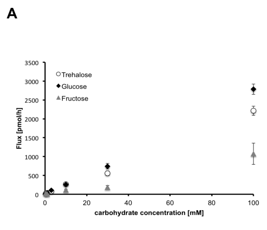

## Question

# Gene Research for Functional Annotation

## ⚠️ CRITICAL: Gene/Protein Identification Context

**BEFORE YOU BEGIN RESEARCH:** You MUST verify you are researching the CORRECT gene/protein. Gene symbols can be ambiguous, especially for less well-characterized genes from non-model organisms.

### Target Gene/Protein Identity (from UniProt):
- **UniProt Accession:** A1Z8N1
- **Protein Description:** RecName: Full=Trehalose transporter 1 {ECO:0000312|FlyBase:FBgn0050035}; AltName: Full=Facilitated trehalose transporter Tret1-1 {ECO:0000303|PubMed:20035867}; Short=DmTret1-1 {ECO:0000303|PubMed:20035867};
- **Gene Information:** Name=Tret1 {ECO:0000312|FlyBase:FBgn0050035}; Synonyms=Tret1-1 {ECO:0000303|PubMed:20035867}; ORFNames=CG30035 {ECO:0000312|FlyBase:FBgn0050035};
- **Organism (full):** Drosophila melanogaster (Fruit fly).
- **Protein Family:** Belongs to the major facilitator superfamily. Sugar
- **Key Domains:** MFS_dom. (IPR020846); MFS_ERD6/Tret1-like. (IPR044775); MFS_sugar_transport-like. (IPR005828); MFS_trans_sf. (IPR036259); MFS_Trehalose_Transporter. (IPR050549)

### MANDATORY VERIFICATION STEPS:

1. **Check if the gene symbol "Tret1" matches the protein description above**
2. **Verify the organism is correct:** Drosophila melanogaster (Fruit fly).
3. **Check if protein family/domains align with what you find in literature**
4. **If you find literature for a DIFFERENT gene with the same or similar symbol, STOP**

### If Gene Symbol is Ambiguous or You Cannot Find Relevant Literature:

**DO NOT PROCEED WITH RESEARCH ON A DIFFERENT GENE.** Instead:
- State clearly: "The gene symbol 'Tret1' is ambiguous or literature is limited for this specific protein"
- Explain what you found (e.g., "Found extensive literature on a different gene with the same symbol in a different organism")
- Describe the protein based ONLY on the UniProt information provided above
- Suggest that the protein function can be inferred from domain/family information

### Research Target:

Please provide a comprehensive research report on the gene **Tret1** (gene ID: Tret1, UniProt: A1Z8N1) in DROME.

The research report should be a detailed narrative explaining the function, biological processes, and localization of the gene product. Citations should be given for all claims.

You should prioritize authoritative reviews and primary scientific literature when conducting research. You can supplement
this with annotations you find in gene/protein databases, but these can be outdated or inaccurate.

We are specifically interested in the primary function of the gene - for enzymes, what reaction is catalyzed, and what is the substrate specificity? For transporters, what is the substrate? For structural proteins or adapters, what is the broader structural role? For signaling molecules, what is the role in the pathway.

We are interested in where in or outside the cell the gene product carries out its function.

We are also interested in the signaling or biochemical pathways in which the gene functions. We are less interested in broad pleiotropic effects, except where these elucidate the precise role.

Include evidence where possible. We are interested in both experimental evidence as well as inference from structure, evolution, or bioinformatic analysis. Precise studies should be prioritized over high-throughput, where available.

## Output

Question: You are an expert researcher providing comprehensive, well-cited information.

Provide detailed information focusing on:
1. Key concepts and definitions with current understanding
2. Recent developments and latest research (prioritize 2023-2024 sources)
3. Current applications and real-world implementations
4. Expert opinions and analysis from authoritative sources
5. Relevant statistics and data from recent studies

Format as a comprehensive research report with proper citations. Include URLs and publication dates where available.
Always prioritize recent, authoritative sources and provide specific citations for all major claims.

# Gene Research for Functional Annotation

## ⚠️ CRITICAL: Gene/Protein Identification Context

**BEFORE YOU BEGIN RESEARCH:** You MUST verify you are researching the CORRECT gene/protein. Gene symbols can be ambiguous, especially for less well-characterized genes from non-model organisms.

### Target Gene/Protein Identity (from UniProt):
- **UniProt Accession:** A1Z8N1
- **Protein Description:** RecName: Full=Trehalose transporter 1 {ECO:0000312|FlyBase:FBgn0050035}; AltName: Full=Facilitated trehalose transporter Tret1-1 {ECO:0000303|PubMed:20035867}; Short=DmTret1-1 {ECO:0000303|PubMed:20035867};
- **Gene Information:** Name=Tret1 {ECO:0000312|FlyBase:FBgn0050035}; Synonyms=Tret1-1 {ECO:0000303|PubMed:20035867}; ORFNames=CG30035 {ECO:0000312|FlyBase:FBgn0050035};
- **Organism (full):** Drosophila melanogaster (Fruit fly).
- **Protein Family:** Belongs to the major facilitator superfamily. Sugar
- **Key Domains:** MFS_dom. (IPR020846); MFS_ERD6/Tret1-like. (IPR044775); MFS_sugar_transport-like. (IPR005828); MFS_trans_sf. (IPR036259); MFS_Trehalose_Transporter. (IPR050549)

### MANDATORY VERIFICATION STEPS:

1. **Check if the gene symbol "Tret1" matches the protein description above**
2. **Verify the organism is correct:** Drosophila melanogaster (Fruit fly).
3. **Check if protein family/domains align with what you find in literature**
4. **If you find literature for a DIFFERENT gene with the same or similar symbol, STOP**

### If Gene Symbol is Ambiguous or You Cannot Find Relevant Literature:

**DO NOT PROCEED WITH RESEARCH ON A DIFFERENT GENE.** Instead:
- State clearly: "The gene symbol 'Tret1' is ambiguous or literature is limited for this specific protein"
- Explain what you found (e.g., "Found extensive literature on a different gene with the same symbol in a different organism")
- Describe the protein based ONLY on the UniProt information provided above
- Suggest that the protein function can be inferred from domain/family information

### Research Target:

Please provide a comprehensive research report on the gene **Tret1** (gene ID: Tret1, UniProt: A1Z8N1) in DROME.

The research report should be a detailed narrative explaining the function, biological processes, and localization of the gene product. Citations should be given for all claims.

You should prioritize authoritative reviews and primary scientific literature when conducting research. You can supplement
this with annotations you find in gene/protein databases, but these can be outdated or inaccurate.

We are specifically interested in the primary function of the gene - for enzymes, what reaction is catalyzed, and what is the substrate specificity? For transporters, what is the substrate? For structural proteins or adapters, what is the broader structural role? For signaling molecules, what is the role in the pathway.

We are interested in where in or outside the cell the gene product carries out its function.

We are also interested in the signaling or biochemical pathways in which the gene functions. We are less interested in broad pleiotropic effects, except where these elucidate the precise role.

Include evidence where possible. We are interested in both experimental evidence as well as inference from structure, evolution, or bioinformatic analysis. Precise studies should be prioritized over high-throughput, where available.

# Functional annotation of *Drosophila melanogaster* Tret1

## Identity and principal function

**The gene examined is *Tret1* (CG30035; FlyBase FBgn0050035), also called *Tret1-1*, encoding UniProt A1Z8N1—not the separate fly paralog *Tret1-2* or a similarly named transporter in another insect.** The supplied UniProt record classifies it as a major-facilitator-superfamily sugar transporter; experimental work describes a predicted 12-transmembrane-domain protein and confirms transport activity. This is a **transporter, not a trehalose-synthesizing or trehalose-cleaving enzyme**. (hertenstein2021starvationinducedregulationof pages 15-16, volkenhoff2015glialglycolysisis pages 2-4)

Its experimentally supported substrates are **trehalose and glucose**. When the fly Tret1-1PA protein was expressed in *Xenopus* oocytes, radiotracer assays detected uptake of both sugars, whereas fructose uptake was minor. The 2021 investigators tested concentrations spanning 0.3–300 mM; those assay concentrations must not be mistaken for an affinity or a physiological substrate concentration. Transport of circulating sugar **into** perineurial glia is the supported physiological role. The uptake assays do not establish that transport is intrinsically one-way, and the available evidence does not justify a numerical *K*m, *V*max, or a claim that the protein transports trehalose exclusively. See the cropped substrate-assay panel of Figure 5. (hertenstein2021starvationinducedregulationof pages 6-8, hertenstein2021starvationinducedregulationof pages 20-21, hertenstein2021starvationinducedregulationof pages 8-9, hertenstein2021starvationinducedregulationof media 3298d77e)

The close paralog *Tret1-2* arose through a relatively recent duplication. Earlier oocyte experiments detected trehalose transport for Tret1-1 but not Tret1-2; both genes can nevertheless contribute to fly phenotypes, so their experimental results should not be pooled. In particular, an early deletion removed **both** genes, whereas subsequently generated CRISPR alleles affected Tret1-1 specifically. (volkenhoff2015glialglycolysisis pages 2-4, volkenhoff2015glialglycolysisis pages 4-5)

The following table separates observations on this fly protein from functional inference.

| Functional annotation | Strongest direct result | Interpretation and limitation | Citation(s) |
|---|---|---|---|
| **Substrate uptake** | Heterologous Tret1-1PA expression in *Xenopus* oocytes increased radiolabeled **trehalose and glucose** uptake, whereas fructose uptake was minor. Assays covered 0.3–300 mM substrate, but verified kinetic constants and absolute rates are unavailable here. | Directly supports Tret1-1 as a trehalose/glucose facilitative transporter, rather than a strictly trehalose-specific carrier. Oocytes establish transport capability but not physiological direction or substrate preference in flies. | (hertenstein2021starvationinducedregulationof pages 8-9) |
| **Cellular localization** | Tret1-1PA occurs at the **plasma membrane and in intracellular vesicles of perineurial glia**. A genomic Tret1-1–HA construct was also expressed in fat body; failure of the PA-specific antibody to detect fat-body protein suggests—but does not prove—predominant PB-isoform expression there. | The plasma membrane is the functional transport site, while vesicles form a regulated intracellular pool. Fat-body isoform assignment is inferential rather than isoform-resolved biochemical evidence. | (hertenstein2021starvationinducedregulationof pages 6-8, volkenhoff2015glialglycolysisis pages 4-5) |
| **Physiological glial requirement** | Tret1-1-specific CRISPR alleles caused pupal lethality over a deficiency. Rescue failed when Tret1-1 expression was excluded from glia but succeeded when excluded from neurons. Starvation increased perineurial-glial Tret1-1 fluorescence approximately **2–3-fold**; ex-vivo FRET showed increased glucose uptake in starved brains, which was abolished by BBB-glial Tret1-1 RNAi. | Strong genetic evidence identifies glia as the principal essential site and links Tret1-1 to starvation-adaptive glucose uptake. The FRET assay measured glucose because no comparable trehalose sensor was available. | (hertenstein2021starvationinducedregulationof pages 6-8, hertenstein2021starvationinducedregulationof pages 8-9, volkenhoff2015glialglycolysisis pages 4-5) |
| **Trafficking and signaling** | Rab10 disruption caused cytosolic Tret1-1 accumulation, consistent with defective plasma-membrane delivery. Starvation induction required glial **Punt/Put and Thickveins/Tkv**; Gbb overexpression induced Tret1-1 in fed animals, whereas Dpp did not. | Supports a model in which **Gbb → Put/Tkv BMP signaling** controls transporter abundance and Rab10-dependent trafficking controls membrane availability. Direct promoter occupancy by pathway transcription factors was not established. | (hertenstein2021starvationinducedregulationof pages 11-13) |
| **Immune lamellocytes—2024** | Parasitoid infection increased **Tret1-1-RA 31-fold**, with expression concentrated in lamellocytes. Hemocyte RNAi left approximately **one-third** of control infection-induced expression and produced only small reductions in trehalose-derived labeled G6P and lamellocyte number; an MFS3/Tret1-1 double-null likewise caused only a modest reduction. | Tret1-1 contributes to infection-induced carbohydrate acquisition, but transporter redundancy limits its individual requirement. These experiments cannot assign every effect specifically to trehalose rather than glucose transport. | (kazek2024glucoseandtrehalose pages 11-13) |
| **Adult tracheal expression—2023** | Transcriptomics found trehalose-transporter transcripts enriched in adult relative to larval trachea. | Supports tissue expression and a candidate metabolic role only; it does not demonstrate Tret1-1 protein localization or transport activity in tracheal cells. | (bossen2023adultandlarval pages 8-10) |

*Table: Evidence hierarchy for Drosophila melanogaster Tret1/CG30035/Tret1-1 (UniProt A1Z8N1), separating direct functional evidence from inference and known limitations. Principal sources: https://doi.org/10.1016/j.cmet.2015.07.006, https://doi.org/10.7554/eLife.62503, and https://doi.org/10.1371/journal.pbio.3002299.*

## Where Tret1-1 acts

The **best-established cellular site is the perineurial glial layer**, the outer, hemolymph-facing component of the fly blood–brain barrier (BBB). Beneath it, subperineurial glia form septate junctions that restrict paracellular entry; nutrient import therefore requires cellular transport. Tret1-1PA immunostaining and a functional tagged genomic construct place the protein prominently in perineurial glia. Within these cells it occurs at the **plasma membrane**, where it can transport sugar, and in **intracellular vesicles**, consistent with regulated membrane availability. It is not appropriately annotated as a secreted protein or as a component of the junctional barrier itself. (hertenstein2021starvationinducedregulationof pages 2-3, hertenstein2021starvationinducedregulationof pages 3-6, volkenhoff2015glialglycolysisis pages 2-4, volkenhoff2015glialglycolysisis pages 4-5)

Evidence for the importance of this location is genetic rather than merely anatomical. Glial—but not neuronal—Tret1-1 knockdown produced a strong locomotor defect. Tret1-1-specific CRISPR mutations caused pupal lethality over the relevant deficiency; expressing Tret1-1 everywhere **except glia** failed to rescue the deletion phenotype, whereas expression everywhere **except neurons** rescued it. These experiments identify an essential glial function, although the underlying neuronal energetic consequences should not all be attributed uniquely to Tret1-1. (volkenhoff2015glialglycolysisis pages 2-4, volkenhoff2015glialglycolysisis pages 4-5)

Expression is **not confined to the BBB throughout the animal**. A rescuing genomic Tret1-1–HA construct was detected in the fat body; because the PA-specific antibody did not detect fat-body protein, the authors proposed that another isoform, PB, predominates there, but did not establish that assignment directly. More recent transcriptomic evidence implicates additional contexts: Tret1-1 transcripts rise in infection-induced larval **lamellocytes**, and 2023 comparative tracheal transcriptomics reports greater trehalose-transporter transcript expression in **adult than larval tracheae**. Transcript detection alone does not establish precise tracheal protein localization or transport flux. (volkenhoff2015glialglycolysisis pages 4-5, kazek2024glucoseandtrehalose pages 2-3, bossen2023adultandlarval pages 8-10)

## Biochemical and signaling context

Insects circulate substantial trehalose alongside glucose. At the BBB, Tret1-1 is positioned to capture these circulating carbohydrates for glial energy metabolism and, indirectly, nervous-system nutrient supply. Once inside cells, trehalose can be cleaved to glucose by **trehalase**, followed by glycolysis or other glucose-dependent pathways; cleavage is **not** catalyzed by Tret1-1. Work on glial glycolysis supports metabolic coupling between glia and neurons, but does not establish that Tret1-1 alone determines the identity or amount of every metabolite delivered to neurons. (hertenstein2021starvationinducedregulationof pages 2-3, volkenhoff2015glialglycolysisis pages 2-4, kazek2024glucoseandtrehalose pages 2-3)

The most precisely defined regulatory pathway is a **starvation-responsive Gbb/BMP branch of TGF-β signaling**. Following nutrient restriction, glial Tret1-1 promoter activity and protein staining increase; measured perineurial-glial fluorescence rose about **two- to threefold** relative to fed larvae. Feeding sugar alone prevented this induction. Glial knockdown of the receptors **Punt (Put; type II)** or **Thickveins (Tkv; type I)** prevented starvation-induced Tret1-1 upregulation, while local overexpression of the BMP ligand **Glass-bottom boat (Gbb)** increased expression in fed animals; overexpression of the alternative ligand Dpp did not. The experiments support the functional sequence **nutritional stress → increased Gbb/BMP signaling through Put/Tkv → increased Tret1-1 expression**. They do not show direct binding of a pathway transcription factor to the *Tret1* promoter. Insulin-receptor inhibition, adipokinetic-hormone mutations, and glial ALK inhibition did not abolish the observed starvation response. (hertenstein2021starvationinducedregulationof pages 6-8, hertenstein2021starvationinducedregulationof pages 9-11, hertenstein2021starvationinducedregulationof pages 11-13, hertenstein2021starvationinducedregulationof pages 13-15)

Regulation also operates at the **trafficking** level. Perturbing Rab10 caused Tret1-1 to accumulate inside perineurial glia, consistent with impaired delivery to their plasma membrane; Rab7 disruption decreased detectable transporter. Starvation increases membrane-associated Tret1-1, but the investigators could not establish whether its *fraction* at the membrane rose independently of the increase in total protein. In excised larval brains, a glucose-sensitive FRET reporter showed faster glucose uptake after starvation; BBB-glial Tret1-1 knockdown abolished that increase. This directly links the transporter to adaptive **glucose** uptake, whereas corresponding real-time measurements of **trehalose** uptake in living BBB glia were unavailable. The cropped Figure 5 FRET panels illustrate that distinction. (hertenstein2021starvationinducedregulationof pages 2-3, hertenstein2021starvationinducedregulationof pages 3-6, hertenstein2021starvationinducedregulationof pages 8-9, hertenstein2021starvationinducedregulationof media 6c407cdb)

## 2023–2024 developments: immune-cell carbohydrate supply

The most informative recent fly-specific study is **Kazek and colleagues, published 7 May 2024**. After parasitoid-wasp infection, the *Tret1-1-RA* transcript increased **31-fold** in hemocytes, while *Tret1-1-RB* did not; single-cell evidence associated the induced expression principally with differentiated lamellocytes. In the same cells, cytoplasmic trehalase transcripts increased approximately **35-fold**. Isotope-labeling experiments linked infection to increased carbohydrate uptake and metabolism through glycolysis and the cyclic pentose-phosphate pathway, but measured mixed hemocyte populations at limited time points, not Tret1-1-specific transport flux in individual lamellocytes. (kazek2024glucoseandtrehalose pages 2-3, kazek2024glucoseandtrehalose pages 5-7, kazek2024glucoseandtrehalose pages 7-10)

The gene-specific perturbations appropriately narrow the interpretation. Hemocyte-specific *Tret1-1* RNAi left approximately **one-third** of control expression after infection; incorporation of labeled trehalose-derived carbon into glucose-6-phosphate and lamellocyte numbers fell **only slightly**. A combined *MFS3/Tret1-1* null genotype likewise produced only a modest lamellocyte reduction, consistent with additional transport routes. By comparison, lowering systemic trehalose to **20% of control** with a *Tps1* hypomorph, or blocking trehalose cleavage with a *Treh* null mutation, produced clearer defects in lamellocyte differentiation. Those systemic phenotypes are **not** evidence that Tret1-1 itself is the sole required trehalose importer. The same study found that loss of hemocyte trehalase did not prevent lamellocyte differentiation cell-autonomously, further separating sugar *availability and transport* from intracellular trehalose *catabolism*. (kazek2024glucoseandtrehalose pages 11-13, kazek2024glucoseandtrehalose pages 13-16)

## Assessment and applications

**High-confidence functional annotation:** Tret1-1/A1Z8N1 is a fly membrane facilitator capable of importing **trehalose and glucose**, with its clearest established physiological action at the **perineurial-glial plasma membrane** during nutritional adaptation. **Additional, context-dependent role:** it contributes to carbohydrate acquisition by infection-activated lamellocytes, alongside redundant transporters. The strongest experimental applications are as a genetically tractable model for **regulated nutrient entry at an insect BBB**, glia–neuron metabolic coupling, and immune-cell sugar allocation—not as an established clinical target or proof that identical regulatory mechanisms operate at the human BBB. The 2010 original insect-transporter study could be identified, but its full text was unavailable here; consequently, kinetic constants attributed to that study have deliberately not been reported. (hertenstein2021starvationinducedregulationof pages 8-9, hertenstein2021starvationinducedregulationof pages 11-13, volkenhoff2015glialglycolysisis pages 4-5, kazek2024glucoseandtrehalose pages 11-13)

### Principal sources and publication dates

- Volkenhoff *et al.*, **September 2015**, *Cell Metabolism*, “Glial Glycolysis Is Essential for Neuronal Survival in Drosophila”: https://doi.org/10.1016/j.cmet.2015.07.006. Primary glial genetics, rescue, and localization. (volkenhoff2015glialglycolysisis pages 2-4, volkenhoff2015glialglycolysisis pages 4-5)
- Hertenstein *et al.*, **May 2021**, *eLife*, “Starvation-induced regulation of carbohydrate transport at the blood–brain barrier is TGF-β-signaling dependent”: https://doi.org/10.7554/eLife.62503. Primary substrate, FRET, trafficking, and signaling experiments. (hertenstein2021starvationinducedregulationof pages 6-8, hertenstein2021starvationinducedregulationof pages 8-9, hertenstein2021starvationinducedregulationof pages 11-13)
- Kazek *et al.*, **7 May 2024**, *PLOS Biology*, “Glucose and trehalose metabolism through the cyclic pentose phosphate pathway shapes pathogen resistance and host protection in Drosophila”: https://doi.org/10.1371/journal.pbio.3002299. Primary immune-cell expression, isotope tracing, and genetic perturbations. (kazek2024glucoseandtrehalose pages 2-3, kazek2024glucoseandtrehalose pages 11-13)
- Bossen *et al.*, **March 2023**, *International Journal of Molecular Sciences*, “Adult and Larval Tracheal Systems Exhibit Different Molecular Architectures in Drosophila”: https://doi.org/10.3390/ijms24065628. Comparative tissue-expression evidence, not a direct Tret1-1 transport assay. (bossen2023adultandlarval pages 8-10)
- Kanamori *et al.*, **January 2010**, *Insect Biochemistry and Molecular Biology*, “The trehalose transporter 1 gene sequence is conserved in insects and encodes proteins with different kinetic properties involved in trehalose import into peripheral tissues”: https://doi.org/10.1016/j.ibmb.2009.12.006. Original study cited for oocyte trehalose transport; its full text was not available for independent extraction of kinetic values. (hertenstein2021starvationinducedregulationof pages 2-3, volkenhoff2015glialglycolysisis pages 2-4)

References

1. (hertenstein2021starvationinducedregulationof pages 15-16): Helen Hertenstein, Ellen McMullen, Astrid Weiler, Anne Volkenhoff, Holger M Becker, and Stefanie Schirmeier. Starvation-induced regulation of carbohydrate transport at the blood–brain barrier is tgf-β-signaling dependent. eLife, May 2021. URL: https://doi.org/10.7554/elife.62503, doi:10.7554/elife.62503. This article has 53 citations and is from a domain leading peer-reviewed journal.

2. (volkenhoff2015glialglycolysisis pages 2-4): Anne Volkenhoff, Astrid Weiler, Matthias Letzel, Martin Stehling, Christian Klämbt, and Stefanie Schirmeier. Glial glycolysis is essential for neuronal survival in drosophila. Cell metabolism, 22 3:437-47, Sep 2015. URL: https://doi.org/10.1016/j.cmet.2015.07.006, doi:10.1016/j.cmet.2015.07.006. This article has 401 citations and is from a highest quality peer-reviewed journal.

3. (hertenstein2021starvationinducedregulationof pages 6-8): Helen Hertenstein, Ellen McMullen, Astrid Weiler, Anne Volkenhoff, Holger M Becker, and Stefanie Schirmeier. Starvation-induced regulation of carbohydrate transport at the blood–brain barrier is tgf-β-signaling dependent. eLife, May 2021. URL: https://doi.org/10.7554/elife.62503, doi:10.7554/elife.62503. This article has 53 citations and is from a domain leading peer-reviewed journal.

4. (hertenstein2021starvationinducedregulationof pages 20-21): Helen Hertenstein, Ellen McMullen, Astrid Weiler, Anne Volkenhoff, Holger M Becker, and Stefanie Schirmeier. Starvation-induced regulation of carbohydrate transport at the blood–brain barrier is tgf-β-signaling dependent. eLife, May 2021. URL: https://doi.org/10.7554/elife.62503, doi:10.7554/elife.62503. This article has 53 citations and is from a domain leading peer-reviewed journal.

5. (hertenstein2021starvationinducedregulationof pages 8-9): Helen Hertenstein, Ellen McMullen, Astrid Weiler, Anne Volkenhoff, Holger M Becker, and Stefanie Schirmeier. Starvation-induced regulation of carbohydrate transport at the blood–brain barrier is tgf-β-signaling dependent. eLife, May 2021. URL: https://doi.org/10.7554/elife.62503, doi:10.7554/elife.62503. This article has 53 citations and is from a domain leading peer-reviewed journal.

6. (hertenstein2021starvationinducedregulationof media 3298d77e): Helen Hertenstein, Ellen McMullen, Astrid Weiler, Anne Volkenhoff, Holger M Becker, and Stefanie Schirmeier. Starvation-induced regulation of carbohydrate transport at the blood–brain barrier is tgf-β-signaling dependent. eLife, May 2021. URL: https://doi.org/10.7554/elife.62503, doi:10.7554/elife.62503. This article has 53 citations and is from a domain leading peer-reviewed journal.

7. (volkenhoff2015glialglycolysisis pages 4-5): Anne Volkenhoff, Astrid Weiler, Matthias Letzel, Martin Stehling, Christian Klämbt, and Stefanie Schirmeier. Glial glycolysis is essential for neuronal survival in drosophila. Cell metabolism, 22 3:437-47, Sep 2015. URL: https://doi.org/10.1016/j.cmet.2015.07.006, doi:10.1016/j.cmet.2015.07.006. This article has 401 citations and is from a highest quality peer-reviewed journal.

8. (hertenstein2021starvationinducedregulationof pages 11-13): Helen Hertenstein, Ellen McMullen, Astrid Weiler, Anne Volkenhoff, Holger M Becker, and Stefanie Schirmeier. Starvation-induced regulation of carbohydrate transport at the blood–brain barrier is tgf-β-signaling dependent. eLife, May 2021. URL: https://doi.org/10.7554/elife.62503, doi:10.7554/elife.62503. This article has 53 citations and is from a domain leading peer-reviewed journal.

9. (kazek2024glucoseandtrehalose pages 11-13): Michalina Kazek, Lenka Chodáková, Katharina Lehr, Lukáš Strych, Pavla Nedbalová, Ellen McMullen, Adam Bajgar, Stanislav Opekar, Petr Šimek, Martin Moos, and Tomáš Doležal. Glucose and trehalose metabolism through the cyclic pentose phosphate pathway shapes pathogen resistance and host protection in drosophila. PLOS Biology, 22:e3002299, May 2024. URL: https://doi.org/10.1371/journal.pbio.3002299, doi:10.1371/journal.pbio.3002299. This article has 29 citations and is from a highest quality peer-reviewed journal.

10. (bossen2023adultandlarval pages 8-10): Judith Bossen, Ruben Prange, Jan-Philip Kühle, Sven Künzel, Xiao Niu, Jörg U. Hammel, Laura Krieger, Mirjam Knop, Birte Ehrhardt, Karin Uliczka, Susanne Krauss-Etschmann, and Thomas Roeder. Adult and larval tracheal systems exhibit different molecular architectures in drosophila. International Journal of Molecular Sciences, 24:5628, Mar 2023. URL: https://doi.org/10.3390/ijms24065628, doi:10.3390/ijms24065628. This article has 15 citations.

11. (hertenstein2021starvationinducedregulationof pages 2-3): Helen Hertenstein, Ellen McMullen, Astrid Weiler, Anne Volkenhoff, Holger M Becker, and Stefanie Schirmeier. Starvation-induced regulation of carbohydrate transport at the blood–brain barrier is tgf-β-signaling dependent. eLife, May 2021. URL: https://doi.org/10.7554/elife.62503, doi:10.7554/elife.62503. This article has 53 citations and is from a domain leading peer-reviewed journal.

12. (hertenstein2021starvationinducedregulationof pages 3-6): Helen Hertenstein, Ellen McMullen, Astrid Weiler, Anne Volkenhoff, Holger M Becker, and Stefanie Schirmeier. Starvation-induced regulation of carbohydrate transport at the blood–brain barrier is tgf-β-signaling dependent. eLife, May 2021. URL: https://doi.org/10.7554/elife.62503, doi:10.7554/elife.62503. This article has 53 citations and is from a domain leading peer-reviewed journal.

13. (kazek2024glucoseandtrehalose pages 2-3): Michalina Kazek, Lenka Chodáková, Katharina Lehr, Lukáš Strych, Pavla Nedbalová, Ellen McMullen, Adam Bajgar, Stanislav Opekar, Petr Šimek, Martin Moos, and Tomáš Doležal. Glucose and trehalose metabolism through the cyclic pentose phosphate pathway shapes pathogen resistance and host protection in drosophila. PLOS Biology, 22:e3002299, May 2024. URL: https://doi.org/10.1371/journal.pbio.3002299, doi:10.1371/journal.pbio.3002299. This article has 29 citations and is from a highest quality peer-reviewed journal.

14. (hertenstein2021starvationinducedregulationof pages 9-11): Helen Hertenstein, Ellen McMullen, Astrid Weiler, Anne Volkenhoff, Holger M Becker, and Stefanie Schirmeier. Starvation-induced regulation of carbohydrate transport at the blood–brain barrier is tgf-β-signaling dependent. eLife, May 2021. URL: https://doi.org/10.7554/elife.62503, doi:10.7554/elife.62503. This article has 53 citations and is from a domain leading peer-reviewed journal.

15. (hertenstein2021starvationinducedregulationof pages 13-15): Helen Hertenstein, Ellen McMullen, Astrid Weiler, Anne Volkenhoff, Holger M Becker, and Stefanie Schirmeier. Starvation-induced regulation of carbohydrate transport at the blood–brain barrier is tgf-β-signaling dependent. eLife, May 2021. URL: https://doi.org/10.7554/elife.62503, doi:10.7554/elife.62503. This article has 53 citations and is from a domain leading peer-reviewed journal.

16. (hertenstein2021starvationinducedregulationof media 6c407cdb): Helen Hertenstein, Ellen McMullen, Astrid Weiler, Anne Volkenhoff, Holger M Becker, and Stefanie Schirmeier. Starvation-induced regulation of carbohydrate transport at the blood–brain barrier is tgf-β-signaling dependent. eLife, May 2021. URL: https://doi.org/10.7554/elife.62503, doi:10.7554/elife.62503. This article has 53 citations and is from a domain leading peer-reviewed journal.

17. (kazek2024glucoseandtrehalose pages 5-7): Michalina Kazek, Lenka Chodáková, Katharina Lehr, Lukáš Strych, Pavla Nedbalová, Ellen McMullen, Adam Bajgar, Stanislav Opekar, Petr Šimek, Martin Moos, and Tomáš Doležal. Glucose and trehalose metabolism through the cyclic pentose phosphate pathway shapes pathogen resistance and host protection in drosophila. PLOS Biology, 22:e3002299, May 2024. URL: https://doi.org/10.1371/journal.pbio.3002299, doi:10.1371/journal.pbio.3002299. This article has 29 citations and is from a highest quality peer-reviewed journal.

18. (kazek2024glucoseandtrehalose pages 7-10): Michalina Kazek, Lenka Chodáková, Katharina Lehr, Lukáš Strych, Pavla Nedbalová, Ellen McMullen, Adam Bajgar, Stanislav Opekar, Petr Šimek, Martin Moos, and Tomáš Doležal. Glucose and trehalose metabolism through the cyclic pentose phosphate pathway shapes pathogen resistance and host protection in drosophila. PLOS Biology, 22:e3002299, May 2024. URL: https://doi.org/10.1371/journal.pbio.3002299, doi:10.1371/journal.pbio.3002299. This article has 29 citations and is from a highest quality peer-reviewed journal.

19. (kazek2024glucoseandtrehalose pages 13-16): Michalina Kazek, Lenka Chodáková, Katharina Lehr, Lukáš Strych, Pavla Nedbalová, Ellen McMullen, Adam Bajgar, Stanislav Opekar, Petr Šimek, Martin Moos, and Tomáš Doležal. Glucose and trehalose metabolism through the cyclic pentose phosphate pathway shapes pathogen resistance and host protection in drosophila. PLOS Biology, 22:e3002299, May 2024. URL: https://doi.org/10.1371/journal.pbio.3002299, doi:10.1371/journal.pbio.3002299. This article has 29 citations and is from a highest quality peer-reviewed journal.

## Artifacts

- [Edison artifact artifact-00](Tret1-deep-research-falcon_artifacts/artifact-00.md)

## Citations

1. hertenstein2021starvationinducedregulationof pages 8-9
2. hertenstein2021starvationinducedregulationof pages 11-13
3. kazek2024glucoseandtrehalose pages 11-13
4. bossen2023adultandlarval pages 8-10
5. hertenstein2021starvationinducedregulationof pages 15-16
6. volkenhoff2015glialglycolysisis pages 2-4
7. hertenstein2021starvationinducedregulationof pages 6-8
8. hertenstein2021starvationinducedregulationof pages 20-21
9. volkenhoff2015glialglycolysisis pages 4-5
10. hertenstein2021starvationinducedregulationof pages 2-3
11. hertenstein2021starvationinducedregulationof pages 3-6
12. kazek2024glucoseandtrehalose pages 2-3
13. hertenstein2021starvationinducedregulationof pages 9-11
14. hertenstein2021starvationinducedregulationof pages 13-15
15. kazek2024glucoseandtrehalose pages 5-7
16. kazek2024glucoseandtrehalose pages 7-10
17. kazek2024glucoseandtrehalose pages 13-16
18. https://doi.org/10.1016/j.cmet.2015.07.006,
19. https://doi.org/10.7554/eLife.62503,
20. https://doi.org/10.1371/journal.pbio.3002299.*
21. https://doi.org/10.1016/j.cmet.2015.07.006.
22. https://doi.org/10.7554/eLife.62503.
23. https://doi.org/10.1371/journal.pbio.3002299.
24. https://doi.org/10.3390/ijms24065628.
25. https://doi.org/10.1016/j.ibmb.2009.12.006.
26. https://doi.org/10.7554/elife.62503,
27. https://doi.org/10.1371/journal.pbio.3002299,
28. https://doi.org/10.3390/ijms24065628,