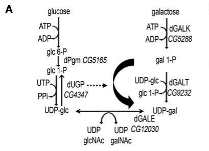

## Question

# Gene Research for Functional Annotation

## ⚠️ CRITICAL: Gene/Protein Identification Context

**BEFORE YOU BEGIN RESEARCH:** You MUST verify you are researching the CORRECT gene/protein. Gene symbols can be ambiguous, especially for less well-characterized genes from non-model organisms.

### Target Gene/Protein Identity (from UniProt):
- **UniProt Accession:** Q9VSW1
- **Protein Description:** RecName: Full=UTP--glucose-1-phosphate uridylyltransferase {ECO:0000256|ARBA:ARBA00019048, ECO:0000256|PIRNR:PIRNR000806}; EC=2.7.7.9 {ECO:0000256|ARBA:ARBA00012415, ECO:0000256|PIRNR:PIRNR000806};
- **Gene Information:** Name=Ugp {ECO:0000313|FlyBase:FBgn0035978}; Synonyms=Dmel\CG4347 {ECO:0000313|EMBL:AAF50300.2}, dUGP {ECO:0000313|EMBL:AAF50300.2}, UDPGPP {ECO:0000313|EMBL:AAF50300.2}, UGP {ECO:0000313|EMBL:AAF50300.2}, UGPase {ECO:0000313|EMBL:AAF50300.2}; ORFNames=CG4347 {ECO:0000313|EMBL:AAF50300.2, ECO:0000313|FlyBase:FBgn0035978}, Dmel_CG4347 {ECO:0000313|EMBL:AAF50300.2};
- **Organism (full):** Drosophila melanogaster (Fruit fly).
- **Protein Family:** Belongs to the UDPGP type 1 family.
- **Key Domains:** Nucleotide-diphossugar_trans. (IPR029044); UDPGP_fam. (IPR002618); UDPGP_trans. (IPR016267); UDPGP (PF01704)

### MANDATORY VERIFICATION STEPS:

1. **Check if the gene symbol "Ugp" matches the protein description above**
2. **Verify the organism is correct:** Drosophila melanogaster (Fruit fly).
3. **Check if protein family/domains align with what you find in literature**
4. **If you find literature for a DIFFERENT gene with the same or similar symbol, STOP**

### If Gene Symbol is Ambiguous or You Cannot Find Relevant Literature:

**DO NOT PROCEED WITH RESEARCH ON A DIFFERENT GENE.** Instead:
- State clearly: "The gene symbol 'Ugp' is ambiguous or literature is limited for this specific protein"
- Explain what you found (e.g., "Found extensive literature on a different gene with the same symbol in a different organism")
- Describe the protein based ONLY on the UniProt information provided above
- Suggest that the protein function can be inferred from domain/family information

### Research Target:

Please provide a comprehensive research report on the gene **Ugp** (gene ID: Ugp, UniProt: Q9VSW1) in DROME.

The research report should be a detailed narrative explaining the function, biological processes, and localization of the gene product. Citations should be given for all claims.

You should prioritize authoritative reviews and primary scientific literature when conducting research. You can supplement
this with annotations you find in gene/protein databases, but these can be outdated or inaccurate.

We are specifically interested in the primary function of the gene - for enzymes, what reaction is catalyzed, and what is the substrate specificity? For transporters, what is the substrate? For structural proteins or adapters, what is the broader structural role? For signaling molecules, what is the role in the pathway.

We are interested in where in or outside the cell the gene product carries out its function.

We are also interested in the signaling or biochemical pathways in which the gene functions. We are less interested in broad pleiotropic effects, except where these elucidate the precise role.

Include evidence where possible. We are interested in both experimental evidence as well as inference from structure, evolution, or bioinformatic analysis. Precise studies should be prioritized over high-throughput, where available.

## Output

Question: You are an expert researcher providing comprehensive, well-cited information.

Provide detailed information focusing on:
1. Key concepts and definitions with current understanding
2. Recent developments and latest research (prioritize 2023-2024 sources)
3. Current applications and real-world implementations
4. Expert opinions and analysis from authoritative sources
5. Relevant statistics and data from recent studies

Format as a comprehensive research report with proper citations. Include URLs and publication dates where available.
Always prioritize recent, authoritative sources and provide specific citations for all major claims.

# Gene Research for Functional Annotation

## ⚠️ CRITICAL: Gene/Protein Identification Context

**BEFORE YOU BEGIN RESEARCH:** You MUST verify you are researching the CORRECT gene/protein. Gene symbols can be ambiguous, especially for less well-characterized genes from non-model organisms.

### Target Gene/Protein Identity (from UniProt):
- **UniProt Accession:** Q9VSW1
- **Protein Description:** RecName: Full=UTP--glucose-1-phosphate uridylyltransferase {ECO:0000256|ARBA:ARBA00019048, ECO:0000256|PIRNR:PIRNR000806}; EC=2.7.7.9 {ECO:0000256|ARBA:ARBA00012415, ECO:0000256|PIRNR:PIRNR000806};
- **Gene Information:** Name=Ugp {ECO:0000313|FlyBase:FBgn0035978}; Synonyms=Dmel\CG4347 {ECO:0000313|EMBL:AAF50300.2}, dUGP {ECO:0000313|EMBL:AAF50300.2}, UDPGPP {ECO:0000313|EMBL:AAF50300.2}, UGP {ECO:0000313|EMBL:AAF50300.2}, UGPase {ECO:0000313|EMBL:AAF50300.2}; ORFNames=CG4347 {ECO:0000313|EMBL:AAF50300.2, ECO:0000313|FlyBase:FBgn0035978}, Dmel_CG4347 {ECO:0000313|EMBL:AAF50300.2};
- **Organism (full):** Drosophila melanogaster (Fruit fly).
- **Protein Family:** Belongs to the UDPGP type 1 family.
- **Key Domains:** Nucleotide-diphossugar_trans. (IPR029044); UDPGP_fam. (IPR002618); UDPGP_trans. (IPR016267); UDPGP (PF01704)

### MANDATORY VERIFICATION STEPS:

1. **Check if the gene symbol "Ugp" matches the protein description above**
2. **Verify the organism is correct:** Drosophila melanogaster (Fruit fly).
3. **Check if protein family/domains align with what you find in literature**
4. **If you find literature for a DIFFERENT gene with the same or similar symbol, STOP**

### If Gene Symbol is Ambiguous or You Cannot Find Relevant Literature:

**DO NOT PROCEED WITH RESEARCH ON A DIFFERENT GENE.** Instead:
- State clearly: "The gene symbol 'Ugp' is ambiguous or literature is limited for this specific protein"
- Explain what you found (e.g., "Found extensive literature on a different gene with the same symbol in a different organism")
- Describe the protein based ONLY on the UniProt information provided above
- Suggest that the protein function can be inferred from domain/family information

### Research Target:

Please provide a comprehensive research report on the gene **Ugp** (gene ID: Ugp, UniProt: Q9VSW1) in DROME.

The research report should be a detailed narrative explaining the function, biological processes, and localization of the gene product. Citations should be given for all claims.

You should prioritize authoritative reviews and primary scientific literature when conducting research. You can supplement
this with annotations you find in gene/protein databases, but these can be outdated or inaccurate.

We are specifically interested in the primary function of the gene - for enzymes, what reaction is catalyzed, and what is the substrate specificity? For transporters, what is the substrate? For structural proteins or adapters, what is the broader structural role? For signaling molecules, what is the role in the pathway.

We are interested in where in or outside the cell the gene product carries out its function.

We are also interested in the signaling or biochemical pathways in which the gene functions. We are less interested in broad pleiotropic effects, except where these elucidate the precise role.

Include evidence where possible. We are interested in both experimental evidence as well as inference from structure, evolution, or bioinformatic analysis. Precise studies should be prioritized over high-throughput, where available.

# Functional annotation report: *Drosophila melanogaster* Ugp

## Identity and evidence standard

**The target is the fruit-fly gene *Ugp* (CG4347; FlyBase FBgn0035978), corresponding to the supplied UniProt accession Q9VSW1—not a similarly named enzyme from another organism.** Independent fly studies explicitly identify CG4347 as UDP-glucose pyrophosphorylase, EC 2.7.7.9. This agrees with the supplied Q9VSW1 annotation as a UDPGP type-1-family protein containing the UDPGP/PF01704 domain. The family and accession assignments come from the supplied UniProt record; the literature independently corroborates the gene-to-enzyme assignment. The enzyme is distinct from fly *Galt* and *Gale*, which catalyze other steps of galactose metabolism, and from *mummy*, the UDP-*N*-acetylglucosamine pyrophosphorylase implicated in chitin precursor synthesis. (jumbolucioni2016coordinatedmovementneuromuscular pages 5-6, ruaud2011thedrosophilanr4a pages 6-7, jumbolucioni2016coordinatedmovementneuromuscular media 778eb7cd)

## Primary molecular function and substrate specificity

Ugp activates glucose for biosynthesis by catalyzing **α-D-glucose-1-phosphate + UTP ⇌ UDP-glucose + inorganic pyrophosphate (PPi)**. UDP-glucose is an activated glucose donor, not a signaling ligand produced by Ugp. The CG4347 assignment and this reaction are shown together in the fly study’s metabolic scheme; its authors describe dUGP as the only fly enzyme capable of producing UDP-glucose by this route. Although the enzyme reaction is reversible, cellular PPi removal generally favors UDP-glucose formation. No purified-Q9VSW1 catalytic rate or *K*m was established in the fly-specific evidence examined here. (jumbolucioni2016coordinatedmovementneuromuscular pages 5-6, jumbolucioni2016coordinatedmovementneuromuscular pages 11-12, panis2024brainfunctionin pages 2-3, jumbolucioni2016coordinatedmovementneuromuscular media 778eb7cd)

**Substrate qualification matters.** The fly galactosemia study also describes a possible alternative reaction, galactose-1-phosphate + UTP → UDP-galactose + PPi, especially when galactose-1-phosphate accumulates after *Galt* loss. Its fly experiments, however, test genetic phenotypes rather than measuring relative catalytic efficiencies of purified CG4347 protein with glucose-1-phosphate and galactose-1-phosphate. A 2024 expert review calls galactose-1-phosphate a *low-affinity* substrate for **human UGP2**; that comparison supports the biochemical plausibility of an alternative route but must not be presented as a measured fly-Q9VSW1 *K*m or evidence that the route dominates normal fly metabolism. The fly enzyme’s activity toward other sugar phosphates or alternative nucleotide triphosphates remains unquantified in the target-verified sources reviewed. (jumbolucioni2016coordinatedmovementneuromuscular pages 11-12, jumbolucioni2016coordinatedmovementneuromuscular pages 4-5, panis2024brainfunctionin pages 2-3)

## Where Ugp acts and how its product is used

A review of *Drosophila* disease models places UGP **in the cytosol**, consistent with synthesis of a soluble nucleotide-sugar precursor before its use in glycogen synthesis or delivery to glycosylation pathways. This is the best-supported location assignment found, but the review does not provide Q9VSW1-specific microscopy or fractionation; **cytosolic localization should therefore be treated as a literature-supported assignment, not an independently verified localization experiment for this accession**. The enzyme need not be extracellular to affect extracellular synaptic glycans: those are downstream products of intracellular nucleotide-sugar metabolism. Likewise, nuclear accumulation of the signaling readout Frizzled-2 C-terminus in Ugp mutants does **not** demonstrate nuclear localization of Ugp itself. (jumbolucioni2016coordinatedmovementneuromuscular pages 11-12, takai2020investigatingdevelopmentaland pages 21-23, jumbolucioni2016coordinatedmovementneuromuscular media 778eb7cd)

Biochemically, Ugp sits between glucose-1-phosphate production and UDP-glucose-consuming reactions. In a fly glycogen-pathway study, phosphoglucomutase supplies glucose-1-phosphate, CG4347 supplies UDP-glucose, and glycogen synthase uses that activated building block. UDP-glucose availability also links Ugp to UDP-sugar balance and glycan formation at the neuromuscular junction (NMJ). These are credible pathway roles, but the glycogen study did **not** measure flux from CG4347 into glycogen after a gene-specific knockout. Notably, despite reduced muscle glycogen in *DHR38* mutants, CG4347 transcript levels were **not significantly or reproducibly changed**; the glycogen phenotype should not be attributed to transcriptional repression of *Ugp*. (ruaud2011thedrosophilanr4a pages 6-7, jumbolucioni2016coordinatedmovementneuromuscular pages 12-13)

A separate genetic-control study found that deleting the neighboring immune-regulatory gene *PGRP-LF* did not alter transcription of the adjacent *UGP* gene. Its NF-κB phenotypes concern *PGRP-LF*, **not** a demonstrated Ugp signaling function; proximity on the chromosome is not evidence that Ugp itself is an NF-κB regulator. (neyen2012tissueandligandspecific pages 4-5, tavignot2017inhibitionofa pages 2-5)

## Direct evidence from the fly: glycosylation and Wingless signaling

The most informative gene-specific experiments used two hypomorphic dUGP alleles, their heteroallelic combination, and tissue-directed RNA interference. Relative to controls, dUGP heterozygotes and heteroallelic larvae had slower coordinated righting and excess NMJ synaptic boutons. In one comparison, the heteroallelic larvae took **18.6 ± 1.73 seconds** to right themselves versus **7.6 ± 0.71 seconds** for genetic-background controls; bouton counts were **28.8 ± 2.7** versus **21.2 ± 1.0**, respectively. Neuronal and muscle-directed Ugp RNAi each impaired coordinated movement. These are *in vivo* gene-perturbation results, not measurements of enzyme concentration or flux. (jumbolucioni2016coordinatedmovementneuromuscular pages 4-5, jumbolucioni2016coordinatedmovementneuromuscular pages 5-6)

The same study provides a closer biochemical link to the synaptic phenotype: the stronger dUGP mutant combination showed approximately **40% less Wisteria-lectin labeling of terminal GalNAc-containing structures** and approximately **30% less anti-HRP labeling of fucosylated glycan epitopes** at the NMJ. These measurements establish altered glycan epitopes after Ugp reduction, **not** direct transfer of GalNAc or fucose by Ugp. In the Wingless/Wnt-associated pathway, dUGP mutants also had approximately **20% less Dally-like protein**, a Wingless coreceptor, at the NMJ and approximately **50% greater nuclear accumulation of the Frizzled-2 C-terminal signaling fragment** in postsynaptic muscle. Unlike the *Galt* and *Gale* mutant comparisons, dUGP loss preferentially increased this postsynaptic Frizzled nuclear-import readout rather than the measured presynaptic Futsch-loop readout. The evidence thus supports an **indirect metabolic influence on synaptic glycan organization and Wingless signaling**, not a direct signaling or glycosyltransferase activity of Ugp. Electrophysiological transmission strength was not significantly changed in the viable dUGP combinations tested. (jumbolucioni2016coordinatedmovementneuromuscular pages 7-8, jumbolucioni2016coordinatedmovementneuromuscular pages 10-11, jumbolucioni2016coordinatedmovementneuromuscular pages 11-12, jumbolucioni2016coordinatedmovementneuromuscular pages 12-13)

## Recent developments, applications, and remaining uncertainty

**2023–2024 literature adds context more than new target-specific catalysis.** A December 2023 immunometabolism perspective notes expression of UGP alongside glycogen synthase and trehalose-6-phosphate synthase in fly hemocytes; it proposes that these cells *could* build carbohydrate reserves during a parasitoid response. It does not demonstrate Ugp-dependent reserve formation or an Ugp immune-signaling role. A February 2024 GalNet expert review explains the alternative galactose-1-phosphate reaction and its lower affinity using human UGP2; it does not resolve fly-enzyme substrate constants. No directly verified 2023–2024 purified-Q9VSW1 substrate-specificity or localization experiment emerged from the retrieved literature. (dolezal2023howtoeliminate pages 4-5, panis2024brainfunctionin pages 2-3)

The principal **real-world research implementation** is as a genetically tractable metabolic node in fly models of galactosemia-associated synaptic development: reducing dUGP modifies movement, NMJ glycan markers, and Wingless-pathway readouts, including in combination with *Galt* loss. Authors have proposed UGP augmentation as a possible therapeutic direction for galactosemia, but the cited fly work demonstrates worsening with **loss** of dUGP; it does **not** establish that increasing fly Ugp treats disease or that modulating Q9VSW1 is a validated human therapy. (jumbolucioni2016coordinatedmovementneuromuscular pages 1-2, jumbolucioni2016coordinatedmovementneuromuscular pages 13-14, jumbolucioni2016coordinatedmovementneuromuscular pages 11-12)

**Important accession caveat.** A biochemical comparison published in **April 2025** assayed a recombinant *D. melanogaster* enzyme named “DmUGP” using glucose-1-phosphate and UTP and reported kinetic data. Its source table, however, identifies the fly sequence as **UniProt A5XCL5**, whereas the requested target is **Q9VSW1**. The examined material does not establish whether those accessions represent the same CG4347 protein, alternative records, or different sequences. Consequently, its numerical constants and substrate comparisons **cannot responsibly be assigned to Q9VSW1 without sequence/accession reconciliation**. This is an identity limitation, not evidence against the well-supported CG4347 reaction assignment. (zhang2025characterizationofudpglucose pages 2-3, zhang2025characterizationofudpglucose pages 3-4, zhang2025characterizationofudpglucose pages 9-10)

The distinction between direct observation and functional inference is summarized below.

| Topic | Best observation | Confidence / limitation |
|---|---|---|
| Target identity | *D. melanogaster* **Ugp/CG4347** is identified as UDP-glucose pyrophosphorylase; the supplied target accession is **Q9VSW1**. | **High for CG4347 identity.** Literature independently names CG4347, but does not consistently report Q9VSW1; accession-level reconciliation remains important. (jumbolucioni2016coordinatedmovementneuromuscular pages 5-6, ruaud2011thedrosophilanr4a pages 6-7, jumbolucioni2016coordinatedmovementneuromuscular media 778eb7cd) |
| Canonical reaction | dUGP/CG4347 is assigned **EC 2.7.7.9** and the reaction glucose-1-phosphate + UTP ⇌ UDP-glucose + PPi; pathway diagrams place it at the UDP-glucose-producing step. | **High functional annotation; moderate direct biochemical evidence for Q9VSW1.** The fly studies identify the reaction but do not report purified-Q9VSW1 kinetics. (jumbolucioni2016coordinatedmovementneuromuscular pages 5-6, jumbolucioni2016coordinatedmovementneuromuscular media 778eb7cd) |
| Alternative Gal-1-P reaction | A fly study reports that UGP can use galactose-1-phosphate + UTP to form UDP-galactose, especially when Gal-1-P is elevated. | **Moderate, indirect for this exact protein.** No purified Q9VSW1 comparison of Glc-1-P versus Gal-1-P was found. Human UGP2 literature calls Gal-1-P a low-affinity substrate, but that cannot establish fly-Q9VSW1 specificity. (jumbolucioni2016coordinatedmovementneuromuscular pages 11-12, panis2024brainfunctionin pages 2-3) |
| Cellular location | A Drosophila review states that UGP is **cytosolic**. | **Moderate-to-low.** Consistent with soluble nucleotide-sugar metabolism, but no Q9VSW1-specific microscopy, fractionation, or localization experiment was identified. (takai2020investigatingdevelopmentaland pages 21-23) |
| Glycogen pathway | UDP-glucose generated by UGP supplies the activated glucosyl building block used by glycogen synthase; CG4347 is positioned in the fly glycogen-synthesis scheme. | **Moderate pathway evidence.** The cited study did not show Q9VSW1-specific knockout flux into glycogen, and UGP transcript abundance was not significantly or reproducibly changed in DHR38 mutants. (ruaud2011thedrosophilanr4a pages 6-7) |
| NMJ glycosylation | In dUGP mutant larvae, the stronger allelic combination caused about **40% lower WFA-labelled GalNAc** and about **30% lower anti-HRP-labelled fucosylated glycan signal** at neuromuscular junctions. | **High, direct in vivo genetic evidence.** These are glycan-epitope measurements downstream of Ugp reduction, not direct UDP-glucose quantification. (jumbolucioni2016coordinatedmovementneuromuscular pages 7-8) |
| Wingless/Frizzled signaling | dUGP mutants showed about **50% greater nuclear Fz2-C accumulation** and about **20% lower Dally-like protein (Dlp)** at the NMJ, implicating enhanced postsynaptic Frizzled nuclear-import signaling. | **High for the measured mutant phenotype; moderate for mechanism.** The data connect Ugp dosage to Wg-pathway readouts but do not prove direct modification of Wg, Fz2, or Dlp by Ugp. (jumbolucioni2016coordinatedmovementneuromuscular pages 11-12) |
| Hemocyte metabolism, 2023 | Hemocytes express UGP together with glycogen synthase and trehalose-6-phosphate synthase; the review proposes that activated lamellocytes could build carbohydrate reserves. | **Low-to-moderate for Ugp-specific function.** Expression supports metabolic capacity, but storage through Ugp was proposed rather than tested by Ugp perturbation or flux analysis. (dolezal2023howtoeliminate pages 4-5) |
| 2025 recombinant “DmUGP” study | Recombinant fly UGPase assays used **UniProt A5XCL5**, not Q9VSW1. | **Do not treat its kinetics as Q9VSW1 results.** No source examined here demonstrated that A5XCL5 and Q9VSW1 are the same CG4347 product; accession reconciliation is required before using those constants or specificity measurements. (zhang2025characterizationofudpglucose pages 2-3) |

*Table: Evidence grading for Drosophila Ugp/CG4347, separating direct fly-genetic findings from pathway inference and unresolved accession-specific biochemical data.*

### Key sources and identifiers

- **Target identifiers:** [UniProt Q9VSW1](https://www.uniprot.org/uniprotkb/Q9VSW1/entry); [FlyBase FBgn0035978](https://flybase.org/reports/FBgn0035978). Accession, gene synonyms, family, and domain identifiers were provided in the question; the CG4347 enzyme identity is independently supported by the primary literature. (jumbolucioni2016coordinatedmovementneuromuscular pages 5-6, ruaud2011thedrosophilanr4a pages 6-7)
- **Ruaud, Lam & Thummel**, *Molecular Endocrinology* **25**, 83–91 (**January 2011**), [doi:10.1210/me.2010-0337](https://doi.org/10.1210/me.2010-0337): CG4347 placement in fly glycogen metabolism and measurement of its expression in *DHR38* mutants. (ruaud2011thedrosophilanr4a pages 6-7)
- **Jumbo-Lucioni *et al*.**, *Human Molecular Genetics* **25**, 3699–3714 (**online 27 July 2016**), [doi:10.1093/hmg/ddw217](https://doi.org/10.1093/hmg/ddw217): direct dUGP genetic, NMJ-glycan, behavioral, and Wingless-pathway analyses; [original pathway diagram, Figure 1A](https://academic.oup.com/hmg/article/25/17/3699/2525829). (jumbolucioni2016coordinatedmovementneuromuscular pages 1-2, jumbolucioni2016coordinatedmovementneuromuscular pages 5-6, jumbolucioni2016coordinatedmovementneuromuscular pages 7-8, jumbolucioni2016coordinatedmovementneuromuscular pages 10-11, jumbolucioni2016coordinatedmovementneuromuscular media 778eb7cd)
- **Takai *et al*.**, *International Journal of Molecular Sciences* **21**, 6442 (**September 2020**), [doi:10.3390/ijms21176442](https://doi.org/10.3390/ijms21176442): review assigning cytosolic localization and summarizing the fly Ugp model. (takai2020investigatingdevelopmentaland pages 21-23)
- **Dolezal**, *Frontiers in Immunology* **14** (**December 2023**), [doi:10.3389/fimmu.2023.1330312](https://doi.org/10.3389/fimmu.2023.1330312): hemocyte-expression context and explicitly prospective carbohydrate-storage interpretation. (dolezal2023howtoeliminate pages 4-5)
- **Panis *et al*.**, *Frontiers in Genetics* **15** (**February 2024**), [doi:10.3389/fgene.2024.1355962](https://doi.org/10.3389/fgene.2024.1355962): human galactosemia expert review; its UGP2 substrate-affinity discussion is *not* a fly-Q9VSW1 assay. (panis2024brainfunctionin pages 2-3)
- **Zhang, Song & Qin**, *Bioscience Reports* **45**, 263–276 (**April 2025**), [doi:10.1042/BSR-2024-1494](https://doi.org/10.1042/BSR-2024-1494): recombinant fly UGPase study requiring resolution of its **A5XCL5 versus Q9VSW1** accession discrepancy before target-specific numerical use. (zhang2025characterizationofudpglucose pages 2-3, zhang2025characterizationofudpglucose pages 9-10)

References

1. (jumbolucioni2016coordinatedmovementneuromuscular pages 5-6): Patricia P. Jumbo-Lucioni, William M. Parkinson, Danielle L. Kopke, and Kendal Broadie. Coordinated movement, neuromuscular synaptogenesis and trans-synaptic signaling defects in drosophila galactosemia models. Human molecular genetics, 25 17:3699-3714, Sep 2016. URL: https://doi.org/10.1093/hmg/ddw217, doi:10.1093/hmg/ddw217. This article has 20 citations and is from a domain leading peer-reviewed journal.

2. (ruaud2011thedrosophilanr4a pages 6-7): Anne-Françoise Ruaud, Geanette Lam, and Carl S. Thummel. The drosophila nr4a nuclear receptor dhr38 regulates carbohydrate metabolism and glycogen storage. Molecular endocrinology, 25 1:83-91, Apr 2011. URL: https://doi.org/10.1210/me.2010-0337, doi:10.1210/me.2010-0337. This article has 71 citations.

3. (jumbolucioni2016coordinatedmovementneuromuscular media 778eb7cd): Patricia P. Jumbo-Lucioni, William M. Parkinson, Danielle L. Kopke, and Kendal Broadie. Coordinated movement, neuromuscular synaptogenesis and trans-synaptic signaling defects in drosophila galactosemia models. Human molecular genetics, 25 17:3699-3714, Sep 2016. URL: https://doi.org/10.1093/hmg/ddw217, doi:10.1093/hmg/ddw217. This article has 20 citations and is from a domain leading peer-reviewed journal.

4. (jumbolucioni2016coordinatedmovementneuromuscular pages 11-12): Patricia P. Jumbo-Lucioni, William M. Parkinson, Danielle L. Kopke, and Kendal Broadie. Coordinated movement, neuromuscular synaptogenesis and trans-synaptic signaling defects in drosophila galactosemia models. Human molecular genetics, 25 17:3699-3714, Sep 2016. URL: https://doi.org/10.1093/hmg/ddw217, doi:10.1093/hmg/ddw217. This article has 20 citations and is from a domain leading peer-reviewed journal.

5. (panis2024brainfunctionin pages 2-3): Bianca Panis, E. Vos, Ivo Bari ć, A. Bosch, M. Brouwers, A. Burlina, D. Cassiman, David J Coman, María-Luz Couce, Anibh M. Das, D. Demirbas, A. Empain, Matthias Gautschi, Olga Grafakou, Stephanie Grűnewald, S. D. Kingma, I. Knerr, Elisa Leão-Teles, D. Möslinger, Elaine Murphy, K. Õunap, Adriana Pané, Sabrina Paci, Rossella Parini, Isabel Rivera, S. Scholl-Bürgi, I. V. D. Schwartz, Triantafyllia Sdogou, L. Shakerdi, A. Skouma, Karolina M. Stepien, Eileen P. Treacy, Susan E. Waisbren, Gerard T. Berry, M. Rubio-Gozalbo, P. Tanpaiboon, A. Gropman, Bosch Brouwers Burlina Cassiman Coman Couce Das Demirbas Bari ć, Rubio-Gozalbo. This, and Cyprus Nicosia. Brain function in classic galactosemia, a galactosemia network (galnet) members review. Frontiers in Genetics, Feb 2024. URL: https://doi.org/10.3389/fgene.2024.1355962, doi:10.3389/fgene.2024.1355962. This article has 16 citations and is from a peer-reviewed journal.

6. (jumbolucioni2016coordinatedmovementneuromuscular pages 4-5): Patricia P. Jumbo-Lucioni, William M. Parkinson, Danielle L. Kopke, and Kendal Broadie. Coordinated movement, neuromuscular synaptogenesis and trans-synaptic signaling defects in drosophila galactosemia models. Human molecular genetics, 25 17:3699-3714, Sep 2016. URL: https://doi.org/10.1093/hmg/ddw217, doi:10.1093/hmg/ddw217. This article has 20 citations and is from a domain leading peer-reviewed journal.

7. (takai2020investigatingdevelopmentaland pages 21-23): Akari Takai, Masamitsu Yamaguchi, Hideki Yoshida, and Tomohiro Chiyonobu. Investigating developmental and epileptic encephalopathy using drosophila melanogaster. International Journal of Molecular Sciences, 21:6442, Sep 2020. URL: https://doi.org/10.3390/ijms21176442, doi:10.3390/ijms21176442. This article has 41 citations.

8. (jumbolucioni2016coordinatedmovementneuromuscular pages 12-13): Patricia P. Jumbo-Lucioni, William M. Parkinson, Danielle L. Kopke, and Kendal Broadie. Coordinated movement, neuromuscular synaptogenesis and trans-synaptic signaling defects in drosophila galactosemia models. Human molecular genetics, 25 17:3699-3714, Sep 2016. URL: https://doi.org/10.1093/hmg/ddw217, doi:10.1093/hmg/ddw217. This article has 20 citations and is from a domain leading peer-reviewed journal.

9. (neyen2012tissueandligandspecific pages 4-5): Claudine Neyen, Mickaël Poidevin, Alain Roussel, and Bruno Lemaitre. Tissue- and ligand-specific sensing of gram-negative infection in drosophila by pgrp-lc isoforms and pgrp-le. The Journal of Immunology, 189:1886-1897, Aug 2012. URL: https://doi.org/10.4049/jimmunol.1201022, doi:10.4049/jimmunol.1201022. This article has 203 citations.

10. (tavignot2017inhibitionofa pages 2-5): Raphael Tavignot, Delphine Chaduli, Fatoumata Djitte, Bernard Charroux, and Julien Royet. Inhibition of a nf-κb/diap1 pathway by pgrp-lf is required for proper apoptosis during drosophila development. PLOS Genetics, 13:e1006569, Jan 2017. URL: https://doi.org/10.1371/journal.pgen.1006569, doi:10.1371/journal.pgen.1006569. This article has 22 citations and is from a domain leading peer-reviewed journal.

11. (jumbolucioni2016coordinatedmovementneuromuscular pages 7-8): Patricia P. Jumbo-Lucioni, William M. Parkinson, Danielle L. Kopke, and Kendal Broadie. Coordinated movement, neuromuscular synaptogenesis and trans-synaptic signaling defects in drosophila galactosemia models. Human molecular genetics, 25 17:3699-3714, Sep 2016. URL: https://doi.org/10.1093/hmg/ddw217, doi:10.1093/hmg/ddw217. This article has 20 citations and is from a domain leading peer-reviewed journal.

12. (jumbolucioni2016coordinatedmovementneuromuscular pages 10-11): Patricia P. Jumbo-Lucioni, William M. Parkinson, Danielle L. Kopke, and Kendal Broadie. Coordinated movement, neuromuscular synaptogenesis and trans-synaptic signaling defects in drosophila galactosemia models. Human molecular genetics, 25 17:3699-3714, Sep 2016. URL: https://doi.org/10.1093/hmg/ddw217, doi:10.1093/hmg/ddw217. This article has 20 citations and is from a domain leading peer-reviewed journal.

13. (dolezal2023howtoeliminate pages 4-5): Tomas Dolezal. How to eliminate pathogen without killing oneself? immunometabolism of encapsulation and melanization in drosophila. Frontiers in Immunology, Dec 2023. URL: https://doi.org/10.3389/fimmu.2023.1330312, doi:10.3389/fimmu.2023.1330312. This article has 25 citations and is from a peer-reviewed journal.

14. (jumbolucioni2016coordinatedmovementneuromuscular pages 1-2): Patricia P. Jumbo-Lucioni, William M. Parkinson, Danielle L. Kopke, and Kendal Broadie. Coordinated movement, neuromuscular synaptogenesis and trans-synaptic signaling defects in drosophila galactosemia models. Human molecular genetics, 25 17:3699-3714, Sep 2016. URL: https://doi.org/10.1093/hmg/ddw217, doi:10.1093/hmg/ddw217. This article has 20 citations and is from a domain leading peer-reviewed journal.

15. (jumbolucioni2016coordinatedmovementneuromuscular pages 13-14): Patricia P. Jumbo-Lucioni, William M. Parkinson, Danielle L. Kopke, and Kendal Broadie. Coordinated movement, neuromuscular synaptogenesis and trans-synaptic signaling defects in drosophila galactosemia models. Human molecular genetics, 25 17:3699-3714, Sep 2016. URL: https://doi.org/10.1093/hmg/ddw217, doi:10.1093/hmg/ddw217. This article has 20 citations and is from a domain leading peer-reviewed journal.

16. (zhang2025characterizationofudpglucose pages 2-3): Siqi Zhang, Xin Song, and Yuqi Qin. Characterization of udp-glucose pyrophosphorylases from different organisms. Bioscience Reports, 45:263-276, Apr 2025. URL: https://doi.org/10.1042/bsr-2024-1494, doi:10.1042/bsr-2024-1494. This article has 8 citations and is from a peer-reviewed journal.

17. (zhang2025characterizationofudpglucose pages 3-4): Siqi Zhang, Xin Song, and Yuqi Qin. Characterization of udp-glucose pyrophosphorylases from different organisms. Bioscience Reports, 45:263-276, Apr 2025. URL: https://doi.org/10.1042/bsr-2024-1494, doi:10.1042/bsr-2024-1494. This article has 8 citations and is from a peer-reviewed journal.

18. (zhang2025characterizationofudpglucose pages 9-10): Siqi Zhang, Xin Song, and Yuqi Qin. Characterization of udp-glucose pyrophosphorylases from different organisms. Bioscience Reports, 45:263-276, Apr 2025. URL: https://doi.org/10.1042/bsr-2024-1494, doi:10.1042/bsr-2024-1494. This article has 8 citations and is from a peer-reviewed journal.

## Artifacts

- [Edison artifact artifact-00](Ugp-deep-research-falcon_artifacts/artifact-00.md)

## Citations

1. takai2020investigatingdevelopmentaland pages 21-23
2. jumbolucioni2016coordinatedmovementneuromuscular pages 7-8
3. jumbolucioni2016coordinatedmovementneuromuscular pages 11-12
4. dolezal2023howtoeliminate pages 4-5
5. zhang2025characterizationofudpglucose pages 2-3
6. panis2024brainfunctionin pages 2-3
7. jumbolucioni2016coordinatedmovementneuromuscular pages 5-6
8. jumbolucioni2016coordinatedmovementneuromuscular pages 4-5
9. jumbolucioni2016coordinatedmovementneuromuscular pages 12-13
10. neyen2012tissueandligandspecific pages 4-5
11. tavignot2017inhibitionofa pages 2-5
12. jumbolucioni2016coordinatedmovementneuromuscular pages 10-11
13. jumbolucioni2016coordinatedmovementneuromuscular pages 1-2
14. jumbolucioni2016coordinatedmovementneuromuscular pages 13-14
15. zhang2025characterizationofudpglucose pages 3-4
16. zhang2025characterizationofudpglucose pages 9-10
17. UniProt Q9VSW1
18. FlyBase FBgn0035978
19. doi:10.1210/me.2010-0337
20. doi:10.1093/hmg/ddw217
21. original pathway diagram, Figure 1A
22. doi:10.3390/ijms21176442
23. doi:10.3389/fimmu.2023.1330312
24. doi:10.3389/fgene.2024.1355962
25. doi:10.1042/BSR-2024-1494
26. https://www.uniprot.org/uniprotkb/Q9VSW1/entry
27. https://flybase.org/reports/FBgn0035978
28. https://doi.org/10.1210/me.2010-0337
29. https://doi.org/10.1093/hmg/ddw217
30. https://academic.oup.com/hmg/article/25/17/3699/2525829
31. https://doi.org/10.3390/ijms21176442
32. https://doi.org/10.3389/fimmu.2023.1330312
33. https://doi.org/10.3389/fgene.2024.1355962
34. https://doi.org/10.1042/BSR-2024-1494
35. https://doi.org/10.1093/hmg/ddw217,
36. https://doi.org/10.1210/me.2010-0337,
37. https://doi.org/10.3389/fgene.2024.1355962,
38. https://doi.org/10.3390/ijms21176442,
39. https://doi.org/10.4049/jimmunol.1201022,
40. https://doi.org/10.1371/journal.pgen.1006569,
41. https://doi.org/10.3389/fimmu.2023.1330312,
42. https://doi.org/10.1042/bsr-2024-1494,