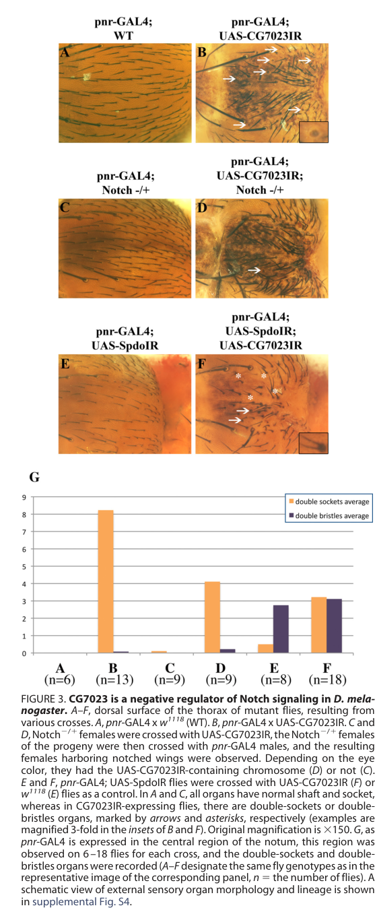

## Question

# Gene Research for Functional Annotation

## ⚠️ CRITICAL: Gene/Protein Identification Context

**BEFORE YOU BEGIN RESEARCH:** You MUST verify you are researching the CORRECT gene/protein. Gene symbols can be ambiguous, especially for less well-characterized genes from non-model organisms.

### Target Gene/Protein Identity (from UniProt):
- **UniProt Accession:** Q9VCT9
- **Protein Description:** RecName: Full=Ubiquitin carboxyl-terminal hydrolase 12/46 homolog {ECO:0000305}; EC=3.4.19.12 {ECO:0000250|UniProtKB:O75317, ECO:0000250|UniProtKB:P62068, ECO:0000305|PubMed:37798281}; AltName: Full=Ubiquitin-specific protease 12/46 {ECO:0000312|FlyBase:FBgn0039025};
- **Gene Information:** Name=Usp12-46 {ECO:0000312|FlyBase:FBgn0039025}; Synonyms=Usp12 {ECO:0000312|EMBL:AAF56066.1}, Usp12/46 {ECO:0000303|PubMed:22778262, ECO:0000312|EMBL:AAF56066.1}, Usp46 {ECO:0000303|PubMed:37798281}; ORFNames=CG7023 {ECO:0000312|FlyBase:FBgn0039025};
- **Organism (full):** Drosophila melanogaster (Fruit fly).
- **Protein Family:** Belongs to the peptidase C19 family. {ECO:0000255|PROSITE-
- **Key Domains:** Papain-like_cys_pep_sf. (IPR038765); Peptidase_C19. (IPR050164); Peptidase_C19_UCH. (IPR001394); USP. (IPR028889); USP_CS. (IPR018200)

### MANDATORY VERIFICATION STEPS:

1. **Check if the gene symbol "Usp12-46" matches the protein description above**
2. **Verify the organism is correct:** Drosophila melanogaster (Fruit fly).
3. **Check if protein family/domains align with what you find in literature**
4. **If you find literature for a DIFFERENT gene with the same or similar symbol, STOP**

### If Gene Symbol is Ambiguous or You Cannot Find Relevant Literature:

**DO NOT PROCEED WITH RESEARCH ON A DIFFERENT GENE.** Instead:
- State clearly: "The gene symbol 'Usp12-46' is ambiguous or literature is limited for this specific protein"
- Explain what you found (e.g., "Found extensive literature on a different gene with the same symbol in a different organism")
- Describe the protein based ONLY on the UniProt information provided above
- Suggest that the protein function can be inferred from domain/family information

### Research Target:

Please provide a comprehensive research report on the gene **Usp12-46** (gene ID: Usp12-46, UniProt: Q9VCT9) in DROME.

The research report should be a detailed narrative explaining the function, biological processes, and localization of the gene product. Citations should be given for all claims.

You should prioritize authoritative reviews and primary scientific literature when conducting research. You can supplement
this with annotations you find in gene/protein databases, but these can be outdated or inaccurate.

We are specifically interested in the primary function of the gene - for enzymes, what reaction is catalyzed, and what is the substrate specificity? For transporters, what is the substrate? For structural proteins or adapters, what is the broader structural role? For signaling molecules, what is the role in the pathway.

We are interested in where in or outside the cell the gene product carries out its function.

We are also interested in the signaling or biochemical pathways in which the gene functions. We are less interested in broad pleiotropic effects, except where these elucidate the precise role.

Include evidence where possible. We are interested in both experimental evidence as well as inference from structure, evolution, or bioinformatic analysis. Precise studies should be prioritized over high-throughput, where available.

## Output

Question: You are an expert researcher providing comprehensive, well-cited information.

Provide detailed information focusing on:
1. Key concepts and definitions with current understanding
2. Recent developments and latest research (prioritize 2023-2024 sources)
3. Current applications and real-world implementations
4. Expert opinions and analysis from authoritative sources
5. Relevant statistics and data from recent studies

Format as a comprehensive research report with proper citations. Include URLs and publication dates where available.
Always prioritize recent, authoritative sources and provide specific citations for all major claims.

# Gene Research for Functional Annotation

## ⚠️ CRITICAL: Gene/Protein Identification Context

**BEFORE YOU BEGIN RESEARCH:** You MUST verify you are researching the CORRECT gene/protein. Gene symbols can be ambiguous, especially for less well-characterized genes from non-model organisms.

### Target Gene/Protein Identity (from UniProt):
- **UniProt Accession:** Q9VCT9
- **Protein Description:** RecName: Full=Ubiquitin carboxyl-terminal hydrolase 12/46 homolog {ECO:0000305}; EC=3.4.19.12 {ECO:0000250|UniProtKB:O75317, ECO:0000250|UniProtKB:P62068, ECO:0000305|PubMed:37798281}; AltName: Full=Ubiquitin-specific protease 12/46 {ECO:0000312|FlyBase:FBgn0039025};
- **Gene Information:** Name=Usp12-46 {ECO:0000312|FlyBase:FBgn0039025}; Synonyms=Usp12 {ECO:0000312|EMBL:AAF56066.1}, Usp12/46 {ECO:0000303|PubMed:22778262, ECO:0000312|EMBL:AAF56066.1}, Usp46 {ECO:0000303|PubMed:37798281}; ORFNames=CG7023 {ECO:0000312|FlyBase:FBgn0039025};
- **Organism (full):** Drosophila melanogaster (Fruit fly).
- **Protein Family:** Belongs to the peptidase C19 family. {ECO:0000255|PROSITE-
- **Key Domains:** Papain-like_cys_pep_sf. (IPR038765); Peptidase_C19. (IPR050164); Peptidase_C19_UCH. (IPR001394); USP. (IPR028889); USP_CS. (IPR018200)

### MANDATORY VERIFICATION STEPS:

1. **Check if the gene symbol "Usp12-46" matches the protein description above**
2. **Verify the organism is correct:** Drosophila melanogaster (Fruit fly).
3. **Check if protein family/domains align with what you find in literature**
4. **If you find literature for a DIFFERENT gene with the same or similar symbol, STOP**

### If Gene Symbol is Ambiguous or You Cannot Find Relevant Literature:

**DO NOT PROCEED WITH RESEARCH ON A DIFFERENT GENE.** Instead:
- State clearly: "The gene symbol 'Usp12-46' is ambiguous or literature is limited for this specific protein"
- Explain what you found (e.g., "Found extensive literature on a different gene with the same symbol in a different organism")
- Describe the protein based ONLY on the UniProt information provided above
- Suggest that the protein function can be inferred from domain/family information

### Research Target:

Please provide a comprehensive research report on the gene **Usp12-46** (gene ID: Usp12-46, UniProt: Q9VCT9) in DROME.

The research report should be a detailed narrative explaining the function, biological processes, and localization of the gene product. Citations should be given for all claims.

You should prioritize authoritative reviews and primary scientific literature when conducting research. You can supplement
this with annotations you find in gene/protein databases, but these can be outdated or inaccurate.

We are specifically interested in the primary function of the gene - for enzymes, what reaction is catalyzed, and what is the substrate specificity? For transporters, what is the substrate? For structural proteins or adapters, what is the broader structural role? For signaling molecules, what is the role in the pathway.

We are interested in where in or outside the cell the gene product carries out its function.

We are also interested in the signaling or biochemical pathways in which the gene functions. We are less interested in broad pleiotropic effects, except where these elucidate the precise role.

Include evidence where possible. We are interested in both experimental evidence as well as inference from structure, evolution, or bioinformatic analysis. Precise studies should be prioritized over high-throughput, where available.

# Functional annotation of *Drosophila melanogaster* Usp12-46

## Identity and principal function

**The target is the fly gene *Usp12-46* (CG7023; UniProt Q9VCT9), not either of the distinct human genes *USP12* or *USP46*.** The 2023 primary study explicitly identifies CG7023 as the single *Drosophila* ortholog of those two human paralogs and calls the fly protein “Usp46”; an earlier study calls it CG7023/USP12-46. The reported 424-residue protein has a conserved USP peptidase domain, consistent with the peptidase-C19, papain-like cysteine-protease classification supplied for Q9VCT9. Human and fly USP46 share approximately 63% amino-acid similarity within that domain. (spencer2023theusp46deubiquitylase pages 2-4, moretti2012theubiquitinspecificprotease pages 5-6)

**Best-supported functional annotation:** Usp12-46 is the catalytic component of a Usp46–Uaf1–Wdr20 deubiquitylase complex that opposes ubiquitylation and turnover of **Arrow**, the fly Wingless/Wnt co-receptor corresponding to vertebrate LRP6. Its net action increases Arrow at the cell surface and strengthens signaling in Wingless-receiving cells. Uaf1 is encoded by *CG9062* and Wdr20 by *CG6420*. The inferred chemical reaction is hydrolysis of the bond attaching ubiquitin to a protein substrate, releasing ubiquitin and a less-ubiquitylated substrate; the cited fly work demonstrates reduced Arrow ubiquitylation in cells but does **not** establish which ubiquitin-chain linkage is preferred or a rate constant for purified fly Usp12-46. (spencer2023theusp46deubiquitylase pages 2-4, spencer2023theusp46deubiquitylase pages 11-12, spencer2023theusp46deubiquitylase pages 1-2)

The following comparison separates observations on the **fly protein** from mechanisms demonstrated primarily with a **mammalian paralog**.

| Functional claim | Direct evidence for *Drosophila* Usp12-46/CG7023 | Interpretation / evidence strength | Critical caveat |
|---|---|---|---|
| Arrow/Wingless signaling | In S2R+ cells, the Usp46–Uaf1–Wdr20 complex reduced endogenous ubiquitylated Arrow and increased cell-surface Arrow. Depletion of any component lowered Arrow abundance. In wing discs and adult posterior midgut, genetic inactivation reduced Arrow, cytoplasmic Armadillo/β-catenin, and Wingless target-gene output; Arrow overexpression rescued selected knockdown phenotypes. (spencer2023theusp46deubiquitylase pages 4-7, spencer2023theusp46deubiquitylase pages 11-12, spencer2023theusp46deubiquitylase pages 9-10) | **Strong, direct fly evidence:** Arrow is the best-supported substrate, and Usp12-46 promotes Wingless reception by opposing Arrow ubiquitylation and turnover. | No purified fly-enzyme/Arrow assay, catalytic-dead fly test, ubiquitin-linkage preference, or precise intracellular site of catalysis was established. Co-immunoprecipitation with Arrow used heterologous HEK293 cells. (spencer2023theusp46deubiquitylase pages 7-9, spencer2023theusp46deubiquitylase pages 1-2) |
| Notch signaling | CG7023 RNAi in the adult notum produced Notch-gain-of-function-like sensory-organ defects, including double sockets, and genetically opposed reduced *Notch* or *sanpodo* activity. (moretti2012theubiquitinspecificprotease pages 5-6, moretti2012theubiquitinspecificprotease media fbea181b) | **Moderate fly evidence:** CG7023 is a negative genetic regulator of Notch-dependent sensory-organ development. | Direct deubiquitylation of Notch, catalytic dependence, increased surface Notch, and lysosomal-trafficking effects were demonstrated principally for mammalian USP12–UAF1, not fly CG7023. The fly biochemical mechanism therefore remains inferred rather than proven. (moretti2012theubiquitinspecificprotease pages 9-11, moretti2012theubiquitinspecificprotease pages 11-12) |
| Huntington-model proteostasis | In flies expressing mutant Htt-ex1Q93, CG7023 RNAi worsened photoreceptor degeneration, whereas fly CG7023 overexpression was protective; at day 7, RNAi versus control gave *p*=0.0041 and overexpression versus control *p*=0.0270, with 8–10 flies per genotype. (aron2018deubiquitinaseusp12functions pages 11-12, aron2018deubiquitinaseusp12functions pages 3-4, aron2018deubiquitinaseusp12functions pages 13-13) | **Moderate evidence for genetic modification of neurodegeneration:** endogenous fly-gene dosage influences mutant-huntingtin toxicity. | Catalysis-independent neuroprotection, accelerated LC3 turnover, an approximately sixfold rise in autophagic structures, and ATG7 dependence were established using human USP12 in mammalian neuronal systems—not CG7023 in flies. These mechanisms should not yet be assigned directly to the fly protein. (aron2018deubiquitinaseusp12functions pages 7-7, aron2018deubiquitinaseusp12functions pages 7-8) |
| Intracellular localization | A CRISPR Usp46-V5 knock-in showed broadly invariant protein abundance across the wing imaginal disc, and compartment-specific RNAi diminished the V5 signal, validating detection. (spencer2023theusp46deubiquitylase pages 1-2) | **Tissue-distribution evidence only:** Usp12-46 is present throughout this Wingless-responsive epithelium. | The data do not establish nuclear, cytosolic, plasma-membrane, endosomal, or lysosomal localization. Membrane/cytoplasmic localization reported in mutant clones concerns Arrow and Armadillo, not Usp12-46 itself. (spencer2023theusp46deubiquitylase pages 12-13) |

*Table: Direct Drosophila evidence is strongest for Arrow/Wingless regulation, while the Notch mechanism and catalysis-independent autophagy rely substantially on mammalian ortholog experiments. The table separates fly observations from ortholog-based inference and identifies unresolved localization and enzymology.*

## Substrate specificity and biochemical mechanism

**Arrow is the strongest experimentally supported fly substrate.** In *Drosophila* S2R+ cells, expression of the Usp46 complex reduced ubiquitylation of endogenous Arrow; depletion of Usp46, Uaf1, or Wdr20 reduced Arrow protein abundance. Cell-surface biotinylation showed increased surface Arrow when the complex was expressed. In complementary transfection experiments in HEK293 cells, complex components co-immunoprecipitated with expressed Arrow and complex expression reduced its ubiquitylation, including ubiquitylation increased by lysosomal inhibition. Together, the cell experiments support a receptor-stabilizing deubiquitylation mechanism; co-immunoprecipitation does not, by itself, establish direct binding of purified fly Usp12-46 to Arrow. The cited fly study does not establish a purified fly-enzyme reaction on Arrow, fly catalytic-mutant dependence, or a ubiquitin-linkage preference. (spencer2023theusp46deubiquitylase pages 7-9, spencer2023theusp46deubiquitylase pages 11-12, spencer2023theusp46deubiquitylase pages 9-10)

The partners matter mechanistically: loss of either Uaf1 or Wdr20 phenocopies important effects of Usp46 loss, and their expression can stabilize Usp46 protein. The 2023 authors describe UAF1/WDR48 and WDR20 as allosteric enhancers of USP46 catalytic efficiency, drawing on biochemical understanding of this enzyme family; their fly genetic and cell experiments establish the complex’s functional importance, rather than measuring allosteric rate enhancement for purified CG7023. Thus, substrate specificity should be annotated at the **complex-and-cellular-context level**, not as an established preference of isolated CG7023 for every ubiquitinated receptor. (spencer2023theusp46deubiquitylase pages 7-9, spencer2023theusp46deubiquitylase pages 1-2)

**Notch is a more qualified candidate substrate for the fly enzyme.** Fly CG7023 knockdown produced adult sensory-organ phenotypes consistent with increased Notch signaling and genetically opposed reduced *Notch* or *sanpodo* function. The detailed biochemical evidence, however, comes from **mammalian USP12–UAF1**: it removed ubiquitin from nonactivated, membrane-anchored Notch in cells and in a substrate-containing in-vitro preparation, while catalytic-dead human USP12-C48S failed to reproduce the cellular deubiquitylation effect. Activated Notch fragments were not similarly affected. In that in-vitro comparison, human **USP46–UAF1** was much less effective against Notch than human **USP12–UAF1**, despite both complexes being active on a generic Ub–AMC substrate. Since the fly gene represents both human paralogs, the fly genetics cannot establish that CG7023 directly deubiquitylates fly Notch, nor that it has the same substrate preference as human USP12. (moretti2012theubiquitinspecificprotease pages 5-6, moretti2012theubiquitinspecificprotease pages 9-11, moretti2012theubiquitinspecificprotease pages 11-12, moretti2012theubiquitinspecificprotease media fbea181b)

## Pathways and biological processes

**Wingless/Wnt reception is the clearest in-vivo pathway assignment.** In larval wing imaginal discs, RNAi or CRISPR disruption of Usp46, Uaf1, or Wdr20 reduced expression of the Wingless target **Senseless** in responding cells; Usp46 RNAi caused this effect in **more than 90% of discs**. In adult posterior midgut, mutant clones showed cell-autonomous losses of Wingless-responsive *fz3-GFP* and *nkd-lacZ* reporter expression. For *fz3-GFP*, the effect was most pronounced approximately **8–20 cell lengths** from the midgut–hindgut boundary and weaker closer to it, consistent with a requirement for receptor stabilization where ligand stimulation is lower. The reported reporter analyses included **57–174 clones** for *fz3-GFP* and **67–169** for *nkd-lacZ*, with reported comparisons reaching *p*<0.0001. (spencer2023theusp46deubiquitylase pages 2-4, spencer2023theusp46deubiquitylase pages 4-7, spencer2023theusp46deubiquitylase pages 4-4)

The pathway position is supported by receptor and epistasis experiments, not merely by broad developmental phenotypes. Usp46-complex-deficient wing and midgut cells had less Arrow and less **cytoplasmic Armadillo/β-catenin**, whereas membrane-associated Armadillo was comparatively preserved in the examined wing clones. Increasing Arrow rescued selected Senseless defects caused by Usp46 or Wdr20 depletion; loss of Usp46 did not suppress a wing-disc signaling phenotype caused by loss of **Axin**, a component of the downstream β-catenin destruction complex. These results place the principal measured effect at or near the **Arrow receptor**, upstream of that complex. Disrupted signaling is accompanied by abnormal wing patterning and altered adult-midgut homeostasis; these are consequences of the receptor-level mechanism, not evidence for a separate direct biochemical substrate. (spencer2023theusp46deubiquitylase pages 9-10, spencer2023theusp46deubiquitylase pages 4-7, spencer2023theusp46deubiquitylase pages 12-13)

**Notch regulation has direct fly genetic, but less direct fly biochemical, support.** In the adult notum, CG7023 RNAi caused disordered sensory organs, including double sockets, and partially counteracted phenotypes caused by diminished *Notch* or *sanpodo*. Approximately **10 flies per genotype** were visually assessed in that experiment. The proposed mechanism—mammalian USP12–UAF1 promotes trafficking of inactive Notch toward lysosomal degradation, thereby limiting surface Notch and Notch activation—remains an **ortholog-based mechanistic inference for the fly protein**. In mammalian cells, USP12 depletion increased measured surface Notch fluorescence approximately **1.6-fold** without a corresponding change in surface EGFR. These numbers must not be presented as measurements of fly surface Notch. (moretti2012theubiquitinspecificprotease pages 5-6, moretti2012theubiquitinspecificprotease pages 1-2, moretti2012theubiquitinspecificprotease pages 11-12, moretti2012theubiquitinspecificprotease media fbea181b)

**A neuronal disease-model effect is documented but its fly mechanism is unresolved.** In a fly model expressing mutant huntingtin exon 1 with 93 glutamines, CG7023 RNAi worsened, and CG7023 overexpression lessened, photoreceptor degeneration. At day 7, rhabdomere-count comparisons gave *p*=0.0041 for knockdown and *p*=0.0270 for overexpression versus their controls, using **8–10 flies per genotype**. Separately, experiments on **human USP12 in mammalian neurons** found protection even with catalytically impaired variants, increased autophagic flux, approximately **sixfold** more autophagic structures upon overexpression, and dependence on ATG7. Those observations motivate an autophagy hypothesis for fly CG7023 but **do not demonstrate that fly Usp12-46 itself acts noncatalytically or induces autophagy in flies**. (aron2018deubiquitinaseusp12functions pages 11-12, aron2018deubiquitinaseusp12functions pages 3-4, aron2018deubiquitinaseusp12functions pages 7-8)

## Localization: distinguish enzyme from substrate

Usp12-46 acts in **Wingless-receiving cells**, as established by cell-autonomous mutant-clone phenotypes in wing epithelium and posterior midgut and by biochemical effects in cultured cells. An endogenously V5-tagged Usp46 knock-in was detected broadly across the wing imaginal disc; RNAi diminished the tag signal, supporting its identification. These observations establish **tissue distribution**, not whether the active enzyme is concentrated at the plasma membrane, in endosomes, in cytosol, or in nuclei. The plasma-membrane and cytoplasmic staining changes reported in mutant clones concern **Arrow and Armadillo**, not localization of Usp12-46. An intracellular site of Arrow deubiquitylation should therefore remain unassigned rather than inferred from Arrow’s increased surface abundance. The proposed Notch endosome-to-lysosome mechanism likewise comes principally from mammalian USP12 experiments. (spencer2023theusp46deubiquitylase pages 1-2, spencer2023theusp46deubiquitylase pages 12-13, moretti2012theubiquitinspecificprotease pages 6-7)

## Assessment and research use

The **2023 Arrow study** substantially sharpens annotation beyond the older description “ubiquitin-specific protease”: it connects the correctly identified fly protein, its two partners, a specific receptor substrate, receptor surface abundance, and graded developmental signaling through mutually reinforcing cell and animal experiments. The 2012 Notch result adds a credible fly genetic function but warrants lower confidence as a **direct fly-substrate** annotation. The 2018 Huntington-model result demonstrates a useful fly genetic modifier without resolving its fly molecular substrate. These systems provide research implementations for testing receptor turnover, Wingless-gradient responses, sensory-organ development, and modifier effects in neurodegeneration; the cited work does not establish a clinical implementation or therapeutic efficacy for targeting fly Usp12-46. (spencer2023theusp46deubiquitylase pages 11-12, spencer2023theusp46deubiquitylase pages 9-10, moretti2012theubiquitinspecificprotease pages 11-12, aron2018deubiquitinaseusp12functions pages 3-4)

**Selected primary sources, with publication dates and URLs**

- Spencer ZT *et al.* “The USP46 deubiquitylase complex increases Wingless/Wnt signaling strength by stabilizing Arrow/LRP6.” *Nature Communications*, **October 2023**. https://doi.org/10.1038/s41467-023-41843-0. Principal source for fly identity, Arrow mechanism, partners, wing and midgut data. (spencer2023theusp46deubiquitylase pages 2-4, spencer2023theusp46deubiquitylase pages 11-12)
- Moretti J *et al.* “The Ubiquitin-specific Protease 12 (USP12) Is a Negative Regulator of Notch Signaling Acting on Notch Receptor Trafficking toward Degradation.” *Journal of Biological Chemistry*, **24 August 2012**. https://doi.org/10.1074/jbc.M112.366807. Source for CG7023 fly genetics and, separately, mammalian USP12 biochemistry. (moretti2012theubiquitinspecificprotease pages 1-2, moretti2012theubiquitinspecificprotease pages 11-12)
- Aron R *et al.* “Deubiquitinase Usp12 functions noncatalytically to induce autophagy and confer neuroprotection in models of Huntington’s disease.” *Nature Communications*, **September 2018**. https://doi.org/10.1038/s41467-018-05653-z. Source for fly CG7023 Huntington-model modification and distinct mammalian-neuron autophagy experiments. (aron2018deubiquitinaseusp12functions pages 3-4, aron2018deubiquitinaseusp12functions pages 7-8)

No retrieved 2024 primary study displaced the 2023 Arrow work as the most specific mechanistic evidence for this *Drosophila* gene. (spencer2023theusp46deubiquitylase pages 11-12, spencer2023theusp46deubiquitylase pages 2-4)

References

1. (spencer2023theusp46deubiquitylase pages 2-4): Zachary T. Spencer, Victoria H. Ng, Hassina Benchabane, Ghalia Saad Siddiqui, Deepesh Duwadi, Ben Maines, Jamal M. Bryant, Anna Schwarzkopf, Kai Yuan, Sara N. Kassel, Anant Mishra, Ashley Pimentel, Andres M. Lebensohn, Rajat Rohatgi, Scott A. Gerber, David J. Robbins, Ethan Lee, and Yashi Ahmed. The usp46 deubiquitylase complex increases wingless/wnt signaling strength by stabilizing arrow/lrp6. Nature Communications, Oct 2023. URL: https://doi.org/10.1038/s41467-023-41843-0, doi:10.1038/s41467-023-41843-0. This article has 11 citations and is from a highest quality peer-reviewed journal.

2. (moretti2012theubiquitinspecificprotease pages 5-6): Julien Moretti, Patricia Chastagner, Chih-Chao Liang, Martin A. Cohn, Alain Israël, and Christel Brou. The ubiquitin-specific protease 12 (usp12) is a negative regulator of notch signaling acting on notch receptor trafficking toward degradation. Journal of Biological Chemistry, 287:29429-29441, Aug 2012. URL: https://doi.org/10.1074/jbc.m112.366807, doi:10.1074/jbc.m112.366807. This article has 73 citations and is from a domain leading peer-reviewed journal.

3. (spencer2023theusp46deubiquitylase pages 11-12): Zachary T. Spencer, Victoria H. Ng, Hassina Benchabane, Ghalia Saad Siddiqui, Deepesh Duwadi, Ben Maines, Jamal M. Bryant, Anna Schwarzkopf, Kai Yuan, Sara N. Kassel, Anant Mishra, Ashley Pimentel, Andres M. Lebensohn, Rajat Rohatgi, Scott A. Gerber, David J. Robbins, Ethan Lee, and Yashi Ahmed. The usp46 deubiquitylase complex increases wingless/wnt signaling strength by stabilizing arrow/lrp6. Nature Communications, Oct 2023. URL: https://doi.org/10.1038/s41467-023-41843-0, doi:10.1038/s41467-023-41843-0. This article has 11 citations and is from a highest quality peer-reviewed journal.

4. (spencer2023theusp46deubiquitylase pages 1-2): Zachary T. Spencer, Victoria H. Ng, Hassina Benchabane, Ghalia Saad Siddiqui, Deepesh Duwadi, Ben Maines, Jamal M. Bryant, Anna Schwarzkopf, Kai Yuan, Sara N. Kassel, Anant Mishra, Ashley Pimentel, Andres M. Lebensohn, Rajat Rohatgi, Scott A. Gerber, David J. Robbins, Ethan Lee, and Yashi Ahmed. The usp46 deubiquitylase complex increases wingless/wnt signaling strength by stabilizing arrow/lrp6. Nature Communications, Oct 2023. URL: https://doi.org/10.1038/s41467-023-41843-0, doi:10.1038/s41467-023-41843-0. This article has 11 citations and is from a highest quality peer-reviewed journal.

5. (spencer2023theusp46deubiquitylase pages 4-7): Zachary T. Spencer, Victoria H. Ng, Hassina Benchabane, Ghalia Saad Siddiqui, Deepesh Duwadi, Ben Maines, Jamal M. Bryant, Anna Schwarzkopf, Kai Yuan, Sara N. Kassel, Anant Mishra, Ashley Pimentel, Andres M. Lebensohn, Rajat Rohatgi, Scott A. Gerber, David J. Robbins, Ethan Lee, and Yashi Ahmed. The usp46 deubiquitylase complex increases wingless/wnt signaling strength by stabilizing arrow/lrp6. Nature Communications, Oct 2023. URL: https://doi.org/10.1038/s41467-023-41843-0, doi:10.1038/s41467-023-41843-0. This article has 11 citations and is from a highest quality peer-reviewed journal.

6. (spencer2023theusp46deubiquitylase pages 9-10): Zachary T. Spencer, Victoria H. Ng, Hassina Benchabane, Ghalia Saad Siddiqui, Deepesh Duwadi, Ben Maines, Jamal M. Bryant, Anna Schwarzkopf, Kai Yuan, Sara N. Kassel, Anant Mishra, Ashley Pimentel, Andres M. Lebensohn, Rajat Rohatgi, Scott A. Gerber, David J. Robbins, Ethan Lee, and Yashi Ahmed. The usp46 deubiquitylase complex increases wingless/wnt signaling strength by stabilizing arrow/lrp6. Nature Communications, Oct 2023. URL: https://doi.org/10.1038/s41467-023-41843-0, doi:10.1038/s41467-023-41843-0. This article has 11 citations and is from a highest quality peer-reviewed journal.

7. (spencer2023theusp46deubiquitylase pages 7-9): Zachary T. Spencer, Victoria H. Ng, Hassina Benchabane, Ghalia Saad Siddiqui, Deepesh Duwadi, Ben Maines, Jamal M. Bryant, Anna Schwarzkopf, Kai Yuan, Sara N. Kassel, Anant Mishra, Ashley Pimentel, Andres M. Lebensohn, Rajat Rohatgi, Scott A. Gerber, David J. Robbins, Ethan Lee, and Yashi Ahmed. The usp46 deubiquitylase complex increases wingless/wnt signaling strength by stabilizing arrow/lrp6. Nature Communications, Oct 2023. URL: https://doi.org/10.1038/s41467-023-41843-0, doi:10.1038/s41467-023-41843-0. This article has 11 citations and is from a highest quality peer-reviewed journal.

8. (moretti2012theubiquitinspecificprotease media fbea181b): Julien Moretti, Patricia Chastagner, Chih-Chao Liang, Martin A. Cohn, Alain Israël, and Christel Brou. The ubiquitin-specific protease 12 (usp12) is a negative regulator of notch signaling acting on notch receptor trafficking toward degradation. Journal of Biological Chemistry, 287:29429-29441, Aug 2012. URL: https://doi.org/10.1074/jbc.m112.366807, doi:10.1074/jbc.m112.366807. This article has 73 citations and is from a domain leading peer-reviewed journal.

9. (moretti2012theubiquitinspecificprotease pages 9-11): Julien Moretti, Patricia Chastagner, Chih-Chao Liang, Martin A. Cohn, Alain Israël, and Christel Brou. The ubiquitin-specific protease 12 (usp12) is a negative regulator of notch signaling acting on notch receptor trafficking toward degradation. Journal of Biological Chemistry, 287:29429-29441, Aug 2012. URL: https://doi.org/10.1074/jbc.m112.366807, doi:10.1074/jbc.m112.366807. This article has 73 citations and is from a domain leading peer-reviewed journal.

10. (moretti2012theubiquitinspecificprotease pages 11-12): Julien Moretti, Patricia Chastagner, Chih-Chao Liang, Martin A. Cohn, Alain Israël, and Christel Brou. The ubiquitin-specific protease 12 (usp12) is a negative regulator of notch signaling acting on notch receptor trafficking toward degradation. Journal of Biological Chemistry, 287:29429-29441, Aug 2012. URL: https://doi.org/10.1074/jbc.m112.366807, doi:10.1074/jbc.m112.366807. This article has 73 citations and is from a domain leading peer-reviewed journal.

11. (aron2018deubiquitinaseusp12functions pages 11-12): Rebecca Aron, Pasquale Pellegrini, Edward W. Green, Daniel C. Maddison, Kwadwo Opoku-Nsiah, Ana Osório Oliveira, Jinny S. Wong, Aaron C. Daub, Flaviano Giorgini, Paul Muchowski, and Steven Finkbeiner. Deubiquitinase usp12 functions noncatalytically to induce autophagy and confer neuroprotection in models of huntington’s disease. Nature Communications, Sep 2018. URL: https://doi.org/10.1038/s41467-018-05653-z, doi:10.1038/s41467-018-05653-z. This article has 71 citations and is from a highest quality peer-reviewed journal.

12. (aron2018deubiquitinaseusp12functions pages 3-4): Rebecca Aron, Pasquale Pellegrini, Edward W. Green, Daniel C. Maddison, Kwadwo Opoku-Nsiah, Ana Osório Oliveira, Jinny S. Wong, Aaron C. Daub, Flaviano Giorgini, Paul Muchowski, and Steven Finkbeiner. Deubiquitinase usp12 functions noncatalytically to induce autophagy and confer neuroprotection in models of huntington’s disease. Nature Communications, Sep 2018. URL: https://doi.org/10.1038/s41467-018-05653-z, doi:10.1038/s41467-018-05653-z. This article has 71 citations and is from a highest quality peer-reviewed journal.

13. (aron2018deubiquitinaseusp12functions pages 13-13): Rebecca Aron, Pasquale Pellegrini, Edward W. Green, Daniel C. Maddison, Kwadwo Opoku-Nsiah, Ana Osório Oliveira, Jinny S. Wong, Aaron C. Daub, Flaviano Giorgini, Paul Muchowski, and Steven Finkbeiner. Deubiquitinase usp12 functions noncatalytically to induce autophagy and confer neuroprotection in models of huntington’s disease. Nature Communications, Sep 2018. URL: https://doi.org/10.1038/s41467-018-05653-z, doi:10.1038/s41467-018-05653-z. This article has 71 citations and is from a highest quality peer-reviewed journal.

14. (aron2018deubiquitinaseusp12functions pages 7-7): Rebecca Aron, Pasquale Pellegrini, Edward W. Green, Daniel C. Maddison, Kwadwo Opoku-Nsiah, Ana Osório Oliveira, Jinny S. Wong, Aaron C. Daub, Flaviano Giorgini, Paul Muchowski, and Steven Finkbeiner. Deubiquitinase usp12 functions noncatalytically to induce autophagy and confer neuroprotection in models of huntington’s disease. Nature Communications, Sep 2018. URL: https://doi.org/10.1038/s41467-018-05653-z, doi:10.1038/s41467-018-05653-z. This article has 71 citations and is from a highest quality peer-reviewed journal.

15. (aron2018deubiquitinaseusp12functions pages 7-8): Rebecca Aron, Pasquale Pellegrini, Edward W. Green, Daniel C. Maddison, Kwadwo Opoku-Nsiah, Ana Osório Oliveira, Jinny S. Wong, Aaron C. Daub, Flaviano Giorgini, Paul Muchowski, and Steven Finkbeiner. Deubiquitinase usp12 functions noncatalytically to induce autophagy and confer neuroprotection in models of huntington’s disease. Nature Communications, Sep 2018. URL: https://doi.org/10.1038/s41467-018-05653-z, doi:10.1038/s41467-018-05653-z. This article has 71 citations and is from a highest quality peer-reviewed journal.

16. (spencer2023theusp46deubiquitylase pages 12-13): Zachary T. Spencer, Victoria H. Ng, Hassina Benchabane, Ghalia Saad Siddiqui, Deepesh Duwadi, Ben Maines, Jamal M. Bryant, Anna Schwarzkopf, Kai Yuan, Sara N. Kassel, Anant Mishra, Ashley Pimentel, Andres M. Lebensohn, Rajat Rohatgi, Scott A. Gerber, David J. Robbins, Ethan Lee, and Yashi Ahmed. The usp46 deubiquitylase complex increases wingless/wnt signaling strength by stabilizing arrow/lrp6. Nature Communications, Oct 2023. URL: https://doi.org/10.1038/s41467-023-41843-0, doi:10.1038/s41467-023-41843-0. This article has 11 citations and is from a highest quality peer-reviewed journal.

17. (spencer2023theusp46deubiquitylase pages 4-4): Zachary T. Spencer, Victoria H. Ng, Hassina Benchabane, Ghalia Saad Siddiqui, Deepesh Duwadi, Ben Maines, Jamal M. Bryant, Anna Schwarzkopf, Kai Yuan, Sara N. Kassel, Anant Mishra, Ashley Pimentel, Andres M. Lebensohn, Rajat Rohatgi, Scott A. Gerber, David J. Robbins, Ethan Lee, and Yashi Ahmed. The usp46 deubiquitylase complex increases wingless/wnt signaling strength by stabilizing arrow/lrp6. Nature Communications, Oct 2023. URL: https://doi.org/10.1038/s41467-023-41843-0, doi:10.1038/s41467-023-41843-0. This article has 11 citations and is from a highest quality peer-reviewed journal.

18. (moretti2012theubiquitinspecificprotease pages 1-2): Julien Moretti, Patricia Chastagner, Chih-Chao Liang, Martin A. Cohn, Alain Israël, and Christel Brou. The ubiquitin-specific protease 12 (usp12) is a negative regulator of notch signaling acting on notch receptor trafficking toward degradation. Journal of Biological Chemistry, 287:29429-29441, Aug 2012. URL: https://doi.org/10.1074/jbc.m112.366807, doi:10.1074/jbc.m112.366807. This article has 73 citations and is from a domain leading peer-reviewed journal.

19. (moretti2012theubiquitinspecificprotease pages 6-7): Julien Moretti, Patricia Chastagner, Chih-Chao Liang, Martin A. Cohn, Alain Israël, and Christel Brou. The ubiquitin-specific protease 12 (usp12) is a negative regulator of notch signaling acting on notch receptor trafficking toward degradation. Journal of Biological Chemistry, 287:29429-29441, Aug 2012. URL: https://doi.org/10.1074/jbc.m112.366807, doi:10.1074/jbc.m112.366807. This article has 73 citations and is from a domain leading peer-reviewed journal.

## Artifacts

- [Edison artifact artifact-00](Usp12-46-deep-research-falcon_artifacts/artifact-00.md)

## Citations

1. moretti2012theubiquitinspecificprotease pages 5-6
2. moretti2012theubiquitinspecificprotease pages 9-11
3. moretti2012theubiquitinspecificprotease pages 11-12
4. moretti2012theubiquitinspecificprotease pages 1-2
5. moretti2012theubiquitinspecificprotease pages 6-7
6. https://doi.org/10.1038/s41467-023-41843-0.
7. https://doi.org/10.1074/jbc.M112.366807.
8. https://doi.org/10.1038/s41467-018-05653-z.
9. https://doi.org/10.1038/s41467-023-41843-0,
10. https://doi.org/10.1074/jbc.m112.366807,
11. https://doi.org/10.1038/s41467-018-05653-z,