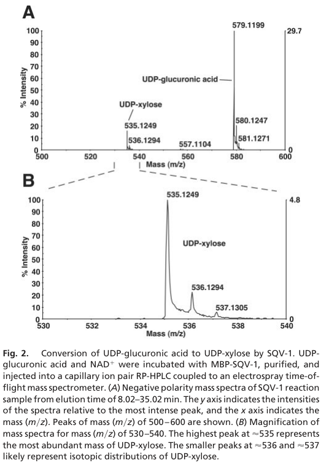

## Question

# Gene Research for Functional Annotation

## ⚠️ CRITICAL: Gene/Protein Identification Context

**BEFORE YOU BEGIN RESEARCH:** You MUST verify you are researching the CORRECT gene/protein. Gene symbols can be ambiguous, especially for less well-characterized genes from non-model organisms.

### Target Gene/Protein Identity (from UniProt):
- **UniProt Accession:** Q9VSE8
- **Protein Description:** RecName: Full=UDP-glucuronic acid decarboxylase 1 {ECO:0000256|ARBA:ARBA00018816}; EC=4.1.1.35 {ECO:0000256|ARBA:ARBA00012290}; AltName: Full=UDP-glucuronate decarboxylase 1 {ECO:0000256|ARBA:ARBA00031585};
- **Gene Information:** Name=Uxs {ECO:0000313|EMBL:AAF50474.1, ECO:0000313|FlyBase:FBgn0035848}; Synonyms=Dmel\CG7979 {ECO:0000313|EMBL:AAF50474.1}; ORFNames=CG7979 {ECO:0000313|EMBL:AAF50474.1, ECO:0000313|FlyBase:FBgn0035848}, Dmel_CG7979 {ECO:0000313|EMBL:AAF50474.1};
- **Organism (full):** Drosophila melanogaster (Fruit fly).
- **Protein Family:** Belongs to the NAD(P)-dependent epimerase/dehydratase
- **Key Domains:** NAD(P)-bd_dom. (IPR016040); NAD(P)-bd_dom_sf. (IPR036291); UXS-like. (IPR044516); GDP_Man_Dehyd (PF16363)

### MANDATORY VERIFICATION STEPS:

1. **Check if the gene symbol "Uxs" matches the protein description above**
2. **Verify the organism is correct:** Drosophila melanogaster (Fruit fly).
3. **Check if protein family/domains align with what you find in literature**
4. **If you find literature for a DIFFERENT gene with the same or similar symbol, STOP**

### If Gene Symbol is Ambiguous or You Cannot Find Relevant Literature:

**DO NOT PROCEED WITH RESEARCH ON A DIFFERENT GENE.** Instead:
- State clearly: "The gene symbol 'Uxs' is ambiguous or literature is limited for this specific protein"
- Explain what you found (e.g., "Found extensive literature on a different gene with the same symbol in a different organism")
- Describe the protein based ONLY on the UniProt information provided above
- Suggest that the protein function can be inferred from domain/family information

### Research Target:

Please provide a comprehensive research report on the gene **Uxs** (gene ID: Uxs, UniProt: Q9VSE8) in DROME.

The research report should be a detailed narrative explaining the function, biological processes, and localization of the gene product. Citations should be given for all claims.

You should prioritize authoritative reviews and primary scientific literature when conducting research. You can supplement
this with annotations you find in gene/protein databases, but these can be outdated or inaccurate.

We are specifically interested in the primary function of the gene - for enzymes, what reaction is catalyzed, and what is the substrate specificity? For transporters, what is the substrate? For structural proteins or adapters, what is the broader structural role? For signaling molecules, what is the role in the pathway.

We are interested in where in or outside the cell the gene product carries out its function.

We are also interested in the signaling or biochemical pathways in which the gene functions. We are less interested in broad pleiotropic effects, except where these elucidate the precise role.

Include evidence where possible. We are interested in both experimental evidence as well as inference from structure, evolution, or bioinformatic analysis. Precise studies should be prioritized over high-throughput, where available.

## Output

Question: You are an expert researcher providing comprehensive, well-cited information.

Provide detailed information focusing on:
1. Key concepts and definitions with current understanding
2. Recent developments and latest research (prioritize 2023-2024 sources)
3. Current applications and real-world implementations
4. Expert opinions and analysis from authoritative sources
5. Relevant statistics and data from recent studies

Format as a comprehensive research report with proper citations. Include URLs and publication dates where available.
Always prioritize recent, authoritative sources and provide specific citations for all major claims.

# Gene Research for Functional Annotation

## ⚠️ CRITICAL: Gene/Protein Identification Context

**BEFORE YOU BEGIN RESEARCH:** You MUST verify you are researching the CORRECT gene/protein. Gene symbols can be ambiguous, especially for less well-characterized genes from non-model organisms.

### Target Gene/Protein Identity (from UniProt):
- **UniProt Accession:** Q9VSE8
- **Protein Description:** RecName: Full=UDP-glucuronic acid decarboxylase 1 {ECO:0000256|ARBA:ARBA00018816}; EC=4.1.1.35 {ECO:0000256|ARBA:ARBA00012290}; AltName: Full=UDP-glucuronate decarboxylase 1 {ECO:0000256|ARBA:ARBA00031585};
- **Gene Information:** Name=Uxs {ECO:0000313|EMBL:AAF50474.1, ECO:0000313|FlyBase:FBgn0035848}; Synonyms=Dmel\CG7979 {ECO:0000313|EMBL:AAF50474.1}; ORFNames=CG7979 {ECO:0000313|EMBL:AAF50474.1, ECO:0000313|FlyBase:FBgn0035848}, Dmel_CG7979 {ECO:0000313|EMBL:AAF50474.1};
- **Organism (full):** Drosophila melanogaster (Fruit fly).
- **Protein Family:** Belongs to the NAD(P)-dependent epimerase/dehydratase
- **Key Domains:** NAD(P)-bd_dom. (IPR016040); NAD(P)-bd_dom_sf. (IPR036291); UXS-like. (IPR044516); GDP_Man_Dehyd (PF16363)

### MANDATORY VERIFICATION STEPS:

1. **Check if the gene symbol "Uxs" matches the protein description above**
2. **Verify the organism is correct:** Drosophila melanogaster (Fruit fly).
3. **Check if protein family/domains align with what you find in literature**
4. **If you find literature for a DIFFERENT gene with the same or similar symbol, STOP**

### If Gene Symbol is Ambiguous or You Cannot Find Relevant Literature:

**DO NOT PROCEED WITH RESEARCH ON A DIFFERENT GENE.** Instead:
- State clearly: "The gene symbol 'Uxs' is ambiguous or literature is limited for this specific protein"
- Explain what you found (e.g., "Found extensive literature on a different gene with the same symbol in a different organism")
- Describe the protein based ONLY on the UniProt information provided above
- Suggest that the protein function can be inferred from domain/family information

### Research Target:

Please provide a comprehensive research report on the gene **Uxs** (gene ID: Uxs, UniProt: Q9VSE8) in DROME.

The research report should be a detailed narrative explaining the function, biological processes, and localization of the gene product. Citations should be given for all claims.

You should prioritize authoritative reviews and primary scientific literature when conducting research. You can supplement
this with annotations you find in gene/protein databases, but these can be outdated or inaccurate.

We are specifically interested in the primary function of the gene - for enzymes, what reaction is catalyzed, and what is the substrate specificity? For transporters, what is the substrate? For structural proteins or adapters, what is the broader structural role? For signaling molecules, what is the role in the pathway.

We are interested in where in or outside the cell the gene product carries out its function.

We are also interested in the signaling or biochemical pathways in which the gene functions. We are less interested in broad pleiotropic effects, except where these elucidate the precise role.

Include evidence where possible. We are interested in both experimental evidence as well as inference from structure, evolution, or bioinformatic analysis. Precise studies should be prioritized over high-throughput, where available.

# Functional annotation of *Drosophila melanogaster* Uxs (CG7979; UniProt Q9VSE8)

## Identity and principal function

**Uxs is the fruit-fly UDP-xylose synthase, not a xylosyltransferase.** The supplied UniProt record identifies Q9VSE8 as *D. melanogaster* Uxs/CG7979, and fly genetic research independently identifies **Uxs with CG7979**, describing it as the fly genome’s sole UDP-xylose-synthase gene. The paper does not itself print the Q9VSE8 accession. Its sequence-based assignment to the NAD(P)-dependent epimerase/dehydratase family is consistent with the nucleotide-binding region identified in the fly protein and with the enzymology of its animal homologs. The family label does **not** mean that Uxs primarily catalyzes epimerization or GDP-mannose dehydration. (matsumoto2016dualrolesof pages 5-6, harper2002biosynthesisofudpxylose. pages 7-8, hwang2002thesqv1udpglucuronic pages 3-4)

The assigned physiological reaction, **EC 4.1.1.35**, is:

**UDP-α-D-glucuronate → UDP-α-D-xylose + CO₂.**

Thus, UDP-glucuronate is the proposed substrate and UDP-xylose the activated xylose product subsequently used by xylosyltransferases. This is a strong assignment for fly Uxs, but its substrate specificity has **not** been established here by a purified-CG7979 enzyme assay or a kinetic comparison with alternative nucleotide sugars. The closely related *Caenorhabditis elegans* enzyme SQV-1—**54% identical across the reported 441-amino-acid fly CG7979 product**—converted UDP-glucuronate to UDP-xylose in a purified-protein assay analyzed by HPLC–mass spectrometry. That is direct evidence for the **worm homolog**, not a measurement of fly Uxs activity. (matsumoto2016dualrolesof pages 3-5, hwang2002thesqv1udpglucuronic pages 3-4, hwang2002thesqv1udpglucuronic pages 2-3, hwang2002thesqv1udpglucuronic media 3de9e34f)

Animal UXS enzymes use NAD⁺-linked oxidation and reduction during decarboxylation; human UXS1 research supports recycling of an enzyme-bound NAD⁺ cofactor. The NAD(P)-binding-domain annotation supplied for Q9VSE8 and loss of the predicted nucleotide-binding region in a fly deletion mutant fit this mechanism. Neither observation alone establishes the cofactor identity, binding stoichiometry, or a requirement for freely supplied NAD⁺ in **fly** Uxs; in particular, a predicted NAD(P)-binding fold is not evidence that NADP⁺ is its physiological cofactor. (matsumoto2016dualrolesof pages 5-6, jacobs2025amissingenzymerescue pages 3-4, harper2002biosynthesisofudpxylose. pages 7-8)

The following evidence summary separates experiments on CG7979 from results obtained with other species’ proteins.

| Claim | Evidence / species | Interpretation or limitation |
|---|---|---|
| Molecular identity | **Direct fly evidence:** *Drosophila melanogaster* **Uxs** is **CG7979**, described as the fly genome’s sole UDP-xylose synthase. The engineered **Uxs¹** allele deletes 1,201 bp, including the putative start codon and more than half of the coding region (matsumoto2016dualrolesof pages 5-6) | Strong locus-level identification. **Q9VSE8** is the corresponding accession in the user-provided UniProt record; the cited paper does not print that accession. |
| UDP-glucuronate → UDP-xylose + CO₂ | **Fly inference:** Uxs/CG7979 is annotated and genetically treated as UDP-xylose synthase. **Ortholog biochemical evidence:** purified *C. elegans* SQV-1 converted UDP-glucuronate to UDP-xylose in an NAD⁺-containing assay; SQV-1 is **54% identical** to the 441-aa fly CG7979 product (hwang2002thesqv1udpglucuronic pages 3-4, hwang2002thesqv1udpglucuronic pages 2-3) | The reaction assignment is compelling by orthology and fly genetics, but the cited studies did **not** report purified CG7979 enzymology or directly measure CO₂ release from the fly protein. |
| NAD(P)-binding domain and tightly bound NAD⁺ | **Fly sequence/genetic evidence:** Uxs¹ removes a predicted nucleotide-binding region (matsumoto2016dualrolesof pages 5-6). **Animal-homolog evidence:** NAD⁺ participates in SQV-1’s purified-enzyme assay (hwang2002thesqv1udpglucuronic pages 2-3); human UXS1 uses enzyme-bound NAD⁺ in its oxidative-decarboxylation cycle (jacobs2025amissingenzymerescue pages 7-8) | NAD-dependent redox chemistry is strongly supported for the enzyme family, but direct NAD⁺ binding, stoichiometry, and cofactor specificity have not been demonstrated for purified fly Uxs. “NAD(P)-binding” is a domain-family description, not proof that CG7979 physiologically uses NADP⁺. |
| Glycosaminoglycan/heparan-sulfate synthesis | **Direct fly genetics:** heparinase-exposed 3G10 GAG staining was largely abolished in **23 Uxs¹/deficiency wing discs**, versus **27 wild-type discs**; mutants were late-pupal lethal and showed altered Wingless abundance and distribution (matsumoto2016dualrolesof pages 5-6, matsumoto2016dualrolesof pages 6-8) | Strong evidence that Uxs supplies UDP-xylose needed to initiate proteoglycan GAG chains, thereby affecting extracellular morphogen distribution. The assay is pathway-level rather than a direct nucleotide-sugar measurement. |
| Notch O-glucose-glycan xylosylation | **Fly pathway evidence:** Uxs supplies the UDP-xylose donor, whereas **Shams is the distinct xylosyltransferase** that transfers xylose onto O-glucose-modified Notch. Uxs and *shams* mutants shared dorsal-head bristle loss, but Uxs loss was more severe and lethal (matsumoto2016dualrolesof pages 5-6, matsumoto2016dualrolesof pages 6-8) | Uxs can influence Notch xylosylation through donor availability, but detailed Notch-trafficking experiments were primarily performed with **shams**, not Uxs. Uxs phenotypes also reflect GAG loss, so they cannot all be assigned specifically to Notch. |
| ER/Golgi-luminal, membrane-associated localization | **Fly inference from sequence and homologs:** animal UXS proteins have an N-terminal putative transmembrane region; nematode SQV-1 showed punctate cytoplasmic-organellar staining and colocalized with a nucleotide-sugar transporter (hwang2002thesqv1udpglucuronic pages 3-4). Tagged mammalian UXS constructs localized to the ER, while earlier work supported Golgi localization (bakker2009functionaludpxylosetransport pages 6-7) | ER/Golgi-luminal localization is the best-supported model for fly Uxs, consistent with luminal xylosylation, but **direct microscopy or topology mapping of CG7979 itself was not found**. ER-versus-Golgi partitioning remains unresolved. |
| TGDS-dependent UXS1 rescue mechanism | **Recent human evidence (2025):** TGDS produces UDP-4-keto-6-deoxyglucose, which reactivates human UXS1 by regenerating catalytic-pocket NAD⁺; human UXS1 loss eliminated heparan-sulfate signal, whereas TGDS loss reduced it (jacobs2025amissingenzymerescue pages 7-8) | This is an important mechanistic advance for vertebrate UXS1 and Catel–Manzke syndrome, but it is **not directly transferable to fly Uxs**: insects were reported to possess UXS1 while lacking TGDS and H6PD. |

*Table: Evidence supporting functional annotation of Drosophila Uxs/CG7979, separated into direct fly findings and inferences from homologs. The table highlights key limitations for enzymology, localization, Notch effects, and the vertebrate-specific TGDS mechanism.*

## Cellular location and biochemical pathway

The **best-supported localization model** places Uxs at the **endoplasmic-reticulum/Golgi secretory pathway**, with catalytic activity facing an organelle lumen rather than acting outside the cell. This is an **inference for fly CG7979**, not a demonstrated fly localization: animal UXS sequences were predicted to encode membrane-associated proteins; worm SQV-1 has a proposed amino-terminal transmembrane segment and shows punctate intracellular staining overlapping the nucleotide-sugar transporter SQV-7. In mammalian experiments, tagged UXS constructs appeared in the ER, although earlier evidence favored Golgi localization. The exact ER-versus-Golgi distribution and membrane topology of fly Uxs therefore remain unresolved. (bakker2009functionaludpxylosetransport pages 6-7, harper2002biosynthesisofudpxylose. pages 7-8, hwang2002thesqv1udpglucuronic pages 3-4, hwang2002thesqv1udpglucuronic media b9b74cf6)

Uxs occupies a **precursor-supply step**, upstream of glycan assembly: UDP-glucose is converted to UDP-glucuronate, which UXS converts to UDP-xylose; separate xylosyltransferases then transfer xylose to acceptor proteins or glycans. Its product is needed to start the xylose-containing linkage region of proteoglycan glycosaminoglycan (GAG) chains, including heparan sulfate, and to extend O-glucose-linked glycans on Notch. The relevant glycans ultimately occur on secretory or cell-surface proteins, but Uxs itself is **not** the extracellular proteoglycan, the Notch receptor, or the enzyme that attaches xylose to them. Experiments in UDP-xylose-synthase-deficient Chinese hamster ovary cells further demonstrate that artificially cytosolic UXS can restore GAG synthesis, consistent with UDP-xylose transport into the secretory pathway; this does not establish a cytosolic location for native fly Uxs. (bakker2009functionaludpxylosetransport pages 3-4, matsumoto2016dualrolesof pages 3-5, bakker2009functionaludpxylosetransport pages 6-7, hwang2002thesqv1udpglucuronic pages 3-4)

## Direct evidence in flies and implications for signaling

Matsumoto and colleagues generated a likely null **Uxs¹** allele by imprecise P-element excision. Its **1,201-base-pair deletion** removes the putative translation start and more than half the coding region, including a nucleotide-binding region; phenotypes were also examined with Uxs¹ over a chromosomal deficiency. In wing discs, staining for a **heparinase-exposed, heparan-sulfate-associated 3G10 epitope** was largely abolished in **23 Uxs¹/deficiency discs**, compared with **27 wild-type discs**. This is direct organism-specific evidence that Uxs is required for normal GAG production, although it is not a direct assay of the intracellular UDP-xylose concentration or proof that every GAG species is absent. The mutants were late-pupal lethal, with occasional pharate adults. (matsumoto2016dualrolesof pages 3-5, matsumoto2016dualrolesof pages 5-6, matsumoto2016dualrolesof pages 6-8)

The pathway-level signaling consequence most clearly observed for fly Uxs is **altered Wingless (Wg) distribution**. Wg protein was slightly reduced and more diffuse in the examined Uxs mutant wing discs, with disrupted patterning of Wg-responsive sensory-organ precursors. The investigators interpreted this principally in light of deficient GAGs, which normally help shape extracellular Wg distribution; a slight change in *wg* expression should not be conflated with a direct transcriptional function of Uxs. Uxs is therefore best described as a **glycan-precursor enzyme that indirectly influences morphogen signaling**, rather than a Wg signaling molecule. (matsumoto2016dualrolesof pages 5-6, matsumoto2016dualrolesof pages 6-8)

For **Notch**, distinguish donor production from sugar transfer. Uxs supplies UDP-xylose, whereas the distinct fly enzyme **Shams** adds xylose to O-glucose on Notch EGF-like repeats. Uxs mutants and *shams* mutants share a dorsal-head-bristle phenotype, consistent with participation in the same modification pathway; however, Uxs mutants are lethal whereas *shams*-null flies are viable, as expected when loss of a donor also affects other glycans. The detailed demonstrations of terminal-dixylose-dependent Notch trafficking and its interaction with O-fucose relied chiefly on **shams** and other glycosylation mutants. They should not be represented as Uxs-specific biochemical or Notch-trafficking measurements. (matsumoto2016dualrolesof pages 5-6, matsumoto2016dualrolesof pages 6-8, matsumoto2016dualrolesof pages 8-9)

## Recent research, interpretation, and practical relevance

The organism-specific functional evidence retrieved remains centered on the **2016 fly genetic study**; searches did **not** identify a 2023–2024 primary study directly measuring CG7979 enzyme kinetics or localization. Work on 2023 plant UXS homologs concerns different organisms and cannot supply those missing fly-specific measurements. In a more recent **2025 human** study, TGDS produced UDP-4-keto-6-deoxyglucose, which could reactivate partially inactivated human UXS1 by restoring catalytic-pocket NAD⁺; experiments connected this mechanism to glycan defects and TGDS-associated Catel–Manzke syndrome. Importantly, the authors reported that insects have UXS1 but lack TGDS and H6PD, so a **TGDS-dependent rescue pathway must not be assigned to *Drosophila***. These human results refine the interpretation of UXS chemistry, not the experimentally established fly pathway. (jacobs2025amissingenzymerescue pages 7-8, jacobs2025amissingenzymerescue pages 1-2, jacobs2025amissingenzymerescue pages 4-5)

For functional annotation and experimental use, **Uxs/CG7979 is a genetic entry point for studying UDP-xylose-dependent proteoglycan production and glycan-dependent Wg/Notch biology in flies**. Its strongest experimentally supported role is the requirement for normal heparan-sulfate-associated staining; its precise substrate range, catalytic parameters, NAD⁺ dependence, and suborganellar location in *Drosophila* remain important unmeasured properties in the sources examined. The observed fly phenotypes provide a research model, **not** evidence of an established therapy or direct clinical application of the fly protein. (matsumoto2016dualrolesof pages 5-6, matsumoto2016dualrolesof pages 6-8, bakker2009functionaludpxylosetransport pages 6-7)

### Principal sources and dates

- **Matsumoto et al., June 2016**, “Dual Roles of O-Glucose Glycans Redundant with Monosaccharide O-Fucose on Notch in Notch Trafficking,” *Journal of Biological Chemistry*. Direct *Drosophila* Uxs/CG7979 mutant experiments. https://doi.org/10.1074/jbc.M115.710483. (matsumoto2016dualrolesof pages 5-6, matsumoto2016dualrolesof pages 6-8)
- **Hwang and Horvitz, October 2002**, “The SQV-1 UDP-glucuronic acid decarboxylase and the SQV-7 nucleotide-sugar transporter may act in the Golgi apparatus…,” *PNAS*. Purified-enzyme and localization evidence for the **worm homolog**. https://doi.org/10.1073/pnas.172522199. (hwang2002thesqv1udpglucuronic pages 3-4, hwang2002thesqv1udpglucuronic pages 2-3, hwang2002thesqv1udpglucuronic media 3de9e34f, hwang2002thesqv1udpglucuronic media b9b74cf6)
- **Bakker et al., January 2009**, “Functional UDP-xylose Transport across the Endoplasmic Reticulum/Golgi Membrane…,” *Journal of Biological Chemistry*. Mammalian-cell donor-supply, localization, and transport context. https://doi.org/10.1074/jbc.M804394200. (bakker2009functionaludpxylosetransport pages 3-4, bakker2009functionaludpxylosetransport pages 6-7)
- **Jacobs et al., August 2025**, “A missing enzyme-rescue metabolite as cause of a rare skeletal dysplasia,” *Nature*. Recent **human**, not fly, UXS1 mechanism. https://doi.org/10.1038/s41586-025-09397-x. (jacobs2025amissingenzymerescue pages 7-8, jacobs2025amissingenzymerescue pages 4-5)

References

1. (matsumoto2016dualrolesof pages 5-6): Kenjiroo Matsumoto, Tomonori Ayukawa, Akira Ishio, Takeshi Sasamura, Tomoko Yamakawa, and Kenji Matsuno. Dual roles of o-glucose glycans redundant with monosaccharide o-fucose on notch in notch trafficking. Journal of Biological Chemistry, 291:13743-13752, Jun 2016. URL: https://doi.org/10.1074/jbc.m115.710483, doi:10.1074/jbc.m115.710483. This article has 29 citations and is from a domain leading peer-reviewed journal.

2. (harper2002biosynthesisofudpxylose. pages 7-8): April D Harper and M. Bar-Peled. Biosynthesis of udp-xylose. cloning and characterization of a novel arabidopsis gene family, uxs, encoding soluble and putative membrane-bound udp-glucuronic acid decarboxylase isoforms. Plant Physiology, 130:2188-2198, Dec 2002. URL: https://doi.org/10.1104/pp.009654, doi:10.1104/pp.009654. This article has 234 citations and is from a highest quality peer-reviewed journal.

3. (hwang2002thesqv1udpglucuronic pages 3-4): Ho-Yon Hwang and H. Robert Horvitz. The sqv-1 udp-glucuronic acid decarboxylase and the sqv-7 nucleotide-sugar transporter may act in the golgi apparatus to affect caenorhabditis elegans vulval morphogenesis and embryonic development. Proceedings of the National Academy of Sciences of the United States of America, 99:14218-14223, Oct 2002. URL: https://doi.org/10.1073/pnas.172522199, doi:10.1073/pnas.172522199. This article has 110 citations and is from a highest quality peer-reviewed journal.

4. (matsumoto2016dualrolesof pages 3-5): Kenjiroo Matsumoto, Tomonori Ayukawa, Akira Ishio, Takeshi Sasamura, Tomoko Yamakawa, and Kenji Matsuno. Dual roles of o-glucose glycans redundant with monosaccharide o-fucose on notch in notch trafficking. Journal of Biological Chemistry, 291:13743-13752, Jun 2016. URL: https://doi.org/10.1074/jbc.m115.710483, doi:10.1074/jbc.m115.710483. This article has 29 citations and is from a domain leading peer-reviewed journal.

5. (hwang2002thesqv1udpglucuronic pages 2-3): Ho-Yon Hwang and H. Robert Horvitz. The sqv-1 udp-glucuronic acid decarboxylase and the sqv-7 nucleotide-sugar transporter may act in the golgi apparatus to affect caenorhabditis elegans vulval morphogenesis and embryonic development. Proceedings of the National Academy of Sciences of the United States of America, 99:14218-14223, Oct 2002. URL: https://doi.org/10.1073/pnas.172522199, doi:10.1073/pnas.172522199. This article has 110 citations and is from a highest quality peer-reviewed journal.

6. (hwang2002thesqv1udpglucuronic media 3de9e34f): Ho-Yon Hwang and H. Robert Horvitz. The sqv-1 udp-glucuronic acid decarboxylase and the sqv-7 nucleotide-sugar transporter may act in the golgi apparatus to affect caenorhabditis elegans vulval morphogenesis and embryonic development. Proceedings of the National Academy of Sciences of the United States of America, 99:14218-14223, Oct 2002. URL: https://doi.org/10.1073/pnas.172522199, doi:10.1073/pnas.172522199. This article has 110 citations and is from a highest quality peer-reviewed journal.

7. (jacobs2025amissingenzymerescue pages 3-4): Jean Jacobs, Hristiana Lyubenova, Sven Potelle, Johannes Kopp, Isabelle Gerin, Wing Lee Chan, Miguel Rodriguez de los Santos, Wiebke Hülsemann, Martin A. Mensah, Valérie Cormier-Daire, Marieke Joosten, Hennie T. Bruggenwirth, Kyra E. Stuurman, Valancy Miranda, Philippe M. Campeau, Lars Wittler, Julie Graff, Stefan Mundlos, Daniel M. Ibrahim, Emile Van Schaftingen, Björn Fischer-Zirnsak, Uwe Kornak, Nadja Ehmke, and Guido T. Bommer. A missing enzyme-rescue metabolite as cause of a rare skeletal dysplasia. Nature, 646:218-226, Aug 2025. URL: https://doi.org/10.1038/s41586-025-09397-x, doi:10.1038/s41586-025-09397-x. This article has 7 citations and is from a highest quality peer-reviewed journal.

8. (jacobs2025amissingenzymerescue pages 7-8): Jean Jacobs, Hristiana Lyubenova, Sven Potelle, Johannes Kopp, Isabelle Gerin, Wing Lee Chan, Miguel Rodriguez de los Santos, Wiebke Hülsemann, Martin A. Mensah, Valérie Cormier-Daire, Marieke Joosten, Hennie T. Bruggenwirth, Kyra E. Stuurman, Valancy Miranda, Philippe M. Campeau, Lars Wittler, Julie Graff, Stefan Mundlos, Daniel M. Ibrahim, Emile Van Schaftingen, Björn Fischer-Zirnsak, Uwe Kornak, Nadja Ehmke, and Guido T. Bommer. A missing enzyme-rescue metabolite as cause of a rare skeletal dysplasia. Nature, 646:218-226, Aug 2025. URL: https://doi.org/10.1038/s41586-025-09397-x, doi:10.1038/s41586-025-09397-x. This article has 7 citations and is from a highest quality peer-reviewed journal.

9. (matsumoto2016dualrolesof pages 6-8): Kenjiroo Matsumoto, Tomonori Ayukawa, Akira Ishio, Takeshi Sasamura, Tomoko Yamakawa, and Kenji Matsuno. Dual roles of o-glucose glycans redundant with monosaccharide o-fucose on notch in notch trafficking. Journal of Biological Chemistry, 291:13743-13752, Jun 2016. URL: https://doi.org/10.1074/jbc.m115.710483, doi:10.1074/jbc.m115.710483. This article has 29 citations and is from a domain leading peer-reviewed journal.

10. (bakker2009functionaludpxylosetransport pages 6-7): Hans Bakker, Takuji Oka, Angel Ashikov, Ajit Yadav, Monika Berger, Nadia A. Rana, Xiaomei Bai, Yoshifumi Jigami, Robert S. Haltiwanger, Jeffrey D. Esko, and Rita Gerardy-Schahn. Functional udp-xylose transport across the endoplasmic reticulum/golgi membrane in a chinese hamster ovary cell mutant defective in udp-xylose synthase*. Journal of Biological Chemistry, 284:2576-2583, Jan 2009. URL: https://doi.org/10.1074/jbc.m804394200, doi:10.1074/jbc.m804394200. This article has 76 citations and is from a domain leading peer-reviewed journal.

11. (hwang2002thesqv1udpglucuronic media b9b74cf6): Ho-Yon Hwang and H. Robert Horvitz. The sqv-1 udp-glucuronic acid decarboxylase and the sqv-7 nucleotide-sugar transporter may act in the golgi apparatus to affect caenorhabditis elegans vulval morphogenesis and embryonic development. Proceedings of the National Academy of Sciences of the United States of America, 99:14218-14223, Oct 2002. URL: https://doi.org/10.1073/pnas.172522199, doi:10.1073/pnas.172522199. This article has 110 citations and is from a highest quality peer-reviewed journal.

12. (bakker2009functionaludpxylosetransport pages 3-4): Hans Bakker, Takuji Oka, Angel Ashikov, Ajit Yadav, Monika Berger, Nadia A. Rana, Xiaomei Bai, Yoshifumi Jigami, Robert S. Haltiwanger, Jeffrey D. Esko, and Rita Gerardy-Schahn. Functional udp-xylose transport across the endoplasmic reticulum/golgi membrane in a chinese hamster ovary cell mutant defective in udp-xylose synthase*. Journal of Biological Chemistry, 284:2576-2583, Jan 2009. URL: https://doi.org/10.1074/jbc.m804394200, doi:10.1074/jbc.m804394200. This article has 76 citations and is from a domain leading peer-reviewed journal.

13. (matsumoto2016dualrolesof pages 8-9): Kenjiroo Matsumoto, Tomonori Ayukawa, Akira Ishio, Takeshi Sasamura, Tomoko Yamakawa, and Kenji Matsuno. Dual roles of o-glucose glycans redundant with monosaccharide o-fucose on notch in notch trafficking. Journal of Biological Chemistry, 291:13743-13752, Jun 2016. URL: https://doi.org/10.1074/jbc.m115.710483, doi:10.1074/jbc.m115.710483. This article has 29 citations and is from a domain leading peer-reviewed journal.

14. (jacobs2025amissingenzymerescue pages 1-2): Jean Jacobs, Hristiana Lyubenova, Sven Potelle, Johannes Kopp, Isabelle Gerin, Wing Lee Chan, Miguel Rodriguez de los Santos, Wiebke Hülsemann, Martin A. Mensah, Valérie Cormier-Daire, Marieke Joosten, Hennie T. Bruggenwirth, Kyra E. Stuurman, Valancy Miranda, Philippe M. Campeau, Lars Wittler, Julie Graff, Stefan Mundlos, Daniel M. Ibrahim, Emile Van Schaftingen, Björn Fischer-Zirnsak, Uwe Kornak, Nadja Ehmke, and Guido T. Bommer. A missing enzyme-rescue metabolite as cause of a rare skeletal dysplasia. Nature, 646:218-226, Aug 2025. URL: https://doi.org/10.1038/s41586-025-09397-x, doi:10.1038/s41586-025-09397-x. This article has 7 citations and is from a highest quality peer-reviewed journal.

15. (jacobs2025amissingenzymerescue pages 4-5): Jean Jacobs, Hristiana Lyubenova, Sven Potelle, Johannes Kopp, Isabelle Gerin, Wing Lee Chan, Miguel Rodriguez de los Santos, Wiebke Hülsemann, Martin A. Mensah, Valérie Cormier-Daire, Marieke Joosten, Hennie T. Bruggenwirth, Kyra E. Stuurman, Valancy Miranda, Philippe M. Campeau, Lars Wittler, Julie Graff, Stefan Mundlos, Daniel M. Ibrahim, Emile Van Schaftingen, Björn Fischer-Zirnsak, Uwe Kornak, Nadja Ehmke, and Guido T. Bommer. A missing enzyme-rescue metabolite as cause of a rare skeletal dysplasia. Nature, 646:218-226, Aug 2025. URL: https://doi.org/10.1038/s41586-025-09397-x, doi:10.1038/s41586-025-09397-x. This article has 7 citations and is from a highest quality peer-reviewed journal.

## Artifacts

- [Edison artifact artifact-00](Uxs-deep-research-falcon_artifacts/artifact-00.md)

## Citations

1. matsumoto2016dualrolesof pages 5-6
2. jacobs2025amissingenzymerescue pages 7-8
3. bakker2009functionaludpxylosetransport pages 6-7
4. matsumoto2016dualrolesof pages 3-5
5. jacobs2025amissingenzymerescue pages 3-4
6. matsumoto2016dualrolesof pages 6-8
7. bakker2009functionaludpxylosetransport pages 3-4
8. matsumoto2016dualrolesof pages 8-9
9. jacobs2025amissingenzymerescue pages 1-2
10. jacobs2025amissingenzymerescue pages 4-5
11. https://doi.org/10.1074/jbc.M115.710483.
12. https://doi.org/10.1073/pnas.172522199.
13. https://doi.org/10.1074/jbc.M804394200.
14. https://doi.org/10.1038/s41586-025-09397-x.
15. https://doi.org/10.1074/jbc.m115.710483,
16. https://doi.org/10.1104/pp.009654,
17. https://doi.org/10.1073/pnas.172522199,
18. https://doi.org/10.1038/s41586-025-09397-x,
19. https://doi.org/10.1074/jbc.m804394200,