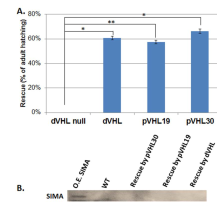

## Question

# Gene Research for Functional Annotation

## ⚠️ CRITICAL: Gene/Protein Identification Context

**BEFORE YOU BEGIN RESEARCH:** You MUST verify you are researching the CORRECT gene/protein. Gene symbols can be ambiguous, especially for less well-characterized genes from non-model organisms.

### Target Gene/Protein Identity (from UniProt):
- **UniProt Accession:** Q9V3C1
- **Protein Description:** RecName: Full=Protein Vhl;
- **Gene Information:** Name=Vhl {ECO:0000312|FlyBase:FBgn0041174}; ORFNames=CG13221;
- **Organism (full):** Drosophila melanogaster (Fruit fly).
- **Protein Family:** Belongs to the VHL family. .
- **Key Domains:** VHL_beta_dom. (IPR024053); VHL_beta_dom_sf. (IPR037140); VHL_sf. (IPR036208); VHL_tumour_suppress_b/a_dom. (IPR022772); VHL (PF01847)

### MANDATORY VERIFICATION STEPS:

1. **Check if the gene symbol "Vhl" matches the protein description above**
2. **Verify the organism is correct:** Drosophila melanogaster (Fruit fly).
3. **Check if protein family/domains align with what you find in literature**
4. **If you find literature for a DIFFERENT gene with the same or similar symbol, STOP**

### If Gene Symbol is Ambiguous or You Cannot Find Relevant Literature:

**DO NOT PROCEED WITH RESEARCH ON A DIFFERENT GENE.** Instead:
- State clearly: "The gene symbol 'Vhl' is ambiguous or literature is limited for this specific protein"
- Explain what you found (e.g., "Found extensive literature on a different gene with the same symbol in a different organism")
- Describe the protein based ONLY on the UniProt information provided above
- Suggest that the protein function can be inferred from domain/family information

### Research Target:

Please provide a comprehensive research report on the gene **Vhl** (gene ID: Vhl, UniProt: Q9V3C1) in DROME.

The research report should be a detailed narrative explaining the function, biological processes, and localization of the gene product. Citations should be given for all claims.

You should prioritize authoritative reviews and primary scientific literature when conducting research. You can supplement
this with annotations you find in gene/protein databases, but these can be outdated or inaccurate.

We are specifically interested in the primary function of the gene - for enzymes, what reaction is catalyzed, and what is the substrate specificity? For transporters, what is the substrate? For structural proteins or adapters, what is the broader structural role? For signaling molecules, what is the role in the pathway.

We are interested in where in or outside the cell the gene product carries out its function.

We are also interested in the signaling or biochemical pathways in which the gene functions. We are less interested in broad pleiotropic effects, except where these elucidate the precise role.

Include evidence where possible. We are interested in both experimental evidence as well as inference from structure, evolution, or bioinformatic analysis. Precise studies should be prioritized over high-throughput, where available.

## Output

Question: You are an expert researcher providing comprehensive, well-cited information.

Provide detailed information focusing on:
1. Key concepts and definitions with current understanding
2. Recent developments and latest research (prioritize 2023-2024 sources)
3. Current applications and real-world implementations
4. Expert opinions and analysis from authoritative sources
5. Relevant statistics and data from recent studies

Format as a comprehensive research report with proper citations. Include URLs and publication dates where available.
Always prioritize recent, authoritative sources and provide specific citations for all major claims.

# Gene Research for Functional Annotation

## ⚠️ CRITICAL: Gene/Protein Identification Context

**BEFORE YOU BEGIN RESEARCH:** You MUST verify you are researching the CORRECT gene/protein. Gene symbols can be ambiguous, especially for less well-characterized genes from non-model organisms.

### Target Gene/Protein Identity (from UniProt):
- **UniProt Accession:** Q9V3C1
- **Protein Description:** RecName: Full=Protein Vhl;
- **Gene Information:** Name=Vhl {ECO:0000312|FlyBase:FBgn0041174}; ORFNames=CG13221;
- **Organism (full):** Drosophila melanogaster (Fruit fly).
- **Protein Family:** Belongs to the VHL family. .
- **Key Domains:** VHL_beta_dom. (IPR024053); VHL_beta_dom_sf. (IPR037140); VHL_sf. (IPR036208); VHL_tumour_suppress_b/a_dom. (IPR022772); VHL (PF01847)

### MANDATORY VERIFICATION STEPS:

1. **Check if the gene symbol "Vhl" matches the protein description above**
2. **Verify the organism is correct:** Drosophila melanogaster (Fruit fly).
3. **Check if protein family/domains align with what you find in literature**
4. **If you find literature for a DIFFERENT gene with the same or similar symbol, STOP**

### If Gene Symbol is Ambiguous or You Cannot Find Relevant Literature:

**DO NOT PROCEED WITH RESEARCH ON A DIFFERENT GENE.** Instead:
- State clearly: "The gene symbol 'Vhl' is ambiguous or literature is limited for this specific protein"
- Explain what you found (e.g., "Found extensive literature on a different gene with the same symbol in a different organism")
- Describe the protein based ONLY on the UniProt information provided above
- Suggest that the protein function can be inferred from domain/family information

### Research Target:

Please provide a comprehensive research report on the gene **Vhl** (gene ID: Vhl, UniProt: Q9V3C1) in DROME.

The research report should be a detailed narrative explaining the function, biological processes, and localization of the gene product. Citations should be given for all claims.

You should prioritize authoritative reviews and primary scientific literature when conducting research. You can supplement
this with annotations you find in gene/protein databases, but these can be outdated or inaccurate.

We are specifically interested in the primary function of the gene - for enzymes, what reaction is catalyzed, and what is the substrate specificity? For transporters, what is the substrate? For structural proteins or adapters, what is the broader structural role? For signaling molecules, what is the role in the pathway.

We are interested in where in or outside the cell the gene product carries out its function.

We are also interested in the signaling or biochemical pathways in which the gene functions. We are less interested in broad pleiotropic effects, except where these elucidate the precise role.

Include evidence where possible. We are interested in both experimental evidence as well as inference from structure, evolution, or bioinformatic analysis. Precise studies should be prioritized over high-throughput, where available.

# Functional annotation of *Drosophila melanogaster* Vhl (Q9V3C1)

## Identity and principal function

The research target is **Vhl/CG13221 (FlyBase FBgn0041174), UniProt Q9V3C1**, encoding the fruit-fly VHL-family protein commonly called **dVHL**. The supplied UniProt record assigns it a VHL β domain and VHL tumour-suppressor α/β-domain architecture. This identification agrees with fly studies of a VHL homolog that recognizes oxygen-dependent degradation domains and interacts with the fly Elongin C homolog; it must not be confused with human VHL, which is used as a comparison or transgene in several experiments. (shmueli2014computationalandexperimental pages 2-3, shmueli2014computationalandexperimental pages 1-2)

**Best-supported molecular annotation:** dVHL is an **intracellular substrate-recognition component of a VHL-associated E3 ubiquitin-ligase complex**, rather than a prolyl hydroxylase, copper transporter, or independently catalytic ubiquitin-transfer enzyme. Its most clearly supported substrate class is *proline-hydroxylated HIF-α oxygen-dependent degradation (ODD) sequences*. In flies, the physiologically relevant HIF-α homolog is **Sima**. Fly Elongin C binding and conserved VHL-box/Cul2-interacting architecture support a Cullin-2-associated complex; assignment of every component of the endogenous fly complex is less directly documented than dVHL–Elongin C interaction and hydroxylated-ODD recognition. (arquier2006analysisofthe pages 4-5, shmueli2014computationalandexperimental pages 2-3, shmueli2014computationalandexperimental pages 6-8, arquier2006analysisofthe pages 7-8)

The following matrix separates fly experimental findings from mechanistic inference and findings obtained only with human VHL.

| Function/pathway | Direct fly evidence and quantitative result | Mechanistic interpretation | Qualification/uncertainty |
|---|---|---|---|
| Oxygen sensing: PHD–Vhl–Sima/HIF axis | In S2 cells, 1% O₂ increased ODD–GFP about 3-fold after 4 h and 4-fold after 16 h; proteasome inhibition produced approximately 3-fold accumulation of hydroxylated ODD–GFP. dVHL associated selectively with PHD-exposed, hydroxylated ODD. dVHL also bound a hydroxylated Sima P850 ODD peptide, and dVHL expression rescued null lethality in approximately 60% of animals (Arquier et al., 2006; Shmueli et al., 2014) (arquier2006analysisofthe pages 4-5, shmueli2014computationalandexperimental pages 4-6) | Under normoxia, oxygen-dependent prolyl hydroxylation creates a recognition determinant for dVHL, promoting ubiquitin–proteasome turnover of Sima/HIF-like ODD substrates. Hypoxia inhibits hydroxylation, stabilizing Sima and enabling hypoxia-responsive transcription. | The early cellular assay used a human HIF-1α ODD reporter rather than full-length endogenous Sima. Hydroxylated-Sima recognition is supported by peptide binding and pathway rescue, but endogenous Sima ubiquitylation was not directly quantified in these passages. |
| E3-ligase assembly: Elongin C/Cul2 complex | dVHL interacts with Drosophila Elongin C in vitro and can assemble with human Elongin B/C and mouse Rbx1. Structural and sequence analyses identified conserved BC-box, Cul2-box and partner-contact residues; fly and human VHL proteins recognized reciprocal ODD partners (Shmueli et al., 2014) (shmueli2014computationalandexperimental pages 1-2, shmueli2014computationalandexperimental pages 6-8) | dVHL is the substrate-recognition component of a VHL–Elongin B/C–Cul2–Rbx-type Cullin-RING E3 complex, not the enzyme that transfers ubiquitin. Its beta-like region recognizes hydroxylated substrate, while its alpha/BC-box region recruits the ligase scaffold. | Elongin C interaction has direct fly biochemical support. Some Cul2/Rbx assembly details derive from conservation and cross-species reconstitution rather than purification of the complete endogenous fly complex. |
| Tracheal FGFR trafficking and epithelial organization | In dVHL-mutant tracheal epithelium, Breathless/FGFR accumulates at the cell surface because endocytosis is defective; dVHL genetically interacts with the dynamin homolog shibire and endocytic regulator awd. Fly studies also implicate dVHL in microtubule stability during follicular-epithelium morphogenesis (reviewed by Millet-Boureima et al., 2021) (milletboureima2021modelingneoplasticgrowth pages 13-15) | Beyond Sima degradation, dVHL supports receptor internalization and epithelial morphogenesis, thereby restraining FGF signaling and helping organize epithelial tubules and microtubules. | Breathless accumulation is a trafficking phenotype, not proof that FGFR is directly ubiquitylated by dVHL. The evidence does not establish FGFR as a direct substrate or define a single molecular link between dVHL and microtubules. |
| PI3K–Akt–TOR growth signaling | Fly Vhl RNAi reduced Vhl transcript to 24% of control, decreased Akt/S6 phosphorylation, reduced cell and body size, and increased posterior-wing cell number by approximately 42%; activated Dp110 rescued growth defects (Hwang et al., 2020) (hwang2020vonhippel–lindautumor pages 2-3, hwang2020vonhippel–lindautumor pages 4-6) | Fly genetics place dVHL upstream of PI3K–Akt–TOR as a positive regulator of cell growth, revealing a role beyond suppression of HIF signaling. | Direct VHL–p110 binding, domain mapping and membrane PIP3 assays were performed in mammalian cells. A direct physical dVHL–Dp110 interaction was not demonstrated in the cited fly experiments, and p110 is not an established dVHL ubiquitylation substrate. |
| Copper homeostasis and melanization: Sima/Cnc/Ctr1A | Cuticle-cell Vhl knockdown caused thoracic hyperpigmentation but abdominal hypopigmentation; sima knockdown rescued both. Ctr1A knockdown suppressed the thoracic phenotype but worsened the abdominal phenotype, whereas Ctr1A overexpression had opposite effects. Vhl knockdown reduced Ctr1A mRNA in thorax but not abdomen. Midgut knockdown of Vhl or EloC increased survival on 1 mM CuCl₂, with no effect on normal food or 300 μM BCS (Zhang, Kirn and Burke, 2021) (zhang2021regulationofcopper pages 92-94, zhang2021regulationofcopper pages 91-92) | dVHL influences copper-dependent melanization indirectly and tissue-specifically: Sima predominates in thorax, while Cnc contributes strongly in abdomen, with both pathways converging on the copper importer Ctr1A. | Vhl knockdown did not consistently alter Ctr1A protein, and direct post-translational regulation was not confirmed in the relevant tissues. Ctr1A and Cnc are therefore not established direct dVHL substrates; the model rests primarily on genetic epistasis, transcriptional effects and tissue-specific phenotypes. |
| Tissue and subcellular localization | dVHL expression is enriched or restricted in the developing trachea. Ectoderm lacking effective dVHL showed oxygen-insensitive ODD–GFP; ectopic dVHL lowered basal reporter abundance and restored a 3.5-fold response after 16 h at 5% O₂ (Arquier et al., 2006) (arquier2006analysisofthe pages 7-8) | The best-supported site of canonical dVHL action is intracellularly within tracheal and experimentally targeted epithelial cells, where it controls proteasomal substrate turnover. Trafficking and microtubule phenotypes additionally implicate endocytic and cytoskeletal compartments. | A definitive endogenous-dVHL nuclear-versus-cytoplasmic localization map was not established. Cytoplasmic and nuclear staining in transgenic flies concerned human pVHL, not endogenous dVHL, and cannot be assigned to Q9V3C1 (shmueli2014computationalandexperimental pages 6-8) |

*Table: Evidence matrix distinguishing direct Drosophila Q9V3C1 findings from pathway inference and mammalian-only mechanisms. It summarizes quantitative evidence and key substrate and localization uncertainties.*

## Biochemical specificity and oxygen-response pathway

In oxygenated cells, the fly prolyl hydroxylase **Hph/Fatiga** uses oxygen and 2-oxoglutarate to modify suitable ODD prolines; **Sima Pro850** lies in an ODD-like region. The hydroxylated sequence provides a recognition signal for dVHL-associated ubiquitin–proteasome turnover. Low oxygen diminishes hydroxylation, allowing Sima accumulation and hypoxia-responsive transcription with its HIF-β partner, **Tango**. Crucially, **the hydroxylation reaction belongs to Hph, not Vhl**: dVHL's specificity is for the modified protein sequence, and ubiquitin transfer depends on the larger ligase machinery. (arquier2006analysisofthe pages 3-4, mortimer2013thearchipelagoubiquitin pages 1-2, arquier2006analysisofthe pages 1-2, shmueli2014computationalandexperimental pages 2-3)

The substrate-recognition evidence has different strengths. In the **2006 primary biochemical study**, fly dVHL associated with a human HIF-1α ODD reporter only after exposure to fly extracts capable of prolyl hydroxylation; endogenous dVHL bound the reporter in oxygenated S2 cells, more strongly when the proteasome was blocked, but not after hypoxic stabilization. This establishes hydroxylation-sensitive recognition and proteasome-linked regulation **in fly cells**, although the reporter's ODD was human. In **2014**, purified dVHL also bound a **hydroxylated Sima Pro850-derived peptide**. In vivo, dVHL expression suppressed Sima abundance and Sima-dependent phenotypes. Together these data strongly support Sima as a physiological dVHL-regulated target, while the cited assays should not be misrepresented as a measurement of endogenous full-length Sima ubiquitination or a complete inventory of dVHL substrates. (arquier2006analysisofthe pages 4-5, shmueli2014computationalandexperimental pages 4-6, shmueli2014computationalandexperimental pages 6-8, shmueli2014computationalandexperimental pages 8-10)

The oxygen response is **tissue-dependent**. dVHL expression was reported as enriched in the developing trachea. A tracheal ODD reporter responded to hypoxia, whereas embryonic ectoderm initially showed little oxygen-dependent reporter change. Supplying dVHL to ectoderm lowered reporter abundance in normal oxygen and restored an approximately **3.5-fold increase after 16 hours at 5% O₂**; GFP without the ODD was unaffected. This intervention specifically links dVHL availability to the capacity of that tissue to display oxygen-dependent substrate turnover. Hypoxia also remodels larval tracheal branches, although tracheal shape by itself cannot distinguish Sima-dependent from other dVHL functions. (arquier2006analysisofthe pages 7-8)

## Additional functions and pathway placement

**Tracheal receptor trafficking and epithelial structure.** A fly-focused review reports that dVHL-mutant tracheal epithelial cells accumulate the FGF receptor **Breathless/Btl** at the cell surface owing to defective endocytosis, increasing FGF-pathway signaling. Genetic interactions with **shibire** (dynamin) and **awd** (an endocytic regulator) support a receptor-trafficking role. The same literature implicates dVHL in microtubule stability during ovarian follicular-epithelium morphogenesis. These functions can affect branching and epithelial organization independently of straightforward Sima degradation; **Breathless surface accumulation does not demonstrate that Breathless is directly ubiquitinated by dVHL**. The key fly tubule and microtubule studies were identified but their full primary texts could not be examined here, so these particular mechanisms are presented as reviewed findings. (milletboureima2021modelingneoplasticgrowth pages 13-15)

**PI3K–Akt–TOR and cell growth.** In a **2020 primary fly study**, dVHL depletion reduced Akt/S6 phosphorylation and cell size; genetic activation of **Dp110/PI3K** rescued growth defects, placing dVHL functionally upstream of PI3K–TOR signaling in the examined tissues. The RNAi condition reduced Vhl transcript to **24% of control**; posterior wing cells increased in number by approximately **42%** despite reduced cell size. Direct VHL–PI3K-p110 physical interaction in that paper was established in **mammalian cells**, not directly for endogenous fly dVHL and Dp110. This is consequently a well-supported fly **pathway-level** function, but not a proven direct fly substrate-recognition reaction or evidence that PI3K is ubiquitinated by dVHL. (hwang2020vonhippel–lindautumor pages 2-3, hwang2020vonhippel–lindautumor pages 4-6, hwang2020vonhippel–lindautumor pages 1-2)

**Copper-dependent pigmentation.** Experiments published by **Zhang, Kirn and Burke in 2021**, reproduced in Zhang's thesis, found that knocking down Vhl in cuticle-producing cells caused **thoracic hyperpigmentation but abdominal hypopigmentation**. Simultaneous *sima* knockdown rescued both effects; manipulating the copper importer **Ctr1A** altered them in opposing directions, and the **Cnc** transcriptional pathway contributed especially to the abdominal effect. Vhl knockdown lowered Ctr1A **mRNA in thorax but not abdomen**. In larval midgut, Vhl or Elongin C knockdown improved survival on **1 mM CuCl₂**, without a comparable survival change on normal food or **300 μM** copper-chelator BCS. These results support indirect, tissue-specific regulation of copper availability and melanization through Sima/Cnc/Ctr1A, **not transport of copper by dVHL**. Notably, Vhl knockdown did **not** consistently change measured Ctr1A protein, and direct dVHL-mediated Ctr1A ubiquitination was not established. (zhang2021regulationofcopper pages 1-7, zhang2021regulationofcopper pages 92-94, zhang2021regulationofcopper pages 91-92, zhang2021regulationofcopper pages 90-91)

## Where dVHL acts

Functionally, dVHL acts **inside cells**: substrate binding was demonstrated in fly S2-cell extracts and intact cells, while proteasome-linked reporter control was tested in embryonic and larval tissues. The developing **tracheal epithelium** is the clearest documented native tissue context; manipulation in ectoderm, eye, wing, fat body, gut and cuticle-forming epithelia demonstrates function in additional experimental contexts. Its influence on Btl occurs at the **cell-surface/endocytic trafficking pathway**, but that receptor's surface location should not be mistaken for localization of dVHL itself. (arquier2006analysisofthe pages 4-5, hwang2020vonhippel–lindautumor pages 2-3, zhang2021regulationofcopper pages 92-94, arquier2006analysisofthe pages 7-8, milletboureima2021modelingneoplasticgrowth pages 13-15)

**Subcellular-location limitation:** these sources do not establish a definitive nucleus-versus-cytoplasm distribution for **endogenous Q9V3C1 dVHL**. In particular, nuclear and cytoplasmic staining observed in transgenic fly eye cells in the 2014 study was of **introduced human pVHL**, not the fly protein. Assigning endogenous fly dVHL to either compartment solely from that image would be incorrect. Its substrate-recognition, proteasomal and trafficking roles imply intracellular action, but do not by themselves provide organelle-resolved localization. (shmueli2014computationalandexperimental pages 1-2, shmueli2014computationalandexperimental pages 6-8)

## Strength of evidence, model use and research status

The strongest causal evidence combines biochemical hydroxylated-ODD recognition with fly reporter manipulation and organismal genetics. **Homozygous dVHL-null larvae died by the end of the first instar** in the 2014 study; ubiquitous expression of fly dVHL or either tested human VHL isoform yielded approximately **60% adult emergence**, accompanied by reduced Sima protein and normalization of measured Sima-responsive transcripts. Figure 5 reports **three independent survival experiments, n = 30 per experiment**. The eye and ODD–GFP assays likewise provide manipulable readouts for functional comparison of fly and human VHL. They make Drosophila useful for testing conserved VHL–HIF mechanisms, **not** an automatic model for every human VHL-associated disease phenotype. (shmueli2014computationalandexperimental pages 4-6, shmueli2014computationalandexperimental pages 6-8, shmueli2014computationalandexperimental media fcfd9c48)

As another quantitative mechanistic readout, S2 cells expressing human-ODD–GFP accumulated approximately **threefold reporter after 4 hours** and **fourfold after 16 hours at 1% O₂**; proteasome inhibition increased the hydroxylated reporter about **threefold**. These are reporter results, not direct measurements of native Sima turnover. A separate **2019** Malpighian-tubule transcriptomic study explored Vhl haploinsufficiency, but differential gene expression is less specific for identifying dVHL's direct biochemical substrates than the binding and perturbation studies above. (arquier2006analysisofthe pages 4-5, ignesti2019comparativeexpressionprofiling pages 2-4)

**Recency assessment.** The most informative fly-specific mechanistic sources retrieved were published in **2020–2021**, supplemented by foundational 2006–2014 experiments. Although **2023–2024** VHL reviews were found, their neuronal, cancer or ciliary mechanisms principally concern **vertebrate/human VHL** and cannot establish new functions or precise localization for fly Q9V3C1. No comparably direct 2023–2024 experimental revision of this fly protein's primary molecular annotation was established from the retrieved sources. (hwang2020vonhippel–lindautumor pages 2-3, zhang2021regulationofcopper pages 92-94, milletboureima2021modelingneoplasticgrowth pages 13-15)

### Selected sources: publication date and URL

- Arquier *et al.* **January 2006**, *Biochemical Journal*, “Analysis of the hypoxia-sensing pathway in *Drosophila melanogaster*”: https://doi.org/10.1042/BJ20050675. (arquier2006analysisofthe pages 4-5, arquier2006analysisofthe pages 7-8)
- Mortimer and Moberg, **February 2013**, *PLoS Genetics*, “The Archipelago ubiquitin ligase subunit acts in target tissue to restrict tracheal terminal cell branching and hypoxic-induced gene expression”: https://doi.org/10.1371/journal.pgen.1003314. Its direct perturbation centers on **Ago**, with dVHL examined as a pathway interaction. (mortimer2013thearchipelagoubiquitin pages 1-2, mortimer2013thearchipelagoubiquitin pages 3-4)
- Shmueli *et al.*, **October 2014**, *PLoS ONE*, “Computational and experimental characterization of dVHL establish a *Drosophila* model of VHL syndrome”: https://doi.org/10.1371/journal.pone.0109864. (shmueli2014computationalandexperimental pages 4-6, shmueli2014computationalandexperimental pages 6-8)
- Ignesti *et al.*, **May 2019**, *Frontiers in Physiology*, Malpighian-tubule Vhl haploinsufficiency transcriptomics: https://doi.org/10.3389/fphys.2019.00619. (ignesti2019comparativeexpressionprofiling pages 1-2, ignesti2019comparativeexpressionprofiling pages 2-4)
- Hwang *et al.*, **February 2020**, *Journal of Biological Chemistry*, VHL and PI3K–TOR growth signaling: https://doi.org/10.1074/jbc.RA119.011596. (hwang2020vonhippel–lindautumor pages 2-3, hwang2020vonhippel–lindautumor pages 4-6)
- Zhang, Kirn and Burke, **2021**, *Biochimica et Biophysica Acta—Molecular Cell Research*, “The Vhl E3 ubiquitin ligase complex regulates melanisation via sima, cnc and the copper import protein Ctr1A”: https://doi.org/10.1016/j.bbamcr.2021.119022. Experimental text is available in Zhang's **2021** thesis, https://doi.org/10.26180/14818632.v1. (zhang2021regulationofcopper pages 1-7, zhang2021regulationofcopper pages 92-94, zhang2021regulationofcopper pages 91-92)
- Millet-Boureima *et al.*, **April 2021**, *International Journal of Molecular Sciences*, review discussing fly dVHL's endocytic and epithelial roles: https://doi.org/10.3390/ijms22083918. (milletboureima2021modelingneoplasticgrowth pages 13-15)

References

1. (shmueli2014computationalandexperimental pages 2-3): Merav D. Shmueli, Lee Schnaider, Gal Herzog, Ehud Gazit, and Daniel Segal. Computational and experimental characterization of dvhl establish a drosophila model of vhl syndrome. PLoS ONE, 9:e109864, Oct 2014. URL: https://doi.org/10.1371/journal.pone.0109864, doi:10.1371/journal.pone.0109864. This article has 3 citations and is from a peer-reviewed journal.

2. (shmueli2014computationalandexperimental pages 1-2): Merav D. Shmueli, Lee Schnaider, Gal Herzog, Ehud Gazit, and Daniel Segal. Computational and experimental characterization of dvhl establish a drosophila model of vhl syndrome. PLoS ONE, 9:e109864, Oct 2014. URL: https://doi.org/10.1371/journal.pone.0109864, doi:10.1371/journal.pone.0109864. This article has 3 citations and is from a peer-reviewed journal.

3. (arquier2006analysisofthe pages 4-5): Nathalie Arquier, Paul Vigne, Eric Duplan, Tien Hsu, Pascal P. Therond, Christian Frelin, and Gisela D'Angelo. Analysis of the hypoxia-sensing pathway in drosophila melanogaster. The Biochemical journal, 393 Pt 2:471-80, Jan 2006. URL: https://doi.org/10.1042/bj20050675, doi:10.1042/bj20050675. This article has 92 citations.

4. (shmueli2014computationalandexperimental pages 6-8): Merav D. Shmueli, Lee Schnaider, Gal Herzog, Ehud Gazit, and Daniel Segal. Computational and experimental characterization of dvhl establish a drosophila model of vhl syndrome. PLoS ONE, 9:e109864, Oct 2014. URL: https://doi.org/10.1371/journal.pone.0109864, doi:10.1371/journal.pone.0109864. This article has 3 citations and is from a peer-reviewed journal.

5. (arquier2006analysisofthe pages 7-8): Nathalie Arquier, Paul Vigne, Eric Duplan, Tien Hsu, Pascal P. Therond, Christian Frelin, and Gisela D'Angelo. Analysis of the hypoxia-sensing pathway in drosophila melanogaster. The Biochemical journal, 393 Pt 2:471-80, Jan 2006. URL: https://doi.org/10.1042/bj20050675, doi:10.1042/bj20050675. This article has 92 citations.

6. (shmueli2014computationalandexperimental pages 4-6): Merav D. Shmueli, Lee Schnaider, Gal Herzog, Ehud Gazit, and Daniel Segal. Computational and experimental characterization of dvhl establish a drosophila model of vhl syndrome. PLoS ONE, 9:e109864, Oct 2014. URL: https://doi.org/10.1371/journal.pone.0109864, doi:10.1371/journal.pone.0109864. This article has 3 citations and is from a peer-reviewed journal.

7. (milletboureima2021modelingneoplasticgrowth pages 13-15): Cassandra Millet-Boureima, Stephanie He, Thi Bich Uyen Le, and Chiara Gamberi. Modeling neoplastic growth in renal cell carcinoma and polycystic kidney disease. International Journal of Molecular Sciences, 22:3918, Apr 2021. URL: https://doi.org/10.3390/ijms22083918, doi:10.3390/ijms22083918. This article has 24 citations.

8. (hwang2020vonhippel–lindautumor pages 2-3): Sun-Hong Hwang, Sunhoe Bang, Wonho Kim, and Jongkyeong Chung. Von hippel–lindau tumor suppressor (vhl) stimulates tor signaling by interacting with phosphoinositide 3-kinase (pi3k). Journal of Biological Chemistry, 295:2336-2347, Feb 2020. URL: https://doi.org/10.1074/jbc.ra119.011596, doi:10.1074/jbc.ra119.011596. This article has 5 citations and is from a domain leading peer-reviewed journal.

9. (hwang2020vonhippel–lindautumor pages 4-6): Sun-Hong Hwang, Sunhoe Bang, Wonho Kim, and Jongkyeong Chung. Von hippel–lindau tumor suppressor (vhl) stimulates tor signaling by interacting with phosphoinositide 3-kinase (pi3k). Journal of Biological Chemistry, 295:2336-2347, Feb 2020. URL: https://doi.org/10.1074/jbc.ra119.011596, doi:10.1074/jbc.ra119.011596. This article has 5 citations and is from a domain leading peer-reviewed journal.

10. (zhang2021regulationofcopper pages 92-94): BICHAO ZHANG. Regulation of copper homeostasis by the ubiquitin proteasome system. ArXiv, Jun 2021. URL: https://doi.org/10.26180/14818632.v1, doi:10.26180/14818632.v1. This article has 2 citations.

11. (zhang2021regulationofcopper pages 91-92): BICHAO ZHANG. Regulation of copper homeostasis by the ubiquitin proteasome system. ArXiv, Jun 2021. URL: https://doi.org/10.26180/14818632.v1, doi:10.26180/14818632.v1. This article has 2 citations.

12. (arquier2006analysisofthe pages 3-4): Nathalie Arquier, Paul Vigne, Eric Duplan, Tien Hsu, Pascal P. Therond, Christian Frelin, and Gisela D'Angelo. Analysis of the hypoxia-sensing pathway in drosophila melanogaster. The Biochemical journal, 393 Pt 2:471-80, Jan 2006. URL: https://doi.org/10.1042/bj20050675, doi:10.1042/bj20050675. This article has 92 citations.

13. (mortimer2013thearchipelagoubiquitin pages 1-2): Nathan T. Mortimer and Kenneth H. Moberg. The archipelago ubiquitin ligase subunit acts in target tissue to restrict tracheal terminal cell branching and hypoxic-induced gene expression. PLoS Genetics, 9:e1003314, Feb 2013. URL: https://doi.org/10.1371/journal.pgen.1003314, doi:10.1371/journal.pgen.1003314. This article has 15 citations and is from a domain leading peer-reviewed journal.

14. (arquier2006analysisofthe pages 1-2): Nathalie Arquier, Paul Vigne, Eric Duplan, Tien Hsu, Pascal P. Therond, Christian Frelin, and Gisela D'Angelo. Analysis of the hypoxia-sensing pathway in drosophila melanogaster. The Biochemical journal, 393 Pt 2:471-80, Jan 2006. URL: https://doi.org/10.1042/bj20050675, doi:10.1042/bj20050675. This article has 92 citations.

15. (shmueli2014computationalandexperimental pages 8-10): Merav D. Shmueli, Lee Schnaider, Gal Herzog, Ehud Gazit, and Daniel Segal. Computational and experimental characterization of dvhl establish a drosophila model of vhl syndrome. PLoS ONE, 9:e109864, Oct 2014. URL: https://doi.org/10.1371/journal.pone.0109864, doi:10.1371/journal.pone.0109864. This article has 3 citations and is from a peer-reviewed journal.

16. (hwang2020vonhippel–lindautumor pages 1-2): Sun-Hong Hwang, Sunhoe Bang, Wonho Kim, and Jongkyeong Chung. Von hippel–lindau tumor suppressor (vhl) stimulates tor signaling by interacting with phosphoinositide 3-kinase (pi3k). Journal of Biological Chemistry, 295:2336-2347, Feb 2020. URL: https://doi.org/10.1074/jbc.ra119.011596, doi:10.1074/jbc.ra119.011596. This article has 5 citations and is from a domain leading peer-reviewed journal.

17. (zhang2021regulationofcopper pages 1-7): BICHAO ZHANG. Regulation of copper homeostasis by the ubiquitin proteasome system. ArXiv, Jun 2021. URL: https://doi.org/10.26180/14818632.v1, doi:10.26180/14818632.v1. This article has 2 citations.

18. (zhang2021regulationofcopper pages 90-91): BICHAO ZHANG. Regulation of copper homeostasis by the ubiquitin proteasome system. ArXiv, Jun 2021. URL: https://doi.org/10.26180/14818632.v1, doi:10.26180/14818632.v1. This article has 2 citations.

19. (shmueli2014computationalandexperimental media fcfd9c48): Merav D. Shmueli, Lee Schnaider, Gal Herzog, Ehud Gazit, and Daniel Segal. Computational and experimental characterization of dvhl establish a drosophila model of vhl syndrome. PLoS ONE, 9:e109864, Oct 2014. URL: https://doi.org/10.1371/journal.pone.0109864, doi:10.1371/journal.pone.0109864. This article has 3 citations and is from a peer-reviewed journal.

20. (ignesti2019comparativeexpressionprofiling pages 2-4): Marilena Ignesti, Davide Andrenacci, Bettina Fischer, Valeria Cavaliere, and Giuseppe Gargiulo. Comparative expression profiling of wild type drosophila malpighian tubules and von hippel-lindau haploinsufficient mutant. Frontiers in Physiology, May 2019. URL: https://doi.org/10.3389/fphys.2019.00619, doi:10.3389/fphys.2019.00619. This article has 2 citations.

21. (mortimer2013thearchipelagoubiquitin pages 3-4): Nathan T. Mortimer and Kenneth H. Moberg. The archipelago ubiquitin ligase subunit acts in target tissue to restrict tracheal terminal cell branching and hypoxic-induced gene expression. PLoS Genetics, 9:e1003314, Feb 2013. URL: https://doi.org/10.1371/journal.pgen.1003314, doi:10.1371/journal.pgen.1003314. This article has 15 citations and is from a domain leading peer-reviewed journal.

22. (ignesti2019comparativeexpressionprofiling pages 1-2): Marilena Ignesti, Davide Andrenacci, Bettina Fischer, Valeria Cavaliere, and Giuseppe Gargiulo. Comparative expression profiling of wild type drosophila malpighian tubules and von hippel-lindau haploinsufficient mutant. Frontiers in Physiology, May 2019. URL: https://doi.org/10.3389/fphys.2019.00619, doi:10.3389/fphys.2019.00619. This article has 2 citations.

## Artifacts

- [Edison artifact artifact-00](Vhl-deep-research-falcon_artifacts/artifact-00.md)

## Citations

1. milletboureima2021modelingneoplasticgrowth pages 13-15
2. arquier2006analysisofthe pages 7-8
3. shmueli2014computationalandexperimental pages 6-8
4. shmueli2014computationalandexperimental pages 2-3
5. shmueli2014computationalandexperimental pages 1-2
6. arquier2006analysisofthe pages 4-5
7. shmueli2014computationalandexperimental pages 4-6
8. zhang2021regulationofcopper pages 92-94
9. zhang2021regulationofcopper pages 91-92
10. arquier2006analysisofthe pages 3-4
11. mortimer2013thearchipelagoubiquitin pages 1-2
12. arquier2006analysisofthe pages 1-2
13. shmueli2014computationalandexperimental pages 8-10
14. zhang2021regulationofcopper pages 1-7
15. zhang2021regulationofcopper pages 90-91
16. ignesti2019comparativeexpressionprofiling pages 2-4
17. mortimer2013thearchipelagoubiquitin pages 3-4
18. ignesti2019comparativeexpressionprofiling pages 1-2
19. https://doi.org/10.1042/BJ20050675.
20. https://doi.org/10.1371/journal.pgen.1003314.
21. https://doi.org/10.1371/journal.pone.0109864.
22. https://doi.org/10.3389/fphys.2019.00619.
23. https://doi.org/10.1074/jbc.RA119.011596.
24. https://doi.org/10.1016/j.bbamcr.2021.119022.
25. https://doi.org/10.26180/14818632.v1.
26. https://doi.org/10.3390/ijms22083918.
27. https://doi.org/10.1371/journal.pone.0109864,
28. https://doi.org/10.1042/bj20050675,
29. https://doi.org/10.3390/ijms22083918,
30. https://doi.org/10.1074/jbc.ra119.011596,
31. https://doi.org/10.26180/14818632.v1,
32. https://doi.org/10.1371/journal.pgen.1003314,
33. https://doi.org/10.3389/fphys.2019.00619,