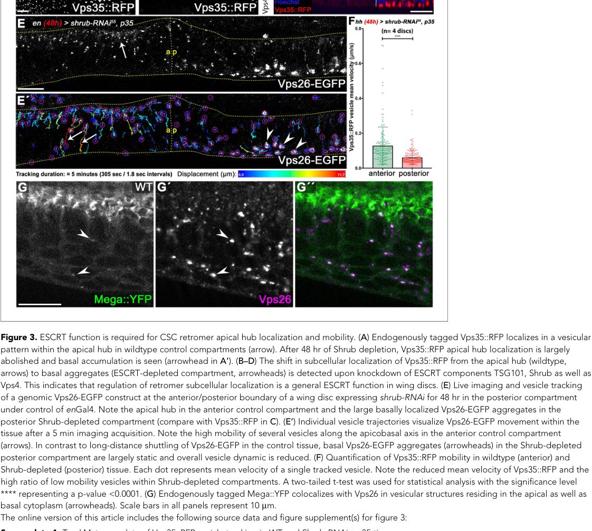

## Question

# Gene Research for Functional Annotation

## ⚠️ CRITICAL: Gene/Protein Identification Context

**BEFORE YOU BEGIN RESEARCH:** You MUST verify you are researching the CORRECT gene/protein. Gene symbols can be ambiguous, especially for less well-characterized genes from non-model organisms.

### Target Gene/Protein Identity (from UniProt):
- **UniProt Accession:** Q9W552
- **Protein Description:** RecName: Full=Vacuolar protein sorting-associated protein 26; AltName: Full=VPS26 protein homolog;
- **Gene Information:** Name=Vps26; ORFNames=CG14804;
- **Organism (full):** Drosophila melanogaster (Fruit fly).
- **Protein Family:** Belongs to the VPS26 family. .
- **Key Domains:** Arrestin-like_C_sf. (IPR014752); Vps26-related. (IPR028934); Vps26 (PF03643)

### MANDATORY VERIFICATION STEPS:

1. **Check if the gene symbol "Vps26" matches the protein description above**
2. **Verify the organism is correct:** Drosophila melanogaster (Fruit fly).
3. **Check if protein family/domains align with what you find in literature**
4. **If you find literature for a DIFFERENT gene with the same or similar symbol, STOP**

### If Gene Symbol is Ambiguous or You Cannot Find Relevant Literature:

**DO NOT PROCEED WITH RESEARCH ON A DIFFERENT GENE.** Instead:
- State clearly: "The gene symbol 'Vps26' is ambiguous or literature is limited for this specific protein"
- Explain what you found (e.g., "Found extensive literature on a different gene with the same symbol in a different organism")
- Describe the protein based ONLY on the UniProt information provided above
- Suggest that the protein function can be inferred from domain/family information

### Research Target:

Please provide a comprehensive research report on the gene **Vps26** (gene ID: Vps26, UniProt: Q9W552) in DROME.

The research report should be a detailed narrative explaining the function, biological processes, and localization of the gene product. Citations should be given for all claims.

You should prioritize authoritative reviews and primary scientific literature when conducting research. You can supplement
this with annotations you find in gene/protein databases, but these can be outdated or inaccurate.

We are specifically interested in the primary function of the gene - for enzymes, what reaction is catalyzed, and what is the substrate specificity? For transporters, what is the substrate? For structural proteins or adapters, what is the broader structural role? For signaling molecules, what is the role in the pathway.

We are interested in where in or outside the cell the gene product carries out its function.

We are also interested in the signaling or biochemical pathways in which the gene functions. We are less interested in broad pleiotropic effects, except where these elucidate the precise role.

Include evidence where possible. We are interested in both experimental evidence as well as inference from structure, evolution, or bioinformatic analysis. Precise studies should be prioritized over high-throughput, where available.

## Output

Question: You are an expert researcher providing comprehensive, well-cited information.

Provide detailed information focusing on:
1. Key concepts and definitions with current understanding
2. Recent developments and latest research (prioritize 2023-2024 sources)
3. Current applications and real-world implementations
4. Expert opinions and analysis from authoritative sources
5. Relevant statistics and data from recent studies

Format as a comprehensive research report with proper citations. Include URLs and publication dates where available.
Always prioritize recent, authoritative sources and provide specific citations for all major claims.

# Gene Research for Functional Annotation

## ⚠️ CRITICAL: Gene/Protein Identification Context

**BEFORE YOU BEGIN RESEARCH:** You MUST verify you are researching the CORRECT gene/protein. Gene symbols can be ambiguous, especially for less well-characterized genes from non-model organisms.

### Target Gene/Protein Identity (from UniProt):
- **UniProt Accession:** Q9W552
- **Protein Description:** RecName: Full=Vacuolar protein sorting-associated protein 26; AltName: Full=VPS26 protein homolog;
- **Gene Information:** Name=Vps26; ORFNames=CG14804;
- **Organism (full):** Drosophila melanogaster (Fruit fly).
- **Protein Family:** Belongs to the VPS26 family. .
- **Key Domains:** Arrestin-like_C_sf. (IPR014752); Vps26-related. (IPR028934); Vps26 (PF03643)

### MANDATORY VERIFICATION STEPS:

1. **Check if the gene symbol "Vps26" matches the protein description above**
2. **Verify the organism is correct:** Drosophila melanogaster (Fruit fly).
3. **Check if protein family/domains align with what you find in literature**
4. **If you find literature for a DIFFERENT gene with the same or similar symbol, STOP**

### If Gene Symbol is Ambiguous or You Cannot Find Relevant Literature:

**DO NOT PROCEED WITH RESEARCH ON A DIFFERENT GENE.** Instead:
- State clearly: "The gene symbol 'Vps26' is ambiguous or literature is limited for this specific protein"
- Explain what you found (e.g., "Found extensive literature on a different gene with the same symbol in a different organism")
- Describe the protein based ONLY on the UniProt information provided above
- Suggest that the protein function can be inferred from domain/family information

### Research Target:

Please provide a comprehensive research report on the gene **Vps26** (gene ID: Vps26, UniProt: Q9W552) in DROME.

The research report should be a detailed narrative explaining the function, biological processes, and localization of the gene product. Citations should be given for all claims.

You should prioritize authoritative reviews and primary scientific literature when conducting research. You can supplement
this with annotations you find in gene/protein databases, but these can be outdated or inaccurate.

We are specifically interested in the primary function of the gene - for enzymes, what reaction is catalyzed, and what is the substrate specificity? For transporters, what is the substrate? For structural proteins or adapters, what is the broader structural role? For signaling molecules, what is the role in the pathway.

We are interested in where in or outside the cell the gene product carries out its function.

We are also interested in the signaling or biochemical pathways in which the gene functions. We are less interested in broad pleiotropic effects, except where these elucidate the precise role.

Include evidence where possible. We are interested in both experimental evidence as well as inference from structure, evolution, or bioinformatic analysis. Precise studies should be prioritized over high-throughput, where available.

# Functional annotation of *Drosophila melanogaster* Vps26 (UniProt Q9W552)

## Identity and principal function

The supplied UniProt record identifies **Vps26/CG14804** as the fruit-fly VPS26-family protein, with a Vps26-related, arrestin-like domain. This assignment is consistent with *Drosophila* studies that manipulate **Vps26** itself and image a genomic Vps26–EGFP fusion. The accession-to-gene cross-reference comes from the supplied record; the experimental papers independently establish the relevant fly protein’s role in retromer. It should **not** be conflated with yeast Vps26p, human VPS26A or VPS26B, or VPS26C, which belongs to the related *retriever* complex. (pannen2020theescrtmachinery pages 10-11, gopaldass2024assemblyandfission pages 9-10, carosi2023receptorrecyclingby pages 1-3)

**Vps26 is an intracellular sorting adaptor and structural retromer subunit, not an enzyme or membrane transporter.** It associates with Vps35 and Vps29 in the canonical retromer core, which selects membrane proteins for export from endosomes instead of allowing their default delivery to degradative compartments. Its function is therefore specified by **protein cargo and destination**, not a catalytic reaction or transported small-molecule substrate. The arrestin-like fold supports this adaptor assignment; the detailed structural model derives principally from studies of conserved retromer complexes rather than an atomic structure established here for Q9W552. Fly-head co-immunoprecipitation provides direct evidence that fly Vps26 associates with Vps35. (seaman2018retromerandits pages 17-22, carosi2023receptorrecyclingby pages 3-5, ye2020retromersubunitvps29 pages 7-10)

Retromer is best understood as a **Vps26–Vps35–Vps29 core that works with context-dependent sorting factors**, not as one invariant five-protein particle for every cargo. SNX3-associated retromer retrieves Wntless toward the trans-Golgi network (TGN); other assemblies support different endosome-to-Golgi or cell-surface routes. Structural analyses discussed in a June 2024 review show that retromer can form higher-order membrane-associated arches, with VPS26 contributing contacts near the membrane and to assembly. Applying those particular human or yeast structural contacts to fly Q9W552 remains an inference from conservation. (gopaldass2024assemblyandfission pages 6-7, carosi2023receptorrecyclingby pages 5-6)

## Where Vps26 acts

The relevant functional site is the **cytosolic face of endosomal membranes and endosome-derived carriers**, not the extracellular space. In fly wing-disc epithelial cells, genomic Vps26–EGFP appears on intracellular vesicles enriched at an **apical trafficking hub**; live imaging shows movement along the apicobasal axis. When the ESCRT component Shrub is depleted, Vps26-positive structures accumulate basally and become largely immobile. This is direct localization evidence for fly Vps26, although the perturbation in that imaging experiment is **Shrub loss**, not Vps26 loss. In the adult nervous system, Vps26 and Vps35 are present in neuropil-associated retromer; loss of **Vps29** redistributes them toward neuronal somata without abolishing their association. Those redistribution and aging phenotypes likewise must not be mislabeled as Vps26-mutant phenotypes. (pannen2020theescrtmachinery pages 10-11, pannen2020theescrtmachinery media 1ed66abc, ye2020retromersubunitvps29 pages 5-7)

## Cargo pathways and biological processes

**Wntless recycling and Wingless signaling.** In Wnt-producing cells, Wntless—also called Evi or Sprinter—carries Wingless/Wnt through the secretory pathway. Following internalization, **SNX3–retromer retrieves Wntless from endosomes to the TGN**, preserving the receptor for further rounds of Wnt export. Fly Vps35 associates with Wntless; Vps35 loss lowers effective Wntless-dependent Wingless secretion, while additional Wntless rescues the secretion defect. Independent fly SNX3 experiments show reduced Wntless, intracellular Wingless accumulation and diminished extracellular Wingless; SNX1 and SNX6 do not substitute for SNX3 in the tested pathway. The primary retromer-controlled cargo is **Wntless, not necessarily the Wingless ligand itself**. These experiments strongly establish a pathway requiring the Vps26-containing retromer core, but the cited fly experiments do **not** establish direct binding between purified fly Vps26 and Wntless. The Wntless-export itinerary is reassessed in a February 2023 authoritative review. (belenkaya2008theretromercomplex pages 3-4, zhang2011snx3controlswinglesswnt pages 1-2, m2011asnx3dependentretromer pages 4-8, wolf2023theroleof pages 6-7)

**Crumbs and epithelial polarity.** Vps26 has a more direct cargo-related fly phenotype in the apical polarity pathway. In wing discs, **Vps26 RNAi reduced Crumbs fluorescence by approximately 50%**, similar to Vps35 RNAi. Retromer protects endocytosed Crumbs from lysosomal loss and helps maintain its apical membrane pool; Vps35-mutant follicle cells lose apical Crumbs. The exact route *after* retromer sorting—direct return through recycling endosomes versus passage through the TGN—was not resolved by these experiments. A biochemical recruitment result for vertebrate Crb2 involving VPS26B is supportive comparative evidence, **not** a fly Q9W552 binding measurement. (pocha2011retromercontrolsepithelial pages 2-3, pocha2011retromercontrolsepithelial pages 1-2, pocha2011retromercontrolsepithelial pages 3-6)

**Septate-junction delivery.** Wing-disc Vps26 mutant clones have reduced junctional **Megatrachea (Mega)**, a claudin-like protein. Following Vps26 depletion, electron-microscopy measurements found **approximately 60% fewer electron-dense septa**, accompanied by loss of barrier function. In live-cell trafficking studies, **71.9% of Mega-positive vesicles were Vps26-positive** (*128 vesicles from three discs*). Mega appears to follow a basal-to-apical, transcytosis-like itinerary in Vps26-positive carriers; ESCRT-dependent carrier positioning and mobility are needed for its delivery to the septate junction. Vps35 loss also reduces membrane levels of several other junctional components, whereas some control junctional or polarity proteins remain unaffected. Together, this is strong evidence for selective **retromer-dependent trafficking**, but vesicle colocalization does not prove direct molecular binding of Mega to Vps26. The Vps26 localization and Mega-overlap observations are illustrated in Pannen and colleagues’ Figure 3. (pannen2020theescrtmachinery pages 6-7, pannen2020theescrtmachinery pages 10-11, pannen2020theescrtmachinery media 1ed66abc)

**Lysosomal function and autophagy.** In larval fat-body cells, Vps26 depletion produces enlarged acidic and Atg8a-positive compartments, resembling the defects after Vps35 depletion. Autophagosomes and endosomes can still form; the major defect lies in **terminal cargo degradation** within autolysosomal compartments. Detailed Vps35-based assays show impaired delivery of the protease **cathepsin L** to otherwise acidic lysosomal structures. Thus Vps26’s role is best characterized as supporting trafficking required for lysosomal degradative capacity, **not** catalyzing proteolysis. Importantly, the tested fly lysosomal-enzyme receptor **LERP did not account for the principal retromer phenotype** in this tissue; it should not be asserted to be the demonstrated Vps26 cargo responsible for cathepsin-L delivery. (maruzs2015retromerensuresthe pages 1-2, maruzs2015retromerensuresthe pages 8-11, maruzs2015retromerensuresthe pages 2-4, maruzs2015retromerensuresthe pages 4-8)

**Neuronal retromer maintenance: a 2024 development.** Wilson and colleagues reported in January 2024 that neuronal loss of fly **Mtd**, the OXR1 homolog, reduces Vps26 and Vps35 protein abundance and disrupts retromer-linked maintenance of the aging brain. Neuronal overexpression of **fly vps26** or **vps35** rescued Mtd-depletion-associated phototaxis impairment and brain-degeneration readouts. The distinction matters for lifespan: **vps26 overexpression rescued lifespan to the ad-libitum baseline**, whereas restoration of the additional *dietary-restriction-associated lifespan extension* was explicitly shown for **vps35**, not established to the same extent for vps26. Adult neuronal vps26 RNAi also reduced the lifespan benefit associated with dietary restriction. The phototaxis experiments used at least **50 flies per condition**, and the brain TUNEL analysis at least **17 brains per condition**. The retromer-stabilizing research compound **R55**, tested at **6 μM in flies**, provided a pharmacological proof of concept; these results do not constitute an established clinical application. Association of OXR1 with VPS26A/B was measured in **human fibroblasts** and should not be presented as direct biochemical binding of Mtd to fly Vps26. (wilson2024oxr1maintainsthe pages 4-6, wilson2024oxr1maintainsthe pages 7-8, wilson2024oxr1maintainsthe pages 2-3, wilson2024oxr1maintainsthe pages 9-10)

The following evidence map distinguishes direct experiments on fly Vps26 from conclusions drawn chiefly from perturbing another retromer component.

| Process / cargo | Cellular itinerary / location | Evidence grade and strongest *Drosophila* evidence | Principal paper (date; DOI) |
|---|---|---|---|
| **Crumbs (Crb); apical polarity** | Following endocytosis, retromer diverts Crb from lysosomal degradation toward recycling to the apical plasma membrane; whether return passes through the TGN or recycling endosomes remains unresolved. | **Direct, strong:** posterior wing-disc **Vps26 RNAi reduced Crb fluorescence by ~50%**, closely matching Vps35 RNAi. Vps35-mutant follicle cells lost apical Crb, and lysosomal inhibition trapped Crb in LysoTracker-positive puncta. Notch and Hindsight were unaffected in that tissue, supporting cargo/pathway selectivity. (pocha2011retromercontrolsepithelial pages 2-3) | Pocha et al.; **2011-07**; [10.1016/j.cub.2011.05.007](https://doi.org/10.1016/j.cub.2011.05.007) |
| **Megatrachea (Mega) and septate-junction proteins** | Vps26-positive carriers shuttle along the apicobasal axis of wing-disc epithelial cells and are enriched in an apical hub; Mega follows a basodistal-to-apical transcytosis-like route to septate junctions. | **Direct, very strong:** Vps26 mutant clones reduced junctional Mega; **Vps26 RNAi reduced electron-dense septa by ~60%** and compromised barrier function. **71.9% of Mega vesicles were Vps26-positive** (128 vesicles from 3 discs). ESCRT/Shrub loss displaced mobile Vps26-EGFP carriers into largely static basal endosomes; direct Mega–Vps26 binding was not demonstrated. (pannen2020theescrtmachinery pages 6-7, pannen2020theescrtmachinery pages 10-11) | Pannen et al.; **2020-12**; [10.7554/eLife.61866](https://doi.org/10.7554/eLife.61866) |
| **Lysosomal enzyme delivery and autophagic degradation** | Retromer puncta occur mainly on Rab4/Rab5-positive early endosomes, with weaker late-endosome/lysosome association. Its loss impairs delivery of cathepsin L to acidic lysosomes, producing enlarged, poorly degradative autolysosomes and amphisomes. | **Direct Vps26 phenotype; mechanism supported mainly by Vps35 assays:** Vps26 depletion enlarged acidic Atg8a/Rab7-positive structures and phenocopied Vps35, Snx3 and Snx6 depletion. Acidification and organelle formation persist, but terminal degradation fails. LERP neither substantially colocalized with retromer nor reproduced the phenotype when depleted; therefore **LERP is not established as the relevant fly cargo**. (maruzs2015retromerensuresthe pages 1-2, maruzs2015retromerensuresthe pages 8-11) | Maruzs et al.; **2015-10**; [10.1111/tra.12309](https://doi.org/10.1111/tra.12309) |
| **Neuronal retromer assembly and localization** | In adult brain, the Vps26–Vps35 complex is normally represented in neuropil; when Vps29 is absent, it shifts toward neuronal somata and perinuclear Rab7-positive compartments. | **Direct biochemical evidence, but perturbation is Vps29:** Vps35-GFP immunoprecipitation from fly heads recovered Vps26, showing that Vps26 and Vps35 remain tightly associated even without Vps29; both proteins remained normally expressed. Age-dependent locomotor, synaptic and lysosomal phenotypes in this study belong to **Vps29 mutants** and should not be assigned directly to Vps26. (ye2020retromersubunitvps29 pages 5-7) | Ye et al.; **2020-10**; [10.7554/eLife.51977](https://doi.org/10.7554/eLife.51977) |
| **Mtd/OXR1-dependent neuronal maintenance** | Mtd/OXR1 maintains retromer abundance in neurons; its loss lowers fly-head Vps26 and Vps35 and causes endolysosomal, behavioral and neurodegenerative defects. | **Direct fly genetic evidence:** neuronal **vps26** or **vps35** overexpression rescued mtd-RNAi phototaxis defects and brain apoptosis/degeneration. Vps26 overexpression rescued lifespan to the ad-libitum baseline, whereas restoration of dietary-restriction-mediated extension was shown explicitly for Vps35. Physical OXR1 association with VPS26A/B was demonstrated in **human fibroblasts**, not directly with fly Vps26. (wilson2024oxr1maintainsthe pages 4-6, wilson2024oxr1maintainsthe pages 7-8) | Wilson et al.; **2024-01**; [10.1038/s41467-023-44343-3](https://doi.org/10.1038/s41467-023-44343-3) |
| **Wntless/Evi (Wls) recycling and Wingless secretion** | SNX3-containing retromer retrieves internalized Wls from early endosomes to the TGN, preserving the receptor for repeated Wingless export and preventing lysosomal loss. | **Strong pathway evidence, but limited Vps26-specific evidence:** fly Vps35 co-immunoprecipitated with Wls; Vps35 loss reduced Wls-dependent Wingless secretion, and Wls overexpression rescued the defect. Drosophila SNX3 associated with Vps35 and early endosomes, whereas SNX1/SNX6 were dispensable. **A direct fly Wls–Vps26 interaction was not demonstrated**, so this is a high-confidence retromer function inferred for the Vps26-containing core rather than a Vps26-specific cargo-binding result. (belenkaya2008theretromercomplex pages 3-4, zhang2011snx3controlswinglesswnt pages 1-2) | Belenkaya et al.; **2008-01**; [10.1016/j.devcel.2007.12.003](https://doi.org/10.1016/j.devcel.2007.12.003); Zhang et al.; **2011-11**; [10.1038/cr.2011.167](https://doi.org/10.1038/cr.2011.167) |

*Table: Evidence-graded summary of experimentally supported functions, locations, and cargo pathways for Drosophila melanogaster Vps26 (Q9W552), separating direct Vps26 results from evidence obtained through other retromer subunits.*

## Interpretation and limitations

**Highest-confidence annotation:** Q9W552 functions as the fly retromer’s Vps26 adaptor/scaffold on intracellular endosomal carriers, supporting selective retrieval, recycling and polarized delivery of membrane proteins. The most directly documented fly-Vps26 pathways involve **Crumbs maintenance, Megatrachea/septate-junction delivery, lysosomal competence and Mtd/OXR1-dependent neuronal maintenance**. Wntless-dependent Wingless secretion is a particularly well-established **retromer pathway**, but much of its cargo-specific fly evidence comes from **Vps35 or SNX3** experiments. (pocha2011retromercontrolsepithelial pages 2-3, pannen2020theescrtmachinery pages 6-7, maruzs2015retromerensuresthe pages 1-2, wilson2024oxr1maintainsthe pages 4-6, belenkaya2008theretromercomplex pages 3-4)

**Context dependence matters.** A separate 2018 paper is titled *“The retromer subunit Vps26 mediates Notch signaling during Drosophila oogenesis”* ([DOI: 10.1016/j.mod.2017.10.001](https://doi.org/10.1016/j.mod.2017.10.001)), but its experimental text was not available for verification here; consequently, a direction of Notch regulation, receptor-binding mechanism or quantitative effect cannot be assigned confidently from that title alone. Moreover, a different fly follicle-cell retromer study found **Notch and its downstream readout Hindsight unaffected** under its tested conditions. Notch should therefore be treated as a **tissue- and experiment-dependent possible pathway**, not as a universal or more precisely defined primary cargo of this Vps26 protein on the evidence reviewed. (craig2024characterizationofa pages 100-100, pocha2011retromercontrolsepithelial pages 2-3)

**Key accessible sources, with publication dates and URLs:** Pocha *et al.*, *Current Biology* (**July 2011**), [10.1016/j.cub.2011.05.007](https://doi.org/10.1016/j.cub.2011.05.007); Maruzs *et al.*, *Traffic* (**October 2015**), [10.1111/tra.12309](https://doi.org/10.1111/tra.12309); Pannen *et al.*, *eLife* (**December 2020**), [10.7554/eLife.61866](https://doi.org/10.7554/eLife.61866); Ye *et al.*, *eLife* (**October 2020**), [10.7554/eLife.51977](https://doi.org/10.7554/eLife.51977); Wolf and Boutros, *Development* (**February 2023**), [10.1242/dev.201352](https://doi.org/10.1242/dev.201352); Wilson *et al.*, *Nature Communications* (**January 2024**), [10.1038/s41467-023-44343-3](https://doi.org/10.1038/s41467-023-44343-3); and Gopaldass *et al.*, *Nature Reviews Molecular Cell Biology* (**June 2024**), [10.1038/s41580-024-00746-8](https://doi.org/10.1038/s41580-024-00746-8). (pocha2011retromercontrolsepithelial pages 2-3, maruzs2015retromerensuresthe pages 1-2, pannen2020theescrtmachinery pages 6-7, ye2020retromersubunitvps29 pages 5-7, wolf2023theroleof pages 6-7, wilson2024oxr1maintainsthe pages 4-6, gopaldass2024assemblyandfission pages 6-7)

References

1. (pannen2020theescrtmachinery pages 10-11): Hendrik Pannen, Tim Rapp, and Thomas Klein. The escrt machinery regulates retromer-dependent transcytosis of septate junction components in drosophila. eLife, Dec 2020. URL: https://doi.org/10.7554/elife.61866, doi:10.7554/elife.61866. This article has 20 citations and is from a domain leading peer-reviewed journal.

2. (gopaldass2024assemblyandfission pages 9-10): Navin Gopaldass, Kai-En Chen, Brett M. Collins, and Andreas Mayer. Assembly and fission of tubular carriers mediating protein sorting in endosomes. Nature reviews. Molecular cell biology, 25:765-783, Jun 2024. URL: https://doi.org/10.1038/s41580-024-00746-8, doi:10.1038/s41580-024-00746-8. This article has 58 citations.

3. (carosi2023receptorrecyclingby pages 1-3): Julian M. Carosi, Donna Denton, Sharad Kumar, and Timothy J. Sargeant. Receptor recycling by retromer. Molecular and Cellular Biology, 43:317-334, Jun 2023. URL: https://doi.org/10.1080/10985549.2023.2222053, doi:10.1080/10985549.2023.2222053. This article has 32 citations and is from a domain leading peer-reviewed journal.

4. (seaman2018retromerandits pages 17-22): Matthew N. J. Seaman. Retromer and its role in regulating signaling at endosomes. Progress in molecular and subcellular biology, 57:137-149, Jan 2018. URL: https://doi.org/10.1007/978-3-319-96704-2\_5, doi:10.1007/978-3-319-96704-2\_5. This article has 20 citations.

5. (carosi2023receptorrecyclingby pages 3-5): Julian M. Carosi, Donna Denton, Sharad Kumar, and Timothy J. Sargeant. Receptor recycling by retromer. Molecular and Cellular Biology, 43:317-334, Jun 2023. URL: https://doi.org/10.1080/10985549.2023.2222053, doi:10.1080/10985549.2023.2222053. This article has 32 citations and is from a domain leading peer-reviewed journal.

6. (ye2020retromersubunitvps29 pages 7-10): Hui Ye, Shamsideen Ojelade, David Li-Kroeger, Zhongyuan Zuo, Liping Wang, Yarong Li, Jessica Y. J. Gu, Ulrich Tepass, Avital A. Rodal, Hugo J. Bellen, and Joshua M. Shulman. Retromer subunit, vps29, regulates synaptic transmission and is required for endolysosomal function in the aging brain. eLife, Oct 2020. URL: https://doi.org/10.7554/elife.51977, doi:10.7554/elife.51977. This article has 64 citations and is from a domain leading peer-reviewed journal.

7. (gopaldass2024assemblyandfission pages 6-7): Navin Gopaldass, Kai-En Chen, Brett M. Collins, and Andreas Mayer. Assembly and fission of tubular carriers mediating protein sorting in endosomes. Nature reviews. Molecular cell biology, 25:765-783, Jun 2024. URL: https://doi.org/10.1038/s41580-024-00746-8, doi:10.1038/s41580-024-00746-8. This article has 58 citations.

8. (carosi2023receptorrecyclingby pages 5-6): Julian M. Carosi, Donna Denton, Sharad Kumar, and Timothy J. Sargeant. Receptor recycling by retromer. Molecular and Cellular Biology, 43:317-334, Jun 2023. URL: https://doi.org/10.1080/10985549.2023.2222053, doi:10.1080/10985549.2023.2222053. This article has 32 citations and is from a domain leading peer-reviewed journal.

9. (pannen2020theescrtmachinery media 1ed66abc): Hendrik Pannen, Tim Rapp, and Thomas Klein. The escrt machinery regulates retromer-dependent transcytosis of septate junction components in drosophila. eLife, Dec 2020. URL: https://doi.org/10.7554/elife.61866, doi:10.7554/elife.61866. This article has 20 citations and is from a domain leading peer-reviewed journal.

10. (ye2020retromersubunitvps29 pages 5-7): Hui Ye, Shamsideen Ojelade, David Li-Kroeger, Zhongyuan Zuo, Liping Wang, Yarong Li, Jessica Y. J. Gu, Ulrich Tepass, Avital A. Rodal, Hugo J. Bellen, and Joshua M. Shulman. Retromer subunit, vps29, regulates synaptic transmission and is required for endolysosomal function in the aging brain. eLife, Oct 2020. URL: https://doi.org/10.7554/elife.51977, doi:10.7554/elife.51977. This article has 64 citations and is from a domain leading peer-reviewed journal.

11. (belenkaya2008theretromercomplex pages 3-4): Tatyana Y. Belenkaya, Yihui Wu, Xiaofang Tang, Bo Zhou, Longqiu Cheng, Yagya V. Sharma, Dong Yan, Erica M. Selva, and Xinhua Lin. The retromer complex influences wnt secretion by recycling wntless from endosomes to the trans-golgi network. Developmental cell, 14 1:120-31, Jan 2008. URL: https://doi.org/10.1016/j.devcel.2007.12.003, doi:10.1016/j.devcel.2007.12.003. This article has 427 citations and is from a highest quality peer-reviewed journal.

12. (zhang2011snx3controlswinglesswnt pages 1-2): Peng Zhang, Yihui Wu, Tatyana Y Belenkaya, and Xinhua Lin. Snx3 controls wingless/wnt secretion through regulating retromer-dependent recycling of wntless. Cell Research, 21:1677-1690, Nov 2011. URL: https://doi.org/10.1038/cr.2011.167, doi:10.1038/cr.2011.167. This article has 177 citations and is from a domain leading peer-reviewed journal.

13. (m2011asnx3dependentretromer pages 4-8): M Harterink, F Port, M J Lorenowicz, I J McGough, M Silhankova, M C Betist, J R T van Weering, R G H P van Heesbeen, T C Middelkoop, K Basler, P J Cullen, and H C Korswagen. A snx3-dependent retromer pathway mediates retrograde transport of the wnt sorting receptor wntless and is required for wnt secretion. Nature cell biology, 13:914-923, Jul 2011. URL: https://doi.org/10.1038/ncb2281, doi:10.1038/ncb2281. This article has 438 citations and is from a highest quality peer-reviewed journal.

14. (wolf2023theroleof pages 6-7): Lucie Wolf and Michael Boutros. The role of evi/wntless in exporting wnt proteins. Development, Feb 2023. URL: https://doi.org/10.1242/dev.201352, doi:10.1242/dev.201352. This article has 41 citations and is from a domain leading peer-reviewed journal.

15. (pocha2011retromercontrolsepithelial pages 2-3): Shirin Meher Pocha, Thomas Wassmer, Christian Niehage, Bernard Hoflack, and Elisabeth Knust. Retromer controls epithelial cell polarity by trafficking the apical determinant crumbs. Current Biology, 21:1111-1117, Jul 2011. URL: https://doi.org/10.1016/j.cub.2011.05.007, doi:10.1016/j.cub.2011.05.007. This article has 147 citations and is from a highest quality peer-reviewed journal.

16. (pocha2011retromercontrolsepithelial pages 1-2): Shirin Meher Pocha, Thomas Wassmer, Christian Niehage, Bernard Hoflack, and Elisabeth Knust. Retromer controls epithelial cell polarity by trafficking the apical determinant crumbs. Current Biology, 21:1111-1117, Jul 2011. URL: https://doi.org/10.1016/j.cub.2011.05.007, doi:10.1016/j.cub.2011.05.007. This article has 147 citations and is from a highest quality peer-reviewed journal.

17. (pocha2011retromercontrolsepithelial pages 3-6): Shirin Meher Pocha, Thomas Wassmer, Christian Niehage, Bernard Hoflack, and Elisabeth Knust. Retromer controls epithelial cell polarity by trafficking the apical determinant crumbs. Current Biology, 21:1111-1117, Jul 2011. URL: https://doi.org/10.1016/j.cub.2011.05.007, doi:10.1016/j.cub.2011.05.007. This article has 147 citations and is from a highest quality peer-reviewed journal.

18. (pannen2020theescrtmachinery pages 6-7): Hendrik Pannen, Tim Rapp, and Thomas Klein. The escrt machinery regulates retromer-dependent transcytosis of septate junction components in drosophila. eLife, Dec 2020. URL: https://doi.org/10.7554/elife.61866, doi:10.7554/elife.61866. This article has 20 citations and is from a domain leading peer-reviewed journal.

19. (maruzs2015retromerensuresthe pages 1-2): Tamás Maruzs, Péter Lőrincz, Zsuzsanna Szatmári, Szilvia Széplaki, Zoltán Sándor, Zsolt Lakatos, Gina Puska, Gábor Juhász, and Miklós Sass. Retromer ensures the degradation of autophagic cargo by maintaining lysosome function in drosophila. Traffic, 16:1088-1107, Oct 2015. URL: https://doi.org/10.1111/tra.12309, doi:10.1111/tra.12309. This article has 80 citations and is from a peer-reviewed journal.

20. (maruzs2015retromerensuresthe pages 8-11): Tamás Maruzs, Péter Lőrincz, Zsuzsanna Szatmári, Szilvia Széplaki, Zoltán Sándor, Zsolt Lakatos, Gina Puska, Gábor Juhász, and Miklós Sass. Retromer ensures the degradation of autophagic cargo by maintaining lysosome function in drosophila. Traffic, 16:1088-1107, Oct 2015. URL: https://doi.org/10.1111/tra.12309, doi:10.1111/tra.12309. This article has 80 citations and is from a peer-reviewed journal.

21. (maruzs2015retromerensuresthe pages 2-4): Tamás Maruzs, Péter Lőrincz, Zsuzsanna Szatmári, Szilvia Széplaki, Zoltán Sándor, Zsolt Lakatos, Gina Puska, Gábor Juhász, and Miklós Sass. Retromer ensures the degradation of autophagic cargo by maintaining lysosome function in drosophila. Traffic, 16:1088-1107, Oct 2015. URL: https://doi.org/10.1111/tra.12309, doi:10.1111/tra.12309. This article has 80 citations and is from a peer-reviewed journal.

22. (maruzs2015retromerensuresthe pages 4-8): Tamás Maruzs, Péter Lőrincz, Zsuzsanna Szatmári, Szilvia Széplaki, Zoltán Sándor, Zsolt Lakatos, Gina Puska, Gábor Juhász, and Miklós Sass. Retromer ensures the degradation of autophagic cargo by maintaining lysosome function in drosophila. Traffic, 16:1088-1107, Oct 2015. URL: https://doi.org/10.1111/tra.12309, doi:10.1111/tra.12309. This article has 80 citations and is from a peer-reviewed journal.

23. (wilson2024oxr1maintainsthe pages 4-6): Kenneth A. Wilson, Sudipta Bar, Eric B. Dammer, Enrique M. Carrera, Brian A. Hodge, Tyler A. U. Hilsabeck, Joanna Bons, George W. Brownridge, Jennifer N. Beck, Jacob Rose, Melia Granath-Panelo, Christopher S. Nelson, Grace Qi, Akos A. Gerencser, Jianfeng Lan, Alexandra Afenjar, Geetanjali Chawla, Rachel B. Brem, Philippe M. Campeau, Hugo J. Bellen, Birgit Schilling, Nicholas T. Seyfried, Lisa M. Ellerby, and Pankaj Kapahi. Oxr1 maintains the retromer to delay brain aging under dietary restriction. Nature Communications, Jan 2024. URL: https://doi.org/10.1038/s41467-023-44343-3, doi:10.1038/s41467-023-44343-3. This article has 18 citations and is from a highest quality peer-reviewed journal.

24. (wilson2024oxr1maintainsthe pages 7-8): Kenneth A. Wilson, Sudipta Bar, Eric B. Dammer, Enrique M. Carrera, Brian A. Hodge, Tyler A. U. Hilsabeck, Joanna Bons, George W. Brownridge, Jennifer N. Beck, Jacob Rose, Melia Granath-Panelo, Christopher S. Nelson, Grace Qi, Akos A. Gerencser, Jianfeng Lan, Alexandra Afenjar, Geetanjali Chawla, Rachel B. Brem, Philippe M. Campeau, Hugo J. Bellen, Birgit Schilling, Nicholas T. Seyfried, Lisa M. Ellerby, and Pankaj Kapahi. Oxr1 maintains the retromer to delay brain aging under dietary restriction. Nature Communications, Jan 2024. URL: https://doi.org/10.1038/s41467-023-44343-3, doi:10.1038/s41467-023-44343-3. This article has 18 citations and is from a highest quality peer-reviewed journal.

25. (wilson2024oxr1maintainsthe pages 2-3): Kenneth A. Wilson, Sudipta Bar, Eric B. Dammer, Enrique M. Carrera, Brian A. Hodge, Tyler A. U. Hilsabeck, Joanna Bons, George W. Brownridge, Jennifer N. Beck, Jacob Rose, Melia Granath-Panelo, Christopher S. Nelson, Grace Qi, Akos A. Gerencser, Jianfeng Lan, Alexandra Afenjar, Geetanjali Chawla, Rachel B. Brem, Philippe M. Campeau, Hugo J. Bellen, Birgit Schilling, Nicholas T. Seyfried, Lisa M. Ellerby, and Pankaj Kapahi. Oxr1 maintains the retromer to delay brain aging under dietary restriction. Nature Communications, Jan 2024. URL: https://doi.org/10.1038/s41467-023-44343-3, doi:10.1038/s41467-023-44343-3. This article has 18 citations and is from a highest quality peer-reviewed journal.

26. (wilson2024oxr1maintainsthe pages 9-10): Kenneth A. Wilson, Sudipta Bar, Eric B. Dammer, Enrique M. Carrera, Brian A. Hodge, Tyler A. U. Hilsabeck, Joanna Bons, George W. Brownridge, Jennifer N. Beck, Jacob Rose, Melia Granath-Panelo, Christopher S. Nelson, Grace Qi, Akos A. Gerencser, Jianfeng Lan, Alexandra Afenjar, Geetanjali Chawla, Rachel B. Brem, Philippe M. Campeau, Hugo J. Bellen, Birgit Schilling, Nicholas T. Seyfried, Lisa M. Ellerby, and Pankaj Kapahi. Oxr1 maintains the retromer to delay brain aging under dietary restriction. Nature Communications, Jan 2024. URL: https://doi.org/10.1038/s41467-023-44343-3, doi:10.1038/s41467-023-44343-3. This article has 18 citations and is from a highest quality peer-reviewed journal.

27. (craig2024characterizationofa pages 100-100): Michael Craig Nightingale. Characterization of a lrrk2 (park8) homologue in drosophila melanogaster. Text, 2024. URL: https://doi.org/10.48336/6req-1x41, doi:10.48336/6req-1x41. This article has 0 citations and is from a peer-reviewed journal.

## Artifacts

- [Edison artifact artifact-00](Vps26-deep-research-falcon_artifacts/artifact-00.md)

## Citations

1. pocha2011retromercontrolsepithelial pages 2-3
2. pannen2020theescrtmachinery pages 10-11
3. gopaldass2024assemblyandfission pages 9-10
4. carosi2023receptorrecyclingby pages 1-3
5. seaman2018retromerandits pages 17-22
6. carosi2023receptorrecyclingby pages 3-5
7. gopaldass2024assemblyandfission pages 6-7
8. carosi2023receptorrecyclingby pages 5-6
9. belenkaya2008theretromercomplex pages 3-4
10. wolf2023theroleof pages 6-7
11. pocha2011retromercontrolsepithelial pages 1-2
12. pocha2011retromercontrolsepithelial pages 3-6
13. pannen2020theescrtmachinery pages 6-7
14. maruzs2015retromerensuresthe pages 1-2
15. maruzs2015retromerensuresthe pages 8-11
16. maruzs2015retromerensuresthe pages 2-4
17. maruzs2015retromerensuresthe pages 4-8
18. craig2024characterizationofa pages 100-100
19. 10.1016/j.cub.2011.05.007
20. 10.7554/eLife.61866
21. 10.1111/tra.12309
22. 10.7554/eLife.51977
23. 10.1038/s41467-023-44343-3
24. 10.1016/j.devcel.2007.12.003
25. 10.1038/cr.2011.167
26. DOI: 10.1016/j.mod.2017.10.001
27. 10.1242/dev.201352
28. 10.1038/s41580-024-00746-8
29. https://doi.org/10.1016/j.cub.2011.05.007
30. https://doi.org/10.7554/eLife.61866
31. https://doi.org/10.1111/tra.12309
32. https://doi.org/10.7554/eLife.51977
33. https://doi.org/10.1038/s41467-023-44343-3
34. https://doi.org/10.1016/j.devcel.2007.12.003
35. https://doi.org/10.1038/cr.2011.167
36. https://doi.org/10.1016/j.mod.2017.10.001
37. https://doi.org/10.1242/dev.201352
38. https://doi.org/10.1038/s41580-024-00746-8
39. https://doi.org/10.7554/elife.61866,
40. https://doi.org/10.1038/s41580-024-00746-8,
41. https://doi.org/10.1080/10985549.2023.2222053,
42. https://doi.org/10.1007/978-3-319-96704-2\_5,
43. https://doi.org/10.7554/elife.51977,
44. https://doi.org/10.1016/j.devcel.2007.12.003,
45. https://doi.org/10.1038/cr.2011.167,
46. https://doi.org/10.1038/ncb2281,
47. https://doi.org/10.1242/dev.201352,
48. https://doi.org/10.1016/j.cub.2011.05.007,
49. https://doi.org/10.1111/tra.12309,
50. https://doi.org/10.1038/s41467-023-44343-3,
51. https://doi.org/10.48336/6req-1x41,