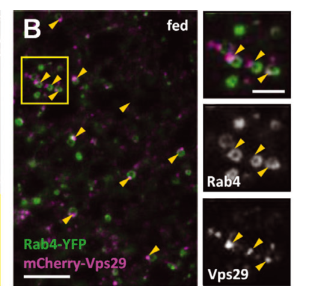

## Question

# Gene Research for Functional Annotation

## ⚠️ CRITICAL: Gene/Protein Identification Context

**BEFORE YOU BEGIN RESEARCH:** You MUST verify you are researching the CORRECT gene/protein. Gene symbols can be ambiguous, especially for less well-characterized genes from non-model organisms.

### Target Gene/Protein Identity (from UniProt):
- **UniProt Accession:** Q9VPX5
- **Protein Description:** RecName: Full=Vacuolar protein sorting-associated protein 29 {ECO:0000256|ARBA:ARBA00017767, ECO:0000256|RuleBase:RU362040}; AltName: Full=Vesicle protein sorting 29 {ECO:0000256|ARBA:ARBA00031913, ECO:0000256|RuleBase:RU362040};
- **Gene Information:** Name=Vps29 {ECO:0000313|EMBL:AAF51410.1, ECO:0000313|FlyBase:FBgn0031310}; Synonyms=Dmel\CG4764 {ECO:0000313|EMBL:AAF51410.1}, DmVps29 {ECO:0000313|EMBL:AAF51410.1}, VPS29 {ECO:0000313|EMBL:AAF51410.1}; ORFNames=CG4764 {ECO:0000313|EMBL:AAF51410.1, ECO:0000313|FlyBase:FBgn0031310}, Dmel_CG4764 {ECO:0000313|EMBL:AAF51410.1};
- **Organism (full):** Drosophila melanogaster (Fruit fly).
- **Protein Family:** Belongs to the VPS29 family.
- **Key Domains:** Calcineurin-like_PHP_lpxH. (IPR024654); Metallo-depent_PP-like. (IPR029052); Phosphodiesterase_MJ0936/Vps29. (IPR000979); Vps29. (IPR028661); Metallophos_2 (PF12850)

### MANDATORY VERIFICATION STEPS:

1. **Check if the gene symbol "Vps29" matches the protein description above**
2. **Verify the organism is correct:** Drosophila melanogaster (Fruit fly).
3. **Check if protein family/domains align with what you find in literature**
4. **If you find literature for a DIFFERENT gene with the same or similar symbol, STOP**

### If Gene Symbol is Ambiguous or You Cannot Find Relevant Literature:

**DO NOT PROCEED WITH RESEARCH ON A DIFFERENT GENE.** Instead:
- State clearly: "The gene symbol 'Vps29' is ambiguous or literature is limited for this specific protein"
- Explain what you found (e.g., "Found extensive literature on a different gene with the same symbol in a different organism")
- Describe the protein based ONLY on the UniProt information provided above
- Suggest that the protein function can be inferred from domain/family information

### Research Target:

Please provide a comprehensive research report on the gene **Vps29** (gene ID: Vps29, UniProt: Q9VPX5) in DROME.

The research report should be a detailed narrative explaining the function, biological processes, and localization of the gene product. Citations should be given for all claims.

You should prioritize authoritative reviews and primary scientific literature when conducting research. You can supplement
this with annotations you find in gene/protein databases, but these can be outdated or inaccurate.

We are specifically interested in the primary function of the gene - for enzymes, what reaction is catalyzed, and what is the substrate specificity? For transporters, what is the substrate? For structural proteins or adapters, what is the broader structural role? For signaling molecules, what is the role in the pathway.

We are interested in where in or outside the cell the gene product carries out its function.

We are also interested in the signaling or biochemical pathways in which the gene functions. We are less interested in broad pleiotropic effects, except where these elucidate the precise role.

Include evidence where possible. We are interested in both experimental evidence as well as inference from structure, evolution, or bioinformatic analysis. Precise studies should be prioritized over high-throughput, where available.

## Output

Question: You are an expert researcher providing comprehensive, well-cited information.

Provide detailed information focusing on:
1. Key concepts and definitions with current understanding
2. Recent developments and latest research (prioritize 2023-2024 sources)
3. Current applications and real-world implementations
4. Expert opinions and analysis from authoritative sources
5. Relevant statistics and data from recent studies

Format as a comprehensive research report with proper citations. Include URLs and publication dates where available.
Always prioritize recent, authoritative sources and provide specific citations for all major claims.

# Gene Research for Functional Annotation

## ⚠️ CRITICAL: Gene/Protein Identification Context

**BEFORE YOU BEGIN RESEARCH:** You MUST verify you are researching the CORRECT gene/protein. Gene symbols can be ambiguous, especially for less well-characterized genes from non-model organisms.

### Target Gene/Protein Identity (from UniProt):
- **UniProt Accession:** Q9VPX5
- **Protein Description:** RecName: Full=Vacuolar protein sorting-associated protein 29 {ECO:0000256|ARBA:ARBA00017767, ECO:0000256|RuleBase:RU362040}; AltName: Full=Vesicle protein sorting 29 {ECO:0000256|ARBA:ARBA00031913, ECO:0000256|RuleBase:RU362040};
- **Gene Information:** Name=Vps29 {ECO:0000313|EMBL:AAF51410.1, ECO:0000313|FlyBase:FBgn0031310}; Synonyms=Dmel\CG4764 {ECO:0000313|EMBL:AAF51410.1}, DmVps29 {ECO:0000313|EMBL:AAF51410.1}, VPS29 {ECO:0000313|EMBL:AAF51410.1}; ORFNames=CG4764 {ECO:0000313|EMBL:AAF51410.1, ECO:0000313|FlyBase:FBgn0031310}, Dmel_CG4764 {ECO:0000313|EMBL:AAF51410.1};
- **Organism (full):** Drosophila melanogaster (Fruit fly).
- **Protein Family:** Belongs to the VPS29 family.
- **Key Domains:** Calcineurin-like_PHP_lpxH. (IPR024654); Metallo-depent_PP-like. (IPR029052); Phosphodiesterase_MJ0936/Vps29. (IPR000979); Vps29. (IPR028661); Metallophos_2 (PF12850)

### MANDATORY VERIFICATION STEPS:

1. **Check if the gene symbol "Vps29" matches the protein description above**
2. **Verify the organism is correct:** Drosophila melanogaster (Fruit fly).
3. **Check if protein family/domains align with what you find in literature**
4. **If you find literature for a DIFFERENT gene with the same or similar symbol, STOP**

### If Gene Symbol is Ambiguous or You Cannot Find Relevant Literature:

**DO NOT PROCEED WITH RESEARCH ON A DIFFERENT GENE.** Instead:
- State clearly: "The gene symbol 'Vps29' is ambiguous or literature is limited for this specific protein"
- Explain what you found (e.g., "Found extensive literature on a different gene with the same symbol in a different organism")
- Describe the protein based ONLY on the UniProt information provided above
- Suggest that the protein function can be inferred from domain/family information

### Research Target:

Please provide a comprehensive research report on the gene **Vps29** (gene ID: Vps29, UniProt: Q9VPX5) in DROME.

The research report should be a detailed narrative explaining the function, biological processes, and localization of the gene product. Citations should be given for all claims.

You should prioritize authoritative reviews and primary scientific literature when conducting research. You can supplement
this with annotations you find in gene/protein databases, but these can be outdated or inaccurate.

We are specifically interested in the primary function of the gene - for enzymes, what reaction is catalyzed, and what is the substrate specificity? For transporters, what is the substrate? For structural proteins or adapters, what is the broader structural role? For signaling molecules, what is the role in the pathway.

We are interested in where in or outside the cell the gene product carries out its function.

We are also interested in the signaling or biochemical pathways in which the gene functions. We are less interested in broad pleiotropic effects, except where these elucidate the precise role.

Include evidence where possible. We are interested in both experimental evidence as well as inference from structure, evolution, or bioinformatic analysis. Precise studies should be prioritized over high-throughput, where available.

# Functional annotation report: *Drosophila melanogaster* Vps29 (Q9VPX5)

## Identity and principal function

**Identity verified.** The supplied UniProt record identifies Q9VPX5 as the fruit-fly vacuolar protein sorting-associated protein 29, encoded by **Vps29/CG4764 (FlyBase FBgn0031310)**. An independent fly study identifies its Vps29-directed RNAi reagent as targeting CG4764 (FBgn0031310); a subsequent knockout study describes the fly product as a 182-amino-acid protein, 83% identical and 93% similar to human VPS29. The evidence therefore concerns the specified fly gene, **not Vps35**, another retromer subunit. The UniProt-assigned phosphodiesterase/metallophosphatase-related domains are consistent with the experimentally studied VPS29 fold, but a fold annotation does not establish enzyme activity. [UniProt Q9VPX5](https://www.uniprot.org/uniprotkb/Q9VPX5/entry); [FlyBase FBgn0031310](https://flybase.org/reports/FBgn0031310.html). (linhart2014vacuolarproteinsorting pages 7-8, swarbrick2011vps29isnot pages 1-2, ye2020retromersubunitvps29a pages 2-4)

**Best-supported annotation:** Vps29 is a **peripheral endosomal protein-sorting scaffold and regulatory subunit** of the VPS26–VPS35–VPS29 retromer. It helps position and recycle this complex, allowing selected membrane proteins to leave endosomes for the trans-Golgi network (TGN) or cell surface instead of entering the degradative pathway. VPS35 forms the principal extended scaffold and binds VPS29 at its C-terminal region; sorting nexins and other adaptors help specify membranes and cargo itineraries. Vps29 is **not itself a membrane transporter**, and no transported small-molecule substrate or physiological enzyme reaction has been established for fly Q9VPX5. (ye2020retromersubunitvps29a pages 1-2, carosi2023receptorrecyclingby pages 1-3, carosi2023receptorrecyclingby pages 3-5)

The evidence levels and organism boundaries are summarized below.

| Biological assertion | Decisive evidence/model | Strength / interpretation | Precise sources |
|---|---|---|---|
| **Identity and fold:** Q9VPX5 is *D. melanogaster* Vps29, also CG4764/FBgn0031310; the supplied UniProt record assigns VPS29-family metallophosphoesterase-like domains. | A fly RNAi study explicitly identifies the Vps29-targeting reagent as **CG4764 (FBgn0031310)**. A later study describes fly Vps29 as a **182-aa** protein, **83% identical and 93% similar** to human VPS29, and validates a complete coding-sequence knockout. | **High confidence for identity.** The phosphoesterase-like annotation describes structural ancestry, not a demonstrated fly enzyme reaction. | Linhart et al. (2014), DOI [10.1186/1750-1326-9-23](https://doi.org/10.1186/1750-1326-9-23) (linhart2014vacuolarproteinsorting pages 7-8); Ye et al. (2020), DOI [10.7554/eLife.51977](https://doi.org/10.7554/eLife.51977) (ye2020retromersubunitvps29a pages 2-4) |
| **Primary molecular activity:** Vps29 is best regarded as an endosomal retromer interaction/regulatory subunit, not an established phosphatase. | In fly neurons, Vps29 loss leaves Vps35–Vps26 abundance and association intact but mislocalizes retromer and elevates Rab7; reducing Rab7 or overexpressing its GAP TBC1D5 suppresses defects, whereas Vps29-L152E—predicted to disrupt TBC1D5 binding—phenocopies loss. Mammalian structural/biochemical work found weak metal binding but no convincing phosphatase activity, although an earlier study reported activity against a phosphorylated CI-M6PR peptide. | **High confidence for scaffolding/regulation; catalytic claim unresolved historically but unsupported in flies.** No physiological substrate or reaction has been established for Q9VPX5. | Ye et al. (2020), DOI [10.7554/eLife.51977](https://doi.org/10.7554/eLife.51977) (ye2020retromersubunitvps29a pages 10-12, ye2020retromersubunitvps29a pages 12-14); Swarbrick et al. (2011), DOI [10.1371/journal.pone.0020420](https://doi.org/10.1371/journal.pone.0020420) (swarbrick2011vps29isnot pages 1-2); Damen et al. (2006), DOI [10.1042/BJ20060033](https://doi.org/10.1042/BJ20060033) (damen2006thehumanvps29 pages 1-2) |
| **Cellular location:** fly Vps29 acts on endosomal membranes and in neuronal neuropil as part of retromer. | In larval fat body, mCherry-Vps29 forms Vps35-dependent puncta, associates most strongly with Rab4/Rab5 early-endosomal markers, less with Rab7/Lamp1, and shows no significant Golgin or Atg8a colocalization. Endogenous Vps29-GFP and Vps35-RFP colocalize broadly in adult brain neuropil, including antennal-lobe and mushroom-body regions. | **High confidence for endosomal/neuropil localization.** Vps29 is a peripheral complex subunit, not a transmembrane resident; “not primarily Golgi” does not exclude transient cargo delivery to the TGN. | Maruzs et al. (2015), DOI [10.1111/tra.12309](https://doi.org/10.1111/tra.12309) (maruzs2015retromerensuresthe pages 2-4, maruzs2015retromerensuresthe media 004a64f3); Ye et al. (2020), DOI [10.7554/eLife.51977](https://doi.org/10.7554/eLife.51977) (ye2020retromersubunitvps29a pages 7-10) |
| **In-vivo function:** Vps29 sustains synaptic-vesicle recycling, locomotion, survival and age-dependent lysosomal homeostasis. | Null flies survive about **50–60 days versus ~75 days** for controls; genomic or neuronal fly Vps29 rescues phenotypes, and human VPS29 can substitute. Basal NMJ release is preserved, but **10-Hz stimulation for 10 min** causes synaptic depression and FM1-43 uptake is reduced. At **30 days**, immature cathepsin forms and abnormal lysosomes increase; by **45 days**, p62, Atg8 and polyubiquitinated proteins indicate autophagic failure. Dopaminergic-neuron RNAi reduced day-5 rapid climbing to **40.68% ± 2.93% versus 72.75% ± 4.27%** in controls. | **High confidence**, supported by null alleles, deficiency tests, genomic/cell-specific rescue, electrophysiology, imaging, biochemistry and Rab7 epistasis. These findings define functional consequences, not a single direct cargo. | Ye et al. (2020), DOI [10.7554/eLife.51977](https://doi.org/10.7554/eLife.51977) (ye2020retromersubunitvps29 pages 7-10, ye2020retromersubunitvps29a pages 10-12, ye2020retromersubunitvps29a pages 12-14, ye2020retromersubunitvps29a pages 2-4); Linhart et al. (2014), DOI [10.1186/1750-1326-9-23](https://doi.org/10.1186/1750-1326-9-23) (linhart2014vacuolarproteinsorting pages 5-7) |
| **Cargo and recent-mechanism boundaries:** Wntless/Wingless and Rhodopsin-1 are biologically plausible retromer cargo contexts, but direct cargo-specific evidence for fly Vps29 is limited; 2024 yeast/human discoveries are comparative only. | Drosophila Wntless recycling and Wingless secretion were demonstrated mainly by Vps35/Vps26 perturbation; Rh1 mistargeting was established chiefly for Vps35/Vps26, whereas Vps29-null work measured retinal physiology and general endolysosomal dysfunction. In 2024, yeast Vps5 was shown to bind a conserved Vps29 pocket, and human Retriever was defined as VPS35L–VPS26C–VPS29, but neither study establishes a fly Retriever role. | **Moderate confidence by core-retromer inference, not direct Q9VPX5 cargo assignment.** Do not annotate Wntless, Rh1 or Retriever as demonstrated Vps29-specific substrates/pathways in *Drosophila* without additional experiments. | Belenkaya et al. (2008), DOI [10.1016/j.devcel.2007.12.003](https://doi.org/10.1016/j.devcel.2007.12.003) (belenkaya2008theretromercomplex pages 3-4); Wolf & Boutros (2023), DOI [10.1242/dev.201352](https://doi.org/10.1242/dev.201352) (wolf2023theroleof pages 6-7); Ye et al. (2020), DOI [10.7554/eLife.51977](https://doi.org/10.7554/eLife.51977) (ye2020retromersubunitvps29a pages 1-2); Shortill et al. (2024), DOI [10.1091/mbc.E24-01-0043](https://doi.org/10.1091/mbc.E24-01-0043) (shortill2024nterminalsignalsina pages 1-2, shortill2024nterminalsignalsina pages 5-7); Singla et al. (2024), DOI [10.1038/s41467-024-54583-6](https://doi.org/10.1038/s41467-024-54583-6) (singla2024structuralbasisfor pages 1-2) |

*Table: Evidence-grading summary for Drosophila Vps29 (Q9VPX5/CG4764), separating direct fly experiments from conserved structural inference and cross-species findings. It highlights the strongest functional annotation while preventing unsupported catalytic, cargo-specific, or Retriever assignments.*

## Molecular mechanism: regulating retromer on endosomes

The clearest Vps29-specific mechanistic evidence comes from the fly nervous system. In a genetically validated *Vps29* null, VPS35 and VPS26 retain normal abundance and remain associated by co-immunoprecipitation, **but their normal neuronal distribution is disrupted**. VPS35 leaves neuropil-enriched regions and accumulates in large somatic, perinuclear puncta. Thus, in this setting, Vps29 is particularly important for **where functional retromer operates**, rather than being absolutely required to preserve the VPS35–VPS26 association. This differs from some mammalian epithelial-cell depletion studies, in which losing VPS29 destabilizes other core components. Ye and colleagues, *eLife*, **14 April 2020**, [doi:10.7554/eLife.51977](https://doi.org/10.7554/eLife.51977). (ye2020retromersubunitvps29a pages 7-10, ye2020retromersubunitvps29a pages 12-14)

**Rab7–TBC1D5 regulatory cycle.** Active Rab7 helps recruit retromer to endosomal membranes; VPS29 provides an interaction surface for TBC1D5, a *Rab7 GTPase-activating protein*, which promotes Rab7 inactivation and retromer release. In *Vps29*-deficient fly brains, Rab7 abundance rises and Rab7 accumulates with VPS35 in perinuclear regions. Removing one *Rab7* copy partially rescues locomotor, retinal-synaptic and neuromuscular-junction endocytosis phenotypes; neuronal overexpression of fly TBC1D5 normalizes elevated Rab7 protein and partially rescues retinal synaptic transmission. A genomic **Vps29-L152E** variant, designed from a mammalian interaction-site result, fails to complement the null and produces similar age-dependent defects. These genetic and localization results strongly support the cycle, although the proposed physical trapping/release of every retromer particle was not directly measured in fly neurons. Ye and colleagues, 2020, [doi:10.7554/eLife.51977](https://doi.org/10.7554/eLife.51977). (ye2020retromersubunitvps29a pages 10-12, ye2020retromersubunitvps29a pages 12-14)

**Not an established phosphatase.** The supplied domain names reflect structural similarity to metal-dependent phosphoesterases, *not* a validated catalytic assignment. A 2006 biochemical study reported that a recombinant **human** retromer preparation could dephosphorylate a phosphoserine-containing cation-independent mannose-6-phosphate-receptor peptide under specified *in-vitro* conditions. Later crystallographic, NMR and activity analyses found weak metal binding, no activity against the tested peptide, and evidence favoring a relatively rigid, metal-independent **protein-interaction scaffold**; the putative catalytic pocket also overlaps the VPS35-binding interface. Current retromer reviews describe the catalytic evidence as disputed. Neither study demonstrates that **fly** Vps29 dephosphorylates that peptide—or identifies any physiological fly substrate. The Rab7-directed GTPase-activating activity in the model belongs to **TBC1D5, not VPS29**. Damen and colleagues, *Biochemical Journal*, **September 2006**, [doi:10.1042/BJ20060033](https://doi.org/10.1042/BJ20060033); Swarbrick and colleagues, *PLOS ONE*, **24 May 2011**, [doi:10.1371/journal.pone.0020420](https://doi.org/10.1371/journal.pone.0020420); Carosi and colleagues, *Molecular and Cellular Biology*, **2023**, [doi:10.1080/10985549.2023.2222053](https://doi.org/10.1080/10985549.2023.2222053). (damen2006thehumanvps29 pages 1-2, swarbrick2011vps29isnot pages 1-2, carosi2023receptorrecyclingby pages 3-5)

## Where Vps29 works

**Endosomal sorting surfaces are the principal operational location.** In fly larval fat-body cells, fluorescent mCherry–Vps29 forms small **Vps35-dependent puncta**. These associate frequently with Rab4- and Rab5-positive early-endosomal structures and less with Rab7- or Lamp1-positive late-endosomal/lysosomal structures; there is no significant colocalization with the tested Golgin TGN marker or Atg8a autophagic marker. This locates detectable Vps29-containing retromer principally at endosomes rather than implying that Vps29 resides in the Golgi or lysosome lumen. The cropped localization panels of **Figure 1** provide visual evidence for these comparisons. Maruzs and colleagues, *Traffic*, **October 2015**, [doi:10.1111/tra.12309](https://doi.org/10.1111/tra.12309). (maruzs2015retromerensuresthe pages 2-4, maruzs2015retromerensuresthe media 004a64f3)

Endogenously tagged fly Vps29 and Vps35 also colocalize broadly in adult brain, including antennal lobes and mushroom-body regions; retromer is evident in neuronal neuropil, whereas loss of Vps29 redistributes Vps35 toward somatic late-endosomal/lysosomal-marker-positive puncta. Accordingly, **endosome-to-TGN transport describes a cargo destination, not a claim that Vps29 primarily performs its sorting function at the TGN**. Ye and colleagues, 2020, [doi:10.7554/eLife.51977](https://doi.org/10.7554/eLife.51977). (ye2020retromersubunitvps29a pages 7-10, ye2020retromersubunitvps29a pages 12-14)

## Biological processes and direct fly evidence

**Neuronal membrane traffic and synaptic function.** A CRISPR null replaces the fly *Vps29* coding sequence; loss of protein was confirmed by immunoblot, and a genomic Vps29 construct rescues mutant phenotypes. Unlike *Vps35* and *Vps26* nulls, *Vps29* null animals can reach adulthood. Their approximate survival was **50–60 days**, versus **about 75 days** for controls. Newly eclosed adults climb normally, but locomotor performance declines with age; genomic or neuronal fly Vps29 rescues, and neuronal human VPS29 can substitute in fly rescue assays. Ye and colleagues, 2020, [doi:10.7554/eLife.51977](https://doi.org/10.7554/eLife.51977). (ye2020retromersubunitvps29a pages 7-10, ye2020retromersubunitvps29a pages 2-4)

At larval neuromuscular junctions, *Vps29* loss preserves the tested spontaneous miniature and baseline evoked junctional responses, yet **10-Hz stimulation for 10 minutes** causes marked synaptic depression and potassium-stimulated **FM1-43 uptake falls**. This supports defective presynaptic membrane endocytosis/replenishment rather than a generalized failure of basal exocytosis; the directly affected molecular cargo has not been identified. In retinal photoreceptors, light- and age-sensitive electroretinogram defects include deterioration of synaptic on/off transients, and neuronal Vps29 expression rescues transmission. Ye and colleagues, 2020, [doi:10.7554/eLife.51977](https://doi.org/10.7554/eLife.51977). (ye2020retromersubunitvps29 pages 7-10, ye2020retromersubunitvps29a pages 10-12, ye2020retromersubunitvps29a pages 2-4)

Independent RNAi evidence is directionally consistent: reducing **CG4764/Vps29 in dopaminergic neurons** yielded **40.68% ± 2.93%** of flies passing the rapid-climbing threshold on day 5, compared with **72.75% ± 4.27%** of controls. This is evidence for neuronal functional importance, **not** proof that VPS29 is the specific molecular target of LRRK2 or an established Parkinson’s-disease treatment. Linhart and colleagues, *Molecular Neurodegeneration*, **June 2014**, [doi:10.1186/1750-1326-9-23](https://doi.org/10.1186/1750-1326-9-23). (linhart2014vacuolarproteinsorting pages 7-8, linhart2014vacuolarproteinsorting pages 5-7)

**Lysosomal proteolysis and autophagic homeostasis.** These are principally *downstream consequences of altered sorting*, not evidence that Vps29 catalyzes autophagy. One-day-old fly mutants retained normal mature cathepsin L and increased mature cathepsin D; by **30 days**, immature cathepsin L and D proforms increased. At **45 days**, elevated Ref(2)P/p62, Atg8 and polyubiquitinated proteins indicated impaired autophagic clearance, improved by reduced Rab7 dosage. Electron microscopy at 30 days showed more lysosomes, multivesicular bodies and autophagic structures, with enlarged electron-dense lysosomes and neuronal multilamellar bodies; synaptic-terminal morphology could nevertheless remain comparatively preserved. Ye and colleagues, 2020, [doi:10.7554/eLife.51977](https://doi.org/10.7554/eLife.51977). (ye2020retromersubunitvps29a pages 10-12, ye2020retromersubunitvps29a pages 12-14)

## Cargo-specific pathways: what is established and what is inferred

A well-supported **retromer pathway** recycles the transmembrane Wnt carrier **Wntless/Evi** from endosomes toward the Golgi, enabling repeated secretion of **Wingless/Wnt** by producing cells. Fly wing-disc and S2-cell experiments demonstrated the trafficking and signaling consequences principally by perturbing **Vps35 or Vps26**, including altered extracellular Wingless, reduced Wntless stability, and Vps35–Wntless association. A 2023 developmental review integrates the SNX3–retromer mechanism. This makes Wingless secretion a biologically plausible **complex-level context** for fly Vps29, but those experiments should **not** be described as direct demonstrations that *Vps29*-null flies mis-sort Wntless. Belenkaya and colleagues, *Developmental Cell*, **January 2008**, [doi:10.1016/j.devcel.2007.12.003](https://doi.org/10.1016/j.devcel.2007.12.003); Wolf and Boutros, *Development*, **February 2023**, [doi:10.1242/dev.201352](https://doi.org/10.1242/dev.201352). (belenkaya2008theretromercomplex pages 1-2, belenkaya2008theretromercomplex pages 3-4, wolf2023theroleof pages 6-7)

Similarly, **Rhodopsin-1** trafficking defects were demonstrated for other fly retromer-subunit mutants, especially *Vps35/Vps26*; Ye and colleagues directly demonstrated retinal physiological defects and glucosylceramide accumulation in *Vps29* mutants, **not a Vps29-specific Rhodopsin-1 binding or trafficking assay**. Defective retrieval of lysosomal enzyme-delivery receptors is another established retromer theme across systems, but the identity of a direct causal cargo explaining the fly Vps29 neuronal and cathepsin phenotypes remains unresolved. The 2023 review also notes disagreement between studies over whether the mammalian CI-MPR is carried directly by core retromer or independently by SNX-BAR machinery, reinforcing why that receptor should not be assigned as a proven direct **fly Vps29 substrate**. Ye and colleagues, 2020, [doi:10.7554/eLife.51977](https://doi.org/10.7554/eLife.51977); Carosi and colleagues, 2023, [doi:10.1080/10985549.2023.2222053](https://doi.org/10.1080/10985549.2023.2222053). (ye2020retromersubunitvps29a pages 1-2, ye2020retromersubunitvps29a pages 10-12, carosi2023receptorrecyclingby pages 5-6, ye2020retromersubunitvps29a pages 2-4)

## 2023–2024 developments and practical significance

Recent work **refines the conserved machinery rather than replacing the direct fly annotation**. The 2023 receptor-recycling review emphasizes retromer’s modular partnerships with sorting nexins and the need to distinguish retromer from the related Retriever pathway. In **2024**, yeast experiments mapped two Vps5 N-terminal interactions with Vps29, including a conserved hydrophobic pocket, and linked disrupted interactions to impaired endosomal coat assembly/cargo sorting. These results strengthen the interpretation of VPS29 as an **interaction platform**, but the tested Vps5 sequences and sorting assays were **yeast**, not fly, experiments. Carosi and colleagues, 2023, [doi:10.1080/10985549.2023.2222053](https://doi.org/10.1080/10985549.2023.2222053); Shortill and colleagues, *Molecular Biology of the Cell*, published online **10 April 2024**, [doi:10.1091/mbc.E24-01-0043](https://doi.org/10.1091/mbc.E24-01-0043). (carosi2023receptorrecyclingby pages 1-3, shortill2024nterminalsignalsina pages 1-2, shortill2024nterminalsignalsina pages 5-7)

Human structural work in **November 2024** established VPS29 as a subunit of **Retriever** alongside VPS35L and VPS26C; cargo-activated SNX17 engages a pocket formed chiefly by **VPS35L–VPS26C**, and interfering with that interface alters surface-cargo recycling. This demonstrates another possible use of the conserved VPS29 protein in **human cells**, **not** that fly Q9VPX5 functions in a verified fly Retriever–SNX17 complex. The 2020 fly study explicitly noted that Retriever had not then been studied in *Drosophila*. Singla and colleagues, *Nature Communications*, **November 2024**, [doi:10.1038/s41467-024-54583-6](https://doi.org/10.1038/s41467-024-54583-6); Ye and colleagues, 2020, [doi:10.7554/eLife.51977](https://doi.org/10.7554/eLife.51977). (ye2020retromersubunitvps29 pages 13-15, singla2024structuralbasisfor pages 1-2)

**Research use and limits.** Validated fly nulls, an interaction-site allele, fluorescently tagged proteins, tissue-specific rescue, FM1-43 uptake and age-resolved lysosomal assays make Vps29 a useful *in-vivo model* for dissecting retromer localization, neuronal recycling and aging-related endolysosomal stress. The demonstrated substitution by human VPS29 supports functional conservation, **not clinical efficacy or a human VPS29-specific disease mechanism**. The strongest functional annotation remains **endosomal retromer scaffold/regulator acting through a Rab7–TBC1D5-associated trafficking cycle**; substrate-specific sorting, possible non-retromer complexes in flies, and any intrinsic catalytic activity require separate direct tests. Ye and colleagues, 2020, [doi:10.7554/eLife.51977](https://doi.org/10.7554/eLife.51977); Carosi and colleagues, 2023, [doi:10.1080/10985549.2023.2222053](https://doi.org/10.1080/10985549.2023.2222053). (ye2020retromersubunitvps29a pages 10-12, carosi2023receptorrecyclingby pages 3-5, ye2020retromersubunitvps29a pages 2-4)

References

1. (linhart2014vacuolarproteinsorting pages 7-8): Radek Linhart, Sarah Anne Wong, Jieyun Cao, Melody Tran, Anne Huynh, Casey Ardrey, Jong Min Park, Christine Hsu, Saher Taha, Rentia Peterson, Shannon Shea, Jason Kurian, and Katerina Venderova. Vacuolar protein sorting 35 (vps35) rescues locomotor deficits and shortened lifespan in drosophila expressing a parkinson’s disease mutant of leucine-rich repeat kinase 2 (lrrk2). Molecular Neurodegeneration, Jun 2014. URL: https://doi.org/10.1186/1750-1326-9-23, doi:10.1186/1750-1326-9-23. This article has 130 citations and is from a highest quality peer-reviewed journal.

2. (swarbrick2011vps29isnot pages 1-2): James D. Swarbrick, Daniel J. Shaw, Sandeep Chhabra, Rajesh Ghai, Eugene Valkov, Suzanne J. Norwood, Matthew N. J. Seaman, and Brett M. Collins. Vps29 is not an active metallo-phosphatase but is a rigid scaffold required for retromer interaction with accessory proteins. PLoS ONE, 6:e20420, May 2011. URL: https://doi.org/10.1371/journal.pone.0020420, doi:10.1371/journal.pone.0020420. This article has 77 citations and is from a peer-reviewed journal.

3. (ye2020retromersubunitvps29a pages 2-4): Hui Ye, Shamsideen Ojelade, David Li-Kroeger, Zhongyuan Zuo, Liping Wang, Yarong Li, Jessica Y. J. Gu, Ulrich Tepass, Avital A. Rodal, Hugo J. Bellen, and Joshua M. Shulman. Retromer subunit, vps29, regulates synaptic transmission and is required for endolysosomal function in the aging brain. eLife, Oct 2020. URL: https://doi.org/10.7554/elife.51977, doi:10.7554/elife.51977. This article has 64 citations and is from a domain leading peer-reviewed journal.

4. (ye2020retromersubunitvps29a pages 1-2): Hui Ye, Shamsideen Ojelade, David Li-Kroeger, Zhongyuan Zuo, Liping Wang, Yarong Li, Jessica Y. J. Gu, Ulrich Tepass, Avital A. Rodal, Hugo J. Bellen, and Joshua M. Shulman. Retromer subunit, vps29, regulates synaptic transmission and is required for endolysosomal function in the aging brain. eLife, Oct 2020. URL: https://doi.org/10.7554/elife.51977, doi:10.7554/elife.51977. This article has 64 citations and is from a domain leading peer-reviewed journal.

5. (carosi2023receptorrecyclingby pages 1-3): Julian M. Carosi, Donna Denton, Sharad Kumar, and Timothy J. Sargeant. Receptor recycling by retromer. Molecular and Cellular Biology, 43:317-334, Jun 2023. URL: https://doi.org/10.1080/10985549.2023.2222053, doi:10.1080/10985549.2023.2222053. This article has 32 citations and is from a domain leading peer-reviewed journal.

6. (carosi2023receptorrecyclingby pages 3-5): Julian M. Carosi, Donna Denton, Sharad Kumar, and Timothy J. Sargeant. Receptor recycling by retromer. Molecular and Cellular Biology, 43:317-334, Jun 2023. URL: https://doi.org/10.1080/10985549.2023.2222053, doi:10.1080/10985549.2023.2222053. This article has 32 citations and is from a domain leading peer-reviewed journal.

7. (ye2020retromersubunitvps29a pages 10-12): Hui Ye, Shamsideen Ojelade, David Li-Kroeger, Zhongyuan Zuo, Liping Wang, Yarong Li, Jessica Y. J. Gu, Ulrich Tepass, Avital A. Rodal, Hugo J. Bellen, and Joshua M. Shulman. Retromer subunit, vps29, regulates synaptic transmission and is required for endolysosomal function in the aging brain. eLife, Oct 2020. URL: https://doi.org/10.7554/elife.51977, doi:10.7554/elife.51977. This article has 64 citations and is from a domain leading peer-reviewed journal.

8. (ye2020retromersubunitvps29a pages 12-14): Hui Ye, Shamsideen Ojelade, David Li-Kroeger, Zhongyuan Zuo, Liping Wang, Yarong Li, Jessica Y. J. Gu, Ulrich Tepass, Avital A. Rodal, Hugo J. Bellen, and Joshua M. Shulman. Retromer subunit, vps29, regulates synaptic transmission and is required for endolysosomal function in the aging brain. eLife, Oct 2020. URL: https://doi.org/10.7554/elife.51977, doi:10.7554/elife.51977. This article has 64 citations and is from a domain leading peer-reviewed journal.

9. (damen2006thehumanvps29 pages 1-2): Ester Damen, Elmar Krieger, Jens E. Nielsen, Jelle Eygensteyn, and Jeroen E. M. Van Leeuwen. The human vps29 retromer component is a metallo-phosphoesterase for a cation-independent mannose 6-phosphate receptor substrate peptide. The Biochemical journal, 398 3:399-409, Sep 2006. URL: https://doi.org/10.1042/bj20060033, doi:10.1042/bj20060033. This article has 62 citations.

10. (maruzs2015retromerensuresthe pages 2-4): Tamás Maruzs, Péter Lőrincz, Zsuzsanna Szatmári, Szilvia Széplaki, Zoltán Sándor, Zsolt Lakatos, Gina Puska, Gábor Juhász, and Miklós Sass. Retromer ensures the degradation of autophagic cargo by maintaining lysosome function in drosophila. Traffic, 16:1088-1107, Oct 2015. URL: https://doi.org/10.1111/tra.12309, doi:10.1111/tra.12309. This article has 80 citations and is from a peer-reviewed journal.

11. (maruzs2015retromerensuresthe media 004a64f3): Tamás Maruzs, Péter Lőrincz, Zsuzsanna Szatmári, Szilvia Széplaki, Zoltán Sándor, Zsolt Lakatos, Gina Puska, Gábor Juhász, and Miklós Sass. Retromer ensures the degradation of autophagic cargo by maintaining lysosome function in drosophila. Traffic, 16:1088-1107, Oct 2015. URL: https://doi.org/10.1111/tra.12309, doi:10.1111/tra.12309. This article has 80 citations and is from a peer-reviewed journal.

12. (ye2020retromersubunitvps29a pages 7-10): Hui Ye, Shamsideen Ojelade, David Li-Kroeger, Zhongyuan Zuo, Liping Wang, Yarong Li, Jessica Y. J. Gu, Ulrich Tepass, Avital A. Rodal, Hugo J. Bellen, and Joshua M. Shulman. Retromer subunit, vps29, regulates synaptic transmission and is required for endolysosomal function in the aging brain. eLife, Oct 2020. URL: https://doi.org/10.7554/elife.51977, doi:10.7554/elife.51977. This article has 64 citations and is from a domain leading peer-reviewed journal.

13. (ye2020retromersubunitvps29 pages 7-10): Hui Ye, Shamsideen Ojelade, David Li-Kroeger, Zhongyuan Zuo, Liping Wang, Yarong Li, Jessica Y. J. Gu, Ulrich Tepass, Avital A. Rodal, Hugo J. Bellen, and Joshua M. Shulman. Retromer subunit, vps29, regulates synaptic transmission and is required for endolysosomal function in the aging brain. eLife, Oct 2020. URL: https://doi.org/10.1101/788711, doi:10.1101/788711. This article has 64 citations and is from a domain leading peer-reviewed journal.

14. (linhart2014vacuolarproteinsorting pages 5-7): Radek Linhart, Sarah Anne Wong, Jieyun Cao, Melody Tran, Anne Huynh, Casey Ardrey, Jong Min Park, Christine Hsu, Saher Taha, Rentia Peterson, Shannon Shea, Jason Kurian, and Katerina Venderova. Vacuolar protein sorting 35 (vps35) rescues locomotor deficits and shortened lifespan in drosophila expressing a parkinson’s disease mutant of leucine-rich repeat kinase 2 (lrrk2). Molecular Neurodegeneration, Jun 2014. URL: https://doi.org/10.1186/1750-1326-9-23, doi:10.1186/1750-1326-9-23. This article has 130 citations and is from a highest quality peer-reviewed journal.

15. (belenkaya2008theretromercomplex pages 3-4): Tatyana Y. Belenkaya, Yihui Wu, Xiaofang Tang, Bo Zhou, Longqiu Cheng, Yagya V. Sharma, Dong Yan, Erica M. Selva, and Xinhua Lin. The retromer complex influences wnt secretion by recycling wntless from endosomes to the trans-golgi network. Developmental cell, 14 1:120-31, Jan 2008. URL: https://doi.org/10.1016/j.devcel.2007.12.003, doi:10.1016/j.devcel.2007.12.003. This article has 427 citations and is from a highest quality peer-reviewed journal.

16. (wolf2023theroleof pages 6-7): Lucie Wolf and Michael Boutros. The role of evi/wntless in exporting wnt proteins. Development, Feb 2023. URL: https://doi.org/10.1242/dev.201352, doi:10.1242/dev.201352. This article has 41 citations and is from a domain leading peer-reviewed journal.

17. (shortill2024nterminalsignalsina pages 1-2): Shawn P. Shortill, Mia S. Frier, Michael Davey, and Elizabeth Conibear. N-terminal signals in the snx-bar paralogs vps5 and vin1 guide endosomal coat complex formation. Molecular Biology of the Cell, Jun 2024. URL: https://doi.org/10.1091/mbc.e24-01-0043, doi:10.1091/mbc.e24-01-0043. This article has 6 citations and is from a domain leading peer-reviewed journal.

18. (shortill2024nterminalsignalsina pages 5-7): Shawn P. Shortill, Mia S. Frier, Michael Davey, and Elizabeth Conibear. N-terminal signals in the snx-bar paralogs vps5 and vin1 guide endosomal coat complex formation. Molecular Biology of the Cell, Jun 2024. URL: https://doi.org/10.1091/mbc.e24-01-0043, doi:10.1091/mbc.e24-01-0043. This article has 6 citations and is from a domain leading peer-reviewed journal.

19. (singla2024structuralbasisfor pages 1-2): Amika Singla, Daniel J. Boesch, Ho Yee Joyce Fung, Chigozie Ngoka, Avery S. Enriquez, Ran Song, Daniel A. Kramer, Yan Han, Esther Banarer, Andrew Lemoff, Puneet Juneja, Daniel D. Billadeau, Xiaochen Bai, Zhe Chen, Emre E. Turer, Ezra Burstein, and Baoyu Chen. Structural basis for retriever-snx17 assembly and endosomal sorting. Nature Communications, Nov 2024. URL: https://doi.org/10.1038/s41467-024-54583-6, doi:10.1038/s41467-024-54583-6. This article has 23 citations and is from a highest quality peer-reviewed journal.

20. (belenkaya2008theretromercomplex pages 1-2): Tatyana Y. Belenkaya, Yihui Wu, Xiaofang Tang, Bo Zhou, Longqiu Cheng, Yagya V. Sharma, Dong Yan, Erica M. Selva, and Xinhua Lin. The retromer complex influences wnt secretion by recycling wntless from endosomes to the trans-golgi network. Developmental cell, 14 1:120-31, Jan 2008. URL: https://doi.org/10.1016/j.devcel.2007.12.003, doi:10.1016/j.devcel.2007.12.003. This article has 427 citations and is from a highest quality peer-reviewed journal.

21. (carosi2023receptorrecyclingby pages 5-6): Julian M. Carosi, Donna Denton, Sharad Kumar, and Timothy J. Sargeant. Receptor recycling by retromer. Molecular and Cellular Biology, 43:317-334, Jun 2023. URL: https://doi.org/10.1080/10985549.2023.2222053, doi:10.1080/10985549.2023.2222053. This article has 32 citations and is from a domain leading peer-reviewed journal.

22. (ye2020retromersubunitvps29 pages 13-15): Hui Ye, Shamsideen Ojelade, David Li-Kroeger, Zhongyuan Zuo, Liping Wang, Yarong Li, Jessica Y. J. Gu, Ulrich Tepass, Avital A. Rodal, Hugo J. Bellen, and Joshua M. Shulman. Retromer subunit, vps29, regulates synaptic transmission and is required for endolysosomal function in the aging brain. eLife, Oct 2020. URL: https://doi.org/10.1101/788711, doi:10.1101/788711. This article has 64 citations and is from a domain leading peer-reviewed journal.

## Artifacts

- [Edison artifact artifact-00](Vps29-deep-research-falcon_artifacts/artifact-00.md)

## Citations

1. linhart2014vacuolarproteinsorting pages 7-8
2. linhart2014vacuolarproteinsorting pages 5-7
3. belenkaya2008theretromercomplex pages 3-4
4. wolf2023theroleof pages 6-7
5. singla2024structuralbasisfor pages 1-2
6. carosi2023receptorrecyclingby pages 1-3
7. carosi2023receptorrecyclingby pages 3-5
8. maruzs2015retromerensuresthe pages 2-4
9. shortill2024nterminalsignalsina pages 1-2
10. shortill2024nterminalsignalsina pages 5-7
11. belenkaya2008theretromercomplex pages 1-2
12. carosi2023receptorrecyclingby pages 5-6
13. UniProt Q9VPX5
14. FlyBase FBgn0031310
15. 10.1186/1750-1326-9-23
16. 10.7554/eLife.51977
17. 10.1371/journal.pone.0020420
18. 10.1042/BJ20060033
19. 10.1111/tra.12309
20. 10.1016/j.devcel.2007.12.003
21. 10.1242/dev.201352
22. 10.1091/mbc.E24-01-0043
23. 10.1038/s41467-024-54583-6
24. doi:10.7554/eLife.51977
25. doi:10.1042/BJ20060033
26. doi:10.1371/journal.pone.0020420
27. doi:10.1080/10985549.2023.2222053
28. doi:10.1111/tra.12309
29. doi:10.1186/1750-1326-9-23
30. doi:10.1016/j.devcel.2007.12.003
31. doi:10.1242/dev.201352
32. doi:10.1091/mbc.E24-01-0043
33. doi:10.1038/s41467-024-54583-6
34. https://www.uniprot.org/uniprotkb/Q9VPX5/entry
35. https://flybase.org/reports/FBgn0031310.html
36. https://doi.org/10.1186/1750-1326-9-23
37. https://doi.org/10.7554/eLife.51977
38. https://doi.org/10.1371/journal.pone.0020420
39. https://doi.org/10.1042/BJ20060033
40. https://doi.org/10.1111/tra.12309
41. https://doi.org/10.1016/j.devcel.2007.12.003
42. https://doi.org/10.1242/dev.201352
43. https://doi.org/10.1091/mbc.E24-01-0043
44. https://doi.org/10.1038/s41467-024-54583-6
45. https://doi.org/10.1080/10985549.2023.2222053
46. https://doi.org/10.1186/1750-1326-9-23,
47. https://doi.org/10.1371/journal.pone.0020420,
48. https://doi.org/10.7554/elife.51977,
49. https://doi.org/10.1080/10985549.2023.2222053,
50. https://doi.org/10.1042/bj20060033,
51. https://doi.org/10.1111/tra.12309,
52. https://doi.org/10.1101/788711,
53. https://doi.org/10.1016/j.devcel.2007.12.003,
54. https://doi.org/10.1242/dev.201352,
55. https://doi.org/10.1091/mbc.e24-01-0043,
56. https://doi.org/10.1038/s41467-024-54583-6,