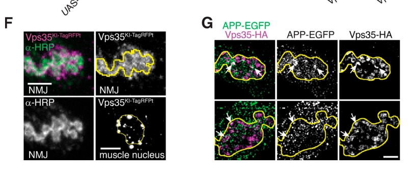

## Question

# Gene Research for Functional Annotation

## ⚠️ CRITICAL: Gene/Protein Identification Context

**BEFORE YOU BEGIN RESEARCH:** You MUST verify you are researching the CORRECT gene/protein. Gene symbols can be ambiguous, especially for less well-characterized genes from non-model organisms.

### Target Gene/Protein Identity (from UniProt):
- **UniProt Accession:** Q9W277
- **Protein Description:** RecName: Full=Vacuolar protein sorting-associated protein 35 {ECO:0000256|PIRNR:PIRNR009375};
- **Gene Information:** Name=Vps35 {ECO:0000313|EMBL:AAF46817.4, ECO:0000313|FlyBase:FBgn0034708}; Synonyms=Dmel\CG5625 {ECO:0000313|EMBL:AAF46817.4}, DmVps35 {ECO:0000313|EMBL:AAF46817.4}, DVps35 {ECO:0000313|EMBL:AAF46817.4}, Dvps35 {ECO:0000313|EMBL:AAF46817.4}, dVPS35 {ECO:0000313|EMBL:AAF46817.4}, dvps35 {ECO:0000313|EMBL:AAF46817.4}, VPS35 {ECO:0000313|EMBL:AAF46817.4}, vps35 {ECO:0000313|EMBL:AAF46817.4}; ORFNames=CG5625 {ECO:0000313|EMBL:AAF46817.4, ECO:0000313|FlyBase:FBgn0034708}, Dmel_CG5625 {ECO:0000313|EMBL:AAF46817.4};
- **Organism (full):** Drosophila melanogaster (Fruit fly).
- **Protein Family:** Belongs to the VPS35 family.
- **Key Domains:** Vps35. (IPR005378); Vps35_C. (IPR042491); Vps35 (PF03635)

### MANDATORY VERIFICATION STEPS:

1. **Check if the gene symbol "Vps35" matches the protein description above**
2. **Verify the organism is correct:** Drosophila melanogaster (Fruit fly).
3. **Check if protein family/domains align with what you find in literature**
4. **If you find literature for a DIFFERENT gene with the same or similar symbol, STOP**

### If Gene Symbol is Ambiguous or You Cannot Find Relevant Literature:

**DO NOT PROCEED WITH RESEARCH ON A DIFFERENT GENE.** Instead:
- State clearly: "The gene symbol 'Vps35' is ambiguous or literature is limited for this specific protein"
- Explain what you found (e.g., "Found extensive literature on a different gene with the same symbol in a different organism")
- Describe the protein based ONLY on the UniProt information provided above
- Suggest that the protein function can be inferred from domain/family information

### Research Target:

Please provide a comprehensive research report on the gene **Vps35** (gene ID: Vps35, UniProt: Q9W277) in DROME.

The research report should be a detailed narrative explaining the function, biological processes, and localization of the gene product. Citations should be given for all claims.

You should prioritize authoritative reviews and primary scientific literature when conducting research. You can supplement
this with annotations you find in gene/protein databases, but these can be outdated or inaccurate.

We are specifically interested in the primary function of the gene - for enzymes, what reaction is catalyzed, and what is the substrate specificity? For transporters, what is the substrate? For structural proteins or adapters, what is the broader structural role? For signaling molecules, what is the role in the pathway.

We are interested in where in or outside the cell the gene product carries out its function.

We are also interested in the signaling or biochemical pathways in which the gene functions. We are less interested in broad pleiotropic effects, except where these elucidate the precise role.

Include evidence where possible. We are interested in both experimental evidence as well as inference from structure, evolution, or bioinformatic analysis. Precise studies should be prioritized over high-throughput, where available.

## Output

Question: You are an expert researcher providing comprehensive, well-cited information.

Provide detailed information focusing on:
1. Key concepts and definitions with current understanding
2. Recent developments and latest research (prioritize 2023-2024 sources)
3. Current applications and real-world implementations
4. Expert opinions and analysis from authoritative sources
5. Relevant statistics and data from recent studies

Format as a comprehensive research report with proper citations. Include URLs and publication dates where available.
Always prioritize recent, authoritative sources and provide specific citations for all major claims.

# Gene Research for Functional Annotation

## ⚠️ CRITICAL: Gene/Protein Identification Context

**BEFORE YOU BEGIN RESEARCH:** You MUST verify you are researching the CORRECT gene/protein. Gene symbols can be ambiguous, especially for less well-characterized genes from non-model organisms.

### Target Gene/Protein Identity (from UniProt):
- **UniProt Accession:** Q9W277
- **Protein Description:** RecName: Full=Vacuolar protein sorting-associated protein 35 {ECO:0000256|PIRNR:PIRNR009375};
- **Gene Information:** Name=Vps35 {ECO:0000313|EMBL:AAF46817.4, ECO:0000313|FlyBase:FBgn0034708}; Synonyms=Dmel\CG5625 {ECO:0000313|EMBL:AAF46817.4}, DmVps35 {ECO:0000313|EMBL:AAF46817.4}, DVps35 {ECO:0000313|EMBL:AAF46817.4}, Dvps35 {ECO:0000313|EMBL:AAF46817.4}, dVPS35 {ECO:0000313|EMBL:AAF46817.4}, dvps35 {ECO:0000313|EMBL:AAF46817.4}, VPS35 {ECO:0000313|EMBL:AAF46817.4}, vps35 {ECO:0000313|EMBL:AAF46817.4}; ORFNames=CG5625 {ECO:0000313|EMBL:AAF46817.4, ECO:0000313|FlyBase:FBgn0034708}, Dmel_CG5625 {ECO:0000313|EMBL:AAF46817.4};
- **Organism (full):** Drosophila melanogaster (Fruit fly).
- **Protein Family:** Belongs to the VPS35 family.
- **Key Domains:** Vps35. (IPR005378); Vps35_C. (IPR042491); Vps35 (PF03635)

### MANDATORY VERIFICATION STEPS:

1. **Check if the gene symbol "Vps35" matches the protein description above**
2. **Verify the organism is correct:** Drosophila melanogaster (Fruit fly).
3. **Check if protein family/domains align with what you find in literature**
4. **If you find literature for a DIFFERENT gene with the same or similar symbol, STOP**

### If Gene Symbol is Ambiguous or You Cannot Find Relevant Literature:

**DO NOT PROCEED WITH RESEARCH ON A DIFFERENT GENE.** Instead:
- State clearly: "The gene symbol 'Vps35' is ambiguous or literature is limited for this specific protein"
- Explain what you found (e.g., "Found extensive literature on a different gene with the same symbol in a different organism")
- Describe the protein based ONLY on the UniProt information provided above
- Suggest that the protein function can be inferred from domain/family information

### Research Target:

Please provide a comprehensive research report on the gene **Vps35** (gene ID: Vps35, UniProt: Q9W277) in DROME.

The research report should be a detailed narrative explaining the function, biological processes, and localization of the gene product. Citations should be given for all claims.

You should prioritize authoritative reviews and primary scientific literature when conducting research. You can supplement
this with annotations you find in gene/protein databases, but these can be outdated or inaccurate.

We are specifically interested in the primary function of the gene - for enzymes, what reaction is catalyzed, and what is the substrate specificity? For transporters, what is the substrate? For structural proteins or adapters, what is the broader structural role? For signaling molecules, what is the role in the pathway.

We are interested in where in or outside the cell the gene product carries out its function.

We are also interested in the signaling or biochemical pathways in which the gene functions. We are less interested in broad pleiotropic effects, except where these elucidate the precise role.

Include evidence where possible. We are interested in both experimental evidence as well as inference from structure, evolution, or bioinformatic analysis. Precise studies should be prioritized over high-throughput, where available.

# Functional annotation report: *Drosophila melanogaster Vps35*

## Identity and principal function

**The target is the fruit-fly Vps35 gene, not a similarly named protein from another organism.** The supplied UniProt accession **Q9W277** identifies *D. melanogaster* Vps35/CG5625; a fly study independently lists **Vps35 as FlyBase FBgn0034708** and uses tagged fly Vps35 protein. The supplied VPS35-family, Vps35 and Vps35_C domain annotations are consistent with the retromer identity established experimentally. The papers examined do not independently print Q9W277, so the accession-to-protein mapping relies on the UniProt information supplied in the question. (ye2020retromersubunitvps29 pages 18-20, korolchuk2007drosophilavps35function pages 1-2)

**Primary molecular role:** Vps35 is a **non-enzymatic scaffold and cargo-sorting component** of the Vps35–Vps26–Vps29 retromer core. It helps select membrane proteins on endosomes and route them away from inappropriate degradation or secretion, commonly toward the trans-Golgi network (TGN), or through other cargo- and tissue-specific recycling routes. It does **not** catalyze a reaction or transport a soluble substrate across a membrane; its relevant “substrates” are membrane-associated trafficking cargoes and partner proteins. Fly Vps35 co-immunoprecipitates with Vps26 even when Vps29 is absent. Structural descriptions of the α-solenoid scaffold and its contacts with Vps26 and Vps29 come principally from conserved retromer studies, rather than a structure determined for Q9W277 itself. (ye2020retromersubunitvps29 pages 7-10, carosi2023receptorrecyclingby pages 3-5, carosi2023receptorrecyclingby pages 1-3)

The following matrix separates **direct fly experiments** by tissue and cargo; this distinction matters because an endosomal sorting protein can have different downstream effects in different cells. (maruzs2015retromerensuresthe pages 1-2, walsh2021opposingfunctionsfor pages 2-5, pannen2020theescrtmachinery pages 13-15)

| Fly system | Direct molecular action / cargo | Primary experimental readout | Evidence |
|---|---|---|---|
| Wing imaginal disc and S2/S2R+ cells | Vps35 binds Wntless (Wls/Evi) and retrieves it from endosomes toward the trans-Golgi network, maintaining Wls for repeated Wingless (Wg) secretion. | Reciprocal co-immunoprecipitation demonstrated DVps35–Wls association. Vps35 loss reduced extracellular Wg without changing *wg* transcription; Wls declined by 4 h and was virtually absent 12 h after induced expression in Vps35-depleted cells. Wls overexpression rescued Wg secretion. (belenkaya2008theretromercomplex pages 3-4, belenkaya2008theretromercomplex pages 4-5) | Belenkaya et al., 2008; [DOI: 10.1016/j.devcel.2007.12.003](https://doi.org/10.1016/j.devcel.2007.12.003) |
| Larval haemocytes and neuromuscular junction (NMJ) | Vps35 supports receptor-mediated endocytosis, restrains Rac1/F-actin and BMP signaling, and participates with dLRRK, Rab5 and Rab11 in synaptic-vesicle endocytosis and regeneration. | Null mutants had approximately twice as many NMJ boutons, elevated pMad, fewer but larger synaptic vesicles and more cisternal/endocytic intermediates. Neuronal plus muscular Vps35 restored bouton number; wild-type—but not disease-analogue mutant—Vps35 rescued endocytosis and vesicle defects. Removing one *Rac1* copy restored haemocyte uptake to about 50% of wild type. (korolchuk2007drosophilavps35function pages 5-7, inoshita2017vps35incooperation pages 7-14) | Korolchuk et al., 2007; [DOI: 10.1242/jcs.012336](https://doi.org/10.1242/jcs.012336). Inoshita et al., 2017; [DOI: 10.1093/hmg/ddx179](https://doi.org/10.1093/hmg/ddx179) |
| Larval fat body | Vps35-dependent retromer enables cathepsin-L delivery to acidic lysosomal compartments and thereby supports autolysosomal degradation; autophagosome formation itself remains intact. | Vps35-deficient cells accumulated enlarged acidic autolysosomes/amphisomes containing undigested material. By EM, 92/92 mutant autolysosomes contained recognizable cytoplasmic material versus 19/126 (15%) controls; cathepsin-L/Lamp1 colocalization was significantly reduced despite preserved acidification. (maruzs2015retromerensuresthe pages 4-8, maruzs2015retromerensuresthe pages 8-11) | Maruzs et al., 2015; [DOI: 10.1111/tra.12309](https://doi.org/10.1111/tra.12309) |
| Larval motor-neuron NMJ | Presynaptic Vps35 removes endosomally sorted cargo—including APP, Syt4, Neuroglian and aberrantly sorted Tkv—from extracellular-vesicle (EV) precursor compartments; this pathway involves SNX1/SNX6–ESCPE-1 and opposes Rab11-dependent loading. | Vps35 loss increased presynaptic and postsynaptic APP/Syt4 and significantly increased extracellular 50–100-nm EV-sized vesicles. Neuronal Vps35 restored APP to wild-type levels. Endogenous Vps35 localized pre- and postsynaptically, while neuronal Vps35-HA decorated endosome-like structures and partly overlapped APP. Presynaptic MVB number and endosome size did not increase. (walsh2021opposingfunctionsfor pages 2-5, walsh2021opposingfunctionsfor media 874ac840, walsh2021opposingfunctionsfor pages 5-6, walsh2021opposingfunctionsfor pages 6-8) | Walsh et al., 2021; [DOI: 10.1083/jcb.202012034](https://doi.org/10.1083/jcb.202012034) |
| Larval wing-disc epithelium | Vps35/Vps26 retromer carriers mediate basodistal-to-apical transcytosis and septate-junction delivery of the claudin Megatrachea (Mega) and other junctional components. | Endogenous Vps35–RFP marked mobile, apically enriched carriers; HA-Mega colocalized with Vps35-positive vesicles and became trapped basally or failed to integrate into junctions after Vps35 depletion. Overall, 71.9% of Mega-positive vesicles were Vps26-positive (128 vesicles from three discs). (pannen2020theescrtmachinery pages 10-11, pannen2020theescrtmachinery pages 13-15) | Pannen et al., 2020; [DOI: 10.7554/eLife.61866](https://doi.org/10.7554/eLife.61866) |
| Adult and larval nervous system | Vps35 forms a stable subcomplex with Vps26 and normally colocalizes with Vps29 in neuronal neuropil; Vps29 regulates its Rab7-dependent endosomal localization. | Vps35–GFP co-immunoprecipitated Vps26 even without Vps29, and neither protein’s abundance declined. Vps29 loss redistributed Vps35 from neuropil into large somatic/perinuclear puncta colocalizing with Rab7 and late-endosome/lysosome markers; quantification used four co-IP replicates and three localization replicates. (ye2020retromersubunitvps29 pages 7-10) | Ye et al., 2020; [DOI: 10.7554/eLife.51977](https://doi.org/10.7554/eLife.51977) |

*Table: Direct Drosophila evidence identifies Vps35 as a non-enzymatic retromer scaffold with cargo- and tissue-specific roles in endosomal retrieval, signaling, lysosomal competence, synaptic trafficking and epithelial transcytosis. Human VPS35-D620N findings and 2023 Vps34 experiments are deliberately excluded from direct fly-Vps35 evidence.*

## Subcellular location and mechanism

Vps35 performs its sorting function on **intracellular endosomal membranes and associated trafficking carriers**, rather than as an extracellular signaling ligand. In fly wing epithelium, endogenously tagged Vps35–RFP marks mobile vesicular structures enriched near an **apical trafficking hub**; depletion of the ESCRT component Shrub redistributes these structures toward basal, relatively immobile endosomal aggregates. In adult brains, tagged Vps35 is distributed through neuronal neuropil; loss of Vps29 shifts it into somatic/perinuclear puncta overlapping Rab7 and late-endosomal/lysosomal markers. These are observations in distinct tissues and perturbations, not evidence that Vps35 normally resides predominantly on lysosomes. (pannen2020theescrtmachinery pages 10-11, ye2020retromersubunitvps29 pages 7-10, ye2020retromersubunitvps29 pages 12-14)

At larval neuromuscular junctions (NMJs), endogenous tagged Vps35 is detected on **both neuronal and muscle sides**. Neuronally expressed Vps35–HA lies around endosome-like structures and partially overlaps APP-containing puncta; immunoelectron microscopy also places fly Vps35 near presynaptic active-zone edges and inside boutons. The cropped localization image from Walsh and colleagues directly illustrates the NMJ observations. (walsh2021opposingfunctionsfor pages 2-5, walsh2021opposingfunctionsfor media 874ac840, inoshita2017vps35incooperation pages 7-14)

Cargo specificity depends on associated machinery. Fly SNX3 interacts and colocalizes with Vps35 on early endosomes in experiments on Wntless recycling, whereas an SNX1/SNX6-associated pathway contributes to neuronal extracellular-vesicle cargo sorting. A 2023 authoritative retromer review explains why it is misleading to treat every sorting nexin or every proposed retromer cargo as interchangeable: adaptors and membrane context help determine which cargo leaves an endosome and where it goes. Its discussion of mammalian receptors should not be read as direct identification of those receptors as fly Vps35 cargoes. (carosi2023receptorrecyclingby pages 5-6, walsh2021opposingfunctionsfor pages 5-6, carosi2023receptorrecyclingby pages 1-3)

## Best-defined cargo and signaling pathway: Wntless and Wingless

The clearest direct cargo evidence concerns **Wntless**, also called **Evi** or **Sprinter**, a membrane protein required for secretion of the fly Wnt ligand **Wingless (Wg)**. Myc-tagged fly Vps35 and V5-tagged Wntless reciprocally co-immunoprecipitate from *Drosophila* S2 cells. In wing-disc Vps35-mutant clones or Vps35-depleted producing cells, Wntless protein declines, **intracellular Wg accumulates, extracellular Wg decreases, and neighboring Wg-response readouts fall**, without a corresponding increase in *wg* transcription. Supplying additional Wntless restores Wg secretion. Thus, Vps35 acts chiefly **upstream of Wg release, in the producing cell**, by sustaining availability of its secretion factor—not by acting as the Wg ligand or a Wg receptor. (belenkaya2008theretromercomplex pages 3-4, belenkaya2008theretromercomplex pages 4-5)

The supported trafficking model is retrieval of endocytosed Wntless from endosomes **toward the TGN**, sparing it from loss and allowing repeated rounds of Wg transport. Consistent with this itinerary, fly Wntless appears at the plasma membrane and in Rab5-/FYVE-positive early-endosomal puncta. In a wing-disc pulse experiment, Wntless became reduced **4 hours** after induction in Vps35-depleted tissue and was **virtually undetectable by 12 hours**, while remaining detectable in control tissue. The experiment strongly establishes Vps35-dependent Wntless stability; it should not be overstated as direct live visualization of every step of a Wntless-containing carrier reaching the TGN. In the original 2008 study, an endosomal Vps35–Wntless colocalization experiment also used **HeLa cells**, whereas the reciprocal co-immunoprecipitation and wing genetics used fly material. (belenkaya2008theretromercomplex pages 4-5, belenkaya2008theretromercomplex pages 8-9, belenkaya2008theretromercomplex pages 3-4)

## Other experimentally established fly functions

**Neuronal endocytosis and signaling.** In a fly RNAi screen and mutant analysis, Vps35 deficiency reduced scavenger-receptor-ligand uptake and disrupted endocytic-protein localization in S2 cells and haemocytes. Mutant haemocytes accumulated F-actin; reducing *Rac1* dosage restored their ligand uptake to about **50% of wild-type**. At NMJs, mutants had approximately **twice as many boutons** as controls, elevated phosphorylated Mad, and suppression of overgrowth by reduced **BMP-pathway** components *wit* or *Mad*. These genetic results support an indirect Vps35–Rac1/actin and BMP-signaling connection, but do not identify a particular BMP receptor as a biochemically bound Vps35 cargo in that study. (korolchuk2007drosophilavps35function pages 1-2, korolchuk2007drosophilavps35function pages 5-7)

A later fly study found fewer, larger synaptic vesicles and abnormal endocytic intermediates after Vps35 loss. FM1-43 uptake, VMAT-pHluorin experiments and electrophysiology linked Vps35 to synaptic-vesicle endocytosis, reserve-pool maintenance and sustained neurotransmitter release. Fly **dLRRK**, Rab5 and Rab11 genetically modified these phenotypes. These data place Vps35 in an endosome-connected synaptic recycling pathway; they do not make Vps35 itself a vesicle-fusion enzyme. (inoshita2017vps35incooperation pages 1-7, inoshita2017vps35incooperation pages 7-14)

**Lysosomal competence, rather than autophagosome initiation.** In larval fat body, loss of Vps35 or Vps26 produced enlarged, acidic autolysosomal structures and impaired breakdown of their contents. Electron microscopy found recognizable cytoplasmic material in **92 of 92** mutant autolysosomes, versus **19 of 126 (15%)** control structures. Autophagosomes still formed, and lysosomal acidification was not substantially lost; rather, **cathepsin L failed to reach Lamp1-positive lysosomal structures** effectively. This supports a role for retromer-dependent trafficking in supplying degradative capacity. Importantly, the same study found that depletion of **LERP**, the proposed fly counterpart of the mannose-6-phosphate receptor, did **not** phenocopy retromer loss in fat body. It would therefore be unjustified to assert that Vps35 maintains cathepsin L delivery there specifically by recycling LERP. (maruzs2015retromerensuresthe pages 1-2, maruzs2015retromerensuresthe pages 4-8, maruzs2015retromerensuresthe pages 8-11)

**Neuronal extracellular-vesicle cargo selection.** At larval motor-neuron NMJs, Vps35 loss increased presynaptic and extraneuronal accumulation of APP and Synaptotagmin-4, while neuronal restoration of Vps35 rescued APP distribution. Electron microscopy identified significantly more **50–100-nm extracellular vesicle-sized structures** near mutant boutons; it did not find a corresponding increase in presynaptic multivesicular-body number or endosome size. Genetic separation of sorting-nexin functions implicated **SNX1/SNX6-associated machinery** in this cargo phenotype, opposing Rab11-dependent loading. These are experimental uses of fly neurons and expressed APP cargo, **not** evidence that fruit flies develop human Alzheimer’s disease. Moreover, the NMJ extracellular-vesicle phenotype was not reproduced simply by disrupting lysosomes, despite the clear fat-body lysosomal defect above. (walsh2021opposingfunctionsfor pages 2-5, walsh2021opposingfunctionsfor pages 5-6, walsh2021opposingfunctionsfor pages 6-8)

**Polarized epithelial transport.** Wing-disc experiments identify another itinerary: Vps35/Vps26-positive carriers participate in **basodistal-to-apical transcytosis** of the septate-junction claudin **Megatrachea (Mega)**. Mega and Vps35 occur on overlapping carriers; after Vps35 depletion, newly expressed Mega is partly trapped in basal vesicles and fails to integrate normally into the junction. **71.9% of 128** examined Mega-positive vesicles across three discs were Vps26-positive. This is a cargo-specific epithelial delivery mechanism, not a claim that Vps35 is itself a structural constituent of the septate junction. (pannen2020theescrtmachinery pages 10-11, pannen2020theescrtmachinery pages 13-15)

## Recent research, interpretation and applications

A **2023 retromer review** emphasizes adaptor-dependent cargo selection and cautions that even the long-standing assignment of mammalian CI-MPR trafficking directly to the VPS35 core remains contested in some experimental systems. Fly Wntless binding, fat-body cathepsin-L misdelivery and LERP-negative results are therefore more informative for annotating **Q9W277** than importing a generic mammalian CI-MPR pathway. A **2024 review** places human VPS35-related endosomal and lysosomal defects in Parkinson’s-disease research, while noting mechanistic uncertainty and limitations of animal models. Human **VPS35-D620N** and fly disease-analogue variants are **not interchangeable residue labels**; human disease association must not be assigned directly to the endogenous fly gene. Retromer-directed treatment remains a research prospect, not a demonstrated clinical application of fly Vps35. (carosi2023receptorrecyclingby pages 5-6, maruzs2015retromerensuresthe pages 8-11, rowlands2024vps35andretromer pages 1-2, rowlands2024vps35andretromer pages 7-8, walsh2021opposingfunctionsfor pages 5-6)

A **December 2023 fly preprint** refines the possible Wg–Evi itinerary by reporting that they can be co-internalized and separate in acidic late endosomes. Its main perturbation is **Vps34**, a different gene: the work supplies context for when recycled Evi may become available but does **not** establish a new Vps35-specific mechanism. The most decisive gene-specific evidence located for fly Vps35 still comes from the earlier direct genetics, biochemical binding, imaging and rescue studies summarized above. In practice, fly Vps35 alleles and tagged proteins are valuable **experimental implementations** for distinguishing Wnt secretion, polarized cargo delivery, neuronal vesicle sorting and lysosomal function; the findings should be evaluated tissue by tissue. (sharma2023drosophilawgand pages 1-4, sharma2023drosophilawgand pages 7-10, belenkaya2008theretromercomplex pages 4-5, walsh2021opposingfunctionsfor pages 2-5, pannen2020theescrtmachinery pages 13-15)

### Selected sources and publication dates

- Korolchuk *et al.*, **December 2007**, *Journal of Cell Science*, “Drosophila Vps35 function is necessary for normal endocytic trafficking and actin cytoskeleton organisation”: https://doi.org/10.1242/jcs.012336. (korolchuk2007drosophilavps35function pages 1-2)
- Belenkaya *et al.*, **January 2008**, *Developmental Cell*, Wntless recycling and Wg secretion: https://doi.org/10.1016/j.devcel.2007.12.003. (belenkaya2008theretromercomplex pages 1-2)
- Maruzs *et al.*, **2015**, *Traffic*, lysosomal cathepsin delivery and autophagic breakdown: https://doi.org/10.1111/tra.12309. (maruzs2015retromerensuresthe pages 1-2)
- Inoshita *et al.*, **August 2017**, *Human Molecular Genetics*, fly Vps35/dLRRK and synaptic-vesicle recycling: https://doi.org/10.1093/hmg/ddx179. (inoshita2017vps35incooperation pages 1-7)
- Ye *et al.*, **October 2020**, *eLife*, tagged fly Vps35 localization and association with Vps26: https://doi.org/10.7554/eLife.51977. (ye2020retromersubunitvps29 pages 7-10)
- Pannen *et al.*, **December 2020**, *eLife*, epithelial retromer carriers and Mega delivery: https://doi.org/10.7554/eLife.61866. (pannen2020theescrtmachinery pages 1-2, pannen2020theescrtmachinery pages 13-15)
- Walsh *et al.*, **2021**, *Journal of Cell Biology*, neuronal extracellular-vesicle cargo sorting: https://doi.org/10.1083/jcb.202012034. (walsh2021opposingfunctionsfor pages 2-5)
- Carosi *et al.*, **2023**, *Molecular and Cellular Biology*, retromer mechanism and interpretive cautions: https://doi.org/10.1080/10985549.2023.2222053. (carosi2023receptorrecyclingby pages 1-3, carosi2023receptorrecyclingby pages 5-6)
- Sharma and Chaudhary, **December 2023**, *bioRxiv preprint*, Wg/Evi internalization—not a Vps35-loss study: https://doi.org/10.1101/2023.12.07.570516. (sharma2023drosophilawgand pages 1-4, sharma2023drosophilawgand pages 7-10)
- Rowlands and Moore, **February 2024**, *Philosophical Transactions of the Royal Society B*, human VPS35 and Parkinson’s-disease evidence and limitations: https://doi.org/10.1098/rstb.2022.0384. (rowlands2024vps35andretromer pages 1-2, rowlands2024vps35andretromer pages 7-8)

References

1. (ye2020retromersubunitvps29 pages 18-20): Hui Ye, Shamsideen Ojelade, David Li-Kroeger, Zhongyuan Zuo, Liping Wang, Yarong Li, Jessica Y. J. Gu, Ulrich Tepass, Avital A. Rodal, Hugo J. Bellen, and Joshua M. Shulman. Retromer subunit, vps29, regulates synaptic transmission and is required for endolysosomal function in the aging brain. eLife, Oct 2020. URL: https://doi.org/10.7554/elife.51977, doi:10.7554/elife.51977. This article has 64 citations and is from a domain leading peer-reviewed journal.

2. (korolchuk2007drosophilavps35function pages 1-2): Viktor I. Korolchuk, Martin M. Schütz, Carolina Gómez-Llorente, João Rocha, Nico R. Lansu, Stephanie M. Collins, Yogesh P. Wairkar, Iain M. Robinson, and Cahir J. O'Kane. Drosophila vps35 function is necessary for normal endocytic trafficking and actin cytoskeleton organisation. Journal of Cell Science, 120:4367-4376, Dec 2007. URL: https://doi.org/10.1242/jcs.012336, doi:10.1242/jcs.012336. This article has 121 citations and is from a domain leading peer-reviewed journal.

3. (ye2020retromersubunitvps29 pages 7-10): Hui Ye, Shamsideen Ojelade, David Li-Kroeger, Zhongyuan Zuo, Liping Wang, Yarong Li, Jessica Y. J. Gu, Ulrich Tepass, Avital A. Rodal, Hugo J. Bellen, and Joshua M. Shulman. Retromer subunit, vps29, regulates synaptic transmission and is required for endolysosomal function in the aging brain. eLife, Oct 2020. URL: https://doi.org/10.7554/elife.51977, doi:10.7554/elife.51977. This article has 64 citations and is from a domain leading peer-reviewed journal.

4. (carosi2023receptorrecyclingby pages 3-5): Julian M. Carosi, Donna Denton, Sharad Kumar, and Timothy J. Sargeant. Receptor recycling by retromer. Molecular and Cellular Biology, 43:317-334, Jun 2023. URL: https://doi.org/10.1080/10985549.2023.2222053, doi:10.1080/10985549.2023.2222053. This article has 32 citations and is from a domain leading peer-reviewed journal.

5. (carosi2023receptorrecyclingby pages 1-3): Julian M. Carosi, Donna Denton, Sharad Kumar, and Timothy J. Sargeant. Receptor recycling by retromer. Molecular and Cellular Biology, 43:317-334, Jun 2023. URL: https://doi.org/10.1080/10985549.2023.2222053, doi:10.1080/10985549.2023.2222053. This article has 32 citations and is from a domain leading peer-reviewed journal.

6. (maruzs2015retromerensuresthe pages 1-2): Tamás Maruzs, Péter Lőrincz, Zsuzsanna Szatmári, Szilvia Széplaki, Zoltán Sándor, Zsolt Lakatos, Gina Puska, Gábor Juhász, and Miklós Sass. Retromer ensures the degradation of autophagic cargo by maintaining lysosome function in drosophila. Traffic, 16:1088-1107, Oct 2015. URL: https://doi.org/10.1111/tra.12309, doi:10.1111/tra.12309. This article has 80 citations and is from a peer-reviewed journal.

7. (walsh2021opposingfunctionsfor pages 2-5): Rylie B. Walsh, Erica C. Dresselhaus, Agata N. Becalska, Matthew J. Zunitch, Cassandra R. Blanchette, Amy L. Scalera, Tania Lemos, So Min Lee, Julia Apiki, ShiYu Wang, Berith Isaac, Anna Yeh, Kate Koles, and Avital A. Rodal. Opposing functions for retromer and rab11 in extracellular vesicle traffic at presynaptic terminals. The Journal of Cell Biology, May 2021. URL: https://doi.org/10.1083/jcb.202012034, doi:10.1083/jcb.202012034. This article has 52 citations.

8. (pannen2020theescrtmachinery pages 13-15): Hendrik Pannen, Tim Rapp, and Thomas Klein. The escrt machinery regulates retromer-dependent transcytosis of septate junction components in drosophila. eLife, Dec 2020. URL: https://doi.org/10.7554/elife.61866, doi:10.7554/elife.61866. This article has 20 citations and is from a domain leading peer-reviewed journal.

9. (belenkaya2008theretromercomplex pages 3-4): Tatyana Y. Belenkaya, Yihui Wu, Xiaofang Tang, Bo Zhou, Longqiu Cheng, Yagya V. Sharma, Dong Yan, Erica M. Selva, and Xinhua Lin. The retromer complex influences wnt secretion by recycling wntless from endosomes to the trans-golgi network. Developmental cell, 14 1:120-31, Jan 2008. URL: https://doi.org/10.1016/j.devcel.2007.12.003, doi:10.1016/j.devcel.2007.12.003. This article has 427 citations and is from a highest quality peer-reviewed journal.

10. (belenkaya2008theretromercomplex pages 4-5): Tatyana Y. Belenkaya, Yihui Wu, Xiaofang Tang, Bo Zhou, Longqiu Cheng, Yagya V. Sharma, Dong Yan, Erica M. Selva, and Xinhua Lin. The retromer complex influences wnt secretion by recycling wntless from endosomes to the trans-golgi network. Developmental cell, 14 1:120-31, Jan 2008. URL: https://doi.org/10.1016/j.devcel.2007.12.003, doi:10.1016/j.devcel.2007.12.003. This article has 427 citations and is from a highest quality peer-reviewed journal.

11. (korolchuk2007drosophilavps35function pages 5-7): Viktor I. Korolchuk, Martin M. Schütz, Carolina Gómez-Llorente, João Rocha, Nico R. Lansu, Stephanie M. Collins, Yogesh P. Wairkar, Iain M. Robinson, and Cahir J. O'Kane. Drosophila vps35 function is necessary for normal endocytic trafficking and actin cytoskeleton organisation. Journal of Cell Science, 120:4367-4376, Dec 2007. URL: https://doi.org/10.1242/jcs.012336, doi:10.1242/jcs.012336. This article has 121 citations and is from a domain leading peer-reviewed journal.

12. (inoshita2017vps35incooperation pages 7-14): Tsuyoshi Inoshita, Taku Arano, Yuka Hosaka, Hongrui Meng, Yujiro Umezaki, Sakiko Kosugi, Takako Morimoto, Masato Koike, Hui-Yun Chang, Yuzuru Imai, and Nobutaka Hattori. Vps35 in cooperation with lrrk2 regulates synaptic vesicle endocytosis through the endosomal pathway in drosophila. Human Molecular Genetics, 26:2933–2948, Aug 2017. URL: https://doi.org/10.1093/hmg/ddx179, doi:10.1093/hmg/ddx179. This article has 137 citations and is from a domain leading peer-reviewed journal.

13. (maruzs2015retromerensuresthe pages 4-8): Tamás Maruzs, Péter Lőrincz, Zsuzsanna Szatmári, Szilvia Széplaki, Zoltán Sándor, Zsolt Lakatos, Gina Puska, Gábor Juhász, and Miklós Sass. Retromer ensures the degradation of autophagic cargo by maintaining lysosome function in drosophila. Traffic, 16:1088-1107, Oct 2015. URL: https://doi.org/10.1111/tra.12309, doi:10.1111/tra.12309. This article has 80 citations and is from a peer-reviewed journal.

14. (maruzs2015retromerensuresthe pages 8-11): Tamás Maruzs, Péter Lőrincz, Zsuzsanna Szatmári, Szilvia Széplaki, Zoltán Sándor, Zsolt Lakatos, Gina Puska, Gábor Juhász, and Miklós Sass. Retromer ensures the degradation of autophagic cargo by maintaining lysosome function in drosophila. Traffic, 16:1088-1107, Oct 2015. URL: https://doi.org/10.1111/tra.12309, doi:10.1111/tra.12309. This article has 80 citations and is from a peer-reviewed journal.

15. (walsh2021opposingfunctionsfor media 874ac840): Rylie B. Walsh, Erica C. Dresselhaus, Agata N. Becalska, Matthew J. Zunitch, Cassandra R. Blanchette, Amy L. Scalera, Tania Lemos, So Min Lee, Julia Apiki, ShiYu Wang, Berith Isaac, Anna Yeh, Kate Koles, and Avital A. Rodal. Opposing functions for retromer and rab11 in extracellular vesicle traffic at presynaptic terminals. The Journal of Cell Biology, May 2021. URL: https://doi.org/10.1083/jcb.202012034, doi:10.1083/jcb.202012034. This article has 52 citations.

16. (walsh2021opposingfunctionsfor pages 5-6): Rylie B. Walsh, Erica C. Dresselhaus, Agata N. Becalska, Matthew J. Zunitch, Cassandra R. Blanchette, Amy L. Scalera, Tania Lemos, So Min Lee, Julia Apiki, ShiYu Wang, Berith Isaac, Anna Yeh, Kate Koles, and Avital A. Rodal. Opposing functions for retromer and rab11 in extracellular vesicle traffic at presynaptic terminals. The Journal of Cell Biology, May 2021. URL: https://doi.org/10.1083/jcb.202012034, doi:10.1083/jcb.202012034. This article has 52 citations.

17. (walsh2021opposingfunctionsfor pages 6-8): Rylie B. Walsh, Erica C. Dresselhaus, Agata N. Becalska, Matthew J. Zunitch, Cassandra R. Blanchette, Amy L. Scalera, Tania Lemos, So Min Lee, Julia Apiki, ShiYu Wang, Berith Isaac, Anna Yeh, Kate Koles, and Avital A. Rodal. Opposing functions for retromer and rab11 in extracellular vesicle traffic at presynaptic terminals. The Journal of Cell Biology, May 2021. URL: https://doi.org/10.1083/jcb.202012034, doi:10.1083/jcb.202012034. This article has 52 citations.

18. (pannen2020theescrtmachinery pages 10-11): Hendrik Pannen, Tim Rapp, and Thomas Klein. The escrt machinery regulates retromer-dependent transcytosis of septate junction components in drosophila. eLife, Dec 2020. URL: https://doi.org/10.7554/elife.61866, doi:10.7554/elife.61866. This article has 20 citations and is from a domain leading peer-reviewed journal.

19. (ye2020retromersubunitvps29 pages 12-14): Hui Ye, Shamsideen Ojelade, David Li-Kroeger, Zhongyuan Zuo, Liping Wang, Yarong Li, Jessica Y. J. Gu, Ulrich Tepass, Avital A. Rodal, Hugo J. Bellen, and Joshua M. Shulman. Retromer subunit, vps29, regulates synaptic transmission and is required for endolysosomal function in the aging brain. eLife, Oct 2020. URL: https://doi.org/10.7554/elife.51977, doi:10.7554/elife.51977. This article has 64 citations and is from a domain leading peer-reviewed journal.

20. (carosi2023receptorrecyclingby pages 5-6): Julian M. Carosi, Donna Denton, Sharad Kumar, and Timothy J. Sargeant. Receptor recycling by retromer. Molecular and Cellular Biology, 43:317-334, Jun 2023. URL: https://doi.org/10.1080/10985549.2023.2222053, doi:10.1080/10985549.2023.2222053. This article has 32 citations and is from a domain leading peer-reviewed journal.

21. (belenkaya2008theretromercomplex pages 8-9): Tatyana Y. Belenkaya, Yihui Wu, Xiaofang Tang, Bo Zhou, Longqiu Cheng, Yagya V. Sharma, Dong Yan, Erica M. Selva, and Xinhua Lin. The retromer complex influences wnt secretion by recycling wntless from endosomes to the trans-golgi network. Developmental cell, 14 1:120-31, Jan 2008. URL: https://doi.org/10.1016/j.devcel.2007.12.003, doi:10.1016/j.devcel.2007.12.003. This article has 427 citations and is from a highest quality peer-reviewed journal.

22. (inoshita2017vps35incooperation pages 1-7): Tsuyoshi Inoshita, Taku Arano, Yuka Hosaka, Hongrui Meng, Yujiro Umezaki, Sakiko Kosugi, Takako Morimoto, Masato Koike, Hui-Yun Chang, Yuzuru Imai, and Nobutaka Hattori. Vps35 in cooperation with lrrk2 regulates synaptic vesicle endocytosis through the endosomal pathway in drosophila. Human Molecular Genetics, 26:2933–2948, Aug 2017. URL: https://doi.org/10.1093/hmg/ddx179, doi:10.1093/hmg/ddx179. This article has 137 citations and is from a domain leading peer-reviewed journal.

23. (rowlands2024vps35andretromer pages 1-2): Jordan Rowlands and Darren J. Moore. Vps35 and retromer dysfunction in parkinson's disease. Philosophical Transactions of the Royal Society B: Biological Sciences, Feb 2024. URL: https://doi.org/10.1098/rstb.2022.0384, doi:10.1098/rstb.2022.0384. This article has 32 citations and is from a domain leading peer-reviewed journal.

24. (rowlands2024vps35andretromer pages 7-8): Jordan Rowlands and Darren J. Moore. Vps35 and retromer dysfunction in parkinson's disease. Philosophical Transactions of the Royal Society B: Biological Sciences, Feb 2024. URL: https://doi.org/10.1098/rstb.2022.0384, doi:10.1098/rstb.2022.0384. This article has 32 citations and is from a domain leading peer-reviewed journal.

25. (sharma2023drosophilawgand pages 1-4): Satyam Sharma and Varun Chaudhary. Drosophila wg and evi/wntless dissociation occurs post apical internalization in the late endosomes. bioRxiv, Dec 2023. URL: https://doi.org/10.1101/2023.12.07.570516, doi:10.1101/2023.12.07.570516. This article has 1 citations.

26. (sharma2023drosophilawgand pages 7-10): Satyam Sharma and Varun Chaudhary. Drosophila wg and evi/wntless dissociation occurs post apical internalization in the late endosomes. bioRxiv, Dec 2023. URL: https://doi.org/10.1101/2023.12.07.570516, doi:10.1101/2023.12.07.570516. This article has 1 citations.

27. (belenkaya2008theretromercomplex pages 1-2): Tatyana Y. Belenkaya, Yihui Wu, Xiaofang Tang, Bo Zhou, Longqiu Cheng, Yagya V. Sharma, Dong Yan, Erica M. Selva, and Xinhua Lin. The retromer complex influences wnt secretion by recycling wntless from endosomes to the trans-golgi network. Developmental cell, 14 1:120-31, Jan 2008. URL: https://doi.org/10.1016/j.devcel.2007.12.003, doi:10.1016/j.devcel.2007.12.003. This article has 427 citations and is from a highest quality peer-reviewed journal.

28. (pannen2020theescrtmachinery pages 1-2): Hendrik Pannen, Tim Rapp, and Thomas Klein. The escrt machinery regulates retromer-dependent transcytosis of septate junction components in drosophila. eLife, Dec 2020. URL: https://doi.org/10.7554/elife.61866, doi:10.7554/elife.61866. This article has 20 citations and is from a domain leading peer-reviewed journal.

## Artifacts

- [Edison artifact artifact-00](Vps35-deep-research-falcon_artifacts/artifact-00.md)

## Citations

1. belenkaya2008theretromercomplex pages 1-2
2. maruzs2015retromerensuresthe pages 1-2
3. walsh2021opposingfunctionsfor pages 2-5
4. carosi2023receptorrecyclingby pages 3-5
5. carosi2023receptorrecyclingby pages 1-3
6. pannen2020theescrtmachinery pages 13-15
7. belenkaya2008theretromercomplex pages 3-4
8. belenkaya2008theretromercomplex pages 4-5
9. maruzs2015retromerensuresthe pages 4-8
10. maruzs2015retromerensuresthe pages 8-11
11. walsh2021opposingfunctionsfor pages 5-6
12. walsh2021opposingfunctionsfor pages 6-8
13. pannen2020theescrtmachinery pages 10-11
14. carosi2023receptorrecyclingby pages 5-6
15. belenkaya2008theretromercomplex pages 8-9
16. sharma2023drosophilawgand pages 1-4
17. sharma2023drosophilawgand pages 7-10
18. pannen2020theescrtmachinery pages 1-2
19. DOI: 10.1016/j.devcel.2007.12.003
20. DOI: 10.1242/jcs.012336
21. DOI: 10.1093/hmg/ddx179
22. DOI: 10.1111/tra.12309
23. DOI: 10.1083/jcb.202012034
24. DOI: 10.7554/eLife.61866
25. DOI: 10.7554/eLife.51977
26. https://doi.org/10.1016/j.devcel.2007.12.003
27. https://doi.org/10.1242/jcs.012336
28. https://doi.org/10.1093/hmg/ddx179
29. https://doi.org/10.1111/tra.12309
30. https://doi.org/10.1083/jcb.202012034
31. https://doi.org/10.7554/eLife.61866
32. https://doi.org/10.7554/eLife.51977
33. https://doi.org/10.1242/jcs.012336.
34. https://doi.org/10.1016/j.devcel.2007.12.003.
35. https://doi.org/10.1111/tra.12309.
36. https://doi.org/10.1093/hmg/ddx179.
37. https://doi.org/10.7554/eLife.51977.
38. https://doi.org/10.7554/eLife.61866.
39. https://doi.org/10.1083/jcb.202012034.
40. https://doi.org/10.1080/10985549.2023.2222053.
41. https://doi.org/10.1101/2023.12.07.570516.
42. https://doi.org/10.1098/rstb.2022.0384.
43. https://doi.org/10.7554/elife.51977,
44. https://doi.org/10.1242/jcs.012336,
45. https://doi.org/10.1080/10985549.2023.2222053,
46. https://doi.org/10.1111/tra.12309,
47. https://doi.org/10.1083/jcb.202012034,
48. https://doi.org/10.7554/elife.61866,
49. https://doi.org/10.1016/j.devcel.2007.12.003,
50. https://doi.org/10.1093/hmg/ddx179,
51. https://doi.org/10.1098/rstb.2022.0384,
52. https://doi.org/10.1101/2023.12.07.570516,