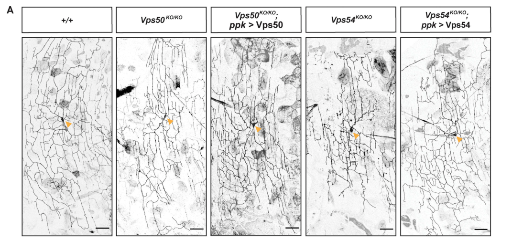

## Question

# Gene Research for Functional Annotation

## ⚠️ CRITICAL: Gene/Protein Identification Context

**BEFORE YOU BEGIN RESEARCH:** You MUST verify you are researching the CORRECT gene/protein. Gene symbols can be ambiguous, especially for less well-characterized genes from non-model organisms.

### Target Gene/Protein Identity (from UniProt):
- **UniProt Accession:** A1ZAY8
- **Protein Description:** SubName: Full=Vacuolar protein sorting 50 {ECO:0000313|EMBL:AAF57801.1};
- **Gene Information:** Name=Vps50 {ECO:0000313|EMBL:AAF57801.1, ECO:0000313|FlyBase:FBgn0034271}; Synonyms=Dmel\CG4996 {ECO:0000313|EMBL:AAF57801.1}, Vps54L {ECO:0000313|EMBL:AAF57801.1}; ORFNames=CG4996 {ECO:0000313|EMBL:AAF57801.1, ECO:0000313|FlyBase:FBgn0034271}, Dmel_CG4996 {ECO:0000313|EMBL:AAF57801.1};
- **Organism (full):** Drosophila melanogaster (Fruit fly).
- **Protein Family:** Not specified in UniProt
- **Key Domains:** Syndetin_C. (IPR019514); VPS50. (IPR040047); VPS54_N. (IPR019515); Syndetin_C (PF10474); Vps54_N (PF10475)

### MANDATORY VERIFICATION STEPS:

1. **Check if the gene symbol "Vps50" matches the protein description above**
2. **Verify the organism is correct:** Drosophila melanogaster (Fruit fly).
3. **Check if protein family/domains align with what you find in literature**
4. **If you find literature for a DIFFERENT gene with the same or similar symbol, STOP**

### If Gene Symbol is Ambiguous or You Cannot Find Relevant Literature:

**DO NOT PROCEED WITH RESEARCH ON A DIFFERENT GENE.** Instead:
- State clearly: "The gene symbol 'Vps50' is ambiguous or literature is limited for this specific protein"
- Explain what you found (e.g., "Found extensive literature on a different gene with the same symbol in a different organism")
- Describe the protein based ONLY on the UniProt information provided above
- Suggest that the protein function can be inferred from domain/family information

### Research Target:

Please provide a comprehensive research report on the gene **Vps50** (gene ID: Vps50, UniProt: A1ZAY8) in DROME.

The research report should be a detailed narrative explaining the function, biological processes, and localization of the gene product. Citations should be given for all claims.

You should prioritize authoritative reviews and primary scientific literature when conducting research. You can supplement
this with annotations you find in gene/protein databases, but these can be outdated or inaccurate.

We are specifically interested in the primary function of the gene - for enzymes, what reaction is catalyzed, and what is the substrate specificity? For transporters, what is the substrate? For structural proteins or adapters, what is the broader structural role? For signaling molecules, what is the role in the pathway.

We are interested in where in or outside the cell the gene product carries out its function.

We are also interested in the signaling or biochemical pathways in which the gene functions. We are less interested in broad pleiotropic effects, except where these elucidate the precise role.

Include evidence where possible. We are interested in both experimental evidence as well as inference from structure, evolution, or bioinformatic analysis. Precise studies should be prioritized over high-throughput, where available.

## Output

Question: You are an expert researcher providing comprehensive, well-cited information.

Provide detailed information focusing on:
1. Key concepts and definitions with current understanding
2. Recent developments and latest research (prioritize 2023-2024 sources)
3. Current applications and real-world implementations
4. Expert opinions and analysis from authoritative sources
5. Relevant statistics and data from recent studies

Format as a comprehensive research report with proper citations. Include URLs and publication dates where available.
Always prioritize recent, authoritative sources and provide specific citations for all major claims.

# Gene Research for Functional Annotation

## ⚠️ CRITICAL: Gene/Protein Identification Context

**BEFORE YOU BEGIN RESEARCH:** You MUST verify you are researching the CORRECT gene/protein. Gene symbols can be ambiguous, especially for less well-characterized genes from non-model organisms.

### Target Gene/Protein Identity (from UniProt):
- **UniProt Accession:** A1ZAY8
- **Protein Description:** SubName: Full=Vacuolar protein sorting 50 {ECO:0000313|EMBL:AAF57801.1};
- **Gene Information:** Name=Vps50 {ECO:0000313|EMBL:AAF57801.1, ECO:0000313|FlyBase:FBgn0034271}; Synonyms=Dmel\CG4996 {ECO:0000313|EMBL:AAF57801.1}, Vps54L {ECO:0000313|EMBL:AAF57801.1}; ORFNames=CG4996 {ECO:0000313|EMBL:AAF57801.1, ECO:0000313|FlyBase:FBgn0034271}, Dmel_CG4996 {ECO:0000313|EMBL:AAF57801.1};
- **Organism (full):** Drosophila melanogaster (Fruit fly).
- **Protein Family:** Not specified in UniProt
- **Key Domains:** Syndetin_C. (IPR019514); VPS50. (IPR040047); VPS54_N. (IPR019515); Syndetin_C (PF10474); Vps54_N (PF10475)

### MANDATORY VERIFICATION STEPS:

1. **Check if the gene symbol "Vps50" matches the protein description above**
2. **Verify the organism is correct:** Drosophila melanogaster (Fruit fly).
3. **Check if protein family/domains align with what you find in literature**
4. **If you find literature for a DIFFERENT gene with the same or similar symbol, STOP**

### If Gene Symbol is Ambiguous or You Cannot Find Relevant Literature:

**DO NOT PROCEED WITH RESEARCH ON A DIFFERENT GENE.** Instead:
- State clearly: "The gene symbol 'Vps50' is ambiguous or literature is limited for this specific protein"
- Explain what you found (e.g., "Found extensive literature on a different gene with the same symbol in a different organism")
- Describe the protein based ONLY on the UniProt information provided above
- Suggest that the protein function can be inferred from domain/family information

### Research Target:

Please provide a comprehensive research report on the gene **Vps50** (gene ID: Vps50, UniProt: A1ZAY8) in DROME.

The research report should be a detailed narrative explaining the function, biological processes, and localization of the gene product. Citations should be given for all claims.

You should prioritize authoritative reviews and primary scientific literature when conducting research. You can supplement
this with annotations you find in gene/protein databases, but these can be outdated or inaccurate.

We are specifically interested in the primary function of the gene - for enzymes, what reaction is catalyzed, and what is the substrate specificity? For transporters, what is the substrate? For structural proteins or adapters, what is the broader structural role? For signaling molecules, what is the role in the pathway.

We are interested in where in or outside the cell the gene product carries out its function.

We are also interested in the signaling or biochemical pathways in which the gene functions. We are less interested in broad pleiotropic effects, except where these elucidate the precise role.

Include evidence where possible. We are interested in both experimental evidence as well as inference from structure, evolution, or bioinformatic analysis. Precise studies should be prioritized over high-throughput, where available.

# Functional annotation of *Drosophila melanogaster Vps50* (UniProt A1ZAY8)

## Identity and principal conclusion

The supplied UniProt record identifies A1ZAY8 as fruit-fly **Vps50**, with the gene identifier **CG4996** and synonyms **Vps54L** and **Dmel\CG4996**: https://www.uniprot.org/uniprotkb/A1ZAY8/entry. This is the protein considered here, **not Vps54**, another fly gene. The names are potentially confusing because VPS50 and VPS54 occupy corresponding positions in related, but distinct, trafficking complexes. Fly knockout experiments explicitly distinguish EARP-specific Vps50 from GARP-specific Vps54, although the retrieved experimental report does not itself give the CG4996 identifier or independently validate A1ZAY8’s sequence-domain annotation. Thus, the CG4996–A1ZAY8 mapping rests on the supplied UniProt information; the functional assignment rests on fly experiments and conserved-complex studies. (o’brien2022thegarpcomplex pages 2-4, o’brien2022thegarpcomplex pages 4-6, schindler2015earpisa pages 1-3)

**Best-supported primary function:** Vps50 is the complex-specific subunit of **EARP** (*endosome-associated recycling protein*), a four-subunit membrane-trafficking tether comprising Vps50, Vps51, Vps52 and Vps53. EARP helps organize the docking and subsequent fusion of endosome-derived carriers at recycling endosomes, supporting recycling traffic and, in fly sensory neurons, normal regrowth of adult dendrites. Vps54 instead joins Vps51–53 to form **GARP**, which acts predominantly at the trans-Golgi network (TGN). Vps50 is therefore best classified as a **trafficking-complex structural/tethering component**, not as an enzyme, membrane transporter or established direct cargo-binding receptor; no catalytic reaction or transported substrate can be assigned to it. The underlying tethering model is supported most directly by mammalian biochemical and trafficking experiments, while its neuronal requirement is directly established in flies. (schindler2015earpisa pages 5-6, khakurel2023roleofgarp pages 2-4, o’brien2022thegarpcomplex pages 2-4, o’brien2022thegarpcomplex pages 4-6)

The record supplied in the question lists VPS50/Syndetin_C and VPS54_N-related domain annotations (**IPR040047, IPR019514, IPR019515; PF10474, PF10475**). These are **sequence annotations**, not demonstrations that fly Vps50 acts as Vps54 or has an independently established catalytic activity. The conserved EARP-specific subunit identity and the experimental separation of Vps50 and Vps54 are more informative for assigning function than the synonym “Vps54L” or the VPS54_N domain name alone. (khakurel2023roleofgarp pages 2-4, o’brien2022thegarpcomplex pages 2-4)

## Mechanism, pathway and location

The relevant biochemical pathway is **endosomal recycling**, particularly traffic through early and recycling endosomes toward the cell surface. In the original EARP characterization, changing the fourth subunit from VPS54 to VPS50 distinguished endosome-associated EARP from TGN-associated GARP. Mammalian VPS50/syndetin-associated EARP occurs on recycling-endosomal compartments, including **RAB4-positive** membranes, and associates with the endosomal SNARE **syntaxin 6** and cognate SNARE machinery. Depleting syndetin delayed return of internalized transferrin to the plasma membrane without blocking its initial uptake. This establishes a role in *recycling after internalization*, not direct binding of transferrin or transferrin receptor by VPS50. A 2023 review likewise contrasts VPS50 at RAB4-containing endosomes with VPS54 at the TGN. [Schindler *et al.*, *Nature Cell Biology*, March 2015, https://doi.org/10.1038/ncb3129; Khakurel and Lupashin, *International Journal of Molecular Sciences*, March 2023, https://doi.org/10.3390/ijms24076069.] (schindler2015earpisa pages 5-6, schindler2015earpisa pages 3-5, khakurel2023roleofgarp pages 2-4)

**Location in the fly requires qualification.** A published cross-species discussion reports EARP on RAB4-positive endosomes in *Drosophila* S2 cells, consistent with its conserved recycling-endosome assignment. However, the decisive 2022 fly-neuron knockout study could not assay endogenous Vps50 protein with a suitable antibody; its Rab5 measurements document an organelle *response to loss of Vps50*, **not** direct colocalization of Vps50 with Rab5 in neurons. Accordingly, the most defensible localization annotation is **cytosol-facing recycling/endosomal trafficking machinery, supported by conserved EARP biology and cell-line evidence; endogenous subcellular distribution of A1ZAY8 in fly neurons remains unresolved**. [Topalidou *et al.*, *PLOS Genetics*, May 2016, https://doi.org/10.1371/journal.pgen.1006074; O’Brien *et al.*, *Journal of Cell Biology*, published October 2022, https://doi.org/10.1083/jcb.202112108.] (o’brien2022thegarpcomplex pages 2-4, topalidou2016theearpcomplex pages 15-16, o’brien2022thegarpcomplex pages 6-8)

## Direct evidence in *Drosophila*

O’Brien and colleagues replaced the entire fly *Vps50* coding sequence using CRISPR/Cas9 and verified loss of targeted-gene expression by RT-PCR. Homozygous mutants survived to adulthood. In class IV dendritic-arborization (**c4da**) sensory neurons, knockout reduced **adult total dendrite length and branch number**; neuronal expression of wild-type Vps50 rescued the morphology. Larval dendritic arbors remained broadly comparable to controls. Defects emerged during regrowth following pupal dendrite pruning, becoming apparent around **one-day-old adults**, rather than reflecting an initial failure to produce larval arbors. Figure 3 presents the mutant and rescue comparisons; adult morphology measurements used **7–12 independent neurons per genotype**, and developmental time courses used **9–11 Vps50-knockout neurons per time point**. These observations support a **cell-autonomous requirement for Vps50 in the magnitude of adult dendrite regrowth**, rather than identifying a particular cargo whose recycling builds the arbor. [O’Brien *et al.*, *Journal of Cell Biology*, October 2022, https://doi.org/10.1083/jcb.202112108.] (o’brien2022thegarpcomplex pages 2-4, o’brien2022thegarpcomplex pages 4-6, o’brien2022thegarpcomplex media a9781efd)

The compartmental phenotype gives the fly result greater mechanistic specificity: Vps50 knockout increased **somatic Rab5-positive early-endosome puncta** in c4da neurons relative to controls (**P = 0.0061; n = 16–18 independent samples per genotype**); neuronal Vps50 expression reduced this mutant phenotype (**P = 0.0106** versus knockout). Endosome size or Rab5 mean fluorescence did not show the same reported change. The increase is consistent with disturbed progression through the early-endosomal/recycling pathway, but **does not by itself demonstrate a direct Vps50–Rab5 interaction or identify the trapped cargo**. [O’Brien *et al.*, *Journal of Cell Biology*, October 2022, https://doi.org/10.1083/jcb.202112108.] (o’brien2022thegarpcomplex pages 4-6, o’brien2022thegarpcomplex pages 6-8)

**Why the Vps54 distinction matters:** Vps54 knockout caused a stronger adult c4da regrowth phenotype and, unlike Vps50 knockout, affected adult class I dendritic-arborization neurons, increased late-endosomal/lysosomal and TGN-associated markers, and produced transient **TGN-associated free-sterol accumulation**. Vps50-mutant neurons did **not** show the corresponding filipin-detected sterol accumulation, and mutant males remained fertile, unlike Vps54-mutant males. Consequently, the sterol/Osbp genetic interaction demonstrated in **Vps54-deficient** neurons should **not** be assigned as a direct biochemical function of Vps50. [O’Brien *et al.*, *Journal of Cell Biology*, October 2022, https://doi.org/10.1083/jcb.202112108.] (o’brien2022thegarpcomplex pages 2-4, o’brien2022thegarpcomplex pages 4-6, o’brien2022thegarpcomplex pages 6-8, o’brien2022thegarpcomplex pages 8-10)

The following table separates observations in this fly gene from mechanisms established primarily in other organisms.

| Claim | Experimental system and observation | Interpretation / limit | DOI source (year) |
|---|---|---|---|
| Fly Vps50 supports adult sensory-neuron dendrite regrowth | *D. melanogaster*: CRISPR/Cas9 replaced the complete Vps50 coding sequence; RT-PCR confirmed loss of expression. Knockout reduced adult c4da dendrite length and branch number after developmental pruning, and neuron-specific wild-type Vps50 rescued the phenotype. Larval arbors were comparable to controls. (o’brien2022thegarpcomplex pages 2-4, o’brien2022thegarpcomplex pages 4-6, o’brien2022thegarpcomplex media a9781efd) | Strongest direct evidence for A1ZAY8 function. Supports a cell-autonomous role during adult arbor regrowth, not a general requirement for larval dendrite growth. Endogenous Vps50 protein localization was not determined because a suitable fly antibody was unavailable. | [10.1083/jcb.202112108](https://doi.org/10.1083/jcb.202112108) (2022) |
| Fly Vps50 loss selectively perturbs early endosomes | *D. melanogaster* c4da neurons: Vps50 knockout increased somatic Rab5-positive puncta (*P* = 0.0061; *n* = 16–18 samples per genotype), and neuronal Vps50 expression rescued this change. Vps54 loss instead affected late-endosomal/lysosomal and TGN markers. (o’brien2022thegarpcomplex pages 4-6, o’brien2022thegarpcomplex pages 6-8) | Connects fly Vps50 to early-to-recycling-endosome traffic and distinguishes EARP loss from GARP loss. Rab5 accumulation is a loss-of-function phenotype, not direct localization of endogenous Vps50 or proof of Vps50–Rab5 binding. | [10.1083/jcb.202112108](https://doi.org/10.1083/jcb.202112108) (2022) |
| VPS50 is the non-catalytic, EARP-specific tethering-complex subunit | Mammalian cells/rat neurons: VPS50 (syndetin) replaces VPS54 in a heterotetramer with VPS51, VPS52 and VPS53; EARP associates with Rab4-positive recycling endosomes and syntaxin-6-associated SNARE machinery. VPS50 depletion delayed internalized-transferrin recycling without impairing initial uptake. (schindler2015earpisa pages 5-6, schindler2015earpisa pages 3-5, khakurel2023roleofgarp pages 2-4) | Conserved-complex evidence supports annotating fly Vps50 as an endosomal tether/adapter rather than an enzyme, transporter or cargo receptor. Direct cargo binding and substrate specificity have not been demonstrated; most mechanistic assays were not performed in flies. | [10.1038/ncb3129](https://doi.org/10.1038/ncb3129) (2015) |
| Conserved neuronal-vesicle roles and RAB recruitment remain cross-species inferences | *C. elegans*: vps-50 loss reduced dense-core-vesicle peptide cargo and impaired vesicle acidification; VPS-50 associated with V-ATPase machinery but was not shown to catalyze a reaction. Human HeLa-cell work first reported as a 2024 preprint—and peer-reviewed in 2025—found that RAB14 preferentially associates with and recruits VPS50-containing EARP to endosomes. (topalidou2016theearpcomplex pages 10-13, paquin2016theconservedvps50 pages 7-8, paquin2016theconservedvps50 pages 8-9, stlaurent2024aproximitymap pages 15-18, gaudreault2025aproximitymap pages 9-10) | These results suggest possible fly roles in dense-core-vesicle maturation/acidification and RAB14-dependent recruitment, but neither mechanism has been demonstrated directly for A1ZAY8 in *Drosophila*. | [10.1016/j.cub.2016.01.049](https://doi.org/10.1016/j.cub.2016.01.049) (2016); [10.1101/2024.11.05.621850](https://doi.org/10.1101/2024.11.05.621850) (2024 preprint); [10.1038/s42003-025-09121-5](https://doi.org/10.1038/s42003-025-09121-5) (2025) |

*Table: Evidence is ranked from direct Drosophila knockout and rescue observations to conserved mechanistic findings in mammalian cells and C. elegans. The table separates established A1ZAY8 functions from cross-species inferences and unresolved localization or catalytic questions.*

## Additional conserved functions: informative, but not established for fly A1ZAY8

Experiments in *Caenorhabditis elegans* connect the **VPS-50-containing EARP complex** and its interactor **EIPR-1** with sorting neuropeptides into maturing **dense-core vesicles**, in a pathway genetically associated with **RAB-2**. Worm *vps-50* loss reduced axonal dense-core-vesicle cargos including **NLP-21 and FLP-3**, whereas loss of GARP-specific *vps-54* did not reproduce those defects; synaptic-vesicle synaptobrevin trafficking was comparatively spared. EIPR-1 association with VPS50-containing machinery was also investigated biochemically in rat insulinoma cells. These data offer a plausible route by which conserved endosomal recycling could support neurosecretory-vesicle maturation; **peptide-cargo sorting by fly Vps50 itself has not been established by the cited fly dendrite study**. [Topalidou *et al.*, *PLOS Genetics*, May 2016, https://doi.org/10.1371/journal.pgen.1006074.] (topalidou2016theearpcomplex pages 5-8, topalidou2016theearpcomplex pages 13-15, topalidou2016theearpcomplex pages 10-13)

An independent worm study found that VPS-50 loss impaired dense-core-vesicle and synaptic-vesicle **acidification**. It reported an interaction with the V-ATPase-associated subunit **VHA-15** and evidence consistent with altered V-ATPase subunit recruitment or assembly. This makes vesicle acidification a **candidate downstream consequence** of conserved VPS50-dependent sorting/organization, **not** evidence that Vps50 itself pumps protons or that the same acidification defect has been measured for fly A1ZAY8. [Paquin *et al.*, *Current Biology*, April 2016, https://doi.org/10.1016/j.cub.2016.01.049.] (paquin2016theconservedvps50 pages 7-8, paquin2016theconservedvps50 pages 8-9, paquin2016theconservedvps50 pages 5-6)

## Recent developments and research use

The principal mechanistic update within the requested **2023–2024** window is a **November 2024 preprint** reporting preferential proximity of mammalian **RAB14** to VPS50-containing EARP rather than VPS54-containing GARP. A **peer-reviewed follow-up published November 2025** reports complementary proximity-ligation and immunoprecipitation experiments and finds that RAB14 loss disperses VPS50 and reduces its colocalization with transferrin receptor in human HeLa cells, while VPS54 localization is comparatively unaffected. This strengthens a model in which RAB14 helps recruit EARP to endosomes, but **RAB14-dependent recruitment has not been demonstrated for fly Vps50**. [St-Laurent/Gaudreault *et al.*, bioRxiv preprint, November 2024, https://doi.org/10.1101/2024.11.05.621850; Gaudreault *et al.*, *Communications Biology*, November 2025, https://doi.org/10.1038/s42003-025-09121-5.] (stlaurent2024aproximitymap pages 15-18, gaudreault2025aproximitymap pages 9-10)

**Current application and scope:** *Vps50* knockout, neuronal rescue and endosomal-marker assays make *Drosophila* a practical **experimental model** for separating EARP-dependent recycling from GARP-dependent TGN trafficking during neuronal remodeling. Transferrin-recycling assays and the newer RAB14 experiments supply complementary, primarily mammalian mechanistic tests. These are research implementations, **not an established therapeutic application or a fly-specific clinical biomarker**. The outstanding annotation questions are the identity of direct fly neuronal cargos, endogenous Vps50 localization during regrowth, and whether the worm dense-core-vesicle/acidification or mammalian RAB14 mechanisms operate in the fly neurons examined. (o’brien2022thegarpcomplex pages 2-4, o’brien2022thegarpcomplex pages 4-6, gaudreault2025aproximitymap pages 9-10, paquin2016theconservedvps50 pages 8-9)

References

1. (o’brien2022thegarpcomplex pages 2-4): Caitlin E. O’Brien, Susan H. Younger, Lily Yeh Jan, and Yuh Nung Jan. The garp complex prevents sterol accumulation at the trans-golgi network during dendrite remodeling. Journal of Cell Biology, Oct 2022. URL: https://doi.org/10.1083/jcb.202112108, doi:10.1083/jcb.202112108. This article has 12 citations and is from a highest quality peer-reviewed journal.

2. (o’brien2022thegarpcomplex pages 4-6): Caitlin E. O’Brien, Susan H. Younger, Lily Yeh Jan, and Yuh Nung Jan. The garp complex prevents sterol accumulation at the trans-golgi network during dendrite remodeling. Journal of Cell Biology, Oct 2022. URL: https://doi.org/10.1083/jcb.202112108, doi:10.1083/jcb.202112108. This article has 12 citations and is from a highest quality peer-reviewed journal.

3. (schindler2015earpisa pages 1-3): Christina E. M. Schindler, Yu Chen, Jing Pu, Xiaoli Guo, and J. Bonifacino. Earp is a multisubunit tethering complex involved in endocytic recycling. Nature Cell Biology, 17:639-650, Mar 2015. URL: https://doi.org/10.1038/ncb3129, doi:10.1038/ncb3129. This article has 168 citations and is from a highest quality peer-reviewed journal.

4. (schindler2015earpisa pages 5-6): Christina E. M. Schindler, Yu Chen, Jing Pu, Xiaoli Guo, and J. Bonifacino. Earp is a multisubunit tethering complex involved in endocytic recycling. Nature Cell Biology, 17:639-650, Mar 2015. URL: https://doi.org/10.1038/ncb3129, doi:10.1038/ncb3129. This article has 168 citations and is from a highest quality peer-reviewed journal.

5. (khakurel2023roleofgarp pages 2-4): Amrita Khakurel and Vladimir V. Lupashin. Role of garp vesicle tethering complex in golgi physiology. International Journal of Molecular Sciences, 24:6069, Mar 2023. URL: https://doi.org/10.3390/ijms24076069, doi:10.3390/ijms24076069. This article has 25 citations.

6. (schindler2015earpisa pages 3-5): Christina E. M. Schindler, Yu Chen, Jing Pu, Xiaoli Guo, and J. Bonifacino. Earp is a multisubunit tethering complex involved in endocytic recycling. Nature Cell Biology, 17:639-650, Mar 2015. URL: https://doi.org/10.1038/ncb3129, doi:10.1038/ncb3129. This article has 168 citations and is from a highest quality peer-reviewed journal.

7. (topalidou2016theearpcomplex pages 15-16): Irini Topalidou, Jérôme Cattin-Ortolá, Andrea L. Pappas, Kirsten Cooper, Gennifer E. Merrihew, Michael J. MacCoss, and Michael Ailion. The earp complex and its interactor eipr-1 are required for cargo sorting to dense-core vesicles. PLOS Genetics, 12:e1006074, May 2016. URL: https://doi.org/10.1371/journal.pgen.1006074, doi:10.1371/journal.pgen.1006074. This article has 68 citations and is from a domain leading peer-reviewed journal.

8. (o’brien2022thegarpcomplex pages 6-8): Caitlin E. O’Brien, Susan H. Younger, Lily Yeh Jan, and Yuh Nung Jan. The garp complex prevents sterol accumulation at the trans-golgi network during dendrite remodeling. Journal of Cell Biology, Oct 2022. URL: https://doi.org/10.1083/jcb.202112108, doi:10.1083/jcb.202112108. This article has 12 citations and is from a highest quality peer-reviewed journal.

9. (o’brien2022thegarpcomplex media a9781efd): Caitlin E. O’Brien, Susan H. Younger, Lily Yeh Jan, and Yuh Nung Jan. The garp complex prevents sterol accumulation at the trans-golgi network during dendrite remodeling. Journal of Cell Biology, Oct 2022. URL: https://doi.org/10.1083/jcb.202112108, doi:10.1083/jcb.202112108. This article has 12 citations and is from a highest quality peer-reviewed journal.

10. (o’brien2022thegarpcomplex pages 8-10): Caitlin E. O’Brien, Susan H. Younger, Lily Yeh Jan, and Yuh Nung Jan. The garp complex prevents sterol accumulation at the trans-golgi network during dendrite remodeling. Journal of Cell Biology, Oct 2022. URL: https://doi.org/10.1083/jcb.202112108, doi:10.1083/jcb.202112108. This article has 12 citations and is from a highest quality peer-reviewed journal.

11. (topalidou2016theearpcomplex pages 10-13): Irini Topalidou, Jérôme Cattin-Ortolá, Andrea L. Pappas, Kirsten Cooper, Gennifer E. Merrihew, Michael J. MacCoss, and Michael Ailion. The earp complex and its interactor eipr-1 are required for cargo sorting to dense-core vesicles. PLOS Genetics, 12:e1006074, May 2016. URL: https://doi.org/10.1371/journal.pgen.1006074, doi:10.1371/journal.pgen.1006074. This article has 68 citations and is from a domain leading peer-reviewed journal.

12. (paquin2016theconservedvps50 pages 7-8): Nicolas Paquin, Yasunobu Murata, Allan Froehlich, Daniel T. Omura, Michael Ailion, Corinne L. Pender, Martha Constantine-Paton, and H. Robert Horvitz. The conserved vps-50 protein functions in dense-core vesicle maturation and acidification and controls animal behavior. Current Biology, 26:862-871, Apr 2016. URL: https://doi.org/10.1016/j.cub.2016.01.049, doi:10.1016/j.cub.2016.01.049. This article has 35 citations and is from a highest quality peer-reviewed journal.

13. (paquin2016theconservedvps50 pages 8-9): Nicolas Paquin, Yasunobu Murata, Allan Froehlich, Daniel T. Omura, Michael Ailion, Corinne L. Pender, Martha Constantine-Paton, and H. Robert Horvitz. The conserved vps-50 protein functions in dense-core vesicle maturation and acidification and controls animal behavior. Current Biology, 26:862-871, Apr 2016. URL: https://doi.org/10.1016/j.cub.2016.01.049, doi:10.1016/j.cub.2016.01.049. This article has 35 citations and is from a highest quality peer-reviewed journal.

14. (stlaurent2024aproximitymap pages 15-18): Véronique Gaudeault St-Laurent, Benoit Marchand, Raphaëlle Larcher, Sonya Nassari, Francis Bourassa, Mathilde Moreau, Dominique Jean, François-Michel Boisvert, Marie A. Brunet, and Steve Jean. A proximity map of rab gtpases. bioRxiv, Nov 2024. URL: https://doi.org/10.1101/2024.11.05.621850, doi:10.1101/2024.11.05.621850. This article has 0 citations.

15. (gaudreault2025aproximitymap pages 9-10): Véronique Gaudreault, Benoit Marchand, Raphaëlle Larcher, Sonya Nassari, Francis Bourassa, Mathilde Moreau, Dominique Jean, François-Michel Boisvert, Marie A. Brunet, and Steve Jean. A proximity map of rab gtpases delineates roles for rab14 in earp complex and uhrf1bp1 endosomal recruitments. Communications Biology, Nov 2025. URL: https://doi.org/10.1038/s42003-025-09121-5, doi:10.1038/s42003-025-09121-5. This article has 6 citations and is from a peer-reviewed journal.

16. (topalidou2016theearpcomplex pages 5-8): Irini Topalidou, Jérôme Cattin-Ortolá, Andrea L. Pappas, Kirsten Cooper, Gennifer E. Merrihew, Michael J. MacCoss, and Michael Ailion. The earp complex and its interactor eipr-1 are required for cargo sorting to dense-core vesicles. PLOS Genetics, 12:e1006074, May 2016. URL: https://doi.org/10.1371/journal.pgen.1006074, doi:10.1371/journal.pgen.1006074. This article has 68 citations and is from a domain leading peer-reviewed journal.

17. (topalidou2016theearpcomplex pages 13-15): Irini Topalidou, Jérôme Cattin-Ortolá, Andrea L. Pappas, Kirsten Cooper, Gennifer E. Merrihew, Michael J. MacCoss, and Michael Ailion. The earp complex and its interactor eipr-1 are required for cargo sorting to dense-core vesicles. PLOS Genetics, 12:e1006074, May 2016. URL: https://doi.org/10.1371/journal.pgen.1006074, doi:10.1371/journal.pgen.1006074. This article has 68 citations and is from a domain leading peer-reviewed journal.

18. (paquin2016theconservedvps50 pages 5-6): Nicolas Paquin, Yasunobu Murata, Allan Froehlich, Daniel T. Omura, Michael Ailion, Corinne L. Pender, Martha Constantine-Paton, and H. Robert Horvitz. The conserved vps-50 protein functions in dense-core vesicle maturation and acidification and controls animal behavior. Current Biology, 26:862-871, Apr 2016. URL: https://doi.org/10.1016/j.cub.2016.01.049, doi:10.1016/j.cub.2016.01.049. This article has 35 citations and is from a highest quality peer-reviewed journal.

## Artifacts

- [Edison artifact artifact-00](Vps50-deep-research-falcon_artifacts/artifact-00.md)

## Citations

1. schindler2015earpisa pages 1-3
2. schindler2015earpisa pages 5-6
3. khakurel2023roleofgarp pages 2-4
4. schindler2015earpisa pages 3-5
5. topalidou2016theearpcomplex pages 15-16
6. topalidou2016theearpcomplex pages 10-13
7. stlaurent2024aproximitymap pages 15-18
8. gaudreault2025aproximitymap pages 9-10
9. topalidou2016theearpcomplex pages 5-8
10. topalidou2016theearpcomplex pages 13-15
11. Schindler *et al.*, *Nature Cell Biology*, March 2015, https://doi.org/10.1038/ncb3129; Khakurel and Lupashin, *International Journal of Molecular Sciences*, March 2023, https://doi.org/10.3390/ijms24076069.
12. Topalidou *et al.*, *PLOS Genetics*, May 2016, https://doi.org/10.1371/journal.pgen.1006074; O’Brien *et al.*, *Journal of Cell Biology*, published October 2022, https://doi.org/10.1083/jcb.202112108.
13. O’Brien *et al.*, *Journal of Cell Biology*, October 2022, https://doi.org/10.1083/jcb.202112108.
14. 10.1083/jcb.202112108
15. 10.1038/ncb3129
16. 10.1016/j.cub.2016.01.049
17. 10.1101/2024.11.05.621850
18. 10.1038/s42003-025-09121-5
19. Topalidou *et al.*, *PLOS Genetics*, May 2016, https://doi.org/10.1371/journal.pgen.1006074.
20. Paquin *et al.*, *Current Biology*, April 2016, https://doi.org/10.1016/j.cub.2016.01.049.
21. St-Laurent/Gaudreault *et al.*, bioRxiv preprint, November 2024, https://doi.org/10.1101/2024.11.05.621850; Gaudreault *et al.*, *Communications Biology*, November 2025, https://doi.org/10.1038/s42003-025-09121-5.
22. https://www.uniprot.org/uniprotkb/A1ZAY8/entry.
23. https://doi.org/10.1038/ncb3129;
24. https://doi.org/10.3390/ijms24076069.]
25. https://doi.org/10.1371/journal.pgen.1006074;
26. https://doi.org/10.1083/jcb.202112108.]
27. https://doi.org/10.1083/jcb.202112108
28. https://doi.org/10.1038/ncb3129
29. https://doi.org/10.1016/j.cub.2016.01.049
30. https://doi.org/10.1101/2024.11.05.621850
31. https://doi.org/10.1038/s42003-025-09121-5
32. https://doi.org/10.1371/journal.pgen.1006074.]
33. https://doi.org/10.1016/j.cub.2016.01.049.]
34. https://doi.org/10.1101/2024.11.05.621850;
35. https://doi.org/10.1038/s42003-025-09121-5.]
36. https://doi.org/10.1083/jcb.202112108,
37. https://doi.org/10.1038/ncb3129,
38. https://doi.org/10.3390/ijms24076069,
39. https://doi.org/10.1371/journal.pgen.1006074,
40. https://doi.org/10.1016/j.cub.2016.01.049,
41. https://doi.org/10.1101/2024.11.05.621850,
42. https://doi.org/10.1038/s42003-025-09121-5,