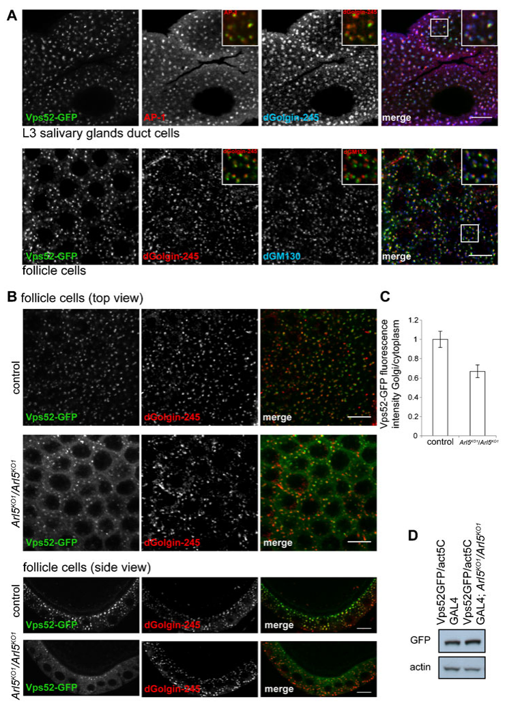

## Question

# Gene Research for Functional Annotation

## ⚠️ CRITICAL: Gene/Protein Identification Context

**BEFORE YOU BEGIN RESEARCH:** You MUST verify you are researching the CORRECT gene/protein. Gene symbols can be ambiguous, especially for less well-characterized genes from non-model organisms.

### Target Gene/Protein Identity (from UniProt):
- **UniProt Accession:** Q8MSY4
- **Protein Description:** RecName: Full=Vacuolar protein sorting-associated protein 51 homolog; AltName: Full=Protein fat-free homolog;
- **Gene Information:** Name=Vps51 {ECO:0000312|FlyBase:FBgn0034380}; ORFNames=CG15087 {ECO:0000312|FlyBase:FBgn0034380};
- **Organism (full):** Drosophila melanogaster (Fruit fly).
- **Protein Family:** Belongs to the VPS51 family. .
- **Key Domains:** Cullin_repeat-like_dom_sf. (IPR016159); Vps51. (IPR014812); VPS51_Exo84_N (PF08700)

### MANDATORY VERIFICATION STEPS:

1. **Check if the gene symbol "Vps51" matches the protein description above**
2. **Verify the organism is correct:** Drosophila melanogaster (Fruit fly).
3. **Check if protein family/domains align with what you find in literature**
4. **If you find literature for a DIFFERENT gene with the same or similar symbol, STOP**

### If Gene Symbol is Ambiguous or You Cannot Find Relevant Literature:

**DO NOT PROCEED WITH RESEARCH ON A DIFFERENT GENE.** Instead:
- State clearly: "The gene symbol 'Vps51' is ambiguous or literature is limited for this specific protein"
- Explain what you found (e.g., "Found extensive literature on a different gene with the same symbol in a different organism")
- Describe the protein based ONLY on the UniProt information provided above
- Suggest that the protein function can be inferred from domain/family information

### Research Target:

Please provide a comprehensive research report on the gene **Vps51** (gene ID: Vps51, UniProt: Q8MSY4) in DROME.

The research report should be a detailed narrative explaining the function, biological processes, and localization of the gene product. Citations should be given for all claims.

You should prioritize authoritative reviews and primary scientific literature when conducting research. You can supplement
this with annotations you find in gene/protein databases, but these can be outdated or inaccurate.

We are specifically interested in the primary function of the gene - for enzymes, what reaction is catalyzed, and what is the substrate specificity? For transporters, what is the substrate? For structural proteins or adapters, what is the broader structural role? For signaling molecules, what is the role in the pathway.

We are interested in where in or outside the cell the gene product carries out its function.

We are also interested in the signaling or biochemical pathways in which the gene functions. We are less interested in broad pleiotropic effects, except where these elucidate the precise role.

Include evidence where possible. We are interested in both experimental evidence as well as inference from structure, evolution, or bioinformatic analysis. Precise studies should be prioritized over high-throughput, where available.

## Output

Question: You are an expert researcher providing comprehensive, well-cited information.

Provide detailed information focusing on:
1. Key concepts and definitions with current understanding
2. Recent developments and latest research (prioritize 2023-2024 sources)
3. Current applications and real-world implementations
4. Expert opinions and analysis from authoritative sources
5. Relevant statistics and data from recent studies

Format as a comprehensive research report with proper citations. Include URLs and publication dates where available.
Always prioritize recent, authoritative sources and provide specific citations for all major claims.

# Gene Research for Functional Annotation

## ⚠️ CRITICAL: Gene/Protein Identification Context

**BEFORE YOU BEGIN RESEARCH:** You MUST verify you are researching the CORRECT gene/protein. Gene symbols can be ambiguous, especially for less well-characterized genes from non-model organisms.

### Target Gene/Protein Identity (from UniProt):
- **UniProt Accession:** Q8MSY4
- **Protein Description:** RecName: Full=Vacuolar protein sorting-associated protein 51 homolog; AltName: Full=Protein fat-free homolog;
- **Gene Information:** Name=Vps51 {ECO:0000312|FlyBase:FBgn0034380}; ORFNames=CG15087 {ECO:0000312|FlyBase:FBgn0034380};
- **Organism (full):** Drosophila melanogaster (Fruit fly).
- **Protein Family:** Belongs to the VPS51 family. .
- **Key Domains:** Cullin_repeat-like_dom_sf. (IPR016159); Vps51. (IPR014812); VPS51_Exo84_N (PF08700)

### MANDATORY VERIFICATION STEPS:

1. **Check if the gene symbol "Vps51" matches the protein description above**
2. **Verify the organism is correct:** Drosophila melanogaster (Fruit fly).
3. **Check if protein family/domains align with what you find in literature**
4. **If you find literature for a DIFFERENT gene with the same or similar symbol, STOP**

### If Gene Symbol is Ambiguous or You Cannot Find Relevant Literature:

**DO NOT PROCEED WITH RESEARCH ON A DIFFERENT GENE.** Instead:
- State clearly: "The gene symbol 'Vps51' is ambiguous or literature is limited for this specific protein"
- Explain what you found (e.g., "Found extensive literature on a different gene with the same symbol in a different organism")
- Describe the protein based ONLY on the UniProt information provided above
- Suggest that the protein function can be inferred from domain/family information

### Research Target:

Please provide a comprehensive research report on the gene **Vps51** (gene ID: Vps51, UniProt: Q8MSY4) in DROME.

The research report should be a detailed narrative explaining the function, biological processes, and localization of the gene product. Citations should be given for all claims.

You should prioritize authoritative reviews and primary scientific literature when conducting research. You can supplement
this with annotations you find in gene/protein databases, but these can be outdated or inaccurate.

We are specifically interested in the primary function of the gene - for enzymes, what reaction is catalyzed, and what is the substrate specificity? For transporters, what is the substrate? For structural proteins or adapters, what is the broader structural role? For signaling molecules, what is the role in the pathway.

We are interested in where in or outside the cell the gene product carries out its function.

We are also interested in the signaling or biochemical pathways in which the gene functions. We are less interested in broad pleiotropic effects, except where these elucidate the precise role.

Include evidence where possible. We are interested in both experimental evidence as well as inference from structure, evolution, or bioinformatic analysis. Precise studies should be prioritized over high-throughput, where available.

# Functional annotation of *Drosophila melanogaster* Vps51 (Q8MSY4)

## Identity and conclusion

**The target is the fruit-fly gene *Vps51* (CG15087), not a similarly named gene in another organism.** A fly proteomics study explicitly identifies CG15087/Vps51 alongside the other three subunits of the Golgi-associated retrograde protein complex (GARP). The accession Q8MSY4, alternative description “fat-free homolog,” and domain labels in the question are supplied UniProt annotations; the retrieved experiments establish the CG15087-to-Vps51 identity but do not independently verify every accession or domain boundary. Importantly, the frequently cited *fat-free* lipid-absorption phenotype concerns the **zebrafish** Vps51 ortholog, whereas the fly gene *scattered/scat* encodes **Vps54**, a different GARP subunit. Neither phenotype should be assigned directly to fly Vps51. (rosaferreira2015thesmallg pages 3-5, khakurel2023roleofgarp pages 5-7, fari2016theroleof pages 2-4)

**Best-supported primary function:** Vps51 is a **nonenzymatic membrane-trafficking adaptor/tether subunit**, principally understood through its participation in GARP, which acts at the cytosolic face of the trans-Golgi network (TGN) in receiving endosome-derived membrane carriers and facilitating their docking and fusion. Vps51 is also a shared subunit of the related endosome-associated recycling protein complex (EARP). Consequently, its inferred functions are not restricted to GARP, and evidence from a Vps54-specific perturbation cannot automatically be generalized to every action of Vps51. No catalytic reaction, molecular substrate specificity, or transmembrane transport substrate has been established for fly Vps51: its relevant “cargo” consists of membrane carriers and the proteins and lipids whose trafficking these complexes support, not substrates transported through Vps51 itself. (khakurel2023roleofgarp pages 1-2, khakurel2023roleofgarp pages 13-15, o’brien2022thegarpcomplex pages 2-4)

The following evidence hierarchy is essential to interpreting the fly data.

| Claim / evidence | Actual perturbation or system | Implication for *D. melanogaster* Vps51 | Key limitation |
|---|---|---|---|
| **Direct fly protein-identification evidence (2015):** CG15087/Vps51 and the other three GARP subunits were abundant, GTP-selective Arl5 interactors in two affinity-purification/mass-spectrometry approaches. [DOI](https://doi.org/10.1242/bio.201410975) (rosaferreira2015thesmallg pages 3-5) | Adult fly-head lysate with immobilized GST–Arl5; independent Arl5-coated-liposome purification from S2-cell cytosol. | Strongest species-specific evidence that CG15087 encodes a component of the fly GARP complex and associates with activated Arl5-dependent machinery. | Complex-level copurification does **not** establish direct physical contact between Arl5 and Vps51; the directly binding GARP subunit remains unknown. |
| **Fly localization and trafficking evidence (2015):** Vps52–GFP formed TGN-associated puncta; its Golgi-to-cytoplasm ratio was approximately **1.5-fold higher in wild type than in Arl5-null cells** (*n* = 11 flies per group). Arl5 loss also increased YFP–Rab7-compartment fluorescence by approximately **1.5-fold** and GFP–LERP-compartment fluorescence by approximately **1.6-fold**. [DOI](https://doi.org/10.1242/bio.201410975) (rosaferreira2015thesmallg pages 5-6, rosaferreira2015thesmallg media 08eb025c) | **Arl5 knockout**, with Vps52–GFP, YFP–Rab7, or GFP–LERP reporters in fly follicle, salivary-gland, or duct cells. | Supports an Arl5-dependent mechanism that recruits the **GARP complex** to the TGN and maintains endosome-to-TGN traffic; Vps51 probably participates as a GARP subunit. | This was **not a Vps51 knockout or Vps51-localization assay**. The fluorescent GARP reporter was Vps52, so the result is not direct Vps51 localization or loss-of-function evidence. |
| **Recent fly GARP/EARP biology (published online 2022; 2023 issue):** Vps54/GARP loss, unlike Vps50/EARP loss, caused Golgin245-positive TGN sterol accumulation and impaired dendrite regrowth; shared-subunit Vps53 loss severely reduced dendritic arbors. [DOI](https://doi.org/10.1083/jcb.202112108) (o’brien2022thegarpcomplex pages 2-4, o’brien2022thegarpcomplex pages 4-6, o’brien2022thegarpcomplex pages 6-8) | CRISPR knockouts of **Vps54** (GARP-specific), **Vps50** (EARP-specific), and **Vps53** (shared); Vps51 was not edited. | Establishes fly roles for molecular complexes containing Vps51: GARP in TGN sterol homeostasis and both GARP/EARP in neuronal remodeling. | Only indirect for Vps51. Because Vps51 is shared by GARP and EARP, its individual contribution—and whether its loss would reproduce either complex-specific phenotype—was not tested. |
| **Mechanistic ortholog evidence:** Yeast Vps51p links GARP to the N-terminal Habc region of the late-Golgi Qc-SNARE Tlg1p; human VPS51 binds the homologous STX6 Habc domain. [Yeast DOI](https://doi.org/10.1091/mbc.e02-10-0654) (khakurel2023roleofgarp pages 4-5, conibear2003vps51pmediatesthe pages 9-11, conibear2003vps51pmediatesthe pages 11-12) | Yeast two-hybrid, coimmunoprecipitation, cross-linking, GST pull-downs, deletion/mutational mapping, and structural analysis; separate human VPS51–STX6 studies. | Supports the conserved annotation of Vps51 as a **nonenzymatic tether/SNARE-associated adaptor** that couples GARP-mediated vesicle capture to TGN membrane fusion. | Heterologous inference: a fly Vps51–SNARE interaction has not been demonstrated directly. Disrupting the mapped yeast contact also did not reproduce a major trafficking defect, so this interface is not the complete GARP mechanism. |
| **Name/species disambiguation:** “fat-free” is prominently used for the **zebrafish** Vps51 ortholog; its lipid-absorption phenotype is not direct evidence for fly Q8MSY4. Conversely, fly **scattered (scat)** is **Vps54**, not Vps51. (khakurel2023roleofgarp pages 5-7, fari2016theroleof pages 2-4, rosaferreira2015thesmallg pages 7-8) | Cross-species nomenclature and fly *scat/Vps54* genetic studies. | Q8MSY4 should be annotated as fly **Vps51/CG15087**; “fat-free homolog” denotes homology rather than proof that fly Vps51 has the zebrafish phenotype. | Zebrafish *fat-free* phenotypes and fly *scat/Vps54* sterility, acroblast, or sperm-nuclear phenotypes must **not** be attributed directly to fly Vps51. |

*Table: Evidence is ranked by how directly it informs the function of Drosophila melanogaster Vps51/CG15087/Q8MSY4. The table distinguishes gene-specific observations from complex-level, ortholog-based, and potentially confounded evidence.*

## Molecular role, partners and localization

**Direct fly evidence.** Rosa-Ferreira and colleagues recovered CG15087/Vps51 together with fly Vps52, Vps53 and Vps54 among proteins preferentially associated with **GTP-bound Arl5**. They used both affinity purification from adult-head lysates and an independent Arl5-coated-liposome purification from S2-cell lysates, followed by mass spectrometry. This is strong evidence that fly Vps51 participates in an Arl5-associated GARP assembly. It is **not** proof that purified Arl5 binds Vps51 directly: the individual GARP subunit contacting Arl5 remains unidentified. See Rosa-Ferreira *et al.*, *Biology Open*, March 2015, https://doi.org/10.1242/bio.201410975. (rosaferreira2015thesmallg pages 3-5, khakurel2023roleofgarp pages 2-4)

**Where the complex acts.** GARP is a peripheral complex on the **cytosolic face of the TGN**, rather than a secreted protein, a lipid-transfer enzyme or a membrane-spanning transporter. In fly salivary-gland and follicle cells, the experimentally imaged GARP reporter was **Vps52–GFP**: its puncta lay near the trans-Golgi marker dGolgin-245 and partially overlapped AP-1, rather than the cis-Golgi marker dGM130. Loss of Arl5 reduced Golgi-associated Vps52–GFP and increased its cytoplasmic pool. Figure 4 of the primary study documents this localization and redistribution; it does **not** image tagged Vps51 itself. Golgi/TGN localization of fly Vps51 is therefore a well-supported **complex-membership inference**, not a Vps51-specific microscopy result. (rosaferreira2015thesmallg pages 3-5, rosaferreira2015thesmallg pages 5-6, rosaferreira2015thesmallg media 08eb025c)

**Mechanistic interpretation.** The 2023 review by Khakurel and Lupashin places GARP among the helical-rod-containing CATCHR tethering complexes. Its four components are VPS51–VPS54; the VPS51/VPS52/VPS53 core is also used by EARP, which substitutes **VPS50** for VPS54 and is associated with endosomes rather than the TGN. A proposed role for GARP is to couple recognition of incoming carriers to the TGN SNARE machinery that completes membrane fusion. The VPS51-family and VPS51_Exo84_N domain annotations supplied for Q8MSY4 are consistent with a conserved tether/scaffold assignment; a “cullin-repeat-like” structural annotation should **not** be construed as evidence that fly Vps51 is a cullin E3-ligase component. The review reports a 740-amino-acid fly Vps51, in contrast to the unusually short 164-amino-acid yeast Vps51p; its modeled human GARP structure remains a **prediction**, not an experimentally determined fly Vps51 structure. See Khakurel and Lupashin, *International Journal of Molecular Sciences*, **23 March 2023**, https://doi.org/10.3390/ijms24076069. (khakurel2023roleofgarp pages 1-2, khakurel2023roleofgarp pages 2-4, khakurel2023roleofgarp pages 5-7)

**SNARE-binding evidence is largely from other species.** In yeast, genetic and biochemical experiments show that Vps51p associates with the GARP core and links it to the amino-terminal region of the TGN SNARE Tlg1p; loss of yeast VPS51 disrupts the Vps52–Tlg1 association. Studies summarized in the 2023 review map a yeast interaction to the Tlg1 Habc domain and describe a corresponding human VPS51–syntaxin-6 interaction. These support a conserved adaptor model, **but neither establishes direct fly Vps51 binding to a particular fly SNARE**. Moreover, disrupting the mapped yeast binding contact did not itself reproduce a major trafficking defect, cautioning against treating that interface as the entire tethering mechanism. See Conibear *et al.*, *Molecular Biology of the Cell*, April 2003, https://doi.org/10.1091/mbc.e02-10-0654; Khakurel and Lupashin, 2023, https://doi.org/10.3390/ijms24076069. (conibear2003vps51pmediatesthe pages 9-11, khakurel2023roleofgarp pages 4-5)

## Biological processes and quantitative fly evidence

The most direct pathway assignment is **Arl5-associated recruitment of GARP to the TGN and endosome-to-TGN retrograde trafficking**. In the 2015 fly study, the Golgi-to-cytoplasm fluorescence ratio of Vps52–GFP was approximately **1.5-fold higher in control than Arl5-null follicle cells**, measured across **11 flies per genotype**; total Vps52–GFP abundance remained comparable. Arl5-null cells also had enlarged endosomal structures: average YFP–Rab7-positive-structure fluorescence increased approximately **1.5-fold**, and the lysosomal-enzyme receptor LERP–GFP-positive structures showed approximately **1.6-fold** higher fluorescence. Those are **Arl5-loss, complex-level readouts**, not measured effects of deleting Vps51. (rosaferreira2015thesmallg pages 5-6, rosaferreira2015thesmallg media 08eb025c)

Recent primary fly work adds physiological context without resolving Vps51-specific effects. O’Brien and colleagues used CRISPR knockouts of **Vps53** (shared by GARP and EARP), **Vps54** (GARP-specific) and **Vps50** (EARP-specific)—**not Vps51**. Vps54-deficient neurons, unlike Vps50-deficient neurons, accumulated filipin-detectable free sterol in the **Golgin245-positive TGN** during developmental dendrite regrowth; they also showed increased late-endosomal and lysosomal compartments. Lowering the dosage of the sterol-transfer regulator *Osbp* improved the Vps54 dendrite phenotype, whereas *Osbp* overexpression or knockdown of the PI4P kinase *four wheel drive/fwd* worsened it. This implicates **GARP-dependent TGN sterol homeostasis** in neuronal remodeling, but neither demonstrates that Vps51 directly transports sterol nor predicts the phenotype of a Vps51-null fly, which could disturb **both** GARP and EARP. The paper appeared online in **October 2022** in the *Journal of Cell Biology* **2023, volume 222** issue: https://doi.org/10.1083/jcb.202112108. (o’brien2022thegarpcomplex pages 2-4, o’brien2022thegarpcomplex pages 4-6, o’brien2022thegarpcomplex pages 6-8)

The distinction between complexes also clarifies possible applications of fly genetics. Perturbing their **complex-specific** subunits, Vps54 or Vps50, separates TGN-associated GARP biology from EARP-associated endosomal recycling; their **shared** Vps51 subunit is an informative candidate for testing which trafficking requirements overlap. This is a research-model application, **not an established clinical application or therapeutic use of fly Vps51**. Work on yeast and human VPS51, including defects in retrieval of recycling proteins to the Golgi after human VPS51 depletion, strengthens the evolutionary inference but should not be represented as a direct fly cargo-specificity assay. (khakurel2023roleofgarp pages 1-2, o’brien2022thegarpcomplex pages 2-4)

## State of knowledge and limitations

As of the examined **2023–2024** literature, the 2023 expert review still identified major unresolved questions: which GARP subunit physically contacts Arl5, which membrane carriers are directly captured, precisely which protein and lipid cargos depend on GARP, how GARP promotes SNARE assembly, and whether VPS51/VPS52/VPS53 exchange between GARP and EARP. The literature retrieved here supplies **no 2024 Vps51/CG15087-specific fly knockout, tagged-protein localization or purified-protein binding study** that resolves those questions. Thus the defensible functional annotation is **“conserved GARP/EARP membrane-tethering subunit; fly CG15087 is experimentally associated with GTP-Arl5-containing GARP machinery; GARP acts chiefly at the TGN in endosome-derived trafficking.”** More specific claims about fly Vps51’s direct binding interface, exact vesicular cargo, sterol-handling mechanism or organismal loss-of-function phenotype remain unproven. (rosaferreira2015thesmallg pages 3-5, khakurel2023roleofgarp pages 13-15, o’brien2022thegarpcomplex pages 2-4)

References

1. (rosaferreira2015thesmallg pages 3-5): Cláudia Rosa-Ferreira, Chantal Christis, Isabel L. Torres, and Sean Munro. The small g protein arl5 contributes to endosome-to-golgi traffic by aiding the recruitment of the garp complex to the golgi. Biology Open, 4:474-481, Mar 2015. URL: https://doi.org/10.1242/bio.201410975, doi:10.1242/bio.201410975. This article has 40 citations and is from a peer-reviewed journal.

2. (khakurel2023roleofgarp pages 5-7): Amrita Khakurel and Vladimir V. Lupashin. Role of garp vesicle tethering complex in golgi physiology. International Journal of Molecular Sciences, 24:6069, Mar 2023. URL: https://doi.org/10.3390/ijms24076069, doi:10.3390/ijms24076069. This article has 25 citations.

3. (fari2016theroleof pages 2-4): Karolina Fári, S. Takács, D. Ungar, and R. Sinka. The role of acroblast formation during drosophila spermatogenesis. Biology Open, 5:1102-1110, Aug 2016. URL: https://doi.org/10.1242/bio.018275, doi:10.1242/bio.018275. This article has 34 citations and is from a peer-reviewed journal.

4. (khakurel2023roleofgarp pages 1-2): Amrita Khakurel and Vladimir V. Lupashin. Role of garp vesicle tethering complex in golgi physiology. International Journal of Molecular Sciences, 24:6069, Mar 2023. URL: https://doi.org/10.3390/ijms24076069, doi:10.3390/ijms24076069. This article has 25 citations.

5. (khakurel2023roleofgarp pages 13-15): Amrita Khakurel and Vladimir V. Lupashin. Role of garp vesicle tethering complex in golgi physiology. International Journal of Molecular Sciences, 24:6069, Mar 2023. URL: https://doi.org/10.3390/ijms24076069, doi:10.3390/ijms24076069. This article has 25 citations.

6. (o’brien2022thegarpcomplex pages 2-4): Caitlin E. O’Brien, Susan H. Younger, Lily Yeh Jan, and Yuh Nung Jan. The garp complex prevents sterol accumulation at the trans-golgi network during dendrite remodeling. Journal of Cell Biology, Oct 2022. URL: https://doi.org/10.1083/jcb.202112108, doi:10.1083/jcb.202112108. This article has 12 citations and is from a highest quality peer-reviewed journal.

7. (rosaferreira2015thesmallg pages 5-6): Cláudia Rosa-Ferreira, Chantal Christis, Isabel L. Torres, and Sean Munro. The small g protein arl5 contributes to endosome-to-golgi traffic by aiding the recruitment of the garp complex to the golgi. Biology Open, 4:474-481, Mar 2015. URL: https://doi.org/10.1242/bio.201410975, doi:10.1242/bio.201410975. This article has 40 citations and is from a peer-reviewed journal.

8. (rosaferreira2015thesmallg media 08eb025c): Cláudia Rosa-Ferreira, Chantal Christis, Isabel L. Torres, and Sean Munro. The small g protein arl5 contributes to endosome-to-golgi traffic by aiding the recruitment of the garp complex to the golgi. Biology Open, 4:474-481, Mar 2015. URL: https://doi.org/10.1242/bio.201410975, doi:10.1242/bio.201410975. This article has 40 citations and is from a peer-reviewed journal.

9. (o’brien2022thegarpcomplex pages 4-6): Caitlin E. O’Brien, Susan H. Younger, Lily Yeh Jan, and Yuh Nung Jan. The garp complex prevents sterol accumulation at the trans-golgi network during dendrite remodeling. Journal of Cell Biology, Oct 2022. URL: https://doi.org/10.1083/jcb.202112108, doi:10.1083/jcb.202112108. This article has 12 citations and is from a highest quality peer-reviewed journal.

10. (o’brien2022thegarpcomplex pages 6-8): Caitlin E. O’Brien, Susan H. Younger, Lily Yeh Jan, and Yuh Nung Jan. The garp complex prevents sterol accumulation at the trans-golgi network during dendrite remodeling. Journal of Cell Biology, Oct 2022. URL: https://doi.org/10.1083/jcb.202112108, doi:10.1083/jcb.202112108. This article has 12 citations and is from a highest quality peer-reviewed journal.

11. (khakurel2023roleofgarp pages 4-5): Amrita Khakurel and Vladimir V. Lupashin. Role of garp vesicle tethering complex in golgi physiology. International Journal of Molecular Sciences, 24:6069, Mar 2023. URL: https://doi.org/10.3390/ijms24076069, doi:10.3390/ijms24076069. This article has 25 citations.

12. (conibear2003vps51pmediatesthe pages 9-11): Elizabeth Conibear, Jessica N. Cleck, and Tom H. Stevens. Vps51p mediates the association of the garp (vps52/53/54) complex with the late golgi t-snare tlg1p. Molecular biology of the cell, 14 4:1610-23, Apr 2003. URL: https://doi.org/10.1091/mbc.e02-10-0654, doi:10.1091/mbc.e02-10-0654. This article has 267 citations and is from a domain leading peer-reviewed journal.

13. (conibear2003vps51pmediatesthe pages 11-12): Elizabeth Conibear, Jessica N. Cleck, and Tom H. Stevens. Vps51p mediates the association of the garp (vps52/53/54) complex with the late golgi t-snare tlg1p. Molecular biology of the cell, 14 4:1610-23, Apr 2003. URL: https://doi.org/10.1091/mbc.e02-10-0654, doi:10.1091/mbc.e02-10-0654. This article has 267 citations and is from a domain leading peer-reviewed journal.

14. (rosaferreira2015thesmallg pages 7-8): Cláudia Rosa-Ferreira, Chantal Christis, Isabel L. Torres, and Sean Munro. The small g protein arl5 contributes to endosome-to-golgi traffic by aiding the recruitment of the garp complex to the golgi. Biology Open, 4:474-481, Mar 2015. URL: https://doi.org/10.1242/bio.201410975, doi:10.1242/bio.201410975. This article has 40 citations and is from a peer-reviewed journal.

15. (khakurel2023roleofgarp pages 2-4): Amrita Khakurel and Vladimir V. Lupashin. Role of garp vesicle tethering complex in golgi physiology. International Journal of Molecular Sciences, 24:6069, Mar 2023. URL: https://doi.org/10.3390/ijms24076069, doi:10.3390/ijms24076069. This article has 25 citations.

## Artifacts

- [Edison artifact artifact-00](Vps51-deep-research-falcon_artifacts/artifact-00.md)

## Citations

1. rosaferreira2015thesmallg pages 3-5
2. khakurel2023roleofgarp pages 5-7
3. fari2016theroleof pages 2-4
4. khakurel2023roleofgarp pages 1-2
5. khakurel2023roleofgarp pages 13-15
6. rosaferreira2015thesmallg pages 5-6
7. khakurel2023roleofgarp pages 4-5
8. rosaferreira2015thesmallg pages 7-8
9. khakurel2023roleofgarp pages 2-4
10. DOI
11. Yeast DOI
12. https://doi.org/10.1242/bio.201410975
13. https://doi.org/10.1083/jcb.202112108
14. https://doi.org/10.1091/mbc.e02-10-0654
15. https://doi.org/10.1242/bio.201410975.
16. https://doi.org/10.3390/ijms24076069.
17. https://doi.org/10.1091/mbc.e02-10-0654;
18. https://doi.org/10.1083/jcb.202112108.
19. https://doi.org/10.1242/bio.201410975,
20. https://doi.org/10.3390/ijms24076069,
21. https://doi.org/10.1242/bio.018275,
22. https://doi.org/10.1083/jcb.202112108,
23. https://doi.org/10.1091/mbc.e02-10-0654,