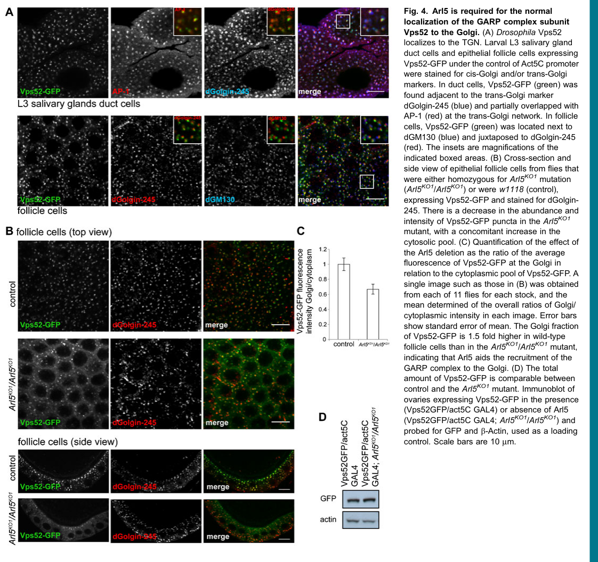

## Question

# Gene Research for Functional Annotation

## ⚠️ CRITICAL: Gene/Protein Identification Context

**BEFORE YOU BEGIN RESEARCH:** You MUST verify you are researching the CORRECT gene/protein. Gene symbols can be ambiguous, especially for less well-characterized genes from non-model organisms.

### Target Gene/Protein Identity (from UniProt):
- **UniProt Accession:** Q9VMQ8
- **Protein Description:** RecName: Full=Vacuolar protein sorting-associated protein 52 homolog {ECO:0000256|ARBA:ARBA00017083};
- **Gene Information:** Name=Vps52 {ECO:0000313|EMBL:AAF52254.1, ECO:0000313|FlyBase:FBgn0031710}; Synonyms=Dmel\CG7371 {ECO:0000313|EMBL:AAF52254.1}; ORFNames=CG7371 {ECO:0000313|EMBL:AAF52254.1, ECO:0000313|FlyBase:FBgn0031710}, Dmel_CG7371 {ECO:0000313|EMBL:AAF52254.1};
- **Organism (full):** Drosophila melanogaster (Fruit fly).
- **Protein Family:** Belongs to the VPS52 family.
- **Key Domains:** Vps52. (IPR007258); Vps52_C. (IPR048361); Vps52_CC. (IPR048319); Vps52_C (PF20655); Vps52_CC (PF04129)

### MANDATORY VERIFICATION STEPS:

1. **Check if the gene symbol "Vps52" matches the protein description above**
2. **Verify the organism is correct:** Drosophila melanogaster (Fruit fly).
3. **Check if protein family/domains align with what you find in literature**
4. **If you find literature for a DIFFERENT gene with the same or similar symbol, STOP**

### If Gene Symbol is Ambiguous or You Cannot Find Relevant Literature:

**DO NOT PROCEED WITH RESEARCH ON A DIFFERENT GENE.** Instead:
- State clearly: "The gene symbol 'Vps52' is ambiguous or literature is limited for this specific protein"
- Explain what you found (e.g., "Found extensive literature on a different gene with the same symbol in a different organism")
- Describe the protein based ONLY on the UniProt information provided above
- Suggest that the protein function can be inferred from domain/family information

### Research Target:

Please provide a comprehensive research report on the gene **Vps52** (gene ID: Vps52, UniProt: Q9VMQ8) in DROME.

The research report should be a detailed narrative explaining the function, biological processes, and localization of the gene product. Citations should be given for all claims.

You should prioritize authoritative reviews and primary scientific literature when conducting research. You can supplement
this with annotations you find in gene/protein databases, but these can be outdated or inaccurate.

We are specifically interested in the primary function of the gene - for enzymes, what reaction is catalyzed, and what is the substrate specificity? For transporters, what is the substrate? For structural proteins or adapters, what is the broader structural role? For signaling molecules, what is the role in the pathway.

We are interested in where in or outside the cell the gene product carries out its function.

We are also interested in the signaling or biochemical pathways in which the gene functions. We are less interested in broad pleiotropic effects, except where these elucidate the precise role.

Include evidence where possible. We are interested in both experimental evidence as well as inference from structure, evolution, or bioinformatic analysis. Precise studies should be prioritized over high-throughput, where available.

## Output

Question: You are an expert researcher providing comprehensive, well-cited information.

Provide detailed information focusing on:
1. Key concepts and definitions with current understanding
2. Recent developments and latest research (prioritize 2023-2024 sources)
3. Current applications and real-world implementations
4. Expert opinions and analysis from authoritative sources
5. Relevant statistics and data from recent studies

Format as a comprehensive research report with proper citations. Include URLs and publication dates where available.
Always prioritize recent, authoritative sources and provide specific citations for all major claims.

# Gene Research for Functional Annotation

## ⚠️ CRITICAL: Gene/Protein Identification Context

**BEFORE YOU BEGIN RESEARCH:** You MUST verify you are researching the CORRECT gene/protein. Gene symbols can be ambiguous, especially for less well-characterized genes from non-model organisms.

### Target Gene/Protein Identity (from UniProt):
- **UniProt Accession:** Q9VMQ8
- **Protein Description:** RecName: Full=Vacuolar protein sorting-associated protein 52 homolog {ECO:0000256|ARBA:ARBA00017083};
- **Gene Information:** Name=Vps52 {ECO:0000313|EMBL:AAF52254.1, ECO:0000313|FlyBase:FBgn0031710}; Synonyms=Dmel\CG7371 {ECO:0000313|EMBL:AAF52254.1}; ORFNames=CG7371 {ECO:0000313|EMBL:AAF52254.1, ECO:0000313|FlyBase:FBgn0031710}, Dmel_CG7371 {ECO:0000313|EMBL:AAF52254.1};
- **Organism (full):** Drosophila melanogaster (Fruit fly).
- **Protein Family:** Belongs to the VPS52 family.
- **Key Domains:** Vps52. (IPR007258); Vps52_C. (IPR048361); Vps52_CC. (IPR048319); Vps52_C (PF20655); Vps52_CC (PF04129)

### MANDATORY VERIFICATION STEPS:

1. **Check if the gene symbol "Vps52" matches the protein description above**
2. **Verify the organism is correct:** Drosophila melanogaster (Fruit fly).
3. **Check if protein family/domains align with what you find in literature**
4. **If you find literature for a DIFFERENT gene with the same or similar symbol, STOP**

### If Gene Symbol is Ambiguous or You Cannot Find Relevant Literature:

**DO NOT PROCEED WITH RESEARCH ON A DIFFERENT GENE.** Instead:
- State clearly: "The gene symbol 'Vps52' is ambiguous or literature is limited for this specific protein"
- Explain what you found (e.g., "Found extensive literature on a different gene with the same symbol in a different organism")
- Describe the protein based ONLY on the UniProt information provided above
- Suggest that the protein function can be inferred from domain/family information

### Research Target:

Please provide a comprehensive research report on the gene **Vps52** (gene ID: Vps52, UniProt: Q9VMQ8) in DROME.

The research report should be a detailed narrative explaining the function, biological processes, and localization of the gene product. Citations should be given for all claims.

You should prioritize authoritative reviews and primary scientific literature when conducting research. You can supplement
this with annotations you find in gene/protein databases, but these can be outdated or inaccurate.

We are specifically interested in the primary function of the gene - for enzymes, what reaction is catalyzed, and what is the substrate specificity? For transporters, what is the substrate? For structural proteins or adapters, what is the broader structural role? For signaling molecules, what is the role in the pathway.

We are interested in where in or outside the cell the gene product carries out its function.

We are also interested in the signaling or biochemical pathways in which the gene functions. We are less interested in broad pleiotropic effects, except where these elucidate the precise role.

Include evidence where possible. We are interested in both experimental evidence as well as inference from structure, evolution, or bioinformatic analysis. Precise studies should be prioritized over high-throughput, where available.

# Functional annotation of *Drosophila melanogaster* Vps52 (Q9VMQ8)

## Identity and principal function

**The target is the fruit-fly protein Vps52, encoded by *Vps52/CG7371*, not the similarly named Vps54 (“scattered”) or a mammalian VPS52 protein.** A fly biochemical study explicitly identifies CG7371 as Vps52 and recovers it with the other three fly Golgi-associated retrograde protein (**GARP**) subunits: Vps51/CG15087, Vps53/CG3338 and Vps54/CG3766. This independently confirms the gene–protein identity supplied for UniProt [Q9VMQ8](https://www.uniprot.org/uniprotkb/Q9VMQ8/entry). (rosaferreira2015thesmallg pages 3-5)

**Best-supported molecular annotation:** Vps52 is a **nonenzymatic subunit of a multisubunit membrane tether**. GARP helps capture endosome-derived transport carriers at the *trans*-Golgi network (TGN) and promotes their subsequent SNARE-dependent fusion. Vps52 is therefore neither an enzyme with a catalytic reaction nor a transporter with a molecular substrate: its relevant “cargo” comprises membrane carriers bearing proteins and lipids, rather than a molecule selectively transported through Vps52 itself. Vps52 is also a conserved shared subunit of the related endosome-associated recycling protein (**EARP**) complex, which participates in endocytic recycling. The supplied VPS52, VPS52_C and coiled-coil domain assignments are consistent with this scaffold/tether classification; they do not establish a catalytic activity or, by themselves, identify fly-specific binding sites. (rosaferreira2015thesmallg pages 1-2, khakurel2023roleofgarp pages 1-2, o’brien2022thegarpcomplex pages 1-2)

The evidence for this annotation differs substantially by experiment and organism:

| Finding | System / method | Functional inference for Q9VMQ8 (CG7371/Vps52) | Evidence strength and caveat |
|---|---|---|---|
| **Identity and GARP membership:** CG7371 was explicitly identified as fly Vps52 and recovered with Vps51/CG15087, Vps53/CG3338 and Vps54/CG3766 in GTP-Arl5 affinity purifications. | *D. melanogaster* adult-head lysate with GST–Arl5 affinity chromatography and S2-cell cytosol with Arl5-coated liposomes; tandem mass spectrometry. Rosa-Ferreira et al., published 18 March 2015, [DOI](https://doi.org/10.1242/bio.201410975). (rosaferreira2015thesmallg pages 3-5) | Directly supports Q9VMQ8 as a subunit of the fly GARP tether and links the complex to activated Arl5. | **Strong, direct fly evidence**, but the assays recovered the complex and do not prove direct binary binding between Arl5 and Vps52. The alternative Vps54L-containing complex was not detected in these purifications. |
| **TGN localization:** Vps52–GFP formed Golgi-like puncta, partially overlapped AP-1 and dGolgin-245, and lay adjacent to cis-Golgi dGM130. | Act5C-driven Vps52–GFP imaging in fly larval salivary-gland duct and ovarian follicle cells. Rosa-Ferreira et al., 18 March 2015, [DOI](https://doi.org/10.1242/bio.201410975). (rosaferreira2015thesmallg pages 3-5, rosaferreira2015thesmallg pages 5-6, rosaferreira2015thesmallg media 6a5abf11) | Places fly Vps52-containing GARP principally on the cytosolic face of the trans-Golgi/TGN, consistent with tethering endosome-derived carriers there. | **Strong localization evidence**, although the tagged protein was exogenously expressed rather than imaged from the endogenous locus. |
| **Arl5-dependent recruitment:** the Golgi-to-cytoplasmic Vps52–GFP intensity ratio was about **1.5-fold higher in wild type** than in *Arl5* null cells; total Vps52–GFP abundance was comparable. | Quantitative fluorescence in follicle cells from **11 flies per genotype**, plus ovarian immunoblotting. Rosa-Ferreira et al., 18 March 2015, [DOI](https://doi.org/10.1242/bio.201410975). (rosaferreira2015thesmallg pages 5-6, rosaferreira2015thesmallg media 6a5abf11) | Arl5 promotes membrane recruitment or retention of the Vps52-containing GARP complex at the TGN rather than controlling Vps52 abundance. | **Strong direct fly evidence** for localization control; Arl5 loss only partially delocalized Vps52, implying additional recruitment determinants. |
| **Developmental and lipid phenotypes of related complex components:** Vps53 loss impaired adult dendrite regrowth; Vps54 loss caused TGN sterol accumulation and late-endosome/lysosome defects; Vps50 loss produced distinct EARP-associated phenotypes. | Fly CRISPR knockouts, MARCM clones, neuron-specific rescue, organelle markers and filipin staining. O’Brien et al., online 31 October 2022; *J. Cell Biol.* 2023 issue, [DOI](https://doi.org/10.1083/jcb.202112108). (o’brien2022thegarpcomplex pages 2-4, o’brien2022thegarpcomplex pages 4-6, o’brien2022thegarpcomplex pages 6-8, o’brien2022thegarpcomplex pages 8-10, o’brien2022thegarpcomplex pages 1-2) | Supports physiological roles for the Vps52-containing GARP/EARP architecture in neuronal remodeling and for GARP specifically in TGN lipid homeostasis. | **Indirect for Vps52:** these decisive experiments targeted shared Vps53 or complex-specific Vps54/Vps50, not a Vps52 knockout. Their phenotypes must not be attributed directly to Q9VMQ8. |
| **Vps52 RNAi did not yield a reported significant dendrite phenotype:** only Vps50 RNAi/Df (*P*=0.0217), Vps54 RNAi/Df (*P*=0.0238) and Vps53 RNAi/Df (*P*<0.0001) differed from control; remaining comparisons, which include Vps52 RNAi/Df, had *P*>0.31. | ppk-Gal4-driven RNAi in a heterozygous deficiency background; adult c4da dendrite length, **n=7–13 neurons/genotype**. O’Brien et al., online 31 October 2022; 2023 issue, [DOI](https://doi.org/10.1083/jcb.202112108). (o’brien2022thegarpcomplex pages 18-21) | This experiment does **not** establish a fly Vps52 loss-of-function phenotype. | **Negative/inconclusive evidence:** RNAi efficiency for Vps52 was not established in the cited result, so lack of significance cannot demonstrate dispensability. |
| **EARP membership and recycling function:** VPS52 is shared with VPS51/VPS53 between GARP and EARP; VPS50 replaces VPS54 in EARP, which localizes to recycling endosomes and supports receptor recycling. | Primarily mammalian-cell depletion, localization and transferrin-recycling assays; Schindler et al., published 30 March 2015, [DOI](https://doi.org/10.1038/ncb3129); reviewed 23 March 2023, [DOI](https://doi.org/10.3390/ijms24076069). (khakurel2023roleofgarp pages 2-4, khakurel2023roleofgarp pages 1-2) | By conserved complex composition, fly Vps52 is likely a shared structural subunit of both GARP and EARP, functioning at the TGN or recycling endosomes according to the fourth subunit. | **Moderate, cross-species inference:** EARP biochemistry is strong in mammalian cells, but it does not by itself prove every cargo or interaction for fly Q9VMQ8. |
| **RAB14 recruits EARP:** activated RAB14 preferentially associated with VPS50-containing EARP; RAB14 knockout dispersed VPS50 and perturbed VAMP3 and syntaxin-6 localization. | Human HeLa-cell APEX2 proteomics, proximity ligation, co-immunoprecipitation and knockout. Gaudreault/St-Laurent et al., preprint posted 6 November 2024, [DOI](https://doi.org/10.1101/2024.11.05.621850). (stlaurent2024aproximitymap pages 11-15, stlaurent2024aproximitymap pages 15-18) | Updates the model of EARP recruitment and suggests a potential small-GTPase control mechanism relevant to VPS52-containing EARP. | **Recent but indirect and initially preprint evidence:** human-cell result, not tested for fly Vps52; it should not be presented as a demonstrated Q9VMQ8 interaction. |
| **GARP structural topology:** GARP is an obligate 1:1:1:1 CATCHR complex with an N-terminal assembly core and elongated C-terminal arms; yeast mapping assigns Vps52 to the shortest arm. The open complex can span roughly **35 nm** and accommodate **50–60-nm** carriers. | Yeast purified-complex negative-stain EM, double-GFP mapping and comparative structural modeling, summarized by Khakurel and Lupashin, published 23 March 2023, [DOI](https://doi.org/10.3390/ijms24076069). (khakurel2023roleofgarp pages 2-4, khakurel2023roleofgarp pages 1-2) | Provides a structural explanation for Vps52 as a nonenzymatic scaffold within a long-range vesicle-tethering platform. | **Moderate, homolog-based inference:** topology is based chiefly on yeast and predicted human structures; no experimental atomic structure of fly Q9VMQ8 or intact fly GARP was reported. |

*Table: Direct fly evidence establishes CG7371/Vps52 as an Arl5-regulated TGN-associated GARP subunit. Complex-level, mammalian and yeast findings refine its likely roles but remain indirect for Q9VMQ8.*

## Where Vps52 acts and how it is recruited

The clearest **direct fly localization experiment** expressed Vps52–GFP in larval salivary-gland duct cells and ovarian follicle cells. Its puncta partially overlapped the TGN-associated markers AP-1 and dGolgin-245 and were separated from the cis-Golgi marker dGM130. These observations place a substantial pool of fly Vps52 at or immediately alongside the TGN; they image an expressed fusion protein, not endogenous-locus-tagged Vps52. Figure 4 provides the localization and recruitment comparisons. Rosa-Ferreira *et al.*, *Biology Open*, **2015**, [doi:10.1242/bio.201410975](https://doi.org/10.1242/bio.201410975). (rosaferreira2015thesmallg pages 3-5, rosaferreira2015thesmallg pages 5-6, rosaferreira2015thesmallg media 6a5abf11)

In that study, two independent affinity-purification approaches—GTP- versus GDP-state Arl5 applied to adult-fly-head extracts and Arl5-coated liposomes applied to S2-cell extracts—enriched GARP subunits, including CG7371/Vps52, with **active Arl5**. Removing *Arl5* reduced Golgi-associated Vps52–GFP and increased its cytoplasmic pool without appreciably changing total Vps52–GFP. The Golgi-to-cytoplasm fluorescence ratio was approximately **1.5 times higher in controls than in *Arl5* mutants**, measured using images from **11 flies per genotype**. Thus Arl5 aids GARP recruitment or retention at the TGN, although these complex-level pulldowns do **not** show that Arl5 binds Vps52 directly. Rosa-Ferreira *et al.*, **2015**, [doi:10.1242/bio.201410975](https://doi.org/10.1242/bio.201410975). (rosaferreira2015thesmallg pages 3-5, rosaferreira2015thesmallg pages 5-6, rosaferreira2015thesmallg media 6a5abf11)

GARP is described in a **2023 specialist review** as a peripheral complex on the **cytosolic face of the TGN**. It contains VPS51–VPS54; EARP replaces VPS54 with VPS50 while retaining VPS51–VPS53, including VPS52, and is associated principally with recycling endosomes. Accordingly, a Vps52 signal alone need not identify which complex contains it. The direct fly imaging above most securely establishes the **GARP-associated TGN pool**; assigning every putative fly endosomal Vps52 punctum to EARP would require complex-specific evidence. Khakurel and Lupashin, *International Journal of Molecular Sciences*, published **23 March 2023**, [doi:10.3390/ijms24076069](https://doi.org/10.3390/ijms24076069). (khakurel2023roleofgarp pages 2-4, khakurel2023roleofgarp pages 1-2, o’brien2022thegarpcomplex pages 1-2)

## Mechanism, pathways and cargo

At the pathway level, **GARP acts downstream of carrier formation in retrograde endosome-to-TGN traffic**: a tether brings an incoming membrane carrier near the destination membrane so that compatible SNAREs can mediate fusion. In other species, GARP associates with Golgi SNARE machinery, including the STX16/STX6/VTI1A/VAMP4 ensemble in human cells; yeast Vps51 and human VPS51 have characterized syntaxin interactions. These studies clarify *complex-level* action, but they do not assign a SNARE-binding interface or a catalytic step specifically to fly Vps52. Khakurel and Lupashin, **2023**, [doi:10.3390/ijms24076069](https://doi.org/10.3390/ijms24076069). (rosaferreira2015thesmallg pages 1-2, khakurel2023roleofgarp pages 4-5, o’brien2022thegarpcomplex pages 1-2)

Structural work in yeast, summarized in that review, portrays GARP as a **1:1:1:1, elongated CATCHR-family assembly**, with an amino-terminal assembly region and projecting carboxy-terminal arms; structural mapping assigns yeast Vps52 to its shortest arm. An open arrangement extending up to approximately **35 nm** has been proposed to help dock **50–60-nm** trafficking intermediates. This provides a plausible structural rationale for fly Vps52’s scaffold role, **not** a measured structure or carrier-size specificity for Q9VMQ8. Khakurel and Lupashin, **2023**, [doi:10.3390/ijms24076069](https://doi.org/10.3390/ijms24076069). (khakurel2023roleofgarp pages 2-4, khakurel2023roleofgarp pages 1-2)

Physiological cargo should likewise be attributed to the appropriate experimental system. Human GARP/VPS52 depletion disrupts mannose-6-phosphate-receptor-dependent delivery of cathepsin D to lysosomes; mammalian EARP participates in transferrin-receptor recycling; and worm EARP/VPS-52 has been linked to dense-core-vesicle cargo sorting. These examples identify **plausible conserved pathway classes**, not experimentally established substrates of fly Q9VMQ8. Pérez-Victoria *et al.*, *Molecular Biology of the Cell*, **2008**, [doi:10.1091/mbc.e07-11-1189](https://doi.org/10.1091/mbc.e07-11-1189); Schindler *et al.*, *Nature Cell Biology*, **2015**, [doi:10.1038/ncb3129](https://doi.org/10.1038/ncb3129); Topalidou *et al.*, *PLOS Genetics*, **2016**, [doi:10.1371/journal.pgen.1006074](https://doi.org/10.1371/journal.pgen.1006074). (rosaferreira2015thesmallg pages 1-2, topalidou2016theearpcomplex pages 15-16, topalidou2016theearpcomplex pages 8-10, khakurel2023roleofgarp pages 1-2)

## Fly physiology: informative complex-level evidence, not a Vps52 knockout result

The most informative recent fly work is O’Brien *et al.*, **published online in 2022 and appearing in the 2023 volume** of *Journal of Cell Biology*, [doi:10.1083/jcb.202112108](https://doi.org/10.1083/jcb.202112108). The investigators knocked out the **shared subunit Vps53**, the **GARP-specific Vps54** or the **EARP-specific Vps50** and examined sensory-neuron dendrites during developmental remodeling. Vps53-null clonal neurons had adult dendritic arbors approximately **one-third the length** of controls; loss of either complex-specific subunit impaired dendrite regrowth, more strongly for Vps54. Cell-specific restoration of the corresponding subunits supported a neuronal requirement. These are compelling data for roles of the **complexes**, but the knockouts were **not of Vps52**. (o’brien2022thegarpcomplex pages 2-4, o’brien2022thegarpcomplex pages 4-6, o’brien2022thegarpcomplex pages 1-2)

The same study distinguishes a **GARP-dependent lipid-homeostasis phenotype** from an EARP-associated one: in Vps54-null neurons, free-sterol staining increased at **Golgin245-positive TGN structures**, rather than significantly increasing in the assayed Rab7-positive late endosomes; Vps50-null neurons did not show the same sterol phenotype. Reducing *Osbp* gene dose rescued TGN-associated sterol staining and improved dendrite morphology, whereas *Osbp* overexpression worsened dendrite morphology despite also decreasing measured sterol staining. The results implicate a **TGN trafficking–lipid-homeostasis relationship**, but do not demonstrate that Vps52 directly binds or transports sterol, establish the precise sterol-transfer route, or prove that sterol accumulation alone causes the developmental defect. O’Brien *et al.*, **2022 online/2023 issue**, [doi:10.1083/jcb.202112108](https://doi.org/10.1083/jcb.202112108). (o’brien2022thegarpcomplex pages 6-8, o’brien2022thegarpcomplex pages 8-10, o’brien2022thegarpcomplex pages 10-12)

An important negative qualification concerns **Vps52 itself**. Although the fly study lists a *Vps52* RNAi reagent, its supplemental adult-dendrite comparison reports significance for Vps50 RNAi/deficiency (*P*=0.0217), Vps54 RNAi/deficiency (*P*=0.0238) and Vps53 RNAi/deficiency (*P*<0.0001), while **remaining comparisons had *P*>0.31** (**7–13 neurons per genotype**). Thus these data do **not** establish a significant Vps52 RNAi dendrite phenotype; nor does this negative result demonstrate that Vps52 is dispensable, particularly without an established effective depletion measurement for that comparison. O’Brien *et al.*, supplemental Fig. S2, **2022 online/2023 issue**, [doi:10.1083/jcb.202112108](https://doi.org/10.1083/jcb.202112108). (o’brien2022thegarpcomplex pages 18-21)

## Research developments and practical relevance

The **2023 GARP review** cautions that the complete structure and full molecular mechanism remain unresolved, despite substantial evidence for tethering and promotion of fusion; this is an appropriate limit on the precision of any Vps52 functional annotation. A **November 2024 human-cell preprint**, subsequently published in 2025, further reported that activated **RAB14 preferentially associates with VPS50-containing EARP** and that RAB14 deletion disperses VPS50 from endosomal structures without a comparable change in VPS54 localization. This extends the recruitment model for VPS52-containing **human EARP** but is **not evidence that RAB14 binds fly Q9VMQ8 or recruits fly GARP**. Khakurel and Lupashin, **2023**, [doi:10.3390/ijms24076069](https://doi.org/10.3390/ijms24076069); St-Laurent/Gaudreault *et al.*, bioRxiv posted **6 November 2024**, [doi:10.1101/2024.11.05.621850](https://doi.org/10.1101/2024.11.05.621850). (khakurel2023roleofgarp pages 1-2, stlaurent2024aproximitymap pages 11-15, stlaurent2024aproximitymap pages 15-18)

**Current implementation is experimental rather than clinical:** fly Vps52–GFP, *Arl5* genetics, complex-specific fly knockouts and neuronal imaging provide tractable systems for testing Golgi recruitment, membrane traffic and developmental lipid phenotypes. No therapeutic application or clinical trial for *Drosophila Vps52* follows from these data. The central remaining experimental gap is a well-validated **fly *Vps52* loss-of-function and rescue analysis** that separates its GARP and EARP pools and measures specific trafficking cargos. (rosaferreira2015thesmallg pages 3-5, o’brien2022thegarpcomplex pages 2-4, rosaferreira2015thesmallg pages 5-6, o’brien2022thegarpcomplex pages 18-21)

**Conclusion.** Q9VMQ8/CG7371 is best annotated as a **cytosolic-face membrane-tether complex subunit**: directly observed in an Arl5-regulated TGN-associated fly GARP pool and, by conserved complex architecture, likely also participating in endosomal EARP. Retrograde carrier tethering is the most securely supported primary role; EARP-mediated recycling and neuron-specific lipid and morphology effects should remain explicitly marked as complex-level or cross-species inferences until verified by fly Vps52-specific experiments. (rosaferreira2015thesmallg pages 3-5, khakurel2023roleofgarp pages 1-2, o’brien2022thegarpcomplex pages 1-2, o’brien2022thegarpcomplex pages 18-21)

References

1. (rosaferreira2015thesmallg pages 3-5): Cláudia Rosa-Ferreira, Chantal Christis, Isabel L. Torres, and Sean Munro. The small g protein arl5 contributes to endosome-to-golgi traffic by aiding the recruitment of the garp complex to the golgi. Biology Open, 4:474-481, Mar 2015. URL: https://doi.org/10.1242/bio.201410975, doi:10.1242/bio.201410975. This article has 40 citations and is from a peer-reviewed journal.

2. (rosaferreira2015thesmallg pages 1-2): Cláudia Rosa-Ferreira, Chantal Christis, Isabel L. Torres, and Sean Munro. The small g protein arl5 contributes to endosome-to-golgi traffic by aiding the recruitment of the garp complex to the golgi. Biology Open, 4:474-481, Mar 2015. URL: https://doi.org/10.1242/bio.201410975, doi:10.1242/bio.201410975. This article has 40 citations and is from a peer-reviewed journal.

3. (khakurel2023roleofgarp pages 1-2): Amrita Khakurel and Vladimir V. Lupashin. Role of garp vesicle tethering complex in golgi physiology. International Journal of Molecular Sciences, 24:6069, Mar 2023. URL: https://doi.org/10.3390/ijms24076069, doi:10.3390/ijms24076069. This article has 25 citations.

4. (o’brien2022thegarpcomplex pages 1-2): Caitlin E. O’Brien, Susan H. Younger, Lily Yeh Jan, and Yuh Nung Jan. The garp complex prevents sterol accumulation at the trans-golgi network during dendrite remodeling. Journal of Cell Biology, Oct 2022. URL: https://doi.org/10.1083/jcb.202112108, doi:10.1083/jcb.202112108. This article has 12 citations and is from a highest quality peer-reviewed journal.

5. (rosaferreira2015thesmallg pages 5-6): Cláudia Rosa-Ferreira, Chantal Christis, Isabel L. Torres, and Sean Munro. The small g protein arl5 contributes to endosome-to-golgi traffic by aiding the recruitment of the garp complex to the golgi. Biology Open, 4:474-481, Mar 2015. URL: https://doi.org/10.1242/bio.201410975, doi:10.1242/bio.201410975. This article has 40 citations and is from a peer-reviewed journal.

6. (rosaferreira2015thesmallg media 6a5abf11): Cláudia Rosa-Ferreira, Chantal Christis, Isabel L. Torres, and Sean Munro. The small g protein arl5 contributes to endosome-to-golgi traffic by aiding the recruitment of the garp complex to the golgi. Biology Open, 4:474-481, Mar 2015. URL: https://doi.org/10.1242/bio.201410975, doi:10.1242/bio.201410975. This article has 40 citations and is from a peer-reviewed journal.

7. (o’brien2022thegarpcomplex pages 2-4): Caitlin E. O’Brien, Susan H. Younger, Lily Yeh Jan, and Yuh Nung Jan. The garp complex prevents sterol accumulation at the trans-golgi network during dendrite remodeling. Journal of Cell Biology, Oct 2022. URL: https://doi.org/10.1083/jcb.202112108, doi:10.1083/jcb.202112108. This article has 12 citations and is from a highest quality peer-reviewed journal.

8. (o’brien2022thegarpcomplex pages 4-6): Caitlin E. O’Brien, Susan H. Younger, Lily Yeh Jan, and Yuh Nung Jan. The garp complex prevents sterol accumulation at the trans-golgi network during dendrite remodeling. Journal of Cell Biology, Oct 2022. URL: https://doi.org/10.1083/jcb.202112108, doi:10.1083/jcb.202112108. This article has 12 citations and is from a highest quality peer-reviewed journal.

9. (o’brien2022thegarpcomplex pages 6-8): Caitlin E. O’Brien, Susan H. Younger, Lily Yeh Jan, and Yuh Nung Jan. The garp complex prevents sterol accumulation at the trans-golgi network during dendrite remodeling. Journal of Cell Biology, Oct 2022. URL: https://doi.org/10.1083/jcb.202112108, doi:10.1083/jcb.202112108. This article has 12 citations and is from a highest quality peer-reviewed journal.

10. (o’brien2022thegarpcomplex pages 8-10): Caitlin E. O’Brien, Susan H. Younger, Lily Yeh Jan, and Yuh Nung Jan. The garp complex prevents sterol accumulation at the trans-golgi network during dendrite remodeling. Journal of Cell Biology, Oct 2022. URL: https://doi.org/10.1083/jcb.202112108, doi:10.1083/jcb.202112108. This article has 12 citations and is from a highest quality peer-reviewed journal.

11. (o’brien2022thegarpcomplex pages 18-21): Caitlin E. O’Brien, Susan H. Younger, Lily Yeh Jan, and Yuh Nung Jan. The garp complex prevents sterol accumulation at the trans-golgi network during dendrite remodeling. Journal of Cell Biology, Oct 2022. URL: https://doi.org/10.1083/jcb.202112108, doi:10.1083/jcb.202112108. This article has 12 citations and is from a highest quality peer-reviewed journal.

12. (khakurel2023roleofgarp pages 2-4): Amrita Khakurel and Vladimir V. Lupashin. Role of garp vesicle tethering complex in golgi physiology. International Journal of Molecular Sciences, 24:6069, Mar 2023. URL: https://doi.org/10.3390/ijms24076069, doi:10.3390/ijms24076069. This article has 25 citations.

13. (stlaurent2024aproximitymap pages 11-15): Véronique Gaudeault St-Laurent, Benoit Marchand, Raphaëlle Larcher, Sonya Nassari, Francis Bourassa, Mathilde Moreau, Dominique Jean, François-Michel Boisvert, Marie A. Brunet, and Steve Jean. A proximity map of rab gtpases. bioRxiv, Nov 2024. URL: https://doi.org/10.1101/2024.11.05.621850, doi:10.1101/2024.11.05.621850. This article has 0 citations.

14. (stlaurent2024aproximitymap pages 15-18): Véronique Gaudeault St-Laurent, Benoit Marchand, Raphaëlle Larcher, Sonya Nassari, Francis Bourassa, Mathilde Moreau, Dominique Jean, François-Michel Boisvert, Marie A. Brunet, and Steve Jean. A proximity map of rab gtpases. bioRxiv, Nov 2024. URL: https://doi.org/10.1101/2024.11.05.621850, doi:10.1101/2024.11.05.621850. This article has 0 citations.

15. (khakurel2023roleofgarp pages 4-5): Amrita Khakurel and Vladimir V. Lupashin. Role of garp vesicle tethering complex in golgi physiology. International Journal of Molecular Sciences, 24:6069, Mar 2023. URL: https://doi.org/10.3390/ijms24076069, doi:10.3390/ijms24076069. This article has 25 citations.

16. (topalidou2016theearpcomplex pages 15-16): Irini Topalidou, Jérôme Cattin-Ortolá, Andrea L. Pappas, Kirsten Cooper, Gennifer E. Merrihew, Michael J. MacCoss, and Michael Ailion. The earp complex and its interactor eipr-1 are required for cargo sorting to dense-core vesicles. PLOS Genetics, 12:e1006074, May 2016. URL: https://doi.org/10.1371/journal.pgen.1006074, doi:10.1371/journal.pgen.1006074. This article has 68 citations and is from a domain leading peer-reviewed journal.

17. (topalidou2016theearpcomplex pages 8-10): Irini Topalidou, Jérôme Cattin-Ortolá, Andrea L. Pappas, Kirsten Cooper, Gennifer E. Merrihew, Michael J. MacCoss, and Michael Ailion. The earp complex and its interactor eipr-1 are required for cargo sorting to dense-core vesicles. PLOS Genetics, 12:e1006074, May 2016. URL: https://doi.org/10.1371/journal.pgen.1006074, doi:10.1371/journal.pgen.1006074. This article has 68 citations and is from a domain leading peer-reviewed journal.

18. (o’brien2022thegarpcomplex pages 10-12): Caitlin E. O’Brien, Susan H. Younger, Lily Yeh Jan, and Yuh Nung Jan. The garp complex prevents sterol accumulation at the trans-golgi network during dendrite remodeling. Journal of Cell Biology, Oct 2022. URL: https://doi.org/10.1083/jcb.202112108, doi:10.1083/jcb.202112108. This article has 12 citations and is from a highest quality peer-reviewed journal.

## Artifacts

- [Edison artifact artifact-00](Vps52-deep-research-falcon_artifacts/artifact-00.md)

## Citations

1. rosaferreira2015thesmallg pages 3-5
2. rosaferreira2015thesmallg pages 1-2
3. khakurel2023roleofgarp pages 1-2
4. rosaferreira2015thesmallg pages 5-6
5. khakurel2023roleofgarp pages 2-4
6. stlaurent2024aproximitymap pages 11-15
7. stlaurent2024aproximitymap pages 15-18
8. khakurel2023roleofgarp pages 4-5
9. topalidou2016theearpcomplex pages 15-16
10. topalidou2016theearpcomplex pages 8-10
11. Q9VMQ8
12. DOI
13. doi:10.1242/bio.201410975
14. doi:10.3390/ijms24076069
15. doi:10.1091/mbc.e07-11-1189
16. doi:10.1038/ncb3129
17. doi:10.1371/journal.pgen.1006074
18. doi:10.1083/jcb.202112108
19. doi:10.1101/2024.11.05.621850
20. https://www.uniprot.org/uniprotkb/Q9VMQ8/entry
21. https://doi.org/10.1242/bio.201410975
22. https://doi.org/10.1083/jcb.202112108
23. https://doi.org/10.1038/ncb3129
24. https://doi.org/10.3390/ijms24076069
25. https://doi.org/10.1101/2024.11.05.621850
26. https://doi.org/10.1091/mbc.e07-11-1189
27. https://doi.org/10.1371/journal.pgen.1006074
28. https://doi.org/10.1242/bio.201410975,
29. https://doi.org/10.3390/ijms24076069,
30. https://doi.org/10.1083/jcb.202112108,
31. https://doi.org/10.1101/2024.11.05.621850,
32. https://doi.org/10.1371/journal.pgen.1006074,