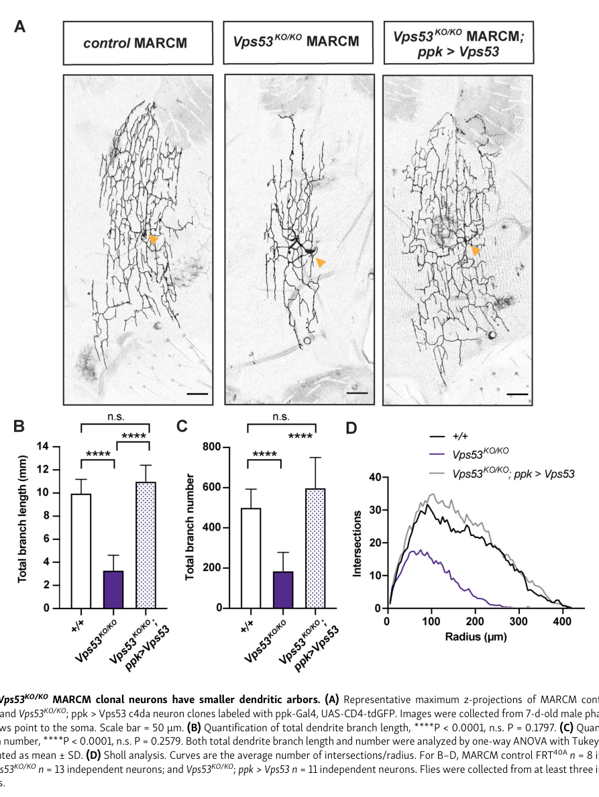

## Question

# Gene Research for Functional Annotation

## ⚠️ CRITICAL: Gene/Protein Identification Context

**BEFORE YOU BEGIN RESEARCH:** You MUST verify you are researching the CORRECT gene/protein. Gene symbols can be ambiguous, especially for less well-characterized genes from non-model organisms.

### Target Gene/Protein Identity (from UniProt):
- **UniProt Accession:** Q9VQY8
- **Protein Description:** RecName: Full=Vacuolar protein sorting-associated protein 53 homolog {ECO:0000256|ARBA:ARBA00014103};
- **Gene Information:** Name=Vps53 {ECO:0000313|EMBL:AAF51022.2, ECO:0000313|FlyBase:FBgn0031598}; Synonyms=Dmel\CG3338 {ECO:0000313|EMBL:AAF51022.2}; ORFNames=CG3338 {ECO:0000313|EMBL:AAF51022.2, ECO:0000313|FlyBase:FBgn0031598}, Dmel_CG3338 {ECO:0000313|EMBL:AAF51022.2};
- **Organism (full):** Drosophila melanogaster (Fruit fly).
- **Protein Family:** Belongs to the VPS53 family.
- **Key Domains:** Vps53. (IPR039766); Vps53_C. (IPR031745); Vps53_C_sf. (IPR038260); Vps53_N. (IPR007234); VPS53_C (PF16854)

### MANDATORY VERIFICATION STEPS:

1. **Check if the gene symbol "Vps53" matches the protein description above**
2. **Verify the organism is correct:** Drosophila melanogaster (Fruit fly).
3. **Check if protein family/domains align with what you find in literature**
4. **If you find literature for a DIFFERENT gene with the same or similar symbol, STOP**

### If Gene Symbol is Ambiguous or You Cannot Find Relevant Literature:

**DO NOT PROCEED WITH RESEARCH ON A DIFFERENT GENE.** Instead:
- State clearly: "The gene symbol 'Vps53' is ambiguous or literature is limited for this specific protein"
- Explain what you found (e.g., "Found extensive literature on a different gene with the same symbol in a different organism")
- Describe the protein based ONLY on the UniProt information provided above
- Suggest that the protein function can be inferred from domain/family information

### Research Target:

Please provide a comprehensive research report on the gene **Vps53** (gene ID: Vps53, UniProt: Q9VQY8) in DROME.

The research report should be a detailed narrative explaining the function, biological processes, and localization of the gene product. Citations should be given for all claims.

You should prioritize authoritative reviews and primary scientific literature when conducting research. You can supplement
this with annotations you find in gene/protein databases, but these can be outdated or inaccurate.

We are specifically interested in the primary function of the gene - for enzymes, what reaction is catalyzed, and what is the substrate specificity? For transporters, what is the substrate? For structural proteins or adapters, what is the broader structural role? For signaling molecules, what is the role in the pathway.

We are interested in where in or outside the cell the gene product carries out its function.

We are also interested in the signaling or biochemical pathways in which the gene functions. We are less interested in broad pleiotropic effects, except where these elucidate the precise role.

Include evidence where possible. We are interested in both experimental evidence as well as inference from structure, evolution, or bioinformatic analysis. Precise studies should be prioritized over high-throughput, where available.

## Output

Question: You are an expert researcher providing comprehensive, well-cited information.

Provide detailed information focusing on:
1. Key concepts and definitions with current understanding
2. Recent developments and latest research (prioritize 2023-2024 sources)
3. Current applications and real-world implementations
4. Expert opinions and analysis from authoritative sources
5. Relevant statistics and data from recent studies

Format as a comprehensive research report with proper citations. Include URLs and publication dates where available.
Always prioritize recent, authoritative sources and provide specific citations for all major claims.

# Gene Research for Functional Annotation

## ⚠️ CRITICAL: Gene/Protein Identification Context

**BEFORE YOU BEGIN RESEARCH:** You MUST verify you are researching the CORRECT gene/protein. Gene symbols can be ambiguous, especially for less well-characterized genes from non-model organisms.

### Target Gene/Protein Identity (from UniProt):
- **UniProt Accession:** Q9VQY8
- **Protein Description:** RecName: Full=Vacuolar protein sorting-associated protein 53 homolog {ECO:0000256|ARBA:ARBA00014103};
- **Gene Information:** Name=Vps53 {ECO:0000313|EMBL:AAF51022.2, ECO:0000313|FlyBase:FBgn0031598}; Synonyms=Dmel\CG3338 {ECO:0000313|EMBL:AAF51022.2}; ORFNames=CG3338 {ECO:0000313|EMBL:AAF51022.2, ECO:0000313|FlyBase:FBgn0031598}, Dmel_CG3338 {ECO:0000313|EMBL:AAF51022.2};
- **Organism (full):** Drosophila melanogaster (Fruit fly).
- **Protein Family:** Belongs to the VPS53 family.
- **Key Domains:** Vps53. (IPR039766); Vps53_C. (IPR031745); Vps53_C_sf. (IPR038260); Vps53_N. (IPR007234); VPS53_C (PF16854)

### MANDATORY VERIFICATION STEPS:

1. **Check if the gene symbol "Vps53" matches the protein description above**
2. **Verify the organism is correct:** Drosophila melanogaster (Fruit fly).
3. **Check if protein family/domains align with what you find in literature**
4. **If you find literature for a DIFFERENT gene with the same or similar symbol, STOP**

### If Gene Symbol is Ambiguous or You Cannot Find Relevant Literature:

**DO NOT PROCEED WITH RESEARCH ON A DIFFERENT GENE.** Instead:
- State clearly: "The gene symbol 'Vps53' is ambiguous or literature is limited for this specific protein"
- Explain what you found (e.g., "Found extensive literature on a different gene with the same symbol in a different organism")
- Describe the protein based ONLY on the UniProt information provided above
- Suggest that the protein function can be inferred from domain/family information

### Research Target:

Please provide a comprehensive research report on the gene **Vps53** (gene ID: Vps53, UniProt: Q9VQY8) in DROME.

The research report should be a detailed narrative explaining the function, biological processes, and localization of the gene product. Citations should be given for all claims.

You should prioritize authoritative reviews and primary scientific literature when conducting research. You can supplement
this with annotations you find in gene/protein databases, but these can be outdated or inaccurate.

We are specifically interested in the primary function of the gene - for enzymes, what reaction is catalyzed, and what is the substrate specificity? For transporters, what is the substrate? For structural proteins or adapters, what is the broader structural role? For signaling molecules, what is the role in the pathway.

We are interested in where in or outside the cell the gene product carries out its function.

We are also interested in the signaling or biochemical pathways in which the gene functions. We are less interested in broad pleiotropic effects, except where these elucidate the precise role.

Include evidence where possible. We are interested in both experimental evidence as well as inference from structure, evolution, or bioinformatic analysis. Precise studies should be prioritized over high-throughput, where available.

# Functional annotation of *Drosophila melanogaster Vps53* (Q9VQY8)

## Identity and principal function

The target is **fruit-fly Vps53/CG3338**, not a similarly named VPS protein: a primary *Drosophila* study explicitly identifies CG3338 as Vps53 among the fly GARP-complex subunits. This agrees with the supplied UniProt description, VPS53-family designation, and VPS53 N- and C-terminal domain annotations. The accession **Q9VQY8** and FlyBase identifier **FBgn0031598** are identifiers supplied with the question; the papers examined confirm the fly CG3338–Vps53 identity but do not independently establish those accession mappings. (rosaferreira2015thesmallg pages 3-5, o’brien2022thegarpcomplex pages 2-4, khakurel2023roleofgarp pages 2-4)

**Primary annotation:** Vps53 is a conserved, nonenzymatic subunit shared by two membrane-trafficking complexes. **GARP** comprises Vps51, Vps52, Vps53, and Vps54 and operates principally in endosome-to-*trans*-Golgi-network (TGN) retrograde traffic. **EARP** replaces Vps54 with Vps50 and participates in endosomal recycling. Vps53’s relevant “specificity” is therefore its participation in distinct tethering assemblies and their trafficking routes—not a catalyzed reaction or a demonstrated substrate transported by Vps53 itself. Because both assemblies contain Vps53, its knockout alone cannot separate their individual contributions. (o’brien2022thegarpcomplex pages 1-2, khakurel2023roleofgarp pages 1-2, o’brien2022thegarpcomplex pages 2-4, khakurel2023roleofgarp pages 13-15)

## Molecular role, pathways, and site of action

GARP is a peripheral complex on the **cytosolic face of the TGN**. The prevailing model is that it helps dock endosome-derived carriers and coordinate their SNARE-dependent fusion with this compartment, retrieving cycling proteins such as mannose-6-phosphate receptors and TGN-resident cargo. In other systems, impaired receptor retrieval can consequently disturb delivery of acid hydrolases to lysosomes; this is a downstream effect of trafficking, not evidence that Vps53 itself is a lysosomal enzyme. The 2023 expert review emphasizes an important qualification: the identity and direct capture of specific GARP-bound carriers remain incompletely demonstrated. (khakurel2023roleofgarp pages 7-9, khakurel2023roleofgarp pages 13-15, khakurel2023roleofgarp pages 1-2)

The complexes imply **two intracellular contexts for Vps53**: TGN-associated GARP and endosome-associated EARP, the latter associated with RAB4-positive recycling compartments in characterized mammalian systems. These are assignments from complex composition and localization; the fly neuronal study did **not** directly image endogenous Vps53 in either compartment. No extracellular function is established. In fly salivary-gland and follicle cells, tagged **Vps52**, rather than Vps53, partially overlapped TGN markers, providing complex-level localization evidence. (rosaferreira2015thesmallg pages 3-5, khakurel2023roleofgarp pages 2-4, o’brien2022thegarpcomplex pages 1-2)

There is unusually direct biochemical support for the fly GARP assignment. Two affinity approaches using active, GTP-locked fly **Arl5** enriched all four GARP subunits, explicitly including **CG3338/Vps53**, from fly-head or S2-cell material. Removing Arl5 reduced Golgi-associated Vps52–GFP and increased its cytoplasmic distribution without appreciably changing total tagged-protein abundance. Thus Arl5 aids GARP recruitment to the fly TGN; these experiments do **not** establish that Arl5 binds Vps53 directly. (rosaferreira2015thesmallg pages 3-5, khakurel2023roleofgarp pages 2-4)

Structure strengthens the adapter/tether interpretation. GARP belongs to the helical-rod **CATCHR** tethering-complex family. A crystallized **yeast** Vps53 C-terminal fragment, residues 564–799, forms tandem α-helical bundles; its conserved surface has been proposed to contribute to carrier recognition. A MUN-like region and an extended-arm docking arrangement are structural predictions or models, **not** demonstrations that fly Vps53 directly binds a particular cargo. The N-terminal portions contribute to complex assembly in structural models. (khakurel2023roleofgarp pages 2-4, khakurel2023roleofgarp pages 1-2)

## Direct *Drosophila* functional evidence

O’Brien and colleagues replaced the *Vps53* coding sequence by CRISPR/Cas9 and confirmed loss of the targeted transcript. **Homozygous Vps53 mutants survived larval development but died during pupation**; ubiquitous wild-type Vps53 expression restored survival to adulthood. In mosaic class-IV dendritic-arborization (**c4da**) neurons, homozygous mutant dendritic arbors had **about one-third the total branch length of controls**, fewer branches, and reduced Sholl complexity. Neuron-specific wild-type Vps53 restored both branch length and number, supporting a cell-autonomous requirement. Figure 2 documents the mutant and rescue arbors; sample sizes were **8 control, 13 mutant, and 11 rescue neurons**, with mutant-versus-control comparisons reported at **P < 0.0001** for branch length and number. (o’brien2022thegarpcomplex pages 2-4, o’brien2022thegarpcomplex pages 4-6, o’brien2022thegarpcomplex media 7543c228)

The timing narrows the biological process: mutant larval c4da arbors were approximately normal in length and coverage; defects became evident when neurons rebuilt adult dendrites after metamorphic pruning. Complex-specific comparisons showed that **Vps54/GARP** loss produced the stronger, earlier c4da regrowth deficit, evident around **96 hours after puparium formation**, whereas **Vps50/EARP** loss became apparent somewhat later, in approximately one-day-old adults. Fly Vps53 is therefore required for developmental dendrite remodeling, but its shared membership prevents attribution of its entire phenotype to GARP alone. The study found no significant reduction of c4da axon-terminal branch length in the Vps53 mosaic assay, arguing against a general axon-retraction explanation for the dendrite result. (o’brien2022thegarpcomplex pages 2-4, o’brien2022thegarpcomplex pages 4-6)

The comparator experiments suggest *why the two Vps53-containing assemblies matter*, while also setting a strict attribution boundary. **Vps54-null**, GARP-deficient fly neurons had excess free sterol detected with filipin at the **Golgin245-positive TGN**, not significant accumulation in the tested Rab7- or Spinster-positive endolysosomes. Reducing *Osbp* gene dosage rescued dendrite morphology and a TGN-puncta phenotype; *Osbp* overexpression or knockdown of the PI4-kinase *four wheel drive* worsened dendritic defects. Conversely, **Vps50-null**, EARP-deficient neurons accumulated more **Rab5-positive early-endosome puncta** without the reported TGN-sterol phenotype. These sterol, lipid-genetic-interaction, and endosome findings were measured in **Vps54 or Vps50 mutants, not directly in Vps53-null neurons**; they must not be presented as Vps53-specific biochemical activities. (o’brien2022thegarpcomplex pages 6-8, o’brien2022thegarpcomplex pages 4-6)

The following evidence map distinguishes direct findings from inference and from complex-specific comparator experiments.

| Finding | Direct measurement / organism | Significance for *Vps53* | Key citation |
|---|---|---|---|
| **Identity:** CG3338 equals *Vps53* | Direct identification of CG3338/Vps53 among affinity-purified *Drosophila melanogaster* GARP subunits | Independently confirms the fly gene symbol and excludes similarly named genes from other organisms; UniProt Q9VQY8 and FlyBase FBgn0031598 remain database identifiers supplied in the query | Rosa-Ferreira et al., 2015, *Biology Open*, https://doi.org/10.1242/bio.201410975 (rosaferreira2015thesmallg pages 3-5) |
| **Shared GARP/EARP core:** Vps51–Vps52–Vps53 | Fly genetic study and conserved-complex evidence; GARP contains Vps54 and is TGN-associated, whereas EARP contains Vps50 and is endosome-associated | Supports annotation of Vps53 as a nonenzymatic, shared structural/tethering-complex subunit. Its compartmental distribution is expected to depend on complex membership; direct localization of fly Vps53 itself was not measured | O’Brien et al., 2022, *Journal of Cell Biology*, https://doi.org/10.1083/jcb.202112108; Khakurel & Lupashin, 2023, https://doi.org/10.3390/ijms24076069 (o’brien2022thegarpcomplex pages 1-2, khakurel2023roleofgarp pages 2-4) |
| **Arl5–GARP interaction and recruitment** | In fly-head and S2-cell affinity assays, GTP-locked Arl5 enriched GARP subunits including CG3338/Vps53. In Arl5-null fly tissue, Vps52-GFP shifted from the TGN toward cytoplasm without reduced total abundance | Directly places fly Vps53 in an Arl5-interacting GARP preparation. Golgi recruitment was measured with Vps52-GFP—not Vps53—so Vps53 TGN localization is complex-level inference | Rosa-Ferreira et al., 2015, *Biology Open*, https://doi.org/10.1242/bio.201410975 (rosaferreira2015thesmallg pages 3-5) |
| **Vps53 is required cell-autonomously for remodeled adult dendrites** | Entire *Vps53* coding sequence was replaced by CRISPR/Cas9; homozygotes died during pupation. MARCM c4da clones had approximately one-third of control total dendrite length and fewer branches; neuron-specific wild-type Vps53 rescued both. Samples: control *n*=8, knockout *n*=13, rescue *n*=11 | Strongest direct functional evidence: Vps53 is required within neurons for dendritic arbor regrowth/maintenance after developmental pruning. Because Vps53 is shared, this knockout disrupts both GARP and EARP and cannot assign the phenotype to only one complex | O’Brien et al., 2022, *Journal of Cell Biology*, https://doi.org/10.1083/jcb.202112108 (o’brien2022thegarpcomplex pages 2-4, o’brien2022thegarpcomplex pages 4-6, o’brien2022thegarpcomplex media 7543c228) |
| **GARP-specific sterol/TGN phenotype** | In fly Vps54-null neurons, free sterol accumulated at the Golgin245-positive TGN rather than Rab7/Spin-positive endolysosomes; one-null-allele *Osbp* reduction rescued dendritic and TGN phenotypes, whereas Osbp overexpression or *fwd*/PI4K knockdown worsened dendrite defects | Mechanistically informs the GARP arm in which Vps53 participates, but these are **Vps54 comparator results and were not directly demonstrated in Vps53-null neurons** | O’Brien et al., 2022, *Journal of Cell Biology*, https://doi.org/10.1083/jcb.202112108 (o’brien2022thegarpcomplex pages 6-8) |
| **EARP-specific early-endosome phenotype** | Fly Vps50-null c4da neurons had more Rab5-positive early-endosome puncta in the soma; Vps54-null neurons did not show this change | Supports an EARP role in early-endosomal sorting relevant to shared Vps53, but this is a **Vps50 comparator phenotype and was not directly demonstrated in Vps53-null neurons** | O’Brien et al., 2022, *Journal of Cell Biology*, https://doi.org/10.1083/jcb.202112108 (o’brien2022thegarpcomplex pages 4-6) |
| **2024 Rab4b mechanism** | In mammalian cells, VPS52 was identified as a Rab4b effector; active Rab4b promoted GARP-dependent CI-M6PR transport from early endosomes to the TGN, whereas Rab4b depletion blocked cargo in early endosomes | Updates the conserved GARP pathway and possible carrier-selection mechanism. It is cross-species, VPS52-centered evidence—not a direct experiment on fly Vps53 | Gilleron et al., 2024, *Cellular & Molecular Biology Letters*, https://doi.org/10.1186/s11658-024-00574-w (gilleron2024golgiassociatedretrogradeprotein pages 1-2) |
| **2024 ARL5 pathway separation** | Mammalian-cell experiments separated ARL5 outputs: GARP mediates retrograde-carrier tethering/fusion, whereas the distinct ARL5 effector ARMH3 promotes PI4KB-dependent TGN PI4P synthesis | Reinforces that VPS53 is a tethering-complex subunit, **not an enzyme**: PI4KB catalyzes PI4P synthesis. These results were not obtained in flies and do not demonstrate catalytic activity for Vps53 | Ishida et al., 2024, *Nature Communications*, https://doi.org/10.1038/s41467-024-54410-y (ishida2024armh3isan pages 11-13, ishida2024armh3isan pages 2-3, ishida2024armh3isan pages 1-2) |

*Table: Compact evidence map distinguishing direct Drosophila Vps53 findings from complex-level inference, comparator-knockout phenotypes, and conserved mammalian mechanisms. It highlights where localization or pathway assignments remain indirect.*

## Recent research and current use

The **2023 review** by Khakurel and Lupashin treats GARP as a central organizer of TGN retrograde transport, while stressing unresolved carrier-recognition and SNARE-interaction mechanisms. Its synthesis supports annotation of Vps53 as a **structural trafficking component**, rather than assigning it an enzymatic reaction. (khakurel2023roleofgarp pages 13-15, khakurel2023roleofgarp pages 7-9)

Two **2024 mammalian-cell studies** refine conserved pathways without directly assaying fly Vps53. Gilleron and colleagues identified **VPS52**, not VPS53, as a **Rab4b effector**: active Rab4b increased GARP-dependent retrograde transport of cation-independent mannose-6-phosphate receptor from early endosomes to the TGN, while Rab4b depletion blocked its access to VPS52-marked carrier-associated structures. Ishida and colleagues distinguished separate outputs of TGN-associated **ARL5**: recruitment of GARP for retrograde traffic versus recruitment of **ARMH3**, which promotes **PI4KB-catalyzed PI4P production**. PI4KB is the kinase; these results do not confer PI4P-synthetic activity on Vps53. (gilleron2024golgiassociatedretrogradeprotein pages 1-2, ishida2024armh3isan pages 2-3, ishida2024armh3isan pages 1-2)

In practice, fly *Vps53* CRISPR mutants, neuron-specific rescue, and MARCM clones provide a **genetic model for testing how shared GARP/EARP machinery supports neuronal remodeling**; the Arl5 biochemical and localization assays provide a complementary way to interrogate GARP recruitment. The available direct fly evidence supports these research uses, **not** a Vps53-targeted treatment or a validated Vps53-specific sterol-transport mechanism. The principal remaining annotation gaps are direct imaging of native fly Vps53 in each assembly, identification of its direct molecular binding surfaces and carrier cargoes, and experimental separation of GARP versus EARP contributions to the Vps53-null phenotype. (rosaferreira2015thesmallg pages 3-5, o’brien2022thegarpcomplex pages 2-4, khakurel2023roleofgarp pages 13-15)

### Principal sources and publication dates

- Rosa-Ferreira C, et al. “The small G protein Arl5 contributes to endosome-to-Golgi traffic by aiding the recruitment of the GARP complex to the Golgi.” *Biology Open*, **March 2015**. https://doi.org/10.1242/bio.201410975. (rosaferreira2015thesmallg pages 3-5)
- O’Brien CE, et al. “The GARP complex prevents sterol accumulation at the trans-Golgi network during dendrite remodeling.” *Journal of Cell Biology*, **published October 2022**, volume **222**, issue **1** (2023). https://doi.org/10.1083/jcb.202112108. (o’brien2022thegarpcomplex pages 2-4)
- Khakurel A, Lupashin VV. “Role of GARP Vesicle Tethering Complex in Golgi Physiology.” *International Journal of Molecular Sciences*, **March 2023**. https://doi.org/10.3390/ijms24076069. (khakurel2023roleofgarp pages 2-4, khakurel2023roleofgarp pages 7-9)
- Gilleron J, et al. “GARP complex-dependent endosomes to trans Golgi network retrograde trafficking is controlled by Rab4b.” *Cellular & Molecular Biology Letters*, **April 2024**. https://doi.org/10.1186/s11658-024-00574-w. (gilleron2024golgiassociatedretrogradeprotein pages 1-2)
- Ishida M, et al. “ARMH3 is an ARL5 effector that promotes PI4KB-catalyzed PI4P synthesis at the trans-Golgi network.” *Nature Communications*, **November 2024**. https://doi.org/10.1038/s41467-024-54410-y. (ishida2024armh3isan pages 1-2)

References

1. (rosaferreira2015thesmallg pages 3-5): Cláudia Rosa-Ferreira, Chantal Christis, Isabel L. Torres, and Sean Munro. The small g protein arl5 contributes to endosome-to-golgi traffic by aiding the recruitment of the garp complex to the golgi. Biology Open, 4:474-481, Mar 2015. URL: https://doi.org/10.1242/bio.201410975, doi:10.1242/bio.201410975. This article has 40 citations and is from a peer-reviewed journal.

2. (o’brien2022thegarpcomplex pages 2-4): Caitlin E. O’Brien, Susan H. Younger, Lily Yeh Jan, and Yuh Nung Jan. The garp complex prevents sterol accumulation at the trans-golgi network during dendrite remodeling. Journal of Cell Biology, Oct 2022. URL: https://doi.org/10.1083/jcb.202112108, doi:10.1083/jcb.202112108. This article has 12 citations and is from a highest quality peer-reviewed journal.

3. (khakurel2023roleofgarp pages 2-4): Amrita Khakurel and Vladimir V. Lupashin. Role of garp vesicle tethering complex in golgi physiology. International Journal of Molecular Sciences, 24:6069, Mar 2023. URL: https://doi.org/10.3390/ijms24076069, doi:10.3390/ijms24076069. This article has 25 citations.

4. (o’brien2022thegarpcomplex pages 1-2): Caitlin E. O’Brien, Susan H. Younger, Lily Yeh Jan, and Yuh Nung Jan. The garp complex prevents sterol accumulation at the trans-golgi network during dendrite remodeling. Journal of Cell Biology, Oct 2022. URL: https://doi.org/10.1083/jcb.202112108, doi:10.1083/jcb.202112108. This article has 12 citations and is from a highest quality peer-reviewed journal.

5. (khakurel2023roleofgarp pages 1-2): Amrita Khakurel and Vladimir V. Lupashin. Role of garp vesicle tethering complex in golgi physiology. International Journal of Molecular Sciences, 24:6069, Mar 2023. URL: https://doi.org/10.3390/ijms24076069, doi:10.3390/ijms24076069. This article has 25 citations.

6. (khakurel2023roleofgarp pages 13-15): Amrita Khakurel and Vladimir V. Lupashin. Role of garp vesicle tethering complex in golgi physiology. International Journal of Molecular Sciences, 24:6069, Mar 2023. URL: https://doi.org/10.3390/ijms24076069, doi:10.3390/ijms24076069. This article has 25 citations.

7. (khakurel2023roleofgarp pages 7-9): Amrita Khakurel and Vladimir V. Lupashin. Role of garp vesicle tethering complex in golgi physiology. International Journal of Molecular Sciences, 24:6069, Mar 2023. URL: https://doi.org/10.3390/ijms24076069, doi:10.3390/ijms24076069. This article has 25 citations.

8. (o’brien2022thegarpcomplex pages 4-6): Caitlin E. O’Brien, Susan H. Younger, Lily Yeh Jan, and Yuh Nung Jan. The garp complex prevents sterol accumulation at the trans-golgi network during dendrite remodeling. Journal of Cell Biology, Oct 2022. URL: https://doi.org/10.1083/jcb.202112108, doi:10.1083/jcb.202112108. This article has 12 citations and is from a highest quality peer-reviewed journal.

9. (o’brien2022thegarpcomplex media 7543c228): Caitlin E. O’Brien, Susan H. Younger, Lily Yeh Jan, and Yuh Nung Jan. The garp complex prevents sterol accumulation at the trans-golgi network during dendrite remodeling. Journal of Cell Biology, Oct 2022. URL: https://doi.org/10.1083/jcb.202112108, doi:10.1083/jcb.202112108. This article has 12 citations and is from a highest quality peer-reviewed journal.

10. (o’brien2022thegarpcomplex pages 6-8): Caitlin E. O’Brien, Susan H. Younger, Lily Yeh Jan, and Yuh Nung Jan. The garp complex prevents sterol accumulation at the trans-golgi network during dendrite remodeling. Journal of Cell Biology, Oct 2022. URL: https://doi.org/10.1083/jcb.202112108, doi:10.1083/jcb.202112108. This article has 12 citations and is from a highest quality peer-reviewed journal.

11. (gilleron2024golgiassociatedretrogradeprotein pages 1-2): Jérôme Gilleron, Abderrahman Chafik, Sandra Lacas-Gervais, Jean-François Tanti, and Mireille Cormont. Golgi-associated retrograde protein (garp) complex-dependent endosomes to trans golgi network retrograde trafficking is controlled by rab4b. Cellular & Molecular Biology Letters, Apr 2024. URL: https://doi.org/10.1186/s11658-024-00574-w, doi:10.1186/s11658-024-00574-w. This article has 13 citations and is from a peer-reviewed journal.

12. (ishida2024armh3isan pages 11-13): Morié Ishida, Adriana E. Golding, Tal Keren-Kaplan, Yan Li, Tamas Balla, and Juan S. Bonifacino. Armh3 is an arl5 effector that promotes pi4kb-catalyzed pi4p synthesis at the trans-golgi network. Nature Communications, Nov 2024. URL: https://doi.org/10.1038/s41467-024-54410-y, doi:10.1038/s41467-024-54410-y. This article has 9 citations and is from a highest quality peer-reviewed journal.

13. (ishida2024armh3isan pages 2-3): Morié Ishida, Adriana E. Golding, Tal Keren-Kaplan, Yan Li, Tamas Balla, and Juan S. Bonifacino. Armh3 is an arl5 effector that promotes pi4kb-catalyzed pi4p synthesis at the trans-golgi network. Nature Communications, Nov 2024. URL: https://doi.org/10.1038/s41467-024-54410-y, doi:10.1038/s41467-024-54410-y. This article has 9 citations and is from a highest quality peer-reviewed journal.

14. (ishida2024armh3isan pages 1-2): Morié Ishida, Adriana E. Golding, Tal Keren-Kaplan, Yan Li, Tamas Balla, and Juan S. Bonifacino. Armh3 is an arl5 effector that promotes pi4kb-catalyzed pi4p synthesis at the trans-golgi network. Nature Communications, Nov 2024. URL: https://doi.org/10.1038/s41467-024-54410-y, doi:10.1038/s41467-024-54410-y. This article has 9 citations and is from a highest quality peer-reviewed journal.

## Artifacts

- [Edison artifact artifact-00](Vps53-deep-research-falcon_artifacts/artifact-00.md)

## Citations

1. rosaferreira2015thesmallg pages 3-5
2. gilleron2024golgiassociatedretrogradeprotein pages 1-2
3. khakurel2023roleofgarp pages 2-4
4. khakurel2023roleofgarp pages 1-2
5. khakurel2023roleofgarp pages 13-15
6. khakurel2023roleofgarp pages 7-9
7. https://doi.org/10.1242/bio.201410975
8. https://doi.org/10.1083/jcb.202112108;
9. https://doi.org/10.3390/ijms24076069
10. https://doi.org/10.1083/jcb.202112108
11. https://doi.org/10.1186/s11658-024-00574-w
12. https://doi.org/10.1038/s41467-024-54410-y
13. https://doi.org/10.1242/bio.201410975.
14. https://doi.org/10.1083/jcb.202112108.
15. https://doi.org/10.3390/ijms24076069.
16. https://doi.org/10.1186/s11658-024-00574-w.
17. https://doi.org/10.1038/s41467-024-54410-y.
18. https://doi.org/10.1242/bio.201410975,
19. https://doi.org/10.1083/jcb.202112108,
20. https://doi.org/10.3390/ijms24076069,
21. https://doi.org/10.1186/s11658-024-00574-w,
22. https://doi.org/10.1038/s41467-024-54410-y,