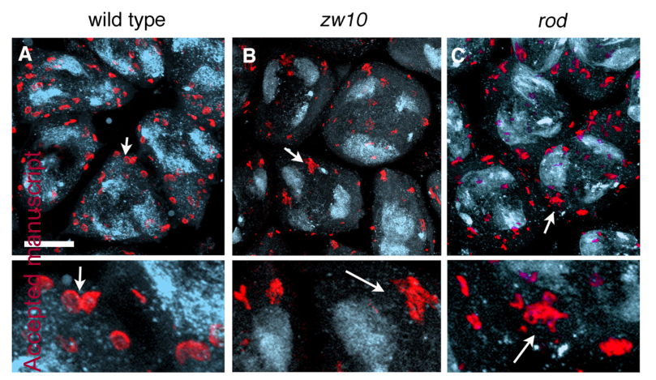

## Question

# Gene Research for Functional Annotation

## ⚠️ CRITICAL: Gene/Protein Identification Context

**BEFORE YOU BEGIN RESEARCH:** You MUST verify you are researching the CORRECT gene/protein. Gene symbols can be ambiguous, especially for less well-characterized genes from non-model organisms.

### Target Gene/Protein Identity (from UniProt):
- **UniProt Accession:** Q9W4X9
- **Protein Description:** RecName: Full=Centromere/kinetochore protein zw10; AltName: Full=Mitotic 15 protein;
- **Gene Information:** Name=Zw10; Synonyms=mit(1)15; ORFNames=CG9900;
- **Organism (full):** Drosophila melanogaster (Fruit fly).
- **Protein Family:** Belongs to the ZW10 family. .
- **Key Domains:** Zw10/DSL1_C_sf. (IPR046362); ZW10_C. (IPR048343); ZW10_C_2. (IPR055148); Zw10_middle. (IPR048344); Zw10_N. (IPR009361)

### MANDATORY VERIFICATION STEPS:

1. **Check if the gene symbol "Zw10" matches the protein description above**
2. **Verify the organism is correct:** Drosophila melanogaster (Fruit fly).
3. **Check if protein family/domains align with what you find in literature**
4. **If you find literature for a DIFFERENT gene with the same or similar symbol, STOP**

### If Gene Symbol is Ambiguous or You Cannot Find Relevant Literature:

**DO NOT PROCEED WITH RESEARCH ON A DIFFERENT GENE.** Instead:
- State clearly: "The gene symbol 'Zw10' is ambiguous or literature is limited for this specific protein"
- Explain what you found (e.g., "Found extensive literature on a different gene with the same symbol in a different organism")
- Describe the protein based ONLY on the UniProt information provided above
- Suggest that the protein function can be inferred from domain/family information

### Research Target:

Please provide a comprehensive research report on the gene **Zw10** (gene ID: Zw10, UniProt: Q9W4X9) in DROME.

The research report should be a detailed narrative explaining the function, biological processes, and localization of the gene product. Citations should be given for all claims.

You should prioritize authoritative reviews and primary scientific literature when conducting research. You can supplement
this with annotations you find in gene/protein databases, but these can be outdated or inaccurate.

We are specifically interested in the primary function of the gene - for enzymes, what reaction is catalyzed, and what is the substrate specificity? For transporters, what is the substrate? For structural proteins or adapters, what is the broader structural role? For signaling molecules, what is the role in the pathway.

We are interested in where in or outside the cell the gene product carries out its function.

We are also interested in the signaling or biochemical pathways in which the gene functions. We are less interested in broad pleiotropic effects, except where these elucidate the precise role.

Include evidence where possible. We are interested in both experimental evidence as well as inference from structure, evolution, or bioinformatic analysis. Precise studies should be prioritized over high-throughput, where available.

## Output

Question: You are an expert researcher providing comprehensive, well-cited information.

Provide detailed information focusing on:
1. Key concepts and definitions with current understanding
2. Recent developments and latest research (prioritize 2023-2024 sources)
3. Current applications and real-world implementations
4. Expert opinions and analysis from authoritative sources
5. Relevant statistics and data from recent studies

Format as a comprehensive research report with proper citations. Include URLs and publication dates where available.
Always prioritize recent, authoritative sources and provide specific citations for all major claims.

# Gene Research for Functional Annotation

## ⚠️ CRITICAL: Gene/Protein Identification Context

**BEFORE YOU BEGIN RESEARCH:** You MUST verify you are researching the CORRECT gene/protein. Gene symbols can be ambiguous, especially for less well-characterized genes from non-model organisms.

### Target Gene/Protein Identity (from UniProt):
- **UniProt Accession:** Q9W4X9
- **Protein Description:** RecName: Full=Centromere/kinetochore protein zw10; AltName: Full=Mitotic 15 protein;
- **Gene Information:** Name=Zw10; Synonyms=mit(1)15; ORFNames=CG9900;
- **Organism (full):** Drosophila melanogaster (Fruit fly).
- **Protein Family:** Belongs to the ZW10 family. .
- **Key Domains:** Zw10/DSL1_C_sf. (IPR046362); ZW10_C. (IPR048343); ZW10_C_2. (IPR055148); Zw10_middle. (IPR048344); Zw10_N. (IPR009361)

### MANDATORY VERIFICATION STEPS:

1. **Check if the gene symbol "Zw10" matches the protein description above**
2. **Verify the organism is correct:** Drosophila melanogaster (Fruit fly).
3. **Check if protein family/domains align with what you find in literature**
4. **If you find literature for a DIFFERENT gene with the same or similar symbol, STOP**

### If Gene Symbol is Ambiguous or You Cannot Find Relevant Literature:

**DO NOT PROCEED WITH RESEARCH ON A DIFFERENT GENE.** Instead:
- State clearly: "The gene symbol 'Zw10' is ambiguous or literature is limited for this specific protein"
- Explain what you found (e.g., "Found extensive literature on a different gene with the same symbol in a different organism")
- Describe the protein based ONLY on the UniProt information provided above
- Suggest that the protein function can be inferred from domain/family information

### Research Target:

Please provide a comprehensive research report on the gene **Zw10** (gene ID: Zw10, UniProt: Q9W4X9) in DROME.

The research report should be a detailed narrative explaining the function, biological processes, and localization of the gene product. Citations should be given for all claims.

You should prioritize authoritative reviews and primary scientific literature when conducting research. You can supplement
this with annotations you find in gene/protein databases, but these can be outdated or inaccurate.

We are specifically interested in the primary function of the gene - for enzymes, what reaction is catalyzed, and what is the substrate specificity? For transporters, what is the substrate? For structural proteins or adapters, what is the broader structural role? For signaling molecules, what is the role in the pathway.

We are interested in where in or outside the cell the gene product carries out its function.

We are also interested in the signaling or biochemical pathways in which the gene functions. We are less interested in broad pleiotropic effects, except where these elucidate the precise role.

Include evidence where possible. We are interested in both experimental evidence as well as inference from structure, evolution, or bioinformatic analysis. Precise studies should be prioritized over high-throughput, where available.

# Functional annotation of *Drosophila melanogaster* Zw10

## Identity and principal function

**The target is the fruit-fly Zw10 protein, not a similarly named protein from another organism.** The supplied UniProt accession [Q9W4X9](https://www.uniprot.org/uniprotkb/Q9W4X9/entry), gene designation *Zw10* and aliases *mit(1)15* and CG9900 identify the intended target. Independent fly experiments support the functional identification: an antibody recognized an approximately 85-kDa protein absent from *zw10* mutant extracts, and purification from *Drosophila* embryos recovered that protein together with Rough deal (Rod) and Zwilch. This is the centromere/kinetochore ZW10-family protein described in the literature. The accession and aliases come from the supplied UniProt information; the cited experiments establish the protein’s identity and function rather than independently validating those database identifiers. (williams2003zwilchanew pages 3-4, williams2003zwilchanew pages 6-8)

**Primary annotation:** Zw10 is a **nonenzymatic protein-complex component and recruitment scaffold**. During mitosis, it functions with Rod and Zwilch in the RZZ complex at the outer kinetochore, helping organize spindle-assembly-checkpoint (SAC) signaling and the machinery that recruits dynein–dynactin. It has **no established catalytic reaction or substrate specificity**. In fly male germ cells, it additionally supports Golgi integrity and membrane supply during cytokinesis; this membrane-associated activity is distinguishable experimentally from its canonical kinetochore role. (williams2003zwilchanew pages 1-2, wainman2012thedrosophilarzz pages 5-8, wainman2012thedrosophilarzz pages 15-19)

The supplied Zw10/DSL1_C_sf and ZW10-region domain annotations are compatible with the literature’s evolutionary connection to yeast Dsl1, a vesicle-tethering protein. **Shared family architecture does not establish that fly Zw10 itself directly binds COPI vesicles or catalyzes membrane fusion.** Structural analysis supports common ancestry of kinetochore RZZ and membrane-tethering machinery, whereas the direct fly trafficking evidence is principally localization and loss-of-function cell biology. (wainman2012thedrosophilarzz pages 19-22, civril2010structuralanalysisof pages 1-2, civril2010structuralanalysisof pages 8-9)

## Where Zw10 acts and how

### Outer kinetochore, checkpoint signaling and chromosome attachment

In dividing fly cells, Zw10 and its RZZ partners accumulate at prometaphase kinetochores, occur on kinetochore microtubules during metaphase, and exhibit a changing distribution during chromosome segregation. Immunopurification, colocalization and mutant studies establish a stable Rod–Zw10–Zwilch assembly; loss of a partner disrupts recruitment of the other components to kinetochores in larval-brain experiments. Importantly, other kinetochore markers can remain localized when the RZZ assembly is disrupted, arguing for a specific recruitment defect rather than wholesale loss of the kinetochore. (williams2003zwilchanew pages 3-4, williams2003zwilchanew pages 8-10, williams2003zwilchanew pages 6-8)

RZZ supports the **SAC**, which restrains anaphase when chromosome–spindle attachments are inadequate, and helps position dynein–dynactin at kinetochores. Fly *zw10*, *rod* and *zwilch* defects are associated with checkpoint failure, lagging chromosomes and aneuploidy. As a precisely attributed example—not a measurement of *zw10* loss itself—the hypomorphic *zwilch*1229 mutant had **21% aneuploid larval-brain cells**, and **40% of colchicine-treated mitotic cells** showed premature sister-chromatid separation (*n* = 564); cyclin B was depleted in prematurely separating cells. Values of approximately 50% aneuploidy and 75% premature separation reported elsewhere in the same paper belong instead to **CENP-meta-null** brains and should not be assigned to Zw10 or Zwilch. (williams2003zwilchanew pages 4-6, williams2003zwilchanew pages 8-10)

The motor pathway has two opposing phases: RZZ helps establish kinetochore-associated dynein activity, whereas dynein-dependent movement removes checkpoint-associated material toward spindle poles as attachments mature. In fly S2 cells, depletion of the RZZ-dependent dynein adaptor Spindly prevented dynein recruitment and left Rod/RZZ and Mad2 on aligned kinetochores, producing a metaphase arrest. Thus, Zw10 is better annotated as part of a **spatial organizer of checkpoint activation and silencing**, not as a motor or an enzyme acting directly on Mad2. A 2023 expert review emphasizes that poleward streaming of kinetochore-corona particles is directly visible in fly cells. (griffis2007spindlyanovel pages 4-5, gassmann2023dyneinatthe pages 3-4)

### Centromere-to-kinetochore recruitment: distinct Zw10 pools

Fly-specific work identifies a connection between Zw10 and centromeric chromatin. Purified Zw10 **bound the fly CENP-A chaperone CAL1 directly**; yeast two-hybrid mapping implicated Zw10 residues 482–721 and CAL1 residues 680–979, and CAL1 co-immunoprecipitated with GFP-Zw10 from cultured cells. Purified Zw10 did **not** show direct binding to CENP-A in the corresponding pulldown. In S2 cells, depletion of CAL1 or CENP-A prevented Zw10 kinetochore localization, while depleting Spc105R, Bub1 or Mis12 did not abolish the *total GFP-Zw10 recruitment* measured in that study. The authors therefore proposed a CAL1-linked RZZ recruitment branch distinct from the CENP-C–Mis12–Spc105R branch of kinetochore assembly. This is a supported recruitment model, not proof that CAL1 is the only RZZ receptor. (pauleau2019thecheckpointprotein pages 9-13, pauleau2019thecheckpointprotein pages 13-14, pauleau2019thecheckpointprotein pages 14-17)

Zw10 depletion shortened mitosis and reduced newly incorporated centromeric SNAP–CENP-A and SNAP–CAL1 by approximately **30%**, without evidence that pre-existing centromeric CENP-A became less stable. These observations link Zw10 to the *timing* of CENP-A loading, but do not make it a CENP-A-deposition enzyme: the investigators favored an indirect effect involving checkpoint control and mitotic duration. (pauleau2019thecheckpointprotein pages 13-14)

**Recent fly-specific refinement (2024).** McGory and colleagues found that multimerized fly Spc105 residues 266–384 recruit Zw10-EGFP, Rod and BubR1 to experimental cytosolic clusters. At **bioriented kinetochores**, deleting Spc105 residues 267–383 reduced BubR1 by approximately **45%** and Rod by approximately **60%**; reducing BubR1 similarly diminished Rod. Rod- and dynein-dependent movement of Spc105 assemblies toward spindle poles linked this interface to a functional motor pathway. These data implicate Spc105 multimerization and BubR1 in maintaining a **core RZZ pool** that regulates kinetochore–microtubule attachments. Rod remained detectable after perturbation, so additional recruitment contacts remain possible. The 2024 measurement of a particular Rod-containing pool does not establish that Spc105 is required for all kinetochore Zw10 and should not be conflated with the 2019 total-GFP-Zw10 recruitment assay. (mcgory2024multimerizationofa pages 5-6, mcgory2024multimerizationofa pages 3-4, mcgory2024multimerizationofa pages 4-5, mcgory2024multimerizationofa pages 6-6, pauleau2019thecheckpointprotein pages 13-14)

### Golgi, ER-associated structures and male-germ-cell cytokinesis

In primary spermatocytes, Zw10 is enriched at **Golgi stacks** and **ER-associated spindle-envelope/astral membranes**; after meiosis it also appears at the **acroblast**, a Golgi-derived structure in developing spermatids. Rod shares Golgi and acroblast localization but was not similarly enriched at ER structures, while Zwilch was not enriched in those membrane compartments. All three RZZ proteins appear at the spindle-envelope midzone during spermatocyte telophase, but that shared midzone signal is **not sufficient evidence that the complete RZZ complex performs the essential cytokinesis function**. (wainman2012thedrosophilarzz pages 5-8, wainman2012thedrosophilarzz pages 12-15, wainman2012thedrosophilarzz pages 8-12, wainman2012thedrosophilarzz pages 22-25)

The fly phenotypes make the membrane role concrete. Wild-type spermatocytes have approximately **20 Golgi stacks per cell**, versus approximately **10** with conspicuous structural defects in *zw10* mutants; the difference is illustrated in the cropped Golgi-staining and quantification panels of Wainman and colleagues’ Figure 3. *rint1* RNAi yielded a closely similar Golgi phenotype and cytokinesis defects, and Rint1 was required for normal Zw10 association with Golgi stacks. Rod mutants chiefly showed abnormal Golgi morphology without the same reduction in stack number; neither Rod nor Zwilch mutants reproduced the *zw10* spermatocyte cytokinesis phenotype. These experiments support functional cooperation between **Zw10 and Rint1** but do not themselves demonstrate direct binding of the two fly proteins. (wainman2012thedrosophilarzz pages 8-12, wainman2012thedrosophilarzz media 084c34a3, wainman2012thedrosophilarzz media 0f8f41fa, wainman2012thedrosophilarzz pages 19-22)

The cytokinetic defect arises **after** initial ring and spindle assembly. In *zw10* mutants, **86%** of late-anaphase actin rings were initially normal (*n* = 29), but **85%** of late-telophase rings were defective (*n* = 20); live imaging found partial furrow ingression in **60%** of examined cells (*n* = 10). Reduced cell-perimeter expansion provided evidence for inadequate membrane addition. Golgi-marker-positive vesicles did **not** accumulate at the furrow, so the data do not specifically establish a block in final vesicle fusion there. The authors instead proposed defective ER–Golgi-dependent production or composition of membrane needed for furrow growth; the exact transport step remains unproven. Zw10 and Rod also contributed to acroblast assembly: *zw10* spermatids showed aggregates of apparently unfused acroblast vesicles. (wainman2012thedrosophilarzz pages 15-19, wainman2012thedrosophilarzz pages 22-25)

**Pathway boundary.** Yeast Dsl1 and mammalian ZW10–RINT1–NAG/NRZ provide a plausible tethering analogy, but Wainman and colleagues explicitly could not determine whether fly Zw10 mediates ER-to-Golgi, Golgi-to-ER or bidirectional traffic, or whether a canonical fly NRZ complex exists; they found no clear fly NAG homologue. A separate fly study found that Zw10 RNAi did **not** phenocopy the autophagic and endolysosomal defects caused by loss of Sec20 or Syntaxin 18 in the tested fat-cell and nephrocyte assays. Accordingly, **ER–Golgi/Golgi integrity is supported; a general Zw10-dependent lysosomal-autophagy role is not**. (wainman2012thedrosophilarzz pages 19-22, lakatos2019sec20isrequired pages 1-3)

## Evidence at a glance

The table distinguishes direct fly experiments from comparative work and records the principal quantitative results and their limitations. (mcgory2024multimerizationofa pages 5-6, wainman2012thedrosophilarzz pages 15-19, pauleau2019thecheckpointprotein pages 13-14)

| Cellular context / location | Experimentally supported role and quantitative evidence | Key original study | Evidence limitation |
|---|---|---|---|
| Mitotic outer kinetochore and kinetochore microtubules; stable ROD–Zw10–Zwilch (RZZ) complex | Anti-Zw10 immunoaffinity purification from fly embryos recovered an **~85-kDa Zw10**, ~250-kDa Rod, and ~75-kDa Zwilch in a **~600–800-kDa** complex. RZZ subunits were mutually dependent for kinetochore targeting and required for dynein recruitment and spindle-checkpoint function. In the hypomorphic *zwilch-1229* background—not Zw10 itself—21% of cells were aneuploid and 40% of colchicine-treated mitotic cells showed premature sister-chromatid separation. (williams2003zwilchanew pages 3-4, williams2003zwilchanew pages 6-8, williams2003zwilchanew pages 4-6) | Williams et al., *Molecular Biology of the Cell* (April 2003), [DOI](https://doi.org/10.1091/mbc.e02-09-0624) | Complex purification establishes association, not catalytic activity. The often-quoted ~50% aneuploidy and ~75% premature-separation values belong to **CENP-meta-null** cells and must not be assigned to Zw10 or Zwilch. |
| Bioriented kinetochores and optogenetically assembled cytosolic Spc105 clusters in fly cells | Deleting Spc105 residues 267–383 reduced kinetochore **BubR1 by ~45%** and **Rod by ~60%**. Oligomerized Spc105(266–384) recruited Zw10-EGFP (**80 clusters from 16 cells**), Rod, and BubR1; poleward movement required dynein and Rod. These results support a multivalent Spc105–BubR1 pathway that recruits a core, attachment-regulating RZZ pool. (mcgory2024multimerizationofa pages 5-6, mcgory2024multimerizationofa pages 3-4, mcgory2024multimerizationofa pages 4-5) | McGory et al., *Journal of Cell Biology* (January 2024), [DOI](https://doi.org/10.1083/jcb.202211122) | Rod, not Zw10, was the principal intact-kinetochore RZZ readout; residual Rod indicates additional contacts. This core-pool mechanism complements rather than necessarily contradicts earlier CAL1-dependent recruitment of total Zw10. |
| Centromere and kinetochore in Drosophila S2 cells; interface with the CAL1–CENP-A loading machinery | Purified GST-Zw10 bound His-CAL1 directly, and GFP-Zw10 co-immunoprecipitated CAL1. Zw10 residues 482–721 interacted with CAL1 residues 680–979. Zw10 RNAi shortened mitosis and reduced newly incorporated centromeric SNAP–CENP-A and SNAP–CAL1 by **~30%**, while pre-existing CENP-A stability and FRAP recovery were unchanged. (pauleau2019thecheckpointprotein pages 9-13, pauleau2019thecheckpointprotein pages 13-14) | Pauleau et al., *PLOS Genetics* (25 September 2019), [DOI](https://doi.org/10.1371/journal.pgen.1008380) | Purified Zw10 did **not** bind CENP-A directly. The findings favor an indirect checkpoint or mitotic-timing effect on new CENP-A loading; they do not show that Zw10 enzymatically deposits CENP-A. |
| Golgi stacks, ER-associated structures, and acroblast in male germ cells | Mature wild-type spermatocytes contained **~20 Golgi stacks per cell**, versus **~10** in *zw10* mutants, with severe morphological disruption. Zw10 and Rod localized to the acroblast; *zw10* spermatids consistently contained aggregates of unfused acroblast vesicles. (wainman2012thedrosophilarzz pages 8-12, wainman2012thedrosophilarzz pages 15-19, wainman2012thedrosophilarzz media 084c34a3) | Wainman et al., *Journal of Cell Science* (September 2012), [DOI](https://doi.org/10.1242/jcs.099820) | Fly data support ER–Golgi pathway involvement but do not demonstrate direct Zw10–Rint1 binding, COPI capture, SNARE binding, or transport direction. Drosophila lacks a clear NAG homolog, so a canonical mammalian NRZ complex cannot be assumed. |
| Contractile ring, central spindle, and membrane expansion during spermatocyte cytokinesis | Initial actin-ring and central-spindle assembly was largely normal, but furrow ingression was partial in **60% of live zw10 cells (n=10)**; 85% of late-telophase actin rings were defective (n=20), and 64% of late central spindles were abnormal (n=40). Membrane addition was reduced, whereas Golgi-derived vesicles did not accumulate at the furrow. (wainman2012thedrosophilarzz pages 15-19, wainman2012thedrosophilarzz pages 22-25) | Wainman et al., *Journal of Cell Science* (September 2012), [DOI](https://doi.org/10.1242/jcs.099820) | The inferred defect concerns vesicle formation, composition, or membrane supply—not a demonstrated failure of equatorial vesicle fusion. Rod and Zwilch mutants lacked the same cytokinesis phenotype, arguing that this is not simply canonical RZZ activity. |
| Starved larval fat cells and nephrocytes; autophagic and endolysosomal pathway | Zw10 RNAi did **not** reproduce the autophagic, lysosomal-acidification, or endocytic defects caused by loss of Sec20 or Syntaxin 18. This is negative evidence that Zw10 is dispensable for the Sec20-dependent lysosomal pathway under the tested conditions. (lakatos2019sec20isrequired pages 1-3) | Lakatos et al., *Cells* (24 July 2019), [DOI](https://doi.org/10.3390/cells8080768) | Negative RNAi phenotypes do not exclude subtle, redundant, or tissue-specific functions. They argue against placing fly Zw10 in this Sec20/Syx18 autophagy pathway, not against its established ER–Golgi role. |
| Comparative kinetochore-corona context only—not direct evidence for Q9W4X9 | A 2023 human-cell study defined polymeric RZZ–Spindly as a corona scaffold coordinated with CENP-E for dynein–dynactin recruitment. This refines the conserved metazoan model but was performed primarily in human HeLa cells. (cmentowski2023rzz‐spindlyandcenp‐e pages 1-3) | Cmentowski et al., *The EMBO Journal* (20 November 2023), [DOI](https://doi.org/10.15252/embj.2023114838) | **Ortholog-only context:** CENP-E dependence and human RZZ-corona architecture should not be reported as direct experimental properties of Drosophila Zw10/Q9W4X9 without fly validation. |

*Table: Fly-specific evidence for the localization and functions of Zw10/Q9W4X9, including quantitative findings and major experimental limitations. The final row explicitly separates recent human ortholog research from direct Drosophila evidence.*

## Recent developments and research use

The **2024 fly Spc105 study** is the most directly relevant recent mechanistic extension of Q9W4X9’s kinetochore annotation: it separates attachment-regulating RZZ recruitment from a simple all-or-none model of Zw10 loading. The **2023** study by Cmentowski and colleagues found that RZZ–Spindly and CENP-E coordinate dynein recruitment to the fibrous corona, but its principal experiments used **human cells**; it is valuable comparative context, **not a fly-specific demonstration** of CENP-E dependence. The 2023 dynein review likewise provides an authoritative synthesis while distinguishing directly observed fly streaming from mechanisms worked out in other species. (mcgory2024multimerizationofa pages 4-5, cmentowski2023rzz‐spindlyandcenp‐e pages 1-3, gassmann2023dyneinatthe pages 3-4)

The clearest current applications are **experimental**, rather than clinical: perturbing fly Zw10 or its recruitment partners tests how kinetochores couple chromosome attachment to checkpoint output; fluorescent Zw10 and Spc105 assemblies permit localization and transport assays; and mutant spermatocytes provide a tractable readout of Golgi integrity and the membrane requirements of cytokinesis. The available fly evidence does not establish a Zw10-targeted treatment or clinical implementation. (mcgory2024multimerizationofa pages 5-6, pauleau2019thecheckpointprotein pages 9-13, wainman2012thedrosophilarzz pages 8-12, wainman2012thedrosophilarzz pages 15-19)

## Selected primary sources and expert synthesis

- **McGory et al., January 2024**, *Journal of Cell Biology*, “Multimerization of a disordered kinetochore protein promotes accurate chromosome segregation by localizing a core dynein module.” https://doi.org/10.1083/jcb.202211122 — direct fly evidence for the Spc105–BubR1–RZZ connection. (mcgory2024multimerizationofa pages 4-5, mcgory2024multimerizationofa pages 6-6)
- **Cmentowski et al., published online 20 November 2023**, *EMBO Journal*, “RZZ-Spindly and CENP-E form an integrated platform to recruit dynein to the kinetochore corona.” https://doi.org/10.15252/embj.2023114838 — comparative **human-cell** mechanism. (cmentowski2023rzz‐spindlyandcenp‐e pages 1-3)
- **Gassmann, March 2023**, *Journal of Cell Science*, “Dynein at the kinetochore.” https://doi.org/10.1242/jcs.220269 — expert review, including directly observed fly corona streaming. (gassmann2023dyneinatthe pages 3-4)
- **Pauleau et al., 25 September 2019**, *PLOS Genetics*, “The checkpoint protein Zw10 connects CAL1-dependent CENP-A centromeric loading and mitosis duration in Drosophila cells.” https://doi.org/10.1371/journal.pgen.1008380 — direct fly biochemical and cell-based evidence. (pauleau2019thecheckpointprotein pages 13-14, pauleau2019thecheckpointprotein pages 14-17)
- **Lakatos et al., 24 July 2019**, *Cells*, “Sec20 Is Required for Autophagic and Endocytic Degradation Independent of Golgi-ER Retrograde Transport.” https://doi.org/10.3390/cells8080768 — negative fly evidence for a Zw10 requirement in the tested lysosomal pathway. (lakatos2019sec20isrequired pages 1-3)
- **Wainman et al., September 2012**, *Journal of Cell Science*, “The Drosophila RZZ complex—roles in membrane trafficking and cytokinesis.” https://doi.org/10.1242/jcs.099820 — primary fly Golgi, acroblast and cytokinesis study. (wainman2012thedrosophilarzz pages 8-12, wainman2012thedrosophilarzz pages 15-19, wainman2012thedrosophilarzz media 084c34a3)
- **Williams et al., April 2003**, *Molecular Biology of the Cell*, “Zwilch, a new component of the ZW10/ROD complex required for kinetochore functions.” https://doi.org/10.1091/mbc.e02-09-0624 — fly biochemical identification and RZZ genetics. (williams2003zwilchanew pages 3-4, williams2003zwilchanew pages 4-6)

**Annotation conclusion:** The strongest direct functional assignment for fly Zw10 is **RZZ-associated kinetochore organization for spindle-checkpoint signaling and dynein-linked chromosome attachment/segregation**. A second, experimentally substantial but less biochemically resolved assignment is **Golgi/ER-associated membrane organization supporting male-germ-cell cytokinesis and acroblast formation**. Neither an enzymatic reaction nor a specific directly tethered fly vesicle cargo has been established. (williams2003zwilchanew pages 3-4, mcgory2024multimerizationofa pages 4-5, wainman2012thedrosophilarzz pages 15-19, wainman2012thedrosophilarzz pages 19-22)

References

1. (williams2003zwilchanew pages 3-4): Byron C. Williams, ZeXiao Li, Songtao Liu, Erika V. Williams, Garmay Leung, Tim J. Yen, and Michael L. Goldberg. Zwilch, a new component of the zw10/rod complex required for kinetochore functions. Molecular biology of the cell, 14 4:1379-91, Apr 2003. URL: https://doi.org/10.1091/mbc.e02-09-0624, doi:10.1091/mbc.e02-09-0624. This article has 124 citations and is from a domain leading peer-reviewed journal.

2. (williams2003zwilchanew pages 6-8): Byron C. Williams, ZeXiao Li, Songtao Liu, Erika V. Williams, Garmay Leung, Tim J. Yen, and Michael L. Goldberg. Zwilch, a new component of the zw10/rod complex required for kinetochore functions. Molecular biology of the cell, 14 4:1379-91, Apr 2003. URL: https://doi.org/10.1091/mbc.e02-09-0624, doi:10.1091/mbc.e02-09-0624. This article has 124 citations and is from a domain leading peer-reviewed journal.

3. (williams2003zwilchanew pages 1-2): Byron C. Williams, ZeXiao Li, Songtao Liu, Erika V. Williams, Garmay Leung, Tim J. Yen, and Michael L. Goldberg. Zwilch, a new component of the zw10/rod complex required for kinetochore functions. Molecular biology of the cell, 14 4:1379-91, Apr 2003. URL: https://doi.org/10.1091/mbc.e02-09-0624, doi:10.1091/mbc.e02-09-0624. This article has 124 citations and is from a domain leading peer-reviewed journal.

4. (wainman2012thedrosophilarzz pages 5-8): Alan Wainman, Maria Grazia Giansanti, Michael L. Goldberg, and Maurizio Gatti. The drosophila rzz complex – roles in membrane trafficking and cytokinesis. Journal of Cell Science, 125:4014-4025, Sep 2012. URL: https://doi.org/10.1242/jcs.099820, doi:10.1242/jcs.099820. This article has 40 citations and is from a domain leading peer-reviewed journal.

5. (wainman2012thedrosophilarzz pages 15-19): Alan Wainman, Maria Grazia Giansanti, Michael L. Goldberg, and Maurizio Gatti. The drosophila rzz complex – roles in membrane trafficking and cytokinesis. Journal of Cell Science, 125:4014-4025, Sep 2012. URL: https://doi.org/10.1242/jcs.099820, doi:10.1242/jcs.099820. This article has 40 citations and is from a domain leading peer-reviewed journal.

6. (wainman2012thedrosophilarzz pages 19-22): Alan Wainman, Maria Grazia Giansanti, Michael L. Goldberg, and Maurizio Gatti. The drosophila rzz complex – roles in membrane trafficking and cytokinesis. Journal of Cell Science, 125:4014-4025, Sep 2012. URL: https://doi.org/10.1242/jcs.099820, doi:10.1242/jcs.099820. This article has 40 citations and is from a domain leading peer-reviewed journal.

7. (civril2010structuralanalysisof pages 1-2): Filiz Çivril, Annemarie Wehenkel, Federico M. Giorgi, Stefano Santaguida, Andrea Di Fonzo, Gabriela Grigorean, Francesca D. Ciccarelli, and Andrea Musacchio. Structural analysis of the rzz complex reveals common ancestry with multisubunit vesicle tethering machinery. Structure, 18 5:616-26, May 2010. URL: https://doi.org/10.1016/j.str.2010.02.014, doi:10.1016/j.str.2010.02.014. This article has 99 citations and is from a domain leading peer-reviewed journal.

8. (civril2010structuralanalysisof pages 8-9): Filiz Çivril, Annemarie Wehenkel, Federico M. Giorgi, Stefano Santaguida, Andrea Di Fonzo, Gabriela Grigorean, Francesca D. Ciccarelli, and Andrea Musacchio. Structural analysis of the rzz complex reveals common ancestry with multisubunit vesicle tethering machinery. Structure, 18 5:616-26, May 2010. URL: https://doi.org/10.1016/j.str.2010.02.014, doi:10.1016/j.str.2010.02.014. This article has 99 citations and is from a domain leading peer-reviewed journal.

9. (williams2003zwilchanew pages 8-10): Byron C. Williams, ZeXiao Li, Songtao Liu, Erika V. Williams, Garmay Leung, Tim J. Yen, and Michael L. Goldberg. Zwilch, a new component of the zw10/rod complex required for kinetochore functions. Molecular biology of the cell, 14 4:1379-91, Apr 2003. URL: https://doi.org/10.1091/mbc.e02-09-0624, doi:10.1091/mbc.e02-09-0624. This article has 124 citations and is from a domain leading peer-reviewed journal.

10. (williams2003zwilchanew pages 4-6): Byron C. Williams, ZeXiao Li, Songtao Liu, Erika V. Williams, Garmay Leung, Tim J. Yen, and Michael L. Goldberg. Zwilch, a new component of the zw10/rod complex required for kinetochore functions. Molecular biology of the cell, 14 4:1379-91, Apr 2003. URL: https://doi.org/10.1091/mbc.e02-09-0624, doi:10.1091/mbc.e02-09-0624. This article has 124 citations and is from a domain leading peer-reviewed journal.

11. (griffis2007spindlyanovel pages 4-5): Eric R. Griffis, Nico Stuurman, and Ronald D. Vale. Spindly, a novel protein essential for silencing the spindle assembly checkpoint, recruits dynein to the kinetochore. The Journal of Cell Biology, 177:1005-1015, Jun 2007. URL: https://doi.org/10.1083/jcb.200702062, doi:10.1083/jcb.200702062. This article has 308 citations.

12. (gassmann2023dyneinatthe pages 3-4): Reto Gassmann. Dynein at the kinetochore. Journal of cell science, Mar 2023. URL: https://doi.org/10.1242/jcs.220269, doi:10.1242/jcs.220269. This article has 34 citations and is from a domain leading peer-reviewed journal.

13. (pauleau2019thecheckpointprotein pages 9-13): Anne-Laure Pauleau, Andrea Bergner, Janko Kajtez, and Sylvia Erhardt. The checkpoint protein zw10 connects cal1-dependent cenp-a centromeric loading and mitosis duration in drosophila cells. PLOS Genetics, 15:e1008380, Sep 2019. URL: https://doi.org/10.1371/journal.pgen.1008380, doi:10.1371/journal.pgen.1008380. This article has 15 citations and is from a domain leading peer-reviewed journal.

14. (pauleau2019thecheckpointprotein pages 13-14): Anne-Laure Pauleau, Andrea Bergner, Janko Kajtez, and Sylvia Erhardt. The checkpoint protein zw10 connects cal1-dependent cenp-a centromeric loading and mitosis duration in drosophila cells. PLOS Genetics, 15:e1008380, Sep 2019. URL: https://doi.org/10.1371/journal.pgen.1008380, doi:10.1371/journal.pgen.1008380. This article has 15 citations and is from a domain leading peer-reviewed journal.

15. (pauleau2019thecheckpointprotein pages 14-17): Anne-Laure Pauleau, Andrea Bergner, Janko Kajtez, and Sylvia Erhardt. The checkpoint protein zw10 connects cal1-dependent cenp-a centromeric loading and mitosis duration in drosophila cells. PLOS Genetics, 15:e1008380, Sep 2019. URL: https://doi.org/10.1371/journal.pgen.1008380, doi:10.1371/journal.pgen.1008380. This article has 15 citations and is from a domain leading peer-reviewed journal.

16. (mcgory2024multimerizationofa pages 5-6): Jessica M. McGory, Vikash Verma, Dylan M. Barcelos, and Thomas J. Maresca. Multimerization of a disordered kinetochore protein promotes accurate chromosome segregation by localizing a core dynein module. The Journal of Cell Biology, Jan 2024. URL: https://doi.org/10.1083/jcb.202211122, doi:10.1083/jcb.202211122. This article has 4 citations.

17. (mcgory2024multimerizationofa pages 3-4): Jessica M. McGory, Vikash Verma, Dylan M. Barcelos, and Thomas J. Maresca. Multimerization of a disordered kinetochore protein promotes accurate chromosome segregation by localizing a core dynein module. The Journal of Cell Biology, Jan 2024. URL: https://doi.org/10.1083/jcb.202211122, doi:10.1083/jcb.202211122. This article has 4 citations.

18. (mcgory2024multimerizationofa pages 4-5): Jessica M. McGory, Vikash Verma, Dylan M. Barcelos, and Thomas J. Maresca. Multimerization of a disordered kinetochore protein promotes accurate chromosome segregation by localizing a core dynein module. The Journal of Cell Biology, Jan 2024. URL: https://doi.org/10.1083/jcb.202211122, doi:10.1083/jcb.202211122. This article has 4 citations.

19. (mcgory2024multimerizationofa pages 6-6): Jessica M. McGory, Vikash Verma, Dylan M. Barcelos, and Thomas J. Maresca. Multimerization of a disordered kinetochore protein promotes accurate chromosome segregation by localizing a core dynein module. The Journal of Cell Biology, Jan 2024. URL: https://doi.org/10.1083/jcb.202211122, doi:10.1083/jcb.202211122. This article has 4 citations.

20. (wainman2012thedrosophilarzz pages 12-15): Alan Wainman, Maria Grazia Giansanti, Michael L. Goldberg, and Maurizio Gatti. The drosophila rzz complex – roles in membrane trafficking and cytokinesis. Journal of Cell Science, 125:4014-4025, Sep 2012. URL: https://doi.org/10.1242/jcs.099820, doi:10.1242/jcs.099820. This article has 40 citations and is from a domain leading peer-reviewed journal.

21. (wainman2012thedrosophilarzz pages 8-12): Alan Wainman, Maria Grazia Giansanti, Michael L. Goldberg, and Maurizio Gatti. The drosophila rzz complex – roles in membrane trafficking and cytokinesis. Journal of Cell Science, 125:4014-4025, Sep 2012. URL: https://doi.org/10.1242/jcs.099820, doi:10.1242/jcs.099820. This article has 40 citations and is from a domain leading peer-reviewed journal.

22. (wainman2012thedrosophilarzz pages 22-25): Alan Wainman, Maria Grazia Giansanti, Michael L. Goldberg, and Maurizio Gatti. The drosophila rzz complex – roles in membrane trafficking and cytokinesis. Journal of Cell Science, 125:4014-4025, Sep 2012. URL: https://doi.org/10.1242/jcs.099820, doi:10.1242/jcs.099820. This article has 40 citations and is from a domain leading peer-reviewed journal.

23. (wainman2012thedrosophilarzz media 084c34a3): Alan Wainman, Maria Grazia Giansanti, Michael L. Goldberg, and Maurizio Gatti. The drosophila rzz complex – roles in membrane trafficking and cytokinesis. Journal of Cell Science, 125:4014-4025, Sep 2012. URL: https://doi.org/10.1242/jcs.099820, doi:10.1242/jcs.099820. This article has 40 citations and is from a domain leading peer-reviewed journal.

24. (wainman2012thedrosophilarzz media 0f8f41fa): Alan Wainman, Maria Grazia Giansanti, Michael L. Goldberg, and Maurizio Gatti. The drosophila rzz complex – roles in membrane trafficking and cytokinesis. Journal of Cell Science, 125:4014-4025, Sep 2012. URL: https://doi.org/10.1242/jcs.099820, doi:10.1242/jcs.099820. This article has 40 citations and is from a domain leading peer-reviewed journal.

25. (lakatos2019sec20isrequired pages 1-3): Zsolt Lakatos, Péter Lőrincz, Zoltán Szabó, Péter Benkő, Lili Anna Kenéz, Tamás Csizmadia, and Gábor Juhász. Sec20 is required for autophagic and endocytic degradation independent of golgi-er retrograde transport. Cells, 8:768, Jul 2019. URL: https://doi.org/10.3390/cells8080768, doi:10.3390/cells8080768. This article has 14 citations.

26. (cmentowski2023rzz‐spindlyandcenp‐e pages 1-3): Verena Cmentowski, Giuseppe Ciossani, Ennio d'Amico, Sabine Wohlgemuth, Mikito Owa, Brian Dynlacht, and Andrea Musacchio. Rzz‐spindly and cenp‐e form an integrated platform to recruit dynein to the kinetochore corona. The EMBO Journal, Nov 2023. URL: https://doi.org/10.15252/embj.2023114838, doi:10.15252/embj.2023114838. This article has 30 citations.

## Artifacts

- [Edison artifact artifact-00](Zw10-deep-research-falcon_artifacts/artifact-00.md)

## Citations

1. pauleau2019thecheckpointprotein pages 13-14
2. gassmann2023dyneinatthe pages 3-4
3. williams2003zwilchanew pages 3-4
4. williams2003zwilchanew pages 6-8
5. williams2003zwilchanew pages 1-2
6. wainman2012thedrosophilarzz pages 5-8
7. wainman2012thedrosophilarzz pages 15-19
8. wainman2012thedrosophilarzz pages 19-22
9. civril2010structuralanalysisof pages 1-2
10. civril2010structuralanalysisof pages 8-9
11. williams2003zwilchanew pages 8-10
12. williams2003zwilchanew pages 4-6
13. griffis2007spindlyanovel pages 4-5
14. pauleau2019thecheckpointprotein pages 9-13
15. pauleau2019thecheckpointprotein pages 14-17
16. mcgory2024multimerizationofa pages 5-6
17. mcgory2024multimerizationofa pages 3-4
18. mcgory2024multimerizationofa pages 4-5
19. mcgory2024multimerizationofa pages 6-6
20. wainman2012thedrosophilarzz pages 12-15
21. wainman2012thedrosophilarzz pages 8-12
22. wainman2012thedrosophilarzz pages 22-25
23. Q9W4X9
24. DOI
25. https://www.uniprot.org/uniprotkb/Q9W4X9/entry
26. https://doi.org/10.1091/mbc.e02-09-0624
27. https://doi.org/10.1083/jcb.202211122
28. https://doi.org/10.1371/journal.pgen.1008380
29. https://doi.org/10.1242/jcs.099820
30. https://doi.org/10.3390/cells8080768
31. https://doi.org/10.15252/embj.2023114838
32. https://doi.org/10.1242/jcs.220269
33. https://doi.org/10.1091/mbc.e02-09-0624,
34. https://doi.org/10.1242/jcs.099820,
35. https://doi.org/10.1016/j.str.2010.02.014,
36. https://doi.org/10.1083/jcb.200702062,
37. https://doi.org/10.1242/jcs.220269,
38. https://doi.org/10.1371/journal.pgen.1008380,
39. https://doi.org/10.1083/jcb.202211122,
40. https://doi.org/10.3390/cells8080768,
41. https://doi.org/10.15252/embj.2023114838,