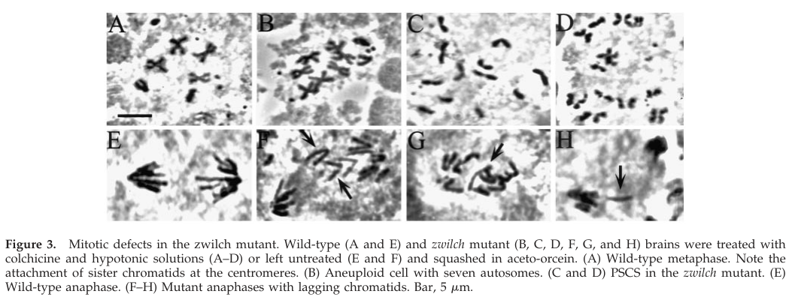

## Question

# Gene Research for Functional Annotation

## ⚠️ CRITICAL: Gene/Protein Identification Context

**BEFORE YOU BEGIN RESEARCH:** You MUST verify you are researching the CORRECT gene/protein. Gene symbols can be ambiguous, especially for less well-characterized genes from non-model organisms.

### Target Gene/Protein Identity (from UniProt):
- **UniProt Accession:** Q9VA00
- **Protein Description:** RecName: Full=Protein zwilch;
- **Gene Information:** Name=Zwilch {ECO:0000312|FlyBase:FBgn0061476}; ORFNames=CG18729 {ECO:0000312|FlyBase:FBgn0061476};
- **Organism (full):** Drosophila melanogaster (Fruit fly).
- **Protein Family:** Belongs to the ZWILCH family. .
- **Key Domains:** Zwilch. (IPR018630); Zwilch (PF09817)

### MANDATORY VERIFICATION STEPS:

1. **Check if the gene symbol "Zwilch" matches the protein description above**
2. **Verify the organism is correct:** Drosophila melanogaster (Fruit fly).
3. **Check if protein family/domains align with what you find in literature**
4. **If you find literature for a DIFFERENT gene with the same or similar symbol, STOP**

### If Gene Symbol is Ambiguous or You Cannot Find Relevant Literature:

**DO NOT PROCEED WITH RESEARCH ON A DIFFERENT GENE.** Instead:
- State clearly: "The gene symbol 'Zwilch' is ambiguous or literature is limited for this specific protein"
- Explain what you found (e.g., "Found extensive literature on a different gene with the same symbol in a different organism")
- Describe the protein based ONLY on the UniProt information provided above
- Suggest that the protein function can be inferred from domain/family information

### Research Target:

Please provide a comprehensive research report on the gene **Zwilch** (gene ID: Zwilch, UniProt: Q9VA00) in DROME.

The research report should be a detailed narrative explaining the function, biological processes, and localization of the gene product. Citations should be given for all claims.

You should prioritize authoritative reviews and primary scientific literature when conducting research. You can supplement
this with annotations you find in gene/protein databases, but these can be outdated or inaccurate.

We are specifically interested in the primary function of the gene - for enzymes, what reaction is catalyzed, and what is the substrate specificity? For transporters, what is the substrate? For structural proteins or adapters, what is the broader structural role? For signaling molecules, what is the role in the pathway.

We are interested in where in or outside the cell the gene product carries out its function.

We are also interested in the signaling or biochemical pathways in which the gene functions. We are less interested in broad pleiotropic effects, except where these elucidate the precise role.

Include evidence where possible. We are interested in both experimental evidence as well as inference from structure, evolution, or bioinformatic analysis. Precise studies should be prioritized over high-throughput, where available.

## Output

Question: You are an expert researcher providing comprehensive, well-cited information.

Provide detailed information focusing on:
1. Key concepts and definitions with current understanding
2. Recent developments and latest research (prioritize 2023-2024 sources)
3. Current applications and real-world implementations
4. Expert opinions and analysis from authoritative sources
5. Relevant statistics and data from recent studies

Format as a comprehensive research report with proper citations. Include URLs and publication dates where available.
Always prioritize recent, authoritative sources and provide specific citations for all major claims.

# Gene Research for Functional Annotation

## ⚠️ CRITICAL: Gene/Protein Identification Context

**BEFORE YOU BEGIN RESEARCH:** You MUST verify you are researching the CORRECT gene/protein. Gene symbols can be ambiguous, especially for less well-characterized genes from non-model organisms.

### Target Gene/Protein Identity (from UniProt):
- **UniProt Accession:** Q9VA00
- **Protein Description:** RecName: Full=Protein zwilch;
- **Gene Information:** Name=Zwilch {ECO:0000312|FlyBase:FBgn0061476}; ORFNames=CG18729 {ECO:0000312|FlyBase:FBgn0061476};
- **Organism (full):** Drosophila melanogaster (Fruit fly).
- **Protein Family:** Belongs to the ZWILCH family. .
- **Key Domains:** Zwilch. (IPR018630); Zwilch (PF09817)

### MANDATORY VERIFICATION STEPS:

1. **Check if the gene symbol "Zwilch" matches the protein description above**
2. **Verify the organism is correct:** Drosophila melanogaster (Fruit fly).
3. **Check if protein family/domains align with what you find in literature**
4. **If you find literature for a DIFFERENT gene with the same or similar symbol, STOP**

### If Gene Symbol is Ambiguous or You Cannot Find Relevant Literature:

**DO NOT PROCEED WITH RESEARCH ON A DIFFERENT GENE.** Instead:
- State clearly: "The gene symbol 'Zwilch' is ambiguous or literature is limited for this specific protein"
- Explain what you found (e.g., "Found extensive literature on a different gene with the same symbol in a different organism")
- Describe the protein based ONLY on the UniProt information provided above
- Suggest that the protein function can be inferred from domain/family information

### Research Target:

Please provide a comprehensive research report on the gene **Zwilch** (gene ID: Zwilch, UniProt: Q9VA00) in DROME.

The research report should be a detailed narrative explaining the function, biological processes, and localization of the gene product. Citations should be given for all claims.

You should prioritize authoritative reviews and primary scientific literature when conducting research. You can supplement
this with annotations you find in gene/protein databases, but these can be outdated or inaccurate.

We are specifically interested in the primary function of the gene - for enzymes, what reaction is catalyzed, and what is the substrate specificity? For transporters, what is the substrate? For structural proteins or adapters, what is the broader structural role? For signaling molecules, what is the role in the pathway.

We are interested in where in or outside the cell the gene product carries out its function.

We are also interested in the signaling or biochemical pathways in which the gene functions. We are less interested in broad pleiotropic effects, except where these elucidate the precise role.

Include evidence where possible. We are interested in both experimental evidence as well as inference from structure, evolution, or bioinformatic analysis. Precise studies should be prioritized over high-throughput, where available.

# Functional annotation of *Drosophila melanogaster* Zwilch

## Identity and principal function

**Identity verified.** The target is fruit-fly **Zwilch**, the 644-amino-acid product of **CG18729**; the supplied identifiers are UniProt **Q9VA00** and FlyBase **FBgn0061476**. Its supplied Zwilch-family annotations—**InterPro IPR018630** and **Pfam PF09817**—are consistent with its experimentally established identity as the Zwilch subunit of the **ROD–ZW10–Zwilch (RZZ)** complex. The family identifiers come from the supplied UniProt record, whereas identification of CG18729 and RZZ membership is supported directly by fly experiments. This report does not substitute findings about human ZWILCH for experiments on the fly protein. [UniProt record: https://www.uniprot.org/uniprotkb/Q9VA00/entry; Williams *et al.*, April 2003, https://doi.org/10.1091/mbc.e02-09-0624.] (williams2003zwilchanew pages 3-4, williams2003zwilchanew pages 6-8)

**Primary annotation:** Zwilch is a **nonenzymatic kinetochore-complex subunit and adaptor/scaffold component**, not an enzyme or transporter with a known catalytic reaction or substrate. Together with ROD and ZW10, it helps assemble a functional RZZ platform at dividing chromosomes. This platform supports spindle-assembly-checkpoint (SAC) signaling and recruitment of cytoplasmic dynein, helping cells coordinate chromosome–spindle attachment with the decision to enter anaphase. Anti-Zwilch affinity purification of fly embryo extracts recovered Zwilch, ROD and ZW10 together, and Zwilch co-eluted with them in approximately **700–900-kDa** fractions. [Williams *et al.*, April 2003, https://doi.org/10.1091/mbc.e02-09-0624.] (williams2003zwilchanew pages 6-8, williams2003zwilchanew pages 8-10)

The following table distinguishes findings **measured in flies** from molecular mechanisms established principally in other animals.

| Inference / function | Strongest experiment | Organism and evidence status | DOI URL |
|---|---|---|---|
| **Zwilch is a stable ROD–ZW10–Zwilch (RZZ) complex subunit.** | Anti-Zwilch and anti-ZW10 immunoaffinity purification recovered Zwilch, ROD and ZW10 at roughly equal stoichiometry; gel filtration placed them in the same approximately 700–900-kDa fractions. (williams2003zwilchanew pages 6-8, williams2003zwilchanew pages 4-6) | *Drosophila melanogaster*; **direct biochemical evidence for Q9VA00/CG18729**. | [Williams et al., 2003](https://doi.org/10.1091/mbc.e02-09-0624) |
| **Zwilch localizes dynamically to kinetochores and kinetochore microtubules (kMTs).** | Fly neuroblast immunofluorescence detected Zwilch at prometaphase kinetochores, on kinetochores and kMTs at metaphase, and again primarily at kinetochores during anaphase; it colocalized with ZW10. (williams2003zwilchanew pages 6-8) | *D. melanogaster*; **direct cellular-localization evidence**. | [Williams et al., 2003](https://doi.org/10.1091/mbc.e02-09-0624) |
| **Zwilch supports spindle-assembly-checkpoint maintenance, accurate segregation and kinetochore dynein recruitment.** | The hypomorphic *zwilch*^1229 allele produced 21% aneuploid cells (*n*=564), 20% aberrant anaphases (*n*=87), and 40% premature sister-chromatid separation after colchicine (*n*=564), with reduced cyclin B/BUB1 in bypassing cells. ZW10, ROD and cytoplasmic dynein failed to bind mutant kinetochores, whereas CID, MEI-S332, BUB1 and BUB3 localization showed that kinetochore assembly was not globally destroyed. (williams2003zwilchanew pages 4-6, williams2003zwilchanew pages 8-10) | *D. melanogaster*; **direct genetic and localization evidence**, but the tested allele is hypomorphic rather than null. | [Williams et al., 2003](https://doi.org/10.1091/mbc.e02-09-0624) |
| **Fly Zwilch is not itself supported as an ER–Golgi trafficking or spermatocyte-cytokinesis factor.** | In primary spermatocytes, Zwilch remained diffuse rather than concentrating at ER or Golgi membranes; *zwilch* mutants lacked the gross Golgi and cytokinesis defects caused by loss of Zw10/Rint1. (wainman2012thedrosophilarzz pages 1-5, wainman2012thedrosophilarzz pages 12-15) | *D. melanogaster*; **direct negative/localization evidence**. Membrane-trafficking roles belong chiefly to Zw10–Rint1 and, separately, Rod—not necessarily the intact RZZ complex. | [Wainman et al., 2012](https://doi.org/10.1242/jcs.099820) |
| **Multiple upstream contacts recruit distinct fly RZZ pools; recent work does not directly quantify Zwilch.** | CAL1 directly bound Zw10, and CAL1 depletion abolished Zw10 kinetochore localization; Zw10 persisted partially after ROD or Zwilch depletion, suggesting a proximal anchor. Separately, deleting Spc105 residues 267–383—containing KI motifs that engage BubR1—reduced Rod at bioriented kinetochores by approximately 60%; Zwilch was not individually quantified in that assay. (pauleau2019thecheckpointprotein pages 13-14, mcgory2024multimerizationofa pages 4-5) | *D. melanogaster* cultured cells; **direct evidence for CAL1–Zw10 and Spc105–BubR1–Rod recruitment**, but only **indirect RZZ-level inference for Zwilch**. The results can represent complementary proximal/core pools rather than mutually exclusive mechanisms. | [Pauleau et al., 2019](https://doi.org/10.1371/journal.pgen.1008380); [McGory et al., 2024](https://doi.org/10.1083/jcb.202211122) |
| **A ROD β-propeller–Zwilch module docks Spindly and contributes to fibrous-corona assembly, but residue-level mechanisms are inferred for fly Q9VA00.** | Human structural studies place Zwilch against the ROD β-propeller in a 2:2:2 RZZ complex; *C. elegans* Zwilch E433A/E437A disrupts Spindly and dynein recruitment without preventing RZZ kinetochore localization. Human RZZ–Spindly polymerizes into the corona. Crucially, *Drosophila* Spindly lacks the C-terminal farnesylation cysteine used by human Spindly, and fly ROD is predicted not to retain the human farnesyl pocket. (gama2017molecularmechanismof pages 5-6, gama2017molecularmechanismof pages 2-5, raisch2022structureofthe pages 2-4, raisch2022structureofthe pages 4-5, raisch2022structureofthe pages 5-6) | Human and *C. elegans*; **direct homolog structural/mechanistic evidence but only homology-supported inference for fly Zwilch**. No equivalent residue-level test in Q9VA00 should be claimed. | [Gama et al., 2017](https://doi.org/10.1083/jcb.201610108); [Raisch et al., 2022](https://doi.org/10.15252/embj.2021110411); [Cmentowski et al., 2023](https://doi.org/10.15252/embj.2023114838) |

*Table: Evidence-strength summary for Drosophila melanogaster Zwilch (Q9VA00/CG18729), separating direct fly experiments from mechanisms inferred using human or C. elegans homologs.*

## Cellular location and biological process

Fly-neuroblast immunofluorescence places Zwilch at **kinetochores** in prometaphase, at kinetochores **and kinetochore microtubules** during metaphase, and predominantly at kinetochores again in anaphase. It colocalizes with ZW10. Thus its established site of action is the **intracellular chromosome–spindle interface**, with cell-cycle-dependent redistribution along spindle microtubules; it is not described as an extracellular protein. Zwilch staining is lost from kinetochores in *rod* mutants, while ZW10 and ROD fail to accumulate normally at kinetochores in the tested *zwilch* mutant, demonstrating strong interdependence of the intact fly complex. [Williams *et al.*, April 2003, https://doi.org/10.1091/mbc.e02-09-0624.] (williams2003zwilchanew pages 6-8, williams2003zwilchanew pages 8-10)

Functionally, an unattached or improperly attached kinetochore must sustain a **SAC signal** until chromosome segregation is safe. Zwilch supports this pathway as part of RZZ rather than by catalyzing a checkpoint reaction. In the fly *zwilch* mutant, kinetochore recruitment of **ZW10, ROD and cytoplasmic dynein** failed, whereas examined centromere/kinetochore proteins **CID, MEI-S332, BUB1 and BUB3** could still localize. This selectivity argues against a wholesale failure to build kinetochores. Separate experiments in fly neuroblasts showed markedly reduced kinetochore **Mad2** in *rod* and *zw10* null mutants; these results support an RZZ-to-Mad2 checkpoint connection but **did not directly test Mad2 localization in a *zwilch* mutant**. [Williams *et al.*, April 2003, https://doi.org/10.1091/mbc.e02-09-0624; Buffin *et al.*, May 2005, https://doi.org/10.1016/j.cub.2005.03.052.] (williams2003zwilchanew pages 8-10, buffin2005recruitmentofmad2 pages 1-2)

The strongest gene-specific functional test is the *zwilch*^1229 allele. Its nonsense mutation truncates the predicted protein from **644 to 603 residues**; genetic analysis indicates that this allele is **hypomorphic, not a complete null**. In larval-brain preparations, **21% of cells were aneuploid** (*n* = 564) and **20% of anaphases were abnormal** (*n* = 87). After colchicine disrupted spindle microtubules, **40% of mutant mitotic cells showed premature sister-chromatid separation** (*n* = 564), instead of maintaining the normal arrest; cells showing separation had markedly reduced cyclin B and BUB1 staining. These results directly link fly Zwilch to checkpoint maintenance and faithful chromosome segregation. Figure 3 of the original study shows the aneuploid, prematurely separated and lagging-chromatid phenotypes. [Williams *et al.*, April 2003, https://doi.org/10.1091/mbc.e02-09-0624.] (williams2003zwilchanew pages 4-6, williams2003zwilchanew media 87459686)

## How Zwilch fits into kinetochore recruitment and motor pathways

**Recruitment is not a single settled interaction chain.** In cultured fly cells, purified **CAL1 binds ZW10 directly**, and depletion of CAL1 or centromeric CENP-A eliminates detectable ZW10 kinetochore localization. Although depleting an RZZ component reduces localization of its partners, appreciable GFP-ZW10 remained at kinetochores after depletion of ROD or Zwilch; its decrease was statistically nonsignificant in that assay. The authors therefore proposed ZW10 as a particularly proximal fly kinetochore contact. This qualified result should be read alongside, not replaced by, the strong interdependence observed with the original *zwilch* mutant in larval brains. CAL1–ZW10 binding was tested directly; **direct CAL1–Zwilch binding was not established**. [Pauleau *et al.*, September 2019, https://doi.org/10.1371/journal.pgen.1008380; Williams *et al.*, April 2003, https://doi.org/10.1091/mbc.e02-09-0624.] (williams2003zwilchanew pages 8-10, pauleau2019thecheckpointprotein pages 13-14)

More recent fly-cell work identifies an additional contribution from the **Spc105–BubR1 axis**. The Spc105 region containing KI motifs, residues **266–384**, recruited RZZ-associated proteins in induced clustering experiments. Deleting residues **267–383** from full-length Spc105 reduced kinetochore **BubR1 by approximately 45% and ROD by approximately 60%** at bioriented chromosomes. BubR1 depletion also reduced ROD; Spc105 clusters moved toward spindle poles only when RZZ and dynein were present. These are important mechanistic advances, but the principal quantitative readout was **ROD, not Zwilch individually**. The earlier observation that proximal ZW10 can persist without detectable Spc105R dependence and the later demonstration of an Spc105–BubR1-dependent **ROD pool** need not be mutually exclusive: they measure different subunits, perturbations and kinetochore-associated populations. [McGory *et al.*, January 2024, https://doi.org/10.1083/jcb.202211122; Pauleau *et al.*, September 2019, https://doi.org/10.1371/journal.pgen.1008380.] (mcgory2024multimerizationofa pages 4-5, mcgory2024multimerizationofa pages 5-6, mcgory2024multimerizationofa pages 3-4, pauleau2019thecheckpointprotein pages 13-14)

An authoritative synthesis of kinetochore-dynein research describes RZZ and the adaptor **Spindly** as a route for loading dynein at the outermost kinetochore, or **fibrous corona**. The resulting motor machinery can help capture and move chromosomes along microtubules; removal of corona-associated material also contributes to checkpoint shutdown as attachments mature. A 2023 primary study in **human cells** further showed that RZZ–Spindly and CENP-E provide an integrated corona platform for physiological dynein–dynactin accumulation. These studies refine the broader structural role assigned to fly Zwilch, but their CENP-E dependencies and corona-assembly mechanisms should not automatically be assigned to Q9VA00. [Gassmann, March 2023, https://doi.org/10.1242/jcs.220269; Cmentowski *et al.*, November 2023, https://doi.org/10.15252/embj.2023114838.] (cmentowski2023rzz‐spindlyandcenp‐e pages 1-3, gassmann2023dyneinatthe pages 2-3)

## Structural and evolutionary interpretation—with species limits

Structural work on **human** Zwilch revealed a distinctive two-domain fold and direct binding to the **N-terminal β-propeller region of ROD**; subsequent human cryo-electron microscopy placed Zwilch against ROD within a **2:2:2 ROD:ZW10:Zwilch** assembly. Experiments in *Caenorhabditis elegans* further separated complex assembly from motor-adaptor docking: substitution of Zwilch residues **E433/E437** preserved RZZ kinetochore association but disrupted recruitment of Spindly and dynein. Together these findings make a ROD-associated **Spindly-docking/scaffolding role** plausible for fly Zwilch, but the particular residue-level interface was **not demonstrated for Q9VA00**. The structural relationship of ROD/ZW10-containing complexes to membrane-tethering machinery likewise does **not** imply that Zwilch is itself a membrane-trafficking factor. [Çivril *et al.*, May 2010, https://doi.org/10.1016/j.str.2010.02.014; Gama *et al.*, April 2017, https://doi.org/10.1083/jcb.201610108; Raisch *et al.*, April 2022, https://doi.org/10.15252/embj.2021110411.] (gama2017molecularmechanismof pages 5-6, raisch2022structureofthe pages 2-4, civril2010structuralanalysisof pages 5-6, civril2010structuralanalysisof pages 4-5)

One important cross-species qualification is that **fly Spindly lacks the C-terminal cysteine used for farnesylation by human Spindly**. Human structures identify a farnesyl-binding pocket in ROD, but sequence/structure comparisons predict differences in the corresponding fly pocket. The **human farnesyl-dependent binding mechanism therefore must not be presented as experimentally established in *Drosophila***. [Raisch *et al.*, April 2022, https://doi.org/10.15252/embj.2021110411.] (raisch2022structureofthe pages 5-6)

## Specificity, current use and outstanding questions

It is particularly important **not to transfer ZW10’s separate membrane functions to Zwilch**. In fly primary spermatocytes, Zwilch was diffuse rather than enriched at ER or Golgi membranes; *zwilch* mutants lacked the major Golgi-organization and cytokinesis defects seen after loss of ZW10 or Rint1. ROD had a different Golgi-associated phenotype. Accordingly, the experimentally grounded primary annotation for Zwilch remains **chromosome segregation and SAC-associated RZZ organization at kinetochores**, not ER–Golgi vesicle tethering or spermatocyte cytokinesis. [Wainman *et al.*, September 2012, https://doi.org/10.1242/jcs.099820.] (wainman2012thedrosophilarzz pages 1-5, wainman2012thedrosophilarzz pages 12-15)

In current research, fly Zwilch/RZZ serves as an experimental system for dissecting **checkpoint fidelity, kinetochore recruitment and motor-dependent chromosome segregation**: investigators combine mutant-neuroblast cytology, protein localization, cultured-cell RNA interference and induced Spc105 clustering. The most important remaining annotation limits are the lack of a fly-Q9VA00 residue-level structure/function test for Spindly docking and the incomplete resolution of how CAL1–ZW10 and Spc105–BubR1 contacts distribute Zwilch-containing RZZ across kinetochore populations. These are research applications and open mechanistic questions, **not established clinical uses**. [Williams *et al.*, April 2003, https://doi.org/10.1091/mbc.e02-09-0624; Pauleau *et al.*, September 2019, https://doi.org/10.1371/journal.pgen.1008380; McGory *et al.*, January 2024, https://doi.org/10.1083/jcb.202211122.] (williams2003zwilchanew pages 6-8, pauleau2019thecheckpointprotein pages 13-14, mcgory2024multimerizationofa pages 4-5, mcgory2024multimerizationofa pages 2-3)

References

1. (williams2003zwilchanew pages 3-4): Byron C. Williams, ZeXiao Li, Songtao Liu, Erika V. Williams, Garmay Leung, Tim J. Yen, and Michael L. Goldberg. Zwilch, a new component of the zw10/rod complex required for kinetochore functions. Molecular biology of the cell, 14 4:1379-91, Apr 2003. URL: https://doi.org/10.1091/mbc.e02-09-0624, doi:10.1091/mbc.e02-09-0624. This article has 124 citations and is from a domain leading peer-reviewed journal.

2. (williams2003zwilchanew pages 6-8): Byron C. Williams, ZeXiao Li, Songtao Liu, Erika V. Williams, Garmay Leung, Tim J. Yen, and Michael L. Goldberg. Zwilch, a new component of the zw10/rod complex required for kinetochore functions. Molecular biology of the cell, 14 4:1379-91, Apr 2003. URL: https://doi.org/10.1091/mbc.e02-09-0624, doi:10.1091/mbc.e02-09-0624. This article has 124 citations and is from a domain leading peer-reviewed journal.

3. (williams2003zwilchanew pages 8-10): Byron C. Williams, ZeXiao Li, Songtao Liu, Erika V. Williams, Garmay Leung, Tim J. Yen, and Michael L. Goldberg. Zwilch, a new component of the zw10/rod complex required for kinetochore functions. Molecular biology of the cell, 14 4:1379-91, Apr 2003. URL: https://doi.org/10.1091/mbc.e02-09-0624, doi:10.1091/mbc.e02-09-0624. This article has 124 citations and is from a domain leading peer-reviewed journal.

4. (williams2003zwilchanew pages 4-6): Byron C. Williams, ZeXiao Li, Songtao Liu, Erika V. Williams, Garmay Leung, Tim J. Yen, and Michael L. Goldberg. Zwilch, a new component of the zw10/rod complex required for kinetochore functions. Molecular biology of the cell, 14 4:1379-91, Apr 2003. URL: https://doi.org/10.1091/mbc.e02-09-0624, doi:10.1091/mbc.e02-09-0624. This article has 124 citations and is from a domain leading peer-reviewed journal.

5. (wainman2012thedrosophilarzz pages 1-5): Alan Wainman, Maria Grazia Giansanti, Michael L. Goldberg, and Maurizio Gatti. The drosophila rzz complex – roles in membrane trafficking and cytokinesis. Journal of Cell Science, 125:4014-4025, Sep 2012. URL: https://doi.org/10.1242/jcs.099820, doi:10.1242/jcs.099820. This article has 40 citations and is from a domain leading peer-reviewed journal.

6. (wainman2012thedrosophilarzz pages 12-15): Alan Wainman, Maria Grazia Giansanti, Michael L. Goldberg, and Maurizio Gatti. The drosophila rzz complex – roles in membrane trafficking and cytokinesis. Journal of Cell Science, 125:4014-4025, Sep 2012. URL: https://doi.org/10.1242/jcs.099820, doi:10.1242/jcs.099820. This article has 40 citations and is from a domain leading peer-reviewed journal.

7. (pauleau2019thecheckpointprotein pages 13-14): Anne-Laure Pauleau, Andrea Bergner, Janko Kajtez, and Sylvia Erhardt. The checkpoint protein zw10 connects cal1-dependent cenp-a centromeric loading and mitosis duration in drosophila cells. PLOS Genetics, 15:e1008380, Sep 2019. URL: https://doi.org/10.1371/journal.pgen.1008380, doi:10.1371/journal.pgen.1008380. This article has 15 citations and is from a domain leading peer-reviewed journal.

8. (mcgory2024multimerizationofa pages 4-5): Jessica M. McGory, Vikash Verma, Dylan M. Barcelos, and Thomas J. Maresca. Multimerization of a disordered kinetochore protein promotes accurate chromosome segregation by localizing a core dynein module. The Journal of Cell Biology, Jan 2024. URL: https://doi.org/10.1083/jcb.202211122, doi:10.1083/jcb.202211122. This article has 4 citations.

9. (gama2017molecularmechanismof pages 5-6): José B. Gama, Cláudia Pereira, Patrícia A. Simões, Ricardo Celestino, Rita M. Reis, Daniel J. Barbosa, Helena R. Pires, Cátia Carvalho, João Amorim, Ana X. Carvalho, Dhanya K. Cheerambathur, and Reto Gassmann. Molecular mechanism of dynein recruitment to kinetochores by the rod–zw10–zwilch complex and spindly. The Journal of Cell Biology, 216:943-960, Apr 2017. URL: https://doi.org/10.1083/jcb.201610108, doi:10.1083/jcb.201610108. This article has 172 citations.

10. (gama2017molecularmechanismof pages 2-5): José B. Gama, Cláudia Pereira, Patrícia A. Simões, Ricardo Celestino, Rita M. Reis, Daniel J. Barbosa, Helena R. Pires, Cátia Carvalho, João Amorim, Ana X. Carvalho, Dhanya K. Cheerambathur, and Reto Gassmann. Molecular mechanism of dynein recruitment to kinetochores by the rod–zw10–zwilch complex and spindly. The Journal of Cell Biology, 216:943-960, Apr 2017. URL: https://doi.org/10.1083/jcb.201610108, doi:10.1083/jcb.201610108. This article has 172 citations.

11. (raisch2022structureofthe pages 2-4): Tobias Raisch, Giuseppe Ciossani, Ennio d’Amico, Verena Cmentowski, Sara Carmignani, Stefano Maffini, Felipe Merino, Sabine Wohlgemuth, Ingrid R Vetter, Stefan Raunser, and Andrea Musacchio. Structure of the rzz complex and molecular basis of spindly‐driven corona assembly at human kinetochores. The EMBO Journal, Apr 2022. URL: https://doi.org/10.15252/embj.2021110411, doi:10.15252/embj.2021110411. This article has 49 citations.

12. (raisch2022structureofthe pages 4-5): Tobias Raisch, Giuseppe Ciossani, Ennio d’Amico, Verena Cmentowski, Sara Carmignani, Stefano Maffini, Felipe Merino, Sabine Wohlgemuth, Ingrid R Vetter, Stefan Raunser, and Andrea Musacchio. Structure of the rzz complex and molecular basis of spindly‐driven corona assembly at human kinetochores. The EMBO Journal, Apr 2022. URL: https://doi.org/10.15252/embj.2021110411, doi:10.15252/embj.2021110411. This article has 49 citations.

13. (raisch2022structureofthe pages 5-6): Tobias Raisch, Giuseppe Ciossani, Ennio d’Amico, Verena Cmentowski, Sara Carmignani, Stefano Maffini, Felipe Merino, Sabine Wohlgemuth, Ingrid R Vetter, Stefan Raunser, and Andrea Musacchio. Structure of the rzz complex and molecular basis of spindly‐driven corona assembly at human kinetochores. The EMBO Journal, Apr 2022. URL: https://doi.org/10.15252/embj.2021110411, doi:10.15252/embj.2021110411. This article has 49 citations.

14. (buffin2005recruitmentofmad2 pages 1-2): Eulalie Buffin, Christophe Lefebvre, Junyong Huang, Mary Elisabeth Gagou, and Roger E. Karess. Recruitment of mad2 to the kinetochore requires the rod/zw10 complex. Current Biology, 15:856-861, May 2005. URL: https://doi.org/10.1016/j.cub.2005.03.052, doi:10.1016/j.cub.2005.03.052. This article has 259 citations and is from a highest quality peer-reviewed journal.

15. (williams2003zwilchanew media 87459686): Byron C. Williams, ZeXiao Li, Songtao Liu, Erika V. Williams, Garmay Leung, Tim J. Yen, and Michael L. Goldberg. Zwilch, a new component of the zw10/rod complex required for kinetochore functions. Molecular biology of the cell, 14 4:1379-91, Apr 2003. URL: https://doi.org/10.1091/mbc.e02-09-0624, doi:10.1091/mbc.e02-09-0624. This article has 124 citations and is from a domain leading peer-reviewed journal.

16. (mcgory2024multimerizationofa pages 5-6): Jessica M. McGory, Vikash Verma, Dylan M. Barcelos, and Thomas J. Maresca. Multimerization of a disordered kinetochore protein promotes accurate chromosome segregation by localizing a core dynein module. The Journal of Cell Biology, Jan 2024. URL: https://doi.org/10.1083/jcb.202211122, doi:10.1083/jcb.202211122. This article has 4 citations.

17. (mcgory2024multimerizationofa pages 3-4): Jessica M. McGory, Vikash Verma, Dylan M. Barcelos, and Thomas J. Maresca. Multimerization of a disordered kinetochore protein promotes accurate chromosome segregation by localizing a core dynein module. The Journal of Cell Biology, Jan 2024. URL: https://doi.org/10.1083/jcb.202211122, doi:10.1083/jcb.202211122. This article has 4 citations.

18. (cmentowski2023rzz‐spindlyandcenp‐e pages 1-3): Verena Cmentowski, Giuseppe Ciossani, Ennio d'Amico, Sabine Wohlgemuth, Mikito Owa, Brian Dynlacht, and Andrea Musacchio. Rzz‐spindly and cenp‐e form an integrated platform to recruit dynein to the kinetochore corona. The EMBO Journal, Nov 2023. URL: https://doi.org/10.15252/embj.2023114838, doi:10.15252/embj.2023114838. This article has 30 citations.

19. (gassmann2023dyneinatthe pages 2-3): Reto Gassmann. Dynein at the kinetochore. Journal of cell science, Mar 2023. URL: https://doi.org/10.1242/jcs.220269, doi:10.1242/jcs.220269. This article has 34 citations and is from a domain leading peer-reviewed journal.

20. (civril2010structuralanalysisof pages 5-6): Filiz Çivril, Annemarie Wehenkel, Federico M. Giorgi, Stefano Santaguida, Andrea Di Fonzo, Gabriela Grigorean, Francesca D. Ciccarelli, and Andrea Musacchio. Structural analysis of the rzz complex reveals common ancestry with multisubunit vesicle tethering machinery. Structure, 18 5:616-26, May 2010. URL: https://doi.org/10.1016/j.str.2010.02.014, doi:10.1016/j.str.2010.02.014. This article has 99 citations and is from a domain leading peer-reviewed journal.

21. (civril2010structuralanalysisof pages 4-5): Filiz Çivril, Annemarie Wehenkel, Federico M. Giorgi, Stefano Santaguida, Andrea Di Fonzo, Gabriela Grigorean, Francesca D. Ciccarelli, and Andrea Musacchio. Structural analysis of the rzz complex reveals common ancestry with multisubunit vesicle tethering machinery. Structure, 18 5:616-26, May 2010. URL: https://doi.org/10.1016/j.str.2010.02.014, doi:10.1016/j.str.2010.02.014. This article has 99 citations and is from a domain leading peer-reviewed journal.

22. (mcgory2024multimerizationofa pages 2-3): Jessica M. McGory, Vikash Verma, Dylan M. Barcelos, and Thomas J. Maresca. Multimerization of a disordered kinetochore protein promotes accurate chromosome segregation by localizing a core dynein module. The Journal of Cell Biology, Jan 2024. URL: https://doi.org/10.1083/jcb.202211122, doi:10.1083/jcb.202211122. This article has 4 citations.

## Artifacts

- [Edison artifact artifact-00](Zwilch-deep-research-falcon_artifacts/artifact-00.md)

## Citations

1. williams2003zwilchanew pages 6-8
2. raisch2022structureofthe pages 5-6
3. williams2003zwilchanew pages 3-4
4. williams2003zwilchanew pages 8-10
5. williams2003zwilchanew pages 4-6
6. wainman2012thedrosophilarzz pages 1-5
7. wainman2012thedrosophilarzz pages 12-15
8. pauleau2019thecheckpointprotein pages 13-14
9. mcgory2024multimerizationofa pages 4-5
10. gama2017molecularmechanismof pages 5-6
11. gama2017molecularmechanismof pages 2-5
12. raisch2022structureofthe pages 2-4
13. raisch2022structureofthe pages 4-5
14. mcgory2024multimerizationofa pages 5-6
15. mcgory2024multimerizationofa pages 3-4
16. gassmann2023dyneinatthe pages 2-3
17. civril2010structuralanalysisof pages 5-6
18. civril2010structuralanalysisof pages 4-5
19. mcgory2024multimerizationofa pages 2-3
20. UniProt record: https://www.uniprot.org/uniprotkb/Q9VA00/entry; Williams *et al.*, April 2003, https://doi.org/10.1091/mbc.e02-09-0624.
21. Williams *et al.*, April 2003, https://doi.org/10.1091/mbc.e02-09-0624.
22. Williams et al., 2003
23. Wainman et al., 2012
24. Pauleau et al., 2019
25. McGory et al., 2024
26. Gama et al., 2017
27. Raisch et al., 2022
28. Cmentowski et al., 2023
29. Williams *et al.*, April 2003, https://doi.org/10.1091/mbc.e02-09-0624; Buffin *et al.*, May 2005, https://doi.org/10.1016/j.cub.2005.03.052.
30. Pauleau *et al.*, September 2019, https://doi.org/10.1371/journal.pgen.1008380; Williams *et al.*, April 2003, https://doi.org/10.1091/mbc.e02-09-0624.
31. McGory *et al.*, January 2024, https://doi.org/10.1083/jcb.202211122; Pauleau *et al.*, September 2019, https://doi.org/10.1371/journal.pgen.1008380.
32. Gassmann, March 2023, https://doi.org/10.1242/jcs.220269; Cmentowski *et al.*, November 2023, https://doi.org/10.15252/embj.2023114838.
33. Çivril *et al.*, May 2010, https://doi.org/10.1016/j.str.2010.02.014; Gama *et al.*, April 2017, https://doi.org/10.1083/jcb.201610108; Raisch *et al.*, April 2022, https://doi.org/10.15252/embj.2021110411.
34. Raisch *et al.*, April 2022, https://doi.org/10.15252/embj.2021110411.
35. Wainman *et al.*, September 2012, https://doi.org/10.1242/jcs.099820.
36. Williams *et al.*, April 2003, https://doi.org/10.1091/mbc.e02-09-0624; Pauleau *et al.*, September 2019, https://doi.org/10.1371/journal.pgen.1008380; McGory *et al.*, January 2024, https://doi.org/10.1083/jcb.202211122.
37. https://www.uniprot.org/uniprotkb/Q9VA00/entry;
38. https://doi.org/10.1091/mbc.e02-09-0624.]
39. https://doi.org/10.1091/mbc.e02-09-0624
40. https://doi.org/10.1242/jcs.099820
41. https://doi.org/10.1371/journal.pgen.1008380
42. https://doi.org/10.1083/jcb.202211122
43. https://doi.org/10.1083/jcb.201610108
44. https://doi.org/10.15252/embj.2021110411
45. https://doi.org/10.15252/embj.2023114838
46. https://doi.org/10.1091/mbc.e02-09-0624;
47. https://doi.org/10.1016/j.cub.2005.03.052.]
48. https://doi.org/10.1371/journal.pgen.1008380;
49. https://doi.org/10.1083/jcb.202211122;
50. https://doi.org/10.1371/journal.pgen.1008380.]
51. https://doi.org/10.1242/jcs.220269;
52. https://doi.org/10.15252/embj.2023114838.]
53. https://doi.org/10.1016/j.str.2010.02.014;
54. https://doi.org/10.1083/jcb.201610108;
55. https://doi.org/10.15252/embj.2021110411.]
56. https://doi.org/10.1242/jcs.099820.]
57. https://doi.org/10.1083/jcb.202211122.]
58. https://doi.org/10.1091/mbc.e02-09-0624,
59. https://doi.org/10.1242/jcs.099820,
60. https://doi.org/10.1371/journal.pgen.1008380,
61. https://doi.org/10.1083/jcb.202211122,
62. https://doi.org/10.1083/jcb.201610108,
63. https://doi.org/10.15252/embj.2021110411,
64. https://doi.org/10.1016/j.cub.2005.03.052,
65. https://doi.org/10.15252/embj.2023114838,
66. https://doi.org/10.1242/jcs.220269,
67. https://doi.org/10.1016/j.str.2010.02.014,