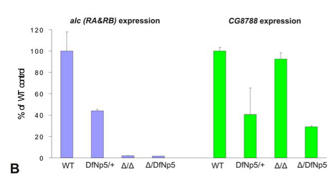

## Question

# Gene Research for Functional Annotation

## ⚠️ CRITICAL: Gene/Protein Identification Context

**BEFORE YOU BEGIN RESEARCH:** You MUST verify you are researching the CORRECT gene/protein. Gene symbols can be ambiguous, especially for less well-characterized genes from non-model organisms.

### Target Gene/Protein Identity (from UniProt):
- **UniProt Accession:** A1Z7Q8
- **Protein Description:** RecName: Full=5'-AMP-activated protein kinase subunit beta-1 {ECO:0000256|ARBA:ARBA00040010};
- **Gene Information:** Name=alc {ECO:0000313|EMBL:AAF58979.1, ECO:0000313|FlyBase:FBgn0260972}; Synonyms=8057 {ECO:0000313|EMBL:AAF58979.1}, AMPK {ECO:0000313|EMBL:AAF58979.1}, AMPKbeta {ECO:0000313|EMBL:AAF58979.1}, betaAMPK {ECO:0000313|EMBL:AAF58979.1}, Dmel\CG8057 {ECO:0000313|EMBL:AAF58979.1}, FBgn0033383 {ECO:0000313|EMBL:AAF58979.1}, l(2)45Ad {ECO:0000313|EMBL:AAF58979.1}; ORFNames=CG8057 {ECO:0000313|EMBL:AAF58979.1, ECO:0000313|FlyBase:FBgn0260972}, Dmel_CG8057 {ECO:0000313|EMBL:AAF58979.1};
- **Organism (full):** Drosophila melanogaster (Fruit fly).
- **Protein Family:** Belongs to the 5'-AMP-activated protein kinase beta subunit
- **Key Domains:** AMPK1_CBM. (IPR032640); ASC_dom. (IPR006828); ASC_dom_sf. (IPR037256); CRP1_MDG1_kinase. (IPR050827); Ig-like_fold. (IPR013783)

### MANDATORY VERIFICATION STEPS:

1. **Check if the gene symbol "alc" matches the protein description above**
2. **Verify the organism is correct:** Drosophila melanogaster (Fruit fly).
3. **Check if protein family/domains align with what you find in literature**
4. **If you find literature for a DIFFERENT gene with the same or similar symbol, STOP**

### If Gene Symbol is Ambiguous or You Cannot Find Relevant Literature:

**DO NOT PROCEED WITH RESEARCH ON A DIFFERENT GENE.** Instead:
- State clearly: "The gene symbol 'alc' is ambiguous or literature is limited for this specific protein"
- Explain what you found (e.g., "Found extensive literature on a different gene with the same symbol in a different organism")
- Describe the protein based ONLY on the UniProt information provided above
- Suggest that the protein function can be inferred from domain/family information

### Research Target:

Please provide a comprehensive research report on the gene **alc** (gene ID: alc, UniProt: A1Z7Q8) in DROME.

The research report should be a detailed narrative explaining the function, biological processes, and localization of the gene product. Citations should be given for all claims.

You should prioritize authoritative reviews and primary scientific literature when conducting research. You can supplement
this with annotations you find in gene/protein databases, but these can be outdated or inaccurate.

We are specifically interested in the primary function of the gene - for enzymes, what reaction is catalyzed, and what is the substrate specificity? For transporters, what is the substrate? For structural proteins or adapters, what is the broader structural role? For signaling molecules, what is the role in the pathway.

We are interested in where in or outside the cell the gene product carries out its function.

We are also interested in the signaling or biochemical pathways in which the gene functions. We are less interested in broad pleiotropic effects, except where these elucidate the precise role.

Include evidence where possible. We are interested in both experimental evidence as well as inference from structure, evolution, or bioinformatic analysis. Precise studies should be prioritized over high-throughput, where available.

## Output

Question: You are an expert researcher providing comprehensive, well-cited information.

Provide detailed information focusing on:
1. Key concepts and definitions with current understanding
2. Recent developments and latest research (prioritize 2023-2024 sources)
3. Current applications and real-world implementations
4. Expert opinions and analysis from authoritative sources
5. Relevant statistics and data from recent studies

Format as a comprehensive research report with proper citations. Include URLs and publication dates where available.
Always prioritize recent, authoritative sources and provide specific citations for all major claims.

# Gene Research for Functional Annotation

## ⚠️ CRITICAL: Gene/Protein Identification Context

**BEFORE YOU BEGIN RESEARCH:** You MUST verify you are researching the CORRECT gene/protein. Gene symbols can be ambiguous, especially for less well-characterized genes from non-model organisms.

### Target Gene/Protein Identity (from UniProt):
- **UniProt Accession:** A1Z7Q8
- **Protein Description:** RecName: Full=5'-AMP-activated protein kinase subunit beta-1 {ECO:0000256|ARBA:ARBA00040010};
- **Gene Information:** Name=alc {ECO:0000313|EMBL:AAF58979.1, ECO:0000313|FlyBase:FBgn0260972}; Synonyms=8057 {ECO:0000313|EMBL:AAF58979.1}, AMPK {ECO:0000313|EMBL:AAF58979.1}, AMPKbeta {ECO:0000313|EMBL:AAF58979.1}, betaAMPK {ECO:0000313|EMBL:AAF58979.1}, Dmel\CG8057 {ECO:0000313|EMBL:AAF58979.1}, FBgn0033383 {ECO:0000313|EMBL:AAF58979.1}, l(2)45Ad {ECO:0000313|EMBL:AAF58979.1}; ORFNames=CG8057 {ECO:0000313|EMBL:AAF58979.1, ECO:0000313|FlyBase:FBgn0260972}, Dmel_CG8057 {ECO:0000313|EMBL:AAF58979.1};
- **Organism (full):** Drosophila melanogaster (Fruit fly).
- **Protein Family:** Belongs to the 5'-AMP-activated protein kinase beta subunit
- **Key Domains:** AMPK1_CBM. (IPR032640); ASC_dom. (IPR006828); ASC_dom_sf. (IPR037256); CRP1_MDG1_kinase. (IPR050827); Ig-like_fold. (IPR013783)

### MANDATORY VERIFICATION STEPS:

1. **Check if the gene symbol "alc" matches the protein description above**
2. **Verify the organism is correct:** Drosophila melanogaster (Fruit fly).
3. **Check if protein family/domains align with what you find in literature**
4. **If you find literature for a DIFFERENT gene with the same or similar symbol, STOP**

### If Gene Symbol is Ambiguous or You Cannot Find Relevant Literature:

**DO NOT PROCEED WITH RESEARCH ON A DIFFERENT GENE.** Instead:
- State clearly: "The gene symbol 'alc' is ambiguous or literature is limited for this specific protein"
- Explain what you found (e.g., "Found extensive literature on a different gene with the same symbol in a different organism")
- Describe the protein based ONLY on the UniProt information provided above
- Suggest that the protein function can be inferred from domain/family information

### Research Target:

Please provide a comprehensive research report on the gene **alc** (gene ID: alc, UniProt: A1Z7Q8) in DROME.

The research report should be a detailed narrative explaining the function, biological processes, and localization of the gene product. Citations should be given for all claims.

You should prioritize authoritative reviews and primary scientific literature when conducting research. You can supplement
this with annotations you find in gene/protein databases, but these can be outdated or inaccurate.

We are specifically interested in the primary function of the gene - for enzymes, what reaction is catalyzed, and what is the substrate specificity? For transporters, what is the substrate? For structural proteins or adapters, what is the broader structural role? For signaling molecules, what is the role in the pathway.

We are interested in where in or outside the cell the gene product carries out its function.

We are also interested in the signaling or biochemical pathways in which the gene functions. We are less interested in broad pleiotropic effects, except where these elucidate the precise role.

Include evidence where possible. We are interested in both experimental evidence as well as inference from structure, evolution, or bioinformatic analysis. Precise studies should be prioritized over high-throughput, where available.

# Functional annotation of *Drosophila melanogaster alc* (UniProt A1Z7Q8)

## Identity and primary molecular function

**Identity verified.** The gene specified as *alc* in the question is *alicorn*, also called **CG8057**, in *Drosophila melanogaster*. A primary genetic study identifies it as the fly’s single AMP-activated protein kinase **β subunit** homolog; independent fly literature distinguishes it from the catalytic AMPKα gene and the regulatory AMPKγ gene. The published *alc* locus mapping, loss-of-expression alleles, and rescue by wild-type *alc* establish that the studied gene is the intended locus, not another use of “alc.” (spasic2008drosophilaalicornis pages 2-3, braco2012energydependentmodulationof pages 2-3, spasic2008drosophilaalicornis pages 3-4)

**Alc is a regulatory and structural component of the intracellular AMPK energy-sensing complex, not an enzyme in its own right.** An AMPK complex contains catalytic α, scaffolding/regulatory β, and adenine-nucleotide-sensing γ subunits. Thus, there is no reaction or catalytic substrate specificity to assign to isolated Alc: protein phosphorylation is performed by α within the assembled complex. The β C-terminal region supports complex assembly, whereas a conserved β carbohydrate-binding module (CBM) is implicated in association with glycogen-like glucose polymers. A fly *alc* nonsense allele truncating the conserved C-terminal, predicted complex-interaction region is lethal; expressing wild-type *alc* rescues viability. The interaction-region assignment rests on sequence conservation, while the genetic requirement is directly demonstrated. (spasic2008drosophilaalicornis pages 3-4, spasic2008drosophilaalicornis pages 9-10, janzen2018interactiverolesfor pages 1-3, spasic2008drosophilaalicornis media a2510d2e)

**Ligand specificity requires a cross-species qualification.** Direct biochemical work on non-fly AMPKβ showed saturable glycogen binding by its carbohydrate-binding region; mutations of key residues abolished binding, and β-cyclodextrin competed with binding, with approximately **1.5 mM** half-maximal inhibition in that experiment. Later work indicates that glycogen branching influences binding. These findings make glycogen association plausible for the annotated fly AMPKβ CBM, but they do **not** measure Alc–glycogen affinity or prove a particular fly carbohydrate preference. AMP and ADP recognition belong primarily to γ-subunit CBS domains, not to Alc. Although the supplied UniProt annotation lists several domain-family labels, the experimentally interpretable assignment here is the AMPKβ scaffold/CBM architecture; those other labels should not be treated as independently demonstrated Alc activities. (janzen2018interactiverolesfor pages 1-3, janzen2018interactiverolesfor pages 3-5, polekhina2003ampkβsubunit pages 1-2, janzen2018interactiverolesfor pages 5-6)

## Cellular location and pathway

Alc functions **inside cells**, as part of AMPK signaling in neurons and other expressing tissues; embryonic *alc* expression is broad, with a strong maternal contribution. Direct fly experiments establish functional requirements in photoreceptors, optic-lobe tissue, class-IV sensory neurons, and circadian pacemaker neurons. They do **not** establish a definitive organelle, membrane, or nuclear address for the **Alc protein itself**. Cytoplasmic glycogen association is plausible from studies of other species’ β subunits, whereas lysosomal AMPK activation is described in broader AMPK literature; neither should be reported as a demonstrated subcellular localization of fly Alc. In particular, GFP-LC3 puncta reported in *alc* mutants locate autophagic structures, **not Alc**. (spasic2008drosophilaalicornis pages 3-4, cho2019ampactivatedproteinkinase pages 9-10, poels2012autophagyandphagocytosislike pages 2-4, polekhina2003ampkβsubunit pages 2-4, smiles2024newdevelopmentsin pages 2-4)

The best-supported pathway assignment is **Alc/AMPKβ → functional AMPK αβγ signaling → adaptation to energetic demand**. In the conserved mechanism, LKB1 or Ca²⁺-responsive CaMKK2 can activate AMPK by phosphorylating α; AMP/ADP binding to γ regulates that activation. AMPK then opposes energy-consuming growth programs and interacts with mTORC1 and autophagy regulators, including ULK1. A 2024 expert review describes both AMPK inhibition of mTORC1 through TSC2/Raptor and reciprocal mTORC1-to-AMPK regulation. Those specific phosphorylation routes and mammalian subunit sites are **pathway context, not direct biochemical measurements on Alc**. A useful fly-specific functional readout is that neuronal *alc* knockdown reduced phosphorylated AMPKα in heads by approximately **60%**, consistent with impaired AMPK-complex activation. (nagy2018ampksignalinglinked pages 4-6, smiles2024newdevelopmentsin pages 1-2, smiles2024newdevelopmentsin pages 2-4, smiles2024newdevelopmentsin pages 4-6)

## Directly observed biological roles

**Maintenance of metabolically active neurons.** In *alc*-mutant eyes, photoreceptors differentiate and initially retain normal morphology and polarity-marker distribution, but subsequently develop progressive rhabdomere loss, retinal disorganization, and neurophysiological impairment. Darkness substantially limits degeneration; blocking phototransduction with *norpA* protects retinal structure even more strongly. Rescue with wild-type *alc* links the defect to the locus. These interventions support a requirement for Alc-dependent AMPK signaling **after differentiation, particularly during neuronal activity**, rather than a primary role in establishing photoreceptor polarity. Failure of the apoptosis inhibitor p35 to rescue argues against the tested conventional apoptotic mechanism. The experiments establish protection during activity-associated stress, but not the precise immediate molecular cause of cell loss. (spasic2008drosophilaalicornis pages 7-9, spasic2008drosophilaalicornis pages 3-4, spasic2008drosophilaalicornis pages 4-7)

**Dendrites, learning, and sleep.** Neuron-specific *alc* RNAi produced a progressive dendritic maintenance defect in class-IV sensory neurons: branch number was **35% lower** in feeding larvae and **68% lower** in older wandering larvae; dendritic length was **25%** and **44% lower**, respectively. Beading and fragmentation reinforce the maintenance interpretation, although the wandering-larva length comparison had only **three larvae per group**. In courtship conditioning, control groups reduced courtship by **77%** and **67%** after training, whereas neuronal *alc*-knockdown males showed essentially no learning response (*n* = 33 per genotype). Independently, neuronal knockdown shortened sleep bouts, increased their number, impaired rebound sleep after deprivation, and reduced overall sleep; neuronal Alc rescue restored sleep measures in the reported experiments. These are strong in-vivo functional observations, but neither learning nor sleep identifies a direct Alc-binding substrate. (nagy2018ampksignalinglinked pages 6-7, nagy2018ampksignalinglinked pages 11-13, nagy2018ampksignalinglinked pages 9-11, nagy2018ampksignalinglinked pages 4-6, nagy2018ampksignalinglinked pages 7-9)

**Autophagy is context-dependent, not simply absent when Alc is lost.** In energy-stressed *alc* mutants, abundant GFP-LC3 puncta colocalized with LysoTracker-positive compartments. Reducing autophagy genetically—through *Atg8a* or *Atg7* perturbation or dominant-negative *Atg1*—ameliorated retinal degeneration or electrophysiological defects. Consequently, Alc-dependent AMPK is **not obligatory for autophagy induction in those tissues**; excessive autophagy contributes to the mutant phenotype. The investigators proposed disrupted feedback among energy stress, AMPK, TOR, and autophagy, rather than a simple linear assertion that Alc directly switches autophagy on. (poels2012autophagyandphagocytosislike pages 5-6, poels2012autophagyandphagocytosislike pages 2-4, poels2012autophagyandphagocytosislike pages 6-10, poels2012autophagyandphagocytosislike pages 4-5)

**Circadian signaling provides a more specific downstream connection.** Fly AMPKβ depletion reduces CLOCK (CLK) abundance in pacemaker neurons and reduces transcriptional output of CLK/CYCLE targets *period* and *vrille*. Purified **AMPK holoenzyme** phosphorylates CLK *in vitro*, with phosphorylation enhanced by AMP; restoring CLK expression suppresses the β-knockdown long-period phenotype and restores an approximately **24-hour** period. This supports an Alc-containing AMPK complex in circadian-clock regulation, while avoiding the incorrect claim that isolated Alc phosphorylates CLK. The study measured neuronal CLK staining rather than directly locating Alc within those neurons. (cho2019ampactivatedproteinkinase pages 9-10, cho2019ampactivatedproteinkinase pages 1-2)

The table separates experimentally established fly roles from assignments inferred from conserved AMPKβ biochemistry. (spasic2008drosophilaalicornis pages 2-3, nagy2018ampksignalinglinked pages 4-6, polekhina2003ampkβsubunit pages 1-2)

| Molecular/process role | Decisive experiment or observation | Evidence strength and limitation |
|---|---|---|
| **Identity and core role:** Alc/CG8057 is the single *D. melanogaster* AMPK **β regulatory subunit**, not the catalytic kinase | Locus mapping identified CG8057/*alc*; a nonsense allele removed the conserved C-terminal complex-interacting region, and wild-type *alc* cDNA rescued lethality. AMPK’s kinase activity resides in α, while β scaffolds the αβγ heterotrimer. (spasic2008drosophilaalicornis pages 2-3, spasic2008drosophilaalicornis pages 3-4) | **Strong, fly-specific genetic evidence.** The C-terminal interaction-region assignment is sequence-based; Alc itself has no demonstrated catalytic reaction. |
| **Carbohydrate/glycogen association:** predicted Alc carbohydrate-binding module | The fly protein’s family/domain annotation and conserved AMPK-β architecture predict carbohydrate binding. In mammalian β, recombinant residues ~68–163 bound glycogen saturably; W100G and K126Q abolished binding, and β-cyclodextrin inhibited binding with an approximate half-maximal value of 1.5 mM. (polekhina2003ampkβsubunit pages 1-2) | **Strong for mammalian AMPKβ; inferential for fly Alc.** No direct Alc–glycogen affinity or substrate-specificity measurement was identified. |
| **Activity-dependent photoreceptor maintenance** | *alc* mutant photoreceptors differentiated normally but progressively degenerated. Constant darkness markedly suppressed degeneration, and blocking phototransduction with *norpA* nearly preserved retinal structure; wild-type *alc*/AMPK expression rescued mutant defects. (spasic2008drosophilaalicornis pages 7-9) | **Strong fly genetic and environmental-intervention evidence.** Establishes protection of active neurons, but not Alc protein’s precise subcellular location or a direct downstream substrate. |
| **Autophagy regulation during energy stress** | Despite AMPKβ loss, mutant optic lobes and fat body formed abundant GFP-LC3 puncta that colocalized with LysoTracker. Atg8a loss, dominant-negative Atg1, or Atg7 mutation suppressed degeneration and improved retinal physiology. (poels2012autophagyandphagocytosislike pages 2-4) | **Strong functional evidence that excessive AMPK-independent autophagy contributes to degeneration.** GFP-LC3 marks autophagic compartments—not Alc localization—and the results do not mean Alc directly catalyzes autophagy. |
| **AMPK-complex activation and dendritic maintenance** | Pan-neuronal *alc* RNAi reduced head phospho-AMPKα by ~60%. In class-IV sensory neurons, branch number fell 35% in feeding larvae and 68% in older wandering larvae; progressive beading and fragmentation supported a maintenance defect. (nagy2018ampksignalinglinked pages 4-6) | **Strong knockdown and biochemical-readout evidence**, reinforced by age progression. RNAi is not a direct Alc–substrate assay, and the wandering-larva dendrite-length sample was small (*n*=3). |
| **Sleep consolidation and homeostasis** | Two independent neuronal RNAi lines caused shorter, more numerous sleep bouts; neuronal Alc rescue restored total sleep and reduced fragmentation. Principal monitoring groups contained ~31–32 flies per genotype. (nagy2018ampksignalinglinked pages 9-11) | **Strong fly behavioral evidence with rescue and independent RNAi.** It establishes a requirement for neuronal Alc/AMPK in sleep maintenance, not a direct molecular sleep substrate. |
| **Circadian CLOCK regulation** | AMPKβ knockdown reduced CLK in pacemaker neurons and lowered *per*/*vri* transcription and protein output. Purified **AMPK holoenzyme**, not β alone, phosphorylated CLK in vitro; CLK expression restored an approximately 24-hour period. (cho2019ampactivatedproteinkinase pages 9-10) | **Strong pathway evidence combining knockdown, kinase assay, and rescue.** CLK phosphorylation is catalyzed by AMPKα within the holoenzyme; Alc is the regulatory/scaffolding β component, not the kinase. |

*Table: Evidence-strength summary for *Drosophila melanogaster alc*/CG8057 (A1Z7Q8), separating direct fly experiments from conserved AMPKβ inference. It highlights that Alc is a regulatory scaffold rather than an enzyme and avoids misassigning GFP-LC3 as Alc localization.*

## Research currency, applications, and limits

The direct experiments make *alc* loss-of-function, tissue-specific RNAi, and rescue useful **fly research implementations** for studying neuronal energy stress, dendritic integrity, sleep homeostasis, and clock regulation. A cell-based RNAi screen also identified *alicorn* among AMPK components promoting vaccinia infection; however, the detailed actin/macropinocytosis mechanism was largely established in subsequent broader AMPK or mammalian-cell experiments, not as an Alc-specific fly biochemical reaction. These are experimental model applications, **not established clinical applications of fly Alc**. (nagy2018ampksignalinglinked pages 9-11, nagy2018ampksignalinglinked pages 4-6, cho2019ampactivatedproteinkinase pages 9-10, moser2010akinomernai pages 3-5, moser2010akinomernai pages 6-8)

**Recent-literature assessment.** Targeted searches for 2023–2024 studies did not yield a confidently *alc*/CG8057-specific primary molecular characterization. Accordingly, the most informative direct fly papers here predate that interval; the **2024** AMPK–mTORC1 review updates pathway interpretation but must not be mistaken for a new Alc-localization or binding experiment. The principal unresolved annotation questions are direct Alc protein localization, binding and specificity for fly glycogen-related carbohydrates, and which local AMPK substrates mediate the retinal and dendritic phenotypes. (polekhina2003ampkβsubunit pages 1-2, smiles2024newdevelopmentsin pages 1-2, spasic2008drosophilaalicornis pages 3-4)

### Selected sources and publication dates

- Spasić MR, Callaerts P, Norga KK. “Drosophila alicorn Is a Neuronal Maintenance Factor Protecting against Activity-Induced Retinal Degeneration.” *Journal of Neuroscience*, **18 June 2008**. https://doi.org/10.1523/JNEUROSCI.1646-08.2008. (spasic2008drosophilaalicornis pages 2-3, spasic2008drosophilaalicornis pages 3-4)
- Polekhina G *et al.* “AMPK β Subunit Targets Metabolic Stress Sensing to Glycogen.” *Current Biology*, **May 2003**; biochemical evidence from non-fly AMPKβ. https://doi.org/10.1016/S0960-9822(03)00292-6. (polekhina2003ampkβsubunit pages 1-2)
- Poels J *et al.* “Autophagy and phagocytosis-like cell cannibalism exert opposing effects on cellular survival during metabolic stress.” *Cell Death & Differentiation*, **April 2012**. https://doi.org/10.1038/cdd.2012.37. (poels2012autophagyandphagocytosislike pages 2-4)
- Nagy S *et al.* “AMPK signaling linked to the schizophrenia-associated 1q21.1 deletion is required for neuronal and sleep maintenance.” *PLOS Genetics*, **19 December 2018**. https://doi.org/10.1371/journal.pgen.1007623. (nagy2018ampksignalinglinked pages 9-11, nagy2018ampksignalinglinked pages 4-6)
- Cho E *et al.* “AMP-Activated Protein Kinase Regulates Circadian Rhythm by Affecting CLOCK in Drosophila.” *Journal of Neuroscience*, **May 2019**. https://doi.org/10.1523/JNEUROSCI.2344-18.2019. (cho2019ampactivatedproteinkinase pages 9-10)
- Smiles WJ *et al.* “New developments in AMPK and mTORC1 cross-talk.” *Essays in Biochemistry*, **November 2024**; authoritative pathway review, not an Alc-specific experiment. https://doi.org/10.1042/EBC20240007. (smiles2024newdevelopmentsin pages 1-2, smiles2024newdevelopmentsin pages 4-6)

References

1. (spasic2008drosophilaalicornis pages 2-3): M. R. Spasic, P. Callaerts, and K. K. Norga. Drosophila alicorn is a neuronal maintenance factor protecting against activity-induced retinal degeneration. Journal of Neuroscience, 28:6419-6429, Jun 2008. URL: https://doi.org/10.1523/jneurosci.1646-08.2008, doi:10.1523/jneurosci.1646-08.2008. This article has 68 citations and is from a highest quality peer-reviewed journal.

2. (braco2012energydependentmodulationof pages 2-3): Jason T Braco, Emily L Gillespie, Gregory E Alberto, Jay E Brenman, and Erik C Johnson. Energy-dependent modulation of glucagon-like signaling in drosophila via the amp-activated protein kinase. Genetics, 192:457-466, Oct 2012. URL: https://doi.org/10.1534/genetics.112.143610, doi:10.1534/genetics.112.143610. This article has 86 citations and is from a domain leading peer-reviewed journal.

3. (spasic2008drosophilaalicornis pages 3-4): M. R. Spasic, P. Callaerts, and K. K. Norga. Drosophila alicorn is a neuronal maintenance factor protecting against activity-induced retinal degeneration. Journal of Neuroscience, 28:6419-6429, Jun 2008. URL: https://doi.org/10.1523/jneurosci.1646-08.2008, doi:10.1523/jneurosci.1646-08.2008. This article has 68 citations and is from a highest quality peer-reviewed journal.

4. (spasic2008drosophilaalicornis pages 9-10): M. R. Spasic, P. Callaerts, and K. K. Norga. Drosophila alicorn is a neuronal maintenance factor protecting against activity-induced retinal degeneration. Journal of Neuroscience, 28:6419-6429, Jun 2008. URL: https://doi.org/10.1523/jneurosci.1646-08.2008, doi:10.1523/jneurosci.1646-08.2008. This article has 68 citations and is from a highest quality peer-reviewed journal.

5. (janzen2018interactiverolesfor pages 1-3): Natalie R. Janzen, Jamie Whitfield, and Nolan J. Hoffman. Interactive roles for ampk and glycogen from cellular energy sensing to exercise metabolism. International Journal of Molecular Sciences, 19:3344, Oct 2018. URL: https://doi.org/10.3390/ijms19113344, doi:10.3390/ijms19113344. This article has 113 citations.

6. (spasic2008drosophilaalicornis media a2510d2e): M. R. Spasic, P. Callaerts, and K. K. Norga. Drosophila alicorn is a neuronal maintenance factor protecting against activity-induced retinal degeneration. Journal of Neuroscience, 28:6419-6429, Jun 2008. URL: https://doi.org/10.1523/jneurosci.1646-08.2008, doi:10.1523/jneurosci.1646-08.2008. This article has 68 citations and is from a highest quality peer-reviewed journal.

7. (janzen2018interactiverolesfor pages 3-5): Natalie R. Janzen, Jamie Whitfield, and Nolan J. Hoffman. Interactive roles for ampk and glycogen from cellular energy sensing to exercise metabolism. International Journal of Molecular Sciences, 19:3344, Oct 2018. URL: https://doi.org/10.3390/ijms19113344, doi:10.3390/ijms19113344. This article has 113 citations.

8. (polekhina2003ampkβsubunit pages 1-2): Galina Polekhina, Abhilasha Gupta, Belinda J. Michell, Bryce van Denderen, Sid Murthy, Susanne C. Feil, Ian G. Jennings, Duncan J. Campbell, Lee A. Witters, Michael W. Parker, Bruce E. Kemp, and David Stapleton. Ampk β subunit targets metabolic stress sensing to glycogen. Current Biology, 13:867-871, May 2003. URL: https://doi.org/10.1016/s0960-9822(03)00292-6, doi:10.1016/s0960-9822(03)00292-6. This article has 585 citations and is from a highest quality peer-reviewed journal.

9. (janzen2018interactiverolesfor pages 5-6): Natalie R. Janzen, Jamie Whitfield, and Nolan J. Hoffman. Interactive roles for ampk and glycogen from cellular energy sensing to exercise metabolism. International Journal of Molecular Sciences, 19:3344, Oct 2018. URL: https://doi.org/10.3390/ijms19113344, doi:10.3390/ijms19113344. This article has 113 citations.

10. (cho2019ampactivatedproteinkinase pages 9-10): Eunjoo Cho, Miri Kwon, Jaewon Jung, Doo Hyun Kang, Sanghee Jin, Sung-E Choi, Yup Kang, and Eun Young Kim. Amp-activated protein kinase regulates circadian rhythm by affecting clock in drosophila. The Journal of Neuroscience, 39:3537-3550, May 2019. URL: https://doi.org/10.1523/jneurosci.2344-18.2019, doi:10.1523/jneurosci.2344-18.2019. This article has 21 citations.

11. (poels2012autophagyandphagocytosislike pages 2-4): J. Poels, Miloš R. Spasić, Marc Gistelinck, Julie Mutert, Annik Schellens, Patrick Callaerts, and Koen Norga. Autophagy and phagocytosis-like cell cannibalism exert opposing effects on cellular survival during metabolic stress. Cell Death and Differentiation, 19:1590-1601, Apr 2012. URL: https://doi.org/10.1038/cdd.2012.37, doi:10.1038/cdd.2012.37. This article has 12 citations and is from a domain leading peer-reviewed journal.

12. (polekhina2003ampkβsubunit pages 2-4): Galina Polekhina, Abhilasha Gupta, Belinda J. Michell, Bryce van Denderen, Sid Murthy, Susanne C. Feil, Ian G. Jennings, Duncan J. Campbell, Lee A. Witters, Michael W. Parker, Bruce E. Kemp, and David Stapleton. Ampk β subunit targets metabolic stress sensing to glycogen. Current Biology, 13:867-871, May 2003. URL: https://doi.org/10.1016/s0960-9822(03)00292-6, doi:10.1016/s0960-9822(03)00292-6. This article has 585 citations and is from a highest quality peer-reviewed journal.

13. (smiles2024newdevelopmentsin pages 2-4): William J. Smiles, Ashley J. Ovens, Bruce E. Kemp, Sandra Galic, Janni Petersen, and Jonathan S. Oakhill. New developments in ampk and mtorc1 cross-talk. Essays in Biochemistry, 68:321-336, Nov 2024. URL: https://doi.org/10.1042/ebc20240007, doi:10.1042/ebc20240007. This article has 122 citations and is from a peer-reviewed journal.

14. (nagy2018ampksignalinglinked pages 4-6): Stanislav Nagy, Gianna W. Maurer, Julie L. Hentze, Morten Rose, Thomas M. Werge, and Kim Rewitz. Ampk signaling linked to the schizophrenia-associated 1q21.1 deletion is required for neuronal and sleep maintenance. PLOS Genetics, 14:e1007623, Dec 2018. URL: https://doi.org/10.1371/journal.pgen.1007623, doi:10.1371/journal.pgen.1007623. This article has 50 citations and is from a domain leading peer-reviewed journal.

15. (smiles2024newdevelopmentsin pages 1-2): William J. Smiles, Ashley J. Ovens, Bruce E. Kemp, Sandra Galic, Janni Petersen, and Jonathan S. Oakhill. New developments in ampk and mtorc1 cross-talk. Essays in Biochemistry, 68:321-336, Nov 2024. URL: https://doi.org/10.1042/ebc20240007, doi:10.1042/ebc20240007. This article has 122 citations and is from a peer-reviewed journal.

16. (smiles2024newdevelopmentsin pages 4-6): William J. Smiles, Ashley J. Ovens, Bruce E. Kemp, Sandra Galic, Janni Petersen, and Jonathan S. Oakhill. New developments in ampk and mtorc1 cross-talk. Essays in Biochemistry, 68:321-336, Nov 2024. URL: https://doi.org/10.1042/ebc20240007, doi:10.1042/ebc20240007. This article has 122 citations and is from a peer-reviewed journal.

17. (spasic2008drosophilaalicornis pages 7-9): M. R. Spasic, P. Callaerts, and K. K. Norga. Drosophila alicorn is a neuronal maintenance factor protecting against activity-induced retinal degeneration. Journal of Neuroscience, 28:6419-6429, Jun 2008. URL: https://doi.org/10.1523/jneurosci.1646-08.2008, doi:10.1523/jneurosci.1646-08.2008. This article has 68 citations and is from a highest quality peer-reviewed journal.

18. (spasic2008drosophilaalicornis pages 4-7): M. R. Spasic, P. Callaerts, and K. K. Norga. Drosophila alicorn is a neuronal maintenance factor protecting against activity-induced retinal degeneration. Journal of Neuroscience, 28:6419-6429, Jun 2008. URL: https://doi.org/10.1523/jneurosci.1646-08.2008, doi:10.1523/jneurosci.1646-08.2008. This article has 68 citations and is from a highest quality peer-reviewed journal.

19. (nagy2018ampksignalinglinked pages 6-7): Stanislav Nagy, Gianna W. Maurer, Julie L. Hentze, Morten Rose, Thomas M. Werge, and Kim Rewitz. Ampk signaling linked to the schizophrenia-associated 1q21.1 deletion is required for neuronal and sleep maintenance. PLOS Genetics, 14:e1007623, Dec 2018. URL: https://doi.org/10.1371/journal.pgen.1007623, doi:10.1371/journal.pgen.1007623. This article has 50 citations and is from a domain leading peer-reviewed journal.

20. (nagy2018ampksignalinglinked pages 11-13): Stanislav Nagy, Gianna W. Maurer, Julie L. Hentze, Morten Rose, Thomas M. Werge, and Kim Rewitz. Ampk signaling linked to the schizophrenia-associated 1q21.1 deletion is required for neuronal and sleep maintenance. PLOS Genetics, 14:e1007623, Dec 2018. URL: https://doi.org/10.1371/journal.pgen.1007623, doi:10.1371/journal.pgen.1007623. This article has 50 citations and is from a domain leading peer-reviewed journal.

21. (nagy2018ampksignalinglinked pages 9-11): Stanislav Nagy, Gianna W. Maurer, Julie L. Hentze, Morten Rose, Thomas M. Werge, and Kim Rewitz. Ampk signaling linked to the schizophrenia-associated 1q21.1 deletion is required for neuronal and sleep maintenance. PLOS Genetics, 14:e1007623, Dec 2018. URL: https://doi.org/10.1371/journal.pgen.1007623, doi:10.1371/journal.pgen.1007623. This article has 50 citations and is from a domain leading peer-reviewed journal.

22. (nagy2018ampksignalinglinked pages 7-9): Stanislav Nagy, Gianna W. Maurer, Julie L. Hentze, Morten Rose, Thomas M. Werge, and Kim Rewitz. Ampk signaling linked to the schizophrenia-associated 1q21.1 deletion is required for neuronal and sleep maintenance. PLOS Genetics, 14:e1007623, Dec 2018. URL: https://doi.org/10.1371/journal.pgen.1007623, doi:10.1371/journal.pgen.1007623. This article has 50 citations and is from a domain leading peer-reviewed journal.

23. (poels2012autophagyandphagocytosislike pages 5-6): J. Poels, Miloš R. Spasić, Marc Gistelinck, Julie Mutert, Annik Schellens, Patrick Callaerts, and Koen Norga. Autophagy and phagocytosis-like cell cannibalism exert opposing effects on cellular survival during metabolic stress. Cell Death and Differentiation, 19:1590-1601, Apr 2012. URL: https://doi.org/10.1038/cdd.2012.37, doi:10.1038/cdd.2012.37. This article has 12 citations and is from a domain leading peer-reviewed journal.

24. (poels2012autophagyandphagocytosislike pages 6-10): J. Poels, Miloš R. Spasić, Marc Gistelinck, Julie Mutert, Annik Schellens, Patrick Callaerts, and Koen Norga. Autophagy and phagocytosis-like cell cannibalism exert opposing effects on cellular survival during metabolic stress. Cell Death and Differentiation, 19:1590-1601, Apr 2012. URL: https://doi.org/10.1038/cdd.2012.37, doi:10.1038/cdd.2012.37. This article has 12 citations and is from a domain leading peer-reviewed journal.

25. (poels2012autophagyandphagocytosislike pages 4-5): J. Poels, Miloš R. Spasić, Marc Gistelinck, Julie Mutert, Annik Schellens, Patrick Callaerts, and Koen Norga. Autophagy and phagocytosis-like cell cannibalism exert opposing effects on cellular survival during metabolic stress. Cell Death and Differentiation, 19:1590-1601, Apr 2012. URL: https://doi.org/10.1038/cdd.2012.37, doi:10.1038/cdd.2012.37. This article has 12 citations and is from a domain leading peer-reviewed journal.

26. (cho2019ampactivatedproteinkinase pages 1-2): Eunjoo Cho, Miri Kwon, Jaewon Jung, Doo Hyun Kang, Sanghee Jin, Sung-E Choi, Yup Kang, and Eun Young Kim. Amp-activated protein kinase regulates circadian rhythm by affecting clock in drosophila. The Journal of Neuroscience, 39:3537-3550, May 2019. URL: https://doi.org/10.1523/jneurosci.2344-18.2019, doi:10.1523/jneurosci.2344-18.2019. This article has 21 citations.

27. (moser2010akinomernai pages 3-5): Theresa S. Moser, Russell G. Jones, Craig B. Thompson, Carolyn B. Coyne, and Sara Cherry. A kinome rnai screen identified ampk as promoting poxvirus entry through the control of actin dynamics. PLoS Pathogens, 6:e1000954, Jun 2010. URL: https://doi.org/10.1371/journal.ppat.1000954, doi:10.1371/journal.ppat.1000954. This article has 116 citations and is from a highest quality peer-reviewed journal.

28. (moser2010akinomernai pages 6-8): Theresa S. Moser, Russell G. Jones, Craig B. Thompson, Carolyn B. Coyne, and Sara Cherry. A kinome rnai screen identified ampk as promoting poxvirus entry through the control of actin dynamics. PLoS Pathogens, 6:e1000954, Jun 2010. URL: https://doi.org/10.1371/journal.ppat.1000954, doi:10.1371/journal.ppat.1000954. This article has 116 citations and is from a highest quality peer-reviewed journal.

## Artifacts

- [Edison artifact artifact-00](alc-deep-research-falcon_artifacts/artifact-00.md)

## Citations

1. spasic2008drosophilaalicornis pages 7-9
2. poels2012autophagyandphagocytosislike pages 2-4
3. nagy2018ampksignalinglinked pages 4-6
4. nagy2018ampksignalinglinked pages 9-11
5. cho2019ampactivatedproteinkinase pages 9-10
6. spasic2008drosophilaalicornis pages 2-3
7. braco2012energydependentmodulationof pages 2-3
8. spasic2008drosophilaalicornis pages 3-4
9. spasic2008drosophilaalicornis pages 9-10
10. janzen2018interactiverolesfor pages 1-3
11. janzen2018interactiverolesfor pages 3-5
12. janzen2018interactiverolesfor pages 5-6
13. smiles2024newdevelopmentsin pages 2-4
14. smiles2024newdevelopmentsin pages 1-2
15. smiles2024newdevelopmentsin pages 4-6
16. spasic2008drosophilaalicornis pages 4-7
17. nagy2018ampksignalinglinked pages 6-7
18. nagy2018ampksignalinglinked pages 11-13
19. nagy2018ampksignalinglinked pages 7-9
20. poels2012autophagyandphagocytosislike pages 5-6
21. poels2012autophagyandphagocytosislike pages 6-10
22. poels2012autophagyandphagocytosislike pages 4-5
23. cho2019ampactivatedproteinkinase pages 1-2
24. moser2010akinomernai pages 3-5
25. moser2010akinomernai pages 6-8
26. https://doi.org/10.1523/JNEUROSCI.1646-08.2008.
27. https://doi.org/10.1016/S0960-9822(03
28. https://doi.org/10.1038/cdd.2012.37.
29. https://doi.org/10.1371/journal.pgen.1007623.
30. https://doi.org/10.1523/JNEUROSCI.2344-18.2019.
31. https://doi.org/10.1042/EBC20240007.
32. https://doi.org/10.1523/jneurosci.1646-08.2008,
33. https://doi.org/10.1534/genetics.112.143610,
34. https://doi.org/10.3390/ijms19113344,
35. https://doi.org/10.1016/s0960-9822(03
36. https://doi.org/10.1523/jneurosci.2344-18.2019,
37. https://doi.org/10.1038/cdd.2012.37,
38. https://doi.org/10.1042/ebc20240007,
39. https://doi.org/10.1371/journal.pgen.1007623,
40. https://doi.org/10.1371/journal.ppat.1000954,