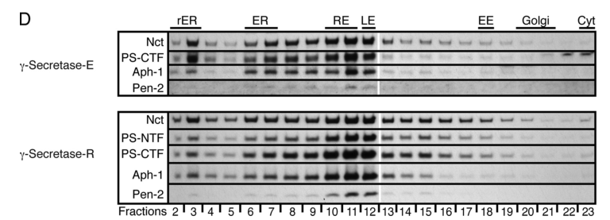

## Question

# Gene Research for Functional Annotation

## ⚠️ CRITICAL: Gene/Protein Identification Context

**BEFORE YOU BEGIN RESEARCH:** You MUST verify you are researching the CORRECT gene/protein. Gene symbols can be ambiguous, especially for less well-characterized genes from non-model organisms.

### Target Gene/Protein Identity (from UniProt):
- **UniProt Accession:** Q9VQG2
- **Protein Description:** RecName: Full=Gamma-secretase subunit Aph-1; AltName: Full=Presenilin-stabilization factor;
- **Gene Information:** Name=aph-1; Synonyms=PSF; ORFNames=CG2855;
- **Organism (full):** Drosophila melanogaster (Fruit fly).
- **Protein Family:** Belongs to the APH-1 family. .
- **Key Domains:** Aph-1. (IPR009294); Aph-1 (PF06105)

### MANDATORY VERIFICATION STEPS:

1. **Check if the gene symbol "aph-1" matches the protein description above**
2. **Verify the organism is correct:** Drosophila melanogaster (Fruit fly).
3. **Check if protein family/domains align with what you find in literature**
4. **If you find literature for a DIFFERENT gene with the same or similar symbol, STOP**

### If Gene Symbol is Ambiguous or You Cannot Find Relevant Literature:

**DO NOT PROCEED WITH RESEARCH ON A DIFFERENT GENE.** Instead:
- State clearly: "The gene symbol 'aph-1' is ambiguous or literature is limited for this specific protein"
- Explain what you found (e.g., "Found extensive literature on a different gene with the same symbol in a different organism")
- Describe the protein based ONLY on the UniProt information provided above
- Suggest that the protein function can be inferred from domain/family information

### Research Target:

Please provide a comprehensive research report on the gene **aph-1** (gene ID: aph-1, UniProt: Q9VQG2) in DROME.

The research report should be a detailed narrative explaining the function, biological processes, and localization of the gene product. Citations should be given for all claims.

You should prioritize authoritative reviews and primary scientific literature when conducting research. You can supplement
this with annotations you find in gene/protein databases, but these can be outdated or inaccurate.

We are specifically interested in the primary function of the gene - for enzymes, what reaction is catalyzed, and what is the substrate specificity? For transporters, what is the substrate? For structural proteins or adapters, what is the broader structural role? For signaling molecules, what is the role in the pathway.

We are interested in where in or outside the cell the gene product carries out its function.

We are also interested in the signaling or biochemical pathways in which the gene functions. We are less interested in broad pleiotropic effects, except where these elucidate the precise role.

Include evidence where possible. We are interested in both experimental evidence as well as inference from structure, evolution, or bioinformatic analysis. Precise studies should be prioritized over high-throughput, where available.

## Output

Question: You are an expert researcher providing comprehensive, well-cited information.

Provide detailed information focusing on:
1. Key concepts and definitions with current understanding
2. Recent developments and latest research (prioritize 2023-2024 sources)
3. Current applications and real-world implementations
4. Expert opinions and analysis from authoritative sources
5. Relevant statistics and data from recent studies

Format as a comprehensive research report with proper citations. Include URLs and publication dates where available.
Always prioritize recent, authoritative sources and provide specific citations for all major claims.

# Gene Research for Functional Annotation

## ⚠️ CRITICAL: Gene/Protein Identification Context

**BEFORE YOU BEGIN RESEARCH:** You MUST verify you are researching the CORRECT gene/protein. Gene symbols can be ambiguous, especially for less well-characterized genes from non-model organisms.

### Target Gene/Protein Identity (from UniProt):
- **UniProt Accession:** Q9VQG2
- **Protein Description:** RecName: Full=Gamma-secretase subunit Aph-1; AltName: Full=Presenilin-stabilization factor;
- **Gene Information:** Name=aph-1; Synonyms=PSF; ORFNames=CG2855;
- **Organism (full):** Drosophila melanogaster (Fruit fly).
- **Protein Family:** Belongs to the APH-1 family. .
- **Key Domains:** Aph-1. (IPR009294); Aph-1 (PF06105)

### MANDATORY VERIFICATION STEPS:

1. **Check if the gene symbol "aph-1" matches the protein description above**
2. **Verify the organism is correct:** Drosophila melanogaster (Fruit fly).
3. **Check if protein family/domains align with what you find in literature**
4. **If you find literature for a DIFFERENT gene with the same or similar symbol, STOP**

### If Gene Symbol is Ambiguous or You Cannot Find Relevant Literature:

**DO NOT PROCEED WITH RESEARCH ON A DIFFERENT GENE.** Instead:
- State clearly: "The gene symbol 'aph-1' is ambiguous or literature is limited for this specific protein"
- Explain what you found (e.g., "Found extensive literature on a different gene with the same symbol in a different organism")
- Describe the protein based ONLY on the UniProt information provided above
- Suggest that the protein function can be inferred from domain/family information

### Research Target:

Please provide a comprehensive research report on the gene **aph-1** (gene ID: aph-1, UniProt: Q9VQG2) in DROME.

The research report should be a detailed narrative explaining the function, biological processes, and localization of the gene product. Citations should be given for all claims.

You should prioritize authoritative reviews and primary scientific literature when conducting research. You can supplement
this with annotations you find in gene/protein databases, but these can be outdated or inaccurate.

We are specifically interested in the primary function of the gene - for enzymes, what reaction is catalyzed, and what is the substrate specificity? For transporters, what is the substrate? For structural proteins or adapters, what is the broader structural role? For signaling molecules, what is the role in the pathway.

We are interested in where in or outside the cell the gene product carries out its function.

We are also interested in the signaling or biochemical pathways in which the gene functions. We are less interested in broad pleiotropic effects, except where these elucidate the precise role.

Include evidence where possible. We are interested in both experimental evidence as well as inference from structure, evolution, or bioinformatic analysis. Precise studies should be prioritized over high-throughput, where available.

# Functional annotation of *Drosophila melanogaster aph-1*

## Identity and principal conclusion

The target specified by the supplied UniProt record is **Q9VQG2**, *D. melanogaster* **aph-1** (synonym **PSF**; ORF **CG2855**), annotated as an APH-1-family protein with Aph-1 domains **IPR009294/PF06105**. The fly literature independently identifies Aph-1 as the fly’s single Aph-1 homolog and a subunit of the presenilin-dependent γ-secretase complex. The papers examined do not themselves print the Q9VQG2–CG2855 accession mapping, so that mapping rests on the identifier supplied in the question; the functional conclusions below concern **fly Aph-1**, not the distinct *C. elegans* aph-1 gene or human APH1A/APH1B paralogs. (stempfle2010invivoreconstitution pages 1-2, francis2002aph1andpen2 pages 1-2)

**Primary function:** Aph-1 is a multipass, integral-membrane **assembly and stabilizing subunit** of γ-secretase. It associates early with nicastrin (Nct), helps recruit and stabilize presenilin (Psn), and supports formation, trafficking, and continued function of the active complex containing Psn, Nct, Aph-1, and Pen-2. **Aph-1 does not itself catalyze peptide-bond cleavage**: the intramembrane aspartyl-protease active site resides in presenilin. Consequently, Aph-1 has no independently established catalytic reaction or substrate specificity; any effects on substrate processing are effects of the assembled enzyme and its cellular context. (niimura2005aph1contributesto pages 1-2, stempfle2010invivoreconstitution pages 1-2, cooper2009aph‐1isrequired pages 1-3)

## Molecular mechanism and evidence

In fly Schneider 2 cells, RNAi/rescue and co-immunoprecipitation experiments showed that Aph-1 forms an **Aph-1–Nct subcomplex** even when Psn or Pen-2 is depleted. Substitutions in conserved glycine residues of Aph-1’s transmembrane **GXXXG** motif preserved detectable Nct association but disrupted association with Psn and Pen-2, impaired complex formation, and prevented normal trafficking. These findings support a transmembrane structural or *scaffold* role, rather than assigning an active site to Aph-1. Aph-1 depletion also destabilized other components: Niimura and colleagues measured an Nct half-life of **6.8 hours** after Aph-1 depletion and a Psn holoprotein half-life of **2 hours**, accompanied by loss of stable Psn fragments. The authors interpret the glycine-motif effects as involving protein stability and transmembrane interactions; an exact atomic fly Aph-1–Psn interface was not established by those experiments. (niimura2005aph1contributesto pages 3-5, niimura2005aph1contributesto pages 6-7, niimura2005aph1contributesto pages 7-8)

Functional evidence comes from independent fly-cell and whole-animal tests. In Dmel2 cells, RNAi against *aph-1* reduced cleavage-dependent **Notch NECN-GV** and **human βAPP C99-GV** reporter signals and secretion of **Aβ40 and Aβ42**; cleavage-independent intracellular-domain controls were spared. Processed Psn C-terminal fragment levels also fell. The APP/Aβ experiment is a **human-substrate assay performed in fly cells**, not evidence that human APP is a native fly protein. In transgenic flies, tagged **Aph1-V5 completely rescued** the lethal amorphic *aph1D35* allele under tubulin-GAL4 expression and **partially rescued** it under armadillo-GAL4 expression, verifying that the tagged fly protein can function in vivo. (francis2002aph1andpen2 pages 7-8, francis2002aph1andpen2 pages 9-10, stempfle2010invivoreconstitution pages 1-2)

Importantly, Aph-1’s requirement is **not exhausted by helping Psn undergo endoproteolysis**. In *aph-1* mutant wing mosaics, Notch-associated wing defects remained when modified Psn proteins bypassed or did not require the usual Psn-cleavage step. The result supports a further requirement for Aph-1 in functional γ-secretase, although those genetics alone cannot decide whether its post-assembly contribution is structural, trafficking-related, or both. (cooper2009aph‐1isrequired pages 1-3, cooper2009aph‐1isrequired pages 4-6)

The study-by-study distinction between direct fly experiments and more recent human structural inference is summarized here. (francis2002aph1andpen2 pages 7-8, niimura2005aph1contributesto pages 3-5, cooper2009aph‐1isrequired pages 1-3, stempfle2010invivoreconstitution pages 1-2, odorcic2024apoandaβ46bound pages 1-2)

| Study/date | Model and test | Key result | Inference scope |
|---|---|---|---|
| [Francis et al., July 2002](https://doi.org/10.1016/S1534-5807(02)00189-2) | *Drosophila* Dmel2 cells; RNAi against `aph-1`, `pen-2`, `nct`, or `psn`; cleavage-dependent Notch NECN-GV and βAPP C99-GV reporters, cleavage-independent controls, Aβ40/Aβ42 assays, and Psn immunoblotting | `aph-1` depletion inhibited Notch and βAPP γ-secretase reporters while sparing downstream controls; it reduced Aβ40/Aβ42 production and processed Psn accumulation. | **Direct fly functional evidence:** Aph-1 is required for Psn-dependent γ-secretase activity and Psn stability, but these assays do not show that Aph-1 is catalytic. (francis2002aph1andpen2 pages 9-10, francis2002aph1andpen2 pages 8-9, francis2002aph1andpen2 pages 7-8) |
| [Niimura et al., April 2005](https://doi.org/10.1074/jbc.M409829200) | *Drosophila* S2 cells; UTR-targeted RNAi/rescue, co-immunoprecipitation, cycloheximide chase, Aph-1 TMD4 GXXXG substitutions, and iodixanol-gradient fractionation | Aph-1 formed an early ER subcomplex with Nct. GXXXG mutations retained Nct binding but disrupted association with Psn/Pen-2 and ER-to-Golgi trafficking. Aph-1 depletion shortened Nct half-life to **6.8 h**, caused loss of stable Psn fragments, and gave Psn holoprotein a **2 h** half-life. | **Strongest direct fly mechanistic evidence:** Aph-1 is a transmembrane stabilizing scaffold for complex assembly and trafficking, not the proteolytic active site. (niimura2005aph1contributesto pages 6-7, niimura2005aph1contributesto pages 7-8, niimura2005aph1contributesto pages 3-5) |
| [Cooper et al., March 2009](https://doi.org/10.1002/dvg.20478) | Mosaic `aph-1` mutant cells in fly wings; Notch phenotypes assessed while expressing pre-cleaved PsnNTF/PsnCTF or endoproteolysis-deficient/deletion Psn variants | `aph-1` mutant clones retained Notch-like notched-wing and thickened-vein defects even when Psn endoproteolysis was bypassed; Notch target-gene assays supported continued Aph-1 dependence. | **Direct in-vivo fly evidence:** Aph-1 remains necessary after Psn fragment generation, consistent with a role in the mature complex or its trafficking rather than merely enabling Psn cleavage. (cooper2009aph‐1isrequired pages 4-6, cooper2009aph‐1isrequired pages 1-3) |
| [Stempfle et al., July 2010](https://doi.org/10.1128/MCB.00030-10) | Transgenic flies; Aph1-V5 complementation of lethal amorphic `aph1D35`; coexpression, co-IP, and purification of Psn/Nct/Aph-1/Pen-2; organelle fractionation and in-vivo substrate reporters | Aph1-V5 completely rescued `aph1D35` with tubulin-GAL4 and partially rescued it with armadillo-GAL4. Four-subunit expression yielded active γ-secretase resembling the endogenous complex and enriched with Rab7/Rab11 endosomal fractions. It enhanced fly APPL processing and Notch output, whereas reconstituted enzyme processed human APP poorly; APLP2 showed only a slight cleavage increase. | **Highest-level in-vivo validation:** tagged fly Aph-1 is functional and belongs to the active four-component complex. Substrate behavior is context-dependent, so human APP results should not be generalized to fly APPL or Notch. (stempfle2010invivoreconstitution pages 1-2, stempfle2010invivoreconstitution pages 4-6, stempfle2010invivoreconstitution pages 6-7, stempfle2010invivoreconstitution pages 7-9, stempfle2010invivoreconstitution media 37fcc7cd) |
| [Odorčić et al., May 2024](https://doi.org/10.1038/s41467-024-48776-2) | Human PSEN1/APH-1B γ-secretase in lipid nanodiscs; apo and Aβ46-bound cryo-EM plus functional mutagenesis | Three divergent APH-1 regions contacted PSEN1; Aβ46 binding rearranged a PSEN1–APH-1 interface. PSEN1 substrate contacts supported recognition and sequential cleavage, suggesting APH-1-dependent allosteric modulation. | **Recent but non-fly structural inference:** supports a conserved architectural/modulatory model, but does not directly establish the corresponding contacts, Aβ processivity, or substrate specificity of *Drosophila* Q9VQG2. (odorcic2024apoandaβ46bound pages 5-7, odorcic2024apoandaβ46bound pages 1-2, odorcic2024apoandaβ46bound pages 4-5) |

*Table: Evidence progresses from fly-cell loss-of-function and assembly studies to in-vivo genetic reconstitution. The 2024 human APH-1B structure is separated explicitly as comparative, non-Drosophila evidence.*

## Biological process, pathway, and substrates

Aph-1 acts in **regulated intramembrane proteolysis**, most clearly the **Notch signaling pathway** in flies. Following extracellular cleavage of ligand-activated Notch, the Aph-1-containing γ-secretase complex cleaves the remaining membrane-associated receptor, releasing its intracellular domain for nuclear signaling. Thus Aph-1 is required for the protease step that enables Notch-dependent transcription and developmental cell-fate decisions; it is **not itself the Notch ligand, receptor, or transcription factor**. Fly *aph-1* mutant wing phenotypes and loss of cleavage-dependent Notch reporter activity support this assignment. (francis2002aph1andpen2 pages 1-2, francis2002aph1andpen2 pages 7-8, cooper2009aph‐1isrequired pages 1-3)

The assembled enzyme can also process **APP-family membrane fragments**, but its behavior is substrate- and assay-dependent. Reconstitution of the four fly subunits in vivo increased cleavage of the **fly APP homolog APPL** and enhanced Notch-pathway output. In a Notch-response reporter experiment, **15%** of examined experimental wing discs showed a substantial local increase and an additional **30%** a weak increase (**n = 30**); neither pattern was seen in controls (**n = 40**). By contrast, engineered in-vivo reporters showed **reduced processing of human APP** by the reconstituted fly complex and only a slight increase for human **APLP2**. The researchers concluded that additional physiological factors can govern substrate-dependent activity. These observations must not be collapsed into a claim that fly Aph-1 has a fixed, intrinsic preference for Notch over every APP-family substrate: **fly APPL and introduced human APP behaved differently**, and Aph-1 is one subunit rather than the substrate-cleaving enzyme. (stempfle2010invivoreconstitution pages 4-6, stempfle2010invivoreconstitution pages 6-7, stempfle2010invivoreconstitution pages 7-9)

## Where Aph-1 functions

Fly-cell membrane fractionation places the Aph-1–Nct assembly intermediate in the **endoplasmic reticulum (ER)**. Wild-type Aph-1 and other assembled components occur across **ER and Golgi-associated fractions**, whereas Aph-1 glycine-motif variants defective in assembly were retained in ER-enriched fractions. In adult fly heads, endogenous and four-subunit-reconstituted γ-secretase had similar distributions, predominantly in fractions bearing **Rab7 late-endosomal** and **Rab11 recycling-endosomal** markers. Figure 2D of the reconstitution study directly displays those fractionation patterns. Together, the experiments support Aph-1 acting as part of intracellular membrane complexes during ER assembly, subsequent secretory trafficking, and endosomal γ-secretase function. Fraction overlap establishes association with membrane compartments; it does **not** by itself pinpoint a unique cleavage site or prove exclusive endosomal residence. Nor does the cited fly Aph-1 evidence establish a specific extracellular or cell-surface pool of Aph-1. (niimura2005aph1contributesto pages 3-5, stempfle2010invivoreconstitution pages 4-6, stempfle2010invivoreconstitution media 37fcc7cd)

## Recent research and annotation limits

The most directly informative studies retrieved for **this fly protein** are the 2002–2010 genetic, cell-biological, and reconstitution experiments above. A **May 2024** cryo-electron-microscopy study instead examined **human PSEN1/APH-1B γ-secretase** in lipid nanodiscs, with and without an **Aβ46** intermediate. It found several APH-1B–PSEN1 contact regions and substrate-associated changes at an interface, providing a plausible structural explanation for how an APH-1-family subunit can influence enzyme conformation and sequential APP processing. This strengthens the broader architectural interpretation but **does not directly measure Q9VQG2**, demonstrate identical fly interfaces, or establish fly-specific Aβ processivity. No 2023–2024 primary result retrieved here supersedes the direct Drosophila experiments for this gene’s functional annotation. (odorcic2024apoandaβ46bound pages 1-2, odorcic2024apoandaβ46bound pages 5-7, stempfle2010invivoreconstitution pages 1-2)

**Recommended annotation:** *D. melanogaster* Aph-1 is a noncatalytic, multipass membrane scaffold and stabilizer of the Psn–Nct–Pen-2 γ-secretase complex, required for efficient complex assembly/trafficking and Notch-receptor intramembrane cleavage; the assembled complex can also cleave APP-family substrates, with context-dependent efficiency. Evidence is direct for the fly protein’s γ-secretase/Notch role and ER-to-Golgi/endosomal association, while human APH-1B atomic interactions remain comparative inference. (niimura2005aph1contributesto pages 1-2, francis2002aph1andpen2 pages 7-8, niimura2005aph1contributesto pages 3-5, stempfle2010invivoreconstitution pages 4-6, odorcic2024apoandaβ46bound pages 1-2)

### Principal sources and publication dates

- Francis *et al.*, **July 2002**, *Developmental Cell*, “aph-1 and pen-2 Are Required for Notch Pathway Signaling, γ-Secretase Cleavage of βAPP, and Presenilin Protein Accumulation.” https://doi.org/10.1016/S1534-5807(02)00189-2 (francis2002aph1andpen2 pages 1-2)
- Niimura *et al.*, **April 2005**, *Journal of Biological Chemistry*, “Aph-1 Contributes to the Stabilization and Trafficking of the γ-Secretase Complex…” https://doi.org/10.1074/jbc.M409829200 (niimura2005aph1contributesto pages 1-2)
- Cooper *et al.*, **March 2009** issue, *genesis*, “Aph-1 Is Required to Regulate Presenilin-Mediated γ-Secretase Activity and Cell Survival in Drosophila Wing Development.” https://doi.org/10.1002/dvg.20478 (cooper2009aph‐1isrequired pages 1-3)
- Stempfle *et al.*, **July 2010** issue, *Molecular and Cellular Biology*, “In Vivo Reconstitution of γ-Secretase in Drosophila Results in Substrate Specificity.” https://doi.org/10.1128/MCB.00030-10 (stempfle2010invivoreconstitution pages 1-2)
- Odorčić *et al.*, **May 2024**, *Nature Communications*, “Apo and Aβ46-bound γ-secretase structures provide insights into amyloid-β processing by the APH-1B isoform” (**human comparator, not fly Q9VQG2**). https://doi.org/10.1038/s41467-024-48776-2 (odorcic2024apoandaβ46bound pages 1-2)

References

1. (stempfle2010invivoreconstitution pages 1-2): Denise Stempfle, Ritu Kanwar, Alexander Loewer, Mark E. Fortini, and Gunter Merdes. <i>in vivo</i> reconstitution of γ-secretase in <i>drosophila</i> results in substrate specificity. Molecular and Cellular Biology, 30:3165-3175, Jul 2010. URL: https://doi.org/10.1128/mcb.00030-10, doi:10.1128/mcb.00030-10. This article has 32 citations and is from a domain leading peer-reviewed journal.

2. (francis2002aph1andpen2 pages 1-2): Ross Francis, Garth McGrath, Jianhuan Zhang, David A. Ruddy, Mary Sym, Javier Apfeld, Monique Nicoll, Mark Maxwell, Bing Hai, Michael C. Ellis, Annette L. Parks, Wei Xu, Jinhe Li, Mark Gurney, Richard L. Myers, Carol S. Himes, Ronald Hiebsch, Cara Ruble, Jeffrey S. Nye, and Daniel Curtis. Aph-1 and pen-2 are required for notch pathway signaling, γ-secretase cleavage of βapp, and presenilin protein accumulation. Developmental Cell, 3:85-97, Jul 2002. URL: https://doi.org/10.1016/s1534-5807(02)00189-2, doi:10.1016/s1534-5807(02)00189-2. This article has 1211 citations and is from a highest quality peer-reviewed journal.

3. (niimura2005aph1contributesto pages 1-2): Manabu Niimura, Noriko Isoo, Nobumasa Takasugi, Makiko Tsuruoka, Kumiko Ui-Tei, Kaoru Saigo, Yuichi Morohashi, Taisuke Tomita, and Takeshi Iwatsubo. Aph-1 contributes to the stabilization and trafficking of the γ-secretase complex through mechanisms involving intermolecular and intramolecular interactions*. Journal of Biological Chemistry, 280:12967-12975, Apr 2005. URL: https://doi.org/10.1074/jbc.m409829200, doi:10.1074/jbc.m409829200. This article has 163 citations and is from a domain leading peer-reviewed journal.

4. (cooper2009aph‐1isrequired pages 1-3): Emilie Cooper, Wu‐Min Deng, and Hui‐Min Chung. Aph‐1 is required to regulate presenilin‐mediated γ‐secretase activity and cell survival in drosophila wing development. genesis, 47:169-174, Mar 2009. URL: https://doi.org/10.1002/dvg.20478, doi:10.1002/dvg.20478. This article has 4 citations and is from a peer-reviewed journal.

5. (niimura2005aph1contributesto pages 3-5): Manabu Niimura, Noriko Isoo, Nobumasa Takasugi, Makiko Tsuruoka, Kumiko Ui-Tei, Kaoru Saigo, Yuichi Morohashi, Taisuke Tomita, and Takeshi Iwatsubo. Aph-1 contributes to the stabilization and trafficking of the γ-secretase complex through mechanisms involving intermolecular and intramolecular interactions*. Journal of Biological Chemistry, 280:12967-12975, Apr 2005. URL: https://doi.org/10.1074/jbc.m409829200, doi:10.1074/jbc.m409829200. This article has 163 citations and is from a domain leading peer-reviewed journal.

6. (niimura2005aph1contributesto pages 6-7): Manabu Niimura, Noriko Isoo, Nobumasa Takasugi, Makiko Tsuruoka, Kumiko Ui-Tei, Kaoru Saigo, Yuichi Morohashi, Taisuke Tomita, and Takeshi Iwatsubo. Aph-1 contributes to the stabilization and trafficking of the γ-secretase complex through mechanisms involving intermolecular and intramolecular interactions*. Journal of Biological Chemistry, 280:12967-12975, Apr 2005. URL: https://doi.org/10.1074/jbc.m409829200, doi:10.1074/jbc.m409829200. This article has 163 citations and is from a domain leading peer-reviewed journal.

7. (niimura2005aph1contributesto pages 7-8): Manabu Niimura, Noriko Isoo, Nobumasa Takasugi, Makiko Tsuruoka, Kumiko Ui-Tei, Kaoru Saigo, Yuichi Morohashi, Taisuke Tomita, and Takeshi Iwatsubo. Aph-1 contributes to the stabilization and trafficking of the γ-secretase complex through mechanisms involving intermolecular and intramolecular interactions*. Journal of Biological Chemistry, 280:12967-12975, Apr 2005. URL: https://doi.org/10.1074/jbc.m409829200, doi:10.1074/jbc.m409829200. This article has 163 citations and is from a domain leading peer-reviewed journal.

8. (francis2002aph1andpen2 pages 7-8): Ross Francis, Garth McGrath, Jianhuan Zhang, David A. Ruddy, Mary Sym, Javier Apfeld, Monique Nicoll, Mark Maxwell, Bing Hai, Michael C. Ellis, Annette L. Parks, Wei Xu, Jinhe Li, Mark Gurney, Richard L. Myers, Carol S. Himes, Ronald Hiebsch, Cara Ruble, Jeffrey S. Nye, and Daniel Curtis. Aph-1 and pen-2 are required for notch pathway signaling, γ-secretase cleavage of βapp, and presenilin protein accumulation. Developmental Cell, 3:85-97, Jul 2002. URL: https://doi.org/10.1016/s1534-5807(02)00189-2, doi:10.1016/s1534-5807(02)00189-2. This article has 1211 citations and is from a highest quality peer-reviewed journal.

9. (francis2002aph1andpen2 pages 9-10): Ross Francis, Garth McGrath, Jianhuan Zhang, David A. Ruddy, Mary Sym, Javier Apfeld, Monique Nicoll, Mark Maxwell, Bing Hai, Michael C. Ellis, Annette L. Parks, Wei Xu, Jinhe Li, Mark Gurney, Richard L. Myers, Carol S. Himes, Ronald Hiebsch, Cara Ruble, Jeffrey S. Nye, and Daniel Curtis. Aph-1 and pen-2 are required for notch pathway signaling, γ-secretase cleavage of βapp, and presenilin protein accumulation. Developmental Cell, 3:85-97, Jul 2002. URL: https://doi.org/10.1016/s1534-5807(02)00189-2, doi:10.1016/s1534-5807(02)00189-2. This article has 1211 citations and is from a highest quality peer-reviewed journal.

10. (cooper2009aph‐1isrequired pages 4-6): Emilie Cooper, Wu‐Min Deng, and Hui‐Min Chung. Aph‐1 is required to regulate presenilin‐mediated γ‐secretase activity and cell survival in drosophila wing development. genesis, 47:169-174, Mar 2009. URL: https://doi.org/10.1002/dvg.20478, doi:10.1002/dvg.20478. This article has 4 citations and is from a peer-reviewed journal.

11. (odorcic2024apoandaβ46bound pages 1-2): Ivica Odorčić, Mohamed Belal Hamed, Sam Lismont, Lucía Chávez-Gutiérrez, and Rouslan G. Efremov. Apo and aβ46-bound γ-secretase structures provide insights into amyloid-β processing by the aph-1b isoform. Nature Communications, May 2024. URL: https://doi.org/10.1038/s41467-024-48776-2, doi:10.1038/s41467-024-48776-2. This article has 16 citations and is from a highest quality peer-reviewed journal.

12. (francis2002aph1andpen2 pages 8-9): Ross Francis, Garth McGrath, Jianhuan Zhang, David A. Ruddy, Mary Sym, Javier Apfeld, Monique Nicoll, Mark Maxwell, Bing Hai, Michael C. Ellis, Annette L. Parks, Wei Xu, Jinhe Li, Mark Gurney, Richard L. Myers, Carol S. Himes, Ronald Hiebsch, Cara Ruble, Jeffrey S. Nye, and Daniel Curtis. Aph-1 and pen-2 are required for notch pathway signaling, γ-secretase cleavage of βapp, and presenilin protein accumulation. Developmental Cell, 3:85-97, Jul 2002. URL: https://doi.org/10.1016/s1534-5807(02)00189-2, doi:10.1016/s1534-5807(02)00189-2. This article has 1211 citations and is from a highest quality peer-reviewed journal.

13. (stempfle2010invivoreconstitution pages 4-6): Denise Stempfle, Ritu Kanwar, Alexander Loewer, Mark E. Fortini, and Gunter Merdes. <i>in vivo</i> reconstitution of γ-secretase in <i>drosophila</i> results in substrate specificity. Molecular and Cellular Biology, 30:3165-3175, Jul 2010. URL: https://doi.org/10.1128/mcb.00030-10, doi:10.1128/mcb.00030-10. This article has 32 citations and is from a domain leading peer-reviewed journal.

14. (stempfle2010invivoreconstitution pages 6-7): Denise Stempfle, Ritu Kanwar, Alexander Loewer, Mark E. Fortini, and Gunter Merdes. <i>in vivo</i> reconstitution of γ-secretase in <i>drosophila</i> results in substrate specificity. Molecular and Cellular Biology, 30:3165-3175, Jul 2010. URL: https://doi.org/10.1128/mcb.00030-10, doi:10.1128/mcb.00030-10. This article has 32 citations and is from a domain leading peer-reviewed journal.

15. (stempfle2010invivoreconstitution pages 7-9): Denise Stempfle, Ritu Kanwar, Alexander Loewer, Mark E. Fortini, and Gunter Merdes. <i>in vivo</i> reconstitution of γ-secretase in <i>drosophila</i> results in substrate specificity. Molecular and Cellular Biology, 30:3165-3175, Jul 2010. URL: https://doi.org/10.1128/mcb.00030-10, doi:10.1128/mcb.00030-10. This article has 32 citations and is from a domain leading peer-reviewed journal.

16. (stempfle2010invivoreconstitution media 37fcc7cd): Denise Stempfle, Ritu Kanwar, Alexander Loewer, Mark E. Fortini, and Gunter Merdes. <i>in vivo</i> reconstitution of γ-secretase in <i>drosophila</i> results in substrate specificity. Molecular and Cellular Biology, 30:3165-3175, Jul 2010. URL: https://doi.org/10.1128/mcb.00030-10, doi:10.1128/mcb.00030-10. This article has 32 citations and is from a domain leading peer-reviewed journal.

17. (odorcic2024apoandaβ46bound pages 5-7): Ivica Odorčić, Mohamed Belal Hamed, Sam Lismont, Lucía Chávez-Gutiérrez, and Rouslan G. Efremov. Apo and aβ46-bound γ-secretase structures provide insights into amyloid-β processing by the aph-1b isoform. Nature Communications, May 2024. URL: https://doi.org/10.1038/s41467-024-48776-2, doi:10.1038/s41467-024-48776-2. This article has 16 citations and is from a highest quality peer-reviewed journal.

18. (odorcic2024apoandaβ46bound pages 4-5): Ivica Odorčić, Mohamed Belal Hamed, Sam Lismont, Lucía Chávez-Gutiérrez, and Rouslan G. Efremov. Apo and aβ46-bound γ-secretase structures provide insights into amyloid-β processing by the aph-1b isoform. Nature Communications, May 2024. URL: https://doi.org/10.1038/s41467-024-48776-2, doi:10.1038/s41467-024-48776-2. This article has 16 citations and is from a highest quality peer-reviewed journal.

## Artifacts

- [Edison artifact artifact-00](aph-1-deep-research-falcon_artifacts/artifact-00.md)

## Citations

1. stempfle2010invivoreconstitution pages 1-2
2. stempfle2010invivoreconstitution pages 4-6
3. stempfle2010invivoreconstitution pages 6-7
4. stempfle2010invivoreconstitution pages 7-9
5. Francis et al., July 2002
6. Niimura et al., April 2005
7. Cooper et al., March 2009
8. Stempfle et al., July 2010
9. Odorčić et al., May 2024
10. https://doi.org/10.1016/S1534-5807(02
11. https://doi.org/10.1074/jbc.M409829200
12. https://doi.org/10.1002/dvg.20478
13. https://doi.org/10.1128/MCB.00030-10
14. https://doi.org/10.1038/s41467-024-48776-2
15. https://doi.org/10.1128/mcb.00030-10,
16. https://doi.org/10.1016/s1534-5807(02
17. https://doi.org/10.1074/jbc.m409829200,
18. https://doi.org/10.1002/dvg.20478,
19. https://doi.org/10.1038/s41467-024-48776-2,