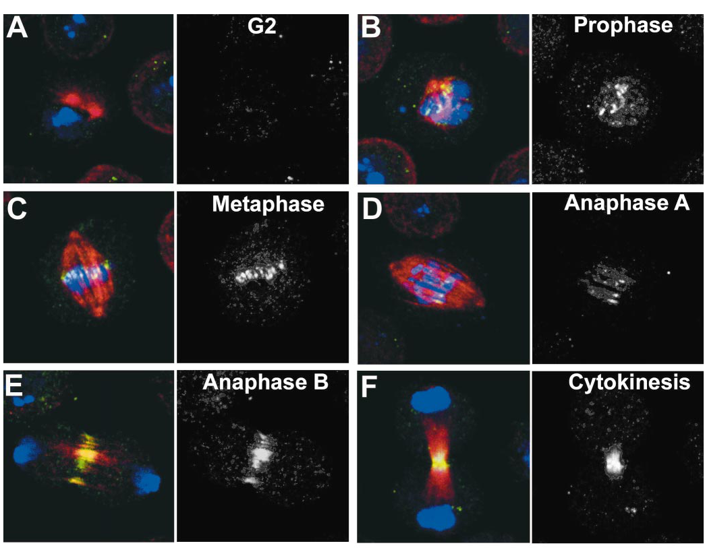

## Question

# Gene Research for Functional Annotation

## ⚠️ CRITICAL: Gene/Protein Identification Context

**BEFORE YOU BEGIN RESEARCH:** You MUST verify you are researching the CORRECT gene/protein. Gene symbols can be ambiguous, especially for less well-characterized genes from non-model organisms.

### Target Gene/Protein Identity (from UniProt):
- **UniProt Accession:** Q9VKN7
- **Protein Description:** RecName: Full=Aurora kinase B {ECO:0000305}; EC=2.7.11.1; AltName: Full=IPL1/Aurora-like protein kinase {ECO:0000303|PubMed:11266459}; AltName: Full=Serine/threonine-protein kinase Ial {ECO:0000303|PubMed:10433558}; AltName: Full=Serine/threonine-protein kinase aurora-B {ECO:0000303|PubMed:11266459};
- **Gene Information:** Name=aurB {ECO:0000312|FlyBase:FBgn0024227}; Synonyms=ial {ECO:0000303|PubMed:10433558}; ORFNames=CG6620 {ECO:0000312|FlyBase:FBgn0024227};
- **Organism (full):** Drosophila melanogaster (Fruit fly).
- **Protein Family:** Belongs to the protein kinase superfamily. Ser/Thr protein
- **Key Domains:** Aur-like. (IPR030616); Kinase-like_dom_sf. (IPR011009); Prot_kinase_dom. (IPR000719); Protein_kinase_ATP_BS. (IPR017441); Ser/Thr_kinase_AS. (IPR008271)

### MANDATORY VERIFICATION STEPS:

1. **Check if the gene symbol "aurB" matches the protein description above**
2. **Verify the organism is correct:** Drosophila melanogaster (Fruit fly).
3. **Check if protein family/domains align with what you find in literature**
4. **If you find literature for a DIFFERENT gene with the same or similar symbol, STOP**

### If Gene Symbol is Ambiguous or You Cannot Find Relevant Literature:

**DO NOT PROCEED WITH RESEARCH ON A DIFFERENT GENE.** Instead:
- State clearly: "The gene symbol 'aurB' is ambiguous or literature is limited for this specific protein"
- Explain what you found (e.g., "Found extensive literature on a different gene with the same symbol in a different organism")
- Describe the protein based ONLY on the UniProt information provided above
- Suggest that the protein function can be inferred from domain/family information

### Research Target:

Please provide a comprehensive research report on the gene **aurB** (gene ID: aurB, UniProt: Q9VKN7) in DROME.

The research report should be a detailed narrative explaining the function, biological processes, and localization of the gene product. Citations should be given for all claims.

You should prioritize authoritative reviews and primary scientific literature when conducting research. You can supplement
this with annotations you find in gene/protein databases, but these can be outdated or inaccurate.

We are specifically interested in the primary function of the gene - for enzymes, what reaction is catalyzed, and what is the substrate specificity? For transporters, what is the substrate? For structural proteins or adapters, what is the broader structural role? For signaling molecules, what is the role in the pathway.

We are interested in where in or outside the cell the gene product carries out its function.

We are also interested in the signaling or biochemical pathways in which the gene functions. We are less interested in broad pleiotropic effects, except where these elucidate the precise role.

Include evidence where possible. We are interested in both experimental evidence as well as inference from structure, evolution, or bioinformatic analysis. Precise studies should be prioritized over high-throughput, where available.

## Output

Question: You are an expert researcher providing comprehensive, well-cited information.

Provide detailed information focusing on:
1. Key concepts and definitions with current understanding
2. Recent developments and latest research (prioritize 2023-2024 sources)
3. Current applications and real-world implementations
4. Expert opinions and analysis from authoritative sources
5. Relevant statistics and data from recent studies

Format as a comprehensive research report with proper citations. Include URLs and publication dates where available.
Always prioritize recent, authoritative sources and provide specific citations for all major claims.

# Gene Research for Functional Annotation

## ⚠️ CRITICAL: Gene/Protein Identification Context

**BEFORE YOU BEGIN RESEARCH:** You MUST verify you are researching the CORRECT gene/protein. Gene symbols can be ambiguous, especially for less well-characterized genes from non-model organisms.

### Target Gene/Protein Identity (from UniProt):
- **UniProt Accession:** Q9VKN7
- **Protein Description:** RecName: Full=Aurora kinase B {ECO:0000305}; EC=2.7.11.1; AltName: Full=IPL1/Aurora-like protein kinase {ECO:0000303|PubMed:11266459}; AltName: Full=Serine/threonine-protein kinase Ial {ECO:0000303|PubMed:10433558}; AltName: Full=Serine/threonine-protein kinase aurora-B {ECO:0000303|PubMed:11266459};
- **Gene Information:** Name=aurB {ECO:0000312|FlyBase:FBgn0024227}; Synonyms=ial {ECO:0000303|PubMed:10433558}; ORFNames=CG6620 {ECO:0000312|FlyBase:FBgn0024227};
- **Organism (full):** Drosophila melanogaster (Fruit fly).
- **Protein Family:** Belongs to the protein kinase superfamily. Ser/Thr protein
- **Key Domains:** Aur-like. (IPR030616); Kinase-like_dom_sf. (IPR011009); Prot_kinase_dom. (IPR000719); Protein_kinase_ATP_BS. (IPR017441); Ser/Thr_kinase_AS. (IPR008271)

### MANDATORY VERIFICATION STEPS:

1. **Check if the gene symbol "aurB" matches the protein description above**
2. **Verify the organism is correct:** Drosophila melanogaster (Fruit fly).
3. **Check if protein family/domains align with what you find in literature**
4. **If you find literature for a DIFFERENT gene with the same or similar symbol, STOP**

### If Gene Symbol is Ambiguous or You Cannot Find Relevant Literature:

**DO NOT PROCEED WITH RESEARCH ON A DIFFERENT GENE.** Instead:
- State clearly: "The gene symbol 'aurB' is ambiguous or literature is limited for this specific protein"
- Explain what you found (e.g., "Found extensive literature on a different gene with the same symbol in a different organism")
- Describe the protein based ONLY on the UniProt information provided above
- Suggest that the protein function can be inferred from domain/family information

### Research Target:

Please provide a comprehensive research report on the gene **aurB** (gene ID: aurB, UniProt: Q9VKN7) in DROME.

The research report should be a detailed narrative explaining the function, biological processes, and localization of the gene product. Citations should be given for all claims.

You should prioritize authoritative reviews and primary scientific literature when conducting research. You can supplement
this with annotations you find in gene/protein databases, but these can be outdated or inaccurate.

We are specifically interested in the primary function of the gene - for enzymes, what reaction is catalyzed, and what is the substrate specificity? For transporters, what is the substrate? For structural proteins or adapters, what is the broader structural role? For signaling molecules, what is the role in the pathway.

We are interested in where in or outside the cell the gene product carries out its function.

We are also interested in the signaling or biochemical pathways in which the gene functions. We are less interested in broad pleiotropic effects, except where these elucidate the precise role.

Include evidence where possible. We are interested in both experimental evidence as well as inference from structure, evolution, or bioinformatic analysis. Precise studies should be prioritized over high-throughput, where available.

# Functional annotation report: *Drosophila melanogaster aurB* (Q9VKN7)

## Identity and principal function

The specified UniProt record identifies **aurB**, also called **ial** and **CG6620**, as the fruit-fly **Aurora kinase B** (EC 2.7.11.1), an Aurora-family serine/threonine protein kinase. The primary fly literature explicitly identifies *ial* as the earlier name for *aurB*. This is **not** the distinct, centrosome-associated *aurora*/*aurA* kinase: reciprocal RNA-interference experiments left the other kinase’s protein level unchanged and produced different mitotic phenotypes. The accession-to-gene mapping comes from the UniProt information supplied with the question; the cited experiments establish the matching fly protein’s identity and function. (giet2001drosophilaaurorab pages 9-10, giet2001drosophilaaurorab pages 2-3)

**Functional conclusion:** AurB is the catalytic subunit of the **chromosomal passenger complex** (CPC), which couples phosphorylation to chromosome–microtubule attachment control, chromosome organization, meiotic cohesion, central-spindle organization and cytokinesis. Fly CPC partners are the scaffold/activator **INCENP** and targeting components **Borealin** and **Survivin/Deterin**. INCENP interacts with fly Aurora B in biochemical and cellular assays; these partner proteins determine when and where its kinase activity operates. The supplied Aurora-like and protein-kinase domain annotations are consistent with this experimentally established serine/threonine kinase function. (carmena2012thechromosomalpassenger pages 2-4, carmena2012thechromosomalpassenger pages 1-2, mckim2022highwaytohell‐thy pages 1-4)

## Catalytic reaction and substrate specificity

AurB transfers the terminal phosphate of **ATP to serine or threonine hydroxyl groups in proteins**: protein–Ser/Thr + ATP → protein–phospho-Ser/Thr + ADP. It is a **protein kinase, not a DNA-binding enzyme or transporter**. Recognition is contextual rather than restricted to one substrate: a basic-residue-containing Aurora consensus, recruitment by INCENP and localization near chromatin, kinetochores or spindle microtubules all contribute. Crucially, a protein whose localization changes after *aurB* knockdown is not thereby proven to be phosphorylated directly by AurB. Fly-enzyme biochemical evidence is especially strong for **Polo Thr182**. (resnick2006incenpandaurora pages 1-2, carmena2012thechromosomalpassenger pages 5-7, repton2022thephosphodockingprotein pages 5-7)

The following evidence-ranked summary separates demonstrated biochemical phosphorylation from cellular dependence and downstream effects. (carmena2012thechromosomalpassenger pages 5-7, resnick2006incenpandaurora pages 7-8, repton2022thephosphodockingprotein pages 7-9, giet2001drosophilaaurorab pages 9-10)

| Target/site | Strength and type of evidence | Mechanistic effect | Paper (year; DOI) |
|---|---|---|---|
| **Polo Thr182** | **Strong direct evidence:** purified *Drosophila* Aurora B–INCENP phosphorylated Polo in vitro; T182A reduced phosphate incorporation by approximately half. AurB inhibition/depletion or defective INCENP reduced Polo-T182 phosphorylation in DMel-2 cells and larval neuroblasts without removing total Polo from kinetochores. (carmena2012thechromosomalpassenger pages 5-7, carmena2012thechromosomalpassenger pages 7-9) | Activates centromeric/kinetochore Polo; nonphosphorylatable Polo-T182A impaired chromosome alignment and mitotic progression. | Carmena *et al.* (2012); [10.1371/journal.pbio.1001250](https://doi.org/10.1371/journal.pbio.1001250) |
| **MEI-S332 Ser124–Ser126 cluster** | **Direct cross-species biochemical evidence:** recombinant Xenopus Aurora B–INCENP phosphorylated fly MEI-S332; replacing all three serines with alanines strongly reduced phosphorylation. The individual modified residue was not resolved. In fly S2 cells, high centromeric localization occurred in 94% of WT-expressing cells versus 33.3% for the triple mutant. (resnick2006incenpandaurora pages 7-8, resnick2006incenpandaurora pages 8-10) | Promotes stable centromeric retention of the Shugoshin MEI-S332 and thereby supports meiotic centromeric cohesion. | Resnick *et al.* (2006); [10.1016/j.devcel.2006.04.021](https://doi.org/10.1016/j.devcel.2006.04.021) |
| **Borealin/Borr Ser161** | **Direct biochemical evidence with an orthologous enzyme:** human Aurora B phosphorylated a fly Borealin fragment in vitro; S161A prevented Aurora-B-dependent exclusion of 14-3-3. In fly oocytes, S161A reduced spindle/centromere localization by 59%. No direct assay with purified fly Q9VKN7 was reported. (repton2022thephosphodockingprotein pages 9-11, repton2022thephosphodockingprotein pages 7-9) | Weakens inhibitory 14-3-3 binding, spatially promoting CPC association with meiotic spindle microtubules and homolog biorientation. | Repton *et al.* (2022); [10.1371/journal.pgen.1009995](https://doi.org/10.1371/journal.pgen.1009995) |
| **Histone H3 Ser10** | **Strong fly cellular dependency; directness not established in the foundational study:** aurB RNAi or chemical inhibition sharply reduced H3S10 phosphorylation in S2/Kc167 cells; localized Aurora-B-dependent H3S10 phosphorylation was also observed on acentric chromatin. No purified fly-enzyme kinase assay was shown. (giet2001drosophilaaurorab pages 1-2, warecki2018micronucleiformationis pages 1-7, eggert2004parallelchemicalgenetic pages 5-7) | Correlates with mitotic chromosome condensation and Barren recruitment; on lagging acentrics it excludes HP1a and locally delays nuclear-envelope reassembly. | Giet & Glover (2001), [10.1083/jcb.152.4.669](https://doi.org/10.1083/jcb.152.4.669); Warecki & Sullivan (2018), [10.1534/genetics.118.301031](https://doi.org/10.1534/genetics.118.301031) |
| **Barren condensin component** | **AurB-dependent localization, not a proven phosphorylation substrate:** aurB RNAi removed Barren from mitotic chromosomes without reducing total Barren protein. (giet2001drosophilaaurorab pages 9-10) | Supports condensin recruitment and chromosome condensation downstream of Aurora B. | Giet & Glover (2001); [10.1083/jcb.152.4.669](https://doi.org/10.1083/jcb.152.4.669) |
| **Pavarotti/Pav-KLP** | **AurB-dependent localization, not a proven direct substrate:** aurB depletion disrupted Pavarotti recruitment to the central spindle. (giet2001drosophilaaurorab pages 11-12) | Contributes to central-spindle organization and successful cytokinesis downstream of Aurora B. | Giet & Glover (2001); [10.1083/jcb.152.4.669](https://doi.org/10.1083/jcb.152.4.669) |

*Table: Evidence-ranked phosphorylation targets and downstream localization-dependent effectors of Drosophila Aurora B (aurB/Q9VKN7). The table distinguishes direct biochemical substrates from proteins whose localization merely depends on Aurora B activity.*

The most precisely established fly-enzyme reaction is phosphorylation of **Polo at its activation-loop Thr182**: purified *Drosophila* Aurora B complexed with an INCENP fragment phosphorylated Polo in vitro, and Polo-T182A reduced incorporation by approximately **one half**. In cultured fly cells and larval neuroblasts, disrupting Aurora B or INCENP sharply reduced kinetochore Polo-T182 phosphorylation while leaving detectable total kinetochore Polo and centrosomal active Polo. Thus the CPC **activates Polo at centromeres**, rather than simply recruiting Polo there; Aurora A depletion did not produce the corresponding centromeric effect. This establishes a spatially specific mitotic signaling pathway linking AurB to Polo-dependent kinetochore function. (carmena2012thechromosomalpassenger pages 5-7, carmena2012thechromosomalpassenger pages 7-9)

**Histone H3 Ser10 phosphorylation** is a robust *aurB*-dependent cellular readout: its signal falls strongly after fly *aurB* RNAi and rapidly disappears after treatment with the Aurora-pathway inhibitor binucleine 2. The foundational fly knockdown experiment does not, by itself, establish direct phosphorylation by purified fly AurB. Similarly, the accompanying loss of chromosome-associated **Barren** condensin occurs without a fall in total Barren abundance; it demonstrates an AurB-dependent recruitment step, **not** that Barren is a proven direct substrate or that H3S10 phosphorylation alone causes condensin recruitment. (giet2001drosophilaaurorab pages 1-2, giet2001drosophilaaurorab pages 9-10, eggert2004parallelchemicalgenetic pages 5-7)

Additional substrate evidence concerns meiotic CPC regulation. Fly **MEI-S332/Shugoshin** is phosphorylated in vitro by a *Xenopus* Aurora B–INCENP complex; mutating its **Ser124–Ser126 cluster** sharply diminishes phosphorylation and compromises centromeric retention of fly MEI-S332, although the individual phosphorylated serine and direct phosphorylation by purified fly Q9VKN7 were not resolved. In a separate study, **human Aurora B** acting on a fly Borealin fragment produced a **Ser161-dependent** reduction in inhibitory 14-3-3 binding; fly Borealin-S161A then impaired CPC localization in oocytes. These are compelling conserved mechanisms, but their use of orthologous enzymes should not be described as fly-enzyme-specific biochemical proof. (resnick2006incenpandaurora pages 7-8, resnick2006incenpandaurora pages 8-10, repton2022thephosphodockingprotein pages 7-9, repton2022thephosphodockingprotein pages 11-12)

## Cellular location and biological pathways

AurB acts **inside dividing cells**, with its location changing across mitosis. Specific immunostaining in *Drosophila* S2 cells detects it on condensing chromosomes in prophase, concentrated at centromeric regions by metaphase, on the **central spindle** during anaphase and at the **midbody** during cytokinesis. It was not detected above background in interphase by the antibody used in that study; that observation does not prove absolute absence. These sequential locations are why it is called a *chromosomal passenger*. The cropped primary-study micrographs directly document this progression. (giet2001drosophilaaurorab pages 2-3, giet2001drosophilaaurorab media 7f2c846a)

On early mitotic chromosomes, AurB is required for normal H3S10 phosphorylation, Barren recruitment and full chromosome condensation. At the inner centromere and kinetochore, the CPC participates in correcting inappropriate microtubule attachments while its phosphorylation of Polo provides a balancing attachment-promoting signal. At anaphase, it is needed for dense central-spindle microtubules and proper localization of the Pavarotti kinesin-like protein; failed furrow completion then produces multinucleate, polyploid cells. **Pavarotti mislocalization is an experimentally supported downstream consequence, not proof of direct phosphorylation.** (giet2001drosophilaaurorab pages 1-2, carmena2012thechromosomalpassenger pages 1-2, carmena2012thechromosomalpassenger pages 5-7, giet2001drosophilaaurorab pages 11-12)

The phenotype is substantial but context-specific: three days after *aurB* RNAi in cultured S2 cells, **70.1 ± 7.0%** of scored interphase cells were polyploid versus **7.0 ± 2.5%** of controls, and **52.6 ± 2.8%** had at least two nuclei versus **3.5 ± 1.7%** of controls. These are cultured-cell measurements, **not population-wide estimates for flies**. (giet2001drosophilaaurorab pages 3-5)

The pathway is adapted to meiosis. In *Drosophila* male meiosis I, INCENP—unlike its predominantly central-spindle redistribution in ordinary mitotic anaphase—**persists substantially at centromeres into anaphase I**. INCENP mutants disrupt MEI-S332 centromeric localization and cause premature sister separation and segregation defects, consistent with CPC-dependent preservation of centromeric cohesion until meiosis II. In the MEI-S332 phosphosite experiment, **94%** of cells expressing wild-type tagged protein showed high centromeric signal, compared with **33.3%** expressing the Ser124–Ser126 alanine mutant. (resnick2006incenpandaurora pages 2-3, resnick2006incenpandaurora pages 1-2, resnick2006incenpandaurora pages 8-10)

In female meiosis, which assembles a spindle **without centrosomes**, an expert synthesis by McKim emphasizes CPC movement between chromosomes and spindle microtubules as central to spindle assembly and homolog biorientation; this is a mechanistic framework, not a claim that every candidate kinetochore substrate has been verified in fly oocytes. Fly biochemical and live-cell work further shows that 14-3-3 regulates microtubule association of Aurora B, INCENP and Borealin. Mutating fly Borealin **S161A** lowered its measured spindle/centromere signal by **59%**, whereas mutating its 14-3-3-binding site **S163A** lowered it by **82%**; the kinase phosphorylating S163 *in vivo* remains unknown. These results place AurB activity within a spatial phosphoregulation circuit for the oocyte CPC. (mckim2022highwaytohell‐thy pages 1-4, repton2022thephosphodockingprotein pages 5-7, repton2022thephosphodockingprotein pages 9-11, repton2022thephosphodockingprotein pages 11-12)

A further experimentally observed location is **late-segregating acentric chromatin and its DNA tethers** in fly neuroblasts. Here localized Aurora-B-associated H3S10 phosphorylation excludes HP1a, delays local nuclear-envelope reassembly and permits acentric fragments to enter daughter nuclei instead of forming micronuclei. This specialized function supports a spatially restricted chromatin-signaling role rather than a general extracellular activity. (warecki2018micronucleiformationis pages 1-7)

## Recent research and practical relevance

A **2024 fly-oocyte study** dissected the kinetochore scaffold **SPC105R/KNL1** using RNAi-resistant rescue constructs. Its C-terminal amino acids **1284–1960** were necessary and sufficient to recruit NDC80 and assemble the outer kinetochore, whereas N-terminal regulatory motifs implicated Aurora B/PP1 signaling in attachment stability and metaphase-I behavior; amino acids **124–473** were particularly important for lateral microtubule interactions and homolog biorientation. This is useful **recent pathway context**, but its SPC105R-domain phenotypes should not be mistaken for a new purified-AurB substrate assay or direct proof that every affected residue is phosphorylated by fly AurB. The authors specifically discuss uncertainty about the partners and mechanism of the biorientation region. (joshi2024meiosisspecificfunctionsof pages 1-2, joshi2024meiosisspecificfunctionsof pages 2-4, joshi2024meiosisspecificfunctionsof pages 9-11, joshi2024meiosisspecificfunctionsof pages 13-14)

In practice, *Drosophila aurB* provides an experimentally tractable model for **testing cell-division mechanisms**: S2-cell RNAi distinguishes Aurora B from Aurora A; H3S10 phosphorylation and Polo-T182 phosphorylation serve as activity/pathway readouts; and short binucleine-2 exposures perturb the fly Aurora-B pathway without requiring prolonged gene depletion. A 2004 parallel RNAi–chemical screen identified **214 genes** important for cytokinesis and **50 small-molecule inhibitors**, including binucleine 2 as an Aurora-pathway probe; phenotypic similarity and loss of H3S10 phosphorylation establish pathway activity, but do not alone prove exclusive physical binding of the compound to Q9VKN7. Fly-oocyte phosphosite-rescue experiments and neuroblast imaging provide complementary applications for studying chromosome segregation and genome integrity. Human cancer relevance concerns the **human AURKB ortholog**, not a demonstrated therapeutic use of the fly protein. (giet2001drosophilaaurorab pages 9-10, eggert2004parallelchemicalgenetic pages 1-2, eggert2004parallelchemicalgenetic pages 5-7, carmena2012thechromosomalpassenger pages 5-7, repton2022thephosphodockingprotein pages 9-11, warecki2018micronucleiformationis pages 1-7)

**Evidence boundary.** The strongest detailed substrate work for this particular fly protein predates 2023–2024. The 2024 SPC105R paper advances the surrounding meiotic pathway rather than replacing those direct kinase experiments. A later *Drosophila* HP1–CPC oocyte study was available as a **May 2026 bioRxiv preprint, not certified by peer review**; its proposed HP1-mediated CPC recruitment is therefore not needed to establish the core annotation above. Claims about vertebrate Aurora B, other organisms’ “AurB” genes, or consensus motifs should not be silently substituted for experiments on Q9VKN7. (carmena2012thechromosomalpassenger pages 5-7, joshi2024meiosisspecificfunctionsof pages 1-2, wu2026aninteractionbetween pages 1-6)

### Key sources and publication dates

- Giet R, Glover DM. *Journal of Cell Biology*, **12 February 2001** online. Fly AurB localization, RNAi, chromosome condensation and cytokinesis. https://doi.org/10.1083/jcb.152.4.669 (giet2001drosophilaaurorab pages 1-2, giet2001drosophilaaurorab pages 2-3)
- Resnick TD *et al.* *Developmental Cell*, **July 2006**. INCENP, Aurora B and MEI-S332 in fly meiosis. https://doi.org/10.1016/j.devcel.2006.04.021 (resnick2006incenpandaurora pages 1-2, resnick2006incenpandaurora pages 8-10)
- Carmena M *et al.* *PLoS Biology*, **24 January 2012**. Direct fly Aurora B–INCENP phosphorylation of Polo. https://doi.org/10.1371/journal.pbio.1001250 (carmena2012thechromosomalpassenger pages 1-2, carmena2012thechromosomalpassenger pages 5-7)
- Warecki B, Sullivan W. *Genetics*, **9 July 2018** early online. Aurora-B-dependent HP1a exclusion on fly acentrics. https://doi.org/10.1534/genetics.118.301031 (warecki2018micronucleiformationis pages 1-7)
- McKim KS. *BioEssays*, **2022**. Expert synthesis of CPC localization and oocyte meiosis. https://doi.org/10.1002/bies.202100202 (mckim2022highwaytohell‐thy pages 1-4)
- Repton C *et al.* *PLoS Genetics*, **6 June 2022**. Borealin, 14-3-3 and oocyte CPC localization. https://doi.org/10.1371/journal.pgen.1009995 (repton2022thephosphodockingprotein pages 1-2, repton2022thephosphodockingprotein pages 7-9)
- Joshi JN *et al.* *Molecular Biology of the Cell*, **12 June 2024** online ahead of print; August 2024 issue. Meiotic kinetochore-domain and Aurora B/PP1 pathway context. https://doi.org/10.1091/mbc.e24-02-0067 (joshi2024meiosisspecificfunctionsof pages 1-2, joshi2024meiosisspecificfunctionsof pages 13-14)

References

1. (giet2001drosophilaaurorab pages 9-10): Régis Giet and David M. Glover. Drosophila aurora b kinase is required for histone h3 phosphorylation and condensin recruitment during chromosome condensation and to organize the central spindle during cytokinesis. The Journal of Cell Biology, 152:669-682, Feb 2001. URL: https://doi.org/10.1083/jcb.152.4.669, doi:10.1083/jcb.152.4.669. This article has 831 citations.

2. (giet2001drosophilaaurorab pages 2-3): Régis Giet and David M. Glover. Drosophila aurora b kinase is required for histone h3 phosphorylation and condensin recruitment during chromosome condensation and to organize the central spindle during cytokinesis. The Journal of Cell Biology, 152:669-682, Feb 2001. URL: https://doi.org/10.1083/jcb.152.4.669, doi:10.1083/jcb.152.4.669. This article has 831 citations.

3. (carmena2012thechromosomalpassenger pages 2-4): Mar Carmena, Xavier Pinson, Melpi Platani, Zeina Salloum, Zhenjie Xu, Anthony Clark, Fiona MacIsaac, Hiromi Ogawa, Ulrike Eggert, David M. Glover, Vincent Archambault, and William C. Earnshaw. The chromosomal passenger complex activates polo kinase at centromeres. PLoS Biology, 10:e1001250, Jan 2012. URL: https://doi.org/10.1371/journal.pbio.1001250, doi:10.1371/journal.pbio.1001250. This article has 153 citations and is from a highest quality peer-reviewed journal.

4. (carmena2012thechromosomalpassenger pages 1-2): Mar Carmena, Xavier Pinson, Melpi Platani, Zeina Salloum, Zhenjie Xu, Anthony Clark, Fiona MacIsaac, Hiromi Ogawa, Ulrike Eggert, David M. Glover, Vincent Archambault, and William C. Earnshaw. The chromosomal passenger complex activates polo kinase at centromeres. PLoS Biology, 10:e1001250, Jan 2012. URL: https://doi.org/10.1371/journal.pbio.1001250, doi:10.1371/journal.pbio.1001250. This article has 153 citations and is from a highest quality peer-reviewed journal.

5. (mckim2022highwaytohell‐thy pages 1-4): Kim S. McKim. Highway to hell‐thy meiotic divisions: chromosome passenger complex functions driven by microtubules. BioEssays, Nov 2022. URL: https://doi.org/10.1002/bies.202100202, doi:10.1002/bies.202100202. This article has 7 citations and is from a peer-reviewed journal.

6. (resnick2006incenpandaurora pages 1-2): Tamar D. Resnick, David L. Satinover, Fiona MacIsaac, P. Todd Stukenberg, William C. Earnshaw, Terry L. Orr-Weaver, and Mar Carmena. Incenp and aurora b promote meiotic sister chromatid cohesion through localization of the shugoshin mei-s332 in drosophila. Developmental cell, 11 1:57-68, Jul 2006. URL: https://doi.org/10.1016/j.devcel.2006.04.021, doi:10.1016/j.devcel.2006.04.021. This article has 171 citations and is from a highest quality peer-reviewed journal.

7. (carmena2012thechromosomalpassenger pages 5-7): Mar Carmena, Xavier Pinson, Melpi Platani, Zeina Salloum, Zhenjie Xu, Anthony Clark, Fiona MacIsaac, Hiromi Ogawa, Ulrike Eggert, David M. Glover, Vincent Archambault, and William C. Earnshaw. The chromosomal passenger complex activates polo kinase at centromeres. PLoS Biology, 10:e1001250, Jan 2012. URL: https://doi.org/10.1371/journal.pbio.1001250, doi:10.1371/journal.pbio.1001250. This article has 153 citations and is from a highest quality peer-reviewed journal.

8. (repton2022thephosphodockingprotein pages 5-7): Charlotte Repton, C. Fiona Cullen, Mariana F. A. Costa, Christos Spanos, Juri Rappsilber, and Hiroyuki Ohkura. The phospho-docking protein 14-3-3 regulates microtubule-associated proteins in oocytes including the chromosomal passenger borealin. PLOS Genetics, 18:e1009995, Jun 2022. URL: https://doi.org/10.1371/journal.pgen.1009995, doi:10.1371/journal.pgen.1009995. This article has 6 citations and is from a domain leading peer-reviewed journal.

9. (resnick2006incenpandaurora pages 7-8): Tamar D. Resnick, David L. Satinover, Fiona MacIsaac, P. Todd Stukenberg, William C. Earnshaw, Terry L. Orr-Weaver, and Mar Carmena. Incenp and aurora b promote meiotic sister chromatid cohesion through localization of the shugoshin mei-s332 in drosophila. Developmental cell, 11 1:57-68, Jul 2006. URL: https://doi.org/10.1016/j.devcel.2006.04.021, doi:10.1016/j.devcel.2006.04.021. This article has 171 citations and is from a highest quality peer-reviewed journal.

10. (repton2022thephosphodockingprotein pages 7-9): Charlotte Repton, C. Fiona Cullen, Mariana F. A. Costa, Christos Spanos, Juri Rappsilber, and Hiroyuki Ohkura. The phospho-docking protein 14-3-3 regulates microtubule-associated proteins in oocytes including the chromosomal passenger borealin. PLOS Genetics, 18:e1009995, Jun 2022. URL: https://doi.org/10.1371/journal.pgen.1009995, doi:10.1371/journal.pgen.1009995. This article has 6 citations and is from a domain leading peer-reviewed journal.

11. (carmena2012thechromosomalpassenger pages 7-9): Mar Carmena, Xavier Pinson, Melpi Platani, Zeina Salloum, Zhenjie Xu, Anthony Clark, Fiona MacIsaac, Hiromi Ogawa, Ulrike Eggert, David M. Glover, Vincent Archambault, and William C. Earnshaw. The chromosomal passenger complex activates polo kinase at centromeres. PLoS Biology, 10:e1001250, Jan 2012. URL: https://doi.org/10.1371/journal.pbio.1001250, doi:10.1371/journal.pbio.1001250. This article has 153 citations and is from a highest quality peer-reviewed journal.

12. (resnick2006incenpandaurora pages 8-10): Tamar D. Resnick, David L. Satinover, Fiona MacIsaac, P. Todd Stukenberg, William C. Earnshaw, Terry L. Orr-Weaver, and Mar Carmena. Incenp and aurora b promote meiotic sister chromatid cohesion through localization of the shugoshin mei-s332 in drosophila. Developmental cell, 11 1:57-68, Jul 2006. URL: https://doi.org/10.1016/j.devcel.2006.04.021, doi:10.1016/j.devcel.2006.04.021. This article has 171 citations and is from a highest quality peer-reviewed journal.

13. (repton2022thephosphodockingprotein pages 9-11): Charlotte Repton, C. Fiona Cullen, Mariana F. A. Costa, Christos Spanos, Juri Rappsilber, and Hiroyuki Ohkura. The phospho-docking protein 14-3-3 regulates microtubule-associated proteins in oocytes including the chromosomal passenger borealin. PLOS Genetics, 18:e1009995, Jun 2022. URL: https://doi.org/10.1371/journal.pgen.1009995, doi:10.1371/journal.pgen.1009995. This article has 6 citations and is from a domain leading peer-reviewed journal.

14. (giet2001drosophilaaurorab pages 1-2): Régis Giet and David M. Glover. Drosophila aurora b kinase is required for histone h3 phosphorylation and condensin recruitment during chromosome condensation and to organize the central spindle during cytokinesis. The Journal of Cell Biology, 152:669-682, Feb 2001. URL: https://doi.org/10.1083/jcb.152.4.669, doi:10.1083/jcb.152.4.669. This article has 831 citations.

15. (warecki2018micronucleiformationis pages 1-7): Brandt Warecki and William Sullivan. Micronuclei formation is prevented by aurora b-mediated exclusion of hp1a from late-segregating chromatin in drosophila. Genetics, 210:171-187, Jul 2018. URL: https://doi.org/10.1534/genetics.118.301031, doi:10.1534/genetics.118.301031. This article has 28 citations and is from a domain leading peer-reviewed journal.

16. (eggert2004parallelchemicalgenetic pages 5-7): Ulrike S Eggert, Amy A Kiger, Constance Richter, Zachary E Perlman, Norbert Perrimon, Timothy J Mitchison, and Christine M Field. Parallel chemical genetic and genome-wide rnai screens identify cytokinesis inhibitors and targets. PLoS Biology, 2:e379, Oct 2004. URL: https://doi.org/10.1371/journal.pbio.0020379, doi:10.1371/journal.pbio.0020379. This article has 387 citations and is from a highest quality peer-reviewed journal.

17. (giet2001drosophilaaurorab pages 11-12): Régis Giet and David M. Glover. Drosophila aurora b kinase is required for histone h3 phosphorylation and condensin recruitment during chromosome condensation and to organize the central spindle during cytokinesis. The Journal of Cell Biology, 152:669-682, Feb 2001. URL: https://doi.org/10.1083/jcb.152.4.669, doi:10.1083/jcb.152.4.669. This article has 831 citations.

18. (repton2022thephosphodockingprotein pages 11-12): Charlotte Repton, C. Fiona Cullen, Mariana F. A. Costa, Christos Spanos, Juri Rappsilber, and Hiroyuki Ohkura. The phospho-docking protein 14-3-3 regulates microtubule-associated proteins in oocytes including the chromosomal passenger borealin. PLOS Genetics, 18:e1009995, Jun 2022. URL: https://doi.org/10.1371/journal.pgen.1009995, doi:10.1371/journal.pgen.1009995. This article has 6 citations and is from a domain leading peer-reviewed journal.

19. (giet2001drosophilaaurorab media 7f2c846a): Régis Giet and David M. Glover. Drosophila aurora b kinase is required for histone h3 phosphorylation and condensin recruitment during chromosome condensation and to organize the central spindle during cytokinesis. The Journal of Cell Biology, 152:669-682, Feb 2001. URL: https://doi.org/10.1083/jcb.152.4.669, doi:10.1083/jcb.152.4.669. This article has 831 citations.

20. (giet2001drosophilaaurorab pages 3-5): Régis Giet and David M. Glover. Drosophila aurora b kinase is required for histone h3 phosphorylation and condensin recruitment during chromosome condensation and to organize the central spindle during cytokinesis. The Journal of Cell Biology, 152:669-682, Feb 2001. URL: https://doi.org/10.1083/jcb.152.4.669, doi:10.1083/jcb.152.4.669. This article has 831 citations.

21. (resnick2006incenpandaurora pages 2-3): Tamar D. Resnick, David L. Satinover, Fiona MacIsaac, P. Todd Stukenberg, William C. Earnshaw, Terry L. Orr-Weaver, and Mar Carmena. Incenp and aurora b promote meiotic sister chromatid cohesion through localization of the shugoshin mei-s332 in drosophila. Developmental cell, 11 1:57-68, Jul 2006. URL: https://doi.org/10.1016/j.devcel.2006.04.021, doi:10.1016/j.devcel.2006.04.021. This article has 171 citations and is from a highest quality peer-reviewed journal.

22. (joshi2024meiosisspecificfunctionsof pages 1-2): Jay N. Joshi, Neha Changela, Lia Mahal, Janet Jang, Tyler Defosse, Lin-Ing Wang, Arunika Das, Joanatta G. Shapiro, and Kim McKim. Meiosis-specific functions of kinetochore protein spc105r required for chromosome segregation in <i>drosophila</i> oocytes. Molecular Biology of the Cell, Aug 2024. URL: https://doi.org/10.1091/mbc.e24-02-0067, doi:10.1091/mbc.e24-02-0067. This article has 6 citations and is from a domain leading peer-reviewed journal.

23. (joshi2024meiosisspecificfunctionsof pages 2-4): Jay N. Joshi, Neha Changela, Lia Mahal, Janet Jang, Tyler Defosse, Lin-Ing Wang, Arunika Das, Joanatta G. Shapiro, and Kim McKim. Meiosis-specific functions of kinetochore protein spc105r required for chromosome segregation in <i>drosophila</i> oocytes. Molecular Biology of the Cell, Aug 2024. URL: https://doi.org/10.1091/mbc.e24-02-0067, doi:10.1091/mbc.e24-02-0067. This article has 6 citations and is from a domain leading peer-reviewed journal.

24. (joshi2024meiosisspecificfunctionsof pages 9-11): Jay N. Joshi, Neha Changela, Lia Mahal, Janet Jang, Tyler Defosse, Lin-Ing Wang, Arunika Das, Joanatta G. Shapiro, and Kim McKim. Meiosis-specific functions of kinetochore protein spc105r required for chromosome segregation in <i>drosophila</i> oocytes. Molecular Biology of the Cell, Aug 2024. URL: https://doi.org/10.1091/mbc.e24-02-0067, doi:10.1091/mbc.e24-02-0067. This article has 6 citations and is from a domain leading peer-reviewed journal.

25. (joshi2024meiosisspecificfunctionsof pages 13-14): Jay N. Joshi, Neha Changela, Lia Mahal, Janet Jang, Tyler Defosse, Lin-Ing Wang, Arunika Das, Joanatta G. Shapiro, and Kim McKim. Meiosis-specific functions of kinetochore protein spc105r required for chromosome segregation in <i>drosophila</i> oocytes. Molecular Biology of the Cell, Aug 2024. URL: https://doi.org/10.1091/mbc.e24-02-0067, doi:10.1091/mbc.e24-02-0067. This article has 6 citations and is from a domain leading peer-reviewed journal.

26. (eggert2004parallelchemicalgenetic pages 1-2): Ulrike S Eggert, Amy A Kiger, Constance Richter, Zachary E Perlman, Norbert Perrimon, Timothy J Mitchison, and Christine M Field. Parallel chemical genetic and genome-wide rnai screens identify cytokinesis inhibitors and targets. PLoS Biology, 2:e379, Oct 2004. URL: https://doi.org/10.1371/journal.pbio.0020379, doi:10.1371/journal.pbio.0020379. This article has 387 citations and is from a highest quality peer-reviewed journal.

27. (wu2026aninteractionbetween pages 1-6): Siwen Wu, Ryan Doherty, Manisha Persaud, Keara Greer, Om Patil, Janet K. Jang, and Kim McKim. An interaction between hp1 and the chromosomal passenger complex initiates acentrosomal spindle assembly in <i>drosophila</i> oocytes. bioRxiv, May 2026. URL: https://doi.org/10.64898/2026.05.01.722309, doi:10.64898/2026.05.01.722309. This article has 0 citations.

28. (repton2022thephosphodockingprotein pages 1-2): Charlotte Repton, C. Fiona Cullen, Mariana F. A. Costa, Christos Spanos, Juri Rappsilber, and Hiroyuki Ohkura. The phospho-docking protein 14-3-3 regulates microtubule-associated proteins in oocytes including the chromosomal passenger borealin. PLOS Genetics, 18:e1009995, Jun 2022. URL: https://doi.org/10.1371/journal.pgen.1009995, doi:10.1371/journal.pgen.1009995. This article has 6 citations and is from a domain leading peer-reviewed journal.

## Artifacts

- [Edison artifact artifact-00](aurB-deep-research-falcon_artifacts/artifact-00.md)

## Citations

1. giet2001drosophilaaurorab pages 9-10
2. giet2001drosophilaaurorab pages 11-12
3. giet2001drosophilaaurorab pages 3-5
4. warecki2018micronucleiformationis pages 1-7
5. giet2001drosophilaaurorab pages 2-3
6. carmena2012thechromosomalpassenger pages 2-4
7. carmena2012thechromosomalpassenger pages 1-2
8. resnick2006incenpandaurora pages 1-2
9. carmena2012thechromosomalpassenger pages 5-7
10. repton2022thephosphodockingprotein pages 5-7
11. resnick2006incenpandaurora pages 7-8
12. repton2022thephosphodockingprotein pages 7-9
13. carmena2012thechromosomalpassenger pages 7-9
14. resnick2006incenpandaurora pages 8-10
15. repton2022thephosphodockingprotein pages 9-11
16. giet2001drosophilaaurorab pages 1-2
17. eggert2004parallelchemicalgenetic pages 5-7
18. repton2022thephosphodockingprotein pages 11-12
19. resnick2006incenpandaurora pages 2-3
20. joshi2024meiosisspecificfunctionsof pages 1-2
21. joshi2024meiosisspecificfunctionsof pages 2-4
22. joshi2024meiosisspecificfunctionsof pages 9-11
23. joshi2024meiosisspecificfunctionsof pages 13-14
24. eggert2004parallelchemicalgenetic pages 1-2
25. wu2026aninteractionbetween pages 1-6
26. repton2022thephosphodockingprotein pages 1-2
27. 10.1371/journal.pbio.1001250
28. 10.1016/j.devcel.2006.04.021
29. 10.1371/journal.pgen.1009995
30. 10.1083/jcb.152.4.669
31. 10.1534/genetics.118.301031
32. https://doi.org/10.1371/journal.pbio.1001250
33. https://doi.org/10.1016/j.devcel.2006.04.021
34. https://doi.org/10.1371/journal.pgen.1009995
35. https://doi.org/10.1083/jcb.152.4.669
36. https://doi.org/10.1534/genetics.118.301031
37. https://doi.org/10.1002/bies.202100202
38. https://doi.org/10.1091/mbc.e24-02-0067
39. https://doi.org/10.1083/jcb.152.4.669,
40. https://doi.org/10.1371/journal.pbio.1001250,
41. https://doi.org/10.1002/bies.202100202,
42. https://doi.org/10.1016/j.devcel.2006.04.021,
43. https://doi.org/10.1371/journal.pgen.1009995,
44. https://doi.org/10.1534/genetics.118.301031,
45. https://doi.org/10.1371/journal.pbio.0020379,
46. https://doi.org/10.1091/mbc.e24-02-0067,
47. https://doi.org/10.64898/2026.05.01.722309,