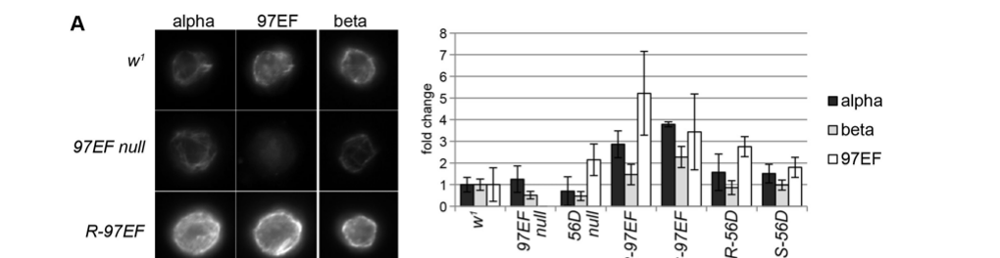

## Question

# Gene Research for Functional Annotation

## ⚠️ CRITICAL: Gene/Protein Identification Context

**BEFORE YOU BEGIN RESEARCH:** You MUST verify you are researching the CORRECT gene/protein. Gene symbols can be ambiguous, especially for less well-characterized genes from non-model organisms.

### Target Gene/Protein Identity (from UniProt):
- **UniProt Accession:** Q8MST5
- **Protein Description:** RecName: Full=Tubulin beta chain {ECO:0000256|RuleBase:RU000352};
- **Gene Information:** Name=betaTub97EF {ECO:0000313|FlyBase:FBgn0003890}; Synonyms=beta-Tub97EF {ECO:0000313|FlyBase:FBgn0003890}; ORFNames=CG4869 {ECO:0000313|EMBL:AAM49980.1, ECO:0000313|FlyBase:FBgn0003890};
- **Organism (full):** Drosophila melanogaster (Fruit fly).
- **Protein Family:** Belongs to the tubulin family.
- **Key Domains:** Beta-tubulin_BS. (IPR013838); Beta_tubulin. (IPR002453); Tub_FtsZ_C. (IPR008280); Tubulin. (IPR000217); Tubulin/FtsZ-like_C. (IPR037103)

### MANDATORY VERIFICATION STEPS:

1. **Check if the gene symbol "betaTub97EF" matches the protein description above**
2. **Verify the organism is correct:** Drosophila melanogaster (Fruit fly).
3. **Check if protein family/domains align with what you find in literature**
4. **If you find literature for a DIFFERENT gene with the same or similar symbol, STOP**

### If Gene Symbol is Ambiguous or You Cannot Find Relevant Literature:

**DO NOT PROCEED WITH RESEARCH ON A DIFFERENT GENE.** Instead:
- State clearly: "The gene symbol 'betaTub97EF' is ambiguous or literature is limited for this specific protein"
- Explain what you found (e.g., "Found extensive literature on a different gene with the same symbol in a different organism")
- Describe the protein based ONLY on the UniProt information provided above
- Suggest that the protein function can be inferred from domain/family information

### Research Target:

Please provide a comprehensive research report on the gene **betaTub97EF** (gene ID: betaTub97EF, UniProt: Q8MST5) in DROME.

The research report should be a detailed narrative explaining the function, biological processes, and localization of the gene product. Citations should be given for all claims.

You should prioritize authoritative reviews and primary scientific literature when conducting research. You can supplement
this with annotations you find in gene/protein databases, but these can be outdated or inaccurate.

We are specifically interested in the primary function of the gene - for enzymes, what reaction is catalyzed, and what is the substrate specificity? For transporters, what is the substrate? For structural proteins or adapters, what is the broader structural role? For signaling molecules, what is the role in the pathway.

We are interested in where in or outside the cell the gene product carries out its function.

We are also interested in the signaling or biochemical pathways in which the gene functions. We are less interested in broad pleiotropic effects, except where these elucidate the precise role.

Include evidence where possible. We are interested in both experimental evidence as well as inference from structure, evolution, or bioinformatic analysis. Precise studies should be prioritized over high-throughput, where available.

## Output

Question: You are an expert researcher providing comprehensive, well-cited information.

Provide detailed information focusing on:
1. Key concepts and definitions with current understanding
2. Recent developments and latest research (prioritize 2023-2024 sources)
3. Current applications and real-world implementations
4. Expert opinions and analysis from authoritative sources
5. Relevant statistics and data from recent studies

Format as a comprehensive research report with proper citations. Include URLs and publication dates where available.
Always prioritize recent, authoritative sources and provide specific citations for all major claims.

# Gene Research for Functional Annotation

## ⚠️ CRITICAL: Gene/Protein Identification Context

**BEFORE YOU BEGIN RESEARCH:** You MUST verify you are researching the CORRECT gene/protein. Gene symbols can be ambiguous, especially for less well-characterized genes from non-model organisms.

### Target Gene/Protein Identity (from UniProt):
- **UniProt Accession:** Q8MST5
- **Protein Description:** RecName: Full=Tubulin beta chain {ECO:0000256|RuleBase:RU000352};
- **Gene Information:** Name=betaTub97EF {ECO:0000313|FlyBase:FBgn0003890}; Synonyms=beta-Tub97EF {ECO:0000313|FlyBase:FBgn0003890}; ORFNames=CG4869 {ECO:0000313|EMBL:AAM49980.1, ECO:0000313|FlyBase:FBgn0003890};
- **Organism (full):** Drosophila melanogaster (Fruit fly).
- **Protein Family:** Belongs to the tubulin family.
- **Key Domains:** Beta-tubulin_BS. (IPR013838); Beta_tubulin. (IPR002453); Tub_FtsZ_C. (IPR008280); Tubulin. (IPR000217); Tubulin/FtsZ-like_C. (IPR037103)

### MANDATORY VERIFICATION STEPS:

1. **Check if the gene symbol "betaTub97EF" matches the protein description above**
2. **Verify the organism is correct:** Drosophila melanogaster (Fruit fly).
3. **Check if protein family/domains align with what you find in literature**
4. **If you find literature for a DIFFERENT gene with the same or similar symbol, STOP**

### If Gene Symbol is Ambiguous or You Cannot Find Relevant Literature:

**DO NOT PROCEED WITH RESEARCH ON A DIFFERENT GENE.** Instead:
- State clearly: "The gene symbol 'betaTub97EF' is ambiguous or literature is limited for this specific protein"
- Explain what you found (e.g., "Found extensive literature on a different gene with the same symbol in a different organism")
- Describe the protein based ONLY on the UniProt information provided above
- Suggest that the protein function can be inferred from domain/family information

### Research Target:

Please provide a comprehensive research report on the gene **betaTub97EF** (gene ID: betaTub97EF, UniProt: Q8MST5) in DROME.

The research report should be a detailed narrative explaining the function, biological processes, and localization of the gene product. Citations should be given for all claims.

You should prioritize authoritative reviews and primary scientific literature when conducting research. You can supplement
this with annotations you find in gene/protein databases, but these can be outdated or inaccurate.

We are specifically interested in the primary function of the gene - for enzymes, what reaction is catalyzed, and what is the substrate specificity? For transporters, what is the substrate? For structural proteins or adapters, what is the broader structural role? For signaling molecules, what is the role in the pathway.

We are interested in where in or outside the cell the gene product carries out its function.

We are also interested in the signaling or biochemical pathways in which the gene functions. We are less interested in broad pleiotropic effects, except where these elucidate the precise role.

Include evidence where possible. We are interested in both experimental evidence as well as inference from structure, evolution, or bioinformatic analysis. Precise studies should be prioritized over high-throughput, where available.

# Functional annotation report: *Drosophila melanogaster* **betaTub97EF** (UniProt Q8MST5)

## Executive conclusion

**betaTub97EF encodes a specialized cytoplasmic β-tubulin isotype whose best-supported primary function is to assemble with α-tubulin into microtubules and make those polymers unusually resistant to destabilization.** Its endogenous action is most clearly demonstrated in gut epithelial cells—especially embryonic hindgut boundary cells—and larval hemocytes. Expression rises selectively at cool temperatures, and loss of the gene reduces hindgut microtubule stability and modestly compromises embryogenesis near the lower thermal limit for the fly life cycle. Thus, betaTub97EF is best annotated as a **temperature-responsive structural component and stabilizer of cytoplasmic microtubules**, rather than as an enzyme, transporter, receptor, or canonical signaling protein. (faina2017drosophilaβtubulin97ef pages 1-4, faina2017drosophilaβtubulin97ef pages 9-12, faina2017drosophilaβtubulin97ef pages 14-17)

The evidence base is unusually concentrated: the definitive gene-specific functional study remains Myachina *et al.*, published in *Development* in December 2017 (DOI/URL: https://doi.org/10.1242/dev.156109). Searches did not identify a substantive 2023–2024 primary study that revised its molecular annotation. Consequently, recent research adds context concerning cool-temperature transcriptional regulation and tubulin-isotype biology, but the major betaTub97EF-specific conclusions still derive from the 2017 experiments.

## 1. Mandatory identity verification

The supplied UniProt entry maps **Q8MST5** to *D. melanogaster* gene **betaTub97EF**, synonym **beta-Tub97EF**, ORF **CG4869**, and FlyBase **FBgn0003890**. The retrieved literature independently confirms that **betaTub97EF is a *D. melanogaster* gene and one of the species’ five β-tubulin paralogs**, alongside betaTub56D, betaTub60D, betaTub85D, and betaTub65B/CG32396. It also explicitly analyzes the conserved tubulin core and C-terminal tail expected from the listed InterPro domains. (faina2017drosophilaβtubulin97ef pages 1-4, faina2017drosophilaβtubulin97ef pages 4-7, faina2017drosophilaβtubulin97ef pages 17-20)

The exact Q8MST5–CG4869–FBgn0003890 cross-reference was not printed in the retrieved papers and therefore rests on the UniProt identity supplied in the question. No contradictory same-symbol gene from another organism was used. The organism, symbol, protein description, paralog family, domain architecture, and observed incorporation into α-tubulin-containing polymers are mutually consistent; there is no indication that the literature concerns a different protein. (faina2017drosophilaβtubulin97ef pages 7-9)

The evidence hierarchy is summarized below.

| Annotation question | Best-supported conclusion | Evidence type | Key quantitative result | Confidence / caveat |
|---|---|---|---|---|
| Identity | The target is *Drosophila melanogaster* **betaTub97EF**, a β-tubulin paralog. The mappings to **Q8MST5**, **CG4869**, and **FBgn0003890** are those of the supplied UniProt record. Literature independently confirms the gene symbol, species, and β-tubulin-family assignment, but not all database cross-identifiers (faina2017drosophilaβtubulin97ef pages 1-4, faina2017drosophilaβtubulin97ef pages 4-7) | Direct literature evidence plus supplied UniProt annotation | One of five β-tubulin genes reported in *D. melanogaster* | High for symbol/species/family; cross-mapping relies on the supplied record |
| Molecular role | β-Tubulin 97EF joins α-tubulin-containing microtubules and increases polymer stability. It does not measurably increase plus-end growth speed; reduced catastrophe and/or increased rescue is the favored interpretation. The stabilizing determinant maps mainly to the 97EF tubulin core rather than its C-terminal tail (faina2017drosophilaβtubulin97ef pages 7-9, faina2017drosophilaβtubulin97ef pages 14-17, faina2017drosophilaβtubulin97ef pages 17-20) | Direct experiments | EB1-GFP comet speed: no significant change; microtubules remained abundant after 2 h of colcemid with 97EF, whereas 56D-containing microtubules were strongly reduced after 1 h | High for stabilization; catastrophe/rescue mechanism remains inferred rather than directly measured |
| Cellular localization | Protein colocalizes nearly completely with α-tubulin in larval hemocytes and is therefore localized to cytoplasmic microtubules; apparent enrichment occurs in cortical microtubules and bundles (faina2017drosophilaβtubulin97ef pages 7-9, faina2017drosophilaβtubulin97ef pages 12-14) | Direct immunofluorescence and polymer-pool measurements | Near-complete spatial overlap with α-tubulin; cortical enrichment was qualitative | High for microtubule association; cortical enrichment could partly reflect epitope accessibility |
| Tissue and developmental expression | Zygotic expression begins during embryogenesis and is strongest in gut epithelia—particularly embryonic hindgut boundary cells—with additional expression in foregut, midgut, posterior spiracles, larval/adult gut, wing discs, hemocytes, and ovarian follicle cells. It is absent from hindgut visceral muscle and normally absent from the female germline (faina2017drosophilaβtubulin97ef pages 4-7, faina2017drosophilaβtubulin97ef pages 7-9, faina2017drosophilaβtubulin97ef pages 12-14) | Direct immunoblotting and immunofluorescence | Onset at approximately 6–9 h after egg deposition; first immunofluorescent detection at embryonic stage 12 | High for tested tissues; not a comprehensive single-cell atlas |
| Low-temperature regulation | betaTub97EF is selectively induced at cool temperatures in cultured cells, embryonic hindgut, and hemocytes; this is tissue-specific rather than a global tubulin response (faina2017drosophilaβtubulin97ef pages 4-7, faina2017drosophilaβtubulin97ef pages 9-12, faina2017drosophilaβtubulin97ef pages 12-14) | Direct transcript and protein measurements | At 25°C, about 8% of β-tubulin transcripts and 2% of β-tubulin protein in S2R+ cells; transcript exceeds 2× at 14°C; embryonic protein is about 4× higher at 14°C than 30°C; hindgut protein is 1.7× higher at 14°C than 25°C and 2× higher than at 30°C | High; the upstream betaTub97EF-specific temperature-sensing enhancer remains unresolved |
| Isoforms 4B and 4C | Mutually exclusive fourth exons produce 4B and 4C proteins that differ at 13 positions within a 40-aa core segment. The predominant 4B transcript rises at low temperature, whereas 4C falls; ectopic-expression phenotypes show that the proteins are functionally distinct (faina2017drosophilaβtubulin97ef pages 7-9, faina2017drosophilaβtubulin97ef pages 12-14, faina2017drosophilaβtubulin97ef pages 17-20) | Direct splicing, expression, and transgenic experiments; comparative inference for Diptera conservation | Exons share about 77% amino-acid identity; 4B is approximately 15-fold more abundant across development; eye expression of 4C was lethal, whereas 4B caused small rough eyes | High for distinct expression and overexpression phenotypes; endogenous isoform-specific physiological contributions are not fully resolved |
| Null phenotype | A MiMIC allele reduces residual protein to below the detection estimate and is compatible with homozygous viability and fertility at standard temperature, implying redundancy with other β-tubulins. Loss reduces hindgut microtubule stability and modestly impairs development under thermal stress (faina2017drosophilaβtubulin97ef pages 7-9, faina2017drosophilaβtubulin97ef pages 9-12, faina2017drosophilaβtubulin97ef pages 14-17) | Direct loss-of-function experiments | Residual protein estimated at <3%; mutant/deficiency fertility about 25% lower in both sexes; 25% fewer mutants completed embryogenesis at 14°C; normal hindgut left/right asymmetry in n=100 | High for mild null phenotype and stability defect; designation as a molecular null rests on expression below detection rather than complete locus deletion |
| Pathway and regulation status | The established functional pathway is **temperature-responsive control of microtubule cytoskeletal stability**, not a canonical signaling cascade. A 2021 study noted a cool-open chromatin region upstream of betaTub97EF, but mechanistically dissected JAK/STAT–ETS regulation at the separate *pastrel* enhancer; those factors must not be assigned to betaTub97EF without direct tests (bai2021acisregulatoryelement pages 17-19, faina2017drosophilaβtubulin97ef pages 14-17) | Direct functional evidence for the microtubule pathway; regulatory-element observation and explicit caution for signaling inference | No betaTub97EF-specific enhancer-deletion or transcription-factor-effect size established | Moderate: downstream cytoskeletal role is strong; upstream signaling and cis-regulatory mechanism remain open |

*Table: Evidence-tiered functional annotation of *D. melanogaster* betaTub97EF/Q8MST5, separating direct experiments from evolutionary inference and supplied database mappings. Quantitative results and unresolved caveats identify where annotation is strong versus provisional.*

## 2. Molecular function and biochemical interpretation

### 2.1 Structural role

β-Tubulins are not conventional metabolic enzymes. By established tubulin-family chemistry, α/β-tubulin heterodimers associate longitudinally into protofilaments and laterally into hollow microtubules. Both subunits bind GTP, while hydrolysis of β-tubulin-bound GTP after polymer incorporation contributes to dynamic instability—the alternation between microtubule growth and shrinkage. This is a **family-level mechanistic inference** applicable to betaTub97EF because of its sequence/domain identity; no purified-Q8MST5 enzymology or substrate-specificity assay was reported. (faina2017drosophilaβtubulin97ef pages 1-4)

Gene-specific experiments show near-complete spatial overlap of endogenous β-Tubulin 97EF with α-tubulin in spread larval hemocytes. Because fixation preferentially preserved polymerized rather than soluble tubulin, these data support incorporation into cytoplasmic microtubules. A control protein containing EGFP inserted into and disrupting the tubulin core failed to incorporate, further demonstrating that an intact tubulin fold is required. (faina2017drosophilaβtubulin97ef pages 7-9, faina2017drosophilaβtubulin97ef pages 12-14)

### 2.2 Specialized stabilization of microtubules

Changing the β-tubulin-isotype ratio in larval hemocytes produced substantially more polymerized α- and β-tubulin when betaTub97EF-4B was expressed than when betaTub56D was expressed. The additional polymers were especially prominent as cortical bundles. Direct imaging of the relevant figure confirms stronger cortical networks in 97EF-rich cells. (faina2017drosophilaβtubulin97ef pages 12-14, faina2017drosophilaβtubulin97ef media 04411e32)

EB1-GFP plus-end tracking showed no significant difference in comet migration speed: values were approximately 9 µm/min across the compared 56D- and 97EF-rich conditions. Therefore, betaTub97EF does not appear to stabilize the network by accelerating plus-end growth. Reduced catastrophe frequency and/or increased rescue frequency is the favored explanation, but those two parameters were not measured separately. (faina2017drosophilaβtubulin97ef pages 14-17, faina2017drosophilaβtubulin97ef media b58dbe32)

Pharmacological tests provide stronger evidence. Colcemid reduced polymerized tubulin drastically within one hour in betaTub56D-rescued hemocytes, whereas β-Tubulin-97EF-rich networks remained prominent even after two hours. In embryos, vinblastine significantly reduced hindgut α-tubulin signal only when betaTub97EF was absent; effects in surrounding tissues and muscle, where betaTub97EF expression is minimal, did not depend on genotype. These observations establish that betaTub97EF raises polymer resistance to destabilizing drugs both when experimentally enriched and at its endogenous site of expression. (faina2017drosophilaβtubulin97ef pages 14-17, faina2017drosophilaβtubulin97ef media 35b4a75e)

Tail-swapping experiments mapped the characteristic stabilization primarily to sequence differences in the **97EF tubulin core**, rather than its C-terminal tail. Nevertheless, rescue and toxicity experiments indicate that both core and tail contribute to the broader functional distinction between betaTub97EF and betaTub56D. Cortical enrichment and a possible ability to promote bundling are plausible, but epitope accessibility and associated proteins were not excluded; bundling should therefore remain a hypothesis rather than a definitive molecular activity. (faina2017drosophilaβtubulin97ef pages 12-14, faina2017drosophilaβtubulin97ef pages 17-20)

## 3. Cellular and tissue localization

The protein operates **inside cells as part of the cytoplasmic microtubule cytoskeleton**. No evidence supports secretion, membrane insertion, extracellular action, or organelle import. In larval hemocytes, β-Tubulin 97EF colocalizes with α-tubulin and may be relatively enriched in cortical microtubules. (faina2017drosophilaβtubulin97ef pages 7-9)

Developmental localization is strongly tissue restricted:

- Zygotic protein becomes detectable approximately **6–9 hours after egg deposition**, with immunofluorescent signal first apparent around embryonic stage 12. There is no detectable maternal contribution at the onset of embryogenesis. (faina2017drosophilaβtubulin97ef pages 4-7)
- The strongest embryonic expression is in **hindgut epithelial cells**, particularly a one-cell-wide row of boundary cells. It is absent from surrounding hindgut visceral muscle, which instead expresses betaTub60D. (faina2017drosophilaβtubulin97ef pages 7-9)
- Additional embryonic signal occurs in the foregut, posterior spiracles, and more weakly in the midgut. Protein persists in larval and adult gut enterocytes. (faina2017drosophilaβtubulin97ef pages 4-7, faina2017drosophilaβtubulin97ef pages 7-9)
- Weaker expression was observed in wing imaginal discs, larval hemocytes, and ovarian somatic follicle cells. During normal oogenesis it was not detected in the female germline. (faina2017drosophilaβtubulin97ef pages 7-9, faina2017drosophilaβtubulin97ef pages 12-14)

These observations define the experimentally supported sites of action. They do not constitute a complete modern single-cell atlas, so absence from untested tissues should not be inferred.

## 4. Temperature-responsive biological process

### 4.1 Expression response

In S2R+ cells at 25°C, betaTub97EF represented about **8% of total β-tubulin transcripts** but only approximately **2% of total β-tubulin protein**. Its transcript abundance more than doubled at 14°C; both transcript and protein increased at 11–14°C and decreased at 30°C. Other tubulin genes were affected little or not at all, demonstrating paralog-selective regulation. (faina2017drosophilaβtubulin97ef pages 4-7)

In embryos, β-Tubulin 97EF protein was approximately **fourfold more abundant at 14°C than at 30°C** across three experiments. Quantitative microscopy found **1.7-fold more protein in hindgut at 14°C than at 25°C**, and **twofold more than at 30°C**. Epidermis and somatic muscle did not show the same response, establishing that cool induction is cell-type-specific rather than global. (faina2017drosophilaβtubulin97ef pages 9-12)

Larval hemocytes likewise contained significantly more β-Tubulin 97EF at 14°C than at 29°C. Together, these data support a regulated adjustment of tubulin-isotype composition in selected cell types. (faina2017drosophilaβtubulin97ef pages 12-14)

### 4.2 Physiological significance

A near-null MiMIC allele left, at most, an estimated **<3%** of normal protein. Homozygotes were viable and fertile under standard laboratory conditions, indicating substantial redundancy with coexpressed β-tubulins, particularly maternally supplied betaTub56D during embryogenesis. Mutant-over-deficiency flies nevertheless had approximately **25% lower fertility in both sexes**. (faina2017drosophilaβtubulin97ef pages 7-9)

At 14°C, **25% fewer mutant embryos completed embryogenesis** than controls. No significant embryonic survival difference occurred at 25°C or 30°C, while 10–12°C was generally too cold for either genotype to hatch effectively. Mutants were also weaker in development to adulthood at temperatures below and above the optimum. The strongest interpretation is therefore not that betaTub97EF is an essential “cold-survival gene,” but that it provides a measurable robustness advantage under thermal stress, particularly near the lower limit compatible with completion of the life cycle. (faina2017drosophilaβtubulin97ef pages 9-12)

The authors’ expert interpretation is appropriately cautious: low-temperature upregulation **likely contributes** to acclimation by stabilizing microtubules, but temperature acclimation is complex and cannot be explained solely by global induction of one tubulin isotype. betaTub97EF remains expressed at optimal and elevated temperatures, implying additional cell-specific functions. (faina2017drosophilaβtubulin97ef pages 14-17, faina2017drosophilaβtubulin97ef pages 17-20)

## 5. Alternative isoforms and evolutionary evidence

betaTub97EF contains mutually exclusive coding exons **4B and 4C** within the conserved tubulin core. Their encoded 40-amino-acid segments differ at 13 positions and share approximately **77% amino-acid identity**; the N- and C-terminal regions are otherwise identical. Exon 4B is approximately **15-fold more abundant** than 4C throughout development. At low temperature, the major 4B transcript increases while the minor 4C transcript decreases, indicating coordinated regulation of both total abundance and isoform composition. (faina2017drosophilaβtubulin97ef pages 7-9, faina2017drosophilaβtubulin97ef pages 9-12, faina2017drosophilaβtubulin97ef pages 17-20)

The proteins are not functionally interchangeable. When expressed during eye development, 4C was lethal, whereas 4B produced small, deformed, rough eyes. Both only partially rescued betaTub56D loss, postponing death from the first to the second larval instar rather than restoring viability. These are overexpression and cross-rescue phenotypes, however, and do not define the normal endogenous role of the rare 4C isoform. (faina2017drosophilaβtubulin97ef pages 12-14)

Mutually exclusive fourth exons appear characteristic of dipteran betaTub97EF orthologs, and the orthologous lineage has reportedly been conserved over roughly **300 million years of insect evolution**. This conservation supports biological specialization, although the mild laboratory null phenotype demonstrates that evolutionary retention does not imply strict essentiality under standard conditions. (faina2017drosophilaβtubulin97ef pages 7-9)

## 6. Pathway assignment and regulatory status

The most defensible pathway annotation is:

**cool-temperature response → tissue-selective elevation of betaTub97EF-4B → altered β-tubulin-isotype composition → increased cytoplasmic/cortical microtubule stability → improved developmental robustness under cool conditions.** (faina2017drosophilaβtubulin97ef pages 9-12, faina2017drosophilaβtubulin97ef pages 14-17)

This is a cytoskeletal homeostasis pathway, not evidence that betaTub97EF transduces a signal. Its upstream temperature sensor, transcription factors, and betaTub97EF-specific enhancer remain unresolved. A 2021 *BMC Genomics* study reported a cool-open chromatin region upstream of betaTub97EF, making that region a candidate cis-regulatory element. However, the detailed JAK/STAT, Stat92E, Pointed, Ets97D, and Ftz-f1 experiments in that paper concerned a separate enhancer at the **pastrel** locus. Those signaling factors cannot presently be assigned as regulators of betaTub97EF. (bai2021acisregulatoryelement pages 17-19)

Likewise, interference with nurse-cell dumping after ectopic germline expression suggests that excess cortical microtubules may disrupt actomyosin contraction, but this was an overexpression phenotype and its proposed mechanism was explicitly speculative. (faina2017drosophilaβtubulin97ef pages 12-14, faina2017drosophilaβtubulin97ef pages 17-20)

## 7. Current research applications and implementations

There is no clinical or industrial implementation specific to betaTub97EF. Its current applications are experimental:

1. **Thermal-acclimation model:** the gene provides a tractable example of an ectotherm changing tubulin-isotype composition to stabilize microtubules at cool temperature. (faina2017drosophilaβtubulin97ef pages 1-4, faina2017drosophilaβtubulin97ef pages 14-17)
2. **Tubulin-isotype specialization:** comparison with betaTub56D, betaTub60D, and betaTub85D demonstrates that closely related β-tubulins are only partially interchangeable and that functional specificity can reside in the conserved core as well as the tail. (faina2017drosophilaβtubulin97ef pages 12-14, faina2017drosophilaβtubulin97ef pages 17-20)
3. **Cytoskeletal perturbation system:** GAL4/UAS constructs for 4B, 4C, and tail-swapped proteins, a betaTub97EF-specific antibody, MiMIC/EGFP alleles, and EB1-GFP imaging enable analysis of polymer abundance, dynamics, drug resistance, and tissue-specific toxicity. (faina2017drosophilaβtubulin97ef pages 4-7, faina2017drosophilaβtubulin97ef pages 17-20)
4. **Potential cool-response reporter:** its reproducible low-temperature induction makes betaTub97EF a useful readout of cell-type-specific cool responses, although no validated isolated betaTub97EF “CoolUp” enhancer has yet been functionally established. (faina2017drosophilaβtubulin97ef pages 4-7, faina2017drosophilaβtubulin97ef pages 9-12)

## 8. Limitations and annotation confidence

The primary molecular annotation is high confidence because it is supported by localization, loss-of-function, controlled paralog replacement, live EB1 imaging, two microtubule-destabilizing drugs, and domain-swapping experiments. The exact dynamic parameter responsible for stabilization remains unresolved because catastrophe and rescue frequencies were not separately measured. No purified recombinant betaTub97EF assay has established intrinsic polymerization kinetics, GTPase rate, drug-binding affinity, or MAP/motor selectivity.

Evidence for a role in cool-temperature acclimation is strong but not complete: expression and developmental fitness are temperature dependent, yet no experiment replaced endogenous betaTub97EF with a temperature-insensitive allele while holding expression level and tissue distribution constant. Upstream signaling and cis-regulatory mechanisms remain open. Finally, no major 2023–2024 gene-specific functional advance was found, so claims of a newer mechanistic consensus would be unwarranted.

## Overall functional annotation

**Recommended annotation:** “A tissue-selective, temperature-responsive β-tubulin isotype that incorporates with α-tubulin into cytoplasmic microtubules and increases their stability, particularly in gut epithelial cells and hemocytes; contributes modestly to developmental robustness at low temperature. The predominant 4B and minor 4C isoforms are functionally distinct.” (faina2017drosophilaβtubulin97ef pages 7-9, faina2017drosophilaβtubulin97ef pages 9-12, faina2017drosophilaβtubulin97ef pages 14-17)

**Not currently supported:** assignment as an enzyme with a distinct substrate, transporter, secreted factor, receptor, direct signaling effector, or established component of JAK/STAT signaling.

References

1. (faina2017drosophilaβtubulin97ef pages 1-4): Faina Myachina, Fritz Bosshardt, Johannes Bischof, Moritz Kirschmann, and Christian F Lehner. Drosophila β-tubulin 97ef is upregulated at low temperature and stabilizes microtubules. Development, 144:4573-4587, Dec 2017. URL: https://doi.org/10.1242/dev.156109, doi:10.1242/dev.156109. This article has 24 citations and is from a domain leading peer-reviewed journal.

2. (faina2017drosophilaβtubulin97ef pages 9-12): Faina Myachina, Fritz Bosshardt, Johannes Bischof, Moritz Kirschmann, and Christian F Lehner. Drosophila β-tubulin 97ef is upregulated at low temperature and stabilizes microtubules. Development, 144:4573-4587, Dec 2017. URL: https://doi.org/10.1242/dev.156109, doi:10.1242/dev.156109. This article has 24 citations and is from a domain leading peer-reviewed journal.

3. (faina2017drosophilaβtubulin97ef pages 14-17): Faina Myachina, Fritz Bosshardt, Johannes Bischof, Moritz Kirschmann, and Christian F Lehner. Drosophila β-tubulin 97ef is upregulated at low temperature and stabilizes microtubules. Development, 144:4573-4587, Dec 2017. URL: https://doi.org/10.1242/dev.156109, doi:10.1242/dev.156109. This article has 24 citations and is from a domain leading peer-reviewed journal.

4. (faina2017drosophilaβtubulin97ef pages 4-7): Faina Myachina, Fritz Bosshardt, Johannes Bischof, Moritz Kirschmann, and Christian F Lehner. Drosophila β-tubulin 97ef is upregulated at low temperature and stabilizes microtubules. Development, 144:4573-4587, Dec 2017. URL: https://doi.org/10.1242/dev.156109, doi:10.1242/dev.156109. This article has 24 citations and is from a domain leading peer-reviewed journal.

5. (faina2017drosophilaβtubulin97ef pages 17-20): Faina Myachina, Fritz Bosshardt, Johannes Bischof, Moritz Kirschmann, and Christian F Lehner. Drosophila β-tubulin 97ef is upregulated at low temperature and stabilizes microtubules. Development, 144:4573-4587, Dec 2017. URL: https://doi.org/10.1242/dev.156109, doi:10.1242/dev.156109. This article has 24 citations and is from a domain leading peer-reviewed journal.

6. (faina2017drosophilaβtubulin97ef pages 7-9): Faina Myachina, Fritz Bosshardt, Johannes Bischof, Moritz Kirschmann, and Christian F Lehner. Drosophila β-tubulin 97ef is upregulated at low temperature and stabilizes microtubules. Development, 144:4573-4587, Dec 2017. URL: https://doi.org/10.1242/dev.156109, doi:10.1242/dev.156109. This article has 24 citations and is from a domain leading peer-reviewed journal.

7. (faina2017drosophilaβtubulin97ef pages 12-14): Faina Myachina, Fritz Bosshardt, Johannes Bischof, Moritz Kirschmann, and Christian F Lehner. Drosophila β-tubulin 97ef is upregulated at low temperature and stabilizes microtubules. Development, 144:4573-4587, Dec 2017. URL: https://doi.org/10.1242/dev.156109, doi:10.1242/dev.156109. This article has 24 citations and is from a domain leading peer-reviewed journal.

8. (bai2021acisregulatoryelement pages 17-19): Yu Bai, Emmanuel Caussinus, Stefano Leo, Fritz Bosshardt, Faina Myachina, Gregor Rot, Mark D. Robinson, and Christian F. Lehner. A cis-regulatory element promoting increased transcription at low temperature in cultured ectothermic drosophila cells. Oct 2021. URL: https://doi.org/10.1186/s12864-021-08057-4, doi:10.1186/s12864-021-08057-4. This article has 10 citations and is from a peer-reviewed journal.

9. (faina2017drosophilaβtubulin97ef media 04411e32): Faina Myachina, Fritz Bosshardt, Johannes Bischof, Moritz Kirschmann, and Christian F Lehner. Drosophila β-tubulin 97ef is upregulated at low temperature and stabilizes microtubules. Development, 144:4573-4587, Dec 2017. URL: https://doi.org/10.1242/dev.156109, doi:10.1242/dev.156109. This article has 24 citations and is from a domain leading peer-reviewed journal.

10. (faina2017drosophilaβtubulin97ef media b58dbe32): Faina Myachina, Fritz Bosshardt, Johannes Bischof, Moritz Kirschmann, and Christian F Lehner. Drosophila β-tubulin 97ef is upregulated at low temperature and stabilizes microtubules. Development, 144:4573-4587, Dec 2017. URL: https://doi.org/10.1242/dev.156109, doi:10.1242/dev.156109. This article has 24 citations and is from a domain leading peer-reviewed journal.

11. (faina2017drosophilaβtubulin97ef media 35b4a75e): Faina Myachina, Fritz Bosshardt, Johannes Bischof, Moritz Kirschmann, and Christian F Lehner. Drosophila β-tubulin 97ef is upregulated at low temperature and stabilizes microtubules. Development, 144:4573-4587, Dec 2017. URL: https://doi.org/10.1242/dev.156109, doi:10.1242/dev.156109. This article has 24 citations and is from a domain leading peer-reviewed journal.

## Artifacts

- [Edison artifact artifact-00](betaTub97EF-deep-research-falcon_artifacts/artifact-00.md)

## Citations

1. bai2021acisregulatoryelement pages 17-19
2. https://doi.org/10.1242/dev.156109
3. https://doi.org/10.1242/dev.156109,
4. https://doi.org/10.1186/s12864-021-08057-4,