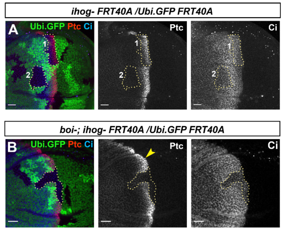

## Question

# Gene Research for Functional Annotation

## ⚠️ CRITICAL: Gene/Protein Identification Context

**BEFORE YOU BEGIN RESEARCH:** You MUST verify you are researching the CORRECT gene/protein. Gene symbols can be ambiguous, especially for less well-characterized genes from non-model organisms.

### Target Gene/Protein Identity (from UniProt):
- **UniProt Accession:** A8JUV7
- **Protein Description:** RecName: Full=Interference hedgehog {ECO:0000256|ARBA:ARBA00041099};
- **Gene Information:** Name=boi {ECO:0000313|EMBL:ABW09329.3, ECO:0000313|FlyBase:FBgn0040388}; Synonyms=Boi {ECO:0000313|EMBL:ABW09329.3}, CG13756 {ECO:0000313|EMBL:ABW09329.3}, CG7894 {ECO:0000313|EMBL:ABW09329.3}, CT23737 {ECO:0000313|EMBL:ABW09329.3}, CT33235 {ECO:0000313|EMBL:ABW09329.3}, Dmel\CG32796 {ECO:0000313|EMBL:ABW09329.3}, EG:BACH59J11.2 {ECO:0000313|EMBL:ABW09329.3}; ORFNames=CG32796 {ECO:0000313|EMBL:ABW09329.3, ECO:0000313|FlyBase:FBgn0040388}, Dmel_CG32796 {ECO:0000313|EMBL:ABW09329.3};
- **Organism (full):** Drosophila melanogaster (Fruit fly).
- **Protein Family:** Belongs to the immunoglobulin superfamily. IHOG family.
- **Key Domains:** FN3_dom. (IPR003961); FN3_sf. (IPR036116); Ig-like_dom. (IPR007110); Ig-like_dom_sf. (IPR036179); Ig-like_fold. (IPR013783)

### MANDATORY VERIFICATION STEPS:

1. **Check if the gene symbol "boi" matches the protein description above**
2. **Verify the organism is correct:** Drosophila melanogaster (Fruit fly).
3. **Check if protein family/domains align with what you find in literature**
4. **If you find literature for a DIFFERENT gene with the same or similar symbol, STOP**

### If Gene Symbol is Ambiguous or You Cannot Find Relevant Literature:

**DO NOT PROCEED WITH RESEARCH ON A DIFFERENT GENE.** Instead:
- State clearly: "The gene symbol 'boi' is ambiguous or literature is limited for this specific protein"
- Explain what you found (e.g., "Found extensive literature on a different gene with the same symbol in a different organism")
- Describe the protein based ONLY on the UniProt information provided above
- Suggest that the protein function can be inferred from domain/family information

### Research Target:

Please provide a comprehensive research report on the gene **boi** (gene ID: boi, UniProt: A8JUV7) in DROME.

The research report should be a detailed narrative explaining the function, biological processes, and localization of the gene product. Citations should be given for all claims.

You should prioritize authoritative reviews and primary scientific literature when conducting research. You can supplement
this with annotations you find in gene/protein databases, but these can be outdated or inaccurate.

We are specifically interested in the primary function of the gene - for enzymes, what reaction is catalyzed, and what is the substrate specificity? For transporters, what is the substrate? For structural proteins or adapters, what is the broader structural role? For signaling molecules, what is the role in the pathway.

We are interested in where in or outside the cell the gene product carries out its function.

We are also interested in the signaling or biochemical pathways in which the gene functions. We are less interested in broad pleiotropic effects, except where these elucidate the precise role.

Include evidence where possible. We are interested in both experimental evidence as well as inference from structure, evolution, or bioinformatic analysis. Precise studies should be prioritized over high-throughput, where available.

## Output

Question: You are an expert researcher providing comprehensive, well-cited information.

Provide detailed information focusing on:
1. Key concepts and definitions with current understanding
2. Recent developments and latest research (prioritize 2023-2024 sources)
3. Current applications and real-world implementations
4. Expert opinions and analysis from authoritative sources
5. Relevant statistics and data from recent studies

Format as a comprehensive research report with proper citations. Include URLs and publication dates where available.
Always prioritize recent, authoritative sources and provide specific citations for all major claims.

# Gene Research for Functional Annotation

## ⚠️ CRITICAL: Gene/Protein Identification Context

**BEFORE YOU BEGIN RESEARCH:** You MUST verify you are researching the CORRECT gene/protein. Gene symbols can be ambiguous, especially for less well-characterized genes from non-model organisms.

### Target Gene/Protein Identity (from UniProt):
- **UniProt Accession:** A8JUV7
- **Protein Description:** RecName: Full=Interference hedgehog {ECO:0000256|ARBA:ARBA00041099};
- **Gene Information:** Name=boi {ECO:0000313|EMBL:ABW09329.3, ECO:0000313|FlyBase:FBgn0040388}; Synonyms=Boi {ECO:0000313|EMBL:ABW09329.3}, CG13756 {ECO:0000313|EMBL:ABW09329.3}, CG7894 {ECO:0000313|EMBL:ABW09329.3}, CT23737 {ECO:0000313|EMBL:ABW09329.3}, CT33235 {ECO:0000313|EMBL:ABW09329.3}, Dmel\CG32796 {ECO:0000313|EMBL:ABW09329.3}, EG:BACH59J11.2 {ECO:0000313|EMBL:ABW09329.3}; ORFNames=CG32796 {ECO:0000313|EMBL:ABW09329.3, ECO:0000313|FlyBase:FBgn0040388}, Dmel_CG32796 {ECO:0000313|EMBL:ABW09329.3};
- **Organism (full):** Drosophila melanogaster (Fruit fly).
- **Protein Family:** Belongs to the immunoglobulin superfamily. IHOG family.
- **Key Domains:** FN3_dom. (IPR003961); FN3_sf. (IPR036116); Ig-like_dom. (IPR007110); Ig-like_dom_sf. (IPR036179); Ig-like_fold. (IPR013783)

### MANDATORY VERIFICATION STEPS:

1. **Check if the gene symbol "boi" matches the protein description above**
2. **Verify the organism is correct:** Drosophila melanogaster (Fruit fly).
3. **Check if protein family/domains align with what you find in literature**
4. **If you find literature for a DIFFERENT gene with the same or similar symbol, STOP**

### If Gene Symbol is Ambiguous or You Cannot Find Relevant Literature:

**DO NOT PROCEED WITH RESEARCH ON A DIFFERENT GENE.** Instead:
- State clearly: "The gene symbol 'boi' is ambiguous or literature is limited for this specific protein"
- Explain what you found (e.g., "Found extensive literature on a different gene with the same symbol in a different organism")
- Describe the protein based ONLY on the UniProt information provided above
- Suggest that the protein function can be inferred from domain/family information

### Research Target:

Please provide a comprehensive research report on the gene **boi** (gene ID: boi, UniProt: A8JUV7) in DROME.

The research report should be a detailed narrative explaining the function, biological processes, and localization of the gene product. Citations should be given for all claims.

You should prioritize authoritative reviews and primary scientific literature when conducting research. You can supplement
this with annotations you find in gene/protein databases, but these can be outdated or inaccurate.

We are specifically interested in the primary function of the gene - for enzymes, what reaction is catalyzed, and what is the substrate specificity? For transporters, what is the substrate? For structural proteins or adapters, what is the broader structural role? For signaling molecules, what is the role in the pathway.

We are interested in where in or outside the cell the gene product carries out its function.

We are also interested in the signaling or biochemical pathways in which the gene functions. We are less interested in broad pleiotropic effects, except where these elucidate the precise role.

Include evidence where possible. We are interested in both experimental evidence as well as inference from structure, evolution, or bioinformatic analysis. Precise studies should be prioritized over high-throughput, where available.

# Functional annotation report: *boi* in *Drosophila melanogaster*

## Identity and principal function

The target is **Brother of Ihog (Boi)**, the *D. melanogaster* protein identified in the supplied UniProt record as **A8JUV7**, gene **boi/CG32796** (FlyBase **FBgn0040388**). This identification is consistent with primary studies explicitly examining fly *boi* alongside its paralogue *ihog*, and with the reported IHOG-family architecture: the major Boi isoforms have **four extracellular immunoglobulin-like domains, two extracellular fibronectin type III (FNIII) domains, one transmembrane segment and a cytoplasmic region**. An experimentally described shorter predicted isoform lacks the signal sequence and Ig domains and was not functional in the tested Hedgehog-signalling assay; the cell-surface annotation principally concerns the full-length isoforms. The reviewed papers do not themselves establish the accession-to-gene cross-reference, which is supplied by the question. No evidence about an unrelated gene called BOI is used here. (zheng2010geneticandbiochemical pages 2-4, jimenezjimenez2024hedgehogonthe pages 11-12)

**Functional conclusion:** Boi is a **cell-surface Hedgehog (Hh) co-receptor and ligand-retention protein**, not an enzyme or solute transporter. Together with its paralogue Ihog, it enables Hh reception by the Patched (Ptc) receptor system and helps capture extracellular Hh, thereby shaping how far the morphogen acts. Boi also belongs to an adhesion-like protein family, although the strongest experiments dissecting adhesion and cytoneme stabilization concern Ihog specifically. (zheng2010geneticandbiochemical pages 2-4, hsia2017hedgehogmediateddegradation pages 1-2, jimenezjimenez2024hedgehogonthe pages 11-12)

## Molecular mechanism and pathway position

In Hh-receiving cells, the extracellular portions of an Ihog-family protein cooperate with **Ptc** to bind Hh efficiently. The FNIII-domain model assigns **Fn1 to Hh engagement** and **Fn2 to interaction with Ptc**. Genetic and biochemical work demonstrated direct Ihog–Ptc association and formation of an Hh–Ihog–Ptc complex; analogous Boi–Hh–Ptc precipitation was also reported. Importantly, expressing wild-type **Boi itself** restored Hh-dependent Ptc expression in wing-disc cells lacking both *boi* and *ihog*. Detailed domain deletions establishing the necessity of Fn1 and Fn2 for rescue, and experiments demonstrating enhanced Ptc surface presentation, were performed primarily with **Ihog**; they should not be mistaken for equally detailed Boi-specific tests. (zheng2010geneticandbiochemical pages 2-4, zheng2010geneticandbiochemical pages 10-11, zheng2010geneticandbiochemical pages 8-9)

Boi acts **upstream of Smoothened (Smo)**. When Hh is received by the Ptc–Ihog-family receptor system, Ptc-mediated repression of Smo is relieved, allowing downstream Hh-dependent changes in **Cubitus interruptus (Ci)** and expression of targets including *ptc* and, at appropriate response thresholds, *engrailed* (*en*). Cells lacking both Ihog-family proteins fail to elevate Smo or express normal Hh targets. Thus Boi’s assigned biochemical role is **extracellular ligand reception and presentation within a membrane receptor complex**, rather than intracellular signal catalysis. (zheng2010geneticandbiochemical pages 4-5, simon2021glypicansdefineunique pages 12-14)

The same receptor system **restricts signalling range by retaining Hh**. In wing-disc mosaics, cells lacking both Boi and Ihog did not respond to Hh, but Hh passed through them and activated *ptc* or *dpp* in more distant, receptor-competent cells. For scale, the normal *ptc*-expressing stripe in that experiment was approximately **5–10 cells** wide. Restoring Ptc expression by removing PKA-C1 did not restore ligand sequestration without Ihog-family proteins. Conversely, engineered Hh-producing cells lacking both proteins still released biologically active Hh to neighbouring cells: these experiments establish a **reception/capture requirement, not an absolute requirement for ligand export**. (zheng2010geneticandbiochemical pages 5-6, zheng2010geneticandbiochemical pages 4-5)

## Where Boi acts

Full-length Boi acts at the **plasma membrane**, with its Ig/FNIII region exposed to the **extracellular space** to encounter Hh and receptor partners. In polarized wing-disc epithelium, Boi is enriched relatively **apically**, whereas Ihog is more **basal/basolateral**. Ectopic Boi accumulates the glypicans **Dally and Dally-like protein (Dlp)** mainly apically; ectopic Ihog accumulates them basally. Boi abundance at the membrane remained unchanged in *dally dlp* double-mutant cells, in contrast to the decrease in Ihog. These observations identify distinct surface compartments and regulatory interactions, not merely different names for interchangeable receptors. (simon2021glypicansdefineunique pages 12-14, simon2021glypicansdefineunique pages 3-5, jimenezjimenez2024hedgehogonthe pages 11-12)

Hh binding also influences receptor localization over time: Hsia and colleagues reported **Hh-dependent endocytosis and lysosomal degradation** of the Ptc–Ihog-family receptor machinery, with reduced Ihog/Boi protein near the wing-disc anterior/posterior boundary despite relatively uniform transcription. Ihog-family-mediated cell aggregation and altered compartment-cell segregation suggest an additional adhesion-related contribution to tissue organization, but the evidence should not be read as a separately quantified Boi-only adhesion mechanism. (hsia2017hedgehogmediateddegradation pages 1-2)

## Updated interpretation: Boi is not simply redundant with Ihog

Early genetic experiments established important **overlap**: a targeted *boi* single mutant was viable and fertile, whereas combined *boi ihog* homozygosity caused early larval lethality; removing both maternal and zygotic activities severely disrupted embryonic Hh-dependent patterning. Either wild-type Boi or Ihog could rescue Hh response in double-mutant wing-disc clones. These are strong tests of a shared coreceptor capacity. (zheng2010geneticandbiochemical pages 2-4, zheng2010geneticandbiochemical pages 4-5, zheng2010geneticandbiochemical pages 8-9)

Later spatially resolved experiments qualified that conclusion. In the **2021 primary study**, *ihog* loss reduced Ptc, Ci and En responses even when Boi remained and increased; *boi* depletion with Ihog present instead reduced high Ptc, slightly flattened or extended the Ci response, and maintained anterior En. Removing **both** eliminated the local Hh-signalling gradient. Boi therefore **partly supports reception but cannot replace Ihog in forming the normal long-range gradient**. The study’s Figure 6 wing-disc examples represent **at least five discs from three independent experiments**; these are experimental sampling figures, not a population-wide effect-size estimate. The figure panels can be examined alongside the primary study. (simon2021glypicansdefineunique pages 12-14, simon2021glypicansdefineunique pages 15-17, simon2021glypicansdefineunique media ad499aba)

The distinction is particularly important for **cytonemes**, actin-rich membrane protrusions implicated in Hh transfer between cells. Ectopic Ihog stabilizes cytonemes, whereas ectopic **Boi does not** under the tested conditions; reducing both proteins did not abolish the formation of the observed protrusions. Ihog’s glypican-interacting FNIII regions were experimentally dissected as determinants of its stabilization effect. These **Ihog-specific** findings must not be transferred to Boi simply because their extracellular domains resemble one another. The **2024 expert review** likewise describes differential gradient roles, assigning a stronger long-range role to Ihog and discussing Boi in short-range reception and maintenance of Hh in producing cells. Its discussion of producing-cell Hh retention is compatible with, but distinct from, the 2010 finding that double-mutant cells can still export active Hh. (simon2021glypicansdefineunique pages 7-10, jimenezjimenez2024hedgehogonthe pages 11-12)

The principal experimentally supported differences are summarized below. (simon2021glypicansdefineunique pages 12-14, simon2021glypicansdefineunique pages 7-10, simon2021glypicansdefineunique pages 3-5, zheng2010geneticandbiochemical pages 8-9)

| Property | Boi evidence | Ihog evidence |
|---|---|---|
| Surface distribution | Predominantly **apical**; ectopic Boi recruits Dally and Dlp mainly apically (Simon et al., 6 Aug 2021, [DOI](https://doi.org/10.7554/eLife.64581)). (simon2021glypicansdefineunique pages 12-14, simon2021glypicansdefineunique pages 3-5) | Predominantly **basal/basolateral**, coinciding with basal cytonemes; ectopic Ihog recruits glypicans basally (Simon et al., 6 Aug 2021, [DOI](https://doi.org/10.7554/eLife.64581)). (simon2021glypicansdefineunique pages 12-14, simon2021glypicansdefineunique pages 1-2) |
| Dependence on glypicans Dally/Dlp for membrane maintenance | Boi levels remain **unaffected** in *dally dlp* double-mutant clones. (simon2021glypicansdefineunique pages 3-5) | Ihog membrane levels **decrease** when both Dally and Dlp—or enzymes needed for heparan-sulfate synthesis—are absent. (simon2021glypicansdefineunique pages 3-5, jimenezjimenez2024hedgehogonthe pages 11-12) |
| Effect of overexpression on cytonemes | Boi overexpression **does not stabilize cytonemes**; protrusions remain dynamic. (simon2021glypicansdefineunique pages 7-10) | Ihog overexpression stabilizes roughly **75% of cytonemes** by slowing extension and retraction without changing length. This is an Ihog-specific observation, not evidence for Boi. (simon2021glypicansdefineunique pages 7-10) |
| Effect of single-gene depletion on Hh signaling | Boi knockdown produces a comparatively mild phenotype: reduced high Ptc, a slightly extended or flatter Ci gradient, and preserved anterior En. (simon2021glypicansdefineunique pages 12-14, simon2021glypicansdefineunique pages 15-17) | Ihog loss or RNAi reduces Ptc, Ci, and En despite compensatory elevation of Boi, showing that Boi cannot fully replace Ihog in gradient formation. (simon2021glypicansdefineunique pages 12-14, simon2021glypicansdefineunique pages 15-17) |
| Combined loss | Simultaneous absence of Boi and Ihog **abolishes Hh signaling** in receiving cells. Figure 6 examples were representative of at least five discs from three independent experiments (Simon et al., 2021). (simon2021glypicansdefineunique pages 15-17) | The same double-loss result establishes a collective requirement for at least one Ihog-family coreceptor. (simon2021glypicansdefineunique pages 15-17) |
| Rescue of cells lacking both coreceptors | Wild-type Boi restores Ptc/Hh response in *boi; ihog* double-mutant wing-disc clones (Zheng et al., Jan 2010, [DOI](https://doi.org/10.1101/gad.1870310)). (zheng2010geneticandbiochemical pages 8-9) | Wild-type Ihog likewise rescues double-mutant cells; its Fn1 and Fn2 domains are required, whereas its cytoplasmic C-terminal domain is dispensable. These domain-dissection results were obtained for Ihog and should not automatically be assigned to Boi. (zheng2010geneticandbiochemical pages 8-9) |

*Table: Comparison of experimentally supported properties of Drosophila Boi and Ihog, emphasizing their distinct localization, glypican dependence, cytoneme effects, and contributions to Hedgehog signaling.*

## Research use and evidence limits

In practice, *boi* mutant clones, Boi-expression rescue constructs, Boi-targeting RNAi and Boi immunostaining are **research tools** for separating ligand capture, local pathway activation and gradient formation in fly wing-disc epithelia; comparative experiments with *ihog* are essential because a Boi-only perturbation can leave substantial signalling intact. This is a **developmental-biology model-system application**, not evidence of an established Boi-targeted clinical intervention. The 2024 review places the fly findings in broader models of glypican-assisted extracellular Hh movement, but such models do not establish a Boi-specific catalytic or transport activity. (simon2021glypicansdefineunique pages 19-21, simon2021glypicansdefineunique pages 15-17, jimenezjimenez2024hedgehogonthe pages 10-11, jimenezjimenez2024hedgehogonthe pages 11-12)

**Evidence assessment:** The highest-confidence annotation is **extracellular, membrane-associated Hh co-receptor/ligand-capture component acting with Ptc**. Its apical enrichment and non-equivalence to Ihog in gradient formation have direct comparative support. The precise Boi-specific molecular contacts with individual glypicans, a Boi-specific cytoneme-stabilizing mechanism, and quantitative binding constants are less well established in the cited experiments; a reported **≥30-fold change in Hh binding** was measured in **Ihog-expression/knockdown** assays and must not be presented as a Boi binding constant. (simon2021glypicansdefineunique pages 3-5, zheng2010geneticandbiochemical pages 10-11, zheng2010geneticandbiochemical pages 8-9)

### Principal sources and dates

- **Simon et al.**, *eLife*, **6 August 2021**, “Glypicans define unique roles for the Hedgehog co-receptors boi and ihog in cytoneme-mediated gradient formation.” https://doi.org/10.7554/eLife.64581. Primary comparison of localization, glypican dependence and gradient phenotypes. (simon2021glypicansdefineunique pages 12-14, simon2021glypicansdefineunique pages 1-2, simon2021glypicansdefineunique pages 3-5)
- **Jiménez-Jiménez, Grobe and Guerrero**, *Cells*, **February 2024**, “Hedgehog on the Move: Glypican-Regulated Transport and Gradient Formation in Drosophila.” https://doi.org/10.3390/cells13050418. Recent expert synthesis of Hh release, reception and Ihog/Boi distinctions. (jimenezjimenez2024hedgehogonthe pages 10-11, jimenezjimenez2024hedgehogonthe pages 11-12)
- **Zheng et al.**, *Genes & Development*, **January 2010**, “Genetic and biochemical definition of the Hedgehog receptor.” https://doi.org/10.1101/gad.1870310. Genetic rescue, receptor-complex biochemistry and ligand sequestration. (zheng2010geneticandbiochemical pages 2-4, zheng2010geneticandbiochemical pages 4-5, zheng2010geneticandbiochemical pages 8-9)
- **Hsia et al.**, *Nature Communications*, **November 2017**, “Hedgehog mediated degradation of Ihog adhesion proteins modulates cell segregation in Drosophila wing imaginal discs.” https://doi.org/10.1038/s41467-017-01364-z. Receptor turnover and adhesion-related tissue organization. (hsia2017hedgehogmediateddegradation pages 1-2)

References

1. (zheng2010geneticandbiochemical pages 2-4): Xiaoyan Zheng, Randall K. Mann, Navdar Sever, and Philip A. Beachy. Genetic and biochemical definition of the hedgehog receptor. Genes &amp; Development, 24:57-71, Jan 2010. URL: https://doi.org/10.1101/gad.1870310, doi:10.1101/gad.1870310. This article has 159 citations and is from a highest quality peer-reviewed journal.

2. (jimenezjimenez2024hedgehogonthe pages 11-12): Carlos Jiménez-Jiménez, Kay Grobe, and Isabel Guerrero. Hedgehog on the move: glypican-regulated transport and gradient formation in drosophila. Cells, 13:418, Feb 2024. URL: https://doi.org/10.3390/cells13050418, doi:10.3390/cells13050418. This article has 2 citations.

3. (hsia2017hedgehogmediateddegradation pages 1-2): Elaine Y. C. Hsia, Ya Zhang, Hai Son Tran, Agnes Lim, Ya-Hui Chou, Ganhui Lan, Philip A. Beachy, and Xiaoyan Zheng. Hedgehog mediated degradation of ihog adhesion proteins modulates cell segregation in drosophila wing imaginal discs. Nature Communications, Nov 2017. URL: https://doi.org/10.1038/s41467-017-01364-z, doi:10.1038/s41467-017-01364-z. This article has 33 citations and is from a highest quality peer-reviewed journal.

4. (zheng2010geneticandbiochemical pages 10-11): Xiaoyan Zheng, Randall K. Mann, Navdar Sever, and Philip A. Beachy. Genetic and biochemical definition of the hedgehog receptor. Genes &amp; Development, 24:57-71, Jan 2010. URL: https://doi.org/10.1101/gad.1870310, doi:10.1101/gad.1870310. This article has 159 citations and is from a highest quality peer-reviewed journal.

5. (zheng2010geneticandbiochemical pages 8-9): Xiaoyan Zheng, Randall K. Mann, Navdar Sever, and Philip A. Beachy. Genetic and biochemical definition of the hedgehog receptor. Genes &amp; Development, 24:57-71, Jan 2010. URL: https://doi.org/10.1101/gad.1870310, doi:10.1101/gad.1870310. This article has 159 citations and is from a highest quality peer-reviewed journal.

6. (zheng2010geneticandbiochemical pages 4-5): Xiaoyan Zheng, Randall K. Mann, Navdar Sever, and Philip A. Beachy. Genetic and biochemical definition of the hedgehog receptor. Genes &amp; Development, 24:57-71, Jan 2010. URL: https://doi.org/10.1101/gad.1870310, doi:10.1101/gad.1870310. This article has 159 citations and is from a highest quality peer-reviewed journal.

7. (simon2021glypicansdefineunique pages 12-14): Eléanor Simon, Carlos Jiménez-Jiménez, Irene Seijo-Barandiarán, Gustavo Aguilar, David Sánchez-Hernández, Adrián Aguirre-Tamaral, Laura González-Méndez, Pedro Ripoll, and Isabel Guerrero. Glypicans define unique roles for the hedgehog co-receptors boi and ihog in cytoneme-mediated gradient formation. eLife, Aug 2021. URL: https://doi.org/10.7554/elife.64581, doi:10.7554/elife.64581. This article has 27 citations and is from a domain leading peer-reviewed journal.

8. (zheng2010geneticandbiochemical pages 5-6): Xiaoyan Zheng, Randall K. Mann, Navdar Sever, and Philip A. Beachy. Genetic and biochemical definition of the hedgehog receptor. Genes &amp; Development, 24:57-71, Jan 2010. URL: https://doi.org/10.1101/gad.1870310, doi:10.1101/gad.1870310. This article has 159 citations and is from a highest quality peer-reviewed journal.

9. (simon2021glypicansdefineunique pages 3-5): Eléanor Simon, Carlos Jiménez-Jiménez, Irene Seijo-Barandiarán, Gustavo Aguilar, David Sánchez-Hernández, Adrián Aguirre-Tamaral, Laura González-Méndez, Pedro Ripoll, and Isabel Guerrero. Glypicans define unique roles for the hedgehog co-receptors boi and ihog in cytoneme-mediated gradient formation. eLife, Aug 2021. URL: https://doi.org/10.7554/elife.64581, doi:10.7554/elife.64581. This article has 27 citations and is from a domain leading peer-reviewed journal.

10. (simon2021glypicansdefineunique pages 15-17): Eléanor Simon, Carlos Jiménez-Jiménez, Irene Seijo-Barandiarán, Gustavo Aguilar, David Sánchez-Hernández, Adrián Aguirre-Tamaral, Laura González-Méndez, Pedro Ripoll, and Isabel Guerrero. Glypicans define unique roles for the hedgehog co-receptors boi and ihog in cytoneme-mediated gradient formation. eLife, Aug 2021. URL: https://doi.org/10.7554/elife.64581, doi:10.7554/elife.64581. This article has 27 citations and is from a domain leading peer-reviewed journal.

11. (simon2021glypicansdefineunique media ad499aba): Eléanor Simon, Carlos Jiménez-Jiménez, Irene Seijo-Barandiarán, Gustavo Aguilar, David Sánchez-Hernández, Adrián Aguirre-Tamaral, Laura González-Méndez, Pedro Ripoll, and Isabel Guerrero. Glypicans define unique roles for the hedgehog co-receptors boi and ihog in cytoneme-mediated gradient formation. eLife, Aug 2021. URL: https://doi.org/10.7554/elife.64581, doi:10.7554/elife.64581. This article has 27 citations and is from a domain leading peer-reviewed journal.

12. (simon2021glypicansdefineunique pages 7-10): Eléanor Simon, Carlos Jiménez-Jiménez, Irene Seijo-Barandiarán, Gustavo Aguilar, David Sánchez-Hernández, Adrián Aguirre-Tamaral, Laura González-Méndez, Pedro Ripoll, and Isabel Guerrero. Glypicans define unique roles for the hedgehog co-receptors boi and ihog in cytoneme-mediated gradient formation. eLife, Aug 2021. URL: https://doi.org/10.7554/elife.64581, doi:10.7554/elife.64581. This article has 27 citations and is from a domain leading peer-reviewed journal.

13. (simon2021glypicansdefineunique pages 1-2): Eléanor Simon, Carlos Jiménez-Jiménez, Irene Seijo-Barandiarán, Gustavo Aguilar, David Sánchez-Hernández, Adrián Aguirre-Tamaral, Laura González-Méndez, Pedro Ripoll, and Isabel Guerrero. Glypicans define unique roles for the hedgehog co-receptors boi and ihog in cytoneme-mediated gradient formation. eLife, Aug 2021. URL: https://doi.org/10.7554/elife.64581, doi:10.7554/elife.64581. This article has 27 citations and is from a domain leading peer-reviewed journal.

14. (simon2021glypicansdefineunique pages 19-21): Eléanor Simon, Carlos Jiménez-Jiménez, Irene Seijo-Barandiarán, Gustavo Aguilar, David Sánchez-Hernández, Adrián Aguirre-Tamaral, Laura González-Méndez, Pedro Ripoll, and Isabel Guerrero. Glypicans define unique roles for the hedgehog co-receptors boi and ihog in cytoneme-mediated gradient formation. eLife, Aug 2021. URL: https://doi.org/10.7554/elife.64581, doi:10.7554/elife.64581. This article has 27 citations and is from a domain leading peer-reviewed journal.

15. (jimenezjimenez2024hedgehogonthe pages 10-11): Carlos Jiménez-Jiménez, Kay Grobe, and Isabel Guerrero. Hedgehog on the move: glypican-regulated transport and gradient formation in drosophila. Cells, 13:418, Feb 2024. URL: https://doi.org/10.3390/cells13050418, doi:10.3390/cells13050418. This article has 2 citations.

## Artifacts

- [Edison artifact artifact-00](boi-deep-research-falcon_artifacts/artifact-00.md)

## Citations

1. hsia2017hedgehogmediateddegradation pages 1-2
2. simon2021glypicansdefineunique pages 3-5
3. simon2021glypicansdefineunique pages 7-10
4. simon2021glypicansdefineunique pages 15-17
5. zheng2010geneticandbiochemical pages 8-9
6. zheng2010geneticandbiochemical pages 2-4
7. jimenezjimenez2024hedgehogonthe pages 11-12
8. zheng2010geneticandbiochemical pages 10-11
9. zheng2010geneticandbiochemical pages 4-5
10. simon2021glypicansdefineunique pages 12-14
11. zheng2010geneticandbiochemical pages 5-6
12. simon2021glypicansdefineunique pages 1-2
13. simon2021glypicansdefineunique pages 19-21
14. jimenezjimenez2024hedgehogonthe pages 10-11
15. DOI
16. https://doi.org/10.7554/eLife.64581
17. https://doi.org/10.1101/gad.1870310
18. https://doi.org/10.7554/eLife.64581.
19. https://doi.org/10.3390/cells13050418.
20. https://doi.org/10.1101/gad.1870310.
21. https://doi.org/10.1038/s41467-017-01364-z.
22. https://doi.org/10.1101/gad.1870310,
23. https://doi.org/10.3390/cells13050418,
24. https://doi.org/10.1038/s41467-017-01364-z,
25. https://doi.org/10.7554/elife.64581,