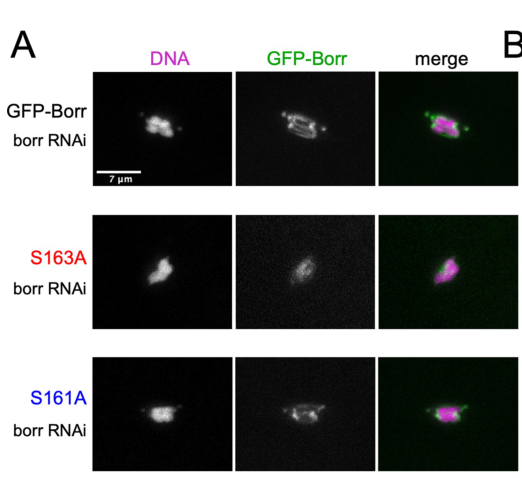

## Question

# Gene Research for Functional Annotation

## ⚠️ CRITICAL: Gene/Protein Identification Context

**BEFORE YOU BEGIN RESEARCH:** You MUST verify you are researching the CORRECT gene/protein. Gene symbols can be ambiguous, especially for less well-characterized genes from non-model organisms.

### Target Gene/Protein Identity (from UniProt):
- **UniProt Accession:** Q9VLD6
- **Protein Description:** RecName: Full=Borealin; AltName: Full=Aurora borealis protein; AltName: Full=Borealin-related;
- **Gene Information:** Name=borr; ORFNames=CG4454;
- **Organism (full):** Drosophila melanogaster (Fruit fly).
- **Protein Family:** Belongs to the borealin family. .
- **Key Domains:** Borealin_C. (IPR046466); Cell_div_borealin. (IPR018867); Borealin (PF10512)

### MANDATORY VERIFICATION STEPS:

1. **Check if the gene symbol "borr" matches the protein description above**
2. **Verify the organism is correct:** Drosophila melanogaster (Fruit fly).
3. **Check if protein family/domains align with what you find in literature**
4. **If you find literature for a DIFFERENT gene with the same or similar symbol, STOP**

### If Gene Symbol is Ambiguous or You Cannot Find Relevant Literature:

**DO NOT PROCEED WITH RESEARCH ON A DIFFERENT GENE.** Instead:
- State clearly: "The gene symbol 'borr' is ambiguous or literature is limited for this specific protein"
- Explain what you found (e.g., "Found extensive literature on a different gene with the same symbol in a different organism")
- Describe the protein based ONLY on the UniProt information provided above
- Suggest that the protein function can be inferred from domain/family information

### Research Target:

Please provide a comprehensive research report on the gene **borr** (gene ID: borr, UniProt: Q9VLD6) in DROME.

The research report should be a detailed narrative explaining the function, biological processes, and localization of the gene product. Citations should be given for all claims.

You should prioritize authoritative reviews and primary scientific literature when conducting research. You can supplement
this with annotations you find in gene/protein databases, but these can be outdated or inaccurate.

We are specifically interested in the primary function of the gene - for enzymes, what reaction is catalyzed, and what is the substrate specificity? For transporters, what is the substrate? For structural proteins or adapters, what is the broader structural role? For signaling molecules, what is the role in the pathway.

We are interested in where in or outside the cell the gene product carries out its function.

We are also interested in the signaling or biochemical pathways in which the gene functions. We are less interested in broad pleiotropic effects, except where these elucidate the precise role.

Include evidence where possible. We are interested in both experimental evidence as well as inference from structure, evolution, or bioinformatic analysis. Precise studies should be prioritized over high-throughput, where available.

## Output

Question: You are an expert researcher providing comprehensive, well-cited information.

Provide detailed information focusing on:
1. Key concepts and definitions with current understanding
2. Recent developments and latest research (prioritize 2023-2024 sources)
3. Current applications and real-world implementations
4. Expert opinions and analysis from authoritative sources
5. Relevant statistics and data from recent studies

Format as a comprehensive research report with proper citations. Include URLs and publication dates where available.
Always prioritize recent, authoritative sources and provide specific citations for all major claims.

# Gene Research for Functional Annotation

## ⚠️ CRITICAL: Gene/Protein Identification Context

**BEFORE YOU BEGIN RESEARCH:** You MUST verify you are researching the CORRECT gene/protein. Gene symbols can be ambiguous, especially for less well-characterized genes from non-model organisms.

### Target Gene/Protein Identity (from UniProt):
- **UniProt Accession:** Q9VLD6
- **Protein Description:** RecName: Full=Borealin; AltName: Full=Aurora borealis protein; AltName: Full=Borealin-related;
- **Gene Information:** Name=borr; ORFNames=CG4454;
- **Organism (full):** Drosophila melanogaster (Fruit fly).
- **Protein Family:** Belongs to the borealin family. .
- **Key Domains:** Borealin_C. (IPR046466); Cell_div_borealin. (IPR018867); Borealin (PF10512)

### MANDATORY VERIFICATION STEPS:

1. **Check if the gene symbol "borr" matches the protein description above**
2. **Verify the organism is correct:** Drosophila melanogaster (Fruit fly).
3. **Check if protein family/domains align with what you find in literature**
4. **If you find literature for a DIFFERENT gene with the same or similar symbol, STOP**

### If Gene Symbol is Ambiguous or You Cannot Find Relevant Literature:

**DO NOT PROCEED WITH RESEARCH ON A DIFFERENT GENE.** Instead:
- State clearly: "The gene symbol 'borr' is ambiguous or literature is limited for this specific protein"
- Explain what you found (e.g., "Found extensive literature on a different gene with the same symbol in a different organism")
- Describe the protein based ONLY on the UniProt information provided above
- Suggest that the protein function can be inferred from domain/family information

### Research Target:

Please provide a comprehensive research report on the gene **borr** (gene ID: borr, UniProt: Q9VLD6) in DROME.

The research report should be a detailed narrative explaining the function, biological processes, and localization of the gene product. Citations should be given for all claims.

You should prioritize authoritative reviews and primary scientific literature when conducting research. You can supplement
this with annotations you find in gene/protein databases, but these can be outdated or inaccurate.

We are specifically interested in the primary function of the gene - for enzymes, what reaction is catalyzed, and what is the substrate specificity? For transporters, what is the substrate? For structural proteins or adapters, what is the broader structural role? For signaling molecules, what is the role in the pathway.

We are interested in where in or outside the cell the gene product carries out its function.

We are also interested in the signaling or biochemical pathways in which the gene functions. We are less interested in broad pleiotropic effects, except where these elucidate the precise role.

Include evidence where possible. We are interested in both experimental evidence as well as inference from structure, evolution, or bioinformatic analysis. Precise studies should be prioritized over high-throughput, where available.

# Functional annotation of *Drosophila melanogaster borr* (CG4454; UniProt Q9VLD6)

## Identity and primary function

**Identity verified.** The target is the fruit-fly gene *borr*, originally designated CG4454 and named **Borealin-related**. Eggert and colleagues explicitly connected CG4454 with *borr* in 2004; they initially regarded its sequence relationship to vertebrate Borealin as tentative. Subsequent fly studies treat the product as Borealin, a subunit of the **chromosomal passenger complex** (CPC). This is not a report about a similarly named gene in another organism. The supplied UniProt annotation—Borealin family, including Borealin_C, Cell_div_borealin and PF10512 domains—is consistent with that identification; the exact accession-to-domain mapping is supplied annotation rather than an independently tested conclusion of the cited experiments. (eggert2004parallelchemicalgenetic pages 4-5, hertzler2020kinetochoreproteinssuppress pages 2-3, repton2022thephosphodockingprotein pages 5-7)

**Best-supported molecular annotation:** Borr is a *nonenzymatic CPC localization and assembly factor*. The fly CPC comprises Borr, INCENP, Deterin/Survivin and **Aurora B**, its protein kinase. Borr helps position and maintain this complex at chromosomes and spindle microtubules so that Aurora B can regulate chromosome segregation, meiotic spindle organization and cytokinesis. Borr does **not** itself catalyze histone phosphorylation, transport a substrate or serve as the mechanical force generator of the spindle. Its relevant binding partners and surfaces—not an enzymatic substrate specificity—define its molecular function. (eggert2004parallelchemicalgenetic pages 4-5, hertzler2020kinetochoreproteinssuppress pages 2-3, wang2020oocytespindleassembly pages 1-5, mckim2022highwaytohell‐thy pages 1-4)

## Where Borr acts and what it does

In dividing fly Kc167 cells, Borr–GFP followed the characteristic *chromosomal-passenger* itinerary and colocalized with Aurora B during mitosis and cytokinesis: chromosome-associated localization is followed by localization on the interzonal spindle and cytokinetic structures. Borr depletion eliminated detectable INCENP staining at its usual cellular sites, whereas Aurora B depletion did not have the same effect on INCENP localization. Borr is thus important for properly localizing or maintaining the CPC, rather than being merely another downstream readout of Aurora B activity. Borr depletion also eliminated detectable mitotic histone-H3 Ser10 phosphorylation in the abnormal mitotic figures examined, consistent with loss of correctly deployed Aurora B signaling. RNAi against *borr* caused malformed spindles, chromosome misalignment and binucleate cells, connecting this molecular defect to mitosis and cytokinesis. These are cell-based results, not measurements of Borr kinase activity. [Eggert et al., *PLoS Biology*, December 2004; https://doi.org/10.1371/journal.pbio.0020379.] (eggert2004parallelchemicalgenetic pages 4-5, eggert2004parallelchemicalgenetic pages 5-7)

In female meiosis, Borr functions at **meiotic chromosomes/centromeres and spindle microtubules**, with prominent CPC localization at the spindle equator or central spindle. The strongest mechanistic fly evidence comes from experiments replacing INCENP’s Borealin/Deterin-interacting region with Borr: the resulting **Borr–INCENP fusion** supported chromosome-dependent assembly of a bipolar spindle and central spindle in INCENP-depleted oocytes, whereas a Deterin–INCENP fusion supported chromosome-proximal kinetochore fibers but not a central spindle. The Borr fusion could also support spindle assembly when Deterin was depleted. This experimentally separates Borr’s contribution to CPC movement onto microtubules from simple centromeric tethering, although the rescue was incomplete in some oocytes. [Wang et al., 2020 preprint, version posted January 2021, https://doi.org/10.1101/2020.06.03.132142; subsequent peer-reviewed article, *Journal of Cell Biology*, April 2021, https://doi.org/10.1083/jcb.202006018. The experimental details and percentages reported here were checked in the accessible **preprint** text.] (wang2020oocytespindleassembly pages 8-11, wang2020oocytespindleassembly pages 11-14)

Borr’s **C-terminal region** is particularly important in this oocyte system. Deleting it from the Borr–INCENP fusion left only **19%** of examined oocytes with kinetochore fibers and **none** with a central spindle. An INCENP construct targeted to HP1-rich chromatin but lacking Borr did not adequately restore bipolar spindle assembly. Together, these manipulations support a role for Borr in chromatin-associated CPC recruitment *and* its subsequent redistribution to spindle microtubules. The authors favor an involvement of HP1-associated chromatin but expressly could not exclude direct nucleosome contacts; the fly deletion experiments alone do not demonstrate a purified, direct Borr–HP1 interaction. [Wang et al., preprint and subsequent 2021 article, links above.] (wang2020oocytespindleassembly pages 11-14, wang2020oocytespindleassembly pages 14-17)

The CPC is part of the **Aurora B cell-division signaling pathway**, not a standalone Borealin signaling cascade. In the original fly-cell experiments, *borr* RNAi and *aurora B* RNAi produced similar mitotic/cytokinetic defects and loss of the Aurora-B-dependent H3S10 phosphorylation readout. In oocytes, inhibiting Aurora B led CPC proteins to remain chromosome-associated while the spindle diminished; removing microtubules likewise redistributed the CPC to chromosomes. These perturbations support coordinated chromatin recruitment, Aurora-B-dependent spindle assembly and microtubule-associated CPC localization. They do not imply that Borr itself phosphorylates H3S10 or that every Aurora B target is a direct Borr interactor. (eggert2004parallelchemicalgenetic pages 4-5, eggert2004parallelchemicalgenetic pages 5-7, wang2020oocytespindleassembly pages 14-17)

## Biochemical regulation and quantitative functional evidence

The most precise **direct fly biochemical study** links Borr to 14-3-3-mediated spatial regulation in oocytes. In an ovarian microtubule-cosedimentation proteomics experiment, inhibition of 14-3-3 increased microtubule-associated Borealin, Aurora B and INCENP. Purified Borr residues **113–221** bound 14-3-3ε after phosphorylation by PKD2; replacing **S163** greatly reduced binding. Subsequent Aurora B treatment antagonized that interaction, and mutation of adjacent **S161** prevented this antagonism. The data support a model in which phosphorylation-dependent 14-3-3 binding restrains Borr/CPC–microtubule association away from chromosomes, while local Aurora B activity can relieve that restraint. The ovarian assay measures association in an extract; it does **not** establish a binding constant for purified Borr and purified microtubules. [Repton et al., *PLOS Genetics*, **6 June 2022**; https://doi.org/10.1371/journal.pgen.1009995.] (repton2022thephosphodockingprotein pages 4-5, repton2022thephosphodockingprotein pages 7-9, repton2022thephosphodockingprotein pages 5-7, repton2022thephosphodockingprotein pages 12-14)

RNAi-resistant GFP–Borr constructs provided an in-vivo test of that mechanism. Relative to wild-type GFP–Borr, **S163A reduced combined spindle/centromere signal by 82%** and **S161A by 59%** (*p*<0.001 for each). Mutant-protein abundance and a chromosome-marker signal did not explain the localization differences. In metaphase-I oocytes, chromosome-3 homolog-centromere **mono-orientation increased from 5% in controls to 30% after *borr* RNAi** (*p*<0.001). Wild-type Borr rescued the defect; S163A did not, and S161A showed an intermediate effect. Notably, gross spindle shapes after RNAi looked fairly similar to controls, which the authors suggested might reflect incomplete depletion; that observation should not be read as evidence that Borr is dispensable for spindle assembly. [Repton et al., 6 June 2022; Figure 4 and accompanying text: https://doi.org/10.1371/journal.pgen.1009995.g004.] (repton2022thephosphodockingprotein pages 9-11, repton2022thephosphodockingprotein media 0205f892)

The following evidence matrix separates experiments directly testing fly Borr from newer studies that provide pathway context. (eggert2004parallelchemicalgenetic pages 4-5, repton2022thephosphodockingprotein pages 9-11, joshi2024meiosisspecificfunctionsof pages 1-2, wang2020oocytespindleassembly pages 11-14)

| Study and source | System / method | Key finding | Functional-annotation implication | Evidence scope |
|---|---|---|---|---|
| Eggert et al., *PLoS Biology* (December 2004), [DOI](https://doi.org/10.1371/journal.pbio.0020379) | *D. melanogaster* Kc167 cells; RNAi, GFP fusions and immunofluorescence | CG4454/Borr-GFP displayed chromosomal-passenger localization and colocalized with Aurora B through mitosis and cytokinesis. Independent **borr** dsRNAs reproduced Aurora-B/INCENP-like mitotic and cytokinetic defects. (eggert2004parallelchemicalgenetic pages 4-5, eggert2004parallelchemicalgenetic pages 5-7) | Establishes that **borr/CG4454** encodes a fly CPC targeting/structural subunit rather than an enzyme. | Direct fly evidence; the original paper called Borealin orthology tentative, explaining the historical name *Borealin-related*. |
| Eggert et al., *PLoS Biology* (December 2004), [DOI](https://doi.org/10.1371/journal.pbio.0020379) | *D. melanogaster* Kc167 cells; **borr** RNAi and CPC-marker staining | Borr depletion eliminated detectable INCENP localization and abolished Aurora-B-dependent histone H3 Ser10 phosphorylation in abnormal mitotic figures. (eggert2004parallelchemicalgenetic pages 4-5, eggert2004parallelchemicalgenetic pages 5-7) | Borr is required to position or stabilize the CPC and thereby enable Aurora B signaling, chromosome segregation and cytokinesis; it does not itself catalyze phosphorylation. | Direct fly loss-of-function evidence, although RNAi cannot alone distinguish loss of CPC assembly from altered protein stability. |
| Wang et al., bioRxiv (June 2020; version posted January 2021), [preprint DOI](https://doi.org/10.1101/2020.06.03.132142); peer-reviewed article: *Journal of Cell Biology* (April 2021), [DOI](https://doi.org/10.1083/jcb.202006018) | *D. melanogaster* oocytes; RNAi-resistant **borr:Incenp** and **Det:Incenp** fusion constructs | **borr:Incenp**, unlike **Det:Incenp**, rescued bipolar and central-spindle assembly after INCENP depletion and could support spindle formation independently of Deterin. In 47% of rescued oocytes, INCENP reached microtubules but was not concentrated at the central spindle, indicating substantial but incomplete rescue. (wang2020oocytespindleassembly pages 8-11, wang2020oocytespindleassembly pages 11-14) | Borealin is sufficient to target the CPC to chromosomes and promote its subsequent transfer to spindle microtubules; its role exceeds passive tethering at centromeres. | Direct fly functional-fusion evidence. Numerical details cited here were retrieved from the preprint text; the peer-reviewed 2021 article is the definitive publication. |
| Wang et al., bioRxiv (2020/2021), [preprint DOI](https://doi.org/10.1101/2020.06.03.132142); peer-reviewed article: *Journal of Cell Biology* (April 2021), [DOI](https://doi.org/10.1083/jcb.202006018) | *D. melanogaster* oocytes; C-terminal deletion in a Borr-INCENP fusion | Removing Borealin's C-terminal region allowed K-fiber assembly in only **19%** of oocytes and produced **no central spindles**. Combined loss of this region and putative INCENP-HP1 contacts nearly abolished spindle assembly. (wang2020oocytespindleassembly pages 11-14) | The Borealin C-terminal region is critical for chromosome-associated CPC recruitment and chromosome-to-microtubule transfer, probably through multivalent chromatin contacts involving HP1 and/or nucleosomes. | Direct fly domain-function evidence, but it did not biochemically prove a direct Borr-HP1 interaction or exclude direct nucleosome binding. |
| Repton et al., *PLOS Genetics* (6 June 2022), [DOI](https://doi.org/10.1371/journal.pgen.1009995) | *D. melanogaster* ovaries and oocytes; microtubule cosedimentation proteomics, purified phosphoprotein pulldown, RNAi-resistant GFP-Borr mutants and live imaging | Phosphorylated Borr S163 supported direct 14-3-3ε binding; nearby Aurora-B-regulated S161 antagonized that interaction. Relative to wild type, **S163A reduced spindle/centromere GFP signal by 82%** and **S161A by 59%**; both differences had *p*<0.001. (repton2022thephosphodockingprotein pages 7-9, repton2022thephosphodockingprotein pages 9-11) | Defines a spatial switch: 14-3-3 restrains Borr/CPC microtubule association in the cytoplasm, whereas Aurora B near chromatin can relieve that restraint and promote localized CPC recruitment. | Direct fly biochemical and in-vivo phosphosite evidence. Microtubule association was measured in ovary extracts; purified Borr-only microtubule affinity was not established. |
| Repton et al., *PLOS Genetics* (6 June 2022), [DOI](https://doi.org/10.1371/journal.pgen.1009995) | *D. melanogaster* metaphase-I oocytes; **borr** RNAi, transgenic rescue, tubulin staining and chromosome-3 pericentromeric FISH | Homolog-centromere mono-orientation rose from **5% in controls to 30% after borr RNAi** (*p*<0.001). Wild-type GFP-Borr fully rescued the defect; **S163A did not**, while S161A gave an intermediate outcome. (repton2022thephosphodockingprotein pages 9-11, repton2022thephosphodockingprotein media 0205f892) | Borr localization and its phosphoregulation are functionally required for homolog bi-orientation during female meiosis I. | Direct fly knockdown-and-rescue evidence; the authors note that partial depletion may explain the relatively normal gross spindle morphology. |
| Joshi et al., *Molecular Biology of the Cell* (August 2024), [DOI](https://doi.org/10.1091/mbc.e24-02-0067) | *D. melanogaster* oocytes; SPC105R domain replacement and chromosome-segregation assays | Aurora-B/PP1-regulated motifs in SPC105R residues 1-123 control kinetochore-microtubule attachment stability and metaphase-I arrest; residues 124-473 support lateral attachments and homolog biorientation. (joshi2024meiosisspecificfunctionsof pages 1-2) | Updates the downstream meiotic pathway in which the Borealin-containing CPC positions Aurora B activity, but does **not** directly test Borr, a Borr-SPC105R interaction or Borr-dependent SPC105R phosphorylation. | Recent peer-reviewed contextual evidence only; it must not be presented as a 2024 direct study of **borr**. |

*Table: A compact comparison of the direct fly experiments supporting Borr's identity, CPC-targeting role, localization and meiotic functions. The final row separates recent 2024 pathway context from experiments that directly assayed Borr.*

## Current interpretation, recent research and limits

An expert synthesis by McKim emphasizes that CPC interactions with **both chromatin and microtubules**, sometimes simultaneously, can concentrate Aurora B at the sites needed for spindle assembly and correction of chromosome-orientation errors. This interpretation fits the fly fusion and phosphosite-rescue experiments: Borr is an *active spatial organizer* of kinase activity rather than a passive passenger or a kinase. [McKim, *BioEssays*, published online November 2022; https://doi.org/10.1002/bies.202100202.] (mckim2022highwaytohell‐thy pages 4-5, mckim2022highwaytohell‐thy pages 1-4)

**2023–2024 literature should not be mistaken for new direct *borr* experiments.** A pertinent **August 2024** primary study in fly oocytes mapped meiotic functions of kinetochore protein SPC105R: its Aurora-B/PP1-regulated N-terminal motifs affect attachment stability and metaphase-I arrest, whereas residues 124–473 support lateral attachments and homolog bi-orientation. This refines the *meiotic context* in which a properly located Borealin-containing CPC acts, but it did not demonstrate Borr binding SPC105R or directly test Borr-dependent phosphorylation of SPC105R. [Joshi et al., *Molecular Biology of the Cell*, August 2024; https://doi.org/10.1091/mbc.e24-02-0067.] (joshi2024meiosisspecificfunctionsof pages 1-2) A **May 2026, non-peer-reviewed preprint** further reports HP1 co-immunoprecipitation with CPC components including Borealin in fly material and implicates HP1–CPC interactions in oocyte spindle assembly. Co-immunoprecipitation establishes association in a complex, **not** direct binary HP1–Borr binding; these newer conclusions remain provisional pending peer review. [Wu et al., bioRxiv, posted 7 May 2026; https://doi.org/10.64898/2026.05.01.722309.] (wu2026aninteractionbetween pages 1-6, wu2026aninteractionbetween pages 12-16)

**Evolutionary/structural inference must be kept separate.** Human recombinant-CPC and HeLa-cell experiments show direct Borealin-dependent binding to nucleosomes, while experiments in *Xenopus* identify an interaction between a Borealin dimerization region and shugoshin/Sgo1. These mechanisms offer plausible molecular explanations for conserved CPC targeting and are consistent with the supplied Borealin-family/domain assignment. They do **not**, by themselves, establish the identical binding interfaces, residues or histone-mark dependence for fly Borr. Indeed, the fly oocyte fusion study reported that depletion of Haspin and Bub1—the kinases associated with two canonical vertebrate centromere-targeting routes—did not prevent oocyte spindle assembly under its experimental conditions. [Abad et al., *Journal of Cell Biology*, September 2019, https://doi.org/10.1083/jcb.201905040; Bonner et al., *Molecular Biology of the Cell*, September 2020, https://doi.org/10.1091/mbc.e20-05-0341; Wang et al., preprint cited above.] (wang2020oocytespindleassembly pages 11-14, abad2019borealin–nucleosomeinteractionsecures pages 1-2, bonner2020theborealindimerization pages 6-10)

**Practical significance and remaining questions.** Fly Borr is used experimentally through RNAi, fluorescent-protein localization, domain/fusion constructs and phosphosite-mutant rescue to dissect CPC-dependent chromosome segregation and acentrosomal oocyte spindle assembly. The evidence supports functional annotation in **mitosis, female meiosis I and cytokinesis**, principally at **chromosomes/centromeres and spindle or cytokinetic microtubules**. A reported increase in neuronal *borr* transcript after dendrite injury suggests another possible context, but transcript induction and broader kinetochore-protein RNAi experiments do not establish a defined, Borr-specific postmitotic molecular mechanism. No clinical or therapeutic application of fly *borr* itself follows from these studies. The most important outstanding molecular distinctions are whether fly Borr binds HP1 or nucleosomes directly, exactly how it contacts microtubules, and how its chromosome-associated and spindle-associated CPC pools communicate. [Hertzler et al., *Molecular Biology of the Cell*, September 2020, https://doi.org/10.1091/mbc.e20-04-0237-t; McKim, 2022 review, link above.] (hertzler2020kinetochoreproteinssuppress pages 3-4, wang2020oocytespindleassembly pages 14-17, mckim2022highwaytohell‐thy pages 1-4)

References

1. (eggert2004parallelchemicalgenetic pages 4-5): Ulrike S Eggert, Amy A Kiger, Constance Richter, Zachary E Perlman, Norbert Perrimon, Timothy J Mitchison, and Christine M Field. Parallel chemical genetic and genome-wide rnai screens identify cytokinesis inhibitors and targets. PLoS Biology, 2:e379, Oct 2004. URL: https://doi.org/10.1371/journal.pbio.0020379, doi:10.1371/journal.pbio.0020379. This article has 387 citations and is from a highest quality peer-reviewed journal.

2. (hertzler2020kinetochoreproteinssuppress pages 2-3): James I. Hertzler, Samantha I. Simonovitch, Richard M. Albertson, Alexis T. Weiner, Derek M. R. Nye, and Melissa M. Rolls. Kinetochore proteins suppress neuronal microtubule dynamics and promote dendrite regeneration. Molecular Biology of the Cell, 31:2125-2138, Sep 2020. URL: https://doi.org/10.1091/mbc.e20-04-0237-t, doi:10.1091/mbc.e20-04-0237-t. This article has 49 citations and is from a domain leading peer-reviewed journal.

3. (repton2022thephosphodockingprotein pages 5-7): Charlotte Repton, C. Fiona Cullen, Mariana F. A. Costa, Christos Spanos, Juri Rappsilber, and Hiroyuki Ohkura. The phospho-docking protein 14-3-3 regulates microtubule-associated proteins in oocytes including the chromosomal passenger borealin. PLOS Genetics, 18:e1009995, Jun 2022. URL: https://doi.org/10.1371/journal.pgen.1009995, doi:10.1371/journal.pgen.1009995. This article has 6 citations and is from a domain leading peer-reviewed journal.

4. (wang2020oocytespindleassembly pages 1-5): Lin-Ing Wang, Tyler DeFosse, Janet K. Jang, Rachel A. Battaglia, Victoria F. Wagner, and Kim S. McKim. Oocyte spindle assembly depends on multiple interactions between hp1 and the cpc. bioRxiv, Jun 2020. URL: https://doi.org/10.1101/2020.06.03.132142, doi:10.1101/2020.06.03.132142. This article has 1 citations.

5. (mckim2022highwaytohell‐thy pages 1-4): Kim S. McKim. Highway to hell‐thy meiotic divisions: chromosome passenger complex functions driven by microtubules. BioEssays, Nov 2022. URL: https://doi.org/10.1002/bies.202100202, doi:10.1002/bies.202100202. This article has 7 citations and is from a peer-reviewed journal.

6. (eggert2004parallelchemicalgenetic pages 5-7): Ulrike S Eggert, Amy A Kiger, Constance Richter, Zachary E Perlman, Norbert Perrimon, Timothy J Mitchison, and Christine M Field. Parallel chemical genetic and genome-wide rnai screens identify cytokinesis inhibitors and targets. PLoS Biology, 2:e379, Oct 2004. URL: https://doi.org/10.1371/journal.pbio.0020379, doi:10.1371/journal.pbio.0020379. This article has 387 citations and is from a highest quality peer-reviewed journal.

7. (wang2020oocytespindleassembly pages 8-11): Lin-Ing Wang, Tyler DeFosse, Janet K. Jang, Rachel A. Battaglia, Victoria F. Wagner, and Kim S. McKim. Oocyte spindle assembly depends on multiple interactions between hp1 and the cpc. bioRxiv, Jun 2020. URL: https://doi.org/10.1101/2020.06.03.132142, doi:10.1101/2020.06.03.132142. This article has 1 citations.

8. (wang2020oocytespindleassembly pages 11-14): Lin-Ing Wang, Tyler DeFosse, Janet K. Jang, Rachel A. Battaglia, Victoria F. Wagner, and Kim S. McKim. Oocyte spindle assembly depends on multiple interactions between hp1 and the cpc. bioRxiv, Jun 2020. URL: https://doi.org/10.1101/2020.06.03.132142, doi:10.1101/2020.06.03.132142. This article has 1 citations.

9. (wang2020oocytespindleassembly pages 14-17): Lin-Ing Wang, Tyler DeFosse, Janet K. Jang, Rachel A. Battaglia, Victoria F. Wagner, and Kim S. McKim. Oocyte spindle assembly depends on multiple interactions between hp1 and the cpc. bioRxiv, Jun 2020. URL: https://doi.org/10.1101/2020.06.03.132142, doi:10.1101/2020.06.03.132142. This article has 1 citations.

10. (repton2022thephosphodockingprotein pages 4-5): Charlotte Repton, C. Fiona Cullen, Mariana F. A. Costa, Christos Spanos, Juri Rappsilber, and Hiroyuki Ohkura. The phospho-docking protein 14-3-3 regulates microtubule-associated proteins in oocytes including the chromosomal passenger borealin. PLOS Genetics, 18:e1009995, Jun 2022. URL: https://doi.org/10.1371/journal.pgen.1009995, doi:10.1371/journal.pgen.1009995. This article has 6 citations and is from a domain leading peer-reviewed journal.

11. (repton2022thephosphodockingprotein pages 7-9): Charlotte Repton, C. Fiona Cullen, Mariana F. A. Costa, Christos Spanos, Juri Rappsilber, and Hiroyuki Ohkura. The phospho-docking protein 14-3-3 regulates microtubule-associated proteins in oocytes including the chromosomal passenger borealin. PLOS Genetics, 18:e1009995, Jun 2022. URL: https://doi.org/10.1371/journal.pgen.1009995, doi:10.1371/journal.pgen.1009995. This article has 6 citations and is from a domain leading peer-reviewed journal.

12. (repton2022thephosphodockingprotein pages 12-14): Charlotte Repton, C. Fiona Cullen, Mariana F. A. Costa, Christos Spanos, Juri Rappsilber, and Hiroyuki Ohkura. The phospho-docking protein 14-3-3 regulates microtubule-associated proteins in oocytes including the chromosomal passenger borealin. PLOS Genetics, 18:e1009995, Jun 2022. URL: https://doi.org/10.1371/journal.pgen.1009995, doi:10.1371/journal.pgen.1009995. This article has 6 citations and is from a domain leading peer-reviewed journal.

13. (repton2022thephosphodockingprotein pages 9-11): Charlotte Repton, C. Fiona Cullen, Mariana F. A. Costa, Christos Spanos, Juri Rappsilber, and Hiroyuki Ohkura. The phospho-docking protein 14-3-3 regulates microtubule-associated proteins in oocytes including the chromosomal passenger borealin. PLOS Genetics, 18:e1009995, Jun 2022. URL: https://doi.org/10.1371/journal.pgen.1009995, doi:10.1371/journal.pgen.1009995. This article has 6 citations and is from a domain leading peer-reviewed journal.

14. (repton2022thephosphodockingprotein media 0205f892): Charlotte Repton, C. Fiona Cullen, Mariana F. A. Costa, Christos Spanos, Juri Rappsilber, and Hiroyuki Ohkura. The phospho-docking protein 14-3-3 regulates microtubule-associated proteins in oocytes including the chromosomal passenger borealin. PLOS Genetics, 18:e1009995, Jun 2022. URL: https://doi.org/10.1371/journal.pgen.1009995, doi:10.1371/journal.pgen.1009995. This article has 6 citations and is from a domain leading peer-reviewed journal.

15. (joshi2024meiosisspecificfunctionsof pages 1-2): Jay N. Joshi, Neha Changela, Lia Mahal, Janet Jang, Tyler Defosse, Lin-Ing Wang, Arunika Das, Joanatta G. Shapiro, and Kim McKim. Meiosis-specific functions of kinetochore protein spc105r required for chromosome segregation in <i>drosophila</i> oocytes. Molecular Biology of the Cell, Aug 2024. URL: https://doi.org/10.1091/mbc.e24-02-0067, doi:10.1091/mbc.e24-02-0067. This article has 6 citations and is from a domain leading peer-reviewed journal.

16. (mckim2022highwaytohell‐thy pages 4-5): Kim S. McKim. Highway to hell‐thy meiotic divisions: chromosome passenger complex functions driven by microtubules. BioEssays, Nov 2022. URL: https://doi.org/10.1002/bies.202100202, doi:10.1002/bies.202100202. This article has 7 citations and is from a peer-reviewed journal.

17. (wu2026aninteractionbetween pages 1-6): Siwen Wu, Ryan Doherty, Manisha Persaud, Keara Greer, Om Patil, Janet K. Jang, and Kim McKim. An interaction between hp1 and the chromosomal passenger complex initiates acentrosomal spindle assembly in <i>drosophila</i> oocytes. bioRxiv, May 2026. URL: https://doi.org/10.64898/2026.05.01.722309, doi:10.64898/2026.05.01.722309. This article has 0 citations.

18. (wu2026aninteractionbetween pages 12-16): Siwen Wu, Ryan Doherty, Manisha Persaud, Keara Greer, Om Patil, Janet K. Jang, and Kim McKim. An interaction between hp1 and the chromosomal passenger complex initiates acentrosomal spindle assembly in <i>drosophila</i> oocytes. bioRxiv, May 2026. URL: https://doi.org/10.64898/2026.05.01.722309, doi:10.64898/2026.05.01.722309. This article has 0 citations.

19. (abad2019borealin–nucleosomeinteractionsecures pages 1-2): Maria A. Abad, Jan G. Ruppert, Lana Buzuk, Martin Wear, Juan Zou, Kim M. Webb, David A. Kelly, Philipp Voigt, Juri Rappsilber, William C. Earnshaw, and A. Arockia Jeyaprakash. Borealin–nucleosome interaction secures chromosome association of the chromosomal passenger complex. The Journal of Cell Biology, 218:3912-3925, Sep 2019. URL: https://doi.org/10.1083/jcb.201905040, doi:10.1083/jcb.201905040. This article has 65 citations.

20. (bonner2020theborealindimerization pages 6-10): Mary Kate Bonner, Julian Haase, Hayden Saunders, Hindol Gupta, Biyun Iris Li, and Alexander E. Kelly. The borealin dimerization domain interacts with sgo1 to drive aurora b–mediated spindle assembly. Molecular Biology of the Cell, 31:2207-2218, Sep 2020. URL: https://doi.org/10.1091/mbc.e20-05-0341, doi:10.1091/mbc.e20-05-0341. This article has 25 citations and is from a domain leading peer-reviewed journal.

21. (hertzler2020kinetochoreproteinssuppress pages 3-4): James I. Hertzler, Samantha I. Simonovitch, Richard M. Albertson, Alexis T. Weiner, Derek M. R. Nye, and Melissa M. Rolls. Kinetochore proteins suppress neuronal microtubule dynamics and promote dendrite regeneration. Molecular Biology of the Cell, 31:2125-2138, Sep 2020. URL: https://doi.org/10.1091/mbc.e20-04-0237-t, doi:10.1091/mbc.e20-04-0237-t. This article has 49 citations and is from a domain leading peer-reviewed journal.

## Artifacts

- [Edison artifact artifact-00](borr-deep-research-falcon_artifacts/artifact-00.md)

## Citations

1. wang2020oocytespindleassembly pages 11-14
2. joshi2024meiosisspecificfunctionsof pages 1-2
3. eggert2004parallelchemicalgenetic pages 4-5
4. hertzler2020kinetochoreproteinssuppress pages 2-3
5. repton2022thephosphodockingprotein pages 5-7
6. wang2020oocytespindleassembly pages 1-5
7. eggert2004parallelchemicalgenetic pages 5-7
8. wang2020oocytespindleassembly pages 8-11
9. wang2020oocytespindleassembly pages 14-17
10. repton2022thephosphodockingprotein pages 4-5
11. repton2022thephosphodockingprotein pages 7-9
12. repton2022thephosphodockingprotein pages 12-14
13. repton2022thephosphodockingprotein pages 9-11
14. wu2026aninteractionbetween pages 1-6
15. wu2026aninteractionbetween pages 12-16
16. bonner2020theborealindimerization pages 6-10
17. hertzler2020kinetochoreproteinssuppress pages 3-4
18. Eggert et al., *PLoS Biology*, December 2004; https://doi.org/10.1371/journal.pbio.0020379.
19. Wang et al., 2020 preprint, version posted January 2021, https://doi.org/10.1101/2020.06.03.132142; subsequent peer-reviewed article, *Journal of Cell Biology*, April 2021, https://doi.org/10.1083/jcb.202006018. The experimental details and percentages reported here were checked in the accessible **preprint** text.
20. Wang et al., preprint and subsequent 2021 article, links above.
21. Repton et al., *PLOS Genetics*, **6 June 2022**; https://doi.org/10.1371/journal.pgen.1009995.
22. Repton et al., 6 June 2022; Figure 4 and accompanying text: https://doi.org/10.1371/journal.pgen.1009995.g004.
23. DOI
24. preprint DOI
25. McKim, *BioEssays*, published online November 2022; https://doi.org/10.1002/bies.202100202.
26. Joshi et al., *Molecular Biology of the Cell*, August 2024; https://doi.org/10.1091/mbc.e24-02-0067.
27. Wu et al., bioRxiv, posted 7 May 2026; https://doi.org/10.64898/2026.05.01.722309.
28. Abad et al., *Journal of Cell Biology*, September 2019, https://doi.org/10.1083/jcb.201905040; Bonner et al., *Molecular Biology of the Cell*, September 2020, https://doi.org/10.1091/mbc.e20-05-0341; Wang et al., preprint cited above.
29. Hertzler et al., *Molecular Biology of the Cell*, September 2020, https://doi.org/10.1091/mbc.e20-04-0237-t; McKim, 2022 review, link above.
30. https://doi.org/10.1371/journal.pbio.0020379.]
31. https://doi.org/10.1101/2020.06.03.132142;
32. https://doi.org/10.1083/jcb.202006018.
33. https://doi.org/10.1371/journal.pgen.1009995.]
34. https://doi.org/10.1371/journal.pgen.1009995.g004.]
35. https://doi.org/10.1371/journal.pbio.0020379
36. https://doi.org/10.1101/2020.06.03.132142
37. https://doi.org/10.1083/jcb.202006018
38. https://doi.org/10.1371/journal.pgen.1009995
39. https://doi.org/10.1091/mbc.e24-02-0067
40. https://doi.org/10.1002/bies.202100202.]
41. https://doi.org/10.1091/mbc.e24-02-0067.]
42. https://doi.org/10.64898/2026.05.01.722309.]
43. https://doi.org/10.1083/jcb.201905040;
44. https://doi.org/10.1091/mbc.e20-05-0341;
45. https://doi.org/10.1091/mbc.e20-04-0237-t;
46. https://doi.org/10.1371/journal.pbio.0020379,
47. https://doi.org/10.1091/mbc.e20-04-0237-t,
48. https://doi.org/10.1371/journal.pgen.1009995,
49. https://doi.org/10.1101/2020.06.03.132142,
50. https://doi.org/10.1002/bies.202100202,
51. https://doi.org/10.1091/mbc.e24-02-0067,
52. https://doi.org/10.64898/2026.05.01.722309,
53. https://doi.org/10.1083/jcb.201905040,
54. https://doi.org/10.1091/mbc.e20-05-0341,