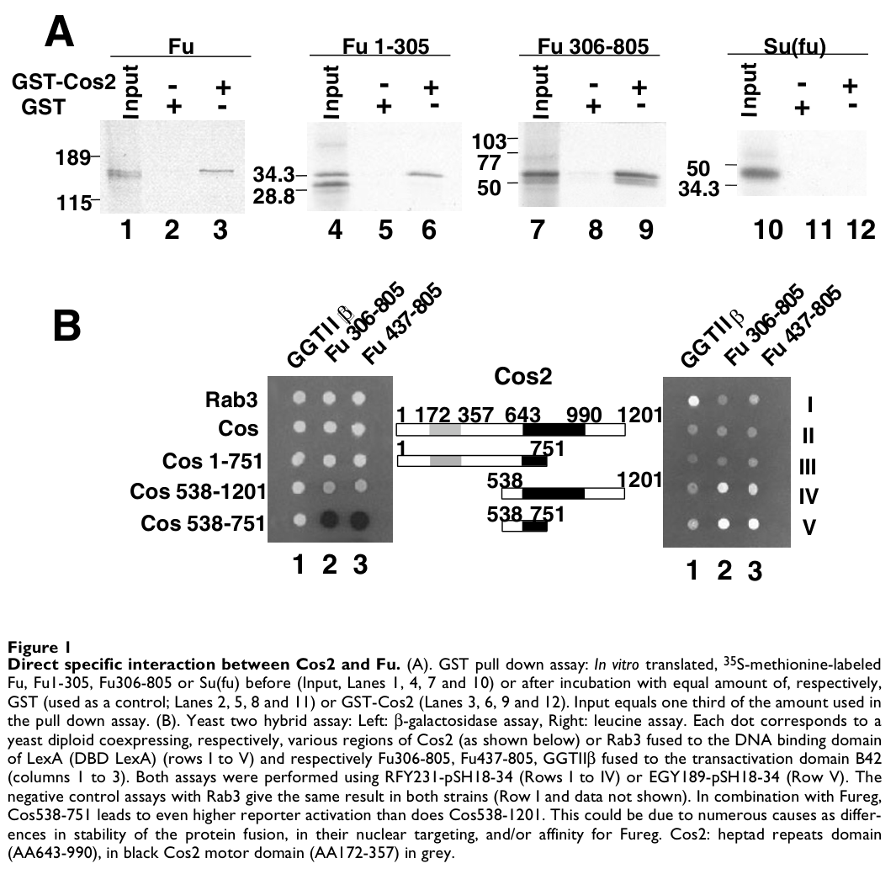

## Question

# Gene Research for Functional Annotation

## ⚠️ CRITICAL: Gene/Protein Identification Context

**BEFORE YOU BEGIN RESEARCH:** You MUST verify you are researching the CORRECT gene/protein. Gene symbols can be ambiguous, especially for less well-characterized genes from non-model organisms.

### Target Gene/Protein Identity (from UniProt):
- **UniProt Accession:** O16844
- **Protein Description:** RecName: Full=Kinesin-like protein costa; AltName: Full=Kinesin-like protein costal2;
- **Gene Information:** Name=cos; Synonyms=cos2, costal-2; ORFNames=CG1708;
- **Organism (full):** Drosophila melanogaster (Fruit fly).
- **Protein Family:** Belongs to the TRAFAC class myosin-kinesin ATPase
- **Key Domains:** Kinesin-like_fam. (IPR027640); Kinesin_motor_dom. (IPR001752); Kinesin_motor_dom_sf. (IPR036961); P-loop_NTPase. (IPR027417); Kinesin (PF00225)

### MANDATORY VERIFICATION STEPS:

1. **Check if the gene symbol "cos" matches the protein description above**
2. **Verify the organism is correct:** Drosophila melanogaster (Fruit fly).
3. **Check if protein family/domains align with what you find in literature**
4. **If you find literature for a DIFFERENT gene with the same or similar symbol, STOP**

### If Gene Symbol is Ambiguous or You Cannot Find Relevant Literature:

**DO NOT PROCEED WITH RESEARCH ON A DIFFERENT GENE.** Instead:
- State clearly: "The gene symbol 'cos' is ambiguous or literature is limited for this specific protein"
- Explain what you found (e.g., "Found extensive literature on a different gene with the same symbol in a different organism")
- Describe the protein based ONLY on the UniProt information provided above
- Suggest that the protein function can be inferred from domain/family information

### Research Target:

Please provide a comprehensive research report on the gene **cos** (gene ID: cos, UniProt: O16844) in DROME.

The research report should be a detailed narrative explaining the function, biological processes, and localization of the gene product. Citations should be given for all claims.

You should prioritize authoritative reviews and primary scientific literature when conducting research. You can supplement
this with annotations you find in gene/protein databases, but these can be outdated or inaccurate.

We are specifically interested in the primary function of the gene - for enzymes, what reaction is catalyzed, and what is the substrate specificity? For transporters, what is the substrate? For structural proteins or adapters, what is the broader structural role? For signaling molecules, what is the role in the pathway.

We are interested in where in or outside the cell the gene product carries out its function.

We are also interested in the signaling or biochemical pathways in which the gene functions. We are less interested in broad pleiotropic effects, except where these elucidate the precise role.

Include evidence where possible. We are interested in both experimental evidence as well as inference from structure, evolution, or bioinformatic analysis. Precise studies should be prioritized over high-throughput, where available.

## Output

Question: You are an expert researcher providing comprehensive, well-cited information.

Provide detailed information focusing on:
1. Key concepts and definitions with current understanding
2. Recent developments and latest research (prioritize 2023-2024 sources)
3. Current applications and real-world implementations
4. Expert opinions and analysis from authoritative sources
5. Relevant statistics and data from recent studies

Format as a comprehensive research report with proper citations. Include URLs and publication dates where available.
Always prioritize recent, authoritative sources and provide specific citations for all major claims.

# Gene Research for Functional Annotation

## ⚠️ CRITICAL: Gene/Protein Identification Context

**BEFORE YOU BEGIN RESEARCH:** You MUST verify you are researching the CORRECT gene/protein. Gene symbols can be ambiguous, especially for less well-characterized genes from non-model organisms.

### Target Gene/Protein Identity (from UniProt):
- **UniProt Accession:** O16844
- **Protein Description:** RecName: Full=Kinesin-like protein costa; AltName: Full=Kinesin-like protein costal2;
- **Gene Information:** Name=cos; Synonyms=cos2, costal-2; ORFNames=CG1708;
- **Organism (full):** Drosophila melanogaster (Fruit fly).
- **Protein Family:** Belongs to the TRAFAC class myosin-kinesin ATPase
- **Key Domains:** Kinesin-like_fam. (IPR027640); Kinesin_motor_dom. (IPR001752); Kinesin_motor_dom_sf. (IPR036961); P-loop_NTPase. (IPR027417); Kinesin (PF00225)

### MANDATORY VERIFICATION STEPS:

1. **Check if the gene symbol "cos" matches the protein description above**
2. **Verify the organism is correct:** Drosophila melanogaster (Fruit fly).
3. **Check if protein family/domains align with what you find in literature**
4. **If you find literature for a DIFFERENT gene with the same or similar symbol, STOP**

### If Gene Symbol is Ambiguous or You Cannot Find Relevant Literature:

**DO NOT PROCEED WITH RESEARCH ON A DIFFERENT GENE.** Instead:
- State clearly: "The gene symbol 'cos' is ambiguous or literature is limited for this specific protein"
- Explain what you found (e.g., "Found extensive literature on a different gene with the same symbol in a different organism")
- Describe the protein based ONLY on the UniProt information provided above
- Suggest that the protein function can be inferred from domain/family information

### Research Target:

Please provide a comprehensive research report on the gene **cos** (gene ID: cos, UniProt: O16844) in DROME.

The research report should be a detailed narrative explaining the function, biological processes, and localization of the gene product. Citations should be given for all claims.

You should prioritize authoritative reviews and primary scientific literature when conducting research. You can supplement
this with annotations you find in gene/protein databases, but these can be outdated or inaccurate.

We are specifically interested in the primary function of the gene - for enzymes, what reaction is catalyzed, and what is the substrate specificity? For transporters, what is the substrate? For structural proteins or adapters, what is the broader structural role? For signaling molecules, what is the role in the pathway.

We are interested in where in or outside the cell the gene product carries out its function.

We are also interested in the signaling or biochemical pathways in which the gene functions. We are less interested in broad pleiotropic effects, except where these elucidate the precise role.

Include evidence where possible. We are interested in both experimental evidence as well as inference from structure, evolution, or bioinformatic analysis. Precise studies should be prioritized over high-throughput, where available.

# Functional annotation report: *Drosophila melanogaster* **cos** / Costal2

## Identity and principal function

The research target is the fruit-fly gene **cos**, also called **cos2** or **costal-2** (CG1708), corresponding to **UniProt O16844** in the identification supplied. Its product is the kinesin-like protein **Costal2 (Cos2)**, not a similarly named protein from another organism. Primary *Drosophila* studies independently identify Costal2 as a kinesin-related component of the Hedgehog (Hh) signaling machinery; vertebrate KIF7 is a related protein, **not** the gene annotated here. The CG1708–O16844 mapping and the InterPro/Pfam identifiers below come from the supplied UniProt identification rather than an independently verified accession in those studies. (monnier2002hedgehogsignaltransduction pages 1-2, endohyamagami2009themammaliancos2 pages 6-7, yue2018alteredchemomechanicalcoupling pages 1-2)

**Best-supported functional annotation:** Cos2 is an intracellular, microtubule-associated **signaling scaffold and regulator of the transcription factor Cubitus interruptus (Ci)**. It organizes proteins that repress Ci when Hh is absent and helps connect activated Smoothened (Smo) to Fused (Fu) kinase when Hh is present. It is **not established as a processive cargo transporter**, despite possessing a kinesin-like motor domain. Cos2 is neither the Hh ligand nor the enzyme that phosphorylates Ci: the relevant phosphorylation reactions are performed by associated kinases, notably PKA, CK1, GSK3 and Fu. (monnier2002hedgehogsignaltransduction pages 2-5, yue2018alteredchemomechanicalcoupling pages 4-5, maier2014abroadlyconserved pages 1-2, zhou2022gliphosphorylationcode pages 1-3)

## Molecular architecture and biochemical evidence

The supplied UniProt annotation assigns Cos2 a kinesin motor domain (**IPR001752; PF00225**), related kinesin structural annotations (**IPR027640; IPR036961**), and a P-loop NTPase fold (**IPR027417**). These assignments agree with the kinesin-related architecture investigated experimentally. In an interaction-mapping study, the motor region was placed at approximately **residues 172–357**, whereas the **538–751** region, beyond the motor and overlapping a predicted coiled coil, bound Fu’s regulatory region. GST pull-downs and yeast two-hybrid experiments demonstrated Cos2–Fu and Cos2–Ci interactions; the cropped original interaction figure provides visual support for the Fu result. The mapped boundaries describe the constructs in that study, not a newly validated catalytic site. (monnier2002hedgehogsignaltransduction pages 2-5, monnier2002hedgehogsignaltransduction media 8085ec69)

**A kinesin fold should not be equated with demonstrated transport or a quantified enzymatic reaction.** In single-molecule experiments, a *Drosophila* Cos2 fragment comprising residues **1–743** remained bound to, or diffused along, microtubules without detectable directional stepping at either rapid or slow imaging rates. The study tabulated its directional velocity as **0 nm/s under those assay conditions**, while listing Cos2-specific ATPase turnover, ATP affinity and multimotor transport as **not determined**. Its authors therefore favored a microtubule-tether model. Earlier reports of moving Cos2-containing cellular puncta do not settle whether Cos2 itself powered their movement: the observed motion was limited and nondirectional and persisted when the motor domain was deleted. ATPase measurements made for mammalian **KIF7/KIF27 must not be transferred to fly Cos2**. A direct Cos2-specific catalytic rate or substrate-specificity profile is consequently unavailable; its established molecular function is organizational rather than an assigned ATP-driven transport reaction. (yue2018alteredchemomechanicalcoupling pages 10-10, yue2018alteredchemomechanicalcoupling pages 9-10, yue2018alteredchemomechanicalcoupling pages 4-5)

## Position in the Hedgehog pathway

**Without Hh**, Patched keeps Smo inactive. Cos2 organizes a cytoplasmic complex containing Ci and Fu and facilitates Ci phosphorylation by **PKA, followed by CK1 and GSK3**. Phosphorylated full-length Ci is recognized through the Slimb-dependent processing machinery and partially proteolyzed into the approximately **75-kDa transcriptional repressor Ci75**, instead of functioning as the approximately **155-kDa full-length Ci155** activator. Cos2 and Suppressor of Fused [Su(fu)] also restrain full-length Ci in the cytoplasm. Importantly, Cos2 repression is **not merely a consequence of making Ci75**: in physiological wing-disc experiments, removing cos2 activated Ci engineered to resist processing, with the Ci **CORD** interaction region implicated in this separate inhibitory action. (monnier2002hedgehogsignaltransduction pages 1-2, little2020drosophilahedgehogcan pages 13-14, zhou2022gliphosphorylationcode pages 1-3, little2020drosophilahedgehogcan pages 14-16)

**With Hh**, ligand-bound Patched ceases to restrain Smo. Activated, phosphorylated Smo accumulates at the fly plasma membrane and recruits more Cos2–Fu complex through its cytoplasmic region. Smo mutant-localization and interaction experiments, and experiments using a truncated, Gprk2-regulated Smo construct, support that recruitment. Smo signaling reduces Ci processing and promotes Fu-dependent activation of full-length Ci, enabling Hh-responsive transcription. Cos2 therefore helps transmit a **positive** signal as well as enforcing basal repression; it is inaccurate to annotate it simply as an Hh inhibitor. (zhang2011transductionofthe pages 1-2, maier2014abroadlyconserved pages 1-2, zhang2011transductionofthe pages 2-4)

The two roles are distinguishable genetically. Loss of cos2 in anterior wing-disc cells can derepress low-level Hh target expression, whereas loss close to the anterior–posterior boundary compromises strong target-gene responses. At physiological Ci expression, Cos2-sensitive inhibition also persists when regulated Ci proteolysis has been blocked. These findings make **Ci state, location and signaling strength**, rather than a single on/off effect on pathway activity, the appropriate functional readouts. (ogden2004regulationofhedgehog pages 4-5, little2020drosophilahedgehogcan pages 1-2, little2020drosophilahedgehogcan pages 13-14)

The following observations delimit what has been measured directly versus inferred from pathway models:

| Claim | Direct observation and setting | Interpretation / limits | Primary DOI and year |
|---|---|---|---|
| Cos2 directly binds Fused (Fu) and Cubitus interruptus (Ci) | GST pull-down and yeast two-hybrid assays demonstrated direct Cos2–Fu and Cos2–Ci interactions. Fu’s regulatory domain bound Cos2 residues **538–751**, a coiled-coil-containing region C-terminal to the mapped Cos2 motor domain (**residues 172–357**); both Fu kinase and regulatory regions bound full-length Cos2. (monnier2002hedgehogsignaltransduction pages 2-5, monnier2002hedgehogsignaltransduction media 8085ec69) | Strong biochemical evidence that Cos2 is a Hedgehog-complex scaffold. The assays do not establish binding affinity, ATPase activity, or active microtubule transport. | [10.1186/1471-213X-2-4](https://doi.org/10.1186/1471-213X-2-4) (2002) |
| Activated Smoothened recruits Cos2 | A truncated *Drosophila* Smo containing its conserved membrane-proximal core and Gprk2-regulated phosphorylation sites recruited Cos2 and activated target-gene expression in a Gprk2-dependent manner. Hh-activated Smo accumulates at the plasma membrane. (maier2014abroadlyconserved pages 1-2) | Supports Cos2 as an intracellular adaptor connecting phosphorylated membrane-associated Smo to downstream signaling. It does not imply that all Cos2 is Smo-bound or membrane-localized. | [10.1371/journal.pgen.1004399](https://doi.org/10.1371/journal.pgen.1004399) (2014) |
| DmCos2 is not a conventional processive kinesin | Purified **DmCos2(1–743)** showed static binding or diffusion on microtubules at both 10 frames/s and one frame per 3 s, with reported directional velocity **0 nm/s**. Cos2-specific multimotor transport and kinetic values—including *k*cat, *K*0.5,MT, and *K*m,ATP—were **not determined (ND)**. (yue2018alteredchemomechanicalcoupling pages 9-10, yue2018alteredchemomechanicalcoupling pages 4-5) | Directly supports an immotile microtubule-tether/scaffold model under these in-vitro conditions. ATPase and ADP-release measurements reported for mammalian KIF7 or KIF27 must not be assigned to fly Cos2. | [10.1083/jcb.201708179](https://doi.org/10.1083/jcb.201708179) (2018) |
| Cos2 suppresses full-length Ci independently of promoting Ci processing | In *Drosophila* wing-imaginal-disc clones, loss of **cos2** activated processing-resistant Ci and increased **ptc-lacZ**; Ci CORD-domain experiments implicated direct Cos2–Ci binding. (little2020drosophilahedgehogcan pages 13-14, little2020drosophilahedgehogcan pages 14-16, little2020drosophilahedgehogcan pages 1-2) | Establishes a distinct inhibitory role in restraining full-length Ci activity, beyond scaffolding PKA/CK1/GSK3-dependent Ci processing. Physiological wing-disc evidence is stronger than conclusions based only on overexpression. | [10.7554/eLife.61083](https://doi.org/10.7554/eLife.61083) (2020) |
| Fu phosphorylation of Cos2 S572/S931 contributes modestly but is not obligatory | In **smo cos2 mutant wing-disc clones expressing GAP-Fu**, one genomic copy of wild-type Cos2 gave normalized **ptc-lacZ ≈59%** of the control AP-boundary level, versus **≈42%** with physiological-level Cos2-S572A/S931A. Elevated Ci-155 and Fu responses nevertheless persisted with the double mutant; broader combinations lacking known Cos2, Su(fu), and Ci phosphorylation sites retained largely normal signaling and adult wings. (kim2025hedgehogstimulatedphosphorylationat pages 16-19) | The 42% versus 59% values apply only to this sensitized GAP-Fu/*smo cos2* clone experiment, not normal pathway output. The sites make a modest contribution but are dispensable for much physiological signaling, indicating additional Fu targets. | [10.1371/journal.pbio.3003105](https://doi.org/10.1371/journal.pbio.3003105) (2025) |

*Table: Direct evidence for Drosophila melanogaster Costal2/O16844 as an immotile microtubule-associated Hedgehog signaling scaffold and Ci regulator. The table separates fly-specific observations from interpretations and excludes mammalian KIF7 biochemical results.*

## Where Cos2 acts

Cos2 operates primarily **inside Hh-responsive cells**: in cytoplasmic protein complexes associated with microtubules and, for a regulated subset, at intracellular membranes and the **cytoplasmic face of Smo-containing plasma membrane**. Embryonic and cultured-cell work found a Cos2–Fu–Ci complex associated with microtubules in the basal state and reported Hh-dependent changes in that association. In S2 cells, Cos2 and Fu colocalized even without Hh, while activated Smo increased recruitment of the complex to the cell surface; wing-disc interaction measurements likewise support Smo–Cos2 association. A review estimated that Cos2 is present at roughly **12-fold excess over Smo** in the system discussed, cautioning that *not all Cos2 is Smo-bound*. Cos2 regulates Ci before its nuclear transcriptional action; Cos2 should not be annotated as an extracellular Hh receptor or principally as a nuclear transcription factor. (monnier2002hedgehogsignaltransduction pages 2-5, zhang2011transductionofthe pages 2-4, robbins2012thehedgehogsignal pages 6-8, yu2024taincoa2suppressesthe pages 9-10)

**Species and compartment qualification:** mammalian KIF7 participates in cilium-associated Hh signaling, but this does not make the canonical fly wing-disc Cos2 mechanism a primary-cilium mechanism. A 2023 review emphasizes that cilia are dispensable for Hh signaling in many *Drosophila* tissues, unlike the vertebrate pathway. Where localization is described above, it refers to experimentally studied *fly* cells or tissues, not localization borrowed from mammalian KIF7. (endohyamagami2009themammaliancos2 pages 6-7, derderian2023seriouslyciliaa pages 4-6, maier2014abroadlyconserved pages 1-2)

## Recent evidence, interpretation and applications

**2023–2024 context.** The authoritative August **2023** cilia synthesis clarifies why vertebrate ciliary mechanisms must not be assigned wholesale to Cos2. A November **2024** *Drosophila* study distinguished Cos2/Su(fu)-associated **cytoplasmic** restraint of Ci from **nuclear** inhibition by Taiman: a nuclear Ci construct lacking Cos2- and Su(fu)-binding regions remained susceptible to Taiman. This is useful compartment-specific corroboration, **not** a new Cos2 biochemical assay. The literature retrieved for 2023–2024 contained limited direct new experiments on *fly Cos2 itself*; older primary work remains essential to annotate this gene accurately. (derderian2023seriouslyciliaa pages 4-6, yu2024taincoa2suppressesthe pages 9-10)

**Subsequent direct advances.** Physiological *Drosophila* wing-disc experiments published in **April 2025** complicate an earlier model in which Fu activates Ci principally by completely dissociating Ci from Su(fu). Designer **ci** alleles instead support Fu phosphorylation at **multiple Ci sites**—including regions around S218, S286/T294 and S1230—and a proposed opening of inhibitory **Ci–Ci interfaces** while substantial Ci–Su(fu) association can persist. Fu could activate Ci in cos2-deficient clones, so Cos2 facilitates normal signaling but is **not an absolute prerequisite for Fu’s action on Ci**. The same work found that nonphosphorylatable Cos2 **S572A/S931A** produced no major defect in ordinary physiological Hh readouts, although a sensitized **smo cos2**-clone/GAP-Fu assay showed a modest difference: **ptc-lacZ was 42% rather than 59% of the control anterior–posterior-boundary level** with mutant versus wild-type Cos2. Those percentages are specific to that assay, not estimates of normal Cos2 activity. (kim2025hedgehogstimulatedphosphorylationat pages 1-2, kim2025hedgehogstimulatedphosphorylationat pages 23-25, kim2025hedgehogstimulatedphosphorylationat pages 2-4, kim2025hedgehogstimulatedphosphorylationat pages 16-19)

A separate **January 2025** study reported Hh-induced Fu/Su(fu)/Ci cytoplasmic condensates and Fu-dependent Ci phosphorylation. It places Cos2 upstream as an organizer of the Smo–Fu signaling assembly; the demonstrated SUMO-dependent condensation and kinase catalysis concern **Fu**, not a newly established catalytic or phase-separation activity of Cos2. This illustrates why mechanistic findings for Cos2’s partners should be kept distinct from functions experimentally assigned to Cos2 itself. (han2025morphogeninducedkinasecondensates pages 1-2, han2025morphogeninducedkinasecondensates pages 4-7, han2025morphogeninducedkinasecondensates pages 7-8)

**Research use and translational boundary.** *cos2* loss-of-function clones, physiologically expressed Cos2 variants and Ci-binding-region mutants are implemented as **experimental tools** to separate Ci processing from full-length Ci inhibition and to measure graded Hh responses in wing imaginal discs, commonly with **ptc-lacZ**, Ci155 and adult-wing morphology as readouts. These are real-world laboratory implementations, **not evidence of a Cos2-directed treatment**. Conservation with vertebrate KIF7 makes the fly pathway informative for comparative Hh research, but direct clinical conclusions about UniProt O16844 would be inappropriate. (endohyamagami2009themammaliancos2 pages 6-7, little2020drosophilahedgehogcan pages 1-2, kim2025hedgehogstimulatedphosphorylationat pages 16-19, little2020drosophilahedgehogcan pages 14-16)

### Selected sources and dates

- **Monnier et al.**, *BMC Developmental Biology* (**March 2002**), direct Cos2–Fu/Ci interaction mapping: https://doi.org/10.1186/1471-213X-2-4. (monnier2002hedgehogsignaltransduction pages 2-5)
- **Maier et al.**, *PLOS Genetics* (**10 July 2014**), phosphorylated Smo recruitment of Cos2: https://doi.org/10.1371/journal.pgen.1004399. (maier2014abroadlyconserved pages 1-2)
- **Yue et al.**, *Journal of Cell Biology* (**April 2018**), direct comparison of kinesin motility including fly Cos2: https://doi.org/10.1083/jcb.201708179. (yue2018alteredchemomechanicalcoupling pages 4-5)
- **Little et al.**, *eLife* (**21 October 2020**, publication date shown in article), Ci-processing-independent Cos2 inhibition: https://doi.org/10.7554/eLife.61083. (little2020drosophilahedgehogcan pages 1-2)
- **Zhou and Jiang**, *Frontiers in Cell and Developmental Biology* (**25 January 2022**), expert review of the Ci phosphorylation pathway: https://doi.org/10.3389/fcell.2022.846927. (zhou2022gliphosphorylationcode pages 1-3)
- **Derderian et al.**, *Developmental Cell* (**August 2023**), comparative ciliary-signaling review: https://doi.org/10.1016/j.devcel.2023.06.013. (derderian2023seriouslyciliaa pages 4-6)
- **Yu et al.**, *PNAS* (**November 2024**), nuclear Ci inhibition distinguished from Cos2-associated restraint: https://doi.org/10.1073/pnas.2409380121. (yu2024taincoa2suppressesthe pages 9-10)
- **Han et al.**, *Science Advances* (**January 2025**), Fu-centered condensate mechanism: https://doi.org/10.1126/sciadv.adq1790. (han2025morphogeninducedkinasecondensates pages 1-2)
- **Kim et al.**, *PLOS Biology* (**11 April 2025**), physiological Ci/Cos2/Fu analyses: https://doi.org/10.1371/journal.pbio.3003105. (kim2025hedgehogstimulatedphosphorylationat pages 1-2, kim2025hedgehogstimulatedphosphorylationat pages 16-19)

References

1. (monnier2002hedgehogsignaltransduction pages 1-2): Véronique Monnier, Karen S Ho, Matthieu Sanial, Matthew P Scott, and Anne Plessis. Hedgehog signal transduction proteins: contacts of the fused kinase and ci transcription factor with the kinesin-related protein costal2. BMC Developmental Biology, 2:4-4, Mar 2002. URL: https://doi.org/10.1186/1471-213x-2-4, doi:10.1186/1471-213x-2-4. This article has 77 citations and is from a peer-reviewed journal.

2. (endohyamagami2009themammaliancos2 pages 6-7): Setsu Endoh-Yamagami, Marie Evangelista, Deanna Wilson, Xiaohui Wen, Jan-Willem Theunissen, Khanhky Phamluong, Matti Davis, Suzie J. Scales, Mark J. Solloway, Frederic J. de Sauvage, and Andrew S. Peterson. The mammalian cos2 homolog kif7 plays an essential role in modulating hh signal transduction during development. Current Biology, 19:1320-1326, Aug 2009. URL: https://doi.org/10.1016/j.cub.2009.06.046, doi:10.1016/j.cub.2009.06.046. This article has 235 citations and is from a highest quality peer-reviewed journal.

3. (yue2018alteredchemomechanicalcoupling pages 1-2): Yang Yue, T. Lynne Blasius, Stephanie Zhang, Shashank Jariwala, Benjamin Walker, Barry J. Grant, Jared C. Cochran, and Kristen J. Verhey. Altered chemomechanical coupling causes impaired motility of the kinesin-4 motors kif27 and kif7. The Journal of Cell Biology, 217:1319-1334, Apr 2018. URL: https://doi.org/10.1083/jcb.201708179, doi:10.1083/jcb.201708179. This article has 47 citations.

4. (monnier2002hedgehogsignaltransduction pages 2-5): Véronique Monnier, Karen S Ho, Matthieu Sanial, Matthew P Scott, and Anne Plessis. Hedgehog signal transduction proteins: contacts of the fused kinase and ci transcription factor with the kinesin-related protein costal2. BMC Developmental Biology, 2:4-4, Mar 2002. URL: https://doi.org/10.1186/1471-213x-2-4, doi:10.1186/1471-213x-2-4. This article has 77 citations and is from a peer-reviewed journal.

5. (yue2018alteredchemomechanicalcoupling pages 4-5): Yang Yue, T. Lynne Blasius, Stephanie Zhang, Shashank Jariwala, Benjamin Walker, Barry J. Grant, Jared C. Cochran, and Kristen J. Verhey. Altered chemomechanical coupling causes impaired motility of the kinesin-4 motors kif27 and kif7. The Journal of Cell Biology, 217:1319-1334, Apr 2018. URL: https://doi.org/10.1083/jcb.201708179, doi:10.1083/jcb.201708179. This article has 47 citations.

6. (maier2014abroadlyconserved pages 1-2): Dominic Maier, Shuofei Cheng, Denis Faubert, and David R. Hipfner. A broadly conserved g-protein-coupled receptor kinase phosphorylation mechanism controls drosophila smoothened activity. PLoS Genetics, 10:e1004399, Jul 2014. URL: https://doi.org/10.1371/journal.pgen.1004399, doi:10.1371/journal.pgen.1004399. This article has 40 citations and is from a domain leading peer-reviewed journal.

7. (zhou2022gliphosphorylationcode pages 1-3): Mengmeng Zhou and Jin Jiang. Gli phosphorylation code in hedgehog signal transduction. Frontiers in Cell and Developmental Biology, Jan 2022. URL: https://doi.org/10.3389/fcell.2022.846927, doi:10.3389/fcell.2022.846927. This article has 38 citations.

8. (monnier2002hedgehogsignaltransduction media 8085ec69): Véronique Monnier, Karen S Ho, Matthieu Sanial, Matthew P Scott, and Anne Plessis. Hedgehog signal transduction proteins: contacts of the fused kinase and ci transcription factor with the kinesin-related protein costal2. BMC Developmental Biology, 2:4-4, Mar 2002. URL: https://doi.org/10.1186/1471-213x-2-4, doi:10.1186/1471-213x-2-4. This article has 77 citations and is from a peer-reviewed journal.

9. (yue2018alteredchemomechanicalcoupling pages 10-10): Yang Yue, T. Lynne Blasius, Stephanie Zhang, Shashank Jariwala, Benjamin Walker, Barry J. Grant, Jared C. Cochran, and Kristen J. Verhey. Altered chemomechanical coupling causes impaired motility of the kinesin-4 motors kif27 and kif7. The Journal of Cell Biology, 217:1319-1334, Apr 2018. URL: https://doi.org/10.1083/jcb.201708179, doi:10.1083/jcb.201708179. This article has 47 citations.

10. (yue2018alteredchemomechanicalcoupling pages 9-10): Yang Yue, T. Lynne Blasius, Stephanie Zhang, Shashank Jariwala, Benjamin Walker, Barry J. Grant, Jared C. Cochran, and Kristen J. Verhey. Altered chemomechanical coupling causes impaired motility of the kinesin-4 motors kif27 and kif7. The Journal of Cell Biology, 217:1319-1334, Apr 2018. URL: https://doi.org/10.1083/jcb.201708179, doi:10.1083/jcb.201708179. This article has 47 citations.

11. (little2020drosophilahedgehogcan pages 13-14): Jamie C. Little, Elisa Garcia-Garcia, Amanda Sul, and Daniel Kalderon. Drosophila hedgehog can act as a morphogen in the absence of regulated ci processing. eLife, Jun 2020. URL: https://doi.org/10.7554/elife.61083, doi:10.7554/elife.61083. This article has 14 citations and is from a domain leading peer-reviewed journal.

12. (little2020drosophilahedgehogcan pages 14-16): Jamie C. Little, Elisa Garcia-Garcia, Amanda Sul, and Daniel Kalderon. Drosophila hedgehog can act as a morphogen in the absence of regulated ci processing. eLife, Jun 2020. URL: https://doi.org/10.7554/elife.61083, doi:10.7554/elife.61083. This article has 14 citations and is from a domain leading peer-reviewed journal.

13. (zhang2011transductionofthe pages 1-2): Yanyan Zhang, Feifei Mao, Yi Lu, Wenqing Wu, Lei Zhang, and Yun Zhao. Transduction of the hedgehog signal through the dimerization of fused and the nuclear translocation of cubitus interruptus. Cell Research, 21:1436-1451, Aug 2011. URL: https://doi.org/10.1038/cr.2011.136, doi:10.1038/cr.2011.136. This article has 66 citations and is from a domain leading peer-reviewed journal.

14. (zhang2011transductionofthe pages 2-4): Yanyan Zhang, Feifei Mao, Yi Lu, Wenqing Wu, Lei Zhang, and Yun Zhao. Transduction of the hedgehog signal through the dimerization of fused and the nuclear translocation of cubitus interruptus. Cell Research, 21:1436-1451, Aug 2011. URL: https://doi.org/10.1038/cr.2011.136, doi:10.1038/cr.2011.136. This article has 66 citations and is from a domain leading peer-reviewed journal.

15. (ogden2004regulationofhedgehog pages 4-5): Stacey K. Ogden, Manuel Ascano, Melanie A. Stegman, and David J. Robbins. Regulation of hedgehog signaling: a complex story. Biochemical pharmacology, 67 5:805-14, Mar 2004. URL: https://doi.org/10.1016/j.bcp.2004.01.002, doi:10.1016/j.bcp.2004.01.002. This article has 155 citations and is from a domain leading peer-reviewed journal.

16. (little2020drosophilahedgehogcan pages 1-2): Jamie C. Little, Elisa Garcia-Garcia, Amanda Sul, and Daniel Kalderon. Drosophila hedgehog can act as a morphogen in the absence of regulated ci processing. eLife, Jun 2020. URL: https://doi.org/10.7554/elife.61083, doi:10.7554/elife.61083. This article has 14 citations and is from a domain leading peer-reviewed journal.

17. (kim2025hedgehogstimulatedphosphorylationat pages 16-19): Hoyon Kim, Jamie C. Little, Jiashen Li, Bryna Patel, and Daniel Kalderon. Hedgehog-stimulated phosphorylation at multiple sites activates ci by altering ci–ci interfaces without full suppressor of fused dissociation. PLOS Biology, 23:e3003105, Apr 2025. URL: https://doi.org/10.1371/journal.pbio.3003105, doi:10.1371/journal.pbio.3003105. This article has 3 citations and is from a highest quality peer-reviewed journal.

18. (robbins2012thehedgehogsignal pages 6-8): David J. Robbins, Dennis Liang Fei, and Natalia A. Riobo. The hedgehog signal transduction network. Science Signaling, 5:re6-re6, Oct 2012. URL: https://doi.org/10.1126/scisignal.2002906, doi:10.1126/scisignal.2002906. This article has 554 citations and is from a domain leading peer-reviewed journal.

19. (yu2024taincoa2suppressesthe pages 9-10): Xuan Yu, Xinyu Wang, Kaize Ma, Dongqing Gao, Yanran Deng, Dafa Zhou, Wenhao Ding, Yunhe Zhao, Qingxin Liu, and Zizhang Zhou. Tai/ncoa2 suppresses the hedgehog pathway by directly targeting the transcription factor ci/gli. Proceedings of the National Academy of Sciences of the United States of America, Nov 2024. URL: https://doi.org/10.1073/pnas.2409380121, doi:10.1073/pnas.2409380121. This article has 8 citations and is from a highest quality peer-reviewed journal.

20. (derderian2023seriouslyciliaa pages 4-6): Camille Derderian, Gabriela I. Canales, and Jeremy F. Reiter. Seriously cilia: a tiny organelle illuminates evolution, disease, and intercellular communication. Developmental Cell, 58:1333-1349, Aug 2023. URL: https://doi.org/10.1016/j.devcel.2023.06.013, doi:10.1016/j.devcel.2023.06.013. This article has 79 citations and is from a highest quality peer-reviewed journal.

21. (kim2025hedgehogstimulatedphosphorylationat pages 1-2): Hoyon Kim, Jamie C. Little, Jiashen Li, Bryna Patel, and Daniel Kalderon. Hedgehog-stimulated phosphorylation at multiple sites activates ci by altering ci–ci interfaces without full suppressor of fused dissociation. PLOS Biology, 23:e3003105, Apr 2025. URL: https://doi.org/10.1371/journal.pbio.3003105, doi:10.1371/journal.pbio.3003105. This article has 3 citations and is from a highest quality peer-reviewed journal.

22. (kim2025hedgehogstimulatedphosphorylationat pages 23-25): Hoyon Kim, Jamie C. Little, Jiashen Li, Bryna Patel, and Daniel Kalderon. Hedgehog-stimulated phosphorylation at multiple sites activates ci by altering ci–ci interfaces without full suppressor of fused dissociation. PLOS Biology, 23:e3003105, Apr 2025. URL: https://doi.org/10.1371/journal.pbio.3003105, doi:10.1371/journal.pbio.3003105. This article has 3 citations and is from a highest quality peer-reviewed journal.

23. (kim2025hedgehogstimulatedphosphorylationat pages 2-4): Hoyon Kim, Jamie C. Little, Jiashen Li, Bryna Patel, and Daniel Kalderon. Hedgehog-stimulated phosphorylation at multiple sites activates ci by altering ci–ci interfaces without full suppressor of fused dissociation. PLOS Biology, 23:e3003105, Apr 2025. URL: https://doi.org/10.1371/journal.pbio.3003105, doi:10.1371/journal.pbio.3003105. This article has 3 citations and is from a highest quality peer-reviewed journal.

24. (han2025morphogeninducedkinasecondensates pages 1-2): Yuhong Han, Mengmeng Zhou, Bing Wang, and Jin Jiang. Morphogen-induced kinase condensates transduce hh signal by allosterically activating gli. Science Advances, Jan 2025. URL: https://doi.org/10.1126/sciadv.adq1790, doi:10.1126/sciadv.adq1790. This article has 10 citations and is from a highest quality peer-reviewed journal.

25. (han2025morphogeninducedkinasecondensates pages 4-7): Yuhong Han, Mengmeng Zhou, Bing Wang, and Jin Jiang. Morphogen-induced kinase condensates transduce hh signal by allosterically activating gli. Science Advances, Jan 2025. URL: https://doi.org/10.1126/sciadv.adq1790, doi:10.1126/sciadv.adq1790. This article has 10 citations and is from a highest quality peer-reviewed journal.

26. (han2025morphogeninducedkinasecondensates pages 7-8): Yuhong Han, Mengmeng Zhou, Bing Wang, and Jin Jiang. Morphogen-induced kinase condensates transduce hh signal by allosterically activating gli. Science Advances, Jan 2025. URL: https://doi.org/10.1126/sciadv.adq1790, doi:10.1126/sciadv.adq1790. This article has 10 citations and is from a highest quality peer-reviewed journal.

## Artifacts

- [Edison artifact artifact-00](cos-deep-research-falcon_artifacts/artifact-00.md)

## Citations

1. maier2014abroadlyconserved pages 1-2
2. kim2025hedgehogstimulatedphosphorylationat pages 16-19
3. monnier2002hedgehogsignaltransduction pages 2-5
4. yue2018alteredchemomechanicalcoupling pages 4-5
5. little2020drosophilahedgehogcan pages 1-2
6. zhou2022gliphosphorylationcode pages 1-3
7. derderian2023seriouslyciliaa pages 4-6
8. han2025morphogeninducedkinasecondensates pages 1-2
9. monnier2002hedgehogsignaltransduction pages 1-2
10. yue2018alteredchemomechanicalcoupling pages 1-2
11. yue2018alteredchemomechanicalcoupling pages 10-10
12. yue2018alteredchemomechanicalcoupling pages 9-10
13. little2020drosophilahedgehogcan pages 13-14
14. little2020drosophilahedgehogcan pages 14-16
15. zhang2011transductionofthe pages 1-2
16. zhang2011transductionofthe pages 2-4
17. ogden2004regulationofhedgehog pages 4-5
18. robbins2012thehedgehogsignal pages 6-8
19. kim2025hedgehogstimulatedphosphorylationat pages 1-2
20. kim2025hedgehogstimulatedphosphorylationat pages 23-25
21. kim2025hedgehogstimulatedphosphorylationat pages 2-4
22. han2025morphogeninducedkinasecondensates pages 4-7
23. han2025morphogeninducedkinasecondensates pages 7-8
24. Su(fu)
25. 10.1186/1471-213X-2-4
26. 10.1371/journal.pgen.1004399
27. 10.1083/jcb.201708179
28. 10.7554/eLife.61083
29. 10.1371/journal.pbio.3003105
30. https://doi.org/10.1186/1471-213X-2-4
31. https://doi.org/10.1371/journal.pgen.1004399
32. https://doi.org/10.1083/jcb.201708179
33. https://doi.org/10.7554/eLife.61083
34. https://doi.org/10.1371/journal.pbio.3003105
35. https://doi.org/10.1186/1471-213X-2-4.
36. https://doi.org/10.1371/journal.pgen.1004399.
37. https://doi.org/10.1083/jcb.201708179.
38. https://doi.org/10.7554/eLife.61083.
39. https://doi.org/10.3389/fcell.2022.846927.
40. https://doi.org/10.1016/j.devcel.2023.06.013.
41. https://doi.org/10.1073/pnas.2409380121.
42. https://doi.org/10.1126/sciadv.adq1790.
43. https://doi.org/10.1371/journal.pbio.3003105.
44. https://doi.org/10.1186/1471-213x-2-4,
45. https://doi.org/10.1016/j.cub.2009.06.046,
46. https://doi.org/10.1083/jcb.201708179,
47. https://doi.org/10.1371/journal.pgen.1004399,
48. https://doi.org/10.3389/fcell.2022.846927,
49. https://doi.org/10.7554/elife.61083,
50. https://doi.org/10.1038/cr.2011.136,
51. https://doi.org/10.1016/j.bcp.2004.01.002,
52. https://doi.org/10.1371/journal.pbio.3003105,
53. https://doi.org/10.1126/scisignal.2002906,
54. https://doi.org/10.1073/pnas.2409380121,
55. https://doi.org/10.1016/j.devcel.2023.06.013,
56. https://doi.org/10.1126/sciadv.adq1790,