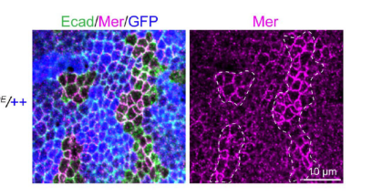

## Question

# Gene Research for Functional Annotation

## ⚠️ CRITICAL: Gene/Protein Identification Context

**BEFORE YOU BEGIN RESEARCH:** You MUST verify you are researching the CORRECT gene/protein. Gene symbols can be ambiguous, especially for less well-characterized genes from non-model organisms.

### Target Gene/Protein Identity (from UniProt):
- **UniProt Accession:** Q9W2N0
- **Protein Description:** RecName: Full=F-actin-capping protein subunit alpha;
- **Gene Information:** Name=cpa; ORFNames=CG10540;
- **Organism (full):** Drosophila melanogaster (Fruit fly).
- **Protein Family:** Belongs to the F-actin-capping protein alpha subunit
- **Key Domains:** CapZ_alpha. (IPR002189); CapZ_alpha/beta. (IPR037282); CapZ_alpha/beta_2. (IPR042276); CapZ_alpha_1. (IPR042489); F-actin_cap_asu_CS. (IPR017865)

### MANDATORY VERIFICATION STEPS:

1. **Check if the gene symbol "cpa" matches the protein description above**
2. **Verify the organism is correct:** Drosophila melanogaster (Fruit fly).
3. **Check if protein family/domains align with what you find in literature**
4. **If you find literature for a DIFFERENT gene with the same or similar symbol, STOP**

### If Gene Symbol is Ambiguous or You Cannot Find Relevant Literature:

**DO NOT PROCEED WITH RESEARCH ON A DIFFERENT GENE.** Instead:
- State clearly: "The gene symbol 'cpa' is ambiguous or literature is limited for this specific protein"
- Explain what you found (e.g., "Found extensive literature on a different gene with the same symbol in a different organism")
- Describe the protein based ONLY on the UniProt information provided above
- Suggest that the protein function can be inferred from domain/family information

### Research Target:

Please provide a comprehensive research report on the gene **cpa** (gene ID: cpa, UniProt: Q9W2N0) in DROME.

The research report should be a detailed narrative explaining the function, biological processes, and localization of the gene product. Citations should be given for all claims.

You should prioritize authoritative reviews and primary scientific literature when conducting research. You can supplement
this with annotations you find in gene/protein databases, but these can be outdated or inaccurate.

We are specifically interested in the primary function of the gene - for enzymes, what reaction is catalyzed, and what is the substrate specificity? For transporters, what is the substrate? For structural proteins or adapters, what is the broader structural role? For signaling molecules, what is the role in the pathway.

We are interested in where in or outside the cell the gene product carries out its function.

We are also interested in the signaling or biochemical pathways in which the gene functions. We are less interested in broad pleiotropic effects, except where these elucidate the precise role.

Include evidence where possible. We are interested in both experimental evidence as well as inference from structure, evolution, or bioinformatic analysis. Precise studies should be prioritized over high-throughput, where available.

## Output

Question: You are an expert researcher providing comprehensive, well-cited information.

Provide detailed information focusing on:
1. Key concepts and definitions with current understanding
2. Recent developments and latest research (prioritize 2023-2024 sources)
3. Current applications and real-world implementations
4. Expert opinions and analysis from authoritative sources
5. Relevant statistics and data from recent studies

Format as a comprehensive research report with proper citations. Include URLs and publication dates where available.
Always prioritize recent, authoritative sources and provide specific citations for all major claims.

# Gene Research for Functional Annotation

## ⚠️ CRITICAL: Gene/Protein Identification Context

**BEFORE YOU BEGIN RESEARCH:** You MUST verify you are researching the CORRECT gene/protein. Gene symbols can be ambiguous, especially for less well-characterized genes from non-model organisms.

### Target Gene/Protein Identity (from UniProt):
- **UniProt Accession:** Q9W2N0
- **Protein Description:** RecName: Full=F-actin-capping protein subunit alpha;
- **Gene Information:** Name=cpa; ORFNames=CG10540;
- **Organism (full):** Drosophila melanogaster (Fruit fly).
- **Protein Family:** Belongs to the F-actin-capping protein alpha subunit
- **Key Domains:** CapZ_alpha. (IPR002189); CapZ_alpha/beta. (IPR037282); CapZ_alpha/beta_2. (IPR042276); CapZ_alpha_1. (IPR042489); F-actin_cap_asu_CS. (IPR017865)

### MANDATORY VERIFICATION STEPS:

1. **Check if the gene symbol "cpa" matches the protein description above**
2. **Verify the organism is correct:** Drosophila melanogaster (Fruit fly).
3. **Check if protein family/domains align with what you find in literature**
4. **If you find literature for a DIFFERENT gene with the same or similar symbol, STOP**

### If Gene Symbol is Ambiguous or You Cannot Find Relevant Literature:

**DO NOT PROCEED WITH RESEARCH ON A DIFFERENT GENE.** Instead:
- State clearly: "The gene symbol 'cpa' is ambiguous or literature is limited for this specific protein"
- Explain what you found (e.g., "Found extensive literature on a different gene with the same symbol in a different organism")
- Describe the protein based ONLY on the UniProt information provided above
- Suggest that the protein function can be inferred from domain/family information

### Research Target:

Please provide a comprehensive research report on the gene **cpa** (gene ID: cpa, UniProt: Q9W2N0) in DROME.

The research report should be a detailed narrative explaining the function, biological processes, and localization of the gene product. Citations should be given for all claims.

You should prioritize authoritative reviews and primary scientific literature when conducting research. You can supplement
this with annotations you find in gene/protein databases, but these can be outdated or inaccurate.

We are specifically interested in the primary function of the gene - for enzymes, what reaction is catalyzed, and what is the substrate specificity? For transporters, what is the substrate? For structural proteins or adapters, what is the broader structural role? For signaling molecules, what is the role in the pathway.

We are interested in where in or outside the cell the gene product carries out its function.

We are also interested in the signaling or biochemical pathways in which the gene functions. We are less interested in broad pleiotropic effects, except where these elucidate the precise role.

Include evidence where possible. We are interested in both experimental evidence as well as inference from structure, evolution, or bioinformatic analysis. Precise studies should be prioritized over high-throughput, where available.

# Functional annotation of *Drosophila melanogaster cpa* (CG10540; UniProt Q9W2N0)

## Identity and principal molecular function

**Identity verified.** The target is the fruit-fly gene *cpa*/*CG10540*, which encodes **F-actin-capping protein α (Cpa)**. The original *scorched* eye-degeneration alleles were mapped to *cpa*; independent complementation, sequence analysis and transgenic rescue establish the assignment. Its partner *cpb* encodes capping protein β, **not** a second name for *cpa*. The supplied UniProt accession Q9W2N0 and CapZ-family domain annotations agree with this experimentally established identity; the accession itself was not independently established by the retrieved papers. This report does not conflate fly Cpa with unrelated genes or meanings of “CPA.” (delalle2005mutationsinthe pages 5-6, janody2006actincappingprotein pages 2-4, delalle2005mutationsinthe pages 1-2)

Cpa is a **non-enzymatic actin-cytoskeleton regulator**. With Cpb it forms the conserved α/β capping-protein heterodimer, which binds the **fast-growing, or barbed, end of an F-actin filament** and restricts both addition and loss of actin subunits at that end. The molecular substrate is therefore a filament end, not soluble actin considered as an enzymatic substrate; there is no catalytic reaction or transporter substrate to assign. C-terminal actin-binding “tentacles” from both subunits contribute to capping. In flies, disrupting the Cpa α actin-binding region weakens function, while Cpa and Cpb stabilize one another and jointly control cellular F-actin abundance. The specific molecular description draws partly on conserved CapZ biochemistry; fly loss-of-function, structure-guided mutant and rescue experiments supply strong *in-vivo* support rather than a fly-protein-specific kinetic constant. (amandio2014subunitsofthe pages 4-6, amandio2014subunitsofthe pages 11-11, amandio2014subunitsofthe pages 1-2)

In a foundational eye-mosaic experiment, *cpa*/*scorched*-mutant cells initially grew and specified fate but accumulated F-actin before degenerating later in pupal development. Comparable *cpb* phenotypes support loss of the same capping complex as the cause. Thus, Cpa’s broad structural role is to **set where and how long actin-filament ends remain available for growth**, preserving functional cortical networks rather than simply eliminating actin polymerization. (delalle2005mutationsinthe pages 5-6, delalle2005mutationsinthe pages 1-2)

## Cellular sites and physiological roles

**Apical cortex and epithelial junctions.** A functional, rescuing HA-Cpa transgene accumulated at the apical plasma-membrane region throughout the wing disc and partly overlapped the adherens-junction protein Armadillo in the wing blade. In *cpa*-mutant wing-pouch cells, Armadillo and DE-cadherin were misplaced before extrusion; mutant cells subsequently left the epithelium basally, activated JNK and frequently underwent apoptosis. Restoring full-length *cpa* rescued extrusion, whereas blocking apoptosis improved survival **without preventing extrusion**. This places a major site of Cpa action at cortical/junction-associated F-actin and distinguishes epithelial-integrity failure from its downstream cell-death response. The localization evidence uses a rescuing tagged protein, not endogenous Cpa imaging. (janody2006actincappingprotein pages 4-5)

**Ovarian cortex and oocyte development.** Germline clones lacking Cpa showed relatively modest early nurse-cell cortical-actin changes, but **22/30 egg chambers (73%)** failed to concentrate the oocyte determinant Orb in one cell, and **15/26 (approximately 58%)** lacked precise posterior oocyte positioning. When an oocyte was correctly specified, its associated actin enrichment could still form; consequently, missing oocyte-associated actin in other mutant chambers should not be interpreted as proof that Cpa directly assembles that particular structure. *cpa*-mutant follicle cells also accumulated excessive apical/lateral F-actin and could lose orderly epithelial organization. Later nurse-cell dumping phenotypes were characterized mainly with **hypomorphic *cpb*** alleles—not Cpa-null germlines, which degenerated too early—so their **97% dumpless-egg** result is complex-level evidence, not a Cpa-null-specific percentage. (gates2009enabledandcapping pages 8-8, gates2009enabledandcapping pages 10-14, gates2009enabledandcapping pages 8-10)

**Nucleus and nuclear envelope.** Cpa is not exclusively cortical. In larval salivary-gland nuclei, it showed a general nuclear distribution and enrichment at lamin-associated nuclear-envelope buds. Salivary-gland *cpa* RNAi reduced dFz2C-positive buds from **6.6 ± 0.3 per nucleus in controls (n = 102)** to **1.9 ± 1.5 (n = 134; P < 0.0001)**; *cpb* RNAi yielded **1.1 ± 1.0 (n = 133)**. Experiments implicate the Wash regulatory complex and Arp2/3 in this budding process. These data establish a nuclear localization and functional requirement, but do not directly resolve what individual Cpa-capped filament ends do at a bud. (verboon2020drosophilawashand pages 11-14)

## Actin-linked signaling

Cpa’s primary biochemical activity is **actin-end control**, not phosphorylation or transcription. Its signaling effects arise principally when altered cortical F-actin changes the state of growth and stress pathways. In wing discs, lowering *cpa* or *cpb* increased F-actin, proliferation and Yorkie-responsive reporters, including *expanded* and *diap1*. One experimental configuration, hh-Gal4-driven *cpa* RNAi, yielded **31% overgrowth**; Yorkie became less exclusively cytoplasmic, and reducing *yki* suppressed reporter activation and growth. The experimentally justified assignment is that the Cpa–Cpb complex normally **restrains F-actin-dependent Hippo–Yorkie growth output**; these genetics alone do not make Cpa a core Hippo kinase. (sansoresgarcia2011modulatingf‐actinorganization pages 4-6, sansoresgarcia2011modulatingf‐actinorganization pages 2-4)

That connection is sensitive to competing actin regulators. During oogenesis, partial reduction of capping-protein dosage reduced the dumpless phenotype following Enabled/Ena inhibition from **84% to 57%**, consistent with functional antagonism between barbed-end capping and Ena-supported elongation. In a separate wing-growth study, increasing Cpa **together with Cpb** suppressed membrane-targeted Zyxin-driven overgrowth, whereas a dominant-negative Cpa/Cpb combination enhanced abnormal growth phenotypes. These results position Cpa on the actin-restricting side of an Ena–Zyxin/Expanded–Yorkie regulatory balance; they do **not** establish direct physical binding between Cpa and Zyxin or Expanded. (gates2009enabledandcapping pages 8-10, gaspar2015zyxinantagonizesthe pages 5-6)

In the **Src–Rho1–JNK** context, *cpa* depletion amplified Src64B-associated apoptosis, while coexpression of Cpa and Cpb reduced activated caspase and Mmp1 signals. Cpa/Cpb overexpression also countered Rho1-driven growth and Mmp1 phenotypes but did not comparably rescue Rac1-driven effects. Thus, actin capping can limit a context-dependent Src/Rho1-associated JNK response; the results should not be simplified to Cpa directly inhibiting JNK enzymatic activity. (fernandez2014drosophilaactincappingprotein pages 4-6, fernandez2014drosophilaactincappingprotein pages 7-9)

## Developments in 2023–2024

A **November 2023** genetic-resource study identified three additional *cpa*-associated EMS alleles: *cpa*^3072 encodes **S173F**; *cpa*^18207 has a premature stop predicting **174 amino acids rather than the 286-amino-acid wild-type protein**; and the causal coding alteration in *cpa*^13230 was not found. The authors proposed an α/β-interface consequence for S173F, but did not biochemically demonstrate its effect on capping. [Steinmetz *et al.*, *Genes* (2023)](https://doi.org/10.3390/genes14112047). (steinmetz2023generationofmutants pages 5-7)

A **2024** study of Merlin/NF2 organization found that *cpa*^69E mutant wing-disc clones had **more junctional and less medial-apical Merlin**, consistent with a contribution of actin-capping-dependent cortex organization to Hippo input. The cropped *cpa*^69E clone comparison in its **Figure 5C** specifically documents increased junctional Merlin relative to neighboring cells. The broader paper shows that medial-apical Merlin forms PI4P-dependent, signaling-competent condensates, and that activated myosin or osmotic tension redistributes PI4P and Merlin. **Those PI4P and condensate-dynamics measurements should not be attributed directly to the *cpa* clones:** their direct, visually documented result is Merlin redistribution. [Guo *et al.*, *Science*, August 2024](https://doi.org/10.1126/science.adf4478). (guo2024pi4pmediatedsolidlikemerlin pages 25-30, guo2024pi4pmediatedsolidlikemerlin pages 9-11, guo2024pi4pmediatedsolidlikemerlin media 6661e4b3)

In an injury model whose version of record appeared **31 October 2024** (following a **28 March 2023** preprint), fly astrocytes increased *cpa* expression after traumatic brain injury. Astrocyte-specific *cpa* RNAi further raised injury-induced AP-1 reporter activity and Mmp1 staining relative to injured controls, indicating that Cpa normally limits this response. The established Pvr → AP-1 → Mmp1 signaling order was tested elsewhere in that study: **Pvr abundance was not shown to change following *cpa* RNAi**. The proposed connection to endocytic/actin trafficking remains a pathway interpretation, not a demonstrated direct Cpa–Pvr interaction. [Li *et al.*, *eLife*, version of record 2024](https://doi.org/10.7554/eLife.87258.2). (li2024apvr–ap1–mmp1signaling pages 9-12, li2024apvr–ap1–mmp1signaling pages 1-2)

## Research use and limits of translation

*Cpa* is an experimentally useful fly model for epithelial morphogenesis, actin-sensitive growth signaling and conserved capping-protein dysfunction. For example, **reference human CAPZA2 rescued lethality of *cpa*-deficient flies**, whereas patient-derived CAPZA2 variants rescued less effectively under a sensitized expression condition and disturbed bristle morphology. This is a **cross-species functional assay**, not evidence for an established treatment. Interpretation must respect the difference between the fly’s single *cpa* and human CAPZA-family paralogs. [Huang *et al.*, *Human Molecular Genetics*, April 2020](https://doi.org/10.1093/hmg/ddaa078). (huang2020variantsincapza2 pages 4-5, amandio2014subunitsofthe pages 1-2, huang2020variantsincapza2 pages 2-2)

**Overall assessment:** The highest-confidence annotation is **Cpa, the α subunit of an intracellular Cpa–Cpb F-actin barbed-end-capping complex**, acting prominently at the apical/junctional cortex and also detected at nuclear-envelope buds. Its effects on epithelial integrity, oocyte development, Hippo–Yorkie growth and injury-related JNK/AP-1 outputs are supported by tissue-specific genetics; the precise molecular intermediates connecting Cpa-dependent filament organization to every downstream signaling readout remain incompletely resolved. (janody2006actincappingprotein pages 2-4, sansoresgarcia2011modulatingf‐actinorganization pages 4-6, verboon2020drosophilawashand pages 11-14, guo2024pi4pmediatedsolidlikemerlin pages 9-11)

The following evidence table separates direct Cpa observations from complex-level findings and mechanistic inference:

| Functional context | Direct manipulation or localization evidence | Interpretation / limitation | Original study |
|---|---|---|---|
| Protein identity and barbed-end capping complex | Genetic mapping, complementation, sequencing, and transgenic rescue identify **cpa as CG10540**, encoding the sole fly F-actin-capping α subunit. Cpa associates functionally with Cpb in an α/β heterodimer whose C-terminal “tentacles” bind F-actin barbed ends. | Cpa is a **non-enzymatic structural regulator**, not a catalyst: the heterodimer blocks addition and loss of actin subunits at barbed ends. The UniProt accession Q9W2N0 is supplied by the query; it was not printed in these primary papers. | [Delalle et al., 2005](https://doi.org/10.1534/genetics.105.049213); [Janody & Treisman, 2006](https://doi.org/10.1242/dev.02511); [Amândio et al., 2014](https://doi.org/10.1371/journal.pone.0096326) (delalle2005mutationsinthe pages 5-6, janody2006actincappingprotein pages 2-4, amandio2014subunitsofthe pages 1-2) |
| Retinal F-actin homeostasis | Homozygous **cpa/scorched** mutant eye clones initially developed and specified cell fates, but progressively accumulated F-actin and subsequently degenerated during pupal development; cpb mutants produced a comparable phenotype. | Strong in-vivo genetic evidence that the Cpa–Cpb complex restricts filament growth and that persistent F-actin accumulation precedes degeneration. It is not a purified-protein kinetic assay. | [Delalle et al., 2005](https://doi.org/10.1534/genetics.105.049213) (delalle2005mutationsinthe pages 5-6, delalle2005mutationsinthe pages 1-2) |
| Wing epithelium and adherens junctions | Functional HA-Cpa accumulated at the **apical membrane** and partly colocalized with Armadillo at junctions. cpa-mutant wing-pouch cells mislocalized Armadillo/DE-cadherin, were extruded basally, activated JNK and apoptosis, and were rescued by full-length cpa. Blocking apoptosis did not prevent extrusion. | Places Cpa action at the apical cortical/junctional actin system and separates primary epithelial extrusion from secondary cell death. Localization used an HA-tagged rescuing transgene rather than endogenous Cpa. | [Janody & Treisman, 2006](https://doi.org/10.1242/dev.02511) (janody2006actincappingprotein pages 4-5) |
| Oocyte determination and positioning | In **cpa69E** germline mosaics, **22/30 (73%)** egg chambers failed to enrich Orb in one cell; **15/26 (~61%)** lacked precise posterior oocyte positioning. Early cortical actin was mostly normal or only mildly increased, and correctly specified oocytes retained cortical actin enrichment. | Supports roles in oocyte specification/positioning. Loss of oocyte-associated actin enrichment was interpreted mainly as secondary to failed specification, not proof that Cpa directly establishes that local actin pool. | [Gates et al., 2009](https://doi.org/10.1016/j.ydbio.2009.06.030) (gates2009enabledandcapping pages 8-10, gates2009enabledandcapping pages 8-8) |
| Hippo–Yorkie growth control | Wing-disc cpa RNAi increased F-actin, BrdU incorporation and Yorkie-responsive **ex-lacZ/diap1-GFP**, shifted Yorkie toward nuclear distribution, and caused **31% overgrowth** with hh-Gal4; reducing yki suppressed reporter activation and overgrowth. | Establishes Cpa as an upstream restraint on F-actin-dependent Yorkie activity and tissue growth. “Tumor suppressor module” describes this experimental growth-control role; it does not imply that fly Cpa is clinically used or itself an oncology drug target. | [Sansores-Garcia et al., 2011](https://doi.org/10.1038/emboj.2011.157) (sansoresgarcia2011modulatingf‐actinorganization pages 4-6, sansoresgarcia2011modulatingf‐actinorganization pages 2-4) |
| Nuclear-envelope budding | Cpa showed a general nuclear distribution and enrichment at lamin buds. Salivary-gland cpa RNAi reduced dFz2C-positive nuclear-envelope buds from **6.6±0.3 per nucleus (n=102)** in wild type to **1.9±1.5 (n=134; p<0.0001)**; cpb RNAi reduced them to 1.1±1.0 (n=133). | Supports a nuclear pool acting with Wash/SHRC and Arp2/3 in nuclear-envelope budding. The experiment measures bud abundance and localization, not barbed-end kinetics at individual buds. | [Verboon et al., 2020](https://doi.org/10.1242/jcs.243576) (verboon2020drosophilawashand pages 11-14) |
| Updated mutant resources | Three EMS lines failed to complement a lethal cpa-associated insertion: **cpa3072 (S173F)**, **cpa18207 (premature stop; predicted 174-aa product versus 286-aa wild type)**, and **cpa13230**, for which no coding lesion was identified. | Expands available allelic tools. Functional effects of S173F were inferred from its location in a subunit-interaction region; the causal lesion in cpa13230 remains unresolved, and no new biochemical activity assay was reported. | [Steinmetz et al., 2023](https://doi.org/10.3390/genes14112047) (steinmetz2023generationofmutants pages 5-7) |
| Cytoskeletal tension, Merlin and Hippo signaling | In wing discs, GFP-negative **cpa69E** clones exhibited increased **junctional Merlin** and reduced medial-apical Merlin, paralleling constitutively active myosin (SqhEE). | Supports Cpa-dependent control of cortical tension and Merlin partitioning. Crucially, PI4P redistribution and condensate dynamics were measured directly for **SqhEE**, osmotic stress and related manipulations—not directly quantified in cpa69E clones—so a Cpa→PI4P mechanism remains inferential. | [Guo et al., 2024](https://doi.org/10.1126/science.adf4478) (guo2024pi4pmediatedsolidlikemerlin pages 25-30, guo2024pi4pmediatedsolidlikemerlin pages 8-9, guo2024pi4pmediatedsolidlikemerlin pages 9-11, guo2024pi4pmediatedsolidlikemerlin media 6661e4b3) |
| Astrocyte injury response | After traumatic brain injury, astrocyte transcriptional profiling found cpa upregulation. Astrocyte-specific cpa RNAi further increased injury-induced **TRE-dsRed/AP-1 activity and Mmp1** relative to injured controls. | Indicates that Cpa normally limits the AP-1–Mmp1 injury response, plausibly through actin/endocytic trafficking. Pvr was measured in separate dynamin experiments; the study did **not** show that cpa RNAi directly changes Pvr abundance. The preprint appeared in 2023; the version of record was published **31 October 2024**. | [Li et al., 2024](https://doi.org/10.7554/eLife.87258.2) (li2024apvr–ap1–mmp1signaling pages 9-12, li2024apvr–ap1–mmp1signaling pages 1-2) |

*Table: Direct genetic, localization, quantitative, and pathway evidence for Drosophila melanogaster cpa/CG10540, with important inferential limits. Recent findings are separated from experiments that measured related pathway components rather than Cpa directly.*

References

1. (delalle2005mutationsinthe pages 5-6): Ivana Delalle, Cathie M Pfleger, Eugene Buff, Paula Lueras, and Iswar K Hariharan. Mutations in the drosophila orthologs of the f-actin capping protein α- and β-subunits cause actin accumulation and subsequent retinal degeneration. Genetics, 171:1757-1765, Dec 2005. URL: https://doi.org/10.1534/genetics.105.049213, doi:10.1534/genetics.105.049213. This article has 59 citations and is from a domain leading peer-reviewed journal.

2. (janody2006actincappingprotein pages 2-4): Florence Janody and Jessica E. Treisman. Actin capping protein α maintains vestigial-expressing cells within the drosophila wing disc epithelium. Development, 133:3349-3357, Sep 2006. URL: https://doi.org/10.1242/dev.02511, doi:10.1242/dev.02511. This article has 47 citations and is from a domain leading peer-reviewed journal.

3. (delalle2005mutationsinthe pages 1-2): Ivana Delalle, Cathie M Pfleger, Eugene Buff, Paula Lueras, and Iswar K Hariharan. Mutations in the drosophila orthologs of the f-actin capping protein α- and β-subunits cause actin accumulation and subsequent retinal degeneration. Genetics, 171:1757-1765, Dec 2005. URL: https://doi.org/10.1534/genetics.105.049213, doi:10.1534/genetics.105.049213. This article has 59 citations and is from a domain leading peer-reviewed journal.

4. (amandio2014subunitsofthe pages 4-6): Ana Rita Amândio, Pedro Gaspar, Jessica L. Whited, and Florence Janody. Subunits of the drosophila actin-capping protein heterodimer regulate each other at multiple levels. PLoS ONE, 9:e96326, May 2014. URL: https://doi.org/10.1371/journal.pone.0096326, doi:10.1371/journal.pone.0096326. This article has 22 citations and is from a peer-reviewed journal.

5. (amandio2014subunitsofthe pages 11-11): Ana Rita Amândio, Pedro Gaspar, Jessica L. Whited, and Florence Janody. Subunits of the drosophila actin-capping protein heterodimer regulate each other at multiple levels. PLoS ONE, 9:e96326, May 2014. URL: https://doi.org/10.1371/journal.pone.0096326, doi:10.1371/journal.pone.0096326. This article has 22 citations and is from a peer-reviewed journal.

6. (amandio2014subunitsofthe pages 1-2): Ana Rita Amândio, Pedro Gaspar, Jessica L. Whited, and Florence Janody. Subunits of the drosophila actin-capping protein heterodimer regulate each other at multiple levels. PLoS ONE, 9:e96326, May 2014. URL: https://doi.org/10.1371/journal.pone.0096326, doi:10.1371/journal.pone.0096326. This article has 22 citations and is from a peer-reviewed journal.

7. (janody2006actincappingprotein pages 4-5): Florence Janody and Jessica E. Treisman. Actin capping protein α maintains vestigial-expressing cells within the drosophila wing disc epithelium. Development, 133:3349-3357, Sep 2006. URL: https://doi.org/10.1242/dev.02511, doi:10.1242/dev.02511. This article has 47 citations and is from a domain leading peer-reviewed journal.

8. (gates2009enabledandcapping pages 8-8): Julie Gates, Stephanie H. Nowotarski, Hongyan Yin, James P. Mahaffey, Tina Bridges, Cristina Herrera, Catarina C.F. Homem, Florence Janody, Denise J. Montell, and Mark Peifer. Enabled and capping protein play important roles in shaping cell behavior during drosophila oogenesis. Developmental biology, 333 1:90-107, Sep 2009. URL: https://doi.org/10.1016/j.ydbio.2009.06.030, doi:10.1016/j.ydbio.2009.06.030. This article has 81 citations and is from a peer-reviewed journal.

9. (gates2009enabledandcapping pages 10-14): Julie Gates, Stephanie H. Nowotarski, Hongyan Yin, James P. Mahaffey, Tina Bridges, Cristina Herrera, Catarina C.F. Homem, Florence Janody, Denise J. Montell, and Mark Peifer. Enabled and capping protein play important roles in shaping cell behavior during drosophila oogenesis. Developmental biology, 333 1:90-107, Sep 2009. URL: https://doi.org/10.1016/j.ydbio.2009.06.030, doi:10.1016/j.ydbio.2009.06.030. This article has 81 citations and is from a peer-reviewed journal.

10. (gates2009enabledandcapping pages 8-10): Julie Gates, Stephanie H. Nowotarski, Hongyan Yin, James P. Mahaffey, Tina Bridges, Cristina Herrera, Catarina C.F. Homem, Florence Janody, Denise J. Montell, and Mark Peifer. Enabled and capping protein play important roles in shaping cell behavior during drosophila oogenesis. Developmental biology, 333 1:90-107, Sep 2009. URL: https://doi.org/10.1016/j.ydbio.2009.06.030, doi:10.1016/j.ydbio.2009.06.030. This article has 81 citations and is from a peer-reviewed journal.

11. (verboon2020drosophilawashand pages 11-14): Jeffrey M. Verboon, Mitsutoshi Nakamura, Kerri A. Davidson, Jacob R. Decker, Vivek Nandakumar, and Susan M. Parkhurst. <i>drosophila</i> wash and the wash regulatory complex function in nuclear envelope budding. Journal of Cell Science, Jul 2020. URL: https://doi.org/10.1242/jcs.243576, doi:10.1242/jcs.243576. This article has 16 citations and is from a domain leading peer-reviewed journal.

12. (sansoresgarcia2011modulatingf‐actinorganization pages 4-6): Leticia Sansores-Garcia, Wouter Bossuyt, Ken-Ichi Wada, Shigenobu Yonemura, Chunyao Tao, Hiroshi Sasaki, and Georg Halder. Modulating f‐actin organization induces organ growth by affecting the hippo pathway. The EMBO Journal, 30:2325-2335, Jun 2011. URL: https://doi.org/10.1038/emboj.2011.157, doi:10.1038/emboj.2011.157. This article has 517 citations.

13. (sansoresgarcia2011modulatingf‐actinorganization pages 2-4): Leticia Sansores-Garcia, Wouter Bossuyt, Ken-Ichi Wada, Shigenobu Yonemura, Chunyao Tao, Hiroshi Sasaki, and Georg Halder. Modulating f‐actin organization induces organ growth by affecting the hippo pathway. The EMBO Journal, 30:2325-2335, Jun 2011. URL: https://doi.org/10.1038/emboj.2011.157, doi:10.1038/emboj.2011.157. This article has 517 citations.

14. (gaspar2015zyxinantagonizesthe pages 5-6): Pedro Gaspar, Maxine V. Holder, Birgit L. Aerne, Florence Janody, and Nicolas Tapon. Zyxin antagonizes the ferm protein expanded to couple f-actin and yorkie-dependent organ growth. Current Biology, 25:679-689, Mar 2015. URL: https://doi.org/10.1016/j.cub.2015.01.010, doi:10.1016/j.cub.2015.01.010. This article has 79 citations and is from a highest quality peer-reviewed journal.

15. (fernandez2014drosophilaactincappingprotein pages 4-6): Beatriz Fernandez, Barbara Jezowska, and Florence Janody. Drosophila actin-capping protein limits jnk activation by the src proto-oncogene. Oncogene, 33:2027-2039, Apr 2014. URL: https://doi.org/10.1038/onc.2013.155, doi:10.1038/onc.2013.155. This article has 46 citations and is from a domain leading peer-reviewed journal.

16. (fernandez2014drosophilaactincappingprotein pages 7-9): Beatriz Fernandez, Barbara Jezowska, and Florence Janody. Drosophila actin-capping protein limits jnk activation by the src proto-oncogene. Oncogene, 33:2027-2039, Apr 2014. URL: https://doi.org/10.1038/onc.2013.155, doi:10.1038/onc.2013.155. This article has 46 citations and is from a domain leading peer-reviewed journal.

17. (steinmetz2023generationofmutants pages 5-7): Eva Louise Steinmetz, Sandra Noh, Christine Klöppel, Martin F. Fuhr, Nicole Bach, Mona Evelyn Raffael, Kirsten Hildebrandt, Fabienne Wittling, Doris Jann, and Uwe Walldorf. Generation of mutants from the 57b region of drosophila melanogaster. Genes, 14:2047, Nov 2023. URL: https://doi.org/10.3390/genes14112047, doi:10.3390/genes14112047. This article has 1 citations.

18. (guo2024pi4pmediatedsolidlikemerlin pages 25-30): Pengfei Guo, Bing Li, Wei Dong, Huabin Zhou, Li Wang, Ting Su, Christopher Carl, Yonggang Zheng, Yang Hong, Hua Deng, and Duojia Pan. Pi4p-mediated solid-like merlin condensates orchestrate hippo pathway regulation. Science (New York, N.Y.), 385:eadf4478-eadf4478, Aug 2024. URL: https://doi.org/10.1126/science.adf4478, doi:10.1126/science.adf4478. This article has 52 citations.

19. (guo2024pi4pmediatedsolidlikemerlin pages 9-11): Pengfei Guo, Bing Li, Wei Dong, Huabin Zhou, Li Wang, Ting Su, Christopher Carl, Yonggang Zheng, Yang Hong, Hua Deng, and Duojia Pan. Pi4p-mediated solid-like merlin condensates orchestrate hippo pathway regulation. Science (New York, N.Y.), 385:eadf4478-eadf4478, Aug 2024. URL: https://doi.org/10.1126/science.adf4478, doi:10.1126/science.adf4478. This article has 52 citations.

20. (guo2024pi4pmediatedsolidlikemerlin media 6661e4b3): Pengfei Guo, Bing Li, Wei Dong, Huabin Zhou, Li Wang, Ting Su, Christopher Carl, Yonggang Zheng, Yang Hong, Hua Deng, and Duojia Pan. Pi4p-mediated solid-like merlin condensates orchestrate hippo pathway regulation. Science (New York, N.Y.), 385:eadf4478-eadf4478, Aug 2024. URL: https://doi.org/10.1126/science.adf4478, doi:10.1126/science.adf4478. This article has 52 citations.

21. (li2024apvr–ap1–mmp1signaling pages 9-12): Tingting Li, Wenwen Shi, Margaret S. Ho, and Yong Q. Zhang. A pvr–ap-1–mmp1 signaling pathway is activated in astrocytes upon traumatic brain injury. ArXiv, Apr 2024. URL: https://doi.org/10.7554/elife.87258.2, doi:10.7554/elife.87258.2. This article has 12 citations.

22. (li2024apvr–ap1–mmp1signaling pages 1-2): Tingting Li, Wenwen Shi, Margaret S. Ho, and Yong Q. Zhang. A pvr–ap-1–mmp1 signaling pathway is activated in astrocytes upon traumatic brain injury. ArXiv, Apr 2024. URL: https://doi.org/10.7554/elife.87258.2, doi:10.7554/elife.87258.2. This article has 12 citations.

23. (huang2020variantsincapza2 pages 4-5): Yan Huang, Xiao Mao, Richard H van Jaarsveld, Li Shu, Paulien A Terhal, Zhengjun Jia, Hui Xi, Ying Peng, Huiming Yan, Shan Yuan, Qibin Li, Hua Wang, and Hugo J Bellen. Variants in capza2, a member of a f-actin capping complex, cause intellectual disability and developmental delay. Human molecular genetics, 29:1537-1546, Apr 2020. URL: https://doi.org/10.1093/hmg/ddaa078, doi:10.1093/hmg/ddaa078. This article has 33 citations and is from a domain leading peer-reviewed journal.

24. (huang2020variantsincapza2 pages 2-2): Yan Huang, Xiao Mao, Richard H van Jaarsveld, Li Shu, Paulien A Terhal, Zhengjun Jia, Hui Xi, Ying Peng, Huiming Yan, Shan Yuan, Qibin Li, Hua Wang, and Hugo J Bellen. Variants in capza2, a member of a f-actin capping complex, cause intellectual disability and developmental delay. Human molecular genetics, 29:1537-1546, Apr 2020. URL: https://doi.org/10.1093/hmg/ddaa078, doi:10.1093/hmg/ddaa078. This article has 33 citations and is from a domain leading peer-reviewed journal.

25. (guo2024pi4pmediatedsolidlikemerlin pages 8-9): Pengfei Guo, Bing Li, Wei Dong, Huabin Zhou, Li Wang, Ting Su, Christopher Carl, Yonggang Zheng, Yang Hong, Hua Deng, and Duojia Pan. Pi4p-mediated solid-like merlin condensates orchestrate hippo pathway regulation. Science (New York, N.Y.), 385:eadf4478-eadf4478, Aug 2024. URL: https://doi.org/10.1126/science.adf4478, doi:10.1126/science.adf4478. This article has 52 citations.

## Artifacts

- [Edison artifact artifact-00](cpa-deep-research-falcon_artifacts/artifact-00.md)

## Citations

1. janody2006actincappingprotein pages 4-5
2. verboon2020drosophilawashand pages 11-14
3. steinmetz2023generationofmutants pages 5-7
4. delalle2005mutationsinthe pages 5-6
5. janody2006actincappingprotein pages 2-4
6. delalle2005mutationsinthe pages 1-2
7. amandio2014subunitsofthe pages 4-6
8. amandio2014subunitsofthe pages 11-11
9. amandio2014subunitsofthe pages 1-2
10. gates2009enabledandcapping pages 8-8
11. gates2009enabledandcapping pages 10-14
12. gates2009enabledandcapping pages 8-10
13. gaspar2015zyxinantagonizesthe pages 5-6
14. fernandez2014drosophilaactincappingprotein pages 4-6
15. fernandez2014drosophilaactincappingprotein pages 7-9
16. Steinmetz *et al.*, *Genes* (2023)
17. Guo *et al.*, *Science*, August 2024
18. Li *et al.*, *eLife*, version of record 2024
19. Huang *et al.*, *Human Molecular Genetics*, April 2020
20. Delalle et al., 2005
21. Janody & Treisman, 2006
22. Amândio et al., 2014
23. Gates et al., 2009
24. Sansores-Garcia et al., 2011
25. Verboon et al., 2020
26. Steinmetz et al., 2023
27. Guo et al., 2024
28. Li et al., 2024
29. https://doi.org/10.3390/genes14112047
30. https://doi.org/10.1126/science.adf4478
31. https://doi.org/10.7554/eLife.87258.2
32. https://doi.org/10.1093/hmg/ddaa078
33. https://doi.org/10.1534/genetics.105.049213
34. https://doi.org/10.1242/dev.02511
35. https://doi.org/10.1371/journal.pone.0096326
36. https://doi.org/10.1016/j.ydbio.2009.06.030
37. https://doi.org/10.1038/emboj.2011.157
38. https://doi.org/10.1242/jcs.243576
39. https://doi.org/10.1534/genetics.105.049213,
40. https://doi.org/10.1242/dev.02511,
41. https://doi.org/10.1371/journal.pone.0096326,
42. https://doi.org/10.1016/j.ydbio.2009.06.030,
43. https://doi.org/10.1242/jcs.243576,
44. https://doi.org/10.1038/emboj.2011.157,
45. https://doi.org/10.1016/j.cub.2015.01.010,
46. https://doi.org/10.1038/onc.2013.155,
47. https://doi.org/10.3390/genes14112047,
48. https://doi.org/10.1126/science.adf4478,
49. https://doi.org/10.7554/elife.87258.2,
50. https://doi.org/10.1093/hmg/ddaa078,