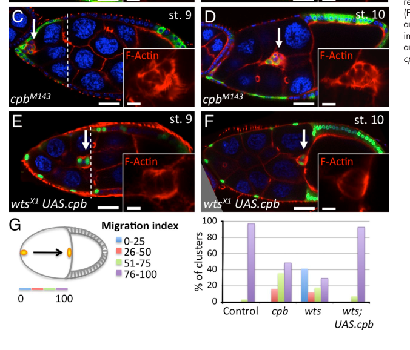

## Question

# Gene Research for Functional Annotation

## ⚠️ CRITICAL: Gene/Protein Identification Context

**BEFORE YOU BEGIN RESEARCH:** You MUST verify you are researching the CORRECT gene/protein. Gene symbols can be ambiguous, especially for less well-characterized genes from non-model organisms.

### Target Gene/Protein Identity (from UniProt):
- **UniProt Accession:** P48603
- **Protein Description:** RecName: Full=F-actin-capping protein subunit beta;
- **Gene Information:** Name=cpb; Synonyms=ANCP-BETA; ORFNames=CG17158;
- **Organism (full):** Drosophila melanogaster (Fruit fly).
- **Protein Family:** Belongs to the F-actin-capping protein beta subunit family.
- **Key Domains:** CapZ_alpha/beta. (IPR037282); CapZ_alpha/beta_2. (IPR042276); CAPZB. (IPR001698); CAPZB_N. (IPR043175); F-actin_capping_bsu_CS. (IPR019771)

### MANDATORY VERIFICATION STEPS:

1. **Check if the gene symbol "cpb" matches the protein description above**
2. **Verify the organism is correct:** Drosophila melanogaster (Fruit fly).
3. **Check if protein family/domains align with what you find in literature**
4. **If you find literature for a DIFFERENT gene with the same or similar symbol, STOP**

### If Gene Symbol is Ambiguous or You Cannot Find Relevant Literature:

**DO NOT PROCEED WITH RESEARCH ON A DIFFERENT GENE.** Instead:
- State clearly: "The gene symbol 'cpb' is ambiguous or literature is limited for this specific protein"
- Explain what you found (e.g., "Found extensive literature on a different gene with the same symbol in a different organism")
- Describe the protein based ONLY on the UniProt information provided above
- Suggest that the protein function can be inferred from domain/family information

### Research Target:

Please provide a comprehensive research report on the gene **cpb** (gene ID: cpb, UniProt: P48603) in DROME.

The research report should be a detailed narrative explaining the function, biological processes, and localization of the gene product. Citations should be given for all claims.

You should prioritize authoritative reviews and primary scientific literature when conducting research. You can supplement
this with annotations you find in gene/protein databases, but these can be outdated or inaccurate.

We are specifically interested in the primary function of the gene - for enzymes, what reaction is catalyzed, and what is the substrate specificity? For transporters, what is the substrate? For structural proteins or adapters, what is the broader structural role? For signaling molecules, what is the role in the pathway.

We are interested in where in or outside the cell the gene product carries out its function.

We are also interested in the signaling or biochemical pathways in which the gene functions. We are less interested in broad pleiotropic effects, except where these elucidate the precise role.

Include evidence where possible. We are interested in both experimental evidence as well as inference from structure, evolution, or bioinformatic analysis. Precise studies should be prioritized over high-throughput, where available.

## Output

Question: You are an expert researcher providing comprehensive, well-cited information.

Provide detailed information focusing on:
1. Key concepts and definitions with current understanding
2. Recent developments and latest research (prioritize 2023-2024 sources)
3. Current applications and real-world implementations
4. Expert opinions and analysis from authoritative sources
5. Relevant statistics and data from recent studies

Format as a comprehensive research report with proper citations. Include URLs and publication dates where available.
Always prioritize recent, authoritative sources and provide specific citations for all major claims.

# Gene Research for Functional Annotation

## ⚠️ CRITICAL: Gene/Protein Identification Context

**BEFORE YOU BEGIN RESEARCH:** You MUST verify you are researching the CORRECT gene/protein. Gene symbols can be ambiguous, especially for less well-characterized genes from non-model organisms.

### Target Gene/Protein Identity (from UniProt):
- **UniProt Accession:** P48603
- **Protein Description:** RecName: Full=F-actin-capping protein subunit beta;
- **Gene Information:** Name=cpb; Synonyms=ANCP-BETA; ORFNames=CG17158;
- **Organism (full):** Drosophila melanogaster (Fruit fly).
- **Protein Family:** Belongs to the F-actin-capping protein beta subunit family.
- **Key Domains:** CapZ_alpha/beta. (IPR037282); CapZ_alpha/beta_2. (IPR042276); CAPZB. (IPR001698); CAPZB_N. (IPR043175); F-actin_capping_bsu_CS. (IPR019771)

### MANDATORY VERIFICATION STEPS:

1. **Check if the gene symbol "cpb" matches the protein description above**
2. **Verify the organism is correct:** Drosophila melanogaster (Fruit fly).
3. **Check if protein family/domains align with what you find in literature**
4. **If you find literature for a DIFFERENT gene with the same or similar symbol, STOP**

### If Gene Symbol is Ambiguous or You Cannot Find Relevant Literature:

**DO NOT PROCEED WITH RESEARCH ON A DIFFERENT GENE.** Instead:
- State clearly: "The gene symbol 'cpb' is ambiguous or literature is limited for this specific protein"
- Explain what you found (e.g., "Found extensive literature on a different gene with the same symbol in a different organism")
- Describe the protein based ONLY on the UniProt information provided above
- Suggest that the protein function can be inferred from domain/family information

### Research Target:

Please provide a comprehensive research report on the gene **cpb** (gene ID: cpb, UniProt: P48603) in DROME.

The research report should be a detailed narrative explaining the function, biological processes, and localization of the gene product. Citations should be given for all claims.

You should prioritize authoritative reviews and primary scientific literature when conducting research. You can supplement
this with annotations you find in gene/protein databases, but these can be outdated or inaccurate.

We are specifically interested in the primary function of the gene - for enzymes, what reaction is catalyzed, and what is the substrate specificity? For transporters, what is the substrate? For structural proteins or adapters, what is the broader structural role? For signaling molecules, what is the role in the pathway.

We are interested in where in or outside the cell the gene product carries out its function.

We are also interested in the signaling or biochemical pathways in which the gene functions. We are less interested in broad pleiotropic effects, except where these elucidate the precise role.

Include evidence where possible. We are interested in both experimental evidence as well as inference from structure, evolution, or bioinformatic analysis. Precise studies should be prioritized over high-throughput, where available.

# Functional annotation report: *cpb* in *Drosophila melanogaster*

## Identity and principal function

**The specified target is the fruit-fly F-actin-capping protein β subunit, Cpb (UniProt P48603), not another protein abbreviated CPB.** In a genetic screen, all three *burned* (*bnd*) alleles failed to complement an established *cpb* allele, linking the historical *bnd* phenotype to this locus. Subsequently, an antibody detected an approximately 31-kDa Cpb protein whose signal was lost in *cpb* mutant embryos. These independent genetic and protein-level observations support the identity of the target. The CapZ α/β and CAPZB-family domain annotations supplied with P48603 are consistent with its experimentally established partnership with the fly α subunit, Cpa; they do not imply an enzymatic activity. (delalle2005mutationsinthe pages 2-3, amandio2014subunitsofthe pages 2-3, amandio2014subunitsofthe pages 1-2)

**Primary molecular role:** Cpb is the β component of the Cpa–Cpb heterodimer, which caps the *barbed*, rapidly growing ends of actin filaments. Capping restricts both addition and loss of actin subunits at an occupied end, thereby controlling filament length, the distribution of polymerizing ends, and the architecture of cortical F-actin. Its relevant binding substrate is the **end of an actin filament**, rather than a soluble metabolite; Cpb is neither an enzyme nor a transporter. A crystal structure of **chicken**, not fly, CapZ revealed homologous α and β folds and flexible actin-interacting extensions; its reported approximately 1-nM barbed-end affinity is a **family-level estimate, not a measurement for purified Drosophila Cpb**. [Yamashita et al., *EMBO Journal*, April 2003](https://doi.org/10.1093/emboj/cdg167). (yamashita2003crystalstructureof pages 1-2, amandio2014subunitsofthe pages 3-4)

Drosophila experiments reinforce the heterodimer model: coexpressing Cpa and Cpb increased both proteins and reduced apical F-actin in wing-disc epithelium, whereas expressing either subunit alone did not produce the same detectable F-actin effect under the tested conditions. Depleting either subunit reduced both proteins, consistent with reciprocal stabilization. A β-subunit substitution, Cpb-L262R, instead promoted apical F-actin accumulation, supporting an actin-interaction-dependent capping function. [Amândio et al., *PLOS ONE*, May 2014](https://doi.org/10.1371/journal.pone.0096326). (amandio2014subunitsofthe pages 2-3, amandio2014subunitsofthe pages 3-4)

## Where Cpb functions

Cpb acts **inside cells, predominantly at actin-rich cortical sites in the experimentally examined tissues**. Endogenous Cpb and Cpa accumulate at the apical membrane of wing imaginal-disc epithelial cells and colocalize with adherens-junction components, including Armadillo/β-catenin. In emerging pupal bristles, Cpb localizes to membrane-associated, dynamic nonbundle F-actin structures called *snarls* between the long bundles; it is absent from early bundles, although later staining occurs along bundles. These observations identify specific sites of action rather than establishing that every fly cell has the same Cpb distribution. No extracellular action is supported by these studies, and nuclear localization or direct nuclear signaling by **fly** Cpb is not established. [Amândio et al., May 2014](https://doi.org/10.1371/journal.pone.0096326); [Frank et al., *Molecular Biology of the Cell*, September 2006](https://doi.org/10.1091/mbc.e06-06-0500). (amandio2014subunitsofthe pages 2-3, frank2006cappingproteinand pages 3-5, amandio2014subunitsofthe pages 9-11)

## Biological processes and pathway placement

**Cortical organization and bristle morphogenesis.** Loss of Cpb permits excess, persistent actin snarls in growing bristles. The ensuing displacement of long actin bundles from their normal membrane-adjacent positions explains defects in bristle grooves and shaft shape more precisely than an assertion that Cpb directly builds the bundles. Reducing *arp3* or *wasp*, or removing *arpc4/arpc5*, suppresses aspects of the *cpb* phenotype, consistent with opposing contributions of Arp2/3-dependent actin assembly and Cpb-dependent capping. The exception is *arpc1*: its mutation enhances *cpb* defects, suggesting an additional role not captured by a simple antagonism model. [Frank et al., September 2006](https://doi.org/10.1091/mbc.e06-06-0500). (frank2006cappingproteinand pages 2-3, frank2006cappingproteinand pages 3-5)

**Retinal maintenance.** *cpb* mutant cells accumulate F-actin already in third-instar eye discs, despite initially forming substantial clones and acquiring early photoreceptor markers. They subsequently undergo retinal degeneration during later development. In one within-disc comparison, mutant tissue had **2.6-fold** the F-actin fluorescence of adjacent wild-type tissue (**three discs**); mutant clones occupied **49.6 ± 10.1%** of the larval disc area (**three discs**). This temporal sequence supports a requirement for Cpb-mediated actin homeostasis in cell integrity, without proving that filament accumulation alone is sufficient to kill the cells. [Delalle et al., *Genetics*, December 2005](https://doi.org/10.1534/genetics.105.049213). (delalle2005mutationsinthe pages 6-8, delalle2005mutationsinthe pages 3-4)

**Hippo–Yorkie growth control.** In wing epithelia, reducing Cpa or Cpb increases F-actin and is associated with excess proliferation, overgrowth, greater nuclear Yorkie (Yki), and Hippo-responsive gene expression. Genetic evidence places the actin-dependent effect upstream of, or convergent on, Yki activity; it does **not** identify Cpb as a direct Hippo kinase component or demonstrate physical binding to Yki. Capping-protein dosage matters: experimentally increasing functional Cpa–Cpb can reduce F-actin and growth as well as protecting against the consequences of insufficient capping. [Sansores-Garcia et al., *EMBO Journal*, June 2011](https://doi.org/10.1038/emboj.2011.157); [Amândio et al., May 2014](https://doi.org/10.1371/journal.pone.0096326). (sansoresgarcia2011modulatingf‐actinorganization pages 9-9, sansoresgarcia2011modulatingf‐actinorganization pages 1-2, amandio2014subunitsofthe pages 4-6)

**Hippo–Ena control of collective migration.** In ovarian border-cell clusters, Cpb restrains F-actin at *inner cell–cell contacts*, helping concentrate polymerization and motility at the cluster’s outer rim. *cpb* mutant clusters accumulate internal F-actin, migrate slowly, and approximately **10%** disintegrate. Overexpressed Cpb rescues both F-actin polarization and migration in *warts* (*wts*) mutant clusters. The proposed route is Wts-mediated inhibition of Enabled (Ena), an antagonist of capping-protein activity; unlike wing growth control, this immediate cytoskeletal branch is largely independent of canonical nuclear Yki signaling. The published Figure 7 directly depicts the *cpb* mutant and *wts* rescue comparisons. [Lucas et al., *Journal of Cell Biology*, June 2013](https://doi.org/10.1083/jcb.201210073). (lucas2013thehippopathway pages 6-7, lucas2013thehippopathway pages 7-8, lucas2013thehippopathway media a6f60bef)

**Src–Rho1–JNK-associated epithelial responses.** A separate wing-disc study concluded that capping-protein control of apical F-actin limits JNK-associated damage in a Src/Rho1 context. Coexpressing **both** Cpa and Cpb with activated JNK increased measured wing-disc area from **191,042 to 274,036 pixels** and reduced area-normalized activated-caspase-3 signal from **166.4 to 73.5**. This establishes an effect of increased capping-protein activity in that experimental setting; it does not demonstrate that Cpb alone directly phosphorylates, binds, or transcriptionally regulates JNK. [Fernandez et al., *Oncogene*, April 2014](https://doi.org/10.1038/onc.2013.155). (fernandez2014drosophilaactincappingprotein pages 10-11)

The following evidence table distinguishes direct *cpb* experiments from pathway context and consolidates the principal measurements.

| Molecular/cellular context | Direct experimental evidence and quantitative datum | Interpretation / limitations | Source (year) |
|---|---|---|---|
| **Retinal clones; gene identification** | All three *burned* (*bnd*) alleles failed to complement *cpbM143*, identifying *bnd* as *cpb*. Third-instar *cpb* mutant clones showed a **2.6:1 F-actin fluorescence ratio** versus adjacent wild-type tissue (**n = 3 discs**) yet occupied **49.6 ± 10.1%** of disc area, followed later by retinal degeneration. (delalle2005mutationsinthe pages 2-3, delalle2005mutationsinthe pages 3-4, delalle2005mutationsinthe pages 6-8) | **Strong direct genetic and in-vivo evidence.** Cpb is required to restrain F-actin before degeneration; normal early clone size and differentiation argue against primary proliferation failure. The study did not measure purified Drosophila Cpb capping kinetics. | [Delalle et al., *Genetics*, DOI: 10.1534/genetics.105.049213](https://doi.org/10.1534/genetics.105.049213) (2005) |
| **Developing bristle; membrane-associated nonbundle actin** | Cpb localized to membrane-associated actin “snarls,” not early bundles; reduced Cpb produced excess persistent snarls and displaced, irregular bundles. Reduced **Arp3, Wasp, Arpc4, or Arpc5** suppressed *cpb* bristle defects, whereas *arpc1* mutations enhanced them. (frank2006cappingproteinand pages 3-3, frank2006cappingproteinand pages 2-3, frank2006cappingproteinand pages 3-5, frank2006cappingproteinand pages 5-6) | **Strong localization and genetic-interaction evidence.** Cpb and Arp2/3 oppose one another in controlling dynamic nonbundle filaments, thereby indirectly positioning bundles. The exceptional *arpc1* enhancement suggests an additional Arpc1-specific role. | [Frank et al., *Molecular Biology of the Cell*, DOI: 10.1091/mbc.e06-06-0500](https://doi.org/10.1091/mbc.e06-06-0500) (2006) |
| **Wing imaginal disc; Hippo/Yorkie growth control** | *cpb* RNAi increased F-actin, proliferation, tissue overgrowth, nuclear Yorkie and Hippo-target expression; reducing Yorkie suppressed the growth effects. Polarity and Hedgehog/Decapentaplegic signaling were not detectably disrupted. (sansoresgarcia2011modulatingf‐actinorganization pages 9-9, sansoresgarcia2011modulatingf‐actinorganization pages 1-2) | **Strong pathway-level genetic evidence.** Places excess F-actin caused by reduced Cpb upstream of, or convergent on, Yorkie activation. It does not establish a direct physical interaction between Cpb and Hippo-pathway proteins. | [Sansores-Garcia et al., *EMBO Journal*, DOI: 10.1038/emboj.2011.157](https://doi.org/10.1038/emboj.2011.157) (2011) |
| **Collectively migrating ovarian border cells; Hippo–Ena–Cpb axis** | *cpbM143* clusters accumulated F-actin internally and migrated slowly at stages 9–10; **~10% disintegrated**. Cpb overexpression restored normal migration and F-actin polarization in *wtsX1* clusters (**wts**, n = 17; *cpb*, n = 31; rescue, n = 41). (lucas2013thehippopathway pages 6-7, lucas2013thehippopathway pages 7-8, lucas2013thehippopathway media a6f60bef) | **Strong mutation-and-rescue evidence.** Supports Warts-mediated inhibition of Ena, permitting Cpb to suppress barbed-end growth at inner cell contacts and confine polymerization to the outer rim. This migration mechanism is largely independent of canonical nuclear Yorkie signaling. | [Lucas et al., *Journal of Cell Biology*, DOI: 10.1083/jcb.201210073](https://doi.org/10.1083/jcb.201210073) (2013) |
| **Wing epithelium; adherens junctions and heterodimer homeostasis** | Endogenous Cpb (~**31 kDa**) and Cpa accumulated at the apical membrane and colocalized with adherens-junction components. Loss of either subunit reduced both proteins; coexpression increased both and lowered apical F-actin. Reciprocal expression partially rescued depletion-associated apoptosis and restored partner transcript/protein levels. (amandio2014subunitsofthe pages 3-4, amandio2014subunitsofthe pages 2-3, amandio2014subunitsofthe pages 9-11) | **Strong localization, biochemical and rescue evidence.** Cpa and Cpb form a dosage-sensitive functional heterodimer and stabilize each other. The mechanism underlying reciprocal transcript regulation remains unresolved, and either subunit alone showed limited effects under some conditions. | [Amândio et al., *PLOS ONE*, DOI: 10.1371/journal.pone.0096326](https://doi.org/10.1371/journal.pone.0096326) (2014) |
| **Wing epithelium; Src/Rho1–JNK stress signaling** | Coexpression of Cpa and Cpb with constitutively active JNK increased wing-disc area from **191,042 to 274,036 pixels** (**P < 0.0001**) and reduced normalized activated-caspase-3 signal from **166.4 to 73.5** (**P < 0.0018**). (fernandez2014drosophilaactincappingprotein pages 10-11) | **Direct genetic rescue supports a protective Cpa/Cpb activity** that limits F-actin-dependent JNK output downstream of Src/Rho1. Because both subunits were coexpressed, the experiment does not isolate a Cpb-only signaling action. | [Fernandez et al., *Oncogene*, DOI: 10.1038/onc.2013.155](https://doi.org/10.1038/onc.2013.155) (2014) |
| **Quiescent neural stem cells; recent actin research** | The 2024 study directly tested the **Smog–Gαq–Rho1–Dia/Formin** pathway and F-actin dynamics; it did **not** report a direct *cpb* perturbation establishing Cpb function in neural-stem-cell reactivation. (lin2024astrocytescontrolquiescent pages 2-3, lin2024astrocytescontrolquiescent pages 1-2) | **Context only—not Cpb evidence.** Its Dia/Rho1 results must not be attributed to *cpb* without a dedicated Cpb loss-, gain- or rescue experiment. | [Lin et al., *Science Advances*, DOI: 10.1126/sciadv.adl4694](https://doi.org/10.1126/sciadv.adl4694) (2024) |

*Table: Evidence-ranked summary of experiments defining the molecular activity, localization and pathway roles of Drosophila melanogaster Cpb (P48603). The final row separates recent actin-pathway findings from direct cpb evidence to prevent overinterpretation.*

## Recent research and practical significance

A [July 24, 2024 *Science Advances* study](https://doi.org/10.1126/sciadv.adl4694) used expansion/super-resolution and live microscopy to define F-actin dynamics during fly neural-stem-cell reactivation and experimentally implicated **Smog–Gαq–Rho1–Diaphanous/Formin** signaling. Its quantitative reactivation experiments concern those regulators, **not a demonstrated Cpb-dependent neural-stem-cell mechanism**; the reported Dia phenotypes must not be transferred to *cpb*. Thus, the strongest *cpb*-specific mechanistic evidence located here remains the targeted genetics, localization and rescue studies above rather than a newer *cpb*-specific 2023–2024 biochemical result. (lin2024astrocytescontrolquiescent pages 1-2, lin2024astrocytescontrolquiescent pages 2-3, lin2024astrocytescontrolquiescent pages 5-8)

In practice, *cpb* mutant clones, RNAi, overexpression and Cpa–Cpb rescue are established **research tools** for interrogating filament-end control, epithelial growth and collective migration in flies. The retinal study raised possible relevance of human capping-protein orthologs to degeneration, and the migration and growth studies provide models of actin-linked disease mechanisms; these are **experimental applications and hypotheses**, not evidence that manipulating fly *cpb* is a clinical treatment. A key unresolved question is how the two subunits’ protein and transcript levels regulate each other, particularly because loss of one reduces its partner protein without necessarily lowering the partner transcript. [Delalle et al., December 2005](https://doi.org/10.1534/genetics.105.049213); [Amândio et al., May 2014](https://doi.org/10.1371/journal.pone.0096326). (delalle2005mutationsinthe pages 8-8, amandio2014subunitsofthe pages 3-4, amandio2014subunitsofthe pages 9-11)

**Annotation conclusion:** Assign Cpb its experimentally supported role as the intracellular **β subunit of an α/β F-actin barbed-end capping complex**, functioning at cortical and junction-associated actin networks. Its best-resolved downstream consequences are spatial actin organization in bristles and border cells, retinal-cell maintenance, and actin-dependent modulation of epithelial growth signaling. Treat purified-protein binding constants, proposed direct signaling interactions and untested neural-stem-cell roles as inference or open questions, not fly-*cpb*-specific measurements. (yamashita2003crystalstructureof pages 1-2, frank2006cappingproteinand pages 3-5, lucas2013thehippopathway pages 6-7, delalle2005mutationsinthe pages 6-8, sansoresgarcia2011modulatingf‐actinorganization pages 9-9)

References

1. (delalle2005mutationsinthe pages 2-3): Ivana Delalle, Cathie M Pfleger, Eugene Buff, Paula Lueras, and Iswar K Hariharan. Mutations in the drosophila orthologs of the f-actin capping protein α- and β-subunits cause actin accumulation and subsequent retinal degeneration. Genetics, 171:1757-1765, Dec 2005. URL: https://doi.org/10.1534/genetics.105.049213, doi:10.1534/genetics.105.049213. This article has 59 citations and is from a domain leading peer-reviewed journal.

2. (amandio2014subunitsofthe pages 2-3): Ana Rita Amândio, Pedro Gaspar, Jessica L. Whited, and Florence Janody. Subunits of the drosophila actin-capping protein heterodimer regulate each other at multiple levels. PLoS ONE, 9:e96326, May 2014. URL: https://doi.org/10.1371/journal.pone.0096326, doi:10.1371/journal.pone.0096326. This article has 22 citations and is from a peer-reviewed journal.

3. (amandio2014subunitsofthe pages 1-2): Ana Rita Amândio, Pedro Gaspar, Jessica L. Whited, and Florence Janody. Subunits of the drosophila actin-capping protein heterodimer regulate each other at multiple levels. PLoS ONE, 9:e96326, May 2014. URL: https://doi.org/10.1371/journal.pone.0096326, doi:10.1371/journal.pone.0096326. This article has 22 citations and is from a peer-reviewed journal.

4. (yamashita2003crystalstructureof pages 1-2): A. Yamashita, K. Maéda, and Y. Maéda. Crystal structure of capz: structural basis for actin filament barbed end capping. The EMBO Journal, 22:1529-1538, Apr 2003. URL: https://doi.org/10.1093/emboj/cdg167, doi:10.1093/emboj/cdg167. This article has 218 citations.

5. (amandio2014subunitsofthe pages 3-4): Ana Rita Amândio, Pedro Gaspar, Jessica L. Whited, and Florence Janody. Subunits of the drosophila actin-capping protein heterodimer regulate each other at multiple levels. PLoS ONE, 9:e96326, May 2014. URL: https://doi.org/10.1371/journal.pone.0096326, doi:10.1371/journal.pone.0096326. This article has 22 citations and is from a peer-reviewed journal.

6. (frank2006cappingproteinand pages 3-5): Deborah J. Frank, Roberta Hopmann, Marta Lenartowska, and Kathryn G. Miller. Capping protein and the arp2/3 complex regulate nonbundle actin filament assembly to indirectly control actin bundle positioning during drosophila melanogaster bristle development. Molecular biology of the cell, 17 9:3930-9, Sep 2006. URL: https://doi.org/10.1091/mbc.e06-06-0500, doi:10.1091/mbc.e06-06-0500. This article has 28 citations and is from a domain leading peer-reviewed journal.

7. (amandio2014subunitsofthe pages 9-11): Ana Rita Amândio, Pedro Gaspar, Jessica L. Whited, and Florence Janody. Subunits of the drosophila actin-capping protein heterodimer regulate each other at multiple levels. PLoS ONE, 9:e96326, May 2014. URL: https://doi.org/10.1371/journal.pone.0096326, doi:10.1371/journal.pone.0096326. This article has 22 citations and is from a peer-reviewed journal.

8. (frank2006cappingproteinand pages 2-3): Deborah J. Frank, Roberta Hopmann, Marta Lenartowska, and Kathryn G. Miller. Capping protein and the arp2/3 complex regulate nonbundle actin filament assembly to indirectly control actin bundle positioning during drosophila melanogaster bristle development. Molecular biology of the cell, 17 9:3930-9, Sep 2006. URL: https://doi.org/10.1091/mbc.e06-06-0500, doi:10.1091/mbc.e06-06-0500. This article has 28 citations and is from a domain leading peer-reviewed journal.

9. (delalle2005mutationsinthe pages 6-8): Ivana Delalle, Cathie M Pfleger, Eugene Buff, Paula Lueras, and Iswar K Hariharan. Mutations in the drosophila orthologs of the f-actin capping protein α- and β-subunits cause actin accumulation and subsequent retinal degeneration. Genetics, 171:1757-1765, Dec 2005. URL: https://doi.org/10.1534/genetics.105.049213, doi:10.1534/genetics.105.049213. This article has 59 citations and is from a domain leading peer-reviewed journal.

10. (delalle2005mutationsinthe pages 3-4): Ivana Delalle, Cathie M Pfleger, Eugene Buff, Paula Lueras, and Iswar K Hariharan. Mutations in the drosophila orthologs of the f-actin capping protein α- and β-subunits cause actin accumulation and subsequent retinal degeneration. Genetics, 171:1757-1765, Dec 2005. URL: https://doi.org/10.1534/genetics.105.049213, doi:10.1534/genetics.105.049213. This article has 59 citations and is from a domain leading peer-reviewed journal.

11. (sansoresgarcia2011modulatingf‐actinorganization pages 9-9): Leticia Sansores-Garcia, Wouter Bossuyt, Ken-Ichi Wada, Shigenobu Yonemura, Chunyao Tao, Hiroshi Sasaki, and Georg Halder. Modulating f‐actin organization induces organ growth by affecting the hippo pathway. The EMBO Journal, 30:2325-2335, Jun 2011. URL: https://doi.org/10.1038/emboj.2011.157, doi:10.1038/emboj.2011.157. This article has 517 citations.

12. (sansoresgarcia2011modulatingf‐actinorganization pages 1-2): Leticia Sansores-Garcia, Wouter Bossuyt, Ken-Ichi Wada, Shigenobu Yonemura, Chunyao Tao, Hiroshi Sasaki, and Georg Halder. Modulating f‐actin organization induces organ growth by affecting the hippo pathway. The EMBO Journal, 30:2325-2335, Jun 2011. URL: https://doi.org/10.1038/emboj.2011.157, doi:10.1038/emboj.2011.157. This article has 517 citations.

13. (amandio2014subunitsofthe pages 4-6): Ana Rita Amândio, Pedro Gaspar, Jessica L. Whited, and Florence Janody. Subunits of the drosophila actin-capping protein heterodimer regulate each other at multiple levels. PLoS ONE, 9:e96326, May 2014. URL: https://doi.org/10.1371/journal.pone.0096326, doi:10.1371/journal.pone.0096326. This article has 22 citations and is from a peer-reviewed journal.

14. (lucas2013thehippopathway pages 6-7): Eliana P. Lucas, Ichha Khanal, Pedro Gaspar, Georgina C. Fletcher, Cedric Polesello, Nicolas Tapon, and Barry J. Thompson. The hippo pathway polarizes the actin cytoskeleton during collective migration of drosophila border cells. The Journal of Cell Biology, 201:875-885, Jun 2013. URL: https://doi.org/10.1083/jcb.201210073, doi:10.1083/jcb.201210073. This article has 148 citations.

15. (lucas2013thehippopathway pages 7-8): Eliana P. Lucas, Ichha Khanal, Pedro Gaspar, Georgina C. Fletcher, Cedric Polesello, Nicolas Tapon, and Barry J. Thompson. The hippo pathway polarizes the actin cytoskeleton during collective migration of drosophila border cells. The Journal of Cell Biology, 201:875-885, Jun 2013. URL: https://doi.org/10.1083/jcb.201210073, doi:10.1083/jcb.201210073. This article has 148 citations.

16. (lucas2013thehippopathway media a6f60bef): Eliana P. Lucas, Ichha Khanal, Pedro Gaspar, Georgina C. Fletcher, Cedric Polesello, Nicolas Tapon, and Barry J. Thompson. The hippo pathway polarizes the actin cytoskeleton during collective migration of drosophila border cells. The Journal of Cell Biology, 201:875-885, Jun 2013. URL: https://doi.org/10.1083/jcb.201210073, doi:10.1083/jcb.201210073. This article has 148 citations.

17. (fernandez2014drosophilaactincappingprotein pages 10-11): Beatriz Fernandez, Barbara Jezowska, and Florence Janody. Drosophila actin-capping protein limits jnk activation by the src proto-oncogene. Oncogene, 33:2027-2039, Apr 2014. URL: https://doi.org/10.1038/onc.2013.155, doi:10.1038/onc.2013.155. This article has 46 citations and is from a domain leading peer-reviewed journal.

18. (frank2006cappingproteinand pages 3-3): Deborah J. Frank, Roberta Hopmann, Marta Lenartowska, and Kathryn G. Miller. Capping protein and the arp2/3 complex regulate nonbundle actin filament assembly to indirectly control actin bundle positioning during drosophila melanogaster bristle development. Molecular biology of the cell, 17 9:3930-9, Sep 2006. URL: https://doi.org/10.1091/mbc.e06-06-0500, doi:10.1091/mbc.e06-06-0500. This article has 28 citations and is from a domain leading peer-reviewed journal.

19. (frank2006cappingproteinand pages 5-6): Deborah J. Frank, Roberta Hopmann, Marta Lenartowska, and Kathryn G. Miller. Capping protein and the arp2/3 complex regulate nonbundle actin filament assembly to indirectly control actin bundle positioning during drosophila melanogaster bristle development. Molecular biology of the cell, 17 9:3930-9, Sep 2006. URL: https://doi.org/10.1091/mbc.e06-06-0500, doi:10.1091/mbc.e06-06-0500. This article has 28 citations and is from a domain leading peer-reviewed journal.

20. (lin2024astrocytescontrolquiescent pages 2-3): Kun-Yang Lin, Mahekta R. Gujar, Jiaen Lin, Wei Yung Ding, Jiawen Huang, Yang Gao, Ye Sing Tan, Xiang Teng, Low Siok Lan Christine, Pakorn Kanchanawong, Yusuke Toyama, and Hongyan Wang. Astrocytes control quiescent nsc reactivation via gpcr signaling–mediated f-actin remodeling. Science Advances, Jul 2024. URL: https://doi.org/10.1126/sciadv.adl4694, doi:10.1126/sciadv.adl4694. This article has 11 citations and is from a highest quality peer-reviewed journal.

21. (lin2024astrocytescontrolquiescent pages 1-2): Kun-Yang Lin, Mahekta R. Gujar, Jiaen Lin, Wei Yung Ding, Jiawen Huang, Yang Gao, Ye Sing Tan, Xiang Teng, Low Siok Lan Christine, Pakorn Kanchanawong, Yusuke Toyama, and Hongyan Wang. Astrocytes control quiescent nsc reactivation via gpcr signaling–mediated f-actin remodeling. Science Advances, Jul 2024. URL: https://doi.org/10.1126/sciadv.adl4694, doi:10.1126/sciadv.adl4694. This article has 11 citations and is from a highest quality peer-reviewed journal.

22. (lin2024astrocytescontrolquiescent pages 5-8): Kun-Yang Lin, Mahekta R. Gujar, Jiaen Lin, Wei Yung Ding, Jiawen Huang, Yang Gao, Ye Sing Tan, Xiang Teng, Low Siok Lan Christine, Pakorn Kanchanawong, Yusuke Toyama, and Hongyan Wang. Astrocytes control quiescent nsc reactivation via gpcr signaling–mediated f-actin remodeling. Science Advances, Jul 2024. URL: https://doi.org/10.1126/sciadv.adl4694, doi:10.1126/sciadv.adl4694. This article has 11 citations and is from a highest quality peer-reviewed journal.

23. (delalle2005mutationsinthe pages 8-8): Ivana Delalle, Cathie M Pfleger, Eugene Buff, Paula Lueras, and Iswar K Hariharan. Mutations in the drosophila orthologs of the f-actin capping protein α- and β-subunits cause actin accumulation and subsequent retinal degeneration. Genetics, 171:1757-1765, Dec 2005. URL: https://doi.org/10.1534/genetics.105.049213, doi:10.1534/genetics.105.049213. This article has 59 citations and is from a domain leading peer-reviewed journal.

## Artifacts

- [Edison artifact artifact-00](cpb-deep-research-falcon_artifacts/artifact-00.md)

## Citations

1. fernandez2014drosophilaactincappingprotein pages 10-11
2. delalle2005mutationsinthe pages 2-3
3. amandio2014subunitsofthe pages 2-3
4. amandio2014subunitsofthe pages 1-2
5. yamashita2003crystalstructureof pages 1-2
6. amandio2014subunitsofthe pages 3-4
7. frank2006cappingproteinand pages 3-5
8. amandio2014subunitsofthe pages 9-11
9. frank2006cappingproteinand pages 2-3
10. delalle2005mutationsinthe pages 6-8
11. delalle2005mutationsinthe pages 3-4
12. amandio2014subunitsofthe pages 4-6
13. lucas2013thehippopathway pages 6-7
14. lucas2013thehippopathway pages 7-8
15. frank2006cappingproteinand pages 3-3
16. frank2006cappingproteinand pages 5-6
17. lin2024astrocytescontrolquiescent pages 2-3
18. lin2024astrocytescontrolquiescent pages 1-2
19. lin2024astrocytescontrolquiescent pages 5-8
20. delalle2005mutationsinthe pages 8-8
21. Yamashita et al., *EMBO Journal*, April 2003
22. Amândio et al., *PLOS ONE*, May 2014
23. Amândio et al., May 2014
24. Frank et al., *Molecular Biology of the Cell*, September 2006
25. Frank et al., September 2006
26. Delalle et al., *Genetics*, December 2005
27. Sansores-Garcia et al., *EMBO Journal*, June 2011
28. Lucas et al., *Journal of Cell Biology*, June 2013
29. Fernandez et al., *Oncogene*, April 2014
30. Delalle et al., *Genetics*, DOI: 10.1534/genetics.105.049213
31. Frank et al., *Molecular Biology of the Cell*, DOI: 10.1091/mbc.e06-06-0500
32. Sansores-Garcia et al., *EMBO Journal*, DOI: 10.1038/emboj.2011.157
33. Lucas et al., *Journal of Cell Biology*, DOI: 10.1083/jcb.201210073
34. Amândio et al., *PLOS ONE*, DOI: 10.1371/journal.pone.0096326
35. Fernandez et al., *Oncogene*, DOI: 10.1038/onc.2013.155
36. Lin et al., *Science Advances*, DOI: 10.1126/sciadv.adl4694
37. July 24, 2024 *Science Advances* study
38. Delalle et al., December 2005
39. https://doi.org/10.1093/emboj/cdg167
40. https://doi.org/10.1371/journal.pone.0096326
41. https://doi.org/10.1091/mbc.e06-06-0500
42. https://doi.org/10.1534/genetics.105.049213
43. https://doi.org/10.1038/emboj.2011.157
44. https://doi.org/10.1083/jcb.201210073
45. https://doi.org/10.1038/onc.2013.155
46. https://doi.org/10.1126/sciadv.adl4694
47. https://doi.org/10.1534/genetics.105.049213,
48. https://doi.org/10.1371/journal.pone.0096326,
49. https://doi.org/10.1093/emboj/cdg167,
50. https://doi.org/10.1091/mbc.e06-06-0500,
51. https://doi.org/10.1038/emboj.2011.157,
52. https://doi.org/10.1083/jcb.201210073,
53. https://doi.org/10.1038/onc.2013.155,
54. https://doi.org/10.1126/sciadv.adl4694,