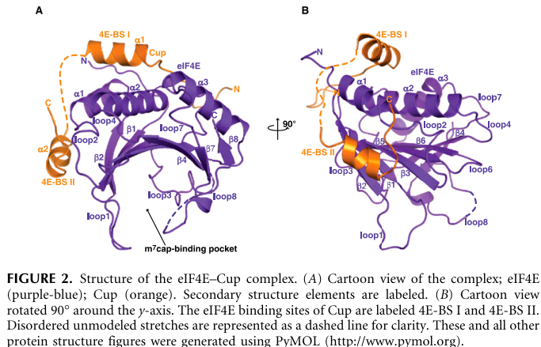

## Question

# Gene Research for Functional Annotation

## ⚠️ CRITICAL: Gene/Protein Identification Context

**BEFORE YOU BEGIN RESEARCH:** You MUST verify you are researching the CORRECT gene/protein. Gene symbols can be ambiguous, especially for less well-characterized genes from non-model organisms.

### Target Gene/Protein Identity (from UniProt):
- **UniProt Accession:** Q9VMA3
- **Protein Description:** RecName: Full=Protein cup; AltName: Full=Oskar ribonucleoprotein complex 147 kDa subunit;
- **Gene Information:** Name=cup; Synonyms=fs(2)cup; ORFNames=CG11181;
- **Organism (full):** Drosophila melanogaster (Fruit fly).
- **Protein Family:** Belongs to the 4E-T/EIF4E-T family. .
- **Key Domains:** eIF4E-T. (IPR018862); EIF4E-T (PF10477)

### MANDATORY VERIFICATION STEPS:

1. **Check if the gene symbol "cup" matches the protein description above**
2. **Verify the organism is correct:** Drosophila melanogaster (Fruit fly).
3. **Check if protein family/domains align with what you find in literature**
4. **If you find literature for a DIFFERENT gene with the same or similar symbol, STOP**

### If Gene Symbol is Ambiguous or You Cannot Find Relevant Literature:

**DO NOT PROCEED WITH RESEARCH ON A DIFFERENT GENE.** Instead:
- State clearly: "The gene symbol 'cup' is ambiguous or literature is limited for this specific protein"
- Explain what you found (e.g., "Found extensive literature on a different gene with the same symbol in a different organism")
- Describe the protein based ONLY on the UniProt information provided above
- Suggest that the protein function can be inferred from domain/family information

### Research Target:

Please provide a comprehensive research report on the gene **cup** (gene ID: cup, UniProt: Q9VMA3) in DROME.

The research report should be a detailed narrative explaining the function, biological processes, and localization of the gene product. Citations should be given for all claims.

You should prioritize authoritative reviews and primary scientific literature when conducting research. You can supplement
this with annotations you find in gene/protein databases, but these can be outdated or inaccurate.

We are specifically interested in the primary function of the gene - for enzymes, what reaction is catalyzed, and what is the substrate specificity? For transporters, what is the substrate? For structural proteins or adapters, what is the broader structural role? For signaling molecules, what is the role in the pathway.

We are interested in where in or outside the cell the gene product carries out its function.

We are also interested in the signaling or biochemical pathways in which the gene functions. We are less interested in broad pleiotropic effects, except where these elucidate the precise role.

Include evidence where possible. We are interested in both experimental evidence as well as inference from structure, evolution, or bioinformatic analysis. Precise studies should be prioritized over high-throughput, where available.

## Output

Question: You are an expert researcher providing comprehensive, well-cited information.

Provide detailed information focusing on:
1. Key concepts and definitions with current understanding
2. Recent developments and latest research (prioritize 2023-2024 sources)
3. Current applications and real-world implementations
4. Expert opinions and analysis from authoritative sources
5. Relevant statistics and data from recent studies

Format as a comprehensive research report with proper citations. Include URLs and publication dates where available.
Always prioritize recent, authoritative sources and provide specific citations for all major claims.

# Gene Research for Functional Annotation

## ⚠️ CRITICAL: Gene/Protein Identification Context

**BEFORE YOU BEGIN RESEARCH:** You MUST verify you are researching the CORRECT gene/protein. Gene symbols can be ambiguous, especially for less well-characterized genes from non-model organisms.

### Target Gene/Protein Identity (from UniProt):
- **UniProt Accession:** Q9VMA3
- **Protein Description:** RecName: Full=Protein cup; AltName: Full=Oskar ribonucleoprotein complex 147 kDa subunit;
- **Gene Information:** Name=cup; Synonyms=fs(2)cup; ORFNames=CG11181;
- **Organism (full):** Drosophila melanogaster (Fruit fly).
- **Protein Family:** Belongs to the 4E-T/EIF4E-T family. .
- **Key Domains:** eIF4E-T. (IPR018862); EIF4E-T (PF10477)

### MANDATORY VERIFICATION STEPS:

1. **Check if the gene symbol "cup" matches the protein description above**
2. **Verify the organism is correct:** Drosophila melanogaster (Fruit fly).
3. **Check if protein family/domains align with what you find in literature**
4. **If you find literature for a DIFFERENT gene with the same or similar symbol, STOP**

### If Gene Symbol is Ambiguous or You Cannot Find Relevant Literature:

**DO NOT PROCEED WITH RESEARCH ON A DIFFERENT GENE.** Instead:
- State clearly: "The gene symbol 'cup' is ambiguous or literature is limited for this specific protein"
- Explain what you found (e.g., "Found extensive literature on a different gene with the same symbol in a different organism")
- Describe the protein based ONLY on the UniProt information provided above
- Suggest that the protein function can be inferred from domain/family information

### Research Target:

Please provide a comprehensive research report on the gene **cup** (gene ID: cup, UniProt: Q9VMA3) in DROME.

The research report should be a detailed narrative explaining the function, biological processes, and localization of the gene product. Citations should be given for all claims.

You should prioritize authoritative reviews and primary scientific literature when conducting research. You can supplement
this with annotations you find in gene/protein databases, but these can be outdated or inaccurate.

We are specifically interested in the primary function of the gene - for enzymes, what reaction is catalyzed, and what is the substrate specificity? For transporters, what is the substrate? For structural proteins or adapters, what is the broader structural role? For signaling molecules, what is the role in the pathway.

We are interested in where in or outside the cell the gene product carries out its function.

We are also interested in the signaling or biochemical pathways in which the gene functions. We are less interested in broad pleiotropic effects, except where these elucidate the precise role.

Include evidence where possible. We are interested in both experimental evidence as well as inference from structure, evolution, or bioinformatic analysis. Precise studies should be prioritized over high-throughput, where available.

# Functional annotation of *Drosophila melanogaster cup* (Q9VMA3)

## Identity and principal function

**Identity check.** The specified UniProt record identifies *cup* (also *fs(2)cup*, CG11181) as the *D. melanogaster* protein Cup, alternatively described as an Oskar ribonucleoprotein-complex subunit. This agrees with experimental literature identifying **Drosophila Cup** as an eIF4E-binding, 4E-T/EIF4E-T-family translational regulator; the research below concerns that fly protein, not another gene named “cup.” The accession, synonyms and InterPro/Pfam identifiers are those supplied in the question; the functional identification is independently supported by fly protein–interaction, genetic and structural studies. (nakamura2004drosophilacupis pages 1-2, kinkelin2012crystalstructureof pages 1-2, meyer2024exploringthedynamics pages 3-4)

**Primary annotation:** Cup is a **cytoplasmic messenger-ribonucleoprotein (mRNP) adaptor and translational repressor**, not a known enzyme or membrane transporter. It helps keep selected maternal mRNAs untranslated—and, in some settings, intact—until protein synthesis is appropriate. RNA-associated proteins confer much of its target specificity: Bruno 1 (Bru1) links Cup to *oskar* (*osk*) mRNA, whereas Smaug links it to *nanos* (*nos*) mRNA. Cup binds the cap-binding initiation factor eIF4E and antagonizes recruitment of eIF4G, a step required for efficient cap-dependent initiation. It also participates in assemblies that regulate poly(A)-tail shortening and mRNA storage. Thus, its relevant “substrates” are **regulated mRNPs**, rather than molecules chemically converted by Cup itself. (nakamura2004drosophilacupis pages 1-2, nelson2009translationalregulationina pages 47-51, igreja2011cuppromotesdeadenylation pages 1-2, igreja2011cuppromotesdeadenylation pages 6-7)

The following matrix distinguishes molecular interactions from genetic phenotypes and from mechanisms that remain inferential.

| Biological context | Molecular interaction or action | Evidence and qualification |
|---|---|---|
| Bruno–*oskar* during early oogenesis | Bruno binds response elements in the *oskar* 3′ UTR and recruits Cup. Cup directly binds eIF4E and opposes eIF4G recruitment. | The *cup212* mutant disrupts Cup–eIF4E binding and causes premature Oskar production. Nevertheless, *oskar* RNA still reaches the posterior pole from late stage 8, although its particles and residual cytoplasmic distribution are abnormal. Cup–Bruno association was RNA-independent in ovarian extracts, while direct Cup–eIF4E binding was demonstrated biochemically. (nakamura2004drosophilacupis pages 3-4, nakamura2004drosophilacupis pages 4-5, nakamura2004drosophilacupis pages 5-7) |
| Smaug–*nanos* in the early embryo | Smaug binds recognition elements in the *nanos* 3′ UTR and recruits a repressive complex containing Cup, eIF4E, Me31B, Trailer hitch and Belle. Cup connects 3′-UTR regulation to cap-dependent initiation control. | The 2004 work established Cup association with Smaug and Cup-dependent repression, but extract-based association alone does not prove direct binary binding. A 2017 biochemical study recovered the SRE-dependent complex and found stoichiometric Cup association with SRE-containing RNA; Me31B–Trailer hitch coating was proposed as an additional repression mechanism. (nelson2009translationalregulationina pages 47-51, nelson2009translationalregulationin pages 51-55, gotze2017translationalrepressionof pages 1-2) |
| General effector function and storage of repressed mRNAs | Cup’s middle and glutamine-rich C-terminal regions form an effector domain that represses translation, promotes deadenylation and associates with decapping factors and CAF1–CCR4–NOT. Its N-terminal region protects associated deadenylated RNAs from decapping and complete degradation. | S2-cell tethering and *oskar*-UTR reporters showed that repression and deadenylation can persist when canonical eIF4E binding is impaired. RNase-resistant co-immunoprecipitation demonstrated physical association with CCR4–NOT components, but a 2024 direct-pair ReLo assay detected no Cup interaction with individual NOT core subunits. Direct Cup–CCR4–NOT binding therefore remains unproven and may require bridging factors. (igreja2011cuppromotesdeadenylation pages 1-2, igreja2011cuppromotesdeadenylation pages 6-7, salgania2024reloisa pages 6-8) |
| Nurse-cell P-bodies and Cyclin A/B control during oogenesis | Cup and Bruno 1 associate spatially with *cycA* and *cycB* mRNAs in large nurse-cell cytoplasmic condensates and help recruit or retain them in Me31B-marked P-bodies. | Super-resolution imaging demonstrated colocalization rather than direct RNA binding. RNAi depletion of Cup or Bruno 1 caused ectopic Cyclin B from early egg-chamber stages and later Cyclin A accumulation. Cup depletion also weakened both transcripts’ association with Me31B condensates, whereas Cup-containing mRNP association persisted after Me31B depletion. (bayer2025posttranscriptionalregulationof pages 5-7, bayer2025posttranscriptionalregulationof pages 13-15, bayer2025posttranscriptionalregulationof pages 1-3) |
| Cup clearance during the maternal-to-zygotic transition | Maternal Cup, Me31B and Trailer hitch are ubiquitylated by the CTLH E3-ligase system and cleared as developmental control shifts to zygotic products. | Earlier work established CTLH-dependent turnover of the three repressors. A 2024 preprint, subsequently published in 2025, identified Muskelin as the CTLH substrate adaptor and found few targets beyond this repressor trio. This demonstrates regulated Cup proteolysis, not ubiquitin-catalytic activity by Cup itself. (briney2024muskelinactsas pages 1-4, briney2025muskelinisa pages 17-18, wang2017me31bgloballyrepresses pages 1-2) |

*Table: Evidence matrix summarizing experimentally supported functions of Drosophila Cup (Q9VMA3) while distinguishing direct binding, complex association, functional genetics and mechanistic inference.*

## Molecular mechanism: initiation, deadenylation and protection

Cup is a large, approximately 1,132-amino-acid protein with an N-terminal eIF4E-interaction region and middle and glutamine-rich C-terminal regions. The C-terminal region interacts with Bruno. In the original ovarian study, Cup–eIF4E association survived RNase treatment, mutations in Cup’s conserved **YxxxxLφ** eIF4E-binding motif sharply reduced association, and mutation of the corresponding eIF4E contact residue **W117** abolished the tested interaction. These experiments establish direct eIF4E binding more strongly than co-localization alone would. (nakamura2004drosophilacupis pages 3-4, nakamura2004drosophilacupis pages 2-3, nakamura2004drosophilacupis pages 5-7)

Structural analysis subsequently resolved a **2.8-Å crystal structure** of an eIF4E–Cup minimal complex. Cup contributes two eIF4E-binding segments: a canonical site modeled at residues **318–339** and a noncanonical site at **362–376**. They contact different surfaces of eIF4E, consistent with Cup opposing eIF4G association; the structure establishes the interface of a *fragment*, not the complete architecture of full-length Cup or an intact ovarian granule. The cropped structural evidence is the original study’s Figure 2. (kinkelin2012crystalstructureof pages 2-4, kinkelin2012crystalstructureof pages 1-2, kinkelin2012crystalstructureof media abf926a3)

**eIF4E competition is important, but is not Cup’s only activity.** In *Drosophila* S2-cell tethering and *osk*-3′-UTR reporter experiments, Cup’s middle plus C-terminal **effector domain** repressed expression and promoted deadenylation even when canonical eIF4E binding was impaired. Full-length Cup allowed repressed, deadenylated RNA to accumulate, whereas its isolated effector domain promoted degradation. The N-terminal region, particularly its noncanonical eIF4E-binding motif, counteracted subsequent decapping and decay. Cup therefore couples translational inhibition to **regulated mRNA stability**, rather than simply destroying every transcript it silences. This domain dissection also qualifies the early interpretation that all Cup-dependent repression strictly requires its canonical eIF4E site: that site was essential for repression in the tested *cup* mutant oocyte context, but not for every repression mechanism measured with S2 reporters. (igreja2011cuppromotesdeadenylation pages 1-2, igreja2011cuppromotesdeadenylation pages 6-7, nakamura2004drosophilacupis pages 5-7)

Cup co-immunoprecipitates, even after RNase treatment, with components of the **CAF1–CCR4–NOT deadenylase** machinery. However, a 2024 pairwise protein-interaction assay detected Cup binding to eIF4E and Me31B **but not to individual CCR4–NOT core subunits**. The defensible conclusion is that Cup is associated with a deadenylation-competent complex; direct Cup binding to a particular NOT-core protein is *not established* by those observations. Cup itself has not been shown to catalyze deadenylation, decapping or ubiquitination. (igreja2011cuppromotesdeadenylation pages 6-7, salgania2024reloisa pages 6-8)

## RNA-specific biological roles

### *oskar*: restraining translation before posterior localization

In nurse cells and the developing oocyte, Bruno recognizes response elements in the *osk* 3′ UTR and associates with Cup; Cup’s C-terminal glutamine-rich region is sufficient for their interaction in yeast assays, and Bruno remains associated with the ovarian Cup–eIF4E complex after RNase treatment. This provides a plausible physical bridge from a transcript-specific 3′-UTR regulator to the cap-dependent initiation machinery. *Oskar* protein is subsequently required to establish posterior germ plasm and germ-cell determinants; untimely expression is therefore consequential even if *osk* RNA still reaches the right region. (nakamura2004drosophilacupis pages 1-2, nakamura2004drosophilacupis pages 2-3, nakamura2004drosophilacupis pages 5-7)

The clearest separation of **repression** from **RNA localization** comes from the *cup*212 mutant, which produces a truncated protein lacking a functional canonical eIF4E-binding region. Oskar protein appeared prematurely in early egg chambers, yet *osk* RNA still enriched at the oocyte posterior from approximately stage 8 onward. Its particles were abnormally large and some RNA persisted elsewhere, so localization was **not fully normal**. In the same mutant, measured microtubule-polarity markers and *gurken* RNA/protein localization were largely preserved. The principal demonstrated defect in this experiment is therefore premature *osk* translation, not a general collapse of oocyte polarity. (nakamura2004drosophilacupis pages 3-4, nakamura2004drosophilacupis pages 4-5, nakamura2004drosophilacupis pages 5-7)

### *nanos*: spatially restricted translation and germ-plasm formation

In the early embryo, Smaug recognizes elements in the *nos* 3′ UTR and forms a repression assembly containing Cup and eIF4E. Experiments established Cup association with Smaug, interference with eIF4G–eIF4E binding and a requirement for Cup in tested Smaug-dependent repression. Later biochemical recovery of an element-dependent *nos* repressor complex also identified Cup, Smaug, Me31B, Trailer hitch, Belle and eIF4E. In that analysis, Cup associated with the recognition-element-containing complex, whereas Me31B–Trailer hitch coating of RNA was proposed as an **additional** repression mechanism. Consequently, Cup is an important component of *nos* regulation, not necessarily its sole effector. (nelson2009translationalregulationina pages 47-51, nelson2009translationalregulationin pages 47-51, gotze2017translationalrepressionof pages 1-2)

A **2024 single-molecule imaging** study refined where *nos* is activated: posterior embryonic germ granules supported active translation preferentially at their **surface**, while the *nos* 3′ UTR lay within the granule. Oskar-dependent sequestration of Smaug was implicated in relieving repression. This directly establishes the spatial translation pattern and a role for Smaug–Oskar compartmentalization; it should **not** be read as direct visualization of Cup dissociating from individual *nos* molecules. (chen2024directobservationof pages 1-2)

### Other informative targets

Cup associates with Orb-containing ovarian complexes and restrains premature activation of the *orb* mRNA/Orb-protein positive-feedback loop. *cup* mutants accumulate Orb abnormally in nurse cells and retain *orb* RNAs with longer poly(A) tails, although those RNAs can be mislocalized and less abundant. These findings support a regulatory role in Orb-associated mRNPs, without proving that Cup directly binds *orb* RNA or enzymatically changes its tail. (wong2011cupblocksthe pages 2-3, wong2011cupblocksthe pages 1-2)

More recent work identifies **cyclin A and cyclin B mRNAs** as additional ovarian contexts. Tagged Cup and Bru1 occur with *cycA* and *cycB* RNA in large nurse-cell cytoplasmic assemblies; Cup or Bru1 depletion causes ectopic Cyclin B protein beginning around egg-chamber **stage 2**, with the strongest early Cyclin A increase around **stage 4**. Their mRNAs also associate with Me31B-marked P-bodies. This is strong genetic and spatial evidence for Cup-mediated post-transcriptional control, although microscopic overlap alone does not establish direct Cup–RNA binding for either cyclin. (bayer2025posttranscriptionalregulationof pages 5-7, bayer2025posttranscriptionalregulationof pages 1-3, bayer2025posttranscriptionalregulationof pages 13-15)

## Where Cup acts

Cup’s experimentally well-supported site of action is the **intracellular germline cytoplasm**: punctate mRNPs in ovarian nurse cells and the oocyte, including Me31B-associated **processing bodies (P-bodies)**, and maternally supplied complexes in the early embryo. Original ovarian immunostaining found Cup co-localized with Me31B particles throughout oogenesis; more recent tagged-protein imaging places it with cyclin-associated condensates in nurse-cell cytoplasm. P-bodies are non-membrane-bound cytoplasmic mRNP compartments, not extracellular structures or evidence that Cup is an ER-resident membrane protein. Older work has also reported nucleocytoplasmic shuttling, but the **best-established functional reactions described here—translation control and protection of stored mRNAs—occur in cytoplasmic mRNPs**. (nakamura2004drosophilacupis pages 2-3, bayer2025posttranscriptionalregulationof pages 5-7, nelson2009translationalregulationina pages 137-139, milano2024theroleof pages 1-4)

Ovarian P-body organization depends in part on proximity to **ER exit sites**. In a study first posted in **July 2024** and published online in *EMBO Reports* on **9 December 2024** (January **2025** issue), ER-exit-site-associated P-bodies were larger and less mobile than other cytoplasmic P-bodies. Perturbing exit sites redistributed P-body components, including Cup, and compromised *osk* mRNA stability and translational repression. This identifies a relevant cellular **environment** for Cup-containing complexes; it does not establish that Cup itself mediates ER export or directly binds ER-exit-site proteins. (milano2024theroleof pages 9-11, milano2024theroleof pages 1-2)

## Recent evidence, quantitative results and interpretation

- **2024—directness of interactions.** The ReLo interaction study detected Cup pairwise associations with eIF4E and Me31B but no Cup–CCR4–NOT-core-subunit interaction under its assay conditions. This is a useful check on models based only on co-immunoprecipitation: *complex association is not synonymous with direct binary contact*. (salgania2024reloisa pages 6-8)
- **2024–2025—measured RNA partitioning.** In the June 2025 cyclin study, *cup* depletion increased mean RNA-particle distance from Me31B-marked condensates by **50% for *cycA*** and **32% for *cycB***, and reduced their measured Me31B volume overlap by **48%** and **38%**, respectively. After **Me31B** depletion, *cycB* RNA abundance fell by **55%**, whereas *cycA* RNA abundance was unchanged. The latter 55% is an effect of **Me31B depletion**, not Cup depletion; together the experiments distinguish an mRNP’s formation from its retention and stability in P-bodies. (bayer2025posttranscriptionalregulationof pages 13-15)
- **2024 preprint; 2025 peer-reviewed paper—developmental termination.** Cup, Me31B and Trailer hitch are maternal repressors cleared during the **maternal-to-zygotic transition** through the CTLH ubiquitin-ligase pathway. A 2024 preprint, subsequently published in *EMBO Reports* in 2025, identified **Muskelin** as a CTLH substrate adaptor with few identified targets beyond that repressor trio. Earlier embryo analyses reported that levels of Me31B and its partners Cup and Trailer hitch fall by **more than tenfold** during this transition. This concerns regulated removal of Cup, not catalytic activity of Cup. (briney2024muskelinactsas pages 1-4, briney2025muskelinisa pages 17-18, wang2017me31bgloballyrepresses pages 1-2)
- **Scope of 2023 evidence.** A directly relevant 2023 paper, “Cup is essential for *oskar* mRNA translational repression during early *Drosophila* oogenesis,” was identified at **https://doi.org/10.1080/15476286.2023.2242650**, but its full text was unavailable in this retrieval. Its title and bibliographic record are consistent with the well-supported early-repression function; no specific new results from that paper have been treated as independently verified here. (nakamura2004drosophilacupis pages 3-4, nakamura2004drosophilacupis pages 4-5)

**Functional conclusion.** The strongest assignment for Q9VMA3 is a **4E-T-family mRNP scaffold/effector that links transcript-selective RNA-binding regulators to translation-initiation inhibition, deadenylation-associated silencing and protection of selected maternal mRNAs**. Its best-demonstrated pathway is Bruno-dependent restriction of *osk* translation during oogenesis; Smaug-dependent *nos* regulation, P-body-associated RNA storage and timed embryonic clearance extend that role. Important unresolved questions include exactly how a given Cup-bound mRNP is switched back on and which molecular bridges connect Cup to CCR4–NOT in vivo. (nakamura2004drosophilacupis pages 5-7, igreja2011cuppromotesdeadenylation pages 1-2, salgania2024reloisa pages 6-8, chen2024directobservationof pages 1-2)

### Selected sources and publication dates

- Nakamura A, Sato K, Hanyu-Nakamura K. *Developmental Cell*, **January 2004**. Original Cup–Bruno–eIF4E/*osk* experiments. https://doi.org/10.1016/S1534-5807(03)00400-3. (nakamura2004drosophilacupis pages 1-2, nakamura2004drosophilacupis pages 5-7)
- Nelson MR, Leidal AM, Smibert CA. *EMBO Journal*, **January 2004**. Cup in Smaug-dependent repression. https://doi.org/10.1038/sj.emboj.7600026. (nelson2009translationalregulationina pages 47-51)
- Igreja C, Izaurralde E. *Genes & Development*, **September 2011**. Cup effector-domain, deadenylation and decapping experiments. https://doi.org/10.1101/gad.17136311. (igreja2011cuppromotesdeadenylation pages 1-2, igreja2011cuppromotesdeadenylation pages 6-7)
- Kinkelin K *et al.* *RNA*, **September 2012**. eIF4E–Cup crystal structure. https://doi.org/10.1261/rna.033639.112. (kinkelin2012crystalstructureof pages 1-2, kinkelin2012crystalstructureof pages 2-4)
- Salgania HK *et al.* *Nature Communications*, **April 2024**. Direct-pair interaction assay. https://doi.org/10.1038/s41467-024-47233-4. (salgania2024reloisa pages 6-8)
- Chen R *et al.* *Nature Cell Biology*, **4 July 2024**. Single-molecule *nos* translation at embryonic germ granules. https://doi.org/10.1038/s41556-024-01452-5. (chen2024directobservationof pages 1-2)
- Milano SN *et al.* *EMBO Reports*, **online 9 December 2024; January 2025 issue**. ER exit sites and ovarian P-bodies. https://doi.org/10.1038/s44319-024-00344-x. (milano2024theroleof pages 1-2)
- Bayer LV *et al.* *iScience*, **20 June 2025**. Cyclin-mRNA regulation by Bru1, Cup and P-bodies. https://doi.org/10.1016/j.isci.2025.112727. (bayer2025posttranscriptionalregulationof pages 1-3, bayer2025posttranscriptionalregulationof pages 13-15)
- Briney CA *et al.* *EMBO Reports*, **2025**; related **July 2024 preprint**. CTLH/Muskelin-dependent turnover. https://doi.org/10.1038/s44319-025-00397-6; https://doi.org/10.1101/2024.06.28.601265. (briney2025muskelinisa pages 17-18, briney2024muskelinactsas pages 1-4)

References

1. (nakamura2004drosophilacupis pages 1-2): Akira Nakamura, Keiji Sato, and Kazuko Hanyu-Nakamura. Drosophila cup is an eif4e binding protein that associates with bruno and regulates oskar mrna translation in oogenesis. Developmental cell, 6 1:69-78, Jan 2004. URL: https://doi.org/10.1016/s1534-5807(03)00400-3, doi:10.1016/s1534-5807(03)00400-3. This article has 470 citations and is from a highest quality peer-reviewed journal.

2. (kinkelin2012crystalstructureof pages 1-2): Kerstin Kinkelin, Katharina Veith, Marlene Grünwald, and Fulvia Bono. Crystal structure of a minimal eif4e-cup complex reveals a general mechanism of eif4e regulation in translational repression. RNA, 18 9:1624-34, Sep 2012. URL: https://doi.org/10.1261/rna.033639.112, doi:10.1261/rna.033639.112. This article has 81 citations and is from a domain leading peer-reviewed journal.

3. (meyer2024exploringthedynamics pages 3-4): Julia Meyer, Marco Payr, Olivier Duss, and Janosch Hennig. Exploring the dynamics of messenger ribonucleoprotein-mediated translation repression. Biochemical Society Transactions, 52:2267-2279, Nov 2024. URL: https://doi.org/10.1042/bst20231240, doi:10.1042/bst20231240. This article has 5 citations and is from a peer-reviewed journal.

4. (nelson2009translationalregulationina pages 47-51): M Nelson. Translational regulation in the early drosophila embryo. Unknown journal, 2009.

5. (igreja2011cuppromotesdeadenylation pages 1-2): Catia Igreja and Elisa Izaurralde. Cup promotes deadenylation and inhibits decapping of mrna targets. Genes & development, 25 18:1955-67, Sep 2011. URL: https://doi.org/10.1101/gad.17136311, doi:10.1101/gad.17136311. This article has 113 citations and is from a highest quality peer-reviewed journal.

6. (igreja2011cuppromotesdeadenylation pages 6-7): Catia Igreja and Elisa Izaurralde. Cup promotes deadenylation and inhibits decapping of mrna targets. Genes & development, 25 18:1955-67, Sep 2011. URL: https://doi.org/10.1101/gad.17136311, doi:10.1101/gad.17136311. This article has 113 citations and is from a highest quality peer-reviewed journal.

7. (nakamura2004drosophilacupis pages 3-4): Akira Nakamura, Keiji Sato, and Kazuko Hanyu-Nakamura. Drosophila cup is an eif4e binding protein that associates with bruno and regulates oskar mrna translation in oogenesis. Developmental cell, 6 1:69-78, Jan 2004. URL: https://doi.org/10.1016/s1534-5807(03)00400-3, doi:10.1016/s1534-5807(03)00400-3. This article has 470 citations and is from a highest quality peer-reviewed journal.

8. (nakamura2004drosophilacupis pages 4-5): Akira Nakamura, Keiji Sato, and Kazuko Hanyu-Nakamura. Drosophila cup is an eif4e binding protein that associates with bruno and regulates oskar mrna translation in oogenesis. Developmental cell, 6 1:69-78, Jan 2004. URL: https://doi.org/10.1016/s1534-5807(03)00400-3, doi:10.1016/s1534-5807(03)00400-3. This article has 470 citations and is from a highest quality peer-reviewed journal.

9. (nakamura2004drosophilacupis pages 5-7): Akira Nakamura, Keiji Sato, and Kazuko Hanyu-Nakamura. Drosophila cup is an eif4e binding protein that associates with bruno and regulates oskar mrna translation in oogenesis. Developmental cell, 6 1:69-78, Jan 2004. URL: https://doi.org/10.1016/s1534-5807(03)00400-3, doi:10.1016/s1534-5807(03)00400-3. This article has 470 citations and is from a highest quality peer-reviewed journal.

10. (nelson2009translationalregulationin pages 51-55): M Nelson. Translational regulation in the early drosophila embryo. Unknown journal, 2009.

11. (gotze2017translationalrepressionof pages 1-2): Michael Götze, Jérémy Dufourt, Christian Ihling, Christiane Rammelt, Stephanie Pierson, Nagraj Sambrani, Claudia Temme, Andrea Sinz, Martine Simonelig, and Elmar Wahle. Translational repression of the <i>drosophila nanos</i> mrna involves the rna helicase belle and rna coating by me31b and trailer hitch. RNA, 23:1552-1568, Jul 2017. URL: https://doi.org/10.1261/rna.062208.117, doi:10.1261/rna.062208.117. This article has 81 citations and is from a domain leading peer-reviewed journal.

12. (salgania2024reloisa pages 6-8): Harpreet Kaur Salgania, Jutta Metz, and Mandy Jeske. Relo is a simple and rapid colocalization assay to identify and characterize direct protein–protein interactions. Nature Communications, Apr 2024. URL: https://doi.org/10.1038/s41467-024-47233-4, doi:10.1038/s41467-024-47233-4. This article has 22 citations and is from a highest quality peer-reviewed journal.

13. (bayer2025posttranscriptionalregulationof pages 5-7): Livia V. Bayer, Samantha N. Milano, Harpreet Kaur, Zara Kumar, and Diana P. Bratu. Post-transcriptional regulation of cyclin a and b mrnas by bruno 1, cup, and p-bodies. iScience, 28:112727, Jun 2025. URL: https://doi.org/10.1016/j.isci.2025.112727, doi:10.1016/j.isci.2025.112727. This article has 5 citations and is from a peer-reviewed journal.

14. (bayer2025posttranscriptionalregulationof pages 13-15): Livia V. Bayer, Samantha N. Milano, Harpreet Kaur, Zara Kumar, and Diana P. Bratu. Post-transcriptional regulation of cyclin a and b mrnas by bruno 1, cup, and p-bodies. iScience, 28:112727, Jun 2025. URL: https://doi.org/10.1016/j.isci.2025.112727, doi:10.1016/j.isci.2025.112727. This article has 5 citations and is from a peer-reviewed journal.

15. (bayer2025posttranscriptionalregulationof pages 1-3): Livia V. Bayer, Samantha N. Milano, Harpreet Kaur, Zara Kumar, and Diana P. Bratu. Post-transcriptional regulation of cyclin a and b mrnas by bruno 1, cup, and p-bodies. iScience, 28:112727, Jun 2025. URL: https://doi.org/10.1016/j.isci.2025.112727, doi:10.1016/j.isci.2025.112727. This article has 5 citations and is from a peer-reviewed journal.

16. (briney2024muskelinactsas pages 1-4): Chloe A. Briney, Jesslyn C. Henriksen, Chenwei Lin, Lisa A. Jones, Leif Benner, Addison B. Rains, Roxana Gutierrez, Philip R. Gafken, and Olivia S. Rissland. Muskelin acts as a substrate receptor of the highly regulated drosophila ctlh e3 ligase during the maternal-to-zygotic transition. bioRxiv, Jul 2024. URL: https://doi.org/10.1101/2024.06.28.601265, doi:10.1101/2024.06.28.601265. This article has 1 citations.

17. (briney2025muskelinisa pages 17-18): Chloe A Briney, Jesslyn C Henriksen, Chenwei Lin, Lisa A. Jones, Leif Benner, Addison B. Rains, Roxana Gutierrez, Philip R. Gafken, and Olivia S. Rissland. Muskelin is a substrate adaptor of the highly regulated drosophila embryonic ctlh e3 ligase. EMBO Reports, 26:1647-1669, Feb 2025. URL: https://doi.org/10.1038/s44319-025-00397-6, doi:10.1038/s44319-025-00397-6. This article has 11 citations and is from a highest quality peer-reviewed journal.

18. (wang2017me31bgloballyrepresses pages 1-2): Miranda Wang, Michael Ly, Andrew Lugowski, John D Laver, Howard D Lipshitz, Craig A Smibert, and Olivia S Rissland. Me31b globally represses maternal mrnas by two distinct mechanisms during the drosophila maternal-to-zygotic transition. eLife, Sep 2017. URL: https://doi.org/10.7554/elife.27891, doi:10.7554/elife.27891. This article has 97 citations and is from a domain leading peer-reviewed journal.

19. (nakamura2004drosophilacupis pages 2-3): Akira Nakamura, Keiji Sato, and Kazuko Hanyu-Nakamura. Drosophila cup is an eif4e binding protein that associates with bruno and regulates oskar mrna translation in oogenesis. Developmental cell, 6 1:69-78, Jan 2004. URL: https://doi.org/10.1016/s1534-5807(03)00400-3, doi:10.1016/s1534-5807(03)00400-3. This article has 470 citations and is from a highest quality peer-reviewed journal.

20. (kinkelin2012crystalstructureof pages 2-4): Kerstin Kinkelin, Katharina Veith, Marlene Grünwald, and Fulvia Bono. Crystal structure of a minimal eif4e-cup complex reveals a general mechanism of eif4e regulation in translational repression. RNA, 18 9:1624-34, Sep 2012. URL: https://doi.org/10.1261/rna.033639.112, doi:10.1261/rna.033639.112. This article has 81 citations and is from a domain leading peer-reviewed journal.

21. (kinkelin2012crystalstructureof media abf926a3): Kerstin Kinkelin, Katharina Veith, Marlene Grünwald, and Fulvia Bono. Crystal structure of a minimal eif4e-cup complex reveals a general mechanism of eif4e regulation in translational repression. RNA, 18 9:1624-34, Sep 2012. URL: https://doi.org/10.1261/rna.033639.112, doi:10.1261/rna.033639.112. This article has 81 citations and is from a domain leading peer-reviewed journal.

22. (nelson2009translationalregulationin pages 47-51): M Nelson. Translational regulation in the early drosophila embryo. Unknown journal, 2009.

23. (chen2024directobservationof pages 1-2): Ruoyu Chen, William Stainier, Jeremy Dufourt, Mounia Lagha, and Ruth Lehmann. Direct observation of translational activation by a ribonucleoprotein granule. Nature Cell Biology, 26:1322-1335, Jul 2024. URL: https://doi.org/10.1038/s41556-024-01452-5, doi:10.1038/s41556-024-01452-5. This article has 64 citations and is from a highest quality peer-reviewed journal.

24. (wong2011cupblocksthe pages 2-3): Li Chin Wong and Paul Schedl. Cup blocks the precocious activation of the orb autoregulatory loop. PLoS ONE, 6:e28261, Dec 2011. URL: https://doi.org/10.1371/journal.pone.0028261, doi:10.1371/journal.pone.0028261. This article has 33 citations and is from a peer-reviewed journal.

25. (wong2011cupblocksthe pages 1-2): Li Chin Wong and Paul Schedl. Cup blocks the precocious activation of the orb autoregulatory loop. PLoS ONE, 6:e28261, Dec 2011. URL: https://doi.org/10.1371/journal.pone.0028261, doi:10.1371/journal.pone.0028261. This article has 33 citations and is from a peer-reviewed journal.

26. (nelson2009translationalregulationina pages 137-139): M Nelson. Translational regulation in the early drosophila embryo. Unknown journal, 2009.

27. (milano2024theroleof pages 1-4): Samantha N. Milano, Livia V. Bayer, Julie J. Ko, Caroline E. Casella, and Diana P. Bratu. The role of er exit sites in maintaining p-body organization and transmitting er stress response during drosophila melanogaster oogenesis. bioRxiv, Jul 2024. URL: https://doi.org/10.1101/2024.07.03.601952, doi:10.1101/2024.07.03.601952. This article has 2 citations.

28. (milano2024theroleof pages 9-11): Samantha N. Milano, Livia V. Bayer, Julie J. Ko, Caroline E. Casella, and Diana P. Bratu. The role of er exit sites in maintaining p-body organization and transmitting er stress response during drosophila melanogaster oogenesis. bioRxiv, Jul 2024. URL: https://doi.org/10.1101/2024.07.03.601952, doi:10.1101/2024.07.03.601952. This article has 2 citations.

29. (milano2024theroleof pages 1-2): Samantha N Milano, Livia V Bayer, Julie J Ko, Caroline E Casella, and Diana P Bratu. The role of er exit sites in maintaining p-body organization and integrity during drosophila melanogaster oogenesis. EMBO Reports, 26:494-520, Dec 2025. URL: https://doi.org/10.1038/s44319-024-00344-x, doi:10.1038/s44319-024-00344-x. This article has 13 citations and is from a highest quality peer-reviewed journal.

## Artifacts

- [Edison artifact artifact-00](cup-deep-research-falcon_artifacts/artifact-00.md)

## Citations

1. chen2024directobservationof pages 1-2
2. salgania2024reloisa pages 6-8
3. bayer2025posttranscriptionalregulationof pages 13-15
4. nelson2009translationalregulationina pages 47-51
5. milano2024theroleof pages 1-2
6. nakamura2004drosophilacupis pages 1-2
7. kinkelin2012crystalstructureof pages 1-2
8. meyer2024exploringthedynamics pages 3-4
9. igreja2011cuppromotesdeadenylation pages 1-2
10. igreja2011cuppromotesdeadenylation pages 6-7
11. nakamura2004drosophilacupis pages 3-4
12. nakamura2004drosophilacupis pages 4-5
13. nakamura2004drosophilacupis pages 5-7
14. nelson2009translationalregulationin pages 51-55
15. gotze2017translationalrepressionof pages 1-2
16. bayer2025posttranscriptionalregulationof pages 5-7
17. bayer2025posttranscriptionalregulationof pages 1-3
18. briney2024muskelinactsas pages 1-4
19. briney2025muskelinisa pages 17-18
20. nakamura2004drosophilacupis pages 2-3
21. kinkelin2012crystalstructureof pages 2-4
22. nelson2009translationalregulationin pages 47-51
23. wong2011cupblocksthe pages 2-3
24. wong2011cupblocksthe pages 1-2
25. nelson2009translationalregulationina pages 137-139
26. milano2024theroleof pages 1-4
27. milano2024theroleof pages 9-11
28. https://doi.org/10.1080/15476286.2023.2242650**,
29. https://doi.org/10.1016/S1534-5807(03
30. https://doi.org/10.1038/sj.emboj.7600026.
31. https://doi.org/10.1101/gad.17136311.
32. https://doi.org/10.1261/rna.033639.112.
33. https://doi.org/10.1038/s41467-024-47233-4.
34. https://doi.org/10.1038/s41556-024-01452-5.
35. https://doi.org/10.1038/s44319-024-00344-x.
36. https://doi.org/10.1016/j.isci.2025.112727.
37. https://doi.org/10.1038/s44319-025-00397-6;
38. https://doi.org/10.1101/2024.06.28.601265.
39. https://doi.org/10.1016/s1534-5807(03
40. https://doi.org/10.1261/rna.033639.112,
41. https://doi.org/10.1042/bst20231240,
42. https://doi.org/10.1101/gad.17136311,
43. https://doi.org/10.1261/rna.062208.117,
44. https://doi.org/10.1038/s41467-024-47233-4,
45. https://doi.org/10.1016/j.isci.2025.112727,
46. https://doi.org/10.1101/2024.06.28.601265,
47. https://doi.org/10.1038/s44319-025-00397-6,
48. https://doi.org/10.7554/elife.27891,
49. https://doi.org/10.1038/s41556-024-01452-5,
50. https://doi.org/10.1371/journal.pone.0028261,
51. https://doi.org/10.1101/2024.07.03.601952,
52. https://doi.org/10.1038/s44319-024-00344-x,