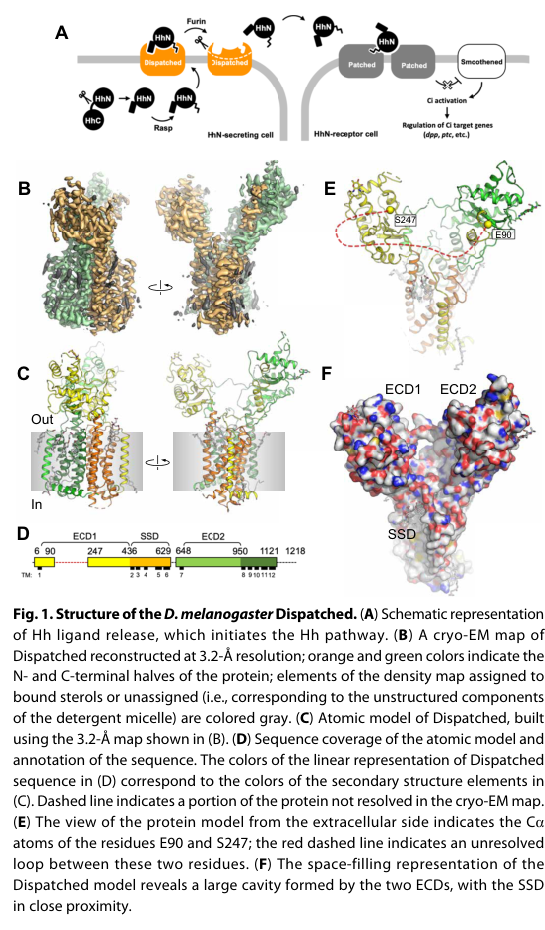
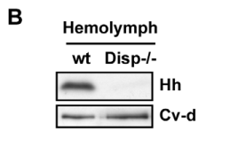

## Question

# Gene Research for Functional Annotation

## ⚠️ CRITICAL: Gene/Protein Identification Context

**BEFORE YOU BEGIN RESEARCH:** You MUST verify you are researching the CORRECT gene/protein. Gene symbols can be ambiguous, especially for less well-characterized genes from non-model organisms.

### Target Gene/Protein Identity (from UniProt):
- **UniProt Accession:** Q9VNJ5
- **Protein Description:** RecName: Full=Protein dispatched;
- **Gene Information:** Name=disp; ORFNames=CG2019;
- **Organism (full):** Drosophila melanogaster (Fruit fly).
- **Protein Family:** Belongs to the dispatched family. .
- **Key Domains:** Dispatched_Hh_regulator. (IPR052081); HMGCR/SNAP/NPC1-like_SSD. (IPR053958); SSD. (IPR000731); Sterol-sensing (PF12349)

### MANDATORY VERIFICATION STEPS:

1. **Check if the gene symbol "disp" matches the protein description above**
2. **Verify the organism is correct:** Drosophila melanogaster (Fruit fly).
3. **Check if protein family/domains align with what you find in literature**
4. **If you find literature for a DIFFERENT gene with the same or similar symbol, STOP**

### If Gene Symbol is Ambiguous or You Cannot Find Relevant Literature:

**DO NOT PROCEED WITH RESEARCH ON A DIFFERENT GENE.** Instead:
- State clearly: "The gene symbol 'disp' is ambiguous or literature is limited for this specific protein"
- Explain what you found (e.g., "Found extensive literature on a different gene with the same symbol in a different organism")
- Describe the protein based ONLY on the UniProt information provided above
- Suggest that the protein function can be inferred from domain/family information

### Research Target:

Please provide a comprehensive research report on the gene **disp** (gene ID: disp, UniProt: Q9VNJ5) in DROME.

The research report should be a detailed narrative explaining the function, biological processes, and localization of the gene product. Citations should be given for all claims.

You should prioritize authoritative reviews and primary scientific literature when conducting research. You can supplement
this with annotations you find in gene/protein databases, but these can be outdated or inaccurate.

We are specifically interested in the primary function of the gene - for enzymes, what reaction is catalyzed, and what is the substrate specificity? For transporters, what is the substrate? For structural proteins or adapters, what is the broader structural role? For signaling molecules, what is the role in the pathway.

We are interested in where in or outside the cell the gene product carries out its function.

We are also interested in the signaling or biochemical pathways in which the gene functions. We are less interested in broad pleiotropic effects, except where these elucidate the precise role.

Include evidence where possible. We are interested in both experimental evidence as well as inference from structure, evolution, or bioinformatic analysis. Precise studies should be prioritized over high-throughput, where available.

## Output

Question: You are an expert researcher providing comprehensive, well-cited information.

Provide detailed information focusing on:
1. Key concepts and definitions with current understanding
2. Recent developments and latest research (prioritize 2023-2024 sources)
3. Current applications and real-world implementations
4. Expert opinions and analysis from authoritative sources
5. Relevant statistics and data from recent studies

Format as a comprehensive research report with proper citations. Include URLs and publication dates where available.
Always prioritize recent, authoritative sources and provide specific citations for all major claims.

# Gene Research for Functional Annotation

## ⚠️ CRITICAL: Gene/Protein Identification Context

**BEFORE YOU BEGIN RESEARCH:** You MUST verify you are researching the CORRECT gene/protein. Gene symbols can be ambiguous, especially for less well-characterized genes from non-model organisms.

### Target Gene/Protein Identity (from UniProt):
- **UniProt Accession:** Q9VNJ5
- **Protein Description:** RecName: Full=Protein dispatched;
- **Gene Information:** Name=disp; ORFNames=CG2019;
- **Organism (full):** Drosophila melanogaster (Fruit fly).
- **Protein Family:** Belongs to the dispatched family. .
- **Key Domains:** Dispatched_Hh_regulator. (IPR052081); HMGCR/SNAP/NPC1-like_SSD. (IPR053958); SSD. (IPR000731); Sterol-sensing (PF12349)

### MANDATORY VERIFICATION STEPS:

1. **Check if the gene symbol "disp" matches the protein description above**
2. **Verify the organism is correct:** Drosophila melanogaster (Fruit fly).
3. **Check if protein family/domains align with what you find in literature**
4. **If you find literature for a DIFFERENT gene with the same or similar symbol, STOP**

### If Gene Symbol is Ambiguous or You Cannot Find Relevant Literature:

**DO NOT PROCEED WITH RESEARCH ON A DIFFERENT GENE.** Instead:
- State clearly: "The gene symbol 'disp' is ambiguous or literature is limited for this specific protein"
- Explain what you found (e.g., "Found extensive literature on a different gene with the same symbol in a different organism")
- Describe the protein based ONLY on the UniProt information provided above
- Suggest that the protein function can be inferred from domain/family information

### Research Target:

Please provide a comprehensive research report on the gene **disp** (gene ID: disp, UniProt: Q9VNJ5) in DROME.

The research report should be a detailed narrative explaining the function, biological processes, and localization of the gene product. Citations should be given for all claims.

You should prioritize authoritative reviews and primary scientific literature when conducting research. You can supplement
this with annotations you find in gene/protein databases, but these can be outdated or inaccurate.

We are specifically interested in the primary function of the gene - for enzymes, what reaction is catalyzed, and what is the substrate specificity? For transporters, what is the substrate? For structural proteins or adapters, what is the broader structural role? For signaling molecules, what is the role in the pathway.

We are interested in where in or outside the cell the gene product carries out its function.

We are also interested in the signaling or biochemical pathways in which the gene functions. We are less interested in broad pleiotropic effects, except where these elucidate the precise role.

Include evidence where possible. We are interested in both experimental evidence as well as inference from structure, evolution, or bioinformatic analysis. Precise studies should be prioritized over high-throughput, where available.

# Functional annotation of *disp* in *Drosophila melanogaster*

## Identity and principal function

The specified UniProt record, [Q9VNJ5](https://www.uniprot.org/uniprotkb/Q9VNJ5/entry), identifies the target as *D. melanogaster* **dispatched** (*disp*; CG2019), not vertebrate *DISP1*. This assignment matches the experimentally cloned fly *disp* locus: it encodes a 1,218-amino-acid protein predicted to span membranes 12 times and to contain a sterol-sensing domain (SSD). Its architecture is consistent with the supplied Dispatched-family, NPC1-like/SSD domain annotations. These domains identify a membrane-associated protein, not an established enzyme with a catalytic reaction. The exact Q9VNJ5–CG2019 accession mapping comes from the UniProt information supplied with the question; the original cloning paper independently establishes the fly gene’s identity and function. (burke1999dispatchedanovel pages 2-3)

**Primary annotation:** Disp enables the controlled release and deployment of **cholesterol-modified Hedgehog (Hh)** from Hh-producing cells. It acts at the *sending* side of the pathway, upstream of Hh binding to Patched (Ptc) on receiving cells; it is not itself the receiving-cell Hh receptor. This assignment rests on genetic specificity: posterior wing-disc cells lacking *disp* retain Hh and fail to signal effectively to anterior cells, whereas loss of *disp* in receiving anterior cells has little effect. Cholesterol-free Hh bypasses the requirement for Disp, and replacing Hh’s cholesterol tether with an unrelated lipid anchor does not reproduce normal Disp-dependent release. Thus, the strongest fly evidence identifies **cholesterol-tethered Hh as Disp’s functionally relevant cargo**, without proving that the entire Hh protein, its cholesterol appendage, or free membrane cholesterol is the molecule physically transported through Disp. (burke1999dispatchedanovel pages 10-11, burke1999dispatchedanovel pages 9-10, burke1999dispatchedanovel pages 3-5)

## Where Disp acts and how Hh reaches recipient cells

Disp is a membrane-integral protein of **Hh-producing cells**. In the developing wing-disc epithelium, imaging of tagged Disp found it predominantly at the **basolateral plasma membrane** and in intracellular, dextran-positive **endocytic vesicles**, rather than enriched at the apical plasma membrane. Tagged Disp and Hh colocalized in approximately **80% of the reported Disp-positive puncta**, and the proteins co-immunoprecipitated. These observations place Disp at membrane and trafficking compartments where it can engage Hh, although colocalization and co-immunoprecipitation alone do not establish direct molecular contact. (callejo2011dispatchedmediateshedgehog pages 3-4, callejo2011dispatchedmediateshedgehog pages 4-5)

In the wing disc, Hh is observed at both apical and basolateral surfaces. Experiments blocking endocytosis support an itinerary in which apically exposed Hh is internalized and subsequently redistributed for effective longer-range signaling. Callejo and colleagues found a basolateral Hh distribution extending approximately **5–10 receiving-cell diameters** from the compartment boundary, whereas apical accumulation in receiving cells was largely confined to the first row. Loss of *disp* leaves Hh on producing-cell membranes and in altered endocytic puncta; limited signaling at immediate cell contacts can persist, but effective longer-range deployment is impaired. Dynamin/Shibire and Rab5 perturbations further implicate endocytosis in the route. Whether all signaling-competent Hh must undergo one specific apical-to-basolateral itinerary, rather than alternative recycling or vesicle-associated routes, remains unsettled. (callejo2011dispatchedmediateshedgehog pages 1-2, callejo2011dispatchedmediateshedgehog pages 2-3, callejo2011dispatchedmediateshedgehog pages 3-4)

Disp functions within a broader Hh-release environment. In fly wing discs, it co-immunoprecipitates with the cell-surface glypican **Dally-like protein (Dlp)**, and increasing Disp raises basolateral Dlp levels. Dlp depletion in Hh-producing cells reduces the Hh target Ptc; Dlp-null discs accumulate approximately **40% more Hh** in the producing compartment than controls. **Ihog** helps retain extracellular Hh along basolateral membrane extensions. The 2024 synthesis by Jiménez-Jiménez, Grobe and Guerrero places Disp, Dlp, Ihog and the soluble factor Shifted in potentially complementary release-and-relay pathways; a continuous molecular hand-off among all these factors has **not** been demonstrated. (callejo2011dispatchedmediateshedgehog pages 5-6, callejo2011dispatchedmediateshedgehog pages 4-5, jimenezjimenez2024hedgehogonthe pages 10-11)

Disp’s source-cell role is not confined to wing patterning. Wild-type larval hemolymph contains Hh that co-fractionates with the lipoprotein **lipophorin**; *disp*-mutant larvae have markedly reduced circulating Hh. Ectopically expressed Hh from the larval midgut or fat body likewise enters hemolymph in a Disp-dependent manner. This establishes a real secretion role beyond the wing disc, but does **not** establish that fly Disp directly loads Hh onto lipophorin: biochemical association of secreted Hh with a carrier and the molecular act of carrier loading are different measurements. The primary report does not give a reliable numerical fold reduction for its *disp*-mutant hemolymph blot. (palm2013secretionandsignaling pages 4-5, palm2013secretionandsignaling pages 16-17, palm2013secretionandsignaling media 9bdea1a5)

The following evidence map separates experiments on the fly protein from downstream-context studies and mammalian comparisons. (burke1999dispatchedanovel pages 2-3, callejo2011dispatchedmediateshedgehog pages 4-5, palm2013secretionandsignaling pages 4-5, cannac2020cryoemstructureof pages 2-3)

| Evidence / date | Experimental system | Inference for fly Disp | Limitations |
|---|---|---|---|
| [Burke et al., 1999](https://doi.org/10.1016/S0092-8674(00)81677-3), published 23 Dec 1999 (burke1999dispatchedanovel pages 9-10, burke1999dispatchedanovel pages 2-3) | *Drosophila* embryos and wing-disc mosaics; native cholesterol-modified Hh-Np was compared with cholesterol-free Hh-Nu. | Loss of *disp* retains Hh-Np in producing cells, whereas Hh-Nu bypasses the Disp requirement and retains long-range activity. This identifies cholesterol-modified Hh as the physiologically relevant cargo and places Disp in Hh-producing cells. | Establishes cargo selectivity and cellular site of action, but not the molecular extraction, ion-coupling, or acceptor-transfer mechanism. |
| [Callejo et al., 2011](https://doi.org/10.1073/pnas.1106881108), published 27 Jun 2011 (callejo2011dispatchedmediateshedgehog pages 5-6, callejo2011dispatchedmediateshedgehog pages 4-5) | Imaging and genetics in wing discs and salivary glands; co-immunoprecipitation. | Disp localizes mainly to the basolateral plasma membrane and endocytic vesicles; approximately **80%** of Disp puncta colocalized with some Hh puncta. Disp co-immunoprecipitated with Hh and Dlp, and Disp overexpression increased basolateral Dlp, supporting an endosomal and basolateral Hh-release complex. | Colocalization and co-IP do not prove direct binding or define the transport reaction. Apical recycling versus basolateral transcytosis or exovesicle models remain debated. |
| [Palm et al., 2013](https://doi.org/10.1371/journal.pbio.1001505), published 5 Mar 2013 (palm2013secretionandsignaling pages 4-5, palm2013secretionandsignaling pages 16-17, palm2013secretionandsignaling media 9bdea1a5) | Wild-type and *disp*-mutant larvae; hemolymph immunoblots, density-gradient fractionation, and tissue-specific Hh expression. | *disp* mutation strongly reduces circulating Hh. Under normal conditions, all detectable hemolymph Hh co-fractionated with ApoLII-containing lipophorin; ectopic fat-body or midgut Hh secretion was also Disp-dependent. | Demonstrates release into circulation, but not that Disp directly loads Hh onto lipophorin; no numerical fold change was reported for the cited result. |
| [Cannac et al., 2020](https://doi.org/10.1126/sciadv.aay7928), published 15 Apr 2020 (cannac2020cryoemstructureof pages 1-2, cannac2020cryoemstructureof pages 1-1, cannac2020cryoemstructureof pages 2-3) | Purified *D. melanogaster* Disp examined by cryo-EM and microscale thermophoresis. | The **3.2 Å** apo structure confirms an RND-like 12-TM architecture, two extracellular domains, and an SSD-adjacent cavity. Engineered cholesterol-free HhNC85II bound Disp with apparent **Kᵈ = 6.2 ± 2.5 μM**; its complex was reconstructed at 4.8 Å. Nine sterol-like densities were modelled at the protein–bilayer interface. | HhNC85II lacked natural cholesterol and used two isoleucines to mimic N-palmitate. The nine densities represent modelled cholesteryl hemisuccinate introduced during purification, not nine endogenous substrates or transport events. |
| [Manikowski et al., 2023](https://doi.org/10.3389/fmolb.2023.1130064), published 23 Feb 2023 (manikowski2023drosophilahedgehogsignaling pages 1-2, manikowski2023drosophilahedgehogsignaling pages 5-6) | Engineered Hh heparan-sulfate-binding-site mutant expressed in *Drosophila* wing discs. | Mutating Hh R238/R239 reduced Ptc–LacZ domain width from **92 ± 10 μm** to **36 ± 2 μm**, about a **60% reduction**, showing that sustained heparan-sulfate binding constrains released Hh to the epithelial field and stabilizes its signaling range. | Provides downstream extracellular-transport context only; this was not a *disp* perturbation or a direct assay of Disp transport, localization, or binding. |
| [Ehring et al., 2024](https://doi.org/10.7554/eLife.86920), published 21 Aug 2024 (ehring2024twowaydispatchedfunction pages 10-12, ehring2024twowaydispatchedfunction pages 1-2, ehring2024twowaydispatchedfunction pages 16-18, ehring2024twowaydispatchedfunction pages 14-16) | Primarily engineered mammalian Shh-producing cells, purified HDL, and mammalian Disp; complementary *Drosophila* developmental tests used Hh cleavage-site variants. | Provides comparative models in which mammalian Disp exports free membrane cholesterol and/or transfers cholesteroylated Shh to HDL before N-terminal shedding. Fly genetics are compatible with conserved lipid-dependent release. | Direct HDL-transfer biochemistry was not performed with endogenous fly Disp. HDL transfer and the mammalian two-way shedding mechanism are comparative inferences, not experimentally proven biochemical activities of Q9VNJ5. |

*Table: Evidence supporting the functional annotation of Drosophila Dispatched, with quantitative findings and organism-specific limitations. Direct fly results are distinguished from mammalian mechanisms that remain comparative inferences.*

## Structural and biochemical interpretation

A cryo-electron microscopy study **of the *D. melanogaster* Disp protein itself** resolved the unbound protein to **3.2 Å**. Its 12-transmembrane, RND-like fold has two extracellular domains forming an unusually open cavity next to the SSD. An engineered Hh fragment lacking its natural cholesterol modification bound purified fly Disp with an apparent affinity of **6.2 ± 2.5 μM**; the complex was reconstructed at **4.8 Å**. This directly establishes that fly Disp can recognize the **Hh protein surface**, even without Hh’s cholesterol anchor. It does not establish the affinity, conformation or release chemistry of naturally dual-lipid-modified Hh. Nine sterol-like densities were modeled near Disp’s membrane-embedded region, but the study interpreted them as potentially bound **cholesteryl hemisuccinate used during purification**: they are not evidence for nine physiological substrates or nine completed transport events. The structural model and an image of its membrane bundle and cavity support a possible sterol-assisted ligand-release mechanism, not a defined catalytic reaction. (cannac2020cryoemstructureof media 4a52e112, cannac2020cryoemstructureof pages 2-3, cannac2020cryoemstructureof pages 1-2)

**Do not transfer vertebrate results unqualified to Q9VNJ5.** A 2021 study resolved **mouse DISP1** with three coordinated Na⁺ ions and found that its Hh export depends on a sodium gradient; these are compelling mechanistic findings for the mammalian homologue, **not a direct demonstration of Na⁺ coupling by fly Disp**. Mammalian-cell experiments subsequently linked DISP deficiency to reduced cholesterol efflux, increased membrane cholesterol and impaired proteolytic SHH release. A 2024 study further reported DISP-dependent transfer of cholesteroylated SHH-derived material to HDL and proposed both cholesterol-extraction-associated shedding and carrier transfer. Fly genetics and lipophorin-associated Hh are compatible with aspects of these models, but direct Na⁺ flux, free-cholesterol transport kinetics, and HDL-like acceptor transfer have **not been established biochemically for Q9VNJ5** in the cited work. Moreover, mammalian SCUBE2 participates in mammalian ligand release but has no fly orthologue, making an identical accessory-protein mechanism particularly unsafe to assume. (wang2021dispatchedusesna+ pages 1-3, ehring2022conservedcholesterolrelatedactivities pages 2-3, ehring2024twowaydispatchedfunction pages 1-2, ehring2024twowaydispatchedfunction pages 14-16, siebold2023theinseparablerelationship pages 6-7)

## Pathway, recent research and applications

In functional terms, Disp operates at the **ligand-deployment step** of Hh signaling: producing cells synthesize lipid-modified Hh; Disp enables its departure from or productive redistribution at source-cell membranes; extracellular Hh is subsequently distributed and received by the **Ptc–Ihog/Boi-associated receptor machinery**, ultimately influencing Hh-responsive gene expression. The evidence does not support annotating Disp as the Hh-synthesizing enzyme, an indiscriminate secretory factor, or a substitute for Ptc. Fly studies have demonstrated effects on the Hh-responsive **Ptc** and **Dpp** expression domains and on embryonic and wing patterning. Genetic rescue confined to producing cells and comparisons with cholesterol-free Hh are particularly informative assays for assigning this precise role. (burke1999dispatchedanovel pages 10-11, burke1999dispatchedanovel pages 3-5, callejo2011dispatchedmediateshedgehog pages 1-2, jimenezjimenez2024hedgehogonthe pages 10-11)

Recent fly work chiefly refines **what happens after Hh has been deployed**, rather than replacing the primary annotation of Disp. A 2023 primary study altered Hh’s heparan-sulfate-binding residues R238/R239: the width of the Ptc–LacZ expression domain fell from **92 ± 10 μm to 36 ± 2 μm**, approximately a **60% reduction**. This demonstrates how extracellular heparan-sulfate association stabilizes signaling range and helps explain why effective source-cell release alone does not determine a normal gradient. It was an **Hh-mutation experiment, not a direct *disp* perturbation**. The 2024 review assesses glypican-dependent relay, cytonemes and other extracellular transport mechanisms as potentially complementary rather than a single universally proven fly Disp-to-receptor route. A 2024 larval **preprint** also reports that gut-enterocyte *disp* knockdown abolishes starvation-associated fat-body calcium pulsing; that finding is potentially relevant to systemic signaling but is less direct mechanistic evidence than the wing-disc genetics and hemolymph secretion studies. These are research applications of *disp* perturbation as a probe of ligand deployment, not evidence of a clinical implementation for the fly gene. (manikowski2023drosophilahedgehogsignaling pages 5-6, jimenezjimenez2024hedgehogonthe pages 1-2, jimenezjimenez2024hedgehogonthe pages 17-19, kang2024cardiacaadipokinetichormone pages 11-15)

**Bottom line:** the experimentally secure annotation for *Drosophila* *disp*/Q9VNJ5 is an SSD-containing, multipass **Hh-source-cell membrane protein essential for efficient release and distribution of cholesterol-modified Hh**. Its observed sites of action include the producing-cell plasma membrane—particularly the basolateral surface in wing discs—and associated endocytic compartments. Direct biochemical identification of the transported moiety, energy-coupling mechanism and final acceptor for the **fly** protein remains an open mechanistic question. (burke1999dispatchedanovel pages 9-10, callejo2011dispatchedmediateshedgehog pages 3-4, palm2013secretionandsignaling pages 4-5, cannac2020cryoemstructureof pages 2-3)

### Principal sources and publication dates

- Burke *et al.*, *Cell*, **December 1999**, original fly *disp* cloning and genetics: https://doi.org/10.1016/S0092-8674(00)81677-3. (burke1999dispatchedanovel pages 2-3)
- Callejo *et al.*, *PNAS*, **2011**, polarized localization, trafficking and Dlp interaction: https://doi.org/10.1073/pnas.1106881108. (callejo2011dispatchedmediateshedgehog pages 3-4, callejo2011dispatchedmediateshedgehog pages 5-6)
- Palm *et al.*, *PLOS Biology*, **March 2013**, larval hemolymph and lipophorin-associated Hh: https://doi.org/10.1371/journal.pbio.1001505. (palm2013secretionandsignaling pages 4-5)
- Cannac *et al.*, *Science Advances*, **April 2020**, structure and Hh binding **of fly Disp**: https://doi.org/10.1126/sciadv.aay7928. (cannac2020cryoemstructureof pages 1-2, cannac2020cryoemstructureof pages 2-3)
- Manikowski *et al.*, *Frontiers in Molecular Biosciences*, **February 2023**, extracellular Hh–heparan-sulfate interactions: https://doi.org/10.3389/fmolb.2023.1130064. (manikowski2023drosophilahedgehogsignaling pages 5-6)
- Jiménez-Jiménez, Grobe and Guerrero, *Cells*, **February 2024**, fly Hh/glypican review: https://doi.org/10.3390/cells13050418. Ehring *et al.*, *eLife*, **August 2024**, predominantly mammalian DISP/HDL mechanism: https://doi.org/10.7554/eLife.86920. (jimenezjimenez2024hedgehogonthe pages 10-11, ehring2024twowaydispatchedfunction pages 1-2)

References

1. (burke1999dispatchedanovel pages 2-3): Richard Burke, Denise Nellen, M. Bellotto, E. Hafen, K. Senti, B. Dickson, and K. Basler. Dispatched, a novel sterol-sensing domain protein dedicated to the release of cholesterol-modified hedgehog from signaling cells. Cell, 99:803-815, Dec 1999. URL: https://doi.org/10.1016/s0092-8674(00)81677-3, doi:10.1016/s0092-8674(00)81677-3. This article has 713 citations and is from a highest quality peer-reviewed journal.

2. (burke1999dispatchedanovel pages 10-11): Richard Burke, Denise Nellen, M. Bellotto, E. Hafen, K. Senti, B. Dickson, and K. Basler. Dispatched, a novel sterol-sensing domain protein dedicated to the release of cholesterol-modified hedgehog from signaling cells. Cell, 99:803-815, Dec 1999. URL: https://doi.org/10.1016/s0092-8674(00)81677-3, doi:10.1016/s0092-8674(00)81677-3. This article has 713 citations and is from a highest quality peer-reviewed journal.

3. (burke1999dispatchedanovel pages 9-10): Richard Burke, Denise Nellen, M. Bellotto, E. Hafen, K. Senti, B. Dickson, and K. Basler. Dispatched, a novel sterol-sensing domain protein dedicated to the release of cholesterol-modified hedgehog from signaling cells. Cell, 99:803-815, Dec 1999. URL: https://doi.org/10.1016/s0092-8674(00)81677-3, doi:10.1016/s0092-8674(00)81677-3. This article has 713 citations and is from a highest quality peer-reviewed journal.

4. (burke1999dispatchedanovel pages 3-5): Richard Burke, Denise Nellen, M. Bellotto, E. Hafen, K. Senti, B. Dickson, and K. Basler. Dispatched, a novel sterol-sensing domain protein dedicated to the release of cholesterol-modified hedgehog from signaling cells. Cell, 99:803-815, Dec 1999. URL: https://doi.org/10.1016/s0092-8674(00)81677-3, doi:10.1016/s0092-8674(00)81677-3. This article has 713 citations and is from a highest quality peer-reviewed journal.

5. (callejo2011dispatchedmediateshedgehog pages 3-4): Ainhoa Callejo, Aphrodite Bilioni, Emanuela Mollica, Nicole Gorfinkiel, Germán Andrés, Carmen Ibáñez, Carlos Torroja, Laura Doglio, Javier Sierra, and Isabel Guerrero. Dispatched mediates hedgehog basolateral release to form the long-range morphogenetic gradient in the drosophila wing disk epithelium. Proceedings of the National Academy of Sciences, 108:12591-12598, Jun 2011. URL: https://doi.org/10.1073/pnas.1106881108, doi:10.1073/pnas.1106881108. This article has 198 citations and is from a highest quality peer-reviewed journal.

6. (callejo2011dispatchedmediateshedgehog pages 4-5): Ainhoa Callejo, Aphrodite Bilioni, Emanuela Mollica, Nicole Gorfinkiel, Germán Andrés, Carmen Ibáñez, Carlos Torroja, Laura Doglio, Javier Sierra, and Isabel Guerrero. Dispatched mediates hedgehog basolateral release to form the long-range morphogenetic gradient in the drosophila wing disk epithelium. Proceedings of the National Academy of Sciences, 108:12591-12598, Jun 2011. URL: https://doi.org/10.1073/pnas.1106881108, doi:10.1073/pnas.1106881108. This article has 198 citations and is from a highest quality peer-reviewed journal.

7. (callejo2011dispatchedmediateshedgehog pages 1-2): Ainhoa Callejo, Aphrodite Bilioni, Emanuela Mollica, Nicole Gorfinkiel, Germán Andrés, Carmen Ibáñez, Carlos Torroja, Laura Doglio, Javier Sierra, and Isabel Guerrero. Dispatched mediates hedgehog basolateral release to form the long-range morphogenetic gradient in the drosophila wing disk epithelium. Proceedings of the National Academy of Sciences, 108:12591-12598, Jun 2011. URL: https://doi.org/10.1073/pnas.1106881108, doi:10.1073/pnas.1106881108. This article has 198 citations and is from a highest quality peer-reviewed journal.

8. (callejo2011dispatchedmediateshedgehog pages 2-3): Ainhoa Callejo, Aphrodite Bilioni, Emanuela Mollica, Nicole Gorfinkiel, Germán Andrés, Carmen Ibáñez, Carlos Torroja, Laura Doglio, Javier Sierra, and Isabel Guerrero. Dispatched mediates hedgehog basolateral release to form the long-range morphogenetic gradient in the drosophila wing disk epithelium. Proceedings of the National Academy of Sciences, 108:12591-12598, Jun 2011. URL: https://doi.org/10.1073/pnas.1106881108, doi:10.1073/pnas.1106881108. This article has 198 citations and is from a highest quality peer-reviewed journal.

9. (callejo2011dispatchedmediateshedgehog pages 5-6): Ainhoa Callejo, Aphrodite Bilioni, Emanuela Mollica, Nicole Gorfinkiel, Germán Andrés, Carmen Ibáñez, Carlos Torroja, Laura Doglio, Javier Sierra, and Isabel Guerrero. Dispatched mediates hedgehog basolateral release to form the long-range morphogenetic gradient in the drosophila wing disk epithelium. Proceedings of the National Academy of Sciences, 108:12591-12598, Jun 2011. URL: https://doi.org/10.1073/pnas.1106881108, doi:10.1073/pnas.1106881108. This article has 198 citations and is from a highest quality peer-reviewed journal.

10. (jimenezjimenez2024hedgehogonthe pages 10-11): Carlos Jiménez-Jiménez, Kay Grobe, and Isabel Guerrero. Hedgehog on the move: glypican-regulated transport and gradient formation in drosophila. Cells, 13:418, Feb 2024. URL: https://doi.org/10.3390/cells13050418, doi:10.3390/cells13050418. This article has 2 citations.

11. (palm2013secretionandsignaling pages 4-5): Wilhelm Palm, Marta M. Swierczynska, Veena Kumari, Monika Ehrhart-Bornstein, Stefan R. Bornstein, and Suzanne Eaton. Secretion and signaling activities of lipoprotein-associated hedgehog and non-sterol-modified hedgehog in flies and mammals. PLoS Biology, 11:e1001505, Mar 2013. URL: https://doi.org/10.1371/journal.pbio.1001505, doi:10.1371/journal.pbio.1001505. This article has 127 citations and is from a highest quality peer-reviewed journal.

12. (palm2013secretionandsignaling pages 16-17): Wilhelm Palm, Marta M. Swierczynska, Veena Kumari, Monika Ehrhart-Bornstein, Stefan R. Bornstein, and Suzanne Eaton. Secretion and signaling activities of lipoprotein-associated hedgehog and non-sterol-modified hedgehog in flies and mammals. PLoS Biology, 11:e1001505, Mar 2013. URL: https://doi.org/10.1371/journal.pbio.1001505, doi:10.1371/journal.pbio.1001505. This article has 127 citations and is from a highest quality peer-reviewed journal.

13. (palm2013secretionandsignaling media 9bdea1a5): Wilhelm Palm, Marta M. Swierczynska, Veena Kumari, Monika Ehrhart-Bornstein, Stefan R. Bornstein, and Suzanne Eaton. Secretion and signaling activities of lipoprotein-associated hedgehog and non-sterol-modified hedgehog in flies and mammals. PLoS Biology, 11:e1001505, Mar 2013. URL: https://doi.org/10.1371/journal.pbio.1001505, doi:10.1371/journal.pbio.1001505. This article has 127 citations and is from a highest quality peer-reviewed journal.

14. (cannac2020cryoemstructureof pages 2-3): Fabien Cannac, Chao Qi, Julia Falschlunger, George Hausmann, Konrad Basler, and Volodymyr M. Korkhov. Cryo-em structure of the hedgehog release protein dispatched. Science Advances, Apr 2020. URL: https://doi.org/10.1126/sciadv.aay7928, doi:10.1126/sciadv.aay7928. This article has 41 citations and is from a highest quality peer-reviewed journal.

15. (cannac2020cryoemstructureof pages 1-2): Fabien Cannac, Chao Qi, Julia Falschlunger, George Hausmann, Konrad Basler, and Volodymyr M. Korkhov. Cryo-em structure of the hedgehog release protein dispatched. Science Advances, Apr 2020. URL: https://doi.org/10.1126/sciadv.aay7928, doi:10.1126/sciadv.aay7928. This article has 41 citations and is from a highest quality peer-reviewed journal.

16. (cannac2020cryoemstructureof pages 1-1): Fabien Cannac, Chao Qi, Julia Falschlunger, George Hausmann, Konrad Basler, and Volodymyr M. Korkhov. Cryo-em structure of the hedgehog release protein dispatched. Science Advances, Apr 2020. URL: https://doi.org/10.1126/sciadv.aay7928, doi:10.1126/sciadv.aay7928. This article has 41 citations and is from a highest quality peer-reviewed journal.

17. (manikowski2023drosophilahedgehogsignaling pages 1-2): Dominique Manikowski, Georg Steffes, Jurij Froese, Sebastian Exner, Kristina Ehring, Fabian Gude, Daniele Di Iorio, Seraphine V. Wegner, and Kay Grobe. Drosophila hedgehog signaling range and robustness depend on direct and sustained heparan sulfate interactions. Frontiers in Molecular Biosciences, Feb 2023. URL: https://doi.org/10.3389/fmolb.2023.1130064, doi:10.3389/fmolb.2023.1130064. This article has 5 citations.

18. (manikowski2023drosophilahedgehogsignaling pages 5-6): Dominique Manikowski, Georg Steffes, Jurij Froese, Sebastian Exner, Kristina Ehring, Fabian Gude, Daniele Di Iorio, Seraphine V. Wegner, and Kay Grobe. Drosophila hedgehog signaling range and robustness depend on direct and sustained heparan sulfate interactions. Frontiers in Molecular Biosciences, Feb 2023. URL: https://doi.org/10.3389/fmolb.2023.1130064, doi:10.3389/fmolb.2023.1130064. This article has 5 citations.

19. (ehring2024twowaydispatchedfunction pages 10-12): K. Ehring, S. F. Ehlers, J. Froese, Fabian Gude, J. Puschmann, and K. Grobe. Two-way dispatched function in sonic hedgehog shedding and transfer to high-density lipoproteins. eLife, Aug 2024. URL: https://doi.org/10.7554/elife.86920, doi:10.7554/elife.86920. This article has 6 citations and is from a domain leading peer-reviewed journal.

20. (ehring2024twowaydispatchedfunction pages 1-2): K. Ehring, S. F. Ehlers, J. Froese, Fabian Gude, J. Puschmann, and K. Grobe. Two-way dispatched function in sonic hedgehog shedding and transfer to high-density lipoproteins. eLife, Aug 2024. URL: https://doi.org/10.7554/elife.86920, doi:10.7554/elife.86920. This article has 6 citations and is from a domain leading peer-reviewed journal.

21. (ehring2024twowaydispatchedfunction pages 16-18): K. Ehring, S. F. Ehlers, J. Froese, Fabian Gude, J. Puschmann, and K. Grobe. Two-way dispatched function in sonic hedgehog shedding and transfer to high-density lipoproteins. eLife, Aug 2024. URL: https://doi.org/10.7554/elife.86920, doi:10.7554/elife.86920. This article has 6 citations and is from a domain leading peer-reviewed journal.

22. (ehring2024twowaydispatchedfunction pages 14-16): K. Ehring, S. F. Ehlers, J. Froese, Fabian Gude, J. Puschmann, and K. Grobe. Two-way dispatched function in sonic hedgehog shedding and transfer to high-density lipoproteins. eLife, Aug 2024. URL: https://doi.org/10.7554/elife.86920, doi:10.7554/elife.86920. This article has 6 citations and is from a domain leading peer-reviewed journal.

23. (cannac2020cryoemstructureof media 4a52e112): Fabien Cannac, Chao Qi, Julia Falschlunger, George Hausmann, Konrad Basler, and Volodymyr M. Korkhov. Cryo-em structure of the hedgehog release protein dispatched. Science Advances, Apr 2020. URL: https://doi.org/10.1126/sciadv.aay7928, doi:10.1126/sciadv.aay7928. This article has 41 citations and is from a highest quality peer-reviewed journal.

24. (wang2021dispatchedusesna+ pages 1-3): Qianqian Wang, Daniel E. Asarnow, Ke Ding, Randall K. Mann, Jason Hatakeyama, Yunxiao Zhang, Yong Ma, Yifan Cheng, and Philip A. Beachy. Dispatched uses na+ flux to power release of lipid-modified hedgehog. Nature, 599:320-324, Oct 2021. URL: https://doi.org/10.1038/s41586-021-03996-0, doi:10.1038/s41586-021-03996-0. This article has 29 citations and is from a highest quality peer-reviewed journal.

25. (ehring2022conservedcholesterolrelatedactivities pages 2-3): Kristina Ehring, Dominique Manikowski, Jonas Goretzko, Jurij Froese, Fabian Gude, Petra Jakobs, Ursula Rescher, Uwe Kirchhefer, and Kay Grobe. Conserved cholesterol-related activities of dispatched 1 drive sonic hedgehog shedding from the cell membrane. Journal of Cell Science, Aug 2022. URL: https://doi.org/10.1242/jcs.258672, doi:10.1242/jcs.258672. This article has 18 citations and is from a domain leading peer-reviewed journal.

26. (siebold2023theinseparablerelationship pages 6-7): Christian Siebold and Rajat Rohatgi. The inseparable relationship between cholesterol and hedgehog signaling. Annual Review of Biochemistry, 92:273-298, Jun 2023. URL: https://doi.org/10.1146/annurev-biochem-052521-040313, doi:10.1146/annurev-biochem-052521-040313. This article has 35 citations and is from a domain leading peer-reviewed journal.

27. (jimenezjimenez2024hedgehogonthe pages 1-2): Carlos Jiménez-Jiménez, Kay Grobe, and Isabel Guerrero. Hedgehog on the move: glypican-regulated transport and gradient formation in drosophila. Cells, 13:418, Feb 2024. URL: https://doi.org/10.3390/cells13050418, doi:10.3390/cells13050418. This article has 2 citations.

28. (jimenezjimenez2024hedgehogonthe pages 17-19): Carlos Jiménez-Jiménez, Kay Grobe, and Isabel Guerrero. Hedgehog on the move: glypican-regulated transport and gradient formation in drosophila. Cells, 13:418, Feb 2024. URL: https://doi.org/10.3390/cells13050418, doi:10.3390/cells13050418. This article has 2 citations.

29. (kang2024cardiacaadipokinetichormone pages 11-15): Min Kang, Anthea Luo, Isabelle Becam, Anne Plessis, and Robert A. Holmgren. Cardiaca adipokinetic hormone and hedgehog signaling combine to generate intracellular waves of ca++ in starved drosophila melanogaster fat body. bioRxiv, Apr 2024. URL: https://doi.org/10.1101/2024.04.05.588282, doi:10.1101/2024.04.05.588282. This article has 0 citations.

## Artifacts

- [Edison artifact artifact-00](disp-deep-research-falcon_artifacts/artifact-00.md)

## Citations

1. burke1999dispatchedanovel pages 2-3
2. palm2013secretionandsignaling pages 4-5
3. manikowski2023drosophilahedgehogsignaling pages 5-6
4. burke1999dispatchedanovel pages 10-11
5. burke1999dispatchedanovel pages 9-10
6. burke1999dispatchedanovel pages 3-5
7. callejo2011dispatchedmediateshedgehog pages 3-4
8. callejo2011dispatchedmediateshedgehog pages 4-5
9. callejo2011dispatchedmediateshedgehog pages 1-2
10. callejo2011dispatchedmediateshedgehog pages 2-3
11. callejo2011dispatchedmediateshedgehog pages 5-6
12. jimenezjimenez2024hedgehogonthe pages 10-11
13. palm2013secretionandsignaling pages 16-17
14. cannac2020cryoemstructureof pages 2-3
15. cannac2020cryoemstructureof pages 1-2
16. cannac2020cryoemstructureof pages 1-1
17. manikowski2023drosophilahedgehogsignaling pages 1-2
18. ehring2024twowaydispatchedfunction pages 10-12
19. ehring2024twowaydispatchedfunction pages 1-2
20. ehring2024twowaydispatchedfunction pages 16-18
21. ehring2024twowaydispatchedfunction pages 14-16
22. ehring2022conservedcholesterolrelatedactivities pages 2-3
23. siebold2023theinseparablerelationship pages 6-7
24. jimenezjimenez2024hedgehogonthe pages 1-2
25. jimenezjimenez2024hedgehogonthe pages 17-19
26. kang2024cardiacaadipokinetichormone pages 11-15
27. Q9VNJ5
28. Burke et al., 1999
29. Callejo et al., 2011
30. Palm et al., 2013
31. Cannac et al., 2020
32. Manikowski et al., 2023
33. Ehring et al., 2024
34. https://www.uniprot.org/uniprotkb/Q9VNJ5/entry
35. https://doi.org/10.1016/S0092-8674(00
36. https://doi.org/10.1073/pnas.1106881108
37. https://doi.org/10.1371/journal.pbio.1001505
38. https://doi.org/10.1126/sciadv.aay7928
39. https://doi.org/10.3389/fmolb.2023.1130064
40. https://doi.org/10.7554/eLife.86920
41. https://doi.org/10.1073/pnas.1106881108.
42. https://doi.org/10.1371/journal.pbio.1001505.
43. https://doi.org/10.1126/sciadv.aay7928.
44. https://doi.org/10.3389/fmolb.2023.1130064.
45. https://doi.org/10.3390/cells13050418.
46. https://doi.org/10.7554/eLife.86920.
47. https://doi.org/10.1016/s0092-8674(00
48. https://doi.org/10.1073/pnas.1106881108,
49. https://doi.org/10.3390/cells13050418,
50. https://doi.org/10.1371/journal.pbio.1001505,
51. https://doi.org/10.1126/sciadv.aay7928,
52. https://doi.org/10.3389/fmolb.2023.1130064,
53. https://doi.org/10.7554/elife.86920,
54. https://doi.org/10.1038/s41586-021-03996-0,
55. https://doi.org/10.1242/jcs.258672,
56. https://doi.org/10.1146/annurev-biochem-052521-040313,
57. https://doi.org/10.1101/2024.04.05.588282,