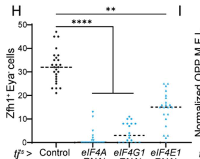

## Question

# Gene Research for Functional Annotation

## ⚠️ CRITICAL: Gene/Protein Identification Context

**BEFORE YOU BEGIN RESEARCH:** You MUST verify you are researching the CORRECT gene/protein. Gene symbols can be ambiguous, especially for less well-characterized genes from non-model organisms.

### Target Gene/Protein Identity (from UniProt):
- **UniProt Accession:** P48598
- **Protein Description:** RecName: Full=Eukaryotic translation initiation factor 4E1; AltName: Full=eIF-4F 25 kDa subunit; AltName: Full=mRNA cap-binding protein {ECO:0000303|PubMed:8663200};
- **Gene Information:** Name=eIF4E1 {ECO:0000312|FlyBase:FBgn0015218}; Synonyms=eIF-4E {ECO:0000303|PubMed:7742371}, Eif4e {ECO:0000303|PubMed:14691132}; ORFNames=CG4035 {ECO:0000312|FlyBase:FBgn0015218};
- **Organism (full):** Drosophila melanogaster (Fruit fly).
- **Protein Family:** Belongs to the eukaryotic initiation factor 4E family.
- **Key Domains:** TIF_eIF4e-like. (IPR023398); TIF_eIF_4E. (IPR001040); TIF_eIF_4E_CS. (IPR019770); IF4E (PF01652)

### MANDATORY VERIFICATION STEPS:

1. **Check if the gene symbol "eIF4E1" matches the protein description above**
2. **Verify the organism is correct:** Drosophila melanogaster (Fruit fly).
3. **Check if protein family/domains align with what you find in literature**
4. **If you find literature for a DIFFERENT gene with the same or similar symbol, STOP**

### If Gene Symbol is Ambiguous or You Cannot Find Relevant Literature:

**DO NOT PROCEED WITH RESEARCH ON A DIFFERENT GENE.** Instead:
- State clearly: "The gene symbol 'eIF4E1' is ambiguous or literature is limited for this specific protein"
- Explain what you found (e.g., "Found extensive literature on a different gene with the same symbol in a different organism")
- Describe the protein based ONLY on the UniProt information provided above
- Suggest that the protein function can be inferred from domain/family information

### Research Target:

Please provide a comprehensive research report on the gene **eIF4E1** (gene ID: eIF4E1, UniProt: P48598) in DROME.

The research report should be a detailed narrative explaining the function, biological processes, and localization of the gene product. Citations should be given for all claims.

You should prioritize authoritative reviews and primary scientific literature when conducting research. You can supplement
this with annotations you find in gene/protein databases, but these can be outdated or inaccurate.

We are specifically interested in the primary function of the gene - for enzymes, what reaction is catalyzed, and what is the substrate specificity? For transporters, what is the substrate? For structural proteins or adapters, what is the broader structural role? For signaling molecules, what is the role in the pathway.

We are interested in where in or outside the cell the gene product carries out its function.

We are also interested in the signaling or biochemical pathways in which the gene functions. We are less interested in broad pleiotropic effects, except where these elucidate the precise role.

Include evidence where possible. We are interested in both experimental evidence as well as inference from structure, evolution, or bioinformatic analysis. Precise studies should be prioritized over high-throughput, where available.

## Output

Question: You are an expert researcher providing comprehensive, well-cited information.

Provide detailed information focusing on:
1. Key concepts and definitions with current understanding
2. Recent developments and latest research (prioritize 2023-2024 sources)
3. Current applications and real-world implementations
4. Expert opinions and analysis from authoritative sources
5. Relevant statistics and data from recent studies

Format as a comprehensive research report with proper citations. Include URLs and publication dates where available.
Always prioritize recent, authoritative sources and provide specific citations for all major claims.

# Gene Research for Functional Annotation

## ⚠️ CRITICAL: Gene/Protein Identification Context

**BEFORE YOU BEGIN RESEARCH:** You MUST verify you are researching the CORRECT gene/protein. Gene symbols can be ambiguous, especially for less well-characterized genes from non-model organisms.

### Target Gene/Protein Identity (from UniProt):
- **UniProt Accession:** P48598
- **Protein Description:** RecName: Full=Eukaryotic translation initiation factor 4E1; AltName: Full=eIF-4F 25 kDa subunit; AltName: Full=mRNA cap-binding protein {ECO:0000303|PubMed:8663200};
- **Gene Information:** Name=eIF4E1 {ECO:0000312|FlyBase:FBgn0015218}; Synonyms=eIF-4E {ECO:0000303|PubMed:7742371}, Eif4e {ECO:0000303|PubMed:14691132}; ORFNames=CG4035 {ECO:0000312|FlyBase:FBgn0015218};
- **Organism (full):** Drosophila melanogaster (Fruit fly).
- **Protein Family:** Belongs to the eukaryotic initiation factor 4E family.
- **Key Domains:** TIF_eIF4e-like. (IPR023398); TIF_eIF_4E. (IPR001040); TIF_eIF_4E_CS. (IPR019770); IF4E (PF01652)

### MANDATORY VERIFICATION STEPS:

1. **Check if the gene symbol "eIF4E1" matches the protein description above**
2. **Verify the organism is correct:** Drosophila melanogaster (Fruit fly).
3. **Check if protein family/domains align with what you find in literature**
4. **If you find literature for a DIFFERENT gene with the same or similar symbol, STOP**

### If Gene Symbol is Ambiguous or You Cannot Find Relevant Literature:

**DO NOT PROCEED WITH RESEARCH ON A DIFFERENT GENE.** Instead:
- State clearly: "The gene symbol 'eIF4E1' is ambiguous or literature is limited for this specific protein"
- Explain what you found (e.g., "Found extensive literature on a different gene with the same symbol in a different organism")
- Describe the protein based ONLY on the UniProt information provided above
- Suggest that the protein function can be inferred from domain/family information

### Research Target:

Please provide a comprehensive research report on the gene **eIF4E1** (gene ID: eIF4E1, UniProt: P48598) in DROME.

The research report should be a detailed narrative explaining the function, biological processes, and localization of the gene product. Citations should be given for all claims.

You should prioritize authoritative reviews and primary scientific literature when conducting research. You can supplement
this with annotations you find in gene/protein databases, but these can be outdated or inaccurate.

We are specifically interested in the primary function of the gene - for enzymes, what reaction is catalyzed, and what is the substrate specificity? For transporters, what is the substrate? For structural proteins or adapters, what is the broader structural role? For signaling molecules, what is the role in the pathway.

We are interested in where in or outside the cell the gene product carries out its function.

We are also interested in the signaling or biochemical pathways in which the gene functions. We are less interested in broad pleiotropic effects, except where these elucidate the precise role.

Include evidence where possible. We are interested in both experimental evidence as well as inference from structure, evolution, or bioinformatic analysis. Precise studies should be prioritized over high-throughput, where available.

# Functional annotation report: *Drosophila melanogaster* eIF4E1

## Identity and scope

The specified UniProt record, [P48598](https://www.uniprot.org/uniprotkb/P48598/entry), identifies the fruit-fly protein **eukaryotic translation initiation factor 4E1** (eIF4E1, conventionally eIF4E-1), encoded by *eIF4E1*/CG4035 (FlyBase FBgn0015218). An independent fly study maps CG4035 to the *eIF4E-1,2* locus: alternative products from that locus include eIF4E-1 and eIF4E-2. Thus, results specifically about eIF4E-1 should not automatically be assigned to eIF4E-2. The protein’s annotated eIF4E-family domains agree with its experimentally established cap-binding activity. Fly eIF4E-3 is a distinct, testis-associated paralog, while eIF4EHP/4E-HP is a distinct family member with different initiation-factor interactions; neither is the subject of this report. The publication establishes the CG4035–eIF4E-1 assignment; the P48598 accession-to-gene cross-reference comes from the UniProt information supplied with the question. (hernandez2005functionalanalysisof pages 2-3, marygold2017thetranslationfactors pages 3-5, tettweiler2012thedistributionof pages 5-6)

## Primary molecular function and site of action

**eIF4E-1 is an mRNA-cap-binding initiation factor, not an enzyme.** Its principal molecular substrate is the **5′ N⁷-methylguanosine cap** of eukaryotic mRNA, conventionally written m⁷GpppN. By recognizing that cap, eIF4E-1 provides the mRNA-binding component of cytoplasmic **eIF4F**; eIF4G supplies a scaffold and eIF4A is its RNA-helicase component. The eIF4E–eIF4G connection links capped mRNA to the wider machinery that recruits the 43S preinitiation complex. eIF4E-1 therefore helps select capped transcripts for **protein-synthesis initiation** rather than catalyzing cap formation, cap removal, RNA transport, or peptide-bond formation. The latter assembly steps are the established eIF4F mechanism, not all separately measured as direct recruitment events by purified fly eIF4E-1. (hernandez2005functionalanalysisof pages 2-3, kinkelin2012crystalstructureof pages 1-2, wang2025signalsfromthe pages 2-4)

The gene-specific biochemical evidence is substantial: recombinant fly eIF4E-1 bound **m⁷GTP-Sepharose**, interacted strongly with fly eIF4G in a yeast two-hybrid assay, and complemented a yeast strain deficient in its own eIF4E. Embryonic fly eIF4F was reported to contain predominantly eIF4E-1 and eIF4G. Sequence comparisons place conserved cap-recognition and eIF4G-binding residues in eIF4E-1’s eIF4E-family fold. These experiments establish binding to a methylguanosine-cap mimic and initiation-factor compatibility, but the cited affinity experiment does **not** measure an equilibrium affinity or establish a numerical preference for m⁷GpppN over every unmethylated cap or uncapped RNA. (hernandez2005functionalanalysisof pages 2-3, hernandez2005functionalanalysisof pages 3-5)

The **main functional compartment is the cytoplasm**, where capped mRNAs are engaged for translation. eIF4E-1 also occurs in **cytoplasmic processing bodies (P-bodies)**, which contain mRNPs associated with translational repression and storage: fly S2-cell imaging detected endogenous eIF4E-1 in these granules, and a 2023 fly P-body review lists eIF4E1 among their observed components. Me31B-containing granules and eIF4E-1 were also reported together in S2 cells. P-body residence should not be mistaken for proof that eIF4E-1 represses every transcript in those granules. Nor should reports of nuclear mRNA-processing or export functions for eIF4E in other organisms be assigned as an established primary function of *fly P48598* without fly-specific experiments. No extracellular site of action is indicated by these studies. (layana2021distinctdomainsof pages 3-5, wilby2023relatingthebiogenesis pages 2-3, meyer2024exploringthedynamics pages 3-4)

## How its activity is regulated

**Competition at the eIF4E-1 protein-interaction surface** determines whether cap recognition leads to initiation. Fly eIF4E-1 bound both eIF4G and fly 4E-BP in comparative assays. Fly **Thor/d4E-BP** is an eIF4E-binding inhibitor: when bound to eIF4E it obstructs eIF4G association; phosphorylation of a 4E-BP favors its release and permits eIF4F formation. This places the cap-binding step downstream of nutrient- and growth-responsive TOR signaling, rather than making eIF4E-1 itself a TOR kinase or a transporter. A fly S2-cell analysis reported insulin-stimulated, rapamycin-sensitive phosphorylation of d4E-BP at Thr46, supporting regulation through the insulin–PI3K–Akt–TOR axis; the detailed phosphorylation sequence should not be presumed identical to that of mammalian 4E-BP1. Separately, published fly genetics identified eIF4E-1 **Ser251** phosphorylation as important for growth, but that observation alone does not establish that TOR directly phosphorylates eIF4E-1. (hernandez2005functionalanalysisof pages 2-3, santalla2022interplaybetweenserca pages 1-2, miron2003characterizationofeif4einteracting pages 165-170, miron2003characterizationofeif4einteracting pages 55-59)

Fly **Cup** illustrates transcript-selective repression using the same cap-binding factor. Cup binds eIF4E at an interface used by eIF4G and can be recruited by 3′-UTR-binding regulators. In the ovary, Bruno binds *oskar* mRNA regulatory elements; Cup associates with Bruno and eIF4E, and disrupting Cup’s eIF4E-binding motif causes **premature Oskar translation**. Independent work connected a Smaug–Cup–eIF4E assembly to repression of maternal *nanos* mRNA. Ovarian RNase-resistant co-immunoprecipitation, GST pull-downs and binding-site mutations support the Cup–eIF4E interaction; the transcript-specific regulator supplies selectivity that cap recognition alone cannot provide. (nakamura2004drosophilacupis pages 2-3, nakamura2004drosophilacupis pages 1-2, nelson2004drosophilacupis pages 2-3, nakamura2004drosophilacupis pages 3-4)

A **2.8 Å Drosophila eIF4E–Cup crystal structure** clarified the physical mechanism: Cup contacts the convex eIF4E surface through a canonical **YXXXXLF** motif and a second, lateral noncanonical site. Structural comparison supports exclusion of eIF4G at these interfaces, explaining how a cap-associated factor can participate in *oskar* repression instead of initiation. Both interfaces lie away from the cap-binding pocket; this is compatible with continued cap association, although the minimal structure does not itself prove cap retention on a repressed full-length mRNA. Mextli, another fly eIF4E-interacting protein, demonstrates that partner choice need not always be inhibitory: structural and competition experiments describe an eIF4E–Mextli binding mode with different sensitivity to competing 4E-BPs, and Mextli has been associated with promotion of cap-dependent translation. (kinkelin2012crystalstructureof pages 1-2, kinkelin2012crystalstructureof pages 5-6, peter2015mextliproteinsuse pages 1-2)

The following evidence summary distinguishes directly tested properties from pathway-level interpretation.

| Function/context | Direct experimental observation | Inference/limitation | Publication (year; DOI URL) |
|---|---|---|---|
| Canonical cap recognition, eIF4F assembly, and essential development | CG4035 was mapped to the *eIF4E-1,2* locus; recombinant eIF4E-1 bound m⁷GTP-Sepharose and interacted strongly with fly eIF4G and 4E-BP in yeast two-hybrid assays. eIF4E-1 complemented yeast lacking endogenous eIF4E, and UAS-*eIF4E1* specifically rescued the embryonic-null fly allele *l(3)67Af* to adulthood. (hernandez2005functionalanalysisof pages 2-3, hernandez2005functionalanalysisof pages 5-7) | Affinity chromatography establishes cap binding but does not quantify selectivity over unmethylated cap or uncapped RNA. eIF4A/eIF3/43S recruitment follows the conserved eIF4F model rather than a direct eIF4E-1-specific recruitment assay. | Hernández et al. (2005); [https://doi.org/10.1016/j.mod.2004.11.011](https://doi.org/10.1016/j.mod.2004.11.011) |
| Cup–Bruno repression of localized *oskar* mRNA | Ovarian co-immunoprecipitation after RNase treatment and GST pull-downs showed RNA-independent Cup–eIF4E binding; disrupting Cup’s eIF4E-binding motif reduced binding and caused premature *oskar* translation. Bruno binds *oskar* 3′-UTR response elements, supporting a 3′-UTR–Cup–cap bridge that excludes eIF4G. (nakamura2004drosophilacupis pages 2-3, nakamura2004drosophilacupis pages 1-2, nakamura2004drosophilacupis pages 3-4) | The studies call the protein Drosophila eIF4E rather than printing accession P48598; assignment to canonical eIF4E-1 is supported by organism-specific context. The cap was not directly visualized in the repression complex. | Nakamura et al. (2004); [https://doi.org/10.1016/S1534-5807(03)00400-3](https://doi.org/10.1016/S1534-5807(03)00400-3) |
| Structural mechanism of Cup-mediated repression | A 2.8 Å crystal structure showed two Cup segments engaging orthogonal eIF4E surfaces: canonical YXXXXLF binding on the convex face and a second lateral, noncanonical interface. Structural comparison predicts that Cup and eIF4G are mutually exclusive at both interfaces; mutations in the second site reduced eIF4E binding and destabilized associated mRNA. (kinkelin2012crystalstructureof pages 1-2, kinkelin2012crystalstructureof pages 5-6) | Both Cup sites lie away from the m⁷G pocket, so cap retention is structurally compatible but was not directly demonstrated in the crystallized minimal complex. | Kinkelin et al. (2012); [https://doi.org/10.1261/rna.033639.112](https://doi.org/10.1261/rna.033639.112) |
| Smaug–Cup repression of maternal *nanos* mRNA | GST capture, tagged-protein purification, cap-column assays, and mutagenesis identified canonical and noncanonical Cup–eIF4E interfaces. Smaug binds Cup, supporting a model in which Smaug recruits Cup to *nanos* 3′-UTR SREs and Cup prevents eIF4G recruitment to cap-bound eIF4E. (nelson2004drosophilacupis pages 3-4, nelson2004drosophilacupis pages 2-3, nelson2009translationalregulationin pages 55-61) | The Smaug–eIF4E connection is bridged by Cup, not a direct Smaug–eIF4E interaction. These excerpts do not directly measure ribosome occupancy or prove that the cap remains bound during repression. | Nelson et al. (2004); [https://doi.org/10.1038/sj.emboj.7600026](https://doi.org/10.1038/sj.emboj.7600026) |
| Cytoplasmic P-body localization and Me31B interaction | Endogenous/tagged eIF4E-1 localized with Me31B in cytoplasmic P bodies in S2 cells. Yeast two-hybrid and acceptor-photobleaching FRET supported physical interaction, with mean eIF4E-1–Me31B FRET efficiency of 36%; Me31B Y401–L407 and eIF4E-1 W117 were required. (layana2021distinctdomainsof pages 3-5, layana2021distinctdomainsof pages 1-3) | The accessible source was a 2021 bioRxiv preprint; a 2023 *Journal of Molecular Biology* report ([https://doi.org/10.1016/j.jmb.2023.167949](https://doi.org/10.1016/j.jmb.2023.167949)) was identified but its full text was unavailable here. P-body localization and proximity do not by themselves prove a particular mRNA-storage or repression outcome. | Layana et al. (2021 preprint); [https://doi.org/10.1101/2021.03.23.436655](https://doi.org/10.1101/2021.03.23.436655); published report (2023), [https://doi.org/10.1016/j.jmb.2023.167949](https://doi.org/10.1016/j.jmb.2023.167949) |
| Adult adipocyte translation and non-cell-autonomous ovarian support | Adipocyte-specific *eIF4E1* RNAi greatly reduced fat-body puromycin labeling. After 10 days, *eIF4E1* knockdown reduced average ovarian germline stem-cell number and increased the proportion of germaria containing zero or one stem cell. (sahu2024translationcomponentsin pages 4-6) | 2024 bioRxiv preprint, not peer reviewed in the retrieved record. No precise eIF4E1-specific effect size was reported in the accessible text, and similar phenotypes followed knockdown of other translation components; this supports a requirement for adipocyte translation, not a unique downstream eIF4E1 pathway. | Sahu & Armstrong (2024 preprint); [https://doi.org/10.1101/2024.08.31.610632](https://doi.org/10.1101/2024.08.31.610632) |
| Testis cyst stem-cell self-renewal downstream of niche signaling | Somatic RNAi against eIF4E1, eIF4A, or eIF4G1 significantly reduced or eliminated Zfh1⁺Eya⁻ cyst stem cells. Negatively marked *eIF4E1* mutant clones were induced normally at 2 days but were not recovered as CySC clones at 7 days; persistence analysis used ≥24 testes and gave *P*<0.001. Mutant cells could differentiate, indicating a cell-autonomous requirement for eIF4F in self-renewal rather than differentiation. (wang2025signalsfromthe pages 5-7, wang2025signalsfromthe pages 7-8, wang2025signalsfromthe media 6cdf4753, wang2025signalsfromthe pages 28-29) | The ≥24-testis statistic applies to the supplementary clone-persistence endpoint; the accessible text does not provide a precise eIF4E1-specific percentage or global-translation effect size. JAK/STAT–CkII–eIF3d1 coupling is the authors’ broader mechanistic model, not evidence that eIF4E1 itself is directly phosphorylated by that pathway. | Wang et al. (2025); [https://doi.org/10.1371/journal.pbio.3003049](https://doi.org/10.1371/journal.pbio.3003049) |

*Table: Direct evidence for canonical Drosophila eIF4E-1/CG4035, separated from paralogs and cross-species findings. Quantitative values apply only to the stated assays and should not be interpreted as unreported eIF4E1-wide effect sizes.*

## Biological processes and current experimental uses

The strongest organism-level evidence concerns **embryonic translation and development**. eIF4E-1 transcript and protein are particularly abundant in **0–3-hour embryos**; expression of an eIF4E-1 transgene rescued the embryonic-null *l(3)67Af* allele to adulthood in the tested genetic setting, whereas the same construct did not rescue five other lethal alleles in that chromosomal region. Early overexpression was also consequential: one driver/temperature regime yielded **20% embryo mortality**, and stronger early expression caused earlier developmental arrest. These results support an essential, dosage-sensitive initiation function, but developmental defects are consequences of altered protein production—not evidence that eIF4E-1 is itself a developmental transcription factor. [Hernández *et al.*, April 2005, *Mechanisms of Development*, https://doi.org/10.1016/j.mod.2004.11.011.] (hernandez2005functionalanalysisof pages 5-7)

Recent studies use *eIF4E1* perturbation to dissect **where cap-dependent initiation matters physiologically**. In a **September 2024 bioRxiv preprint**, adipocyte-specific *eIF4E1* RNAi markedly reduced fat-body puromycin incorporation; after **10 days** it reduced the average number of ovarian germline stem cells and increased the proportion of germaria with zero or one such cell. Similar phenotypes followed knockdown of other translation components, so this is evidence for an adipocyte translation requirement and a non-cell-autonomous ovarian consequence, **not** for a unique eIF4E-1 signaling substrate. The available text does not give an eIF4E1-specific numerical effect size. [Sahu and Armstrong, September 2024, preprint, https://doi.org/10.1101/2024.08.31.610632.] (sahu2024translationcomponentsin pages 4-6)

A **March 2025 peer-reviewed fly study** more directly resolved a cell-autonomous requirement. RNAi against eIF4E1, eIF4A or eIF4G1 reduced or eliminated Zfh1-positive **testis cyst stem cells**; eIF4E1 mutant stem-cell clones failed to persist at the niche while mutant cells could enter the differentiated cyst-cell lineage. In the supplementary clone-persistence analysis, **at least 24 testes** were examined and the change from 2 to 7 days after clone induction was significant (**P < 0.001**); the source does not supply a defensible exact eIF4E1-specific loss percentage in the accessible text. Figure 2H quantifies the reduction following eIF4F-subunit knockdown. Niche-derived **Upd–JAK/STAT** signaling maintains high translation in these stem cells, and the authors propose a **CkII–eIF3d1–eIF4F** initiation-program switch associated with self-renewal versus differentiation. This connects fly eIF4E-1’s biochemical role to a defined tissue context without claiming that eIF4E-1 directly binds JAK, STAT or CkII. [Wang *et al.*, 11 March 2025, *PLOS Biology*, https://doi.org/10.1371/journal.pbio.3003049.] (wang2025signalsfromthe pages 5-7, wang2025signalsfromthe pages 7-8, wang2025signalsfromthe media 6cdf4753, wang2025signalsfromthe pages 28-29, wang2025signalsfromthe pages 18-20)

For P-body biology, an accessible **2021 preprint** reported eIF4E-1–Me31B interaction by yeast two-hybrid and S2-cell FRET (**mean FRET efficiency 36%**) and mapped an eIF4E-1-interacting region of Me31B to **Y401–L407**. A related peer-reviewed paper was published in **2023** under the title *Drosophila Me31B is a dual eIF4E-interacting protein*, but its full text was not accessible in this search; the numerical and residue-specific observations above are therefore attributed to the accessible preprint, rather than presented as independently checked results of the published version. A 2023 expert review cautions that P-body composition is context-dependent and that proximity or co-localization does not establish the fate of a particular mRNA. [Layana *et al.*, March 2021 preprint, https://doi.org/10.1101/2021.03.23.436655; published report, March 2023, https://doi.org/10.1016/j.jmb.2023.167949; Wilby and Weil, August 2023, https://doi.org/10.3390/genes14091675.] (layana2021distinctdomainsof pages 3-5, layana2021distinctdomainsof pages 1-3, wilby2023relatingthebiogenesis pages 2-3, wilby2023relatingthebiogenesis pages 4-5)

**Interpretive boundary.** The 2024 report that some translation can continue through eIF3d when eIF4E is inhibited used **human HeLa cells**, not fly P48598; its approximately **70% reduction in global translation** under its experimental inhibition condition is consequently **not a quantitative property of Drosophila eIF4E1**. Likewise, broad human eIF4E nuclear-export models and findings about fly eIF4E-3 or 4E-HP must not replace the direct fly eIF4E-1 evidence above. The best-supported annotation remains **cytoplasmic 5′-cap recognition and eIF4F-dependent translation initiation, with regulated participation in Cup-associated repressed mRNPs and cytoplasmic P-bodies**. [Roiuk *et al.*, August 2024, *Nature Communications*, https://doi.org/10.1038/s41467-024-51027-z.] (roiuk2024eif4eindependenttranslationis pages 2-3, marygold2017thetranslationfactors pages 3-5, hernandez2005functionalanalysisof pages 2-3, wilby2023relatingthebiogenesis pages 2-3)

References

1. (hernandez2005functionalanalysisof pages 2-3): Greco Hernández, Michael Altmann, José Manuel Sierra, Henning Urlaub, Ruth Diez del Corral, Peter Schwartz, and Rolando Rivera-Pomar. Functional analysis of seven genes encoding eight translation initiation factor 4e (eif4e) isoforms in drosophila. Mechanisms of Development, 122:529-543, Apr 2005. URL: https://doi.org/10.1016/j.mod.2004.11.011, doi:10.1016/j.mod.2004.11.011. This article has 149 citations.

2. (marygold2017thetranslationfactors pages 3-5): Steven J. Marygold, Helen Attrill, and Paul Lasko. The translation factors of<i>drosophila melanogaster</i>. Fly, 11:65-74, Sep 2017. URL: https://doi.org/10.1080/19336934.2016.1220464, doi:10.1080/19336934.2016.1220464. This article has 28 citations and is from a peer-reviewed journal.

3. (tettweiler2012thedistributionof pages 5-6): Gritta Tettweiler, Michelle Kowanda, Paul Lasko, Nahum Sonenberg, and Greco Hernández. The distribution of eif4e-family members across insecta. Comparative and Functional Genomics, 2012:1-15, Jun 2012. URL: https://doi.org/10.1155/2012/960420, doi:10.1155/2012/960420. This article has 22 citations.

4. (kinkelin2012crystalstructureof pages 1-2): Kerstin Kinkelin, Katharina Veith, Marlene Grünwald, and Fulvia Bono. Crystal structure of a minimal eif4e-cup complex reveals a general mechanism of eif4e regulation in translational repression. RNA, 18 9:1624-34, Sep 2012. URL: https://doi.org/10.1261/rna.033639.112, doi:10.1261/rna.033639.112. This article has 81 citations and is from a domain leading peer-reviewed journal.

5. (wang2025signalsfromthe pages 2-4): Ruoxu Wang, Mykola Roiuk, Freya Storer, Aurelio A. Teleman, and Marc Amoyel. Signals from the niche promote distinct modes of translation initiation to control stem cell differentiation and renewal in the drosophila testis. PLOS Biology, 23:e3003049, Mar 2025. URL: https://doi.org/10.1371/journal.pbio.3003049, doi:10.1371/journal.pbio.3003049. This article has 11 citations and is from a highest quality peer-reviewed journal.

6. (hernandez2005functionalanalysisof pages 3-5): Greco Hernández, Michael Altmann, José Manuel Sierra, Henning Urlaub, Ruth Diez del Corral, Peter Schwartz, and Rolando Rivera-Pomar. Functional analysis of seven genes encoding eight translation initiation factor 4e (eif4e) isoforms in drosophila. Mechanisms of Development, 122:529-543, Apr 2005. URL: https://doi.org/10.1016/j.mod.2004.11.011, doi:10.1016/j.mod.2004.11.011. This article has 149 citations.

7. (layana2021distinctdomainsof pages 3-5): Carla Layana, Emiliano Salvador Vilardo, Gonzalo Corujo, Greco Hernández, and Rolando Rivera-Pomar. Distinct domains of me31b interact with different eif4e isoforms in the male germ line of drosophila melanogaster. bioRxiv, Mar 2021. URL: https://doi.org/10.1101/2021.03.23.436655, doi:10.1101/2021.03.23.436655. This article has 0 citations.

8. (wilby2023relatingthebiogenesis pages 2-3): Elise L. Wilby and Timothy T. Weil. Relating the biogenesis and function of p bodies in drosophila to human disease. Genes, 14:1675, Aug 2023. URL: https://doi.org/10.3390/genes14091675, doi:10.3390/genes14091675. This article has 11 citations.

9. (meyer2024exploringthedynamics pages 3-4): Julia Meyer, Marco Payr, Olivier Duss, and Janosch Hennig. Exploring the dynamics of messenger ribonucleoprotein-mediated translation repression. Biochemical Society Transactions, 52:2267-2279, Nov 2024. URL: https://doi.org/10.1042/bst20231240, doi:10.1042/bst20231240. This article has 5 citations and is from a peer-reviewed journal.

10. (santalla2022interplaybetweenserca pages 1-2): Manuela Santalla, Alejandra García, Alicia Mattiazzi, Carlos A. Valverde, Ronja Schiemann, Achim Paululat, Greco Hernández, Heiko Meyer, and Paola Ferrero. Interplay between serca, 4e-bp, and eif4e in the drosophila heart. PLoS ONE, 17:e0267156, May 2022. URL: https://doi.org/10.1371/journal.pone.0267156, doi:10.1371/journal.pone.0267156. This article has 11 citations and is from a peer-reviewed journal.

11. (miron2003characterizationofeif4einteracting pages 165-170): M Miron. Characterization of eif4e-interacting partners from drosophila melanogaster. Unknown journal, 2003.

12. (miron2003characterizationofeif4einteracting pages 55-59): M Miron. Characterization of eif4e-interacting partners from drosophila melanogaster. Unknown journal, 2003.

13. (nakamura2004drosophilacupis pages 2-3): Akira Nakamura, Keiji Sato, and Kazuko Hanyu-Nakamura. Drosophila cup is an eif4e binding protein that associates with bruno and regulates oskar mrna translation in oogenesis. Developmental cell, 6 1:69-78, Jan 2004. URL: https://doi.org/10.1016/s1534-5807(03)00400-3, doi:10.1016/s1534-5807(03)00400-3. This article has 470 citations and is from a highest quality peer-reviewed journal.

14. (nakamura2004drosophilacupis pages 1-2): Akira Nakamura, Keiji Sato, and Kazuko Hanyu-Nakamura. Drosophila cup is an eif4e binding protein that associates with bruno and regulates oskar mrna translation in oogenesis. Developmental cell, 6 1:69-78, Jan 2004. URL: https://doi.org/10.1016/s1534-5807(03)00400-3, doi:10.1016/s1534-5807(03)00400-3. This article has 470 citations and is from a highest quality peer-reviewed journal.

15. (nelson2004drosophilacupis pages 2-3): Meryl R Nelson, Andrew M Leidal, and Craig A Smibert. Drosophila cup is an eif4e‐binding protein that functions in smaug‐mediated translational repression. The EMBO Journal, 23:150-159, Jan 2004. URL: https://doi.org/10.1038/sj.emboj.7600026, doi:10.1038/sj.emboj.7600026. This article has 346 citations.

16. (nakamura2004drosophilacupis pages 3-4): Akira Nakamura, Keiji Sato, and Kazuko Hanyu-Nakamura. Drosophila cup is an eif4e binding protein that associates with bruno and regulates oskar mrna translation in oogenesis. Developmental cell, 6 1:69-78, Jan 2004. URL: https://doi.org/10.1016/s1534-5807(03)00400-3, doi:10.1016/s1534-5807(03)00400-3. This article has 470 citations and is from a highest quality peer-reviewed journal.

17. (kinkelin2012crystalstructureof pages 5-6): Kerstin Kinkelin, Katharina Veith, Marlene Grünwald, and Fulvia Bono. Crystal structure of a minimal eif4e-cup complex reveals a general mechanism of eif4e regulation in translational repression. RNA, 18 9:1624-34, Sep 2012. URL: https://doi.org/10.1261/rna.033639.112, doi:10.1261/rna.033639.112. This article has 81 citations and is from a domain leading peer-reviewed journal.

18. (peter2015mextliproteinsuse pages 1-2): Daniel Peter, Ramona Weber, Carolin Köne, Min-Yi Chung, Linda Ebertsch, Vincent Truffault, Oliver Weichenrieder, Cátia Igreja, and Elisa Izaurralde. Mextli proteins use both canonical bipartite and novel tripartite binding modes to form eif4e complexes that display differential sensitivity to 4e-bp regulation. Genes & Development, 29:1835-1849, Sep 2015. URL: https://doi.org/10.1101/gad.269068.115, doi:10.1101/gad.269068.115. This article has 36 citations and is from a highest quality peer-reviewed journal.

19. (hernandez2005functionalanalysisof pages 5-7): Greco Hernández, Michael Altmann, José Manuel Sierra, Henning Urlaub, Ruth Diez del Corral, Peter Schwartz, and Rolando Rivera-Pomar. Functional analysis of seven genes encoding eight translation initiation factor 4e (eif4e) isoforms in drosophila. Mechanisms of Development, 122:529-543, Apr 2005. URL: https://doi.org/10.1016/j.mod.2004.11.011, doi:10.1016/j.mod.2004.11.011. This article has 149 citations.

20. (nelson2004drosophilacupis pages 3-4): Meryl R Nelson, Andrew M Leidal, and Craig A Smibert. Drosophila cup is an eif4e‐binding protein that functions in smaug‐mediated translational repression. The EMBO Journal, 23:150-159, Jan 2004. URL: https://doi.org/10.1038/sj.emboj.7600026, doi:10.1038/sj.emboj.7600026. This article has 346 citations.

21. (nelson2009translationalregulationin pages 55-61): M Nelson. Translational regulation in the early drosophila embryo. Unknown journal, 2009.

22. (layana2021distinctdomainsof pages 1-3): Carla Layana, Emiliano Salvador Vilardo, Gonzalo Corujo, Greco Hernández, and Rolando Rivera-Pomar. Distinct domains of me31b interact with different eif4e isoforms in the male germ line of drosophila melanogaster. bioRxiv, Mar 2021. URL: https://doi.org/10.1101/2021.03.23.436655, doi:10.1101/2021.03.23.436655. This article has 0 citations.

23. (sahu2024translationcomponentsin pages 4-6): Subhshri Sahu and Alissa Richmond Armstrong. Translation components in adult drosophila melanogaster adipocytes regulate the ovarian germline stem cell lineage. bioRxiv, Sep 2024. URL: https://doi.org/10.1101/2024.08.31.610632, doi:10.1101/2024.08.31.610632. This article has 2 citations.

24. (wang2025signalsfromthe pages 5-7): Ruoxu Wang, Mykola Roiuk, Freya Storer, Aurelio A. Teleman, and Marc Amoyel. Signals from the niche promote distinct modes of translation initiation to control stem cell differentiation and renewal in the drosophila testis. PLOS Biology, 23:e3003049, Mar 2025. URL: https://doi.org/10.1371/journal.pbio.3003049, doi:10.1371/journal.pbio.3003049. This article has 11 citations and is from a highest quality peer-reviewed journal.

25. (wang2025signalsfromthe pages 7-8): Ruoxu Wang, Mykola Roiuk, Freya Storer, Aurelio A. Teleman, and Marc Amoyel. Signals from the niche promote distinct modes of translation initiation to control stem cell differentiation and renewal in the drosophila testis. PLOS Biology, 23:e3003049, Mar 2025. URL: https://doi.org/10.1371/journal.pbio.3003049, doi:10.1371/journal.pbio.3003049. This article has 11 citations and is from a highest quality peer-reviewed journal.

26. (wang2025signalsfromthe media 6cdf4753): Ruoxu Wang, Mykola Roiuk, Freya Storer, Aurelio A. Teleman, and Marc Amoyel. Signals from the niche promote distinct modes of translation initiation to control stem cell differentiation and renewal in the drosophila testis. PLOS Biology, 23:e3003049, Mar 2025. URL: https://doi.org/10.1371/journal.pbio.3003049, doi:10.1371/journal.pbio.3003049. This article has 11 citations and is from a highest quality peer-reviewed journal.

27. (wang2025signalsfromthe pages 28-29): Ruoxu Wang, Mykola Roiuk, Freya Storer, Aurelio A. Teleman, and Marc Amoyel. Signals from the niche promote distinct modes of translation initiation to control stem cell differentiation and renewal in the drosophila testis. PLOS Biology, 23:e3003049, Mar 2025. URL: https://doi.org/10.1371/journal.pbio.3003049, doi:10.1371/journal.pbio.3003049. This article has 11 citations and is from a highest quality peer-reviewed journal.

28. (wang2025signalsfromthe pages 18-20): Ruoxu Wang, Mykola Roiuk, Freya Storer, Aurelio A. Teleman, and Marc Amoyel. Signals from the niche promote distinct modes of translation initiation to control stem cell differentiation and renewal in the drosophila testis. PLOS Biology, 23:e3003049, Mar 2025. URL: https://doi.org/10.1371/journal.pbio.3003049, doi:10.1371/journal.pbio.3003049. This article has 11 citations and is from a highest quality peer-reviewed journal.

29. (wilby2023relatingthebiogenesis pages 4-5): Elise L. Wilby and Timothy T. Weil. Relating the biogenesis and function of p bodies in drosophila to human disease. Genes, 14:1675, Aug 2023. URL: https://doi.org/10.3390/genes14091675, doi:10.3390/genes14091675. This article has 11 citations.

30. (roiuk2024eif4eindependenttranslationis pages 2-3): Mykola Roiuk, Marilena Neff, and Aurelio A. Teleman. Eif4e-independent translation is largely eif3d-dependent. Nature Communications, Aug 2024. URL: https://doi.org/10.1038/s41467-024-51027-z, doi:10.1038/s41467-024-51027-z. This article has 40 citations and is from a highest quality peer-reviewed journal.

## Artifacts

- [Edison artifact artifact-00](eIF4E1-deep-research-falcon_artifacts/artifact-00.md)

## Citations

1. sahu2024translationcomponentsin pages 4-6
2. hernandez2005functionalanalysisof pages 5-7
3. hernandez2005functionalanalysisof pages 2-3
4. marygold2017thetranslationfactors pages 3-5
5. tettweiler2012thedistributionof pages 5-6
6. kinkelin2012crystalstructureof pages 1-2
7. wang2025signalsfromthe pages 2-4
8. hernandez2005functionalanalysisof pages 3-5
9. layana2021distinctdomainsof pages 3-5
10. wilby2023relatingthebiogenesis pages 2-3
11. meyer2024exploringthedynamics pages 3-4
12. santalla2022interplaybetweenserca pages 1-2
13. nakamura2004drosophilacupis pages 2-3
14. nakamura2004drosophilacupis pages 1-2
15. nelson2004drosophilacupis pages 2-3
16. nakamura2004drosophilacupis pages 3-4
17. kinkelin2012crystalstructureof pages 5-6
18. peter2015mextliproteinsuse pages 1-2
19. nelson2004drosophilacupis pages 3-4
20. nelson2009translationalregulationin pages 55-61
21. layana2021distinctdomainsof pages 1-3
22. wang2025signalsfromthe pages 5-7
23. wang2025signalsfromthe pages 7-8
24. wang2025signalsfromthe pages 28-29
25. wang2025signalsfromthe pages 18-20
26. wilby2023relatingthebiogenesis pages 4-5
27. P48598
28. https://doi.org/10.1016/j.mod.2004.11.011
29. https://doi.org/10.1016/S1534-5807(03)00400-3
30. https://doi.org/10.1261/rna.033639.112
31. https://doi.org/10.1038/sj.emboj.7600026
32. https://doi.org/10.1016/j.jmb.2023.167949
33. https://doi.org/10.1101/2021.03.23.436655
34. https://doi.org/10.1101/2024.08.31.610632
35. https://doi.org/10.1371/journal.pbio.3003049
36. Hernández *et al.*, April 2005, *Mechanisms of Development*, https://doi.org/10.1016/j.mod.2004.11.011.
37. Sahu and Armstrong, September 2024, preprint, https://doi.org/10.1101/2024.08.31.610632.
38. Wang *et al.*, 11 March 2025, *PLOS Biology*, https://doi.org/10.1371/journal.pbio.3003049.
39. Layana *et al.*, March 2021 preprint, https://doi.org/10.1101/2021.03.23.436655; published report, March 2023, https://doi.org/10.1016/j.jmb.2023.167949; Wilby and Weil, August 2023, https://doi.org/10.3390/genes14091675.
40. Roiuk *et al.*, August 2024, *Nature Communications*, https://doi.org/10.1038/s41467-024-51027-z.
41. https://www.uniprot.org/uniprotkb/P48598/entry
42. https://doi.org/10.1016/j.mod.2004.11.011](https://doi.org/10.1016/j.mod.2004.11.011
43. https://doi.org/10.1016/S1534-5807(03
44. https://doi.org/10.1261/rna.033639.112](https://doi.org/10.1261/rna.033639.112
45. https://doi.org/10.1038/sj.emboj.7600026](https://doi.org/10.1038/sj.emboj.7600026
46. https://doi.org/10.1016/j.jmb.2023.167949](https://doi.org/10.1016/j.jmb.2023.167949
47. https://doi.org/10.1101/2021.03.23.436655](https://doi.org/10.1101/2021.03.23.436655
48. https://doi.org/10.1101/2024.08.31.610632](https://doi.org/10.1101/2024.08.31.610632
49. https://doi.org/10.1371/journal.pbio.3003049](https://doi.org/10.1371/journal.pbio.3003049
50. https://doi.org/10.1016/j.mod.2004.11.011.]
51. https://doi.org/10.1101/2024.08.31.610632.]
52. https://doi.org/10.1371/journal.pbio.3003049.]
53. https://doi.org/10.1101/2021.03.23.436655;
54. https://doi.org/10.1016/j.jmb.2023.167949;
55. https://doi.org/10.3390/genes14091675.]
56. https://doi.org/10.1038/s41467-024-51027-z.]
57. https://doi.org/10.1016/j.mod.2004.11.011,
58. https://doi.org/10.1080/19336934.2016.1220464,
59. https://doi.org/10.1155/2012/960420,
60. https://doi.org/10.1261/rna.033639.112,
61. https://doi.org/10.1371/journal.pbio.3003049,
62. https://doi.org/10.1101/2021.03.23.436655,
63. https://doi.org/10.3390/genes14091675,
64. https://doi.org/10.1042/bst20231240,
65. https://doi.org/10.1371/journal.pone.0267156,
66. https://doi.org/10.1016/s1534-5807(03
67. https://doi.org/10.1038/sj.emboj.7600026,
68. https://doi.org/10.1101/gad.269068.115,
69. https://doi.org/10.1101/2024.08.31.610632,
70. https://doi.org/10.1038/s41467-024-51027-z,