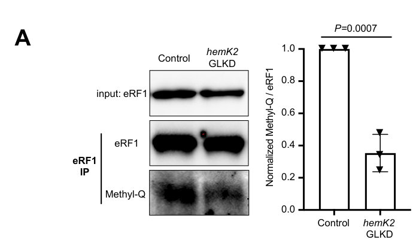

## Question

# Gene Research for Functional Annotation

## ⚠️ CRITICAL: Gene/Protein Identification Context

**BEFORE YOU BEGIN RESEARCH:** You MUST verify you are researching the CORRECT gene/protein. Gene symbols can be ambiguous, especially for less well-characterized genes from non-model organisms.

### Target Gene/Protein Identity (from UniProt):
- **UniProt Accession:** Q9VPH7
- **Protein Description:** RecName: Full=Eukaryotic peptide chain release factor subunit 1; Short=Eukaryotic release factor 1; Short=eRF1;
- **Gene Information:** Name=eRF1; ORFNames=CG5605;
- **Organism (full):** Drosophila melanogaster (Fruit fly).
- **Protein Family:** Belongs to the eukaryotic release factor 1 family.
- **Key Domains:** eFR1_2_sf. (IPR042226); eRF1_1_sf. (IPR024049); eRF1_2. (IPR005141); eRF1_3. (IPR005142); eRF1_Pelota-like_N. (IPR005140)

### MANDATORY VERIFICATION STEPS:

1. **Check if the gene symbol "eRF1" matches the protein description above**
2. **Verify the organism is correct:** Drosophila melanogaster (Fruit fly).
3. **Check if protein family/domains align with what you find in literature**
4. **If you find literature for a DIFFERENT gene with the same or similar symbol, STOP**

### If Gene Symbol is Ambiguous or You Cannot Find Relevant Literature:

**DO NOT PROCEED WITH RESEARCH ON A DIFFERENT GENE.** Instead:
- State clearly: "The gene symbol 'eRF1' is ambiguous or literature is limited for this specific protein"
- Explain what you found (e.g., "Found extensive literature on a different gene with the same symbol in a different organism")
- Describe the protein based ONLY on the UniProt information provided above
- Suggest that the protein function can be inferred from domain/family information

### Research Target:

Please provide a comprehensive research report on the gene **eRF1** (gene ID: eRF1, UniProt: Q9VPH7) in DROME.

The research report should be a detailed narrative explaining the function, biological processes, and localization of the gene product. Citations should be given for all claims.

You should prioritize authoritative reviews and primary scientific literature when conducting research. You can supplement
this with annotations you find in gene/protein databases, but these can be outdated or inaccurate.

We are specifically interested in the primary function of the gene - for enzymes, what reaction is catalyzed, and what is the substrate specificity? For transporters, what is the substrate? For structural proteins or adapters, what is the broader structural role? For signaling molecules, what is the role in the pathway.

We are interested in where in or outside the cell the gene product carries out its function.

We are also interested in the signaling or biochemical pathways in which the gene functions. We are less interested in broad pleiotropic effects, except where these elucidate the precise role.

Include evidence where possible. We are interested in both experimental evidence as well as inference from structure, evolution, or bioinformatic analysis. Precise studies should be prioritized over high-throughput, where available.

## Output

Question: You are an expert researcher providing comprehensive, well-cited information.

Provide detailed information focusing on:
1. Key concepts and definitions with current understanding
2. Recent developments and latest research (prioritize 2023-2024 sources)
3. Current applications and real-world implementations
4. Expert opinions and analysis from authoritative sources
5. Relevant statistics and data from recent studies

Format as a comprehensive research report with proper citations. Include URLs and publication dates where available.
Always prioritize recent, authoritative sources and provide specific citations for all major claims.

# Gene Research for Functional Annotation

## ⚠️ CRITICAL: Gene/Protein Identification Context

**BEFORE YOU BEGIN RESEARCH:** You MUST verify you are researching the CORRECT gene/protein. Gene symbols can be ambiguous, especially for less well-characterized genes from non-model organisms.

### Target Gene/Protein Identity (from UniProt):
- **UniProt Accession:** Q9VPH7
- **Protein Description:** RecName: Full=Eukaryotic peptide chain release factor subunit 1; Short=Eukaryotic release factor 1; Short=eRF1;
- **Gene Information:** Name=eRF1; ORFNames=CG5605;
- **Organism (full):** Drosophila melanogaster (Fruit fly).
- **Protein Family:** Belongs to the eukaryotic release factor 1 family.
- **Key Domains:** eFR1_2_sf. (IPR042226); eRF1_1_sf. (IPR024049); eRF1_2. (IPR005141); eRF1_3. (IPR005142); eRF1_Pelota-like_N. (IPR005140)

### MANDATORY VERIFICATION STEPS:

1. **Check if the gene symbol "eRF1" matches the protein description above**
2. **Verify the organism is correct:** Drosophila melanogaster (Fruit fly).
3. **Check if protein family/domains align with what you find in literature**
4. **If you find literature for a DIFFERENT gene with the same or similar symbol, STOP**

### If Gene Symbol is Ambiguous or You Cannot Find Relevant Literature:

**DO NOT PROCEED WITH RESEARCH ON A DIFFERENT GENE.** Instead:
- State clearly: "The gene symbol 'eRF1' is ambiguous or literature is limited for this specific protein"
- Explain what you found (e.g., "Found extensive literature on a different gene with the same symbol in a different organism")
- Describe the protein based ONLY on the UniProt information provided above
- Suggest that the protein function can be inferred from domain/family information

### Research Target:

Please provide a comprehensive research report on the gene **eRF1** (gene ID: eRF1, UniProt: Q9VPH7) in DROME.

The research report should be a detailed narrative explaining the function, biological processes, and localization of the gene product. Citations should be given for all claims.

You should prioritize authoritative reviews and primary scientific literature when conducting research. You can supplement
this with annotations you find in gene/protein databases, but these can be outdated or inaccurate.

We are specifically interested in the primary function of the gene - for enzymes, what reaction is catalyzed, and what is the substrate specificity? For transporters, what is the substrate? For structural proteins or adapters, what is the broader structural role? For signaling molecules, what is the role in the pathway.

We are interested in where in or outside the cell the gene product carries out its function.

We are also interested in the signaling or biochemical pathways in which the gene functions. We are less interested in broad pleiotropic effects, except where these elucidate the precise role.

Include evidence where possible. We are interested in both experimental evidence as well as inference from structure, evolution, or bioinformatic analysis. Precise studies should be prioritized over high-throughput, where available.

# Functional annotation report: *Drosophila melanogaster* eRF1

**Identity and scope.** The target specified as UniProt **Q9VPH7** is eukaryotic peptide-chain release factor 1, encoded by *D. melanogaster* **eRF1/CG5605**. Independent fly-specific publications confirm the eRF1–CG5605 assignment; a curated inventory identifies human **ETF1** as its ortholog, with **87% protein identity**. Q9VPH7 itself and the supplied InterPro identifiers were provided in the question rather than independently verified in the retrieved publications. This is **not** eRF3/*Elf* (CG6382), the mitochondrial factor mRF1 (CG5705), or the related ribosome-rescue protein Pelota. The supplied eRF1-domain annotations are consistent with the conserved, three-domain eRF1 architecture described below. (marygold2017thetranslationfactors pages 3-5, lasko2000thedrosophilamelanogaster pages 2-3, hellen2018translationterminationand pages 1-3, korostelev2021diversityandsimilarity pages 9-11)

## Primary molecular function and substrate specificity

eRF1 is the **class-I release factor for cytoplasmic translation termination**. When **UAA, UAG, or UGA** reaches the A site of an 80S ribosome, eRF1 recognizes the termination signal and promotes **hydrolysis of the ester bond joining the nascent polypeptide to the P-site tRNA**, releasing the completed peptide. Thus its functional substrate is a *stop-codon-programmed ribosome carrying peptidyl-tRNA*, not free mRNA or a soluble peptide. eRF1 supplies stop recognition and peptide release; its distinct partner eRF3 supplies GTP-dependent assistance. This biochemical assignment is established for eukaryotic eRF1 and is supported specifically in flies by genetic tests of termination fidelity, although the retrieved fly papers do not report purified-CG5605 peptide-release kinetics. (marygold2017thetranslationfactors pages 3-5, hellen2018translationterminationand pages 1-3, chao2003mutationsineukaryotic pages 1-2)

The structural mechanism explains the supplied family/domain annotation. The **N-terminal domain** recognizes the stop codon in the small-subunit decoding center; its conserved GTS, NIKS-containing, and YxCxxxF elements contribute to codon discrimination. The **middle domain** carries the **GGQ motif**, which is positioned in the large-subunit peptidyl-transferase center for peptide release. The **C-terminal domain** participates in contacts with eRF3 and the recycling factor ABCE1. Stop recognition also depends on the nucleotide immediately following the three-base codon: the ribosome–eRF1 complex accommodates a **four-nucleotide termination context**. Residue numbers for the N-domain motifs in structural reviews refer to *human* eRF1, not independently mapped fly residues. (hellen2018translationterminationand pages 1-3, hellen2018translationterminationand pages 3-4)

eRF1 operates with eRF3 and GTP; eRF3 GTP hydrolysis facilitates rearrangement of eRF1 so that its GGQ-containing domain can reach peptidyl-tRNA. Following peptide release, the **ABCE1 ATPase** promotes ribosomal-subunit recycling. Peptide-bond release by eRF1, GTP hydrolysis by eRF3, and ATP-driven ribosome splitting by ABCE1 are **distinct reactions**. The detailed conformational sequence comes principally from structural and biochemical work in other eukaryotes and should not be mistaken for direct measurements on fly Q9VPH7. (hellen2018translationterminationand pages 1-3, hellen2018translationterminationand pages 4-5, korostelev2021diversityandsimilarity pages 9-11)

## Direct evidence in *Drosophila*

The strongest peer-reviewed gene-specific test is Chao and colleagues’ *Genetics* study, published **October 2003** ([DOI](https://doi.org/10.1093/genetics/165.2.601)). Reducing maternal eRF1 activity suppressed **8 of 20** examined nonsense alleles across embryonically acting genes. Suppression was not indiscriminate: strongly responsive premature stops generally had a **cytidine immediately downstream (+4 C)**. An HA-tagged *wingless* nonsense reporter yielded detectable full-length readthrough product even in a wild-type background, with more product after maternal eRF1 reduction. These observations directly link fly eRF1 to suppression of stop-codon readthrough and demonstrate that substrate *sequence context*, as well as UAA/UAG/UGA identity, influences termination efficiency. They do not establish that every native fly stop codon has identical termination kinetics. (chao2003mutationsineukaryotic pages 2-2, chao2003mutationsineukaryotic pages 9-10)

The genetically characterized **eRF1^KY7** allele introduces a Q162 stop and was interpreted as a null because mutant RNA was undetectable and the phenotype was not worsened by a deficiency. Null animals hatched but arrested as first-instar larvae, failed to grow or molt, and died after approximately **7–8 days**; germline mutant clones produced no eggs. These are strong functional and essentiality data, but their developmental phenotypes are consequences of disturbed translation, **not evidence that eRF1 directly signals in a wing-patterning or oogenesis pathway**. (chao2003mutationsineukaryotic pages 4-5, chao2003mutationsineukaryotic pages 9-10)

For clarity, the following table separates fly experiments from conserved-family inference and flags the publication status of newer work.

| Biological claim | Best source/date and assay | Interpretation or limitation |
|---|---|---|
| **Identity:** *D. melanogaster* eRF1 is **CG5605**; its human ortholog is **ETF1**, with 87% protein identity. | Marygold *et al.* (2017), curated translation-factor inventory and orthology analysis (marygold2017thetranslationfactors pages 3-5) | Strong species-specific identity check. **Q9VPH7** is the supplied UniProt identifier and was not independently established by this paper. |
| **Termination fidelity:** reduced eRF1/eRF3 activity suppressed **8 of 20** tested nonsense alleles; strongly suppressed stops generally had **+4 C**. Full-length Wg readthrough product increased after maternal eRF1 reduction. | Chao *et al.* (2003), fly genetics, embryonic phenotyping and immunoblotting (chao2003mutationsineukaryotic pages 2-2, chao2003mutationsineukaryotic pages 9-10) | Direct fly evidence that eRF1 limits stop-codon readthrough. Suppression was context-dependent, and absolute readthrough percentages were not reported. |
| **Essentiality:** eRF1 loss-of-function animals hatched but arrested as first-instar larvae, failed to grow or molt, and died after approximately **7–8 days**; germline-null females produced no eggs. | Chao *et al.* (2003), null alleles, deficiencies and germline clones (chao2003mutationsineukaryotic pages 4-5, chao2003mutationsineukaryotic pages 9-10) | Direct evidence that eRF1 is essential for larval growth and egg formation; these phenotypes do not identify the specific affected transcripts. |
| **Catalytic modification:** HemK2 depletion reduced ovarian eRF1 methylation to approximately **35% of control**; eRF1 **Q185A** was nearly unmethylated in S2 cells. | Xu *et al.* (2024), **bioRxiv preprint**; immunoprecipitation, methyl-Q immunoblotting, immunostaining and mutagenesis (xu2024hemk2functionsfor pages 6-10, xu2024hemk2functionsfor media b49cec4c) | Direct fly evidence identifying Q185 in the GGQ motif as the predominant HemK2-dependent methylation site. Unaffected somatic cells probably contributed residual methylation. |
| **Functional importance of Q185:** wild-type eRF1, but not Q185A, rescued germline eRF1 knockdown; Q185A reduced translation and caused mid-oogenesis arrest, with p53-positive chambers in **more than 80%** of ovarioles. | Xu *et al.* (2024), **bioRxiv preprint**; transgenic rescue, HPG incorporation and ovarian phenotyping (xu2024hemk2functionsfor pages 10-15) | Q185 is functionally essential, but Q185A changes the catalytic residue and abolishes its methylation; the experiment therefore does not isolate methylation from the residue’s intrinsic catalytic role. |
| **Quality-control coupling:** HemK2 knockdown increased disomes approximately **2.1-fold**; knockdown of **ski8** or **pelota**, but not **upf3**, partly restored translation and development. | Xu *et al.* (2024), **bioRxiv preprint**; sucrose-gradient analysis, double knockdowns and HPG assays (xu2024hemk2functionsfor pages 15-19) | Consistent with inefficient release causing ribosome stalling and activating No-Go Decay rather than NMD. Stop-site occupancy and peptide-release kinetics were not measured directly. |
| **Molecular mechanism:** the N domain recognizes UAA, UAG and UGA in the ribosomal A site; the M-domain GGQ motif promotes P-site peptidyl-tRNA hydrolysis; the C domain interacts with eRF3 and ABCE1. | Hellen (2018), authoritative review of structural and biochemical studies in mammalian, yeast and reconstituted eukaryotic systems (hellen2018translationterminationand pages 1-3, hellen2018translationterminationand pages 3-4, hellen2018translationterminationand pages 4-5) | Strong conserved-family mechanism consistent with fly genetics and domain architecture, but not a direct biochemical assay of purified CG5605/Q9VPH7. |
| **Localization:** eRF1 is classified as a cytoplasmic translation factor acting on 80S ribosomes; reduced HPG incorporation was observed directly in **germline-cell cytoplasm** when eRF1 methylation was impaired. | Marygold *et al.* (2017), cytoplasmic-factor classification; Xu *et al.* (2024), **bioRxiv preprint**, cytoplasmic HPG assay (marygold2017thetranslationfactors pages 3-5, xu2024hemk2functionsfor pages 10-15) | Cytosolic ribosomes are the best-supported site of action. HPG localizes protein synthesis rather than eRF1 itself; no definitive whole-animal eRF1 protein-localization map was identified. |

*Table: Evidence supporting the identity, molecular function, localization, essentiality and quality-control connections of Drosophila eRF1/CG5605. Direct fly findings are distinguished from conserved-family inference and the non-peer-reviewed 2024 HemK2 preprint.*

## Where the protein acts

The established site of action is the **cytoplasmic 80S ribosome**, specifically its decoding center and peptidyl-transferase center during translation of cytoplasmic mRNAs. The fly translation-factor inventory classifies eRF1 with cytoplasmic release factors and lists a **different mitochondrial** release factor, mRF1/CG5705. A 2024 fly study measured newly synthesized protein in **ovarian germline-cell cytoplasm** and detected changes in eRF1 methylation in germline cells and cultured S2 cells. Those observations are compatible with cytoplasmic action, but the protein-synthesis assay does **not**, by itself, establish a comprehensive subcellular localization map for eRF1. No evidence retrieved establishes an extracellular signaling function or that CG5605 terminates mitochondrial translation. (marygold2017thetranslationfactors pages 3-5, xu2024hemk2functionsfor pages 10-15, xu2024hemk2functionsfor pages 6-10)

## 2024 development: GGQ modification and RNA surveillance

A **February 2024 bioRxiv preprint** by Xu and colleagues ([DOI](https://doi.org/10.1101/2024.01.29.576963)) provides the most targeted recent fly experiments. Ovarian germline depletion of the methyltransferase **HemK2** reduced measured whole-ovary eRF1 methylation to about **35% of control**; staining localized much of the reduction to germline cells. In S2 cells, replacing the GGQ-motif glutamine **Q185** with alanine nearly abolished detected eRF1 methylation, supporting Q185 as the predominant HemK2-dependent site. eRF1 germline knockdown produced rudimentary, agametic ovaries; wild-type eRF1 rescued the defect, whereas Q185A did not. Q185A expression also diminished protein-synthesis labeling and yielded p53-positive egg chambers in **over 80%** of ovarioles. These results support the importance of the catalytic-region residue and its modification, but **Q185A changes the GGQ residue itself as well as preventing methylation**: it does not cleanly measure the effect of methylation independently of Q185’s intrinsic function. (xu2024hemk2functionsfor pages 6-10, xu2024hemk2functionsfor pages 10-15, xu2024hemk2functionsfor media b49cec4c)

In the same preprint, HemK2 depletion increased **disomes approximately 2.1-fold**. Additional knockdown of **ski8** or **pelota** partly rescued protein synthesis and ovarian development, whereas knockdown of the nonsense-mediated-decay factor **upf3** did not. The authors infer that inefficient eRF1-dependent termination causes ribosome stalling and engages **No-Go Decay**, leading to mRNA loss; the genetic-rescue pattern supports this interpretation, but the study did not directly measure fly eRF1 peptide-release rate at individual stop sites. Pelota acts in stalled-ribosome rescue and lacks eRF1’s peptide-release GGQ motif; it is a connected quality-control factor, **not another name for CG5605**. The 2024 findings are valuable direct fly data but should retain their **preprint**, rather than peer-reviewed, status. (xu2024hemk2functionsfor pages 15-19, korostelev2021diversityandsimilarity pages 9-11)

## Application and research significance

**In flies**, eRF1 loss-of-function alleles serve as experimental **nonsense suppressors**: they expose intrinsically leaky premature stops and can test whether a mutant transcript produces some full-length protein. The *wingless* example demonstrates why such experiments must distinguish readthrough from residual activity of a truncated protein and must consider the downstream nucleotide. These are research uses of fly genetics, not established treatments. (chao2003mutationsineukaryotic pages 9-10, chao2003mutationsineukaryotic pages 10-11)

**Beyond flies**, manipulating competition between eRF1 and near-cognate tRNAs is being investigated for premature-stop-codon suppression. A **March 2024** *Nature Communications* study ([DOI](https://doi.org/10.1038/s41467-024-46703-z)) used published human-cell ribosome-profiling data to model readthrough from stop-codon context and validated predictions using **15 CFTR premature-stop reporter contexts** in HEK293 cells treated with G418. This supports the potential for sequence-informed research on nonsense-suppression therapies; it **did not test Drosophila CG5605** or establish a clinical application for it. (mangkalaphiban2024extendedstopcodon pages 7-8, mangkalaphiban2024extendedstopcodon pages 1-2, mangkalaphiban2024extendedstopcodon pages 10-11)

**Overall assessment.** The most defensible annotation of Q9VPH7/CG5605 is **cytoplasmic, stop-codon-dependent peptidyl-tRNA release during translation termination**. Fly genetics directly validates its role in termination fidelity and organismal viability; 2024 fly experiments implicate HemK2-dependent modification of its GGQ region in efficient protein synthesis and ribosome-associated mRNA surveillance. Atomic details of all-stop-codon recognition and peptide release are strongly conserved-family inferences rather than fly-specific purified-protein measurements. (marygold2017thetranslationfactors pages 3-5, chao2003mutationsineukaryotic pages 9-10, hellen2018translationterminationand pages 1-3, xu2024hemk2functionsfor pages 10-15, xu2024hemk2functionsfor pages 15-19)

References

1. (marygold2017thetranslationfactors pages 3-5): Steven J. Marygold, Helen Attrill, and Paul Lasko. The translation factors of<i>drosophila melanogaster</i>. Fly, 11:65-74, Sep 2017. URL: https://doi.org/10.1080/19336934.2016.1220464, doi:10.1080/19336934.2016.1220464. This article has 28 citations and is from a peer-reviewed journal.

2. (lasko2000thedrosophilamelanogaster pages 2-3): Paul Lasko. The drosophila melanogaster genome: translation factors and rna binding proteins. Journal of Cell Biology, 150:51, Jul 2000. URL: https://doi.org/10.1083/jcb.150.2.f51, doi:10.1083/jcb.150.2.f51. This article has 179 citations and is from a highest quality peer-reviewed journal.

3. (hellen2018translationterminationand pages 1-3): Christopher U.T. Hellen. Translation termination and ribosome recycling in eukaryotes. Cold Spring Harbor perspectives in biology, 10 10:a032656, Oct 2018. URL: https://doi.org/10.1101/cshperspect.a032656, doi:10.1101/cshperspect.a032656. This article has 409 citations and is from a peer-reviewed journal.

4. (korostelev2021diversityandsimilarity pages 9-11): Andrei A. Korostelev. Diversity and similarity of termination and ribosome rescue in bacterial, mitochondrial, and cytoplasmic translation. Biochemistry (Moscow), 86:1107-1121, Sep 2021. URL: https://doi.org/10.1134/s0006297921090066, doi:10.1134/s0006297921090066. This article has 10 citations.

5. (chao2003mutationsineukaryotic pages 1-2): Anna T Chao, Herman A Dierick, Tracie M Addy, and Amy Bejsovec. Mutations in eukaryotic release factors 1 and 3 act as general nonsense suppressors in drosophila. Genetics, 165:601-612, Oct 2003. URL: https://doi.org/10.1093/genetics/165.2.601, doi:10.1093/genetics/165.2.601. This article has 34 citations and is from a domain leading peer-reviewed journal.

6. (hellen2018translationterminationand pages 3-4): Christopher U.T. Hellen. Translation termination and ribosome recycling in eukaryotes. Cold Spring Harbor perspectives in biology, 10 10:a032656, Oct 2018. URL: https://doi.org/10.1101/cshperspect.a032656, doi:10.1101/cshperspect.a032656. This article has 409 citations and is from a peer-reviewed journal.

7. (hellen2018translationterminationand pages 4-5): Christopher U.T. Hellen. Translation termination and ribosome recycling in eukaryotes. Cold Spring Harbor perspectives in biology, 10 10:a032656, Oct 2018. URL: https://doi.org/10.1101/cshperspect.a032656, doi:10.1101/cshperspect.a032656. This article has 409 citations and is from a peer-reviewed journal.

8. (chao2003mutationsineukaryotic pages 2-2): Anna T Chao, Herman A Dierick, Tracie M Addy, and Amy Bejsovec. Mutations in eukaryotic release factors 1 and 3 act as general nonsense suppressors in drosophila. Genetics, 165:601-612, Oct 2003. URL: https://doi.org/10.1093/genetics/165.2.601, doi:10.1093/genetics/165.2.601. This article has 34 citations and is from a domain leading peer-reviewed journal.

9. (chao2003mutationsineukaryotic pages 9-10): Anna T Chao, Herman A Dierick, Tracie M Addy, and Amy Bejsovec. Mutations in eukaryotic release factors 1 and 3 act as general nonsense suppressors in drosophila. Genetics, 165:601-612, Oct 2003. URL: https://doi.org/10.1093/genetics/165.2.601, doi:10.1093/genetics/165.2.601. This article has 34 citations and is from a domain leading peer-reviewed journal.

10. (chao2003mutationsineukaryotic pages 4-5): Anna T Chao, Herman A Dierick, Tracie M Addy, and Amy Bejsovec. Mutations in eukaryotic release factors 1 and 3 act as general nonsense suppressors in drosophila. Genetics, 165:601-612, Oct 2003. URL: https://doi.org/10.1093/genetics/165.2.601, doi:10.1093/genetics/165.2.601. This article has 34 citations and is from a domain leading peer-reviewed journal.

11. (xu2024hemk2functionsfor pages 6-10): Fengmei Xu, Ritsuko Suyama, Toshifumi Inada, Shinichi Kawaguchi, and Toshie Kai. Hemk2 functions for sufficient protein synthesis and rna stability through erf1 methylation during drosophila oogenesis. bioRxiv, Feb 2024. URL: https://doi.org/10.1101/2024.01.29.576963, doi:10.1101/2024.01.29.576963. This article has 7 citations.

12. (xu2024hemk2functionsfor media b49cec4c): Fengmei Xu, Ritsuko Suyama, Toshifumi Inada, Shinichi Kawaguchi, and Toshie Kai. Hemk2 functions for sufficient protein synthesis and rna stability through erf1 methylation during drosophila oogenesis. bioRxiv, Feb 2024. URL: https://doi.org/10.1101/2024.01.29.576963, doi:10.1101/2024.01.29.576963. This article has 7 citations.

13. (xu2024hemk2functionsfor pages 10-15): Fengmei Xu, Ritsuko Suyama, Toshifumi Inada, Shinichi Kawaguchi, and Toshie Kai. Hemk2 functions for sufficient protein synthesis and rna stability through erf1 methylation during drosophila oogenesis. bioRxiv, Feb 2024. URL: https://doi.org/10.1101/2024.01.29.576963, doi:10.1101/2024.01.29.576963. This article has 7 citations.

14. (xu2024hemk2functionsfor pages 15-19): Fengmei Xu, Ritsuko Suyama, Toshifumi Inada, Shinichi Kawaguchi, and Toshie Kai. Hemk2 functions for sufficient protein synthesis and rna stability through erf1 methylation during drosophila oogenesis. bioRxiv, Feb 2024. URL: https://doi.org/10.1101/2024.01.29.576963, doi:10.1101/2024.01.29.576963. This article has 7 citations.

15. (chao2003mutationsineukaryotic pages 10-11): Anna T Chao, Herman A Dierick, Tracie M Addy, and Amy Bejsovec. Mutations in eukaryotic release factors 1 and 3 act as general nonsense suppressors in drosophila. Genetics, 165:601-612, Oct 2003. URL: https://doi.org/10.1093/genetics/165.2.601, doi:10.1093/genetics/165.2.601. This article has 34 citations and is from a domain leading peer-reviewed journal.

16. (mangkalaphiban2024extendedstopcodon pages 7-8): Kotchaphorn Mangkalaphiban, Lianwu Fu, Ming Du, Kari Thrasher, Kim M. Keeling, David M. Bedwell, and Allan Jacobson. Extended stop codon context predicts nonsense codon readthrough efficiency in human cells. Nature Communications, Mar 2024. URL: https://doi.org/10.1038/s41467-024-46703-z, doi:10.1038/s41467-024-46703-z. This article has 51 citations and is from a highest quality peer-reviewed journal.

17. (mangkalaphiban2024extendedstopcodon pages 1-2): Kotchaphorn Mangkalaphiban, Lianwu Fu, Ming Du, Kari Thrasher, Kim M. Keeling, David M. Bedwell, and Allan Jacobson. Extended stop codon context predicts nonsense codon readthrough efficiency in human cells. Nature Communications, Mar 2024. URL: https://doi.org/10.1038/s41467-024-46703-z, doi:10.1038/s41467-024-46703-z. This article has 51 citations and is from a highest quality peer-reviewed journal.

18. (mangkalaphiban2024extendedstopcodon pages 10-11): Kotchaphorn Mangkalaphiban, Lianwu Fu, Ming Du, Kari Thrasher, Kim M. Keeling, David M. Bedwell, and Allan Jacobson. Extended stop codon context predicts nonsense codon readthrough efficiency in human cells. Nature Communications, Mar 2024. URL: https://doi.org/10.1038/s41467-024-46703-z, doi:10.1038/s41467-024-46703-z. This article has 51 citations and is from a highest quality peer-reviewed journal.

## Artifacts

- [Edison artifact artifact-00](eRF1-deep-research-falcon_artifacts/artifact-00.md)

## Citations

1. marygold2017thetranslationfactors pages 3-5
2. lasko2000thedrosophilamelanogaster pages 2-3
3. hellen2018translationterminationand pages 1-3
4. korostelev2021diversityandsimilarity pages 9-11
5. chao2003mutationsineukaryotic pages 1-2
6. hellen2018translationterminationand pages 3-4
7. hellen2018translationterminationand pages 4-5
8. chao2003mutationsineukaryotic pages 2-2
9. chao2003mutationsineukaryotic pages 9-10
10. chao2003mutationsineukaryotic pages 4-5
11. chao2003mutationsineukaryotic pages 10-11
12. mangkalaphiban2024extendedstopcodon pages 7-8
13. mangkalaphiban2024extendedstopcodon pages 1-2
14. mangkalaphiban2024extendedstopcodon pages 10-11
15. DOI
16. https://doi.org/10.1093/genetics/165.2.601
17. https://doi.org/10.1101/2024.01.29.576963
18. https://doi.org/10.1038/s41467-024-46703-z
19. https://doi.org/10.1080/19336934.2016.1220464,
20. https://doi.org/10.1083/jcb.150.2.f51,
21. https://doi.org/10.1101/cshperspect.a032656,
22. https://doi.org/10.1134/s0006297921090066,
23. https://doi.org/10.1093/genetics/165.2.601,
24. https://doi.org/10.1101/2024.01.29.576963,
25. https://doi.org/10.1038/s41467-024-46703-z,