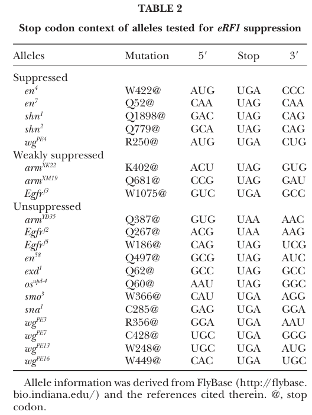

## Question

# Gene Research for Functional Annotation

## ⚠️ CRITICAL: Gene/Protein Identification Context

**BEFORE YOU BEGIN RESEARCH:** You MUST verify you are researching the CORRECT gene/protein. Gene symbols can be ambiguous, especially for less well-characterized genes from non-model organisms.

### Target Gene/Protein Identity (from UniProt):
- **UniProt Accession:** Q9VK85
- **Protein Description:** SubName: Full=Eukaryotic translation release factor 3, isoform A {ECO:0000313|EMBL:AAF53194.1}; SubName: Full=Eukaryotic translation release factor 3, isoform B {ECO:0000313|EMBL:AGB92950.1}; SubName: Full=Eukaryotic translation release factor 3, isoform D {ECO:0000313|EMBL:AHN54388.1};
- **Gene Information:** Name=eRF3 {ECO:0000313|EMBL:AAF53194.1, ECO:0000313|FlyBase:FBgn0020443}; Synonyms=delf {ECO:0000313|EMBL:AAF53194.1}, deRF3 {ECO:0000313|EMBL:AAF53194.1}, Dmel\CG6382 {ECO:0000313|EMBL:AAF53194.1}, DSUP35 {ECO:0000313|EMBL:AAF53194.1}, Dsup35 {ECO:0000313|EMBL:AAF53194.1}, dsup35 {ECO:0000313|EMBL:AAF53194.1}, Elf {ECO:0000313|EMBL:AAF53194.1}, elf {ECO:0000313|EMBL:AAF53194.1}; ORFNames=CG6382 {ECO:0000313|EMBL:AAF53194.1, ECO:0000313|FlyBase:FBgn0020443}, Dmel_CG6382 {ECO:0000313|EMBL:AAF53194.1};
- **Organism (full):** Drosophila melanogaster (Fruit fly).
- **Protein Family:** Belongs to the TRAFAC class translation factor GTPase
- **Key Domains:** EFTu-like_2. (IPR004161); G_TR_CS. (IPR031157); GTP-eEF1A_C. (IPR054696); P-loop_NTPase. (IPR027417); PAM2_motif. (IPR009818)

### MANDATORY VERIFICATION STEPS:

1. **Check if the gene symbol "eRF3" matches the protein description above**
2. **Verify the organism is correct:** Drosophila melanogaster (Fruit fly).
3. **Check if protein family/domains align with what you find in literature**
4. **If you find literature for a DIFFERENT gene with the same or similar symbol, STOP**

### If Gene Symbol is Ambiguous or You Cannot Find Relevant Literature:

**DO NOT PROCEED WITH RESEARCH ON A DIFFERENT GENE.** Instead:
- State clearly: "The gene symbol 'eRF3' is ambiguous or literature is limited for this specific protein"
- Explain what you found (e.g., "Found extensive literature on a different gene with the same symbol in a different organism")
- Describe the protein based ONLY on the UniProt information provided above
- Suggest that the protein function can be inferred from domain/family information

### Research Target:

Please provide a comprehensive research report on the gene **eRF3** (gene ID: eRF3, UniProt: Q9VK85) in DROME.

The research report should be a detailed narrative explaining the function, biological processes, and localization of the gene product. Citations should be given for all claims.

You should prioritize authoritative reviews and primary scientific literature when conducting research. You can supplement
this with annotations you find in gene/protein databases, but these can be outdated or inaccurate.

We are specifically interested in the primary function of the gene - for enzymes, what reaction is catalyzed, and what is the substrate specificity? For transporters, what is the substrate? For structural proteins or adapters, what is the broader structural role? For signaling molecules, what is the role in the pathway.

We are interested in where in or outside the cell the gene product carries out its function.

We are also interested in the signaling or biochemical pathways in which the gene functions. We are less interested in broad pleiotropic effects, except where these elucidate the precise role.

Include evidence where possible. We are interested in both experimental evidence as well as inference from structure, evolution, or bioinformatic analysis. Precise studies should be prioritized over high-throughput, where available.

## Output

Question: You are an expert researcher providing comprehensive, well-cited information.

Provide detailed information focusing on:
1. Key concepts and definitions with current understanding
2. Recent developments and latest research (prioritize 2023-2024 sources)
3. Current applications and real-world implementations
4. Expert opinions and analysis from authoritative sources
5. Relevant statistics and data from recent studies

Format as a comprehensive research report with proper citations. Include URLs and publication dates where available.
Always prioritize recent, authoritative sources and provide specific citations for all major claims.

# Gene Research for Functional Annotation

## ⚠️ CRITICAL: Gene/Protein Identification Context

**BEFORE YOU BEGIN RESEARCH:** You MUST verify you are researching the CORRECT gene/protein. Gene symbols can be ambiguous, especially for less well-characterized genes from non-model organisms.

### Target Gene/Protein Identity (from UniProt):
- **UniProt Accession:** Q9VK85
- **Protein Description:** SubName: Full=Eukaryotic translation release factor 3, isoform A {ECO:0000313|EMBL:AAF53194.1}; SubName: Full=Eukaryotic translation release factor 3, isoform B {ECO:0000313|EMBL:AGB92950.1}; SubName: Full=Eukaryotic translation release factor 3, isoform D {ECO:0000313|EMBL:AHN54388.1};
- **Gene Information:** Name=eRF3 {ECO:0000313|EMBL:AAF53194.1, ECO:0000313|FlyBase:FBgn0020443}; Synonyms=delf {ECO:0000313|EMBL:AAF53194.1}, deRF3 {ECO:0000313|EMBL:AAF53194.1}, Dmel\CG6382 {ECO:0000313|EMBL:AAF53194.1}, DSUP35 {ECO:0000313|EMBL:AAF53194.1}, Dsup35 {ECO:0000313|EMBL:AAF53194.1}, dsup35 {ECO:0000313|EMBL:AAF53194.1}, Elf {ECO:0000313|EMBL:AAF53194.1}, elf {ECO:0000313|EMBL:AAF53194.1}; ORFNames=CG6382 {ECO:0000313|EMBL:AAF53194.1, ECO:0000313|FlyBase:FBgn0020443}, Dmel_CG6382 {ECO:0000313|EMBL:AAF53194.1};
- **Organism (full):** Drosophila melanogaster (Fruit fly).
- **Protein Family:** Belongs to the TRAFAC class translation factor GTPase
- **Key Domains:** EFTu-like_2. (IPR004161); G_TR_CS. (IPR031157); GTP-eEF1A_C. (IPR054696); P-loop_NTPase. (IPR027417); PAM2_motif. (IPR009818)

### MANDATORY VERIFICATION STEPS:

1. **Check if the gene symbol "eRF3" matches the protein description above**
2. **Verify the organism is correct:** Drosophila melanogaster (Fruit fly).
3. **Check if protein family/domains align with what you find in literature**
4. **If you find literature for a DIFFERENT gene with the same or similar symbol, STOP**

### If Gene Symbol is Ambiguous or You Cannot Find Relevant Literature:

**DO NOT PROCEED WITH RESEARCH ON A DIFFERENT GENE.** Instead:
- State clearly: "The gene symbol 'eRF3' is ambiguous or literature is limited for this specific protein"
- Explain what you found (e.g., "Found extensive literature on a different gene with the same symbol in a different organism")
- Describe the protein based ONLY on the UniProt information provided above
- Suggest that the protein function can be inferred from domain/family information

### Research Target:

Please provide a comprehensive research report on the gene **eRF3** (gene ID: eRF3, UniProt: Q9VK85) in DROME.

The research report should be a detailed narrative explaining the function, biological processes, and localization of the gene product. Citations should be given for all claims.

You should prioritize authoritative reviews and primary scientific literature when conducting research. You can supplement
this with annotations you find in gene/protein databases, but these can be outdated or inaccurate.

We are specifically interested in the primary function of the gene - for enzymes, what reaction is catalyzed, and what is the substrate specificity? For transporters, what is the substrate? For structural proteins or adapters, what is the broader structural role? For signaling molecules, what is the role in the pathway.

We are interested in where in or outside the cell the gene product carries out its function.

We are also interested in the signaling or biochemical pathways in which the gene functions. We are less interested in broad pleiotropic effects, except where these elucidate the precise role.

Include evidence where possible. We are interested in both experimental evidence as well as inference from structure, evolution, or bioinformatic analysis. Precise studies should be prioritized over high-throughput, where available.

# Functional annotation of *Drosophila melanogaster* eRF3 (UniProt Q9VK85)

## Identity and evidence standard

**The target is the fruit-fly translation release factor eRF3, encoded by *CG6382*, also called *Elf* or *dsup35*—not the related GTPase Hbs1 and not human GSPT1.** A FlyBase-informed catalog explicitly places *CG6382/Elf* among *D. melanogaster* cytoplasmic release factors and identifies human GSPT1 as an ortholog with 59% protein identity. The Q9VK85 accession and FBgn0020443 identifier are supplied in the question; the cited catalog confirms the gene-name/CG-number/species combination but does not independently print those accessions. Hbs1 instead works with Pelota in stalled-ribosome surveillance and is a distinct fly protein. (marygold2017thetranslationfactors pages 3-5, marygold2017thetranslationfactors pages 2-3, tempro2026visualsystemfunction pages 1-2)

The supplied Q9VK85 annotations—TRAFAC translation-factor GTPase, P-loop/GTPase-associated and eEF1A-like domains, and a PAM2 motif—are consistent with this assignment. Their functional interpretation must nevertheless be distinguished from direct biochemical measurements on purified fly eRF3: notably, the conserved GTP-binding region has been tested genetically in flies, whereas the best-resolved PAM2–poly(A)-binding protein interaction was studied with **human** proteins. (chao2003mutationsineukaryotic pages 6-7, kozlov2010molecularbasisof pages 2-3, kozlov2010molecularbasisof pages 5-6)

## Primary molecular function: GTP-dependent translation termination

**eRF3 is a cytoplasmic, ribosome-associated translation-termination GTPase.** When a translating ribosome reaches a stop codon, eRF1 recognizes UAA, UAG or UGA and catalyzes hydrolysis of the bond joining the completed peptide to its P-site tRNA. eRF3 promotes efficient eRF1-dependent termination through a GTP-dependent step; it is **not** the factor that directly recognizes a particular stop triplet or catalyzes peptidyl-tRNA hydrolysis. Its immediate nucleotide substrate is **GTP**, hydrolyzed to GDP and inorganic phosphate as part of its translation-factor cycle. Accordingly, the relevant biological substrate is the **stop-codon-containing cytoplasmic ribosome–mRNA–peptidyl-tRNA complex**, rather than one particular mRNA sequence. Conserved mechanism supports this description, although a fly-Q9VK85-specific GTP hydrolysis rate or affinity was not established in the retrieved studies. (marygold2017thetranslationfactors pages 3-5, chao2003mutationsineukaryotic pages 1-2)

The strongest direct test of the fly protein is the *eRF3*^LR16^ nonsense-suppressor allele. It changes conserved glycine **G282 to aspartate** in the GTP-binding region; an insertion allele at *Elf* was genetically allelic to LR16. The authors predicted impaired GTPase activity from the substitution and showed impaired termination genetically, but did **not** directly measure G282D enzymatic activity. The fly genetics therefore establishes that an intact eRF3 GTPase region matters for termination without defining its kinetic mechanism in vitro. (chao2003mutationsineukaryotic pages 6-7)

### Direct readthrough evidence and stop-site specificity

Chao and colleagues isolated the allele in a screen for suppression of the premature UGA codon in *wingless* (*wg*^PE4^). Reducing maternal release-factor function restored aspects of embryonic Wingless activity; combined eRF1 and eRF3 mutations strengthened suppression, whereas another *wingless* nonsense allele, *wg*^PE13^, was not suppressed. Immunoblotting detected approximately **2.0-fold more full-length Wg product** from a *wg*^PE4^ reporter in the maternal eRF3-mutant background. This is direct evidence that fly eRF3 normally limits readthrough at susceptible premature stops; it is not evidence for uniform readthrough at all stops. (chao2003mutationsineukaryotic pages 3-4, chao2003mutationsineukaryotic pages 8-9, chao2003mutationsineukaryotic media b329439f)

Across **20** molecularly characterized nonsense alleles, **8** were suppressed. Responding alleles included UAG and UGA stops and commonly had a **cytidine immediately after the stop codon**—the +4 nucleotide. These results indicate that both the stop triplet and its surrounding mRNA context affect the competition between termination and continued translation. They do not define an eRF3-specific preference for UAG versus UGA: eRF1 performs stop recognition, and a +4 C is a context association rather than a sufficient rule for suppression. Homozygous release-factor mutants arrest as larvae, underscoring the importance of reliable termination for development. Chao *et al.*, **October 2003**, *Genetics*: https://doi.org/10.1093/genetics/165.2.601. (chao2003mutationsineukaryotic pages 2-2, chao2003mutationsineukaryotic pages 9-10, chao2003mutationsineukaryotic pages 1-2, chao2003mutationsineukaryotic media b329439f)

The principal findings and their evidentiary limits are collected below.

| Process or finding | Evidence and exact figures | Interpretation and limits |
|---|---|---|
| **Identity and canonical role** | The fly translation-factor catalog identifies **eRF3 = Elf = CG6382**, a single-copy cytoplasmic release factor whose closest human ortholog is GSPT1 (**59% protein identity**). eRF3 enhances eRF1-mediated peptide release in a GTP-dependent manner. (marygold2017thetranslationfactors pages 3-5) | Strong annotation and genetic evidence supports Q9VK85 as the *D. melanogaster* cytoplasmic translation-termination GTPase. The catalog does not independently list UniProt Q9VK85 or FBgn0020443. |
| **GTPase-dependent termination** | The **eRF3^LR16** allele encodes **G282D** in the conserved GTP-binding region; a P-element insertion in *Elf* was allelic to LR16. Both mutations impaired termination, producing nonsense suppression. (chao2003mutationsineukaryotic pages 6-7) | Direct fly genetics connects the conserved GTPase region to termination. G282D was predicted to impair GTPase activity, but purified Q9VK85 catalytic rates, GTP affinity, and substrate specificity were not measured. |
| **Stop-codon readthrough** | Maternal reduction of eRF3/eRF1 suppressed **8 of 20** characterized nonsense alleles. Suppression affected UGA and UAG codons but was context dependent; responsive alleles commonly had cytidine at **+4**. (chao2003mutationsineukaryotic pages 9-10, chao2003mutationsineukaryotic pages 2-2, chao2003mutationsineukaryotic pages 1-2) | eRF3 promotes efficient termination rather than recognizing one stop codon selectively; eRF1 recognizes UAA, UAG, and UGA. The fly evidence concerns premature-stop reporters and does not establish equal effects at normal stop codons. |
| **Biochemical readthrough output** | In embryos from eRF3-mutant mothers, full-length Wingless produced from the *wg^PE4* nonsense reporter increased approximately **2.0-fold**; *wg^PE13* was not suppressed. (chao2003mutationsineukaryotic pages 8-9, chao2003mutationsineukaryotic media b329439f) | Supports increased translational readthrough at a susceptible context, not generalized restoration of every nonsense allele. |
| **Developmental requirement** | eRF3 mutations caused dominant maternal-effect nonsense suppression but homozygous zygotic mutants arrested before the first larval molt, survived for about a week, and failed to grow. (chao2003mutationsineukaryotic pages 9-10, chao2003mutationsineukaryotic pages 1-2) | Indicates that substantial eRF3 loss is incompatible with normal development, consistent with an essential general translation function. It limits whole-animal use of strong eRF3 inhibition. |
| **Testis depletion and meiosis** | The *dsup35^63D* mutation reduced Dsup35/eRF3 protein in testes to **5–10%** of wild-type while carcass levels remained near normal. Depletion disrupted spindle assembly, chromosome segregation, and cytokinesis. (basu1998depletionofa pages 9-13, basu1998depletionofa pages 13-14) | Strong tissue-depletion/phenotype association, but the experiments did not prove that eRF3 is a structural spindle protein; impaired synthesis of spindle components remained an alternative explanation. |
| **Quantified meiotic phenotypes** | More than **80%** of scored mutant anaphases lacked a normal central spindle or had a severely disorganized one; **29.1%** of onion-stage spermatids were abnormal. (basu1998depletionofa pages 5-7) | Demonstrates a major requirement during spermatogenesis. Whether this is secondary to defective translation termination or reflects an additional direct meiotic function remains unresolved. |
| **Observed subcellular distribution** | Testis immunostaining showed diffuse signal in germ cells and one, occasionally two, prominent **nucleoplasmic foci** in mature primary spermatocytes; the foci disappeared during meiosis and were absent from spermatids. No enrichment on asters or spindles was demonstrated. (basu1998depletionofa pages 14-16, basu1998depletionofa pages 9-13, basu1998depletionofa pages 1-2) | Canonical activity is expected on cytoplasmic translating ribosomes, but the spermatocyte nuclear foci are an experimentally observed, tissue-specific localization of unknown identity and function. They do not establish nuclear translation or direct microtubule binding. |
| **PABP interaction through PAM2** | Q9VK85 is annotated with a PAM2 motif, but the structural evidence used **human** eRF3 peptides (residues 67–81 and 76–90) bound to the **human PABPC1 MLLE domain**; the interaction had low-micromolar affinity. (kozlov2010molecularbasisof pages 2-3, kozlov2010molecularbasisof pages 5-6, kozlov2010molecularbasisof pages 1-2) | PABP binding is mechanistically plausible by conserved-domain inference, but direct binding of fly Q9VK85 to fly PABP—and its affinity or physiological consequence—has not been demonstrated by these structures. |
| **Nonsense-mediated mRNA decay** | In fly cells, depletion of UPF1/UPF2 increased premature-stop *adh* reporters approximately **4–5-fold**; depletion of UPF3, SMG1, SMG5, or SMG6 increased *adh-n4* by **2.8–6-fold**. These experiments did **not** directly perturb eRF3. (gatfield2003nonsense‐mediatedmrnadecay pages 2-3, gatfield2003nonsense‐mediatedmrnadecay pages 3-5) | eRF3 likely provides the termination event at which NMD can be initiated, but the cited fly data establish requirements for NMD factors, not a Q9VK85-specific decay or SMG6-cleavage function. eRF3 is a termination GTPase; SMG6 is the candidate endonuclease. |
| **Recent poly(A)-dependent termination research** | A 2024 study in **human translation systems** found that longer poly(A) tails increased release-factor binding and peptidyl-tRNA hydrolysis and proposed a special role for a **75-nt** tail in a double closed-loop mRNA structure. (biziaev2024theimpactof pages 1-2) | Current mechanistic context supports PABP–eRF3 coupling, but these measurements were not made with fly Q9VK85 and should not be reported as a demonstrated *Drosophila* mechanism. |

*Table: Evidence is ranked by direct relevance to Q9VK85/CG6382, separating fly genetics and localization from cross-species mechanistic inference. Exact quantitative findings and major evidentiary limits are shown together.*

## Cellular location and other biological processes

**The established site of its primary function is the cytoplasmic translating ribosome**, as indicated by its designation as a cytoplasmic rather than mitochondrial release factor and by its translation-termination phenotype. This designation describes where termination occurs; it should not be taken to mean that the protein is exclusively cytoplasmic in every cell. Marygold, Attrill and Lasko, **2017**, *Fly*: https://doi.org/10.1080/19336934.2016.1220464. (marygold2017thetranslationfactors pages 3-5, marygold2017thetranslationfactors pages 2-3, chao2003mutationsineukaryotic pages 1-2)

Indeed, antibody staining in testes detected diffuse eRF3/Dsup35 signal in germ cells and **one or occasionally two prominent nucleoplasmic foci in mature primary spermatocytes**. The foci were transient, disappeared during meiosis, and were not identified molecularly. The investigators did **not** observe convincing enrichment on meiotic asters or spindles. These observations establish a testis-specific nuclear localization but do not establish nuclear translation, a nuclear biochemical function, or direct attachment to microtubules. (basu1998depletionofa pages 14-16, basu1998depletionofa pages 9-13, basu1998depletionofa pages 1-2)

A testis-expression mutation reduced Dsup35 protein to **5–10% of wild-type levels in testes**, with near-normal levels in the remaining carcass. Mutant spermatocytes exhibited impaired spindle assembly and stability, chromosome segregation, and cytokinesis; **more than 80%** of scored mutant anaphases had absent or severely disorganized central spindles, and **29.1%** of onion-stage spermatids were abnormal. This firmly associates eRF3 availability with normal male meiosis, but the authors explicitly could not distinguish an indirect consequence of disrupted protein synthesis from an additional, direct meiotic activity. It would therefore be premature to annotate eRF3 as a structural spindle protein. Basu *et al.*, **1998**, *Cell Motility and the Cytoskeleton*: https://doi.org/10.1002/(sici)1097-0169(1998)39:4%3C286::aid-cm4%3E3.0.co;2-1. (basu1998depletionofa pages 9-13, basu1998depletionofa pages 13-14, basu1998depletionofa pages 5-7, basu1998depletionofa pages 14-16)

## Interfaces with mRNA fate: supported mechanisms versus fly-specific inference

The annotated **PAM2 motif** provides a plausible means for eRF3 to engage cytoplasmic poly(A)-binding protein (PABP), potentially connecting the terminating ribosome to the poly(A)-bound messenger ribonucleoprotein. Structural studies showed that overlapping PAM2 peptides from **human eRF3** bind the MLLE/PABC domain of **human PABPC1**; these are informative about molecular compatibility but are **not a direct demonstration of binding, affinity, or functional consequence for fly Q9VK85 and fly PABP**. Kozlov and Gehring, **April 2010**, *PLOS ONE*: https://doi.org/10.1371/journal.pone.0010169. (kozlov2010molecularbasisof pages 2-3, kozlov2010molecularbasisof pages 5-6, kozlov2010molecularbasisof pages 1-2)

Termination can also be the entry point for **nonsense-mediated mRNA decay (NMD)** when a stop occurs prematurely. Fly reporter experiments directly demonstrated that depletion of UPF1 or UPF2 increased premature-stop *adh* mRNAs approximately **4–5-fold**; depletion of other NMD factors, including SMG6, also increased a reporter. Those experiments establish an active fly NMD pathway, **not** a directly measured interaction between Q9VK85 and UPF1 or a requirement for Q9VK85 in reporter degradation. In particular, eRF3 is the termination GTPase, not the RNA-cleaving enzyme. Gatfield *et al.*, **August 2003**, *The EMBO Journal*: https://doi.org/10.1093/emboj/cdg371. (gatfield2003nonsense‐mediatedmrnadecay pages 2-3, gatfield2003nonsense‐mediatedmrnadecay pages 3-5, gatfield2003nonsense‐mediatedmrnadecay pages 1-2)

## Recent research and practical interpretation

Recent work clarifies the *context* of eRF3 function without replacing the fly-specific genetic evidence. In **June 2024**, experiments on **human** translation found that longer mRNA poly(A) tails increased release-factor association with ribosomes and peptidyl-tRNA hydrolysis; the authors proposed a role for a **75-nucleotide tail** in coupling initiation and termination. This supports investigation of PABP-linked termination in flies, but its quantitative results were **not measured on Q9VK85**. Biziaev *et al.*, *Nucleic Acids Research*: https://doi.org/10.1093/nar/gkae510. (biziaev2024theimpactof pages 1-2)

For applications, the fly *eRF3*^LR16^ allele is a **research tool for detecting context-dependent, leaky nonsense alleles** and testing whether a premature stop can yield functional full-length protein. Its lethality and incomplete allele coverage caution against treating global eRF3 inhibition as a selective rescue method. In **2024**, readthrough-inducing antisense oligonucleotides promoted sequence-dependent full-length protein production in **mammalian lysate**, while human-cell readthrough models identified stop identity and the +4 nucleotide as strong predictors. These approaches illustrate how stop-context knowledge could guide targeted readthrough experiments, but neither study validated a Q9VK85-directed intervention in flies; the antisense study also called for validation in intact cells and animals. Susorov *et al.*, **July 2024**, *Nucleic Acids Research*: https://doi.org/10.1093/nar/gkae624; Mangkalaphiban *et al.*, **March 2024**, *Nature Communications*: https://doi.org/10.1038/s41467-024-46703-z. (chao2003mutationsineukaryotic pages 9-10, susorov2024mrnaspecificreadthroughof pages 13-14, mangkalaphiban2024extendedstopcodon pages 2-4, mangkalaphiban2024extendedstopcodon pages 1-2)

**Overall annotation:** Q9VK85/*CG6382/Elf* is best annotated primarily as the **cytoplasmic, eRF1-associated translation-termination GTPase that promotes accurate peptide release at all three standard stop codons**. Its GTPase-region requirement, context-dependent nonsense suppression, developmental necessity and testis-localization/meiotic phenotypes have direct fly evidence. Direct fly biochemical measurements of GTP hydrolysis, PAM2–PABP binding, an eRF3-specific NMD role, and the mechanism of the spermatocyte nuclear foci remain unresolved. (marygold2017thetranslationfactors pages 3-5, chao2003mutationsineukaryotic pages 6-7, chao2003mutationsineukaryotic pages 9-10, basu1998depletionofa pages 14-16, kozlov2010molecularbasisof pages 2-3, gatfield2003nonsense‐mediatedmrnadecay pages 2-3)

References

1. (marygold2017thetranslationfactors pages 3-5): Steven J. Marygold, Helen Attrill, and Paul Lasko. The translation factors of<i>drosophila melanogaster</i>. Fly, 11:65-74, Sep 2017. URL: https://doi.org/10.1080/19336934.2016.1220464, doi:10.1080/19336934.2016.1220464. This article has 28 citations and is from a peer-reviewed journal.

2. (marygold2017thetranslationfactors pages 2-3): Steven J. Marygold, Helen Attrill, and Paul Lasko. The translation factors of<i>drosophila melanogaster</i>. Fly, 11:65-74, Sep 2017. URL: https://doi.org/10.1080/19336934.2016.1220464, doi:10.1080/19336934.2016.1220464. This article has 28 citations and is from a peer-reviewed journal.

3. (tempro2026visualsystemfunction pages 1-2): Katherine Tempro, Inês Lago-Baldaia, Narayanan Nampoothiri V P, Christopher Garbark, Abby J Carney, Vilaiwan M Fernandes, and Deepika Vasudevan. Visual system function requires translational regulation of atf4 by hbs1-pelo. EMBO Reports, 27:5121-5142, Jul 2026. URL: https://doi.org/10.1038/s44319-026-00882-6, doi:10.1038/s44319-026-00882-6. This article has 0 citations and is from a highest quality peer-reviewed journal.

4. (chao2003mutationsineukaryotic pages 6-7): Anna T Chao, Herman A Dierick, Tracie M Addy, and Amy Bejsovec. Mutations in eukaryotic release factors 1 and 3 act as general nonsense suppressors in drosophila. Genetics, 165:601-612, Oct 2003. URL: https://doi.org/10.1093/genetics/165.2.601, doi:10.1093/genetics/165.2.601. This article has 34 citations and is from a domain leading peer-reviewed journal.

5. (kozlov2010molecularbasisof pages 2-3): Guennadi Kozlov and Kalle Gehring. Molecular basis of erf3 recognition by the mlle domain of poly(a)-binding protein. PLoS ONE, 5:e10169, Apr 2010. URL: https://doi.org/10.1371/journal.pone.0010169, doi:10.1371/journal.pone.0010169. This article has 83 citations and is from a peer-reviewed journal.

6. (kozlov2010molecularbasisof pages 5-6): Guennadi Kozlov and Kalle Gehring. Molecular basis of erf3 recognition by the mlle domain of poly(a)-binding protein. PLoS ONE, 5:e10169, Apr 2010. URL: https://doi.org/10.1371/journal.pone.0010169, doi:10.1371/journal.pone.0010169. This article has 83 citations and is from a peer-reviewed journal.

7. (chao2003mutationsineukaryotic pages 1-2): Anna T Chao, Herman A Dierick, Tracie M Addy, and Amy Bejsovec. Mutations in eukaryotic release factors 1 and 3 act as general nonsense suppressors in drosophila. Genetics, 165:601-612, Oct 2003. URL: https://doi.org/10.1093/genetics/165.2.601, doi:10.1093/genetics/165.2.601. This article has 34 citations and is from a domain leading peer-reviewed journal.

8. (chao2003mutationsineukaryotic pages 3-4): Anna T Chao, Herman A Dierick, Tracie M Addy, and Amy Bejsovec. Mutations in eukaryotic release factors 1 and 3 act as general nonsense suppressors in drosophila. Genetics, 165:601-612, Oct 2003. URL: https://doi.org/10.1093/genetics/165.2.601, doi:10.1093/genetics/165.2.601. This article has 34 citations and is from a domain leading peer-reviewed journal.

9. (chao2003mutationsineukaryotic pages 8-9): Anna T Chao, Herman A Dierick, Tracie M Addy, and Amy Bejsovec. Mutations in eukaryotic release factors 1 and 3 act as general nonsense suppressors in drosophila. Genetics, 165:601-612, Oct 2003. URL: https://doi.org/10.1093/genetics/165.2.601, doi:10.1093/genetics/165.2.601. This article has 34 citations and is from a domain leading peer-reviewed journal.

10. (chao2003mutationsineukaryotic media b329439f): Anna T Chao, Herman A Dierick, Tracie M Addy, and Amy Bejsovec. Mutations in eukaryotic release factors 1 and 3 act as general nonsense suppressors in drosophila. Genetics, 165:601-612, Oct 2003. URL: https://doi.org/10.1093/genetics/165.2.601, doi:10.1093/genetics/165.2.601. This article has 34 citations and is from a domain leading peer-reviewed journal.

11. (chao2003mutationsineukaryotic pages 2-2): Anna T Chao, Herman A Dierick, Tracie M Addy, and Amy Bejsovec. Mutations in eukaryotic release factors 1 and 3 act as general nonsense suppressors in drosophila. Genetics, 165:601-612, Oct 2003. URL: https://doi.org/10.1093/genetics/165.2.601, doi:10.1093/genetics/165.2.601. This article has 34 citations and is from a domain leading peer-reviewed journal.

12. (chao2003mutationsineukaryotic pages 9-10): Anna T Chao, Herman A Dierick, Tracie M Addy, and Amy Bejsovec. Mutations in eukaryotic release factors 1 and 3 act as general nonsense suppressors in drosophila. Genetics, 165:601-612, Oct 2003. URL: https://doi.org/10.1093/genetics/165.2.601, doi:10.1093/genetics/165.2.601. This article has 34 citations and is from a domain leading peer-reviewed journal.

13. (basu1998depletionofa pages 9-13): Joydeep Basu, Byron C. Williams, ZeXiao Li, Erika V. Williams, and Michael L. Goldberg. Depletion of a drosophila homolog of yeast sup35p disrupts spindle assembly, chromosome segregation, and cytokinesis during male meiosis. Cell motility and the cytoskeleton, 39 4:286-302, Jan 1998. URL: https://doi.org/10.1002/(sici)1097-0169(1998)39:4<286::aid-cm4>3.0.co;2-1, doi:10.1002/(sici)1097-0169(1998)39:4<286::aid-cm4>3.0.co;2-1. This article has 67 citations.

14. (basu1998depletionofa pages 13-14): Joydeep Basu, Byron C. Williams, ZeXiao Li, Erika V. Williams, and Michael L. Goldberg. Depletion of a drosophila homolog of yeast sup35p disrupts spindle assembly, chromosome segregation, and cytokinesis during male meiosis. Cell motility and the cytoskeleton, 39 4:286-302, Jan 1998. URL: https://doi.org/10.1002/(sici)1097-0169(1998)39:4<286::aid-cm4>3.0.co;2-1, doi:10.1002/(sici)1097-0169(1998)39:4<286::aid-cm4>3.0.co;2-1. This article has 67 citations.

15. (basu1998depletionofa pages 5-7): Joydeep Basu, Byron C. Williams, ZeXiao Li, Erika V. Williams, and Michael L. Goldberg. Depletion of a drosophila homolog of yeast sup35p disrupts spindle assembly, chromosome segregation, and cytokinesis during male meiosis. Cell motility and the cytoskeleton, 39 4:286-302, Jan 1998. URL: https://doi.org/10.1002/(sici)1097-0169(1998)39:4<286::aid-cm4>3.0.co;2-1, doi:10.1002/(sici)1097-0169(1998)39:4<286::aid-cm4>3.0.co;2-1. This article has 67 citations.

16. (basu1998depletionofa pages 14-16): Joydeep Basu, Byron C. Williams, ZeXiao Li, Erika V. Williams, and Michael L. Goldberg. Depletion of a drosophila homolog of yeast sup35p disrupts spindle assembly, chromosome segregation, and cytokinesis during male meiosis. Cell motility and the cytoskeleton, 39 4:286-302, Jan 1998. URL: https://doi.org/10.1002/(sici)1097-0169(1998)39:4<286::aid-cm4>3.0.co;2-1, doi:10.1002/(sici)1097-0169(1998)39:4<286::aid-cm4>3.0.co;2-1. This article has 67 citations.

17. (basu1998depletionofa pages 1-2): Joydeep Basu, Byron C. Williams, ZeXiao Li, Erika V. Williams, and Michael L. Goldberg. Depletion of a drosophila homolog of yeast sup35p disrupts spindle assembly, chromosome segregation, and cytokinesis during male meiosis. Cell motility and the cytoskeleton, 39 4:286-302, Jan 1998. URL: https://doi.org/10.1002/(sici)1097-0169(1998)39:4<286::aid-cm4>3.0.co;2-1, doi:10.1002/(sici)1097-0169(1998)39:4<286::aid-cm4>3.0.co;2-1. This article has 67 citations.

18. (kozlov2010molecularbasisof pages 1-2): Guennadi Kozlov and Kalle Gehring. Molecular basis of erf3 recognition by the mlle domain of poly(a)-binding protein. PLoS ONE, 5:e10169, Apr 2010. URL: https://doi.org/10.1371/journal.pone.0010169, doi:10.1371/journal.pone.0010169. This article has 83 citations and is from a peer-reviewed journal.

19. (gatfield2003nonsense‐mediatedmrnadecay pages 2-3): D. Gatfield, Leonie Unterholzner, F. Ciccarelli, P. Bork, and E. Izaurralde. Nonsense‐mediated mrna decay in drosophila:at the intersection of the yeast and mammalian pathways. The EMBO Journal, 22:3960-3970, Aug 2003. URL: https://doi.org/10.1093/emboj/cdg371, doi:10.1093/emboj/cdg371. This article has 405 citations.

20. (gatfield2003nonsense‐mediatedmrnadecay pages 3-5): D. Gatfield, Leonie Unterholzner, F. Ciccarelli, P. Bork, and E. Izaurralde. Nonsense‐mediated mrna decay in drosophila:at the intersection of the yeast and mammalian pathways. The EMBO Journal, 22:3960-3970, Aug 2003. URL: https://doi.org/10.1093/emboj/cdg371, doi:10.1093/emboj/cdg371. This article has 405 citations.

21. (biziaev2024theimpactof pages 1-2): Nikita Biziaev, Alexey Shuvalov, Ali Salman, Tatiana Egorova, Ekaterina Shuvalova, and Elena Alkalaeva. The impact of mrna poly(a) tail length on eukaryotic translation stages. Nucleic Acids Research, 52:7792-7808, Jun 2024. URL: https://doi.org/10.1093/nar/gkae510, doi:10.1093/nar/gkae510. This article has 79 citations and is from a highest quality peer-reviewed journal.

22. (gatfield2003nonsense‐mediatedmrnadecay pages 1-2): D. Gatfield, Leonie Unterholzner, F. Ciccarelli, P. Bork, and E. Izaurralde. Nonsense‐mediated mrna decay in drosophila:at the intersection of the yeast and mammalian pathways. The EMBO Journal, 22:3960-3970, Aug 2003. URL: https://doi.org/10.1093/emboj/cdg371, doi:10.1093/emboj/cdg371. This article has 405 citations.

23. (susorov2024mrnaspecificreadthroughof pages 13-14): Denis Susorov, Dimas Echeverria, Anastasia Khvorova, and Andrei A Korostelev. Mrna-specific readthrough of nonsense codons by antisense oligonucleotides (r-asos). Nucleic Acids Research, 52:8687-8701, Jul 2024. URL: https://doi.org/10.1093/nar/gkae624, doi:10.1093/nar/gkae624. This article has 14 citations and is from a highest quality peer-reviewed journal.

24. (mangkalaphiban2024extendedstopcodon pages 2-4): Kotchaphorn Mangkalaphiban, Lianwu Fu, Ming Du, Kari Thrasher, Kim M. Keeling, David M. Bedwell, and Allan Jacobson. Extended stop codon context predicts nonsense codon readthrough efficiency in human cells. Nature Communications, Mar 2024. URL: https://doi.org/10.1038/s41467-024-46703-z, doi:10.1038/s41467-024-46703-z. This article has 51 citations and is from a highest quality peer-reviewed journal.

25. (mangkalaphiban2024extendedstopcodon pages 1-2): Kotchaphorn Mangkalaphiban, Lianwu Fu, Ming Du, Kari Thrasher, Kim M. Keeling, David M. Bedwell, and Allan Jacobson. Extended stop codon context predicts nonsense codon readthrough efficiency in human cells. Nature Communications, Mar 2024. URL: https://doi.org/10.1038/s41467-024-46703-z, doi:10.1038/s41467-024-46703-z. This article has 51 citations and is from a highest quality peer-reviewed journal.

## Artifacts

- [Edison artifact artifact-00](eRF3-deep-research-falcon_artifacts/artifact-00.md)

## Citations

1. chao2003mutationsineukaryotic pages 6-7
2. marygold2017thetranslationfactors pages 3-5
3. basu1998depletionofa pages 5-7
4. biziaev2024theimpactof pages 1-2
5. marygold2017thetranslationfactors pages 2-3
6. tempro2026visualsystemfunction pages 1-2
7. kozlov2010molecularbasisof pages 2-3
8. kozlov2010molecularbasisof pages 5-6
9. chao2003mutationsineukaryotic pages 1-2
10. chao2003mutationsineukaryotic pages 3-4
11. chao2003mutationsineukaryotic pages 8-9
12. chao2003mutationsineukaryotic pages 2-2
13. chao2003mutationsineukaryotic pages 9-10
14. basu1998depletionofa pages 9-13
15. basu1998depletionofa pages 13-14
16. basu1998depletionofa pages 14-16
17. basu1998depletionofa pages 1-2
18. kozlov2010molecularbasisof pages 1-2
19. susorov2024mrnaspecificreadthroughof pages 13-14
20. mangkalaphiban2024extendedstopcodon pages 2-4
21. mangkalaphiban2024extendedstopcodon pages 1-2
22. https://doi.org/10.1093/genetics/165.2.601.
23. https://doi.org/10.1080/19336934.2016.1220464.
24. https://doi.org/10.1002/(sici
25. https://doi.org/10.1371/journal.pone.0010169.
26. https://doi.org/10.1093/emboj/cdg371.
27. https://doi.org/10.1093/nar/gkae510.
28. https://doi.org/10.1093/nar/gkae624;
29. https://doi.org/10.1038/s41467-024-46703-z.
30. https://doi.org/10.1080/19336934.2016.1220464,
31. https://doi.org/10.1038/s44319-026-00882-6,
32. https://doi.org/10.1093/genetics/165.2.601,
33. https://doi.org/10.1371/journal.pone.0010169,
34. https://doi.org/10.1093/emboj/cdg371,
35. https://doi.org/10.1093/nar/gkae510,
36. https://doi.org/10.1093/nar/gkae624,
37. https://doi.org/10.1038/s41467-024-46703-z,