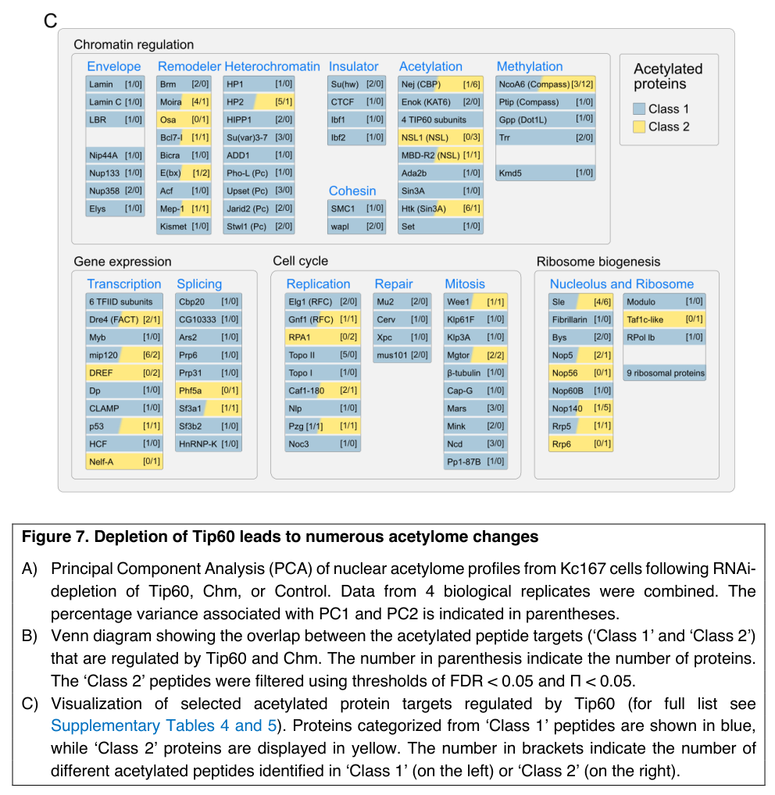

## Question

# Gene Research for Functional Annotation

## ⚠️ CRITICAL: Gene/Protein Identification Context

**BEFORE YOU BEGIN RESEARCH:** You MUST verify you are researching the CORRECT gene/protein. Gene symbols can be ambiguous, especially for less well-characterized genes from non-model organisms.

### Target Gene/Protein Identity (from UniProt):
- **UniProt Accession:** Q86BP6
- **Protein Description:** RecName: Full=Enhanced level of genomic instability 1 {ECO:0000305};
- **Gene Information:** Name=elg1 {ECO:0000312|FlyBase:FBgn0036574}; ORFNames=CG16838 {ECO:0000312|FlyBase:FBgn0036574};
- **Organism (full):** Drosophila melanogaster (Fruit fly).
- **Protein Family:** Belongs to the ELG1 family. .
- **Key Domains:** ELG1-like_C. (IPR060636); ELG1_dom. (IPR060635); P-loop_NTPase. (IPR027417); ELG1_C (PF28135); ELG1_middle (PF28136)

### MANDATORY VERIFICATION STEPS:

1. **Check if the gene symbol "elg1" matches the protein description above**
2. **Verify the organism is correct:** Drosophila melanogaster (Fruit fly).
3. **Check if protein family/domains align with what you find in literature**
4. **If you find literature for a DIFFERENT gene with the same or similar symbol, STOP**

### If Gene Symbol is Ambiguous or You Cannot Find Relevant Literature:

**DO NOT PROCEED WITH RESEARCH ON A DIFFERENT GENE.** Instead:
- State clearly: "The gene symbol 'elg1' is ambiguous or literature is limited for this specific protein"
- Explain what you found (e.g., "Found extensive literature on a different gene with the same symbol in a different organism")
- Describe the protein based ONLY on the UniProt information provided above
- Suggest that the protein function can be inferred from domain/family information

### Research Target:

Please provide a comprehensive research report on the gene **elg1** (gene ID: elg1, UniProt: Q86BP6) in DROME.

The research report should be a detailed narrative explaining the function, biological processes, and localization of the gene product. Citations should be given for all claims.

You should prioritize authoritative reviews and primary scientific literature when conducting research. You can supplement
this with annotations you find in gene/protein databases, but these can be outdated or inaccurate.

We are specifically interested in the primary function of the gene - for enzymes, what reaction is catalyzed, and what is the substrate specificity? For transporters, what is the substrate? For structural proteins or adapters, what is the broader structural role? For signaling molecules, what is the role in the pathway.

We are interested in where in or outside the cell the gene product carries out its function.

We are also interested in the signaling or biochemical pathways in which the gene functions. We are less interested in broad pleiotropic effects, except where these elucidate the precise role.

Include evidence where possible. We are interested in both experimental evidence as well as inference from structure, evolution, or bioinformatic analysis. Precise studies should be prioritized over high-throughput, where available.

## Output

Question: You are an expert researcher providing comprehensive, well-cited information.

Provide detailed information focusing on:
1. Key concepts and definitions with current understanding
2. Recent developments and latest research (prioritize 2023-2024 sources)
3. Current applications and real-world implementations
4. Expert opinions and analysis from authoritative sources
5. Relevant statistics and data from recent studies

Format as a comprehensive research report with proper citations. Include URLs and publication dates where available.
Always prioritize recent, authoritative sources and provide specific citations for all major claims.

# Gene Research for Functional Annotation

## ⚠️ CRITICAL: Gene/Protein Identification Context

**BEFORE YOU BEGIN RESEARCH:** You MUST verify you are researching the CORRECT gene/protein. Gene symbols can be ambiguous, especially for less well-characterized genes from non-model organisms.

### Target Gene/Protein Identity (from UniProt):
- **UniProt Accession:** Q86BP6
- **Protein Description:** RecName: Full=Enhanced level of genomic instability 1 {ECO:0000305};
- **Gene Information:** Name=elg1 {ECO:0000312|FlyBase:FBgn0036574}; ORFNames=CG16838 {ECO:0000312|FlyBase:FBgn0036574};
- **Organism (full):** Drosophila melanogaster (Fruit fly).
- **Protein Family:** Belongs to the ELG1 family. .
- **Key Domains:** ELG1-like_C. (IPR060636); ELG1_dom. (IPR060635); P-loop_NTPase. (IPR027417); ELG1_C (PF28135); ELG1_middle (PF28136)

### MANDATORY VERIFICATION STEPS:

1. **Check if the gene symbol "elg1" matches the protein description above**
2. **Verify the organism is correct:** Drosophila melanogaster (Fruit fly).
3. **Check if protein family/domains align with what you find in literature**
4. **If you find literature for a DIFFERENT gene with the same or similar symbol, STOP**

### If Gene Symbol is Ambiguous or You Cannot Find Relevant Literature:

**DO NOT PROCEED WITH RESEARCH ON A DIFFERENT GENE.** Instead:
- State clearly: "The gene symbol 'elg1' is ambiguous or literature is limited for this specific protein"
- Explain what you found (e.g., "Found extensive literature on a different gene with the same symbol in a different organism")
- Describe the protein based ONLY on the UniProt information provided above
- Suggest that the protein function can be inferred from domain/family information

### Research Target:

Please provide a comprehensive research report on the gene **elg1** (gene ID: elg1, UniProt: Q86BP6) in DROME.

The research report should be a detailed narrative explaining the function, biological processes, and localization of the gene product. Citations should be given for all claims.

You should prioritize authoritative reviews and primary scientific literature when conducting research. You can supplement
this with annotations you find in gene/protein databases, but these can be outdated or inaccurate.

We are specifically interested in the primary function of the gene - for enzymes, what reaction is catalyzed, and what is the substrate specificity? For transporters, what is the substrate? For structural proteins or adapters, what is the broader structural role? For signaling molecules, what is the role in the pathway.

We are interested in where in or outside the cell the gene product carries out its function.

We are also interested in the signaling or biochemical pathways in which the gene functions. We are less interested in broad pleiotropic effects, except where these elucidate the precise role.

Include evidence where possible. We are interested in both experimental evidence as well as inference from structure, evolution, or bioinformatic analysis. Precise studies should be prioritized over high-throughput, where available.

# Functional annotation of *Drosophila melanogaster* elg1 (CG16838; UniProt Q86BP6)

## Identity and evidence standard

**The gene symbol ‘elg1’ is ambiguous or literature is limited for this specific protein.** The target here is the *D. melanogaster* protein Q86BP6, encoded by **elg1/CG16838**, not budding-yeast ELG1, human ATAD5, or the distinct fly gene **rfc1**. Independent comparative analysis identifies fly CG16838-PB among Elg1 homologues, and a fly RFC study explicitly equates Elg1 with CG16838. Its supplied UniProt annotation—ELG1-family membership, ELG1-specific regions and a P-loop NTPase domain—is consistent with that identification. The extensive biochemical literature on yeast Elg1 and vertebrate ATAD5 supports a functional inference for Q86BP6, but is not itself an experimental demonstration in flies. (kanellis2008exploringpathwaysthat pages 67-72, tsuchiya2007transcriptionalregulationof pages 8-9, wang2024thehumanatad5 pages 1-2)

## Primary molecular function and substrate

**Best-supported annotation: a probable large subunit of an RFC-like complex that removes the PCNA sliding clamp from DNA.** PCNA is a ring-shaped, homotrimeric clamp that encircles DNA and supports processive synthesis and recruitment of replication-associated proteins. In experimentally characterized Elg1/ATAD5 complexes, Elg1 or ATAD5 takes the place of the large canonical RFC1 subunit alongside the four smaller RFC subunits. The complex acts principally as a **clamp unloader**, rather than as a DNA polymerase, DNA-repair nuclease, PCNA loader, or membrane transporter. For fly CG16838, both its participation in that complex and its PCNA-unloading activity remain **inferred from homology**, not directly established by a retrieved fly-specific reconstitution or depletion experiment. (kawasoe2024theatad5rfclike pages 1-2, kanellis2008exploringpathwaysthat pages 67-72, zheng2024structureofthe pages 1-2, wang2024thehumanatad5 pages 1-2)

The anticipated substrate is **PCNA already loaded around DNA**, particularly after it has finished serving replication-associated partners; it is not free DNA or a soluble metabolite. In *Xenopus* egg extracts, PCNA-interacting peptides inhibit unloading, consistent with preferential removal of DNA-bound clamps no longer occupied by their binding partners. Yeast Elg1-RFC also removes PCNA from covalently closed circular DNA, so a nick or exposed primer–template junction is not obligatory in that purified system. Other work discussed in the yeast structural study reports removal of modified PCNA, but neither SUMOylation nor ubiquitination has been established as a required substrate feature for **fly** Elg1. (kawasoe2024theatad5rfclike pages 1-2, zheng2024structureofthe pages 1-2, zheng2024structureofthe pages 7-8)

Although the protein belongs to a P-loop/AAA+-related ATPase family, **it would be misleading to assign Q86BP6 a proven ATP-hydrolysis reaction or turnover rate**. Purified yeast Elg1-RFC unloads PCNA with the nonhydrolysable nucleotide analogue AMP-PNP: nucleotide binding is sufficient under those experimental conditions. Conversely, mutation of an Atad5 ATP-binding motif abolishes unloading in *Xenopus* extracts, without by itself distinguishing binding from hydrolysis. Neither result measures ATP chemistry by purified fly Q86BP6. (zheng2024structureofthe pages 1-2, kawasoe2024theatad5rfclike pages 1-2, zheng2024structureofthe pages 7-8, kawasoe2024theatad5rfclike pages 5-6)

## Biological process and site of action

The most specific pathway assignment is **nuclear DNA replication and replication-coupled genome maintenance, at the stage of PCNA removal from replicated or replication-stressed DNA**. Timely clamp recycling controls how long PCNA-dependent synthesis, Okazaki-fragment processing, chromatin assembly and repair-associated factors can remain associated with DNA. Effects on genome stability and other downstream processes are plausible consequences of altered clamp residence, rather than separately established biochemical functions of the fly protein. There is no retrieved evidence that Q86BP6 itself is a secreted, membrane or extracellular factor. (kawasoe2024theatad5rfclike pages 1-2, zheng2024structureofthe pages 1-2, shiomi2017controlofgenome pages 3-6)

**Localization should be stated carefully.** A *Drosophila* Kc167-cell **nuclear acetylome** study detects Elg1 among its candidate Tip60-dependent acetylated replication proteins, supporting the presence of fly Elg1 in a nuclear protein preparation. It does **not** directly visualize Q86BP6 on chromatin, map its dynamics at replication forks, or establish an exclusive nuclear location. Nuclear, replication-associated chromatin is therefore its strongly predicted *site of action*, rather than a microscopy-verified localization for this accession. In particular, the embryonic nuclear-staining results of Tsuchiya and colleagues concern **dRFC140/Rfc1, not Elg1**. (tsuchiya2007transcriptionalregulationof pages 2-4, apostolou2025thetip60acetylome pages 23-25, tsuchiya2007transcriptionalregulationof pages 8-9, apostolou2025thetip60acetylome media ebf62fa7)

## Direct fly observations and their limits

A 2006 analysis of chromatin-associated Epc-N proteins records a reported yeast-two-hybrid interaction between fly **CG16838 and CG1845**. The paper states that it assembled biological information from prior literature and databases; the interaction is consequently an **interaction lead summarized from other data**, not a new biochemical validation of an Elg1–CG1845 complex or proof that Elg1 has a histone-modifying function. (perry2006theepcndomain pages 8-10, perry2006theepcndomain pages 10-11)

In April 2007, Tsuchiya *et al.* identified CG16838 as the fly Elg1 counterpart during their study of RFC-related genes. They reported candidate E2F-like sequences associated with the **elg1** gene, but did not establish that E2F regulates its expression. Their promoter experiments, mutant phenotypes and measured subcellular distribution were performed for **rfc1**; transferring those findings to **elg1** would conflate two different genes. [*FEBS Journal* (2007), doi:10.1111/j.1742-4658.2007.05730.x](https://doi.org/10.1111/j.1742-4658.2007.05730.x). (tsuchiya2007transcriptionalregulationof pages 9-11, tsuchiya2007transcriptionalregulationof pages 8-9)

A July **2025 bioRxiv preprint**, while outside the requested 2023–2024 priority window, provides the clearest recent *fly-specific* molecular observation: Apostolou *et al.* include **Elg1** in their Tip60-dependent **nuclear acetylome** of Kc167 cells. Across the complete experiment—not for Elg1 alone—the investigators identified **more than 430 acetylated peptides from more than 330 proteins**, using four biological replicates per condition. Detection after Tip60 depletion supports Elg1 as a *candidate* for acetylation-dependent regulation; it does not establish a direct Tip60–Elg1 enzyme–substrate reaction, an Elg1-specific acetylation-site count from the passages examined, or any change in PCNA unloading. The authors explicitly state that they have **no evidence yet that the reported acetylations are functional**. [bioRxiv (July 2025), doi:10.1101/2025.07.15.664872](https://doi.org/10.1101/2025.07.15.664872). (apostolou2025thetip60acetylome pages 17-21, apostolou2025thetip60acetylome pages 21-23, apostolou2025thetip60acetylome pages 23-25, apostolou2025thetip60acetylome media ebf62fa7)

## What the 2023–2024 mechanistic studies add—and do not add

Recent primary work makes the orthology-based annotation substantially more precise. Cryo-EM structures of **budding-yeast Elg1-RFC** revealed two Elg1-specific locking loops and a domain that occupies the DNA-binding chamber, providing a structural explanation for specialization toward PCNA **unloading rather than loading**. The authors observed Elg1-RFC alone and bound to closed or partially opened PCNA, and showed experimentally that nonhydrolysable nucleotide supports unloading. [*Science Advances* (1 March 2024), doi:10.1126/sciadv.adl1739](https://doi.org/10.1126/sciadv.adl1739). Corresponding studies of **human ATAD5-RFC** identified analogous locking and chamber-blocking elements and several PCNA-bound conformations, strengthening the evolutionary inference—but neither study solved the structure of fly Q86BP6. [*Nature Structural & Molecular Biology* (June 2024), doi:10.1038/s41594-024-01332-4](https://doi.org/10.1038/s41594-024-01332-4). (zheng2024structureofthe pages 1-2, zheng2024structureofthe pages 3-4, wang2024thehumanatad5 pages 1-2)

An independent **vertebrate extract** test addressed which RFC-family complex does most unloading in a cellular setting. In *Xenopus* egg extracts, Atad5-RLC supplied the principal measurable PCNA-unloading activity despite representing approximately **3%** of the RFC/RFC-like complexes measured; canonical RFC and Ctf18-RLC each represented about **40%**, but depleting either did not detectably reduce unloading in that assay. These are **frog-extract statistics**, not proportions measured in fly nuclei. [*Journal of Biological Chemistry* (online 21 December 2023; January 2024 issue), doi:10.1016/j.jbc.2023.105588](https://doi.org/10.1016/j.jbc.2023.105588). (kawasoe2024theatad5rfclike pages 1-2, kawasoe2024theatad5rfclike pages 2-3)

The following evidence table separates direct findings involving fly CG16838 from results obtained with its orthologues. (kanellis2008exploringpathwaysthat pages 67-72, apostolou2025thetip60acetylome pages 23-25, kawasoe2024theatad5rfclike pages 1-2)

| Evidence source (DOI/date) | Organism and method | Specific finding | Evidence strength / limitation |
|---|---|---|---|
| Perry, *BMC Genomics*; [10.1186/1471-2164-7-6](https://doi.org/10.1186/1471-2164-7-6); January 2006 | *D. melanogaster*; literature/database mining of interaction data | Reported a yeast two-hybrid interaction between CG16838 and the Epc-N/chromatin-associated protein CG1845. (perry2006theepcndomain pages 8-10, perry2006theepcndomain pages 10-11) | **Direct fly-protein interaction lead, but secondary evidence.** Perry did not generate the two-hybrid result, and the underlying experiment was not independently validated; it does not establish an RFC complex, PCNA unloading, or localization. |
| Tsuchiya et al., *FEBS Journal*; [10.1111/j.1742-4658.2007.05730.x](https://doi.org/10.1111/j.1742-4658.2007.05730.x); April 2007 | *D. melanogaster*; comparative annotation and promoter-sequence analysis | Identified CG16838 as the fly counterpart of Elg1 and noted two E2F-like sequences at +33 to +40 and +45 to +52; no DRE-like site was found in its surveyed 5′ region. The experimental promoter, localization, and mutant analyses concerned canonical **rfc1**, not **elg1**. (tsuchiya2007transcriptionalregulationof pages 9-11, tsuchiya2007transcriptionalregulationof pages 8-9) | **Strong identity support; weak regulatory evidence.** The candidate motifs were not functionally tested for fly **elg1**, and the reported rfc1 phenotypes and localization must not be transferred to CG16838. |
| Zheng et al., *Science Advances*; [10.1126/sciadv.adl1739](https://doi.org/10.1126/sciadv.adl1739); 1 March 2024 | Budding yeast; purified-protein biochemistry and cryo-EM | Elg1 replaces Rfc1 in an RFC-like complex and specializes it for PCNA unloading. Locking loops and an Elg1 plug impede DNA entry; PCNA was removed from covalently closed DNA, and nonhydrolyzable nucleotide supported unloading, indicating that nucleotide binding—not hydrolysis—is sufficient under the tested conditions. (zheng2024structureofthe pages 1-2, zheng2024structureofthe pages 3-4, zheng2024structureofthe pages 7-8) | **High-quality mechanistic orthologue evidence.** Establishes yeast Elg1-RFC structure and activity, not purified activity or an identical mechanism for fly Q86BP6. |
| Wang et al., *Nature Structural & Molecular Biology*; [10.1038/s41594-024-01332-4](https://doi.org/10.1038/s41594-024-01332-4); June 2024 | Human; ATAD5–RFC–PCNA cryo-EM and biochemistry | Human ATAD5–RFC is specialized for PCNA unloading; two locking loops and a DNA-chamber plug restrict loader-like conformational changes. Closed, cracked, and gapped PCNA-bound states were resolved, supporting conservation of an unloading-specialized architecture. (wang2024thehumanatad5 pages 1-2) | **High-quality vertebrate orthologue evidence.** Strongly supports evolutionary conservation, but does not experimentally establish these structural elements or activity in *Drosophila* Elg1. |
| Kawasoe et al., *Journal of Biological Chemistry*; [10.1016/j.jbc.2023.105588](https://doi.org/10.1016/j.jbc.2023.105588); online 21 December 2023, issue January 2024 | *Xenopus laevis* egg extracts; quantitative immunodepletion, add-back, and PCNA-unloading assays | Atad5-RLC represented only about **3%** of measured RFC/RLC complexes yet supplied the major PCNA-unloading activity; RFC and Ctf18-RLC each represented about 40%, but their depletion did not detectably reduce unloading. Activity targeted DNA-bound PCNA, required an intact Atad5 ATP-binding motif, and was independent of tested DNA nicks and chromatin assembly. (kawasoe2024theatad5rfclike pages 1-2, kawasoe2024theatad5rfclike pages 5-6, kawasoe2024theatad5rfclike pages 2-3) | **Strong physiological extract evidence for a vertebrate orthologue.** It does not prove fly substrate specificity, ATP-hydrolysis requirements, or preference for modified PCNA. |
| Apostolou et al., bioRxiv; [10.1101/2025.07.15.664872](https://doi.org/10.1101/2025.07.15.664872); July 2025 | *D. melanogaster* Kc167 cells; nuclear acetylome mass spectrometry after Tip60 RNAi, four biological replicates per condition | Elg1 was identified among nuclear replication proteins exhibiting Tip60-dependent acetylation behavior. Across the complete experiment, more than 430 acetylated peptides from over 330 proteins were detected, with Elg1 presented as a candidate Tip60-regulated RFC-like factor. (apostolou2025thetip60acetylome pages 17-21, apostolou2025thetip60acetylome pages 23-25, apostolou2025thetip60acetylome media ebf62fa7) | **Direct, recent fly proteomic evidence, but a preprint and high-throughput candidate.** The Elg1 site count, direct enzymatic acetylation, and functional consequences were not established; the authors explicitly reported no evidence that these acetylations are functional. |

*Table: Evidence specific to Drosophila Elg1/CG16838 is separated from mechanistic findings obtained with yeast and vertebrate orthologues. The table highlights both the functional consensus and the substantial limits of direct fly validation.*

## Functional-annotation conclusion

For **Q86BP6/elg1/CG16838**, annotate the principal role as **probable ATP-nucleotide-associated RFC-like PCNA clamp unloading from nuclear DNA**, with involvement in **replication-coupled PCNA recycling and genome maintenance**. Mark that mechanistic assignment as **strongly supported by conserved family identity and yeast/vertebrate experiments, but not directly biochemically verified in flies**. The strongest retrieved fly-specific molecular evidence is its identification in a nuclear acetylome; direct fly measurements of PCNA-removal activity, the RFC2–5 association, precise chromatin localization, ATP requirements and biological effects of Elg1 acetylation remain unresolved in the sources examined. (kanellis2008exploringpathwaysthat pages 67-72, apostolou2025thetip60acetylome pages 23-25, apostolou2025thetip60acetylome media ebf62fa7, kawasoe2024theatad5rfclike pages 1-2, zheng2024structureofthe pages 1-2, wang2024thehumanatad5 pages 1-2)

References

1. (kanellis2008exploringpathwaysthat pages 67-72): P Kanellis. Exploring pathways that maintain genome stability by preventing the formation of gross chromosomal rearrangements. Unknown journal, 2008.

2. (tsuchiya2007transcriptionalregulationof pages 8-9): Akihiro Tsuchiya, Yoshihiro H. Inoue, Hiroyuki Ida, Yukari Kawase, Koji Okudaira, Katsuhito Ohno, Hideki Yoshida, and Masamitsu Yamaguchi. Transcriptional regulation of the drosophila rfc1 gene by the dre–dref pathway. The FEBS Journal, 274:1818-1832, Apr 2007. URL: https://doi.org/10.1111/j.1742-4658.2007.05730.x, doi:10.1111/j.1742-4658.2007.05730.x. This article has 36 citations.

3. (wang2024thehumanatad5 pages 1-2): Feng Wang, Qing He, Nina Y. Yao, Michael E. O’Donnell, and Huilin Li. The human atad5 has evolved unique structural elements to function exclusively as a pcna unloader. Nature Structural & Molecular Biology, 31:1680-1691, Jun 2024. URL: https://doi.org/10.1038/s41594-024-01332-4, doi:10.1038/s41594-024-01332-4. This article has 14 citations and is from a highest quality peer-reviewed journal.

4. (kawasoe2024theatad5rfclike pages 1-2): Yoshitaka Kawasoe, Sakiko Shimokawa, Peter J. Gillespie, J. Julian Blow, Toshiki Tsurimoto, and Tatsuro S. Takahashi. The atad5 rfc-like complex is the major unloader of proliferating cell nuclear antigen in xenopus egg extracts. Journal of Biological Chemistry, 300:105588, Jan 2024. URL: https://doi.org/10.1016/j.jbc.2023.105588, doi:10.1016/j.jbc.2023.105588. This article has 7 citations and is from a domain leading peer-reviewed journal.

5. (zheng2024structureofthe pages 1-2): Fengwei Zheng, Nina Y. Yao, Roxana E. Georgescu, Huilin Li, and Michael E. O’Donnell. Structure of the pcna unloader elg1-rfc. Science Advances, Mar 2024. URL: https://doi.org/10.1126/sciadv.adl1739, doi:10.1126/sciadv.adl1739. This article has 8 citations and is from a highest quality peer-reviewed journal.

6. (zheng2024structureofthe pages 7-8): Fengwei Zheng, Nina Y. Yao, Roxana E. Georgescu, Huilin Li, and Michael E. O’Donnell. Structure of the pcna unloader elg1-rfc. Science Advances, Mar 2024. URL: https://doi.org/10.1126/sciadv.adl1739, doi:10.1126/sciadv.adl1739. This article has 8 citations and is from a highest quality peer-reviewed journal.

7. (kawasoe2024theatad5rfclike pages 5-6): Yoshitaka Kawasoe, Sakiko Shimokawa, Peter J. Gillespie, J. Julian Blow, Toshiki Tsurimoto, and Tatsuro S. Takahashi. The atad5 rfc-like complex is the major unloader of proliferating cell nuclear antigen in xenopus egg extracts. Journal of Biological Chemistry, 300:105588, Jan 2024. URL: https://doi.org/10.1016/j.jbc.2023.105588, doi:10.1016/j.jbc.2023.105588. This article has 7 citations and is from a domain leading peer-reviewed journal.

8. (shiomi2017controlofgenome pages 3-6): Yasushi Shiomi and Hideo Nishitani. Control of genome integrity by rfc complexes; conductors of pcna loading onto and unloading from chromatin during dna replication. Genes, 8:52, Jan 2017. URL: https://doi.org/10.3390/genes8020052, doi:10.3390/genes8020052. This article has 103 citations.

9. (tsuchiya2007transcriptionalregulationof pages 2-4): Akihiro Tsuchiya, Yoshihiro H. Inoue, Hiroyuki Ida, Yukari Kawase, Koji Okudaira, Katsuhito Ohno, Hideki Yoshida, and Masamitsu Yamaguchi. Transcriptional regulation of the drosophila rfc1 gene by the dre–dref pathway. The FEBS Journal, 274:1818-1832, Apr 2007. URL: https://doi.org/10.1111/j.1742-4658.2007.05730.x, doi:10.1111/j.1742-4658.2007.05730.x. This article has 36 citations.

10. (apostolou2025thetip60acetylome pages 23-25): Zivkos Apostolou, Anuroop V Venkatasubramani, Lara C Kopp, Gizem Kars, Alessandro Scacchetti, Aline C Sparr, Tamas Schauer, Axel Imhof, and Peter B Becker. The tip60 acetylome is a hallmark of the proliferative state in drosophila. BioRxiv, Jul 2025. URL: https://doi.org/10.1101/2025.07.15.664872, doi:10.1101/2025.07.15.664872. This article has 3 citations.

11. (apostolou2025thetip60acetylome media ebf62fa7): Zivkos Apostolou, Anuroop V Venkatasubramani, Lara C Kopp, Gizem Kars, Alessandro Scacchetti, Aline C Sparr, Tamas Schauer, Axel Imhof, and Peter B Becker. The tip60 acetylome is a hallmark of the proliferative state in drosophila. BioRxiv, Jul 2025. URL: https://doi.org/10.1101/2025.07.15.664872, doi:10.1101/2025.07.15.664872. This article has 3 citations.

12. (perry2006theepcndomain pages 8-10): Jason Perry. The epc-n domain: a predicted protein-protein interaction domain found in select chromatin associated proteins. BMC Genomics, 7:6-6, Jan 2006. URL: https://doi.org/10.1186/1471-2164-7-6, doi:10.1186/1471-2164-7-6. This article has 43 citations and is from a peer-reviewed journal.

13. (perry2006theepcndomain pages 10-11): Jason Perry. The epc-n domain: a predicted protein-protein interaction domain found in select chromatin associated proteins. BMC Genomics, 7:6-6, Jan 2006. URL: https://doi.org/10.1186/1471-2164-7-6, doi:10.1186/1471-2164-7-6. This article has 43 citations and is from a peer-reviewed journal.

14. (tsuchiya2007transcriptionalregulationof pages 9-11): Akihiro Tsuchiya, Yoshihiro H. Inoue, Hiroyuki Ida, Yukari Kawase, Koji Okudaira, Katsuhito Ohno, Hideki Yoshida, and Masamitsu Yamaguchi. Transcriptional regulation of the drosophila rfc1 gene by the dre–dref pathway. The FEBS Journal, 274:1818-1832, Apr 2007. URL: https://doi.org/10.1111/j.1742-4658.2007.05730.x, doi:10.1111/j.1742-4658.2007.05730.x. This article has 36 citations.

15. (apostolou2025thetip60acetylome pages 17-21): Zivkos Apostolou, Anuroop V Venkatasubramani, Lara C Kopp, Gizem Kars, Alessandro Scacchetti, Aline C Sparr, Tamas Schauer, Axel Imhof, and Peter B Becker. The tip60 acetylome is a hallmark of the proliferative state in drosophila. BioRxiv, Jul 2025. URL: https://doi.org/10.1101/2025.07.15.664872, doi:10.1101/2025.07.15.664872. This article has 3 citations.

16. (apostolou2025thetip60acetylome pages 21-23): Zivkos Apostolou, Anuroop V Venkatasubramani, Lara C Kopp, Gizem Kars, Alessandro Scacchetti, Aline C Sparr, Tamas Schauer, Axel Imhof, and Peter B Becker. The tip60 acetylome is a hallmark of the proliferative state in drosophila. BioRxiv, Jul 2025. URL: https://doi.org/10.1101/2025.07.15.664872, doi:10.1101/2025.07.15.664872. This article has 3 citations.

17. (zheng2024structureofthe pages 3-4): Fengwei Zheng, Nina Y. Yao, Roxana E. Georgescu, Huilin Li, and Michael E. O’Donnell. Structure of the pcna unloader elg1-rfc. Science Advances, Mar 2024. URL: https://doi.org/10.1126/sciadv.adl1739, doi:10.1126/sciadv.adl1739. This article has 8 citations and is from a highest quality peer-reviewed journal.

18. (kawasoe2024theatad5rfclike pages 2-3): Yoshitaka Kawasoe, Sakiko Shimokawa, Peter J. Gillespie, J. Julian Blow, Toshiki Tsurimoto, and Tatsuro S. Takahashi. The atad5 rfc-like complex is the major unloader of proliferating cell nuclear antigen in xenopus egg extracts. Journal of Biological Chemistry, 300:105588, Jan 2024. URL: https://doi.org/10.1016/j.jbc.2023.105588, doi:10.1016/j.jbc.2023.105588. This article has 7 citations and is from a domain leading peer-reviewed journal.

## Artifacts

- [Edison artifact artifact-00](elg1-deep-research-falcon_artifacts/artifact-00.md)

## Citations

1. kanellis2008exploringpathwaysthat pages 67-72
2. tsuchiya2007transcriptionalregulationof pages 8-9
3. zheng2024structureofthe pages 1-2
4. zheng2024structureofthe pages 7-8
5. shiomi2017controlofgenome pages 3-6
6. tsuchiya2007transcriptionalregulationof pages 2-4
7. perry2006theepcndomain pages 8-10
8. perry2006theepcndomain pages 10-11
9. tsuchiya2007transcriptionalregulationof pages 9-11
10. zheng2024structureofthe pages 3-4
11. *FEBS Journal* (2007), doi:10.1111/j.1742-4658.2007.05730.x
12. bioRxiv (July 2025), doi:10.1101/2025.07.15.664872
13. *Science Advances* (1 March 2024), doi:10.1126/sciadv.adl1739
14. *Nature Structural & Molecular Biology* (June 2024), doi:10.1038/s41594-024-01332-4
15. *Journal of Biological Chemistry* (online 21 December 2023; January 2024 issue), doi:10.1016/j.jbc.2023.105588
16. 10.1186/1471-2164-7-6
17. 10.1111/j.1742-4658.2007.05730.x
18. 10.1126/sciadv.adl1739
19. 10.1038/s41594-024-01332-4
20. 10.1016/j.jbc.2023.105588
21. 10.1101/2025.07.15.664872
22. https://doi.org/10.1111/j.1742-4658.2007.05730.x
23. https://doi.org/10.1101/2025.07.15.664872
24. https://doi.org/10.1126/sciadv.adl1739
25. https://doi.org/10.1038/s41594-024-01332-4
26. https://doi.org/10.1016/j.jbc.2023.105588
27. https://doi.org/10.1186/1471-2164-7-6
28. https://doi.org/10.1111/j.1742-4658.2007.05730.x,
29. https://doi.org/10.1038/s41594-024-01332-4,
30. https://doi.org/10.1016/j.jbc.2023.105588,
31. https://doi.org/10.1126/sciadv.adl1739,
32. https://doi.org/10.3390/genes8020052,
33. https://doi.org/10.1101/2025.07.15.664872,
34. https://doi.org/10.1186/1471-2164-7-6,