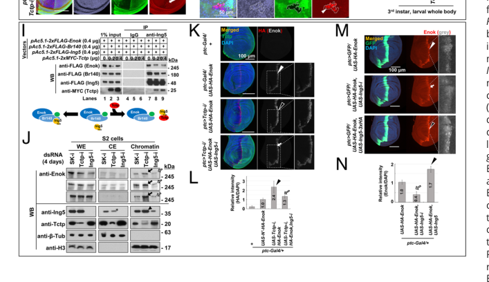

## Question

# Gene Research for Functional Annotation

## ⚠️ CRITICAL: Gene/Protein Identification Context

**BEFORE YOU BEGIN RESEARCH:** You MUST verify you are researching the CORRECT gene/protein. Gene symbols can be ambiguous, especially for less well-characterized genes from non-model organisms.

### Target Gene/Protein Identity (from UniProt):
- **UniProt Accession:** Q9W1A9
- **Protein Description:** RecName: Full=histone acetyltransferase {ECO:0000256|ARBA:ARBA00013184, ECO:0000256|PROSITE-ProRule:PRU01063}; EC=2.3.1.48 {ECO:0000256|ARBA:ARBA00013184, ECO:0000256|PROSITE-ProRule:PRU01063};
- **Gene Information:** Name=enok {ECO:0000313|EMBL:AAF47164.2, ECO:0000313|FlyBase:FBgn0034975}; Synonyms=anon-60Ba {ECO:0000313|EMBL:AAF47164.2}, anon-WO0200864.1 {ECO:0000313|EMBL:AAF47164.2}, anon-WO0200864.2 {ECO:0000313|EMBL:AAF47164.2}, Cg11290 {ECO:0000313|EMBL:AAF47164.2}, Dmel\CG11290 {ECO:0000313|EMBL:AAF47164.2}, dmHAG406 {ECO:0000313|EMBL:AAF47164.2}, Enok {ECO:0000313|EMBL:AAF47164.2}, KAT6 {ECO:0000313|EMBL:AAF47164.2}, rot {ECO:0000313|EMBL:AAF47164.2}, S1 {ECO:0000313|EMBL:AAF47164.2}; ORFNames=CG11290 {ECO:0000313|EMBL:AAF47164.2, ECO:0000313|FlyBase:FBgn0034975}, Dmel_CG11290 {ECO:0000313|EMBL:AAF47164.2};
- **Organism (full):** Drosophila melanogaster (Fruit fly).
- **Protein Family:** Belongs to the histone H1/H5 family. {ECO:0000256|PROSITE-
- **Key Domains:** Acyl_CoA_acyltransferase. (IPR016181); HAT_MYST-type. (IPR002717); Histone_H1/H5_H15. (IPR005818); MYST_HAT. (IPR050603); SAMD1-like_WH. (IPR048589)

### MANDATORY VERIFICATION STEPS:

1. **Check if the gene symbol "enok" matches the protein description above**
2. **Verify the organism is correct:** Drosophila melanogaster (Fruit fly).
3. **Check if protein family/domains align with what you find in literature**
4. **If you find literature for a DIFFERENT gene with the same or similar symbol, STOP**

### If Gene Symbol is Ambiguous or You Cannot Find Relevant Literature:

**DO NOT PROCEED WITH RESEARCH ON A DIFFERENT GENE.** Instead:
- State clearly: "The gene symbol 'enok' is ambiguous or literature is limited for this specific protein"
- Explain what you found (e.g., "Found extensive literature on a different gene with the same symbol in a different organism")
- Describe the protein based ONLY on the UniProt information provided above
- Suggest that the protein function can be inferred from domain/family information

### Research Target:

Please provide a comprehensive research report on the gene **enok** (gene ID: enok, UniProt: Q9W1A9) in DROME.

The research report should be a detailed narrative explaining the function, biological processes, and localization of the gene product. Citations should be given for all claims.

You should prioritize authoritative reviews and primary scientific literature when conducting research. You can supplement
this with annotations you find in gene/protein databases, but these can be outdated or inaccurate.

We are specifically interested in the primary function of the gene - for enzymes, what reaction is catalyzed, and what is the substrate specificity? For transporters, what is the substrate? For structural proteins or adapters, what is the broader structural role? For signaling molecules, what is the role in the pathway.

We are interested in where in or outside the cell the gene product carries out its function.

We are also interested in the signaling or biochemical pathways in which the gene functions. We are less interested in broad pleiotropic effects, except where these elucidate the precise role.

Include evidence where possible. We are interested in both experimental evidence as well as inference from structure, evolution, or bioinformatic analysis. Precise studies should be prioritized over high-throughput, where available.

## Output

Question: You are an expert researcher providing comprehensive, well-cited information.

Provide detailed information focusing on:
1. Key concepts and definitions with current understanding
2. Recent developments and latest research (prioritize 2023-2024 sources)
3. Current applications and real-world implementations
4. Expert opinions and analysis from authoritative sources
5. Relevant statistics and data from recent studies

Format as a comprehensive research report with proper citations. Include URLs and publication dates where available.
Always prioritize recent, authoritative sources and provide specific citations for all major claims.

# Gene Research for Functional Annotation

## ⚠️ CRITICAL: Gene/Protein Identification Context

**BEFORE YOU BEGIN RESEARCH:** You MUST verify you are researching the CORRECT gene/protein. Gene symbols can be ambiguous, especially for less well-characterized genes from non-model organisms.

### Target Gene/Protein Identity (from UniProt):
- **UniProt Accession:** Q9W1A9
- **Protein Description:** RecName: Full=histone acetyltransferase {ECO:0000256|ARBA:ARBA00013184, ECO:0000256|PROSITE-ProRule:PRU01063}; EC=2.3.1.48 {ECO:0000256|ARBA:ARBA00013184, ECO:0000256|PROSITE-ProRule:PRU01063};
- **Gene Information:** Name=enok {ECO:0000313|EMBL:AAF47164.2, ECO:0000313|FlyBase:FBgn0034975}; Synonyms=anon-60Ba {ECO:0000313|EMBL:AAF47164.2}, anon-WO0200864.1 {ECO:0000313|EMBL:AAF47164.2}, anon-WO0200864.2 {ECO:0000313|EMBL:AAF47164.2}, Cg11290 {ECO:0000313|EMBL:AAF47164.2}, Dmel\CG11290 {ECO:0000313|EMBL:AAF47164.2}, dmHAG406 {ECO:0000313|EMBL:AAF47164.2}, Enok {ECO:0000313|EMBL:AAF47164.2}, KAT6 {ECO:0000313|EMBL:AAF47164.2}, rot {ECO:0000313|EMBL:AAF47164.2}, S1 {ECO:0000313|EMBL:AAF47164.2}; ORFNames=CG11290 {ECO:0000313|EMBL:AAF47164.2, ECO:0000313|FlyBase:FBgn0034975}, Dmel_CG11290 {ECO:0000313|EMBL:AAF47164.2};
- **Organism (full):** Drosophila melanogaster (Fruit fly).
- **Protein Family:** Belongs to the histone H1/H5 family. {ECO:0000256|PROSITE-
- **Key Domains:** Acyl_CoA_acyltransferase. (IPR016181); HAT_MYST-type. (IPR002717); Histone_H1/H5_H15. (IPR005818); MYST_HAT. (IPR050603); SAMD1-like_WH. (IPR048589)

### MANDATORY VERIFICATION STEPS:

1. **Check if the gene symbol "enok" matches the protein description above**
2. **Verify the organism is correct:** Drosophila melanogaster (Fruit fly).
3. **Check if protein family/domains align with what you find in literature**
4. **If you find literature for a DIFFERENT gene with the same or similar symbol, STOP**

### If Gene Symbol is Ambiguous or You Cannot Find Relevant Literature:

**DO NOT PROCEED WITH RESEARCH ON A DIFFERENT GENE.** Instead:
- State clearly: "The gene symbol 'enok' is ambiguous or literature is limited for this specific protein"
- Explain what you found (e.g., "Found extensive literature on a different gene with the same symbol in a different organism")
- Describe the protein based ONLY on the UniProt information provided above
- Suggest that the protein function can be inferred from domain/family information

### Research Target:

Please provide a comprehensive research report on the gene **enok** (gene ID: enok, UniProt: Q9W1A9) in DROME.

The research report should be a detailed narrative explaining the function, biological processes, and localization of the gene product. Citations should be given for all claims.

You should prioritize authoritative reviews and primary scientific literature when conducting research. You can supplement
this with annotations you find in gene/protein databases, but these can be outdated or inaccurate.

We are specifically interested in the primary function of the gene - for enzymes, what reaction is catalyzed, and what is the substrate specificity? For transporters, what is the substrate? For structural proteins or adapters, what is the broader structural role? For signaling molecules, what is the role in the pathway.

We are interested in where in or outside the cell the gene product carries out its function.

We are also interested in the signaling or biochemical pathways in which the gene functions. We are less interested in broad pleiotropic effects, except where these elucidate the precise role.

Include evidence where possible. We are interested in both experimental evidence as well as inference from structure, evolution, or bioinformatic analysis. Precise studies should be prioritized over high-throughput, where available.

# Functional annotation of *Drosophila melanogaster enok* (UniProt Q9W1A9)

## Identity and principal function

**Enok (Enoki mushroom; CG11290) is the fruit-fly KAT6/MOZ–MORF-type MYST lysine acetyltransferase.** Its best-established enzymatic function is acetylation of lysine 23 on chromatin-associated histone H3 (H3K23ac), a modification linked to transcriptional regulation. The literature identifies Enok as the fly counterpart of mammalian KAT6A/MOZ and KAT6B/MORF; these are related proteins, not alternative names for the fly gene. (viita2023themozbrpf1acetyltransferase pages 2-3, huang2016regulationofkat6 pages 1-5, huang2016regulationofkat6 pages 5-9)

**Annotation caution.** The supplied UniProt record includes a “histone H1/H5 family” assignment. Literature instead places the *whole Enok protein* in the MYST acetyltransferase family: its N-terminal NEMM/winged-helix region resembles a domain of linker histones H1/H5, while its MYST domain supplies acetyltransferase function. Enok should therefore **not** be annotated as a linker histone. Its acyl-CoA-acyltransferase/MYST annotations are consistent with its catalytic role; H1/H5-like and SAMD1-like winged-helix annotations describe structural similarity rather than a demonstrated H1-like function. (viita2023themozbrpf1acetyltransferase pages 2-3, weber2023thehistoneacetyltransferase pages 18-19, thomas2007thediversebiological pages 2-3)

## Reaction, substrate specificity and complex

As a KAT6-family enzyme, Enok transfers an acetyl group from **acetyl-CoA** to a histone lysine ε-amino group, producing acetylated histone and CoA. For the fly protein, **H3K23 is the most securely established physiological site**: global H3K23ac depends strongly on Enok activity, and an engineered catalytic-site **K807R** allele lowers H3K23ac in circulating hemocytes to approximately the level in an *enok* null. These observations establish catalytic dependence in vivo, rather than a complete kinetic ranking of every possible purified-Enok substrate. (simpkins2026kat6acetyltransferasesas pages 4-6, huang2016regulationofkat6 pages 5-9, genais2020thedrosophilamoz pages 8-11)

An expert synthesis reports that H3K23ac occurs on approximately **47% of histone H3 in fly cells**. Enok depletion reduced combined global H3/H4 acetylation by approximately **35%**; individually depleting each of 22 other tested lysine acetyltransferases caused reductions of **less than 10%** in that comparison. Enok is consequently a major contributor to bulk fly H3K23ac, **not necessarily its exclusive writer**: Drosophila CBP, encoded by *nejire*, also contributes to H3K23 acetylation at ecdysone-responsive genes. H3K9 and H3K14 are reported among substrates of the broader KAT6 family, but mammalian site preferences must not be presented as a fly-specific, site-by-site specificity measurement. (huang2016regulationofkat6 pages 5-9, bodai2012ecdysoneinducedgene pages 4-6)

Purified fly Enok associates with **Br140, Ing5 and Eaf6** in a four-subunit complex. Br140 supports Enok abundance, stimulates its acetyltransferase activity and broadens substrate specificity *in vitro*; all four components contribute to H3K23 acetylation *in vivo*. The complex’s chromatin-reader domains offer a targeting mechanism, but reader properties established biochemically for mammalian BRPF1 or KAT6A cannot automatically be assigned to their fly counterparts. Mammalian KAT6 complexes can also propionylate H3K23; the retrieved evidence does **not** establish that fly Enok catalyzes that reaction. (huang2016regulationofkat6 pages 1-5, huang2016regulationofkat6 pages 5-9, yan2020deficienthistoneh3 pages 2-3)

The following synthesis separates measured fly functions from cross-species inferences and unresolved catalytic requirements. (huang2016regulationofkat6 pages 5-9, kim2023tctpaunique pages 9-10, umer2019genomewidernaiscreen pages 6-9)

| Function / localization | Precise direct fly observation | Evidence strength / caveat | Primary source, date, DOI |
|---|---|---|---|
| **H3K23 acetylation; nuclear chromatin** | Enok forms a four-subunit complex with **Br140, Ing5, and Eaf6**. All four contribute to H3K23ac in vivo; Br140 stabilizes Enok, stimulates its activity, and broadens substrate specificity in vitro. H3K23ac occurs on about **47% of fly H3**, and Enok depletion reduced global H3+H4 acetylation by about **35%**, versus less than 10% after individual depletion of 22 other KATs. (huang2016regulationofkat6 pages 5-9, huang2016regulationofkat6 pages 1-5) | **Strong biochemical/genetic evidence.** Enok is a major source of bulk H3K23ac, not demonstrably the exclusive enzyme: dCBP/Nej also contributes to H3K23ac at ecdysone-responsive loci. Mammalian KAT6-dependent H3K23 propionylation has not been directly established for fly Enok. (huang2016regulationofkat6 pages 5-9, bodai2012ecdysoneinducedgene pages 4-6, yan2020deficienthistoneh3 pages 2-3) | Huang et al., July 2016, [10.1128/MCB.00055-16](https://doi.org/10.1128/MCB.00055-16); Bodai et al., July 2012, [10.1371/journal.pone.0040565](https://doi.org/10.1371/journal.pone.0040565) |
| **Tctp–Ing5 control of Enok nuclear/chromatin localization** | Tctp directly binds the Ing5 PHD region and competitively inhibits Ing5 association with Enok-complex subunits. Tctp depletion increased nuclear HA-Enok about **2.4-fold**, whereas Ing5 RNAi reduced Enok nuclear/chromatin abundance to **0.4-fold** and Ing5 overexpression raised it about **1.7-fold**. Tctp-mutant larvae showed about **2.8-fold** higher H3K23ac and mutant tissues showed **two- to threefold** increases. (kim2023tctpaunique pages 7-9, kim2023tctpaunique pages 2-3, kim2023tctpaunique pages 7-7, kim2023tctpaunique pages 9-10) | **Strong, recent primary evidence:** direct pull-down/co-IP, fractionation, imaging, mutants, RNAi, and H3K23ac assays. Results establish regulated nuclear recruitment rather than constitutive nuclear residence. (kim2023tctpaunique pages 9-10, kim2023tctpaunique media bb531b9c, kim2023tctpaunique media 09958720) | Kim et al., 11 April 2023, [10.1073/pnas.2218361120](https://doi.org/10.1073/pnas.2218361120) |
| **PRC1/trithorax chromatin regulation** | Embryonic Br140 purification recovered Enok, Ing5, Eaf6 and PRC1 components. Br140 occurred at **447/483 Pc peaks (~93%)**; 2,027 cobound genes included 406 H3K27me3-associated and 1,621 H3K27ac-associated genes. Enok depletion increased Pc and H2AK118ub1 at trxG targets, increased promoter-proximal Pol II, and reduced gene-body Pol II; codepletion of Pc reversed the pausing and transcriptional repression. (kang2017bivalentcomplexesof pages 4-6, umer2019genomewidernaiscreen pages 6-9, kang2017bivalentcomplexesof pages 2-3) | **Strong genomic/genetic evidence.** H3K23ac was not enriched across the potentially bivalent gene set, so PRC1-associated action need not be catalytic at every locus; embryo ChIP also averages heterogeneous cell populations. (kang2017bivalentcomplexesof pages 10-11, kang2017bivalentcomplexesof pages 3-4) | Kang et al., October 2017, [10.1101/gad.305987.117](https://doi.org/10.1101/gad.305987.117); Umer et al., 10 September 2019, [10.1186/s13072-019-0301-x](https://doi.org/10.1186/s13072-019-0301-x) |
| **Notch–Lozenge hematopoietic enhancer; nuclear chromatin** | Enok acts cell-autonomously downstream of Notch to induce the RUNX-family gene **lozenge** in circulating crystal-cell precursors. Enok binds a third-intron enhancer; deleting that intron abolished Lz in most Notch-activated hemocytes. Catalytically dead **enok K807R** reduced H3K23ac to null-like levels but preserved crystal-cell differentiation; Br140 was required, whereas Ing5 and Eaf6 were dispensable. (genais2020thedrosophilamoz pages 11-14, genais2020thedrosophilamoz pages 8-11, genais2020thedrosophilamoz pages 5-8) | **Mechanistically informative but provisional:** evidence supports a catalytic-independent Enok–Br140 function, but the report is a **2020 bioRxiv preprint**, not a peer-reviewed article in the retrieved record. (genais2020thedrosophilamoz pages 11-14) | Genais et al., 28 July 2020, [10.1101/2020.07.27.222620](https://doi.org/10.1101/2020.07.27.222620) |
| **Elg1–PCNA unloading; replication-associated chromatin** | The Enok complex physically interacts with the Elg1 RFC-like PCNA-unloader and inhibits PCNA unloading, promoting the **G1/S transition**; Enok also has an Elg1-independent influence on G2/M progression. (huang2016regulationofkat6 pages 5-9, shiomi2017controlofgenome pages 8-10) | **Supported by a primary study and expert reviews**, but the retrieved passages do not resolve which Enok subunit mediates inhibition or whether acetyltransferase activity is required. This is a complex-level replication function, not proof that PCNA or Elg1 is an Enok acetylation substrate. | Huang et al., May 2016, [10.1101/gad.271429.115](https://doi.org/10.1101/gad.271429.115); Shiomi & Nishitani, January 2017, [10.3390/genes8020052](https://doi.org/10.3390/genes8020052) |
| **Oocyte polarization and female germline** | Enok promotes transcription of the actin-nucleation factor **spire**, thereby supporting oocyte polarization. Catalytically dead enok females are sterile, consistent with an H3K23ac-dependent reproductive function. Separate fly work links Enok to germline-stem-cell maintenance through reduced Bruno abundance and regulation of niche size/BMP signaling. (huang2016regulationofkat6 pages 5-9, kim2023tctpaunique pages 10-11, genais2020thedrosophilamoz pages 11-14) | **Peer-reviewed fly genetic/transcriptional evidence**, although quantitative primary data were not present in the retrieved excerpts. The oocyte-polarization result is more mechanistically specific than the broader, partly non-cell-autonomous stem-cell phenotypes. | Huang et al., December 2014, [10.1101/gad.249730.114](https://doi.org/10.1101/gad.249730.114); Xin et al., December 2013, [10.1016/j.ydbio.2013.10.001](https://doi.org/10.1016/j.ydbio.2013.10.001) |

*Table: Fly-specific evidence for Enok’s catalytic, chromatin-recruitment, transcriptional, replication, and developmental functions. The table separates direct findings from caveats and prevents mammalian KAT6 propionylation or linker-histone annotations from being misassigned to Drosophila Enok.*

## Cellular location and recent mechanistic advance

**The functionally relevant location is nuclear chromatin**, including chromatin at regulated genes. Embryonic Br140-associated material contains Enok and its other complex partners; Enok is detected at target loci by chromatin immunoprecipitation, and tagged Enok accumulates in larval wing-cell nuclei. This is a chromatin-associated enzyme, not a secreted protein or membrane transporter. (kang2017bivalentcomplexesof pages 2-3, umer2019genomewidernaiscreen pages 6-9, kim2023tctpaunique pages 9-10)

The most informative recent fly study, **Kim and colleagues (April 2023)**, explains how localization can be regulated. Tctp directly binds the PHD-containing region of Ing5 and inhibits Ing5 association with Enok-complex subunits. Reducing Tctp shifts Ing5 toward the nucleus/chromatin and increases chromatin-associated Enok; depleting Ing5 has the opposite effect. In wing-disc experiments, Tctp knockdown increased nuclear tagged Enok approximately **2.4-fold**; Ing5 depletion reduced its nuclear/chromatin signal to **0.4-fold**, whereas Ing5 overexpression increased it approximately **1.7-fold**. Tctp-mutant larvae had approximately **2.8-fold** more H3K23ac, with **two- to threefold** increases measured in mutant tissues. Co-immunoprecipitation, fractionation, genetics and imaging support a Tctp–Ing5 control mechanism for Enok access to chromatin, although the proposed sequence of trafficking and complex-assembly steps remains a mechanistic model. The paper’s cropped Figures 6–7 provide visual evidence for recruitment and acetylation measurements. [Kim et al., *PNAS*, April 2023; https://doi.org/10.1073/pnas.2218361120.] (kim2023tctpaunique pages 2-3, kim2023tctpaunique pages 7-7, kim2023tctpaunique pages 9-10, kim2023tctpaunique media bb531b9c, kim2023tctpaunique media 09958720)

A **2023 human KAT6A** study demonstrated recruitment to unmethylated CpG islands through an N-terminal winged-helix domain. Its authors expressly caution against directly applying that mechanism to Enok: flies lack CpG islands, and the Enok winged-helix and histone-binding regions differ substantially from their human counterparts. This human result helps interpret domain architecture but is **not** evidence that fly Enok targets CpG islands. [Weber et al., *Nucleic Acids Research*, published December 2022, in the 2023 volume; https://doi.org/10.1093/nar/gkac1188.] (weber2023thehistoneacetyltransferase pages 18-19)

## Pathways and experimentally defined biological roles

**Polycomb–trithorax control of developmental transcription.** Embryonic Br140 purification recovered Enok, Ing5 and Eaf6 together with Polycomb repressive complex 1 (PRC1) components. In a genome-wide analysis, Br140 was present at **447 of 483** stringently called Polycomb (Pc) peaks—approximately **93%**—and cobound developmental genes occurred in both H3K27me3-associated and H3K27ac-associated groups. Importantly, those potentially bivalent genes were **not enriched for H3K23ac** in the datasets examined: co-occupancy establishes a chromatin relationship, not acetylation at every such locus. Embryo-wide profiles also mix cell types, limiting claims that apparently opposing marks coexist in each individual cell. [Kang et al., *Genes & Development*, October 2017; https://doi.org/10.1101/gad.305987.117.] (kang2017bivalentcomplexesof pages 2-3, kang2017bivalentcomplexesof pages 4-6, kang2017bivalentcomplexesof pages 10-11, kang2017bivalentcomplexesof pages 3-4)

A separate fly genetic and chromatin study classified Enok as a **trithorax-group-like activator that counteracts Pc-dependent repression**. At tested targets, *enok* depletion increased Pc occupancy and PRC1-associated **H2AK118ub1**, reduced transcription and shifted RNA polymerase II toward transcription start sites and away from gene bodies. Joint depletion of Pc and Enok restored the tested expression and polymerase-distribution phenotypes. The authors propose that Enok-mediated H3K23ac disfavors Pc recruitment, but that **specific molecular exclusion step is a proposed explanation**, not equivalent to a demonstration at every cobound locus. [Umer et al., *Epigenetics & Chromatin*, September 2019; https://doi.org/10.1186/s13072-019-0301-x.] (umer2019genomewidernaiscreen pages 1-2, umer2019genomewidernaiscreen pages 13-13, umer2019genomewidernaiscreen pages 6-9)

**Notch-responsive hematopoiesis: an important exception to a purely enzymatic annotation.** In a **July 2020 bioRxiv preprint**, Enok was required within Notch-activated larval blood-cell precursors to induce *lozenge* (*lz*), the fly RUNX-family determinant of crystal-cell fate. Tagged Enok bound a third-intron *lz* enhancer, and deleting that intron abolished *lz* expression in most affected precursors. Strikingly, the K807R catalytic mutant substantially lost H3K23ac **but retained crystal-cell differentiation**; Br140 was required in this setting, whereas Ing5 and Eaf6 were dispensable. This supports a **chromatin-associated, acetyltransferase-independent role** for Enok in enabling a particular Notch-responsive transcriptional program. Because the accessible report is a preprint, this mechanistic conclusion warrants more caution than the peer-reviewed findings above. [Genais et al., bioRxiv, July 2020; https://doi.org/10.1101/2020.07.27.222620.] (genais2020thedrosophilamoz pages 8-11, genais2020thedrosophilamoz pages 11-14, genais2020thedrosophilamoz pages 5-8)

**Replication and the germline.** The Enok complex interacts with the Elg1 RFC-like complex and inhibits its unloading of the DNA-replication clamp **PCNA**, promoting the G1/S transition; Enok also has an Elg1-independent effect on G2/M progression. This identifies a replication-associated function but does **not** establish PCNA or Elg1 as direct Enok acetylation substrates, or resolve from the retrieved evidence whether acetyltransferase activity is needed for the unloading effect. [Huang et al., *Genes & Development*, May 2016; https://doi.org/10.1101/gad.271429.115; reviewed by Huang et al., *Molecular and Cellular Biology*, July 2016; https://doi.org/10.1128/MCB.00055-16.] (huang2016regulationofkat6 pages 5-9, shiomi2017controlofgenome pages 8-10)

In oogenesis, fly studies link Enok to **oocyte polarization through expression of the actin-nucleation factor Spire**; catalytically impaired females are sterile, consistent with a requirement for H3K23 acetylation in that context. Enok additionally contributes to female germline-stem-cell maintenance, associated with regulation of the RNA-binding protein Bruno and with niche size/BMP signaling. The original stem-cell findings describe both germline-autonomous and niche-associated effects; these should not be collapsed into one established direct Enok substrate pathway. [Huang et al., *Genes & Development*, December 2014; https://doi.org/10.1101/gad.249730.114; Xin et al., *Developmental Biology*, December 2013; https://doi.org/10.1016/j.ydbio.2013.10.001.] (kim2023tctpaunique pages 10-11, huang2016regulationofkat6 pages 5-9, genais2020thedrosophilamoz pages 11-14)

**Assessment.** For Q9W1A9, the most defensible primary annotation is **nuclear, chromatin-associated MYST/KAT6 histone acetyltransferase with prominent H3K23 activity**, functioning in a Br140–Ing5–Eaf6 complex. Documented consequences include regulated developmental transcription, germline functions and interaction with PCNA-unloading machinery; enhancer-associated transcription can also occur without detectable need for Enok catalysis. No retrieved fly study establishes an exclusive H3K23 substrate specificity, fly Enok-mediated H3K23 propionylation, or the human CpG-island recruitment mechanism in *Drosophila*. (huang2016regulationofkat6 pages 5-9, bodai2012ecdysoneinducedgene pages 4-6, genais2020thedrosophilamoz pages 8-11, weber2023thehistoneacetyltransferase pages 18-19, yan2020deficienthistoneh3 pages 2-3)

References

1. (viita2023themozbrpf1acetyltransferase pages 2-3): Tiina Viita and Jacques Côté. The moz-brpf1 acetyltransferase complex in epigenetic crosstalk linked to gene regulation, development, and human diseases. Frontiers in Cell and Developmental Biology, Jan 2023. URL: https://doi.org/10.3389/fcell.2022.1115903, doi:10.3389/fcell.2022.1115903. This article has 26 citations.

2. (huang2016regulationofkat6 pages 1-5): Fu Huang, Susan M. Abmayr, and Jerry L. Workman. Regulation of kat6 acetyltransferases and their roles in cell cycle progression, stem cell maintenance, and human disease. Molecular and Cellular Biology, 36:1900-1907, Jul 2016. URL: https://doi.org/10.1128/mcb.00055-16, doi:10.1128/mcb.00055-16. This article has 113 citations and is from a domain leading peer-reviewed journal.

3. (huang2016regulationofkat6 pages 5-9): Fu Huang, Susan M. Abmayr, and Jerry L. Workman. Regulation of kat6 acetyltransferases and their roles in cell cycle progression, stem cell maintenance, and human disease. Molecular and Cellular Biology, 36:1900-1907, Jul 2016. URL: https://doi.org/10.1128/mcb.00055-16, doi:10.1128/mcb.00055-16. This article has 113 citations and is from a domain leading peer-reviewed journal.

4. (weber2023thehistoneacetyltransferase pages 18-19): Lisa Marie Weber, Yulin Jia, Bastian Stielow, Stephen S Gisselbrecht, Yinghua Cao, Yanpeng Ren, Iris Rohner, Jessica King, Elisabeth Rothman, Sabrina Fischer, Clara Simon, Ignasi Forné, Andrea Nist, Thorsten Stiewe, Martha L Bulyk, Zhanxin Wang, and Robert Liefke. The histone acetyltransferase kat6a is recruited to unmethylated cpg islands via a dna binding winged helix domain. Nucleic Acids Research, 51:574-594, Dec 2023. URL: https://doi.org/10.1093/nar/gkac1188, doi:10.1093/nar/gkac1188. This article has 45 citations and is from a highest quality peer-reviewed journal.

5. (thomas2007thediversebiological pages 2-3): Tim Thomas and Anne K. Voss. The diverse biological roles of myst histone acetyltransferase family proteins. Cell Cycle, 6:696-704, Mar 2007. URL: https://doi.org/10.4161/cc.6.6.4013, doi:10.4161/cc.6.6.4013. This article has 120 citations and is from a peer-reviewed journal.

6. (simpkins2026kat6acetyltransferasesas pages 4-6): Christopher Simpkins, Neil Vasan, Jessica Tao, and Eneda Toska. Kat6 acetyltransferases as emerging therapeutic targets in cancer. npj Precision Oncology, Aug 2026. URL: https://doi.org/10.1038/s41698-026-01636-2, doi:10.1038/s41698-026-01636-2. This article has 0 citations and is from a peer-reviewed journal.

7. (genais2020thedrosophilamoz pages 8-11): Thomas Genais, Delhia Gigan, Benoit Augé, Douaa Moussalem, Lucas Waltzer, Marc Haenlin, and Vanessa Gobert. The drosophila moz homolog enok controls notch-dependent induction of the runx gene lozenge independently of its histone-acetyl transferase activity. bioRxiv, Jul 2020. URL: https://doi.org/10.1101/2020.07.27.222620, doi:10.1101/2020.07.27.222620. This article has 2 citations.

8. (bodai2012ecdysoneinducedgene pages 4-6): László Bodai, Nóra Zsindely, Renáta Gáspár, Ildikó Kristó, Orbán Komonyi, and Imre Miklós Boros. Ecdysone induced gene expression is associated with acetylation of histone h3 lysine 23 in drosophila melanogaster. PLoS ONE, 7:e40565, Jul 2012. URL: https://doi.org/10.1371/journal.pone.0040565, doi:10.1371/journal.pone.0040565. This article has 41 citations and is from a peer-reviewed journal.

9. (yan2020deficienthistoneh3 pages 2-3): Kezhi Yan, Justine Rousseau, Keren Machol, Laura A. Cross, Katherine E. Agre, Cynthia Forster Gibson, Anne Goverde, Kendra L. Engleman, Hannah Verdin, Elfride De Baere, Lorraine Potocki, Dihong Zhou, Maxime Cadieux-Dion, Gary A. Bellus, Monisa D. Wagner, Rebecca J. Hale, Natacha Esber, Alan F. Riley, Benjamin D. Solomon, Megan T. Cho, Kirsty McWalter, Roy Eyal, Meagan K. Hainlen, Bryce A. Mendelsohn, Hillary M. Porter, Brendan C. Lanpher, Andrea M. Lewis, Juliann Savatt, Isabelle Thiffault, Bert Callewaert, Philippe M. Campeau, and Xiang-Jiao Yang. Deficient histone h3 propionylation by brpf1-kat6 complexes in neurodevelopmental disorders and cancer. Science Advances, Jan 2020. URL: https://doi.org/10.1126/sciadv.aax0021, doi:10.1126/sciadv.aax0021. This article has 123 citations and is from a highest quality peer-reviewed journal.

10. (kim2023tctpaunique pages 9-10): Lee-Hyang Kim, Ja-Young Kim, Yu-Ying Xu, Mi Ae Lim, Bon Seok Koo, Jung Hae Kim, Sung-Eun Yoon, Young-Joon Kim, Kwang-Wook Choi, Jae Won Chang, and Sung-Tae Hong. Tctp, a unique ing5-binding partner, inhibits the chromatin binding of enok in drosophila. Proceedings of the National Academy of Sciences of the United States of America, Apr 2023. URL: https://doi.org/10.1073/pnas.2218361120, doi:10.1073/pnas.2218361120. This article has 5 citations and is from a highest quality peer-reviewed journal.

11. (umer2019genomewidernaiscreen pages 6-9): Zain Umer, Jawad Akhtar, Muhammad Haider Farooq Khan, Najma Shaheen, Muhammad Abdul Haseeb, Khalida Mazhar, Aziz Mithani, Saima Anwar, and Muhammad Tariq. Genome-wide rnai screen in drosophila reveals enok as a novel trithorax group regulator. Epigenetics & Chromatin, Sep 2019. URL: https://doi.org/10.1186/s13072-019-0301-x, doi:10.1186/s13072-019-0301-x. This article has 15 citations and is from a peer-reviewed journal.

12. (kim2023tctpaunique pages 7-9): Lee-Hyang Kim, Ja-Young Kim, Yu-Ying Xu, Mi Ae Lim, Bon Seok Koo, Jung Hae Kim, Sung-Eun Yoon, Young-Joon Kim, Kwang-Wook Choi, Jae Won Chang, and Sung-Tae Hong. Tctp, a unique ing5-binding partner, inhibits the chromatin binding of enok in drosophila. Proceedings of the National Academy of Sciences of the United States of America, Apr 2023. URL: https://doi.org/10.1073/pnas.2218361120, doi:10.1073/pnas.2218361120. This article has 5 citations and is from a highest quality peer-reviewed journal.

13. (kim2023tctpaunique pages 2-3): Lee-Hyang Kim, Ja-Young Kim, Yu-Ying Xu, Mi Ae Lim, Bon Seok Koo, Jung Hae Kim, Sung-Eun Yoon, Young-Joon Kim, Kwang-Wook Choi, Jae Won Chang, and Sung-Tae Hong. Tctp, a unique ing5-binding partner, inhibits the chromatin binding of enok in drosophila. Proceedings of the National Academy of Sciences of the United States of America, Apr 2023. URL: https://doi.org/10.1073/pnas.2218361120, doi:10.1073/pnas.2218361120. This article has 5 citations and is from a highest quality peer-reviewed journal.

14. (kim2023tctpaunique pages 7-7): Lee-Hyang Kim, Ja-Young Kim, Yu-Ying Xu, Mi Ae Lim, Bon Seok Koo, Jung Hae Kim, Sung-Eun Yoon, Young-Joon Kim, Kwang-Wook Choi, Jae Won Chang, and Sung-Tae Hong. Tctp, a unique ing5-binding partner, inhibits the chromatin binding of enok in drosophila. Proceedings of the National Academy of Sciences of the United States of America, Apr 2023. URL: https://doi.org/10.1073/pnas.2218361120, doi:10.1073/pnas.2218361120. This article has 5 citations and is from a highest quality peer-reviewed journal.

15. (kim2023tctpaunique media bb531b9c): Lee-Hyang Kim, Ja-Young Kim, Yu-Ying Xu, Mi Ae Lim, Bon Seok Koo, Jung Hae Kim, Sung-Eun Yoon, Young-Joon Kim, Kwang-Wook Choi, Jae Won Chang, and Sung-Tae Hong. Tctp, a unique ing5-binding partner, inhibits the chromatin binding of enok in drosophila. Proceedings of the National Academy of Sciences of the United States of America, Apr 2023. URL: https://doi.org/10.1073/pnas.2218361120, doi:10.1073/pnas.2218361120. This article has 5 citations and is from a highest quality peer-reviewed journal.

16. (kim2023tctpaunique media 09958720): Lee-Hyang Kim, Ja-Young Kim, Yu-Ying Xu, Mi Ae Lim, Bon Seok Koo, Jung Hae Kim, Sung-Eun Yoon, Young-Joon Kim, Kwang-Wook Choi, Jae Won Chang, and Sung-Tae Hong. Tctp, a unique ing5-binding partner, inhibits the chromatin binding of enok in drosophila. Proceedings of the National Academy of Sciences of the United States of America, Apr 2023. URL: https://doi.org/10.1073/pnas.2218361120, doi:10.1073/pnas.2218361120. This article has 5 citations and is from a highest quality peer-reviewed journal.

17. (kang2017bivalentcomplexesof pages 4-6): Hyuckjoon Kang, Youngsook L. Jung, Kyle A. McElroy, Barry M. Zee, Heather A. Wallace, Jessica L. Woolnough, Peter J. Park, and Mitzi I. Kuroda. Bivalent complexes of prc1 with orthologs of brd4 and moz/morf target developmental genes in drosophila. Genes & Development, 31:1988-2002, Oct 2017. URL: https://doi.org/10.1101/gad.305987.117, doi:10.1101/gad.305987.117. This article has 49 citations and is from a highest quality peer-reviewed journal.

18. (kang2017bivalentcomplexesof pages 2-3): Hyuckjoon Kang, Youngsook L. Jung, Kyle A. McElroy, Barry M. Zee, Heather A. Wallace, Jessica L. Woolnough, Peter J. Park, and Mitzi I. Kuroda. Bivalent complexes of prc1 with orthologs of brd4 and moz/morf target developmental genes in drosophila. Genes & Development, 31:1988-2002, Oct 2017. URL: https://doi.org/10.1101/gad.305987.117, doi:10.1101/gad.305987.117. This article has 49 citations and is from a highest quality peer-reviewed journal.

19. (kang2017bivalentcomplexesof pages 10-11): Hyuckjoon Kang, Youngsook L. Jung, Kyle A. McElroy, Barry M. Zee, Heather A. Wallace, Jessica L. Woolnough, Peter J. Park, and Mitzi I. Kuroda. Bivalent complexes of prc1 with orthologs of brd4 and moz/morf target developmental genes in drosophila. Genes & Development, 31:1988-2002, Oct 2017. URL: https://doi.org/10.1101/gad.305987.117, doi:10.1101/gad.305987.117. This article has 49 citations and is from a highest quality peer-reviewed journal.

20. (kang2017bivalentcomplexesof pages 3-4): Hyuckjoon Kang, Youngsook L. Jung, Kyle A. McElroy, Barry M. Zee, Heather A. Wallace, Jessica L. Woolnough, Peter J. Park, and Mitzi I. Kuroda. Bivalent complexes of prc1 with orthologs of brd4 and moz/morf target developmental genes in drosophila. Genes & Development, 31:1988-2002, Oct 2017. URL: https://doi.org/10.1101/gad.305987.117, doi:10.1101/gad.305987.117. This article has 49 citations and is from a highest quality peer-reviewed journal.

21. (genais2020thedrosophilamoz pages 11-14): Thomas Genais, Delhia Gigan, Benoit Augé, Douaa Moussalem, Lucas Waltzer, Marc Haenlin, and Vanessa Gobert. The drosophila moz homolog enok controls notch-dependent induction of the runx gene lozenge independently of its histone-acetyl transferase activity. bioRxiv, Jul 2020. URL: https://doi.org/10.1101/2020.07.27.222620, doi:10.1101/2020.07.27.222620. This article has 2 citations.

22. (genais2020thedrosophilamoz pages 5-8): Thomas Genais, Delhia Gigan, Benoit Augé, Douaa Moussalem, Lucas Waltzer, Marc Haenlin, and Vanessa Gobert. The drosophila moz homolog enok controls notch-dependent induction of the runx gene lozenge independently of its histone-acetyl transferase activity. bioRxiv, Jul 2020. URL: https://doi.org/10.1101/2020.07.27.222620, doi:10.1101/2020.07.27.222620. This article has 2 citations.

23. (shiomi2017controlofgenome pages 8-10): Yasushi Shiomi and Hideo Nishitani. Control of genome integrity by rfc complexes; conductors of pcna loading onto and unloading from chromatin during dna replication. Genes, 8:52, Jan 2017. URL: https://doi.org/10.3390/genes8020052, doi:10.3390/genes8020052. This article has 103 citations.

24. (kim2023tctpaunique pages 10-11): Lee-Hyang Kim, Ja-Young Kim, Yu-Ying Xu, Mi Ae Lim, Bon Seok Koo, Jung Hae Kim, Sung-Eun Yoon, Young-Joon Kim, Kwang-Wook Choi, Jae Won Chang, and Sung-Tae Hong. Tctp, a unique ing5-binding partner, inhibits the chromatin binding of enok in drosophila. Proceedings of the National Academy of Sciences of the United States of America, Apr 2023. URL: https://doi.org/10.1073/pnas.2218361120, doi:10.1073/pnas.2218361120. This article has 5 citations and is from a highest quality peer-reviewed journal.

25. (umer2019genomewidernaiscreen pages 1-2): Zain Umer, Jawad Akhtar, Muhammad Haider Farooq Khan, Najma Shaheen, Muhammad Abdul Haseeb, Khalida Mazhar, Aziz Mithani, Saima Anwar, and Muhammad Tariq. Genome-wide rnai screen in drosophila reveals enok as a novel trithorax group regulator. Epigenetics & Chromatin, Sep 2019. URL: https://doi.org/10.1186/s13072-019-0301-x, doi:10.1186/s13072-019-0301-x. This article has 15 citations and is from a peer-reviewed journal.

26. (umer2019genomewidernaiscreen pages 13-13): Zain Umer, Jawad Akhtar, Muhammad Haider Farooq Khan, Najma Shaheen, Muhammad Abdul Haseeb, Khalida Mazhar, Aziz Mithani, Saima Anwar, and Muhammad Tariq. Genome-wide rnai screen in drosophila reveals enok as a novel trithorax group regulator. Epigenetics & Chromatin, Sep 2019. URL: https://doi.org/10.1186/s13072-019-0301-x, doi:10.1186/s13072-019-0301-x. This article has 15 citations and is from a peer-reviewed journal.

## Artifacts

- [Edison artifact artifact-00](enok-deep-research-falcon_artifacts/artifact-00.md)

## Citations

1. genais2020thedrosophilamoz pages 11-14
2. weber2023thehistoneacetyltransferase pages 18-19
3. thomas2007thediversebiological pages 2-3
4. genais2020thedrosophilamoz pages 8-11
5. bodai2012ecdysoneinducedgene pages 4-6
6. kim2023tctpaunique pages 9-10
7. umer2019genomewidernaiscreen pages 6-9
8. kim2023tctpaunique pages 7-9
9. kim2023tctpaunique pages 2-3
10. kim2023tctpaunique pages 7-7
11. kang2017bivalentcomplexesof pages 4-6
12. kang2017bivalentcomplexesof pages 2-3
13. kang2017bivalentcomplexesof pages 10-11
14. kang2017bivalentcomplexesof pages 3-4
15. genais2020thedrosophilamoz pages 5-8
16. shiomi2017controlofgenome pages 8-10
17. kim2023tctpaunique pages 10-11
18. umer2019genomewidernaiscreen pages 1-2
19. umer2019genomewidernaiscreen pages 13-13
20. 10.1128/MCB.00055-16
21. 10.1371/journal.pone.0040565
22. 10.1073/pnas.2218361120
23. 10.1101/gad.305987.117
24. 10.1186/s13072-019-0301-x
25. 10.1101/2020.07.27.222620
26. 10.1101/gad.271429.115
27. 10.3390/genes8020052
28. 10.1101/gad.249730.114
29. 10.1016/j.ydbio.2013.10.001
30. Kim et al., *PNAS*, April 2023; https://doi.org/10.1073/pnas.2218361120.
31. Weber et al., *Nucleic Acids Research*, published December 2022, in the 2023 volume; https://doi.org/10.1093/nar/gkac1188.
32. Kang et al., *Genes & Development*, October 2017; https://doi.org/10.1101/gad.305987.117.
33. Umer et al., *Epigenetics & Chromatin*, September 2019; https://doi.org/10.1186/s13072-019-0301-x.
34. Genais et al., bioRxiv, July 2020; https://doi.org/10.1101/2020.07.27.222620.
35. Huang et al., *Genes & Development*, May 2016; https://doi.org/10.1101/gad.271429.115; reviewed by Huang et al., *Molecular and Cellular Biology*, July 2016; https://doi.org/10.1128/MCB.00055-16.
36. Huang et al., *Genes & Development*, December 2014; https://doi.org/10.1101/gad.249730.114; Xin et al., *Developmental Biology*, December 2013; https://doi.org/10.1016/j.ydbio.2013.10.001.
37. https://doi.org/10.1128/MCB.00055-16
38. https://doi.org/10.1371/journal.pone.0040565
39. https://doi.org/10.1073/pnas.2218361120
40. https://doi.org/10.1101/gad.305987.117
41. https://doi.org/10.1186/s13072-019-0301-x
42. https://doi.org/10.1101/2020.07.27.222620
43. https://doi.org/10.1101/gad.271429.115
44. https://doi.org/10.3390/genes8020052
45. https://doi.org/10.1101/gad.249730.114
46. https://doi.org/10.1016/j.ydbio.2013.10.001
47. https://doi.org/10.1073/pnas.2218361120.]
48. https://doi.org/10.1093/nar/gkac1188.]
49. https://doi.org/10.1101/gad.305987.117.]
50. https://doi.org/10.1186/s13072-019-0301-x.]
51. https://doi.org/10.1101/2020.07.27.222620.]
52. https://doi.org/10.1101/gad.271429.115;
53. https://doi.org/10.1128/MCB.00055-16.]
54. https://doi.org/10.1101/gad.249730.114;
55. https://doi.org/10.1016/j.ydbio.2013.10.001.]
56. https://doi.org/10.3389/fcell.2022.1115903,
57. https://doi.org/10.1128/mcb.00055-16,
58. https://doi.org/10.1093/nar/gkac1188,
59. https://doi.org/10.4161/cc.6.6.4013,
60. https://doi.org/10.1038/s41698-026-01636-2,
61. https://doi.org/10.1101/2020.07.27.222620,
62. https://doi.org/10.1371/journal.pone.0040565,
63. https://doi.org/10.1126/sciadv.aax0021,
64. https://doi.org/10.1073/pnas.2218361120,
65. https://doi.org/10.1186/s13072-019-0301-x,
66. https://doi.org/10.1101/gad.305987.117,
67. https://doi.org/10.3390/genes8020052,