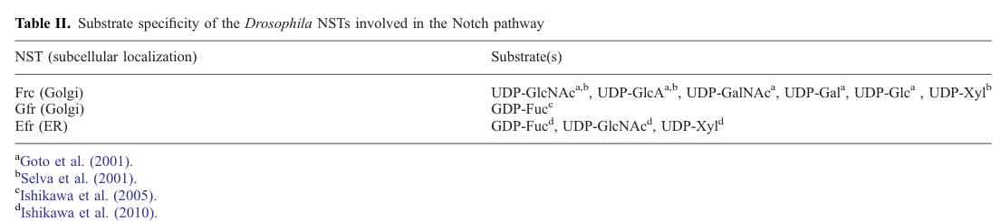

## Question

# Gene Research for Functional Annotation

## ⚠️ CRITICAL: Gene/Protein Identification Context

**BEFORE YOU BEGIN RESEARCH:** You MUST verify you are researching the CORRECT gene/protein. Gene symbols can be ambiguous, especially for less well-characterized genes from non-model organisms.

### Target Gene/Protein Identity (from UniProt):
- **UniProt Accession:** Q95YI5
- **Protein Description:** RecName: Full=UDP-sugar transporter UST74c; AltName: Full=Protein fringe connection;
- **Gene Information:** Name=frc; Synonyms=UST74C; ORFNames=CG3874;
- **Organism (full):** Drosophila melanogaster (Fruit fly).
- **Protein Family:** Belongs to the TPT transporter family. SLC35D subfamily.
- **Key Domains:** Sugar_P_trans_dom. (IPR004853); TPT_transporter. (IPR050186); TPT (PF03151)

### MANDATORY VERIFICATION STEPS:

1. **Check if the gene symbol "frc" matches the protein description above**
2. **Verify the organism is correct:** Drosophila melanogaster (Fruit fly).
3. **Check if protein family/domains align with what you find in literature**
4. **If you find literature for a DIFFERENT gene with the same or similar symbol, STOP**

### If Gene Symbol is Ambiguous or You Cannot Find Relevant Literature:

**DO NOT PROCEED WITH RESEARCH ON A DIFFERENT GENE.** Instead:
- State clearly: "The gene symbol 'frc' is ambiguous or literature is limited for this specific protein"
- Explain what you found (e.g., "Found extensive literature on a different gene with the same symbol in a different organism")
- Describe the protein based ONLY on the UniProt information provided above
- Suggest that the protein function can be inferred from domain/family information

### Research Target:

Please provide a comprehensive research report on the gene **frc** (gene ID: frc, UniProt: Q95YI5) in DROME.

The research report should be a detailed narrative explaining the function, biological processes, and localization of the gene product. Citations should be given for all claims.

You should prioritize authoritative reviews and primary scientific literature when conducting research. You can supplement
this with annotations you find in gene/protein databases, but these can be outdated or inaccurate.

We are specifically interested in the primary function of the gene - for enzymes, what reaction is catalyzed, and what is the substrate specificity? For transporters, what is the substrate? For structural proteins or adapters, what is the broader structural role? For signaling molecules, what is the role in the pathway.

We are interested in where in or outside the cell the gene product carries out its function.

We are also interested in the signaling or biochemical pathways in which the gene functions. We are less interested in broad pleiotropic effects, except where these elucidate the precise role.

Include evidence where possible. We are interested in both experimental evidence as well as inference from structure, evolution, or bioinformatic analysis. Precise studies should be prioritized over high-throughput, where available.

## Output

Question: You are an expert researcher providing comprehensive, well-cited information.

Provide detailed information focusing on:
1. Key concepts and definitions with current understanding
2. Recent developments and latest research (prioritize 2023-2024 sources)
3. Current applications and real-world implementations
4. Expert opinions and analysis from authoritative sources
5. Relevant statistics and data from recent studies

Format as a comprehensive research report with proper citations. Include URLs and publication dates where available.
Always prioritize recent, authoritative sources and provide specific citations for all major claims.

# Gene Research for Functional Annotation

## ⚠️ CRITICAL: Gene/Protein Identification Context

**BEFORE YOU BEGIN RESEARCH:** You MUST verify you are researching the CORRECT gene/protein. Gene symbols can be ambiguous, especially for less well-characterized genes from non-model organisms.

### Target Gene/Protein Identity (from UniProt):
- **UniProt Accession:** Q95YI5
- **Protein Description:** RecName: Full=UDP-sugar transporter UST74c; AltName: Full=Protein fringe connection;
- **Gene Information:** Name=frc; Synonyms=UST74C; ORFNames=CG3874;
- **Organism (full):** Drosophila melanogaster (Fruit fly).
- **Protein Family:** Belongs to the TPT transporter family. SLC35D subfamily.
- **Key Domains:** Sugar_P_trans_dom. (IPR004853); TPT_transporter. (IPR050186); TPT (PF03151)

### MANDATORY VERIFICATION STEPS:

1. **Check if the gene symbol "frc" matches the protein description above**
2. **Verify the organism is correct:** Drosophila melanogaster (Fruit fly).
3. **Check if protein family/domains align with what you find in literature**
4. **If you find literature for a DIFFERENT gene with the same or similar symbol, STOP**

### If Gene Symbol is Ambiguous or You Cannot Find Relevant Literature:

**DO NOT PROCEED WITH RESEARCH ON A DIFFERENT GENE.** Instead:
- State clearly: "The gene symbol 'frc' is ambiguous or literature is limited for this specific protein"
- Explain what you found (e.g., "Found extensive literature on a different gene with the same symbol in a different organism")
- Describe the protein based ONLY on the UniProt information provided above
- Suggest that the protein function can be inferred from domain/family information

### Research Target:

Please provide a comprehensive research report on the gene **frc** (gene ID: frc, UniProt: Q95YI5) in DROME.

The research report should be a detailed narrative explaining the function, biological processes, and localization of the gene product. Citations should be given for all claims.

You should prioritize authoritative reviews and primary scientific literature when conducting research. You can supplement
this with annotations you find in gene/protein databases, but these can be outdated or inaccurate.

We are specifically interested in the primary function of the gene - for enzymes, what reaction is catalyzed, and what is the substrate specificity? For transporters, what is the substrate? For structural proteins or adapters, what is the broader structural role? For signaling molecules, what is the role in the pathway.

We are interested in where in or outside the cell the gene product carries out its function.

We are also interested in the signaling or biochemical pathways in which the gene functions. We are less interested in broad pleiotropic effects, except where these elucidate the precise role.

Include evidence where possible. We are interested in both experimental evidence as well as inference from structure, evolution, or bioinformatic analysis. Precise studies should be prioritized over high-throughput, where available.

# Functional annotation of *Drosophila melanogaster* **fringe connection** (*frc*)

## Identity and principal function

**Identity check.** The target is the fruit-fly gene *frc* (**CG3874**), called *fringe connection*, not another organism’s gene with the same symbol. The supplied UniProt accession **Q95YI5** and protein name **UST74c** specify the target; the independently examined literature confirms the *frc*–CG3874 assignment and places its product among SLC35D-related nucleotide-sugar transporters. The supplied Sugar_P_trans_dom/TPT domain annotations are consistent with this membrane-transport function, but do not independently determine its substrates. (kamiyama2024solutecarrierfamily pages 6-8, kamiyama2024solutecarrierfamily pages 21-22)

**Primary activity.** Frc transports activated **UDP sugars from the cytosol into the Golgi lumen**, supplying donor substrates to lumen-facing glycosylation reactions. It is a transporter, **not** the Fringe glycosyltransferase and not an enzyme that directly adds sugar to Notch. UDP-N-acetylglucosamine (**UDP-GlcNAc**) and UDP-glucuronic acid (**UDP-GlcA**, also termed UDP-GlcUA) are the clearest substrates because both foundational heterologous transport studies detected them. UDP-xylose (**UDP-Xyl**) was detected in one of those systems and is included in the 2024 review’s functional summary. Countertransport involving UDP and/or UMP has been *proposed*; the reviewed evidence does not establish a definitive physiological exchange stoichiometry for fly Frc. (kamiyama2024solutecarrierfamily pages 21-22, jafarnejad2010roleofglycans pages 11-12, jafarnejad2010roleofglycans pages 12-13)

## Experimental substrate specificity and localization

The substrate list depends on the assay. **Goto and colleagues (2001)** reported transport of UDP-GalNAc, UDP-GlcA, UDP-Gal, UDP-Glc and UDP-GlcNAc using yeast cell-free microsomes. **Selva and colleagues (2001)** detected UDP-GlcNAc, UDP-GlcA and UDP-Xyl transport using *Leishmania* microsomal vesicles, but did **not** detect UDP-Glc or UDP-Gal transport in that system. Consequently, it would overstate the evidence to treat every reported sugar as an equally established physiological substrate or to infer relative transport rates from these qualitative findings. The cropped substrate table in the Notch-glycosylation review identifies which original study reported each substrate. (jafarnejad2010roleofglycans pages 11-12, jafarnejad2010roleofglycans pages 12-13, jafarnejad2010roleofglycans media d5fae537)

The evidence and its implications are summarized below.

| Evidence / interpretation | Experimental system or basis | Supported finding | Functional significance / caveat |
|---|---|---|---|
| Goto et al. (2001) | Frc expressed and assayed in a yeast cell-free microsomal system | Transport detected for UDP-GalNAc, UDP-GlcA, UDP-Gal, UDP-Glc and UDP-GlcNAc (jafarnejad2010roleofglycans pages 12-13) | Indicates broad UDP-sugar specificity; no quantitative uptake values are available in the retrieved evidence. |
| Selva et al. (2001) | Frc assayed with *Leishmania* microsomal vesicles | Transport detected for UDP-GlcNAc, UDP-GlcA and UDP-Xyl; UDP-Glc and UDP-Gal transport was not detected (jafarnejad2010roleofglycans pages 12-13) | Supports a narrower profile than the yeast assay and directly connects Frc substrates to proteoglycan synthesis. |
| Most reproducible substrates | Agreement between both heterologous membrane assays | UDP-GlcNAc and UDP-GlcA were positive in both systems (jafarnejad2010roleofglycans pages 11-12, jafarnejad2010roleofglycans pages 12-13) | These are the strongest experimentally replicated substrate assignments; UDP-Xyl was tested/reported only in the Selva profile. |
| Assay disagreement | Comparison of yeast and *Leishmania* microsomes | UDP-Glc and UDP-Gal were positive in yeast but negative in *Leishmania*; UDP-GalNAc was reported in yeast, whereas UDP-Xyl was reported in *Leishmania* (jafarnejad2010roleofglycans pages 12-13) | The discrepancy may reflect expression host, membrane preparation, counter-substrate availability or assay conditions; it should not be converted into an unsupported substrate ranking. |
| Cellular localization and direction | Localization plus transporter studies | Frc/CG3874 is Golgi-localized and moves UDP sugars from the cytosol into the Golgi lumen; UDP/UMP countertransport has been proposed (kamiyama2024solutecarrierfamily pages 21-22, jafarnejad2010roleofglycans pages 11-12) | Places Frc where lumen-facing glycosyltransferases require cytosol-derived nucleotide sugars. ER localization of Drosophila Frc is not established. |
| Fringe–Notch mechanism | Genetics, localization and UDP-GlcNAc transport | Frc is inferred to provide UDP-GlcNAc for Fringe-mediated addition of GlcNAc to O-fucose on Notch EGF repeats; frc and fringe show phenotypic similarity and dosage-sensitive genetic interaction (jafarnejad2010roleofglycans pages 11-12, jafarnejad2010roleofglycans pages 12-13) | Strong mechanistic model, but the retrieved evidence does not show direct purified-Fringe glycan quantification in frc mutants. |
| Heparan-sulfate pathway | Substrate requirements and mutant signaling phenotypes | UDP-Xyl, UDP-GlcA and UDP-GlcNAc support proteoglycan linkage/HS-chain biosynthesis; altered Frc levels affect HSPG expression, consistent with Wingless, Hedgehog and FGF defects (kamiyama2024solutecarrierfamily pages 21-22, jafarnejad2010roleofglycans pages 11-12) | HS impairment plausibly explains several non-Fringe phenotypes, but retrieved sources provide no quantitative HS-composition values. |
| Human homolog distinction | Comparative SLC35D-family evidence | Human SLC35D2/hFRC1 is a distinct Golgi protein reported to transport UDP-GlcNAc and UDP-Glc; GDP-Man transport appeared only in yeast. Human SLC35D1 is ER-localized (kamiyama2024solutecarrierfamily pages 21-22) | Human SLC35D2 results must not be attributed directly to Drosophila Frc; homologous transporters have overlapping but non-identical substrate profiles and localization. |

*Table: Comparison of the two foundational heterologous transport assays and the mechanistic evidence linking Drosophila Frc to Golgi glycosylation, Notch–Fringe signaling, and heparan-sulfate synthesis. The table highlights replicated substrates, assay disagreement, and the distinction from human SLC35D2.*

Frc is reported at the **Golgi membrane**, where its transport activity makes cytosol-derived nucleotide sugars accessible to glycosyltransferases in the organelle’s lumen. This is the supported site of its primary action; neither secretion of Frc nor an established ER-resident pool of fly Frc follows from the reviewed studies. Proposals that Golgi-imported sugars might reach ER glycosylation reactions by retrograde traffic remain hypotheses. (kamiyama2024solutecarrierfamily pages 21-22, jafarnejad2010roleofglycans pages 11-12, jafarnejad2010roleofglycans pages 12-13)

## Pathways supported by genetic and biochemical evidence

**Fringe-dependent Notch regulation.** Fringe adds GlcNAc from UDP-GlcNAc to **O-linked fucose on selected Notch extracellular EGF-like repeats**, modifying Notch signaling. Frc’s Golgi location and measured UDP-GlcNAc transport provide a mechanism for supplying that reaction. Fly *frc* and *fringe* mutants have overlapping developmental phenotypes, and reducing *frc* dosage enhances a *fringe*-associated mechanosensory-organ phenotype. This is strong convergent evidence that Frc supports Fringe-dependent Notch modification, although the retrieved evidence does not provide a direct quantitative measurement of the specific Notch O-fucose–GlcNAc glycan in *frc*-null animals. (jafarnejad2010roleofglycans pages 11-12, jafarnejad2010roleofglycans pages 12-13)

**Heparan-sulfate proteoglycan (HSPG) synthesis.** UDP-Xyl, UDP-GlcA and UDP-GlcNAc contribute to proteoglycan linkage-region formation and/or heparan-sulfate chain assembly. Altering Frc levels affects HSPG expression in fly embryos; maternal-and-zygotic *frc* loss also disrupts signaling involving **FGF, Wingless and Hedgehog**, pathways dependent on HSPGs. Thus, donor-sugar supply for proteoglycan biosynthesis is a well-supported explanation for much of Frc’s signaling phenotype, rather than evidence that Frc directly binds those signaling proteins. The accessible reviews do not provide a numerical change in fly heparan-sulfate abundance or composition. (kamiyama2024solutecarrierfamily pages 21-22, jafarnejad2010roleofglycans pages 11-12)

**Not all Notch phenotypes can be assigned to Fringe alone.** Approximately **30%** of embryos lacking both maternal and zygotic *frc* were reported to have a classic neurogenic phenotype, consistent with impaired Notch-dependent lateral inhibition; *fringe* mutants do not reproduce that particular defect. Suggested additional mechanisms include altered HSPGs, glycosphingolipids or other Notch glycans, but the available evidence does not resolve which accounts for the neurogenic phenotype. In particular, ER O-glucose/O-xylose supply should not be annotated as a demonstrated direct Frc function. (jafarnejad2010roleofglycans pages 12-13)

## Current interpretation and practical relevance

A **2024 SLC35-family review** continues to identify fly *frc* (CG3874) as a multisubstrate transporter carrying UDP-GlcUA, UDP-GlcNAc and UDP-Xyl into the Golgi and links its loss to Notch, Wingless, Hedgehog and FGF defects. It also identifies human **SLC35D2/hFRC1** as a *homolog*, **not the fly protein**. Human SLC35D2 has its own experimentally reported substrate profile, while human SLC35D1 is described as ER-localized; neither human-specific result should be transferred uncritically to *Drosophila* Frc. The two human proteins are reported to share **54.3% amino-acid identity**, a comparison between those human proteins rather than a measured identity with fly Frc. (kamiyama2024solutecarrierfamily pages 21-22)

The established real-world use of *frc* is as a **genetic and biochemical model for compartmentalized glycosylation and developmental signaling**: loss-of-function phenotypes connect nucleotide-sugar delivery to Notch glycan regulation and HSPG-dependent signaling. Targeted searching retrieved a 2024 synthesis but no new **2023–2024 primary fly-*frc* transport study**; absence from this search is not evidence that none exists. No clinical use, therapy or fly-specific quantitative transport kinetics can be substantiated from the reviewed material. (kamiyama2024solutecarrierfamily pages 21-22, jafarnejad2010roleofglycans pages 12-13)

### Principal publications and access

- **Kamiyama S, Sone H.** “Solute Carrier Family 35 (SLC35)—An Overview and Recent Progress.” *Biologics*, **August 2024**. https://doi.org/10.3390/biologics4030017 — recent review and comparative family context. (kamiyama2024solutecarrierfamily pages 21-22)
- **Jafar-Nejad H, Leonardi J, Fernandez-Valdivia R.** “Role of glycans and glycosyltransferases in the regulation of Notch signaling.” *Glycobiology*, **August 2010**. https://doi.org/10.1093/glycob/cwq053 — detailed attribution of fly Frc transport assays, localization and genetic evidence; see its Table II. (jafarnejad2010roleofglycans pages 11-12, jafarnejad2010roleofglycans pages 12-13, jafarnejad2010roleofglycans media d5fae537)
- **Goto S et al.** “UDP–sugar transporter implicated in glycosylation and processing of Notch.” *Nature Cell Biology*, **September 2001**. https://doi.org/10.1038/ncb0901-816. **Selva EM et al.** “Dual role of the fringe connection gene in both heparan sulphate and fringe-dependent signalling events.” *Nature Cell Biology*, **September 2001**. https://doi.org/10.1038/ncb0901-809. These are the foundational primary reports; their assay-specific findings above are cited through the accessible review because their full texts were not available for direct inspection here. (kamiyama2024solutecarrierfamily pages 21-22, jafarnejad2010roleofglycans pages 11-12, jafarnejad2010roleofglycans pages 12-13)

References

1. (kamiyama2024solutecarrierfamily pages 6-8): Shin Kamiyama and Hideyuki Sone. Solute carrier family 35 (slc35)—an overview and recent progress. Biologics, 4:242-279, Aug 2024. URL: https://doi.org/10.3390/biologics4030017, doi:10.3390/biologics4030017. This article has 15 citations and is from a peer-reviewed journal.

2. (kamiyama2024solutecarrierfamily pages 21-22): Shin Kamiyama and Hideyuki Sone. Solute carrier family 35 (slc35)—an overview and recent progress. Biologics, 4:242-279, Aug 2024. URL: https://doi.org/10.3390/biologics4030017, doi:10.3390/biologics4030017. This article has 15 citations and is from a peer-reviewed journal.

3. (jafarnejad2010roleofglycans pages 11-12): H. Jafar-Nejad, Jessica Leonardi, and R. Fernandez‐Valdivia. Role of glycans and glycosyltransferases in the regulation of notch signaling. Glycobiology, 20 8:931-49, Aug 2010. URL: https://doi.org/10.1093/glycob/cwq053, doi:10.1093/glycob/cwq053. This article has 92 citations and is from a peer-reviewed journal.

4. (jafarnejad2010roleofglycans pages 12-13): H. Jafar-Nejad, Jessica Leonardi, and R. Fernandez‐Valdivia. Role of glycans and glycosyltransferases in the regulation of notch signaling. Glycobiology, 20 8:931-49, Aug 2010. URL: https://doi.org/10.1093/glycob/cwq053, doi:10.1093/glycob/cwq053. This article has 92 citations and is from a peer-reviewed journal.

5. (jafarnejad2010roleofglycans media d5fae537): H. Jafar-Nejad, Jessica Leonardi, and R. Fernandez‐Valdivia. Role of glycans and glycosyltransferases in the regulation of notch signaling. Glycobiology, 20 8:931-49, Aug 2010. URL: https://doi.org/10.1093/glycob/cwq053, doi:10.1093/glycob/cwq053. This article has 92 citations and is from a peer-reviewed journal.

## Artifacts

- [Edison artifact artifact-00](frc-deep-research-falcon_artifacts/artifact-00.md)

## Citations

1. jafarnejad2010roleofglycans pages 12-13
2. kamiyama2024solutecarrierfamily pages 21-22
3. kamiyama2024solutecarrierfamily pages 6-8
4. jafarnejad2010roleofglycans pages 11-12
5. https://doi.org/10.3390/biologics4030017
6. https://doi.org/10.1093/glycob/cwq053
7. https://doi.org/10.1038/ncb0901-816.
8. https://doi.org/10.1038/ncb0901-809.
9. https://doi.org/10.3390/biologics4030017,
10. https://doi.org/10.1093/glycob/cwq053,