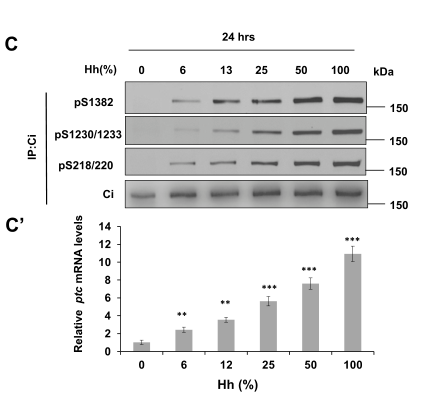

## Question

# Gene Research for Functional Annotation

## ⚠️ CRITICAL: Gene/Protein Identification Context

**BEFORE YOU BEGIN RESEARCH:** You MUST verify you are researching the CORRECT gene/protein. Gene symbols can be ambiguous, especially for less well-characterized genes from non-model organisms.

### Target Gene/Protein Identity (from UniProt):
- **UniProt Accession:** P23647
- **Protein Description:** RecName: Full=Serine/threonine-protein kinase fused; EC=2.7.11.1;
- **Gene Information:** Name=fu; ORFNames=CG6551;
- **Organism (full):** Drosophila melanogaster (Fruit fly).
- **Protein Family:** Belongs to the protein kinase superfamily. Ser/Thr protein
- **Key Domains:** Kinase-like_dom_sf. (IPR011009); Prot_kinase_dom. (IPR000719); Protein_kinase_ATP_BS. (IPR017441); Ser/Thr_kinase_AS. (IPR008271); Pkinase (PF00069)

### MANDATORY VERIFICATION STEPS:

1. **Check if the gene symbol "fu" matches the protein description above**
2. **Verify the organism is correct:** Drosophila melanogaster (Fruit fly).
3. **Check if protein family/domains align with what you find in literature**
4. **If you find literature for a DIFFERENT gene with the same or similar symbol, STOP**

### If Gene Symbol is Ambiguous or You Cannot Find Relevant Literature:

**DO NOT PROCEED WITH RESEARCH ON A DIFFERENT GENE.** Instead:
- State clearly: "The gene symbol 'fu' is ambiguous or literature is limited for this specific protein"
- Explain what you found (e.g., "Found extensive literature on a different gene with the same symbol in a different organism")
- Describe the protein based ONLY on the UniProt information provided above
- Suggest that the protein function can be inferred from domain/family information

### Research Target:

Please provide a comprehensive research report on the gene **fu** (gene ID: fu, UniProt: P23647) in DROME.

The research report should be a detailed narrative explaining the function, biological processes, and localization of the gene product. Citations should be given for all claims.

You should prioritize authoritative reviews and primary scientific literature when conducting research. You can supplement
this with annotations you find in gene/protein databases, but these can be outdated or inaccurate.

We are specifically interested in the primary function of the gene - for enzymes, what reaction is catalyzed, and what is the substrate specificity? For transporters, what is the substrate? For structural proteins or adapters, what is the broader structural role? For signaling molecules, what is the role in the pathway.

We are interested in where in or outside the cell the gene product carries out its function.

We are also interested in the signaling or biochemical pathways in which the gene functions. We are less interested in broad pleiotropic effects, except where these elucidate the precise role.

Include evidence where possible. We are interested in both experimental evidence as well as inference from structure, evolution, or bioinformatic analysis. Precise studies should be prioritized over high-throughput, where available.

## Output

Question: You are an expert researcher providing comprehensive, well-cited information.

Provide detailed information focusing on:
1. Key concepts and definitions with current understanding
2. Recent developments and latest research (prioritize 2023-2024 sources)
3. Current applications and real-world implementations
4. Expert opinions and analysis from authoritative sources
5. Relevant statistics and data from recent studies

Format as a comprehensive research report with proper citations. Include URLs and publication dates where available.
Always prioritize recent, authoritative sources and provide specific citations for all major claims.

# Gene Research for Functional Annotation

## ⚠️ CRITICAL: Gene/Protein Identification Context

**BEFORE YOU BEGIN RESEARCH:** You MUST verify you are researching the CORRECT gene/protein. Gene symbols can be ambiguous, especially for less well-characterized genes from non-model organisms.

### Target Gene/Protein Identity (from UniProt):
- **UniProt Accession:** P23647
- **Protein Description:** RecName: Full=Serine/threonine-protein kinase fused; EC=2.7.11.1;
- **Gene Information:** Name=fu; ORFNames=CG6551;
- **Organism (full):** Drosophila melanogaster (Fruit fly).
- **Protein Family:** Belongs to the protein kinase superfamily. Ser/Thr protein
- **Key Domains:** Kinase-like_dom_sf. (IPR011009); Prot_kinase_dom. (IPR000719); Protein_kinase_ATP_BS. (IPR017441); Ser/Thr_kinase_AS. (IPR008271); Pkinase (PF00069)

### MANDATORY VERIFICATION STEPS:

1. **Check if the gene symbol "fu" matches the protein description above**
2. **Verify the organism is correct:** Drosophila melanogaster (Fruit fly).
3. **Check if protein family/domains align with what you find in literature**
4. **If you find literature for a DIFFERENT gene with the same or similar symbol, STOP**

### If Gene Symbol is Ambiguous or You Cannot Find Relevant Literature:

**DO NOT PROCEED WITH RESEARCH ON A DIFFERENT GENE.** Instead:
- State clearly: "The gene symbol 'fu' is ambiguous or literature is limited for this specific protein"
- Explain what you found (e.g., "Found extensive literature on a different gene with the same symbol in a different organism")
- Describe the protein based ONLY on the UniProt information provided above
- Suggest that the protein function can be inferred from domain/family information

### Research Target:

Please provide a comprehensive research report on the gene **fu** (gene ID: fu, UniProt: P23647) in DROME.

The research report should be a detailed narrative explaining the function, biological processes, and localization of the gene product. Citations should be given for all claims.

You should prioritize authoritative reviews and primary scientific literature when conducting research. You can supplement
this with annotations you find in gene/protein databases, but these can be outdated or inaccurate.

We are specifically interested in the primary function of the gene - for enzymes, what reaction is catalyzed, and what is the substrate specificity? For transporters, what is the substrate? For structural proteins or adapters, what is the broader structural role? For signaling molecules, what is the role in the pathway.

We are interested in where in or outside the cell the gene product carries out its function.

We are also interested in the signaling or biochemical pathways in which the gene functions. We are less interested in broad pleiotropic effects, except where these elucidate the precise role.

Include evidence where possible. We are interested in both experimental evidence as well as inference from structure, evolution, or bioinformatic analysis. Precise studies should be prioritized over high-throughput, where available.

# Functional annotation report: *fu* (Fused), *Drosophila melanogaster*

## Identity and principal function

The specified target is **Fused (Fu)**, the product of the *D. melanogaster fu* gene identified in the supplied UniProt record as **P23647/CG6551**. This identification is consistent with fly studies describing Fu as an approximately 805-residue **serine/threonine protein kinase** with an N-terminal catalytic domain and C-terminal regulatory region, matching the supplied kinase-domain annotations. **Suppressor of fused [Su(fu)] is a different protein**, and mammalian STK36 is a related kinase, not the fly protein under investigation. The accession and CG number come from the supplied UniProt identification; the cited research independently corroborates the organism, Fu name, protein class, and domain organization. (maloverjan2012mammalianhomologuesof pages 7-10, monnier2002hedgehogsignaltransduction pages 2-5, maloverjan2012mammalianhomologuesof pages 10-13)

**Primary annotation:** Fu is an intracellular Hedgehog (Hh)-signal transduction kinase that helps convert full-length **Cubitus interruptus (Ci)** into an active transcriptional regulator. Its catalytic reaction is transfer of phosphate from ATP to serine or threonine residues on protein substrates: **ATP + protein–Ser/Thr → ADP + protein–phospho-Ser/Thr**. Directly supported substrates include Ci, especially **S218, S1230, and S1382**, and the signaling scaffold **Costal2 (Cos2)** at reported sites **S572 and S931**. Fu also has an essential regulatory role beyond simply being catalytically active: its own phosphorylation and organization within protein complexes help make Ci accessible to phosphorylation. Fu is **not** the kinase primarily responsible for the PKA/GSK3/CK1 phosphorylation sequence that produces the truncated Ci repressor when Hh is absent. (zhou2022dosedependentphosphorylationand pages 1-2, maloverjan2012mammalianhomologuesof pages 7-10, han2025morphogeninducedkinasecondensates pages 2-3, han2025morphogeninducedkinasecondensates pages 3-4)

The following evidence hierarchy distinguishes established substrates from phosphorylation events whose functional importance is less certain.

| Target / site(s) | Biochemical and genetic evidence | Physiological interpretation / limits |
|---|---|---|
| **Ci S218 → CK1 S220** | Fu directly phosphorylates Ci S218, priming CK1 phosphorylation at S220; phospho-specific assays show Hh-dependent modification. Physiological *ci* alleles and Fu-activation experiments support a functional requirement for this region (zhou2022dosedependentphosphorylationand pages 3-5, han2025morphogeninducedkinasecondensates pages 2-3, kim2025hedgehogstimulatedphosphorylationat pages 23-25) | Contributes to conversion of full-length Ci into an active conformation. Its effects persist without Su(fu) or Cos2, favoring disruption of inhibitory Ci–Ci contacts rather than merely releasing Ci from those partners (kim2025hedgehogstimulatedphosphorylationat pages 23-25, kim2025hedgehogstimulatedphosphorylationat pages 16-19) |
| **Ci S1230 → CK1 S1233** | Fu directly phosphorylates S1230 and primes adjacent CK1 phosphorylation; combined S218A/S1230A substitutions strongly impair Fu-dependent Ci activation (zhou2022dosedependentphosphorylationand pages 1-2, zhou2022dosedependentphosphorylationand pages 3-5, kim2025hedgehogstimulatedphosphorylationat pages 23-25) | S1230 acts cooperatively with other Ci sites. Individual-site effects are modest, and additional Fu-responsive residues remain because signaling is not completely eliminated by combined known-site mutations (zhou2022dosedependentphosphorylationand pages 3-5, kim2025hedgehogstimulatedphosphorylationat pages 16-19) |
| **Ci S1382 → CK1 S1385** | Sequential in-vitro kinase assays show direct Fu phosphorylation of S1382 followed by CK1 phosphorylation of S1385. Endogenous phosphorylation rises with Hh dose and exposure time (zhou2022dosedependentphosphorylationand pages 1-2, zhou2022dosedependentphosphorylationand pages 3-5) | Located within a C-terminal Su(fu)-binding region and can weaken that interface, but current physiological evidence argues against obligatory wholesale Ci–Su(fu) dissociation (kim2025hedgehogstimulatedphosphorylationat pages 23-25, kim2025hedgehogstimulatedphosphorylationat pages 21-23) |
| **Cos2 S572 and S931** | Reported direct Fu phosphorylation sites. At physiological Cos2 expression, S572A/S931A modestly reduced Fu-dependent Ci-155 elevation and lowered *ptc-lacZ* induction from **59% to 42%** of control AP-border activity (maloverjan2012mammalianhomologuesof pages 7-10, kim2025hedgehogstimulatedphosphorylationat pages 16-19) | Cos2 phosphorylation contributes to, but does not account for, Fu output: Ci stabilization and signaling persist with nonphosphorylatable Cos2, demonstrating additional Fu targets and strong context dependence (kim2025hedgehogstimulatedphosphorylationat pages 16-19) |
| **Su(fu), multiple Fu-dependent sites** | Hh induces Su(fu) hyperphosphorylation that is reduced in *fu* mutants, but residual phosphorylation indicates other kinases. Direct Fu-to-Su(fu) catalysis remains less secure than direct Ci phosphorylation (dussillolgodar2006modulationofthe pages 13-14, maloverjan2012mammalianhomologuesof pages 7-10) | Altering known Fu/CK1 sites in Su(fu), alone or with Cos2-site mutations, caused no major loss of AP-border signaling or adult-wing patterning; Su(fu) phosphorylation is therefore not demonstrated to be essential in available in-vivo assays (kim2025hedgehogstimulatedphosphorylationat pages 2-4, kim2025hedgehogstimulatedphosphorylationat pages 16-19) |
| **Fu T158/S159 activation loop** | Hh-dependent activation-loop phosphorylation marks catalytic activation; kinase-dead Fu K33R does not support Ci phosphorylation or *ptc* induction (han2025morphogeninducedkinasecondensates pages 2-3) | Represents Fu self-activation/cross-phosphorylation rather than an external substrate event. Catalytic activation is necessary but not sufficient for high-level Ci activation (han2025morphogeninducedkinasecondensates pages 3-4, han2025morphogeninducedkinasecondensates pages 2-3) |
| **Fu S482 regulatory region** | Hh stimulates Fu autophosphorylation at S482, which primes CK1 modification at S485/T486. S482A retains detectable catalytic activity yet fails to support normal Ci phosphorylation, *ptc* induction, or mutant rescue (han2025morphogeninducedkinasecondensates pages 2-3) | Defines a noncatalytic regulatory requirement that promotes Fu maturation, substrate accessibility, and high-threshold signaling; it should not be annotated as a separate protein substrate (han2025morphogeninducedkinasecondensates pages 3-4) |

*Table: Evidence hierarchy for experimentally studied phosphorylation events involving Drosophila melanogaster Fused (fu; P23647). The table distinguishes direct Ci substrates and Fu self-regulation from context-dependent Cos2 effects and uncertain or dispensable Su(fu) phosphorylation.*

## Pathway mechanism and biological process

**Without Hh**, Cos2 organizes a cytoplasmic complex containing Fu and Ci, with Su(fu) participating in Ci regulation. The complex associates with microtubules through Cos2. Cos2-associated kinases including PKA, GSK3, and CK1 favor phosphorylation and partial proteolysis of full-length Ci into a transcriptional repressor; Su(fu) also limits the activity of full-length Ci. Fu’s principal *positive* signaling role is therefore not simply to prevent Ci cleavage, but to promote transcriptional activation of the full-length protein after pathway stimulation. (monnier2002hedgehogsignaltransduction pages 2-5, zhou2022dosedependentphosphorylationand pages 1-2, kim2025hedgehogstimulatedphosphorylationat pages 4-6)

**With Hh**, relief of Patched-mediated inhibition activates Smoothened (Smo). Experiments in fly cells and wing discs support Hh-dependent recruitment of Cos2–Fu toward activated Smo at the **plasma membrane**, followed by Fu clustering/dimerization and phosphorylation. Fu activity promotes phosphorylation of Ci and Cos2; CK1 can then extend Ci phosphorylation at neighboring residues. Fu-dependent Ci phosphorylation helps generate transcriptionally active Ci, which acts at Hh target genes including *patched* (*ptc*). Importantly, the specific binding changes within these complexes depend on signaling state and experimental conditions; a simple, obligatory release of all Su(fu) from Ci is **not** supported by the most recent physiological genetics. (zhang2011transductionofthe pages 1-2, zhang2011transductionofthe pages 2-4, zhou2022dosedependentphosphorylationand pages 1-2, kim2025hedgehogstimulatedphosphorylationat pages 1-2)

Fu directly phosphorylates Ci **S1382** in sequential in-vitro kinase experiments, priming adjacent **CK1-dependent S1385** phosphorylation; earlier work identified Fu-initiated phosphorylation around **S218/S220** and **S1230/S1233**. The site-specific recognition is thus of selected Ci regulatory regions rather than indiscriminate phosphorylation of any Ser/Thr-containing protein. At the same time, combined mutations of currently known sites do not eliminate all Fu responses, so a complete inventory of physiologically relevant substrates and sites remains unresolved. (zhou2022dosedependentphosphorylationand pages 1-2, zhou2022dosedependentphosphorylationand pages 3-5, kim2025hedgehogstimulatedphosphorylationat pages 16-19)

**Physiological evidence is more nuanced for the other proposed substrates.** Fu phosphorylation of Cos2 at S572/S931 has biochemical support, and nonphosphorylatable Cos2 modestly reduces Fu-dependent Ci stabilization under physiological-expression conditions. Hh-induced Su(fu) phosphorylation is reduced in *fu* mutants, but other kinases can contribute, and removing known Su(fu) phosphorylation sites has not shown that those sites are required for the principal wing-disc Hh response. Accordingly, annotating Ci phosphorylation as a central Fu output is better supported than treating Su(fu) phosphorylation as the indispensable switch. (maloverjan2012mammalianhomologuesof pages 7-10, kim2025hedgehogstimulatedphosphorylationat pages 16-19, dussillolgodar2006modulationofthe pages 13-14)

## Where Fu acts

Fu is **primarily an intracellular signaling protein**, not a secreted Hedgehog ligand or a transmembrane receptor. In unstimulated fly cells it participates in **cytoplasmic**, Cos2-associated and microtubule-associated complexes; after Hh/Smo activation, a signaling fraction is recruited toward the **cytoplasmic face of the plasma membrane**. Recent cell-biological work reports Fu–Su(fu)–Ci **cytoplasmic condensates** and evidence for a **nuclear Ci–Su(fu)–Fu complex** associated with the *ptc* promoter. Thus, cytoplasm and transient membrane-associated complexes are well-established sites of pathway action, while the proposed nuclear Fu-containing activator complex adds a more recently characterized site of action. The **primary-cilium-tip** localization described for mammalian Ulk3/STK36-family signaling must not be assigned to fly Fu on that basis. (monnier2002hedgehogsignaltransduction pages 2-5, zhang2011transductionofthe pages 2-4, han2025morphogeninducedkinasecondensates pages 7-8, han2025morphogeninducedkinasecondensates pages 4-7, han2025morphogeninducedkinasecondensates pages 1-2)

## Recent mechanistic findings and quantitative evidence

**Graded phosphorylation, 2022.** Zhou and colleagues found that endogenous Ci phosphorylation at N-terminal **S218/220**, middle **S1230/1233**, and C-terminal **S1382** increases with Hh dose and tracks *ptc* expression. In Hh-treated Cl8 cells, phosphorylation became detectable at approximately **2 hours** and increased toward a plateau at **24 hours**. Multiple phosphomimetic substitutions increased Ci reporter activity more than individual substitutions. These observations support a model in which Fu-initiated, CK1-extended phosphorylation helps translate Hh concentration and duration into graded transcriptional output; much of the detailed functional testing used cultured-cell reporters or transgenes and should be interpreted alongside subsequent endogenous-locus experiments. The study was published **5 September 2022**: https://doi.org/10.26508/lsa.202201570. (zhou2022dosedependentphosphorylationand pages 1-2, zhou2022dosedependentphosphorylationand pages 3-5, zhou2022dosedependentphosphorylationand media 500e670e)

**Kinase maturation and condensates, 2025.** Han and colleagues separated Fu *catalytic activation* from a later step that permits efficient phosphorylation of Su(fu)-bound Ci. In their Cl8-cell Hh-conditioned-medium assay, approximately **12%** Hh medium sufficed for detectable Fu kinase activation, whereas **more than 50%** was needed for Fu maturation and Ci phosphorylation/activation; these percentages are **assay-specific medium dilutions**, not in-vivo ligand concentrations. They found that regulatory-region Fu phosphorylation, including **S482**, promotes SUMOylation at **K279/K490** and SUMO–SIM-dependent assembly of Fu-containing condensates. Condensates recruited Su(fu)–Ci, while biochemical and nuclear-association experiments supported a model in which activated Ci can remain in a Fu–Su(fu)-containing complex. This mechanism is supported by cell, biochemical, and fly-mutant assays, but its precise quantitative contribution across intact tissues remains an active question. Published **10 January 2025**: https://doi.org/10.1126/sciadv.adq1790. (han2025morphogeninducedkinasecondensates pages 4-7, han2025morphogeninducedkinasecondensates pages 3-4, han2025morphogeninducedkinasecondensates pages 7-8, han2025morphogeninducedkinasecondensates pages 8-10)

**Reassessment with physiological *ci* alleles, 2025.** Kim and colleagues used CRISPR-designed *ci* alleles and fly wing discs to test phosphorylation-site functions at endogenous expression. Fu-responsive Ci changes remained important **even without Su(fu) or Cos2**, favoring a model in which phosphorylation alters repressive **Ci–Ci interfaces and Ci conformation**, rather than merely detaching Ci from Su(fu). This does not exclude changes at one Ci–Su(fu) interface, but argues against **complete Su(fu) dissociation as an obligatory activation step**. In one physiological Cos2 comparison, activated Fu drove *ptc-lacZ* to **59%** of control anterior–posterior-border signal with wild-type Cos2 versus **42%** with Cos2-S572A/S931A: a measurable but partial contribution. Combined disruption of several known Fu-responsive Ci, Cos2, and Su(fu) sites still allowed substantial signaling, underscoring incomplete substrate mapping. Published **11 April 2025**: https://doi.org/10.1371/journal.pbio.3003105. (kim2025hedgehogstimulatedphosphorylationat pages 1-2, kim2025hedgehogstimulatedphosphorylationat pages 23-25, kim2025hedgehogstimulatedphosphorylationat pages 16-19)

**Interpretation of the literature.** Earlier models emphasized Cos2/Su(fu) phosphorylation and dissociation of Ci from inhibitory partners. The 2022–2025 studies establish direct Ci phosphorylation and indicate that **retention of some Su(fu) is compatible with Ci activation**. The condensate/allosteric-access and Ci–Ci-interface models are complementary possibilities, but their relative importance in every tissue and Hh-dose regime has not been settled. Searches emphasizing 2023–2024 did not identify an equally direct fly-*fu* mechanistic study; the directly informative newer experiments above were published in 2025 rather than misdated as 2023–2024. (zhang2011transductionofthe pages 1-2, zhou2022dosedependentphosphorylationand pages 1-2, han2025morphogeninducedkinasecondensates pages 4-7, kim2025hedgehogstimulatedphosphorylationat pages 1-2)

## Experimental applications and annotation boundaries

Fly *fu* alleles, wing-disc clones, phosphosite-mutant *ci* and *cos2* alleles, phospho-specific antibodies, and *ptc-lacZ* or engrailed expression are **research implementations** for measuring Hh signal strength and separating Ci processing from transcriptional activation. They provide experimentally tractable tests of kinase catalysis, scaffolding, protein localization, and morphogen-dose interpretation; they do **not** establish a clinical application of fly Fu itself. Vertebrate Fu-related kinases inform evolutionary comparisons, but findings for mammalian ciliary signaling should not replace direct evidence for the specified *Drosophila* protein. (kim2025hedgehogstimulatedphosphorylationat pages 4-6, zhou2022dosedependentphosphorylationand pages 3-5, kim2025hedgehogstimulatedphosphorylationat pages 16-19, maloverjan2012mammalianhomologuesof pages 10-13)

**Bottom line:** annotate P23647/Fu as a **regulated, intracellular Hh-pathway Ser/Thr kinase and signaling-complex component** whose best-substantiated direct functional output is phosphorylation-dependent activation of Ci. Record Cos2 phosphorylation as an additional supported, context-dependent output; distinguish Fu-dependent Su(fu) phosphorylation from a proven essential direct substrate reaction. Its action spans cytoplasmic complexes, Hh-induced membrane-associated signaling, and—on recent evidence—Fu-containing condensates and nuclear Ci-associated complexes. (zhou2022dosedependentphosphorylationand pages 1-2, kim2025hedgehogstimulatedphosphorylationat pages 16-19, han2025morphogeninducedkinasecondensates pages 4-7, han2025morphogeninducedkinasecondensates pages 7-8)

References

1. (maloverjan2012mammalianhomologuesof pages 7-10): Alla Maloverjan and Marko Piirsoo. Mammalian homologues of drosophila fused kinase. Vitamins and hormones, 88:91-113, Jan 2012. URL: https://doi.org/10.1016/b978-0-12-394622-5.00005-5, doi:10.1016/b978-0-12-394622-5.00005-5. This article has 10 citations.

2. (monnier2002hedgehogsignaltransduction pages 2-5): Véronique Monnier, Karen S Ho, Matthieu Sanial, Matthew P Scott, and Anne Plessis. Hedgehog signal transduction proteins: contacts of the fused kinase and ci transcription factor with the kinesin-related protein costal2. BMC Developmental Biology, 2:4-4, Mar 2002. URL: https://doi.org/10.1186/1471-213x-2-4, doi:10.1186/1471-213x-2-4. This article has 77 citations and is from a peer-reviewed journal.

3. (maloverjan2012mammalianhomologuesof pages 10-13): Alla Maloverjan and Marko Piirsoo. Mammalian homologues of drosophila fused kinase. Vitamins and hormones, 88:91-113, Jan 2012. URL: https://doi.org/10.1016/b978-0-12-394622-5.00005-5, doi:10.1016/b978-0-12-394622-5.00005-5. This article has 10 citations.

4. (zhou2022dosedependentphosphorylationand pages 1-2): Mengmeng Zhou, Yuhong Han, Bing Wang, Yong Suk Cho, and Jin Jiang. Dose-dependent phosphorylation and activation of hh pathway transcription factors. Life Science Alliance, 5:e202201570, Sep 2022. URL: https://doi.org/10.26508/lsa.202201570, doi:10.26508/lsa.202201570. This article has 10 citations and is from a peer-reviewed journal.

5. (han2025morphogeninducedkinasecondensates pages 2-3): Yuhong Han, Mengmeng Zhou, Bing Wang, and Jin Jiang. Morphogen-induced kinase condensates transduce hh signal by allosterically activating gli. Science Advances, Jan 2025. URL: https://doi.org/10.1126/sciadv.adq1790, doi:10.1126/sciadv.adq1790. This article has 10 citations and is from a highest quality peer-reviewed journal.

6. (han2025morphogeninducedkinasecondensates pages 3-4): Yuhong Han, Mengmeng Zhou, Bing Wang, and Jin Jiang. Morphogen-induced kinase condensates transduce hh signal by allosterically activating gli. Science Advances, Jan 2025. URL: https://doi.org/10.1126/sciadv.adq1790, doi:10.1126/sciadv.adq1790. This article has 10 citations and is from a highest quality peer-reviewed journal.

7. (zhou2022dosedependentphosphorylationand pages 3-5): Mengmeng Zhou, Yuhong Han, Bing Wang, Yong Suk Cho, and Jin Jiang. Dose-dependent phosphorylation and activation of hh pathway transcription factors. Life Science Alliance, 5:e202201570, Sep 2022. URL: https://doi.org/10.26508/lsa.202201570, doi:10.26508/lsa.202201570. This article has 10 citations and is from a peer-reviewed journal.

8. (kim2025hedgehogstimulatedphosphorylationat pages 23-25): Hoyon Kim, Jamie C. Little, Jiashen Li, Bryna Patel, and Daniel Kalderon. Hedgehog-stimulated phosphorylation at multiple sites activates ci by altering ci–ci interfaces without full suppressor of fused dissociation. PLOS Biology, 23:e3003105, Apr 2025. URL: https://doi.org/10.1371/journal.pbio.3003105, doi:10.1371/journal.pbio.3003105. This article has 3 citations and is from a highest quality peer-reviewed journal.

9. (kim2025hedgehogstimulatedphosphorylationat pages 16-19): Hoyon Kim, Jamie C. Little, Jiashen Li, Bryna Patel, and Daniel Kalderon. Hedgehog-stimulated phosphorylation at multiple sites activates ci by altering ci–ci interfaces without full suppressor of fused dissociation. PLOS Biology, 23:e3003105, Apr 2025. URL: https://doi.org/10.1371/journal.pbio.3003105, doi:10.1371/journal.pbio.3003105. This article has 3 citations and is from a highest quality peer-reviewed journal.

10. (kim2025hedgehogstimulatedphosphorylationat pages 21-23): Hoyon Kim, Jamie C. Little, Jiashen Li, Bryna Patel, and Daniel Kalderon. Hedgehog-stimulated phosphorylation at multiple sites activates ci by altering ci–ci interfaces without full suppressor of fused dissociation. PLOS Biology, 23:e3003105, Apr 2025. URL: https://doi.org/10.1371/journal.pbio.3003105, doi:10.1371/journal.pbio.3003105. This article has 3 citations and is from a highest quality peer-reviewed journal.

11. (dussillolgodar2006modulationofthe pages 13-14): François Dussillol-Godar, Jeanine Brissard-Zahraoui, Bernadette Limbourg-Bouchon, Dominique Boucher, Sylvaine Fouix, Claudie Lamour-Isnard, Anne Plessis, and Denise Busson. Modulation of the suppressor of fused protein regulates the hedgehog signaling pathway in drosophila embryo and imaginal discs. Developmental biology, 291 1:53-66, Mar 2006. URL: https://doi.org/10.1016/j.ydbio.2005.12.004, doi:10.1016/j.ydbio.2005.12.004. This article has 27 citations and is from a peer-reviewed journal.

12. (kim2025hedgehogstimulatedphosphorylationat pages 2-4): Hoyon Kim, Jamie C. Little, Jiashen Li, Bryna Patel, and Daniel Kalderon. Hedgehog-stimulated phosphorylation at multiple sites activates ci by altering ci–ci interfaces without full suppressor of fused dissociation. PLOS Biology, 23:e3003105, Apr 2025. URL: https://doi.org/10.1371/journal.pbio.3003105, doi:10.1371/journal.pbio.3003105. This article has 3 citations and is from a highest quality peer-reviewed journal.

13. (kim2025hedgehogstimulatedphosphorylationat pages 4-6): Hoyon Kim, Jamie C. Little, Jiashen Li, Bryna Patel, and Daniel Kalderon. Hedgehog-stimulated phosphorylation at multiple sites activates ci by altering ci–ci interfaces without full suppressor of fused dissociation. PLOS Biology, 23:e3003105, Apr 2025. URL: https://doi.org/10.1371/journal.pbio.3003105, doi:10.1371/journal.pbio.3003105. This article has 3 citations and is from a highest quality peer-reviewed journal.

14. (zhang2011transductionofthe pages 1-2): Yanyan Zhang, Feifei Mao, Yi Lu, Wenqing Wu, Lei Zhang, and Yun Zhao. Transduction of the hedgehog signal through the dimerization of fused and the nuclear translocation of cubitus interruptus. Cell Research, 21:1436-1451, Aug 2011. URL: https://doi.org/10.1038/cr.2011.136, doi:10.1038/cr.2011.136. This article has 66 citations and is from a domain leading peer-reviewed journal.

15. (zhang2011transductionofthe pages 2-4): Yanyan Zhang, Feifei Mao, Yi Lu, Wenqing Wu, Lei Zhang, and Yun Zhao. Transduction of the hedgehog signal through the dimerization of fused and the nuclear translocation of cubitus interruptus. Cell Research, 21:1436-1451, Aug 2011. URL: https://doi.org/10.1038/cr.2011.136, doi:10.1038/cr.2011.136. This article has 66 citations and is from a domain leading peer-reviewed journal.

16. (kim2025hedgehogstimulatedphosphorylationat pages 1-2): Hoyon Kim, Jamie C. Little, Jiashen Li, Bryna Patel, and Daniel Kalderon. Hedgehog-stimulated phosphorylation at multiple sites activates ci by altering ci–ci interfaces without full suppressor of fused dissociation. PLOS Biology, 23:e3003105, Apr 2025. URL: https://doi.org/10.1371/journal.pbio.3003105, doi:10.1371/journal.pbio.3003105. This article has 3 citations and is from a highest quality peer-reviewed journal.

17. (han2025morphogeninducedkinasecondensates pages 7-8): Yuhong Han, Mengmeng Zhou, Bing Wang, and Jin Jiang. Morphogen-induced kinase condensates transduce hh signal by allosterically activating gli. Science Advances, Jan 2025. URL: https://doi.org/10.1126/sciadv.adq1790, doi:10.1126/sciadv.adq1790. This article has 10 citations and is from a highest quality peer-reviewed journal.

18. (han2025morphogeninducedkinasecondensates pages 4-7): Yuhong Han, Mengmeng Zhou, Bing Wang, and Jin Jiang. Morphogen-induced kinase condensates transduce hh signal by allosterically activating gli. Science Advances, Jan 2025. URL: https://doi.org/10.1126/sciadv.adq1790, doi:10.1126/sciadv.adq1790. This article has 10 citations and is from a highest quality peer-reviewed journal.

19. (han2025morphogeninducedkinasecondensates pages 1-2): Yuhong Han, Mengmeng Zhou, Bing Wang, and Jin Jiang. Morphogen-induced kinase condensates transduce hh signal by allosterically activating gli. Science Advances, Jan 2025. URL: https://doi.org/10.1126/sciadv.adq1790, doi:10.1126/sciadv.adq1790. This article has 10 citations and is from a highest quality peer-reviewed journal.

20. (zhou2022dosedependentphosphorylationand media 500e670e): Mengmeng Zhou, Yuhong Han, Bing Wang, Yong Suk Cho, and Jin Jiang. Dose-dependent phosphorylation and activation of hh pathway transcription factors. Life Science Alliance, 5:e202201570, Sep 2022. URL: https://doi.org/10.26508/lsa.202201570, doi:10.26508/lsa.202201570. This article has 10 citations and is from a peer-reviewed journal.

21. (han2025morphogeninducedkinasecondensates pages 8-10): Yuhong Han, Mengmeng Zhou, Bing Wang, and Jin Jiang. Morphogen-induced kinase condensates transduce hh signal by allosterically activating gli. Science Advances, Jan 2025. URL: https://doi.org/10.1126/sciadv.adq1790, doi:10.1126/sciadv.adq1790. This article has 10 citations and is from a highest quality peer-reviewed journal.

## Artifacts

- [Edison artifact artifact-00](fu-deep-research-falcon_artifacts/artifact-00.md)

## Citations

1. kim2025hedgehogstimulatedphosphorylationat pages 16-19
2. han2025morphogeninducedkinasecondensates pages 2-3
3. han2025morphogeninducedkinasecondensates pages 3-4
4. maloverjan2012mammalianhomologuesof pages 7-10
5. monnier2002hedgehogsignaltransduction pages 2-5
6. maloverjan2012mammalianhomologuesof pages 10-13
7. zhou2022dosedependentphosphorylationand pages 1-2
8. zhou2022dosedependentphosphorylationand pages 3-5
9. kim2025hedgehogstimulatedphosphorylationat pages 23-25
10. kim2025hedgehogstimulatedphosphorylationat pages 21-23
11. dussillolgodar2006modulationofthe pages 13-14
12. kim2025hedgehogstimulatedphosphorylationat pages 2-4
13. kim2025hedgehogstimulatedphosphorylationat pages 4-6
14. zhang2011transductionofthe pages 1-2
15. zhang2011transductionofthe pages 2-4
16. kim2025hedgehogstimulatedphosphorylationat pages 1-2
17. han2025morphogeninducedkinasecondensates pages 7-8
18. han2025morphogeninducedkinasecondensates pages 4-7
19. han2025morphogeninducedkinasecondensates pages 1-2
20. han2025morphogeninducedkinasecondensates pages 8-10
21. Su(fu)
22. https://doi.org/10.26508/lsa.202201570.
23. https://doi.org/10.1126/sciadv.adq1790.
24. https://doi.org/10.1371/journal.pbio.3003105.
25. https://doi.org/10.1016/b978-0-12-394622-5.00005-5,
26. https://doi.org/10.1186/1471-213x-2-4,
27. https://doi.org/10.26508/lsa.202201570,
28. https://doi.org/10.1126/sciadv.adq1790,
29. https://doi.org/10.1371/journal.pbio.3003105,
30. https://doi.org/10.1016/j.ydbio.2005.12.004,
31. https://doi.org/10.1038/cr.2011.136,