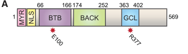

## Question

# Gene Research for Functional Annotation

## ⚠️ CRITICAL: Gene/Protein Identification Context

**BEFORE YOU BEGIN RESEARCH:** You MUST verify you are researching the CORRECT gene/protein. Gene symbols can be ambiguous, especially for less well-characterized genes from non-model organisms.

### Target Gene/Protein Identity (from UniProt):
- **UniProt Accession:** Q01820
- **Protein Description:** RecName: Full=Protein germ cell-less;
- **Gene Information:** Name=gcl; ORFNames=CG8411;
- **Organism (full):** Drosophila melanogaster (Fruit fly).
- **Protein Family:** Not specified in UniProt
- **Key Domains:** BTB/POZ_dom. (IPR000210); Gcl-like. (IPR043380); SKP1/BTB/POZ_sf. (IPR011333); BTB (PF00651)

### MANDATORY VERIFICATION STEPS:

1. **Check if the gene symbol "gcl" matches the protein description above**
2. **Verify the organism is correct:** Drosophila melanogaster (Fruit fly).
3. **Check if protein family/domains align with what you find in literature**
4. **If you find literature for a DIFFERENT gene with the same or similar symbol, STOP**

### If Gene Symbol is Ambiguous or You Cannot Find Relevant Literature:

**DO NOT PROCEED WITH RESEARCH ON A DIFFERENT GENE.** Instead:
- State clearly: "The gene symbol 'gcl' is ambiguous or literature is limited for this specific protein"
- Explain what you found (e.g., "Found extensive literature on a different gene with the same symbol in a different organism")
- Describe the protein based ONLY on the UniProt information provided above
- Suggest that the protein function can be inferred from domain/family information

### Research Target:

Please provide a comprehensive research report on the gene **gcl** (gene ID: gcl, UniProt: Q01820) in DROME.

The research report should be a detailed narrative explaining the function, biological processes, and localization of the gene product. Citations should be given for all claims.

You should prioritize authoritative reviews and primary scientific literature when conducting research. You can supplement
this with annotations you find in gene/protein databases, but these can be outdated or inaccurate.

We are specifically interested in the primary function of the gene - for enzymes, what reaction is catalyzed, and what is the substrate specificity? For transporters, what is the substrate? For structural proteins or adapters, what is the broader structural role? For signaling molecules, what is the role in the pathway.

We are interested in where in or outside the cell the gene product carries out its function.

We are also interested in the signaling or biochemical pathways in which the gene functions. We are less interested in broad pleiotropic effects, except where these elucidate the precise role.

Include evidence where possible. We are interested in both experimental evidence as well as inference from structure, evolution, or bioinformatic analysis. Precise studies should be prioritized over high-throughput, where available.

## Output

Question: You are an expert researcher providing comprehensive, well-cited information.

Provide detailed information focusing on:
1. Key concepts and definitions with current understanding
2. Recent developments and latest research (prioritize 2023-2024 sources)
3. Current applications and real-world implementations
4. Expert opinions and analysis from authoritative sources
5. Relevant statistics and data from recent studies

Format as a comprehensive research report with proper citations. Include URLs and publication dates where available.
Always prioritize recent, authoritative sources and provide specific citations for all major claims.

# Gene Research for Functional Annotation

## ⚠️ CRITICAL: Gene/Protein Identification Context

**BEFORE YOU BEGIN RESEARCH:** You MUST verify you are researching the CORRECT gene/protein. Gene symbols can be ambiguous, especially for less well-characterized genes from non-model organisms.

### Target Gene/Protein Identity (from UniProt):
- **UniProt Accession:** Q01820
- **Protein Description:** RecName: Full=Protein germ cell-less;
- **Gene Information:** Name=gcl; ORFNames=CG8411;
- **Organism (full):** Drosophila melanogaster (Fruit fly).
- **Protein Family:** Not specified in UniProt
- **Key Domains:** BTB/POZ_dom. (IPR000210); Gcl-like. (IPR043380); SKP1/BTB/POZ_sf. (IPR011333); BTB (PF00651)

### MANDATORY VERIFICATION STEPS:

1. **Check if the gene symbol "gcl" matches the protein description above**
2. **Verify the organism is correct:** Drosophila melanogaster (Fruit fly).
3. **Check if protein family/domains align with what you find in literature**
4. **If you find literature for a DIFFERENT gene with the same or similar symbol, STOP**

### If Gene Symbol is Ambiguous or You Cannot Find Relevant Literature:

**DO NOT PROCEED WITH RESEARCH ON A DIFFERENT GENE.** Instead:
- State clearly: "The gene symbol 'gcl' is ambiguous or literature is limited for this specific protein"
- Explain what you found (e.g., "Found extensive literature on a different gene with the same symbol in a different organism")
- Describe the protein based ONLY on the UniProt information provided above
- Suggest that the protein function can be inferred from domain/family information

### Research Target:

Please provide a comprehensive research report on the gene **gcl** (gene ID: gcl, UniProt: Q01820) in DROME.

The research report should be a detailed narrative explaining the function, biological processes, and localization of the gene product. Citations should be given for all claims.

You should prioritize authoritative reviews and primary scientific literature when conducting research. You can supplement
this with annotations you find in gene/protein databases, but these can be outdated or inaccurate.

We are specifically interested in the primary function of the gene - for enzymes, what reaction is catalyzed, and what is the substrate specificity? For transporters, what is the substrate? For structural proteins or adapters, what is the broader structural role? For signaling molecules, what is the role in the pathway.

We are interested in where in or outside the cell the gene product carries out its function.

We are also interested in the signaling or biochemical pathways in which the gene functions. We are less interested in broad pleiotropic effects, except where these elucidate the precise role.

Include evidence where possible. We are interested in both experimental evidence as well as inference from structure, evolution, or bioinformatic analysis. Precise studies should be prioritized over high-throughput, where available.

## Research Report: Functional Annotation of **germ cell-less (gcl)** (CG8411; UniProt Q01820) in *Drosophila melanogaster*

### 0) Mandatory identity verification (to avoid “gcl” symbol ambiguity)
The sources analyzed consistently refer to **germ cell-less (gcl)** as a *D. melanogaster* **maternal germ-plasm determinant required for pole cell/primordial germ cell (PGC) formation**, and explicitly identify it as **CG8411** and a **BTB/POZ-domain protein** that functions with **Cullin-3 (CUL3)** to control germline-versus-soma fate at the posterior pole. This matches the UniProt target described in the prompt (RecName “Protein germ cell-less”; gene name **gcl**; ORFName **CG8411**; BTB/POZ-related domains). (pae2017gclandcul3 pages 4-6, pae2017gclandcul3 pages 1-3, chen2025originandestablishment pages 14-15)

### 1) Key concepts and current understanding (definitions + core model)

#### 1.1 Pole cells / PGCs and the germline–soma boundary
In *Drosophila*, **pole cells** are the earliest specified embryonic germline precursors that bud from the posterior pole, a process requiring germ-plasm-localized determinants and physical furrow constriction (“pole bud” formation) to cellularize PGCs. **gcl** is one of the maternally provided determinants essential for this germline establishment step. (chen2025originandestablishment pages 14-15)

#### 1.2 Primary molecular function: a CUL3 E3 ligase adaptor (“CRL3GCL”) that degrades Torso
A central, well-supported mechanistic model is that **GCL is a substrate-specific adaptor for a Cullin-3 RING E3 ubiquitin ligase complex (CRL3\u1d62\u1d9c\u1d57)**. In this role, GCL binds **CUL3** via its BTB/POZ interface and binds the receptor tyrosine kinase (**RTK**) **Torso** as a substrate, promoting **Torso ubiquitylation and degradation** at the posterior pole to prevent inappropriate somatic signaling in the nascent germline region. (pae2017gclandcul3 pages 1-3, pae2017gclandcul3 pages 3-4, pae2017gclandcul3 pages 4-6)

*Operational definition (functional annotation-ready):* **GCL is a maternal BTB/POZ-BACK adaptor protein whose primary biochemical activity is to recruit Torso RTK to a CUL3-based ubiquitin ligase for localized proteolysis, enabling germline (pole cell) formation.** (pae2017gclandcul3 pages 1-3, pae2017gclandcul3 pages 3-4, pae2017gclandcul3 pages 4-6)

#### 1.3 Domain architecture and targeting signals
GCL is a multi-domain protein with **MYR (myristoylation signal), NLS (nuclear localization signal), BTB/POZ domain, BACK domain, and a conserved “GCL domain”** implicated in substrate recognition. The **BTB** region mediates CUL3 association; mutations in the conserved BTB-associated interaction motif disrupt CUL3 binding, while mutations/deletions in the conserved GCL domain disrupt Torso binding and function. (pae2017gclandcul3 pages 3-4, pae2017gclandcul3 pages 4-6, pae2017gclandcul3 media 958ac770)

#### 1.4 Subcellular localization: nuclear envelope sequestration and mitotic cortical engagement
A key conceptual advance is that GCL is **spatiotemporally controlled by cell cycle-coupled localization**:
- **Interphase:** GCL is sequestered at the **nuclear envelope**.
- **Mitosis / nuclear envelope breakdown:** GCL relocalizes toward the **cortical/plasma membrane**, where it can co-localize with membrane-resident Torso and promote its degradation.
This provides a mechanism for tightly restricting E3 adaptor activity to the right place/time during early embryonic cycles. (pae2017gclandcul3 pages 9-10, pae2017gclandcul3 pages 8-9, pae2017gclandcul3 media 958ac770)

#### 1.5 Additional (historically emphasized) role: transcriptional repression in the nascent germline
Classic work demonstrated that GCL is required for proper **transcriptional quiescence** in pole bud nuclei and can repress a subset of zygotic genes when ectopically localized, linking gcl to the long-standing concept that early germ cells suppress somatic transcriptional programs. (leatherman2002germcelllessacts pages 2-3, leatherman2002germcelllessacts pages 4-5)

### 2) Recent developments and latest research (prioritizing 2023–2024; including authoritative context)

#### 2.1 2023: gcl framed in germline–soma segregation as a localized degradation switch
A 2023 eLife analysis of germline/soma distinction highlights gcl as required during germline establishment, with activities dependent and independent of nuclear-envelope localization, and specifically emphasizes the **Gcl–Cul3 localized degradation mechanism** that mediates a switch between lineages through RTK control. (colonnetta2023germlinesomadistinctionin pages 24-25)

- Publication date / URL: **2023-01**, eLife, https://doi.org/10.7554/eLife.78188 (colonnetta2023germlinesomadistinctionin pages 24-25)

#### 2.2 2024: germ plasm output control (context for gcl; translational and condensate-level regulation)
A 2024 Science Advances study defines a pathway in which **Smaug** attenuates germ plasm accumulation and thereby modulates **PGC number**, and it positions **gcl mRNA** among germ-plasm-localized transcripts within this regulatory landscape (while not providing direct gcl-specific mechanistic measurements in the excerpted evidence). (siddiqui2024smaugregulatesgerm pages 1-2)

- Publication date / URL: **2024-04**, Science Advances, https://doi.org/10.1126/sciadv.adg7894 (siddiqui2024smaugregulatesgerm pages 1-2)

*Interpretation:* For functional annotation, these 2023–2024 studies reinforce that gcl should be treated as a **core germ-plasm determinant** that interfaces with (i) localized protein degradation and (ii) broader germ plasm assembly/translation programs that tune PGC number. (colonnetta2023germlinesomadistinctionin pages 24-25, siddiqui2024smaugregulatesgerm pages 1-2)

#### 2.3 Authoritative synthesis (2025 review; included for “current understanding” even though not 2023–2024)
A 2025 Genetics review (Lehmann lab) summarizes the consensus mechanism that **Gcl is required for pole cell formation but not germplasm assembly**, functions as a **C3 ubiquitin ligase adapter** targeting **Torso** for degradation at the posterior pole, and notes that Torso’s effect is **transcription-independent** (e.g., α-amanitin or MEK/MAPK perturbation not rescuing gcl). (chen2025originandestablishment pages 14-15)

- Publication date / URL: **2025-04**, Genetics, https://doi.org/10.1093/genetics/iyae217 (chen2025originandestablishment pages 14-15)

### 3) Molecular mechanism, pathways, and interaction partners (evidence-driven)

#### 3.1 Direct interaction partners / complex membership
**CUL3** is a direct functional partner: CUL3 co-immunoprecipitates with GCL, and mutations disrupting the canonical BTB–CUL3 interaction motif impair this interaction. (pae2017gclandcul3 pages 3-4)

**Torso RTK** is a direct substrate/target: GCL binds Torso, induces Torso polyubiquitylation, and reduces Torso protein abundance; this effect is blocked by Cullin-RING ligase inhibition (MLN4924), supporting a CUL3-dependent ubiquitylation mechanism. (pae2017gclandcul3 pages 3-4, pae2017gclandcul3 pages 4-6)

#### 3.2 Pathway logic: suppressing Torso to prevent somatic fate at the posterior
Genetic epistasis/rescue supports Torso as the critical antagonistic pathway: reducing Torso pathway activity restores PGC formation in gcl mutants, and conversely Torso variants that evade GCL-mediated degradation can cause dominant PGC defects. (pae2017gclandcul3 pages 6-8, pae2017gclandcul3 pages 8-9)

#### 3.3 Transcriptional repression vs. signaling suppression: two mechanistic “axes” in the literature
- **Transcriptional quiescence axis (classical):** gcl mutants lose pole-bud nuclear transcriptional silencing as measured by RNAPII phospho-Ser2 (H5) staining and derepression of genes normally excluded from pole buds (e.g., sisA/sisB). (leatherman2002germcelllessacts pages 2-3)
- **Somatic signaling suppression axis (modern):** GCL’s best-established biochemical function is as a CRL3 adaptor driving Torso degradation, with evidence that the relevant Torso effect on PGC formation can be transcription-independent in key contexts. (chen2025originandestablishment pages 14-15)

A reconciled annotation interpretation is that **GCL’s primary, direct biochemical activity is CUL3-dependent Torso degradation**, while transcriptional repression phenotypes may reflect downstream consequences of germline establishment failures and/or additional GCL functions linked to nuclear envelope association and chromatin environment. (pae2017gclandcul3 pages 3-4, leatherman2002germcelllessacts pages 2-3, chen2025originandestablishment pages 14-15)

### 4) Subcellular localization and cellular context (where GCL acts)

#### 4.1 Nuclear envelope localization and controlled release
GCL is **nuclear-envelope localized during interphase**, consistent with sequestration and/or nuclear-peripheral functions. During mitosis, after nuclear envelope breakdown, GCL relocates toward the cortex where Torso resides. (pae2017gclandcul3 pages 9-10, pae2017gclandcul3 media 958ac770)

#### 4.2 Membrane targeting is functionally essential
GCL contains a **myristoylation signal (MYR)** required for proper membrane association and function; a myristoylation-site mutant mislocalizes (nucleoplasmic/cytoplasmic rather than properly membrane-associated during mitosis) and fails to support normal PGC formation. (pae2017gclandcul3 pages 9-10)

#### 4.3 Visual evidence (figures)
The domain map (MYR, NLS, BTB, BACK, GCL domain) and the cell-cycle-dependent nuclear-envelope versus cortical localization are directly illustrated in Pae et al. (2017) figures extracted here. (pae2017gclandcul3 media 958ac770, pae2017gclandcul3 media 9546455a)

### 5) Phenotypes, statistics, and quantitative data from studies

#### 5.1 Quantitative transcriptional-silencing defects (classic; direct measurements)
In **gcl** embryos, only **11.9%** of pole bud nuclei showed reduced H5 staining (RNAPII pSer2) (**n = 194 nuclei**). In **50%** of gcl embryos, **none** of the pole bud nuclei showed reduced H5 staining (**n = 20 embryos**). At blastoderm stage, **~48%** of gcl embryos lacked pole cells, and gcl embryos averaged **~2.8 pole cells**. (leatherman2002germcelllessacts pages 2-3)

- Publication date / URL: **2002-10**, Current Biology, https://doi.org/10.1016/S0960-9822(02)01182-X (leatherman2002germcelllessacts pages 2-3)

#### 5.2 Quantitative genetic rescue logic (PGC counts; Torso suppression rescues)
In Pae et al. (2017), **PGC numbers were quantified per embryo** with nonparametric statistics (Mann–Whitney test reported), and **lowering Torso pathway activity** (e.g., via upstream Torso pathway components) **restored PGC formation and division** in gcl mutants. (pae2017gclandcul3 pages 6-8)

- Publication date / URL: **2017-07**, Developmental Cell, https://doi.org/10.1016/j.devcel.2017.06.022 (pae2017gclandcul3 pages 6-8)

#### 5.3 Quantitative signaling-to-phenotype linkage (recent preprint; included for data richness)
Optogenetic Ras activation at the syncytial stage caused **PGC loss in 90%** of activated embryos (vs **20%** in dark-treated controls and **0%** in w\u22121118 controls). In the same study’s genetic perturbations, **ras knockdown increased PGC number by ~30%**, and expression of **Ras-G37 reduced PGCs by 57.5%**; multiple RNAi knockdowns (torso/shc/sos/ras) restored PGC formation in gcl\u2212/\u2212 embryos while canonical Raf/MEK/ERK components did not, supporting a noncanonical pathway logic downstream of Torso relevant to pole bud cellularization. (saiduddin2025gclpruningof pages 4-8)

- Publication date / URL: **2025-12**, bioRxiv, https://doi.org/10.64898/2025.12.30.697122 (saiduddin2025gclpruningof pages 4-8)

### 6) Current applications and real-world implementations

1. **Developmental mechanism dissection (germline vs soma fate):** gcl is actively used as a genetic entry point to dissect how localized determinants prevent somatic signaling at the posterior pole (through Torso degradation) and how early embryos establish a physical and molecular boundary between germline and soma. (pae2017gclandcul3 pages 1-3, chen2025originandestablishment pages 14-15)

2. **Model for spatially restricted ubiquitin-mediated signaling control:** the GCL–CUL3–Torso axis is a well-characterized example of **cell-cycle gated, compartment-specific E3-adaptor function** in vivo (nuclear envelope sequestration followed by mitotic cortical access), serving as a conceptual template for regulated substrate adaptor activity in development. (pae2017gclandcul3 pages 9-10, pae2017gclandcul3 media 958ac770)

3. **Quantitative imaging pipelines for germline determinants:** recent work describes reproducible workflows to quantify Gcl signal at the nuclear membrane in PGCs using confocal stacks and signal-to-noise calculations (SNR) with defined sampling (e.g., 10 PGCs per embryo). (das2025casparmodulatesprimordial pages 18-21)

### 7) Expert opinions / authoritative analysis (what leaders emphasize)
- **Lehmann lab synthesis (Genetics review):** emphasizes that Gcl is **required for pole cell formation but not germ plasm assembly**, and that its key mechanistic action is **Torso degradation** at the posterior pole with consequences for pole bud constriction and lineage segregation; also notes that attempts to rescue via transcription inhibition were unsuccessful in key experiments, pushing interpretation toward a signaling/morphogenetic mechanism. (chen2025originandestablishment pages 14-15)
- **eLife 2023 framing:** positions gcl within the broader regulatory architecture establishing germline/soma distinction, linking it to localized degradation machinery and nuclear-envelope-associated functions. (colonnetta2023germlinesomadistinctionin pages 24-25)

### 8) Concise functional annotation (recommended wording)
**Protein (GCL; UniProt Q01820) is a maternal BTB/POZ-BACK adaptor that assembles a CUL3-based E3 ubiquitin ligase (CRL3\u1d62\u1d9c\u1d57) to ubiquitylate and degrade the Torso receptor tyrosine kinase at the posterior pole; GCL cycles from nuclear envelope (interphase) to cortical membrane (mitosis) to access Torso. This localized proteolysis suppresses somatic signaling, supports pole bud constriction/cellularization, and enables primordial germ cell (pole cell) specification; gcl mutants show severe reduction/absence of PGCs and loss of pole-bud transcriptional quiescence.** (pae2017gclandcul3 pages 3-4, pae2017gclandcul3 pages 9-10, pae2017gclandcul3 pages 6-8, leatherman2002germcelllessacts pages 2-3)

### Summary table of evidence
The following table consolidates domains, mechanisms, localization, phenotypes, and quantitative evidence with direct source traceability.

| Annotation aspect | Key finding for **D. melanogaster gcl / germ cell-less (CG8411, UniProt Q01820)** | Quantitative / experimental detail | Strongest source(s): year, venue, URL |
|---|---|---|---|
| Target identity verification | The literature-matched target is **Drosophila melanogaster germ cell-less (gcl)**, a maternal-effect germ-plasm component required for pole cell/PGC formation; this matches the UniProt description for Q01820 and should be distinguished from unrelated **gcl** symbols in other organisms. | Review and primary literature consistently describe **gcl** as a Drosophila posterior/germ-plasm factor needed during germline establishment. (chen2025originandestablishment pages 14-15, colonnetta2023germlinesomadistinctionin pages 24-25) | **2025, Genetics** — Chen et al., *Origin and establishment of the germline in Drosophila melanogaster* — https://doi.org/10.1093/genetics/iyae217; **2023, eLife** — Colonnetta et al. — https://doi.org/10.7554/eLife.78188 |
| Primary molecular function | **GCL is a substrate adaptor for a Cullin-3 RING E3 ligase complex (CRL3^GCL)** that promotes posterior-specific degradation of the RTK **Torso**, thereby suppressing somatic signaling and permitting primordial germ cell formation. | GCL induces Torso ubiquitylation and lowers Torso protein levels; inhibition of Cullin-RING ligases with **MLN4924** blocks this effect. Loss of gcl causes severe PGC defects; reducing Torso activity rescues the defect. (pae2017gclandcul3 pages 1-3, pae2017gclandcul3 pages 3-4, pae2017gclandcul3 pages 4-6, pae2017gclandcul3 pages 6-8) | **2017, Developmental Cell** — Pae et al., *GCL and CUL3 Control the Switch between Cell Lineages by Mediating Localized Degradation of an RTK* — https://doi.org/10.1016/j.devcel.2017.06.022 |
| Domains / motifs | GCL contains **MYR (myristoylation signal), NLS (nuclear localization signal), BTB/POZ domain, BACK domain, and a conserved GCL domain**; the BTB region mediates CUL3 association, while the GCL domain contributes to substrate recognition. | The **E100K** substitution in the conserved **f-x-E motif** disrupts GCL–CUL3 binding; deletion/mutation in the GCL domain impairs Torso binding/downregulation and fails to rescue PGC formation. Figure-based domain architecture explicitly includes MYR, NLS, BTB, BACK, GCL domain. (pae2017gclandcul3 pages 3-4, pae2017gclandcul3 pages 4-6, pae2017gclandcul3 media 958ac770) | **2017, Developmental Cell** — Pae et al. — https://doi.org/10.1016/j.devcel.2017.06.022 |
| Torso pathway target | The best-supported direct target is **Torso RTK**. GCL binds Torso, promotes its ubiquitylation, and depletes Torso specifically where germline fate must be protected. | A **Torso degron mutant (torsoDeg)** loses GCL binding, resists CRL3^GCL-mediated ubiquitylation, and causes a **dominant PGC formation defect** when maternally inherited. (pae2017gclandcul3 pages 4-6, pae2017gclandcul3 pages 10-12, pae2017gclandcul3 pages 8-9, chen2025originandestablishment pages 14-15) | **2017, Developmental Cell** — Pae et al. — https://doi.org/10.1016/j.devcel.2017.06.022; **2025, Genetics** — Chen et al. — https://doi.org/10.1093/genetics/iyae217 |
| PI3K / PIP3 mechanism | Newer work places GCL upstream of membrane lipid patterning: by suppressing Torso, GCL establishes a **PIP3-low posterior membrane domain**, enabling **Myosin II** recruitment and constriction of pole buds. | In **gcl-/-** embryos, posterior **PIP3** is elevated, myosin II membrane recruitment is reduced, and pole buds are flatter/shorter; knockdown of **torso/shc/sos/ras** restores PGC formation, while canonical **MEK/MAPK** knockdown does not. **ras** knockdown increased PGC number by **~30%**; **Ras-G37** caused a **57.5% reduction** in PGCs. (saiduddin2025gclpruningof pages 15-18, saiduddin2025gclpruningof pages 4-8) | **2025, bioRxiv** — Saiduddin et al., *GCL pruning of PIP3 establishes the soma-germline boundary* — https://doi.org/10.64898/2025.12.30.697122 |
| Subcellular localization dynamics | GCL shows striking cell-cycle-dependent localization: it is sequestered at the **nuclear envelope** during interphase, then after nuclear-envelope breakdown in mitosis relocates toward the **cortical/plasma membrane**, where it can encounter Torso. | HA-GCL^WT localizes to nuclear membrane during interphase; after mitotic NE breakdown it moves near submembranous F-actin and co-localizes with Torso at the plasma membrane. Figure evidence summarizes nuclear-envelope versus cortical localization. (pae2017gclandcul3 pages 9-10, pae2017gclandcul3 pages 8-9, pae2017gclandcul3 media 958ac770) | **2017, Developmental Cell** — Pae et al. — https://doi.org/10.1016/j.devcel.2017.06.022 |
| Localization determinants | Both membrane and nuclear targeting are functionally important. The **MYR** motif supports membrane association, while the **NLS** sequesters GCL at nuclei to restrict when/where Torso degradation occurs. | **GCL^G2A** (myristoylation-site mutant) is nucleoplasmic/cytoplasmic rather than membrane-associated and fails to support PGC formation efficiently. Removing the **NLS** causes dominant gain-of-function/oogenesis defects, alleviated by reducing **cul3** dosage. (pae2017gclandcul3 pages 9-10, pae2017gclandcul3 pages 10-12) | **2017, Developmental Cell** — Pae et al. — https://doi.org/10.1016/j.devcel.2017.06.022 |
| Role in transcriptional repression | Earlier work showed GCL also promotes **transcriptional quiescence** in pole-bud nuclei and can repress a subset of zygotic genes when ectopically localized, suggesting a second, partly independent function linked to germline establishment. | In controls, ~**99%** of pole-bud nuclei showed reduced H5 (active RNAPII) staining; in **gcl** embryos only **11.9%** of pole-bud nuclei had reduced H5 staining (**n = 194 nuclei**), and in **50%** of gcl embryos no pole-bud nuclei showed reduced H5 (**n = 20 embryos**). GCL ectopically repressed **sisA, sisB, tll, hkb** but not all genes tested. (leatherman2002germcelllessacts pages 2-3, leatherman2002germcelllessacts pages 3-4, leatherman2002germcelllessacts pages 4-5, leatherman2002germcelllessacts pages 1-2) | **2002, Current Biology** — Leatherman et al., *germ cell-less Acts to Repress Transcription during the Establishment of the Drosophila Germ Cell Lineage* — https://doi.org/10.1016/S0960-9822(02)01182-X |
| Pole cell / PGC phenotype | Maternal loss of **gcl** disrupts or abolishes pole cell formation; gcl is required for the establishment, not assembly, of the germline. | Classical quantification: **~48%** of gcl embryos had **no pole cells** at blastoderm stage, and blastoderm-stage gcl embryos averaged **~2.8 pole cells**. In later work, reducing Torso activity restored PGC formation and PGC division in gcl mutants. (leatherman2002germcelllessacts pages 2-3, pae2017gclandcul3 pages 6-8, chen2025originandestablishment pages 14-15) | **2002, Current Biology** — Leatherman et al. — https://doi.org/10.1016/S0960-9822(02)01182-X; **2017, Developmental Cell** — Pae et al. — https://doi.org/10.1016/j.devcel.2017.06.022 |
| Relationship to germ plasm / translation | **gcl mRNA** is a **germplasm-localized transcript** that is translationally repressed in soma and translated specifically in germplasm in a **3′UTR-dependent** manner. | 2025 review notes that **gcl** lacks canonical **Smaug recognition elements (SREs)** and that the cis-elements/repressors controlling its embryonic translational derepression remain unresolved. (chen2025originandestablishment pages 10-11) | **2025, Genetics** — Chen et al. — https://doi.org/10.1093/genetics/iyae217 |
| 2023–2024 context / current understanding | Recent work on germline–soma segregation and germ-granule regulation continues to place **gcl** among core maternal germ-plasm determinants, though most new direct mechanistic advances center on Torso/PI3K signaling and translational control of germ-plasm output rather than on new GCL biochemistry. | 2024 Science Advances shows Smaug tunes germ-plasm output and PGC number; **gcl** is listed among germ-plasm mRNAs and may be subject to post-transcriptional regulation, but direct quantitative effects on gcl were not resolved in the excerpt. (siddiqui2024smaugregulatesgerm pages 1-2) | **2024, Science Advances** — Siddiqui et al., *Smaug regulates germ plasm assembly and primordial germ cell number in Drosophila embryos* — https://doi.org/10.1126/sciadv.adg7894 |
| Best concise functional annotation | **GCL is a maternal BTB/POZ-BACK adaptor protein that cycles between nuclear envelope and posterior cortex to direct CUL3-dependent destruction of Torso, suppress PI3K/PIP3-rich somatic membrane behavior, and enable pole-bud constriction and PGC specification; it also contributes to transcriptional silencing in nascent germ cells.** | Integrates biochemical, imaging, genetic rescue, and classical transcription-silencing phenotypes. (pae2017gclandcul3 pages 1-3, pae2017gclandcul3 pages 9-10, pae2017gclandcul3 pages 3-4, saiduddin2025gclpruningof pages 15-18, leatherman2002germcelllessacts pages 2-3) | **2017, Developmental Cell** — https://doi.org/10.1016/j.devcel.2017.06.022; **2025, bioRxiv** — https://doi.org/10.64898/2025.12.30.697122; **2002, Current Biology** — https://doi.org/10.1016/S0960-9822(02)01182-X |

*Table: This table summarizes the strongest functional-annotation evidence for Drosophila melanogaster germ cell-less (gcl), integrating domain architecture, molecular mechanism, localization, pathway targets, and quantitative phenotypes. It is useful as a source-traceable overview for report writing or annotation review.*

### Key references (with URLs and publication dates)
- Colonnetta MM, Schedl P, Deshpande G. **2023-01**. *eLife*. “Germline/soma distinction in Drosophila embryos requires regulators of zygotic genome activation.” https://doi.org/10.7554/eLife.78188 (colonnetta2023germlinesomadistinctionin pages 24-25)
- Siddiqui NU et al. **2024-04**. *Science Advances*. “Smaug regulates germ plasm assembly and primordial germ cell number in Drosophila embryos.” https://doi.org/10.1126/sciadv.adg7894 (siddiqui2024smaugregulatesgerm pages 1-2)
- Pae J et al. **2017-07**. *Developmental Cell*. “GCL and CUL3 Control the Switch between Cell Lineages by Mediating Localized Degradation of an RTK.” https://doi.org/10.1016/j.devcel.2017.06.022 (pae2017gclandcul3 pages 1-3)
- Leatherman JL et al. **2002-10**. *Current Biology*. “germ cell-less Acts to Repress Transcription during the Establishment of the Drosophila Germ Cell Lineage.” https://doi.org/10.1016/S0960-9822(02)01182-X (leatherman2002germcelllessacts pages 2-3)
- Chen R et al. **2025-04**. *Genetics* (review). “Origin and establishment of the germline in Drosophila melanogaster.” https://doi.org/10.1093/genetics/iyae217 (chen2025originandestablishment pages 14-15)

References

1. (pae2017gclandcul3 pages 4-6): Juhee Pae, Ryan M. Cinalli, Antonio Marzio, Michele Pagano, and Ruth Lehmann. Gcl and cul3 control the switch between cell lineages by mediating localized degradation of an rtk. Developmental cell, 42 2:130-142.e7, Jul 2017. URL: https://doi.org/10.1016/j.devcel.2017.06.022, doi:10.1016/j.devcel.2017.06.022. This article has 54 citations and is from a highest quality peer-reviewed journal.

2. (pae2017gclandcul3 pages 1-3): Juhee Pae, Ryan M. Cinalli, Antonio Marzio, Michele Pagano, and Ruth Lehmann. Gcl and cul3 control the switch between cell lineages by mediating localized degradation of an rtk. Developmental cell, 42 2:130-142.e7, Jul 2017. URL: https://doi.org/10.1016/j.devcel.2017.06.022, doi:10.1016/j.devcel.2017.06.022. This article has 54 citations and is from a highest quality peer-reviewed journal.

3. (chen2025originandestablishment pages 14-15): Ruoyu Chen, Sherilyn Grill, Benjamin Lin, Mariyah Saiduddin, and Ruth Lehmann. Origin and establishment of the germline in drosophila melanogaster. Genetics, Apr 2025. URL: https://doi.org/10.1093/genetics/iyae217, doi:10.1093/genetics/iyae217. This article has 14 citations and is from a domain leading peer-reviewed journal.

4. (pae2017gclandcul3 pages 3-4): Juhee Pae, Ryan M. Cinalli, Antonio Marzio, Michele Pagano, and Ruth Lehmann. Gcl and cul3 control the switch between cell lineages by mediating localized degradation of an rtk. Developmental cell, 42 2:130-142.e7, Jul 2017. URL: https://doi.org/10.1016/j.devcel.2017.06.022, doi:10.1016/j.devcel.2017.06.022. This article has 54 citations and is from a highest quality peer-reviewed journal.

5. (pae2017gclandcul3 media 958ac770): Juhee Pae, Ryan M. Cinalli, Antonio Marzio, Michele Pagano, and Ruth Lehmann. Gcl and cul3 control the switch between cell lineages by mediating localized degradation of an rtk. Developmental cell, 42 2:130-142.e7, Jul 2017. URL: https://doi.org/10.1016/j.devcel.2017.06.022, doi:10.1016/j.devcel.2017.06.022. This article has 54 citations and is from a highest quality peer-reviewed journal.

6. (pae2017gclandcul3 pages 9-10): Juhee Pae, Ryan M. Cinalli, Antonio Marzio, Michele Pagano, and Ruth Lehmann. Gcl and cul3 control the switch between cell lineages by mediating localized degradation of an rtk. Developmental cell, 42 2:130-142.e7, Jul 2017. URL: https://doi.org/10.1016/j.devcel.2017.06.022, doi:10.1016/j.devcel.2017.06.022. This article has 54 citations and is from a highest quality peer-reviewed journal.

7. (pae2017gclandcul3 pages 8-9): Juhee Pae, Ryan M. Cinalli, Antonio Marzio, Michele Pagano, and Ruth Lehmann. Gcl and cul3 control the switch between cell lineages by mediating localized degradation of an rtk. Developmental cell, 42 2:130-142.e7, Jul 2017. URL: https://doi.org/10.1016/j.devcel.2017.06.022, doi:10.1016/j.devcel.2017.06.022. This article has 54 citations and is from a highest quality peer-reviewed journal.

8. (leatherman2002germcelllessacts pages 2-3): Judith L. Leatherman, Lissa Levin, Julie Boero, and Thomas A. Jongens. Germ cell-less acts to repress transcription during the establishment of the drosophila germ cell lineage. Current Biology, 12:1681-1685, Oct 2002. URL: https://doi.org/10.1016/s0960-9822(02)01182-x, doi:10.1016/s0960-9822(02)01182-x. This article has 98 citations and is from a highest quality peer-reviewed journal.

9. (leatherman2002germcelllessacts pages 4-5): Judith L. Leatherman, Lissa Levin, Julie Boero, and Thomas A. Jongens. Germ cell-less acts to repress transcription during the establishment of the drosophila germ cell lineage. Current Biology, 12:1681-1685, Oct 2002. URL: https://doi.org/10.1016/s0960-9822(02)01182-x, doi:10.1016/s0960-9822(02)01182-x. This article has 98 citations and is from a highest quality peer-reviewed journal.

10. (colonnetta2023germlinesomadistinctionin pages 24-25): Megan M Colonnetta, Paul Schedl, and Girish Deshpande. Germline/soma distinction in drosophila embryos requires regulators of zygotic genome activation. eLife, Jan 2023. URL: https://doi.org/10.7554/elife.78188, doi:10.7554/elife.78188. This article has 11 citations and is from a domain leading peer-reviewed journal.

11. (siddiqui2024smaugregulatesgerm pages 1-2): Najeeb U. Siddiqui, Angelo Karaiskakis, Aaron L. Goldman, Whitby V. I. Eagle, Timothy C. H. Low, Hua Luo, Craig A. Smibert, Elizabeth R. Gavis, and Howard D. Lipshitz. Smaug regulates germ plasm assembly and primordial germ cell number in drosophila embryos. Science Advances, Apr 2024. URL: https://doi.org/10.1126/sciadv.adg7894, doi:10.1126/sciadv.adg7894. This article has 8 citations and is from a highest quality peer-reviewed journal.

12. (pae2017gclandcul3 pages 6-8): Juhee Pae, Ryan M. Cinalli, Antonio Marzio, Michele Pagano, and Ruth Lehmann. Gcl and cul3 control the switch between cell lineages by mediating localized degradation of an rtk. Developmental cell, 42 2:130-142.e7, Jul 2017. URL: https://doi.org/10.1016/j.devcel.2017.06.022, doi:10.1016/j.devcel.2017.06.022. This article has 54 citations and is from a highest quality peer-reviewed journal.

13. (pae2017gclandcul3 media 9546455a): Juhee Pae, Ryan M. Cinalli, Antonio Marzio, Michele Pagano, and Ruth Lehmann. Gcl and cul3 control the switch between cell lineages by mediating localized degradation of an rtk. Developmental cell, 42 2:130-142.e7, Jul 2017. URL: https://doi.org/10.1016/j.devcel.2017.06.022, doi:10.1016/j.devcel.2017.06.022. This article has 54 citations and is from a highest quality peer-reviewed journal.

14. (saiduddin2025gclpruningof pages 4-8): Mariyah Saiduddin, Juhee Pae, Asier M. Vidal, Marty Alani, and Ruth Lehmann. Gcl pruning of pip3 establishes the soma-germline boundary. bioRxiv, Dec 2025. URL: https://doi.org/10.64898/2025.12.30.697122, doi:10.64898/2025.12.30.697122. This article has 0 citations.

15. (das2025casparmodulatesprimordial pages 18-21): Subhradip Das, Adheena Elsa Roy, Kanika K, Girish Deshpande, and Girish S. Ratnaparkhi. Caspar modulates primordial germ cell fate both in an oskar-dependent and oskar-independent manner. Biology Open, Jul 2025. URL: https://doi.org/10.1242/bio.062119, doi:10.1242/bio.062119. This article has 1 citations and is from a peer-reviewed journal.

16. (pae2017gclandcul3 pages 10-12): Juhee Pae, Ryan M. Cinalli, Antonio Marzio, Michele Pagano, and Ruth Lehmann. Gcl and cul3 control the switch between cell lineages by mediating localized degradation of an rtk. Developmental cell, 42 2:130-142.e7, Jul 2017. URL: https://doi.org/10.1016/j.devcel.2017.06.022, doi:10.1016/j.devcel.2017.06.022. This article has 54 citations and is from a highest quality peer-reviewed journal.

17. (saiduddin2025gclpruningof pages 15-18): Mariyah Saiduddin, Juhee Pae, Asier M. Vidal, Marty Alani, and Ruth Lehmann. Gcl pruning of pip3 establishes the soma-germline boundary. bioRxiv, Dec 2025. URL: https://doi.org/10.64898/2025.12.30.697122, doi:10.64898/2025.12.30.697122. This article has 0 citations.

18. (leatherman2002germcelllessacts pages 3-4): Judith L. Leatherman, Lissa Levin, Julie Boero, and Thomas A. Jongens. Germ cell-less acts to repress transcription during the establishment of the drosophila germ cell lineage. Current Biology, 12:1681-1685, Oct 2002. URL: https://doi.org/10.1016/s0960-9822(02)01182-x, doi:10.1016/s0960-9822(02)01182-x. This article has 98 citations and is from a highest quality peer-reviewed journal.

19. (leatherman2002germcelllessacts pages 1-2): Judith L. Leatherman, Lissa Levin, Julie Boero, and Thomas A. Jongens. Germ cell-less acts to repress transcription during the establishment of the drosophila germ cell lineage. Current Biology, 12:1681-1685, Oct 2002. URL: https://doi.org/10.1016/s0960-9822(02)01182-x, doi:10.1016/s0960-9822(02)01182-x. This article has 98 citations and is from a highest quality peer-reviewed journal.

20. (chen2025originandestablishment pages 10-11): Ruoyu Chen, Sherilyn Grill, Benjamin Lin, Mariyah Saiduddin, and Ruth Lehmann. Origin and establishment of the germline in drosophila melanogaster. Genetics, Apr 2025. URL: https://doi.org/10.1093/genetics/iyae217, doi:10.1093/genetics/iyae217. This article has 14 citations and is from a domain leading peer-reviewed journal.

## Artifacts

- [Edison artifact artifact-00](gcl-deep-research-falcon_artifacts/artifact-00.md)

## Citations

1. chen2025originandestablishment pages 14-15
2. colonnetta2023germlinesomadistinctionin pages 24-25
3. siddiqui2024smaugregulatesgerm pages 1-2
4. leatherman2002germcelllessacts pages 2-3
5. saiduddin2025gclpruningof pages 4-8
6. das2025casparmodulatesprimordial pages 18-21
7. chen2025originandestablishment pages 10-11
8. leatherman2002germcelllessacts pages 4-5
9. saiduddin2025gclpruningof pages 15-18
10. leatherman2002germcelllessacts pages 3-4
11. leatherman2002germcelllessacts pages 1-2
12. https://doi.org/10.7554/eLife.78188
13. https://doi.org/10.1126/sciadv.adg7894
14. https://doi.org/10.1093/genetics/iyae217
15. https://doi.org/10.1016/S0960-9822(02
16. https://doi.org/10.1016/j.devcel.2017.06.022
17. https://doi.org/10.64898/2025.12.30.697122
18. https://doi.org/10.1093/genetics/iyae217;
19. https://doi.org/10.1016/j.devcel.2017.06.022;
20. https://doi.org/10.64898/2025.12.30.697122;
21. https://doi.org/10.1016/j.devcel.2017.06.022,
22. https://doi.org/10.1093/genetics/iyae217,
23. https://doi.org/10.1016/s0960-9822(02
24. https://doi.org/10.7554/elife.78188,
25. https://doi.org/10.1126/sciadv.adg7894,
26. https://doi.org/10.64898/2025.12.30.697122,
27. https://doi.org/10.1242/bio.062119,